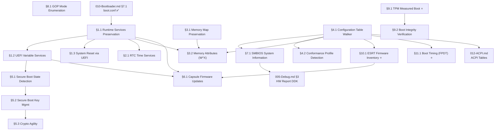

# 046-UEFI — Unified Extensible Firmware Interface Subsystem

> **Goal:** Evolve from the current minimal UEFI usage (GOP framebuffer init +
> `ExitBootServices()` in the bootloader) into a full UEFI subsystem that
> preserves runtime services, implements Secure Boot verification, manages
> UEFI variables, provides firmware update capsule support, and leverages
> memory attribute tables for W^X enforcement — per the UEFI 2.10 specification.

> [!CAUTION]
> **Memory Rule:** Use `pmm_alloc_contiguous()` for ALL buffers > 4 KB (UEFI memory maps, variable storage buffers). `kmalloc` is ONLY for small kernel structs (≤ 4 KB). See `rules.md` Known Gotchas.

> [!IMPORTANT]
> **Spec Reference:** All protocol GUIDs, table layouts, and service definitions reference the
> [UEFI 2.10 Specification](file:///home/derickpayne/impossible-os/specs/firmware/uefi-2.10.md)
> summary in the repo at `specs/firmware/uefi-2.10.md`.

> [!NOTE]
> **Cross-references:**
> - [TODO-010-Bootloader.md](TODO-010-Bootloader.md) — Current UEFI bootloader (✅ Done: GOP, memory map, ExitBootServices)
> - [TODO-012-ACPI.md](TODO-012-ACPI.md) — ACPI tables discovered via UEFI Configuration Table
> - [TODO-060-PCI.md §4.1](TODO-060-PCI.md) — PCIe ECAM via MCFG (found in UEFI config table)
> - [TODO-043-x86-64.md §8](TODO-043-x86-64.md) — Security extensions (SMEP/SMAP/CET complement Secure Boot)
> - [TODO-550-Installer-ISO.md](../510-Long-Term-Stretch/TODO-550-Installer-ISO.md) — UEFI boot media creation

---

## TODO Completion Roadmap (Cross-File)

> [!IMPORTANT]
> **This file is part of the Bootloader subsystem.** Its sections have internal
> dependencies (runtime services → variables → reset) and external dependencies
> to `TODO-010-Bootloader.md`, `TODO-005-Debug.md`, and `TODO-012-ACPI.md`.
> This roadmap shows the correct sequence.

### Dependency Graph

### Phase-by-Phase Implementation Order

| ⭐ | Phase | Section                          | What It Delivers                                         | Depends On                       | Status |
| -- | :----: | -------------------------------- | -------------------------------------------------------- | -------------------------------- | :----: |
| 💎 | **1** | §3.1 Memory Map Preservation     | Full UEFI memory type info for PMM (runtime, ACPI, MMIO) | —                                |   ✅   |
| 💎 | **1** | §4.1 Configuration Table Walker  | Find ACPI, SMBIOS, MemAttr, ESRT, FPDT tables by GUID    | —                                |   ✅   |
| 💎 | **2** | §1.1 Runtime Services            | `SetVirtualAddressMap()` + runtime function pointers     | Phase 1 (§3.1)                   |   ⬜   |
| 💎 | **2** | §4.2 Conformance Profiles        | Know if firmware is full UEFI or reduced (EBBR)          | Phase 1 (§4.1)                   |   ⬜   |
| ⭐ | **2** | §9.1 TPM Measured Boot           | TCG event log + PCR values before ExitBootServices       | —                                |   ⬜   |
| ⭐ | **2** | §10.1 ESRT Firmware Inventory    | Firmware version tracking + update health                | Phase 1 (§4.1)                   |   ⬜   |
| ⭐ | **2** | §11.1 Boot Timing (FPDT)         | Full power-on-to-desktop boot timeline                   | Phase 1 (§4.1)                   |   ⬜   |
| 💎 | **3** | §1.2 UEFI Variable Services      | GetVariable/SetVariable/Enumerate wrappers               | Phase 2 (§1.1)                   |   ⬜   |
| 💎 | **3** | §1.3 System Reset via UEFI       | Clean ResetSystem() shutdown/reboot                      | Phase 2 (§1.1)                   |   ⬜   |
| 💎 | **3** | §2.1 RTC Time Services           | GetTime/SetTime for kernel wall clock                    | Phase 2 (§1.1)                   |   ⬜   |
| 💎 | **3** | §3.2 Memory Attributes (W^X)     | NX enforcement on runtime memory                         | Phase 1 + Phase 2 (§1.1)         |   ⬜   |
| 💎 | **4** | §5.1 Secure Boot State Detection | SecureBoot/SetupMode UEFI variable read                  | Phase 3 (§1.2)                   |   ⬜   |
| 💎 | **4** | §7.1 SMBIOS System Information   | System manufacturer, model, RAM, BIOS version            | Phase 1 (§4.1)                   |   ⬜   |
| 💎 | **5** | §5.2 Secure Boot Key Management  | Read/update db/dbx trust databases                       | Phase 4 (§5.1)                   |   ⬜   |
| 💎 | **5** | §8.1 GOP Mode Enumeration        | Multi-resolution, multi-monitor                          | — (independent)                  |   ⬜   |
| 💎 | **5** | §9.2 Boot Integrity Verification | PCR golden value comparison + UI panel                   | Phase 2 (§9.1)                   |   ⬜   |
| 💎 | **6** | §5.3 Crypto Agility              | 2026 certificate rollover preparedness                   | Phase 5 (§5.2)                   |   ⬜   |
| 💎 | **6** | §6.1 Capsule Firmware Updates    | In-band BIOS update from OS                              | Phase 2 (§1.1) + Phase 3 (§1.2)  |   ⬜   |

> [!NOTE]
> **Phases 1–2** are the foundation. Runtime services, config table walker, and ⭐ features unblock everything else.
> **Phase 3** delivers the core runtime wrappers (variables, reset, RTC, W^X).
> **Phases 4–5** add security (Secure Boot), hardware inventory (SMBIOS), and boot integrity verification.
> **Phase 6** is stretch/future work (Crypto Agility 2026, Capsule Updates).

> [!TIP]
> **Quick wins in Phase 2:**
> - §9.1 TPM, §10.1 ESRT, and §11.1 FPDT only need Boot Services (before ExitBootServices)
>   — no dependency on runtime services. They can run in parallel with §1.1.
> - §8.1 GOP Mode Enumeration has no internal dependencies — do it any time.
> - §7.1 SMBIOS is a high-value quick win after §4.1 — populates the HW Report DDK.

> [!WARNING]
> **§1.1 Runtime Services** changes the memory layout. After calling `SetVirtualAddressMap()`,
> all runtime service pointers are relocated to virtual addresses. This call is **irreversible**
> and can only be made **once**. Test carefully with QEMU/OVMF before any hardware testing.

---

## 1. UEFI Runtime Services

### 1.1 Runtime Services Preservation

**Prompt:** Verify the UEFI Runtime Services preservation implementation. Confirm that `efi.h` defines the full `EFI_RUNTIME_SERVICES` struct with all 14 function pointers (Time, Variable, Reset, Capsule, SVAM) and `EFI_MEMORY_RUNTIME` attribute flag. Confirm `bootx64.c` saves the `RuntimeServices` pointer, `desc_size`, and `desc_version` to `boot_info` before `ExitBootServices()`, and `fill_runtime_map()` extracts `EfiRuntimeServicesCode`/`Data` regions. Confirm `uefi_runtime.c` calls `SetVirtualAddressMap()` with identity mapping (virt = phys), reads `EFI_RT_PROPERTIES_TABLE` for supported service bitmask, and logs active services. Confirm `boot_hw.c` calls `uefi_runtime_init()` after `uefi_config_init()`. Run `bash scripts/build.sh clean` and verify `=== BUILD OK ===`. Check commit `"uefi: runtime services preservation"` exists.

> [!NOTE]
> **Implementation notes:**
> - `EFI_RUNTIME_SERVICES` struct defined in both `efi.h` (bootloader) and `uefi_runtime.c` (kernel) with matching layouts
> - Identity mapping used for `SetVirtualAddressMap()` (virt = phys) — safe because kernel maps first 4 GiB
> - `boot_info` carries RT pointer + runtime memory map (`rt_mmap[]`, up to 64 entries) + descriptor metadata
> - Bootloader `struct boot_info` in `bootx64.c` must mirror kernel's `boot_info.h` exactly — both updated
> - `EFI_RT_PROPERTIES_TABLE` lookup via `uefi_find_config_table()` — if absent, all services assumed supported
> - All runtime service calls serialized via `SPINLOCK_INIT` spinlock (firmware is not reentrant)
> - OVMF returns 4 runtime regions, all 6 tested services available

- [x] Preserve `EFI_RUNTIME_SERVICES` pointer from `EFI_SYSTEM_TABLE` before `ExitBootServices()`
- [x] Save UEFI memory map (with descriptors marked `EFI_MEMORY_RUNTIME`)
- [x] Identify all runtime memory regions from `GetMemoryMap()`:
  - [x] `EfiRuntimeServicesCode` — firmware code that survives ExitBootServices
  - [x] `EfiRuntimeServicesData` — firmware data that survives ExitBootServices
- [x] Call `SetVirtualAddressMap()` early in kernel init:
  - [x] Map all runtime regions into kernel virtual address space
  - [x] Firmware relocates its internal pointers to match new virtual addresses
  - [x] This call can only be made ONCE — it's irreversible
- [x] Store runtime services function pointers in kernel global:
  - [x] `uefi_rt->GetTime()`, `uefi_rt->SetTime()`
  - [x] `uefi_rt->GetVariable()`, `uefi_rt->SetVariable()`
  - [x] `uefi_rt->GetNextVariableName()`
  - [x] `uefi_rt->ResetSystem()`
  - [x] `uefi_rt->UpdateCapsule()`
- [x] Check `EFI_RT_PROPERTIES_TABLE` (if present) for supported service bitmask:
  - [x] `EFI_RT_SUPPORTED_GET_TIME` (0x0001)
  - [x] `EFI_RT_SUPPORTED_SET_VARIABLE` (0x0040)
  - [x] etc. — gracefully handle unsupported services returning `EFI_UNSUPPORTED`
- [x] Serialize all runtime service calls with a spinlock (firmware is not reentrant)
- [x] Log: `[UEFI] Runtime services active: GetTime SetVariable ResetSystem`
- [x] Commit: `"uefi: runtime services preservation"`

### 1.2 UEFI Variable Services

**Prompt:** UEFI Variables are key-value pairs stored in firmware NVRAM, identified by a GUID namespace + name string. They're used for boot order, Secure Boot keys, and OS-firmware communication. The kernel needs `GetVariable()`, `SetVariable()`, and `GetNextVariableName()` wrappers. Variables have attributes: `NON_VOLATILE`, `BOOTSERVICE_ACCESS`, `RUNTIME_ACCESS`, `TIME_BASED_AUTHENTICATED_WRITE_ACCESS`. After completing all items, mark every item as `[x]`, update this prompt to a verification prompt, run `bash scripts/build.sh clean`, and commit as `"uefi: variable services"`. Add notes directly in this TODO section.

- [ ] Implement `uefi_get_variable(guid, name, &data, &size, &attributes)`:
  - [ ] Call `EFI_RUNTIME_SERVICES.GetVariable()`
  - [ ] Handle `EFI_BUFFER_TOO_SMALL` — retry with larger buffer
  - [ ] Handle `EFI_NOT_FOUND` — variable doesn't exist
- [ ] Implement `uefi_set_variable(guid, name, data, size, attributes)`:
  - [ ] Call `EFI_RUNTIME_SERVICES.SetVariable()`
  - [ ] Attributes: `EFI_VARIABLE_NON_VOLATILE | EFI_VARIABLE_RUNTIME_ACCESS`
  - [ ] Handle `EFI_OUT_OF_RESOURCES` — NVRAM full
- [ ] Implement `uefi_enumerate_variables()`:
  - [ ] Call `GetNextVariableName()` in a loop
  - [ ] Log all variables with GUID and name
- [ ] Read standard variables:
  - [ ] `Boot0000`–`BootFFFF` — boot option entries
  - [ ] `BootOrder` — ordered array of boot option numbers
  - [ ] `BootCurrent` — which boot option was used
  - [ ] `ConOut`, `ConIn` — console device paths
- [ ] Log: `[UEFI] NVRAM: 47 variables, BootOrder=[0001,0003,0000]`
- [ ] Commit: `"uefi: variable services"`

### 1.3 System Reset via UEFI

**Prompt:** The current shutdown/reboot uses direct ACPI register writes or keyboard controller reset. UEFI provides a clean `ResetSystem()` runtime service that handles all platform-specific details. Implement kernel wrappers that prefer UEFI reset when available. After completing all items, mark every item as `[x]`, update this prompt to a verification prompt, run `bash scripts/build.sh clean`, and commit as `"uefi: system reset via ResetSystem()"`. Add notes directly in this TODO section.

- [ ] Implement `uefi_reset(type)`:
  - [ ] `EfiResetCold` — full hardware reset (power cycle)
  - [ ] `EfiResetWarm` — CPU reset without power cycle
  - [ ] `EfiResetShutdown` — power off
  - [ ] `EfiResetPlatformSpecific` — platform-defined (e.g., recovery mode)
- [ ] Wire to existing `system_shutdown()` and `system_reboot()`:
  - [ ] Prefer UEFI `ResetSystem()` if runtime services are available
  - [ ] Fall back to ACPI PM register writes (current method)
  - [ ] Last resort: keyboard controller 0x64/0xFE reset
- [ ] Commit: `"uefi: system reset via ResetSystem()"`

---

## 2. UEFI Time Services

### 2.1 Real-Time Clock via UEFI

**Prompt:** UEFI provides `GetTime()` and `SetTime()` runtime services that abstract RTC hardware differences. More reliable than direct CMOS RTC access (port 0x70/0x71) because UEFI handles platform-specific quirks. The `EFI_TIME` structure includes year, month, day, hour, minute, second, nanosecond, timezone, and daylight savings. After completing all items, mark every item as `[x]`, update this prompt to a verification prompt, run `bash scripts/build.sh clean`, and commit as `"uefi: RTC time services"`. Add notes directly in this TODO section.

- [ ] Implement `uefi_get_time(&time, &capabilities)`:
  - [ ] Call `EFI_RUNTIME_SERVICES.GetTime()`
  - [ ] Parse `EFI_TIME` struct: year (1900–9999), month, day, hour, min, sec, nanosec
  - [ ] Parse timezone (minutes from UTC, or `EFI_UNSPECIFIED_TIMEZONE`)
  - [ ] Parse daylight savings flags
- [ ] Implement `uefi_set_time(&time)`:
  - [ ] Call `EFI_RUNTIME_SERVICES.SetTime()`
  - [ ] Validate fields before calling
- [ ] Implement `uefi_get_wakeup_time(&enabled, &pending, &time)`:
  - [ ] RTC alarm for wake-from-sleep (ties into power management)
- [ ] Wire to kernel timekeeping: use UEFI time to seed wall clock at boot
- [ ] Fallback: if UEFI time not supported (per `EFI_RT_PROPERTIES_TABLE`), use CMOS RTC
- [ ] Commit: `"uefi: RTC time services"`

---

## 3. UEFI Memory Map & Memory Attribute Tables

### 3.1 Memory Map Preservation

**Prompt:** Verify the full UEFI memory map preservation implementation. Confirm that `boot_info.h` defines `UEFI_MMAP_*` constants (0–14) and `struct boot_mmap_entry` includes `uefi_memory_type` and `attribute` fields. Confirm `bootx64.c` mirrors the struct exactly and `fill_memory_map()` stores raw `desc->Type` and `desc->Attribute`. Confirm `pmm.c` uses `uefi_memory_type` to classify regions (conventional + loader + boot services = free; runtime + ACPI NVS + MMIO + reserved = used) and logs `[UEFI] Memory map:`. Run `bash scripts/build.sh clean` and verify `=== BUILD OK ===`. Check commit `"uefi: full memory map preservation"` exists.

> [!NOTE]
> **Implementation notes:**
> - `BOOT_MMAP_MAX_ENTRIES` increased from 64 → 256 (real hardware has 100+ descriptors)
> - Simplified `type` field preserved for backward compatibility alongside raw `uefi_memory_type`
> - `EfiACPIReclaimMemory` kept reserved (not freed) — will be reclaimable after ACPI init in a future TODO
> - `attribute` field stores UEFI memory attribute flags (e.g. `EFI_MEMORY_RUNTIME`) for §3.2 W^X enforcement

- [x] Preserve complete `EFI_MEMORY_DESCRIPTOR` array from `GetMemoryMap()`:
  - [x] `EfiConventionalMemory` — free RAM for OS use
  - [x] `EfiLoaderCode` / `EfiLoaderData` — bootloader memory (reclaimable after boot)
  - [x] `EfiBootServicesCode` / `EfiBootServicesData` — reclaimable after `ExitBootServices()`
  - [x] `EfiRuntimeServicesCode` / `EfiRuntimeServicesData` — must preserve
  - [x] `EfiACPIReclaimMemory` / `EfiACPIMemoryNVS` — ACPI tables
  - [x] `EfiMemoryMappedIO` / `EfiMemoryMappedIOPortSpace` — device MMIO
  - [x] `EfiReservedMemoryType` — do not touch
- [x] Pass full memory map in `boot_info` struct to kernel
- [x] PMM: iterate memory map, mark `EfiConventionalMemory` + reclaimable as free
- [x] PMM: mark runtime, ACPI NVS, MMIO, reserved as unavailable
- [x] Log: `[UEFI] Memory map: 4096 MB RAM, 127 descriptors`
- [x] Commit: `"uefi: full memory map preservation"`

### 3.2 EFI_MEMORY_ATTRIBUTES_TABLE (W^X)

**Prompt:** UEFI 2.10 introduces `EFI_MEMORY_ATTRIBUTES_TABLE` to declare fine-grained memory permissions for runtime regions. Each descriptor annotates sub-regions as read-only, writable, or executable — enforcing W^X (Write XOR Execute). The OS should read this table to set correct page permissions for runtime services memory, preventing code injection into firmware runtime regions. After completing all items, mark every item as `[x]`, update this prompt to a verification prompt, run `bash scripts/build.sh clean`, and commit as `"uefi: memory attributes table W^X"`. Add notes directly in this TODO section.

- [ ] Find `EFI_MEMORY_ATTRIBUTES_TABLE` in Configuration Table (GUID lookup)
- [ ] Parse table: version, number of entries, descriptor size
- [ ] For each descriptor:
  - [ ] `EFI_MEMORY_RO` — mark pages read-only in kernel page tables
  - [ ] `EFI_MEMORY_XP` — mark pages non-executable (NX bit in page tables)
  - [ ] `EFI_MEMORY_RP` — mark pages not-present (guard pages)
- [ ] Apply permissions to runtime service memory mappings
- [ ] Verify W^X: no page should be simultaneously writable AND executable
- [ ] Fallback: if table not present, mark all runtime code RO+X, all runtime data RW+NX
- [ ] Commit: `"uefi: memory attributes table W^X"`

---

## 4. UEFI Configuration Table

### 4.1 Configuration Table Walking

**Prompt:** Verify the UEFI Configuration Table Walker implementation. Confirm that `boot_info.h` defines `boot_uefi_guid`, `boot_uefi_config_entry`, `BOOT_CONFIG_TABLE_MAX` (32), and 8 `UEFI_GUID_*` constants. Confirm `bootx64.c` has `copy_config_tables()` that copies all entries + extracts ACPI RSDP (replacing `find_acpi_rsdp()`). Confirm `uefi_config.c` provides `uefi_find_config_table(guid)` and `uefi_config_init()` (called from `boot_hw.c`). Run `bash scripts/build.sh clean` and verify `=== BUILD OK ===`. Check commit `"uefi: configuration table walker"` exists.

> [!NOTE]
> **Implementation notes:**
> - Config table entries are copied byte-by-byte before `ExitBootServices()` (firmware memory becomes invalid after)
> - `find_acpi_rsdp()` was fully replaced by `copy_config_tables()` which does both: copy all entries + extract ACPI RSDP
> - `uefi_config_init()` logs a summary of all found known tables in a single line
> - New files: `include/kernel/uefi_config.h`, `src/kernel/uefi_config.c`

- [x] Preserve `EFI_SYSTEM_TABLE.ConfigurationTable` pointer and `NumberOfTableEntries`
- [x] Implement `uefi_find_config_table(guid)` — search by GUID, return pointer
- [x] Known Configuration Table GUIDs:
  - [x] `EFI_ACPI_20_TABLE_GUID` — ACPI 2.0+ RSDP (currently used)
  - [x] `ACPI_TABLE_GUID` — ACPI 1.0 RSDP (legacy fallback)
  - [x] `SMBIOS3_TABLE_GUID` — SMBIOS 3.x entry point
  - [x] `SMBIOS_TABLE_GUID` — SMBIOS 2.x entry point
  - [x] `EFI_MEMORY_ATTRIBUTES_TABLE_GUID` — §3.2 above
  - [x] `EFI_RT_PROPERTIES_TABLE_GUID` — §1.1 above
  - [x] `EFI_CONFORMANCE_PROFILES_TABLE_GUID` — profiles §4.2
  - [x] `EFI_DTB_TABLE_GUID` — Device Tree Blob (non-x86 platforms)
- [x] Log: `[UEFI] Config tables: ACPI2.0 SMBIOS3 MemAttr RtProps`
- [x] Commit: `"uefi: configuration table walker"`

### 4.2 UEFI Conformance Profile Detection

**Prompt:** UEFI 2.10 introduces Conformance Profiles that allow firmware to declare which subset of UEFI it implements. If the `EFI_CONFORMANCE_PROFILES_TABLE` is absent, assume full UEFI conformance. If present, read the profile GUIDs to understand firmware capabilities. This matters for IoT/embedded platforms that omit heavy features. After completing all items, mark every item as `[x]`, update this prompt to a verification prompt, run `bash scripts/build.sh clean`, and commit as `"uefi: conformance profile detection"`. Add notes directly in this TODO section.

- [ ] Look up `EFI_CONFORMANCE_PROFILES_TABLE` in config table
- [ ] If absent: assume full UEFI 2.10 conformance (all services available)
- [ ] If present: iterate profile GUIDs and store in kernel flags:
  - [ ] `EFI_CONFORMANCE_PROFILES_UEFI_SPEC_GUID` — full conformance
  - [ ] EBBR profile — embedded minimal (no HII, limited services)
- [ ] Use profile flags to guard optional service calls
- [ ] Log: `[UEFI] Conformance: Full UEFI 2.10` or `[UEFI] Conformance: Reduced (EBBR)`
- [ ] Commit: `"uefi: conformance profile detection"`

---

## 5. Secure Boot

### 5.1 Secure Boot State Detection

**Prompt:** Detect whether the system booted with Secure Boot enabled by reading UEFI variables. The kernel should know whether it was verified by firmware, which affects trust decisions (e.g., whether to allow unsigned kernel modules). After completing all items, mark every item as `[x]`, update this prompt to a verification prompt, run `bash scripts/build.sh clean`, and commit as `"uefi: Secure Boot state detection"`. Add notes directly in this TODO section.

- [ ] Read UEFI variable `SecureBoot` (global GUID): 0 = off, 1 = on
- [ ] Read UEFI variable `SetupMode`: 0 = User Mode (keys enrolled), 1 = Setup Mode
- [ ] Read UEFI variable `PK` — Platform Key (if empty, Setup Mode)
- [ ] Read UEFI variable `KEK` — Key Exchange Key
- [ ] Store state in kernel: `secure_boot_enabled`, `setup_mode`
- [ ] Log: `[UEFI] Secure Boot: ENABLED (User Mode)` or `[UEFI] Secure Boot: DISABLED`
- [ ] Commit: `"uefi: Secure Boot state detection"`

### 5.2 Secure Boot Key Management *(Stretch)*

**Prompt:** The Secure Boot trust chain: Platform Key (PK) → Key Exchange Key (KEK) → Authorized Database (db) / Forbidden Database (dbx). For key management (enrolling/revoking keys), the OS writes authenticated variables with time-based signatures. This enables the OS to update the dbx (revocation list) without firmware reflash — critical for patching vulnerabilities like BootHole. After completing all items, mark every item as `[x]`, update this prompt to a verification prompt, run `bash scripts/build.sh clean`, and commit as `"uefi: Secure Boot key management"`. Add notes directly in this TODO section.

- [ ] *(Stretch)* Read Secure Boot databases via UEFI variable services:
  - [ ] `db` — Authorized Signature Database (trusted certs/hashes)
  - [ ] `dbx` — Forbidden Signature Database (revoked certs/hashes)
  - [ ] `dbt` — Timestamp Database
- [ ] *(Stretch)* Parse `EFI_SIGNATURE_LIST` / `EFI_SIGNATURE_DATA` structures:
  - [ ] Signature type GUIDs: SHA-256 hash, X.509 certificate, RSA-2048
  - [ ] Iterate signature list entries
- [ ] *(Stretch)* Enumerate current trust chain:
  - [ ] Log PK subject/issuer
  - [ ] Log KEK entries
  - [ ] Log number of db entries and dbx revocations
- [ ] *(Stretch)* dbx update: write authenticated variable with `TIME_BASED_AUTHENTICATED_WRITE_ACCESS`
- [ ] Commit: `"uefi: Secure Boot key management"`

### 5.3 Crypto Agility (2026 Preparedness) *(Future)*

**Prompt:** UEFI 2.10 introduces `CryptoIndicationsSupported`, `CryptoIndications`, and `CryptoIndicationsActivated` variables for dynamic algorithm negotiation between OS and firmware. This enables transition from SHA-256/RSA-2048 to stronger algorithms (SHA-384/512, RSA-3072/4096, ECDSA P-384) without firmware reflash. Critical for the 2026 Secure Boot certificate expiry. After completing all items, mark every item as `[x]`, update this prompt to a verification prompt, run `bash scripts/build.sh clean`, and commit as `"uefi: crypto agility framework"`. Add notes directly in this TODO section.

- [ ] *(Future)* Read `CryptoIndicationsSupported` variable (firmware-owned, lists all supported algorithms)
- [ ] *(Future)* Parse `EFI_CRYPTO_INDICATION` bitmask:
  - [ ] RSA-2048, RSA-3072, RSA-4096 (PKCS#1 v1.5 and PSS)
  - [ ] ECDSA P-256, P-384
  - [ ] SHA-256, SHA-384, SHA-512
- [ ] *(Future)* Write `CryptoIndications` variable (OS-owned, requests specific algorithms)
- [ ] *(Future)* Read `CryptoIndicationsActivated` (firmware confirms activated set)
- [ ] *(Future)* Log: `[UEFI] Crypto: RSA-4096+SHA-384 active (SHA-256 deprecated)`
- [ ] Commit: `"uefi: crypto agility framework"`

---

## 6. Firmware Updates (Capsule)

### 6.1 UEFI Capsule Update Support *(Stretch)*

**Prompt:** UEFI provides `UpdateCapsule()` and `QueryCapsuleCapabilities()` runtime services for in-band firmware updates. The OS packages a firmware update into a capsule (binary blob), passes it to the firmware, and the firmware applies it on next reboot. This enables BIOS/UEFI updates from within the OS without manual BIOS flashing. After completing all items, mark every item as `[x]`, update this prompt to a verification prompt, run `bash scripts/build.sh clean`, and commit as `"uefi: capsule firmware update"`. Add notes directly in this TODO section.

- [ ] *(Stretch)* Implement `uefi_query_capsule(type)`:
  - [ ] Call `QueryCapsuleCapabilities()` — check max capsule size, supported types
  - [ ] Check if firmware supports capsule reset (reboot-to-update)
- [ ] *(Stretch)* Implement `uefi_update_capsule(data, size)`:
  - [ ] Allocate capsule buffer in runtime services memory
  - [ ] Build `EFI_CAPSULE_HEADER`: CapsuleGuid, HeaderSize, Flags, CapsuleImageSize
  - [ ] Set `CAPSULE_FLAGS_PERSIST_ACROSS_RESET` for reboot-applied updates
  - [ ] Call `UpdateCapsule()` → firmware stages update for next boot
- [ ] *(Stretch)* Handle capsule results on subsequent boot:
  - [ ] Read `CapsuleResultVariableXXXX` UEFI variables for update status
- [ ] Commit: `"uefi: capsule firmware update"`

---

## 7. SMBIOS Table Parsing

### 7.1 SMBIOS System Information

**Prompt:** SMBIOS (System Management BIOS) tables provide hardware inventory information: system manufacturer, model, serial number, BIOS version, CPU sockets, memory DIMMs, etc. Found via UEFI Configuration Table. Useful for the "About This PC" dialog and hardware detection. After completing all items, mark every item as `[x]`, update this prompt to a verification prompt, run `bash scripts/build.sh clean`, and commit as `"uefi: SMBIOS system information"`. Add notes directly in this TODO section.

- [ ] Find SMBIOS entry point via `uefi_find_config_table(SMBIOS3_TABLE_GUID)`
  - [ ] Fallback: `SMBIOS_TABLE_GUID` for SMBIOS 2.x
- [ ] Parse SMBIOS 3.0 64-bit entry point:
  - [ ] Anchor string `_SM3_`, entry point length, major/minor version
  - [ ] Maximum structure table length, structure table address
- [ ] Walk SMBIOS structure table (type + length + handle + data + strings):
  - [ ] **Type 0 — BIOS Information:** vendor, version, release date, BIOS size
  - [ ] **Type 1 — System Information:** manufacturer, product name, serial, UUID
  - [ ] **Type 2 — Baseboard:** manufacturer, product, serial
  - [ ] **Type 4 — Processor:** socket, family, manufacturer, max speed, core count
  - [ ] **Type 17 — Memory Device:** size, speed, type (DDR4/DDR5), location
  - [ ] **Type 127 — End of Table:** stop walking
- [ ] Store in kernel: `system_info.manufacturer`, `system_info.product`, etc.
- [ ] Log: `[SMBIOS] QEMU Virtual Machine, 4 GB RAM, OVMF BIOS 2024.08`
- [ ] Wire to "System Information" panel / About dialog
- [ ] Commit: `"uefi: SMBIOS system information"`

---

## 8. UEFI GOP Enhancements

### 8.1 Multi-Monitor / Mode Enumeration *(Stretch)*

**Prompt:** The current bootloader picks the first available GOP mode. UEFI GOP supports multiple modes (resolutions) and potentially multiple framebuffers (multi-monitor). Enumerate all available modes, select the best resolution, and expose mode information to the kernel for display management. After completing all items, mark every item as `[x]`, update this prompt to a verification prompt, run `bash scripts/build.sh clean`, and commit as `"uefi: GOP mode enumeration"`. Add notes directly in this TODO section.

- [ ] *(Stretch)* Enumerate all GOP modes via `QueryMode()`
  - [ ] For each mode: width, height, pixel format, pixels per scan line
  - [ ] Select best mode: prefer native resolution, fall back to 1920×1080, 1280×720
- [ ] *(Stretch)* Support pixel formats:
  - [ ] `PixelRedGreenBlueReserved8BitPerColor` (RGBX)
  - [ ] `PixelBlueGreenRedReserved8BitPerColor` (BGRX — most common)
  - [ ] `PixelBitMask` (custom channel masks)
- [ ] *(Stretch)* Multi-framebuffer: locate additional GOP protocol handles for multi-monitor
- [ ] *(Stretch)* Pass mode info to kernel: width, height, stride, pixel format, framebuffer base
- [ ] Commit: `"uefi: GOP mode enumeration"`

## 9. TPM & Measured Boot

> [!TIP]
> **Competitive Edge:** Windows 11 _requires_ TPM 2.0 for installation but doesn't expose
> the TCG event log to applications easily. Linux exposes it via `/sys/kernel/security/tpm0/`.
> Impossible OS can go further: expose measured boot evidence in a user-friendly "Boot Integrity"
> panel and verify chain-of-trust from firmware → bootloader → kernel at every boot.

### 9.1 TPM 2.0 Detection & Measured Boot Event Log

**Prompt:** The UEFI TCG2 protocol measures each boot component (firmware, bootloader, kernel) by hashing it into TPM PCRs (Platform Configuration Registers). The resulting TCG event log is stored in memory and can be retrieved via the `EFI_TCG2_PROTOCOL`. If TPM is available, the bootloader should retrieve the event log before `ExitBootServices()` and pass it to the kernel. The kernel can then verify boot integrity, implement remote attestation, and provide a "Boot Integrity Report" in the UI. After completing all items, mark every item as `[x]`, update this prompt to a verification prompt, run `bash scripts/build.sh clean`, and commit as `"uefi: TPM measured boot event log"`. Add notes directly in this TODO section.

- [ ] Locate `EFI_TCG2_PROTOCOL` via `LocateProtocol()` (GUID: `607f766c-7455-42be-930b-e4d76db2720f`)
- [ ] If not found: log `[UEFI] TPM: not available` — no error, graceful skip
- [ ] Call `GetCapability()` → detect TPM version (1.2 vs 2.0), supported hash algorithms
- [ ] Call `GetEventLog()` → retrieve the TCG event log (crypto-agile format):
  - [ ] Event log format: `TCG_PCR_EVENT2` structures (PCR index, event type, digests, event data)
  - [ ] Hash algorithms: SHA-1 (legacy), SHA-256, SHA-384 (preferred)
  - [ ] Event types: `EV_EFI_BOOT_SERVICES_APPLICATION`, `EV_EFI_VARIABLE_BOOT`, etc.
- [ ] Allocate buffer for event log, copy before `ExitBootServices()` (firmware may reclaim memory)
- [ ] Pass event log pointer + size in `boot_info` struct to kernel
- [ ] Kernel: parse event log, verify PCR values match expected measurements
- [ ] Store: `tpm_available`, `tpm_version`, `pcr_values[24]` in kernel global
- [ ] Log: `[TPM] TPM 2.0 detected, SHA-256, 14 boot events measured`
- [ ] Commit: `"uefi: TPM measured boot event log"`

### 9.2 Boot Integrity Verification *(Stretch)*

**Prompt:** After parsing the TCG event log, verify that the measured values match expected hashes. This enables a "trusted boot" guarantee: if any boot component was tampered with, the PCR values will differ and the kernel can alert the user or refuse to unlock encrypted volumes. This is the foundation for BitLocker-style full-disk encryption. After completing all items, mark every item as `[x]`, update this prompt to a verification prompt, run `bash scripts/build.sh clean`, and commit as `"uefi: boot integrity verification"`. Add notes directly in this TODO section.

- [ ] *(Stretch)* Define expected PCR values for golden boot chain:
  - [ ] PCR[0] — firmware code hash
  - [ ] PCR[4] — boot application (BOOTX64.EFI) hash
  - [ ] PCR[7] — Secure Boot policy
- [ ] *(Stretch)* Compare measured values against stored golden values
- [ ] *(Stretch)* On mismatch: log `[TPM] WARNING: Boot integrity mismatch PCR[4]`
- [ ] *(Stretch)* Wire to "Boot Integrity" UI panel in System Settings
- [ ] *(Stretch)* Foundation for full-disk encryption key sealing (TPM-bound keys)
- [ ] Commit: `"uefi: boot integrity verification"`

---

## 10. EFI System Resource Table (ESRT)

> [!TIP]
> **Competitive Edge:** Windows uses ESRT + Windows Update to push firmware updates silently.
> Linux uses `fwupd` + ESRT. Impossible OS can show a "Firmware Health" panel that warns
> users about outdated firmware and tracks update history — neither Windows nor Linux
> expose this clearly in their UI.

### 10.1 Firmware Inventory via ESRT

**Prompt:** The EFI System Resource Table (ESRT) lists all updateable firmware components (BIOS, EC firmware, ME firmware, Thunderbolt controller, etc.) with their current versions, lowest supported versions, and last update status. This is found via `EFI_SYSTEM_RESOURCE_TABLE_GUID` in the UEFI Configuration Table. Parse it and expose to the kernel for firmware health monitoring and update management (feeds into §6.1 Capsule Updates). After completing all items, mark every item as `[x]`, update this prompt to a verification prompt, run `bash scripts/build.sh clean`, and commit as `"uefi: ESRT firmware inventory"`. Add notes directly in this TODO section.

- [ ] Find `EFI_SYSTEM_RESOURCE_TABLE` in Configuration Table (GUID: `b122a263-3661-4f68-9929-78f8b0d62180`)
- [ ] Parse ESRT: firmware resource count, entries
- [ ] For each `EFI_SYSTEM_RESOURCE_ENTRY`:
  - [ ] `FwClass` GUID — identifies the firmware component
  - [ ] `FwType` — System (1), Device (2), UEFI Driver (3)
  - [ ] `FwVersion` — current firmware version
  - [ ] `LowestSupportedFwVersion` — rollback protection floor
  - [ ] `CapsuleFlags` — update delivery method
  - [ ] `LastAttemptVersion` + `LastAttemptStatus` — last update result
- [ ] Store in kernel: `esrt_entries[]` array
- [ ] Log: `[ESRT] 3 firmware components: BIOS v2.4, EC v1.2, Thunderbolt v41`
- [ ] Wire to "Firmware Health" panel in System Settings
- [ ] Commit: `"uefi: ESRT firmware inventory"`

---

## 11. UEFI Boot Timing ⭐

> [!TIP]
> **Competitive Edge:** Neither Windows nor Linux capture precise UEFI boot phase timings.
> `systemd-analyze` only measures kernel + userspace. Windows Boot Performance Diagnostics
> only track post-ExitBootServices phases. Impossible OS can capture the ENTIRE boot
> timeline from power-on, using firmware performance data.

### 11.1 Firmware Performance Data Table (FPDT)

**Prompt:** UEFI firmwares record boot phase timings in the Firmware Performance Data Table (FPDT), accessible via ACPI or through UEFI configuration tables. This gives us precise timestamps for firmware init, PEI, DXE, BDS, and OS handoff. Capture these before `ExitBootServices()` and pass to the kernel for a complete power-on-to-desktop boot timeline. After completing all items, mark every item as `[x]`, update this prompt to a verification prompt, run `bash scripts/build.sh clean`, and commit as `"uefi: boot timing capture"`. Add notes directly in this TODO section.

- [ ] Find FPDT via ACPI tables or UEFI Configuration Table
- [ ] Parse Firmware Basic Boot Performance Record:
  - [ ] `ResetEnd` — TSC at end of firmware reset (SEC phase complete)
  - [ ] `OSLoaderLoadImageStart` — bootloader load began
  - [ ] `OSLoaderStartImageStart` — bootloader started executing
  - [ ] `ExitBootServicesEntry` — ExitBootServices called
  - [ ] `ExitBootServicesExit` — ExitBootServices returned
- [ ] Capture TSC timestamp at each boot phase in our bootloader:
  - [ ] `init_gop` start/end
  - [ ] `parse_boot_conf` start/end
  - [ ] `load_kernel` start/end
  - [ ] `boot_splash` start/end
- [ ] Pass timing array in `boot_info` to kernel
- [ ] Kernel: calculate and log phase durations in milliseconds
- [ ] Log: `[BOOT] Firmware: 1.2s, GOP: 0.05s, Kernel Load: 0.3s, Total: 2.1s`
- [ ] Wire to "Boot Performance" panel in System Settings
- [ ] Commit: `"uefi: boot timing capture"`

---

## Priority Order

| ⭐ | Priority | Section                               | Description                                                    |
| -- | -------- | ------------------------------------- | -------------------------------------------------------------- |
| 💎 | 🔴 P0    | 1.1 Runtime Services Preservation     | Foundation — everything else needs UEFI runtime calls          |
| 💎 | 🔴 P0    | 3.1 Memory Map Preservation           | PMM needs full memory type info (runtime, ACPI, MMIO)          |
| 💎 | 🔴 P0    | 4.1 Configuration Table Walker        | How we find ACPI, SMBIOS, MemAttr, ESRT tables                |
| 💎 | 🟠 P1    | 1.2 UEFI Variable Services            | Required for boot order, Secure Boot state, NVRAM access       |
| 💎 | 🟠 P1    | 1.3 System Reset via UEFI             | Clean shutdown/reboot — replaces raw ACPI register writes      |
| 💎 | 🟠 P1    | 2.1 RTC Time Services                 | Kernel wall clock seeding from UEFI RTC                        |
| 💎 | 🟠 P1    | 5.1 Secure Boot State Detection       | Know whether system was verified (trust decisions)             |
| 💎 | 🟡 P2    | 3.2 Memory Attributes (W^X)           | Runtime memory protection — NX enforcement                     |
| 💎 | 🟡 P2    | 7.1 SMBIOS System Information         | Hardware inventory for "About" dialog + HW Report DDK          |
| 💎 | 🟡 P2    | 4.2 Conformance Profile Detection     | IoT/embedded firmware capability detection                     |
| ⭐ | 🟡 P2    | 9.1 TPM Measured Boot              | Boot integrity evidence — foundation for disk encryption       |
| ⭐ | 🟡 P2    | 10.1 ESRT Firmware Inventory       | Firmware version tracking + update health                      |
| ⭐ | 🟡 P2    | 11.1 Boot Timing (FPDT)            | Full power-on-to-desktop boot timeline                         |
| 💎 | 🟢 P3    | 5.2 Secure Boot Key Management        | Read/update db/dbx trust databases                             |
| 💎 | 🟢 P3    | 8.1 GOP Mode Enumeration              | Multi-resolution, multi-monitor discovery                      |
| 💎 | 🟢 P3    | 9.2 Boot Integrity Verification       | PCR golden value comparison + UI panel                         |
| 💎 | 🔵 P4    | 5.3 Crypto Agility                    | 2026 certificate rollover preparedness                         |
| 💎 | 🔵 P4    | 6.1 Capsule Firmware Updates          | In-band BIOS update from OS                                   |

> [!NOTE]
> ⭐ = Feature where Impossible OS can be **superior** to both Windows and Linux.

---

## OS Comparison

| ⭐ | Feature                                   | 🪟 Windows 11                          | 🐧 Linux 6.x                          | 🚀 Impossible OS                                |
| -- | ----------------------------------------- | -------------------------------------- | -------------------------------------- | ------------------------------------------------ |
| 💎 | UEFI bootloader                           | ✅ `bootmgfw.efi`                      | ✅ `systemd-boot` / GRUB               | ✅ Custom `BOOTX64.EFI` — Done                   |
| 💎 | GOP framebuffer                           | ✅ Hands off to GPU driver              | ✅ `efifb` / `simplefb`                | ✅ Done (1280×720 BGRX)                           |
| 💎 | ExitBootServices()                        | ✅                                      | ✅                                      | ✅ Done                                           |
| 💎 | Boot configuration file                   | ✅ BCD store                            | ✅ `grub.cfg` / `loader.conf`          | ✅ `boot.conf` ini parser — Done                  |
| 💎 | Runtime services preservation             | ✅ Full                                 | ✅ `efi_runtime_services`               | ⬜ §1.1 — discarded after exit                    |
| 💎 | SetVirtualAddressMap()                    | ✅                                      | ✅                                      | ⬜ §1.1                                           |
| 💎 | UEFI variable read/write                  | ✅ `GetFirmwareEnvironmentVariable`     | ✅ `/sys/firmware/efi/vars/`            | ⬜ §1.2                                           |
| 💎 | System reset (ResetSystem)                | ✅                                      | ✅ `efi_reboot()`                       | ⬜ §1.3 — uses raw ACPI register writes           |
| 💎 | RTC via UEFI GetTime                      | ✅                                      | ✅ `efi_get_time()`                     | ⬜ §2.1 — uses CMOS RTC ports                     |
| 💎 | Full memory map preservation              | ✅                                      | ✅ `efi_memmap`                         | ⚠️ Simplified — `uefi_to_mb2_memtype()` loses info |
| 💎 | Memory Attributes Table (W^X)            | ✅ Enforced                             | ✅ (6.2+)                               | ⬜ §3.2                                           |
| 💎 | Configuration table walker                | ✅                                      | ✅ `efi_config_table_is_usable()`       | ⚠️ ACPI RSDP only — §4.1                         |
| 💎 | Conformance profiles                      | ✅                                      | ✅ (6.3+)                               | ⬜ §4.2                                           |
| 💎 | Secure Boot state detection               | ✅ Full                                 | ✅ `/sys/firmware/efi/secure_boot`      | ⬜ §5.1                                           |
| 💎 | Secure Boot db/dbx management             | ✅ Full                                 | ✅ `mokutil`, `sbsigntool`              | ⬜ §5.2                                           |
| 💎 | Crypto agility (2026)                     | ✅ Via Windows Update                   | 🔜 Patches in progress                 | ⬜ §5.3                                           |
| 💎 | Capsule firmware updates                  | ✅ `FirmwareUpdate` service             | ✅ `fwupd` + capsule                    | ⬜ §6.1                                           |
| 💎 | SMBIOS parsing                            | ✅ Full WMI                             | ✅ `/sys/class/dmi/`                    | ⬜ §7.1                                           |
| 💎 | GOP multi-mode                            | ✅                                      | ✅                                      | ⬜ §8.1 — single hardcoded mode                   |
| ⭐ | **TPM measured boot event log**        | ✅ Required for install                 | ✅ `/sys/kernel/security/tpm0/`         | ⬜ §9.1 — not implemented                         |
| ⭐ | **Boot integrity UI**                  | ❌ No user-facing panel                 | ❌ CLI only (`tpm2-tools`)              | ⬜ §9.2 — "Boot Integrity" panel                  |
| ⭐ | **ESRT firmware inventory**            | ✅ Hidden (Windows Update)              | ✅ `fwupdmgr` CLI                       | ⬜ §10.1 — "Firmware Health" panel                 |
| ⭐ | **Boot timing (full FPDT)**            | ⚠️ Post-ExitBS only                    | ⚠️ `systemd-analyze` (kernel only)     | ⬜ §11.1 — power-on-to-desktop timeline            |
| 💎 | Confidential Computing (TDX/SEV)         | ✅ Azure CC VMs                         | ✅ `CC_MEASUREMENT_PROTOCOL`            | ⬜ Not planned (bare-metal focus)                  |

