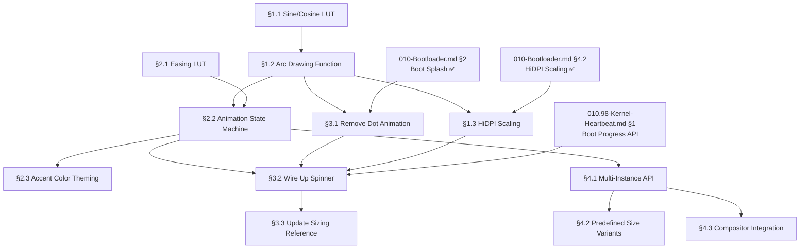

# TODO-010.97 — Progressive Spinner (Fluent 2 Arc Ring)

> **Goal:** Replace the dot-wave boot animation with a Windows 11-style
> progressive arc spinner. The spinner is a system-wide reusable component:
> first used on the boot splash, then available across the OS for loading
> indicators, dialogs, and shell UI. The arc ring is the signature visual of
> Fluent 2 / WinUI 3 — a dynamic, breathing arc that rotates continuously
> while stretching and shrinking.

> [!NOTE]
> **Windows 11 evolution:** Windows 10 used an "orbiting dots" circle animation.
> Windows 11 replaced it with a single **dynamic arc ring** — a solid curved
> line that rotates while its length breathes (grows and shrinks). This creates a
> smooth, elegant "chasing" effect that feels organic and modern. Impossible OS
> will match this aesthetic exactly.

> [!IMPORTANT]
> **Cross-references:**
> → XREF: `TODO-010-Bootloader.md §2` — Boot Splash Screen (integration point)
> → XREF: `TODO-010-Bootloader.md §4.2` — HiDPI Scaling (ring must scale)
> → XREF: `TODO-010.98-Kernel-Heartbeat.md §1` — Boot Progress API (drives spinner)

---

## TODO Completion Roadmap (Cross-File)

> [!IMPORTANT]
> **This file is part of the Bootloader subsystem.** Its sections have a strict
> linear dependency chain (renderer → animation → splash integration → system
> component) and external dependencies to `TODO-010-Bootloader.md` (Boot Splash
> §2) and `TODO-010.98-Kernel-Heartbeat.md` (Boot Progress API §1).

### Dependency Graph



### Phase-by-Phase Implementation Order

| ⭐ | Phase | Section                         | What It Delivers                                         | Depends On                       | Status |
| -- | :----: | ------------------------------- | -------------------------------------------------------- | ------------------------------- | :----: |
| 💎 | **1** | §1.1 Sine/Cosine LUT            | 256-entry fixed-point table — math foundation            | —                                |   ✅   |
| 💎 | **1** | §2.1 Easing LUT                 | 64-entry ease-in-out curve — animation smoothness        | —                                |   ✅   |
| 💎 | **2** | §1.2 Arc Drawing Function       | Anti-aliased arc ring renderer — the core primitive      | Phase 1 (§1.1)                   |   ✅   |
| 💎 | **2** | §1.3 HiDPI Scaling              | Per-resolution ring sizing                               | Phase 2 (§1.2)                   |   ✅   |
| 💎 | **3** | §2.2 Animation State Machine    | Dual-motion rotation + sweep — the breathing effect      | Phase 1 (§2.1) + Phase 2 (§1.2)  |   ✅   |
| 💎 | **3** | §3.1 Remove Dot Animation       | Delete all dot code from `boot_splash.c`                 | Boot Splash                      |   ✅   |
| 💎 | **4** | §3.2 Wire Up Spinner            | Replace dots with arc spinner on boot splash             | Phase 3 (§2.2 + §3.1 + §1.3)     |   ✅   |
| 💎 | **4** | §2.3 Accent Color Theming       | System accent color from Registry                        | Phase 3 (§2.2)                   |   ⬜   |
| 💎 | **5** | §3.3 Update Sizing Reference    | Documentation: update parent TODO sizing table           | Phase 4 (§3.2)                   |   ✅   |
| 💎 | **5** | §4.1 Multi-Instance API         | Reusable spinner for dialogs, shell, settings            | Phase 3 (§2.2)                   |   ⬜   |
| 💎 | **5** | §4.2 Predefined Size Variants   | Fluent 2 standard sizes (tiny → xlarge)                  | Phase 5 (§4.1)                   |   ⬜   |
| 💎 | **6** | §4.3 Compositor Integration     | Post-boot spinner routing through window manager         | Phase 5 (§4.1)                   |   ⬜   |

> [!NOTE]
> **Phases 1–4** deliver the boot splash visual upgrade (dot → arc ring).
> **Phases 5–6** generalize the spinner into a system-wide reusable component.

---

## How the Windows 11 Spinner Works

### Visual Design (Fluent 2)

| Property        | Win11 Value                                        |
| --------------- | -------------------------------------------------- |
| Shape           | Circular arc (not dots, not full ring)              |
| Stroke          | 3–4px rounded-cap line (varies with size)           |
| Color           | System accent color (default: `#0078D4` blue)       |
| Background      | None (transparent) — ring floats on any background  |
| Sizes           | 16px (inline), 32px (standard), 64px (boot/splash)  |
| Anti-aliasing   | Sub-pixel AA on arc edges — smooth at all sizes     |

### Animation Parameters (Reverse-Engineered)

The animation has two simultaneous motions:

1. **Rotation** — the entire arc rotates around the ring center
2. **Arc sweep** — the arc length (sweep angle) oscillates between a minimum and maximum

These are **not linear** — both use cubic bezier easing for the organic "breathing" feel.

| Parameter       | Value                                             |
| --------------- | ------------------------------------------------- |
| Rotation speed  | ~1.8s per full revolution (not constant — eased)   |
| Min sweep angle | ~30° (short dash)                                  |
| Max sweep angle | ~270° (nearly full ring)                           |
| Sweep period    | ~1.5s (one grow→shrink cycle)                      |
| Easing          | Cubic bezier (ease-in-out) for both rotation + sweep |
| Phase offset    | Rotation leads sweep by ~0.5s                      |

```
Frame progression (conceptual):

  ╭──╮      ╭────╮      ╭──────╮      ╭────╮      ╭──╮
  │  │  →   │    │  →   │      │  →   │    │  →   │  │
  ╰──╯      ╰────╯      ╰──────╯      ╰────╯      ╰──╯
  30°  →    120°   →     270°    →    120°   →     30°
  (short)  (growing)   (maximum)   (shrinking)  (short)
```

### Implementation Under the Hood

WinUI 3 uses `Storyboard` + `DoubleAnimation` with `RepeatBehavior="Forever"`:
- A `RotateTransform` on the arc path
- An `ArcSegment.SweepAngle` animation
- Both driven by the compositor at 60 fps (or display refresh rate)

In a freestanding kernel, we replicate this with:
- PIT/LAPIC timer-driven callbacks (no compositor dependency)
- Integer-only easing via lookup tables (no FPU)
- Bresenham-style anti-aliased arc drawing (no trigonometry at render time)

---

## 1. Arc Ring Renderer ✅ *(agent)*

**Prompt:** ✅ VERIFICATION — Arc ring renderer is implemented. Verify:
(1) `tools/gen_arc_lut.py` generates `src/kernel/gfx/arc_lut.h` with `arc_sin_lut[256]` and `arc_cos_lut[256]` (int16_t, fixed-point 8.8);
(2) `arc_sin_lut[0]==0`, `arc_sin_lut[64]==256`, `arc_sin_lut[128]==0`, `arc_cos_lut[0]==256`, `arc_cos_lut[64]==0`;
(3) `include/kernel/gfx/arc_ring.h` declares `arc_ring_draw()` (buffer-based API) and `arc_ring_size_for_height()`;
(4) `src/kernel/gfx/arc_ring.c` implements: per-pixel radial+angular test, AA blend zones (inner/outer/angular), rounded end caps, integer atan2 via octant decomposition;
(5) `arc_ring_size_for_height()` returns correct values for <1080p (20/3), ≥1080p (24/3), ≥1440p (32/4), ≥2160p (48/5);
(6) `bash scripts/build.sh clean` → `=== BUILD OK ===`.

> [!NOTE]
> **Implementation notes (2026-03-19):**
> - **Buffer-based API**: `arc_ring_draw()` takes a pixel buffer + dimensions instead of
>   calling `fb_put_pixel()` directly. This decouples the renderer from framebuffer globals
>   so it works with both the boot splash (direct backbuffer) and the compositor (window surfaces).
> - **Algorithm**: Per-pixel test over the arc's bounding box. For each pixel: (1) compute
>   distance² → determine if inside [r_inner, r_outer] ring; (2) compute angle via integer
>   atan2 (octant decomposition, ~0.7° max error); (3) check if angle is within [start, start+sweep].
>   AA uses smooth blend zones: 2px on radial edges (same technique as `splash_draw_dot()`) and
>   3 LUT-step angular blending at arc endpoints.
> - **End caps**: Rounded caps drawn as small AA filled circles at the midpoint of the ring
>   thickness, at both arc start and end angles. Uses `arc_sin_lut`/`arc_cos_lut` to compute
>   cap center positions.
> - **Include path gotcha**: The LUT is at `src/kernel/gfx/arc_lut.h` — include as `"gfx/arc_lut.h"`
>   (relative to `-Isrc/kernel`), not `"kernel/gfx/arc_lut.h"`.
> - **No Makefile changes**: `find $(KERNEL_DIR) -name '*.c'` auto-discovers `arc_ring.c`.
>   No SSE needed — compiled with default `CFLAGS` (including `-mno-sse`).

### 1.1 Sine/Cosine Lookup Table

- [x] Create `src/kernel/gfx/arc_lut.h` — 256-entry sin/cos table (fixed-point 8.8)
- [x] Table covers 0°–360° in 256 steps (1.40625° per step)
- [x] Format: `int16_t arc_sin_lut[256]` and `int16_t arc_cos_lut[256]`, values = func(angle) × 256
- [x] Generate via `tools/gen_arc_lut.py` (Python script → redirected to C header)
- [x] Verify: `arc_sin_lut[0] = 0`, `arc_sin_lut[64] = 256`, `arc_sin_lut[128] = 0`, `arc_cos_lut[0] = 256`
- [x] Commit (with §1.2): `"gfx: anti-aliased arc ring renderer"`

### 1.2 Arc Drawing Function

- [x] Create `src/kernel/gfx/arc_ring.c` and `include/kernel/gfx/arc_ring.h`
- [x] Buffer-based API (decoupled from framebuffer globals):
  ```c
  void arc_ring_draw(uint32_t *buf, uint32_t buf_w, uint32_t buf_h,
                     int32_t cx, int32_t cy,
                     int32_t radius, int32_t stroke,
                     uint8_t start_256, uint8_t sweep_256,
                     uint32_t color);
  ```
- [x] Render algorithm: per-pixel radial test (distance²) + angular test (integer atan2)
- [x] Anti-aliasing: 2px blend zone on inner/outer radial edges + 3-step angular AA at endpoints
- [x] Rounded end caps: AA filled circles at stroke/2 radius on ring midline
- [x] Alpha blending: proper source-over blend onto existing buffer contents
- [x] Bounds checking: all pixel writes clamped to buffer dimensions
- [x] No FPU — all math is integer with the 8.8 fixed-point LUT
- [x] Commit: `"gfx: anti-aliased arc ring renderer"`

### 1.3 HiDPI Scaling

- [x] Ring dimensions scale with screen height (same strategy as dot geometry):
  | Screen height | Ring radius | Stroke width |
  |---|---|---|
  | < 1080p       | 20px       | 3px          |
  | ≥ 1080p       | 24px       | 3px          |
  | ≥ 1440p       | 32px       | 4px          |
  | ≥ 2160p (4K)  | 48px       | 5px          |
- [x] `arc_ring_size_for_height(scr_h)` — returns `struct arc_ring_size {radius, stroke}` pair
- [x] Commit (with §1.2): `"gfx: anti-aliased arc ring renderer"`

---

## 2. Breathing Animation Engine ✅ *(agent)*

**Prompt:** ✅ VERIFICATION — Breathing animation engine is implemented. Verify:
(1) `tools/gen_ease_lut.py` generates `src/kernel/gfx/ease_lut.h` with `ease_lut[64]` (uint8_t, quarter-sine);
(2) `ease_lut[0]==0`, `ease_lut[63]==255`;
(3) `include/kernel/spinner.h` declares `spinner_init()`, `spinner_start()`, `spinner_stop()`, `spinner_draw_faded()`, `spinner_get_bounds()`, `spinner_is_active()`;
(4) `src/kernel/spinner.c` implements: dual-motion rotation + sweep oscillation via `spinner_compute_frame()`, PIT callback at 20fps (divisor=5), renders via `arc_ring_draw()` to backbuffer, `fb_swap_rect()` on bounding box only;
(5) `SPINNER_ROT_FRAMES==36`, `SPINNER_SWEEP_FRAMES==30`, `SPINNER_SWEEP_MIN==20`, `SPINNER_SWEEP_MAX==192`;
(6) `bash scripts/build.sh clean` → `=== BUILD OK ===`.

> [!NOTE]
> **Implementation notes (2026-03-19):**
> - **Static state design**: All state in file-scope static variables (`s_cx`, `s_cy`, `s_radius`,
>   `s_stroke`, `s_color`, `s_frame`, `s_active`). No struct passed around — simpler for ISR context.
> - **Frame computation**: `spinner_compute_frame()` is a pure function — given frame number, returns
>   start angle and sweep. Rotation uses `(frame * 256 / 36) & 0xFF` for ~1.8s period. Sweep uses
>   `(frame * 128 / 30) % 128` folded through the ease LUT for organic breathing.
> - **Timer divisor**: PIT at 100Hz / 5 = 20fps (vs boot splash dots at 100Hz / 10 = 10fps).
>   Higher fps makes the arc rotation visually smoother.
> - **Fade support**: `spinner_draw_faded(fade)` applies fade to the accent color before rendering.
>   Used by boot splash fade-in/fade-out sequences (§3).
> - **Bounding box**: `spinner_get_bounds()` returns the tight rect around the spinner (radius + 4px
>   for AA fringe and end caps). Used for `fb_swap_rect()` partial updates.
> - **No Makefile changes**: `find $(KERNEL_DIR) -name '*.c'` auto-discovers `spinner.c`.

### 2.1 Easing Lookup Table

- [x] Create `src/kernel/gfx/ease_lut.h` — 64-entry ease-in-out curve (0–255)
- [x] Shape: quarter-sine (approximates cubic-bezier ease-in-out)
- [x] Input: linear phase 0–63 → Output: eased value 0–255
- [x] Generate via `tools/gen_ease_lut.py`
- [x] Commit (with §2.2): `"spinner: breathing animation engine"`

### 2.2 Animation State Machine

- [x] Create `src/kernel/spinner.c` and `include/kernel/spinner.h`
- [x] Static state variables (equivalent to the struct, but file-scope):
  ```c
  static volatile uint8_t  s_active;   /* 1 = animation running */
  static volatile uint32_t s_frame;    /* monotonic frame counter */
  static int32_t  s_cx, s_cy;          /* ring center position */
  static int32_t  s_radius;            /* outer radius (scaled) */
  static int32_t  s_stroke;            /* ring thickness (scaled) */
  static uint32_t s_color;             /* accent color (0x00RRGGBB) */
  ```
- [x] Animation parameters (compile-time constants):
  ```c
  #define SPINNER_TICK_DIVISOR  5  /* PIT at 100Hz / 5 = 20 fps */
  #define SPINNER_ROT_FRAMES   36 /* frames per full rotation (1.8s @ 20fps) */
  #define SPINNER_SWEEP_FRAMES 30 /* frames per sweep oscillation (1.5s @ 20fps) */
  #define SPINNER_SWEEP_MIN    20 /* min arc sweep (out of 256 ≈ 28°) */
  #define SPINNER_SWEEP_MAX    192 /* max arc sweep (out of 256 ≈ 270°) */
  ```
- [x] Per-frame update logic:
  - [x] Rotation angle: `start = (frame * 256 / SPINNER_ROT_FRAMES) & 0xFF`
  - [x] Sweep phase: `phase = (frame * 128 / SPINNER_SWEEP_FRAMES) % 128`
  - [x] Apply ease table: `eased = ease_lut[phase < 64 ? phase : 127 - phase]`
  - [x] Sweep angle: `sweep = SWEEP_MIN + (SWEEP_MAX - SWEEP_MIN) * eased / 255`
  - [x] Call `arc_ring_draw(buf, buf_w, buf_h, cx, cy, radius, stroke, start, sweep, color)`
- [x] Timer callback:
  - [x] Clear previous arc area (fill rect with black in backbuffer)
  - [x] Compute new frame parameters via `spinner_compute_frame()`
  - [x] Draw new arc via `spinner_render(255)`
  - [x] `fb_swap_rect()` the arc bounding box only (no full-screen swap)
- [x] Commit: `"spinner: breathing animation engine"`

### 2.3 Accent Color Theming

- [ ] Default color: `#0078D4` (Fluent Blue — matches Windows 11 accent default)
- [ ] Read accent color from Registry: `HKLM\SOFTWARE\Impossible\Themes\AccentColor`
- [ ] If not set: fall back to `#0078D4`
- [ ] Color transition during fade-in: start at 0% opacity, blend to full over 5 frames
- [ ] Commit (with §2.2): `"spinner: breathing animation engine"`

---

## 3. Boot Splash Integration ✅ *(agent)*

**Prompt:** ✅ VERIFICATION — Boot splash now uses the progressive spinner. Verify:
(1) `boot_splash.c` has NO references to dots: no `splash_draw_dot()`, `splash_draw_dots()`, `splash_draw_dots_faded()`, `splash_timer_callback()`, `NUM_DOTS`, `PULSE_FRAMES`, `PULSE_LEN`, `STAGGER`, `REST_GAP`, `TOTAL_CYCLE`, `pulse_curve`, `g_dot_min_r`, `g_dot_max_r`, `g_dot_spacing`, `dot_cx`, `dot_cy`, `anim_frame`;
(2) `boot_splash.c` includes `spinner.h` and `arc_ring.h`, calls `spinner_init()`, `spinner_start()`, `spinner_stop()`, `spinner_draw_faded()`;
(3) Spinner position: center at `(scr_w/2, icon_y + icon_size + g_spinner_y_offset)` — same Y offset as old dots;
(4) `boot_splash.h` comments say "spinner" not "dots";
(5) Log line shows `ring_r=` and `ring_s=` instead of `dot_r=`;
(6) `TODO-010-Bootloader.md` sizing table column is "Ring r/stroke" not "Dot r min/max";
(7) `bash scripts/build.sh clean` → `=== BUILD OK ===`;
(8) `bash scripts/build.sh run` → boots without crash.

> [!NOTE]
> **Implementation notes (2026-03-19):**
> - **Breaking change executed**: Removed ~200 lines of dot animation code from `boot_splash.c`.
>   All dot constants, variables, functions, and the PIT callback were deleted.
> - **Spinner wiring**: `boot_splash_init()` now calls `arc_ring_size_for_height(scr_h)` for geometry
>   and `spinner_init()` to set up the ring. `boot_splash_start_animation()` calls `spinner_start()`
>   directly (which handles its own PIT registration internally).
> - **Fade transitions**: Both fade-in and fade-out use `spinner_draw_faded(fade_level)` instead of
>   the old `splash_draw_dots_faded()`. The fill_rect-then-draw pattern is preserved.
> - **Accent color**: Hardcoded `#0078D4` (Fluent Blue) as `SPINNER_ACCENT_COLOR`. §2.3 will add
>   Registry-based theming later.
> - **Text Y position**: Now computed as `spinner_cy + ring.radius + 20` — positions text below
>   the ring's bottom edge with a 20px gap, instead of the old absolute offset from dot center.
> - **Abort path**: `boot_splash_abort()` calls `spinner_stop()` instead of `pit_unregister_callback()`.

### 3.1 Remove Dot Animation

- [x] Delete from `boot_splash.c`:
  - [x] `splash_draw_dot()` — filled circle primitive (replaced by arc ring)
  - [x] `splash_draw_dots()` — main dot animation renderer
  - [x] `splash_draw_dots_faded()` — fade-in/out dot renderer
  - [x] `splash_timer_callback()` — PIT callback (replaced by spinner_start/stop)
  - [x] Constants: `NUM_DOTS`, `PULSE_FRAMES`, `ANIM_TICK_DIVISOR`, `PULSE_LEN`, `STAGGER`, `REST_GAP`, `TOTAL_CYCLE`
  - [x] Variables: `g_dot_min_r`, `g_dot_max_r`, `g_dot_spacing`, `g_dot_y_offset`, `dot_cx`, `dot_cy`, `anim_frame`
  - [x] Lookup table: `pulse_curve[8]`
- [x] Delete from `boot_splash.h`: updated all dot-related comments to say "spinner"
- [x] Commit (with §3.2): `"splash: replace dots with progressive spinner"`

### 3.2 Wire Up Spinner

- [x] In `boot_splash_init()`:
  - [x] Replace dot geometry with spinner geometry via `arc_ring_size_for_height(scr_h)`
  - [x] Compute spinner center position: `spinner_cx = scr_w / 2`, `spinner_cy = icon_y + icon_size + g_spinner_y_offset`
  - [x] Initialize spinner: `spinner_init(cx, cy, ring.radius, ring.stroke, SPINNER_ACCENT_COLOR)`
- [x] In `boot_splash_start_animation()`:
  - [x] Call `spinner_start()` instead of `pit_register_callback(splash_timer_callback, ...)`
- [x] In `boot_splash_finish()`:
  - [x] Call `spinner_stop()` instead of `pit_unregister_callback()`
  - [x] Fade-out uses `spinner_draw_faded(fade_out[fi])`
- [x] Fade-in: `spinner_draw_faded(fade_levels[fi])` in the 5-frame sequence
- [x] Fade-out: `spinner_draw_faded(fade_out[fi])` at decreasing opacity
- [x] Build and test: QEMU boots through splash without crash or flicker
- [x] Commit: `"splash: replace dots with progressive spinner"`

### 3.3 Update Boot Splash Sizing Reference

- [x] Update `TODO-010-Bootloader.md` sizing reference table:
  - [x] Replace "Dot r min/max" column with "Ring r/stroke"
  - [x] Update values per resolution tier to match `arc_ring_size_for_height()`
- [x] Update `boot_splash.c` header comment — now says "Progressive arc spinner"
- [x] Log line: `ring_r=%d  ring_s=%d` instead of `dot_r=%d/%d`
- [x] Update `boot_splash.h` comments — "spinner" not "dots"
- [x] Commit (with §3.2): `"splash: replace dots with progressive spinner"`

---

## 4. System-Wide Spinner Component *(agent)*

**Prompt:** Make the spinner available as a reusable UI component beyond the boot splash. Any kernel subsystem or shell element that needs a loading indicator can instantiate a spinner with position, size, and color. The component supports multiple simultaneous spinners (each with independent animation state). After completing all items, mark every item as `[x]`, run `bash scripts/build.sh clean`, and commit as `"ui: system-wide spinner component"`. Add notes directly in this TODO section. After implementation, save any gotchas, solutions, and important information to MCP memory (`mcp_memory_create_entities` / `mcp_memory_add_observations`).

> [!TIP]
> **Use cases beyond boot:**
> - Dialog boxes: "Loading..." spinner in file operations
> - Shell: command progress indicator
> - Settings/Control Panel: "Applying changes..." spinner
> - Desktop: wallpaper/theme loading
> - Login screen: authentication spinner

### 4.1 Multi-Instance Spinner API

- [ ] Refactor `spinner.c` to support multiple independent spinner instances:
  ```c
  /* Create a spinner instance. Returns a handle (index). */
  int spinner_create(int32_t cx, int32_t cy,
                     int32_t radius, int32_t stroke,
                     uint32_t color);

  /* Start/stop animation for a specific instance. */
  void spinner_start(int handle);
  void spinner_stop(int handle);

  /* Destroy a spinner instance. */
  void spinner_destroy(int handle);

  /* Render all active spinners (called from compositor). */
  void spinner_render_all(void);
  ```
- [ ] Maximum concurrent spinners: 8 (static array, no dynamic allocation)
- [ ] Each instance has its own `spinner_state` with independent frame counter
- [ ] Boot splash uses instance 0 (pre-allocated, no create/destroy overhead)
- [ ] Commit: `"ui: system-wide spinner component"`

### 4.2 Predefined Size Variants

- [ ] Define standard spinner sizes matching Fluent 2:
  ```c
  enum spinner_size {
      SPINNER_TINY    = 0,  /* 16px diameter — inline text */
      SPINNER_SMALL   = 1,  /* 24px diameter — buttons */
      SPINNER_MEDIUM  = 2,  /* 32px diameter — dialogs */
      SPINNER_LARGE   = 3,  /* 48px diameter — boot splash */
      SPINNER_XLARGE  = 4,  /* 64px diameter — full-screen loading */
  };
  ```
- [ ] `spinner_create_sized(cx, cy, size, color)` — convenience wrapper
- [ ] Each size maps to a `{radius, stroke}` pair (pre-computed)
- [ ] Commit (with §4.1): `"ui: system-wide spinner component"`

### 4.3 Compositor Integration

- [ ] When compositor is active (post-boot):
  - [ ] Spinners render through the compositor (not direct framebuffer)
  - [ ] `spinner_render_all()` called from `wm_composite()` for each active spinner
  - [ ] Dirty rect: each spinner invalidates its bounding box
- [ ] When compositor is locked (during boot):
  - [ ] Boot splash spinner renders directly to framebuffer (current behavior)
  - [ ] PIT callback handles `fb_swap_rect()` for the spinner area
- [ ] Commit (with §4.1): `"ui: system-wide spinner component"`

---

## Key Files

| File                                  | Purpose                                            |
| ------------------------------------- | -------------------------------------------------- |
| `tools/gen_arc_lut.py`                | [NEW] Generate sin/cos lookup table for arc math   |
| `tools/gen_ease_lut.py`               | [NEW] Generate easing curve lookup table           |
| `src/kernel/gfx/arc_lut.h`           | [NEW] Sin/cos 256-entry fixed-point table          |
| `src/kernel/gfx/ease_lut.h`          | [NEW] 64-entry ease-in-out curve                   |
| `src/kernel/gfx/arc_ring.c`          | [NEW] Anti-aliased arc ring drawing primitive      |
| `include/kernel/gfx/arc_ring.h`      | [NEW] Arc ring API                                 |
| `src/kernel/spinner.c`               | [NEW] Spinner animation engine + multi-instance    |
| `include/kernel/spinner.h`           | [NEW] Spinner API (create, start, stop, destroy)   |
| `src/kernel/boot_splash.c`           | MODIFY: remove dots, wire up spinner               |
| `include/kernel/boot_splash.h`       | MODIFY: remove dot declarations (if any)           |
| `TODO-010-Bootloader.md`             | MODIFY: update sizing reference table              |

---

## Priority Order

| ⭐ | Priority | Section                          | Description                                              |
| -- | :------: | -------------------------------- | -------------------------------------------------------- |
| 💎 | 🔴 P0   | 1.1–1.2 Arc ring renderer       | Foundation — pixel-level arc drawing primitive            |
| 💎 | 🔴 P0   | 2.1–2.2 Animation engine        | Dual-motion breathing + easing — the core visual         |
| 💎 | 🟠 P1   | 3.1–3.2 Boot splash integration | Replace dots with spinner — primary user-facing change   |
| 💎 | 🟠 P1   | 1.3 HiDPI scaling               | Ring must look correct at all resolutions                |
| 💎 | 🟡 P2   | 2.3 Accent color theming        | System accent color from Registry                        |
| 💎 | 🟡 P2   | 3.3 Sizing reference update     | Documentation cleanup                                    |
| 💎 | 🟡 P2   | 4. System-wide component        | Reusable beyond boot — dialogs, shell, settings          |

> [!NOTE]
> **P0 delivers the visual upgrade.** Sections 1 + 2 + 3 replace the dot animation
> with the arc spinner on the boot splash. Section 4 generalizes it for the OS.

---

## OS Comparison

| ⭐ | Feature                          | 🪟 Windows 11                           | 🐧 Linux (Plymouth)              | 🚀 Impossible OS                          |
| -- | -------------------------------- | --------------------------------------- | -------------------------------- | ----------------------------------------- |
| 💎 | Boot loading animation           | ✅ Progressive arc ring (Fluent 2)      | ⚠️ Theme-dependent (usually dots)| ⬜ Current: dot wave → **arc ring target** |
| 💎 | Anti-aliased arc rendering       | ✅ GPU-accelerated (Direct2D)           | ⚠️ Basic rendering               | ⬜ §1 — integer LUT, no FPU              |
| 💎 | Eased animation (non-linear)     | ✅ WinUI Storyboard animations          | ❌ Linear or basic sine          | ⬜ §2 — ease-in-out LUT                  |
| 💎 | Accent color theming             | ✅ System accent + dark/light mode      | ❌ Hardcoded per theme           | ⬜ §2.3 — Registry accent color          |
| 💎 | HiDPI spinner scaling            | ✅ Automatic (DPI-aware)                | ⚠️ Limited                      | ⬜ §1.3 — per-resolution sizing          |
| ⭐ | **Reusable spinner component**   | ✅ WinUI ProgressRing control           | ❌ Boot-only                     | ⬜ §4 — multi-instance, system-wide      |
| ⭐ | **No-FPU arc rendering**         | N/A (GPU always available)              | N/A (GPU always available)       | ⬜ §1 — **unique: integer-only arc math** |

> **After P0+P1:** Impossible OS matches the Windows 11 boot spinner visual quality
> using pure integer math — no GPU, no FPU, running from a timer ISR. This is a
> technical achievement that no other OS requires because they all have GPU access
> during boot.

---
