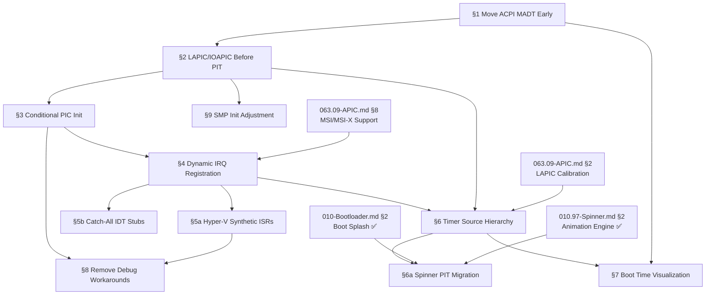

# TODO-010.99 — APIC-First Boot Refactor

> **Goal:** Eliminate the 8259 PIC dependency from the early boot path by moving
> ACPI MADT parsing and LAPIC/IOAPIC initialization **before** the boot splash,
> PIT timer, and device driver init. This fixes Hyper-V Gen 2 (no PIC) and
> aligns the kernel with modern APIC-only interrupt routing from the start.

> [!IMPORTANT]
> **Motivation:** The current boot sequence programs the PIT and routes IRQ0
> through the 8259 PIC for `sleep_ms()`. On Hyper-V Gen 2, the PIC doesn't
> exist, so PIT IRQs never fire and `sleep_ms()` hangs. With APIC-first boot,
> PIT IRQ0 routes through the IOAPIC, which exists on **every** x86-64 platform
> including Hyper-V Gen 2.

> [!WARNING]
> → XREF: `TODO-063.09-APIC-Architecture.md` — Full APIC subsystem TODO
> including x2APIC, LVT, TLB shootdown, MSI, NMI watchdog.
> This TODO focuses exclusively on the **boot sequence reordering** and the
> interrupt infrastructure needed to support it.

## TODO Completion Roadmap (Cross-File)

> [!IMPORTANT]
> **This file is part of the Bootloader subsystem.** Sections have a strict
> dependency chain: ACPI parsing → interrupt controller init → conditional PIC →
> dynamic IRQ API → IDT coverage → timer hierarchy → cleanup. External
> dependencies include `TODO-010-Bootloader.md` (Boot Splash, Interrupts),
> `TODO-063.09-APIC-Architecture.md` (full APIC subsystem), and
> `TODO-010.97-Progressive-Spinner.md` (spinner PIT migration).

### Dependency Graph



### Phase-by-Phase Implementation Order

| ⭐ | Phase | Section                          | What It Delivers                                           | Depends On                        | Status |
| -- | :----: | -------------------------------- | ---------------------------------------------------------- | --------------------------------- | :----: |
| 💎 | **1** | §1 Move ACPI MADT Early          | MADT parsed before interrupt setup — knows if PIC exists   | —                                 |   ✅   |
| 💎 | **2** | §2 LAPIC/IOAPIC Before PIT       | IRQ0 routes through IOAPIC — PIT works on APIC-only HW     | Phase 1 (§1)                      |   ⬜   |
| 💎 | **2** | §9 SMP Init Adjustment           | Verify AP boot with early LAPIC — no regressions           | Phase 1 (§1) + Phase 2 (§2)       |   ⬜   |
| 💎 | **3** | §3 Conditional PIC Init          | PIC guarded by PCAT_COMPAT — Hyper-V Gen 2 skips PIC       | Phase 2 (§2)                      |   ⬜   |
| 💎 | **4** | §4 Dynamic IRQ Registration      | `irq_register()` API — foundation for MSI + VMBus          | Phase 3 (§3)                      |   ⬜   |
| 💎 | **4** | §5b Catch-All IDT Stubs          | All 256 IDT entries populated — no more #GP on unknown vec | Phase 4 (§4)                      |   ⬜   |
| 💎 | **5** | §5a Hyper-V Synthetic ISRs       | VMBus/STIMER/HID interrupt handlers — real Hyper-V support | Phase 4 (§4)                      |   ⬜   |
| ⭐ | **5** | §6 Timer Source Hierarchy        | Auto-select best timer — TSC/STIMER/HPET/LAPIC/PIT         | Phase 4 (§4) + LAPIC calibration  |   ⬜   |
| 💎 | **6** | §6a Spinner PIT Migration        | Spinner off PIT callback — `sleep_ms()` loop instead       | Phase 5 (§6) + Spinner §2         |   ⬜   |
| ⭐ | **6** | §7 Boot Time Visualization       | Gantt chart in System Info — no OS shows this natively     | Phase 1 (§1) + Phase 5 (§6)       |   ⬜   |
| 💎 | **7** | §8 Remove Debug Workarounds      | Cleanup: delete HV_BAR macros, stall detection, debug bars | Phase 3 (§3) + Phase 5 (§5a)      |   ⬜   |

> [!NOTE]
> ⭐ = Feature where Impossible OS can be **superior** to both Windows and Linux.
> Phases 1–3 are the critical APIC-first boot chain that fixes Hyper-V Gen 2.
> Phases 4–5 build the modern interrupt/timer infrastructure.
> Phases 6–7 are polish and cleanup.

> [!TIP]
> **§6a (Spinner PIT Migration) is low-risk.** The spinner already uses a frame
> counter and `smoothstep256()` — no PIT-specific math. The migration is purely
> mechanical: replace `pit_register_callback()` with `while (active) { render(); sleep_ms(100); }`.
> This can be done independently once §6 establishes the timer API, or even
> earlier by using `sleep_ms()` directly (which already works via PIT today).

> [!CAUTION]
> **Phase 1–2 ordering is critical.** If LAPIC/IOAPIC init fails (e.g., bad MADT
> parse), no interrupts work at all — not even PIT. Always test on QEMU first
> before Hyper-V. The serial console is your only debugging tool if the screen
> goes black.

---

## Current Boot Sequence (Problem)

```
boot_hw_init()
  ├── serial_init()
  ├── boot_info parse (UEFI or Multiboot2)
  ├── pmm_init()
  ├── vmm_init()
  ├── heap_init()
  ├── cpuid_init()
  ├── simd_enable_avx()
  ├── ata_init() / virtio_blk_init() / ahci_init()
  └── blkdev_register_all()

boot_interrupts_init()              ◄── PIC dependency here
  ├── gdt_init()
  ├── idt_init()
  ├── pic_init()                    ◄── Programs 8259 PIC (doesn't exist on HV Gen 2)
  ├── pit_init()                    ◄── Routes IRQ0 through PIC (dead on HV Gen 2)
  ├── rtc_init()
  ├── keyboard_init()               ◄── Hangs on HV Gen 2 (no i8042)
  ├── mouse_init()                  ◄── Hangs on HV Gen 2 (no i8042)
  ├── fb_init()
  ├── boot_splash_init()            ◄── sleep_ms() hangs (no PIT ticks)
  ├── pci_scan()
  ├── sti
  ├── boot_splash_start_animation() ◄── PIT callback (no ticks)
  └── dhcp_discover()

boot_storage_init()
  ├── acpi_init()                   ◄── ACPI parsed HERE (too late!)
  ├── lapic_init()                  ◄── LAPIC initialized HERE (too late!)
  ├── ioapic_init()                 ◄── IOAPIC initialized HERE (too late!)
  ├── smp_init()
  └── storvsc_init() / hv_input
```

**Problem:** ACPI/LAPIC/IOAPIC init happens in `boot_storage_init()` — long after
the PIT, splash, and keyboard were already needed. On platforms without a PIC,
this ordering causes hangs.

---

## Target Boot Sequence (Solution)

```
boot_hw_init()
  ├── serial_init()
  ├── boot_info parse
  ├── pmm_init()
  ├── vmm_init()
  ├── heap_init()
  ├── cpuid_init()
  ├── simd_enable_avx()
  └── blkdev_register_all()

boot_interrupts_init()              ◄── APIC-first path
  ├── gdt_init()
  ├── idt_init()
  ├── idt_populate_all_256()        ◄── NEW: catch-all stubs for all vectors
  ├── acpi_init()                   ◄── MOVED: parse MADT for LAPIC/IOAPIC
  ├── lapic_init()                  ◄── MOVED: enable LAPIC, set SVR
  ├── ioapic_init()                 ◄── MOVED: route ISA IRQs via IOAPIC
  ├── pic_conditional_init()        ◄── Only remap+disable if PCAT_COMPAT=1
  ├── pit_init()                    ◄── IRQ0 now routed through IOAPIC ✓
  ├── rtc_init()
  ├── keyboard_init()               ◄── With existing timeouts ✓
  ├── mouse_init()                  ◄── With existing timeouts ✓
  ├── fb_init()
  ├── boot_splash_init()            ◄── sleep_ms() works (PIT via IOAPIC) ✓
  ├── pci_scan()
  ├── sti
  └── ...

boot_storage_init()
  ├── smp_init()                    ◄── LAPIC already up, SIPI works
  ├── storvsc_init()
  └── ...
```

---

## 1. Move ACPI MADT Parsing Before Interrupt Setup

**Prompt:** Verify that `acpi_init()` runs in `boot_interrupts_init()` (right after `idt_init()`, before `pic_init()`), NOT in `boot_storage_init()`. Confirm QEMU serial log shows `acpi: RSDP` and `acpi: ACPI: FADT` after `IDT loaded` and before `PIC` output. Confirm `boot_storage.c` no longer calls `acpi_init()` but still uses the already-parsed MADT for LAPIC/IOAPIC/SMP decisions. Run `bash scripts/build.sh clean` → `=== BUILD OK ===`. Check commit `"boot: move ACPI MADT parsing before interrupt setup"`.

> [!NOTE]
> **Implementation notes:**
> - `acpi_init()` dependencies verified: only `g_boot_info` (available after `boot_hw_init()`), `printk`, `klog`
> - No PCI, GDT, interrupt, or filesystem dependencies
> - RSDP info log + CPU count log moved alongside `acpi_init()` call
> - `boot_storage.c` LAPIC/IOAPIC/SMP block left in place (consumes already-parsed MADT) — §2 moves this
> - QEMU output: `RSDP v2` → `FADT` → `MADT: 2 CPUs` all before PIC/PIT init

> [!NOTE]
> **Prerequisite check:** `acpi_init()` calls `kmalloc()` for ACPI table copies
> and uses `klog()` for output. Both are available after `boot_hw_init()`.

- [x] Verify `acpi_init()` has no dependency on PCI, GDT, or interrupt state
- [x] Remove `acpi_init()` call from `boot_storage_init()`
- [x] Add `acpi_init()` to `boot_interrupts_init()` right after `idt_init()`
- [x] Verify `acpi_pcat_compat()` returns correct value after early `acpi_init()`
- [x] Verify MADT LAPIC/IOAPIC base addresses are available after early parse
- [x] Build and test on QEMU: confirm ACPI tables parse correctly in new position
- [x] Commit: `"boot: move ACPI MADT parsing before interrupt setup"`

---

## 2. Move LAPIC/IOAPIC Init Before PIT

**Prompt:** With ACPI MADT parsed, initialize the LAPIC and IOAPIC immediately so that PIT IRQ0 can be routed through the IOAPIC instead of the PIC. This means `lapic_init()` and `ioapic_init()` must run before `pit_init()`. Currently these live in `boot_storage_init()`. The LAPIC enables the local interrupt controller and EOI mechanism. The IOAPIC sets up the I/O interrupt redirect table for ISA IRQs (including IRQ0=PIT, IRQ1=keyboard, IRQ12=mouse). After completing all items, mark every item as `[x]`, run `bash scripts/build.sh clean`, and commit as `"boot: LAPIC/IOAPIC init before PIT for APIC-routed IRQ0"`. Add notes directly in this TODO section.

> [!CAUTION]
> **ISR stale-bit drain:** The current `boot_storage.c` has ISR drain logic that
> clears stale PIC bits when transitioning from PIC to APIC. With APIC-first boot,
> the PIC is never fully enabled, so drain logic may need adjustment.

> [!NOTE]
> **Codebase fact:** `irq_eoi()` in `pic.c` already dispatches to `lapic_eoi()`
> when `ioapic_available()` returns true. Once the IOAPIC is initialized early,
> this dispatch path activates automatically — no driver changes needed for EOI.

- [ ] Remove `lapic_init()` from `boot_storage_init()`
- [ ] Remove `ioapic_init()` from `boot_storage_init()`
- [ ] Add `lapic_init()` to `boot_interrupts_init()` after `acpi_init()`
- [ ] Add `ioapic_init()` to `boot_interrupts_init()` after `lapic_init()`
- [ ] Verify `ioapic_init()` routes IRQ0 (PIT) to BSP LAPIC via IOAPIC redirect table
- [ ] Verify `ioapic_init()` routes IRQ1 (keyboard) and IRQ12 (mouse) too
- [ ] Verify `irq_eoi()` automatically sends LAPIC EOI (existing `ioapic_available()` check)
- [ ] Move or remove ISR drain logic from `boot_storage.c` (no PIC→APIC transition)
- [ ] Build and test on QEMU: PIT ticks still fire, keyboard/mouse still work
- [ ] Commit: `"boot: LAPIC/IOAPIC init before PIT for APIC-routed IRQ0"`

---

## 3. Make PIC Init Conditional on PCAT_COMPAT

**Prompt:** Refactor `pic_init()` to only run when the ACPI MADT `PCAT_COMPAT` flag is set (`acpi_pcat_compat() == 1`). On APIC-only platforms (Hyper-V Gen 2, modern UEFI boards), the PIC doesn't exist and all its I/O port writes (`0x20`, `0x21`, `0xA0`, `0xA1`) are silently dropped. With APIC-first boot, the PIC is no longer needed for IRQ routing — it's only needed for legacy remap-and-mask on systems that have one. After completing all items, mark every item as `[x]`, run `bash scripts/build.sh clean`, and commit as `"boot: conditional PIC init based on PCAT_COMPAT"`. Add notes directly in this TODO section.

- [ ] In `boot_interrupts_init()`, guard `pic_init()` with `if (acpi_pcat_compat())`
- [ ] When `PCAT_COMPAT=1`: remap PIC vectors 0x20–0x2F, then mask all PIC IRQs
  - [ ] This prevents PIC from delivering stale interrupts during IOAPIC transition
- [ ] When `PCAT_COMPAT=0`: skip `pic_init()` entirely — no PIC exists
- [ ] Guard `pic_unmask_irq()` / `pic_mask_irq()` calls throughout the kernel:
  - [ ] `pit_init()` calls `pic_unmask_irq(IRQ_TIMER)` — skip when APIC-only
  - [ ] `keyboard_init()` calls `pic_unmask_irq(IRQ_KEYBOARD)` — skip when APIC-only
  - [ ] `mouse_init()` calls `pic_unmask_irq(IRQ_MOUSE)` — skip when APIC-only
  - [ ] `rtl8139_init()` and other drivers — audit all `pic_unmask_irq` calls
- [ ] Add `bool pic_available(void)` API to `pic.h` for drivers to check
- [ ] Build and test on QEMU: confirm PIC is initialized (PCAT_COMPAT=1)
- [ ] Build and test on Hyper-V: confirm PIC is skipped (PCAT_COMPAT=0)
- [ ] Commit: `"boot: conditional PIC init based on PCAT_COMPAT"`

---

## 4. Dynamic IRQ Registration API *(agent)*

**Prompt:** Currently, IDT entries are hardcoded at compile time with fixed vector-to-handler mappings. Drivers cannot register interrupt handlers at runtime — a critical limitation for MSI/MSI-X, Hyper-V synthetic interrupts, and any device that needs a dynamically assigned vector. Create an `irq_register()` / `irq_unregister()` API that allows drivers to claim vectors at runtime. This API becomes the foundation for MSI support (TODO-063.09 §8), Hyper-V VMBus callbacks (§7a), and interrupt affinity (TODO-063.09 §10). After completing all items, mark every item as `[x]`, run `bash scripts/build.sh clean`, and commit as `"kernel: dynamic IRQ registration API"`. Add notes directly in this TODO section.

> [!TIP]
> **Competitive Edge:** Windows has `IoConnectInterruptEx` (kernel mode only, heavily
> documented). Linux has `request_irq()` (GPL-licensed, well-known API). Impossible OS
> can provide a cleaner, header-only API with built-in conflict detection, rate limiting,
> and per-vector statistics — visible in Task Manager.

- [ ] Define `irq_handler_t` callback signature: `void (*handler)(uint8_t vector, void *ctx)`
- [ ] Create `irq_register(uint8_t vector, irq_handler_t handler, void *ctx, const char *name)`:
  - [ ] Install the handler in a vector→handler dispatch table (not IDT directly)
  - [ ] Reject if vector already claimed (return `ERR_BUSY`)
  - [ ] Store handler name for debugging (e.g., `"vmbus"`, `"pit"`, `"keyboard"`)
- [ ] Create `irq_unregister(uint8_t vector)` — release the vector
- [ ] Create `irq_alloc_vector(void)` — find and return first unclaimed vector in range 0x30–0xEF
  - [ ] Used by MSI/MSI-X and VMBus to get a free vector without hardcoding
- [ ] Create `irq_free_vector(uint8_t vector)` — release allocated vector
- [ ] Common IDT stub dispatches to the handler table instead of directly calling C functions
  - [ ] Stubs push vector number → call `irq_dispatch(vector)` → look up and call handler
- [ ] Per-vector interrupt counters: `uint64_t irq_count[256]`
  - [ ] Incremented by `irq_dispatch()` — used by Task Manager and load balancer
- [ ] Migrate existing hardcoded handlers to use `irq_register()`:
  - [ ] PIT (vector 32) → `irq_register(32, pit_handler, NULL, "pit")`
  - [ ] Keyboard (vector 33) → `irq_register(33, keyboard_handler, NULL, "ps2_kbd")`
  - [ ] Mouse (vector 44) → `irq_register(44, mouse_handler, NULL, "ps2_mouse")`
- [ ] Build and test: existing drivers still work via `irq_register()` path
- [ ] Commit: `"kernel: dynamic IRQ registration API"`

---

## 5. Full IDT Coverage — Proper Handlers + Defensive Safety Net

**Prompt:** A `GENERAL_PROTECTION_FAULT` BSOD was observed on Hyper-V with error code `0x7B3`. Decoding: bit 0=1 (external event), bits 1-2=01 (IDT reference), bits 3-15=0xF6 (vector 246). Hyper-V delivered a **VMBus synthetic interrupt** to IDT vector 0xF6 which has no handler — the CPU faulted on the null descriptor. The **real fix** is to register proper ISRs for known synthetic vectors (VMBus channel callbacks, STIMER, synthetic keyboard/mouse). Catch-all stubs are only a **safety net** for truly unexpected vectors — they must log warnings, not silently swallow interrupts, because silently absorbing VMBus callbacks would mask StorVSC disk I/O completions, NetVSC packet delivery, and synthetic timer ticks. After completing all items, mark every item as `[x]`, run `bash scripts/build.sh clean`, and commit as `"idt: full vector coverage with proper Hyper-V ISRs"`. Add notes directly in this TODO section.

> [!CAUTION]
> **Observed BSOD (Hyper-V Gen 2):**
> ```
> Stop code:  GENERAL_PROTECTION_FAULT
> Error code: 0x00000000000007B3
> RIP:        0x00000000001311A2
> Source:     idt.c:0
> ```
> Decoded: External event → IDT reference → vector 0xF6 (246). The hypervisor
> delivered a synthetic interrupt to a vector with no IDT entry, causing #GP.

> [!WARNING]
> **Do NOT silently absorb synthetic interrupts.** Vector 0xF6 is Hyper-V
> actively trying to communicate with the guest OS (VMBus channel callback,
> StorVSC disk completion, NetVSC packet arrival, or STIMER tick). A catch-all
> stub that swallows it would mask real I/O failures and make disk/network
> drivers appear to hang for no reason.

### 5a. Register Proper ISRs for Known Hyper-V Synthetic Vectors (Real Fix)

- [ ] Identify which vector Hyper-V assigns for VMBus callbacks:
  - [ ] The VMBus driver writes the callback vector to the SINT (Synthetic Interrupt Source) MSR
  - [ ] `hv_vmbus_init()` should register its ISR at this vector via `irq_register()` (§4)
  - [ ] → XREF: `TODO-063-Drivers.md` or VMBus driver source for SINT setup
- [ ] Register VMBus channel ISR at the SINT-assigned vector:
  - [ ] ISR reads the VMBus interrupt page to determine which channel fired
  - [ ] Dispatches to the per-channel callback (StorVSC, NetVSC, HID, etc.)
  - [ ] Sends LAPIC EOI
- [ ] Register Hyper-V STIMER (Synthetic Timer) ISR if used:
  - [ ] Can replace PIT as the kernel timer source on Hyper-V
  - [ ] Higher precision than PIT (100ns resolution vs 10ms)
- [ ] Register Hyper-V synthetic keyboard/mouse ISRs via `hv_input.c`:
  - [ ] These replace PS/2 keyboard/mouse on Gen 2 (no i8042)
  - [ ] → XREF: `hv_input.c` — already partially implemented

### 5b. Defensive Catch-All Stubs (Safety Net Only)

- [ ] Populate remaining unpopulated IDT entries (vectors 48–0xFB) with warning stubs:
  - [ ] **Log a warning**: `[IDT] WARNING: Unhandled interrupt vector=%u, RIP=%p`
  - [ ] Send LAPIC EOI (idempotent — safe even if no pending interrupt)
  - [ ] Do **NOT** silently absorb — the warning log makes unhandled vectors visible
  - [ ] Rate-limit the warning (once per vector per second) to avoid log spam
- [ ] Generate stubs efficiently via the `irq_register()` API (§4):
  - [ ] Default handler registered for all unclaimed vectors
  - [ ] When a driver claims a vector via `irq_register()`, it replaces the default
- [ ] The default handler should NOT panic — treat as a warning, not a fatal error:
  - [ ] First occurrence per vector: log full details (vector, RIP, error code)
  - [ ] Subsequent: count only (avoid flooding serial/log)
- [ ] Build and test on QEMU: no regression (stubs are never triggered)
- [ ] Build and test on Hyper-V: #GP replaced by warning log identifying which vector
- [ ] Commit: `"idt: full vector coverage with proper Hyper-V ISRs"`

---

## 6. Timer Source Hierarchy (🚀 Impossible OS Feature)

**Prompt:** The kernel currently has a single timer source: the legacy PIT (Programmable Interval Timer) at ~100 Hz. On Hyper-V Gen 2 (no PIC), PIT IRQs don't arrive. On real hardware, the PIT's 10ms granularity limits `sleep_ms()` accuracy. After APIC-first boot, introduce a timer source hierarchy that automatically selects the best available timer: LAPIC timer (per-CPU, calibrated), Hyper-V STIMER (100ns precision), HPET (sub-microsecond), TSC deadline timer (nanosecond), with PIT as the lowest-priority fallback. `sleep_ms()` and the scheduler should use whichever timer is best, transparently. After completing all items, mark every item as `[x]`, run `bash scripts/build.sh clean`, and commit as `"kernel: timer source hierarchy with automatic selection"`. Add notes directly in this TODO section.

> [!TIP]
> **Competitive Edge:** Windows has an internal timer hierarchy but it's completely
> invisible to users. Linux has `clocksource` subsystem visible only via
> `/sys/devices/system/clocksource/` (CLI). Impossible OS can expose the active
> timer source and its precision in **System Information** — and allow the user
> to override it via **Control Panel → System → Timer Source** for debugging
> and benchmarking purposes.

> [!NOTE]
> **Codebase fact:** `lapic_timer_init()` in `lapic.c` uses a hardcoded
> `ICR=10000000` (xv6-style) — the `hz` parameter is ignored entirely. The
> LAPIC timer fires but at an unpredictable rate on real hardware. Proper
> calibration (→ XREF: `TODO-063.09 §2`) is required before it can replace PIT.

- [ ] Define `struct timer_source`:
  ```
  { const char *name, uint32_t priority, uint64_t freq_hz,
    void (*init)(uint32_t hz), void (*set_oneshot)(uint64_t ns),
    uint64_t (*read_counter)(void), bool available }
  ```
- [ ] Implement timer source registration: `timer_register(struct timer_source *src)`
- [ ] Implement auto-selection: `timer_init_best()` — probe all sources, pick highest priority
- [ ] Register timer sources with priorities:
  - [ ] Priority 5: TSC deadline timer (highest — nanosecond precision, per-CPU)
    - [ ] Detect via `CPUID.01H:ECX[bit 24]` (TSC-Deadline LAPIC mode)
    - [ ] Calibrate TSC frequency via `CPUID.15H` / PIT / HPET
  - [ ] Priority 4: Hyper-V STIMER (100ns resolution, para-virtualized)
    - [ ] Detect via `CPUID.40000003H` (Hyper-V features leaf)
    - [ ] Configure STIMER0 for periodic interrupt delivery
  - [ ] Priority 3: HPET (High Precision Event Timer)
    - [ ] Detect via ACPI HPET table
    - [ ] Map MMIO base from ACPI, verify capabilities
    - [ ] → XREF: `TODO-012-ACPI.md` for HPET table parsing
  - [ ] Priority 2: LAPIC periodic timer (calibrated — requires `TODO-063.09 §2`)
    - [ ] After proper PIT calibration, LAPIC timer rate is known
  - [ ] Priority 1: PIT (legacy fallback — 1.193182 MHz, 10ms minimum granularity)
- [ ] Refactor `sleep_ms()` to use the best available timer:
  - [ ] If TSC available: busy-wait on TSC (most precise, no interrupt needed)
  - [ ] If LAPIC timer calibrated: one-shot countdown + `hlt`
  - [ ] If PIT only: existing tick-based wait (current behavior)
- [ ] Refactor scheduler quantum to use the best timer for preemption
- [ ] Expose active timer source via klog: `[TIMER] Using LAPIC timer @ 100 Hz (calibrated)`
- [ ] Expose via Win32 API: `QueryPerformanceFrequency()` / `QueryPerformanceCounter()`
  - [ ] Use TSC as the performance counter source (highest precision)
- [ ] Build and test: QEMU uses PIT, Hyper-V uses STIMER, real hardware uses LAPIC/TSC
- [ ] Commit: `"kernel: timer source hierarchy with automatic selection"`

### 6a. Migrate Boot Splash Spinner Off PIT Callback

> [!WARNING]
> → XREF: `TODO-010.97-Progressive-Spinner.md` — The spinner currently uses
> `pit_register_callback()` to drive its animation. When PIT is phased out,
> the spinner must move to a `sleep_ms()` polling loop or a kernel timer API.

> [!NOTE]
> **Known bug (fixed):** `pit_get_ticks()` uses `spin_lock_irqsave(&pit_lock)`,
> and the PIT ISR already holds `pit_lock` when calling registered callbacks.
> Calling `pit_get_ticks()` from a PIT callback causes a deadlock. The spinner
> was reverted to a simple frame counter. A `sleep_ms()` loop avoids this
> entirely since it runs outside ISR context.

- [ ] Replace `pit_register_callback()` in `spinner_start()` with a `sleep_ms()` polling loop:
  ```
  while (s_active) {
      spinner_render(255);
      fb_swap_rect(bx, by, bw, bh);
      sleep_ms(100);  /* 10 fps */
  }
  ```
- [ ] `boot_splash_start_animation()` already blocks the main thread — the polling loop fits naturally
- [ ] Remove the PIT callback function (`spinner_timer_callback`) from `spinner.c`
- [ ] Remove `#include "kernel/drivers/pit.h"` from `spinner.c`
- [ ] Update `spinner_start()` to be blocking (returns when `spinner_stop()` is called from another context)
  - [ ] Alternative: use the new timer API from §6 (`timer_set_periodic()`) instead of `sleep_ms()`
- [ ] Update `spinner_stop()` to set `s_active = 0` — the polling loop exits on next iteration
- [ ] With ISR dependency removed, the spinner can optionally use FPU/float math (not needed currently)
- [ ] Build and test: spinner animates identically to PIT-driven version
- [ ] Verify identical speed on QEMU and VirtualBox (no more PIT timing variance)
- [ ] Commit: `"spinner: migrate from PIT callback to sleep_ms loop"`

---

## 7. Boot Time Visualization (🚀 Impossible OS Feature)

**Prompt:** Instrument the boot sequence to record timestamps for every major initialization phase, then expose this data in a visual boot time breakdown accessible from System Information. Windows has "Boot Trace" in WPA (requires Event Tracing for Windows setup, developer tools, CLI collection). Linux has `systemd-analyze blame` (text-only CLI output). Impossible OS can show a **graphical Gantt chart** of the boot sequence in System Information — the first OS to make boot timing a native visual feature. The data collection hooks are naturally placed during the APIC-first boot refactor since every init function is being touched. After completing all items, mark every item as `[x]`, run `bash scripts/build.sh clean`, and commit as `"boot: visual boot time profiling"`. Add notes directly in this TODO section.

> [!TIP]
> **Competitive Edge:** Windows requires ETW + WPA developer tools to analyze
> boot time. Linux has `systemd-analyze blame` (text-only). Impossible OS can
> show a **color-coded Gantt chart** in System Information — the user sees
> exactly which driver or subsystem is slow, without any developer tools.

- [ ] Define `struct boot_timestamp { const char *name; uint64_t start_tsc; uint64_t end_tsc; }`
- [ ] Allocate a fixed-size array: `boot_timestamps[64]`
- [ ] Add `boot_timestamp_begin(const char *name)` / `boot_timestamp_end(void)` macros
- [ ] Instrument all boot phases:
  - [ ] `serial_init()`, `pmm_init()`, `vmm_init()`, `heap_init()`
  - [ ] `acpi_init()`, `lapic_init()`, `ioapic_init()`, `pic_init()`
  - [ ] `pit_init()`, `rtc_init()`, `keyboard_init()`, `mouse_init()`
  - [ ] `fb_init()`, `boot_splash_init()`, `pci_scan()`
  - [ ] `partition_scan_all()`, `vfs_mount()`, `dhcp_discover()`
  - [ ] `font_init()`, `icon_store_init()`, `cursor_init()`, `wm_init()`
- [ ] Convert TSC deltas to milliseconds after TSC calibration
- [ ] Log boot timeline to serial: `[BOOT] acpi_init: 12.3ms`
- [ ] Store boot timeline in Registry: `SYSTEM\Boot\Timeline\<name> = <ms>`
- [ ] Expose via Win32 API for System Information panel
- [ ] System Information: render as horizontal bar chart (Gantt-style):
  - [ ] Each phase = colored bar, length proportional to duration
  - [ ] Color by category: green=memory, blue=interrupt, yellow=storage, purple=UI
  - [ ] Show total boot time prominently at the top
- [ ] Commit: `"boot: visual boot time profiling"`

---

## 8. Remove Hyper-V Debug Workarounds

**Prompt:** After APIC-first boot is complete and tested, remove the temporary workarounds added for the Hyper-V Gen 2 black-screen debugging effort. These include: framebuffer debug bars in `bootx64.c`, `main.c`, `boot_hw.c`, `boot_interrupts.c`; the `sleep_ms()` stall detection in `pit.c`; and the early serial output in `bootx64.c` (keep as opt-in debug feature, not removed entirely). After completing all items, mark every item as `[x]`, run `bash scripts/build.sh clean`, and commit as `"boot: remove Hyper-V debug workarounds"`. Add notes directly in this TODO section.

- [ ] Remove `HV_BAR` debug macros and framebuffer bar writes from:
  - [ ] `src/boot/uefi/bootx64.c` (DRAW_BAR macro and all calls)
  - [ ] `src/kernel/main.c` (magenta bar at row 60)
  - [ ] `src/kernel/main/boot_hw.c` (HV_BAR calls at rows 72–144)
  - [ ] `src/kernel/main/boot_interrupts.c` (HV_BAR calls at rows 160–268)
- [ ] Remove `sleep_ms()` stall detection in `pit.c` (IOAPIC routes IRQ0 now)
- [ ] Keep `serial_early_init()` and `serial_early_print()` in `bootx64.c`
  - [ ] Wrap behind `#ifdef BOOT_DEBUG` or always-on (it's harmless and useful)
- [ ] Remove PS/2 flush-loop timeouts? **NO** — keep them as defensive coding
- [ ] Build and test on both QEMU and Hyper-V
- [ ] Commit: `"boot: remove Hyper-V debug workarounds"`

---

## 9. SMP Init Adjustment

**Prompt:** With LAPIC initialized early, `smp_init()` can still run in `boot_storage_init()` — it only needs LAPIC for sending INIT-SIPI-SIPI. However, verify that moving LAPIC init earlier doesn't break the AP boot sequence. The APs need the GDT, IDT, and page tables to be ready when they wake up — all of which are set up before `boot_storage_init()`. After completing all items, mark every item as `[x]`, run `bash scripts/build.sh clean`, and commit as `"boot: verify SMP works with early LAPIC init"`. Add notes directly in this TODO section.

- [ ] Verify `smp_init()` only depends on `lapic_init()` having been called (not its position)
- [ ] Verify AP trampoline has access to GDT, IDT, page tables set up by BSP
- [ ] Verify AP `lapic_init_ap()` call works with early-initialized LAPIC base address
- [ ] Test SMP on QEMU with 4 cores: all APs should boot successfully
- [ ] Commit: `"boot: verify SMP works with early LAPIC init"`

---

## Key Files

| File                                | Change                                                      |
| ----------------------------------- | ----------------------------------------------------------- |
| `src/kernel/main/boot_interrupts.c` | Reorder: add acpi, lapic, ioapic early; guard pic_init      |
| `src/kernel/main/boot_storage.c`    | Remove: acpi_init, lapic_init, ioapic_init from here        |
| `src/kernel/drivers/pic.c`          | Guard init with `acpi_pcat_compat()` check                  |
| `src/kernel/drivers/pit.c`          | Remove stall detection (IOAPIC routes IRQ0 now)             |
| `src/kernel/drivers/keyboard.c`     | Guard `pic_unmask_irq()` with `pic_available()` check       |
| `src/kernel/drivers/mouse.c`        | Guard `pic_unmask_irq()` with `pic_available()` check       |
| `src/kernel/drivers/rtc.c`          | Guard `pic_unmask_irq()` with `pic_available()` check       |
| `include/kernel/drivers/pic.h`      | Add `pic_available()` API                                   |
| `src/kernel/idt.c`                  | Populate all 256 entries; dispatch via handler table         |
| `src/kernel/irq.c`                  | [NEW] Dynamic IRQ registration, vector allocator, counters  |
| `include/kernel/irq.h`             | [NEW] `irq_register()`, `irq_alloc_vector()` API            |
| `src/kernel/timer.c`               | [NEW] Timer source hierarchy and auto-selection             |
| `include/kernel/timer.h`           | [NEW] `timer_register()`, `timer_init_best()` API           |
| `src/kernel/boot_profile.c`        | [NEW] Boot timestamp collection for Gantt chart             |
| `src/boot/uefi/bootx64.c`          | Remove debug bars (keep serial_early as opt-in)             |
| `src/kernel/main.c`                | Remove debug bars; add boot_timestamp instrumentation       |
| `src/kernel/main/boot_hw.c`        | Remove debug bars; add boot_timestamp instrumentation       |

---

## Priority Order

| ⭐ | Priority | Section                                 | Description                                                   |
| -- | :------: | --------------------------------------- | ------------------------------------------------------------- |
| 💎 | 🔴 P0   | 1. Move ACPI MADT Parsing Early         | Prerequisite for everything — must know if PIC exists         |
| 💎 | 🔴 P0   | 2. Move LAPIC/IOAPIC Before PIT         | Core change — route IRQ0 through IOAPIC, not PIC              |
| 💎 | 🔴 P0   | 5. Full IDT Coverage                    | Prevents #GP BSOD on Hyper-V (observed crash at vector 0xF6) |
| 💎 | 🟠 P1   | 3. Conditional PIC Init                 | Guard all PIC calls with PCAT_COMPAT check                    |
| 💎 | 🟠 P1   | 4. Dynamic IRQ Registration API         | Foundation for MSI, VMBus, and interrupt affinity              |
| ⭐ | 🟡 P2   | 6. Timer Source Hierarchy            | Auto-select best timer; expose in System Info                 |
| 💎 | 🟡 P2   | 6a. Spinner PIT Migration            | Move spinner from PIT callback to `sleep_ms()` loop          |
| ⭐ | 🟡 P2   | 7. Boot Time Visualization           | Gantt chart in System Info — no OS shows this natively        |
| 💎 | 🟡 P2   | 8. Remove Debug Workarounds             | Cleanup after APIC-first is verified                          |
| 💎 | 🟡 P2   | 9. SMP Init Adjustment                  | Verify AP boot still works with early LAPIC                   |

> [!NOTE]
> ⭐ = Feature where Impossible OS can be **superior** to both Windows and Linux.

---

## OS Comparison

| ⭐ | Feature                         | 🪟 Windows 11                         | 🐧 Linux 6.x                          | 🚀 Impossible OS (Current)             | 🚀 After Refactor                       |
| -- | -------------------------------- | ------------------------------------- | -------------------------------------- | --------------------------------------- | ---------------------------------------- |
| 💎 | APIC-first boot                 | ✅ HAL always uses APIC               | ✅ APIC init before PIT                | ❌ PIC → PIT → APIC (too late)          | ✅ ACPI → LAPIC → IOAPIC → PIT           |
| 💎 | PIC fallback                    | ✅ Only if MADT says PCAT_COMPAT      | ✅ Only if no IOAPIC found             | ⚠️ PIC always initialized              | ✅ Conditional on PCAT_COMPAT            |
| 💎 | Hyper-V Gen 2 boot              | ✅ Native support                     | ✅ Native support                      | ❌ Hangs (no PIC = no PIT ticks)        | ✅ IOAPIC routes IRQ0                    |
| 💎 | PIT timer on APIC-only          | ✅ IRQ0 via IOAPIC pin 2              | ✅ IRQ0 via IOAPIC (ISO override)      | ❌ PIT IRQ0 routed through dead PIC     | ✅ IRQ0 via IOAPIC                       |
| 💎 | Full IDT coverage (256 entries) | ✅ All 256 entries populated          | ✅ All 256 entries populated           | ❌ ~48 entries, rest null → #GP         | ✅ All 256 with handler dispatch         |
| 💎 | Dynamic IRQ registration        | ✅ `IoConnectInterruptEx`             | ✅ `request_irq()` / `free_irq()`     | ❌ Hardcoded vector→handler mapping     | ✅ `irq_register()` with vector alloc    |
| 💎 | EOI dispatch (PIC/LAPIC)        | ✅ Unified HAL EOI                    | ✅ `apic_eoi()` / `edge_ack()`        | ✅ `irq_eoi()` dispatches via flag      | ✅ Already working (no change needed)    |
| ⭐ | **Timer source hierarchy**      | ✅ Internal (invisible to users)      | ✅ `clocksource` (CLI sysfs only)     | ❌ PIT only                             | ✅ TSC/STIMER/HPET/LAPIC/PIT + GUI      |
| ⭐ | **Boot time visualization**     | ❌ Requires ETW + WPA (dev tools)     | ⚠️ `systemd-analyze blame` (text CLI) | ❌ Serial timestamps only               | ✅ Gantt chart in System Information     |
| ⭐ | **IRQ statistics GUI**          | ❌ Performance Monitor (hidden)       | ❌ `/proc/interrupts` (CLI only)       | ❌ No IRQ counters                       | ✅ Per-vector counters in Task Manager   |

