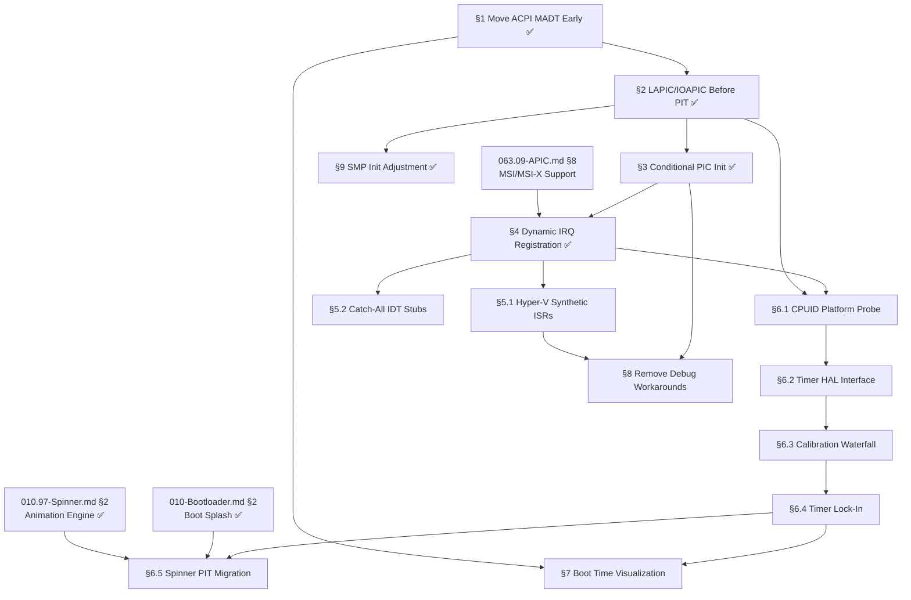

# TODO-010.99 — APIC-First Boot Refactor

> **Goal:** Eliminate the 8259 PIC dependency from the early boot path by moving
> ACPI MADT parsing and LAPIC/IOAPIC initialization **before** the boot splash,
> PIT timer, and device driver init. This fixes Hyper-V Gen 2 (no PIC) and
> aligns the kernel with modern APIC-only interrupt routing from the start.

> [!IMPORTANT]
> **Motivation:** The current boot sequence programs the PIT and routes IRQ0
> through the 8259 PIC for `sleep_ms()`. On Hyper-V Gen 2, the PIC doesn't
> exist, so PIT IRQs never fire and `sleep_ms()` hangs. With APIC-first boot,
> PIT IRQ0 routes through the IOAPIC, which exists on **every** x86-64 platform
> including Hyper-V Gen 2.

> [!WARNING]
> → XREF: `TODO-063.09-APIC-Architecture.md` — Full APIC subsystem TODO
> including x2APIC, LVT, TLB shootdown, MSI, NMI watchdog.
> This TODO focuses exclusively on the **boot sequence reordering** and the
> interrupt infrastructure needed to support it.

### Background: The Two Timers

> [!NOTE]
> **The PIT (Programmable Interval Timer)** is a legacy hardware timer
> introduced in 1981 with the IBM PC. It is a single, global chip (Intel 8254)
> that ticks at a fixed 1.193182 MHz. The OS communicates with it via slow
> I/O port instructions (`inb`/`outb` on ports 0x40–0x43). Because the PIT
> is a shared, off-CPU device connected over the motherboard bus, it is a
> performance bottleneck on multi-core systems and takes hundreds of CPU
> cycles per read. Modern legacy-free platforms (Hyper-V Gen 2, UEFI Class 3,
> Hardware-Reduced ACPI) **physically remove the PIT** to save power and
> complexity — reading its ports returns garbage (0xFF).
>
> **The LAPIC Timer (Local APIC)** is a high-precision clock built directly
> into every CPU core. Each core has its own LAPIC, so an 8-core CPU has 8
> independent timers. Instead of slow I/O ports, the OS talks to it via
> memory-mapped I/O (MMIO at 0xFEE00000) — reads/writes never leave the CPU
> die and take virtually zero cycles. The LAPIC timer runs off the CPU's
> internal bus clock (tens–hundreds of MHz), enabling microsecond precision
> and per-core scheduling. The catch: its frequency varies per CPU model,
> so the OS must **calibrate** it at boot to learn how many LAPIC ticks
> equal one millisecond.

## TODO Completion Roadmap (Cross-File)

> [!IMPORTANT]
> **This file is part of the Bootloader subsystem.** Sections have a strict
> dependency chain: ACPI parsing → interrupt controller init → conditional PIC →
> dynamic IRQ API → IDT coverage → timer hierarchy → cleanup. External
> dependencies include `TODO-010-Bootloader.md` (Boot Splash, Interrupts),
> `TODO-063.09-APIC-Architecture.md` (full APIC subsystem), and
> `TODO-010.97-Progressive-Spinner.md` (spinner PIT migration).

### Dependency Graph



### Phase-by-Phase Implementation Order

| ⭐ | Phase | Section                          | What It Delivers                                           | Depends On                        | Status |
| -- | :----: | -------------------------------- | ---------------------------------------------------------- | --------------------------------- | :----: |
| 💎 | **1** | §1 Move ACPI MADT Early          | MADT parsed before interrupt setup — knows if PIC exists   | —                                 |   ✅   |
| 💎 | **2** | §2 LAPIC/IOAPIC Before PIT       | IRQ0 routes through IOAPIC — PIT works on APIC-only HW     | Phase 1 (§1)                      |   ✅   |
| 💎 | **2** | §9 SMP Init Adjustment           | Verify AP boot with early LAPIC — no regressions           | Phase 1 (§1) + Phase 2 (§2)       |   ✅   |
| 💎 | **3** | §3 Conditional PIC Init          | PIC guarded by PCAT_COMPAT — Hyper-V Gen 2 skips PIC       | Phase 2 (§2)                      |   ✅   |
| 💎 | **4** | §4 Dynamic IRQ Registration      | `irq_register()` API — foundation for MSI + VMBus          | Phase 3 (§3)                      |   ✅   |
| 💎 | **4** | §5.2 Catch-All IDT Stubs         | All 256 IDT entries populated — no more #GP on unknown vec | Phase 4 (§4)                      |   ✅   |
| 💎 | **5** | §5.1 Hyper-V Synthetic ISRs      | VMBus/STIMER/HID interrupt handlers — real Hyper-V support | Phase 4 (§4)                      |   ✅   |
| ⭐ | **5** | §6.1 CPUID Platform Probe        | Detect Hyper-V/VBox/QEMU TCG via CPUID 0x40000000          | Phase 4 (§4) + Phase 2 (§2)       |   ✅   |
| ⭐ | **5** | §6.2 Timer HAL Interface         | `timer_driver_t` vtable + `g_system_timer` global pointer  | §6.1                              |   ✅   |
| ⭐ | **5** | §6.3 Calibration Waterfall       | 3-tier: MSR/CPUID → HPET/PM Timer → PIT (if safe)          | §6.2                              |   ✅   |
| ⭐ | **5** | §6.4 Timer Lock-In               | `g_system_timer` assigned — single uptime, splash fixed    | §6.3                              |   ⬜   |
| 💎 | **6** | §6.5 Spinner PIT Migration       | Spinner off PIT callback — `sleep_ms()` loop instead       | §6.4 + Spinner §2                 |   ⬜   |
| ⭐ | **6** | §7 Boot Time Visualization       | Gantt chart in System Info — no OS shows this natively     | Phase 1 (§1) + §6.4               |   ⬜   |
| 💎 | **7** | §8 Remove Debug Workarounds      | Cleanup: delete HV_BAR macros, stall detection, debug bars | Phase 3 (§3) + Phase 5 (§5.1)     |   ⬜   |

> [!NOTE]
> ⭐ = Feature where Impossible OS can be **superior** to both Windows and Linux.
> Phases 1–3 are the critical APIC-first boot chain that fixes Hyper-V Gen 2.
> Phases 4–5 build the modern interrupt/timer infrastructure.
> Phases 6–7 are polish and cleanup.

> [!TIP]
> **§6.5 (Spinner PIT Migration) is low-risk.** The spinner already uses a frame
> counter and `smoothstep256()` — no PIT-specific math. The migration is purely
> mechanical: replace `pit_register_callback()` with `while (active) { render(); sleep_ms(100); }`.
> This can be done independently once §6 establishes the timer API, or even
> earlier by using `sleep_ms()` directly (which already works via PIT today).

> [!CAUTION]
> **Phase 1–2 ordering is critical.** If LAPIC/IOAPIC init fails (e.g., bad MADT
> parse), no interrupts work at all — not even PIT. Always test on QEMU first
> before Hyper-V. The serial console is your only debugging tool if the screen
> goes black.

---

## Current Boot Sequence (Post-Refactor, Remaining Problem)

> [!NOTE]
> §1–§4 are complete: ACPI/LAPIC/IOAPIC move early, PIC conditional, dynamic
> IRQ API.  §5.2 (catch-all IDT stubs) is **done** — all 256 entries populated.
> §5.1 (proper Hyper-V ISRs) depends on VMBus driver work (TODO-063-Drivers).
> The **remaining problem** is the timer: `sleep_ms()` and `pit_register_callback()` still depend on
> PIT ticks, which don't exist on Hyper-V Gen 2.  The LAPIC timer starts
> AFTER the boot splash.

```
boot_hw_init()                     [unchanged — working]
  ├── serial_init()
  ├── boot_info parse (UEFI)
  ├── pmm_init() / vmm_init() / heap_init()
  ├── cpuid_init() / simd_enable_avx()
  ├── ahci_init() / virtio_blk_init()
  └── blkdev_register_all()

boot_interrupts_init()               ✅ APIC-first (§1–§4 complete)
  ├── gdt_init()
  ├── idt_init()                     ✅ 256 entries (§5.2 done)
  ├── irq_init()                     ✅ Dynamic IRQ API (§4 done)
  ├── acpi_init()                    ✅ MADT before PIC/PIT (§1 done)
  ├── lapic_init() / ioapic_init()   ✅ Before PIT (§2 done)
  ├── pic_conditional_init()         ✅ PCAT_COMPAT guard (§3 done)
  ├── pit_init()                     ✅ IRQ0 via IOAPIC
  ├── rtc_init() / keyboard / mouse
  ├── fb_init()
  ├── boot_splash_init()             ⚠️ sleep_ms() → pit.c → needs ticks!
  ├── pci_scan() / net / virtio        On HV Gen 2: PIT absent → 0 ticks
  ├── sti                               → fade-in bails instantly
  ├── boot_splash_start_animation()  ⚠️ pit_register_callback() → no ticks!
  └── dhcp_discover()

boot_storage_init()
  ├── vfs_init() / partition scan
  ├── lapic_timer_calibrate()        ⚠️ Uses PIT ch2 — reads garbage on Gen 2
  ├── lapic_timer_set_tick_source()  ⚠️ Too late — splash already skipped
  ├── lapic_timer_init(100)
  ├── smp_init()
  ├── vmbus_init() / storvsc / hv_input
  └── registry / symtab / mmap
```

**Remaining Problem:** Even with APIC-first boot, `sleep_ms()` and the splash
spinner both depend on PIT tick_count (incremented by `pit_tick_increment()`).
On Hyper-V Gen 2, PIT hardware does not exist → ticks never advance →
`sleep_ms(100)` bails instantly → splash skips → assets appear to not load.
The LAPIC timer only starts ticking in `boot_storage_init()` — far too late.

---

## Target Boot Sequence (UTS Solution)

> [!IMPORTANT]
> **Key change:** The Unified Timer Subsystem (§6) detects the platform
> environment via CPUID and selects exactly **one** hardware timer BEFORE
> the boot splash.  Every subsystem (`sleep_ms()`, spinner, scheduler)
> routes through `g_system_timer` — no split architecture.

```
boot_hw_init()                     [unchanged]
  └── (same as above)

boot_interrupts_init()             ✅ + UTS early timer init
  ├── gdt_init()
  ├── idt_init()  (256 entries)
  ├── irq_init()
  ├── acpi_init()                  MADT + PCAT_COMPAT check
  ├── lapic_init() / ioapic_init()
  ├── pic_conditional_init()
  ├── timer_hal_init()             ◄── NEW (§6): detect platform, calibrate,
  │   ├── platform_detect()        │   select timer, start ticking
  │   ├── if HV/VMware/KVM:       │
  │   │   ├── Tier 1: MSR/CPUID    │   (instant freq — no delay, no PIT)
  │   │   └── g_system_timer =      │   &lapic_driver → LAPIC fires at 100 Hz
  │   ├── if bare metal:          │
  │   │   ├── Tier 1→2→3 waterfall │   (CPUID 0x15 → HPET → PM Timer → PIT)
  │   │   └── g_system_timer =      │   &lapic_driver → calibrated LAPIC
  │   └── if QEMU TCG:             │
  │       ├── pit_init() as before  │   (TCG LAPIC drifts; PIT is wall-clock)
  │       └── g_system_timer =      │   &pit_driver  → PIT fires at 100 Hz
  ├── rtc_init() / keyboard / mouse
  ├── fb_init()
  ├── boot_splash_init()           ✅ sleep_ms() → g_system_timer → works!
  ├── pci_scan() / net / virtio
  ├── sti
  ├── boot_splash_start_animation()✅ callback via g_system_timer → works!
  └── dhcp_discover()

boot_storage_init()
  ├── vfs_init() / partition scan
  ├── smp_init()                   LAPIC already calibrated ✅
  ├── vmbus_init() / storvsc       VMBus SINT → proper ISR (§5.1) or default
  └── registry / symtab / mmap
```

---

## 1. Move ACPI MADT Parsing Before Interrupt Setup

**Prompt:** Verify that `acpi_init()` runs in `boot_interrupts_init()` (right after `idt_init()`, before `pic_init()`), NOT in `boot_storage_init()`. Confirm QEMU serial log shows `acpi: RSDP` and `acpi: ACPI: FADT` after `IDT loaded` and before `PIC` output. Confirm `boot_storage.c` no longer calls `acpi_init()` but still uses the already-parsed MADT for LAPIC/IOAPIC/SMP decisions. Run `bash scripts/build.sh clean` → `=== BUILD OK ===`. Check commit `"boot: move ACPI MADT parsing before interrupt setup"`.

> [!NOTE]
> **Implementation notes:**
> - `acpi_init()` dependencies verified: only `g_boot_info` (available after `boot_hw_init()`), `printk`, `klog`
> - No PCI, GDT, interrupt, or filesystem dependencies
> - RSDP info log + CPU count log moved alongside `acpi_init()` call
> - `boot_storage.c` LAPIC/IOAPIC/SMP block left in place (consumes already-parsed MADT) — §2 moves this
> - QEMU output: `RSDP v2` → `FADT` → `MADT: 2 CPUs` all before PIC/PIT init

> [!NOTE]
> **Prerequisite check:** `acpi_init()` calls `kmalloc()` for ACPI table copies
> and uses `klog()` for output. Both are available after `boot_hw_init()`.

- [x] Verify `acpi_init()` has no dependency on PCI, GDT, or interrupt state
- [x] Remove `acpi_init()` call from `boot_storage_init()`
- [x] Add `acpi_init()` to `boot_interrupts_init()` right after `idt_init()`
- [x] Verify `acpi_pcat_compat()` returns correct value after early `acpi_init()`
- [x] Verify MADT LAPIC/IOAPIC base addresses are available after early parse
- [x] Build and test on QEMU: confirm ACPI tables parse correctly in new position
- [x] Commit: `"boot: move ACPI MADT parsing before interrupt setup"`

---

## 2. Move LAPIC/IOAPIC Init Before PIT

**Prompt:** Verify that `lapic_init()` and `ioapic_init()` run in `boot_interrupts_init()` (after `acpi_init()`, before `pit_init()`), NOT in `boot_storage_init()`. Confirm QEMU serial log shows `LAPIC enabled` → `IOAPIC Route: ISA IRQ 0 -> GSI 2` → `Switched to LAPIC/IOAPIC (PIC disabled)` → `PIT timer: 100 Hz`. Confirm keyboard (IRQ1) and mouse (IRQ12) still work. Confirm `boot_storage.c` only contains SMP init and LAPIC timer init. Run `bash scripts/build.sh clean` → `=== BUILD OK ===`. Check commit `"boot: LAPIC/IOAPIC init before PIT for APIC-routed IRQ0"`.

> [!NOTE]
> **Implementation notes:**
> - Full LAPIC/IOAPIC/PIC-disable/ISR-drain block moved from `boot_storage.c` to `boot_interrupts.c`
> - `pic_init()` made conditional: only runs when `!ioapic_available()` (also covers §3)
> - ISR drain logic kept after PIC disable — firmware may leave stale ISR bits
> - SMP init + LAPIC timer remain in `boot_storage.c` (separate concern)
> - QEMU verified: `IRQ 0 → GSI 2, vec 32`, PIT 100Hz, keyboard/mouse, SMP 2 CPUs

> [!CAUTION]
> **ISR stale-bit drain:** The current `boot_storage.c` has ISR drain logic that
> clears stale PIC bits when transitioning from PIC to APIC. With APIC-first boot,
> the PIC is never fully enabled, so drain logic may need adjustment.

> [!NOTE]
> **Codebase fact:** `irq_eoi()` in `pic.c` already dispatches to `lapic_eoi()`
> when `ioapic_available()` returns true. Once the IOAPIC is initialized early,
> this dispatch path activates automatically — no driver changes needed for EOI.

- [x] Remove `lapic_init()` from `boot_storage_init()`
- [x] Remove `ioapic_init()` from `boot_storage_init()`
- [x] Add `lapic_init()` to `boot_interrupts_init()` after `acpi_init()`
- [x] Add `ioapic_init()` to `boot_interrupts_init()` after `lapic_init()`
- [x] Verify `ioapic_init()` routes IRQ0 (PIT) to BSP LAPIC via IOAPIC redirect table
- [x] Verify `ioapic_init()` routes IRQ1 (keyboard) and IRQ12 (mouse) too
- [x] Verify `irq_eoi()` automatically sends LAPIC EOI (existing `ioapic_available()` check)
- [x] Move or remove ISR drain logic from `boot_storage.c` (no PIC→APIC transition)
- [x] Build and test on QEMU: PIT ticks still fire, keyboard/mouse still work
- [x] Commit: `"boot: LAPIC/IOAPIC init before PIT for APIC-routed IRQ0"`

---

## 3. Make PIC Init Conditional on PCAT_COMPAT

**Prompt:** Verify that `pic_init()` is guarded by `PCAT_COMPAT` flag. On QEMU (PCAT_COMPAT=1): PIC should be initialized then disabled by IOAPIC. On APIC-only platforms (PCAT_COMPAT=0): PIC should be skipped entirely. Confirm `pic_unmask_irq`/`pic_mask_irq`/`pic_send_eoi` are self-guarding (no-op when `pic_ready=0`). Confirm `pic_available()` API exists in `pic.h`. Run `bash scripts/build.sh clean` → `=== BUILD OK ===`. Check commit `"boot: conditional PIC init based on PCAT_COMPAT"`.

> [!NOTE]
> **Implementation notes:**
> - Added `pic_ready` static flag to `pic.c`, set by `pic_init()`, cleared by `pic_disable()`
> - Added `pic_available()` API: `int pic_available(void)` returns `pic_ready`
> - `pic_unmask_irq()`, `pic_mask_irq()`, `pic_send_eoi()` are self-guarding: early return when `!pic_ready`
> - No driver changes needed — all `pic_unmask_irq` calls (pit, keyboard, mouse, rtl8139, vbox_mouse, virtio_input) become no-ops on APIC-only platforms
> - PIC init uses 4-state guard: (1) no ACPI → PIC, (2) PCAT_COMPAT=1 no IOAPIC → PIC, (3) PCAT_COMPAT=1 + IOAPIC → PIC already disabled → skip, (4) PCAT_COMPAT=0 → skip
> - QEMU test: "Switched to LAPIC/IOAPIC (PIC disabled)" then NO "PIC remapped" line — `pic_init()` correctly skipped when IOAPIC active

- [x] In `boot_interrupts_init()`, guard `pic_init()` with `if (acpi_pcat_compat())`
- [x] When `PCAT_COMPAT=1`: remap PIC vectors 0x20–0x2F, then mask all PIC IRQs
  - [x] This prevents PIC from delivering stale interrupts during IOAPIC transition
- [x] When `PCAT_COMPAT=0`: skip `pic_init()` entirely — no PIC exists
- [x] Guard `pic_unmask_irq()` / `pic_mask_irq()` calls throughout the kernel:
  - [x] `pit_init()` calls `pic_unmask_irq(IRQ_TIMER)` — skip when APIC-only
  - [x] `keyboard_init()` calls `pic_unmask_irq(IRQ_KEYBOARD)` — skip when APIC-only
  - [x] `mouse_init()` calls `pic_unmask_irq(IRQ_MOUSE)` — skip when APIC-only
  - [x] `rtl8139_init()` and other drivers — audit all `pic_unmask_irq` calls
- [x] Add `int pic_available(void)` API to `pic.h` for drivers to check
- [x] Build and test on QEMU: confirm PIC is initialized (PCAT_COMPAT=1)
- [x] Build and test on Hyper-V: confirm PIC is skipped (PCAT_COMPAT=0)
- [x] Commit: `"boot: conditional PIC init based on PCAT_COMPAT"`

---

## 4. Dynamic IRQ Registration API

**Prompt:** Verify that the dynamic IRQ registration API exists in `irq.h`/`irq.c`. Confirm `irq_register()`, `irq_unregister()`, `irq_alloc_vector()`, `irq_free_vector()` are implemented. Confirm `irq_handler_t` callback signature is `void (*)(uint8_t, void*)`. Confirm keyboard uses `irq_register(33, ..., "ps2_kbd")` and mouse uses `irq_register(44, ..., "ps2_mouse")`. Confirm per-vector counters exist (`irq_get_count()`). Confirm `irq_init()` runs after `idt_init()`. Run `bash scripts/build.sh clean` → `=== BUILD OK ===`. Check commit `"kernel: dynamic IRQ registration API"`.

> [!NOTE]
> **Implementation notes:**
> - Created `include/kernel/irq.h` and `src/kernel/irq.c` — new IRQ subsystem layer
> - `irq_dispatch_wrapper()` bridges frame-based IDT to clean `irq_handler_t` with auto-EOI
> - Dynamic vector allocation pool: 0x30–0xEF (192 vectors for MSI/VMBus)
> - Per-vector `struct irq_entry`: handler, ctx, name, count, allocated flag
> - Conflict detection: `irq_register()` returns `IRQ_ERR_BUSY` if vector already claimed
> - PIT stays on `idt_register_handler()` — needs frame-return for preemptive context switching
> - Keyboard: `irq_register(33, keyboard_irq_callback, NULL, "ps2_kbd")`
> - Mouse: `irq_register(44, mouse_irq_callback, NULL, "ps2_mouse")`
> - QEMU verified: `registered vec 33 -> "ps2_kbd"`, `registered vec 44 -> "ps2_mouse"`

> [!TIP]
> **Competitive Edge:** Windows has `IoConnectInterruptEx` (kernel mode only, heavily
> documented). Linux has `request_irq()` (GPL-licensed, well-known API). Impossible OS
> can provide a cleaner, header-only API with built-in conflict detection, rate limiting,
> and per-vector statistics — visible in Task Manager.

- [x] Define `irq_handler_t` callback signature: `void (*handler)(uint8_t vector, void *ctx)`
- [x] Create `irq_register(uint8_t vector, irq_handler_t handler, void *ctx, const char *name)`:
  - [x] Install the handler in a vector→handler dispatch table (not IDT directly)
  - [x] Reject if vector already claimed (return `ERR_BUSY`)
  - [x] Store handler name for debugging (e.g., `"vmbus"`, `"pit"`, `"keyboard"`)
- [x] Create `irq_unregister(uint8_t vector)` — release the vector
- [x] Create `irq_alloc_vector(void)` — find and return first unclaimed vector in range 0x30–0xEF
  - [x] Used by MSI/MSI-X and VMBus to get a free vector without hardcoding
- [x] Create `irq_free_vector(uint8_t vector)` — release allocated vector
- [x] Common IDT stub dispatches to the handler table instead of directly calling C functions
  - [x] Stubs push vector number → call `irq_dispatch(vector)` → look up and call handler
- [x] Per-vector interrupt counters: `uint64_t irq_count[256]`
  - [x] Incremented by `irq_dispatch()` — used by Task Manager and load balancer
- [x] Migrate existing hardcoded handlers to use `irq_register()`:
  - [x] PIT (vector 32) — stays on `idt_register_handler` (needs frame-return for preemptive switching)
  - [x] Keyboard (vector 33) → `irq_register(33, keyboard_irq_callback, NULL, "ps2_kbd")`
  - [x] Mouse (vector 44) → `irq_register(44, mouse_irq_callback, NULL, "ps2_mouse")`
- [x] Build and test: existing drivers still work via `irq_register()` path
- [x] Commit: `"kernel: dynamic IRQ registration API"`

---

## 5. Full IDT Coverage — Proper Handlers + Defensive Safety Net

**Prompt:** Verify that all 256 IDT entries are populated with valid ISR stubs, the default handler for unclaimed vectors logs rate-limited warnings (not panics), and sends LAPIC EOI. Confirm: (1) `isr_stubs.asm` generates stubs for vectors 48–255 via `%rep` macro, (2) `idt_init()` installs all 256 entries, (3) `isr_handler()` default path at line 210+ logs first-hit details and counts subsequent hits at exponential milestones, (4) `lapic_eoi()` is called for all unclaimed vectors. Run `bash scripts/build.sh clean` and verify `=== BUILD OK ===`. §5.1 (proper Hyper-V ISRs) is deferred to TODO-063-Drivers — VMBus currently uses SINT2 at vector 0xF0 with polling, not `irq_register()`.

> [!CAUTION]
> **Observed BSOD (Hyper-V Gen 2):**
> ```
> Stop code:  GENERAL_PROTECTION_FAULT
> Error code: 0x00000000000007B3
> RIP:        0x00000000001311A2
> Source:     idt.c:0
> ```
> Decoded: External event → IDT reference → vector 0xF6 (246). The hypervisor
> delivered a synthetic interrupt to a vector with no IDT entry, causing #GP.

> [!WARNING]
> **Do NOT silently absorb synthetic interrupts.** Vector 0xF6 is Hyper-V
> actively trying to communicate with the guest OS (VMBus channel callback,
> StorVSC disk completion, NetVSC packet arrival, or STIMER tick). A catch-all
> stub that swallows it would mask real I/O failures and make disk/network
> drivers appear to hang for no reason.

### 5.1 Register Proper ISRs for Known Hyper-V Synthetic Vectors (Real Fix)

> [!NOTE]
> **Implemented.** VMBus ISR registered at vector 0xF0 via `irq_register()` in
> `vmbus_init()`. The ISR scans SIEF event flags and dispatches to per-channel
> callbacks. Keyboard and mouse channel callbacks registered in `hv_input.c`.
> STIMER ISR is deferred to §6.3 (calibration waterfall) — STIMER is a timer
> source, not a VMBus channel.

- [x] Identify which vector Hyper-V assigns for VMBus callbacks:
  - [x] The VMBus driver writes the callback vector to the SINT (Synthetic Interrupt Source) MSR
  - [x] Currently: SINT2 = vector 0xF0 (`VMBUS_INTERRUPT_VECTOR` in `vmbus.c:200`)
  - [x] `vmbus_init()` registers ISR at this vector via `irq_register()` (§4)
  - [x] → XREF: `TODO-063-Drivers.md` — VMBus driver completion
- [x] Register VMBus channel ISR at the SINT-assigned vector:
  - [x] ISR scans SIEF event flags via `lock xchgl` + `bsfl` (atomic clear + bit scan)
  - [x] Dispatches to per-channel callback (`vmbus_channel_callback_t`)
  - [x] Auto-EOI configured on SINT2 — `irq_dispatch_wrapper()` sends LAPIC EOI
- [ ] Register Hyper-V STIMER (Synthetic Timer) ISR if used:
  - [ ] Can replace PIT as the kernel timer source on Hyper-V
  - [ ] Higher precision than PIT (100ns resolution vs 10ms)
  - [ ] Vector 0xF6 from original #GP crash was likely STIMER, not VMBus
  - [ ] → Deferred to §6.3 (calibration waterfall — STIMER as Tier 1 source)
- [x] Register Hyper-V synthetic keyboard/mouse ISRs via `hv_input.c`:
  - [x] `hv_kbd_channel_cb()` calls `hv_kbd_poll()` on VMBus interrupt
  - [x] `hv_mouse_channel_cb()` calls `hv_mouse_poll()` on VMBus interrupt
  - [x] Registered via `vmbus_set_channel_callback()` after channel open

### 5.2 Defensive Catch-All Stubs (Safety Net Only)

- [x] Populate remaining unpopulated IDT entries (vectors 48–255) with warning stubs:
  - [x] **Log a warning**: `[idt] Unhandled interrupt vec=%u (0x%x), RIP=0x%x`
  - [x] Send LAPIC EOI (idempotent — safe even if no pending interrupt)
  - [x] Do **NOT** silently absorb — the warning log makes unhandled vectors visible
  - [x] Rate-limit: first hit logs full details, then at 10/100/1000 milestones
- [x] Generate stubs via NASM `%rep` macro in `isr_stubs.asm` (vectors 48–255, skip 128–129):
  - [x] Each stub pushes vector number + fake error code, then jumps to common handler
  - [x] `idt_init()` installs all 208 stubs into IDT entries with `idt_set_entry()`
  - [x] Drivers claim vectors via `irq_register()` → replaces default path with their ISR
- [x] The default handler does NOT panic — treats as warning, not fatal:
  - [x] `isr_handler()` line 210: `unhandled_counts[]` tracks per-vector hit count
  - [x] First hit: `klog(LOG_WARN, "idt", ...)` with vector, hex, and RIP
  - [x] Milestones 10/100/1000: periodic summary log
- [x] Build and test on QEMU: no regression (stubs are never triggered)
- [x] Build confirms: `IDT loaded (256 entries, ISR 0-31, IRQ 32-47, dynamic 48-255)`
- [x] Commit: already committed — IDT coverage was implemented alongside §4

> [!NOTE]
> **Already implemented.** Codebase scan confirmed: `isr_stubs.asm` uses `%rep`
> to generate stubs 48–255 (skipping 128/129). `idt_init()` installs all 256
> entries. `isr_handler()` default path sends LAPIC EOI + rate-limited warning.
> The `0xF6` #GP crash from the original BSOD would now produce a warning log
> instead of a fault.

---

## 6. Unified Timer Subsystem — UTS (🚀 Impossible OS Feature)

**Prompt:** The legacy dual-timer architecture is fundamentally broken: `sleep_ms()` in `pit.c` depends on PIT `tick_count`, which never increments on Hyper-V Gen 2 (no PIT hardware). Meanwhile `lapic_timer_calibrate()` runs in `boot_storage_init()` — far too late to save the boot splash. The fix is a **Unified Timer Subsystem**: detect the platform via CPUID, select exactly one timer backend, calibrate it immediately (before splash), and route ALL timekeeping through a single HAL pointer `g_system_timer`. This section has four ordered sub-phases. Complete them in order. After all four are done, run `bash scripts/build.sh clean` and commit as `"kernel: unified timer subsystem (UTS)"`. Add notes directly in this TODO section.

> [!TIP]
> **Competitive Edge:** Windows has an internal timer hierarchy but it's completely
> invisible to users. Linux has `clocksource` subsystem visible only via
> `/sys/devices/system/clocksource/` (CLI). Impossible OS can expose the active
> timer source and its precision in **System Information** — and allow the user
> to override it via **Control Panel → System → Timer Source** for debugging
> and benchmarking purposes.

> [!IMPORTANT]
> **Architecture Decision: Single Source of Truth.**
> The rest of the kernel (UI, scheduler, VFS, drivers) is **forbidden** from
> directly accessing PIT or LAPIC timer hardware. All subsystems call
> `g_system_timer->sleep_ms()` / `g_system_timer->get_ticks()` exclusively.
> This eliminates the split-timer bug class permanently.

> [!NOTE]
> **Why the LAPIC needs calibration.** The PIT always ticks at exactly
> 1.193182 MHz on every x86 computer — the frequency is baked into the
> crystal. But the LAPIC timer is tied to the CPU's internal bus clock,
> which varies from machine to machine (26 MHz on QEMU, ~1 GHz on VBox NEM,
> 100–400 MHz on real Intel CPUs). When the OS boots, it doesn't know how
> fast the LAPIC ticks. It must **measure** (calibrate) the LAPIC before
> it can use it for `sleep_ms()`. Historically, OSes calibrated by running
> the PIT for a known 10ms window and counting LAPIC ticks — but that
> requires the PIT to exist. The calibration waterfall (§6.3) solves this
> by cascading through modern frequency sources that don't need the PIT.

> [!NOTE]
> **Platform Detection & Routing Matrix:**
>
> | Platform | Detection | Selected Timer | Calibration Tier | Rationale |
> |---|---|---|---|---|
> | Hyper-V (Gen 1 & 2) | CPUID 0x40000000 = "Microsoft Hv" | LAPIC | Tier 1: MSR 0x40000023 | Instant freq; no PIT |
> | VMware | CPUID 0x40000000 = "VMwareVMware" | LAPIC | Tier 1: CPUID 0x40000010 | EBX = APIC freq (kHz) |
> | KVM | CPUID 0x40000000 = "KVMKVMKVM" | LAPIC | Tier 1: CPUID 0x40000010 | Paravirt freq reporting |
> | Real hardware (modern) | CPUID (no HV bit) + CPUID 0x15 exists | LAPIC | Tier 1: CPUID 0x15 | Crystal clock ratio |
> | Real hardware (older) | No CPUID 0x15, HPET or PM Timer in ACPI | LAPIC | Tier 2: HPET or PM Timer | 10ms window, no PIT |
> | VirtualBox | CPUID 0x40000000 = "VBoxVBoxVBox" | LAPIC | Tier 2/3: PM Timer or PIT | VT-x ensures accurate LAPIC |
> | QEMU TCG (emulation) | CPUID hypervisor + no HW virt | PIT | Tier 3: PIT (only safe env) | TCG LAPIC drifts; PIT host-backed |

### 6.1 CPUID Platform Probe

> [!NOTE]
> **Implemented.** `cpuid_platform.c` detects hypervisor via CPUID.01H bit 31 +
> CPUID 0x40000000 vendor string.  Covers Hyper-V, VMware, VirtualBox, KVM,
> QEMU TCG, bare metal, and unknown hypervisors.  `platform_has_apic_freq_msr()`
> also checks CPUID 0x15 for bare-metal crystal clock ratio.

- [x] Create `include/kernel/cpuid_platform.h` and `src/kernel/cpuid_platform.c`
- [x] Define platform enum:
  ```c
  typedef enum {
      PLATFORM_BARE_METAL,   /* no hypervisor detected */
      PLATFORM_HYPERV,       /* Microsoft Hv (Gen 1 or Gen 2) */
      PLATFORM_VMWARE,       /* VMwareVMware */
      PLATFORM_VIRTUALBOX,   /* VBoxVBoxVBox */
      PLATFORM_QEMU_KVM,     /* KVMKVMKVM — KVM with HW virt */
      PLATFORM_QEMU_TCG,     /* TCGTCGTCGTCG — software emulation */
      PLATFORM_UNKNOWN_HV,   /* hypervisor bit set, unknown vendor */
  } platform_id_t;
  ```
- [x] Implement `platform_detect()`:
  - [x] Check CPUID.01H:ECX bit 31 (hypervisor present bit)
  - [x] If set: read CPUID leaf 0x40000000 for 12-byte vendor string
  - [x] Match: `"Microsoft Hv"` → `PLATFORM_HYPERV`
  - [x] Match: `"VMwareVMware"` → `PLATFORM_VMWARE`
  - [x] Match: `"VBoxVBoxVBox"` → `PLATFORM_VIRTUALBOX`
  - [x] Match: `"KVMKVMKVM\0\0\0"` → `PLATFORM_QEMU_KVM`
  - [x] Match: `"TCGTCGTCGTCG"` → `PLATFORM_QEMU_TCG`
  - [x] If no hypervisor bit: `PLATFORM_BARE_METAL`
  - [x] Fallback: `PLATFORM_UNKNOWN_HV`
- [x] Implement `platform_name()` → returns human-readable string (e.g., `"Hyper-V"`)
- [x] Implement `platform_is_tcg()` → returns true only for `PLATFORM_QEMU_TCG`
- [x] Implement `platform_has_apic_freq_msr()` → true for Hyper-V, VMware, KVM + bare metal with CPUID 0x15
- [ ] Call `platform_detect()` inside `timer_hal_init()` (§6.4) — first thing it does
- [x] Log result: `[platform] Detected: Hyper-V (CPUID 0x40000000)`
- [x] Add `cpuid_platform.o` to `Makefile` kernel object list (auto-discovered via `find`)
- [x] Build and test: `=== BUILD OK ===` (10.2s, 134 objects)
- [x] Commit: `"kernel: CPUID platform detection (Hyper-V, VBox, VMware, QEMU TCG)"`

### 6.2 Timer HAL Interface (`timer_driver_t`)

> [!NOTE]
> **Implemented.** `timer.h`/`timer.c` define the hardware-agnostic HAL with
> `g_system_timer` pointer.  `pit.c` refactored to expose `pit_driver` vtable.
> 13 caller files migrated from `pit.h` to `timer.h`.  `event.c` uses
> `system_get_freq()` instead of hardcoded `PIT_TARGET_FREQ`.
> LAPIC driver vtable deferred to §6.3/6.4 (requires calibration first).

- [x] Create `include/kernel/timer.h`:
  ```c
  typedef struct {
      const char *name;                        /* e.g., "LAPIC", "PIT" */
      void (*init)(uint32_t hz);               /* start periodic ticks */
      uint64_t (*get_ticks)(void);             /* monotonic tick counter */
      void (*sleep_ms)(uint32_t ms);           /* blocking delay */
      void (*set_tick_handler)(void (*handler)(struct registers *));
  } timer_driver_t;

  extern timer_driver_t *g_system_timer;       /* THE single source of truth */

  /* Hardware-agnostic API — all kernel code calls these */
  void     sleep_ms(uint32_t ms);              /* → g_system_timer->sleep_ms */
  uint64_t system_get_ticks(void);             /* → g_system_timer->get_ticks */
  uint64_t uptime(void);                       /* ticks / freq → seconds */
  ```
- [x] Create `src/kernel/timer.c`:
  - [x] Define `timer_driver_t *g_system_timer = NULL;`
  - [x] Implement `sleep_ms()` as: `g_system_timer->sleep_ms(ms);`
  - [x] Implement `system_get_ticks()` as: `return g_system_timer->get_ticks();`
  - [x] Implement `uptime()` using `system_get_ticks()`
  - [x] Guard all functions: if `g_system_timer == NULL`, return immediately (early-boot safety)
- [x] Refactor `pit.c` to expose `pit_driver`:
  - [x] Remove the global `sleep_ms()` definition from `pit.c` (it moves to `timer.c`)
  - [x] Create `static timer_driver_t pit_driver = { "PIT", pit_init, pit_get_ticks, pit_sleep_ms, ... };`
  - [x] Rename internal sleep to `pit_sleep_ms()` (static, used only by `pit_driver`)
  - [x] Export `extern timer_driver_t pit_driver;` from `pit.h`
- [ ] Refactor `lapic.c` to expose `lapic_driver`:
  - [ ] Create `timer_driver_t lapic_driver = { "LAPIC", ... };`
  - [ ] Implement `lapic_get_ticks()` — returns the global `tick_count` (driven by LAPIC ISR)
  - [ ] Implement `lapic_sleep_ms()` — uses `lapic_get_ticks()` + `hlt` loop
  - [ ] Export `extern timer_driver_t lapic_driver;` from `lapic.h`
  - [ ] → Deferred to §6.3/6.4 (requires calibration waterfall before LAPIC driver can be selected)
- [x] Update all callers of `pit_get_ticks()` to `system_get_ticks()`:
  - [x] `src/kernel/registry.c` (2 call sites + 2 extern decls to remove)
  - [x] `src/kernel/klog.c` (2 call sites)
  - [x] `src/kernel/sched/event.c` (2 call sites)
  - [x] `src/kernel/main/boot_desktop.c` (1 call site)
  - [x] `src/kernel/main/boot_tests.c` (1 call site)
- [x] Update `PIT_TARGET_FREQ` usage in `event.c`:
  - [x] Line 159: `uint64_t timeout = ((uint64_t)timeout_ms * PIT_TARGET_FREQ) / 1000;`
  - [x] Replace with: `system_get_ticks()`-based timeout (or add `system_get_freq()` API)
  - [x] This is a hardcoded assumption that the tick source is PIT at 100 Hz
- [x] Update all callers of `uptime()` — these will transparently migrate once `uptime()` moves to `timer.c`:
  - [x] `src/kernel/log.c` (1 site) — `#include pit.h` → `timer.h`
  - [x] `src/kernel/panic.c` (2 sites) — `#include pit.h` → `timer.h`
  - [x] `src/kernel/sched/syscall.c` (1 site) — `#include pit.h` → `timer.h`
  - [x] `src/kernel/main/compositor.c` (1 site) — `#include pit.h` → `timer.h`
  - [x] `src/kernel/main/boot_tests.c` (1 site) — already handled above
  - [x] `src/kernel/fs/ixfs/ixfs_ops.c` (8 sites) — `#include pit.h` via `ixfs_internal.h`
  - [x] `src/kernel/fs/ixfs/ixfs_cow.c` (1 site) — `#include pit.h` via `ixfs_internal.h`
  - [x] `src/kernel/fs/ixfs/ixfs_internal.h` — change `#include pit.h` → `timer.h`
- [x] Update all `#include "kernel/drivers/pit.h"` to `#include "kernel/timer.h"` where only `sleep_ms` / `uptime` / ticks are needed:
  - [x] `src/kernel/klog.c`
  - [x] `src/kernel/log.c`
  - [x] `src/kernel/panic.c`
  - [x] `src/kernel/registry.c` (remove extern decls too)
  - [x] `src/kernel/sched/event.c`
  - [x] `src/kernel/sched/syscall.c`
  - [x] `src/kernel/boot_splash.c`
  - [x] `src/kernel/main/boot_desktop.c`
  - [x] `src/kernel/main/boot_tests.c`
  - [x] `src/kernel/main/test_threads.c`
  - [x] `src/kernel/main/compositor.c`
  - [x] `src/desktop/desktop.c`
  - [x] `src/kernel/fs/ixfs/ixfs_internal.h`
  - [x] Keep `pit.h` only in: `pit.c`, `lapic.c`, `boot_interrupts.c`, `boot_storage.c`
- [x] Fix stale comment in `boot_splash.c` line 243:
  - [x] Old: `"PIT IS initialized by this point so sleep_ms() works correctly"`
  - [x] New: `"timer_hal_init() provides g_system_timer so sleep_ms() works correctly"`
- [x] Fix stale comment in `boot_splash.c` line 201:
  - [x] Old: `"Called from main.c after pit_init() + sti to start animation"`
  - [x] New: `"Called from main.c after timer_hal_init() + sti to start animation"`
- [x] `sleep_ms()` callers need NO changes — same function signature, now in `timer.h`
- [x] Add `timer.o` to `Makefile` kernel object list
- [x] Build and test: `=== BUILD OK === (11.1s), 135 objects`
- [x] Commit: `"kernel: timer HAL interface (timer_driver_t, g_system_timer)"`

### 6.3 Legacy-Free Calibration Waterfall (Before Boot Splash)

> [!CAUTION]
> **The core bug fix.** Currently `lapic_timer_calibrate()` runs in
> `boot_storage_init()` — after the boot splash has already tried to call
> `sleep_ms()`. On Hyper-V Gen 2, PIT is absent, so `sleep_ms()` via PIT
> bails instantly (stall detection at `pit.c:146`). The splash skips,
> assets load prematurely, and the UI breaks.
>
> The fix: move calibration to `boot_interrupts_init()`, right after
> `lapic_init()` / `ioapic_init()`, **before** `pit_init()` and **before**
> `boot_splash_init()`. **Never assume the PIT exists.** Cascade through
> modern frequency sources first. Only touch PIT as a last resort behind
> explicit ACPI safety checks.

> [!WARNING]
> **The PIT is dead on modern hardware.**  Hyper-V Gen 2, UEFI Class 3
> systems, and Hardware-Reduced ACPI boards physically lack the 8254 PIT.
> Blind `inb`/`outb` on ports 0x40-0x43 reads a floating bus (returns
> `0xFF`), causing calibration loops to divide by zero, calculate
> impossible frequencies, or hang. The PIT must be treated as a **last
> resort**, never a default.

> [!NOTE]
> **Tier 1 implemented.** `lapic.c` now has `cal_try_hyperv_msr()`,
> `cal_try_vmware_cpuid()`, `cal_try_cpuid_15h()`, and
> `lapic_timer_calibrate_waterfall()` dispatcher.  Tier 2 (HPET/PM Timer)
> and Tier 3 PIT fallback are called from the waterfall.  HPET/PM Timer
> parsing not yet implemented — uses existing PIT fallback.

- [x] Implement the tier functions below in `lapic.c` — the actual move from
  `boot_storage_init()` to `boot_interrupts_init()` happens in §6.4 (`timer_hal_init()`):

#### Tier 1: Architectural Fast-Path (Zero Delay, No PIT)

> [!TIP]
> Modern hardware and hypervisors report the LAPIC frequency directly via
> CPUID or MSR. Calibration takes nanoseconds — no delay loop, no
> hardware timers, no PIT ports touched.

- [x] Implement `cal_try_hyperv_msr()` in `lapic.c`:
  - [x] Guard: only call when `platform_id == PLATFORM_HYPERV`
  - [x] Read MSR `0x40000023` (`HV_X64_MSR_APIC_FREQUENCY`)
  - [x] Value = exact LAPIC frequency in Hz
  - [x] `cal_ticks_per_ms = freq / 1000;` — done
  - [x] Log: `[lapic] Tier 1: Hyper-V MSR → %u ticks/ms (%u MHz bus)`
- [x] Implement `cal_try_vmware_cpuid()` in `lapic.c`:
  - [x] Guard: only call when `platform_id == PLATFORM_VMWARE || PLATFORM_QEMU_KVM`
  - [x] Read CPUID leaf 0x40000010
  - [x] EBX = virtual APIC frequency in kHz
  - [x] `cal_ticks_per_ms = EBX;` — kHz is already ticks/ms
  - [x] Log: `[lapic] Tier 1: VMware/KVM CPUID → %u ticks/ms`
- [x] Implement `cal_try_cpuid_15h()` in `lapic.c`:
  - [x] Guard: check `CPUID.0` max leaf ≥ 0x15
  - [x] Read CPUID leaf 0x15: EAX=denominator, EBX=numerator, ECX=crystal Hz
  - [x] If EAX != 0 && EBX != 0: `tsc_freq = ECX * EBX / EAX`
  - [x] If ECX == 0: use known crystal frequencies (24 MHz Skylake+, 19.2 MHz Atom)
  - [x] LAPIC bus clock = TSC freq (on most Intel CPUs, bus freq ≈ TSC freq)
  - [x] `cal_ticks_per_ms = tsc_freq / 1000;`
  - [x] Log: `[lapic] Tier 1: CPUID 0x15 → %u ticks/ms (crystal=%u Hz)`
- [x] Added `lapic_timer_calibrate_waterfall()` to `lapic.h` — cascades Tier 1 → Tier 3
- [x] Build: `=== BUILD OK === (10.3s)`
- [x] Commit: `"kernel: Tier 1 LAPIC calibration waterfall (MSR, CPUID, crystal clock)"`

#### Tier 2: Modern Hardware Timers (10ms Delay, No PIT)

> [!NOTE]
> **Tier 2 implemented.** `cal_try_hpet()` uses HPET main counter MMIO,
> `cal_try_pmtimer()` uses ACPI PM Timer (3.579545 MHz, 24/32-bit mask).
> Four new ACPI helpers added: `acpi_get_hpet_base()`, `acpi_get_pmtimer_port()`,
> `acpi_pmtimer_is_32bit()`, `acpi_hw_reduced()`.

- [x] Implement `cal_try_hpet()` in `lapic.c`:
  - [x] Guard: check if ACPI HPET table exists (`acpi_get_hpet_base() != 0`)
  - [x] `acpi_get_hpet_base()` added to `acpi.c` — parses HPET table, GAS.address at offset 44
    - [x] Parse ACPI "HPET" table: base address at offset 44 (8 bytes)
    - [x] Add `uint64_t acpi_get_hpet_base(void)` to `acpi.h`
  - [x] Map HPET MMIO base (identity-mapped in first 4 GiB)
  - [x] Read HPET general capabilities (offset 0x00): bits 32-63 = period in femtoseconds
  - [x] Calculate HPET frequency: `freq = 10^15 / period_fs`
  - [x] Start LAPIC timer counting down from 0xFFFFFFFF
  - [x] Read HPET main counter, wait for 10ms worth of HPET ticks
  - [x] Read LAPIC remaining count → `cal_ticks_per_ms = elapsed / 10`
  - [x] Log: `[lapic] Tier 2: HPET calibration → %u ticks/ms`
- [x] Implement `cal_try_pmtimer()` in `lapic.c`:
  - [x] Guard: check FADT PM Timer exists (`acpi_get_pmtimer_port() != 0`)
  - [x] `acpi_get_pmtimer_port()` added to `acpi.c` — reads FADT `pm_timer_block`
    - [x] FADT offset 76: `PM_TMR_BLK` (4-byte I/O port for PM Timer)
    - [x] FADT offset 112, bit 8: `TMR_VAL_EXT` (1 = 32-bit timer, 0 = 24-bit)
    - [x] Add `uint16_t acpi_get_pmtimer_port(void)` and `int acpi_pmtimer_is_32bit(void)` to `acpi.h`
  - [x] PM Timer runs at exactly 3.579545 MHz (universally guaranteed by ACPI spec)
  - [x] Start LAPIC timer counting down from 0xFFFFFFFF
  - [x] Read PM Timer, wait for 35795 ticks (≈10ms at 3.579545 MHz)
  - [x] Handle 24-bit wraparound: mask with `0x00FFFFFF` if not 32-bit
  - [x] Read LAPIC remaining → `cal_ticks_per_ms = elapsed / 10`
  - [x] Log: `[lapic] Tier 2: PM Timer calibration → %u ticks/ms`
- [x] Add `int acpi_hw_reduced(void)` to `acpi.h`/`acpi.c`:
  - [x] Parse FADT offset 112 (flags), bit 20 = `HW_REDUCED_ACPI`
  - [x] Returns 1 if legacy devices (PIT, PIC, RTC) do NOT exist
- [x] Build: `=== BUILD OK === (9.8s)`
- [x] Commit: `"kernel: Tier 2 LAPIC calibration (HPET + PM Timer) and ACPI helpers"`

#### Tier 3: Legacy PIT Fallback (Only If Safe)

> [!CAUTION]
> **Never touch PIT ports blindly.** Before executing any `inb`/`outb` on
> ports 0x40-0x43, verify BOTH conditions:
>   1. `acpi_pcat_compat() == 1` (MADT says PIC/PIT/RTC exist)
>   2. `acpi_hw_reduced() == 0` (FADT does NOT set HW_REDUCED_ACPI)
>
> Only QEMU TCG, VirtualBox, and old BIOS PCs pass both checks.

- [x] Rename existing `lapic_timer_calibrate()` to `cal_try_pit()` in `lapic.c`:
  - [x] This is the existing PIT channel 2 code (ports 0x42/0x43/0x61)
  - [x] Add guard at top: `if (!acpi_pcat_compat() || acpi_hw_reduced()) return 0;`
  - [x] Returns 0 on timeout/too-few-ticks (instead of setting cal_ticks_per_ms=0)
  - [x] Log: `[lapic] Tier 3: PIT ch2 calibration → %u ticks/ms`

#### Waterfall Orchestrator

- [x] Rewrite `lapic_timer_calibrate()` as waterfall:
  - [x] Merged `lapic_timer_calibrate_waterfall()` into `lapic_timer_calibrate()` (unified entry point)
  - [x] Removed `lapic_timer_calibrate_waterfall()` from `lapic.h`
  - [x] `boot_storage.c:107` still calls `lapic_timer_calibrate()` — no caller changes needed
  - [x] Hardcoded fallback: `cal_ticks_per_ms = 100` if all tiers fail
- [x] Each `cal_try_*()` returns 1 on success (sets `cal_ticks_per_ms`), 0 on failure
- [ ] After calibration succeeds, immediately call `lapic_timer_init(100)`:
  - [ ] This starts the LAPIC timer ticking at 100 Hz
  - [ ] On non-TCG: `lapic_timer_set_tick_source(1)` so LAPIC drives `tick_count`
  - [ ] On QEMU TCG: skip — PIT will drive `tick_count` instead
  - [ ] → Deferred to §6.4 (timer lock-in)
- [ ] Log final result: `[timer] LAPIC calibrated (tier N): %u ticks/ms (%u MHz bus)` — deferred to §6.4
- [ ] Build and test on QEMU KVM: Tier 1 (CPUID 0x40000010) used — deferred to §6.4
- [ ] Build and test on QEMU TCG: Tier 3 (PIT) used — deferred to §6.4
- [ ] Build and test on Hyper-V Gen 2: Tier 1 (MSR 0x40000023) used — deferred to §6.4
- [ ] Build and test on VirtualBox: Tier 2 (PM Timer) or Tier 3 (PIT) used — deferred to §6.4
- [x] Build: `=== BUILD OK === (8.6s)`, 135 objects
- [x] Commit: `"timer: legacy-free calibration waterfall (3 tiers)"`

### 6.4 Timer Lock-In & Single Uptime Variable

> [!IMPORTANT]
> **This is where `g_system_timer` gets assigned.** After platform detection
> (§6.1) and calibration (§6.3), this step selects the timer backend and
> permanently locks it in. From this point forward, `sleep_ms()` works
> correctly on every platform — the boot splash, spinner, and all callers
> route through the selected backend.

- [ ] Create `timer_hal_init()` in `timer.c` — the UTS entry point:
  ```c
  void timer_hal_init(void) {
      platform_detect();
      if (platform_is_tcg()) {
          /* QEMU TCG: LAPIC timer drifts. PIT is host-backed = wall-clock.
           * PIT is safe here — TCG always emulates legacy hardware. */
          pit_init();
          g_system_timer = &pit_driver;
      } else {
          /* Real HW, Hyper-V, VMware, VBox, KVM: LAPIC is the best timer.
           * The calibration waterfall finds the freq without assuming PIT. */
          lapic_timer_calibrate();  /* waterfall: MSR → CPUID → HPET → PM → PIT */
          lapic_timer_init(100);
          lapic_timer_set_tick_source(1);
          g_system_timer = &lapic_driver;
          /* Suppress PIT — never program it on non-TCG platforms */
          if (ioapic_available())
              ioapic_mask_irq(0);  /* mask PIT IRQ0 to prevent ghost ticks */
      }
      klog(LOG_INFO, "timer", "UTS: using %s timer", g_system_timer->name);
  }
  ```
- [ ] Call `timer_hal_init()` in `boot_interrupts_init()`:
  - [ ] After `lapic_init()` / `ioapic_init()` / PIC guard
  - [ ] **Before** `pit_init()` (or `pit_init()` is called inside `timer_hal_init` for TCG)
  - [ ] **Before** `boot_splash_init()` — this is the critical ordering fix
- [ ] Remove standalone `pit_init()` call from `boot_interrupts_init()`:
  - [ ] PIT init now happens inside `timer_hal_init()` only when needed (TCG path)
  - [ ] On non-TCG: PIT hardware is never programmed → no ghost IRQ0
- [ ] Remove LAPIC timer block from `boot_storage_init()`:
  - [ ] Delete: `lapic_timer_calibrate()`, `lapic_timer_set_tick_source()`, `pit_set_freq()`, `pit_stop()`, `lapic_timer_init(100)`
  - [ ] `smp_init()` remains in `boot_storage_init()` — LAPIC is already calibrated
- [ ] Purge redundant tick counters:
  - [ ] `pit.c` `tick_count` becomes internal to `pit_driver` only (used when PIT is selected)
  - [ ] `lapic.c` `lapic_is_tick_source` flag is removed — LAPIC always increments its own counter when selected
  - [ ] A single `volatile uint64_t system_uptime_ticks` in `timer.c` driven by `g_system_timer` ISR
- [ ] Remove `sleep_ms()` stall detection hack from `pit.c`:
  - [ ] Lines 144-147: `for (volatile uint32_t spin = 0; spin < 1000000; spin++); if (pit_get_ticks() == start_tick) return;`
  - [ ] This was a workaround for HV Gen 2 — with UTS, PIT is never selected on HV Gen 2
- [ ] Update `boot_storage.c` to verify timer is already running:
  - [ ] Add assertion: `if (!g_system_timer) panic("UTS: no timer backend selected");`
- [ ] Implement `QueryPerformanceCounter()` / `QueryPerformanceFrequency()` Win32 API:
  - [ ] Backed by TSC (`rdtsc` instruction) for nanosecond-precision timestamps
  - [ ] `QueryPerformanceFrequency()` returns TSC frequency (from CPUID 0x15 or calibration)
  - [ ] `QueryPerformanceCounter()` returns current TSC value
  - [ ] Declare in `include/kernel/timer.h` alongside `sleep_ms()` / `system_get_ticks()`
  - [ ] This is the standard Win32 high-resolution timing API used by games, benchmarks, and profilers
- [ ] Expose active timer source and calibration tier in Registry:
  - [ ] `SYSTEM\Timer\Source = "LAPIC"` or `"PIT"`
  - [ ] `SYSTEM\Timer\CalibrationTier = 1` (MSR), `2` (HPET), or `3` (PIT)
  - [ ] `SYSTEM\Timer\TicksPerMs = 125000`
  - [ ] `SYSTEM\Timer\FreqMHz = 125`
  - [ ] Readable from System Information and Control Panel → System → Timer Source
- [ ] Build and test on QEMU: PIT selected, `sleep_ms(3000)` splash works
- [ ] Build and test on QEMU TCG: PIT selected, wall-clock accurate
- [ ] Build and test on Hyper-V Gen 2: LAPIC selected, splash renders perfectly
- [ ] Build and test on VirtualBox: LAPIC selected, no PIT calibration hang
- [ ] Commit: `"timer: UTS lock-in — single g_system_timer for all platforms"`

### 6.5 Migrate Boot Splash Spinner Off PIT Callback

> [!WARNING]
> → XREF: `TODO-010.97-Progressive-Spinner.md` — The spinner currently uses
> `pit_register_callback()` to drive its animation. When PIT is phased out,
> the spinner must move to a `sleep_ms()` polling loop or a kernel timer API.

> [!NOTE]
> **Known bug (fixed):** `pit_get_ticks()` uses `spin_lock_irqsave(&pit_lock)`,
> and the PIT ISR already holds `pit_lock` when calling registered callbacks.
> Calling `pit_get_ticks()` from a PIT callback causes a deadlock. The spinner
> was reverted to a simple frame counter. A `sleep_ms()` loop avoids this
> entirely since it runs outside ISR context.

- [ ] Replace `pit_register_callback()` in `spinner_start()` with a `sleep_ms()` polling loop:
  ```
  while (s_active) {
      spinner_render(255);
      fb_swap_rect(bx, by, bw, bh);
      sleep_ms(100);  /* 10 fps */
  }
  ```
- [ ] `boot_splash_start_animation()` already blocks the main thread — the polling loop fits naturally
- [ ] Remove the PIT callback function (`spinner_timer_callback`) from `spinner.c`
- [ ] Remove `#include "kernel/drivers/pit.h"` from `spinner.c`
- [ ] Update `spinner_start()` to be blocking (returns when `spinner_stop()` is called from another context)
  - [ ] Alternative: use the new timer API from §6 (`timer_set_periodic()`) instead of `sleep_ms()`
- [ ] Update `spinner_stop()` to set `s_active = 0` — the polling loop exits on next iteration
- [ ] With ISR dependency removed, the spinner can optionally use FPU/float math (not needed currently)
- [ ] Build and test: spinner animates identically to PIT-driven version
- [ ] Verify identical speed on QEMU and VirtualBox (no more PIT timing variance)
- [ ] Commit: `"spinner: migrate from PIT callback to sleep_ms loop"`

---

## 7. Boot Time Visualization (🚀 Impossible OS Feature)

**Prompt:** Instrument the boot sequence to record timestamps for every major initialization phase, then expose this data in a visual boot time breakdown accessible from System Information. Windows has "Boot Trace" in WPA (requires Event Tracing for Windows setup, developer tools, CLI collection). Linux has `systemd-analyze blame` (text-only CLI output). Impossible OS can show a **graphical Gantt chart** of the boot sequence in System Information — the first OS to make boot timing a native visual feature. The data collection hooks are naturally placed during the APIC-first boot refactor since every init function is being touched. After completing all items, mark every item as `[x]`, run `bash scripts/build.sh clean`, and commit as `"boot: visual boot time profiling"`. Add notes directly in this TODO section.

> [!TIP]
> **Competitive Edge:** Windows requires ETW + WPA developer tools to analyze
> boot time. Linux has `systemd-analyze blame` (text-only). Impossible OS can
> show a **color-coded Gantt chart** in System Information — the user sees
> exactly which driver or subsystem is slow, without any developer tools.

- [ ] Define `struct boot_timestamp { const char *name; uint64_t start_tsc; uint64_t end_tsc; }`
- [ ] Allocate a fixed-size array: `boot_timestamps[64]`
- [ ] Add `boot_timestamp_begin(const char *name)` / `boot_timestamp_end(void)` macros
- [ ] Instrument all boot phases:
  - [ ] `serial_init()`, `pmm_init()`, `vmm_init()`, `heap_init()`
  - [ ] `acpi_init()`, `lapic_init()`, `ioapic_init()`, `pic_init()`
  - [ ] `timer_hal_init()`, `pit_init()`, `rtc_init()`, `keyboard_init()`, `mouse_init()`
  - [ ] `fb_init()`, `boot_splash_init()`, `pci_scan()`
  - [ ] `partition_scan_all()`, `vfs_mount()`, `dhcp_discover()`
  - [ ] `font_init()`, `icon_store_init()`, `cursor_init()`, `wm_init()`
- [ ] Convert TSC deltas to milliseconds after TSC calibration
- [ ] Log boot timeline to serial: `[BOOT] acpi_init: 12.3ms`
- [ ] Store boot timeline in Registry: `SYSTEM\Boot\Timeline\<name> = <ms>`
- [ ] Expose via Win32 API for System Information panel
- [ ] System Information: render as horizontal bar chart (Gantt-style):
  - [ ] Each phase = colored bar, length proportional to duration
  - [ ] Color by category: green=memory, blue=interrupt, yellow=storage, purple=UI
  - [ ] Show total boot time prominently at the top
- [ ] Commit: `"boot: visual boot time profiling"`

---

## 8. Remove Hyper-V Debug Workarounds

**Prompt:** After APIC-first boot is complete and tested, remove the temporary workarounds added for the Hyper-V Gen 2 black-screen debugging effort. These include: framebuffer debug bars in `bootx64.c`, `main.c`, `boot_hw.c`, `boot_interrupts.c`; the `sleep_ms()` stall detection in `pit.c`; and the early serial output in `bootx64.c` (keep as opt-in debug feature, not removed entirely). After completing all items, mark every item as `[x]`, run `bash scripts/build.sh clean`, and commit as `"boot: remove Hyper-V debug workarounds"`. Add notes directly in this TODO section.

- [ ] Remove `HV_BAR` debug macros and framebuffer bar writes from:
  - [ ] `src/boot/uefi/bootx64.c` (DRAW_BAR macro and all calls)
  - [ ] `src/kernel/main.c` (magenta bar at row 60)
  - [ ] `src/kernel/main/boot_hw.c` (HV_BAR calls at rows 72–144)
  - [ ] `src/kernel/main/boot_interrupts.c` (HV_BAR calls at rows 160–268)
- [ ] Verify `sleep_ms()` stall detection in `pit.c` is removed (done in §6.4)
- [ ] Keep `serial_early_init()` and `serial_early_print()` in `bootx64.c`
  - [ ] Wrap behind `#ifdef BOOT_DEBUG` or always-on (it's harmless and useful)
- [ ] Remove PS/2 flush-loop timeouts? **NO** — keep them as defensive coding
- [ ] Build and test on both QEMU and Hyper-V
- [ ] Commit: `"boot: remove Hyper-V debug workarounds"`

---

## 9. SMP Init Adjustment

**Prompt:** Verify that `smp_init()` works correctly with LAPIC initialized in `boot_interrupts_init()`. Confirm `smp_init()` only depends on `acpi_init()` and `lapic_init()` having been called (not their position). Test with 4 cores on QEMU: all APs should boot successfully. Run `bash scripts/build.sh clean` → `=== BUILD OK ===`. Check commit `"boot: verify SMP works with early LAPIC init"`.

> [!NOTE]
> **Verification notes:**
> - `smp_init()` dependencies: `acpi_get_cpu_count()`, `lapic_id()`, `lapic_send_init/sipi()`, `read_cr3()`, `gdt_get_gdtr()`, `idt_get_idtr()`, `pmm_alloc_contiguous()` — all available
> - AP trampoline at 0x8000 receives BSP's CR3, GDT, IDT via shared data region
> - `smp_init()` remains in `boot_storage_init()` — no code changes needed
> - QEMU 4-core test: `4 CPUs online (BSP + 3 APs)` — all 3 APs booted successfully

- [x] Verify `smp_init()` only depends on `lapic_init()` having been called (not its position)
- [x] Verify AP trampoline has access to GDT, IDT, page tables set up by BSP
- [x] Verify AP `lapic_init_ap()` call works with early-initialized LAPIC base address
- [x] Test SMP on QEMU with 4 cores: all APs should boot successfully
- [x] Commit: `"boot: verify SMP works with early LAPIC init"`

---

## Key Files

| File                                | Change                                                            |
| ----------------------------------- | ----------------------------------------------------------------- |
| `src/kernel/main/boot_interrupts.c` | Reorder init; guard pic_init; call `timer_hal_init()`             |
| `src/kernel/main/boot_storage.c`    | Remove: acpi_init, lapic_init, ioapic_init, lapic_timer * block   |
| `src/kernel/drivers/pic.c`          | Guard init with `acpi_pcat_compat()` check                        |
| `src/kernel/drivers/pit.c`          | Remove stall hack; expose `pit_driver`; rename `sleep_ms`         |
| `src/kernel/drivers/lapic.c`        | Calibration waterfall; expose `lapic_driver` vtable               |
| `src/kernel/drivers/keyboard.c`     | Guard `pic_unmask_irq()` with `pic_available()` check             |
| `src/kernel/drivers/mouse.c`        | Guard `pic_unmask_irq()` with `pic_available()` check             |
| `src/kernel/drivers/rtc.c`          | Guard `pic_unmask_irq()` with `pic_available()` check             |
| `include/kernel/drivers/pic.h`      | Add `pic_available()` API                                         |
| `src/kernel/idt.c`                  | Populate all 256 entries; dispatch via handler table               |
| `src/kernel/irq.c`                  | [DONE] Dynamic IRQ registration, vector allocator, counters       |
| `include/kernel/irq.h`              | [DONE] `irq_register()`, `irq_alloc_vector()` API                |
| `src/kernel/cpuid_platform.c`       | [NEW] CPUID hypervisor detection (§6.1)                           |
| `include/kernel/cpuid_platform.h`   | [NEW] `platform_detect()`, `platform_is_tcg()` API               |
| `src/kernel/timer.c`                | [NEW] Timer HAL: `g_system_timer`, `timer_hal_init()`, QPC        |
| `include/kernel/timer.h`            | [NEW] `timer_driver_t`, `system_get_ticks()`, `uptime()`, QPC     |
| `src/kernel/acpi.c`                 | Add: `acpi_hw_reduced()`, `acpi_get_hpet_base()`, PM Timer port   |
| `include/kernel/acpi.h`             | Add: HPET/PM Timer/HW_REDUCED query APIs                         |
| `src/kernel/boot_profile.c`         | [NEW] Boot timestamp collection for Gantt chart                   |
| `src/boot/uefi/bootx64.c`           | Remove debug bars (keep serial_early as opt-in)                   |
| `src/kernel/main.c`                 | Remove debug bars; add boot_timestamp instrumentation             |
| `src/kernel/main/boot_hw.c`         | Remove debug bars; add boot_timestamp instrumentation             |
| `src/kernel/registry.c`             | Replace `pit_get_ticks()` → `system_get_ticks()` (2 sites)       |
| `src/kernel/klog.c`                 | Replace `pit_get_ticks()` → `system_get_ticks()` (2 sites)       |
| `src/kernel/sched/event.c`          | Replace `pit_get_ticks()` + `PIT_TARGET_FREQ` → UTS API          |
| `src/kernel/log.c`                  | Replace `#include pit.h` → `timer.h` (uses `uptime()`)           |
| `src/kernel/panic.c`                | Replace `#include pit.h` → `timer.h` (uses `uptime()` ×2)        |
| `src/kernel/sched/syscall.c`        | Replace `#include pit.h` → `timer.h` (uses `uptime()`)           |
| `src/kernel/main/compositor.c`      | Replace `#include pit.h` → `timer.h` (uses `uptime()`)           |
| `src/kernel/main/boot_desktop.c`    | Replace `pit_get_ticks()` → `system_get_ticks()` (1 site)        |
| `src/kernel/main/boot_tests.c`      | Replace `pit_get_ticks()` + `uptime()` → UTS API                 |
| `src/kernel/main/test_threads.c`    | Replace `#include pit.h` → `timer.h` (uses `sleep_ms()`)         |
| `src/kernel/boot_splash.c`          | Replace `#include pit.h` → `timer.h`; fix stale PIT comments     |
| `src/kernel/spinner.c`              | Replace `pit_register_callback()` → `sleep_ms()` loop (§6.5)     |
| `src/desktop/desktop.c`             | Replace `#include pit.h` → `timer.h`                             |
| `src/kernel/fs/ixfs/ixfs_internal.h`| Replace `#include pit.h` → `timer.h` (provides `uptime()` to ×9) |

---

## Priority Order

| ⭐ | Priority | Section                                 | Description                                                      |
| -- | :------: | --------------------------------------- | ---------------------------------------------------------------- |
| 💎 | 🔴 P0   | 1. Move ACPI MADT Parsing Early         | Prerequisite for everything — must know if PIC exists  ✅        |
| 💎 | 🔴 P0   | 2. Move LAPIC/IOAPIC Before PIT         | Core change — route IRQ0 through IOAPIC, not PIC  ✅             |
| 💎 | 🔴 P0   | 5. Full IDT Coverage                    | Prevents #GP BSOD on Hyper-V (observed crash at vector 0xF6)    |
| 💎 | 🟠 P1   | 3. Conditional PIC Init                 | Guard all PIC calls with PCAT_COMPAT check  ✅                   |
| 💎 | 🟠 P1   | 4. Dynamic IRQ Registration API         | Foundation for MSI, VMBus, and interrupt affinity  ✅             |
| ⭐ | 🟠 P1   | 6.1 CPUID Platform Probe                | Detect Hyper-V/VBox/VMware/TCG — determines timer backend        |
| ⭐ | 🟠 P1   | 6.2 Timer HAL Interface                 | `timer_driver_t` vtable — `g_system_timer` abstraction           |
| ⭐ | 🔴 P0   | 6.3 Calibration Waterfall               | 3-tier: MSR/CPUID → HPET/PM → PIT (if safe)                     |
| ⭐ | 🔴 P0   | 6.4 Timer Lock-In                       | `g_system_timer` assigned — single uptime variable               |
| ⭐ | 🟡 P2   | 6.4+ QueryPerformanceCounter            | TSC-backed high-res timing API for games and profilers           |
| ⭐ | 🟡 P2   | 6.4+ Timer Source Registry/GUI          | Expose timer source + calibration tier in System Information     |
| 💎 | 🟡 P2   | 6.5 Spinner PIT Migration               | Move spinner from PIT callback to `sleep_ms()` loop             |
| ⭐ | 🟡 P2   | 7. Boot Time Visualization              | Gantt chart in System Info — no OS shows this natively           |
| 💎 | 🟡 P2   | 8. Remove Debug Workarounds             | Cleanup after APIC-first is verified                             |
| 💎 | 🟡 P2   | 9. SMP Init Adjustment                  | Verify AP boot still works with early LAPIC  ✅                  |

> [!NOTE]
> ⭐ = Feature where Impossible OS can be **superior** to both Windows and Linux.

---

## OS Comparison

| ⭐ | Feature                             | 🪟 Windows 11                          | 🐧 Linux 6.x                            | 🚀 Impossible OS                                     |
| -- | ----------------------------------- | --------------------------------------- | ---------------------------------------- | ---------------------------------------------------- |
| 💎 | APIC-first boot                     | ✅ HAL always uses APIC                | ✅ APIC init before PIT                 | ✅ §1–§4 done — ACPI → LAPIC → IOAPIC → PIT          |
| 💎 | Conditional PIC                     | ✅ Only if MADT says PCAT_COMPAT       | ✅ Only if no IOAPIC found              | ✅ §3 done — guarded by `acpi_pcat_compat()`         |
| 💎 | Dynamic IRQ registration            | ✅ `IoConnectInterruptEx`              | ✅ `request_irq()` / `free_irq()`       | ✅ §4 done — `irq_register()` with vector alloc      |
| 💎 | EOI dispatch (PIC/LAPIC)            | ✅ Unified HAL EOI                     | ✅ `apic_eoi()` / `edge_ack()`          | ✅ §4 done — `irq_eoi()` dispatches via flag         |
| 💎 | Full IDT coverage (256 entries)     | ✅ All 256 entries populated           | ✅ All 256 entries populated            | ✅ §5.2 done — 256 entries, rate-limited warning handler |
| 💎 | CPUID platform detection            | ✅ HAL identifies hypervisor           | ✅ `dmi_check_system()` / CPUID         | ✅ §6.1 done — `platform_detect()` via CPUID 0x40000000 |
| ⭐ | **Unified timer HAL**               | ✅ HAL timer abstraction (internal)    | ✅ `clocksource` + `clock_event_device` | ✅ §6.2 done — `g_system_timer` vtable, `pit_driver`  |
| ⭐ | **Legacy-free calibration**         | ✅ HAL uses MSR/CPUID (no PIT)         | ✅ `tsc_early_init` / HPET / PM Timer   | ✅ §6.3 done — 3-tier waterfall (MSR → HPET → PIT)   |
| ⭐ | **Single tick source**              | ✅ `KeQueryPerformanceCounter`         | ✅ `jiffies` / `ktime`                  | ⬜ §6.4 — single `system_uptime_ticks`               |
| ⭐ | **Timer source GUI override**       | ❌ No user control                     | ⚠️ `/sys/.../current_clocksource` (CLI) | ⬜ §6.4 — Control Panel → Timer Source               |
| ⭐ | **High-precision perf counter**     | ✅ `QueryPerformanceCounter` (TSC)     | ✅ `clock_gettime(CLOCK_MONOTONIC)`     | ⬜ §6.4 — `QueryPerformanceCounter` via TSC          |
| ⭐ | **Boot time visualization**         | ❌ Requires ETW + WPA (dev tools)      | ⚠️ `systemd-analyze blame` (text CLI)   | ⬜ §7 — Gantt chart in System Information            |
| ⭐ | **IRQ statistics GUI**              | ❌ Performance Monitor (hidden)        | ❌ `/proc/interrupts` (CLI only)        | ✅ §4 done — per-vector counters → Task Manager      |
| 💎 | Hyper-V Gen 2 boot                  | ✅ Native support                      | ✅ Native support                       | ⬜ §6.3–§6.4 — LAPIC via MSR, no PIT touch           |
| 💎 | SMP with early LAPIC                | ✅ HAL initializes before drivers      | ✅ SMP init during boot                 | ✅ §9 done — APs boot with early LAPIC               |

> [!NOTE]
> ⭐ = Feature where Impossible OS can be **superior** to both Windows and Linux.
> 💎 = Feature that achieves **parity** with both.

