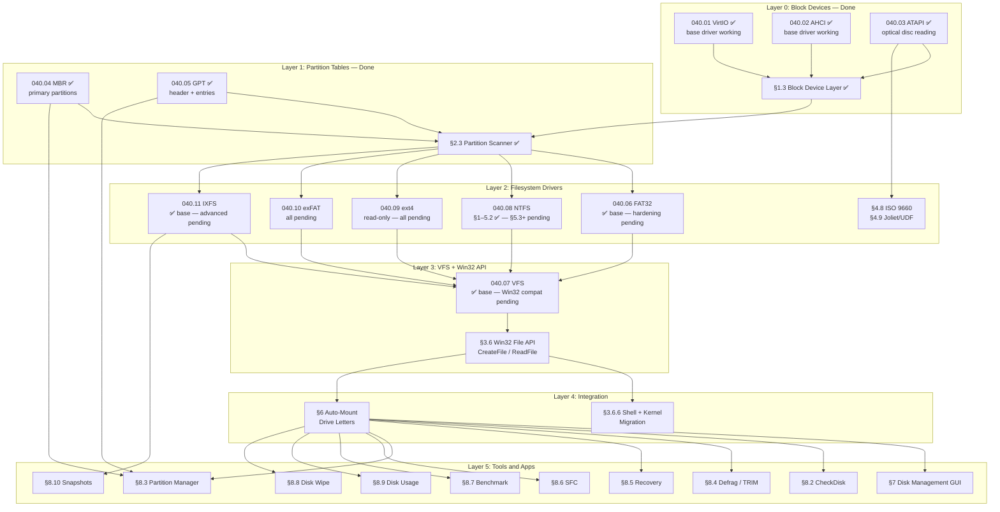

# Phase 06 — Storage & Persistent Filesystem

> **Goal:** Move from a RAM-only filesystem to real persistent storage. Implement
> disk drivers (virtio-blk, AHCI), a widely-compatible filesystem (FAT32), persist
> the custom IXFS format to disk, add partition table support (GPT/MBR), and build
> a graphical disk management tool.
> [!CAUTION]
> **Memory Rule:** Use `pmm_alloc_contiguous()` for ALL buffers > 4 KB (fonts, images, file data). `kmalloc` is ONLY for small kernel structs (≤ 4 KB). Violating this crashes the 2 MiB heap silently. See `rules.md` Known Gotchas and `/add-asset` workflow.

---

## TODO Completion Roadmap (Cross-File)

> [!IMPORTANT]
> **Twelve TODO files** contribute to the storage and filesystem subsystem. They have
> deep cross-dependencies that dictate implementation order. This roadmap shows
> the correct sequence — completing items out of order will cause rework.
>
> | File                            | Scope                                             |
> | ------------------------------- | ------------------------------------------------- |
> | `TODO-040-Filesystem.md`        | Master file — sections, priorities, OS comparison |
> | `TODO-040.01-VirtIO.md`         | VirtIO block driver hardening                     |
> | `TODO-040.02-AHCI.md`           | AHCI SATA driver hardening                        |
> | `TODO-040.03-ATAPI-SCSI-MMC.md` | ATAPI optical drive + SCSI layer                  |
> | `TODO-040.04-MBR.md`            | MBR partition table R/W                           |
> | `TODO-040.05-GPT.md`            | GPT partition table R/W                           |
> | `TODO-040.06-FAT32.md`          | FAT32 driver hardening                            |
> | `TODO-040.07-VFS.md`            | VFS enhancements + Win32 compat layer             |
> | `TODO-040.08-NTFS.md`           | NTFS driver (C: drive)                            |
> | `TODO-040.09-ext4.md`           | ext4 read-only driver                             |
> | `TODO-040.10-exFAT.md`          | exFAT driver                                      |
> | `TODO-040.11-IXFS.md`           | IXFS native filesystem hardening                  |
> | `TODO-040.12-BTRS.md`           | Btrfs read-only driver                            |
> | `TODO-040.13-APFS.md`           | APFS read-only driver                             |
> | `TODO-040.14-HFSPlus.md`       | HFS+ (Mac OS Extended) read-only driver           |
> | `TODO-040.15-NVMe-2.0.md`      | NVMe 2.0 PCIe SSD controller driver               |
> | `TODO-040.16-NVMe-2.1.md`      | NVMe 2.1 PCIe storage driver                      |

### Dependency Graph

### Phase-by-Phase Implementation Order

| ⭐ | Phase  | TODO File           | Section(s)                         | What It Delivers                                              | Depends On               | Status |
| -- | :----: | -------------------- | ---------------------------------- | ------------------------------------------------------------- | ------------------------ | :----: |
| 💎 | **1**  | `040.01-VirtIO.md`  | §1 PCI Transport                   | Modern PCI capability discovery, BAR mapping                  | —                        |   ⬜   |
| 💎 | **1**  | `040.01-VirtIO.md`  | §2 Initialization                  | Full feature negotiation + status machine                     | Phase 1 (§1)             |   ⬜   |
| 💎 | **1**  | `040.02-AHCI.md`    | §1 PCI + ABAR                      | PCI capability parsing, ABAR remapping                        | —                        |   ⬜   |
| 💎 | **1**  | `040.02-AHCI.md`    | §2 HBA Init                        | Port enumeration, command lists, FIS buffers                  | Phase 1 (§1)             |   ⬜   |
| 💎 | **2**  | `040.01-VirtIO.md`  | §3 Virtqueue                       | Descriptor rings, avail/used rings, kick                      | Phase 1                  |   ⬜   |
| 💎 | **2**  | `040.01-VirtIO.md`  | §4 MSI-X Interrupts                | Interrupt-driven I/O (no polling)                             | Phase 2 (§3)             |   ⬜   |
| 💎 | **2**  | `040.02-AHCI.md`    | §3 DMA R/W                         | READ/WRITE DMA EXT with PRDT                                  | Phase 1 (§2)             |   ⬜   |
| 💎 | **2**  | `040.02-AHCI.md`    | §4 Interrupt-Driven I/O            | IRQ-based completion, per-port ISR                            | Phase 1 (§2)             |   ⬜   |
| 💎 | **2**  | `040.03-ATAPI.md`   | §1–3 SCSI + READ                   | ATAPI packet command, SCSI READ(10/12)                        | AHCI Phase 1             |   ⬜   |
| 💎 | **2**  | `040.04-MBR.md`     | §1 Primary Parse                   | MBR primary partition reading                                 | blkdev (Layer 0)         |   ✅   |
| 💎 | **2**  | `040.04-MBR.md`     | §2 EBR Chain                       | Extended/logical partition walking                            | Phase 2 (§1)             |   ⬜   |
| 💎 | **2**  | `040.05-GPT.md`     | §1 Primary Header                  | GPT header + entry array parsing                              | blkdev (Layer 0)         |   ✅   |
| 💎 | **2**  | `040.05-GPT.md`     | §2 Backup Header                   | Backup GPT recovery + primary sync                            | Phase 2 (§1)             |   ⬜   |
| 💎 | **2**  | `040.05-GPT.md`     | §3 4Kn Support                     | 4096-byte sector partition tables                             | Phase 2 (§1)             |   ⬜   |
| 💎 | **3**  | `040.06-FAT32.md`   | §1 BPB Validation                  | Strict mount validation, dirty volume detect                  | FAT32 base               |   ⬜   |
| 💎 | **3**  | `040.06-FAT32.md`   | §2 FSInfo Sync                     | FSInfo validation + full FAT scan fallback                    | Phase 3 (§1)             |   ⬜   |
| 💎 | **3**  | `040.06-FAT32.md`   | §3 Dual-FAT                        | FAT mirroring + backup boot sector                            | Phase 3 (§1)             |   ⬜   |
| 💎 | **3**  | `040.06-FAT32.md`   | §4 LFN Support                     | Full LFN creation + deletion + Unicode                        | Phase 3 (§1)             |   ⬜   |
| 💎 | **3**  | `040.06-FAT32.md`   | §5 Timestamps                      | Hi-res creation time, year 2107 boundary                      | Phase 3 (§1)             |   ⬜   |
| 💎 | **3**  | `040.08-NTFS.md`    | §1 BPB                             | Volume boot record, cluster geometry                          | blkdev + partition       |   ✅   |
| 💎 | **3**  | `040.08-NTFS.md`    | §2 MFT + Fixup                     | MFT inode reader + USA fixup                                  | Phase 3 (§1)             |   ✅   |
| 💎 | **3**  | `040.08-NTFS.md`    | §3 Attribute Engine                | Attribute iterator, $FILE_NAME, $STD_INFO                     | Phase 3 (§2)             |   ✅   |
| 💎 | **3**  | `040.08-NTFS.md`    | §4 Data Runs                       | VCN→LCN decoder + file data reader                            | Phase 3 (§3)             |   ✅   |
| 💎 | **4**  | `040.08-NTFS.md`    | §5.1–5.2 B+ Tree                   | $INDEX_ROOT + INDX buffer reader                              | Phase 3 (§3–4)           |   ✅   |
| 💎 | **4**  | `040.08-NTFS.md`    | §5.3 Directory Lookup              | Full `C:\path\to\file` resolution                             | Phase 4 (§5.2)           |   ⬜   |
| 💎 | **4**  | `040.08-NTFS.md`    | §5.4 Dir Enumeration               | FindFirstFile / FindNextFile for NTFS                         | Phase 4 (§5.1–5.2)       |   ⬜   |
| 💎 | **4**  | `040.08-NTFS.md`    | §6.1 VFS Registration              | Mount NTFS as C: drive                                        | Phase 4 (§5.3) + VFS     |   ⬜   |
| 💎 | **4**  | `040.09-ext4.md`    | §1 Superblock                      | ext4 superblock + feature flag gating                         | blkdev + partition       |   ⬜   |
| 💎 | **4**  | `040.09-ext4.md`    | §2 Block Groups                    | Group descriptor table, bitmaps                               | Phase 4 (§1)             |   ⬜   |
| 💎 | **4**  | `040.09-ext4.md`    | §3 Inodes                          | Inode table reader + metadata                                 | Phase 4 (§2)             |   ⬜   |
| 💎 | **4**  | `040.09-ext4.md`    | §4 Extent Tree                     | Extent-based block mapping (ext4)                             | Phase 4 (§3)             |   ⬜   |
| 💎 | **4**  | `040.09-ext4.md`    | §5 Indirect Blocks                 | Legacy ext2/ext3 block pointer fallback                       | Phase 4 (§3)             |   ⬜   |
| 💎 | **4**  | `040.09-ext4.md`    | §6 Directories                     | Linear parser + HTree directory index                         | Phase 4 (§3)             |   ⬜   |
| 💎 | **4**  | `040.09-ext4.md`    | §7 CRC32C                          | Metadata checksum validation                                  | Phase 4 (§1)             |   ⬜   |
| 💎 | **4**  | `040.09-ext4.md`    | §8 VFS Integration                 | Mount ext4 partitions to drive letters                        | Phase 4 (§6) + VFS       |   ⬜   |
| 💎 | **5**  | `040.07-VFS.md`     | §1.1 Case-Insensitive Paths        | `$UpCase` / uppercase path comparison                         | VFS base                 |   ⬜   |
| 💎 | **5**  | `040.07-VFS.md`     | §1.2 Mandatory Locking             | Share mode enforcement (FILE_SHARE_*)                         | VFS base                 |   ⬜   |
| 💎 | **5**  | `040.07-VFS.md`     | §1.3 Deletion Semantics            | Mark-for-delete-on-close (Windows style)                      | VFS base                 |   ⬜   |
| 💎 | **5**  | `040.07-VFS.md`     | §1.4 File Identifiers              | 64-bit unique file IDs                                        | VFS base                 |   ⬜   |
| 💎 | **5**  | `040.07-VFS.md`     | §1.5 Memory-Mapped Exec            | DLL/EXE mmap loading                                          | Phase 5 (§1.4)           |   ⬜   |
| 💎 | **5**  | `040.07-VFS.md`     | §1.6 Attributes + Times            | FILETIME API (100ns since 1601)                               | VFS base                 |   ⬜   |
| 💎 | **5**  | `040.07-VFS.md`     | §1.7 Byte-Range Locks              | LockFile / UnlockFile                                         | Phase 5 (§1.2)           |   ⬜   |
| 💎 | **5**  | `040-Filesystem.md` | §3.6.1 Handle Table                | HANDLE type, error codes, std handles                         | VFS base                 |   ⬜   |
| 💎 | **5**  | `040-Filesystem.md` | §3.6.2 CreateFile                  | CreateFile / CloseHandle                                      | Phase 5 (§3.6.1)         |   ⬜   |
| 💎 | **5**  | `040-Filesystem.md` | §3.6.3 ReadFile                    | ReadFile / WriteFile / SetFilePointer                         | Phase 5 (§3.6.2)         |   ⬜   |
| 💎 | **5**  | `040-Filesystem.md` | §3.6.4 Directories                 | FindFirstFile / CreateDirectory                               | Phase 5 (§3.6.2)         |   ⬜   |
| 💎 | **5**  | `040-Filesystem.md` | §3.6.5 File Mgmt                   | DeleteFile / MoveFile / CopyFile                              | Phase 5 (§3.6.2)         |   ⬜   |
| 💎 | **5**  | `040-Filesystem.md` | §3.6.6 Shell Migration             | Shell + kernel → Win32 API (15 files)                         | Phase 5 (§3.6.2–5)       |   ⬜   |
| 💎 | **5**  | `040.07-VFS.md`     | §2.1–2.4 Feature Spoofing          | ADS, ACL stubs, vol info, reparse                             | Phase 5 (§3.6)           |   ⬜   |
| 💎 | **6**  | `040-Filesystem.md` | §6.1 Auto-Mount                    | Drive letter assignment from real disks                       | All FS drivers + VFS     |   ⬜   |
| 💎 | **6**  | `040-Filesystem.md` | §6.2 Mount/Unmount                 | Shell `mount` / `umount` commands                             | Phase 6 (§6.1)           |   ⬜   |
| 💎 | **6**  | `040.10-exFAT.md`   | §1–3 Boot + FAT + Bitmap           | exFAT volume parsing basics                                   | blkdev + partition       |   ⬜   |
| 💎 | **6**  | `040.10-exFAT.md`   | §4–5 Upcase + Dir                  | Directory entry sets, timestamps                              | Phase 6 (§1–3)           |   ⬜   |
| 💎 | **6**  | `040.10-exFAT.md`   | §6–7 File Read + Lookup            | File data reading + path resolution                           | Phase 6 (§4–5)           |   ⬜   |
| 💎 | **6**  | `040.10-exFAT.md`   | §8–9 VFS Integration               | Mount exFAT to drive letter                                   | Phase 6 (§6–7) + VFS     |   ⬜   |
| ⭐ | **6**  | `040.03-ATAPI.md`   | §4–6 Capacity + Status             | Full SCSI layer (TOC, disc info)                              | ATAPI Phase 2            |   ⬜   |
| ⭐ | **6**  | `040-Filesystem.md` | §4.8 ISO 9660                      | CD/DVD filesystem read-only                                   | ATAPI + blkdev           |   ⬜   |
| ⭐ | **6**  | `040-Filesystem.md` | §4.9 Joliet / UDF                  | DVD/Blu-ray extended filesystem formats                       | Phase 6 (§4.8)           |   ⬜   |
| 💎 | **7**  | `040.06-FAT32.md`   | §6 Performance                     | Sector cache tuning, contiguous reads                         | FAT32 Phase 3            |   ⬜   |
| 💎 | **7**  | `040.06-FAT32.md`   | §7–8 Consistency                   | FAT chain validation, fsck checks                             | FAT32 Phase 3            |   ⬜   |
| 💎 | **7**  | `040.01-VirtIO.md`  | §5–7 Error + Flush                 | Error recovery + flush/write-back                             | VirtIO Phase 2           |   ⬜   |
| 💎 | **7**  | `040.02-AHCI.md`    | §5–7 NCQ + Error                   | Native Command Queuing, error recovery                        | AHCI Phase 2             |   ⬜   |
| 💎 | **7**  | `040.04-MBR.md`     | §3–6 CHS + Write + Create          | CHS encoding, MBR write, partition CRUD                       | MBR Phase 2              |   ⬜   |
| 💎 | **7**  | `040.05-GPT.md`     | §4–7 GUID + Attrs + Hybrid         | Type GUID expansion, attribute decode                         | GPT Phase 2              |   ⬜   |
| 💎 | **7**  | `040.05-GPT.md`     | §8–11 GPT Write + CLI              | GPT create + delete + resize + shell cmd                      | Phase 7 (§4–7)           |   ⬜   |
| 💎 | **7**  | `040.11-IXFS.md`    | §1–8 Verification                  | Verify existing IXFS implementation                           | —                        |   ⬜   |
| 💎 | **8**  | `040.11-IXFS.md`    | §9 ADS                             | Native Alternate Data Streams                                 | IXFS verified (Phase 7)  |   ⬜   |
| 💎 | **8**  | `040.11-IXFS.md`    | §10 ACLs                           | Security descriptors + DACL/SACL                              | IXFS verified (Phase 7)  |   ⬜   |
| 💎 | **8**  | `040.11-IXFS.md`    | §11 Links                          | Hard links + symbolic links                                   | IXFS verified (Phase 7)  |   ⬜   |
| ⭐ | **8**  | `040.11-IXFS.md`    | §12–14 Unicode + Sparse + Journal  | Unicode normalization, sparse files, change journals          | IXFS verified (Phase 7)  |   ⬜   |
| ⭐ | **8**  | `040.11-IXFS.md`    | §15–19 Advanced                    | Quotas, TRIM/discard, compression, encryption, online defrag  | IXFS Phase 8             |   ⬜   |
| ⭐ | **8**  | `040-Filesystem.md` | §5.9.10 Per-File Encryption        | AES-256-XTS per-block — beats NTFS EFS (no AD required)       | IXFS xattrs (§5.9.8)     |   ⬜   |
| ⭐ | **8**  | `040-Filesystem.md` | §5.9.11 Block Deduplication        | Inline xxHash64 dedup — beats Win Server + btrfs              | IXFS CoW                 |   ⬜   |
| 💎 | **8**  | `040-Filesystem.md` | §8.1 Disk Cache                    | Block-level LRU cache (all FS drivers)                        | Phase 6 (Mount)          |   ⬜   |
| 💎 | **9**  | `040-Filesystem.md` | §8.2 CheckDisk                     | CLI `chkdsk` + GUI                                            | Phase 6 (Mount)          |   ⬜   |
| 💎 | **9**  | `040-Filesystem.md` | §8.3 Partition Mgr                 | CLI `diskpart` + GUI                                          | Phase 7 (GPT/MBR Write)  |   ⬜   |
| 💎 | **9**  | `040-Filesystem.md` | §8.6 SFC                           | CLI `sfc` + GUI                                               | Phase 6 (Mount)          |   ⬜   |
| 💎 | **9**  | `040-Filesystem.md` | §8.13 I/O Metrics                  | Per-device stats + `iostat` cmd                               | blkdev                   |   ⬜   |
| 💎 | **9**  | `040-Filesystem.md` | §7 Disk Mgmt GUI                   | Graphical partition layout viewer                             | Phase 6 (Mount)          |   ⬜   |
| ⭐ | **10** | `040-Filesystem.md` | §8.4 Defrag/TRIM                   | CLI `defrag` + visual block map GUI                           | Phase 6 (Mount)          |   ⬜   |
| ⭐ | **10** | `040-Filesystem.md` | §8.5 Recovery                      | CLI `recover` + Recovery Wizard GUI                           | Phase 6 (Mount)          |   ⬜   |
| ⭐ | **10** | `040-Filesystem.md` | §8.7 Disk Benchmark                | CLI `diskbench` + real-time bar GUI                           | blkdev                   |   ⬜   |
| ⭐ | **10** | `040-Filesystem.md` | §8.8 Disk Wipe                     | Secure erase CLI + GUI                                        | Phase 6 (Mount)          |   ⬜   |
| ⭐ | **10** | `040-Filesystem.md` | §8.9 Disk Usage                    | CLI `diskuse` + treemap GUI                                   | Phase 6 (Mount)          |   ⬜   |
| ⭐ | **10** | `040-Filesystem.md` | §8.10 Snapshots                    | CLI `snapshot` + Snapshot Manager GUI                         | IXFS §6 CoW              |   ⬜   |
| 🔵 | —      | `040.15-NVMe-2.0.md`| §1–10 NVMe 2.0 PCIe Driver         | Full NVMe driver (28 sections, 5 exclusives)                  | PCI                      |   ⬜   |
| 🔵 | —      | `040.16-NVMe-2.1.md`| §1–19 NVMe 2.1 PCIe Driver         | Full NVMe driver (19 sections, 5 exclusives)                  | PCI                      |   ⬜   |
| 🔵 | —      | `040-Filesystem.md` | §8.12 USB Mass Storage             | USB storage + hot-plug (stretch)                              | USB host controller      |   ⬜   |

### Notes and Tips

> [!NOTE]
> **Phases 1–4** build the core storage stack: block device hardening (MSI-X, NCQ),
> partition table extensions (EBR, 4Kn, backup GPT), and filesystem drivers
> (FAT32 hardening, NTFS C: drive, ext4 read-only).
>
> **Phase 5** delivers the Win32-compatible file API (`CreateFile`/`ReadFile`/`WriteFile`)
> and completes VFS enhancements (case-insensitive paths, share modes, deletion
> semantics). This is the **critical single gate**: all shell commands, font loading,
> icon loading, registry I/O, crash dumps, and swap must migrate from `vfs_*()` to
> Win32 API. Expect ~15 files to touch in the migration step (§3.6.6).
>
> **Phases 6–7** wire everything together: auto-mount drive letters, exFAT/ISO 9660,
> driver hardening (NCQ, error recovery, GPT write), and IXFS verification.
>
> **Phases 8–10** are polish and competitive features: IXFS advanced features (ADS,
> ACLs, compression, encryption), disk tools (chkdsk, defrag, recovery), and GUI
> utilities (Disk Management, Usage Analyzer, Benchmark).

> [!TIP]
> **Quick wins (any time — zero dependencies):**
> - `§8.13` (I/O metrics) — wraps existing `blkdev_read/write` counters, no FS needed.
> - `§8.7` (disk benchmark) — pure blkdev-level sequential + random I/O.
> - `040.11-IXFS.md §1–8` (verification) — validate existing code, no new features.
> - `040.05-GPT.md §5.1` (type GUID registry) — data-only expansion, already ✅.
>
> **NTFS is the critical path to C: drive.** Phases 1–3 of `040.08-NTFS.md`
> (BPB, MFT, attributes, data runs, B+ tree) are ✅ complete. Phase 4
> (§5.3 directory lookup + §6.1 VFS registration) is the final gate before
> NTFS serves as the boot volume.
>
> **The biggest single task** is `§3.6 Win32 File API` + `§3.6.6 Migration` —
> it touches every kernel file that does I/O. Plan for 2–3 days of focused work.
>
> **Sub-file roadmaps exist** within each of the 11 TODO files (e.g.,
> `040.08-NTFS.md` has its own 5-phase internal roadmap). This master roadmap
> shows the correct cross-file sequencing; consult sub-file roadmaps for
> intra-file task ordering.

> [!WARNING]
> **Memory allocation rule is project-wide.** Every new buffer in every sub-file
> must follow the rule: `kmalloc` ≤ 4 KB, `pmm_alloc_contiguous()` for everything
> larger. The NTFS INDX buffer (4 KB), ext4 block group descriptors, and exFAT
> allocation bitmap are all candidates for PMM allocation.
> See `rules.md` Known Gotchas.

> [!CAUTION]
> **Never implement Phase 5 (Win32 API) before Phase 4 (FS drivers).** The Win32
> API functions (`CreateFile`, `ReadFile`) dispatch through `vfs_ops` callbacks.
> If the NTFS or ext4 drivers aren't registered, `CreateFile("D:\\...")` will fail
> silently with `ERROR_PATH_NOT_FOUND`. Complete at least NTFS VFS registration
> (§6.1) and ext4 VFS integration (§8) before migrating the shell.

---

### 4.8 ISO 9660 Read Support

**Prompt:** ISO 9660 is the standard CD/DVD filesystem. It uses 2048-byte sectors. The Primary Volume Descriptor (PVD) is at sector 16, identified by signature "CD001". The root directory record in the PVD gives the LBA and size of the root directory. Directory records are variable-length with a length byte, extent LBA, data length, flags (bit 1 = directory), and 8.3 filename. Files are stored as contiguous extents (no fragmentation). Rock Ridge extensions add POSIX metadata (long names, permissions, symlinks) via System Use Entries appended to each directory record. This is a read-only filesystem. Requires ATAPI driver (§1.4) for real optical media, or can read `.iso` files attached as raw block devices. After completing all items, mark every item as `[x]`, run `bash scripts/build.sh clean`, and commit as `"fs: ISO 9660 read support"`. Add notes directly in this TODO section. After implementation, save any gotchas, solutions, and important information to MCP memory (`mcp_memory_create_entities` / `mcp_memory_add_observations`).
> ISO 9660 is the standard filesystem for CD/DVD media. Read-only by design.
> Requires the ATAPI driver (§1.4) for real optical media, or raw block
> access for `.iso` files attached via QEMU `-cdrom`.

- [ ] Create `src/kernel/fs/iso9660.c` and `include/kernel/fs/iso9660.h`
- [ ] Parse Primary Volume Descriptor at sector 16 (2048-byte sectors)
- [ ] Define `struct iso9660_dir_record` (length, extent LBA, data length, flags, name)
- [ ] Implement `iso9660_read_dir(extent_lba, size)` — parse directory records
- [ ] Implement `iso9660_find(path)` — traverse directory tree from root
- [ ] Implement `iso9660_read_file(extent_lba, size, buf)` — read contiguous extent
- [ ] Handle both 8.3 names and Rock Ridge (POSIX extensions) if present
- [ ] VFS integration: register iso9660 driver (read-only), mount to drive letter
  - [ ] Implement VFS callbacks: open, close, read, readdir, finddir, stat (no write/create/delete/rename/truncate — read-only FS)
- [ ] Add ISO 9660 probe to partition scanner (check PVD signature `"CD001"`)
- [ ] Test: `bash scripts/build.sh run` with ISO 9660 test disk
- [ ] Commit: `"fs: ISO 9660 read support"`

### 4.9 Joliet / UDF Read Support

**Prompt:** Joliet extends ISO 9660 with Unicode filenames via a Supplementary Volume Descriptor (detected by escape sequences in the SVD). Filenames are UTF-16BE encoded. UDF (Universal Disk Format) is used on DVDs and Blu-ray discs. UDF parsing starts from the Anchor Volume Descriptor Pointer at sector 256, which points to the Main Volume Descriptor Sequence. Files are located via File Identifier Descriptors and allocation descriptors (short/long/extended). Both Joliet and UDF build on the ISO 9660 infrastructure and the ATAPI driver. After completing all items, mark every item as `[x]`, run `bash scripts/build.sh clean`, and commit as `"fs: Joliet + UDF read support"`. Add notes directly in this TODO section. After implementation, save any gotchas, solutions, and important information to MCP memory (`mcp_memory_create_entities` / `mcp_memory_add_observations`).
> Joliet extends ISO 9660 with long Unicode filenames. UDF is the standard
> for DVD and Blu-ray media. Both build on top of ISO 9660 infrastructure.

- [ ] Joliet: parse Supplementary Volume Descriptor, decode UTF-16BE filenames
- [ ] UDF: parse Anchor Volume Descriptor Pointer (sector 256)
- [ ] UDF: parse Partition Descriptor, Logical Volume Descriptor
- [ ] UDF: implement `udf_read_dir()` — parse File Identifier Descriptors
- [ ] UDF: implement `udf_read_file()` — follow allocation descriptors
- [ ] VFS integration: register UDF driver (read-only), implement open, close, read, readdir, finddir, stat
- [ ] Test: `bash scripts/build.sh run` with Joliet/UDF test disk
- [ ] Commit: `"fs: Joliet + UDF read support"`

---

## 6. Drive Letter Mounting

### 6.1 Auto-Mount System

**Prompt:** After the partition scanner discovers all partitions, assign drive letters automatically: C:\ is always the first NTFS partition (the system drive — Windows compatibility), then D:\, E:\, etc. for additional partitions in discovery order. IXFS partitions are assigned the next available letter. The existing `vfs_mount()` needs to support real disk-backed partitions (not just the initrd). Store mount configuration in Registry: `HKLM\SYSTEM\Storage\Drive\{letter}\Device` and `Filesystem`. Log each mount to serial: "Mounted C:\ (NTFS, 2.0 GB) on sata0-part1". After completing all items, mark every item as `[x]`, run `bash scripts/build.sh clean`, and commit as `"fs: auto-mount drive letters"`. Add notes directly in this TODO section. After implementation, save any gotchas, solutions, and important information to MCP memory (`mcp_memory_create_entities` / `mcp_memory_add_observations`).
- [ ] After partition scanning: auto-assign drive letters
  - [ ] `C:\` — first NTFS partition (system drive)
  - [ ] `D:\`, `E:\`, etc. — additional partitions in order (IXFS, FAT32, ext2/3/4, exFAT)
- [ ] Update existing `vfs_mount()` to support real disk partitions (not just initrd)
- [ ] Store mount configuration in Registry: `HKLM\SYSTEM\Storage\Drive\{letter}\Device`, `Filesystem`
- [ ] Log mounts: "Mounted C:\ (NTFS, 2.0 GB) on disk0-part1"
- [ ] Commit: `"fs: auto-mount drive letters"`

### 6.2 Manual Mount/Unmount

**Prompt:** Shell commands `mount` and `umount` give the user manual control. `mount D: /dev/disk1p1 fat32` maps a partition to a drive letter. `umount D:` flushes all pending writes (dirty buffers, journal), then removes the VFS mount point. Prevent unmounting C:\ while the system is running (return error). The `mount` command with no arguments lists all current mounts. After completing all items, mark every item as `[x]`, run `bash scripts/build.sh clean`, and commit as `"shell: mount/umount commands"`. Add notes directly in this TODO section. After implementation, save any gotchas, solutions, and important information to MCP memory (`mcp_memory_create_entities` / `mcp_memory_add_observations`).
- [ ] Shell command: `mount D: /dev/disk1p1 fat32` — mount a partition
- [ ] Shell command: `umount D:` — unmount a drive
- [ ] Flush pending writes before unmount
- [ ] Prevent unmount of `C:\` while running
- [ ] Commit: `"shell: mount/umount commands"`

---

## 7. Disk Management GUI

### 7.1 Disk Management App

**Prompt:** The Disk Management app is a two-panel window. The upper panel is a table listing mounted drives: Drive letter, Total Size, Used, Free, Filesystem type. The lower panel shows a graphical representation of each physical disk: colored bars proportional to partition sizes (NTFS = blue, FAT32 = green, IXFS = cyan, unallocated = gray) with labels showing drive letter, filesystem, and size. Data comes from `blkdev_list()` for physical disks, the partition scanner for partition info, and VFS `stat()` for usage stats. After completing all items, mark every item as `[x]`, run `bash scripts/build.sh clean`, and commit as `"apps: Disk Management layout"`. Add notes directly in this TODO section. After implementation, save any gotchas, solutions, and important information to MCP memory (`mcp_memory_create_entities` / `mcp_memory_add_observations`).
- [ ] Create `src/apps/diskmgr/diskmgr.c`
- [ ] Upper panel: table view of mounted drives (Drive, Size, Used, Free, Filesystem)
- [ ] Lower panel: graphical partition layout per physical disk
  - [ ] Colored bars proportional to partition size
  - [ ] Labels: drive letter, filesystem, size
  - [ ] Unallocated space shown as empty bar
- [ ] Read from: blkdev list + partition table + filesystem stats
- [ ] Commit: `"apps: Disk Management layout"`

### 7.2 Disk Operations

**Prompt:** Disk operations are high-risk and need confirmation dialogs. Create partition: select unallocated space, specify size and filesystem type (FAT32 or IXFS), write a new GPT/MBR entry, then format. Delete partition: remove the partition table entry (WARNING: destroys all data). Format: rewrite the filesystem structures (`fat32_format()` or `ixfs_format()`). Change drive letter: update the VFS mount point and Registry entry. View usage: show a pie chart or bar of used vs. free space. Stretch goals: partition resize (complex — requires filesystem-aware shrink/grow) and SMART status for AHCI drives. After completing all items, mark every item as `[x]`, run `bash scripts/build.sh clean`, and commit as `"apps: Disk Management operations"`. Add notes directly in this TODO section. After implementation, save any gotchas, solutions, and important information to MCP memory (`mcp_memory_create_entities` / `mcp_memory_add_observations`).
- [ ] Create partition: select unallocated space → set size + filesystem type
- [ ] Delete partition: select partition → confirm → delete (removes data!)
- [ ] Format partition: select partition → choose filesystem (NTFS, FAT32, IXFS)
- [ ] Assign/change drive letter
- [ ] View usage: pie chart or bar showing used vs. free
- [ ] *(Stretch)* Resize partition (requires filesystem support)
- [ ] *(Stretch)* SMART status for AHCI/NVMe drives
- [ ] Commit: `"apps: Disk Management operations"`

---

## 8. Agent-Recommended Additions

> Items not in the research files but critical for a complete storage subsystem.

### 8.1 Disk Cache (Buffer Cache)

**Prompt:** The block-level disk cache sits between the filesystem drivers and the blkdev layer. It caches recently-read sectors in memory using an LRU eviction policy. Write-back mode: mark cached blocks as dirty on write, batch dirty blocks and flush to disk periodically (every 5 seconds) or on explicit `sync()`. The cache should be configurable (1-8 MB). `cache_flush()` writes all dirty blocks (called on shutdown). `cache_invalidate(dev)` clears all cached blocks for a device (called on unmount). Note: IXFS already has its own buffer cache (§5.5.2) — this is a lower-level, device-agnostic cache that benefits all filesystems. After completing all items, mark every item as `[x]`, run `bash scripts/build.sh clean`, and commit as `"fs: block-level disk cache"`. Add notes directly in this TODO section. After implementation, save any gotchas, solutions, and important information to MCP memory (`mcp_memory_create_entities` / `mcp_memory_add_observations`).
- [ ] Implement block-level read cache (LRU, configurable size: 1–8 MB)
- [ ] Cache recently read sectors to avoid repeated disk I/O
- [ ] Write-back cache: batch writes, flush periodically or on sync
- [ ] `cache_flush()` — force write all dirty blocks (called on shutdown)
- [ ] `cache_invalidate(dev)` — clear cache for a device (on unmount)
- [ ] Commit: `"fs: block-level disk cache"`

### 8.2 Filesystem Integrity / CheckDisk

**Prompt:** CheckDisk validates filesystem consistency after crashes or corruption. For IXFS: validate superblock magic/version/CRC, verify free block bitmap matches actual block references, check inode reference counts against directory entries, detect orphan inodes, verify CRC32C checksums, validate journal state, and check extent tree consistency. For FAT32: validate BPB, compare FAT copies, check chain consistency (no cross-links or loops), detect lost clusters. The CLI `chkdsk C:` runs all checks; `/fix` auto-repairs issues; `/scan` is read-only. Auto-run on mount if the filesystem's "dirty" flag is set. The GUI version wraps the same logic with a progress bar, drive selector, and results panel. After completing all items, mark every item as `[x]`, run `bash scripts/build.sh clean`, and commit as `"tools: chkdsk command"` and `"apps: CheckDisk GUI"`. Add notes directly in this TODO section. After implementation, save any gotchas, solutions, and important information to MCP memory (`mcp_memory_create_entities` / `mcp_memory_add_observations`).
> **Priority: P2** — Critical for data integrity after crashes

#### CLI: `chkdsk`
- [ ] Shell command: `chkdsk C:` — run filesystem check on a volume
- [ ] `chkdsk C: /fix` — auto-repair detected issues
- [ ] `chkdsk C: /scan` — scan-only mode (no modifications)
- [ ] IXFS checks:
  - [ ] Validate superblock magic, version, and self-checksum
  - [ ] Verify free block bitmap consistency (allocated vs. referenced)
  - [ ] Check inode reference counts against directory entries
  - [ ] Detect orphan inodes (allocated but unreferenced)
  - [ ] Verify checksum table integrity (CRC32C mismatches)
  - [ ] Validate journal state (replay or discard incomplete txn)
  - [ ] Check extent tree consistency (overlapping, out-of-bounds)
- [ ] FAT32 checks:
  - [ ] Validate BPB fields and FAT copies
  - [ ] Check FAT chain consistency (no cross-links, no loops)
  - [ ] Detect lost clusters (allocated but not in any chain)
- [ ] Auto-check on mount if "dirty" flag is set (unclean shutdown)
- [ ] Commit: `"tools: chkdsk command"`

#### GUI: CheckDisk Utility
- [ ] Create `src/apps/chkdsk/chkdsk_gui.c`
- [ ] Drive selector dropdown (list mounted volumes)
- [ ] Options: Scan Only / Scan & Fix / Surface Scan
- [ ] Real-time progress bar with phase descriptions
- [ ] Results panel: errors found, fixed, remaining
- [ ] Log output scrollable text area
- [ ] "Schedule on next boot" option for system drive
- [ ] Commit: `"apps: CheckDisk GUI"`

### 8.3 Partition Manager

**Prompt:** The partition manager provides both CLI and GUI interfaces for managing disk partition tables. The CLI `diskpart` operates interactively: `list disks` shows physical disks, `list parts <disk>` shows partitions, `create` writes a new GPT/MBR entry and formats, `delete` removes an entry, `format` reinitializes a filesystem, `assign` changes drive letters. Reads/writes GPT and MBR structures from §2.1/§2.2. The GUI version shows a graphical bar per disk with color-coded partition segments. Right-click context menus for create, delete, format, change letter, properties. All destructive operations require confirmation dialogs. After completing all items, mark every item as `[x]`, run `bash scripts/build.sh clean`, and commit as `"tools: diskpart command"` and `"apps: Partition Manager GUI"`. Add notes directly in this TODO section. After implementation, save any gotchas, solutions, and important information to MCP memory (`mcp_memory_create_entities` / `mcp_memory_add_observations`).
> **Priority: P2** — Essential for disk management

#### CLI: `diskpart`
- [ ] Shell command: `diskpart` — interactive partition manager
- [ ] `diskpart list disks` — list all physical disks with sizes
- [ ] `diskpart list parts <disk>` — list partitions on a disk
- [ ] `diskpart create <disk> <size_mb> <type>` — create partition (FAT32/IXFS)
- [ ] `diskpart delete <disk> <part_num>` — delete a partition
- [ ] `diskpart format <drive> <fs_type> [label]` — format a partition
- [ ] `diskpart assign <part> <letter>` — assign drive letter
- [ ] `diskpart active <disk> <part>` — set active/boot partition
- [ ] `diskpart info <drive>` — show detailed partition/volume info
- [ ] Read/write GPT and MBR partition tables
- [ ] Safety: confirm before destructive operations
- [ ] Commit: `"tools: diskpart command"`

#### GUI: Partition Manager
- [ ] Create `src/apps/partmgr/partmgr.c`
- [ ] Upper panel: list view of all disks and partitions (tabular)
- [ ] Lower panel: graphical disk bar with proportional partition segments
  - [ ] Color-coded by filesystem type (NTFS=blue, FAT32=green, IXFS=cyan, unalloc=gray)
  - [ ] Labels: drive letter, filesystem, size, % used
- [ ] Right-click context menu: Create, Delete, Format, Change Letter, Properties
- [ ] Create Partition dialog: size slider, filesystem picker, label
- [ ] Format dialog: filesystem type, quick vs. full, label
- [ ] Warning dialogs for all destructive operations
- [ ] Disk properties panel: model, serial, total size, SMART status
- [ ] Commit: `"apps: Partition Manager GUI"`

### 8.4 Defragmentation & TRIM

**Prompt:** The defrag tool analyzes IXFS volumes for fragmentation (files with multiple non-contiguous extents). `defrag C: /analyze` reports the fragmentation percentage without modifying anything. `defrag C:` relocates blocks to consolidate extents — use the IXFS journal for crash safety during block relocation, skip metadata blocks, and prioritize large files. TRIM support sends ATA TRIM commands to SSDs for free block ranges (requires AHCI driver support for DATA SET MANAGEMENT command). The GUI shows a visual block map (grid of colored squares: used=blue, free=gray, fragmented=red) with real-time updates during defrag. After completing all items, mark every item as `[x]`, run `bash scripts/build.sh clean`, and commit as `"tools: defrag/trim command"` and `"apps: Disk Defragmenter GUI"`. Add notes directly in this TODO section. After implementation, save any gotchas, solutions, and important information to MCP memory (`mcp_memory_create_entities` / `mcp_memory_add_observations`).
> **Priority: P3** — Performance optimization for fragmented volumes

#### CLI: `defrag`
- [ ] Shell command: `defrag D:` — defragment an IXFS volume (or `defrag C:` for NTFS)
- [ ] `defrag C: /analyze` — report fragmentation level without modifying
- [ ] `defrag C: /trim` — send TRIM commands to SSD (AHCI/NVMe)
- [ ] `defrag C: /optimize` — auto-choose defrag (HDD) or TRIM (SSD)
- [ ] Fragmentation analysis: scan all inodes, count non-contiguous extents
- [ ] Defrag engine: relocate blocks to consolidate extents
  - [ ] Use journal for crash safety during block relocation
  - [ ] Skip metadata blocks and system files
  - [ ] Priority: large files first (biggest fragmentation impact)
- [ ] TRIM support: iterate free-block bitmap, send TRIM for free ranges
- [ ] Progress reporting: % complete, files processed, extents consolidated
- [ ] Commit: `"tools: defrag/trim command"`

#### GUI: Disk Defragmenter
- [ ] Create `src/apps/defrag/defrag_gui.c`
- [ ] Volume selector with fragmentation percentage per drive
- [ ] Visual block map: grid showing used/free/fragmented blocks (color-coded)
- [ ] Analyze button: populate fragmentation report without modifying
- [ ] Defragment / Optimize button: run with real-time block map updates
- [ ] Progress bar with ETA
- [ ] Results: fragments before/after, time elapsed
- [ ] Schedule option: auto-defrag weekly/monthly
- [ ] Commit: `"apps: Disk Defragmenter GUI"`

### 8.5 File & Data Recovery

**Prompt:** Recovery scans for deleted files that haven't been overwritten. For IXFS: scan the inode table for inodes with `i_links == 0` whose data blocks are still unallocated (block bitmap shows them free). Recover filenames from directory entry scans (entries with zeroed inode pointers). Assign a confidence score: high (all blocks intact), medium (some blocks overwritten), low (mostly gone). For FAT32: scan for directory entries with the 0xE5 deletion marker, follow the FAT chain if the first cluster is still intact. Data carving: scan raw blocks for magic bytes (JPEG: FFD8FF, PNG: 89504E47, PDF: 25504D46, ZIP: 504B0304). The GUI provides a wizard: select drive → scan → results table → select files → choose destination. After completing all items, mark every item as `[x]`, run `bash scripts/build.sh clean`, and commit as `"tools: recover command"` and `"apps: Recovery Wizard GUI"`. Add notes directly in this TODO section. After implementation, save any gotchas, solutions, and important information to MCP memory (`mcp_memory_create_entities` / `mcp_memory_add_observations`).
> **Priority: P3** — Essential safety net for accidental deletion

#### CLI: `recover`
- [ ] Shell command: `recover C:` — scan for recoverable deleted files
- [ ] `recover C: /list` — list recoverable files with sizes and confidence
- [ ] `recover C: /restore <filename> <dest>` — restore a specific file
- [ ] `recover C: /all <dest_dir>` — restore all recoverable files
- [ ] IXFS recovery:
  - [ ] Scan inode table for deleted inodes (i_links == 0, data intact)
  - [ ] Check if data blocks are still unallocated (not overwritten)
  - [ ] Recover filename from directory entry scan (d_inode == 0 entries)
  - [ ] Confidence score: high (blocks untouched), medium (partial), low (reused)
- [ ] FAT32 recovery:
  - [ ] Scan for directory entries with 0xE5 (deleted) marker
  - [ ] Follow FAT chain if first cluster still intact
- [ ] Data carving: scan raw blocks for file signatures (JPEG, PNG, PDF, ZIP, etc.)
- [ ] Commit: `"tools: recover command"`

#### GUI: Recovery Wizard
- [ ] Create `src/apps/recover/recover_gui.c`
- [ ] Step 1: Select drive to scan
- [ ] Step 2: Scanning progress with file count
- [ ] Step 3: Results table — filename, size, type, confidence (High/Med/Low)
- [ ] Step 4: Select files to recover → choose destination
- [ ] Preview panel for text/image files before recovery
- [ ] Filter by file type, date range, size range
- [ ] Commit: `"apps: Recovery Wizard GUI"`

### 8.6 System File Checker

**Prompt:** SFC validates OS integrity by comparing installed system files against a known-good manifest. The manifest `C:\Impossible\System\manifest.dat` is generated at build time: for each system file, store the relative path, CRC32C checksum, size, and version. `sfc /scannow` iterates the manifest, computes CRC32C of each file on disk, and reports/repairs mismatches. Use the CRC32C function from IXFS checksums (§5.9.3). Repair copies correct files from a recovery source (initrd or backup). The GUI wraps this with a "Scan Now" button, progress bar, and results table showing verified/corrupted/repaired files. After completing all items, mark every item as `[x]`, run `bash scripts/build.sh clean`, and commit as `"tools: sfc command"` and `"apps: System File Checker GUI"`. Add notes directly in this TODO section. After implementation, save any gotchas, solutions, and important information to MCP memory (`mcp_memory_create_entities` / `mcp_memory_add_observations`).
> **Priority: P2** — Validates OS integrity

#### CLI: `sfc`
- [ ] Shell command: `sfc /scannow` — verify all system files
- [ ] `sfc /verifyonly` — scan without repairing
- [ ] `sfc /scanfile <path>` — check a specific file
- [ ] Maintain `C:\Impossible\System\manifest.dat` — hash table of known-good system files
  - [ ] Each entry: relative path, expected CRC32C, expected size, version
  - [ ] Generated at build time by Makefile from system binaries
- [ ] Scan: iterate manifest, compute CRC32C of each file, compare
- [ ] Repair: restore corrupted files from C:\ / recovery image
- [ ] Report: files scanned, verified, corrupted, repaired
- [ ] Commit: `"tools: sfc command"`

#### GUI: System File Checker
- [ ] Create `src/apps/sfc/sfc_gui.c`
- [ ] "Scan Now" button — runs full system file verification
- [ ] Progress bar with current file being checked
- [ ] Results: list of verified/corrupted/repaired files
- [ ] Detail view: click a file to see expected vs. actual hash
- [ ] "Repair" button for corrupted files (requires recovery source)
- [ ] Log export: save results to `C:\Temp\sfc_log.txt`
- [ ] Commit: `"apps: System File Checker GUI"`

### 8.7 Disk Benchmark

**Prompt:** The disk benchmark measures I/O performance. Sequential tests: read/write 1 MiB blocks for 32 MiB total, calculate throughput (MB/s). Random tests: 4 KiB blocks at random LBAs for 1000 operations, calculate IOPS and latency (avg/min/max). Use `blkdev_read/write` directly to bypass filesystem overhead. Measure time with PIT ticks or TSC. The CLI `diskbench C:` runs all tests and prints results. The GUI shows real-time bar charts filling in as each test completes, with a results table and history for comparison. After completing all items, mark every item as `[x]`, run `bash scripts/build.sh clean`, and commit as `"tools: diskbench command"` and `"apps: Disk Benchmark GUI"`.
> **Priority: P3** — Performance testing and diagnostics

#### CLI: `diskbench`
- [ ] Shell command: `diskbench C:` — run sequential + random I/O benchmark
- [ ] Sequential read/write: 1 MiB block, 32 MiB total
- [ ] Random read/write: 4 KiB block, 1000 operations
- [ ] Report: throughput (MB/s), IOPS, latency (avg/min/max)
- [ ] Commit: `"tools: diskbench command"`

#### GUI: Disk Benchmark
- [ ] Create `src/apps/diskbench/diskbench_gui.c`
- [ ] Drive selector + Start button
- [ ] Real-time bar chart: seq read, seq write, rand read, rand write
- [ ] Results table: MB/s, IOPS, latency per test
- [ ] History: save past results for comparison
- [ ] Commit: `"apps: Disk Benchmark GUI"`

### 8.8 Disk Wipe / Secure Erase

**Prompt:** Disk wipe overwrites data for privacy. Quick wipe: zero all free space (write 0x00 to unallocated blocks). Full wipe: overwrite entire partition with zeros. DoD 5220.22-M: 3-pass pattern (zeros, ones, random). Secure erase: send ATA SECURITY ERASE command via AHCI (for SSDs). Only allow wiping unmounted or non-system drives. Mandatory confirmation prompt showing the volume label and size. The GUI version adds a wipe method picker, big warning dialog, progress bar with ETA, and completion report. After completing all items, mark every item as `[x]`, run `bash scripts/build.sh clean`, and commit as `"tools: diskwipe command"` and `"apps: Disk Wipe GUI"`.
> **Priority: P4** — Privacy and drive decommissioning

#### CLI: `diskwipe`
- [ ] Shell command: `diskwipe <drive> /quick` — zero all free space
- [ ] `diskwipe <drive> /full` — overwrite entire partition (1-pass zeros)
- [ ] `diskwipe <drive> /dod` — 3-pass DoD 5220.22-M wipe
- [ ] `diskwipe <drive> /trim` — secure erase via TRIM (SSD only)
- [ ] Mandatory confirmation prompt with volume label + size
- [ ] Progress bar with % complete and throughput
- [ ] Commit: `"tools: diskwipe command"`

#### GUI: Disk Wipe Utility
- [ ] Create `src/apps/diskwipe/diskwipe_gui.c`
- [ ] Drive selector (only unmounted or non-system drives)
- [ ] Wipe method picker: Quick / Full / DoD / Secure Erase
- [ ] Warning dialog with drive info and point-of-no-return confirmation
- [ ] Progress with ETA
- [ ] Completion certificate: report of wipe method, time, verification
- [ ] Commit: `"apps: Disk Wipe GUI"`

### 8.9 Disk Usage Analyzer

**Prompt:** The disk usage analyzer recursively walks directory trees and calculates space consumption. The CLI `diskuse C:` shows top-level directory sizes. `diskuse C:\Users /depth 3` recurses to 3 levels. `diskuse C: /top 20` shows the 20 largest files. Output is a tree with size, percentage of parent, and an ASCII bar. The GUI shows a treemap visualization (rectangles proportional to size, colored by file type), a expandable directory tree, and a "Largest Files" tab. Right-click options: Open location, Delete, Properties. After completing all items, mark every item as `[x]`, run `bash scripts/build.sh clean`, and commit as `"tools: diskuse command"` and `"apps: Disk Usage Analyzer GUI"`.
> **Priority: P3** — Visual space consumption analysis

#### CLI: `diskuse`
- [ ] Shell command: `diskuse C:` — show top-level directory sizes
- [ ] `diskuse C:\Users /depth 3` — recursive to N levels
- [ ] `diskuse C: /top 20` — show 20 largest files
- [ ] Output: tree with size, percentage, bar chart in terminal
- [ ] Commit: `"tools: diskuse command"`

#### GUI: Disk Usage Analyzer
- [ ] Create `src/apps/diskuse/diskuse_gui.c`
- [ ] Treemap visualization: rectangles sized by space consumption
- [ ] Hierarchical directory list with expandable nodes
- [ ] Color by file type (documents, images, executables, etc.)
- [ ] "Largest Files" tab: sorted list of biggest space consumers
- [ ] Right-click: Open location, Delete, Properties
- [ ] Commit: `"apps: Disk Usage Analyzer GUI"`

### 8.10 Volume Shadow Copy / Backup

**Prompt:** This builds on the existing IXFS snapshot infrastructure (§5.8). The CLI `snapshot` commands wrap `ixfs_snapshot_create/list/restore/delete`. `snapshot diff` compares two snapshots to show files added/modified/deleted (walk both extent trees, compare inodes). The GUI shows a timeline of snapshots sorted chronologically, with Create/Restore/Delete buttons and confirmation dialogs. A diff viewer shows changed files. Auto-snapshot scheduling (daily/weekly) stores the schedule in Registry `HKLM\SYSTEM\Storage\SnapshotSchedule`. After completing all items, mark every item as `[x]`, run `bash scripts/build.sh clean`, and commit as `"tools: snapshot command"` and `"apps: Snapshot Manager GUI"`.
> **Priority: P4** — Leverages existing IXFS snapshot infrastructure

#### CLI: `snapshot`
- [ ] Shell command: `snapshot create C: "backup_name"` — create named snapshot
- [ ] `snapshot list C:` — list all snapshots with dates and sizes
- [ ] `snapshot restore C: "backup_name"` — restore from snapshot
- [ ] `snapshot delete C: "backup_name"` — remove a snapshot
- [ ] `snapshot diff C: "snap_name"` — show files changed since snapshot
- [ ] Built on existing `ixfs_snapshot_create/list/restore/delete` APIs
- [ ] Commit: `"tools: snapshot command"`

#### GUI: Snapshot Manager
- [ ] Create `src/apps/snapshot/snapshot_gui.c`
- [ ] Timeline view: snapshots shown chronologically
- [ ] Create / Restore / Delete buttons with confirmation
- [ ] Diff viewer: files added/modified/deleted since a snapshot
- [ ] Auto-snapshot: schedule daily/weekly system snapshots
- [ ] Commit: `"apps: Snapshot Manager GUI"`

### 8.12 USB Mass Storage (Future)

**Prompt:** USB mass storage uses the Bulk-Only Transport (BOT) protocol over USB bulk endpoints. SCSI commands (INQUIRY, READ10, WRITE10, READ CAPACITY) are wrapped in Command Block Wrappers (CBW). This requires a USB host controller driver (xHCI or EHCI) as a prerequisite. Hot-plug detection: when a new USB device is attached, show a notification toast and auto-mount. Safe removal: flush all dirty buffers, unmount, then notify the user. This is a long-term stretch goal. After completing all items, mark every item as `[x]`, run `bash scripts/build.sh clean`, and commit as `"drivers: USB mass storage"`.
- [ ] *(Stretch)* USB mass storage class driver (bulk-only transport)
- [ ] *(Stretch)* SCSI command layer (INQUIRY, READ10, WRITE10)
- [ ] *(Stretch)* Hot-plug notification: show toast "USB drive detected", auto-mount
- [ ] *(Stretch)* Safe removal: flush + unmount + notification

### 8.13 Disk I/O Metrics

**Prompt:** Track per-device I/O statistics in the blkdev layer: `bytes_read`, `bytes_written`, `read_ops`, `write_ops`, accumulated since boot. Expose via `blkdev_stats(dev)` returning a stats struct. The Task Manager's Performance tab (Phase 05 §8.1) reads these for disk activity graphs. The `iostat` shell command prints a table: Device, Reads/s, Writes/s, Read MB/s, Write MB/s. Update counters atomically in `blkdev_read/write` dispatch functions. After completing all items, mark every item as `[x]`, run `bash scripts/build.sh clean`, and commit as `"drivers: disk I/O metrics"`.
- [ ] Track read/write byte counts per block device
- [ ] Track I/O operations per second
- [ ] Expose via `blkdev_stats(dev)` — used by Task Manager performance tab
- [ ] Shell command: `iostat` — show disk I/O statistics
- [ ] Commit: `"drivers: disk I/O metrics"`

### 8.14 System Directory Structure (First Boot)

**Prompt:** This section is marked complete. Verify the implementation is correct: confirm the Makefile sysroot target creates the standard directory tree (C:\Impossible\System\, C:\Impossible\Bin\, C:\Impossible\Fonts\, C:\Users\Default\, C:\Temp\, C:\Programs\, etc.) and that all paths exist after boot. The C:\ drive is NTFS. Run `bash scripts/build.sh clean` and list directories in the shell. Fix any inconsistencies in the TODO items below.
- [x] On first boot (fresh NTFS volume), create standard directory tree:
  - [x] `C:\Impossible\` — system root
  - [x] `C:\Impossible\System\` — system files
  - [x] `C:\Impossible\System\Config\Registry\` — Registry hive files
  - [x] `C:\Impossible\Bin\` — system executables
  - [x] `C:\Impossible\Fonts\` — system fonts
  - [x] `C:\Impossible\Icons\` — system icons
  - [x] `C:\Impossible\Wallpapers\` — wallpapers
  - [x] `C:\Users\Default\` — default user home
  - [x] `C:\Users\Default\Desktop\` — desktop shortcuts
  - [x] `C:\Users\Default\Documents\`
  - [x] `C:\Users\Default\Downloads\`
  - [x] `C:\Users\Default\Pictures\`
  - [x] `C:\Temp\` — temp files
  - [x] `C:\Recycle\` — recycle bin
  - [x] `C:\Programs\` — installed applications
- [x] ~~Copy initrd contents into IXFS directories~~ Created at build time via Makefile sysroot target
- [x] Commit: `"fs: system directory structure"`

---

## Priority Order

| Priority | Section                                      | Reason                                                          |
|----------|----------------------------------------------|-----------------------------------------------------------------|
| ✅ Done   | 1.1 VirtIO-blk Driver                        | Modern VirtIO 1.0 MMIO — implemented and tested                 |
| ✅ Done   | 1.2 AHCI Driver                              | SATA HDD/SSD — implemented and tested                           |
| ✅ Done   | 1.3 Block Device Layer                       | Unified interface over VirtIO/AHCI                              |
| ✅ Done   | 1.4 ATAPI Driver                             | Optical disc reading — implemented and tested                   |
| ✅ Done   | 2. Partition Tables                          | MBR + GPT + partition scanner                                   |
| ✅ Done   | 3.1 FAT32 Read                               | Read USB drives, boot media                                     |
| ✅ Done   | 3.2 FAT32 Write                              | Full read/write for removable media                             |
| ✅ Done   | 3.3 FAT32 VFS + Format                       | Complete FAT32 integration                                      |
| ✅ Done   | 3.4.1 FAT32 Offset-Aware Write               | Append support — unblocked TODO-005-Debug live logging          |
| ✅ Done   | 3.5 VFS Driver Interface                     | `vfs_ops` driver routing — callbacks used by §3.6               |
| ✅ Done   | 3.5.5 Directory/Metadata/Flush Callbacks     | mkdir, rmdir, set_attr, set_times, flush — implemented          |
| ✅ Done   | 5.1–5.9.4 IXFS on Disk                       | Full persistent IXFS with extents, journal, CoW, snapshots      |
| 🟡 P2     | 5.9.5 IXFS Alternate Data Streams            | Native ADS — NTFS feature parity                                |
| 🟡 P2     | 5.9.6 IXFS Security Descriptors (ACLs)       | Native ACLs — real file permissions                             |
| 🟡 P2     | 5.9.7 IXFS Hard Links / Symlinks             | WinSxS compat, filesystem navigation                            |
| ✅ Done   | 8.14 System Directory Structure              | Standard paths on first boot (NTFS C:\)                         |
| 🔴 P0     | **3.6 Win32-Compatible File API**            | **Native file API — CreateFile/ReadFile/WriteFile/CloseHandle** |
| ✅ Done   | 3.4.2 FAT32 FSInfo + Hint                    | FAT32 spec compliance, faster allocation — implemented          |
| ✅ Done   | 3.4.3 FAT32 Sector-Level Write Cache         | 64-slot LRU cache with dirty tracking                           |
| ✅ Done   | 3.4.4 FAT32 Multi-Volume                     | Remove static globals — mount multiple FAT32 partitions         |
| ✅ Done   | 3.4.5 FAT32 Concurrent Access                | Spinlock-based write locking per volume                         |
| 🟠 P1     | 3.4.6 FAT32 LFN Write                        | Write long filenames (currently 8.3 only on create)             |
| 🟠 P1     | 3.4.7 FAT32 Timestamp Support                | Proper timestamp decode/encode for SetFileTime()                |
| 🟠 P1     | 4.1 NTFS Read                                | Read Windows-formatted partitions                               |
| 🟠 P1     | 6.1 Auto-Mount                               | Drive letters from real disks                                   |
| 🟡 P2     | 4.2 NTFS Write                               | Write to Windows partitions                                     |
| 🟡 P2     | 4.4 ext2/3/4 Read                            | Read Linux-formatted partitions                                 |
| 🟡 P2     | 8.1 Disk Cache                               | Performance — reduce disk I/O                                   |
| 🟡 P2     | 6.2 Mount/Unmount Commands                   | Manual storage management                                       |
| 🟡 P2     | 7. Disk Management GUI                       | Visual partition management                                     |
| 🟡 P2     | 8.2 CheckDisk (CLI + GUI)                    | Filesystem integrity after crashes                              |
| 🟡 P2     | 8.3 Partition Manager (CLI + GUI)            | Disk partitioning                                               |
| 🟡 P2     | 8.6 System File Checker (CLI + GUI)          | OS integrity validation                                         |
| 🟢 P3     | 4.3 NTFS VFS                                 | Complete NTFS integration                                       |
| 🟢 P3     | 4.5 ext2/3/4 Write                           | Write to Linux partitions                                       |
| 🟢 P3     | 4.6 exFAT Read                               | USB drives > 32 GB                                              |
| 🟢 P3     | 4.8 ISO 9660 Read                            | CD/DVD filesystem                                               |
| 🟢 P3     | 4.9 Joliet/UDF Read                          | DVD/Blu-ray extensions                                          |
| 🟢 P3     | 5.9.8 IXFS Extended Attributes               | Metadata storage foundation                                     |
| 🟢 P3     | 5.9.9 IXFS Transparent Compression           | Per-block LZ4 — better than NTFS compression                    |
| 🟢 P3     | 5.9.10 IXFS Per-File Encryption              | AES-256-XTS — no Active Directory required (beats NTFS EFS)     |
| 🟢 P3     | 5.9.11 IXFS Block-Level Deduplication        | Inline dedup — beats Windows Server (scheduled) + btrfs (offline)|
| 🟢 P3     | 8.4 Defrag/TRIM (CLI + GUI)                  | Performance optimization                                        |
| 🟢 P3     | 8.5 File/Data Recovery (CLI + GUI)           | Accidental deletion safety net                                  |
| 🟢 P3     | 8.7 Disk Benchmark (CLI + GUI)               | Performance testing                                             |
| 🟢 P3     | 8.9 Disk Usage Analyzer (CLI + GUI)          | Space consumption analysis                                      |
| 🟢 P3     | 8.13 Disk I/O Metrics                        | Performance monitoring                                          |
| 🔵 P4     | 8.8 Disk Wipe (CLI + GUI)                    | Secure erase / privacy                                          |
| 🔵 P4     | 8.10 Snapshot Manager (CLI + GUI)            | Volume shadow copy / backup                                     |
| 🔵 P4     | 8.11 NVMe Driver                             | Modern SSD support (future)                                     |
| 🔵 P4     | 8.12 USB Mass Storage                        | Hot-plug USB drives (future)                                    |

---

## OS Comparison

| Feature                          | 🪟 Windows 11                       | 🐧 Linux (ext4 / btrfs)         | 🚀 Impossible OS                                      |
| -------------------------------- | ---------------------------------- | ------------------------------- | ---------------------------------------------------- |
| Native filesystem                | ✅ NTFS (journaled)                 | ✅ ext4 (journaled)              | ✅ **NTFS (C: system) + IXFS (data, CoW, §5.7)**      |
| FAT32 R/W                       | ✅                                  | ✅                               | ✅ §3 Done                                             |
| NTFS R/W                         | ✅ Native                           | ✅ ntfs3 (kernel)                | ⬜ §4.1–4.3 P1/P2                                     |
| exFAT R/W                       | ✅                                  | ✅ exfatprogs                    | ⬜ §4.6–4.7 P3                                        |
| ext2/3/4 R/W                    | ❌ (third-party only)               | ✅ Native                        | ⬜ §4.4–4.5 P2/P3                                     |
| ISO 9660 / Joliet / UDF         | ✅ Read-only                        | ✅ Read-only                     | ⬜ §4.8–4.9 P3                                        |
| Copy-on-Write filesystem         | ❌ (ReFS only — not bootable)       | ⚠️ btrfs only (not default)      | ✅ **§5.8 Done — IXFS data volumes have CoW**         |
| Volume snapshots                 | ✅ VSS (Volume Shadow Copy)         | ✅ btrfs snapshots               | ✅ §5.8 Done — IXFS CoW snapshots (data volumes)      |
| Per-block checksums              | ❌ (NTFS — none)                    | ⚠️ btrfs only (not default)      | ✅ **§5.9.3 Done — CRC32C on IXFS data blocks**       |
| Inline small-file data           | ❌                                  | ✅ ext4 inline data              | ✅ §5.9.2 Done — IXFS inline ≤48 B                    |
| Sparse file support              | ✅                                  | ✅                               | ✅ §5.9.1 Done                                        |
| Win32 file API (`CreateFile`)    | ✅ Native                           | ❌ (POSIX only)                  | ⬜ §3.6 P0 — native Win32 API                         |
| Write-ahead journal              | ✅ NTFS log                         | ✅ ext4 journal                  | ✅ §5.7 Done — IXFS WAL                               |
| `chkdsk` / `fsck`               | ✅ `chkdsk`                         | ✅ `fsck.ext4`                   | ⬜ §8.2 P2 — CLI + GUI                                |
| Defrag / TRIM                    | ✅ Optimize Drive                   | ✅ `e4defrag` + `fstrim`         | ⬜ §8.4 P3 — CLI + visual block map GUI               |
| Disk Usage Analyzer              | ✅ Storage Sense                    | ⚠️ `ncdu` (separate install)     | ⬜ §8.9 P3 — `diskuse` CLI + treemap GUI              |
| Data Recovery                    | ⚠️ Previous Versions only           | ⚠️ `extundelete` (third-party)   | ⬜ §8.5 P3 — built-in wizard + data carving           |
| Alternate Data Streams           | ✅ NTFS native                      | ❌ No equivalent                 | ⬜ §5.9.5 P2 — IXFS native ADS                        |
| Security descriptors (ACLs)      | ✅ Full DACL/SACL                   | ✅ POSIX ACLs (different model)  | ⬜ §5.9.6 P2 — IXFS Win32-compatible ACLs             |
| Hard links / symlinks            | ✅ CreateHardLink / mklink          | ✅ link() / symlink()            | ⬜ §5.9.7 P2 — IXFS native                            |
| Extended attributes              | ✅ NtSetEaFile                      | ✅ setxattr                      | ⬜ §5.9.8 P3 — IXFS native EA                         |
| Transparent compression          | ⚠️ NTFS (16-cluster units, slow)    | ✅ btrfs zstd per-block          | ⬜ **§5.9.9 P3 — IXFS LZ4 per-block (faster)**       |
| **Integrated disk GUI suite**    | ⚠️ Disk Management (limited)        | ❌ GParted (separate install)    | ⬜ **§7–8 full suite — beats both**                   |
| **Block-level I/O metrics**      | ⚠️ Performance Monitor (complex)    | ⚠️ `iostat` (third-party pkg)    | ⬜ **§8.13 built-in — Task Manager integration**      |
| **File-level encryption**        | ✅ EFS (NTFS only)                  | ⚠️ fscrypt (ext4/f2fs only)      | ⬜ **IXFS §5.9.10 — per-file AES-256**               |
| **Block deduplication on boot**  | ❌ (Server only)                    | ⚠️ btrfs (offline dedup only)    | ⬜ **IXFS §5.9.11 — inline block-level dedup**       |
| **Disk benchmark built-in**      | ❌ (third-party only)               | ❌ (third-party only)            | ⬜ **§8.7 — built-in sequential/random IOPS testing** |
| **Anti-aliased boot font on FS** | ✅                                  | ❌ (bitmap fonts)                | ✅ **Done — Selawik Semibold TTF on NTFS boot**       |

> **After §3.6 (P0):** Impossible OS has a native Win32 file API — the only OS besides Windows itself.
> **C:\ is NTFS** for full Windows compatibility. IXFS serves on secondary data volumes.
> **After §5.9.5–5.9.9 (P2/P3):** IXFS data volumes match NTFS feature-for-feature and **exceed btrfs** with CoW, checksums, and snapshots.
> **After §7–8 (P2/P3):** Impossible OS ships a tighter-integrated disk tool suite than either competitor.
