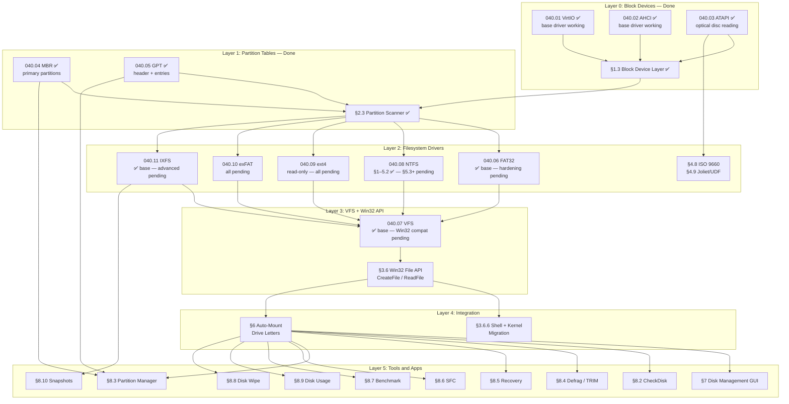

# Phase 06 — Storage & Persistent Filesystem

> **Goal:** Move from a RAM-only filesystem to real persistent storage. Implement
> disk drivers (virtio-blk, AHCI), a widely-compatible filesystem (FAT32), persist
> the custom IXFS format to disk, add partition table support (GPT/MBR), and build
> a graphical disk management tool.
> [!CAUTION]
> **Memory Rule:** Use `pmm_alloc_contiguous()` for ALL buffers > 4 KB (fonts, images, file data). `kmalloc` is ONLY for small kernel structs (≤ 4 KB). Violating this crashes the 2 MiB heap silently. See `rules.md` Known Gotchas and `/add-asset` workflow.

---

## TODO Completion Roadmap (Cross-File)

> [!IMPORTANT]
> **Twelve TODO files** contribute to the storage and filesystem subsystem. They have
> deep cross-dependencies that dictate implementation order. This roadmap shows
> the correct sequence — completing items out of order will cause rework.
>
> | File                            | Scope                                             |
> | ------------------------------- | ------------------------------------------------- |
> | `TODO-040-Filesystem.md`        | Master file — sections, priorities, OS comparison |
> | `TODO-040.01-VirtIO.md`         | VirtIO block driver hardening                     |
> | `TODO-040.02-AHCI.md`           | AHCI SATA driver hardening                        |
> | `TODO-040.03-ATAPI-SCSI-MMC.md` | ATAPI optical drive + SCSI layer                  |
> | `TODO-040.04-MBR.md`            | MBR partition table R/W                           |
> | `TODO-040.05-GPT.md`            | GPT partition table R/W                           |
> | `TODO-040.06-FAT32.md`          | FAT32 driver hardening                            |
> | `TODO-040.07-VFS.md`            | VFS enhancements + Win32 compat layer             |
> | `TODO-040.08-NTFS.md`           | NTFS driver (C: drive)                            |
> | `TODO-040.09-ext4.md`           | ext4 read-only driver                             |
> | `TODO-040.10-exFAT.md`          | exFAT driver                                      |
> | `TODO-040.11-IXFS.md`           | IXFS native filesystem hardening                  |

### Dependency Graph



### Phase-by-Phase Implementation Order

| ⭐ | Phase  | TODO File           | Section(s)                         | What It Delivers                                              | Depends On               | Status |
| -- | :----: | -------------------- | ---------------------------------- | ------------------------------------------------------------- | ------------------------ | :----: |
| 💎 | **1**  | `040.01-VirtIO.md`  | §1 PCI Transport                   | Modern PCI capability discovery, BAR mapping                  | —                        |   ⬜   |
| 💎 | **1**  | `040.01-VirtIO.md`  | §2 Initialization                  | Full feature negotiation + status machine                     | Phase 1 (§1)             |   ⬜   |
| 💎 | **1**  | `040.02-AHCI.md`    | §1 PCI + ABAR                      | PCI capability parsing, ABAR remapping                        | —                        |   ⬜   |
| 💎 | **1**  | `040.02-AHCI.md`    | §2 HBA Init                        | Port enumeration, command lists, FIS buffers                  | Phase 1 (§1)             |   ⬜   |
| 💎 | **2**  | `040.01-VirtIO.md`  | §3 Virtqueue                       | Descriptor rings, avail/used rings, kick                      | Phase 1                  |   ⬜   |
| 💎 | **2**  | `040.01-VirtIO.md`  | §4 MSI-X Interrupts                | Interrupt-driven I/O (no polling)                             | Phase 2 (§3)             |   ⬜   |
| 💎 | **2**  | `040.02-AHCI.md`    | §3 DMA R/W                         | READ/WRITE DMA EXT with PRDT                                  | Phase 1 (§2)             |   ⬜   |
| 💎 | **2**  | `040.02-AHCI.md`    | §4 Interrupt-Driven I/O            | IRQ-based completion, per-port ISR                            | Phase 1 (§2)             |   ⬜   |
| 💎 | **2**  | `040.03-ATAPI.md`   | §1–3 SCSI + READ                   | ATAPI packet command, SCSI READ(10/12)                        | AHCI Phase 1             |   ⬜   |
| 💎 | **2**  | `040.04-MBR.md`     | §1 Primary Parse                   | MBR primary partition reading                                 | blkdev (Layer 0)         |   ✅   |
| 💎 | **2**  | `040.04-MBR.md`     | §2 EBR Chain                       | Extended/logical partition walking                            | Phase 2 (§1)             |   ⬜   |
| 💎 | **2**  | `040.05-GPT.md`     | §1 Primary Header                  | GPT header + entry array parsing                              | blkdev (Layer 0)         |   ✅   |
| 💎 | **2**  | `040.05-GPT.md`     | §2 Backup Header                   | Backup GPT recovery + primary sync                            | Phase 2 (§1)             |   ⬜   |
| 💎 | **2**  | `040.05-GPT.md`     | §3 4Kn Support                     | 4096-byte sector partition tables                             | Phase 2 (§1)             |   ⬜   |
| 💎 | **3**  | `040.06-FAT32.md`   | §1 BPB Validation                  | Strict mount validation, dirty volume detect                  | FAT32 base               |   ⬜   |
| 💎 | **3**  | `040.06-FAT32.md`   | §2 FSInfo Sync                     | FSInfo validation + full FAT scan fallback                    | Phase 3 (§1)             |   ⬜   |
| 💎 | **3**  | `040.06-FAT32.md`   | §3 Dual-FAT                        | FAT mirroring + backup boot sector                            | Phase 3 (§1)             |   ⬜   |
| 💎 | **3**  | `040.06-FAT32.md`   | §4 LFN Support                     | Full LFN creation + deletion + Unicode                        | Phase 3 (§1)             |   ⬜   |
| 💎 | **3**  | `040.06-FAT32.md`   | §5 Timestamps                      | Hi-res creation time, year 2107 boundary                      | Phase 3 (§1)             |   ⬜   |
| 💎 | **3**  | `040.08-NTFS.md`    | §1 BPB                             | Volume boot record, cluster geometry                          | blkdev + partition       |   ✅   |
| 💎 | **3**  | `040.08-NTFS.md`    | §2 MFT + Fixup                     | MFT inode reader + USA fixup                                  | Phase 3 (§1)             |   ✅   |
| 💎 | **3**  | `040.08-NTFS.md`    | §3 Attribute Engine                | Attribute iterator, $FILE_NAME, $STD_INFO                     | Phase 3 (§2)             |   ✅   |
| 💎 | **3**  | `040.08-NTFS.md`    | §4 Data Runs                       | VCN→LCN decoder + file data reader                            | Phase 3 (§3)             |   ✅   |
| 💎 | **4**  | `040.08-NTFS.md`    | §5.1–5.2 B+ Tree                   | $INDEX_ROOT + INDX buffer reader                              | Phase 3 (§3–4)           |   ✅   |
| 💎 | **4**  | `040.08-NTFS.md`    | §5.3 Directory Lookup              | Full `C:\path\to\file` resolution                             | Phase 4 (§5.2)           |   ⬜   |
| 💎 | **4**  | `040.08-NTFS.md`    | §5.4 Dir Enumeration               | FindFirstFile / FindNextFile for NTFS                         | Phase 4 (§5.1–5.2)       |   ⬜   |
| 💎 | **4**  | `040.08-NTFS.md`    | §6.1 VFS Registration              | Mount NTFS as C: drive                                        | Phase 4 (§5.3) + VFS     |   ⬜   |
| 💎 | **4**  | `040.09-ext4.md`    | §1 Superblock                      | ext4 superblock + feature flag gating                         | blkdev + partition       |   ⬜   |
| 💎 | **4**  | `040.09-ext4.md`    | §2 Block Groups                    | Group descriptor table, bitmaps                               | Phase 4 (§1)             |   ⬜   |
| 💎 | **4**  | `040.09-ext4.md`    | §3 Inodes                          | Inode table reader + metadata                                 | Phase 4 (§2)             |   ⬜   |
| 💎 | **4**  | `040.09-ext4.md`    | §4 Extent Tree                     | Extent-based block mapping (ext4)                             | Phase 4 (§3)             |   ⬜   |
| 💎 | **4**  | `040.09-ext4.md`    | §5 Indirect Blocks                 | Legacy ext2/ext3 block pointer fallback                       | Phase 4 (§3)             |   ⬜   |
| 💎 | **4**  | `040.09-ext4.md`    | §6 Directories                     | Linear parser + HTree directory index                         | Phase 4 (§3)             |   ⬜   |
| 💎 | **4**  | `040.09-ext4.md`    | §7 CRC32C                          | Metadata checksum validation                                  | Phase 4 (§1)             |   ⬜   |
| 💎 | **4**  | `040.09-ext4.md`    | §8 VFS Integration                 | Mount ext4 partitions to drive letters                        | Phase 4 (§6) + VFS       |   ⬜   |
| 💎 | **5**  | `040.07-VFS.md`     | §1.1 Case-Insensitive Paths        | `$UpCase` / uppercase path comparison                         | VFS base                 |   ⬜   |
| 💎 | **5**  | `040.07-VFS.md`     | §1.2 Mandatory Locking             | Share mode enforcement (FILE_SHARE_*)                         | VFS base                 |   ⬜   |
| 💎 | **5**  | `040.07-VFS.md`     | §1.3 Deletion Semantics            | Mark-for-delete-on-close (Windows style)                      | VFS base                 |   ⬜   |
| 💎 | **5**  | `040.07-VFS.md`     | §1.4 File Identifiers              | 64-bit unique file IDs                                        | VFS base                 |   ⬜   |
| 💎 | **5**  | `040.07-VFS.md`     | §1.5 Memory-Mapped Exec            | DLL/EXE mmap loading                                          | Phase 5 (§1.4)           |   ⬜   |
| 💎 | **5**  | `040.07-VFS.md`     | §1.6 Attributes + Times            | FILETIME API (100ns since 1601)                               | VFS base                 |   ⬜   |
| 💎 | **5**  | `040.07-VFS.md`     | §1.7 Byte-Range Locks              | LockFile / UnlockFile                                         | Phase 5 (§1.2)           |   ⬜   |
| 💎 | **5**  | `040-Filesystem.md` | §3.6.1 Handle Table                | HANDLE type, error codes, std handles                         | VFS base                 |   ⬜   |
| 💎 | **5**  | `040-Filesystem.md` | §3.6.2 CreateFile                  | CreateFile / CloseHandle                                      | Phase 5 (§3.6.1)         |   ⬜   |
| 💎 | **5**  | `040-Filesystem.md` | §3.6.3 ReadFile                    | ReadFile / WriteFile / SetFilePointer                         | Phase 5 (§3.6.2)         |   ⬜   |
| 💎 | **5**  | `040-Filesystem.md` | §3.6.4 Directories                 | FindFirstFile / CreateDirectory                               | Phase 5 (§3.6.2)         |   ⬜   |
| 💎 | **5**  | `040-Filesystem.md` | §3.6.5 File Mgmt                   | DeleteFile / MoveFile / CopyFile                              | Phase 5 (§3.6.2)         |   ⬜   |
| 💎 | **5**  | `040-Filesystem.md` | §3.6.6 Shell Migration             | Shell + kernel → Win32 API (15 files)                         | Phase 5 (§3.6.2–5)       |   ⬜   |
| 💎 | **5**  | `040.07-VFS.md`     | §2.1–2.4 Feature Spoofing          | ADS, ACL stubs, vol info, reparse                             | Phase 5 (§3.6)           |   ⬜   |
| 💎 | **6**  | `040-Filesystem.md` | §6.1 Auto-Mount                    | Drive letter assignment from real disks                       | All FS drivers + VFS     |   ⬜   |
| 💎 | **6**  | `040-Filesystem.md` | §6.2 Mount/Unmount                 | Shell `mount` / `umount` commands                             | Phase 6 (§6.1)           |   ⬜   |
| 💎 | **6**  | `040.10-exFAT.md`   | §1–3 Boot + FAT + Bitmap           | exFAT volume parsing basics                                   | blkdev + partition       |   ⬜   |
| 💎 | **6**  | `040.10-exFAT.md`   | §4–5 Upcase + Dir                  | Directory entry sets, timestamps                              | Phase 6 (§1–3)           |   ⬜   |
| 💎 | **6**  | `040.10-exFAT.md`   | §6–7 File Read + Lookup            | File data reading + path resolution                           | Phase 6 (§4–5)           |   ⬜   |
| 💎 | **6**  | `040.10-exFAT.md`   | §8–9 VFS Integration               | Mount exFAT to drive letter                                   | Phase 6 (§6–7) + VFS     |   ⬜   |
| ⭐ | **6**  | `040.03-ATAPI.md`   | §4–6 Capacity + Status             | Full SCSI layer (TOC, disc info)                              | ATAPI Phase 2            |   ⬜   |
| ⭐ | **6**  | `040-Filesystem.md` | §4.8 ISO 9660                      | CD/DVD filesystem read-only                                   | ATAPI + blkdev           |   ⬜   |
| ⭐ | **6**  | `040-Filesystem.md` | §4.9 Joliet / UDF                  | DVD/Blu-ray extended filesystem formats                       | Phase 6 (§4.8)           |   ⬜   |
| 💎 | **7**  | `040.06-FAT32.md`   | §6 Performance                     | Sector cache tuning, contiguous reads                         | FAT32 Phase 3            |   ⬜   |
| 💎 | **7**  | `040.06-FAT32.md`   | §7–8 Consistency                   | FAT chain validation, fsck checks                             | FAT32 Phase 3            |   ⬜   |
| 💎 | **7**  | `040.01-VirtIO.md`  | §5–7 Error + Flush                 | Error recovery + flush/write-back                             | VirtIO Phase 2           |   ⬜   |
| 💎 | **7**  | `040.02-AHCI.md`    | §5–7 NCQ + Error                   | Native Command Queuing, error recovery                        | AHCI Phase 2             |   ⬜   |
| 💎 | **7**  | `040.04-MBR.md`     | §3–6 CHS + Write + Create          | CHS encoding, MBR write, partition CRUD                       | MBR Phase 2              |   ⬜   |
| 💎 | **7**  | `040.05-GPT.md`     | §4–7 GUID + Attrs + Hybrid         | Type GUID expansion, attribute decode                         | GPT Phase 2              |   ⬜   |
| 💎 | **7**  | `040.05-GPT.md`     | §8–11 GPT Write + CLI              | GPT create + delete + resize + shell cmd                      | Phase 7 (§4–7)           |   ⬜   |
| 💎 | **7**  | `040.11-IXFS.md`    | §1–8 Verification                  | Verify existing IXFS implementation                           | —                        |   ⬜   |
| 💎 | **8**  | `040.11-IXFS.md`    | §9 ADS                             | Native Alternate Data Streams                                 | IXFS verified (Phase 7)  |   ⬜   |
| 💎 | **8**  | `040.11-IXFS.md`    | §10 ACLs                           | Security descriptors + DACL/SACL                              | IXFS verified (Phase 7)  |   ⬜   |
| 💎 | **8**  | `040.11-IXFS.md`    | §11 Links                          | Hard links + symbolic links                                   | IXFS verified (Phase 7)  |   ⬜   |
| ⭐ | **8**  | `040.11-IXFS.md`    | §12–14 Unicode + Sparse + Journal  | Unicode normalization, sparse files, change journals          | IXFS verified (Phase 7)  |   ⬜   |
| ⭐ | **8**  | `040.11-IXFS.md`    | §15–19 Advanced                    | Quotas, TRIM/discard, compression, encryption, online defrag  | IXFS Phase 8             |   ⬜   |
| ⭐ | **8**  | `040-Filesystem.md` | §5.9.10 Per-File Encryption        | AES-256-XTS per-block — beats NTFS EFS (no AD required)       | IXFS xattrs (§5.9.8)     |   ⬜   |
| ⭐ | **8**  | `040-Filesystem.md` | §5.9.11 Block Deduplication        | Inline xxHash64 dedup — beats Win Server + btrfs              | IXFS CoW                 |   ⬜   |
| 💎 | **8**  | `040-Filesystem.md` | §8.1 Disk Cache                    | Block-level LRU cache (all FS drivers)                        | Phase 6 (Mount)          |   ⬜   |
| 💎 | **9**  | `040-Filesystem.md` | §8.2 CheckDisk                     | CLI `chkdsk` + GUI                                            | Phase 6 (Mount)          |   ⬜   |
| 💎 | **9**  | `040-Filesystem.md` | §8.3 Partition Mgr                 | CLI `diskpart` + GUI                                          | Phase 7 (GPT/MBR Write)  |   ⬜   |
| 💎 | **9**  | `040-Filesystem.md` | §8.6 SFC                           | CLI `sfc` + GUI                                               | Phase 6 (Mount)          |   ⬜   |
| 💎 | **9**  | `040-Filesystem.md` | §8.13 I/O Metrics                  | Per-device stats + `iostat` cmd                               | blkdev                   |   ⬜   |
| 💎 | **9**  | `040-Filesystem.md` | §7 Disk Mgmt GUI                   | Graphical partition layout viewer                             | Phase 6 (Mount)          |   ⬜   |
| ⭐ | **10** | `040-Filesystem.md` | §8.4 Defrag/TRIM                   | CLI `defrag` + visual block map GUI                           | Phase 6 (Mount)          |   ⬜   |
| ⭐ | **10** | `040-Filesystem.md` | §8.5 Recovery                      | CLI `recover` + Recovery Wizard GUI                           | Phase 6 (Mount)          |   ⬜   |
| ⭐ | **10** | `040-Filesystem.md` | §8.7 Disk Benchmark                | CLI `diskbench` + real-time bar GUI                           | blkdev                   |   ⬜   |
| ⭐ | **10** | `040-Filesystem.md` | §8.8 Disk Wipe                     | Secure erase CLI + GUI                                        | Phase 6 (Mount)          |   ⬜   |
| ⭐ | **10** | `040-Filesystem.md` | §8.9 Disk Usage                    | CLI `diskuse` + treemap GUI                                   | Phase 6 (Mount)          |   ⬜   |
| ⭐ | **10** | `040-Filesystem.md` | §8.10 Snapshots                    | CLI `snapshot` + Snapshot Manager GUI                         | IXFS §6 CoW              |   ⬜   |
| 🔵 | —      | `040-Filesystem.md` | §8.11 NVMe                         | NVMe SSD driver (stretch)                                     | PCI                      |   ⬜   |
| 🔵 | —      | `040-Filesystem.md` | §8.12 USB Mass Storage             | USB storage + hot-plug (stretch)                              | USB host controller      |   ⬜   |

### Notes and Tips

> [!NOTE]
> **Phases 1–4** build the core storage stack: block device hardening (MSI-X, NCQ),
> partition table extensions (EBR, 4Kn, backup GPT), and filesystem drivers
> (FAT32 hardening, NTFS C: drive, ext4 read-only).
>
> **Phase 5** delivers the Win32-compatible file API (`CreateFile`/`ReadFile`/`WriteFile`)
> and completes VFS enhancements (case-insensitive paths, share modes, deletion
> semantics). This is the **critical single gate**: all shell commands, font loading,
> icon loading, registry I/O, crash dumps, and swap must migrate from `vfs_*()` to
> Win32 API. Expect ~15 files to touch in the migration step (§3.6.6).
>
> **Phases 6–7** wire everything together: auto-mount drive letters, exFAT/ISO 9660,
> driver hardening (NCQ, error recovery, GPT write), and IXFS verification.
>
> **Phases 8–10** are polish and competitive features: IXFS advanced features (ADS,
> ACLs, compression, encryption), disk tools (chkdsk, defrag, recovery), and GUI
> utilities (Disk Management, Usage Analyzer, Benchmark).

> [!TIP]
> **Quick wins (any time — zero dependencies):**
> - `§8.13` (I/O metrics) — wraps existing `blkdev_read/write` counters, no FS needed.
> - `§8.7` (disk benchmark) — pure blkdev-level sequential + random I/O.
> - `040.11-IXFS.md §1–8` (verification) — validate existing code, no new features.
> - `040.05-GPT.md §5.1` (type GUID registry) — data-only expansion, already ✅.
>
> **NTFS is the critical path to C: drive.** Phases 1–3 of `040.08-NTFS.md`
> (BPB, MFT, attributes, data runs, B+ tree) are ✅ complete. Phase 4
> (§5.3 directory lookup + §6.1 VFS registration) is the final gate before
> NTFS serves as the boot volume.
>
> **The biggest single task** is `§3.6 Win32 File API` + `§3.6.6 Migration` —
> it touches every kernel file that does I/O. Plan for 2–3 days of focused work.
>
> **Sub-file roadmaps exist** within each of the 11 TODO files (e.g.,
> `040.08-NTFS.md` has its own 5-phase internal roadmap). This master roadmap
> shows the correct cross-file sequencing; consult sub-file roadmaps for
> intra-file task ordering.

> [!WARNING]
> **Memory allocation rule is project-wide.** Every new buffer in every sub-file
> must follow the rule: `kmalloc` ≤ 4 KB, `pmm_alloc_contiguous()` for everything
> larger. The NTFS INDX buffer (4 KB), ext4 block group descriptors, and exFAT
> allocation bitmap are all candidates for PMM allocation.
> See `rules.md` Known Gotchas.

> [!CAUTION]
> **Never implement Phase 5 (Win32 API) before Phase 4 (FS drivers).** The Win32
> API functions (`CreateFile`, `ReadFile`) dispatch through `vfs_ops` callbacks.
> If the NTFS or ext4 drivers aren't registered, `CreateFile("D:\\...")` will fail
> silently with `ERROR_PATH_NOT_FOUND`. Complete at least NTFS VFS registration
> (§6.1) and ext4 VFS integration (§8) before migrating the shell.

---

## 1. Disk Drivers

### 1.1 VirtIO Block Device Driver ✅

**Prompt:** This section is marked complete. Verify the implementation is correct: confirm `src/kernel/drivers/virtio_blk.c` exists with `virtio_blk_read`, `virtio_blk_write`, `virtio_blk_capacity`, VirtIO 1.0 PCI capability detection, and 3-descriptor chain I/O. Check it registers as a blkdev ("virtio0"). Run `bash scripts/build.sh clean`. Fix any inconsistencies in the TODO items below.
- [x] Create `src/kernel/drivers/virtio_blk.c` and `include/virtio_blk.h`
- [x] Detect virtio-blk device via PCI enumeration (vendor `0x1AF4`, device `0x1001` or `0x1042`)
- [x] Map MMIO BAR registers via modern VirtIO 1.0 PCI capabilities
- [x] Initialize virtio device:
  - [x] Acknowledge → DRIVER → negotiate features → FEATURES_OK → DRIVER_OK
  - [x] Allocate virtqueue (descriptor table, available ring, used ring) via `virtq_init()`
- [x] Implement `virtio_blk_read(lba, count, buffer)` — 3-descriptor chain (header, data, status)
- [x] Implement `virtio_blk_write(lba, count, buffer)` — write sectors
- [x] Implement `virtio_blk_capacity()` — query disk size via device_cfg MMIO
- [x] Register with VFS block device layer *(done in §1.3 as "virtio0")*
- [x] Test: read sector 0 from QEMU virtio disk (verified UEFI + BIOS boot)
- [x] QEMU flag: `-drive file=disk.img,format=raw,if=none,id=disk0 -device virtio-blk-pci,drive=disk0`
- [x] Commit: `"drivers: virtio-blk modern VirtIO 1.0 transport"`

> **Implementation notes:**
> - Uses modern VirtIO 1.0 MMIO transport from `virtio.c` (shared with virtio-input)
> - Legacy PIO transport abandoned due to device reset issues on both QEMU 8.2 and 10.2
> - Negotiates `VIRTIO_F_VERSION_1` for modern interface
> - QEMU upgraded from 8.2.2 → 10.2.1 (built from source with GTK display)

### 1.2 AHCI (SATA) Driver ✅

**Prompt:** This section is marked complete. Verify the implementation is correct: confirm `src/kernel/drivers/ahci.c` exists with `ahci_read`, `ahci_write`, `ahci_identify`, ABAR mapping, port enumeration, and command list/FIS allocation. Check it registers as a blkdev ("sata0"). Run `bash scripts/build.sh clean`. Fix any inconsistencies in the TODO items below.
- [x] Create `src/kernel/drivers/ahci.c` and `include/kernel/drivers/ahci.h`
- [x] Detect AHCI controller via PCI (class `0x01`, subclass `0x06`)
- [x] Map ABAR (AHCI Base Address Register) from PCI BAR5
- [x] Enumerate ports: scan for attached SATA drives (device signature)
- [x] Initialize HBA: enable AHCI mode, clear interrupts, allocate command lists + FIS buffers
- [x] Implement `ahci_read(port, lba, count, buffer)` — READ DMA EXT + PRDT
- [x] Implement `ahci_write(port, lba, count, buffer)` — WRITE DMA EXT command
- [x] Implement `ahci_identify(port)` — IDENTIFY DEVICE (model, serial, LBA48 capacity)
- [x] Handle AHCI IRQ (polling-based, interrupt enable per port)
- [x] Register with VFS block device layer *(done in §1.3 as "sata0")*
- [x] Test: read drive identity and sector 0 from QEMU SATA disk
- [x] QEMU flags: `-drive file=sata.img,format=raw,if=none,id=disk1 -device ahci,id=ahci0 -device ide-hd,drive=disk1,bus=ahci0.0`
- [x] Commit: `"drivers: AHCI SATA disk driver"`

> **Implementation notes:**
> - Intel ICH9 AHCI controller detected at PCI 0:3.0
> - ABAR at 0x81043000, AHCI v1.0, 6 ports / 32 command slots
> - Per-port: 1 KiB command list (32 headers), 256-byte FIS receive, 32 command tables
> - Uses command slot 0 with single PRDT entry for I/O
> - Tested: "QEMU HARDDISK" 32 MiB (65536 sectors), sector 0 read OK

### 1.4 ATAPI (IDE/SATA Optical) Driver

**Verification prompt:** Verify ATAPI optical disc driver correctness: 1) `ahci.c port_init()` accepts `AHCI_SIG_ATAPI` (`0xEB140101`) and sets `is_atapi=1`, `sector_size=2048`. 2) `atapi_do_identify()` uses `ATA_CMD_IDENTIFY_PACKET` (`0xA1`). 3) `atapi_read_capacity()` sends SCSI READ CAPACITY (`0x25`) and parses big-endian response. 4) `atapi_do_read()` sends SCSI READ(10) (`0x28`) with correct CDB layout. 5) `atapi_packet_cmd()` sets bit 5 (ATAPI) in command header flags and copies 12-byte CDB to `acmd[]`. 6) `main.c` registers ATAPI devices as `cdrom0` with `sector_size=2048` and `write=NULL`. 7) Makefile optical tests use `-device ide-cd,bus=ahci0.1`. Run `bash scripts/build.sh clean` and verify `BUILD OK`. Verify commit `"drivers: ATAPI optical disc driver"` exists.

- [x] Detect ATAPI device signature on AHCI ports
- [x] Implement SCSI INQUIRY command via AHCI ATAPI command format
- [x] Implement SCSI READ(10) / READ(12) — read sectors from optical media
- [x] Implement SCSI GET CAPACITY — determine disc size
- [x] Register as blkdev (e.g., "cdrom0") with 2048-byte sector size
- [x] QEMU flag: `-device ide-cd,drive=cdrom0,bus=ahci0.1`
- [x] Test: `make run-test DISK=optical/iso9660`
- [x] Commit: `"drivers: ATAPI optical disc driver"`

### 1.3 Block Device Abstraction Layer ✅

**Prompt:** This section is marked complete. Verify the implementation is correct: confirm `struct blkdev` (name, sector_size, sector_count, read_fn, write_fn, driver_data), `blkdev_register`, `blkdev_get`, `blkdev_read`, `blkdev_write`, `blkdev_list` exist. Verify both VirtIO and AHCI are registered via adapters. Run `bash scripts/build.sh clean`. Fix any inconsistencies in the TODO items below.
- [x] Create `include/kernel/drivers/blkdev.h` and `src/kernel/drivers/blkdev.c`
- [x] Define `struct blkdev` (name, sector_size, sector_count, read_fn, write_fn, driver_data)
- [x] Implement `blkdev_register(dev)` — add to global device list
- [x] Implement `blkdev_get(name)` — look up by name ("virtio0", "sata0")
- [x] Implement `blkdev_read(dev, lba, count, buf)` — dispatch to driver
- [x] Implement `blkdev_write(dev, lba, count, buf)` — dispatch to driver
- [x] Implement `blkdev_list()` — enumerate all registered devices
- [x] Register existing ATA/IDE driver as a blkdev (adapter wraps `uint8_t count`)
- [x] Register virtio-blk and AHCI as blkdevs (adapter wrappers in `main.c`)
- [x] Commit: `"drivers: block device abstraction layer"`

> **Implementation notes:**
> - Registry holds up to 16 devices, function-pointer dispatch
> - Adapter wrappers bridge driver APIs to uniform `(lba, count, buf, driver_data)` signature
> - AHCI uses `driver_data` as port index; VirtIO ignores it
> - Tested: 2 devices registered (virtio0 + sata0)

---
## 2. Partition Table Support

### 2.1 MBR Partition Table ✅

**Prompt:** This section is marked complete. Verify the implementation is correct: confirm `src/kernel/fs/mbr.c` parses MBR at LBA 0 with 4 partition entries, recognizes types 0x0C (FAT32), 0x83 (Linux), 0xDA (IXFS). Run `bash scripts/build.sh clean`. Fix any inconsistencies in the TODO items below.
- [x] Create `src/kernel/fs/mbr.c`
- [x] Parse MBR at LBA 0: 4 partition entries at offset 446
- [x] Define `struct mbr_entry` (status, type, start_lba, sector_count)
- [x] Recognize partition types: `0x0C` (FAT32 LBA), `0x83` (Linux), `0xDA` (IXFS custom)
- [x] Return partition list (start LBA, size, type) for each active entry
- [x] Commit: `"fs: MBR partition table parsing"`

### 2.2 GPT Partition Table

**Prompt:** This section is marked complete. Verify the implementation is correct: confirm `src/kernel/fs/gpt.c` detects protective MBR type 0xEE, parses GPT header at LBA 1 (signature, CRC32), parses 128-byte partition entries, and recognizes EFI SP, Basic Data, and IXFS GUIDs. Run `bash scripts/build.sh clean`. Fix any inconsistencies in the TODO items below.
- [x] Create `src/kernel/fs/gpt.c`
- [x] Detect GPT: check protective MBR at LBA 0 (type `0xEE`)
- [x] Parse GPT header at LBA 1: verify signature "EFI PART", validate CRC32
- [x] Parse partition entry array (128-byte entries, starting at LBA 2)
- [x] Define `struct gpt_entry` (type_guid, unique_guid, start_lba, end_lba, name)
- [x] Recognize GUIDs: EFI System Partition, Microsoft Basic Data, custom IXFS GUID
- [x] CRC32 validation of header + partition array
- [x] Commit: `"fs: GPT partition table parsing"`

### 2.3 Partition Scanner

**Prompt:** This section is marked complete. Verify the implementation is correct: confirm `src/kernel/fs/partition.c` scans each blkdev trying GPT first then MBR, creates sub-blkdevs offset by partition start LBA, auto-detects filesystem via magic bytes, and logs partitions to serial. Run `bash scripts/build.sh clean`. Fix any inconsistencies in the TODO items below.
- [x] Create `src/kernel/fs/partition.c`
- [x] On each registered blkdev: try GPT first, fall back to MBR
- [x] For each discovered partition: create a sub-blkdev (offset reads/writes by partition start LBA)
- [x] Auto-detect filesystem on each partition (probe FAT32, NTFS, ext2, IXFS magic bytes)
- [x] Log discovered partitions via serial: "Disk 0, Partition 1: FAT32, 2.0 GB"
- [x] Call at boot after disk drivers initialize
- [x] Commit: `"fs: partition scanner & auto-detect"`

---
## 3. FAT32 Filesystem

### 3.1 FAT32 Read Support

**Prompt:** This section is marked complete. Verify the implementation is correct: confirm `src/kernel/fs/fat32/fat32_core.c` parses BPB, calculates FAT/data region offsets, implements `fat32_read_cluster_chain`, `fat32_read_dir` (handling both 8.3 and LFN entries), `fat32_read_file`, and `fat32_stat`. Run `bash scripts/build.sh clean`. Fix any inconsistencies in the TODO items below.
- [x] Create `src/kernel/fs/fat32/` directory (split from monolithic `fat32.c` in §3.4.4)
- [x] Parse BPB (BIOS Parameter Block) at partition start:
  - [x] bytes_per_sector, sectors_per_cluster, reserved_sectors, fat_count, root_cluster
- [x] Calculate: FAT region start, data region start, cluster→LBA conversion
- [x] Implement `fat32_read_cluster_chain(start_cluster)` — follow FAT entries
- [x] Implement `fat32_read_dir(cluster)` — parse 32-byte directory entries
  - [x] Handle 8.3 short names
  - [x] Handle LFN (Long File Name) entries
- [x] Implement `fat32_read_file(path, buffer, max_size)` — traverse directory tree, read cluster chain
- [x] Implement `fat32_stat(path)` — return file size, attributes, timestamps
- [x] Commit: `"fs: FAT32 read support"`

### 3.2 FAT32 Write Support

**Prompt:** This section is marked complete. Verify the implementation is correct: confirm `fat32_write_file`, `fat32_create_file`, `fat32_create_dir`, `fat32_delete_file`, `fat32_rename`, free cluster search, `fat32_format`, and dual FAT flush all exist and work. Run `bash scripts/build.sh clean`. Fix any inconsistencies in the TODO items below.
- [x] Implement `fat32_write_file(path, data, size)` — allocate clusters, write data, update directory entry
- [x] Implement `fat32_create_file(dir, name)` — add directory entry, allocate first cluster
- [x] Implement `fat32_create_dir(dir, name)` — create directory with `.` and `..` entries
- [x] Implement `fat32_delete_file(path)` — mark clusters as free in FAT, clear directory entry
- [x] Implement `fat32_rename(old_path, new_path)` — update directory entry name
- [x] Implement free cluster search (scan FAT for `0x00000000` entries)
- [x] Implement `fat32_format(dev, label)` — write BPB, FATs, root directory
- [x] Flush FAT to disk after modifications (write both FAT copies)
- [x] Commit: `"fs: FAT32 write support"`

### 3.3 FAT32 VFS Integration

**Prompt:** This section is marked complete. Verify the implementation is correct: confirm FAT32 is registered as a VFS filesystem type with callbacks for open, close, read, write, readdir, stat, create, delete, rename. Verify it mounts to a drive letter (e.g., D:\). Test file persistence across reboots. Run `bash scripts/build.sh clean`. Fix any inconsistencies in the TODO items below.
- [x] Register FAT32 as a VFS filesystem type
- [x] Implement VFS callbacks: open, close, read, write, readdir, stat, create, delete, rename
- [x] Mount FAT32 partition to a drive letter (e.g., `D:\`)
- [x] Test: create file on FAT32, reboot, verify file persists
- [x] Commit: `"fs: FAT32 VFS integration"`

### 3.4 FAT32 Driver Improvements

> **Current state (2026-03-17):** The FAT32 write implementation (`fat32_write_file`) uses
> **overwrite mode** — it truncates the file and rewrites all data from scratch on every call.
> The VFS `write` callback ignores the `offset` parameter. This means:
> - No append support — every write rewrites the entire file
> - Live debug logging (TODO-005-Debug §1.3) rewrites a growing buffer on each entry
> - File copy operations can't write in chunks — must buffer entire file in memory
> - No partial writes — can't update specific bytes within a file

> [!IMPORTANT]
> → XREF: `TODO-005-Debug.md §1.3 Live Flush Mode` — the debug logging system's
> performance depends entirely on fixing FAT32 append support. This is the **#1 blocker**
> for efficient live logging on real hardware via the X: partition.

#### 3.4.1 Offset-Aware Write (Append Support)

**Prompt — VERIFICATION:** Verify offset-aware FAT32 write is correct. Confirm `fat32_file_write_vfs()` walks the cluster chain to `offset / bytes_per_cluster`, does read-modify-write for partial clusters, allocates new clusters via `fat32_alloc_cluster()` when extending past EOF, and updates directory entry `file_size` via `fat32_update_dir_size()`. Confirm `fat32_file` has `dir_cluster` field set in `fat32_finddir()`. Confirm `fat32_write_file()` (bulk overwrite by name) is unchanged. Run `bash scripts/build.sh clean` → `=== BUILD OK ===`. Verify commit `"fat32: offset-aware write with append support"`.

> [!NOTE]
> The `fat32_file` struct now includes `dir_cluster` to support offset-aware writes for files in subdirectories, not just root. `fat32_update_dir_size(search_dir, target_fc, new_size)` accepts the parent directory cluster.
> The old `fat32_write_file()` (full-overwrite by name) remains for callers that need bulk writes.

- [x] Modify `fat32_vfs_write(node, offset, size, buffer)` to respect the `offset` parameter
- [x] Walk FAT cluster chain to find cluster containing `offset` byte
- [x] Calculate: `cluster_index = offset / bytes_per_cluster`, `byte_within_cluster = offset % bytes_per_cluster`
- [x] Write data into existing clusters (partial cluster writes: read-modify-write sector)
- [x] If write extends past current file size: allocate new clusters via `fat32_alloc_cluster()`
- [x] Link new clusters into the FAT chain (update FAT entries)
- [x] Update directory entry `file_size` if file grew
- [x] Flush both FAT copies to disk after chain modification
- [x] Handle edge case: writing at offset > file_size (fill gap with zeros — sparse-like)
- [x] Test: create file, write 100 bytes at offset 0, append 100 bytes at offset 100, verify 200 bytes total
- [x] Test: write 5000 bytes (multi-cluster) to verify cluster chain extension
- [x] Commit: `"fat32: offset-aware write with append support"`

#### 3.4.2 Cluster Chain Extension & Free Cluster Hint

**Prompt — VERIFICATION:** Verify FSInfo sector support is correct. Confirm `fat32_init()` reads FSInfo at `bpb.fs_info_sector` (BPB offset 48), validates lead signature `0x41615252`, struct signature `0x61417272`, and trail signature `0xAA550000`. Confirm `fat32_alloc_cluster()` uses `fsinfo_next_free` as hint with two-pass wraparound scan. Confirm `fat32_free_chain()` updates `fsinfo_free_count` and `fsinfo_next_free`. Confirm `fat32_fsinfo_flush()` writes both primary and backup FSInfo sectors. Confirm `fat32_vfs_flush()` calls `fat32_fsinfo_flush()`. Run `bash scripts/build.sh clean` → `=== BUILD OK ===`. Verify commit `"fat32: FSInfo sector + free cluster hint"`.

> [!NOTE]
> FSInfo uses defines instead of a struct (`FSINFO_LEAD_SIG`, etc.) to keep the code simple — the sector is read/written via byte offsets. State is tracked in static variables: `fsinfo_free_count`, `fsinfo_next_free`, `fsinfo_valid`, `fsinfo_dirty`. Falls back to full FAT scan (starting at cluster 2) if FSInfo signatures are invalid.

- [x] Define `struct fat32_fsinfo` — signature `0x41615252`, free count, next free hint
- [x] Read FSInfo sector on mount (sector 1, or `bpb.fs_info_sector`)
- [x] Track `next_free_hint` in memory — start cluster search from there
- [x] Update FSInfo on disk after allocation/deallocation
- [x] Validate FSInfo on mount (signature check, sanity check free count vs FAT scan)
- [x] Fall back to full FAT scan if FSInfo is invalid
- [x] Commit: `"fat32: FSInfo sector + free cluster hint"`

#### 3.4.3 Sector-Level Write Cache

**Prompt:** This section is complete. Verify: `fat32.c` contains a 64-slot LRU sector cache (`scache_entry_t`, `SCACHE_SLOTS=64`) with dirty tracking. `fat32_read_sector()` serves from cache on hit, populates on miss. `fat32_write_sector()` writes to cache with dirty flag. `fat32_flush_disk()` calls `scache_flush()`. `fat32_file_close()` flushes. `fat32_format()` calls `scache_invalidate()`. Run `bash scripts/build.sh clean` and verify `=== BUILD OK ===`.

- [x] Implement `fat32_cache_read(sector)` — ✅ `scache_lookup()` + `fat32_read_sector()` cache path
- [x] Implement `fat32_cache_write(sector, data)` — ✅ `fat32_write_sector()` writes to cache, sets dirty
- [x] Implement `fat32_cache_flush()` — ✅ `scache_flush()` iterates all dirty slots, writes to disk
- [x] LRU eviction: flush dirty sector before evicting — ✅ `scache_evict()` flushes dirty before reuse
- [x] Always cache FAT sectors (hot path during chain walks) — ✅ All `fat32_read_sector` calls go through cache, including `fat32_get_fat_entry`
- [x] Flush on: `fat32_flush()`, file close, unmount — ✅ `fat32_flush_disk` → `scache_flush`, `fat32_file_close` → `scache_flush + fsinfo_flush`, `fat32_format` → `scache_invalidate`
- [x] Commit: `"fat32: sector-level write cache"`

#### 3.4.4 Multi-Volume Support (Remove Static Globals)

**Prompt:** Verify FAT32 multi-volume support is complete. Check that `struct fat32_volume` encapsulates all per-volume state (BPB, block device, root node, sector cache, FSInfo), is allocated via PMM (~40KB), and is threaded through VFS via `fat32_file->volume` back-pointer. Verify `fat32_init()` returns `fat32_volume*`, `fat32_get_root()` takes `vol` parameter, and `partition.c` handles per-partition volumes. Run `bash scripts/build.sh clean` and confirm BUILD OK.

- [x] Define `struct fat32_volume` — contains `bpb`, `dev`, `root_file`, `dir_files[]`, `cache[]`, `fsinfo_*`
- [x] Allocate per-volume via `pmm_alloc_contiguous` on mount (~40KB, exceeds kmalloc 4KB limit)
- [x] Store `fat32_volume*` via `fat32_file->volume` back-pointer; VFS ops extract with `vol_from_node()` helper
- [x] Convert all functions to take `fat32_volume*` parameter instead of using globals
- [x] Remove static globals: `bpb`, `fat32_dev`, `root_file`, `dir_files[]`, `sector_buf[]`, `scache[]`, `fsinfo_*`
- [x] Split monolith into `src/kernel/fs/fat32/`: `fat32_internal.h`, `fat32_core.c`, `fat32_dir.c`, `fat32_write.c`, `fat32_ops.c`, `fat32_format.c`
- [x] Commit: `"fat32: split monolith into fat32/ modules"` (`cc259d6`)
- [x] Commit: `"fat32: multi-volume support"` (`d971706`)

#### 3.4.5 Concurrent Access Safety

**Prompt:** Verify FAT32 concurrent access locking is complete. Check that `spinlock_t lock` exists in `struct fat32_volume`, is initialized in `fat32_init()`, and is acquired/released around all 11 write VFS ops in `fat32_ops.c` (close, write, create, unlink, rename, truncate, mkdir, rmdir, set_attr, set_times, flush). Verify read paths (read, readdir, finddir, stat) remain lock-free. Verify no `klog()` calls occur while lock is held. Run `bash scripts/build.sh clean` and confirm BUILD OK.

- [x] Add `spinlock_t lock` to `struct fat32_volume` — initialized via `SPINLOCK_INIT` in `fat32_init()`
- [x] Acquire lock on: write, create, delete, rename, truncate, mkdir, rmdir, set_attr, set_times, flush, close
- [x] Release lock after operation completes and FAT/dir entry is flushed — `spin_unlock()` before `kfree`/return
- [x] Read-only operations (read, readdir, finddir, stat) proceed without lock — cache reads are safe
- [x] Prevent deadlock: no `klog()` calls inside lock-held code sections
- [x] Commit: `"fat32: concurrent access locking"`

#### 3.4.6 LFN Creation (Write Path)

**Prompt:** The FAT32 driver can **read** Long File Names (LFN entries preceding the 8.3 entry) but **creates** files with 8.3 short names only. Implement LFN creation: when a filename doesn't fit in 8.3 format (too long, lowercase, spaces, special chars), generate LFN entries (type 0xC1, UTF-16LE, 13 chars per entry, reverse order) preceding the 8.3 basis name. Generate the 8.3 basis name with numeric tail (`FILENA~1`, `FILENA~2`, etc.) to avoid collisions. Compute the LFN checksum from the 8.3 name. After completing all items, mark every item as `[x]`, update this prompt to a verification prompt, run `bash scripts/build.sh clean`, and commit as `"fat32: LFN creation on write"`. Add notes directly in this TODO section. After implementation, save any gotchas, solutions, and important information to MCP memory (`mcp_memory_create_entities` / `mcp_memory_add_observations`).

- [ ] Detect when filename requires LFN (lowercase, >8.3, spaces, Unicode)
- [ ] Generate 8.3 basis name: uppercase, strip invalid chars, add `~N` numeric tail
- [ ] Scan directory for ~N collisions, increment N until unique
- [ ] Generate LFN entries: 13 UTF-16LE chars per entry, pad with 0xFFFF, null-terminate
- [ ] Set LFN entry sequence numbers (1, 2, ... | 0x40 on last)
- [ ] Compute 8.3 checksum: `sum = ((sum >> 1) | (sum << 7)) + name[i]` for all 11 bytes
- [ ] Write LFN entries BEFORE the 8.3 entry (reverse order in directory)
- [ ] Allocate additional directory clusters if directory is full
- [ ] Commit: `"fat32: LFN creation on write"`

#### 3.4.7 Timestamp Support (Read & Write)

**Prompt:** FAT32 stores timestamps in packed 16-bit date (bits: 15-9=year-1980, 8-5=month, 4-0=day) and 16-bit time (bits: 15-11=hours, 10-5=minutes, 4-0=seconds/2) format. The current driver reads these fields but doesn't expose them properly through VFS stat, and never writes them. Implement proper timestamp reading via `fat32_vfs_stat()` (convert to Unix epoch or FILETIME) and writing via `fat32_set_times()` (update directory entry on create, modify, access). After completing all items, mark every item as `[x]`, update this prompt to a verification prompt, run `bash scripts/build.sh clean`, and commit as `"fat32: proper timestamp read/write"`. Add notes directly in this TODO section. After implementation, save any gotchas, solutions, and important information to MCP memory (`mcp_memory_create_entities` / `mcp_memory_add_observations`).

- [ ] Implement `fat32_decode_datetime(date, time)` → Unix epoch seconds
- [ ] Implement `fat32_encode_datetime(epoch)` → packed date + time fields
- [ ] Update `fat32_vfs_stat()` to return decoded timestamps
- [ ] On file create: set create_date, create_time, modify_date, modify_time, access_date
- [ ] On file write: update modify_date and modify_time
- [ ] On file read/open: update access_date (FAT32 has date-only access tracking)
- [ ] Wire into VFS `set_times` callback (§3.5.5)
- [ ] Commit: `"fat32: proper timestamp read/write"`

#### FAT32 Driver — OS Comparison

| Feature                              | 🪟 Windows 11     | 🐧 Linux (vfat)  | 🚀 Impossible OS FAT32        |
| ------------------------------------ | ---------------- | --------------- | ---------------------------- |
| Read support (8.3 + LFN)             | ✅                | ✅               | ✅ Done §3.1                  |
| Write support (create/delete/rename) | ✅                | ✅               | ✅ Done §3.2 (overwrite-only) |
| Offset-aware write / append          | ✅                | ✅               | ✅ Done §3.4.1                |
| FSInfo free cluster hint             | ✅                | ✅               | ✅ Done §3.4.2                |
| Sector cache / write-back            | ✅ (kernel cache) | ✅ (page cache)  | ✅ Done §3.4.3                |
| Multi-volume simultaneous mount      | ✅                | ✅               | ✅ Done §3.4.4                |
| Concurrent access safety             | ✅                | ✅ (VFS locking) | ✅ Done §3.4.5                |
| LFN creation (write)                 | ✅                | ✅               | ⬜ §3.4.6                     |
| Timestamp read/write                 | ✅                | ✅               | ⬜ §3.4.7 (partial read)      |
| FAT32 format (`mkfs.fat`)            | ✅                | ✅               | ✅ Done §3.2                  |
| Cross-linked chain detection         | ✅ `chkdsk`       | ✅ `fsck.vfat`   | ⬜ §8.2                       |
| exFAT support                        | ✅ Native         | ✅ kernel driver | ⬜ §4.6-4.7 P3                |

> **After §3.4.1:** The debug logging system can append efficiently, unblocking TODO-005-Debug.
> **After §3.4.1-3.4.7:** FAT32 driver reaches feature parity with Linux's `vfat` driver.

---

### 3.5 VFS Driver Interface ✅

> **Goal:** The `vfs_ops` function pointer table is the **driver interface**
> that filesystem drivers (IXFS, FAT32, NTFS, etc.) register with. It routes
> operations like `open`, `read`, `write`, `rename`, `unlink` to the correct
> FS driver. This is **not** a separate layer — it's a struct used directly
> inside `CreateFile()`, `ReadFile()`, etc. (§3.6).
>
> **What stays** (driver interface + helpers):
> - `struct vfs_ops` — function pointer table registered by each FS driver
> - `struct vfs_node` — represents an open file/directory
> - `vfs_mount()` / `vfs_unmount()` — mount management
> - `vfs_get_drive_root()` — drive letter → root node lookup
> - `vfs_finddir()` — internal path walking (used inside `CreateFile`)
>
> **What gets removed** (folded into §3.6 during §3.6.6 migration):
> - `vfs_open()` → folded into `CreateFile()`
> - `vfs_read()` → folded into `ReadFile()`
> - `vfs_write()` → folded into `WriteFile()`
> - `vfs_close()` → folded into `CloseHandle()`
> - `vfs_create()` → folded into `CreateFile(CREATE_NEW)` / `CreateDirectory()`
> - `vfs_unlink()` → folded into `DeleteFile()`
> - `vfs_rename()` → folded into `MoveFile()`
> - `vfs_stat()` → folded into `GetFileAttributes()` / `GetFileSize()`
> - `vfs_truncate()` → handled by `CreateFile(TRUNCATE_EXISTING)`
> - `vfs_readdir()` → folded into `FindFirstFile()` / `FindNextFile()`

#### 3.5.1 File Rename ✅

**Prompt:** This section is marked complete. Verify the implementation is correct: confirm `vfs_ops.rename` callback exists and dispatches to `ixfs_rename` (in `ixfs_dir_ops`) and `fat32_vfs_rename` (in `fat32_dir_ops`). Confirm `registry.c` `hive_save()` uses rename for atomic journal swap. **Note:** The `vfs_rename()` public wrapper will be folded into `MoveFile()` during §3.6.6 migration — the `vfs_ops.rename` callback stays. Run `bash scripts/build.sh clean`. Fix any inconsistencies.

- [x] Add `rename` callback to `vfs_ops` driver interface
- [x] Implement FAT32 rename (update directory entry)
- [x] Implement IXFS rename (update directory entry)
- [x] Handle cross-directory rename within same filesystem
- [x] Update registry journaling to use atomic rename
- [x] Commit: `"vfs: file rename"`

#### 3.5.2 File Delete ✅

**Prompt:** This section is marked complete. Verify the implementation is correct: confirm `vfs_ops.unlink` callback exists and dispatches correctly. Confirm `ref_count` field in `vfs_node` is checked before deletion. Confirm `ixfs_unlink` checks for non-empty directories. Confirm `fat32_vfs_unlink` marks entry 0xE5 and frees cluster chain. **Note:** The `vfs_unlink()` public wrapper will be folded into `DeleteFile()` during §3.6.6 migration — the `vfs_ops.unlink` callback stays. Run `bash scripts/build.sh clean`. Fix any inconsistencies.

- [x] Add `unlink` callback to `vfs_ops` driver interface
- [x] Implement FAT32 delete (mark entry 0xE5, free clusters)
- [x] Implement IXFS delete (free blocks + inode)
- [x] Prevent deletion of open files (ref_count check)
- [x] Update registry journaling to delete old `.hive.log` after successful save
- [x] Commit: `"vfs: file delete"`

#### 3.5.3 File Stat ✅

**Prompt:** This section is marked complete. Verify the implementation is correct: confirm `struct vfs_stat` is defined in `vfs.h` with `size`, `type`, `ctime`, `mtime`, `atime`, `blocks`. Confirm `vfs_ops.stat` callback exists. Confirm `ixfs_vfs_stat` populates from inode fields. Confirm `fat32_vfs_stat` populates from `fat32_file` fields. **Note:** The `vfs_stat()` public wrapper will be folded into `GetFileAttributes()` / `GetFileSize()` during §3.6.6 — the `vfs_ops.stat` callback stays. Run `bash scripts/build.sh clean`. Fix any inconsistencies.

- [x] Define `vfs_stat_t` struct (size, type, timestamps)
- [x] Add `stat` callback to `vfs_ops` driver interface
- [x] Implement FAT32 stat (read directory entry metadata)
- [x] Implement IXFS stat (read inode metadata)
- [x] Commit: `"vfs: file stat"`

#### 3.5.4 File Truncate ✅

**Prompt:** This section is marked complete. Verify the implementation is correct: confirm `vfs_ops.truncate` callback exists. Confirm `fat32_truncate` handles truncate-to-zero and partial truncate. Confirm `ixfs_vfs_truncate` uses `ixfs_free_all_extents()` for truncate-to-zero. **Note:** The `vfs_truncate()` public wrapper will be folded into `CreateFile(TRUNCATE_EXISTING)` during §3.6.6 — the `vfs_ops.truncate` callback stays. Run `bash scripts/build.sh clean`. Fix any inconsistencies.

- [x] Add `truncate` callback to `vfs_ops` driver interface
- [x] Implement FAT32 truncate (free/allocate clusters)
- [x] Implement IXFS truncate (free extents)
- [x] Handle truncate-to-zero (free entire cluster chain / all extents)
- [x] Commit: `"vfs: file truncate"`

#### 3.5.5 Directory, Metadata & Flush Callbacks

**Prompt:** Extend `vfs_ops` with the remaining callbacks needed by the Win32 file API (§3.6). Add `mkdir(parent, name)` for `CreateDirectory()`, `rmdir(parent, name)` for `RemoveDirectory()`, `set_attr(node, attributes)` for `SetFileAttributes()`, `set_times(node, create, modify, access)` for `SetFileTime()`, and `flush(node)` for `FlushFileBuffers()`. FAT32 already implements `fat32_create_dir()` — wire it as the `mkdir` callback. Implement `fat32_rmdir()` (verify directory is empty, then unlink). Implement `fat32_set_attr()` (update directory entry attribute byte). Implement `fat32_set_times()` (update directory entry timestamp fields). Implement `fat32_flush()` (flush FAT copies + dirty sectors). Do the same for IXFS. After completing all items, mark every item as `[x]`, run `bash scripts/build.sh clean`, and commit as `"vfs: directory, metadata & flush callbacks"`.
- [x] Add `mkdir` callback to `vfs_ops`: `int (*mkdir)(vfs_node_t* parent, const char* name)`
- [x] Add `rmdir` callback to `vfs_ops`: `int (*rmdir)(vfs_node_t* parent, const char* name)`
- [x] Add `set_attr` callback to `vfs_ops`: `int (*set_attr)(vfs_node_t* node, uint32_t attributes)`
- [x] Add `set_times` callback to `vfs_ops`: `int (*set_times)(vfs_node_t* node, filetime_t* create, filetime_t* modify, filetime_t* access)`
- [x] Add `flush` callback to `vfs_ops`: `int (*flush)(vfs_node_t* node)`
- [x] Wire FAT32: `fat32_create_dir` → `mkdir`, implement `fat32_rmdir`, `fat32_set_attr`, `fat32_set_times`, `fat32_flush`
- [x] Wire IXFS: `ixfs_mkdir`, `ixfs_rmdir`, `ixfs_set_attr`, `ixfs_set_times`, `ixfs_flush`
- [x] Commit: `"vfs: directory, metadata & flush callbacks"`

### 3.6 Win32-Compatible File API

> **Design Principle:** Following the same pattern as `MessageBox()` (P0104),
> all file I/O functions use **Win32-compatible signatures** as the native API.
> There is **no separate VFS dispatch layer** — `CreateFile()`, `ReadFile()`,
> etc. call `vfs_ops` function pointers **directly** to reach FS drivers.
> The native Win32 API (P0105) is a **direct export** with
> zero translation overhead.
>
> **Architecture — single call path, no translation:**
> ```
> Native app  → CreateFile(path, ...)  → vfs_ops→open() → FS driver
> Win32 .exe  → CreateFileA(path, ...) → same function (A suffix = ANSI string handling only)
> ```

> [!IMPORTANT]
> **Cross-references:**
> - Win32 native exports: `TODO-510-Native-Win32.md` §5–6
> - Native programs call this API directly: `TODO-510-Native-Win32.md`

#### 3.6.1 Handle Table & Type Definitions

**Prompt:** Create the Win32-compatible handle system. Define `HANDLE` as `void*`, with `INVALID_HANDLE_VALUE = (HANDLE)-1`. Implement a kernel handle table that maps `HANDLE` values to internal `vfs_node` pointers + per-handle state (current file position, access flags). `CreateFile` allocates a handle, `CloseHandle` releases it. Standard handles: `STD_INPUT_HANDLE (-10)`, `STD_OUTPUT_HANDLE (-11)`, `STD_ERROR_HANDLE (-12)`. Define constants: `GENERIC_READ (0x80000000)`, `GENERIC_WRITE (0x40000000)`, `FILE_SHARE_READ`, `OPEN_EXISTING`, `CREATE_NEW`, `CREATE_ALWAYS`, `OPEN_ALWAYS`, `TRUNCATE_EXISTING`. After completing all items, mark every item as `[x]`, run `bash scripts/build.sh clean`, and commit as `"vfs: Win32-compatible handle table"`.
- [ ] Create `include/kernel/fs/fileapi.h` — Win32-compatible file API header
- [ ] Define `HANDLE`, `INVALID_HANDLE_VALUE`, standard handle constants
- [ ] Define `DWORD`, `BOOL`, `LPVOID`, `LPCSTR`, `LPDWORD` types (or include from `win32.h` — see P0105 §5.1)
- [ ] Define `FILETIME` struct (64-bit, 100-nanosecond intervals since 1601-01-01)
- [ ] Define access flags: `GENERIC_READ`, `GENERIC_WRITE`, `GENERIC_EXECUTE`
- [ ] Define share modes: `FILE_SHARE_READ`, `FILE_SHARE_WRITE`, `FILE_SHARE_DELETE`
- [ ] Define creation dispositions: `CREATE_NEW`, `CREATE_ALWAYS`, `OPEN_EXISTING`, `OPEN_ALWAYS`, `TRUNCATE_EXISTING`
- [ ] Define file attributes: `FILE_ATTRIBUTE_NORMAL`, `FILE_ATTRIBUTE_DIRECTORY`, `FILE_ATTRIBUTE_READONLY`, `FILE_ATTRIBUTE_HIDDEN`
- [ ] Define error codes: `ERROR_FILE_NOT_FOUND`, `ERROR_ALREADY_EXISTS`, `ERROR_NO_MORE_FILES`, `ERROR_ACCESS_DENIED`, `ERROR_PATH_NOT_FOUND`
- [ ] Implement `GetLastError()` / `SetLastError()` — per-task error code (global until multitasking)
- [ ] Define seek methods: `FILE_BEGIN (0)`, `FILE_CURRENT (1)`, `FILE_END (2)`
- [ ] Implement handle table: array mapping handle index → `{ vfs_node*, file_position, access_flags }`
- [ ] `GetStdHandle(nStdHandle)` → return pre-allocated handles for stdin/stdout/stderr
- [ ] Commit: `"vfs: Win32-compatible handle table"`

#### 3.6.2 CreateFile / CloseHandle

**Prompt:** Implement `HANDLE CreateFile(LPCSTR lpFileName, DWORD dwDesiredAccess, DWORD dwShareMode, void* lpSecurityAttributes, DWORD dwCreationDisposition, DWORD dwFlagsAndAttributes, HANDLE hTemplateFile)`. This is the native file open/create function. Internally: normalize path (backslash → forward slash), resolve drive letter via `vfs_get_drive_root()`, walk path via `vfs_finddir()`, call `node->ops->open()` or `node->ops->create()` directly based on `dwCreationDisposition`, allocate a handle, store the `vfs_node*` + initial position 0 in the handle table. `CloseHandle(HANDLE hObject)` calls `node->ops->close()` and releases the handle slot. Set `GetLastError()` error codes on failure (`ERROR_FILE_NOT_FOUND`, `ERROR_ALREADY_EXISTS`, etc.). After completing all items, mark every item as `[x]`, run `bash scripts/build.sh clean`, and commit as `"vfs: CreateFile / CloseHandle"`.
- [ ] Implement `CreateFile(lpFileName, dwDesiredAccess, dwShareMode, lpSecurityAttributes, dwCreationDisposition, dwFlagsAndAttributes, hTemplateFile)`:
  - [ ] Normalize path: backslash → forward slash
  - [ ] Resolve drive root via `vfs_get_drive_root()`, walk path via `vfs_finddir()`
  - [ ] `OPEN_EXISTING` → `ops->open(node, flags)`, fail if not found
  - [ ] `CREATE_NEW` → fail if exists, else `ops->create()` + `ops->open()`
  - [ ] `CREATE_ALWAYS` → `ops->create()` (truncate if exists) + `ops->open()`
  - [ ] `OPEN_ALWAYS` → `ops->open()`, create if not found
  - [ ] `TRUNCATE_EXISTING` → `ops->truncate(node, 0)` + `ops->open()`
  - [ ] Allocate handle in handle table with `vfs_node*`, position=0, access flags
  - [ ] Return `HANDLE` on success, `INVALID_HANDLE_VALUE` on failure
  - [ ] Set `SetLastError(ERROR_FILE_NOT_FOUND)` etc. on failure
- [ ] Implement `CloseHandle(hObject)`:
  - [ ] Look up handle → `node->ops->close(node)`
  - [ ] Release handle table slot
  - [ ] Return `TRUE` on success
- [ ] Add `SYS_CREATEFILE` and `SYS_CLOSEHANDLE` syscalls
- [ ] Commit: `"vfs: CreateFile / CloseHandle"`

#### 3.6.3 ReadFile / WriteFile

**Prompt:** Implement `BOOL ReadFile(HANDLE hFile, LPVOID lpBuffer, DWORD nNumberOfBytesToRead, LPDWORD lpNumberOfBytesRead, void* lpOverlapped)`. Look up handle → call `vfs_read(node, position, size, buffer)`, advance file position, set `*lpNumberOfBytesRead`. Same for `WriteFile`. `SetFilePointer(HANDLE hFile, LONG lDistanceToMove, PLONG lpDistanceToMoveHigh, DWORD dwMoveMethod)` adjusts the handle's file position (FILE_BEGIN=0, FILE_CURRENT=1, FILE_END=2). After completing all items, mark every item as `[x]`, run `bash scripts/build.sh clean`, and commit as `"vfs: ReadFile / WriteFile"`.
- [ ] Implement `ReadFile(hFile, lpBuffer, nNumberOfBytesToRead, lpNumberOfBytesRead, lpOverlapped)`:
  - [ ] Look up handle in handle table
  - [ ] Call `vfs_read(node, position, size, buffer)`
  - [ ] Advance file position by bytes read
  - [ ] Set `*lpNumberOfBytesRead`
  - [ ] Return `TRUE` on success
- [ ] Implement `WriteFile(hFile, lpBuffer, nNumberOfBytesToWrite, lpNumberOfBytesWritten, lpOverlapped)`:
  - [ ] Look up handle → `vfs_write(node, position, size, buffer)`
  - [ ] Advance file position by bytes written
  - [ ] Set `*lpNumberOfBytesWritten`
  - [ ] Return `TRUE` on success
- [ ] Implement `SetFilePointer(hFile, lDistanceToMove, lpDistanceToMoveHigh, dwMoveMethod)`:
  - [ ] `FILE_BEGIN (0)` → position = offset
  - [ ] `FILE_CURRENT (1)` → position += offset
  - [ ] `FILE_END (2)` → position = file_size + offset
- [ ] Implement `GetFileSize(hFile, lpFileSizeHigh)` → return file size from `node->ops->stat`
- [ ] Implement `FlushFileBuffers(hFile)` → `node->ops->flush(node)` (requires §3.5.5)
- [ ] Add `SYS_READFILE`, `SYS_WRITEFILE`, `SYS_SETFILEPOINTER`, `SYS_FLUSHFILEBUFFERS` syscalls
- [ ] Commit: `"vfs: ReadFile / WriteFile / SetFilePointer"`

#### 3.6.4 Directory Operations

**Prompt:** Implement Win32 directory enumeration. `FindFirstFile(lpFileName, lpFindFileData)` opens a directory search, returning a `HANDLE` and populating `WIN32_FIND_DATA` (cFileName, dwFileAttributes, nFileSizeHigh/Low, ftCreationTime, ftLastWriteTime). `FindNextFile(hFindFile, lpFindFileData)` returns the next entry. `FindClose(hFindFile)` releases the search handle. Pattern matching: `*.*` matches all, `*.txt` filters by extension. `CreateDirectory(lpPathName, lpSecurityAttributes)` → `ops->mkdir()` (requires §3.5.5). `RemoveDirectory(lpPathName)` → `ops->rmdir()` (requires §3.5.5, must be empty). After completing all items, mark every item as `[x]`, run `bash scripts/build.sh clean`, and commit as `"vfs: FindFirstFile / CreateDirectory"`.
- [ ] Define `WIN32_FIND_DATA` struct: `cFileName[260]`, `dwFileAttributes`, `nFileSizeHigh`, `nFileSizeLow`, `ftCreationTime`, `ftLastWriteTime`
- [ ] Implement `FindFirstFile(lpFileName, lpFindFileData)`:
  - [ ] Parse directory path and pattern from lpFileName
  - [ ] Resolve path via `vfs_finddir()`, open directory
  - [ ] Allocate search handle with state (directory node, current index, pattern)
  - [ ] Call `node->ops->readdir()` for first matching entry → populate `lpFindFileData`
  - [ ] Return search `HANDLE`
- [ ] Implement `FindNextFile(hFindFile, lpFindFileData)`:
  - [ ] Continue `ops->readdir()` from saved index
  - [ ] Skip entries that don't match pattern
  - [ ] Return `TRUE` if found, `FALSE` + `ERROR_NO_MORE_FILES` if done
- [ ] Implement `FindClose(hFindFile)` → release search handle
- [ ] Implement `CreateDirectory(lpPathName, lpSecurityAttributes)` → `parent->ops->mkdir(parent, name)`
- [ ] Implement `RemoveDirectory(lpPathName)` → `parent->ops->rmdir(parent, name)` (fail if not empty)
- [ ] Implement `GetCurrentDirectory(nBufferLength, lpBuffer)` → return CWD string
- [ ] Implement `SetCurrentDirectory(lpPathName)` → set CWD
- [ ] Add `SYS_FINDFIRSTFILE`, `SYS_FINDNEXTFILE`, `SYS_FINDCLOSE` syscalls
- [ ] Commit: `"vfs: FindFirstFile / CreateDirectory"`

#### 3.6.5 File Management

**Prompt:** Implement file management functions with Win32-compatible signatures. `DeleteFile(lpFileName)` → `ops->unlink()`. `MoveFile(lpExistingFileName, lpNewFileName)` → `ops->rename()`. `CopyFile(lpExistingFileName, lpNewFileName, bFailIfExists)` → open source, create dest, read/write loop, close both, preserve timestamps via `ops->set_times()`. `GetFileAttributes(lpFileName)` → `ops->stat()` → convert to `FILE_ATTRIBUTE_*` flags. `SetFileAttributes(lpFileName, dwFileAttributes)` → `ops->set_attr()` (requires §3.5.5). `GetFileTime/SetFileTime` → `ops->stat()` / `ops->set_times()` (requires §3.5.5). After completing all items, mark every item as `[x]`, run `bash scripts/build.sh clean`, and commit as `"vfs: DeleteFile / MoveFile / CopyFile"`.
- [ ] Implement `DeleteFile(lpFileName)` → `node->ops->unlink(parent, name)`
- [ ] Implement `MoveFile(lpExistingFileName, lpNewFileName)` → `node->ops->rename(parent, old, new)`
- [ ] Implement `CopyFile(lpExistingFileName, lpNewFileName, bFailIfExists)`:
  - [ ] Open source with `CreateFile(OPEN_EXISTING)`
  - [ ] Create dest with `CreateFile(CREATE_NEW or CREATE_ALWAYS)`
  - [ ] Read/write loop (4 KB chunks)
  - [ ] Preserve timestamps via `ops->set_times()`
  - [ ] Close both handles
- [ ] Implement `GetFileAttributes(lpFileName)` → `ops->stat()` → convert to `FILE_ATTRIBUTE_*`
- [ ] Implement `SetFileAttributes(lpFileName, dwFileAttributes)` → `ops->set_attr(node, attrs)`
- [ ] Implement `GetFileTime(hFile, lpCreation, lpLastAccess, lpLastWrite)` → `ops->stat()`
- [ ] Implement `SetFileTime(hFile, lpCreation, lpLastAccess, lpLastWrite)` → `ops->set_times()`
- [ ] Implement `GetFullPathName(lpFileName, nBufferLength, lpBuffer, lpFilePart)` → resolve relative path
- [ ] Add `SYS_DELETEFILE`, `SYS_MOVEFILE`, `SYS_COPYFILE` syscalls
- [ ] Commit: `"vfs: DeleteFile / MoveFile / CopyFile"`

#### 3.6.6 Shell & Kernel Migration

**Prompt:** Migrate all kernel-internal and shell file operations from the old `vfs_*()` wrapper API to the new Win32-compatible API. The shell's `cat`, `cp`, `mv`, `rm`, `mkdir`, `ls`, `dir` commands should all use `CreateFile/ReadFile/WriteFile/CloseHandle/FindFirstFile/DeleteFile/MoveFile/CreateDirectory`. Registry hive I/O should use `CreateFile/ReadFile/WriteFile`. After migration, **remove the old `vfs_open()`, `vfs_read()`, `vfs_write()`, `vfs_close()`, `vfs_create()`, `vfs_unlink()`, `vfs_rename()`, `vfs_stat()`, `vfs_truncate()`, `vfs_readdir()` public wrapper functions** from `vfs.h` and `vfs.c`. The `vfs_ops` driver interface, `vfs_node`, `vfs_mount()`, `vfs_finddir()`, and `vfs_get_drive_root()` stay. After completing all items, mark every item as `[x]`, run `bash scripts/build.sh clean`, and commit as `"vfs: migrate shell to Win32 file API"`.
- [ ] **Shell / Syscalls** — `src/kernel/sched/syscall.c`:
  - [ ] `SYS_OPEN` / `SYS_READ` / `SYS_WRITE` / `SYS_CLOSE` → `SYS_CREATEFILE` / `SYS_READFILE` / `SYS_WRITEFILE` / `SYS_CLOSEHANDLE`
  - [ ] `cat` → `CreateFile` + `ReadFile` + `CloseHandle`
  - [ ] `cp` → `CopyFile()`
  - [ ] `mv` → `MoveFile()`
  - [ ] `rm` → `DeleteFile()`
  - [ ] `mkdir` → `CreateDirectory()`
  - [ ] `ls` / `dir` → `FindFirstFile` + `FindNextFile` + `FindClose`
  - [ ] `touch` → `CreateFile(CREATE_ALWAYS)` + `CloseHandle`
- [ ] **Registry** — `src/kernel/registry.c`:
  - [ ] Hive load: `vfs_open` + `vfs_read` → `CreateFile` + `ReadFile`
  - [ ] Hive save: `vfs_open` + `vfs_write` → `CreateFile` + `WriteFile`
  - [ ] Atomic swap: `vfs_rename` → `MoveFile()`
  - [ ] Cleanup: `vfs_unlink` → `DeleteFile()`
- [ ] **Font Loading** — `src/kernel/gfx/gfx_text.c`:
  - [ ] Font file read: `vfs_open` + `vfs_read` → `CreateFile` + `ReadFile`
- [ ] **Image / Wallpaper Loading** — `src/kernel/image.c`, `src/desktop/desktop.c`:
  - [ ] Image load: `vfs_open` + `vfs_read` → `CreateFile` + `ReadFile`
  - [ ] Wallpaper load: `vfs_open` + `vfs_read` → `CreateFile` + `ReadFile`
- [ ] **Icon Loading** — `src/kernel/ico.c`, `src/kernel/icon_store.c`:
  - [ ] ICO file read: `vfs_open` + `vfs_read` → `CreateFile` + `ReadFile`
  - [ ] Icon asset load: `vfs_open` + `vfs_read` → `CreateFile` + `ReadFile`
- [ ] **Cursor Loading** — `src/kernel/drivers/cursor.c`:
  - [ ] Cursor image read: `vfs_open` + `vfs_read` → `CreateFile` + `ReadFile`
- [ ] **Screenshot Saving** — `src/kernel/image_save.c`:
  - [ ] Image write: `vfs_open` + `vfs_write` → `CreateFile` + `WriteFile`
- [ ] **Kernel Log** — `src/kernel/klog_flush.c`:
  - [ ] Log flush: `vfs_open` + `vfs_write` → `CreateFile` + `WriteFile`
- [ ] **Panic / Crash Dump** — `src/kernel/panic.c`:
  - [ ] Crash dump: `vfs_open` + `vfs_write` → `CreateFile` + `WriteFile`
- [ ] **Memory-Mapped Files** — `src/kernel/mm/mmap.c`:
  - [ ] File-backed mmap: `vfs_open` + `vfs_read` → `CreateFile` + `ReadFile`
- [ ] **Swap** — `src/kernel/mm/swap.c`:
  - [ ] Swap I/O: `vfs_open` + `vfs_read` + `vfs_write` → `CreateFile` + `ReadFile` + `WriteFile`
- [ ] **Boot Init** — `src/kernel/main.c`:
  - [ ] Boot-time file loading → `CreateFile` + `ReadFile`
- [ ] **Keep as-is** (internal FS plumbing — no migration):
  - [ ] `src/kernel/fs/vfs.c` — VFS driver interface (`vfs_ops`, `vfs_node`, `vfs_mount`, `vfs_finddir`)
  - [ ] `src/kernel/fs/fat32.c` — FAT32 driver internals
  - [ ] `src/kernel/fs/ixfs/ixfs_ops.c` — IXFS driver internals
  - [ ] `src/kernel/fs/ixfs/ixfs_test.c` — IXFS test harness
- [ ] **Remove old public wrappers** from `vfs.h` and `vfs.c`:
  - [ ] Remove `vfs_open()`, `vfs_read()`, `vfs_write()`, `vfs_close()`
  - [ ] Remove `vfs_create()`, `vfs_unlink()`, `vfs_rename()`
  - [ ] Remove `vfs_stat()`, `vfs_truncate()`, `vfs_readdir()`
  - [ ] Keep: `vfs_mount()`, `vfs_unmount()`, `vfs_get_drive_root()`, `vfs_finddir()`, `vfs_is_mounted()`
- [ ] Commit: `"vfs: migrate shell + kernel to Win32 file API"`

---

## 4. External Filesystem Drivers
> *Read/write drivers for NTFS, ext2/ext3/ext4, and exFAT*

### 4.1 NTFS Read Support

**Prompt:** NTFS is the most complex filesystem to implement. The Master File Table (MFT) is the core structure — every file and directory is an MFT entry (1024 bytes). Each entry contains attributes: `$STANDARD_INFORMATION` (timestamps), `$FILE_NAME` (name, parent ref), `$DATA` (file contents as "data runs" — compressed offset/length pairs mapping logical clusters to physical clusters). Directories use `$INDEX_ROOT` and `$INDEX_ALLOCATION` B+ trees for name lookup. Parse data runs carefully — they use variable-length encoding with relative offsets. Probe via OEM ID "NTFS    " at boot sector bytes 3-10. After completing all items, mark every item as `[x]`, run `bash scripts/build.sh clean`, and commit as `"fs: NTFS read support"`. Add notes directly in this TODO section. After implementation, save any gotchas, solutions, and important information to MCP memory (`mcp_memory_create_entities` / `mcp_memory_add_observations`).
- [ ] Create `src/kernel/fs/ntfs/ntfs_core.c` and `include/kernel/fs/ntfs.h`
- [ ] Parse NTFS boot sector: bytes_per_sector, sectors_per_cluster, MFT start cluster
- [ ] Define `struct ntfs_mft_entry` (signature "FILE", update sequence, attribute list)
- [ ] Parse MFT entry attributes: `$STANDARD_INFORMATION`, `$FILE_NAME`, `$DATA`
- [ ] Implement data run decoding: parse compressed (offset, length) pairs → LBA list
- [ ] Implement `ntfs_read_mft_entry(mft_number)` — read 1024-byte MFT record
- [ ] Implement `ntfs_read_file(mft_entry, buffer, size)` — follow data runs, read clusters
- [ ] Implement `ntfs_readdir(mft_entry)` — parse `$INDEX_ROOT` / `$INDEX_ALLOCATION` B+ tree
- [ ] Recognize `$MFT`, `$MFTMirr`, `$Root` (MFT entry 5) system files
- [ ] Add NTFS probe to partition scanner (boot sector OEM ID = "NTFS    ")
- [ ] Test: `bash scripts/build.sh run` with NTFS test disk
- [ ] Commit: `"fs: NTFS read support"`

### 4.2 NTFS Write Support

**Prompt:** NTFS write is significantly harder than read. Writing to an existing file means finding free clusters via `$Bitmap`, extending data runs (which may require splitting/merging run entries), and updating the MFT entry. Creating a file requires allocating a new MFT entry from `$MFT`, initializing attributes, adding the filename to the parent directory's B+ tree index. Always update `$STANDARD_INFORMATION` timestamps. The `$Bitmap` tracks free clusters as a bit array. Be extremely careful with endianness and NTFS's 64-bit cluster addressing. After completing all items, mark every item as `[x]`, run `bash scripts/build.sh clean`, and commit as `"fs: NTFS write support"`. Add notes directly in this TODO section. After implementation, save any gotchas, solutions, and important information to MCP memory (`mcp_memory_create_entities` / `mcp_memory_add_observations`).
- [ ] Implement `ntfs_write_file(mft_entry, data, size)` — write to existing data runs
- [ ] Implement `ntfs_extend_data_run(mft_entry, clusters)` — allocate new clusters
- [ ] Implement `ntfs_create_file(dir_mft, name)` — allocate MFT entry, add to index
- [ ] Implement `ntfs_delete_file(dir_mft, name)` — mark MFT entry as free, free clusters
- [ ] Implement free cluster bitmap (`$Bitmap`) read/write
- [ ] Update `$STANDARD_INFORMATION` timestamps on file operations
- [ ] Commit: `"fs: NTFS write support"`

### 4.3 NTFS VFS Integration

**Prompt:** Wire the NTFS read/write functions into VFS callbacks. Register NTFS as a filesystem type. When the partition scanner detects an NTFS partition (OEM ID match), create a VFS mount point at the next available drive letter. Test by creating a small NTFS partition image with `mkfs.ntfs` on the build host, attaching it as a QEMU drive, and verifying files created on Linux are readable in the OS. After completing all items, mark every item as `[x]`, run `bash scripts/build.sh clean`, and commit as `"fs: NTFS VFS integration"`. Add notes directly in this TODO section. After implementation, save any gotchas, solutions, and important information to MCP memory (`mcp_memory_create_entities` / `mcp_memory_add_observations`).
- [ ] Register NTFS as a VFS filesystem type
- [ ] Implement VFS callbacks: open, close, read, write, readdir, finddir, stat, create, delete, rename, truncate
- [ ] Mount NTFS partition to a drive letter (e.g., `D:\`)
- [ ] Test: read files from a Windows-formatted NTFS partition
- [ ] Commit: `"fs: NTFS VFS integration"`

### 4.4 ext2/ext3/ext4 Read Support

**Prompt:** ext2/3/4 share the same on-disk layout (magic `0xEF53` at superblock offset 56). The superblock at byte offset 1024 contains block_size (1024 << s_log_block_size), inode_size, total blocks, and total inodes. Inodes are organized in block groups — each group has a block bitmap, inode bitmap, and inode table. Block pointers: 12 direct + single indirect + double indirect + triple indirect. ext4 adds extents (check `EXT4_EXTENTS_FL` flag in inode) — parse the extent tree header and entries instead of block pointers. Detect ext3 vs ext4 by feature flags (`s_feature_incompat`). After completing all items, mark every item as `[x]`, run `bash scripts/build.sh clean`, and commit as `"fs: ext2/ext3/ext4 read support"`. Add notes directly in this TODO section. After implementation, save any gotchas, solutions, and important information to MCP memory (`mcp_memory_create_entities` / `mcp_memory_add_observations`).
> ext2/ext3/ext4 share the same on-disk layout (magic `0xEF53`). A single
> driver handles all three — ext3 adds journaling, ext4 adds extents.

- [ ] Create `src/kernel/fs/ext2.c` and `include/kernel/fs/ext2.h`
- [ ] Parse superblock at byte 1024: magic, block_size, inode_size, blocks_count, inodes_count
- [ ] Parse block group descriptor table (follows superblock)
- [ ] Implement `ext2_read_inode(ino)` — locate inode in correct block group
- [ ] Implement block pointer traversal: 12 direct + indirect + dindirect + tindirect
- [ ] Detect ext4 extents: check `EXT4_EXTENTS_FL` flag, parse extent tree header + entries
- [ ] Implement `ext2_read_file(inode, offset, buf, size)` — follow block pointers or extents
- [ ] Implement `ext2_readdir(inode)` — parse `ext2_dir_entry_2` linked list
- [ ] Implement `ext2_stat(path)` — return file metadata from inode
- [ ] VFS integration: register ext2 driver, mount to drive letter
- [ ] Update partition scanner to log "ext2", "ext3", or "ext4" based on feature flags
- [ ] Test: `bash scripts/build.sh run` with ext2/ext3/ext4 test disk
- [ ] Commit: `"fs: ext2/ext3/ext4 read support"`

### 4.5 ext2/ext3/ext4 Write Support

**Prompt:** ext write support requires managing two bitmaps: block bitmap (tracks free blocks per group) and inode bitmap (tracks free inodes per group). Allocating a new file: find free inode from bitmap, initialize it, find free blocks for data, add directory entry to parent. The `ext2_dir_entry_2` format is a linked list of variable-length entries within directory blocks. Update the block group descriptor's free-block and free-inode counts, and the superblock's global counts. Wire all write operations into VFS callbacks. After completing all items, mark every item as `[x]`, run `bash scripts/build.sh clean`, and commit as `"fs: ext2/ext3/ext4 write support"`. Add notes directly in this TODO section. After implementation, save any gotchas, solutions, and important information to MCP memory (`mcp_memory_create_entities` / `mcp_memory_add_observations`).
- [ ] Implement block bitmap read/write for allocation
- [ ] Implement inode bitmap read/write for inode allocation
- [ ] Implement `ext2_write_file(inode, offset, data, size)` — allocate blocks, write data
- [ ] Implement `ext2_create(dir_inode, name, type)` — allocate inode + dir entry
- [ ] Implement `ext2_delete(dir_inode, name)` — free blocks/inode, unlink dir entry
- [ ] Implement `ext2_rename(dir, old_name, new_name)`
- [ ] Implement `ext2_truncate(inode, new_size)` — free/allocate blocks
- [ ] Update block group descriptor free counts + superblock free counts
- [ ] Wire write ops into VFS callbacks: open, close, read, write, readdir, finddir, stat, create, delete, rename, truncate
- [ ] Commit: `"fs: ext2/ext3/ext4 write support"`

### 4.6 exFAT Read Support

**Prompt:** exFAT is simpler than NTFS but more complex than FAT32. The boot sector uses shift-based sizes (bytes_per_sector_shift, sectors_per_cluster_shift). The FAT is 32-bit entries (cluster chain, similar to FAT32). Directories use a unique entry-set format: File Directory Entry (type 0x85) + Stream Extension Entry (0xC0) + one or more File Name Entries (0xC1, each holding 15 UTF-16LE characters). Assembly of long filenames requires chaining File Name Entries. Probe via OEM name "EXFAT   " at boot sector. After completing all items, mark every item as `[x]`, run `bash scripts/build.sh clean`, and commit as `"fs: exFAT read support"`. Add notes directly in this TODO section. After implementation, save any gotchas, solutions, and important information to MCP memory (`mcp_memory_create_entities` / `mcp_memory_add_observations`).
> exFAT is the standard for large USB drives (>32 GB) and SDXC cards.
> Simpler than NTFS, designed for flash media.

- [ ] Create `src/kernel/fs/exfat.c` and `include/kernel/fs/exfat.h`
- [ ] Parse exFAT boot sector: bytes_per_sector_shift, sectors_per_cluster_shift, cluster_count, FAT_offset, data_offset, root_dir_cluster
- [ ] Verify OEM name `"EXFAT   "` and boot signature `0xAA55`
- [ ] Implement FAT traversal (32-bit entries, similar to FAT32 but no 0x0FFFFFFF masking)
- [ ] Implement `exfat_read_dir(cluster)` — parse directory entry set:
  - [ ] File Directory Entry (0x85): attributes, timestamps, data_length
  - [ ] Stream Extension Entry (0xC0): name_length, first_cluster, data_length
  - [ ] File Name Entry (0xC1): 15 UTF-16LE characters per entry
- [ ] Assemble full filename from chained File Name Entries
- [ ] Implement `exfat_read_file(path, buf, size)` — follow cluster chain
- [ ] Implement `exfat_stat(path)` — return file metadata
- [ ] Add exFAT probe to partition scanner (OEM "EXFAT   " at boot sector)
- [ ] VFS integration: register exfat driver, mount to drive letter
- [ ] Test: `bash scripts/build.sh run` with exFAT test disk
- [ ] Commit: `"fs: exFAT read support"`

### 4.7 exFAT Write Support

**Prompt:** exFAT uses an allocation bitmap instead of scanning the FAT for free clusters (more efficient). The allocation bitmap is a contiguous file whose first cluster is specified in the boot sector. Writing a new file: create a directory entry set (File + Stream + Name entries), allocate clusters from the bitmap, update the FAT chain. Deleting: mark directory entries as deleted (type & 0x80 cleared), free clusters in both FAT and bitmap. The UpCase table (a Unicode case-folding table embedded in the volume) is needed for case-insensitive filename comparisons. After completing all items, mark every item as `[x]`, run `bash scripts/build.sh clean`, and commit as `"fs: exFAT write support"`. Add notes directly in this TODO section. After implementation, save any gotchas, solutions, and important information to MCP memory (`mcp_memory_create_entities` / `mcp_memory_add_observations`).
- [ ] Implement allocation bitmap read/write (replaces FAT-based free scan)
- [ ] Implement `exfat_alloc_cluster()` — scan allocation bitmap
- [ ] Implement `exfat_write_file(dir_cluster, name, data, size)` — allocate clusters, write data
- [ ] Implement `exfat_create_file(dir, name)` — create directory entry set (File + Stream + Name entries)
- [ ] Implement `exfat_create_dir(parent, name)` — create directory with dot entries
- [ ] Implement `exfat_delete_file(dir, name)` — free clusters, mark entries as deleted (0x05/0x40/0x41)
- [ ] Implement `exfat_rename(dir, old, new)` — update File Name entries
- [ ] Implement `exfat_truncate(dir, name, new_size)` — free/allocate clusters
- [ ] UpCase table validation for case-insensitive comparisons
- [ ] Wire write ops into VFS callbacks: open, close, read, write, readdir, finddir, stat, create, delete, rename, truncate
- [ ] Commit: `"fs: exFAT write support"`

### 4.8 ISO 9660 Read Support

**Prompt:** ISO 9660 is the standard CD/DVD filesystem. It uses 2048-byte sectors. The Primary Volume Descriptor (PVD) is at sector 16, identified by signature "CD001". The root directory record in the PVD gives the LBA and size of the root directory. Directory records are variable-length with a length byte, extent LBA, data length, flags (bit 1 = directory), and 8.3 filename. Files are stored as contiguous extents (no fragmentation). Rock Ridge extensions add POSIX metadata (long names, permissions, symlinks) via System Use Entries appended to each directory record. This is a read-only filesystem. Requires ATAPI driver (§1.4) for real optical media, or can read `.iso` files attached as raw block devices. After completing all items, mark every item as `[x]`, run `bash scripts/build.sh clean`, and commit as `"fs: ISO 9660 read support"`. Add notes directly in this TODO section. After implementation, save any gotchas, solutions, and important information to MCP memory (`mcp_memory_create_entities` / `mcp_memory_add_observations`).
> ISO 9660 is the standard filesystem for CD/DVD media. Read-only by design.
> Requires the ATAPI driver (§1.4) for real optical media, or raw block
> access for `.iso` files attached via QEMU `-cdrom`.

- [ ] Create `src/kernel/fs/iso9660.c` and `include/kernel/fs/iso9660.h`
- [ ] Parse Primary Volume Descriptor at sector 16 (2048-byte sectors)
- [ ] Define `struct iso9660_dir_record` (length, extent LBA, data length, flags, name)
- [ ] Implement `iso9660_read_dir(extent_lba, size)` — parse directory records
- [ ] Implement `iso9660_find(path)` — traverse directory tree from root
- [ ] Implement `iso9660_read_file(extent_lba, size, buf)` — read contiguous extent
- [ ] Handle both 8.3 names and Rock Ridge (POSIX extensions) if present
- [ ] VFS integration: register iso9660 driver (read-only), mount to drive letter
  - [ ] Implement VFS callbacks: open, close, read, readdir, finddir, stat (no write/create/delete/rename/truncate — read-only FS)
- [ ] Add ISO 9660 probe to partition scanner (check PVD signature `"CD001"`)
- [ ] Test: `bash scripts/build.sh run` with ISO 9660 test disk
- [ ] Commit: `"fs: ISO 9660 read support"`

### 4.9 Joliet / UDF Read Support

**Prompt:** Joliet extends ISO 9660 with Unicode filenames via a Supplementary Volume Descriptor (detected by escape sequences in the SVD). Filenames are UTF-16BE encoded. UDF (Universal Disk Format) is used on DVDs and Blu-ray discs. UDF parsing starts from the Anchor Volume Descriptor Pointer at sector 256, which points to the Main Volume Descriptor Sequence. Files are located via File Identifier Descriptors and allocation descriptors (short/long/extended). Both Joliet and UDF build on the ISO 9660 infrastructure and the ATAPI driver. After completing all items, mark every item as `[x]`, run `bash scripts/build.sh clean`, and commit as `"fs: Joliet + UDF read support"`. Add notes directly in this TODO section. After implementation, save any gotchas, solutions, and important information to MCP memory (`mcp_memory_create_entities` / `mcp_memory_add_observations`).
> Joliet extends ISO 9660 with long Unicode filenames. UDF is the standard
> for DVD and Blu-ray media. Both build on top of ISO 9660 infrastructure.

- [ ] Joliet: parse Supplementary Volume Descriptor, decode UTF-16BE filenames
- [ ] UDF: parse Anchor Volume Descriptor Pointer (sector 256)
- [ ] UDF: parse Partition Descriptor, Logical Volume Descriptor
- [ ] UDF: implement `udf_read_dir()` — parse File Identifier Descriptors
- [ ] UDF: implement `udf_read_file()` — follow allocation descriptors
- [ ] VFS integration: register UDF driver (read-only), implement open, close, read, readdir, finddir, stat
- [ ] Test: `bash scripts/build.sh run` with Joliet/UDF test disk
- [ ] Commit: `"fs: Joliet + UDF read support"`

---

## 5. Persistent IXFS (IXFS-on-Disk)

### 5.1 IXFS On-Disk Format

- [x] Define IXFS superblock (magic "IXFS", version, block_size, block_count, inode_count, free_block_bitmap_lba)
- [x] Define inode table: fixed-size inodes (name, type, size, timestamps, block pointers)
- [x] Direct block pointers (12) + single indirect + double indirect
- [x] Free block bitmap for allocation
- [x] Free inode bitmap for inode allocation
- [x] Write IXFS format specification document
- [x] Commit: `"fs: IXFS on-disk format specification"`

### 5.2 IXFS Disk Operations

- [x] Create `src/kernel/fs/ixfs_disk.c`
- [x] Implement `ixfs_format(dev, label)` — write superblock, bitmaps, root directory inode
- [x] Implement `ixfs_mount(dev)` — read superblock, load bitmaps into memory
- [x] Implement `ixfs_alloc_block()` — find free block from bitmap
- [x] Implement `ixfs_free_block(block)` — mark block as free
- [x] Implement `ixfs_alloc_inode()` — find free inode slot
- [x] Implement `ixfs_read_inode(ino)` — read inode from disk
- [x] Implement `ixfs_write_inode(ino, inode)` — write inode to disk
- [x] Commit: `"fs: IXFS disk operations"`

### 5.3 IXFS File Operations

- [x] Implement `ixfs_read_file(inode, offset, buf, size)` — follow block pointers, read data
- [x] Implement `ixfs_write_file(inode, offset, data, size)` — allocate blocks, write data
- [x] Implement `ixfs_create(dir_inode, name, type)` — add directory entry + allocate inode
- [x] Implement `ixfs_delete(dir_inode, name)` — free blocks + inode, remove directory entry
- [x] Implement `ixfs_rename(dir, old_name, new_name)` — update directory entry
- [x] Implement `ixfs_readdir(dir_inode)` — list directory entries
- [x] Commit: `"fs: IXFS file operations"`

### 5.4 IXFS VFS Integration

- [x] Register IXFS as a VFS filesystem type
- [x] Implement VFS callbacks: open, close, read, write, readdir, stat, create, delete, rename
- [x] Mount IXFS partition to a drive letter (data/utility volume)
- [x] Migrate boot contents to persistent storage on first boot
- [x] Test: write file, reboot, verify persistence
- [x] Commit: `"fs: IXFS VFS integration"`

> [!NOTE]
> **C:\ is NTFS.** IXFS was originally mounted as C:\ during early development,
> but the system drive is now NTFS for Windows compatibility. IXFS serves as
> the advanced data/utility filesystem on secondary partitions.

#### First-Boot Setup (temporary — remove when installer exists)
- [x] Create `src/kernel/fs/firstboot.c` + `include/kernel/fs/firstboot.h`
- [x] Detect empty C:\ on boot (readdir returns no entries)
- [x] Create default hierarchy: `Impossible\System`, `Impossible\Commands`, `Users\Default`, `Programs`
- [x] Copy all initrd files (B:\) to `C:\Impossible\System\`
- [x] Call `firstboot_setup()` from `main.c` after `partition_mount_filesystems()`
- [x] Commit: `"fs: first-boot setup module"`

### 5.5 Performance Optimizations

> **Priority: P1** — These fix fundamental performance issues in the current driver

#### 5.5.1 Block Group Allocator
- [x] Divide volume into block groups (~128 MiB each) for locality
- [x] Track per-group free block count + "next free" hint in group descriptor
- [x] `ixfs_alloc_block()` starts from hint, wraps around on full group
- [x] Prefer allocating in same group as file's inode (reduces seek)
- [x] Update superblock `s_free_blocks` only on group exhaustion (lazy)
- [x] Commit: `"fs: IXFS block group allocator"`

#### 5.5.2 Buffer Cache / Write-Back
- [x] Implement dirty buffer cache (LRU, configurable size)
- [x] Cache recently-read blocks in memory (avoid re-reading bitmaps/inodes)
- [x] Batch dirty blocks and flush to disk periodically or on `sync()`
- [x] Mark buffers dirty on write; actual disk I/O deferred
- [x] Flush all dirty buffers on unmount
- [x] Commit: `"fs: IXFS buffer cache + write-back"`

#### 5.5.3 Directory Hash Index (B-tree)
- [x] For directories with > 64 entries: build hash index in an extra block
- [x] Use FNV-1a hash of filename → bucket → chain of entry offsets
- [x] `finddir()` goes from O(n) → O(1) average case
- [x] Falls back to linear scan for small directories (< 64 entries)
- [x] Rebuild index on create/delete
- [x] Commit: `"fs: IXFS directory hash index"`

#### 5.5.4 Multi-Volume Support
- [x] Remove static globals: wrap all state in `struct ixfs_volume`
- [x] Each mounted IXFS partition gets its own `ixfs_volume` instance
- [x] Pass volume pointer through VFS `fs_data` / `priv_data`
- [x] Support mounting multiple IXFS partitions simultaneously (D:\, E:\, etc.)
- [x] Commit: `"fs: IXFS multi-volume support"`

### 5.6 Extent-Based Allocation

> **Priority: P1** — Replaces the old block-pointer system entirely

- [x] Define `struct ixfs_extent { uint64_t start_block; uint32_t block_count; }` (12 bytes)
- [x] Replace `i_direct[12]` + `i_indirect` + `i_dindirect` with extent array in inode
- [x] Fit 4 inline extents directly in inode (replaces block pointers, same 52 bytes)
- [x] If > 4 extents needed: store extent tree in a data block (B-tree of extents)
- [x] Merge adjacent extents on allocation (contiguous writes = 1 extent)
- [x] Update `ixfs_alloc_block()` to allocate contiguous runs preferentially
- [x] Update `ixfs_read_file` / `ixfs_write_file` to use extent lookup
- [x] Max file size with 64-bit block numbers: **64 TiB** (with 4K blocks)
- [x] Commit: `"fs: IXFS extent-based allocation"`

### 5.7 Write-Ahead Log (Journal)

> **Priority: P1** — Crash safety is essential for a system partition

- [x] Reserve journal area: configurable size (default 32 MiB), stored after superblock
- [x] Journal record: `{ txn_id, block_number, old_data, new_data, checksum }`
- [x] **Metadata journaling** (default): journal only inode/bitmap/directory changes
- [x] Optional **full journaling**: journal data blocks too (slower but safer)
- [x] Transaction API: `ixfs_txn_begin()`, `ixfs_txn_write()`, `ixfs_txn_commit()`
- [x] On commit: write all records to journal → flush → write to final location → flush → mark txn complete
- [x] On mount after crash: replay incomplete transactions from journal
- [x] Circular journal with head/tail pointers in superblock
- [x] Commit: `"fs: IXFS write-ahead log (journal)"`

### 5.8 Copy-on-Write (CoW) & Snapshots

> **Priority: P2** — IXFS's signature feature, differentiating it from ext4/NTFS

- [x] **CoW block writes**: never overwrite a block in-place; always write to a new location
- [x] Update parent pointers (extent tree / inode) to point to new block
- [x] Old blocks remain valid until explicitly freed → enables snapshots
- [x] **Snapshot API**: `ixfs_snapshot_create(name)` — freeze current state by incrementing refcounts
- [x] **Refcounted blocks**: each block has a reference count (shared between snapshots)
- [x] `ixfs_free_block()` decrements refcount; only frees when refcount reaches 0
- [x] **Snapshot listing**: `ixfs_snapshot_list()` — enumerate available snapshots
- [x] **Snapshot rollback**: `ixfs_snapshot_restore(name)` — swap active tree with snapshot tree
- [x] **Snapshot delete**: `ixfs_snapshot_delete(name)` — decrement refcounts, free unreferenced blocks
- [x] Shell commands: `snapshot create <name>`, `snapshot list`, `snapshot restore <name>`
- [x] Commit: `"fs: IXFS copy-on-write + snapshots"`

### 5.9 Advanced Features

#### 5.9.1 Sparse File Support
- [x] Allow holes in files: extents with `start_block = 0` represent unallocated regions
- [x] `read()` on a hole returns zeroes without allocating blocks
- [x] `write()` into a hole allocates only the needed blocks
- [x] `ixfs_stat()` reports both logical size and actual blocks used
- [x] Commit: `"fs: IXFS sparse file support"`

#### 5.9.2 Inline Small Files
- [x] Files ≤ 48 bytes: store data directly in inode's extent/pointer area (no data block needed)
- [x] Flag in `i_extent_flags`: `IXFS_INLINE` (0x02) indicates inline data
- [x] Transparently promote to extent-based when file grows beyond 48 bytes
- [x] Significant speedup for small config files, symlinks, etc.
- [x] Commit: `"fs: IXFS inline small files"`

#### 5.9.3 Per-Block Checksums
- [x] CRC32C checksum computed on every block write, stored in checksum table
- [x] Checksum table: dedicated blocks between bitmap and inode table
- [x] Verify checksum on every block read; log corruption if mismatch
- [x] Superblock checksum field for self-verification
- [x] `ixfs_scrub()` — full-volume integrity scan (background or on-demand)
- [x] Commit: `"fs: IXFS per-block checksums"`

#### 5.9.4 64-Bit Block Addressing
- [x] Upgrade `s_total_blocks`, extent `start_block`, and inode pointers to `uint64_t`
- [x] Superblock version bump to v2
- [x] Maximum volume size: **64 TiB** (4K blocks × 2^44 blocks)
- [x] Backward-compatible: v1 volumes mountable read-only, auto-upgrade on format
- [x] Commit: `"fs: IXFS 64-bit block addressing"`

#### 5.9.5 Alternate Data Streams (Named Streams)

**Prompt:** Implement native Alternate Data Streams (ADS) on IXFS so the filesystem natively supports multiple named data streams per file — the same feature NTFS provides. Each file can have a default (unnamed) stream and zero or more named streams (e.g., `:Zone.Identifier`, `:$DATA`). Store stream metadata as a linked list of `ixfs_stream` entries in the inode's extended attribute area, each with its own extent list. This means IXFS can natively satisfy `CreateFile("file.exe:StreamName", ...)` without the spoofing layer (TODO-045 §2.1) needing to discard data. After completing all items, mark every item as `[x]`, run `bash scripts/build.sh clean`, and commit as `"ixfs: native alternate data streams"`. Add notes directly in this TODO section. After implementation, save any gotchas, solutions, and important information to MCP memory (`mcp_memory_create_entities` / `mcp_memory_add_observations`).

> [!IMPORTANT]
> → XREF: `TODO-045-Win32-VFS-Compat.md §2.1` — Once IXFS supports native ADS,
> the spoofing layer should route ADS operations to the real IXFS implementation
> instead of silently discarding. FAT32 volumes still use the discard fallback.

- [ ] Define `struct ixfs_stream` — name (max 255 chars), extent list, size, checksum
- [ ] Extend `struct ixfs_inode` with stream list pointer (or store in extended attribute blocks)
- [ ] Implement `ixfs_stream_create(inode, stream_name)` — allocate stream metadata
- [ ] Implement `ixfs_stream_open(inode, stream_name)` — return stream's extent list
- [ ] Implement `ixfs_stream_read(stream, offset, buf, size)` — read from stream's extents
- [ ] Implement `ixfs_stream_write(stream, offset, data, size)` — write to stream's extents
- [ ] Implement `ixfs_stream_delete(inode, stream_name)` — free stream extents + metadata
- [ ] Implement `ixfs_stream_enumerate(inode)` — list all streams on a file
- [ ] VFS integration: parse `:stream_name` suffix in path, route to stream ops
- [ ] Default stream (unnamed `::$DATA`) → normal file data (backward compatible)
- [ ] Delete all streams when the parent file is deleted
- [ ] Wire into `FindFirstStreamW` / `FindNextStreamW` Win32 API
- [ ] Test: create `test.txt:metadata`, write data, read it back
- [ ] Test: enumerate streams → default `::$DATA` + named streams
- [ ] Commit: `"ixfs: native alternate data streams"`

#### 5.9.6 Security Descriptors (ACLs)

**Prompt:** Implement native security descriptors on IXFS for Win32-compatible Access Control Lists. Each inode stores a security descriptor ID that references a shared security descriptor table (most files share the same permissions). The security descriptor contains an Owner SID, Group SID, DACL (Discretionary ACL — who can access), and optionally a SACL (System ACL — audit logging). This allows `SetFileSecurity()` and `GetFileSecurity()` to actually persist permissions on IXFS, rather than using the permissive stubs from TODO-045 §2.2. After completing all items, mark every item as `[x]`, run `bash scripts/build.sh clean`, and commit as `"ixfs: native security descriptors"`. Add notes directly in this TODO section. After implementation, save any gotchas, solutions, and important information to MCP memory (`mcp_memory_create_entities` / `mcp_memory_add_observations`).

> [!IMPORTANT]
> → XREF: `TODO-045-Win32-VFS-Compat.md §2.2` — Once IXFS supports real ACLs,
> `Set/GetFileSecurity()` routes to the real IXFS implementation. FAT32 volumes
> still use the permissive stub.

- [ ] Define `struct ixfs_security_descriptor` — owner SID, group SID, DACL, SACL
- [ ] Define `struct ixfs_ace` (Access Control Entry) — type, flags, access mask, SID
- [ ] Create shared security descriptor table (deduplicated — NTFS uses `$Secure`)
- [ ] Add `security_id` field to `struct ixfs_inode` (index into descriptor table)
- [ ] Implement `ixfs_set_security(inode, descriptor)` — store/deduplicate descriptor
- [ ] Implement `ixfs_get_security(inode)` — retrieve descriptor by ID
- [ ] Implement `ixfs_check_access(inode, requested_access, token)` — evaluate DACL
- [ ] Default descriptor: owner = creator, DACL grants `GENERIC_ALL` to `BUILTIN\Administrators`
- [ ] Inherit parent directory ACLs on file/directory creation
- [ ] Persist descriptor table to dedicated IXFS blocks
- [ ] Wire into `SetFileSecurity()` / `GetFileSecurity()` Win32 API
- [ ] Set `FILE_PERSISTENT_ACLS` flag in `GetVolumeInformation()` for IXFS volumes
- [ ] Commit: `"ixfs: native security descriptors"`

#### 5.9.7 Hard Links & Symbolic Links

**Prompt:** Implement native hard links and symbolic links on IXFS. A hard link is an additional directory entry pointing to the same inode — the inode's `nlink` count tracks how many directory entries reference it. Data is freed only when `nlink` reaches 0. A symbolic link is a special inode type that stores a target path string; path resolution follows the symlink transparently. Hard links are critical for WinSxS (Side-by-Side) assembly cache. After completing all items, mark every item as `[x]`, run `bash scripts/build.sh clean`, and commit as `"ixfs: hard links and symbolic links"`. Add notes directly in this TODO section. After implementation, save any gotchas, solutions, and important information to MCP memory (`mcp_memory_create_entities` / `mcp_memory_add_observations`).

> [!IMPORTANT]
> → XREF: `TODO-045-Win32-VFS-Compat.md §2.4` — Once IXFS supports native hard
> links, `CreateHardLink()` routes to the real IXFS implementation. FAT32 volumes
> still return `ERROR_INVALID_FUNCTION`.

- [ ] Add `nlink` (link count) field to `struct ixfs_inode` (initialize to 1 on create)
- [ ] Implement `ixfs_hard_link(dir_inode, name, target_inode)`:
  - [ ] Create new directory entry pointing to existing inode
  - [ ] Increment `target_inode->nlink`
- [ ] Implement hard link deletion: decrement `nlink`, only free data when `nlink == 0`
- [ ] Define `IXFS_TYPE_SYMLINK` inode type
- [ ] Implement `ixfs_symlink_create(dir_inode, name, target_path)`:
  - [ ] Store target path in inode (inline for short paths ≤ 48 bytes, extent for long)
- [ ] Implement `ixfs_symlink_read(inode)` → return target path string
- [ ] VFS path resolution: detect symlinks, follow target path (with loop detection, max 40 hops)
- [ ] Wire `CreateHardLink()` to `ixfs_hard_link()` via `vfs_ops.link` callback
- [ ] Wire `CreateSymbolicLink()` to `ixfs_symlink_create()` via `vfs_ops.symlink` callback
- [ ] Test: create hard link, verify both paths read same data
- [ ] Test: delete one link, verify other still works
- [ ] Test: create symlink to file, read via symlink path
- [ ] Test: create symlink loop → `ERROR_CANT_RESOLVE_FILENAME` (not infinite loop)
- [ ] Commit: `"ixfs: hard links and symbolic links"`

#### 5.9.8 Extended Attributes (xattrs)

**Prompt:** Implement extended attributes on IXFS — arbitrary key-value metadata attached to files. This is the underlying storage mechanism for streams, security descriptors, and custom metadata. Each inode can store small xattrs inline (in the inode's reserved space) or in dedicated xattr blocks for larger data. This provides the foundation for POSIX xattrs (for the Linux compat layer) and Win32 extended attributes (`NtSetEaFile`/`NtQueryEaFile`). After completing all items, mark every item as `[x]`, run `bash scripts/build.sh clean`, and commit as `"ixfs: extended attributes"`. Add notes directly in this TODO section. After implementation, save any gotchas, solutions, and important information to MCP memory (`mcp_memory_create_entities` / `mcp_memory_add_observations`).

- [ ] Define `struct ixfs_xattr_entry` — name length, value length, name, value
- [ ] Inline xattrs: store in inode's reserved area if total ≤ 128 bytes
- [ ] External xattrs: store in dedicated xattr blocks (one block per inode, expandable)
- [ ] Implement `ixfs_xattr_set(inode, name, value, size)` — store or update xattr
- [ ] Implement `ixfs_xattr_get(inode, name, buffer, size)` → return xattr value
- [ ] Implement `ixfs_xattr_list(inode, buffer, size)` → list all xattr names
- [ ] Implement `ixfs_xattr_remove(inode, name)` — remove specific xattr
- [ ] Namespace prefixes: `user.*`, `security.*`, `system.*` (for ACLs, capabilities)
- [ ] Wire into VFS `setxattr` / `getxattr` / `listxattr` / `removexattr` callbacks
- [ ] Commit: `"ixfs: extended attributes"`

#### 5.9.9 Transparent Compression

**Prompt:** Implement per-file transparent compression on IXFS. Files marked with `FILE_ATTRIBUTE_COMPRESSED` are stored with LZ4 compression on a per-block basis (each 4 KB block compressed independently for random access). The VFS decompresses on read and compresses on write transparently. Compression ratio is tracked in the inode for `GetCompressedFileSize()`. This provides better space efficiency than NTFS's native compression (which uses 16-cluster compression units and is notorious for fragmentation). After completing all items, mark every item as `[x]`, run `bash scripts/build.sh clean`, and commit as `"ixfs: transparent per-block compression"`. Add notes directly in this TODO section. After implementation, save any gotchas, solutions, and important information to MCP memory (`mcp_memory_create_entities` / `mcp_memory_add_observations`).

- [ ] Define `IXFS_FLAG_COMPRESSED` flag in inode
- [ ] Implement per-block compression using LZ4 (bundled, freestanding-compatible)
- [ ] Compressed block format: `[compressed_size:u16][data...]` (max 4 KB → stored uncompressed if larger)
- [ ] Extent metadata stores compressed size per block for offset calculation
- [ ] Implement `ixfs_read_compressed(inode, offset, buf, size)` → decompress on read
- [ ] Implement `ixfs_write_compressed(inode, offset, data, size)` → compress on write
- [ ] Implement `DeviceIoControl(FSCTL_SET_COMPRESSION)` → set/clear compression flag
- [ ] Implement `GetCompressedFileSize()` → return actual on-disk bytes used
- [ ] New files inherit compression from parent directory (if directory is compressed)
- [ ] Test: create compressed file, verify data integrity after read-back
- [ ] Test: compare on-disk size vs logical size — compression reduces storage
- [ ] Commit: `"ixfs: transparent per-block compression"`

#### 5.9.10 Per-File Encryption (AES-256)

**Prompt:** Implement per-file transparent encryption on IXFS. Files marked with `FILE_ATTRIBUTE_ENCRYPTED` are encrypted at rest using AES-256-XTS mode on a per-block basis (each 4 KB block encrypted independently). Each file gets a unique File Encryption Key (FEK) stored in the inode's metadata, itself encrypted with the user's master key. The kernel key ring holds decrypted FEKs for open files. This is superior to NTFS EFS (which requires Active Directory for key recovery) and Linux fscrypt (which only supports ext4/f2fs). The `EncryptFile()` / `DecryptFile()` Win32 APIs control encryption. After completing all items, mark every item as `[x]`, run `bash scripts/build.sh clean`, and commit as `"ixfs: per-file AES-256 encryption"`. Add notes directly in this TODO section. After implementation, save any gotchas, solutions, and important information to MCP memory (`mcp_memory_create_entities` / `mcp_memory_add_observations`).

- [ ] Implement AES-256-XTS block cipher (freestanding, no OpenSSL)
- [ ] Define `IXFS_FLAG_ENCRYPTED` flag in inode
- [ ] Per-file encryption key (FEK): random 256-bit key generated at encrypt time
- [ ] FEK storage: encrypted with user master key, stored in inode xattr `security.encryption`
- [ ] Kernel key ring: in-memory cache of decrypted FEKs for open encrypted files
- [ ] Transparent decrypt on read: `ixfs_read()` detects encrypted flag → decrypt block
- [ ] Transparent encrypt on write: `ixfs_write()` → encrypt block before disk write
- [ ] Implement `EncryptFile(lpFileName)` → generate FEK, re-encrypt existing data
- [ ] Implement `DecryptFile(lpFileName)` → decrypt all blocks, clear encrypted flag
- [ ] Implement `FileEncryptionStatus(lpFileName, lpStatus)` → query encryption state
- [ ] DPAPI integration: `CryptProtectData()` / `CryptUnprotectData()` for key management
- [ ] Deny unencrypted access if user key is not loaded (return `ERROR_ACCESS_DENIED`)
- [ ] Commit: `"ixfs: per-file AES-256 encryption"`

#### 5.9.11 Block-Level Deduplication

**Prompt:** Implement inline block-level deduplication on IXFS. When writing a 4 KB block, compute an 8-byte content hash (xxHash64). If a block with the same hash already exists in the dedup table, reuse the existing physical block (increment its refcount) instead of writing a duplicate. This is superior to Windows Server dedup (requires Server SKU, runs as scheduled job) and btrfs dedup (offline only, requires third-party `duperemove`). IXFS dedup is inline — deduplication happens in real time during writes, on any edition. After completing all items, mark every item as `[x]`, run `bash scripts/build.sh clean`, and commit as `"ixfs: inline block-level deduplication"`. Add notes directly in this TODO section. After implementation, save any gotchas, solutions, and important information to MCP memory (`mcp_memory_create_entities` / `mcp_memory_add_observations`).

- [ ] Implement xxHash64 (freestanding, public domain)
- [ ] Define `IXFS_FLAG_DEDUP` volume-level flag in superblock
- [ ] Dedup hash table: on-disk B-tree mapping `hash → physical_block_number`
- [ ] Refcount table: per-block reference count (1 = unique, >1 = deduplicated)
- [ ] On write: compute hash → lookup → if match, increment refcount and reuse block
- [ ] On write (no match): allocate new block, insert into hash table with refcount 1
- [ ] On delete/truncate: decrement refcount → only free physical block when refcount == 0
- [ ] CoW interaction: deduped blocks are implicitly CoW (write to shared block → allocate new)
- [ ] Implement `DeviceIoControl(FSCTL_GET_VOLUME_DEDUP_INFO)` → dedup savings stats
- [ ] Space savings display: `Properties → General tab` shows logical vs physical size
- [ ] Configurable: enable/disable dedup per-volume via Codex registry key
- [ ] Commit: `"ixfs: inline block-level deduplication"`

### 5.10 IXFS Unique Selling Points

> See the full feature comparison table in the IXFS specification.

### 5.11 Host-Side mkfs-ixfs Tool (Option B)

> **Priority: P3** — Needed for the installer / build-time disk images

- [x] Create `tools/mkfs-ixfs.c` — standalone host tool (runs on Linux/macOS)
- [x] Accept: output image path, volume size, label
- [x] Write IXFS superblock, bitmaps, inode table (same layout as kernel `ixfs_format()`)
- [x] `--populate <dir>` flag: recursively copy a host directory into the IXFS image
- [ ] Makefile target: `build/system-disk.img` with pre-populated IXFS from `build/sysroot/`
- [x] ~~Remove firstboot.c/firstboot.h and `firstboot_setup()` call~~ — Already removed; directory structure created at build time via Makefile sysroot target
- [x] Commit: `"tools: mkfs-ixfs host formatter"`

---

## 6. Drive Letter Mounting

### 6.1 Auto-Mount System

**Prompt:** After the partition scanner discovers all partitions, assign drive letters automatically: C:\ is always the first NTFS partition (the system drive — Windows compatibility), then D:\, E:\, etc. for additional partitions in discovery order. IXFS partitions are assigned the next available letter. The existing `vfs_mount()` needs to support real disk-backed partitions (not just the initrd). Store mount configuration in Registry: `HKLM\SYSTEM\Storage\Drive\{letter}\Device` and `Filesystem`. Log each mount to serial: "Mounted C:\ (NTFS, 2.0 GB) on sata0-part1". After completing all items, mark every item as `[x]`, run `bash scripts/build.sh clean`, and commit as `"fs: auto-mount drive letters"`. Add notes directly in this TODO section. After implementation, save any gotchas, solutions, and important information to MCP memory (`mcp_memory_create_entities` / `mcp_memory_add_observations`).
- [ ] After partition scanning: auto-assign drive letters
  - [ ] `C:\` — first NTFS partition (system drive)
  - [ ] `D:\`, `E:\`, etc. — additional partitions in order (IXFS, FAT32, ext2/3/4, exFAT)
- [ ] Update existing `vfs_mount()` to support real disk partitions (not just initrd)
- [ ] Store mount configuration in Registry: `HKLM\SYSTEM\Storage\Drive\{letter}\Device`, `Filesystem`
- [ ] Log mounts: "Mounted C:\ (NTFS, 2.0 GB) on disk0-part1"
- [ ] Commit: `"fs: auto-mount drive letters"`

### 6.2 Manual Mount/Unmount

**Prompt:** Shell commands `mount` and `umount` give the user manual control. `mount D: /dev/disk1p1 fat32` maps a partition to a drive letter. `umount D:` flushes all pending writes (dirty buffers, journal), then removes the VFS mount point. Prevent unmounting C:\ while the system is running (return error). The `mount` command with no arguments lists all current mounts. After completing all items, mark every item as `[x]`, run `bash scripts/build.sh clean`, and commit as `"shell: mount/umount commands"`. Add notes directly in this TODO section. After implementation, save any gotchas, solutions, and important information to MCP memory (`mcp_memory_create_entities` / `mcp_memory_add_observations`).
- [ ] Shell command: `mount D: /dev/disk1p1 fat32` — mount a partition
- [ ] Shell command: `umount D:` — unmount a drive
- [ ] Flush pending writes before unmount
- [ ] Prevent unmount of `C:\` while running
- [ ] Commit: `"shell: mount/umount commands"`

---

## 7. Disk Management GUI

### 7.1 Disk Management App

**Prompt:** The Disk Management app is a two-panel window. The upper panel is a table listing mounted drives: Drive letter, Total Size, Used, Free, Filesystem type. The lower panel shows a graphical representation of each physical disk: colored bars proportional to partition sizes (NTFS = blue, FAT32 = green, IXFS = cyan, unallocated = gray) with labels showing drive letter, filesystem, and size. Data comes from `blkdev_list()` for physical disks, the partition scanner for partition info, and VFS `stat()` for usage stats. After completing all items, mark every item as `[x]`, run `bash scripts/build.sh clean`, and commit as `"apps: Disk Management layout"`. Add notes directly in this TODO section. After implementation, save any gotchas, solutions, and important information to MCP memory (`mcp_memory_create_entities` / `mcp_memory_add_observations`).
- [ ] Create `src/apps/diskmgr/diskmgr.c`
- [ ] Upper panel: table view of mounted drives (Drive, Size, Used, Free, Filesystem)
- [ ] Lower panel: graphical partition layout per physical disk
  - [ ] Colored bars proportional to partition size
  - [ ] Labels: drive letter, filesystem, size
  - [ ] Unallocated space shown as empty bar
- [ ] Read from: blkdev list + partition table + filesystem stats
- [ ] Commit: `"apps: Disk Management layout"`

### 7.2 Disk Operations

**Prompt:** Disk operations are high-risk and need confirmation dialogs. Create partition: select unallocated space, specify size and filesystem type (FAT32 or IXFS), write a new GPT/MBR entry, then format. Delete partition: remove the partition table entry (WARNING: destroys all data). Format: rewrite the filesystem structures (`fat32_format()` or `ixfs_format()`). Change drive letter: update the VFS mount point and Registry entry. View usage: show a pie chart or bar of used vs. free space. Stretch goals: partition resize (complex — requires filesystem-aware shrink/grow) and SMART status for AHCI drives. After completing all items, mark every item as `[x]`, run `bash scripts/build.sh clean`, and commit as `"apps: Disk Management operations"`. Add notes directly in this TODO section. After implementation, save any gotchas, solutions, and important information to MCP memory (`mcp_memory_create_entities` / `mcp_memory_add_observations`).
- [ ] Create partition: select unallocated space → set size + filesystem type
- [ ] Delete partition: select partition → confirm → delete (removes data!)
- [ ] Format partition: select partition → choose filesystem (NTFS, FAT32, IXFS)
- [ ] Assign/change drive letter
- [ ] View usage: pie chart or bar showing used vs. free
- [ ] *(Stretch)* Resize partition (requires filesystem support)
- [ ] *(Stretch)* SMART status for AHCI/NVMe drives
- [ ] Commit: `"apps: Disk Management operations"`

---

## 8. Agent-Recommended Additions

> Items not in the research files but critical for a complete storage subsystem.

### 8.1 Disk Cache (Buffer Cache)

**Prompt:** The block-level disk cache sits between the filesystem drivers and the blkdev layer. It caches recently-read sectors in memory using an LRU eviction policy. Write-back mode: mark cached blocks as dirty on write, batch dirty blocks and flush to disk periodically (every 5 seconds) or on explicit `sync()`. The cache should be configurable (1-8 MB). `cache_flush()` writes all dirty blocks (called on shutdown). `cache_invalidate(dev)` clears all cached blocks for a device (called on unmount). Note: IXFS already has its own buffer cache (§5.5.2) — this is a lower-level, device-agnostic cache that benefits all filesystems. After completing all items, mark every item as `[x]`, run `bash scripts/build.sh clean`, and commit as `"fs: block-level disk cache"`. Add notes directly in this TODO section. After implementation, save any gotchas, solutions, and important information to MCP memory (`mcp_memory_create_entities` / `mcp_memory_add_observations`).
- [ ] Implement block-level read cache (LRU, configurable size: 1–8 MB)
- [ ] Cache recently read sectors to avoid repeated disk I/O
- [ ] Write-back cache: batch writes, flush periodically or on sync
- [ ] `cache_flush()` — force write all dirty blocks (called on shutdown)
- [ ] `cache_invalidate(dev)` — clear cache for a device (on unmount)
- [ ] Commit: `"fs: block-level disk cache"`

### 8.2 Filesystem Integrity / CheckDisk

**Prompt:** CheckDisk validates filesystem consistency after crashes or corruption. For IXFS: validate superblock magic/version/CRC, verify free block bitmap matches actual block references, check inode reference counts against directory entries, detect orphan inodes, verify CRC32C checksums, validate journal state, and check extent tree consistency. For FAT32: validate BPB, compare FAT copies, check chain consistency (no cross-links or loops), detect lost clusters. The CLI `chkdsk C:` runs all checks; `/fix` auto-repairs issues; `/scan` is read-only. Auto-run on mount if the filesystem's "dirty" flag is set. The GUI version wraps the same logic with a progress bar, drive selector, and results panel. After completing all items, mark every item as `[x]`, run `bash scripts/build.sh clean`, and commit as `"tools: chkdsk command"` and `"apps: CheckDisk GUI"`. Add notes directly in this TODO section. After implementation, save any gotchas, solutions, and important information to MCP memory (`mcp_memory_create_entities` / `mcp_memory_add_observations`).
> **Priority: P2** — Critical for data integrity after crashes

#### CLI: `chkdsk`
- [ ] Shell command: `chkdsk C:` — run filesystem check on a volume
- [ ] `chkdsk C: /fix` — auto-repair detected issues
- [ ] `chkdsk C: /scan` — scan-only mode (no modifications)
- [ ] IXFS checks:
  - [ ] Validate superblock magic, version, and self-checksum
  - [ ] Verify free block bitmap consistency (allocated vs. referenced)
  - [ ] Check inode reference counts against directory entries
  - [ ] Detect orphan inodes (allocated but unreferenced)
  - [ ] Verify checksum table integrity (CRC32C mismatches)
  - [ ] Validate journal state (replay or discard incomplete txn)
  - [ ] Check extent tree consistency (overlapping, out-of-bounds)
- [ ] FAT32 checks:
  - [ ] Validate BPB fields and FAT copies
  - [ ] Check FAT chain consistency (no cross-links, no loops)
  - [ ] Detect lost clusters (allocated but not in any chain)
- [ ] Auto-check on mount if "dirty" flag is set (unclean shutdown)
- [ ] Commit: `"tools: chkdsk command"`

#### GUI: CheckDisk Utility
- [ ] Create `src/apps/chkdsk/chkdsk_gui.c`
- [ ] Drive selector dropdown (list mounted volumes)
- [ ] Options: Scan Only / Scan & Fix / Surface Scan
- [ ] Real-time progress bar with phase descriptions
- [ ] Results panel: errors found, fixed, remaining
- [ ] Log output scrollable text area
- [ ] "Schedule on next boot" option for system drive
- [ ] Commit: `"apps: CheckDisk GUI"`

### 8.3 Partition Manager

**Prompt:** The partition manager provides both CLI and GUI interfaces for managing disk partition tables. The CLI `diskpart` operates interactively: `list disks` shows physical disks, `list parts <disk>` shows partitions, `create` writes a new GPT/MBR entry and formats, `delete` removes an entry, `format` reinitializes a filesystem, `assign` changes drive letters. Reads/writes GPT and MBR structures from §2.1/§2.2. The GUI version shows a graphical bar per disk with color-coded partition segments. Right-click context menus for create, delete, format, change letter, properties. All destructive operations require confirmation dialogs. After completing all items, mark every item as `[x]`, run `bash scripts/build.sh clean`, and commit as `"tools: diskpart command"` and `"apps: Partition Manager GUI"`. Add notes directly in this TODO section. After implementation, save any gotchas, solutions, and important information to MCP memory (`mcp_memory_create_entities` / `mcp_memory_add_observations`).
> **Priority: P2** — Essential for disk management

#### CLI: `diskpart`
- [ ] Shell command: `diskpart` — interactive partition manager
- [ ] `diskpart list disks` — list all physical disks with sizes
- [ ] `diskpart list parts <disk>` — list partitions on a disk
- [ ] `diskpart create <disk> <size_mb> <type>` — create partition (FAT32/IXFS)
- [ ] `diskpart delete <disk> <part_num>` — delete a partition
- [ ] `diskpart format <drive> <fs_type> [label]` — format a partition
- [ ] `diskpart assign <part> <letter>` — assign drive letter
- [ ] `diskpart active <disk> <part>` — set active/boot partition
- [ ] `diskpart info <drive>` — show detailed partition/volume info
- [ ] Read/write GPT and MBR partition tables
- [ ] Safety: confirm before destructive operations
- [ ] Commit: `"tools: diskpart command"`

#### GUI: Partition Manager
- [ ] Create `src/apps/partmgr/partmgr.c`
- [ ] Upper panel: list view of all disks and partitions (tabular)
- [ ] Lower panel: graphical disk bar with proportional partition segments
  - [ ] Color-coded by filesystem type (NTFS=blue, FAT32=green, IXFS=cyan, unalloc=gray)
  - [ ] Labels: drive letter, filesystem, size, % used
- [ ] Right-click context menu: Create, Delete, Format, Change Letter, Properties
- [ ] Create Partition dialog: size slider, filesystem picker, label
- [ ] Format dialog: filesystem type, quick vs. full, label
- [ ] Warning dialogs for all destructive operations
- [ ] Disk properties panel: model, serial, total size, SMART status
- [ ] Commit: `"apps: Partition Manager GUI"`

### 8.4 Defragmentation & TRIM

**Prompt:** The defrag tool analyzes IXFS volumes for fragmentation (files with multiple non-contiguous extents). `defrag C: /analyze` reports the fragmentation percentage without modifying anything. `defrag C:` relocates blocks to consolidate extents — use the IXFS journal for crash safety during block relocation, skip metadata blocks, and prioritize large files. TRIM support sends ATA TRIM commands to SSDs for free block ranges (requires AHCI driver support for DATA SET MANAGEMENT command). The GUI shows a visual block map (grid of colored squares: used=blue, free=gray, fragmented=red) with real-time updates during defrag. After completing all items, mark every item as `[x]`, run `bash scripts/build.sh clean`, and commit as `"tools: defrag/trim command"` and `"apps: Disk Defragmenter GUI"`. Add notes directly in this TODO section. After implementation, save any gotchas, solutions, and important information to MCP memory (`mcp_memory_create_entities` / `mcp_memory_add_observations`).
> **Priority: P3** — Performance optimization for fragmented volumes

#### CLI: `defrag`
- [ ] Shell command: `defrag D:` — defragment an IXFS volume (or `defrag C:` for NTFS)
- [ ] `defrag C: /analyze` — report fragmentation level without modifying
- [ ] `defrag C: /trim` — send TRIM commands to SSD (AHCI/NVMe)
- [ ] `defrag C: /optimize` — auto-choose defrag (HDD) or TRIM (SSD)
- [ ] Fragmentation analysis: scan all inodes, count non-contiguous extents
- [ ] Defrag engine: relocate blocks to consolidate extents
  - [ ] Use journal for crash safety during block relocation
  - [ ] Skip metadata blocks and system files
  - [ ] Priority: large files first (biggest fragmentation impact)
- [ ] TRIM support: iterate free-block bitmap, send TRIM for free ranges
- [ ] Progress reporting: % complete, files processed, extents consolidated
- [ ] Commit: `"tools: defrag/trim command"`

#### GUI: Disk Defragmenter
- [ ] Create `src/apps/defrag/defrag_gui.c`
- [ ] Volume selector with fragmentation percentage per drive
- [ ] Visual block map: grid showing used/free/fragmented blocks (color-coded)
- [ ] Analyze button: populate fragmentation report without modifying
- [ ] Defragment / Optimize button: run with real-time block map updates
- [ ] Progress bar with ETA
- [ ] Results: fragments before/after, time elapsed
- [ ] Schedule option: auto-defrag weekly/monthly
- [ ] Commit: `"apps: Disk Defragmenter GUI"`

### 8.5 File & Data Recovery

**Prompt:** Recovery scans for deleted files that haven't been overwritten. For IXFS: scan the inode table for inodes with `i_links == 0` whose data blocks are still unallocated (block bitmap shows them free). Recover filenames from directory entry scans (entries with zeroed inode pointers). Assign a confidence score: high (all blocks intact), medium (some blocks overwritten), low (mostly gone). For FAT32: scan for directory entries with the 0xE5 deletion marker, follow the FAT chain if the first cluster is still intact. Data carving: scan raw blocks for magic bytes (JPEG: FFD8FF, PNG: 89504E47, PDF: 25504D46, ZIP: 504B0304). The GUI provides a wizard: select drive → scan → results table → select files → choose destination. After completing all items, mark every item as `[x]`, run `bash scripts/build.sh clean`, and commit as `"tools: recover command"` and `"apps: Recovery Wizard GUI"`. Add notes directly in this TODO section. After implementation, save any gotchas, solutions, and important information to MCP memory (`mcp_memory_create_entities` / `mcp_memory_add_observations`).
> **Priority: P3** — Essential safety net for accidental deletion

#### CLI: `recover`
- [ ] Shell command: `recover C:` — scan for recoverable deleted files
- [ ] `recover C: /list` — list recoverable files with sizes and confidence
- [ ] `recover C: /restore <filename> <dest>` — restore a specific file
- [ ] `recover C: /all <dest_dir>` — restore all recoverable files
- [ ] IXFS recovery:
  - [ ] Scan inode table for deleted inodes (i_links == 0, data intact)
  - [ ] Check if data blocks are still unallocated (not overwritten)
  - [ ] Recover filename from directory entry scan (d_inode == 0 entries)
  - [ ] Confidence score: high (blocks untouched), medium (partial), low (reused)
- [ ] FAT32 recovery:
  - [ ] Scan for directory entries with 0xE5 (deleted) marker
  - [ ] Follow FAT chain if first cluster still intact
- [ ] Data carving: scan raw blocks for file signatures (JPEG, PNG, PDF, ZIP, etc.)
- [ ] Commit: `"tools: recover command"`

#### GUI: Recovery Wizard
- [ ] Create `src/apps/recover/recover_gui.c`
- [ ] Step 1: Select drive to scan
- [ ] Step 2: Scanning progress with file count
- [ ] Step 3: Results table — filename, size, type, confidence (High/Med/Low)
- [ ] Step 4: Select files to recover → choose destination
- [ ] Preview panel for text/image files before recovery
- [ ] Filter by file type, date range, size range
- [ ] Commit: `"apps: Recovery Wizard GUI"`

### 8.6 System File Checker

**Prompt:** SFC validates OS integrity by comparing installed system files against a known-good manifest. The manifest `C:\Impossible\System\manifest.dat` is generated at build time: for each system file, store the relative path, CRC32C checksum, size, and version. `sfc /scannow` iterates the manifest, computes CRC32C of each file on disk, and reports/repairs mismatches. Use the CRC32C function from IXFS checksums (§5.9.3). Repair copies correct files from a recovery source (initrd or backup). The GUI wraps this with a "Scan Now" button, progress bar, and results table showing verified/corrupted/repaired files. After completing all items, mark every item as `[x]`, run `bash scripts/build.sh clean`, and commit as `"tools: sfc command"` and `"apps: System File Checker GUI"`. Add notes directly in this TODO section. After implementation, save any gotchas, solutions, and important information to MCP memory (`mcp_memory_create_entities` / `mcp_memory_add_observations`).
> **Priority: P2** — Validates OS integrity

#### CLI: `sfc`
- [ ] Shell command: `sfc /scannow` — verify all system files
- [ ] `sfc /verifyonly` — scan without repairing
- [ ] `sfc /scanfile <path>` — check a specific file
- [ ] Maintain `C:\Impossible\System\manifest.dat` — hash table of known-good system files
  - [ ] Each entry: relative path, expected CRC32C, expected size, version
  - [ ] Generated at build time by Makefile from system binaries
- [ ] Scan: iterate manifest, compute CRC32C of each file, compare
- [ ] Repair: restore corrupted files from C:\ / recovery image
- [ ] Report: files scanned, verified, corrupted, repaired
- [ ] Commit: `"tools: sfc command"`

#### GUI: System File Checker
- [ ] Create `src/apps/sfc/sfc_gui.c`
- [ ] "Scan Now" button — runs full system file verification
- [ ] Progress bar with current file being checked
- [ ] Results: list of verified/corrupted/repaired files
- [ ] Detail view: click a file to see expected vs. actual hash
- [ ] "Repair" button for corrupted files (requires recovery source)
- [ ] Log export: save results to `C:\Temp\sfc_log.txt`
- [ ] Commit: `"apps: System File Checker GUI"`

### 8.7 Disk Benchmark

**Prompt:** The disk benchmark measures I/O performance. Sequential tests: read/write 1 MiB blocks for 32 MiB total, calculate throughput (MB/s). Random tests: 4 KiB blocks at random LBAs for 1000 operations, calculate IOPS and latency (avg/min/max). Use `blkdev_read/write` directly to bypass filesystem overhead. Measure time with PIT ticks or TSC. The CLI `diskbench C:` runs all tests and prints results. The GUI shows real-time bar charts filling in as each test completes, with a results table and history for comparison. After completing all items, mark every item as `[x]`, run `bash scripts/build.sh clean`, and commit as `"tools: diskbench command"` and `"apps: Disk Benchmark GUI"`.
> **Priority: P3** — Performance testing and diagnostics

#### CLI: `diskbench`
- [ ] Shell command: `diskbench C:` — run sequential + random I/O benchmark
- [ ] Sequential read/write: 1 MiB block, 32 MiB total
- [ ] Random read/write: 4 KiB block, 1000 operations
- [ ] Report: throughput (MB/s), IOPS, latency (avg/min/max)
- [ ] Commit: `"tools: diskbench command"`

#### GUI: Disk Benchmark
- [ ] Create `src/apps/diskbench/diskbench_gui.c`
- [ ] Drive selector + Start button
- [ ] Real-time bar chart: seq read, seq write, rand read, rand write
- [ ] Results table: MB/s, IOPS, latency per test
- [ ] History: save past results for comparison
- [ ] Commit: `"apps: Disk Benchmark GUI"`

### 8.8 Disk Wipe / Secure Erase

**Prompt:** Disk wipe overwrites data for privacy. Quick wipe: zero all free space (write 0x00 to unallocated blocks). Full wipe: overwrite entire partition with zeros. DoD 5220.22-M: 3-pass pattern (zeros, ones, random). Secure erase: send ATA SECURITY ERASE command via AHCI (for SSDs). Only allow wiping unmounted or non-system drives. Mandatory confirmation prompt showing the volume label and size. The GUI version adds a wipe method picker, big warning dialog, progress bar with ETA, and completion report. After completing all items, mark every item as `[x]`, run `bash scripts/build.sh clean`, and commit as `"tools: diskwipe command"` and `"apps: Disk Wipe GUI"`.
> **Priority: P4** — Privacy and drive decommissioning

#### CLI: `diskwipe`
- [ ] Shell command: `diskwipe <drive> /quick` — zero all free space
- [ ] `diskwipe <drive> /full` — overwrite entire partition (1-pass zeros)
- [ ] `diskwipe <drive> /dod` — 3-pass DoD 5220.22-M wipe
- [ ] `diskwipe <drive> /trim` — secure erase via TRIM (SSD only)
- [ ] Mandatory confirmation prompt with volume label + size
- [ ] Progress bar with % complete and throughput
- [ ] Commit: `"tools: diskwipe command"`

#### GUI: Disk Wipe Utility
- [ ] Create `src/apps/diskwipe/diskwipe_gui.c`
- [ ] Drive selector (only unmounted or non-system drives)
- [ ] Wipe method picker: Quick / Full / DoD / Secure Erase
- [ ] Warning dialog with drive info and point-of-no-return confirmation
- [ ] Progress with ETA
- [ ] Completion certificate: report of wipe method, time, verification
- [ ] Commit: `"apps: Disk Wipe GUI"`

### 8.9 Disk Usage Analyzer

**Prompt:** The disk usage analyzer recursively walks directory trees and calculates space consumption. The CLI `diskuse C:` shows top-level directory sizes. `diskuse C:\Users /depth 3` recurses to 3 levels. `diskuse C: /top 20` shows the 20 largest files. Output is a tree with size, percentage of parent, and an ASCII bar. The GUI shows a treemap visualization (rectangles proportional to size, colored by file type), a expandable directory tree, and a "Largest Files" tab. Right-click options: Open location, Delete, Properties. After completing all items, mark every item as `[x]`, run `bash scripts/build.sh clean`, and commit as `"tools: diskuse command"` and `"apps: Disk Usage Analyzer GUI"`.
> **Priority: P3** — Visual space consumption analysis

#### CLI: `diskuse`
- [ ] Shell command: `diskuse C:` — show top-level directory sizes
- [ ] `diskuse C:\Users /depth 3` — recursive to N levels
- [ ] `diskuse C: /top 20` — show 20 largest files
- [ ] Output: tree with size, percentage, bar chart in terminal
- [ ] Commit: `"tools: diskuse command"`

#### GUI: Disk Usage Analyzer
- [ ] Create `src/apps/diskuse/diskuse_gui.c`
- [ ] Treemap visualization: rectangles sized by space consumption
- [ ] Hierarchical directory list with expandable nodes
- [ ] Color by file type (documents, images, executables, etc.)
- [ ] "Largest Files" tab: sorted list of biggest space consumers
- [ ] Right-click: Open location, Delete, Properties
- [ ] Commit: `"apps: Disk Usage Analyzer GUI"`

### 8.10 Volume Shadow Copy / Backup

**Prompt:** This builds on the existing IXFS snapshot infrastructure (§5.8). The CLI `snapshot` commands wrap `ixfs_snapshot_create/list/restore/delete`. `snapshot diff` compares two snapshots to show files added/modified/deleted (walk both extent trees, compare inodes). The GUI shows a timeline of snapshots sorted chronologically, with Create/Restore/Delete buttons and confirmation dialogs. A diff viewer shows changed files. Auto-snapshot scheduling (daily/weekly) stores the schedule in Registry `HKLM\SYSTEM\Storage\SnapshotSchedule`. After completing all items, mark every item as `[x]`, run `bash scripts/build.sh clean`, and commit as `"tools: snapshot command"` and `"apps: Snapshot Manager GUI"`.
> **Priority: P4** — Leverages existing IXFS snapshot infrastructure

#### CLI: `snapshot`
- [ ] Shell command: `snapshot create C: "backup_name"` — create named snapshot
- [ ] `snapshot list C:` — list all snapshots with dates and sizes
- [ ] `snapshot restore C: "backup_name"` — restore from snapshot
- [ ] `snapshot delete C: "backup_name"` — remove a snapshot
- [ ] `snapshot diff C: "snap_name"` — show files changed since snapshot
- [ ] Built on existing `ixfs_snapshot_create/list/restore/delete` APIs
- [ ] Commit: `"tools: snapshot command"`

#### GUI: Snapshot Manager
- [ ] Create `src/apps/snapshot/snapshot_gui.c`
- [ ] Timeline view: snapshots shown chronologically
- [ ] Create / Restore / Delete buttons with confirmation
- [ ] Diff viewer: files added/modified/deleted since a snapshot
- [ ] Auto-snapshot: schedule daily/weekly system snapshots
- [ ] Commit: `"apps: Snapshot Manager GUI"`

### 8.11 NVMe Driver (Future)

**Prompt:** NVMe is the modern SSD interface. Detect via PCI class 0x01, subclass 0x08. Map BAR0 for the NVMe registers. Initialize admin submission and completion queues, then create I/O queue pairs. Use the Identify command to discover namespaces and capacity. Read/Write commands use Physical Region Pages (PRP) for scatter-gather DMA. This is a stretch goal — prioritize AHCI first since it covers all current testing scenarios. After completing all items, mark every item as `[x]`, run `bash scripts/build.sh clean`, and commit as `"drivers: NVMe SSD driver"`.
- [ ] *(Stretch)* Create `src/kernel/drivers/nvme.c`
- [ ] *(Stretch)* Detect NVMe controller via PCI (class `0x01`, subclass `0x08`)
- [ ] *(Stretch)* Map BAR0, initialize admin + I/O submission/completion queues
- [ ] *(Stretch)* Implement read/write via NVMe commands (Identify, Read, Write)
- [ ] *(Stretch)* QEMU flag: `-drive file=disk.img,format=raw,if=none,id=d0 -device nvme,drive=d0,serial=1234`

### 8.12 USB Mass Storage (Future)

**Prompt:** USB mass storage uses the Bulk-Only Transport (BOT) protocol over USB bulk endpoints. SCSI commands (INQUIRY, READ10, WRITE10, READ CAPACITY) are wrapped in Command Block Wrappers (CBW). This requires a USB host controller driver (xHCI or EHCI) as a prerequisite. Hot-plug detection: when a new USB device is attached, show a notification toast and auto-mount. Safe removal: flush all dirty buffers, unmount, then notify the user. This is a long-term stretch goal. After completing all items, mark every item as `[x]`, run `bash scripts/build.sh clean`, and commit as `"drivers: USB mass storage"`.
- [ ] *(Stretch)* USB mass storage class driver (bulk-only transport)
- [ ] *(Stretch)* SCSI command layer (INQUIRY, READ10, WRITE10)
- [ ] *(Stretch)* Hot-plug notification: show toast "USB drive detected", auto-mount
- [ ] *(Stretch)* Safe removal: flush + unmount + notification

### 8.13 Disk I/O Metrics

**Prompt:** Track per-device I/O statistics in the blkdev layer: `bytes_read`, `bytes_written`, `read_ops`, `write_ops`, accumulated since boot. Expose via `blkdev_stats(dev)` returning a stats struct. The Task Manager's Performance tab (Phase 05 §8.1) reads these for disk activity graphs. The `iostat` shell command prints a table: Device, Reads/s, Writes/s, Read MB/s, Write MB/s. Update counters atomically in `blkdev_read/write` dispatch functions. After completing all items, mark every item as `[x]`, run `bash scripts/build.sh clean`, and commit as `"drivers: disk I/O metrics"`.
- [ ] Track read/write byte counts per block device
- [ ] Track I/O operations per second
- [ ] Expose via `blkdev_stats(dev)` — used by Task Manager performance tab
- [ ] Shell command: `iostat` — show disk I/O statistics
- [ ] Commit: `"drivers: disk I/O metrics"`

### 8.14 System Directory Structure (First Boot)

**Prompt:** This section is marked complete. Verify the implementation is correct: confirm the Makefile sysroot target creates the standard directory tree (C:\Impossible\System\, C:\Impossible\Bin\, C:\Impossible\Fonts\, C:\Users\Default\, C:\Temp\, C:\Programs\, etc.) and that all paths exist after boot. The C:\ drive is NTFS. Run `bash scripts/build.sh clean` and list directories in the shell. Fix any inconsistencies in the TODO items below.
- [x] On first boot (fresh NTFS volume), create standard directory tree:
  - [x] `C:\Impossible\` — system root
  - [x] `C:\Impossible\System\` — system files
  - [x] `C:\Impossible\System\Config\Registry\` — Registry hive files
  - [x] `C:\Impossible\Bin\` — system executables
  - [x] `C:\Impossible\Fonts\` — system fonts
  - [x] `C:\Impossible\Icons\` — system icons
  - [x] `C:\Impossible\Wallpapers\` — wallpapers
  - [x] `C:\Users\Default\` — default user home
  - [x] `C:\Users\Default\Desktop\` — desktop shortcuts
  - [x] `C:\Users\Default\Documents\`
  - [x] `C:\Users\Default\Downloads\`
  - [x] `C:\Users\Default\Pictures\`
  - [x] `C:\Temp\` — temp files
  - [x] `C:\Recycle\` — recycle bin
  - [x] `C:\Programs\` — installed applications
- [x] ~~Copy initrd contents into IXFS directories~~ Created at build time via Makefile sysroot target
- [x] Commit: `"fs: system directory structure"`

---

## Priority Order

| Priority | Section                                      | Reason                                                          |
|----------|----------------------------------------------|-----------------------------------------------------------------|
| ✅ Done   | 1.1 VirtIO-blk Driver                        | Modern VirtIO 1.0 MMIO — implemented and tested                 |
| ✅ Done   | 1.2 AHCI Driver                              | SATA HDD/SSD — implemented and tested                           |
| ✅ Done   | 1.3 Block Device Layer                       | Unified interface over VirtIO/AHCI                              |
| ✅ Done   | 1.4 ATAPI Driver                             | Optical disc reading — implemented and tested                   |
| ✅ Done   | 2. Partition Tables                          | MBR + GPT + partition scanner                                   |
| ✅ Done   | 3.1 FAT32 Read                               | Read USB drives, boot media                                     |
| ✅ Done   | 3.2 FAT32 Write                              | Full read/write for removable media                             |
| ✅ Done   | 3.3 FAT32 VFS + Format                       | Complete FAT32 integration                                      |
| ✅ Done   | 3.4.1 FAT32 Offset-Aware Write               | Append support — unblocked TODO-005-Debug live logging          |
| ✅ Done   | 3.5 VFS Driver Interface                     | `vfs_ops` driver routing — callbacks used by §3.6               |
| ✅ Done   | 3.5.5 Directory/Metadata/Flush Callbacks     | mkdir, rmdir, set_attr, set_times, flush — implemented          |
| ✅ Done   | 5.1–5.9.4 IXFS on Disk                       | Full persistent IXFS with extents, journal, CoW, snapshots      |
| 🟡 P2     | 5.9.5 IXFS Alternate Data Streams            | Native ADS — NTFS feature parity                                |
| 🟡 P2     | 5.9.6 IXFS Security Descriptors (ACLs)       | Native ACLs — real file permissions                             |
| 🟡 P2     | 5.9.7 IXFS Hard Links / Symlinks             | WinSxS compat, filesystem navigation                            |
| ✅ Done   | 8.14 System Directory Structure              | Standard paths on first boot (NTFS C:\)                         |
| 🔴 P0     | **3.6 Win32-Compatible File API**            | **Native file API — CreateFile/ReadFile/WriteFile/CloseHandle** |
| ✅ Done   | 3.4.2 FAT32 FSInfo + Hint                    | FAT32 spec compliance, faster allocation — implemented          |
| ✅ Done   | 3.4.3 FAT32 Sector-Level Write Cache         | 64-slot LRU cache with dirty tracking                           |
| ✅ Done   | 3.4.4 FAT32 Multi-Volume                     | Remove static globals — mount multiple FAT32 partitions         |
| ✅ Done   | 3.4.5 FAT32 Concurrent Access                | Spinlock-based write locking per volume                         |
| 🟠 P1     | 3.4.6 FAT32 LFN Write                        | Write long filenames (currently 8.3 only on create)             |
| 🟠 P1     | 3.4.7 FAT32 Timestamp Support                | Proper timestamp decode/encode for SetFileTime()                |
| 🟠 P1     | 4.1 NTFS Read                                | Read Windows-formatted partitions                               |
| 🟠 P1     | 6.1 Auto-Mount                               | Drive letters from real disks                                   |
| 🟡 P2     | 4.2 NTFS Write                               | Write to Windows partitions                                     |
| 🟡 P2     | 4.4 ext2/3/4 Read                            | Read Linux-formatted partitions                                 |
| 🟡 P2     | 8.1 Disk Cache                               | Performance — reduce disk I/O                                   |
| 🟡 P2     | 6.2 Mount/Unmount Commands                   | Manual storage management                                       |
| 🟡 P2     | 7. Disk Management GUI                       | Visual partition management                                     |
| 🟡 P2     | 8.2 CheckDisk (CLI + GUI)                    | Filesystem integrity after crashes                              |
| 🟡 P2     | 8.3 Partition Manager (CLI + GUI)            | Disk partitioning                                               |
| 🟡 P2     | 8.6 System File Checker (CLI + GUI)          | OS integrity validation                                         |
| 🟢 P3     | 4.3 NTFS VFS                                 | Complete NTFS integration                                       |
| 🟢 P3     | 4.5 ext2/3/4 Write                           | Write to Linux partitions                                       |
| 🟢 P3     | 4.6 exFAT Read                               | USB drives > 32 GB                                              |
| 🟢 P3     | 4.8 ISO 9660 Read                            | CD/DVD filesystem                                               |
| 🟢 P3     | 4.9 Joliet/UDF Read                          | DVD/Blu-ray extensions                                          |
| 🟢 P3     | 5.9.8 IXFS Extended Attributes               | Metadata storage foundation                                     |
| 🟢 P3     | 5.9.9 IXFS Transparent Compression           | Per-block LZ4 — better than NTFS compression                    |
| 🟢 P3     | 5.9.10 IXFS Per-File Encryption              | AES-256-XTS — no Active Directory required (beats NTFS EFS)     |
| 🟢 P3     | 5.9.11 IXFS Block-Level Deduplication        | Inline dedup — beats Windows Server (scheduled) + btrfs (offline)|
| 🟢 P3     | 8.4 Defrag/TRIM (CLI + GUI)                  | Performance optimization                                        |
| 🟢 P3     | 8.5 File/Data Recovery (CLI + GUI)           | Accidental deletion safety net                                  |
| 🟢 P3     | 8.7 Disk Benchmark (CLI + GUI)               | Performance testing                                             |
| 🟢 P3     | 8.9 Disk Usage Analyzer (CLI + GUI)          | Space consumption analysis                                      |
| 🟢 P3     | 8.13 Disk I/O Metrics                        | Performance monitoring                                          |
| 🔵 P4     | 8.8 Disk Wipe (CLI + GUI)                    | Secure erase / privacy                                          |
| 🔵 P4     | 8.10 Snapshot Manager (CLI + GUI)            | Volume shadow copy / backup                                     |
| 🔵 P4     | 8.11 NVMe Driver                             | Modern SSD support (future)                                     |
| 🔵 P4     | 8.12 USB Mass Storage                        | Hot-plug USB drives (future)                                    |

---

## OS Comparison

| Feature                          | 🪟 Windows 11                       | 🐧 Linux (ext4 / btrfs)         | 🚀 Impossible OS                                      |
| -------------------------------- | ---------------------------------- | ------------------------------- | ---------------------------------------------------- |
| Native filesystem                | ✅ NTFS (journaled)                 | ✅ ext4 (journaled)              | ✅ **NTFS (C: system) + IXFS (data, CoW, §5.7)**      |
| FAT32 R/W                       | ✅                                  | ✅                               | ✅ §3 Done                                             |
| NTFS R/W                         | ✅ Native                           | ✅ ntfs3 (kernel)                | ⬜ §4.1–4.3 P1/P2                                     |
| exFAT R/W                       | ✅                                  | ✅ exfatprogs                    | ⬜ §4.6–4.7 P3                                        |
| ext2/3/4 R/W                    | ❌ (third-party only)               | ✅ Native                        | ⬜ §4.4–4.5 P2/P3                                     |
| ISO 9660 / Joliet / UDF         | ✅ Read-only                        | ✅ Read-only                     | ⬜ §4.8–4.9 P3                                        |
| Copy-on-Write filesystem         | ❌ (ReFS only — not bootable)       | ⚠️ btrfs only (not default)      | ✅ **§5.8 Done — IXFS data volumes have CoW**         |
| Volume snapshots                 | ✅ VSS (Volume Shadow Copy)         | ✅ btrfs snapshots               | ✅ §5.8 Done — IXFS CoW snapshots (data volumes)      |
| Per-block checksums              | ❌ (NTFS — none)                    | ⚠️ btrfs only (not default)      | ✅ **§5.9.3 Done — CRC32C on IXFS data blocks**       |
| Inline small-file data           | ❌                                  | ✅ ext4 inline data              | ✅ §5.9.2 Done — IXFS inline ≤48 B                    |
| Sparse file support              | ✅                                  | ✅                               | ✅ §5.9.1 Done                                        |
| Win32 file API (`CreateFile`)    | ✅ Native                           | ❌ (POSIX only)                  | ⬜ §3.6 P0 — native Win32 API                         |
| Write-ahead journal              | ✅ NTFS log                         | ✅ ext4 journal                  | ✅ §5.7 Done — IXFS WAL                               |
| `chkdsk` / `fsck`               | ✅ `chkdsk`                         | ✅ `fsck.ext4`                   | ⬜ §8.2 P2 — CLI + GUI                                |
| Defrag / TRIM                    | ✅ Optimize Drive                   | ✅ `e4defrag` + `fstrim`         | ⬜ §8.4 P3 — CLI + visual block map GUI               |
| Disk Usage Analyzer              | ✅ Storage Sense                    | ⚠️ `ncdu` (separate install)     | ⬜ §8.9 P3 — `diskuse` CLI + treemap GUI              |
| Data Recovery                    | ⚠️ Previous Versions only           | ⚠️ `extundelete` (third-party)   | ⬜ §8.5 P3 — built-in wizard + data carving           |
| Alternate Data Streams           | ✅ NTFS native                      | ❌ No equivalent                 | ⬜ §5.9.5 P2 — IXFS native ADS                        |
| Security descriptors (ACLs)      | ✅ Full DACL/SACL                   | ✅ POSIX ACLs (different model)  | ⬜ §5.9.6 P2 — IXFS Win32-compatible ACLs             |
| Hard links / symlinks            | ✅ CreateHardLink / mklink          | ✅ link() / symlink()            | ⬜ §5.9.7 P2 — IXFS native                            |
| Extended attributes              | ✅ NtSetEaFile                      | ✅ setxattr                      | ⬜ §5.9.8 P3 — IXFS native EA                         |
| Transparent compression          | ⚠️ NTFS (16-cluster units, slow)    | ✅ btrfs zstd per-block          | ⬜ **§5.9.9 P3 — IXFS LZ4 per-block (faster)**       |
| **Integrated disk GUI suite**    | ⚠️ Disk Management (limited)        | ❌ GParted (separate install)    | ⬜ **§7–8 full suite — beats both**                   |
| **Block-level I/O metrics**      | ⚠️ Performance Monitor (complex)    | ⚠️ `iostat` (third-party pkg)    | ⬜ **§8.13 built-in — Task Manager integration**      |
| **File-level encryption**        | ✅ EFS (NTFS only)                  | ⚠️ fscrypt (ext4/f2fs only)      | ⬜ **IXFS §5.9.10 — per-file AES-256**               |
| **Block deduplication on boot**  | ❌ (Server only)                    | ⚠️ btrfs (offline dedup only)    | ⬜ **IXFS §5.9.11 — inline block-level dedup**       |
| **Disk benchmark built-in**      | ❌ (third-party only)               | ❌ (third-party only)            | ⬜ **§8.7 — built-in sequential/random IOPS testing** |
| **Anti-aliased boot font on FS** | ✅                                  | ❌ (bitmap fonts)                | ✅ **Done — Selawik Semibold TTF on NTFS boot**       |

> **After §3.6 (P0):** Impossible OS has a native Win32 file API — the only OS besides Windows itself.
> **C:\ is NTFS** for full Windows compatibility. IXFS serves on secondary data volumes.
> **After §5.9.5–5.9.9 (P2/P3):** IXFS data volumes match NTFS feature-for-feature and **exceed btrfs** with CoW, checksums, and snapshots.
> **After §7–8 (P2/P3):** Impossible OS ships a tighter-integrated disk tool suite than either competitor.
