# 040.01-VirtIO — VirtIO Block Device Driver

> **Goal:** Bring the existing VirtIO block driver from basic MMIO polling read/write up to
> production-grade quality. Migrate to modern PCI transport with capability discovery,
> implement MSI-X interrupts, comprehensive feature negotiation (flush, topology, discard,
> write-zeroes, multi-queue), async I/O, error recovery, device identification, and
> Impossible OS-exclusive features (adaptive hybrid polling, I/O priority queues, latency
> telemetry, predictive prefetch, request merging, multi-device striping) — all per the
> VirtIO 1.2 specification (OASIS, July 2022).
> The current driver (`src/kernel/drivers/virtio_blk.c`, ~350 lines) handles modern PCI
> transport (capability walking, BAR mapping) via `virtio.c`, split virtqueue setup,
> 3-descriptor chain read/write, and `VIRTIO_F_VERSION_1` negotiation — all via polling
> with legacy PIC interrupts (violates `rules.md` APIC-only mandate).

> [!CAUTION]
> **Memory Rule:** Use `pmm_alloc_contiguous()` for ALL virtqueue buffers (descriptor tables, available rings, used rings). `kmalloc` is ONLY for small kernel structs (≤ 4 KB). See `rules.md` Known Gotchas.

> [!WARNING]
> **Endianness:** The VirtIO 1.x specification strictly enforces **little-endian** formatting for ALL multi-byte fields in all structures (`le16`, `le32`, `le64`) — descriptor addresses, ring indices, config registers, request headers. On x86-64 this is native, but all struct field types should use explicit `le16`/`le32`/`le64` typedefs to enforce correctness and future-proof for big-endian architectures.

> [!IMPORTANT]
> **Spec Reference:** All section numbers, register offsets, and bit definitions reference the
> [VirtIO 1.2 Specification](file:///home/derickpayne/impossible-os/specs/storage/virtio-1.2.md)
> (OASIS, 2022). The block-device-focused summary is in the repo at `specs/storage/virtio-1.2.md`.

---

## TODO Completion Roadmap (Cross-File)

> [!IMPORTANT]
> **Eight TODO files, one spec, and the existing driver** feed into VirtIO
> production readiness. The VirtIO block driver shares the `blkdev` API with
> AHCI but operates on a completely independent hardware path. Internal
> sections have strict ordering: PCI capability discovery must precede the
> modern init sequence, which must precede feature negotiation, which must
> precede interrupt-driven I/O. This roadmap shows the correct sequence —
> completing items out of order will cause rework or silent data corruption.

### Dependency Graph

```mermaid
graph TD
    SPEC["specs/storage/virtio-1.2.md<br/>VirtIO 1.2 Specification"]
    DRV["src/kernel/drivers/virtio_blk.c<br/>Existing Driver (~350 lines, MMIO polling)"]
    AHCI["TODO-040.02-AHCI.md<br/>AHCI SATA (parallel transport)"]
    MBR["TODO-040.04-MBR.md<br/>MBR Partition Detection"]
    GPT["TODO-040.05-GPT.md<br/>GPT Partition Detection"]
    VFS["TODO-040.07-VFS.md<br/>VFS Core + Win32 API"]
    FAT32["TODO-040.06-FAT32.md<br/>FAT32 Filesystem"]
    IXFS["TODO-040.11-IXFS.md<br/>IXFS Native Filesystem"]
    NTFS["TODO-040.08-NTFS.md<br/>NTFS Read-Only Driver"]

    A["§1.1 PCI Capability Discovery"]
    B["§1.2 Modern Init Sequence"]
    C["§2.1 Block Size & Topology"]
    D["§2.2 Flush (Write Barriers)"]
    E["§2.3 Device Identification"]
    F["§2.4 Read-Only Detection"]
    G["§3.1 MSI-X Interrupts"]
    H["§3.2 Async I/O Path"]
    I["§4.1 Discard (TRIM)"]
    J["§4.2 Write-Zeroes"]
    K["§5.1 Device Reset & Recovery"]
    L["§5.2 Individual Queue Reset"]
    M["§6.1 Per-CPU Request Queues"]
    N["§7.1 Indirect Descriptors"]
    O["§7.2 Event Index (Coalescing)"]
    P["§7.3 In-Order Completion"]
    Q["§7.4 Notification Data"]
    R["§8.1 Packed Virtqueue"]
    S["§9.1 Secure Erase"]
    T["§10.1 Lifetime Metrics"]
    U["§11.1 Zoned Block Device"]
    V["§12.1 Adaptive Hybrid Polling"]
    W["§13.1 I/O Priority Queues"]
    X["§14.1 Live Config Change"]
    Y["§15.1 Hot-Plug/Unplug"]
    Z["§16.1 I/O Latency Telemetry"]
    AA["§17.1 Predictive Prefetch"]
    BB["§18.1 I/O Request Merging"]
    CC["§19.1 Multi-Device Striping"]

    %% External prerequisites
    SPEC --> A
    DRV --> A

    %% Phase 1: PCI transport foundation
    A --> B
    B --> C
    B --> D
    B --> E
    B --> F
    B --> G

    %% Phase 2: Feature negotiation depends on modern init
    C --> H
    D --> FAT32
    D --> IXFS

    %% Phase 2: MSI-X depends on PCI caps
    A --> G
    G --> H

    %% Phase 3: Async I/O depends on interrupts
    H --> I
    H --> J
    H --> K
    H --> X
    H --> Y

    %% Phase 3: Error recovery
    K --> L
    K --> S

    %% Phase 3: Discard/Write-Zeroes wire to filesystems
    I --> FAT32
    I --> IXFS
    J --> IXFS

    %% Phase 4: Multi-queue depends on async I/O
    H --> M
    M --> W
    H --> N
    H --> O
    H --> P
    H --> Q
    H --> V

    %% Phase 5: Advanced features
    H --> T
    H --> Z
    H --> AA
    N --> BB
    H --> CC
    R --> N

    %% Phase 6: Stretch goals
    H --> U

    %% Downstream filesystem consumers
    B --> MBR
    B --> GPT
    MBR --> FAT32
    MBR --> NTFS
    GPT --> FAT32
    GPT --> IXFS
    GPT --> NTFS
    VFS --> FAT32
    VFS --> IXFS
    VFS --> NTFS
```

### Phase-by-Phase Implementation Order

| ⭐ | Phase  | Sections                         | Depends On                    | Status |
| -- | :----: | -------------------------------- | ------------------------------ | :----: |
| 💎 | **0**  | Full spec (`virtio-1.2.md`)      | —                             |   ✅   |
| 💎 | **0**  | Existing driver (`virtio_blk.c`) | —                             |   ✅   |
| 💎 | **0**  | Partition detection (040.04/05)  | —                             |   ✅   |
| 💎 | **0**  | VFS core (040.07)                | —                             |   ✅   |
| 💎 | **1**  | §1.1 PCI Capability Discovery    | Phase 0                       |   ✅   |
| 💎 | **1**  | §1.2 Modern Init Sequence        | Phase 1 (§1.1)                |   ✅   |
| 💎 | **2**  | §3.1 MSI-X Interrupts            | Phase 1 (§1.1)                |   ✅   |
| 💎 | **2**  | §2.2 Flush (Write Barriers)      | Phase 1 (§1.2)                |   ✅   |
| 💎 | **2**  | §2.1 Block Size & Topology       | Phase 1 (§1.2)                |   ✅   |
| 💎 | **2**  | §2.4 Read-Only Detection         | Phase 1 (§1.2)                |   ✅   |
| 💎 | **2**  | §2.3 Device Identification       | Phase 1 (§1.2)                |   ✅   |
| 💎 | **3**  | §3.2 Async I/O Path              | Phase 2 (§3.1)                |   ✅   |
| 💎 | **3**  | §5.1 Device Reset & Recovery     | Phase 3 (§3.2)                |   ⬜   |
| 💎 | **3**  | §14.1 Live Config Change         | Phase 3 (§3.2)                |   ⬜   |
| 💎 | **4**  | §4.1 Discard (TRIM)              | Phase 3 (§3.2)                |   ⬜   |
| 💎 | **4**  | §4.2 Write-Zeroes                | Phase 3 (§3.2)                |   ⬜   |
| 💎 | **4**  | §5.2 Individual Queue Reset      | Phase 3 (§5.1)                |   ⬜   |
| 💎 | **4**  | §15.1 Hot-Plug/Unplug            | Phase 3 (§3.2)                |   ⬜   |
| 💎 | **5**  | §6.1 Per-CPU Request Queues      | Phase 3 (§3.2)                |   ⬜   |
| 💎 | **5**  | §7.1 Indirect Descriptors        | Phase 3 (§3.2)                |   ⬜   |
| 💎 | **5**  | §7.2 Event Index (Coalescing)    | Phase 3 (§3.2)                |   ⬜   |
| 💎 | **5**  | §7.3 In-Order Completion         | Phase 3 (§3.2)                |   ⬜   |
| 💎 | **5**  | §7.4 Notification Data           | Phase 3 (§3.2)                |   ⬜   |
| 💎 | **5**  | §10.1 Lifetime Metrics           | Phase 3 (§3.2)                |   ⬜   |
| ⭐ | **5**  | §12.1 Adaptive Hybrid Polling    | Phase 3 (§3.2)                |   ⬜   |
| ⭐ | **5**  | §13.1 I/O Priority Queues        | Phase 5 (§6.1)                |   ⬜   |
| ⭐ | **5**  | §16.1 I/O Latency Telemetry      | Phase 3 (§3.2)                |   ⬜   |
| ⭐ | **5**  | §17.1 Predictive Prefetch        | Phase 3 (§3.2)                |   ⬜   |
| ⭐ | **5**  | §18.1 I/O Request Merging        | Phase 5 (§7.1)                |   ⬜   |
| ⭐ | **5**  | §19.1 Multi-Device Striping      | Phase 3 (§3.2)                |   ⬜   |
| 💎 | **6**  | §8.1 Packed Virtqueue            | Phase 3 (§3.2)                |   ⬜   |
| 💎 | **6**  | §9.1 Secure Erase                | Phase 3 (§5.1)                |   ⬜   |
| 💎 | **6**  | §11.1 Zoned Block Device         | Phase 3 (§3.2)                |   ⬜   |
| 💎 | —      | Downstream: FAT32 flush + TRIM   | P2 (§2.2) + P4 (§4.1)         |   ⬜   |
| 💎 | —      | Downstream: IXFS flush + TRIM    | P2 (§2.2) + P4 (§4.1)         |   ⬜   |
| 💎 | —      | Downstream: NTFS block I/O       | Phase 0                       |   ⬜   |
| 💎 | —      | Parallel: AHCI SATA transport    | Independent                   |   ⬜   |

> [!NOTE]
> **Phase 0** is already complete — the existing driver handles MMIO register access,
> split virtqueue setup, 3-descriptor chain read/write, `VIRTIO_F_VERSION_1`
> negotiation, and polling completion. Partition tables and VFS are operational.
>
> **Phase 1** is the critical path: PCI capability discovery + modern 7-step init.
> These two items replace hardcoded MMIO offsets with proper PCI BAR mapping and
> enable all subsequent VirtIO 1.0+ features. **Everything else depends on Phase 1.**
>
> **Phase 2** delivers MSI-X interrupts (rules.md compliance), flush (data integrity
> for FAT32/IXFS), block size/topology (4K-sector correctness), read-only detection,
> and device identification. These are all P0/P1 features that must land before
> the driver is production-viable.
>
> **Phase 3** replaces polling with interrupt-driven async I/O, adds error recovery
> with retry logic, and implements live config change handling (hot-resize). This
> phase transforms the driver from "functional" to "reliable."
>
> **Phase 4** adds TRIM, write-zeroes, individual queue reset, and hot-plug/unplug —
> enabling SSD optimization, thin provisioning, less disruptive recovery, and
> graceful device arrival/removal.
>
> **Phase 5** delivers scalability and competitive features (⭐): multi-queue,
> indirect descriptors, event index coalescing, adaptive hybrid polling, I/O priority
> queues, latency telemetry, predictive prefetch, request merging, and multi-device
> striping. These are the features that differentiate Impossible OS from Windows
> viostor and Linux virtio-blk.
>
> **Phase 6** is stretch: packed virtqueue (VirtIO 1.1+ cache locality improvement),
> secure erase, and zoned block devices (enterprise SMR/ZNS).

> [!TIP]
> **Quick wins after Phase 1:**
> - §2.4 Read-Only Detection is ~15 lines: check feature bit, store flag, guard writes.
>   Implement it immediately after init — prevents accidental writes to RO virtual disks.
> - §2.3 Device Identification (GET_ID) is a single 3-descriptor chain. Good for verifying
>   the entire submit→complete pipeline works before tackling flush or MSI-X.
>
> **Critical gotcha — memory barriers:**
> VirtIO split virtqueue correctness requires strict barrier placement on the submission
> and completion paths. On x86-64, `mfence` suffices but is unnecessarily heavy for some
> cases. Use `sfence` after writing descriptors (before updating `avail→idx`),
> `sfence` before kicking the notification register, and `lfence` after reading `used→idx`
> in the ISR before reading `used→ring[]`. Getting these wrong produces intermittent
> missed completions that are nearly impossible to reproduce under light load.
>
> **Critical gotcha — PCI capability BAR mapping:**
> VirtIO PCI capabilities reference BARs by number (0–5). Each BAR may be 32-bit or
> 64-bit — a 64-bit BAR consumes two consecutive BAR slots. When iterating BARs,
> skip the upper half of 64-bit BARs. Also verify the BAR type (memory vs I/O) before
> attempting MMIO mapping — VirtIO common_cfg is always in a memory BAR.
>
> **Critical gotcha — `config_generation`:**
> The device config space can change asynchronously (hot-resize, hypervisor admin).
> Always bracket device config reads with `config_generation` checks: read generation
> before, read config fields, read generation after — if it changed, retry. Without
> this, you'll read a half-updated capacity value during a live resize event.
>
> **Downstream wiring:**
> Flush and TRIM are only useful once filesystems call them. After implementing §2.2
> and §4.1, update `TODO-040.06-FAT32.md` (`fat32_sync()` → `blkdev_flush()`,
> `fat32_unlink()` → `blkdev_discard()`) and `TODO-040.11-IXFS.md`
> (`ixfs_txn_commit()` → `blkdev_flush()`, `ixfs_delete()` → `blkdev_discard()`).
> These are small hooks, not full features.
>
> **Parallel work:**
> `TODO-040.02-AHCI.md` is a completely independent transport. VirtIO and AHCI never
> interact — they share the `blkdev` API surface but have no code dependencies. Work on
> both in parallel without coordination.
>
> **Memory rule reminder:**
> ALL virtqueue buffers (descriptor tables, available rings, used rings) MUST use
> `pmm_alloc_contiguous()`. The kernel heap is only 2 MiB — a 256-entry split
> virtqueue is ~6 KiB per queue (descriptors + avail + used rings). With multi-queue
> (§6.1) and multiple VirtIO devices, this could exhaust `kmalloc` fast.
>
> **QEMU testing flags:**
> Use `-device virtio-blk-pci` (not `-device virtio-blk-device`) to get PCI transport.
> Add `disable-legacy=on` to force modern-only mode for testing §1.1/§1.2 without
> legacy fallback. Add `num-queues=4` to test multi-queue (§6.1). Add `discard=on` and
> `-drive ...,discard=unmap` to test TRIM (§4.1).

---

## 1. Modern PCI Transport

### 1.1 PCI Capability Discovery

**Verification:** PCI capability discovery is implemented in `virtio.c` (`virtio_pci_init()`) and `virtio_blk.c` (`virtio_blk_init()`). Verify: `bash scripts/build.sh run` → serial log shows `[VirtIO] PCI caps: common_cfg @ BARx+0x…` and the OS boots to desktop. Cap walking covers types 1–4, BAR mapping handles 32/64-bit BARs with uncacheable identity mapping, and `notify_off_multiplier` is read from the notification capability's extended struct. PCI_CFG (type 5) is not recorded — acceptable since all QEMU/KVM/Hyper-V hosts provide memory-space BARs.

- [x] Detect VirtIO PCI device: Vendor ID `0x1AF4`, Device ID `0x1042` (modern) or `0x1001` (transitional block)
- [x] For transitional `0x1001`, verify Subsystem Device ID == `0x0002`
- [x] Enable PCI Bus Mastering (Command register bit 2) and Memory Space (bit 1)
- [x] Walk PCI capability list from offset `0x34`:
  - [x] For each cap with `cap_vndr == 0x09`: parse `cfg_type`, `bar`, `offset`, `length`
  - [x] Store pointer to `COMMON_CFG` (type 1), `NOTIFY_CFG` (type 2), `ISR_CFG` (type 3), `DEVICE_CFG` (type 4)
  - [x] Optionally record `PCI_CFG` (type 5) — skipped: all target hypervisors provide memory BARs
- [x] Map the BAR(s) into kernel address space (identity-mapped MMIO)
- [x] Read `notify_off_multiplier` from the notification capability's extended `virtio_pci_notify_cap` struct
- [x] Compute per-queue notification address: `BAR_base + cap.offset + (queue_notify_off * notify_off_multiplier)`
- [x] Note: if `notify_off_multiplier == 4096`, each queue gets its own page-aligned notification region (enables EPT/NPT hardware isolation of per-queue kicks)
- [x] Fallback: if no PCI caps found, `virtio_pci_init()` returns -1 → init fails (no legacy MMIO fallback needed — QEMU always provides caps)
- [x] Log: `[VirtIO] PCI caps: common_cfg @ BAR%d+0x%x, notify @ BAR%d+0x%x, device_cfg @ BAR%d+0x%x`
- [x] Already committed in prior work

> **Notes:**
> - `virtio.c:read_virtio_cap()` (line 104) walks each capability, `virtio_pci_init()` (line 127) orchestrates.
> - `ensure_bar_mapped()` (line 58) handles BAR size probing via write-all-1s technique and creates VMM mappings with `VMM_FLAG_NOCACHE | VMM_FLAG_WRITETHROUGH`.
> - 64-bit BAR detection: `bar_type == 0x02` → reads next BAR slot for high 32 bits (line 180–184).
> - `virtq_kick()` (line 361) computes the per-queue notification address at runtime using `notify_base + notify_off * notify_off_multiplier`.

### 1.2 Modern Initialization Sequence

**Verification:** The full VirtIO 1.0+ 7-step initialization is implemented in `virtio_blk_init()` (virtio_blk.c lines 200–348). Verify: `bash scripts/build.sh run` → serial log shows `VirtIO-blk: N MiB (N sectors)` and the OS boots. The init sequence: (1) reset, (2) ACKNOWLEDGE, (3) DRIVER, (4) feature negotiation via `device_feature_select`/`driver_feature_select`, (5) FEATURES_OK with readback verify, (6) virtqueue setup via `virtq_init()`, (7) DRIVER_OK. Capacity read uses `config_generation` loop for atomicity. `DEVICE_NEEDS_RESET` is checked after init. Virtqueue buffers use `pmm_alloc_contiguous()` (not kmalloc).

- [x] Step 1: Write `0` to `device_status` → full reset, wait for readback `0`
- [x] Step 2: Set `ACKNOWLEDGE` (bit 0) in `device_status`
- [x] Step 3: Set `DRIVER` (bit 1) in `device_status`
- [x] Step 4: Feature negotiation:
  - [x] Write `device_feature_select = 0`, read `device_feature` (bits 0–31)
  - [x] Write `device_feature_select = 1`, read `device_feature` (bits 32–63)
  - [x] Accept features: write `driver_feature_select = 0/1`, write `driver_feature`
  - [x] Must accept `VIRTIO_F_VERSION_1` (bit 32) — reject device if not offered
- [x] Step 5: Set `FEATURES_OK` (bit 3), re-read `device_status` — if `FEATURES_OK` cleared, abort
- [x] Step 6: For queue 0 (request queue):
  - [x] Write `queue_select = 0`
  - [x] Read `queue_size` (max descriptors)
  - [x] Allocate descriptor table, available ring, used ring via `pmm_alloc_contiguous()`
  - [x] Write physical addresses to `queue_desc`, `queue_driver`, `queue_device` (64-bit)
  - [x] Write `queue_enable = 1`
- [x] Step 7: Set `DRIVER_OK` (bit 2) — device is live
- [x] Implement `config_generation` read loop for atomic device config access
- [x] Check for `DEVICE_NEEDS_RESET` (bit 6) after init — abort if set
- [x] On unrecoverable init failure: set `FAILED` (bit 7 = 128) in `device_status` — hypervisor ceases processing
- [x] Committed

> **Notes:**
> - `config_generation` loop: `virtio_blk.c` lines 309–324 bracket the capacity read with `gen1`/`gen2` checks — retries if generation changed during the two 32-bit MMIO reads.
> - `DEVICE_NEEDS_RESET` check: `virtio_blk.c` lines 327–333 — after DRIVER_OK, reads status and aborts if bit 6 is set.
> - `pmm_alloc_contiguous()` for VQ buffers: `virtio.c` line 287 — replaced `kmalloc()` to avoid exhausting the 2 MiB kernel heap (rules.md Known Gotchas).
> - `VIRTIO_STATUS_DEVICE_NEEDS_RESET` (0x40) added to `virtio.h`.
> - `virtio_read_config_generation()` helper added to `virtio.c`/`virtio.h`.

---

## 2. Feature Negotiation

### 2.1 Block Size & Topology

**Verification:** Block size, topology, and segment limit negotiation are implemented. `VIRTIO_BLK_F_BLK_SIZE` (bit 5) reads the logical block size from device config offset `0x14`. `VIRTIO_BLK_F_TOPOLOGY` (bit 7) reads `physical_block_exp`, `alignment_offset`, `min_io_size`, `opt_io_size` from offsets `0x18`–`0x1C`. `VIRTIO_BLK_F_SIZE_MAX` (bit 0) and `VIRTIO_BLK_F_SEG_MAX` (bit 1) read segment limits. All values stored in a `struct virtio_blk_topology` with sensible defaults (512-byte blocks, no limits). The I/O path uses `topo.blk_size` instead of hardcoded 512, and `size_max` is enforced — oversized single-segment requests are rejected. `blkdev_adapters.c` uses `virtio_blk_block_size()` for dynamic sector size registration. Verify: `bash scripts/build.sh clean` → `=== BUILD OK ===`.

- [x] Negotiate `VIRTIO_BLK_F_BLK_SIZE` (bit 5) — read `blk_size` from device config offset `0x14`
- [x] Negotiate `VIRTIO_BLK_F_TOPOLOGY` (bit 7) — read `physical_block_exp`, `alignment_offset`, `min_io_size`, `opt_io_size`
- [x] Negotiate `VIRTIO_BLK_F_SIZE_MAX` (bit 0) — read `size_max` (max bytes per segment)
- [x] Negotiate `VIRTIO_BLK_F_SEG_MAX` (bit 1) — read `seg_max` (max segments per request)
- [x] Store all values in `virtio_blk_dev` struct for use by I/O path
- [x] Enforce `size_max` limit in `virtio_blk_do_io()` — reject oversized single-segment requests
- [x] Default to 512-byte sectors if `F_BLK_SIZE` not offered
- [x] Log: `[VirtIO] Block: capacity=%llu sectors, blk_size=%u, opt_io=%u`
- [x] Committed

> **Notes:**
> - Topology is stored in a static `struct virtio_blk_topology topo` with defaults initialized at the top of `virtio_blk_init()` — 512-byte block size, zero for all topology/segment fields.
> - Config offsets added to `virtio_blk.h`: `VIRTIO_BLK_CFG_PHYS_BLK_EXP` (0x18), `VIRTIO_BLK_CFG_ALIGN_OFFSET` (0x19), `VIRTIO_BLK_CFG_MIN_IO_SIZE` (0x1A), `VIRTIO_BLK_CFG_OPT_IO_SIZE` (0x1C).
> - New public APIs: `virtio_blk_block_size()` returns the negotiated logical block size, `virtio_blk_topology()` returns a pointer to the full topology struct.
> - `blkdev_adapters.c` now calls `virtio_blk_block_size()` instead of hardcoding `sector_size = 512`.
> - `size_max` enforcement rejects requests where `len > size_max` (when `size_max > 0`). Multi-segment scatter-gather I/O splitting is deferred to §7.1 (Indirect Descriptors).
> - QEMU's default virtio-blk reports `blk_size=512` and `opt_io_size=0` — topology fields are all zero unless explicitly configured with e.g. `-device virtio-blk-pci,...,physical_block_size=4096`.

### 2.2 Flush (Write Barriers)

**Verification:** Flush and write cache control are implemented. `virtio_blk_flush()` sends a `VIRTIO_BLK_T_FLUSH` (type 4) request as a 2-descriptor chain (header + status, no data buffer per VirtIO 1.2 §5.2.6). `VIRTIO_BLK_F_CONFIG_WCE` (bit 9) allows reading/toggling writeback mode via config offset `0x20`. The `blkdev_sync()` API provides block-layer flush abstraction. Verify: `bash scripts/build.sh clean` → `=== BUILD OK ===`. Feature bit constants in `virtio_blk.h` were corrected to match the VirtIO 1.2 spec exactly.

- [x] Negotiate `VIRTIO_BLK_F_FLUSH` (bit 6) — cache flush supported
- [x] Implement `virtio_blk_flush()`:
  - [x] Build 2-descriptor chain: header (type = `VIRTIO_BLK_T_FLUSH`, sector = 0) + status byte
  - [x] Submit to request queue, wait for completion
  - [x] Return `VIRTIO_BLK_S_OK` / `VIRTIO_BLK_S_IOERR`
- [x] Negotiate `VIRTIO_BLK_F_CONFIG_WCE` (bit 9) — writeback cache enable
- [x] Read/write `writeback` field at device config offset `0x20` (0 = writethrough, 1 = writeback)
- [x] Expose: `virtio_blk_set_write_cache(int enable)` public API
- [x] Wire to block device layer: `blkdev_sync()` → `virtio_blk_flush()`
- [x] Committed

> **Notes:**
> - Feature bit constants in `virtio_blk.h` were **all wrong** (shifted by +1 to +3 relative to the VirtIO 1.2 spec §5.2.3). Fixed: `F_SIZE_MAX=0, F_SEG_MAX=1, F_GEOMETRY=2, F_RO=4, F_BLK_SIZE=5, F_FLUSH=6, F_TOPOLOGY=7, F_CONFIG_WCE=9`.
> - `virtio_blk_flush()` returns `1` (not `-1`) when flush wasn't negotiated — callers can distinguish "not supported" from "flush failed".
> - Flush uses a 10-second timeout (doubled from normal I/O) since cache flush involves actual disk writes.
> - `blkdev_sync()` added to the blkdev layer with `blkdev_flush_fn` callback — returns 0 if no flush callback (device has no cache).
> - Writeback mode is logged at init and can be toggled via `virtio_blk_set_write_cache()`.
> - The QEMU `run` target uses AHCI (`ide-hd`), not virtio-blk. To test flush with virtio, use: `-drive file=disk.img,format=raw,if=none,id=vdisk0 -device virtio-blk-pci,drive=vdisk0`.

### 2.3 Device Identification (GET_ID)

**Verification:** GET_ID device identification is implemented. `VIRTIO_BLK_T_GET_ID` (type 8) retrieves a 20-byte ASCII serial number via a 3-descriptor chain (header + 20-byte device-writable buffer + status). Called during init after DRIVER_OK. Serial exposed via `virtio_blk_serial()` and `virtio_blk_get_id()`. Verify: `bash scripts/build.sh clean` → `=== BUILD OK ===`.

- [x] Implement `virtio_blk_get_id(char *id, uint32_t len)`:
  - [x] Build 3-descriptor chain: header (type = `0x08`) + 20-byte writable buffer + status
  - [x] Null-terminate the returned string
  - [x] Return 0 on success, -1 on error
- [x] Call `virtio_blk_get_id()` during init after `DRIVER_OK`
- [x] Store device ID in `device_serial[21]` static buffer
- [x] Expose via `virtio_blk_serial()` accessor
- [x] Log: `[VirtIO] Device ID: "%s"`
- [x] Committed

> **Notes:**
> - GET_ID requires no feature bit negotiation — it's always available.
> - The data buffer for GET_ID is device-writable (same as T_IN reads). Fixed `do_io` to set `VIRTQ_DESC_F_WRITE` for all `type != VIRTIO_BLK_T_OUT` — this covers both T_IN and T_GET_ID.
> - QEMU's default virtio-blk serial is empty (""). Use `-device virtio-blk-pci,...,serial=MY_SERIAL` to test with a non-empty serial.
> - The tmp buffer is zeroed before the request because the device may not write all 20 bytes.
> - `blkdev` struct does not have a serial field — serial is stored in the VirtIO driver and accessed via `virtio_blk_serial()`.

### 2.4 Read-Only Detection

**Verification:** Read-only device detection is implemented. `VIRTIO_BLK_F_RO` (bit 4) is checked during feature negotiation. If set, `is_read_only = 1` and all writes are rejected with `-1`. Flush on a read-only device is a no-op returning `0`. Verify: `bash scripts/build.sh clean` → `=== BUILD OK ===`.

- [x] Check `VIRTIO_BLK_F_RO` (bit 4) during feature negotiation
- [x] Store `is_read_only` static flag
- [x] Guard `virtio_blk_write()`: if `is_read_only`, return `-1` immediately
- [x] Guard `virtio_blk_flush()`: if `is_read_only`, no-op (return `0`)
- [x] Log: `[VirtIO] Device is READ-ONLY (F_RO)`
- [x] Committed

> **Notes:**
> - F_RO is a device-offered feature bit, not a driver-requested one. We accept (acknowledge) it by including it in driver features — this tells the device "we understand you're read-only."
> - `virtio_blk_write()` returns `-1` (not a POSIX `-EROFS`) since this is a freestanding kernel with no errno.
> - Flush guard returns `0` (success) not `1` (not supported) — a read-only device has nothing dirty to flush, so "flush succeeded" is the correct semantic.
> - QEMU does not offer F_RO by default. To test: `-device virtio-blk-pci,drive=disk0 -drive file=disk.img,format=raw,if=none,id=disk0,readonly=on`.

---

## 3. Interrupt-Driven I/O

### 3.1 MSI-X Interrupts

**Verification:** MSI-X interrupt support is implemented in `virtio.c` (`virtio_pci_setup_msix()`) and `virtio_blk.c` (handler registration). Verify: `bash scripts/build.sh run` → serial log shows `MSI-X enabled: N entries, queue→vec 0xNN, config→vec 0xNN` and the OS boots with working disk I/O. The old PIC-based interrupt code (ports 0x21/0xA1 mask manipulation, `idt_register_handler`) is fully removed. MSI-X table entries are programmed with LAPIC destination `0xFEE00000` and dynamically allocated IDT vectors. Legacy INTx is disabled via PCI Command Register bit 10.

- [x] Walk PCI capabilities for MSI-X capability (cap ID `0x11`)
- [x] Read MSI-X Control: table size, Table BAR + offset, PBA BAR + offset
- [x] Map MSI-X Table BAR into kernel memory
- [x] Allocate IDT vectors: 1 for request queue + 1 for config changes
- [x] Program MSI-X table entry 0: `msg_addr = 0xFEE00000`, `msg_data = idt_vector_queue`
- [x] Program MSI-X table entry 1: `msg_addr = 0xFEE00000`, `msg_data = idt_vector_config`
- [x] Write `queue_msix_vector = 0` for request queue in common_cfg
- [x] Write `config_msix_vector = 1` in common_cfg
- [x] Enable MSI-X: set bit 15 in PCI MSI-X Message Control register
- [x] Disable legacy INTx: set PCI Command Register bit 10
- [x] Register IDT handlers for both vectors via `irq_register()`
- [x] Committed

> **Notes:**
> - `virtio_pci_setup_msix()` in `virtio.c` (line 427+) handles all MSI-X setup — reusable for virtio-input or any future VirtIO device.
> - Two separate IRQ handlers: `virtio_blk_queue_irq()` sets `virtio_irq_fired = 1` for I/O completion; `virtio_blk_config_irq()` logs config changes (full handling deferred to §14.1).
> - Vector allocation uses `irq_alloc_vector()` from the dynamic range `0x30–0xEF` — no conflict with ISA IRQs or CPU exceptions.
> - `irq_register()` installs a wrapper that calls `irq_eoi()` → `lapic_eoi()` automatically (APIC-only path).
> - Falls back gracefully to polling-only mode if MSI-X setup fails (e.g., legacy QEMU without MSI-X).

### 3.2 Async I/O Path

**Verification:** Async interrupt-driven I/O is implemented. The ISR (`virtio_blk_queue_irq`) now calls `event_set(&io_completion)` to wake waiting threads. Both `do_io` and `do_flush` use `event_wait_timeout()` when `use_events == 1` (set after MSI-X setup), with polling fallback for early boot. Raw `mfence` replaced with `wmb()`/`mb()`/`rmb()` from `barrier.h` per VirtIO spec. Verify: `bash scripts/build.sh clean` → `=== BUILD OK ===`.

- [x] Add `event_t io_completion` static (AUTO_RESET) + `use_events` flag
- [x] Queue ISR: set `virtio_irq_fired = 1` AND `event_set(&io_completion)` when `use_events`
- [x] Config ISR: unchanged (config change handling deferred to §14.1)
- [x] Submission path: `event_wait_timeout(&io_completion, 5000)` for I/O, `10000` for flush
- [x] Polling fallback: retained for pre-event boot I/O (e.g., FAT32 mount during init)
- [x] Memory barriers:
  - [x] `wmb()` before `avail->idx++` (ensure descriptors visible)
  - [x] `mb()` after `avail->idx++` before kick (ensure index visible before notification)
  - [x] `rmb()` after completion, before reading used ring entries
- [x] Committed

> **Notes:**
> - `event_t` uses `EVENT_AUTO_RESET` — each `event_set()` wakes exactly one waiter and auto-clears. Perfect for single-threaded I/O (our current model has one in-flight request at a time).
> - `use_events` is set to `1` only after MSI-X setup succeeds AND irq handlers are registered. During `virtio_blk_init()`, the device reads configs and sends GET_ID using the polling path (before `use_events` is set).
> - `event_set()` is documented as IRQ-safe (only sets a flag and calls `thread_ready()`).
> - `event_wait_timeout()` returns `1` on success, `0` on timeout — confusingly reversed from POSIX convention.
> - The old `timeout` variable's loop-counter semantics are preserved in polling fallback — `5000000` iterations ≈ 5s at 1µs per `inb $0x80`.
> - Barrier semantics follow VirtIO spec §2.7.13.1 (submission) and §2.7.14 (completion). On x86-64 TSO, `wmb()` → SFENCE, `rmb()` → LFENCE, `mb()` → MFENCE.

---

## 4. Discard & Write-Zeroes

### 4.1 Discard (TRIM)

**Prompt:** Negotiate `VIRTIO_BLK_F_DISCARD` (bit 11). Read `max_discard_sectors`, `max_discard_seg`, and `discard_sector_alignment` from device config. Implement `virtio_blk_discard()` using `VIRTIO_BLK_T_DISCARD` (type 0x0B). The data descriptor contains one or more `virtio_blk_discard_write_zeroes` segment structs (16 bytes each: 8-byte sector + 4-byte num_sectors + 4-byte flags). Wire to VFS: `fat32_unlink()` and `ixfs_delete()` call `blkdev_discard()` → `virtio_blk_discard()`. After completing all items, mark every item as `[x]`, update this prompt to a verification prompt, run `bash scripts/build.sh clean`, and commit as `"virtio-blk: discard (TRIM) support"`. Add notes directly in this TODO section. After implementation, save any gotchas, solutions, and important information to MCP memory (`mcp_memory_create_entities` / `mcp_memory_add_observations`).

- [ ] Negotiate `VIRTIO_BLK_F_DISCARD` (bit 11)
- [ ] Read config: `max_discard_sectors` (offset `0x24`), `max_discard_seg` (offset `0x28`), `discard_sector_alignment` (offset `0x2C`)
- [ ] Implement `virtio_blk_discard(uint64_t sector, uint32_t num_sectors)`:
  - [ ] Build segment struct: `{ sector, num_sectors, flags = 0 }`
  - [ ] Build 3-descriptor chain: header (type = `0x0B`) + segment data + status
  - [ ] Split requests exceeding `max_discard_sectors`
- [ ] Wire to VFS: `blkdev_discard()` → `virtio_blk_discard()`
- [ ] QEMU test: `-drive ...,discard=unmap -device virtio-blk-pci,...,discard=on`
- [ ] Commit: `"virtio-blk: discard (TRIM) support"`

### 4.2 Write-Zeroes

**Prompt:** Negotiate `VIRTIO_BLK_F_WRITE_ZEROES` (bit 12). Read `max_write_zeroes_sectors`, `max_write_zeroes_seg`, and `write_zeroes_may_unmap` from device config. Implement `virtio_blk_write_zeroes()` using `VIRTIO_BLK_T_WRITE_ZEROES` (type 0x0D). If `write_zeroes_may_unmap` is set and the unmap flag in the segment struct is set, the device may deallocate the zeroed region (thin provisioning). After completing all items, mark every item as `[x]`, update this prompt to a verification prompt, run `bash scripts/build.sh clean`, and commit as `"virtio-blk: write-zeroes support"`. Add notes directly in this TODO section. After implementation, save any gotchas, solutions, and important information to MCP memory (`mcp_memory_create_entities` / `mcp_memory_add_observations`).

- [ ] Negotiate `VIRTIO_BLK_F_WRITE_ZEROES` (bit 12)
- [ ] Read config: `max_write_zeroes_sectors` (offset `0x30`), `max_write_zeroes_seg` (offset `0x34`), `write_zeroes_may_unmap` (offset `0x38`)
- [ ] Implement `virtio_blk_write_zeroes(uint64_t sector, uint32_t num_sectors, bool unmap)`:
  - [ ] Build segment struct: `{ sector, num_sectors, flags = unmap ? 1 : 0 }`
  - [ ] Build 3-descriptor chain: header (type = `0x0D`) + segment data + status
  - [ ] Split requests exceeding `max_write_zeroes_sectors`
- [ ] Wire to filesystem formatting and secure-delete paths
- [ ] Commit: `"virtio-blk: write-zeroes support"`

---

## 5. Error Recovery

### 5.1 Device Reset & Recovery

**Prompt:** Implement comprehensive error handling. Track the status byte of every completed request — on `VIRTIO_BLK_S_IOERR` (0x01), retry the request up to 3 times before reporting failure. On `VIRTIO_BLK_S_UNSUPP` (0x02), log and return "not supported" without retry. Monitor `device_status` bit 6 (`DEVICE_NEEDS_RESET`) — when set, perform a full device reset: write `0` to `device_status`, wait for readback `0`, then re-run the full initialization sequence. Resubmit any pending I/O requests after recovery. Add an I/O timeout (5s) — if no completion arrives, trigger a reset. After completing all items, mark every item as `[x]`, update this prompt to a verification prompt, run `bash scripts/build.sh clean`, and commit as `"virtio-blk: error recovery and device reset"`. Add notes directly in this TODO section. After implementation, save any gotchas, solutions, and important information to MCP memory (`mcp_memory_create_entities` / `mcp_memory_add_observations`).

- [ ] Track status byte for every completed request:
  - [ ] `VIRTIO_BLK_S_OK` (0x00) → success
  - [ ] `VIRTIO_BLK_S_IOERR` (0x01) → retry (up to 3 retries per request)
  - [ ] `VIRTIO_BLK_S_UNSUPP` (0x02) → return error, no retry
- [ ] Monitor `device_status` bit 6 (`DEVICE_NEEDS_RESET`) in ISR and after I/O
- [ ] Implement `virtio_blk_reset()`:
  - [ ] Write `0` to `device_status`
  - [ ] Wait for `device_status` readback `0`
  - [ ] Re-run full 7-step initialization
  - [ ] Resubmit any pending I/O requests from the retry queue
- [ ] I/O timeout: if completion not received within 5 seconds, trigger reset
- [ ] Per-device error counters: I/O errors, resets, timeouts
- [ ] Expose via Registry: `HKLM\HARDWARE\VirtIO\Block0\Errors\*`
- [ ] Log: `[VirtIO] Block: I/O error (status=%d), retry %d/3`
- [ ] Log: `[VirtIO] Block: device needs reset — reinitializing`
- [ ] Commit: `"virtio-blk: error recovery and device reset"`

### 5.2 Individual Queue Reset (VirtIO 1.2+)

**Prompt:** When `VIRTIO_F_RING_RESET` (bit 40) is negotiated, implement per-queue reset without resetting the entire device. Write `1` to `queue_reset` for the target queue, wait for readback `1` (device acknowledged), free old virtqueue memory, reallocate fresh descriptor table / available ring / used ring, write new addresses, then write `0` to `queue_reset` to re-enable. This is less disruptive than a full device reset for transient queue errors. After completing all items, mark every item as `[x]`, update this prompt to a verification prompt, run `bash scripts/build.sh clean`, and commit as `"virtio-blk: individual queue reset"`. Add notes directly in this TODO section. After implementation, save any gotchas, solutions, and important information to MCP memory (`mcp_memory_create_entities` / `mcp_memory_add_observations`).

- [ ] Negotiate `VIRTIO_F_RING_RESET` (bit 40)
- [ ] Implement `virtio_queue_reset(int queue_idx)`:
  - [ ] Write `queue_select = queue_idx`
  - [ ] Write `queue_reset = 1`
  - [ ] Poll until `queue_reset` reads back `1` (device acknowledged)
  - [ ] Free old descriptor table, available ring, used ring
  - [ ] Reallocate via `pmm_alloc_contiguous()`
  - [ ] Write new `queue_desc`, `queue_driver`, `queue_device`
  - [ ] Write `queue_reset = 0` to re-enable
- [ ] Use queue reset as first recovery attempt before full device reset
- [ ] Commit: `"virtio-blk: individual queue reset"`

---

## 6. Multi-Queue Support

### 6.1 Per-CPU Request Queues

**Prompt:** Negotiate `VIRTIO_BLK_F_MQ` (bit 22). Read `num_queues` from device config offset `0x22`. Allocate and initialize `num_queues` independent virtqueues — one per CPU core. Each CPU submits I/O to its local queue (no spinlock required). Assign a unique MSI-X vector per queue. The device processes all queues in parallel. This eliminates virtqueue lock contention and matches modern NVMe's multi-queue model. After completing all items, mark every item as `[x]`, update this prompt to a verification prompt, run `bash scripts/build.sh clean`, and commit as `"virtio-blk: multi-queue support"`. Add notes directly in this TODO section. After implementation, save any gotchas, solutions, and important information to MCP memory (`mcp_memory_create_entities` / `mcp_memory_add_observations`).

- [ ] Negotiate `VIRTIO_BLK_F_MQ` (bit 22)
- [ ] Read `num_queues` from device config offset `0x22`
- [ ] Allocate `num_queues` virtqueue structures (descriptor table + avail + used per queue)
- [ ] Initialize each queue via common_cfg: `queue_select`, `queue_size`, `queue_desc`, etc.
- [ ] Assign unique MSI-X vector per queue: `queue_msix_vector = queue_idx`
- [ ] Register per-queue ISR handlers
- [ ] Route I/O by CPU: `queue = queues[smp_cpu_id() % num_queues]`
- [ ] Each queue has its own `last_seen_used` and completion event
- [ ] Fallback: if `F_MQ` not offered, use single queue 0 (current behavior)
- [ ] QEMU test: `-device virtio-blk-pci,drive=disk0,num-queues=4`
- [ ] Commit: `"virtio-blk: multi-queue support"`

---

## 7. Advanced Virtqueue Features

### 7.1 Indirect Descriptors

**Prompt:** Negotiate `VIRTIO_F_RING_INDIRECT_DESC` (bit 28). When negotiated, a single descriptor in the main ring can point to a buffer containing an array of indirect descriptors. This allows submitting large scatter-gather lists (e.g., for multi-segment I/O) without consuming entries from the main descriptor table. Set `VIRTQ_DESC_F_INDIRECT` flag on the primary descriptor, point `addr` to the indirect table, set `len` to `num_indirect * 16`. The indirect table entries must not themselves set `VIRTQ_DESC_F_INDIRECT`. After completing all items, mark every item as `[x]`, update this prompt to a verification prompt, run `bash scripts/build.sh clean`, and commit as `"virtio-blk: indirect descriptors"`. Add notes directly in this TODO section. After implementation, save any gotchas, solutions, and important information to MCP memory (`mcp_memory_create_entities` / `mcp_memory_add_observations`).

- [ ] Negotiate `VIRTIO_F_RING_INDIRECT_DESC` (bit 28)
- [ ] Implement indirect descriptor table allocation (per-request, from a pool)
- [ ] Build indirect table: array of `virtq_desc` entries for header + data segments + status
- [ ] Primary descriptor: `addr = phys(indirect_table)`, `len = count*16`, `flags = INDIRECT`
- [ ] Submit single primary descriptor to available ring (consumes only 1 slot)
- [ ] Use for multi-segment I/O requests exceeding 3 descriptors
- [ ] Fallback: if not negotiated, use direct 3-descriptor chains (current behavior)
- [ ] Commit: `"virtio-blk: indirect descriptors"`

### 7.2 Event Index (Interrupt Coalescing)

**Prompt:** Negotiate `VIRTIO_F_RING_EVENT_IDX` (bit 29). When negotiated, the available ring gains a `used_event` field (after the ring array) and the used ring gains an `avail_event` field. Instead of interrupting on every completion, the device only fires an interrupt when `used->idx` crosses the `used_event` threshold set by the driver. Similarly, the driver only sends a notification when `avail->idx` crosses the `avail_event` threshold set by the device. This reduces interrupt storms under heavy I/O. After completing all items, mark every item as `[x]`, update this prompt to a verification prompt, run `bash scripts/build.sh clean`, and commit as `"virtio-blk: event index interrupt coalescing"`. Add notes directly in this TODO section. After implementation, save any gotchas, solutions, and important information to MCP memory (`mcp_memory_create_entities` / `mcp_memory_add_observations`).

- [ ] Negotiate `VIRTIO_F_RING_EVENT_IDX` (bit 29)
- [ ] Extend virtqueue allocation: +2 bytes for `used_event` at end of available ring, +2 bytes for `avail_event` at end of used ring
- [ ] After processing used ring: write `used_event = last_seen_used + batch_size` to available ring
- [ ] Before sending notification: check if `avail->idx` crossed `avail_event` from used ring
- [ ] Suppress unnecessary notifications when `avail_event` not crossed
- [ ] Tunable batch size via Registry: `HKLM\SYSTEM\Drivers\VirtIO\CoalesceCount`
- [ ] Commit: `"virtio-blk: event index interrupt coalescing"`

### 7.3 In-Order Completion

**Prompt:** Negotiate `VIRTIO_F_IN_ORDER` (bit 35). When negotiated, the device guarantees it will process, complete, and return descriptors to the used ring in the exact chronological order they were submitted to the available ring. This strict ordering eliminates the need for the driver to match arbitrary `used_elem.id` values to outstanding requests — it can simply reclaim descriptors sequentially, using a FIFO approach. This enables aggressive cache-coherent descriptor recycling: the driver can reuse the same descriptor slot immediately after it appears in the used ring, reducing TLB and cache pressure. After completing all items, mark every item as `[x]`, update this prompt to a verification prompt, run `bash scripts/build.sh clean`, and commit as `"virtio-blk: in-order descriptor completion"`. Add notes directly in this TODO section. After implementation, save any gotchas, solutions, and important information to MCP memory (`mcp_memory_create_entities` / `mcp_memory_add_observations`).

- [ ] Negotiate `VIRTIO_F_IN_ORDER` (bit 35)
- [ ] When negotiated, switch used ring processing to sequential FIFO reclaim:
  - [ ] Remove per-request ID matching — descriptors return in submission order
  - [ ] Track a simple `next_expected_id` counter instead of a pending-request hash table
- [ ] Optimize descriptor recycling: reuse descriptor slots immediately after sequential completion
- [ ] Reduce cache pressure: no out-of-order descriptor table lookups
- [ ] Fallback: if not negotiated, use existing ID-matching completion path
- [ ] Commit: `"virtio-blk: in-order descriptor completion"`

### 7.4 Notification Data

**Prompt:** Negotiate `VIRTIO_F_NOTIFICATION_DATA` (bit 38). When negotiated, the notification write to the device changes from a simple 16-bit queue index to a richer 32-bit payload that includes additional state data. For split virtqueues, the driver must write: `(vqn & 0xFFFF) | (next_avail_idx << 16)`, packing the virtqueue number in the low 16 bits and the next available index in the high 16 bits. For packed virtqueues, the format is: `(vqn & 0xFFFF) | (next_avail_idx << 16) | (wrap_counter << 31)`. This extra data allows the host to optimize its polling strategy by knowing exactly where new descriptors begin, avoiding full ring scans. After completing all items, mark every item as `[x]`, update this prompt to a verification prompt, run `bash scripts/build.sh clean`, and commit as `"virtio-blk: notification data"`. Add notes directly in this TODO section. After implementation, save any gotchas, solutions, and important information to MCP memory (`mcp_memory_create_entities` / `mcp_memory_add_observations`).

- [ ] Negotiate `VIRTIO_F_NOTIFICATION_DATA` (bit 38)
- [ ] Modify notification write path:
  - [ ] Split VQ: write `(vqn & 0xFFFF) | (next_avail_idx << 16)` instead of just `vqn`
  - [ ] Packed VQ: write `(vqn & 0xFFFF) | (next_avail_idx << 16) | (wrap_counter << 31)`
- [ ] Write to notification register as 32-bit MMIO instead of 16-bit
- [ ] Benefits: host avoids scanning entire ring to find new descriptors
- [ ] Fallback: if not negotiated, write 16-bit queue index (current behavior)
- [ ] Commit: `"virtio-blk: notification data"`

---

## 8. Packed Virtqueue (VirtIO 1.1+)

### 8.1 Packed Virtqueue Format

**Prompt:** Negotiate `VIRTIO_F_RING_PACKED` (bit 34). The packed virtqueue replaces the separate descriptor/available/used rings with a single unified ring, dramatically improving CPU cache locality by ensuring both driver and device read/write the same cache lines. Each packed descriptor is 16 bytes with `addr`, `len`, `id`, and `flags` fields — the `AVAIL` and `USED` bits in flags replace the separate rings. Both driver and device maintain internal boolean wrap counters (initialized to 1) that flip on every ring wraparound. This eliminates the Split VQ's problem of thrashing across 3 separate memory regions per I/O. After completing all items, mark every item as `[x]`, update this prompt to a verification prompt, run `bash scripts/build.sh clean`, and commit as `"virtio-blk: packed virtqueue support"`. Add notes directly in this TODO section. After implementation, save any gotchas, solutions, and important information to MCP memory (`mcp_memory_create_entities` / `mcp_memory_add_observations`).

- [ ] Negotiate `VIRTIO_F_RING_PACKED` (bit 34) — mutually exclusive with split virtqueue
- [ ] Allocate single unified ring: `queue_size * 16` bytes (16-byte aligned)
- [ ] Implement packed descriptor format (`pvirtq_desc`):
  - [ ] `addr` (le64), `len` (le32), `id` (le16), `flags` (le16)
  - [ ] `VIRTQ_DESC_F_AVAIL` (bit 7) and `VIRTQ_DESC_F_USED` (bit 15) replace separate rings
- [ ] Wrap counter mechanism (both driver and device, initialized to `1`):
  - [ ] Counters flip `1 → 0 → 1` each time processing wraps past `queue_size`
  - [ ] Available: write `AVAIL = driver_wrap`, `USED = !driver_wrap`
  - [ ] Device detects available when descriptor's `AVAIL` matches its own wrap counter and `USED` is inverse
  - [ ] Completion: device sets both `AVAIL` and `USED` to its current wrap counter
  - [ ] Driver detects completion when `USED` bit matches `AVAIL` bit
- [ ] Submission: populate `addr`/`len`/`id`, set flags with correct AVAIL/USED bits, advance driver index
- [ ] Completion: scan ring for descriptors where USED matches driver's expected device wrap counter
- [ ] Notification: use packed notification format (optional suppression via event suppression struct)
- [ ] Fallback: if not negotiated, use split virtqueue (current behavior)
- [ ] Note: some advanced features (mergeable RX buffers, Jumbo MTU, USO) may be unsupported with packed VQ on certain controllers
- [ ] Commit: `"virtio-blk: packed virtqueue support"`

---

## 9. Secure Erase (VirtIO 1.2+)

### 9.1 Secure Erase Command

**Prompt:** Negotiate `VIRTIO_BLK_F_SECURE_ERASE` (bit 14). Read `max_secure_erase_sectors`, `max_secure_erase_seg`, and `secure_erase_sector_alignment` from device config. Implement `virtio_blk_secure_erase()` using `VIRTIO_BLK_T_SECURE_ERASE` (type 0x0E). This cryptographically erases sectors — useful for data sanitization before drive decommission or secure file deletion. After completing all items, mark every item as `[x]`, update this prompt to a verification prompt, run `bash scripts/build.sh clean`, and commit as `"virtio-blk: secure erase"`. Add notes directly in this TODO section. After implementation, save any gotchas, solutions, and important information to MCP memory (`mcp_memory_create_entities` / `mcp_memory_add_observations`).

- [ ] Negotiate `VIRTIO_BLK_F_SECURE_ERASE` (bit 14)
- [ ] Read config: `max_secure_erase_sectors` (offset `0x3C`), `max_secure_erase_seg` (offset `0x40`), `secure_erase_sector_alignment` (offset `0x44`)
- [ ] Implement `virtio_blk_secure_erase(uint64_t sector, uint32_t num_sectors)`:
  - [ ] Build segment struct (same format as discard): `{ sector, num_sectors, flags = 0 }`
  - [ ] Build 3-descriptor chain: header (type = `0x0E`) + segment data + status
  - [ ] Split requests exceeding `max_secure_erase_sectors`
- [ ] Wire to secure-delete / drive-wipe utility
- [ ] Commit: `"virtio-blk: secure erase"`

---

## 10. Lifetime Metrics & Telemetry

### 10.1 Device Lifetime Information

**Prompt:** Negotiate `VIRTIO_BLK_F_LIFETIME` (bit 13). When negotiated, the device exposes wear-level and endurance metrics in the device config space — critical for SSD health monitoring in virtual environments. Read the lifetime fields to report estimated remaining device life. Expose metrics via Registry and wire to the Disk Manager GUI for drive health dashboards. After completing all items, mark every item as `[x]`, update this prompt to a verification prompt, run `bash scripts/build.sh clean`, and commit as `"virtio-blk: lifetime metrics"`. Add notes directly in this TODO section. After implementation, save any gotchas, solutions, and important information to MCP memory (`mcp_memory_create_entities` / `mcp_memory_add_observations`).

- [ ] Negotiate `VIRTIO_BLK_F_LIFETIME` (bit 13)
- [ ] Read lifetime metric fields from device config space
- [ ] Store in `virtio_blk_dev.lifetime` struct
- [ ] Expose via Registry: `HKLM\HARDWARE\VirtIO\Block0\Lifetime\*`
- [ ] Wire to Disk Manager: display drive endurance / remaining life percentage
- [ ] Log: `[VirtIO] Block: device lifetime: %u%% remaining`
- [ ] Commit: `"virtio-blk: lifetime metrics"`

---

## 11. Zoned Block Storage (VirtIO 1.2+)

### 11.1 Zoned Block Device Support

**Prompt:** Negotiate `VIRTIO_BLK_F_ZONED` (bit 15). Zoned block devices (ZBDs) divide the disk into sequential-write-only zones — a model matching SMR (Shingled Magnetic Recording) drives and ZNS (Zoned Namespace) SSDs. When negotiated, the device exposes zone characteristics in the config space. Implement zone management commands: Report Zones, Open Zone, Close Zone, Finish Zone, Reset Zone, and Zone Append. This is a stretch goal for future compatibility with enterprise storage. After completing all items, mark every item as `[x]`, update this prompt to a verification prompt, run `bash scripts/build.sh clean`, and commit as `"virtio-blk: zoned block device support"`. Add notes directly in this TODO section. After implementation, save any gotchas, solutions, and important information to MCP memory (`mcp_memory_create_entities` / `mcp_memory_add_observations`).

- [ ] Negotiate `VIRTIO_BLK_F_ZONED` (bit 15)
- [ ] Read zone config from device config space: `zoned.model`, `zoned.max_open_zones`, `zoned.max_active_zones`
- [ ] Implement zone management request types:
  - [ ] `VIRTIO_BLK_T_ZONE_REPORT` — enumerate zone descriptors (start LBA, length, condition, type)
  - [ ] `VIRTIO_BLK_T_ZONE_OPEN` — explicitly open a zone for writing
  - [ ] `VIRTIO_BLK_T_ZONE_CLOSE` — close zone, transition to closed state
  - [ ] `VIRTIO_BLK_T_ZONE_FINISH` — fill remaining capacity, transition to full
  - [ ] `VIRTIO_BLK_T_ZONE_RESET` — reset zone write pointer to start
  - [ ] `VIRTIO_BLK_T_ZONE_APPEND` — append data at write pointer (device returns actual LBA)
- [ ] Track per-zone write pointers and conditions in driver state
- [ ] Enforce sequential write constraint: reject random writes to sequential zones
- [ ] Commit: `"virtio-blk: zoned block device support"`

---

## 12. Adaptive Hybrid Polling (🚀 Impossible OS Exclusive)

### 12.1 Adaptive Interrupt/Polling Mode Switching

**Prompt:** Neither Windows viostor nor Linux virtio-blk implement adaptive hybrid polling for block devices. Linux has NAPI busy-polling for `virtio-net` but NOT for `virtio-blk`. Implement an adaptive I/O completion strategy that dynamically switches between three modes based on measured IOPS load:
- **Low load (< 1K IOPS):** Pure interrupt-driven (§3.2) — minimize CPU usage.
- **Medium load (1K–50K IOPS):** Hybrid — poll briefly after submission (configurable spin window, default 4 µs), then fall back to interrupt if no completion arrives. This catches fast completions without ISR overhead.
- **High load (> 50K IOPS):** Pure polling — disable interrupts (`VIRTQ_AVAIL_F_NO_INTERRUPT = 1`), spin on `used->idx` changes. At extreme IOPS, interrupt overhead dominates; polling amortizes the cost across many completions.
Track a rolling 100ms IOPS average to drive mode transitions. Expose the current mode and thresholds via Registry. This is a significant competitive advantage — no other OS adapts its VirtIO block completion strategy to workload in real time. After completing all items, mark every item as `[x]`, update this prompt to a verification prompt, run `bash scripts/build.sh clean`, and commit as `"virtio-blk: adaptive hybrid polling"`. Add notes directly in this TODO section. After implementation, save any gotchas, solutions, and important information to MCP memory (`mcp_memory_create_entities` / `mcp_memory_add_observations`).

- [ ] Implement three I/O completion modes:
  - [ ] `VIRTIO_IO_MODE_INTERRUPT` — pure ISR-driven (§3.2 baseline)
  - [ ] `VIRTIO_IO_MODE_HYBRID` — brief spin (4 µs default), fallback to ISR
  - [ ] `VIRTIO_IO_MODE_POLL` — pure polling, interrupts disabled
- [ ] Track rolling IOPS: increment counter per completed I/O, compute average over 100ms window
- [ ] Mode transition logic (with hysteresis to prevent thrashing):
  - [ ] INTERRUPT → HYBRID: when IOPS > `low_threshold` (default 1000) for 3 consecutive windows
  - [ ] HYBRID → POLL: when IOPS > `high_threshold` (default 50000) for 3 consecutive windows
  - [ ] POLL → HYBRID: when IOPS < `high_threshold * 0.8` for 5 consecutive windows
  - [ ] HYBRID → INTERRUPT: when IOPS < `low_threshold * 0.8` for 5 consecutive windows
- [ ] Hybrid spin implementation: `rdtsc`-based busy-wait for `spin_us` microseconds checking `used->idx`
- [ ] Pure poll: set `VIRTQ_AVAIL_F_NO_INTERRUPT = 1`, process completions inline after submission
- [ ] Configurable via Registry:
  - [ ] `HKLM\SYSTEM\Drivers\VirtIO\AdaptivePolling\Enabled` (default true)
  - [ ] `HKLM\SYSTEM\Drivers\VirtIO\AdaptivePolling\LowThreshold` (default 1000)
  - [ ] `HKLM\SYSTEM\Drivers\VirtIO\AdaptivePolling\HighThreshold` (default 50000)
  - [ ] `HKLM\SYSTEM\Drivers\VirtIO\AdaptivePolling\SpinMicroseconds` (default 4)
- [ ] Expose current mode: `HKLM\HARDWARE\VirtIO\Block0\IoMode` = `"interrupt"` / `"hybrid"` / `"poll"`
- [ ] Log mode transitions: `[VirtIO] Block: I/O mode → HYBRID (IOPS=%u)`
- [ ] Commit: `"virtio-blk: adaptive hybrid polling"`

---

## 13. I/O Priority Queues (🚀 Impossible OS Exclusive)

### 13.1 Win32 I/O Priority to Virtqueue Mapping

**Prompt:** Windows exposes I/O priority levels (`IoPriorityVeryLow`, `IoPriorityLow`, `IoPriorityNormal`, `IoPriorityHigh`, `IoPriorityCritical`) but viostor treats all VirtIO requests equally — no priority differentiation at the device level. Linux has blk-mq priority hints but virtio-blk ignores them. Impossible OS can be the first OS to map Win32 I/O priority classes to dedicated virtqueues when multi-queue (`F_MQ`) is negotiated. Assign queue 0 = Critical/High, queue 1 = Normal, queue 2+ = Low/VeryLow (background). The hypervisor (QEMU/KVM) can then schedule higher-priority queues with lower latency. This gives Impossible OS the first true I/O QoS in a VirtIO driver — no other OS does this. After completing all items, mark every item as `[x]`, update this prompt to a verification prompt, run `bash scripts/build.sh clean`, and commit as `"virtio-blk: I/O priority queue mapping"`. Add notes directly in this TODO section. After implementation, save any gotchas, solutions, and important information to MCP memory (`mcp_memory_create_entities` / `mcp_memory_add_observations`).

- [ ] Requires `VIRTIO_BLK_F_MQ` (§6.1) with ≥ 3 queues
- [ ] Define priority-to-queue mapping:
  - [ ] Queue 0: `IoPriorityCritical` + `IoPriorityHigh` (system, page faults, real-time)
  - [ ] Queue 1: `IoPriorityNormal` (standard user I/O)
  - [ ] Queue 2+: `IoPriorityLow` + `IoPriorityVeryLow` (background defrag, indexing, prefetch)
- [ ] In `virtio_blk_submit()`: read `current_thread->io_priority`, select target queue
- [ ] Assign independent MSI-X vectors per priority queue
- [ ] High-priority queue: process completions first in ISR (before normal/low queues)
- [ ] Expose metrics per priority level: `HKLM\HARDWARE\VirtIO\Block0\QueueStats\High\IOPS`
- [ ] Fallback: if `F_MQ` not available, treat all I/O as normal priority (single queue)
- [ ] Commit: `"virtio-blk: I/O priority queue mapping"`

---

## 14. Live Configuration Change & Hot-Resize

### 14.1 Config Change Notification Handling

**Prompt:** The VirtIO spec defines config change interrupts (ISR status bit 1 / MSI-X config vector) that fire when the hypervisor modifies the device configuration — most importantly, the `capacity` field can change at runtime (hot-resize). Neither Windows viostor nor Linux virtio-blk handle this gracefully — Linux logs "capacity changed" but doesn't notify userspace block layer until manual rescan. Implement a config change ISR that atomically re-reads the device config (using `config_generation` loop), detects capacity changes, and proactively notifies the filesystem layer and Disk Manager GUI. Also handle topology changes and write-cache mode changes. After completing all items, mark every item as `[x]`, update this prompt to a verification prompt, run `bash scripts/build.sh clean`, and commit as `"virtio-blk: live config change handling"`. Add notes directly in this TODO section. After implementation, save any gotchas, solutions, and important information to MCP memory (`mcp_memory_create_entities` / `mcp_memory_add_observations`).

- [ ] Config change ISR (MSI-X vector 1 from §3.1):
  - [ ] Read ISR status register: check bit 1 (`VIRTIO_PCI_ISR_CONFIG`)
  - [ ] Atomic config read: loop on `config_generation` until stable
- [ ] Detect capacity change:
  - [ ] Compare new `capacity` with stored `vol->capacity`
  - [ ] If increased: `blkdev_update_capacity()` → notify VFS / filesystem
  - [ ] If decreased: log critical warning, mark excess region as offline
  - [ ] Update `Disk Manager` GUI: send resize event for live UI update
- [ ] Detect topology change: re-read `physical_block_exp`, `opt_io_size`
- [ ] Detect write-cache mode change: re-read `writeback` field
- [ ] Expose event: `HKLM\HARDWARE\VirtIO\Block0\LastConfigChange` = timestamp
- [ ] Log: `[VirtIO] Block: capacity changed %llu → %llu sectors (hot-resize)`
- [ ] Commit: `"virtio-blk: live config change handling"`

---

## 15. Hot-Plug & Hot-Unplug

### 15.1 PCI Device Hot-Plug/Unplug

**Prompt:** VirtIO PCI devices can be hot-plugged and hot-unplugged by the hypervisor at runtime. Implement PCI bus event handling: on device arrival, scan the new PCI function, run the full init sequence, register with the block device layer, and notify Disk Manager. On device removal (surprise or managed), quiesce all pending I/O, flush caches, tear down virtqueues, free all memory, unregister the block device, and update Disk Manager. Neither Windows viostor nor early Linux versions handle surprise removal gracefully — they often panic or leak memory. After completing all items, mark every item as `[x]`, update this prompt to a verification prompt, run `bash scripts/build.sh clean`, and commit as `"virtio-blk: hot-plug/unplug support"`. Add notes directly in this TODO section. After implementation, save any gotchas, solutions, and important information to MCP memory (`mcp_memory_create_entities` / `mcp_memory_add_observations`).

- [ ] Hot-plug detection: PCI bus enumeration event or ACPI notification
  - [ ] Detect new VirtIO block PCI function (Vendor `0x1AF4`, Device `0x1042`/`0x1001`)
  - [ ] Run full `virtio_blk_init()` sequence on new device
  - [ ] Register new `blkdev` with disk subsystem
  - [ ] Notify Disk Manager GUI: new drive appeared
  - [ ] Log: `[VirtIO] Block: hot-plugged new device at PCI %02x:%02x.%x`
- [ ] Hot-unplug (managed removal):
  - [ ] Receive PCI removal notification
  - [ ] Quiesce: stop accepting new I/O requests, drain pending queue
  - [ ] Flush: `virtio_blk_flush()` → `scache_flush()`
  - [ ] Teardown: free virtqueue memory, release MSI-X vectors, unmap BARs
  - [ ] Unregister: `blkdev_unregister()`, remove from Disk Manager
  - [ ] Log: `[VirtIO] Block: device unregistered (managed removal)`
- [ ] Surprise removal (no notification):
  - [ ] Detect via MMIO read returning `0xFFFFFFFF` (PCI function gone)
  - [ ] Fail all pending I/O with `-ENODEV`
  - [ ] Cleanup without touching device registers
  - [ ] Log: `[VirtIO] Block: surprise removal detected — failing pending I/O`
- [ ] Commit: `"virtio-blk: hot-plug/unplug support"`

---

## 16. I/O Latency Telemetry (🚀 Impossible OS Exclusive)

### 16.1 Per-Request Nanosecond Latency Tracking

**Prompt:** No other OS exposes per-request I/O latency histograms at the VirtIO driver level. Linux has `blk_mq` latency stats but they're buried in sysfs and not virtio-specific. Windows viostor has no equivalent. Implement nanosecond-resolution I/O latency tracking using `rdtsc` / TSC: stamp each request at submission, stamp again at completion, compute delta. Maintain per-device latency histograms in logarithmic buckets (< 1µs, 1–10µs, 10–100µs, 100µs–1ms, 1–10ms, 10–100ms, > 100ms). Expose buckets via Registry for Disk Manager to render real-time latency charts. Also track: average latency, P50, P99, P99.9 percentiles, and max latency. This gives Impossible OS best-in-class storage observability — visible directly in the desktop GUI. After completing all items, mark every item as `[x]`, update this prompt to a verification prompt, run `bash scripts/build.sh clean`, and commit as `"virtio-blk: I/O latency telemetry"`. Add notes directly in this TODO section. After implementation, save any gotchas, solutions, and important information to MCP memory (`mcp_memory_create_entities` / `mcp_memory_add_observations`).

- [ ] Stamp each I/O request at submission: `req->submit_tsc = rdtsc()`
- [ ] Stamp at completion: `req->complete_tsc = rdtsc()`
- [ ] Compute latency: `(complete_tsc - submit_tsc) * ns_per_tick`
- [ ] Calibrate TSC: compute `ns_per_tick` from `tsc_khz` (set during boot)
- [ ] Maintain histogram buckets (atomic increments, lockless):
  - [ ] `< 1 µs`, `1–10 µs`, `10–100 µs`, `100 µs–1 ms`, `1–10 ms`, `10–100 ms`, `> 100 ms`
- [ ] Track running statistics:
  - [ ] `total_requests`, `total_ns` (for average)
  - [ ] `min_ns`, `max_ns`
  - [ ] Approximate P50, P99, P99.9 using histogram interpolation
- [ ] Separate read vs write latency histograms
- [ ] Expose via Registry:
  - [ ] `HKLM\HARDWARE\VirtIO\Block0\Latency\Read\Avg_us`
  - [ ] `HKLM\HARDWARE\VirtIO\Block0\Latency\Read\P99_us`
  - [ ] `HKLM\HARDWARE\VirtIO\Block0\Latency\Read\Max_us`
  - [ ] `HKLM\HARDWARE\VirtIO\Block0\Latency\Read\Histogram\*`
  - [ ] Same for `Write`, `Flush`, `Discard`
- [ ] Wire to Disk Manager: real-time latency chart (bar histogram + percentile lines)
- [ ] Configurable: disable telemetry for zero-overhead production: `HKLM\SYSTEM\Drivers\VirtIO\LatencyTracking` (default enabled)
- [ ] Commit: `"virtio-blk: I/O latency telemetry"`

---

## 17. Predictive Sequential Prefetch (🚀 Impossible OS Exclusive)

### 17.1 Pattern-Based Read-Ahead

**Prompt:** Neither Windows viostor nor Linux virtio-blk implement driver-level read-ahead — they rely on the filesystem or block layer above. Implement a lightweight sequential access detector directly in the VirtIO block driver. Track the last N read offsets per open file handle. When 3+ consecutive reads are sequential (LBA[n+1] == LBA[n] + size[n]), trigger a speculative prefetch of the next `prefetch_sectors` worth of data into a small ring buffer. If the next read hits the prefetch buffer, return it immediately without a device round-trip. If the pattern breaks, silently discard the prefetch buffer. This gives sub-microsecond read latency for sequential workloads (file copy, media playback, database scans). After completing all items, mark every item as `[x]`, update this prompt to a verification prompt, run `bash scripts/build.sh clean`, and commit as `"virtio-blk: predictive sequential prefetch"`. Add notes directly in this TODO section. After implementation, save any gotchas, solutions, and important information to MCP memory (`mcp_memory_create_entities` / `mcp_memory_add_observations`).

- [ ] Track per-device read history: ring buffer of last 4 `(sector, count)` pairs
- [ ] Sequential detection: if `history[n].sector + history[n].count == history[n+1].sector` for 3+ entries
- [ ] On detection: issue asynchronous prefetch read of next `prefetch_sectors` (default 256 = 128 KB)
- [ ] Prefetch buffer: small PMM-allocated ring (default 512 KB, configurable)
- [ ] On read: check if requested `(sector, count)` falls within prefetch buffer
  - [ ] Hit: copy from prefetch buffer, return immediately (zero device latency)
  - [ ] Miss: discard prefetch buffer, issue normal read
- [ ] Pattern break: discard buffer, reset history
- [ ] Don't prefetch past device capacity or past EOF (if filesystem provides file-size hint)
- [ ] Track prefetch hit rate: `prefetch_hits / total_reads`
- [ ] Configurable via Registry:
  - [ ] `HKLM\SYSTEM\Drivers\VirtIO\Prefetch\Enabled` (default true)
  - [ ] `HKLM\SYSTEM\Drivers\VirtIO\Prefetch\SizeKB` (default 128)
  - [ ] `HKLM\SYSTEM\Drivers\VirtIO\Prefetch\MinSequential` (default 3)
- [ ] Expose: `HKLM\HARDWARE\VirtIO\Block0\PrefetchHitRate` = percentage
- [ ] Disable during random I/O workloads (database OLTP) — auto-detected by miss rate > 80%
- [ ] Commit: `"virtio-blk: predictive sequential prefetch"`

---

## 18. I/O Request Merging (🚀 Impossible OS Exclusive)

### 18.1 Adjacent Request Coalescing

**Prompt:** Neither Windows viostor nor Linux virtio-blk merge adjacent I/O requests at the VirtIO driver level — Linux relies on `blk-mq` merge logic (above the driver), Windows viostor submits requests individually. Implement a lightweight request coalescing layer directly in the VirtIO block driver. Before submitting a request to the virtqueue, check the pending submission queue for back-to-back reads or writes whose LBA ranges are contiguous: `req[n].sector + req[n].count == req[n+1].sector` AND same direction (both read or both write). Merge them into a single larger request with a combined data buffer (scatter-gather via indirect descriptors if negotiated, or a contiguous PMM buffer otherwise). This reduces queue entries consumed, submission overhead, and host-side context switches. The merge window should be tunable: batch for `merge_delay_us` microseconds (default 2 µs) before submitting. After completing all items, mark every item as `[x]`, update this prompt to a verification prompt, run `bash scripts/build.sh clean`, and commit as `"virtio-blk: I/O request merging"`. Add notes directly in this TODO section. After implementation, save any gotchas, solutions, and important information to MCP memory (`mcp_memory_create_entities` / `mcp_memory_add_observations`).

- [ ] Implement pending submission queue: hold requests for `merge_delay_us` (default 2 µs) before submitting
- [ ] Merge detection: check if adjacent entries have contiguous LBA ranges and same I/O direction
- [ ] Forward merge: new request extends the end of a pending request
- [ ] Backward merge: new request extends the beginning of a pending request
- [ ] Respect `seg_max` limit from §2.1 — do not merge beyond max segments per request
- [ ] Respect `size_max` limit from §2.1 — do not merge beyond max bytes per segment
- [ ] Use indirect descriptors (§7.1) for merged scatter-gather when available
- [ ] Fallback: PMM-allocated contiguous buffer + memcpy for merged requests without indirect descs
- [ ] Track merge statistics: `merges_total`, `merge_ratio` (merged/total), `avg_merged_sectors`
- [ ] Configurable via Registry:
  - [ ] `HKLM\SYSTEM\Drivers\VirtIO\Merge\Enabled` (default true)
  - [ ] `HKLM\SYSTEM\Drivers\VirtIO\Merge\DelayMicroseconds` (default 2)
  - [ ] `HKLM\SYSTEM\Drivers\VirtIO\Merge\MaxCoalesceCount` (default 8)
- [ ] Expose: `HKLM\HARDWARE\VirtIO\Block0\MergeStats\*`
- [ ] Bypass merge for flush, discard, write-zeroes, and secure erase requests
- [ ] Commit: `"virtio-blk: I/O request merging"`

---

## 19. Multi-Device Striping (🚀 Impossible OS Exclusive)

### 19.1 Driver-Level RAID-0 Across VirtIO Block Devices

**Prompt:** Neither Windows viostor nor Linux virtio-blk implement driver-level striping across multiple VirtIO block devices — both rely on software RAID layers above the driver (Windows Storage Spaces, Linux md/dm). Implement a lightweight RAID-0 stripe directly in the VirtIO block driver when 2+ VirtIO block devices of equal size are detected. The stripe width defaults to `opt_io_size` (from §2.1 topology negotiation) or 64 KB if not available. Reads and writes spanning multiple stripe units are split and dispatched to the appropriate device's virtqueue in parallel. This eliminates the overhead of an intermediate software RAID layer and delivers near-linear I/O scaling without userspace configuration. After completing all items, mark every item as `[x]`, update this prompt to a verification prompt, run `bash scripts/build.sh clean`, and commit as `"virtio-blk: multi-device RAID-0 striping"`. Add notes directly in this TODO section. After implementation, save any gotchas, solutions, and important information to MCP memory (`mcp_memory_create_entities` / `mcp_memory_add_observations`).

- [ ] Detect 2+ VirtIO block devices of equal capacity during PCI scan
- [ ] Offer stripe assembly via Registry: `HKLM\SYSTEM\Drivers\VirtIO\Stripe\Enabled` (default false — opt-in)
- [ ] Calculate stripe width: use `opt_io_size` from topology if available, else default 64 KB (128 sectors)
- [ ] Register a virtual `blkdev` representing the stripe set: `virtio-stripe0`
  - [ ] Capacity = N × individual device capacity
  - [ ] Stripe map: `target_dev = (lba / stripe_sectors) % num_devices`; `target_lba = ...`
- [ ] Split I/O requests that cross stripe boundaries into per-device sub-requests
- [ ] Dispatch sub-requests to each device's virtqueue in parallel (no serialization)
- [ ] Completion: aggregate sub-request statuses — fail the parent if any sub-request fails
- [ ] Flush: dispatch `VIRTIO_BLK_T_FLUSH` to ALL devices in the stripe set
- [ ] Discard/Write-Zeroes: split and dispatch to correct devices per stripe map
- [ ] Online growth: detect newly hot-plugged VirtIO device → offer to join stripe (requires rebalance)
- [ ] Expose via Registry:
  - [ ] `HKLM\HARDWARE\VirtIO\Stripe0\Devices` = list of member device serials
  - [ ] `HKLM\HARDWARE\VirtIO\Stripe0\StripeWidth` = stripe size in bytes
  - [ ] `HKLM\HARDWARE\VirtIO\Stripe0\TotalCapacity` = aggregate capacity
- [ ] Wire to Disk Manager GUI: display stripe set as a single logical drive with member breakdown
- [ ] QEMU test: 4 × `-drive` + `-device virtio-blk-pci` instances
- [ ] Commit: `"virtio-blk: multi-device RAID-0 striping"`

---

## Codebase Status & Known Issues

> [!WARNING]
> **Feature bit macros in `virtio_blk.h` are WRONG.** All 7 `VIRTIO_BLK_F_*` macros define
> incorrect bit positions that do not match the VirtIO 1.2 specification. This is a latent bug —
> the current driver only negotiates `VIRTIO_F_VERSION_1` (bit 32, defined correctly), so the
> wrong block feature bits are never actually used. They **will** cause incorrect feature
> negotiation the moment any §2.x item is implemented. Fix them as part of §1.2 or §2.1.
>
> | Macro                      | Current (wrong) | Correct (spec) |
> | -------------------------- | :-------------: | :------------: |
> | `VIRTIO_BLK_F_SIZE_MAX`   | 1               | 0              |
> | `VIRTIO_BLK_F_SEG_MAX`    | 2               | 1              |
> | `VIRTIO_BLK_F_GEOMETRY`   | 4               | 2              |
> | `VIRTIO_BLK_F_RO`         | 5               | 4              |
> | `VIRTIO_BLK_F_BLK_SIZE`   | 6               | 5              |
> | `VIRTIO_BLK_F_FLUSH`      | 9               | 6              |
> | `VIRTIO_BLK_F_TOPOLOGY`   | 10              | 7              |

> [!CAUTION]
> **`virtq_init()` in `virtio.c` uses `kmalloc()` for virtqueue buffers** (line 285).
> This violates `rules.md` Known Gotchas — virtqueue buffers (descriptor tables, available
> rings, used rings) MUST use `pmm_alloc_contiguous()`. The current allocation works only
> because queue sizes are small (~6 KiB) and the heap hasn't been exhausted. With multi-queue
> (§6.1) or multiple VirtIO devices, this will silently fail. Fix as part of §1.2.

> [!CAUTION]
> **IRQ handler uses PIC masking** (`virtio_blk.c` lines 326–340). The driver directly
> writes to PIC I/O ports `0x21`/`0xA1` to unmask the IRQ line. This violates the `rules.md`
> APIC-only mandate and will not work on Hyper-V Gen 2 (no PIC). This entire code block
> must be replaced with MSI-X routing in §3.1.

> [!WARNING]
> **No `config_generation` atomicity guard** when reading disk capacity (`virtio_blk.c`
> lines 311–318). The driver reads `capacity` as two 32-bit MMIO reads without checking
> `config_generation` — a hot-resize event between the low/high reads would produce a
> corrupt 64-bit value. Fix as part of §1.2 (config_generation read loop).

> [!NOTE]
> **Missing constants in headers** — the following constants referenced in TODO sections are
> not yet defined in the codebase and must be added before their respective sections:
> - `VIRTQ_DESC_F_INDIRECT` (0x04) — needed for §7.1
> - `VIRTIO_BLK_T_FLUSH` (0x04) — needed for §2.2
> - `VIRTIO_BLK_T_GET_ID` (0x08) — needed for §2.3
> - `VIRTIO_BLK_T_DISCARD` (0x0B) — needed for §4.1
> - `VIRTIO_BLK_T_WRITE_ZEROES` (0x0D) — needed for §4.2
> - `VIRTIO_BLK_T_SECURE_ERASE` (0x0E) — needed for §9.1
> - `VIRTIO_STATUS_DEVICE_NEEDS_RESET` (0x40) — needed for §5.1
> - `VIRTIO_BLK_F_DISCARD` (bit 11), `_WRITE_ZEROES` (12), `_LIFETIME` (13),
>   `_SECURE_ERASE` (14), `_ZONED` (15), `_MQ` (22) — needed for §4–§11
> - `VIRTIO_F_RING_INDIRECT_DESC` (28), `_EVENT_IDX` (29), `_RING_PACKED` (34),
>   `_IN_ORDER` (35), `_NOTIFICATION_DATA` (38), `_RING_RESET` (40) — needed for §7–§8

---

## Priority Order

| Priority  | Section                            | Description                                                     |
| --------- | ---------------------------------- | --------------------------------------------------------------- |
| 🔴 P0     | 3.1 MSI-X Interrupts              | Rules compliance — current driver uses legacy PIC               |
| 🔴 P0     | 2.2 Flush (Write Barriers)        | Data integrity — FAT32/IXFS need write barriers                 |
| 🔴 P0     | 1.1 PCI Capability Discovery      | Foundation for all modern VirtIO features                       |
| 🔴 P0     | 1.2 Modern Init Sequence          | Correct spec-compliant initialization                           |
| 🟠 P1     | 2.1 Block Size & Topology         | Correctness — 4K-sector drives break without this               |
| 🟠 P1     | 2.4 Read-Only Detection           | Correctness — prevent writes to RO devices                      |
| 🟠 P1     | 2.3 Device Identification         | Feature — serial number for block device registry               |
| 🟠 P1     | 5.1 Device Reset & Recovery       | Production — recover from device errors and timeouts            |
| 🟠 P1     | 14.1 Live Config Change           | Correctness — handle hot-resize and config changes              |
| 🟡 P2     | 3.2 Async I/O Path                | Performance — unblocks CPU during disk I/O                      |
| 🟡 P2     | 4.1 Discard (TRIM)                | SSD optimization — reclaim unused blocks                        |
| 🟡 P2     | 4.2 Write-Zeroes                  | Performance — efficient large zeroing                           |
| 🟡 P2     | 5.2 Individual Queue Reset        | Less disruptive recovery than full device reset                 |
| 🟡 P2     | 15.1 Hot-Plug/Unplug              | Robustness — graceful device arrival/removal                    |
| 🟢 P3     | 6.1 Per-CPU Request Queues        | Scalability — eliminates virtqueue lock contention              |
| 🟢 P3     | 7.1 Indirect Descriptors          | Scalability — large scatter-gather lists                        |
| 🟢 P3     | 7.2 Event Index (Coalescing)      | Performance — reduce interrupt storms                           |
| 🟢 P3     | 7.3 In-Order Completion           | Performance — optimized sequential descriptor recycling         |
| 🟢 P3     | 7.4 Notification Data             | Performance — host-side polling optimization                    |
| 🟢 P3     | 10.1 Lifetime Metrics             | Monitoring — drive endurance in Disk Manager                    |
| 🟢 P3     | 12.1 Adaptive Hybrid Polling      | 🚀 **Exclusive** — workload-adaptive completion strategy        |
| 🟢 P3     | 13.1 I/O Priority Queues          | 🚀 **Exclusive** — Win32 I/O priority → virtqueue QoS           |
| 🟢 P3     | 16.1 I/O Latency Telemetry        | 🚀 **Exclusive** — ns-resolution histograms in GUI              |
| 🟢 P3     | 17.1 Predictive Prefetch          | 🚀 **Exclusive** — driver-level sequential read-ahead           |
| 🟢 P3     | 18.1 I/O Request Merging          | 🚀 **Exclusive** — auto-coalesce adjacent requests              |
| 🟢 P3     | 19.1 Multi-Device Striping        | 🚀 **Exclusive** — driver-level RAID-0 across VirtIO devices    |
| 🔵 P4     | 8.1 Packed Virtqueue              | Performance — better cache locality                             |
| 🔵 P4     | 9.1 Secure Erase                  | Feature — cryptographic data sanitization                       |
| 🔵 P4     | 11.1 Zoned Block Device           | Future — SMR/ZNS enterprise storage compatibility               |

---

## OS Comparison

| Feature                          | 🪟 Windows 11 (viostor)           | 🐧 Linux (virtio-blk)               | 🚀 Impossible OS                                |
| -------------------------------- | --------------------------------- | ------------------------------------ | ----------------------------------------------- |
| Custom UEFI boot + VirtIO       | ✅ `bootmgfw.efi` + viostor       | ✅ `grubx64.efi` + virtio-blk        | ✅ Done — UEFI + MMIO polling driver             |
| Basic read/write (split VQ)     | ✅                                 | ✅                                    | ✅ Done (MMIO, polling)                          |
| Modern PCI transport (caps)     | ✅ PCI caps discovery              | ✅ PCI caps + MMIO fallback           | ⬜ §1.1 P0 — hardcoded MMIO                     |
| Feature negotiation             | ✅ Full VirtIO 1.0+                | ✅ Full VirtIO 1.2                    | ⚠️ `VERSION_1` only — §2.1 P1                   |
| Flush (write barriers)          | ✅ Write cache flush               | ✅ `REQ_OP_FLUSH`                     | ⬜ §2.2 P0 — no flush support                   |
| Block size / topology           | ✅ 4K-native aware                 | ✅ `blk_queue_physical_block_size()`  | ⬜ §2.1 P1 — assumes 512                        |
| Device ID (GET_ID)              | ✅                                 | ✅ `virtblk_get_id()`                 | ⬜ §2.3 P1                                      |
| Read-only detection             | ✅                                 | ✅ `set_disk_ro()`                    | ⬜ §2.4 P1                                      |
| MSI-X interrupts                | ✅ Per-queue MSI-X                 | ✅ MSI-X / IOAPIC                     | ⬜ §3.1 P0 — uses legacy PIC                    |
| Async I/O (interrupt-driven)    | ✅ Overlapped I/O                  | ✅ `blk_mq_complete_request()`        | ⬜ §3.2 P2 — polling                            |
| Memory barriers (VQ correctness)| ✅ Implicit in WDF                 | ✅ `virtio_wmb()` / `virt_rmb()`      | ⚠️ `mfence` in I/O path, none in init — §3.2 P2 |
| Discard (TRIM)                  | ✅ Optimize Drives                 | ✅ `blk_queue_discard()`              | ⬜ §4.1 P2                                      |
| Write-zeroes                    | ✅                                 | ✅ `REQ_OP_WRITE_ZEROES`              | ⬜ §4.2 P2                                      |
| Error recovery / device reset   | ✅ Automatic retry + reset         | ✅ `virtio_break_device()` + reset    | ⬜ §5.1 P1 — no recovery                        |
| Individual queue reset          | ✅ VirtIO 1.2+                     | ✅ `virtqueue_reset()`                | ⬜ §5.2 P2                                      |
| Multi-queue (`F_MQ`)            | ✅ Per-vCPU queues                 | ✅ `blk-mq` multi-queue               | ⬜ §6.1 P3                                      |
| Indirect descriptors            | ✅                                 | ✅                                    | ⬜ §7.1 P3                                      |
| Event index (coalescing)        | ✅                                 | ✅                                    | ⬜ §7.2 P3                                      |
| In-order completion             | ✅                                 | ✅ `VIRTIO_F_IN_ORDER`                | ⬜ §7.3 P3                                      |
| Notification data               | ✅                                 | ✅ `VIRTIO_F_NOTIFICATION_DATA`       | ⬜ §7.4 P3                                      |
| Packed virtqueue                | ✅ (newer builds)                  | ✅ `virtio_ring.c` packed path        | ⬜ §8.1 P4                                      |
| Secure erase                    | ✅ VirtIO 1.2+                     | ✅                                    | ⬜ §9.1 P4                                      |
| Lifetime metrics                | ✅ Health monitoring               | ✅ `virtblk_attrs` sysfs              | ⬜ §10.1 P3                                     |
| Zoned block device              | ⬜ Not supported                   | ✅ `blk-zoned` + `virtblk_report_zones` | ⬜ §11.1 P4                                   |
| **Adaptive hybrid polling**     | ⬜ Not implemented                 | ⬜ NAPI for net only, not blk         | ⬜ §12.1 P3 — **first for block devices** 🚀    |
| **I/O priority → virtqueue QoS**| ⬜ Priority exists, no queue map   | ⬜ blk-mq hints ignored by virtio     | ⬜ §13.1 P3 — **first VirtIO QoS driver** 🚀    |
| Live config change (hot-resize) | ⚠️ Manual rescan needed            | ⚠️ Logs change, no auto-resize        | ⬜ §14.1 P1 — **proactive auto-resize** 🚀      |
| Hot-plug / hot-unplug           | ✅ Basic                           | ✅ PCI hotplug                        | ⬜ §15.1 P2 — **graceful surprise removal** 🚀  |
| **I/O latency telemetry (ns)**  | ⬜ No driver-level histograms      | ⬜ sysfs block stats only (coarse)    | ⬜ §16.1 P3 — **real-time GUI histograms** 🚀   |
| **Predictive sequential prefetch** | ⬜ Relies on filesystem cache   | ⬜ Relies on block layer readahead    | ⬜ §17.1 P3 — **driver-level prefetch** 🚀      |
| **I/O request merging**         | ⬜ No driver-level merge           | ⬜ blk-mq merge (above virtio)        | ⬜ §18.1 P3 — **driver-level merge** 🚀         |
| **Multi-device striping**       | ⬜ Not at driver level             | ⬜ md/dm RAID only (above virtio)     | ⬜ §19.1 P3 — **driver-level RAID-0** 🚀        |
| MSI-X + MQ + async (default)    | ✅                                 | ✅                                    | ⬜ §3.1 + §6.1 + §3.2 — polling + single queue |

> **After P0+P1 items:** Impossible OS matches Windows viostor and Linux virtio-blk feature-for-feature on single-queue I/O.
> **After P2–P3 exclusive features:** Exceeds both — adaptive hybrid polling, I/O priority QoS, ns-latency telemetry, driver-level prefetch, request merging, and multi-device striping are **unique to Impossible OS**.
> **After P4 items:** Full VirtIO 1.2 parity with enterprise features (packed VQ, secure erase, zoned storage).

