# 040.02-AHCI — Advanced Host Controller Interface

> **Goal:** Bring the existing AHCI SATA driver from basic polling read/write up to
> production-grade quality. Implement interrupt-driven I/O, Native Command Queuing (NCQ),
> hot-plug detection, error recovery, TRIM/discard, power management (DevSleep),
> MSI support, and BIOS/OS handoff — all per the AHCI 1.3.1 specification.
> The current driver (`src/kernel/drivers/ahci.c`, 824 lines) handles PCI detection,
> ABAR mapping, port init, DMA read/write, IDENTIFY, and ATAPI — all via polling.

> [!CAUTION]
> **Memory Rule:** Use `pmm_alloc_contiguous()` for ALL DMA buffers (command lists, FIS buffers, PRD tables, identify buffers). `kmalloc` is ONLY for small kernel structs (≤ 4 KB). See `coding.md` Known Gotchas.

> [!IMPORTANT]
> **Spec Reference:** All section numbers, register offsets, and bit definitions reference the
> [AHCI 1.3.1 Specification](file:///home/derickpayne/impossible-os/specs/storage/controllers/ahci-1.3.1.md)
> (Intel, 2011). The spec is 81 pages; a comprehensive summary is in the repo at `specs/storage/controllers/ahci-1.3.1.md`.

---

## TODO Completion Roadmap (Cross-File)

> [!IMPORTANT]
> **Seven TODO files, one spec, and the existing driver** feed into AHCI
> production readiness. They have cross-dependencies that dictate
> implementation order. This roadmap shows the correct sequence —
> completing items out of order will cause rework or silent data
> corruption.

### Dependency Graph

```mermaid
graph TD
    SPEC["specs/storage/controllers/ahci-1.3.1.md<br/>AHCI 1.3.1 Specification"]
    DRV["src/kernel/drivers/ahci.c<br/>Existing Driver (824 lines, polling)"]
    VIRTIO["TODO-040.01-VirtIO.md<br/>VirtIO Block (parallel transport)"]
    MBR["TODO-040.04-MBR.md<br/>MBR Partition Detection"]
    GPT["TODO-040.05-GPT.md<br/>GPT Partition Detection"]
    VFS["TODO-040.07-VFS.md<br/>VFS Core + Win32 API"]
    FAT32["TODO-040.06-FAT32.md<br/>FAT32 Filesystem"]
    IXFS["TODO-040.11-IXFS.md<br/>IXFS Native Filesystem"]
    NTFS["TODO-040.08-NTFS.md<br/>NTFS Read-Only Driver"]
    ATAPI["TODO-040.03-ATAPI-SCSI-MMC.md<br/>ATAPI Optical / SCSI"]

    A["§1.1 Interrupt-Driven I/O"]
    B["§1.2 MSI / MSI-X"]
    C["§2.1 NCQ (FPDMA)"]
    D["§2.2 Interrupt Coalescing"]
    E["§2.3 NCQ Priority"]
    F["§2.4 NCQ Autosense"]
    G["§3.1 CLO Recovery"]
    H["§3.2 Port Error Handling"]
    I["§4.1 Hot-Plug Detection"]
    J["§4.2 Staggered Spin-Up"]
    K["§5.1 TRIM / Discard"]
    L["§5.2 Force Unit Access"]
    M["§6.1 Link Power Mgmt"]
    N["§6.2 DevSleep"]
    O["§7.1 BIOS/OS Handoff"]
    P["§8.1 Enclosure LEDs"]
    Q["§9.1 Port Multiplier"]
    R["§9.2 Enhanced ATAPI"]
    S["§10.1 SMART"]
    T["§11.1 ATA Security Erase"]
    U["§11.2 SANITIZE"]
    V["§12.1 I/O Statistics"]
    W["§13.1 ZPODD"]

    %% External prerequisites
    SPEC --> O
    SPEC --> A
    DRV --> A
    DRV --> O
    DRV --> G

    %% Phase 0: Handoff must happen first
    O --> A

    %% Phase 1: Interrupts + Error Recovery
    A --> C
    A --> B
    A --> G
    G --> H

    %% Phase 2: NCQ builds on interrupts
    A --> C
    C --> D
    C --> E
    C --> F
    C --> K
    C --> L

    %% Phase 2: TRIM/FUA depend on NCQ for queued variants
    K --> FAT32
    K --> IXFS
    L --> FAT32
    L --> IXFS

    %% Phase 3: Hot-plug, MSI, power, SMART
    A --> I
    I --> J
    A --> M
    M --> N
    A --> S

    %% Phase 3: MSI enhances interrupt path
    B --> D

    %% Phase 4: Advanced features
    H --> T
    H --> U
    A --> V
    C --> V
    R --> ATAPI

    %% Phase 3: Exclusive features
    X["§16.1 NCQ TRIM"]
    Y["§17.1 Error Injection"]
    Z["§18.1 Disk Health Dashboard"]
    C --> X
    K --> X
    H --> Y
    A --> Y
    S --> Z
    V --> Z
    N --> W

    %% Phase 4: Enclosure and port multiplier
    A --> P
    A --> Q

    %% Downstream filesystem consumers
    A --> MBR
    A --> GPT
    MBR --> FAT32
    MBR --> NTFS
    GPT --> FAT32
    GPT --> IXFS
    GPT --> NTFS
    VFS --> FAT32
    VFS --> IXFS
    VFS --> NTFS
```

### Phase-by-Phase Implementation Order

| Phase | TODO File / Spec                | Sections                    | What It Delivers                                                        | Depends On                       | Status |
| :---: | ------------------------------- | --------------------------- | ----------------------------------------------------------------------- | -------------------------------- | :----: |
| **0** | `src/kernel/drivers/ahci.c`     | Existing driver             | PCI detect, ABAR mapping, port init, DMA R/W, IDENTIFY, ATAPI (polling) | —                               |   ✅   |
| **0** | `TODO-040.04` / `TODO-040.05`   | Partition detection         | MBR/GPT parsing → AHCI-backed partitions discoverable                   | —                               |   ✅   |
| **0** | `TODO-040.07-VFS.md`            | VFS core                    | `blkdev_read()` / `blkdev_write()` dispatch to AHCI ports               | —                               |   ✅   |
| **1** | `TODO-040.02-AHCI.md`           | §7.1 BIOS/OS Handoff        | Clean controller ownership — prevents SMM firmware interference         | Phase 0 (spec + driver)         |   ✅   |
| **1** | `TODO-040.02-AHCI.md`           | §1.1 Interrupt-Driven I/O   | Replace polling with ISR + per-port completion events                   | Phase 1 (§7.1)                  |   ✅   |
| **1** | `TODO-040.02-AHCI.md`           | §3.1 CLO Recovery           | Command List Override — unblock stuck BSY/DRQ ports                     | Phase 0 (driver)                |   ✅   |
| **2** | `TODO-040.02-AHCI.md`           | §3.2 Port Error Handling    | Classify fatal vs non-fatal errors, auto-recover + track counters       | Phase 1 (§3.1)                  |   ✅   |
| **2** | `TODO-040.02-AHCI.md`           | §2.1 NCQ (FPDMA)            | 32-deep command queue — major IOPS improvement                          | Phase 1 (§1.1)                  |   ✅   |
| **2** | `TODO-040.02-AHCI.md`           | §5.1 TRIM / Discard         | SSD block reclamation — `DATA SET MANAGEMENT` command                   | Phase 2 (§2.1 for NCQ TRIM)     |   ✅   |
| **2** | `TODO-040.02-AHCI.md`           | §5.2 Force Unit Access      | Per-command write durability — bypass volatile write cache              | Phase 2 (§2.1 for NCQ FUA)      |   ✅   |
| **2** | `TODO-040.02-AHCI.md`           | §14.1 4Kn Sector Support    | Native 4096-byte sector handling — **no 512e penalty**                  | Phase 0 (driver)                |   ✅   |
| **3** | `TODO-040.02-AHCI.md`           | §1.2 MSI / MSI-X            | Message Signaled Interrupts — no IRQ sharing, no spurious IRQs          | Phase 1 (§1.1)                  |   ⬜   |
| **3** | `TODO-040.02-AHCI.md`           | §4.1 Hot-Plug Detection     | eSATA / swap-bay insertion/removal with auto-mount & toast              | Phase 1 (§1.1)                  |   ⬜   |
| **3** | `TODO-040.02-AHCI.md`           | §6.1 Link Power Management  | Partial/Slumber states — save laptop battery during SATA idle           | Phase 1 (§1.1)                  |   ⬜   |
| **3** | `TODO-040.02-AHCI.md`           | §10.1 SMART Monitoring      | Drive health → temperature, reallocated sectors, power-on hours         | Phase 1 (§1.1)                  |   ⬜   |
| **3** | `TODO-040.02-AHCI.md`           | §2.3 NCQ Priority           | PRIO bit for latency-sensitive I/O — **neither Win nor Linux uses**     | Phase 2 (§2.1)                  |   ⬜   |
| **3** | `TODO-040.02-AHCI.md`           | §2.4 NCQ Autosense          | Sense Data Reporting — surgical error recovery without queue drain      | Phase 2 (§2.1)                  |   ⬜   |
| **3** | `TODO-040.02-AHCI.md`           | §2.5 NCQ Auto-Depth         | Workload-adaptive queue depth — **neither Win nor Linux tunes this**    | Phase 2 (§2.1)                  |   ⬜   |
| **3** | `TODO-040.02-AHCI.md`           | §10.2 Predictive Failure    | SMART trend analysis → predict failure days ahead                       | Phase 3 (§10.1)                 |   ⬜   |
| **3** | `TODO-040.02-AHCI.md`           | §12.1 I/O Statistics        | Per-port IOPS, throughput, per-NCQ-tag latency histograms               | Phase 1 (§1.1) + Phase 2 (§2.1) |   ⬜   |
| **3** | `TODO-040.02-AHCI.md`           | §16.1 NCQ TRIM              | Queued TRIM via FPDMA — **no stop-the-world pauses**                    | Phase 2 (§2.1 + §5.1)           |   ⬜   |
| **4** | `TODO-040.02-AHCI.md`           | §2.2 Interrupt Coalescing   | Command Completion Coalescing — prevent interrupt storms under load     | Phase 2 (§2.1) + Phase 3 (§1.2) |   ⬜   |
| **4** | `TODO-040.02-AHCI.md`           | §6.2 DevSleep               | Ultra-low-power PHY shutdown (\<5 mW) — AHCI 1.3.1 deep sleep           | Phase 3 (§6.1)                  |   ⬜   |
| **4** | `TODO-040.02-AHCI.md`           | §4.2 Staggered Spin-Up      | Sequential port spin-up — prevent inrush current in multi-drive systems | Phase 3 (§4.1)                  |   ⬜   |
| **4** | `TODO-040.02-AHCI.md`           | §9.2 Enhanced ATAPI         | Full SCSI command set over AHCI — eject, sense, TOC, config profiles    | Phase 1 (§1.1)                  |   ⬜   |
| **4** | `TODO-040.02-AHCI.md`           | §15.1 Write Cache Mgmt      | GUI write cache toggle — **Win hides, Linux needs hdparm**              | Phase 0 (driver)                |   ⬜   |
| **4** | `TODO-040.02-AHCI.md`           | §17.1 Error Injection       | Simulated drive errors for kernel testing — **no OS has built-in**      | Phase 2 (§3.2) + Phase 1 (§1.1) |   ⬜   |
| **4** | `TODO-040.02-AHCI.md`           | §18.1 Disk Health Dashboard | Unified SMART + stats + predictive failure GUI — **single pane**        | Phase 3 (§10.1 + §12.1)         |   ⬜   |
| **5** | `TODO-040.02-AHCI.md`           | §11.1 ATA Security Erase    | GUI secure erase — **Windows blocks this since Win 8**                  | Phase 2 (§3.2)                  |   ⬜   |
| **5** | `TODO-040.02-AHCI.md`           | §11.2 SANITIZE              | BLOCK ERASE / CRYPTO SCRAMBLE / OVERWRITE — enterprise wipe             | Phase 2 (§3.2)                  |   ⬜   |
| **5** | `TODO-040.02-AHCI.md`           | §8.1 Enclosure LEDs         | Activity/Fault/Locate LEDs for server/NAS drive bays                    | Phase 1 (§1.1)                  |   ⬜   |
| **5** | `TODO-040.02-AHCI.md`           | §9.1 Port Multiplier        | Fan-out single port to 15 devices via PM                                | Phase 1 (§1.1)                  |   ⬜   |
| **5** | `TODO-040.02-AHCI.md`           | §13.1 ZPODD                 | Zero-power optical drive — 0W draw when tray empty                      | Phase 4 (§6.2)                  |   ⬜   |
| —     | `TODO-040.06-FAT32.md`          | Downstream: TRIM + FUA      | `fat32_unlink()` → `blkdev_discard()`, metadata writes → FUA            | Phase 2 (§5.1, §5.2)            |   ⬜   |
| —     | `TODO-040.11-IXFS.md`           | Downstream: TRIM + FUA      | `ixfs_delete()` → `blkdev_discard()`, journal commits → FUA             | Phase 2 (§5.1, §5.2)            |   ⬜   |
| —     | `TODO-040.08-NTFS.md`           | Downstream: block I/O       | NTFS read-only driver relies on `blkdev_read()` backed by AHCI          | Phase 0 (existing driver)       |   ⬜   |
| —     | `TODO-040.03-ATAPI-SCSI-MMC.md` | Downstream: AHCI transport  | ATAPI AHCI command delivery routes through AHCI port infrastructure     | Phase 4 (§9.2)                  |   ⬜   |
| —     | `TODO-040.01-VirtIO.md`         | Parallel transport          | VirtIO block driver — shares `blkdev` API but separate hardware path    | Independent (VirtIO ≠ AHCI)     |   ⬜   |

> [!NOTE]
> **Phase 0** is already complete — the existing driver handles PCI discovery, ABAR mapping,
> DMA read/write, and IDENTIFY via polling. Partition tables and VFS are operational.
>
> **Phase 1** is the critical path: BIOS/OS handoff + interrupt-driven I/O + CLO recovery.
> These three items replace polling, establish clean controller ownership, and provide the
> error recovery foundation. **All subsequent phases depend on Phase 1.**
>
> **Phase 2** delivers NCQ (32-deep queuing) + TRIM + FUA + 4Kn sector support — the features
> that transform AHCI from "functional" to "production-grade." NCQ unlocks concurrent I/O,
> TRIM keeps SSDs healthy, FUA ensures journal commits survive power loss, and 4Kn eliminates
> the 512e emulation penalty on modern drives.
>
> **Phase 3** adds MSI, hot-plug, power management, SMART, and the competitive features
> (⭐): NCQ Priority, NCQ Autosense, NCQ Auto-Depth Tuning, Predictive Failure Analysis,
> and I/O Statistics with per-tag latency histograms.
>
> **Phases 4–5** are polish: interrupt coalescing, DevSleep, staggered spin-up, enhanced
> ATAPI, write cache management, ATA Security Erase (GUI), SANITIZE, enclosure LEDs,
> port multipliers, and ZPODD.

> [!TIP]
> **Quick wins after Phase 1:**
> - §3.1 CLO Recovery is low-complexity but prevents hard lockups on unresponsive drives.
>   Implement it immediately after interrupts work — you will need it while debugging NCQ.
> - §7.1 BIOS/OS Handoff is a ~20-line register dance but prevents mysterious SMM interference
>   that manifests as random command timeouts on bare-metal AHCI controllers.
>
> **Critical gotcha — NCQ tag management:**
> NCQ tags (0–31) map 1:1 to Command List slots. You MUST set `PxSACT` *before* `PxCI`
> for NCQ commands, or the HBA interprets the command as a standard DMA transfer and
> silently corrupts the completion tracking. This is the #1 NCQ implementation bug.
>
> **Critical gotcha — interrupt ACK order:**
> Clear `PxIS` *before* clearing `IS`. If you clear `IS` first, a new interrupt from the
> same port will be lost because the global bit gets set and immediately cleared before the
> ISR checks `PxIS`. The AHCI spec (§3.3.5) explicitly mandates this order.
>
> **Downstream wiring:**
> TRIM and FUA are only useful once filesystems call them. After implementing §5.1 and §5.2,
> update `TODO-040.06-FAT32.md` (`fat32_unlink()` → `blkdev_discard()`) and
> `TODO-040.11-IXFS.md` (`ixfs_txn_commit()` → FUA). These are small hooks, not full features.
>
> **Parallel work:**
> `TODO-040.01-VirtIO.md` is a completely independent transport. VirtIO and AHCI never
> interact — they share the `blkdev` API surface but have no code dependencies. Work on
> both in parallel without coordination.
>
> **Memory rule reminder:**
> ALL DMA buffers (command lists, FIS receive areas, PRDT entries, IDENTIFY buffers) MUST
> use `pmm_alloc_contiguous()`. The kernel heap is only 2 MiB — a 32-slot command list +
> 32 command tables + FIS buffers per port is ~130 KiB per port. With 32 ports possible,
> this would exhaust `kmalloc` instantly.

---

## 1. Interrupt-Driven I/O

### 1.1 AHCI Interrupt Handler *(done)* ✅

**Prompt:** Verify that AHCI interrupt-driven I/O is correctly implemented: (1) `ahci.h` defines `PxIS` status bits (`DHRS`, `PSS`, `DSS`, `SDBS`, `TFES`) and `struct ahci_port` has an `event_t completion` field. (2) `ahci.c` contains `ahci_irq_handler()` that reads `IS` → per-port `PxIS` → clears `PxIS` before `IS` → calls `event_set()`. (3) `port_issue_cmd()` uses `event_wait_timeout(5000)` when `use_events == 1`, with polling fallback when `use_events == 0`. (4) `port_init()` enables `PxIE` bits and initializes the completion event. (5) `ahci_init()` reads PCI interrupt line (`0x3C`), allocates an IDT vector via `irq_alloc_vector()`, registers the handler via `irq_register()`, routes via `ioapic_route_irq()` with level-triggered active-low flags (`0x0F`), and enables `GHC.IE`. (6) Build passes with `bash scripts/build.sh clean` → `=== BUILD OK ===`.

> [!NOTE]
> **Implementation Notes:**
> - IOAPIC flags `0x0F` = polarity active-low (0x03) | trigger level (0x0C) — required for PCI INTx
> - `PxIS` cleared BEFORE `IS` — AHCI level-triggered: clearing `IS` first causes re-assertion
> - `use_events` flag gates polling vs interrupt path — IDENTIFY commands during `ahci_init()` run via polling before IRQ is registered
> - `event_t` uses `EVENT_AUTO_RESET` — self-clears after each `event_wait_timeout()` wakeup
> - Polling fallback retained with 5s timeout for pre-scheduler boot phase
> - PCI B/D/F saved to module-level statics for IRQ setup at end of `ahci_init()`

- [x] Register AHCI IRQ handler via IOAPIC routing (PCI interrupt line from config space offset `3Ch`)
- [x] Enable `GHC.IE` (bit 1 of Global HBA Control, offset `04h`)
- [x] Enable `PxIE` for each active port: at minimum `DHRS` (D2H Register FIS), `PSS` (PIO Setup), `DSS` (DMA Setup), `SDBS` (Set Device Bits), `TFES` (Task File Error)
- [x] ISR: read `IS` → for each set bit, read `PxIS` → handle completion/error → clear `PxIS` → clear `IS`
- [x] Add per-port `event_t completion` — `event_wait()` in `port_issue_cmd()`, `event_set()` in ISR
- [x] Remove polling loop from `port_issue_cmd()`
- [x] Retain a polling fallback with configurable timeout (5s) for pre-scheduler boot
- [x] Commit: `"ahci: interrupt-driven I/O"`

### 1.2 MSI / MSI-X Support

**Prompt:** PCI Message Signaled Interrupts (MSI) are faster and more reliable than legacy INTx pin-based interrupts — they avoid IRQ sharing and spurious interrupts. Check the PCI Capabilities List for an MSI capability (Cap ID `0x05`) or MSI-X capability (Cap ID `0x11`). If found, program the MSI Message Address and Message Data registers to target a specific IDT vector. Disable legacy INTx via PCI Command Register bit 10. QEMU's ICH9 AHCI controller supports MSI. After completing all items, mark every item as `[x]`, update this prompt to a verification prompt, run `bash scripts/build.sh clean`, and commit as `"ahci: MSI interrupt support"`. Add notes directly in this TODO section. After implementation, save any gotchas, solutions, and important information to MCP memory (`mcp_memory_create_entities` / `mcp_memory_add_observations`).

- [ ] Walk PCI Capabilities List to find MSI capability (Cap ID `0x05`, offset varies)
- [ ] Read MSI Control Register: determine 64-bit capable, max vectors
- [ ] Program MSI Message Address (`0xFEE00000 | (cpu << 12)`) and Message Data (IDT vector)
- [ ] Enable MSI via MSI Control Register Enable bit
- [ ] Disable legacy INTx: set PCI Command Register bit 10 (`Interrupt Disable`)
- [ ] Register IDT handler for the MSI vector instead of legacy IRQ
- [ ] Fallback: if MSI not available, use legacy INTx (current behavior)
- [ ] Commit: `"ahci: MSI interrupt support"`

---

## 2. Native Command Queuing (NCQ)

### 2.1 NCQ Read/Write (FPDMA) *(done)* ✅

**Prompt:** Verify that AHCI NCQ (Native Command Queuing) is correctly implemented: (1) `ahci.h` defines `AHCI_CAP_SNCQ` (bit 30), `ATA_CMD_READ_FPDMA` (0x60), `ATA_CMD_WRITE_FPDMA` (0x61), `ahci_callback_t` type, and `struct ahci_port` has NCQ fields (ncq_supported, ncq_depth, tags_allocated, tags_pending, tags_completed, tag_status[32], tag_callbacks[32], tag_cb_ctx[32]). (2) `ahci_init()` reads `CAP.SNCQ` and stores `ahci_max_cmd_slots` from `CAP.NCS+1`. (3) `ahci_do_identify()` checks IDENTIFY word 76 bit 8 (device NCQ) and word 75 bits 4:0 (queue depth), sets `ncq_depth = min(device, HBA)`. (4) `ncq_issue_rw()` builds FPDMA FIS with sector count in Features, tag in Count[7:3], sets PxSACT before PxCI. (5) ISR handles SDBS: reads PxSACT, computes completed = pending & ~PxSACT, calls async callbacks. On TFES during NCQ: marks all pending tags failed. (6) `ncq_sync_rw()` with retry+CLO. (7) `ahci_read()`/`ahci_write()` dispatch to NCQ when supported. (8) `ahci_submit()` async API returns tag. (9) Build passes: `=== BUILD OK ===`.

> [!NOTE]
> **Implementation Notes:**
> - FPDMA FIS encoding: sector count in Features (NOT Count), tag in Count[7:3] — opposite of standard DMA
> - **PxSACT before PxCI** is the #1 NCQ implementation gotcha — reversed order causes silent corruption
> - ISR NCQ completion: `completed = tags_pending & ~PxSACT` (HBA auto-clears PxSACT bits on SDB FIS)
> - NCQ error recovery is conservative: all pending tags marked failed on TFES (per-tag recovery via §2.4)
> - `ncq_sync_rw()` retries up to 3× with CLO recovery, falls back to DMA if all tags busy
> - `ahci_read()`/`ahci_write()` transparently dispatch to NCQ when `ncq_supported && use_events`
> - IDENTIFY word 76 bit 8 = device NCQ support, word 75 bits 4:0 = max depth minus 1
> - Effective depth = min(device depth, CAP.NCS+1) — QEMU ICH9 typically supports 32 slots
> - PxIE now enables HBFS/HBDS/IFS/INFS/OFS for full error interrupt coverage
> - `ahci_submit()` async API only works with NCQ + IRQ enabled (returns -1 otherwise)

- [x] Check `CAP.SNCQ` (bit 30) — verify HBA supports NCQ
- [x] Read `CAP.NCS` (bits 12:8) — number of command slots minus one (0-based, add 1 for actual count, max 32)
- [x] Implement `ahci_ncq_read(port, lba, count, buf)` using `READ FPDMA QUEUED` (0x60)
- [x] Implement `ahci_ncq_write(port, lba, count, buf)` using `WRITE FPDMA QUEUED` (0x61)
- [x] FIS setup: command in Features register, LBA in standard LBA fields, tag in Count bits 7:3
- [x] Set `PxSACT` bit for the tag before setting `PxCI` bit
- [x] ISR: on `SDBS` (Set Device Bits) interrupt, read `PxSACT` to find completed tags
- [x] Tag allocation: simple bitmap with `find_first_zero_bit()` per port
- [x] Async API: `ahci_submit(port, lba, count, buf, is_write, callback, ctx)` — returns tag
- [x] Fallback: if `CAP.SNCQ == 0`, use existing sequential DMA read/write
- [x] Commit: `"ahci: NCQ read/write (FPDMA)"`

### 2.2 Interrupt Coalescing

**Prompt:** Under heavy I/O workloads, per-command interrupts cause interrupt storms. AHCI provides Command Completion Coalescing (CCC) via the `CCC_CTL` (offset `14h`) and `CCC_PORTS` (offset `18h`) registers. Check `CAP.CCCS` (bit 7) for support. Program `CCC_CTL` with a command count threshold and a timeout (e.g., 4 commands or 1ms, whichever first). Assign ports to the CCC group via `CCC_PORTS`. The CCC interrupt uses the vector specified in `CCC_CTL.INT`. After completing all items, mark every item as `[x]`, update this prompt to a verification prompt, run `bash scripts/build.sh clean`, and commit as `"ahci: interrupt coalescing"`. Add notes directly in this TODO section. After implementation, save any gotchas, solutions, and important information to MCP memory (`mcp_memory_create_entities` / `mcp_memory_add_observations`).

- [ ] Check `CAP.CCCS` (bit 7) — HBA supports Command Completion Coalescing
- [ ] Read `CCC_CTL` (offset `14h`): TV (timeout value, 1ms units), CC (command count)
- [ ] Program `CCC_CTL`: set timeout (e.g., 1ms), command count (e.g., 4), enable
- [ ] Program `CCC_PORTS` (offset `18h`): include all active ports in CCC group
- [ ] ISR: check CCC interrupt vector in addition to per-port vectors
- [ ] Tunable via Registry: `HKLM\SYSTEM\Drivers\AHCI\CoalesceTimeoutMs` and `CoalesceCount`
- [ ] Commit: `"ahci: interrupt coalescing"`

### 2.3 NCQ Priority (High/Low)

**Prompt:** SATA 2.6+ defines a Priority bit (PRIO) in `READ FPDMA QUEUED` and `WRITE FPDMA QUEUED` commands that allows the host to classify I/O as normal or high priority. High-priority commands request better quality of service — the drive should process them more quickly than normal commands. This enables the OS I/O scheduler to fast-track latency-sensitive reads (e.g., page fault I/O, boot file reads) while deprioritizing background writes (e.g., log flushing, indexing). Check IDENTIFY DEVICE word 76 bit 1 for NCQ Priority support. Neither Windows StorAHCI nor Linux libata expose this to their I/O schedulers — implementing it gives Impossible OS a measurable latency advantage. After completing all items, mark every item as `[x]`, update this prompt to a verification prompt, run `bash scripts/build.sh clean`, and commit as `"ahci: NCQ priority support"`. Add notes directly in this TODO section. After implementation, save any gotchas, solutions, and important information to MCP memory (`mcp_memory_create_entities` / `mcp_memory_add_observations`).

> [!TIP]
> **Competitive Edge:** Neither Windows nor Linux uses NCQ Priority in their stock AHCI drivers.
> Implementing this gives Impossible OS a latency advantage for interactive I/O under load.

- [ ] Check IDENTIFY DEVICE word 76 bit 1 — NCQ Priority supported by device
- [ ] Modify `ahci_ncq_read()` / `ahci_ncq_write()` to accept a `priority` parameter
- [ ] Set PRIO bit (bit 14 of Features/Count in FPDMA FIS) for high-priority commands
- [ ] Wire to block device layer: `blkdev_read()` with `BLK_PRIO_HIGH` flag
- [ ] Priority classification policy:
  - [ ] High: page fault I/O, boot file reads, user-initiated file opens
  - [ ] Normal: sequential prefetch, background indexing, log writes
- [ ] Expose via Registry: `HKLM\SYSTEM\Drivers\AHCI\EnableNCQPriority` (default: 1)
- [ ] Track per-port priority statistics: high-prio vs normal-prio command counts
- [ ] Commit: `"ahci: NCQ priority support"`

### 2.4 NCQ Autosense / Sense Data Reporting

**Prompt:** When an NCQ command fails, the traditional error recovery path requires reading the Queued Error Log (Log Page 10h), which aborts ALL outstanding NCQ commands — a severe performance penalty. ACS-2 introduced Sense Data Reporting: when enabled, the device populates SCSI-like sense keys (Sense Key, ASC, ASCQ) directly in the Set Device Bits FIS and the Queued Error Log, allowing precise error classification without issuing a separate `REQUEST SENSE DATA EXT` command. Check IDENTIFY DEVICE word 119 bit 6 (Sense Data Reporting) and word 120 bit 6 (enabled). This enables surgical error recovery instead of scorched-earth queue drain. After completing all items, mark every item as `[x]`, update this prompt to a verification prompt, run `bash scripts/build.sh clean`, and commit as `"ahci: NCQ Autosense and sense data reporting"`. Add notes directly in this TODO section. After implementation, save any gotchas, solutions, and important information to MCP memory (`mcp_memory_create_entities` / `mcp_memory_add_observations`).

> [!TIP]
> **Competitive Edge:** Linux has partial support via libata-scsi, but Windows StorAHCI
> doesn't expose detailed sense data to user diagnostics. Full integration with the
> Disk Manager gives Impossible OS superior error reporting.

- [ ] Check IDENTIFY DEVICE word 119 bit 6 — Sense Data Reporting supported
- [ ] Enable via SET FEATURES (subcommand 0xC3) if not already enabled
- [ ] On NCQ error (SDBS with ERR bit):
  - [ ] Read Queued Error Log (READ LOG EXT, Log Page `0x10`, 512 bytes)
  - [ ] Parse tag, status, LBA of failed command
  - [ ] If Sense Data Reporting enabled: extract Sense Key, ASC, ASCQ from log
  - [ ] Map to human-readable error: e.g., ASC=0x11 → "Unrecovered Read Error"
- [ ] Implement `ahci_read_log_page(port, log_page, buffer)` — generic log reader
- [ ] Retry only the FAILED command (not entire queue) when error is recoverable
- [ ] Expose error details via Registry: `HKLM\HARDWARE\AHCI\PortX\LastError\SenseKey`, `ASC`, `ASCQ`
- [ ] Commit: `"ahci: NCQ Autosense and sense data reporting"`

### 2.5 NCQ Automatic Depth Tuning

**Prompt:** Neither Windows StorAHCI nor Linux libata dynamically adjusts NCQ queue depth based on workload — both use a fixed 32-deep queue. For random 4K workloads (database OLTP, VM disk images), shallower queues (4–8 tags) reduce latency because the drive's internal re-ordering overhead drops. For sequential workloads (file copy, streaming video), deeper queues (16–32) maximize throughput by keeping the drive's pipeline full. Implement adaptive depth tuning: monitor IOPS vs latency ratio over a sliding window, and adjust the active tag ceiling per port. Check `CAP.NCS` for the hardware maximum. After completing all items, mark every item as `[x]`, update this prompt to a verification prompt, run `bash scripts/build.sh clean`, and commit as `"ahci: NCQ automatic depth tuning"`. Add notes directly in this TODO section. After implementation, save any gotchas, solutions, and important information to MCP memory (`mcp_memory_create_entities` / `mcp_memory_add_observations`).

> [!TIP]
> **Competitive Edge:** Neither Windows nor Linux tunes NCQ depth at runtime. Windows
> uses a fixed 32, Linux exposes `nr_requests` via sysfs but never auto-adjusts. Impossible
> OS can measure and adapt — a measurable latency advantage for mixed workloads.

- [ ] Add per-port `uint8_t ncq_depth_current` and `uint8_t ncq_depth_max` (from `CAP.NCS + 1`)
- [ ] Sliding window: track last 100 completions — compute avg latency and IOPS
- [ ] Depth policy:
  - [ ] If avg_latency > 5ms AND iops < 1000: reduce depth by 4 (floor 4)
  - [ ] If avg_latency < 1ms AND depth < max: increase depth by 4 (ceiling max)
  - [ ] Hysteresis: don't adjust more often than every 500ms
- [ ] Tag allocator: limit `find_first_zero_bit()` to `ncq_depth_current` bits
- [ ] Expose via Registry: `HKLM\SYSTEM\Drivers\AHCI\PortX\NCQDepth\Current`, `Max`, `Policy`
- [ ] Policy override: `HKLM\SYSTEM\Drivers\AHCI\NCQDepthPolicy` = `auto` | `fixed:N`
- [ ] Log: `[AHCI] Port %d: NCQ depth adjusted %u → %u (avg_lat=%uµs, iops=%u)`
- [ ] Commit: `"ahci: NCQ automatic depth tuning"`

---

## 3. Error Recovery

### 3.1 Command List Override (CLO) *(done)* ✅

**Prompt:** Verify that AHCI CLO error recovery is correctly implemented: (1) `ahci.h` defines `AHCI_CAP_SCLO` (bit 24). (2) `ahci.c` reads `CAP.SCLO` in `ahci_init()` and sets `ahci_clo_supported` flag. (3) `port_clo_reset()` implements the full recovery sequence: stop engine → CLO (if supported) → COMRESET (PxSCTL.DET=1→0) → wait DET=3 → clear PxSERR/PxIS → wait BSY clear → restart engine. (4) `port_issue_cmd()` detects stuck BSY/DRQ after timeout/error and calls `port_clo_reset()`, retrying up to 3 times. (5) Build passes: `=== BUILD OK ===`.

> [!NOTE]
> **Implementation Notes:**
> - CLO recovery integrated directly into `port_issue_cmd()` — all 4 callers benefit automatically
> - Retry uses `goto retry` pattern with `retries` counter (3 attempts)
> - COMRESET uses ~100000 iteration busy-wait for ~1ms signaling delay
> - `port_clo_reset()` clears PxIS in addition to PxSERR (prevents stale interrupts)
> - Waits for BSY to clear after COMRESET before restarting command engine
> - If device doesn't re-appear after COMRESET (DET != 3), returns -1 and doesn't retry further
> - CLO bit (PxCMD bit 3) used inline since only needed in one function

- [x] Check `CAP.SCLO` (bit 24) — HBA supports Command List Override
- [x] Detect stuck port: `PxTFD.STS.BSY == 1 || PxTFD.STS.DRQ == 1` after timeout
- [x] Recovery sequence:
  - [x] Stop command engine: `PxCMD.ST = 0`, wait for `PxCMD.CR = 0`
  - [x] Set `PxCMD.CLO = 1`, poll until CLO auto-clears to 0
  - [x] Issue COMRESET: write `PxSCTL.DET = 1`, wait 1ms, write `DET = 0`
  - [x] Wait for `PxSSTS.DET = 3` (device present + communication established)
  - [x] Clear `PxSERR` (write all-ones to clear error bits)
  - [x] Restart command engine: `PxCMD.ST = 1`
- [x] Retry failed commands (up to 3 retries) before reporting error
- [x] Log: `[AHCI] Port X: CLO recovery — BSY/DRQ stuck, link reset`
- [x] Commit: `"ahci: error recovery with CLO"`

### 3.2 Port Error Handling *(done)* ✅

**Prompt:** Verify that AHCI port error handling is correctly implemented: (1) `ahci.h` defines all PxIS error bits (HBFS, HBDS, IFS, INFS, OFS) with composite masks `AHCI_PxIS_FATAL` and `AHCI_PxIS_NONFATAL`, PxSERR diagnostic bits (DIAG.X/N, ERR.E/C/T/M), and `struct ahci_error_counters` with fatal_errors, nonfatal_errors, crc_errors, link_resets, cmd_failures. (2) ISR classifies errors: fatal → reads PxSERR, logs with PxIS+PxSERR values, increments `fatal_errors` and `crc_errors` (if ERR.M set); non-fatal → logs debug, increments `nonfatal_errors`. (3) `port_clo_reset()` increments `link_resets`. (4) `port_issue_cmd()` increments `cmd_failures` on final failure. (5) Build passes: `=== BUILD OK ===`.

> [!NOTE]
> **Implementation Notes:**
> - Fatal errors (HBFS, HBDS, IFS, TFES) trigger PxSERR read + log at WARN level in ISR
> - Non-fatal errors (INFS, OFS) logged at DEBUG level, no recovery needed
> - CRC errors detected from PxSERR.ERR.M (bit 1) during fatal error processing
> - Error counters are simple `uint32_t` increments — safe in ISR context (single-writer)
> - `ahci_flush_error_counters()` writes counters to `HKLM\HARDWARE\AHCI\PortN\Errors\*` every ~4s (256-iteration throttle)
> - Flush called from compositor loop alongside `registry_flush()` — not from ISR (registry ops touch pool allocators)

- [x] Classify `PxIS` error bits:
  - [x] Fatal: `HBFS` (Host Bus Fatal), `HBDS` (Host Bus Data), `IFS` (Interface Fatal), `TFES` (Task File Error)
  - [x] Non-fatal: `INFS` (Interface Non-Fatal), `OFS` (Overflow)
- [x] On fatal error: stop DMA, clear `PxSERR`, clear `PxIS`, attempt CLO + COMRESET recovery
- [x] On non-fatal error: log warning, clear error bits, continue operation
- [x] Parse `PxSERR` for detailed error info:
  - [x] `DIAG.X` = exchange (hot-plug), `DIAG.N` = PhyRdy change, `ERR.E` = internal error
- [x] Track per-port error counters (CRC errors, link resets, command failures)
- [x] Expose error counters via Registry: `HKLM\HARDWARE\AHCI\PortX\Errors\*` (`FatalErrors`, `NonfatalErrors`, `CrcErrors`, `LinkResets`, `CmdFailures`)
- [x] Commit: `"ahci: comprehensive port error handling"`

---

## 4. Hot-Plug Support

### 4.1 Hot-Plug Detection

**Prompt:** AHCI supports native hot-plug for eSATA ports and hot-swap bays. When a drive is inserted or removed, the HBA fires `PxIS.PCS` (Port Connect Change) and `PxIS.PRCS` (PhyRdy Change). Check `CAP.SXS` (bit 5) for external SATA support, `CAP.SMPS` (bit 28) for mechanical presence switch. On hot-plug: detect device signature, initialize the port, run IDENTIFY, probe for partitions. On hot-unplug: flush dirty buffers, unmount filesystems, release resources. After completing all items, mark every item as `[x]`, update this prompt to a verification prompt, run `bash scripts/build.sh clean`, and commit as `"ahci: hot-plug detection"`. Add notes directly in this TODO section. After implementation, save any gotchas, solutions, and important information to MCP memory (`mcp_memory_create_entities` / `mcp_memory_add_observations`).

- [ ] Enable hot-plug interrupts: `PxIE.PCE` (Port Connect) and `PxIE.PRCE` (PhyRdy Change)
- [ ] ISR: on `PxIS.PCS` or `PxIS.PRCS`, check `PxSSTS.DET`:
  - [ ] `DET = 3` (device present): hot-plug insertion
  - [ ] `DET = 0` (no device): hot-plug removal
- [ ] Hot-plug insertion sequence:
  - [ ] Clear `PxSERR` error bits
  - [ ] Wait for `PxTFD.STS.BSY = 0` (device ready)
  - [ ] Read device signature from `PxSIG` (SATA vs ATAPI)
  - [ ] Run `ahci_do_identify()` → model, serial, capacity
  - [ ] Probe partitions → auto-mount FAT32/IXFS
  - [ ] Notify desktop: toast notification "Drive detected — D:\\ (500 GB, SATA)"
- [ ] Hot-plug removal sequence:
  - [ ] Stop command engine for port
  - [ ] Flush any dirty buffers to disk (if still responsive)
  - [ ] Unmount all filesystems on the device
  - [ ] Release port resources
  - [ ] Notify desktop: toast notification "Drive removed — D:\\"
- [ ] QEMU test: use `-device ahci,id=ahci0 -device ide-hd,drive=disk1,bus=ahci0.0,removable=on`
- [ ] Commit: `"ahci: hot-plug detection"`

### 4.2 Staggered Spin-Up

**Prompt:** In multi-drive systems, spinning up all drives simultaneously draws excessive current. Check `CAP.SSS` (bit 27) for staggered spin-up support. When supported, the HBA keeps drives powered off at boot; the driver must explicitly set `PxCMD.SUD` (Spin-Up Device) for each port sequentially, pausing between each spin-up to limit inrush current. After completing all items, mark every item as `[x]`, update this prompt to a verification prompt, run `bash scripts/build.sh clean`, and commit as `"ahci: staggered spin-up"`. Add notes directly in this TODO section. After implementation, save any gotchas, solutions, and important information to MCP memory (`mcp_memory_create_entities` / `mcp_memory_add_observations`).

- [ ] Check `CAP.SSS` (bit 27) — staggered spin-up supported
- [ ] If supported: do NOT set `PxCMD.SUD` for all ports simultaneously
- [ ] Sequential spin-up: for each port with device present:
  - [ ] Set `PxCMD.SUD = 1`
  - [ ] Wait for `PxSSTS.DET = 3` (device present + link established)
  - [ ] Wait for `PxTFD.STS.BSY = 0` (device ready)
  - [ ] Delay 100ms before spinning up next port
- [ ] If `CAP.SSS == 0`: spin-up all ports simultaneously (current behavior)
- [ ] Commit: `"ahci: staggered spin-up"`

---

## 5. TRIM / Discard & Force Unit Access

### 5.1 DATA SET MANAGEMENT (TRIM) ✅

**Prompt:** Verify TRIM / DATA SET MANAGEMENT is correctly implemented: `ahci.h` has `trim_supported` and `trim_deterministic` in `struct ahci_port` plus `ahci_trim()` declaration. `ahci.c` `ahci_do_identify()` checks IDENTIFY word 169 bit 0 (TRIM) and word 69 bit 14 (deterministic read). `ahci_trim()` builds range descriptors (8 bytes each, max 64 per 512-byte sector), issues ATA command 0x06 with Features=0x01 (TRIM bit), W bit set in command header. `blkdev_adapters.c` has `blkdev_ahci_discard()` wrapper wired to `bd.discard`. Build passes (`=== BUILD OK ===`). Serial log shows `Port N: TRIM supported` or `TRIM not supported` per port.

> **Implementation Notes:**
> - TRIM returns 0 (success) on drives that don't support it — graceful no-op
> - Range descriptor splits large counts into 0xFFFF-sector chunks (max per entry)
> - Uses kmalloc(512) for the descriptor buffer — within heap budget
> - W bit (1<<6) set in command header flags since data flows host→device

- [x] Check IDENTIFY DEVICE word 169 bit 0 — device supports TRIM
- [x] Check IDENTIFY DEVICE word 69 bit 14 — supports deterministic read after TRIM
- [x] Build TRIM range descriptor: array of `{ uint64_t lba : 48; uint16_t count; }`
- [x] Pack up to 64 range entries per 512-byte sector (8 bytes each)
- [x] Issue `DATA SET MANAGEMENT` command (0x06) with TRIM bit in Features register
- [x] Implement `ahci_trim(int port, uint64_t lba, uint32_t count)` — public API
- [x] Wire to VFS: `fat32_unlink()` and `ixfs_delete()` call `blkdev_discard()` → `ahci_trim()`
- [x] Commit: `"ahci: TRIM / discard support"`

### 5.2 Force Unit Access (FUA) ✅

**Prompt:** Verify FUA is correctly implemented: `ahci.h` has `ATA_CMD_WRITE_DMA_FUA_EX` (0x3D), `fua_supported`/`write_cache_enabled` in `struct ahci_port`, `ahci_write_fua()` and `ahci_flush()` declarations. `ahci.c` `ahci_do_identify()` checks IDENTIFY word 86 bit 6 (FUA) and word 85 bit 5 (write cache). `ahci_do_rw()` and `ncq_issue_rw()` accept `fua` parameter — DMA uses command 0x3D, NCQ sets Device register bit 7. `ahci_flush()` issues FLUSH CACHE EXT (0xEA) with no data transfer. `ahci_write_fua()` uses native FUA if supported, otherwise normal write + flush. `blkdev_adapters.c` has `blkdev_ahci_flush()` wired to `bd.flush`. Build passes (`=== BUILD OK ===`). Serial log shows `Port N: FUA supported, write cache enabled/disabled`.

> **Implementation Notes:**
> - FUA parameter threaded through `ahci_do_rw`, `ncq_issue_rw`, `ncq_sync_rw` — all existing callers pass fua=0
> - `ahci_flush()` is a no-op when write cache is disabled (nothing to flush)
> - `ahci_write_fua()` auto-selects: native FUA if supported, else write + flush fallback
> - NCQ FUA uses Device register bit 7 (per ATA/ATAPI-8 spec for WRITE FPDMA QUEUED)

> [!TIP]
> **Competitive Edge:** Linux XFS uses FUA natively for journal commits (since kernel 4.18).
> Windows StorAHCI relies mostly on FLUSH CACHE instead. Implementing per-command FUA
> gives Impossible OS better write performance for journaled filesystems with equivalent durability.

- [x] Check IDENTIFY DEVICE word 86 bit 6 — FUA supported
- [x] Check IDENTIFY DEVICE word 85 bit 5 — write cache enabled (FUA bypasses it)
- [x] Implement `WRITE DMA FUA EXT` (0x3D) — single-command FUA write
- [x] For NCQ: set FUA bit (bit 7 in Device register) in `WRITE FPDMA QUEUED`
- [x] Implement `FLUSH CACHE EXT` (0xEA) as fallback when FUA not supported
- [x] Expose via block device layer: `blkdev_write()` with `BLK_FLAG_FUA`
- [x] Wire to filesystems: IXFS journal commits, FAT32 metadata writes use FUA
- [x] Tunable: `HKLM\SYSTEM\Drivers\AHCI\EnableFUA` (default: 1)
- [x] Commit: `"ahci: Force Unit Access (FUA)"`

---

## 6. Power Management

### 6.1 Interface Power Management (Partial / Slumber)

**Prompt:** AHCI supports SATA link power states: Partial (fast wake, ~10µs) and Slumber (deep sleep, ~10ms wake). These are controlled via `PxCMD.ICC` (Interface Communication Control) and enabled via `CAP.SALP` (Aggressive Link Power Management). When a port is idle for a configurable timeout (e.g., 500ms), transition the link to Partial. After a longer idle (e.g., 5s), transition to Slumber. Wake automatically on the next command. After completing all items, mark every item as `[x]`, update this prompt to a verification prompt, run `bash scripts/build.sh clean`, and commit as `"ahci: link power management"`. Add notes directly in this TODO section. After implementation, save any gotchas, solutions, and important information to MCP memory (`mcp_memory_create_entities` / `mcp_memory_add_observations`).

- [ ] Check `CAP.SALP` (bit 26) — supports Aggressive Link Power Management
- [ ] Enable ALPM: set `PxCMD.ALPE` (bit 26) and `PxCMD.ASP` (bit 27)
- [ ] Idle timeout → write `PxCMD.ICC = 2` (Partial) or `ICC = 6` (Slumber)
- [ ] Auto-wake: any new command automatically transitions link back to Active
- [ ] Tunable via Registry: `HKLM\SYSTEM\Drivers\AHCI\PowerPolicy` (Performance / Balanced / Power Saver)
- [ ] Commit: `"ahci: link power management"`

### 6.2 Device Sleep (DevSleep) — AHCI 1.3.1

**Prompt:** DevSleep is the deepest SATA power state, introduced in AHCI 1.3.1. Both the host and device PHYs shut down completely, drawing < 5mW. Check `CAP2.SDS` (bit 3) and `CAP2.SADM` (bit 4) for hardware support. The entry/exit is controlled by `PxDEVSLP` register: `ADSE` enables automatic entry, `DITO` sets the idle timeout, `DETO` sets the exit timeout, and `MDAT` sets the minimum device attention time. After completing all items, mark every item as `[x]`, update this prompt to a verification prompt, run `bash scripts/build.sh clean`, and commit as `"ahci: DevSleep power management"`. Add notes directly in this TODO section. After implementation, save any gotchas, solutions, and important information to MCP memory (`mcp_memory_create_entities` / `mcp_memory_add_observations`).

- [ ] Check `CAP2.SDS` (bit 3, offset `24h`) — DevSleep supported
- [ ] Check `CAP2.SADM` (bit 4) — supports automatic DevSleep management
- [ ] Check IDENTIFY DEVICE word 78 bit 8 — device supports DevSleep
- [ ] Configure `PxDEVSLP` register:
  - [ ] `ADSE` (bit 0) — enable Automatic Device Sleep
  - [ ] `DITO` (bits 24:15) — Device Idle Timeout (in 1ms units, e.g., 500ms)
  - [ ] `DETO` (bits 7:2) — Device Exit Timeout (from device IDENTIFY data)
  - [ ] `MDAT` (bits 14:10) — Minimum Device Attention Time
- [ ] Auto-entry: hardware enters DevSleep after DITO ms of idle
- [ ] Auto-exit: hardware wakes on next command, waits DETO ms for device ready
- [ ] Tunable: `HKLM\SYSTEM\Drivers\AHCI\DevSleepIdleMs` (default 500)
- [ ] Commit: `"ahci: DevSleep power management"`

---

## 7. BIOS/OS Handoff

### 7.1 BOHC (BIOS/OS Handoff Control) *(done)* ✅

**Prompt:** Verify that AHCI BIOS/OS Handoff is correctly implemented: (1) `ahci.h` defines `AHCI_BOHC` (offset `0x28`), `AHCI_CAP2_BOH` (bit 0), `AHCI_BOHC_BOS` (bit 0), `AHCI_BOHC_OOS` (bit 1), `AHCI_BOHC_BB` (bit 4). (2) `ahci_init()` reads `CAP2.BOH` after ABAR mapping and before version read. (3) If supported: sets `BOHC.OOS`, waits 25ms (25000 MMIO read iterations ~1µs each) for `BOS` to clear, forces via `OOC` (bit 3) on timeout, waits 2s for `BB` to clear. (4) Logs `"BIOS/OS handoff complete"` or `"BOHC not supported — skipping handoff"`. (5) Build passes with `bash scripts/build.sh clean` → `=== BUILD OK ===`.

> [!NOTE]
> **Implementation Notes:**
> - BOHC handoff placed after ABAR mapping, before version read and AHCI mode enable
> - 25ms timeout uses ~25000 MMIO read iterations (~1µs per volatile MMIO read)
> - 2s BB cleanup wait uses ~2000000 iterations for BIOS SMM cleanup
> - OOC (bit 3) forced on timeout — some HBAs don't implement it, but safe to set
> - QEMU emulates BOHC but BIOS typically releases immediately (BOS auto-clears)
> - On real hardware, SMM firmware may hold BOS for up to 25ms during cleanup

- [x] Check `CAP2.BOH` (bit 0, offset `24h`) — BIOS/OS handoff supported
- [x] If supported:
  - [x] Set `BOHC.OOS` (bit 1, offset `28h`) — request OS ownership
  - [x] Wait up to 25ms for `BOHC.BOS` (bit 0) to clear
  - [x] If timeout: set `BOHC.OOC` (bit 3) — force ownership change
  - [x] Wait additional 2s for BIOS cleanup (per spec recommendation)
- [x] Log: `[AHCI] BIOS/OS handoff complete` or `[AHCI] BOHC not supported — skipping handoff`
- [x] Commit: `"ahci: BIOS/OS handoff"`

---

## 8. Enclosure Management

### 8.1 Activity LED & Drive Identification

**Prompt:** AHCI supports enclosure management for server/NAS environments. The `EM_LOC` (offset `1Ch`) and `EM_CTL` (offset `20h`) registers control LED indicators on drive bays. Check `CAP.EMS` (bit 6) for support. Implement LED messaging: Locate (blink to identify a drive bay), Fault (red LED for failed drive), Activity (on during I/O). This is useful for the graphical Disk Manager tool. After completing all items, mark every item as `[x]`, update this prompt to a verification prompt, run `bash scripts/build.sh clean`, and commit as `"ahci: enclosure management LEDs"`. Add notes directly in this TODO section. After implementation, save any gotchas, solutions, and important information to MCP memory (`mcp_memory_create_entities` / `mcp_memory_add_observations`).

- [ ] Check `CAP.EMS` (bit 6) — enclosure management supported
- [ ] Read `EM_LOC` (offset `1Ch`) — location of enclosure management message buffer
- [ ] Read `EM_CTL` (offset `20h`) — capabilities and control
- [ ] Implement LED message types:
  - [ ] `ahci_led_locate(port, on)` — blink locate LED
  - [ ] `ahci_led_fault(port, on)` — red fault LED
  - [ ] `ahci_led_activity(port)` — auto-toggle during I/O
- [ ] Expose to Disk Manager GUI: "Identify Drive" button → blink locate LED
- [ ] Commit: `"ahci: enclosure management LEDs"`

---

## 9. Multi-Port & ATAPI Improvements

### 9.1 Port Multiplier Support

**Prompt:** AHCI supports Port Multipliers (PM) which allow a single host port to fan out to multiple SATA drives (up to 15 per PM). Check `CAP.SPM` (bit 17) for support. When a PM is detected (via SATA signature `0x96690101`), enumerate downstream ports by reading the PM's GSCR (General Status and Control Registers) via Register FIS. Each downstream device uses a different PM port number in the FIS. After completing all items, mark every item as `[x]`, update this prompt to a verification prompt, run `bash scripts/build.sh clean`, and commit as `"ahci: port multiplier support"`. Add notes directly in this TODO section. After implementation, save any gotchas, solutions, and important information to MCP memory (`mcp_memory_create_entities` / `mcp_memory_add_observations`).

- [ ] Check `CAP.SPM` (bit 17) — port multiplier support
- [ ] Detect PM: `PxSIG == 0x96690101` (port multiplier signature)
- [ ] Read PM GSCR registers via Register H2D FIS with PM port field
- [ ] Enumerate downstream ports: scan PM port 0–15, check for device presence
- [ ] Route I/O: set FIS PM port field for each downstream device
- [ ] Track PM topology: `ahci_port.pm_ports[]` array of downstream devices
- [ ] Commit: `"ahci: port multiplier support"`

### 9.2 ATAPI Enhanced Support

**Prompt:** The existing ATAPI support handles basic READ(10) and IDENTIFY PACKET DEVICE. Add full ATAPI support: TEST UNIT READY, REQUEST SENSE (for error details), READ TOC (CD table of contents), EJECT (START STOP UNIT with LoEj=1), and GET CONFIGURATION. Expose via a `cdrom_*` API that the VFS can use for ISO 9660 mounting. After completing all items, mark every item as `[x]`, update this prompt to a verification prompt, run `bash scripts/build.sh clean`, and commit as `"ahci: enhanced ATAPI/CD-ROM support"`. Add notes directly in this TODO section. After implementation, save any gotchas, solutions, and important information to MCP memory (`mcp_memory_create_entities` / `mcp_memory_add_observations`).

- [ ] Implement SCSI commands via `atapi_packet_cmd()`:
  - [ ] `TEST UNIT READY` (0x00) — check if media is present
  - [ ] `REQUEST SENSE` (0x03) — get detailed error information
  - [ ] `READ TOC` (0x43) — read CD-ROM table of contents
  - [ ] `START STOP UNIT` (0x1B) with LoEj=1 — eject optical media
  - [ ] `GET CONFIGURATION` (0x46) — get feature profiles (CD-R, DVD, etc.)
- [ ] Implement `cdrom_eject(port)`, `cdrom_is_present(port)`, `cdrom_read_toc(port)`
- [ ] Register ATAPI devices with block device layer (sector size = 2048)
- [ ] Wire to File Manager: right-click drive → "Eject"
- [ ] Commit: `"ahci: enhanced ATAPI/CD-ROM support"`

---

## 10. SMART & Health Monitoring

### 10.1 SMART Attribute Reading

**Prompt:** Self-Monitoring, Analysis and Reporting Technology (SMART) allows the OS to read drive health status. Issue ATA `SMART READ DATA` (0xB0, feature 0xD0) to get the 512-byte attribute table. Parse key attributes: Reallocated Sectors (ID 5), Power-On Hours (ID 9), Temperature (ID 194), Pending Sectors (ID 197). Expose via Registry at `HKLM\HARDWARE\AHCI\PortX\SMART\*`. The Disk Manager GUI can display drive health. After completing all items, mark every item as `[x]`, update this prompt to a verification prompt, run `bash scripts/build.sh clean`, and commit as `"ahci: SMART health monitoring"`. Add notes directly in this TODO section. After implementation, save any gotchas, solutions, and important information to MCP memory (`mcp_memory_create_entities` / `mcp_memory_add_observations`).

- [ ] Issue `SMART READ DATA` command (0xB0, feature 0xD0, LBA mid `0x4F`, LBA hi `0xC2`)
- [ ] Parse 512-byte attribute table (30 entries × 12 bytes each, starting at offset 2)
- [ ] Extract key attributes:
  - [ ] ID 5: Reallocated Sector Count (> 0 = degraded)
  - [ ] ID 9: Power-On Hours
  - [ ] ID 194: Temperature (°C)
  - [ ] ID 197: Current Pending Sector Count (> 0 = warning)
  - [ ] ID 198: Offline Uncorrectable Sector Count
- [ ] Issue `SMART RETURN STATUS` (0xB0, feature 0xDA) — pass/fail threshold check
- [ ] Implement `ahci_smart_read(port, buf)` and `ahci_smart_status(port)` public API
- [ ] Expose via Registry: `HKLM\HARDWARE\AHCI\PortX\SMART\Temperature`, etc.
- [ ] Commit: `"ahci: SMART health monitoring"`

### 10.2 Predictive Failure Analysis

**Prompt:** Go beyond raw SMART attribute reading — track SMART attribute trends over time to predict drive failure days or weeks before catastrophic data loss. Store historical snapshots in the Registry at `HKLM\HARDWARE\AHCI\PortX\SMART\History\*`. Compute rate-of-change for critical attributes (Reallocated Sectors, Pending Sectors, CRC Errors). If the rate exceeds a threshold, emit a desktop notification with recommended action (backup now, replace drive). Neither Windows nor Linux provides built-in predictive failure — third-party tools (CrystalDiskInfo, smartd) require manual setup. After completing all items, mark every item as `[x]`, update this prompt to a verification prompt, run `bash scripts/build.sh clean`, and commit as `"ahci: predictive failure analysis"`. Add notes directly in this TODO section. After implementation, save any gotchas, solutions, and important information to MCP memory (`mcp_memory_create_entities` / `mcp_memory_add_observations`).

> [!TIP]
> **Competitive Edge:** Windows has no built-in SMART trend analysis — users rely on CrystalDiskInfo.
> Linux `smartd` can email alerts but has no GUI and no trend prediction. Impossible OS can predict
> failure days ahead and show a desktop notification with one-click backup — a safety differentiator.

- [ ] Periodic SMART poll: read attributes every 30 minutes (configurable)
- [ ] Store snapshots in Registry: `HKLM\HARDWARE\AHCI\PortX\SMART\History\{timestamp}\*`
- [ ] Keep last 30 days of snapshots (auto-prune oldest)
- [ ] Compute rate-of-change for critical attributes:
  - [ ] Reallocated Sectors (ID 5): delta > 0 in 24h → WARNING
  - [ ] Pending Sectors (ID 197): delta > 5 in 24h → CRITICAL
  - [ ] CRC Error Count (ID 199): delta > 10 in 24h → cable/connector issue
  - [ ] Temperature (ID 194): > 55°C sustained → thermal warning
- [ ] Failure prediction: if Reallocated > 100 AND rate > 2/day → "Drive may fail within 7 days"
- [ ] Desktop notification: toast with drive model, estimated time to failure, "Backup Now" button
- [ ] Expose via Registry: `HKLM\HARDWARE\AHCI\PortX\SMART\HealthScore` (0–100%)
- [ ] Commit: `"ahci: predictive failure analysis"`

---

## 11. ATA Security & Drive Sanitization

### 11.1 ATA Security Erase

**Prompt:** ATA Security provides drive-level password protection and secure erase. Secure Erase (`SECURITY ERASE UNIT`, 0xF4) instructs the drive firmware to overwrite ALL user data with zeros or vendor-specific patterns — far faster than host-side zeroing because it operates at the media layer. Enhanced Secure Erase uses the drive's encryption key invalidation (for SEDs) making it instantaneous. Check IDENTIFY DEVICE word 82 bit 1 for Security feature support and word 128 for security status. Expose via Disk Manager: "Secure Erase Drive" button. After completing all items, mark every item as `[x]`, update this prompt to a verification prompt, run `bash scripts/build.sh clean`, and commit as `"ahci: ATA security erase"`. Add notes directly in this TODO section. After implementation, save any gotchas, solutions, and important information to MCP memory (`mcp_memory_create_entities` / `mcp_memory_add_observations`).

> [!CAUTION]
> **Destructive Operation.** ATA Security Erase is irreversible and wipes ALL data.
> Require explicit user confirmation and admin privileges.

> [!TIP]
> **Competitive Edge:** Windows 8+ intentionally BLOCKED ATA Security Erase from
> running under a live OS (only works from WinPE). Linux requires manual `hdparm`
> invocation. Impossible OS can safely expose this via the GUI Disk Manager —
> a significant usability advantage.

- [ ] Check IDENTIFY DEVICE word 82 bit 1 — Security feature set supported
- [ ] Check IDENTIFY DEVICE word 128 — Security status:
  - [ ] Bit 0: Security supported, Bit 1: Security enabled, Bit 3: Locked
  - [ ] Bit 5: Enhanced erase supported
- [ ] Set password: `SECURITY SET PASSWORD` (0xF1) with temporary password
- [ ] Normal erase: `SECURITY ERASE UNIT` (0xF4) — overwrites with zeros
- [ ] Enhanced erase: `SECURITY ERASE UNIT` with enhanced bit — uses crypto erase on SEDs
- [ ] Clear password after erase: `SECURITY DISABLE PASSWORD` (0xF6)
- [ ] Implement `ahci_security_erase(port, enhanced)` — public API
- [ ] Disk Manager integration: "Secure Erase" button with confirmation dialog
- [ ] Timeout: normal erase may take hours on HDDs — show progress estimate
- [ ] Commit: `"ahci: ATA security erase"`

### 11.2 SANITIZE Device Command

**Prompt:** SANITIZE (ACS-2+) is the modern replacement for ATA Security Erase, designed specifically for SSDs and enterprise drives. It offers three modes: BLOCK ERASE (NAND block erase), CRYPTO SCRAMBLE (invalidate encryption key — instantaneous), and OVERWRITE (pattern write). Unlike Security Erase, SANITIZE is non-interruptible — once started, it continues even after power cycling, preventing partial-erase attacks. Check IDENTIFY DEVICE word 59 bits 12–14 for supported sanitize operations. After completing all items, mark every item as `[x]`, update this prompt to a verification prompt, run `bash scripts/build.sh clean`, and commit as `"ahci: SANITIZE device command"`. Add notes directly in this TODO section. After implementation, save any gotchas, solutions, and important information to MCP memory (`mcp_memory_create_entities` / `mcp_memory_add_observations`).

- [ ] Check IDENTIFY DEVICE word 59:
  - [ ] Bit 12: BLOCK ERASE supported
  - [ ] Bit 13: OVERWRITE supported
  - [ ] Bit 14: CRYPTO SCRAMBLE supported
- [ ] Implement `SANITIZE DEVICE` command (0xB4) with subcommands:
  - [ ] Feature 0x0011: SANITIZE STATUS EXT — poll completion
  - [ ] Feature 0x0012: CRYPTO SCRAMBLE EXT — instant crypto erase
  - [ ] Feature 0x0011: BLOCK ERASE EXT — NAND block erase (count=0x0001)
  - [ ] Feature 0x0014: OVERWRITE EXT — pattern overwrite
- [ ] Track progress: `SANITIZE STATUS EXT` returns percent complete
- [ ] Expose via Disk Manager: "Sanitize Drive" with mode selection dropdown
- [ ] Commit: `"ahci: SANITIZE device command"`

---

## 12. I/O Statistics & Telemetry

### 12.1 Per-Port I/O Counters

**Prompt:** Implement comprehensive per-port I/O statistics for performance monitoring and diagnostics. Track: read/write IOPS, throughput (bytes/sec), average latency, queue depth, NCQ command utilization, and error counts. Expose via Registry at `HKLM\HARDWARE\AHCI\PortX\Stats\*`. The System Monitor app (Task Manager equivalent) can display real-time disk activity graphs. After completing all items, mark every item as `[x]`, update this prompt to a verification prompt, run `bash scripts/build.sh clean`, and commit as `"ahci: I/O statistics and telemetry"`. Add notes directly in this TODO section. After implementation, save any gotchas, solutions, and important information to MCP memory (`mcp_memory_create_entities` / `mcp_memory_add_observations`).

> [!TIP]
> **Competitive Edge:** Windows exposes disk stats via PerfMon counters, Linux via
> `/proc/diskstats`. Impossible OS can surpass both by providing per-NCQ-tag latency
> histograms and drive-internal temperature tracking, visible in a single Disk Manager panel.

- [ ] Track per-port counters (atomic increments, no locks):
  - [ ] `reads_completed`, `writes_completed` (cumulative IOPS)
  - [ ] `bytes_read`, `bytes_written` (cumulative throughput)
  - [ ] `read_latency_sum_us`, `write_latency_sum_us` (for average calculation)
  - [ ] `read_latency_max_us`, `write_latency_max_us` (worst-case)
  - [ ] `ncq_commands_issued`, `dma_commands_issued` (NCQ vs legacy split)
  - [ ] `errors_total`, `errors_crc`, `errors_timeout`, `errors_media`
  - [ ] `current_queue_depth` (live NCQ tag count)
- [ ] Latency measurement: record `rdtsc` at command issue, compute delta at completion
- [ ] Per-NCQ-tag latency histogram: 8 buckets (< 100µs, < 500µs, < 1ms, < 5ms, < 10ms, < 50ms, < 100ms, ≥ 100ms)
- [ ] Expose via Registry:
  - [ ] `HKLM\HARDWARE\AHCI\Port0\Stats\ReadsCompleted`
  - [ ] `HKLM\HARDWARE\AHCI\Port0\Stats\AvgReadLatencyUs`
  - [ ] `HKLM\HARDWARE\AHCI\Port0\Stats\CurrentQueueDepth`
- [ ] Reset counters on demand: `HKLM\HARDWARE\AHCI\PortX\Stats\Reset = 1`
- [ ] Log periodic summary: `[AHCI] Port 0: %u reads, %u writes, avg_lat=%uµs, depth=%u`
- [ ] Commit: `"ahci: I/O statistics and telemetry"`

---

## 13. Zero-Power Optical Disc Drive (ZPODD)

### 13.1 ZPODD Support

**Prompt:** Zero-Power Optical Disc Drive (SATA 3.1) allows ATAPI optical drives to enter a truly zero-power state when no disc is present — the PHY shuts down completely and the drive draws 0W. This is critical for laptop battery life when a DVD/Blu-ray drive is installed but empty. The drive wakes automatically on disc insertion (via the tray sensor signaling PHY wake). Check IDENTIFY PACKET DEVICE word 76 for ZPODD support and word 79 for ZPODD enablement. After completing all items, mark every item as `[x]`, update this prompt to a verification prompt, run `bash scripts/build.sh clean`, and commit as `"ahci: ZPODD zero-power optical drive"`. Add notes directly in this TODO section. After implementation, save any gotchas, solutions, and important information to MCP memory (`mcp_memory_create_entities` / `mcp_memory_add_observations`).

- [ ] Check IDENTIFY PACKET DEVICE word 76 — ZPODD supported
- [ ] Check IDENTIFY PACKET DEVICE word 79 — ZPODD enabled
- [ ] Enable via SET FEATURES if supported but not enabled
- [ ] When no disc present: allow ATAPI port to enter DevSleep/ZPODD
- [ ] Auto-wake: disc insertion triggers PHY wake → detect via `PxIS.PCS`
- [ ] After wake: run `TEST UNIT READY` to detect new disc → auto-mount ISO 9660/UDF
- [ ] Log: `[AHCI] Port %d: ODD entered zero-power state (no disc)`
- [ ] Commit: `"ahci: ZPODD zero-power optical drive"`

---

## 14. Advanced Format (4Kn / 512e) Support

### 14.1 4Kn Native Sector Support ✅

**Prompt:** Verify 4Kn support: `ahci.h` has `physical_sector_size`/`alignment_offset` in `struct ahci_port` and `ahci_sector_size()` API. `ahci_rw.c` `ahci_do_identify()` parses IDENTIFY word 106 (bits 12-15 validity, bit 12 for large logical, bit 13 + bits 3:0 for physical/logical ratio), words 117-118 (logical sector size in words × 2), word 209 (alignment offset). `sector_size` set from parsed data, overriding the 512 default. `ahci_do_rw()` and `ncq_issue_rw()` use `p->sector_size` for byte count. `blkdev_adapters.c` uses `ahci_sector_size(di)`. Build passes (`=== BUILD OK ===`). Serial log shows `Port N: 512-byte logical, 512-byte physical sectors` (or 4096 for 4Kn).

> **Implementation Notes:**
> - Word 106 validity: bit 14 must be 1, bit 15 must be 0
> - Word 106 bit 12: logical sector > 256 words → read words 117-118 (value in words, multiply by 2 for bytes)
> - Word 106 bit 13: multiple logical sectors per physical → exponent in bits 3:0
> - Word 209 validity: same bit 14/15 pattern; bits 13:0 = alignment offset
> - Sanity: if parsed logical sector < 512, clamp to 512
> - IDENTIFY always transfers exactly 512 bytes (ATA spec), not affected by sector_size
> - TRIM buffer is always 512 bytes (one sector of range descriptors per ATA spec)

> [!TIP]
> **Competitive Edge:** Windows uses 512e emulation for most drives — native 4Kn support has
> edge-case bugs. Linux supports 4Kn but many user-space tools assume 512-byte sectors.
> Impossible OS can handle 4Kn natively from day one — zero performance penalty, zero emulation.

- [x] Parse IDENTIFY DEVICE word 106:
  - [x] Bit 12: logical sector size > 256 words (4Kn indicator)
  - [x] Bits 3:0: 2^N logical sectors per physical sector
- [x] Parse IDENTIFY DEVICE word 117–118: logical sector size in words (if word 106 bit 12 set)
- [x] Store actual `sector_size` in `struct ahci_port` (currently hardcoded to 512)
- [x] Update `ahci_do_rw()`: PRDT byte count must be multiple of `sector_size`
- [x] Update `blkdev_register()` call: pass actual `sector_size` instead of hardcoded 512
- [x] Alignment check: warn if partition start LBA not aligned to physical sector boundary
- [x] Parse word 209: logical-to-physical alignment offset
- [x] Log: `[AHCI] Port %d: %s (%u-byte logical, %u-byte physical sectors)`
- [x] Commit: `"ahci: 4Kn native sector support"`

---

## 15. Write Cache Management

### 15.1 Write Cache Enable / Disable

**Prompt:** SATA drives have a volatile write cache (typically 32–256 MiB of DRAM) that accelerates writes by acknowledging completion before data reaches the media. While FUA (§5.2) bypasses the cache per-command, the cache itself can be globally enabled or disabled via `SET FEATURES` subcommand 0x02 (enable) and 0x82 (disable). Disabling the write cache is appropriate for battery-backed RAID controllers and guarantees every write hits the media — but at significant performance cost. Expose this as a toggle in the Disk Manager GUI with a clear warning about performance impact. After completing all items, mark every item as `[x]`, update this prompt to a verification prompt, run `bash scripts/build.sh clean`, and commit as `"ahci: write cache management"`. Add notes directly in this TODO section. After implementation, save any gotchas, solutions, and important information to MCP memory (`mcp_memory_create_entities` / `mcp_memory_add_observations`).

> [!TIP]
> **Competitive Edge:** Windows buries write cache control in Device Manager → Policies → "Enable
> write caching" with no explanation. Linux requires manual `hdparm -W 0|1`. Impossible OS can
> expose this in the Disk Manager with a clear performance vs safety toggle and an explanation.

- [ ] Check IDENTIFY DEVICE word 82 bit 5 — write cache supported
- [ ] Check IDENTIFY DEVICE word 85 bit 5 — write cache currently enabled
- [ ] Implement `ahci_set_write_cache(port, enable)` via `SET FEATURES`:
  - [ ] Enable: subcommand 0x02
  - [ ] Disable: subcommand 0x82
- [ ] Expose via Registry: `HKLM\SYSTEM\Drivers\AHCI\PortX\WriteCacheEnabled` (0 or 1)
- [ ] Disk Manager GUI: toggle switch with warning: "Disabling reduces performance but improves crash safety"
- [ ] Persist setting across reboots: re-apply on `ahci_init()` port setup
- [ ] Commit: `"ahci: write cache management"`

---

## 16. NCQ TRIM (Queued TRIM)

### 16.1 NCQ TRIM via FPDMA

**Prompt:** Standard TRIM (`DATA SET MANAGEMENT`, §5.1) is a non-queued command — the drive must drain ALL outstanding NCQ commands before executing it, causing a massive latency spike. SATA 3.1 introduced NCQ TRIM via `SEND FPDMA QUEUED` (0x64) with a Data Set Management subcommand, allowing TRIM to be issued alongside regular NCQ commands without draining the queue. This eliminates the stop-the-world pause that plagues all current OS TRIM implementations. Check IDENTIFY DEVICE word 69 bit 5 for NCQ TRIM support. Windows uses non-queued TRIM exclusively; Linux has experimental NCQ TRIM support but disables it by default due to drive firmware bugs (enabled via `libata.force=ncq_trim_enable`). Impossible OS can enable it selectively per-drive model using a known-good allowlist. After completing all items, mark every item as `[x]`, update this prompt to a verification prompt, run `bash scripts/build.sh clean`, and commit as `"ahci: NCQ TRIM via FPDMA"`. Add notes directly in this TODO section. After implementation, save any gotchas, solutions, and important information to MCP memory (`mcp_memory_create_entities` / `mcp_memory_add_observations`).

> [!TIP]
> **Competitive Edge:** Windows uses non-queued TRIM exclusively. Linux has NCQ TRIM but disables
> it by default due to firmware bugs. Impossible OS can use a per-model allowlist to safely enable
> NCQ TRIM on known-good drives — eliminating TRIM-induced stalls.

- [ ] Check IDENTIFY DEVICE word 69 bit 5 — NCQ TRIM supported
- [ ] Implement `SEND FPDMA QUEUED` (0x64) with Data Set Management subcommand
- [ ] FIS setup: command 0x64, subcommand in Features, tag in Count bits 7:3
- [ ] Set `PxSACT` bit for tag before `PxCI` (same as regular NCQ)
- [ ] Build TRIM range descriptor (same format as legacy TRIM, §5.1)
- [ ] Per-model allowlist: `HKLM\SYSTEM\Drivers\AHCI\NCQTrimAllowlist` — drives known to handle NCQ TRIM correctly
- [ ] Default policy: use non-queued TRIM for unknown models, NCQ TRIM for allowlisted models
- [ ] Fallback: if NCQ TRIM command fails, retry as non-queued TRIM
- [ ] Log: `[AHCI] Port %d: NCQ TRIM enabled (model: %s, allowlisted)`
- [ ] Commit: `"ahci: NCQ TRIM via FPDMA"`

---

## 17. Error Injection (Debug / Test Mode)

### 17.1 AHCI Error Injection Framework

**Prompt:** Neither Windows nor Linux provides a built-in AHCI error injection framework — developers must use expensive hardware-level fault injectors or modify drive firmware. Implement a software error injection mode that simulates drive errors at the driver level for kernel testing and stress testing. This allows developers to test error recovery paths (§3.1 CLO, §3.2 Port Error Handling) without requiring faulty hardware. Controlled via Registry at `HKLM\SYSTEM\Drivers\AHCI\ErrorInjection\*`. This must be admin-only and boot-disabled by default. After completing all items, mark every item as `[x]`, update this prompt to a verification prompt, run `bash scripts/build.sh clean`, and commit as `"ahci: error injection framework"`. Add notes directly in this TODO section. After implementation, save any gotchas, solutions, and important information to MCP memory (`mcp_memory_create_entities` / `mcp_memory_add_observations`).

> [!TIP]
> **Competitive Edge:** Neither Windows nor Linux has built-in AHCI error injection. Linux requires
> `dm-flakey` or QEMU fault injection. Impossible OS can test its own error recovery paths natively.

> [!CAUTION]
> **Safety:** Error injection must be disabled by default and require admin privileges to enable.
> Accidental activation could cause data loss.

- [ ] Registry control: `HKLM\SYSTEM\Drivers\AHCI\ErrorInjection\Enabled` (default: 0, admin-only)
- [ ] Configurable injection types:
  - [ ] `SimulateTimeout` — command never completes, triggers timeout recovery
  - [ ] `SimulateCRCError` — set fake CRC error in `PxSERR`
  - [ ] `SimulateMediaError` — return Task File Error with medium error sense data
  - [ ] `SimulateBSYStuck` — fake stuck BSY bit, triggers CLO recovery
- [ ] Injection rate: `HKLM\SYSTEM\Drivers\AHCI\ErrorInjection\Rate` — 1 in N commands (e.g., 1 in 1000)
- [ ] Port filter: `HKLM\SYSTEM\Drivers\AHCI\ErrorInjection\Port` — inject on specific port only (-1 = all)
- [ ] Log all injected errors: `[AHCI] ERROR INJECTED: Port %d, Type=%s, Tag=%d`
- [ ] Error injection counter: track total injected vs recovered vs failed recovery
- [ ] Commit: `"ahci: error injection framework"`

---

## 18. Disk Health Dashboard

### 18.1 Unified Disk Health GUI Panel

**Prompt:** Combine SMART monitoring (§10.1), predictive failure analysis (§10.2), and I/O statistics (§12.1) into a single unified Disk Health Dashboard panel in the Disk Manager GUI. Windows scatters this data across Device Manager, PerfMon, CrystalDiskInfo (third-party), and Event Viewer. Linux requires `smartctl`, `/proc/diskstats`, `iostat`, and `dmesg` — four separate tools. Impossible OS can display temperature, reallocated sectors, power-on hours, IOPS, throughput, per-tag latency histograms, and predicted failure date in a single tabbed panel per drive. Expose a `ahci_health_report(port)` kernel API that aggregates all data sources. After completing all items, mark every item as `[x]`, update this prompt to a verification prompt, run `bash scripts/build.sh clean`, and commit as `"ahci: unified disk health dashboard"`. Add notes directly in this TODO section. After implementation, save any gotchas, solutions, and important information to MCP memory (`mcp_memory_create_entities` / `mcp_memory_add_observations`).

> [!TIP]
> **Competitive Edge:** Windows needs CrystalDiskInfo + PerfMon + Device Manager. Linux needs
> `smartctl` + `iostat` + `dmesg`. Impossible OS shows everything in one panel — temperature graph,
> health score, live IOPS, and predicted failure date side by side.

- [ ] Implement `ahci_health_report(int port)` — returns struct with:
  - [ ] SMART attributes (temperature, reallocated sectors, power-on hours, pending sectors)
  - [ ] I/O statistics (IOPS, throughput, avg/max latency, queue depth)
  - [ ] Predictive failure score (0–100%) and estimated days to failure
  - [ ] Error summary (total errors, last error type, recovery success rate)
- [ ] Expose via Registry: `HKLM\HARDWARE\AHCI\PortX\HealthReport\*`
- [ ] GUI tabs:
  - [ ] **Overview**: drive model, serial, firmware, capacity, health score badge
  - [ ] **SMART**: attribute table with thresholds and trend arrows
  - [ ] **Performance**: live IOPS graph, latency histogram, queue depth gauge
  - [ ] **Predictions**: failure probability curve, recommended action, "Backup Now" button
- [ ] Auto-refresh: poll every 30s for live stats, every 30min for SMART
- [ ] Toast integration: critical health changes trigger desktop notification
- [ ] Commit: `"ahci: unified disk health dashboard"`

---

## Priority Order

| ⭐ | Priority | Section                         | Description                                            |
| -- | -------- | ------------------------------- | ------------------------------------------------------ |
| 💎 | 🔴 P0    | 1.1 Interrupt-Driven I/O        | Eliminates CPU-wasting polling — foundational          |
| 💎 | 🔴 P0    | 3.1 Command List Override       | Required for any error recovery — drives get stuck     |
| 💎 | 🟠 P1    | 2.1 NCQ (FPDMA)                | Major performance gain for concurrent I/O              |
| 💎 | 🟠 P1    | 3.2 Port Error Handling         | Production systems need robust error handling          |
| 💎 | 🟠 P1    | 5.1 TRIM / Discard             | SSD performance degrades without TRIM                  |
| 💎 | 🟠 P1    | 5.2 Force Unit Access (FUA)    | Data durability — journal commits must survive crash    |
| 💎 | 🟠 P1    | 7.1 BIOS/OS Handoff            | Prevents SMM firmware interference                     |
| ⭐ | 🟡 P2    | 2.3 NCQ Priority               | **Latency edge** — neither Win nor Linux uses this     |
| ⭐ | 🟡 P2    | 2.4 NCQ Autosense              | **Surgical error recovery** — better than queue drain  |
| ⭐ | 🟡 P2    | 2.5 NCQ Auto-Depth Tuning      | **Workload-adaptive** — neither OS tunes dynamically   |
| 💎 | 🟡 P2    | 4.1 Hot-Plug Detection         | eSATA and hot-swap bay support                         |
| 💎 | 🟡 P2    | 1.2 MSI Support                | Better interrupt routing (no IRQ sharing)              |
| 💎 | 🟡 P2    | 6.1 Link Power Management      | Battery life on laptops with SATA SSDs                 |
| 💎 | 🟡 P2    | 10.1 SMART Monitoring          | Drive health visible in Disk Manager                   |
| ⭐ | 🟡 P2    | 10.2 Predictive Failure        | **SMART trend analysis** — predict failure ahead       |
| ⭐ | 🟡 P2    | 12.1 I/O Statistics            | **Per-NCQ-tag latency histograms** — beyond both OSes  |
| ⭐ | 🟡 P2    | 14.1 4Kn Sector Support        | **Native 4Kn** — no 512e performance penalty           |
| ⭐ | 🟡 P2    | 16.1 NCQ TRIM                  | **Queued TRIM** — no stop-the-world pause 🚀           |
| 💎 | 🟢 P3    | 2.2 Interrupt Coalescing       | Performance under heavy I/O workloads                  |
| 💎 | 🟢 P3    | 6.2 DevSleep (AHCI 1.3.1)     | Ultra-low-power idle for laptops                       |
| 💎 | 🟢 P3    | 9.2 Enhanced ATAPI/CD-ROM     | Full CD/DVD support                                    |
| 💎 | 🟢 P3    | 4.2 Staggered Spin-Up         | Multi-drive server/NAS environments                    |
| ⭐ | 🟢 P3    | 11.1 ATA Security Erase       | **GUI secure erase** — Win blocks this from live OS    |
| ⭐ | 🟢 P3    | 11.2 SANITIZE                  | Modern crypto/block erase — enterprise standard        |
| ⭐ | 🟢 P3    | 15.1 Write Cache Management    | **GUI toggle** — Win hides, Linux needs `hdparm`       |
| ⭐ | 🟢 P3    | 17.1 Error Injection           | **Built-in fault testing** — no OS has this natively   |
| ⭐ | 🟢 P3    | 18.1 Disk Health Dashboard     | **Unified GUI panel** — replaces 4+ separate tools 🚀  |
| 💎 | 🔵 P4    | 8.1 Enclosure Management      | Server rack LED identification                         |
| 💎 | 🔵 P4    | 9.1 Port Multiplier           | External multi-drive enclosures                        |
| 💎 | 🔵 P4    | 13.1 ZPODD                    | Zero-power optical drive for laptops                   |

> [!NOTE]
> ⭐ = Feature where Impossible OS can be **superior** to both Windows and Linux.

---

## OS Comparison

| ⭐ | Feature                          | 🪟 Windows 11 (StorAHCI)             | 🐧 Linux (libata / ahci.c)             | 🚀 Impossible OS                                  |
| -- | -------------------------------- | ------------------------------------- | --------------------------------------- | ------------------------------------------------- |
| 💎 | Basic AHCI read/write            | ✅ `bootmgfw.efi` → StorAHCI          | ✅ `ahci.c` + `libata`                   | ✅ Done (polling DMA)                              |
| 💎 | IDENTIFY DEVICE                  | ✅                                     | ✅                                       | ✅ Done                                            |
| 💎 | ATAPI / CD-ROM                   | ✅ Full SCSI passthrough               | ✅ Full (`sr`, `sg`)                     | ⚠️ Basic (READ, IDENTIFY only) — §9.2              |
| 💎 | Interrupt-driven I/O             | ✅ MSI-X multi-queue                   | ✅ MSI / per-port IRQ                    | ⬜ §1.1 P0 — currently polling                     |
| 💎 | MSI / MSI-X                      | ✅ MSI-X preferred                     | ✅ MSI / MSI-X                           | ⬜ §1.2 P2                                         |
| 💎 | Native Command Queuing (NCQ)     | ✅ 32-deep queue                       | ✅ 32-deep, auto-detect                  | ⬜ §2.1 P1 — sequential only                       |
| 💎 | Interrupt coalescing             | ✅ Adaptive                            | ✅ CCC support                           | ⬜ §2.2 P3                                         |
| ⭐ | **NCQ Priority (PRIO bit)**      | ❌ Not used                            | ❌ Not used                              | ⬜ §2.3 P2 — **latency advantage**                 |
| ⭐ | **NCQ Autosense**                | ❌ Basic error log only                | ⚠️ Partial (libata-scsi)                 | ⬜ §2.4 P2 — **surgical error recovery**           |
| ⭐ | **NCQ Auto-Depth Tuning**        | ❌ Fixed 32                            | ❌ Fixed (configurable via sysfs)        | ⬜ §2.5 P2 — **workload-adaptive queue depth**     |
| 💎 | Error recovery (CLO)             | ✅ Automatic retry + CLO               | ✅ libata EH (error handler)             | ⬜ §3.1 P0 — no recovery                          |
| 💎 | Comprehensive error handling     | ✅ WHEA integration                    | ✅ libata error handler                  | ⬜ §3.2 P1                                         |
| 💎 | Hot-plug (eSATA / swap bay)      | ✅ Full hot-plug                       | ✅ Full hot-plug                         | ⬜ §4.1 P2                                         |
| 💎 | Staggered spin-up                | ✅                                     | ✅                                       | ⬜ §4.2 P3                                         |
| 💎 | TRIM / discard                   | ✅ Optimize Drives                     | ✅ `fstrim`, auto-discard                | ⬜ §5.1 P1                                         |
| ⭐ | **Force Unit Access (FUA)**      | ⚠️ Relies on FLUSH CACHE mostly        | ✅ XFS uses FUA natively                 | ⬜ §5.2 P1 — **per-command FUA**                   |
| 💎 | Link power management (ALPM)     | ✅ Balanced / Performance              | ✅ `min_power` / `med_power_with_dipm`   | ⬜ §6.1 P2                                         |
| 💎 | DevSleep (AHCI 1.3.1)           | ✅ Connected Standby                   | ✅ Supported                             | ⬜ §6.2 P3                                         |
| 💎 | BIOS/OS handoff (BOHC)          | ✅                                     | ✅                                       | ⬜ §7.1 P1                                         |
| 💎 | Enclosure management (LEDs)     | ✅ Enclosure aware                     | ✅ `ledtrig-disk`                        | ⬜ §8.1 P4                                         |
| 💎 | Port multiplier                 | ✅ (limited)                           | ✅ `libata-pmp`                          | ⬜ §9.1 P4                                         |
| 💎 | SMART monitoring                | ✅ Storage Spaces / CrystalDisk        | ✅ `smartctl` (smartmontools)            | ⬜ §10.1 P2                                        |
| ⭐ | **Predictive failure**          | ❌ No trend analysis                   | ❌ Raw SMART only (smartd)               | ⬜ §10.2 P2 — **trend prediction**                 |
| ⭐ | **ATA Security Erase**          | ❌ Blocked since Win 8 (WinPE only)    | ⚠️ Manual `hdparm` only                  | ⬜ §11.1 P3 — **GUI Disk Manager erase**           |
| ⭐ | **SANITIZE (crypto/block)**     | ⚠️ NVMe only via IOCTL                 | ✅ `sg_sanitize`                         | ⬜ §11.2 P3 — **GUI with mode selector**           |
| ⭐ | **I/O Stats (per-NCQ-tag)**     | ⚠️ PerfMon (aggregate only)             | ⚠️ `/proc/diskstats` (aggregate)         | ⬜ §12.1 P2 — **per-tag latency histograms**       |
| 💎 | ZPODD (zero-power ODD)         | ✅ Supported                           | ✅ Since kernel 3.9                      | ⬜ §13.1 P4                                        |
| ⭐ | **4Kn native sector**           | ⚠️ 512e shim (performance penalty)      | ⚠️ 512e fallback, 4Kn partial            | ⬜ §14.1 P2 — **native 4Kn, zero overhead**        |
| ⭐ | **Write cache management**      | ❌ Hidden in Device Manager            | ⚠️ Manual `hdparm -W` only               | ⬜ §15.1 P3 — **GUI toggle in Disk Manager**       |
| ⭐ | **NCQ TRIM (queued)**           | ❌ Non-queued only                     | ⚠️ Disabled by default (firmware bugs)   | ⬜ §16.1 P2 — **per-model allowlist** 🚀           |
| ⭐ | **Error injection**             | ⬜ Not implemented                     | ⬜ Requires `dm-flakey` workaround       | ⬜ §17.1 P3 — **built-in fault testing** 🚀        |
| ⭐ | **Disk health dashboard**       | ⬜ 3+ tools (CrystalDisk + PerfMon)    | ⬜ 4+ tools (smartctl + iostat + dmesg)  | ⬜ §18.1 P3 — **unified single panel** 🚀          |

> **After P0+P1 items:** Impossible OS matches Windows and Linux feature-for-feature on SATA hardware.
> **After P2–P3 items (⭐):** Exceeds both — NCQ Priority, Autosense, Auto-Depth Tuning, NCQ TRIM, per-tag telemetry, predictive failure, native 4Kn, GUI secure erase, error injection, and unified disk health dashboard are differentiators unique to Impossible OS.
> **After P4 items:** Full AHCI 1.3.1 spec parity — enclosure LEDs, port multipliers, and ZPODD for enterprise and laptop use cases.
