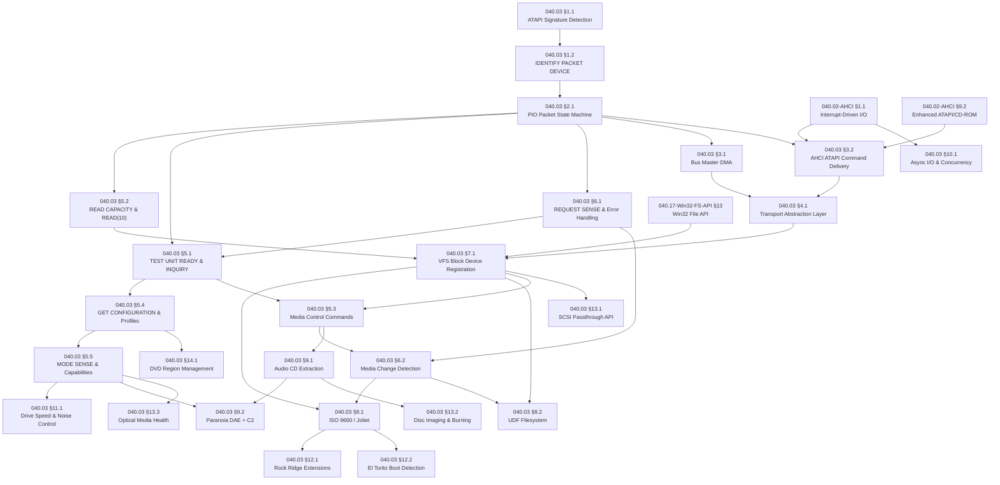

# 040.03-ATAPI-SCSI-MMC — ATAPI Optical Drive & SCSI MMC Driver

> **Goal:** Implement a production-grade ATAPI driver that tunnels SCSI Multimedia
> Commands (MMC) over the ATA transport layer for CD-ROM, CD-RW, DVD-ROM, and
> Blu-ray optical drives. Support both legacy PATA (PIO + Bus Master DMA) and
> modern AHCI transports via a clean transport abstraction layer. Implement the
> core SCSI MMC command set (INQUIRY, READ CAPACITY, READ, TOC, media control),
> full sense data error handling, removable media event detection, and filesystem
> integration for ISO 9660 / Joliet / UDF volumes.
> The driver registers as a block device under `D:\` or assigned drive letter and
> exposes the optical drive through the Windows-style Device Manager and Disk Manager.

> [!CAUTION]
> **Memory Rule:** Use `pmm_alloc_contiguous()` for DMA buffers (PRDT, sense data, read buffers). `kmalloc` is ONLY for small kernel structs (≤ 4 KB). See `rules.md` Known Gotchas.

> [!WARNING]
> **Endianness:** SCSI payloads and responses are strictly **Big-Endian (Network Byte Order)**, while x86-64 is Little-Endian. All multi-byte SCSI response fields **must** be byte-swapped (`bswap32` / `bswap16`) before interpretation. Failure to byte-swap will produce wildly incorrect LBA addresses and capacities.

> [!IMPORTANT]
> **Spec Reference:** All section numbers, register offsets, CDB formats, and sense codes reference the
> [ATAPI & SCSI MMC Specification](file:///home/derickpayne/impossible-os/specs/storage/controllers/atapi-scsi-mmc.md)
> in the repo at `specs/storage/controllers/atapi-scsi-mmc.md`.

> [!NOTE]
> **Existing Implementation:** The AHCI driver (`src/kernel/drivers/ahci.c`, 828 lines)
> already implements basic ATAPI support: `AHCI_SIG_ATAPI` signature detection,
> `IDENTIFY PACKET DEVICE` (`atapi_do_identify()`), `READ CAPACITY` (`atapi_read_capacity()`),
> `READ(10)` (`atapi_do_read()`), and AHCI packet command delivery (`atapi_packet_cmd()`).
> ATAPI devices are registered as block devices (`cdrom0`, `cdrom1`, ...) via
> [blkdev_adapters.c](file:///home/derickpayne/impossible-os/src/kernel/main/blkdev_adapters.c) (line 257).
> **This TODO extends and refactors that foundation** — it does NOT start from scratch.
> See: [ahci.h](file:///home/derickpayne/impossible-os/include/kernel/drivers/ahci.h),
> [ahci.c](file:///home/derickpayne/impossible-os/src/kernel/drivers/ahci.c),
> [blkdev_adapters.c](file:///home/derickpayne/impossible-os/src/kernel/main/blkdev_adapters.c).

> [!CAUTION]
> **Existing `kmalloc` DMA bug:** `atapi_do_identify()` (line 431) and `atapi_read_capacity()`
> (line 497) currently use `kmalloc()` for DMA response buffers (512 and 8 bytes respectively).
> These MUST be migrated to `pmm_alloc_contiguous()` — `kmalloc` heap memory is not guaranteed
> to be physically contiguous or aligned for AHCI PRDT DMA transfers. This is a latent correctness
> bug that works by luck on some hardware.

---

## TODO Completion Roadmap (Cross-File)

> [!IMPORTANT]
> **Seven TODO files** contribute to the optical drive subsystem. The ATAPI driver
> depends on the AHCI transport layer, the VFS block device interface, and the
> filesystem drivers (ISO 9660, UDF). Internal sections also have strict ordering:
> you cannot implement DMA before PIO, error handling before sense data, or
> filesystem integration before block device registration. This roadmap shows
> the correct sequence — completing items out of order will cause rework.

### Dependency Graph



### Phase-by-Phase Implementation Order

| Phase | TODO File                | Section                      | What It Delivers                                          | Depends On                             | Status |
| :---: | ------------------------ | ---------------------------- | --------------------------------------------------------- | -------------------------------------- | :----: |
| **1** | `040.03-ATAPI-SCSI-MMC`  | §1.1 ATAPI Signature        | Identify optical drives during port enumeration            | —                                      |   ✅   |
| **1** | `040.03-ATAPI-SCSI-MMC`  | §1.2 IDENTIFY PACKET        | Parse device capabilities, model name, DMA modes           | Phase 1 (§1.1)                         |   ✅   |
| **2** | `040.03-ATAPI-SCSI-MMC`  | §2.1 PIO Packet Protocol    | ATAPI command transport — all SCSI commands depend on this | Phase 1 (§1.2)                         |   ⬜   |
| **2** | `040.03-ATAPI-SCSI-MMC`  | §6.1 REQUEST SENSE          | Error classification (Sense Key/ASC/ASCQ)                  | Phase 2 (§2.1)                         |   ⬜   |
| **3** | `040.03-ATAPI-SCSI-MMC`  | §5.2 READ CAPACITY & READ   | Read data from optical media — core I/O                    | Phase 2 (§2.1)                         |   ⬜   |
| **3** | `040.03-ATAPI-SCSI-MMC`  | §5.1 TEST UNIT READY & INQ  | Media presence check and device probing                    | Phase 2 (§6.1)                         |   ⬜   |
| **3** | `040.03-ATAPI-SCSI-MMC`  | §5.4 GET CONFIGURATION      | Drive/media type detection (CD/DVD/BD profiles)            | Phase 3 (§5.1)                         |   ⬜   |
| **4** | `040.03-ATAPI-SCSI-MMC`  | §3.1 Bus Master DMA         | Async DMA transfer — stop wasting CPU on PIO               | Phase 2 (§2.1)                         |   ⬜   |
| **4** | `040.03-ATAPI-SCSI-MMC`  | §3.2 AHCI ATAPI Delivery    | AHCI hardware-automated ATAPI handshake                    | Phase 2 (§2.1) + AHCI §1.1             |   ⬜   |
| **4** | `040.03-ATAPI-SCSI-MMC`  | §4.1 Transport Abstraction  | Unified SCSI transport (PIO/DMA/AHCI)                      | Phase 4 (§3.1 + §3.2)                  |   ⬜   |
| **5** | `040.03-ATAPI-SCSI-MMC`  | §7.1 VFS Block Device       | Expose optical drive as block device + drive letter        | Phase 3 (§5.2) + Phase 4 + 040.17 §13  |   ⬜   |
| **5** | `040.03-ATAPI-SCSI-MMC`  | §5.3 Media Control Cmds     | Eject, load tray, lock, READ TOC, disc structure           | Phase 3 (§5.1) + Phase 5 (§7.1)        |   ⬜   |
| **5** | `040.03-ATAPI-SCSI-MMC`  | §5.5 MODE SENSE & Caps      | Drive speeds, buffer size, mechanism type, audio caps      | Phase 3 (§5.4)                         |   ⬜   |
| **5** | `040.03-ATAPI-SCSI-MMC`  | §6.2 Media Change Detection | Detect disc swaps, invalidate caches, auto-remount         | Phase 2 (§6.1) + Phase 5 (§5.3)        |   ⬜   |
| **5** | `040.03-ATAPI-SCSI-MMC`  | §10.1 Async I/O             | Non-blocking optical drive access + per-device events      | Phase 4 (§4.1) + AHCI §1.1             |   ⬜   |
| **6** | `040.03-ATAPI-SCSI-MMC`  | §8.1 ISO 9660 / Joliet      | Standard CD/DVD filesystem — mount data discs              | Phase 5 (§7.1 + §6.2)                  |   ⬜   |
| **6** | `040.03-ATAPI-SCSI-MMC`  | §8.2 UDF Filesystem         | DVD-ROM and Blu-ray filesystem support                     | Phase 5 (§7.1 + §6.2)                  |   ⬜   |
| **6** | `040.03-ATAPI-SCSI-MMC`  | §9.1 Audio CD Extraction    | CD playback and digital audio extraction                   | Phase 5 (§5.3)                         |   ⬜   |
| **7** | `040.03-ATAPI-SCSI-MMC`  | §12.1 Rock Ridge            | Long filenames + POSIX attributes on ISO 9660              | Phase 6 (§8.1)                         |   ⬜   |
| **7** | `040.03-ATAPI-SCSI-MMC`  | §12.2 El Torito             | Bootable CD/DVD detection + "Bootable" badge               | Phase 6 (§8.1)                         |   ⬜   |
| **7** | `040.03-ATAPI-SCSI-MMC`  | §9.2 Paranoia DAE + C2      | **Bit-perfect ripping** with C2 error detection            | Phase 6 (§9.1) + Phase 5 (§5.5)        |   ⬜   |
| **7** | `040.03-ATAPI-SCSI-MMC`  | §11.1 Drive Speed Control   | **Native noise/speed GUI** — no 3rd-party needed           | Phase 5 (§5.5)                         |   ⬜   |
| **8** | `040.03-ATAPI-SCSI-MMC`  | §13.1 SCSI Passthrough      | **Direct SCSI access** — no 3rd-party needed               | Phase 5 (§7.1)                         |   ⬜   |
| **8** | `040.03-ATAPI-SCSI-MMC`  | §13.2 Disc Imaging & Burn   | **Built-in ISO creation + CD/DVD burning**                 | Phase 6 (§9.1)                         |   ⬜   |
| **8** | `040.03-ATAPI-SCSI-MMC`  | §13.3 Optical Media Health  | **Disc quality scanner** — surface error mapping           | Phase 5 (§5.5)                         |   ⬜   |
| **8** | `040.03-ATAPI-SCSI-MMC`  | §14.1 DVD Region Mgmt       | **Region-free playback** — no 5-change limit               | Phase 3 (§5.4)                         |   ⬜   |
| —     | `040.02-AHCI`            | §1.1 Interrupt-Driven I/O   | AHCI interrupts — enables §3.2 + §10.1 async               | —                                      |   ⬜   |
| —     | `040.02-AHCI`            | §9.2 Enhanced ATAPI/CD-ROM  | AHCI-side SCSI commands — supplements §3.2                 | AHCI §1.1                              |   ⬜   |
| —     | `040.17-Win32-FS-API`    | §13 Win32 File API          | Handle system (CreateFile, etc.) — enables §7.1            | —                                      |   ⬜   |

> [!NOTE]
> **Phases 1–3** are the critical path. They deliver a working read-only optical
> drive with PIO transport — enough to verify hardware detection and basic reads.
> **Phases 4–5** add DMA/AHCI performance, the transport abstraction, block
> device registration, and media management — a production-viable driver.
> **Phases 6–7** deliver filesystem integration and competitive features (⭐):
> ISO 9660, UDF, audio CD extraction, paranoia-grade ripping, and drive noise control.
> **Phase 8** delivers Impossible OS exclusives: SCSI passthrough, disc imaging/burning,
> and optical media health scanning.
> The AHCI and VFS/Filesystem rows are **cross-domain dependencies** — they can proceed in
> parallel but must complete before their dependents.

> [!TIP]
> **Quick wins (any time after Phase 2):** §6.1 REQUEST SENSE can be tested
> standalone against the PIO state machine — it's the error path foundation.
> §5.1 TEST UNIT READY is also a good early smoke test: it confirms the device
> responds to SCSI commands without requiring any data transfer.

> [!WARNING]
> **Do not skip Phase 4 (Transport Abstraction).** If you implement §7.1 and
> §8.1 directly on top of PIO, you'll have to refactor every SCSI command callsite
> when DMA/AHCI support arrives. The `scsi_transport_ops_t` interface in §4.1
> ensures all downstream code (§5–§13) is transport-agnostic from the start.

> [!NOTE]
> **Existing code to refactor:** The current `atapi_packet_cmd()` in `ahci.c`
> (line 372) is tightly coupled to the AHCI transport. Phase 4 (§4.1) must
> extract this into a generic `scsi_transport_ops_t` implementation. Similarly,
> `ahci_atapi_read()` (line 636) should route through the transport abstraction.
> The SCSI command defines (`SCSI_TEST_UNIT_READY`, `SCSI_INQUIRY`, etc.) in
> `ahci.h` (lines 98–102) should move to a dedicated `scsi.h` header.

---

## 1. Device Discovery & Signature Detection

### 1.1 ATAPI Signature Evaluation

**Prompt:** Verify that ATAPI device signature detection is correctly implemented. Check: (1) `ahci.h` defines `AHCI_SIG_SEMB` (`0xC33C0101`), `AHCI_SIG_PM` (`0x96690101`), and `enum ahci_device_type` with `AHCI_DEV_NULL/ATA/ATAPI/SEMB/PM`. (2) `ahci_core.c` `port_init()` uses a `switch` on `PxSIG` to classify all device types with correct logging. (3) `ahci_rw.c` guards `ahci_read()`, `ahci_write()`, `ahci_write_fua()` against ATAPI ports. (4) `ahci_ncq.c` guards `ahci_ncq_read()`, `ahci_ncq_write()` against ATAPI ports. (5) `bash scripts/build.sh clean` → `=== BUILD OK ===`. (6) Boot log shows SATA drives detected normally.

> [!NOTE]
> **Implementation notes:** Used `enum ahci_device_type` instead of bare `is_atapi`
> flag. Kept `is_atapi` field for backward compatibility. SEMB and PM signatures
> are logged and skipped. Unknown signatures (not 0xFFFFFFFF/0x00000000) are
> logged at DEBUG level.

- [x] On each ATA/AHCI port during enumeration:
  - [x] Read task file registers: Sector Count, LBA Low, LBA Mid, LBA High
  - [x] ATA signature: `SC=0x01, LBALo=0x01, LBAMid=0x00, LBAHi=0x00` → magnetic disk
  - [x] ATAPI signature: `SC=0x01, LBALo=0x01, LBAMid=0x14, LBAHi=0xEB` → optical/tape
- [x] Under AHCI: read `PxSIG` register — value `0xEB140101` = ATAPI device
- [x] If ATAPI detected: set `port->device_type = AHCI_DEV_ATAPI`
- [x] If ATAPI detected: suppress all native ATA commands for this port
- [x] Handle no-device case: `PxSIG = 0xFFFFFFFF` or status register reads `0xFF`
- [x] Handle SEMB signature: `PxSIG = 0xC33C0101` (enclosure management bridge — skip)
- [x] Handle PM signature: `PxSIG = 0x96690101` (port multiplier — defer to §9.1)
- [x] Log: `[ATAPI] Port %d: ATAPI device detected (signature 0x14/0xEB)`
- [x] Commit: `"atapi: device signature detection"`

### 1.2 IDENTIFY PACKET DEVICE (`0xA1`)

**Prompt:** Verify IDENTIFY PACKET DEVICE parsing is correctly implemented. Check: (1) `atapi_do_identify()` in `ahci_atapi.c` issues `0xA1` (not `0xEC`). (2) Word 0 parsed: bits 15-14 confirm ATAPI, bits 12-8 → `atapi_scsi_type`, bits 6-5 → `atapi_drq_type`, bits 1-0 → `atapi_packet_size`. (3) Serial (words 10-19), firmware rev (words 23-26), model (words 27-46) byte-swapped. (4) Word 63 → `atapi_dma_mode`, Word 88 → `atapi_udma_mode`, Word 76 → `atapi_sata_caps`. (5) `ahci_port` struct has `firmware[9]`, `atapi_scsi_type`, `atapi_packet_size`, `atapi_drq_type`, `atapi_dma_mode`, `atapi_udma_mode`, `atapi_sata_caps`. (6) Log shows device type name, packet size, DMA mode. (7) `bash scripts/build.sh clean` → `=== BUILD OK ===`.

> [!NOTE]
> **Implementation notes:** Results stored directly in `ahci_port` struct fields
> (not a separate `atapi_device_t`). DMA mode selection is informational only —
> actual programming deferred to §2.1 PIO Packet Protocol. `blkdev_register()`
> deferred to §1.3 which handles the full registration flow. Word 76 (SATA caps)
> values 0x0000 and 0xFFFF treated as "not reported" per ACS spec.

- [x] Issue `0xA1` (IDENTIFY PACKET DEVICE) — not `0xEC`
- [x] Read 256 words (512 bytes) from data port after DRQ asserts
- [x] Parse Word 0 — General Configuration:
  - [x] Bits 15–14: confirm `10b` (ATAPI protocol)
  - [x] Bits 12–8: SCSI peripheral type (`0x05` = CD/DVD-ROM, `0x00` = direct-access, `0x01` = tape)
  - [x] Bits 6–5: DRQ timing (accelerated vs. delayed)
  - [x] Bits 1–0: command packet size (`00b` = 12-byte, `01b` = 16-byte)
- [x] Parse Words 10–19: serial number (20 chars, byte-swap each pair)
- [x] Parse Words 23–26: firmware revision (8 chars, byte-swap each pair)
- [x] Parse Words 27–46: model number (40 chars, byte-swap each pair)
- [x] Parse Word 49: capabilities (bit 8 = LBA, bit 11 = IORDY)
- [x] Parse Word 63: Multiword DMA modes (bits 2–0 = supported modes)
- [x] Parse Word 88: Ultra DMA modes (bits 6–0 = supported modes)
- [x] Parse Word 76: SATA capabilities (bit 8 = NCQ, bit 2 = Gen2, bit 1 = Gen1)
- [x] Store results in `ahci_port` struct fields
- [x] Select highest supported DMA mode and program controller
- [x] Register device: deferred to §1.3 (full registration flow)
- [x] Log: `ATAPI port %u: "%s" type=%s, pkt=%u, DMA=%s`
- [x] Commit: `"atapi: IDENTIFY PACKET DEVICE parsing"`

---

## 2. ATAPI Packet Protocol (PIO)

### 2.1 PIO Packet State Machine

**Prompt:** Verify the ATAPI PIO packet state machine is correctly implemented. Check: (1) `ahci_atapi.c` has `port_issue_cmd_atapi()` with 30-second timeout for optical spin-up. (2) `atapi_packet_cmd()` accepts 6 parameters: port, CDB, cdb_len, buffer, buf_len, direction. (3) CDB is zero-padded to device's `atapi_packet_size` (12 or 16 bytes). (4) Command header sets ATAPI bit (bit 5) and Write bit (bit 6) when direction=1. (5) ERR bit checked in TFD after completion, CLO reset on stuck BSY/DRQ. (6) All callers (`atapi_read_capacity`, `atapi_do_read`) updated to new signature. (7) `bash scripts/build.sh clean` → `=== BUILD OK ===`.

> [!NOTE]
> **Implementation notes:** Under AHCI, the HBA handles the 8-step PIO state
> machine in hardware — no raw IDE register bitbanging needed. The driver builds
> a Command FIS (`ATA_CMD_PACKET` = 0xA0) and places the CDB in the ACMD area.
> The HBA then handles drive selection, BSY/DRQ polling, CDB transfer, and
> data phase transfer automatically via PRDT. The `port_issue_cmd_atapi()`
> function provides the longer timeout (30s vs 5s) needed for optical spin-up.
> ATAPI errors are not retried — they require REQUEST SENSE (§6.1) for proper
> error classification.

- [x] Implement `atapi_packet_cmd(port, cdb, cdb_len, buf, buf_len, direction)`:
  - [x] Step 1: Drive/Head selection (via FIS Device field, handled by HBA)
  - [x] Step 2: BSY/DRQ polling (handled by HBA, 30s timeout in port_issue_cmd_atapi)
  - [x] Step 3: Features register = DMA=1 (AHCI handles PIO/DMA automatically)
  - [x] Step 4: Byte count limit: LBA Mid/High set in FIS lba1/lba2
  - [x] Step 5: 0xA0 (ATA_CMD_PACKET) issued via Command FIS
  - [x] Step 6: DRQ/C/D/I/O verification (handled by HBA)
  - [x] Step 7: CDB transfer (from ACMD area, zero-padded to packet size)
  - [x] Step 8: Data phase (via PRDT, handled by HBA)
- [x] Handle multi-block transfers: PRDT handles contiguous data transfer
- [x] Read actual transfer size from prdbc after completion
- [x] Check ERR bit in Task File Data after completion → CLO reset if stuck
- [x] 400ns delay: not needed under AHCI (HBA handles timing)
- [x] Timeout: 30 seconds for optical spin-up (ATAPI_TIMEOUT_US / ATAPI_TIMEOUT_MS)
- [x] Pad all CDBs to device's expected packet size (atapi_packet_size: 12 or 16)
- [x] Commit: `"atapi: PIO packet state machine"`

---

## 3. ATAPI DMA Transport

### 3.1 Bus Master DMA for ATAPI

**Prompt:** PIO monopolizes the CPU while waiting for the slow optical drive. Implement Bus Master DMA for ATAPI: the only difference from PIO is writing `0x01` to the Features register (DMA mode) and using a Physical Region Descriptor Table (PRDT) for data transfer. Build the PRDT in contiguous physical memory: each 8-byte entry has a 32-bit physical address, 16-bit byte count, and EOT bit on the last entry. After writing the CDB, start the DMA engine via the Bus Master Command Register. The transfer completes asynchronously via interrupt. After completing all items, mark every item as `[x]`, update this prompt to a verification prompt, run `bash scripts/build.sh clean`, and commit as `"atapi: bus master DMA transfer"`. Add notes directly in this TODO section. After implementation, save any gotchas, solutions, and important information to MCP memory (`mcp_memory_create_entities` / `mcp_memory_add_observations`).

- [ ] Implement `atapi_dma_command(port, cdb, cdb_len, buf, buf_len, direction)`:
  - [ ] Allocate PRDT via `pmm_alloc_contiguous()` — array of 8-byte descriptors
  - [ ] Populate PRDT entries: `{ phys_addr, byte_count, flags }`, set EOT on last
  - [ ] Write PRDT physical address to Bus Master PRDT Address Register
  - [ ] Write Features register = `0x01` (DMA mode, not `0x00`)
  - [ ] Set byte count limit in LBA Mid/High (same as PIO)
  - [ ] Issue `0xA0` PACKET command, write CDB
  - [ ] Set Start bit in Bus Master Command Register
  - [ ] Return — transfer proceeds asynchronously
- [ ] DMA completion ISR:
  - [ ] Read Bus Master Status Register: check for error, interrupt, active bits
  - [ ] Clear interrupt bit by writing 1 to it
  - [ ] Clear Start bit to stop DMA engine
  - [ ] Read ATA Status Register to clear IRQ
  - [ ] Wake waiting thread via `event_set()`
- [ ] PRDT constraints: each entry ≤ 64 KB, must not cross 64 KB physical boundary
- [ ] Commit: `"atapi: bus master DMA transfer"`

### 3.2 AHCI ATAPI Command Delivery

**Prompt:** Under AHCI, the HBA automates the entire ATAPI handshake in silicon. The driver builds memory structures and rings a doorbell — no PIO polling required. Configure the Command Header: set CFL=5 (H2D FIS length in DWORDs), set the `a` bit (bit 5) to signal ATAPI mode, set `w` for write direction, set PRDTL for scatter-gather entries. In the Command Table: build FIS_REG_H2D (`0x27`) in the CFIS field with command=`0xA0`, place the raw SCSI CDB in the 16-byte ACMD field. Populate PRDT entries, write PxCI to issue. Completion arrives via MSI. After completing all items, mark every item as `[x]`, update this prompt to a verification prompt, run `bash scripts/build.sh clean`, and commit as `"atapi: AHCI command delivery"`. Add notes directly in this TODO section. After implementation, save any gotchas, solutions, and important information to MCP memory (`mcp_memory_create_entities` / `mcp_memory_add_observations`).

> [!NOTE]
> **Existing code:** `atapi_packet_cmd()` in `ahci.c` (line 372) already
> implements this: builds H2D FIS with `ATA_CMD_PACKET`, sets features=1 (DMA),
> copies 12-byte CDB to `acmd[]`, sets bit 5 (ATAPI) in command header flags.
> This section formalizes the existing implementation and extends it with
> 16-byte CDB support and proper error checking via `PxTFD`.

- [ ] Implement `ahci_atapi_command(port, cdb, cdb_len, buf, buf_len, direction)`:
  - [ ] Find free Command List slot (check PxCI and PxSACT)
  - [ ] Configure `HBA_CMD_HEADER`:
    - [ ] `CFL = 5` (Host-to-Device Register FIS = 5 DWORDs = 20 bytes)
    - [ ] `A = 1` (ATAPI — tells HBA to use packet protocol)
    - [ ] `W = (direction == WRITE) ? 1 : 0`
    - [ ] `PRDTL = num_prdt_entries`
  - [ ] Build Command Table (`HBA_CMD_TBL`), aligned to 128 bytes:
    - [ ] **CFIS** (64 bytes): construct `FIS_REG_H2D` (type `0x27`):
      - [ ] `fis_type = 0x27`, `command = 0xA0`, `c = 1` (command register update)
      - [ ] `featurel = 0x01` (DMA) or `0x00` (PIO)
      - [ ] `lba_mid = buf_len & 0xFF`, `lba_hi = (buf_len >> 8) & 0xFF`
    - [ ] **ACMD** (16 bytes): copy raw SCSI CDB (12 or 16 bytes, zero-pad remainder)
    - [ ] **PRDT**: populate entries with `{ dba, dbc, i_bit }`, max 4 MB per entry
  - [ ] Issue: write `(1 << slot)` to `PxCI`
- [ ] Completion: MSI fires, ISR reads `PxIS`, process `PxCI` clearance
- [ ] Error: check `PxTFD` for ERR bit → issue REQUEST SENSE
- [ ] Commit: `"atapi: AHCI command delivery"`

---

## 4. Transport Abstraction Layer

### 4.1 Unified SCSI Transport Interface

**Prompt:** The ATAPI SCSI logic must be completely decoupled from the physical transport. Create a `scsi_transport_t` interface with a single `send_command()` callback. Legacy IDE PIO, Legacy IDE DMA, and AHCI each implement this interface. The ATAPI device object calls `transport->send_command(cdb, data, len, direction)` without knowing or caring which hardware path is active. This guarantees the same SCSI READ(10) code works on a vintage 40-pin PATA cable and a modern SATA-III port. After completing all items, mark every item as `[x]`, update this prompt to a verification prompt, run `bash scripts/build.sh clean`, and commit as `"atapi: transport abstraction layer"`. Add notes directly in this TODO section. After implementation, save any gotchas, solutions, and important information to MCP memory (`mcp_memory_create_entities` / `mcp_memory_add_observations`).

> [!NOTE]
> **Refactoring required:** The SCSI command opcodes (`SCSI_TEST_UNIT_READY`,
> `SCSI_INQUIRY`, `SCSI_READ_CAPACITY`, `SCSI_READ_10`) in `ahci.h` (lines
> 98–102) must move to a new `include/kernel/drivers/scsi.h` header. The
> `atapi_packet_cmd()` function becomes the `ahci_transport` implementation.

- [ ] Create `include/kernel/drivers/scsi.h` — move SCSI command opcodes from `ahci.h`
- [ ] Define `scsi_transport_ops_t`:
  ```c
  typedef struct scsi_transport_ops {
      int (*send_command)(void *ctx, const uint8_t *cdb, size_t cdb_len,
                          void *data, size_t data_len, int direction);
  } scsi_transport_ops_t;
  ```
- [ ] Implement `ide_pio_transport`: calls `atapi_pio_command()`
- [ ] Implement `ide_dma_transport`: calls `atapi_dma_command()`
- [ ] Implement `ahci_transport`: calls `ahci_atapi_command()`
- [ ] `atapi_device_t` holds a `scsi_transport_ops_t *transport` pointer
- [ ] All SCSI MMC commands use `dev->transport->send_command()` exclusively
- [ ] Auto-detect transport at init: prefer AHCI > DMA > PIO
- [ ] Log: `[ATAPI] Using transport: %s`
- [ ] Commit: `"atapi: transport abstraction layer"`

---

## 5. Core SCSI MMC Commands

### 5.1 TEST UNIT READY & INQUIRY

**Prompt:** Implement the two most fundamental SCSI commands. TEST UNIT READY (`0x00`) is a no-data command that checks if the device is ready (media present, spun up). It must be sent repeatedly during spin-up, with delays between retries. INQUIRY (`0x12`) retrieves 36 bytes of device identification: peripheral type, vendor name, product name, revision. Both commands must be padded to the device's CDB size (12 bytes). After completing all items, mark every item as `[x]`, update this prompt to a verification prompt, run `bash scripts/build.sh clean`, and commit as `"atapi: TEST UNIT READY and INQUIRY"`. Add notes directly in this TODO section. After implementation, save any gotchas, solutions, and important information to MCP memory (`mcp_memory_create_entities` / `mcp_memory_add_observations`).

> [!NOTE]
> **Existing defines:** `SCSI_TEST_UNIT_READY` (`0x00`) and `SCSI_INQUIRY`
> (`0x12`) are defined in `ahci.h` (lines 99–100) but have no
> implementation functions. This section adds the actual command functions.

- [ ] Implement `atapi_test_unit_ready(dev)`:
  - [ ] CDB: `{ 0x00, 0, 0, 0, 0, 0, 0, 0, 0, 0, 0, 0 }` (12 bytes, zero-padded)
  - [ ] No data transfer — check status only
  - [ ] If CHECK CONDITION → issue REQUEST SENSE to determine cause
  - [ ] Retry loop: up to 10 retries with 500ms delay (drive may be spinning up)
  - [ ] Return: 0 = ready, -ENOMEDIUM = no disc, -EAGAIN = spinning up
- [ ] Implement `atapi_inquiry(dev, buf)`:
  - [ ] CDB: `{ 0x12, 0x00, 0x00, 0x00, 0x24, 0x00, ... }` (allocation length = 36)
  - [ ] Parse 36-byte response:
    - [ ] Byte 0 bits 4–0: peripheral device type (`0x05` = CD/DVD)
    - [ ] Byte 0 bits 7–5: peripheral qualifier (0 = connected, 1 = not connected)
    - [ ] Bytes 8–15: vendor identification (8 bytes, space-padded ASCII)
    - [ ] Bytes 16–31: product identification (16 bytes)
    - [ ] Bytes 32–35: product revision (4 bytes)
  - [ ] Store in `dev->vendor`, `dev->product`, `dev->revision`
- [ ] Log: `[ATAPI] INQUIRY: %s %s rev %s`
- [ ] Commit: `"atapi: TEST UNIT READY and INQUIRY"`

### 5.2 READ CAPACITY & READ (10)

**Prompt:** READ CAPACITY (`0x25`) returns the last LBA and block size (typically 2048 for data CDs). Both fields are 32-bit Big-Endian — they MUST be byte-swapped on x86. Total capacity = `(Last_LBA + 1) × Block_Size`. READ (10) (`0x28`) reads data blocks. The transfer length field is block count, not byte count. For a 2048-byte-sector CD, reading 512 blocks reads 1 MB. LBA and transfer length are Big-Endian in the CDB. After completing all items, mark every item as `[x]`, update this prompt to a verification prompt, run `bash scripts/build.sh clean`, and commit as `"atapi: READ CAPACITY and READ(10)"`. Add notes directly in this TODO section. After implementation, save any gotchas, solutions, and important information to MCP memory (`mcp_memory_create_entities` / `mcp_memory_add_observations`).

> [!NOTE]
> **Existing code:** `atapi_read_capacity()` in `ahci.c` (line 489) and
> `atapi_do_read()` (line 522) already implement these commands with correct
> Big-Endian byte-swapping. This section formalizes and adds READ(12) for
> large media (>2 TB optical) and proper error handling on capacity queries.

- [ ] Implement `atapi_read_capacity(dev, *last_lba, *block_size)`:
  - [ ] CDB: `{ 0x25, 0, 0, 0, 0, 0, 0, 0, 0, 0, 0, 0 }`
  - [ ] Read 8-byte response
  - [ ] Byte-swap bytes 0–3 → `last_lba` (Big-Endian to Little-Endian)
  - [ ] Byte-swap bytes 4–7 → `block_size`
  - [ ] Validate: `block_size` should be 2048 (data CD/DVD) or 2352 (raw)
  - [ ] Compute: `capacity = (last_lba + 1) * block_size`
  - [ ] Store in `dev->capacity`, `dev->block_size`
- [ ] Implement `atapi_read(dev, lba, block_count, buf)`:
  - [ ] CDB: `{ 0x28, 0x00, LBA[3], LBA[2], LBA[1], LBA[0], 0x00, Len[1], Len[0], 0x00, 0x00, 0x00 }`
  - [ ] LBA and Len encoded Big-Endian in CDB
  - [ ] Buffer size = `block_count * dev->block_size`
  - [ ] For requests > 65535 blocks: split into multiple READ(10) commands
  - [ ] Allocate read buffer via `pmm_alloc_contiguous()` for DMA
- [ ] Implement `atapi_read12(dev, lba, block_count, buf)`:
  - [ ] CDB: `{ 0xA8, 0x00, LBA[3..0], Len[3..0], 0x00, 0x00 }`
  - [ ] For transfer lengths > 65535 blocks (exceeds READ(10) 16-bit field)
- [ ] Log: `[ATAPI] Capacity: %u MB (%u blocks × %u bytes)`
- [ ] Commit: `"atapi: READ CAPACITY and READ(10)"`

### 5.3 Media Control Commands

**Prompt:** Implement the optical media control commands: START STOP UNIT (`0x1B`) for spin-up/spin-down/eject/load, PREVENT ALLOW MEDIUM REMOVAL (`0x1E`) for tray locking, and READ TOC (`0x43`) for extracting the Table of Contents. START STOP UNIT uses the LOEJ bit (bit 1) and Start bit (bit 0): LOEJ=1+Start=0 = eject, LOEJ=1+Start=1 = load (close tray), LOEJ=0+Start=1 = spin up. READ TOC returns track/session information needed for multi-session CD and audio CD support. After completing all items, mark every item as `[x]`, update this prompt to a verification prompt, run `bash scripts/build.sh clean`, and commit as `"atapi: media control commands"`. Add notes directly in this TODO section. After implementation, save any gotchas, solutions, and important information to MCP memory (`mcp_memory_create_entities` / `mcp_memory_add_observations`).

- [ ] Implement `atapi_eject(dev)`:
  - [ ] CDB: `{ 0x1B, 0, 0, 0, 0x02, 0, ... }` (LOEJ=1, Start=0 = eject)
- [ ] Implement `atapi_load(dev)`:
  - [ ] CDB: `{ 0x1B, 0, 0, 0, 0x03, 0, ... }` (LOEJ=1, Start=1 = close tray)
- [ ] Implement `atapi_spin_up(dev)`:
  - [ ] CDB: `{ 0x1B, 0, 0, 0, 0x01, 0, ... }` (LOEJ=0, Start=1 = spin up)
- [ ] Implement `atapi_lock_tray(dev, bool lock)`:
  - [ ] CDB: `{ 0x1E, 0, 0, 0, lock ? 0x01 : 0x00, 0, ... }`
- [ ] Implement `atapi_read_toc(dev, buf, buf_len, format)`:
  - [ ] CDB: `{ 0x43, (msf << 1), format, 0, 0, 0, track, Len[1], Len[0], 0, 0, 0 }`
  - [ ] Format 0: TOC — returns track list with start LBAs
  - [ ] Format 1: Multi-session info — returns last session start LBA
  - [ ] Format 2: Raw TOC (Full TOC) — complete session/track structure
  - [ ] Parse TOC header: data length (2 bytes BE), first track, last track
  - [ ] Parse track descriptors: track number, ADR/Control, start LBA (4 bytes BE)
  - [ ] Byte-swap all multi-byte fields
- [ ] Implement `atapi_read_disc_structure(dev, media_type, layer, format, buf)`:
  - [ ] CDB: `{ 0xAD, media_type, 0, 0, layer, 0, 0, format, Len[1], Len[0], 0, 0 }`
  - [ ] Format 0x00: Physical Format Info (DVD layer info: track path, density, sectors)
  - [ ] Format 0x01: DVD Copyright (CSS/CPRM protected status)
  - [ ] Format 0x04: DVD Manufacturing Info
  - [ ] Format 0x10: Blu-ray Disc Information
  - [ ] Byte-swap all BE response fields
- [ ] Wire eject to device manager / Explorer context menu
- [ ] Commit: `"atapi: media control commands"`

### 5.4 GET CONFIGURATION & Feature Profiles

**Prompt:** GET CONFIGURATION (`0x46`) retrieves the drive's capability profile list and active features. This is essential for determining what the drive can do: read CD, read DVD, read BD, write CD-R, write DVD±R/RW, etc. Each profile has a numeric code (e.g., `0x0008` = CD-ROM, `0x0010` = DVD-ROM, `0x0040` = BD-ROM). The current profile indicates what type of media is currently inserted. Feature descriptors provide fine-grained capabilities: core features, morphing, removable medium, random readable, multi-read, CD read, DVD read, BD read, power management, etc. After completing all items, mark every item as `[x]`, update this prompt to a verification prompt, run `bash scripts/build.sh clean`, and commit as `"atapi: GET CONFIGURATION and feature profiles"`. Add notes directly in this TODO section. After implementation, save any gotchas, solutions, and important information to MCP memory (`mcp_memory_create_entities` / `mcp_memory_add_observations`).

- [ ] Implement `atapi_get_configuration(dev, rt, start_feature, buf, buf_len)`:
  - [ ] CDB: `{ 0x46, rt, Start[1], Start[0], 0, 0, 0, Len[1], Len[0], 0, 0, 0 }`
  - [ ] RT=0x00: all features, RT=0x01: current features, RT=0x02: single feature
- [ ] Parse Feature Header (8 bytes):
  - [ ] Data length (4 bytes BE)
  - [ ] Current profile (2 bytes BE) — what media type is inserted
- [ ] Parse Profile List (Feature Code `0x0000`):
  - [ ] Each profile descriptor: 4 bytes (profile number BE + current bit)
  - [ ] Key profiles:
    - [ ] `0x0008` CD-ROM, `0x0009` CD-R, `0x000A` CD-RW
    - [ ] `0x0010` DVD-ROM, `0x0011` DVD-R, `0x001A` DVD+RW, `0x001B` DVD+R
    - [ ] `0x002B` DVD+R DL (Dual Layer)
    - [ ] `0x0040` BD-ROM, `0x0041` BD-R, `0x0043` BD-RE
- [ ] Parse Feature Code `0x0108` — Logical Unit Serial Number
- [ ] Detect drive type from profile list (CD-only, DVD combo, BD combo)
- [ ] Detect current media type from current profile
- [ ] Store capabilities in `dev->profiles[]` and `dev->current_profile`
- [ ] Log: `[ATAPI] Drive supports: %s, current media: %s`
- [ ] Commit: `"atapi: GET CONFIGURATION and feature profiles"`

### 5.5 MODE SENSE & Drive Capabilities

**Prompt:** MODE SENSE (10) (`0x5A`) retrieves drive operating parameters organized into mode pages. Critical pages for optical drives: Page `0x01` (Error Recovery — retry counts, error reporting), Page `0x2A` (Capabilities and Mechanical Status — read/write speeds, buffer size, media types supported, tray/caddy/slot mechanism type, audio capabilities). Page `0x2A` is particularly important for determining the drive's maximum read/write speeds and supported features. After completing all items, mark every item as `[x]`, update this prompt to a verification prompt, run `bash scripts/build.sh clean`, and commit as `"atapi: MODE SENSE and drive capabilities"`. Add notes directly in this TODO section. After implementation, save any gotchas, solutions, and important information to MCP memory (`mcp_memory_create_entities` / `mcp_memory_add_observations`).

- [ ] Implement `atapi_mode_sense(dev, page_code, buf, buf_len)`:
  - [ ] CDB: `{ 0x5A, 0x00, page_code, 0, 0, 0, 0, Len[1], Len[0], 0, 0, 0 }`
  - [ ] Use MODE SENSE (10) — not MODE SENSE (6), which some drives don't support
- [ ] Parse Mode Parameter Header (8 bytes):
  - [ ] Mode Data Length (2 bytes BE), Medium Type, Device Specific Parameter
- [ ] Parse Page `0x01` — Read/Write Error Recovery:
  - [ ] Error recovery flags, read retry count, write retry count
- [ ] Parse Page `0x0D` — CD Device Parameters:
  - [ ] Inactivity timer multiplier, S-units per M-unit, F-units per S-unit
- [ ] Parse Page `0x0E` — CD Audio Control:
  - [ ] IMMED bit, SOTC bit, output port channel selection, output port volume
- [ ] Parse Page `0x2A` — Capabilities and Mechanical Status:
  - [ ] Read capabilities: CD-R read, CD-RW read, DVD-ROM read, DVD-R read, etc.
  - [ ] Write capabilities: CD-R write, CD-RW write, DVD-R write, etc.
  - [ ] Mechanism type: tray (0), caddy (1), popup (2), changer (4), slot (5)
  - [ ] Maximum read speed (KB/s), current read speed
  - [ ] Maximum write speed (KB/s), current write speed
  - [ ] Buffer size (KB)
  - [ ] Audio capabilities: digital audio output, accurate DAE stream, C2 error pointers
  - [ ] Disc-at-once (DAO) capability, multi-session capability
- [ ] Store in `dev->capabilities`
- [ ] Log: `[ATAPI] Capabilities: %s, max_read=%u KB/s, buf=%u KB, mech=%s`
- [ ] Commit: `"atapi: MODE SENSE and drive capabilities"`

---

## 6. Error Handling & Sense Data

### 6.1 REQUEST SENSE & Sense Key Parsing

**Prompt:** When any ATAPI command fails (ERR bit set in ATA Status Register), the device caches detailed SCSI error information internally. The driver must issue REQUEST SENSE (`0x03`) to retrieve 18 bytes of fixed-format sense data. Parse three critical fields: Sense Key (byte 2, bits 3–0), ASC (byte 12), and ASCQ (byte 13). Map the Sense Key / ASC / ASCQ triple to a meaningful kernel error code. Key mappings: `0x02/0x3A/0x00` = no medium, `0x02/0x04/0x01` = becoming ready (spinning up), `0x06/0x28/0x00` = media changed (cache invalidation required), `0x05/0x20/0x00` = invalid command. After completing all items, mark every item as `[x]`, update this prompt to a verification prompt, run `bash scripts/build.sh clean`, and commit as `"atapi: REQUEST SENSE and error handling"`. Add notes directly in this TODO section. After implementation, save any gotchas, solutions, and important information to MCP memory (`mcp_memory_create_entities` / `mcp_memory_add_observations`).

- [ ] Implement `atapi_request_sense(dev, sense_buf)`:
  - [ ] CDB: `{ 0x03, 0x00, 0x00, 0x00, 0x12, 0x00, ... }` (allocation length = 18)
  - [ ] Read 18-byte fixed-format sense data
- [ ] Parse sense data:
  - [ ] Byte 0 bits 6–0: response code (`0x70` = current, `0x71` = deferred)
  - [ ] Byte 2 bits 3–0: Sense Key
  - [ ] Byte 7: Additional Sense Length (number of valid bytes beyond byte 7)
  - [ ] Byte 12: Additional Sense Code (ASC)
  - [ ] Byte 13: Additional Sense Code Qualifier (ASCQ)
- [ ] Map Sense Key / ASC / ASCQ to kernel errors:
  - [ ] `0x00` No Sense → success (command completed)
  - [ ] `0x01` Recovered Error → success with warning (log degraded media)
  - [ ] `0x02 / 0x3A / 0x00` Not Ready, Medium Not Present → `-ENOMEDIUM`
  - [ ] `0x02 / 0x3A / 0x01` Not Ready, Medium Not Present, Tray Closed → `-ENOMEDIUM`
  - [ ] `0x02 / 0x3A / 0x02` Not Ready, Medium Not Present, Tray Open → `-ENOMEDIUM`
  - [ ] `0x02 / 0x04 / 0x01` Not Ready, Becoming Ready → `-EAGAIN` (retry after delay)
  - [ ] `0x02 / 0x04 / 0x02` Not Ready, Start Unit Required → call `atapi_spin_up()`
  - [ ] `0x03` Medium Error → `-EIO` (scratched/unreadable media)
  - [ ] `0x03 / 0x11 / 0x00` Unrecovered Read Error → `-EIO` (bad sector)
  - [ ] `0x04` Hardware Error → `-EIO` (internal drive failure)
  - [ ] `0x05 / 0x20 / 0x00` Illegal Request, Invalid Opcode → `-ENOSYS`
  - [ ] `0x05 / 0x24 / 0x00` Illegal Request, Invalid Field → `-EINVAL`
  - [ ] `0x05 / 0x26 / 0x00` Illegal Request, Invalid Field in Parameter List → `-EINVAL`
  - [ ] `0x06 / 0x28 / 0x00` Unit Attention, Media Changed → `-EMEDIUMTYPE` + cache invalidate
  - [ ] `0x06 / 0x29 / 0x00` Unit Attention, Power On/Reset → re-initialize
  - [ ] `0x06 / 0x2A / 0x01` Unit Attention, Mode Parameters Changed → refresh MODE SENSE
  - [ ] `0x0B` Aborted Command → retry
- [ ] Auto-retry on transient errors (Sense Key 0x02 with ASC 0x04): up to 10 retries
- [ ] Log: `[ATAPI] Sense: key=0x%02x ASC=0x%02x ASCQ=0x%02x (%s)`
- [ ] Commit: `"atapi: REQUEST SENSE and error handling"`

### 6.2 Media Change Detection & Cache Invalidation

**Prompt:** When a user swaps discs, the drive signals Unit Attention (Sense Key `0x06`, ASC `0x28`). The kernel must detect this on every command failure and invalidate all cached data: filesystem caches, sector caches, mounted filesystem state. Also implement proactive media change polling via GET EVENT STATUS NOTIFICATION (`0x4A`) in polled mode — this allows detecting disc swaps without waiting for a failed read. After completing all items, mark every item as `[x]`, update this prompt to a verification prompt, run `bash scripts/build.sh clean`, and commit as `"atapi: media change detection"`. Add notes directly in this TODO section. After implementation, save any gotchas, solutions, and important information to MCP memory (`mcp_memory_create_entities` / `mcp_memory_add_observations`).

- [ ] On Sense Key `0x06` / ASC `0x28` (Media Changed):
  - [ ] Invalidate all sector caches for this device
  - [ ] Unmount any mounted filesystem on this device
  - [ ] Re-read capacity (media may have changed size/type)
  - [ ] Re-read GET CONFIGURATION for new media profile
  - [ ] Notify VFS: `vfs_media_changed(dev)`
  - [ ] Notify Disk Manager GUI: media removal event
- [ ] Implement `atapi_poll_media_change(dev)`:
  - [ ] CDB: `{ 0x4A, 0x01, 0x00, 0x00, 0x10, 0x00, 0x00, 0x00, 0x08, 0x00, 0x00, 0x00 }`
  - [ ] Polled mode (bit 0 of byte 1 = 1)
  - [ ] Parse event header: NEA (No Event Available), notification class, supported events
  - [ ] Media event class = `0x04`: check for media removal, insertion, eject request
  - [ ] Operational Change class = `0x02`: feature change, spinning change
- [ ] Periodic polling: timer callback every 2 seconds when no I/O active
- [ ] On media insertion: auto-detect filesystem (ISO 9660 / UDF) and offer auto-mount
- [ ] Log: `[ATAPI] Media change detected — invalidating caches`
- [ ] Commit: `"atapi: media change detection"`

---

## 7. Block Device Integration

### 7.1 VFS Block Device Registration

**Prompt:** Register the ATAPI device as a read-only block device with the VFS layer. The block size is the media's native sector size (2048 for data CDs/DVDs). Expose standard block device operations: read, ioctl (eject, lock, read TOC). Write operations should return `-EROFS` for read-only media (most optical drives). For CD-RW/DVD-RW, detect write capability from the device type and feature profiles. After completing all items, mark every item as `[x]`, update this prompt to a verification prompt, run `bash scripts/build.sh clean`, and commit as `"atapi: VFS block device registration"`. Add notes directly in this TODO section. After implementation, save any gotchas, solutions, and important information to MCP memory (`mcp_memory_create_entities` / `mcp_memory_add_observations`).

> [!NOTE]
> **Existing code:** `blkdev_adapters.c` (line 257) already registers ATAPI
> devices as `cdrom0`, `cdrom1`, etc. with `blkdev_register()`. The read
> callback wraps `ahci_atapi_read()`, write is set to `NULL`. This section
> adds ioctl support (eject, lock, TOC) and proper write capability detection.
> The `struct blkdev` in `blkdev.h` needs an `ioctl` function pointer.

- [ ] Add `blkdev_ioctl_fn ioctl` to `struct blkdev` in `blkdev.h`
- [ ] Implement `atapi_blkdev_ops`:
  - [ ] `read(dev, lba, count, buf)` → `atapi_read()` with 2048-byte sectors
  - [ ] `write(dev, lba, count, buf)` → `-EROFS` for read-only media
  - [ ] `ioctl(dev, cmd, arg)`:
    - [ ] `CDROM_EJECT` → `atapi_eject()`
    - [ ] `CDROM_CLOSE_TRAY` → `atapi_load()`
    - [ ] `CDROM_LOCK_DOOR` → `atapi_lock_tray(true)`
    - [ ] `CDROM_UNLOCK_DOOR` → `atapi_lock_tray(false)`
    - [ ] `CDROM_READ_TOC` → `atapi_read_toc()`
    - [ ] `CDROM_GET_CAPACITY` → `atapi_read_capacity()`
    - [ ] `CDROM_DISC_STATUS` → read current profile, return media type
    - [ ] `CDROM_GET_EVENT` → `atapi_poll_media_change()`
  - [ ] `flush(dev)` → no-op for read-only media
- [ ] Register with block device layer: `blkdev_register("cdrom0", ...)`
- [ ] Assign drive letter: `D:\` (or next available)
- [ ] Register with Device Manager: "CD-ROM Drive" category
- [ ] Log: `[ATAPI] Block device cdrom0 registered (capacity=%u MB, block_size=%u)`
- [ ] Commit: `"atapi: VFS block device registration"`

---

## 8. Optical Filesystem Support

### 8.1 ISO 9660 / Joliet Filesystem Driver

**Prompt:** ISO 9660 (ECMA-119) is the standard CD-ROM filesystem. The Primary Volume Descriptor (PVD) is at LBA 16 (sector 16 × 2048 bytes). It contains the root directory record, volume name, creation date, and block size. Implement a read-only ISO 9660 driver: mount via PVD detection (type code `0x01`, identifier `"CD001"`), parse directory records (variable-length, with interleaving), handle 8.3 filenames. Add Joliet extension support: look for Supplementary Volume Descriptor (type `0x02`) with escape sequences `%/@`, `%/C`, or `%/E` — these indicate UCS-2 Unicode filenames up to 64 characters. After completing all items, mark every item as `[x]`, update this prompt to a verification prompt, run `bash scripts/build.sh clean`, and commit as `"iso9660: filesystem driver with Joliet"`. Add notes directly in this TODO section. After implementation, save any gotchas, solutions, and important information to MCP memory (`mcp_memory_create_entities` / `mcp_memory_add_observations`).

- [ ] Implement `iso9660_mount(blkdev)`:
  - [ ] Read LBA 16 (offset 32768 bytes) for Volume Descriptor Set
  - [ ] Scan for Primary Volume Descriptor: type=`0x01`, magic=`"CD001"`, version=`0x01`
  - [ ] Parse PVD fields:
    - [ ] Volume identifier (32 bytes)
    - [ ] Logical block size (2048 typically)
    - [ ] Volume size in blocks (both-endian — use LE copy at offset 80)
    - [ ] Root directory record (34 bytes at offset 156): LBA, data length
    - [ ] Path table LBA and size
    - [ ] Volume creation date, modification date (17-byte format)
  - [ ] Scan for Supplementary Volume Descriptor (type=`0x02`) for Joliet:
    - [ ] Check escape sequences at offset 88: `%/@`, `%/C`, `%/E`
    - [ ] If found: prefer Joliet root directory and filenames (UCS-2)
  - [ ] Scan for Volume Descriptor Set Terminator (type=`0xFF`)
- [ ] Implement directory parsing:
  - [ ] Read directory extent from root directory LBA
  - [ ] Parse variable-length directory records:
    - [ ] Byte 0: record length (0 = padding to sector boundary)
    - [ ] Bytes 2–9: LBA of file data (both-endian, use LE at offset 2)
    - [ ] Bytes 10–17: data length (both-endian)
    - [ ] Byte 25: file flags (bit 1 = directory, bit 7 = multi-extent)
    - [ ] Byte 26: interleave file unit size (handle if non-zero)
    - [ ] Byte 32: filename length, followed by filename
    - [ ] Handle `;1` version suffix (strip for display)
    - [ ] Handle `.` (self) and `..` (parent) records
  - [ ] For Joliet: decode UCS-2 filenames to UTF-8
- [ ] Implement `iso9660_read_file(inode, offset, buf, len)`
- [ ] Wire to VFS: register `iso9660_ops` with file/dir callbacks
- [ ] Auto-detect: try `iso9660_mount()` on any newly inserted CD/DVD
- [ ] Commit: `"iso9660: filesystem driver with Joliet"`

### 8.2 UDF Filesystem Support (Read-Only)

**Prompt:** UDF (Universal Disk Format, ECMA-167 / ISO 13346) is required for DVD-ROM, Blu-ray, and packet-written CD-RW media. UDF uses different on-disc structures: Anchor Volume Descriptor Pointer (AVDP) at LBA 256, Partition Descriptors, Logical Volume Descriptors, and File Entry / File Identifier Descriptor structures. Implement a basic read-only UDF driver: detect AVDP, parse partition and logical volume descriptors, navigate the File Entry tree, and read file data from allocation descriptors. After completing all items, mark every item as `[x]`, update this prompt to a verification prompt, run `bash scripts/build.sh clean`, and commit as `"udf: basic read-only filesystem driver"`. Add notes directly in this TODO section. After implementation, save any gotchas, solutions, and important information to MCP memory (`mcp_memory_create_entities` / `mcp_memory_add_observations`).

- [ ] Implement `udf_mount(blkdev)`:
  - [ ] Read LBA 256 for Anchor Volume Descriptor Pointer (AVDP)
    - [ ] Validate descriptor tag: tag ID = `0x0002`
    - [ ] Extract Main VDS extent (location + length) and Reserve VDS extent
  - [ ] Also check LBA N-256 (backup AVDP, where N = last LBA)
  - [ ] Read Main Volume Descriptor Sequence:
    - [ ] Parse Primary Volume Descriptor (tag ID `0x0001`)
    - [ ] Parse Partition Descriptor (tag ID `0x0005`): partition start LBA, length
    - [ ] Parse Logical Volume Descriptor (tag ID `0x0006`): partition map, FSD location
    - [ ] Parse Implementation Use Volume Descriptor (tag ID `0x0004`)
  - [ ] Read File Set Descriptor from logical volume
  - [ ] Locate root ICB (Information Control Block) from FSD
- [ ] Implement File Entry / Extended File Entry parsing:
  - [ ] Parse allocation descriptors (short, long, or extended)
  - [ ] Support inline data (embedded in ICB)
  - [ ] Read file data from allocation extents
- [ ] Implement File Identifier Descriptor parsing for directories:
  - [ ] Extract filename (d-string format: length byte + UTF-8/UTF-16 data)
  - [ ] Handle parent directory entry (`..\` equivalent)
  - [ ] Handle hidden and deleted entries
- [ ] UDF version support: 1.02 (DVD-ROM), 1.50 (CD-RW), 2.01 (BD), 2.50 (BD-RE)
- [ ] Wire to VFS with read-only operations
- [ ] Auto-detect: try UDF after ISO 9660 fails (some DVDs are UDF-only)
- [ ] Handle UDF bridge discs (ISO 9660 + UDF on same disc — prefer UDF)
- [ ] Log: `[UDF] Mounted: partition at LBA %u, %u MB`
- [ ] Commit: `"udf: basic read-only filesystem driver"`

---

## 9. Audio CD Support (🚀 Impossible OS Feature)

### 9.1 CD Digital Audio Extraction

**Prompt:** Implement audio CD support using READ CD (`0xBE`), which can read raw 2352-byte audio sectors. Detect audio CDs via READ TOC (tracks with control field bit 2 = 0 are audio). Extract digital audio data (16-bit stereo PCM, 44.1 kHz, Little-Endian) for playback or ripping. Support PLAY AUDIO (10) (`0x45`) and PAUSE/RESUME (`0x4B`) for hardware-driven playback. Read SUB-CHANNEL (`0x42`) for playback position tracking. After completing all items, mark every item as `[x]`, update this prompt to a verification prompt, run `bash scripts/build.sh clean`, and commit as `"atapi: audio CD extraction and playback"`. Add notes directly in this TODO section. After implementation, save any gotchas, solutions, and important information to MCP memory (`mcp_memory_create_entities` / `mcp_memory_add_observations`).

- [ ] Detect audio CD: `atapi_read_toc()` → check Control field per track (bit 2 = 0 → audio)
- [ ] Implement `atapi_read_cd_audio(dev, lba, block_count, buf)`:
  - [ ] CDB: `{ 0xBE, 0x00, LBA[3..0], Len[2..0], 0x10, 0x00, 0x00, 0x00 }`
  - [ ] Expected sector type = `0x00` (any), subchannel = `0x00`
  - [ ] Read raw 2352-byte sectors (no error correction header)
  - [ ] Data format: 16-bit signed PCM, stereo, 44.1 kHz, Little-Endian
- [ ] Implement `atapi_play_audio(dev, start_lba, end_lba)`:
  - [ ] CDB: `{ 0x45, 0, Start[3..0], End[3..0], 0, 0 }`
- [ ] Implement `atapi_pause_resume(dev, bool resume)`:
  - [ ] CDB: `{ 0x4B, 0, 0, 0, 0, 0, 0, 0, resume ? 0x01 : 0x00, 0, 0, 0 }`
- [ ] Implement `atapi_read_subchannel(dev, *position)`:
  - [ ] CDB: `{ 0x42, 0x02, 0x40, 0x01, 0, 0, 0, 0x00, 0x10, 0, 0, 0 }`
  - [ ] Parse: current position in MSF, playback status (playing/paused/stopped)
  - [ ] Parse: ISRC and MCN (Media Catalog Number) for CD metadata
- [ ] SET CD SPEED (`0xBB`): set read speed for quieter operation or max throughput
- [ ] Detect CD-TEXT: read subchannel data in Pack mode for embedded title/artist
- [ ] Wire to audio player application / CD Player applet
- [ ] Commit: `"atapi: audio CD extraction and playback"`

### 9.2 Paranoia-Grade DAE with C2 Error Pointers

**Prompt:** Standard audio extraction tolerates interpolated errors — the drive silently substitutes guessed samples for unreadable ones. Paranoia-grade extraction detects and corrects these errors for bit-perfect audio recovery from scratched discs. Check MODE SENSE Page `0x2A` for C2 Error Pointers support (Capability byte, bit 4) and Accurate Stream support (bit 1). When C2 is supported, READ CD (`0xBE`) can return a 294-byte C2 error pointer block alongside each 2352-byte audio sector — each bit indicates whether the corresponding byte is in error. When errors are detected, re-read the sector with jitter correction (overlapping reads with offset verification). No OS ships with a built-in paranoia-grade ripper as part of the operating system itself. After completing all items, mark every item as `[x]`, update this prompt to a verification prompt, run `bash scripts/build.sh clean`, and commit as `"atapi: paranoia-grade DAE with C2 error detection"`. Add notes directly in this TODO section. After implementation, save any gotchas, solutions, and important information to MCP memory (`mcp_memory_create_entities` / `mcp_memory_add_observations`).

> [!TIP]
> **Competitive Edge:** Windows relies on third-party rippers (EAC, dbpoweramp).
> Linux uses `cdparanoia` (separate package, not integrated). Neither OS has
> built-in bit-perfect audio extraction with C2 error reporting. Impossible OS
> can ship this as a native, first-class audio CD feature.

- [ ] Check capabilities via MODE SENSE Page `0x2A`:
  - [ ] Bit 4: C2 Error Pointers supported
  - [ ] Bit 1: Accurate Stream (DAE does not interpolate errors)
- [ ] If C2 supported, modify READ CD (`0xBE`) header byte:
  - [ ] Byte 9 bit 1: request C2 error block (294 bytes per sector)
  - [ ] Total sector size: 2352 (audio) + 294 (C2) = 2646 bytes
- [ ] Parse C2 error block:
  - [ ] 294 bytes × 8 bits = 2352 bits → one bit per audio sample byte
  - [ ] Bit = 1 → corresponding byte is in error
  - [ ] Count total C2 errors per sector
- [ ] On C2 errors detected:
  - [ ] Re-read sector up to 8 times
  - [ ] Use overlapping reads (read sector N ± 1) to verify alignment
  - [ ] Compare multiple reads at byte level to detect jitter offset
  - [ ] If all retries have errors → mark sector as uncorrectable, log warning
- [ ] Drive read offset correction:
  - [ ] Query AccurateRip database for drive read offset value
  - [ ] Apply sample-level offset correction to extracted audio
- [ ] Expose via API: `cdrom_rip_track(dev, track, buf, *quality_report)`
- [ ] Quality report per track: total sectors, error-free sectors, retried sectors, uncorrectable
- [ ] Wire to CD Player applet: "Rip Track" with quality meter
- [ ] Commit: `"atapi: paranoia-grade DAE with C2 error detection"`

---

## 10. Asynchronous I/O & Concurrency

### 10.1 Interrupt-Driven Async ATAPI

**Prompt:** Optical drives have extremely high latency (seconds for spin-up, hundreds of milliseconds for seek). The ATAPI driver must never block the kernel during I/O. Implement fully asynchronous command submission: submit SCSI CDB, return immediately, wake caller via event when ISR fires on completion. For AHCI, this is native (MSI on PxCI clearance). For legacy IDE, register IRQ14/IRQ15 handlers. Use per-device mutexes to prevent concurrent Task File/Command Table corruption. After completing all items, mark every item as `[x]`, update this prompt to a verification prompt, run `bash scripts/build.sh clean`, and commit as `"atapi: async I/O and concurrency"`. Add notes directly in this TODO section. After implementation, save any gotchas, solutions, and important information to MCP memory (`mcp_memory_create_entities` / `mcp_memory_add_observations`).

> [!NOTE]
> **Current state:** The AHCI driver in `ahci.c` uses polling (`port_issue_cmd()`
> polls `PxCI` with a 5M iteration timeout). Global interrupts are explicitly
> disabled. This section depends on `TODO-040.02-AHCI.md §1.1`
> (Interrupt-Driven I/O) completing first. The ATAPI async path builds on
> top of the AHCI interrupt
> infrastructure.

- [ ] Add `event_t command_complete` to `atapi_device_t`
- [ ] Add `mutex_t port_lock` to prevent concurrent access
- [ ] Legacy IDE:
  - [ ] Register IRQ handler for IRQ14 (primary) / IRQ15 (secondary) via IOAPIC
  - [ ] ISR: read Status Register to acknowledge, call `event_set()`
- [ ] AHCI:
  - [ ] ISR reads `PxIS`, checks for D2H Register FIS / Task File Error
  - [ ] Clear interrupt bits, call `event_set()`
- [ ] Submission path: `mutex_lock()`, submit command, `event_wait(timeout_ms)`
- [ ] Timeout: 30 seconds for spin-up, 10 seconds for normal I/O
- [ ] On timeout: log error, attempt device reset (write SRST or COMRESET)
- [ ] Pre-scheduler fallback: if interrupts not available, use PIO polling
- [ ] Command queueing: queue up to 4 pending SCSI commands per device
- [ ] Commit: `"atapi: async I/O and concurrency"`

---

## 11. Drive Noise Control & Speed Management (🚀 Impossible OS Feature)

### 11.1 SET CD SPEED & Quiet Mode

**Prompt:** Optical drives at maximum speed are extremely loud (40x+ CD = jet turbine). Implement SET CD SPEED (`0xBB`) to allow the user to select between maximum performance and quiet operation. Parse the drive's current speed from MODE SENSE Page `0x2A` (maximum read/write speeds). Offer preset modes: "Performance" (max speed), "Quiet" (8x CD / 4x DVD), "Silent" (4x CD / 2x DVD). Expose via Drive Properties dialog: a speed slider or dropdown. This is a quality-of-life feature no OS provides natively in the GUI. After completing all items, mark every item as `[x]`, update this prompt to a verification prompt, run `bash scripts/build.sh clean`, and commit as `"atapi: drive speed and noise control"`. Add notes directly in this TODO section. After implementation, save any gotchas, solutions, and important information to MCP memory (`mcp_memory_create_entities` / `mcp_memory_add_observations`).

> [!TIP]
> **Competitive Edge:** Neither Windows nor Linux provides a built-in GUI to
> control optical drive speed and noise. Users must install third-party tools
> (e.g., Nero DriveSpeed, hdparm). Impossible OS can offer this natively in
> the Drive Properties dialog — a significant usability win for laptop users.

- [ ] Implement `atapi_set_speed(dev, read_speed_kbps, write_speed_kbps)`:
  - [ ] CDB: `{ 0xBB, 0, Read[1], Read[0], Write[1], Write[0], 0, 0, 0, 0, 0, 0 }`
  - [ ] Values in KB/s (e.g., CD 1x = 176, DVD 1x = 1385, BD 1x = 4500)
  - [ ] `0xFFFF` = maximum speed (let drive decide)
- [ ] Implement `atapi_get_speed(dev, *current_read, *current_write, *max_read, *max_write)`:
  - [ ] Read MODE SENSE Page `0x2A` for current and maximum speeds
- [ ] Speed presets:
  - [ ] Performance: `0xFFFF` (maximum)
  - [ ] Balanced:    CD 24x (4224 KB/s), DVD 8x (11080 KB/s), BD 4x (18000 KB/s)
  - [ ] Quiet:       CD 8x (1408 KB/s), DVD 4x (5540 KB/s), BD 2x (9000 KB/s)
  - [ ] Silent:      CD 4x (704 KB/s), DVD 2x (2770 KB/s), BD 1x (4500 KB/s)
- [ ] Auto-quiet: reduce speed when laptop is on battery power
- [ ] Auto-max: increase speed when ripping or copying (detect sustained sequential reads)
- [ ] Expose via Drive Properties: speed preset dropdown
- [ ] Expose via Registry: `HKLM\SYSTEM\Drivers\ATAPI\DriveSpeedPreset`
- [ ] Log: `[ATAPI] Speed set to %u KB/s (read), %u KB/s (write)`
- [ ] Commit: `"atapi: drive speed and noise control"`

---

## 12. Rock Ridge & El Torito (ISO 9660 Extensions)

### 12.1 Rock Ridge Extension Support

**Prompt:** Rock Ridge (IEEE P1282) extends ISO 9660 with POSIX-compatible metadata: long filenames (up to 255 chars without the 8.3 restriction), symbolic links, file permissions (owner/group/world), device nodes, and deep directory nesting beyond the ISO 9660 8-level limit. Rock Ridge data is stored in System Use Entries (SUEs) appended to each directory record's System Use area. Key entries: `PX` (POSIX attributes), `NM` (alternate/long name), `SL` (symbolic link), `CL`/`PL`/`RE` (relocated directories). Detect Rock Ridge by finding `SP` (RRIP Sharing Protocol) and `ER` (Extension Reference) entries at the root directory. After completing all items, mark every item as `[x]`, update this prompt to a verification prompt, run `bash scripts/build.sh clean`, and commit as `"iso9660: Rock Ridge extension support"`. Add notes directly in this TODO section. After implementation, save any gotchas, solutions, and important information to MCP memory (`mcp_memory_create_entities` / `mcp_memory_add_observations`).

- [ ] Detect Rock Ridge: scan root directory record's System Use area:
  - [ ] Look for `SP` entry (signature bytes `0xBE`, `0xEF`) → RRIP indicator
  - [ ] Look for `ER` entry → confirms "RRIP_1991A" or "IEEE_P1282" extension
- [ ] Parse System Use Entries (SUEs) for each directory record:
  - [ ] `NM` (Alternate Name): long filename, replaces 8.3 ISO name
    - [ ] Handle continuation (`CE` entry) for very long names
  - [ ] `PX` (POSIX Attributes): file mode, nlinks, uid, gid
  - [ ] `SL` (Symbolic Link): component records → target path
  - [ ] `CL` (Child Link): relocated directory LBA
  - [ ] `PL` (Parent Link): parent of relocated directory
  - [ ] `RE` (Relocated): marks entry as relocated (skip in normal listing)
  - [ ] `TF` (Timestamps): creation, modification, access, attributes times
- [ ] Handle SUSP (System Use Sharing Protocol) continuation areas
- [ ] If Rock Ridge detected, prefer `NM` names over ISO 8.3 names
- [ ] Map POSIX permissions to VFS stat → support `chmod` semantics (read-only)
- [ ] Commit: `"iso9660: Rock Ridge extension support"`

### 12.2 El Torito Bootable CD/DVD

**Prompt:** El Torito (Phoenix/IBM, 1995) enables booting from CD/DVD-ROM. The Boot Record Volume Descriptor is at LBA 17 (one sector after the PVD). It contains a pointer to a Boot Catalog which lists bootable images (emulated floppy, hard disk, or no-emulation). Impossible OS installation media will be an El Torito bootable ISO with UEFI boot support. Detecting El Torito is needed to identify bootable CDs in the Disk Manager. After completing all items, mark every item as `[x]`, update this prompt to a verification prompt, run `bash scripts/build.sh clean`, and commit as `"iso9660: El Torito boot detection"`. Add notes directly in this TODO section. After implementation, save any gotchas, solutions, and important information to MCP memory (`mcp_memory_create_entities` / `mcp_memory_add_observations`).

- [ ] Detect Boot Record Volume Descriptor at LBA 17:
  - [ ] Type code = `0x00`, identifier = `"CD001"`, version = `0x01`
  - [ ] Boot System Identifier = `"EL TORITO SPECIFICATION"` (32 bytes)
  - [ ] Boot Catalog LBA at offset 0x47 (4 bytes LE)
- [ ] Parse Boot Catalog:
  - [ ] Validation Entry (32 bytes): Header ID `0x01`, platform ID, checksum
  - [ ] Default Entry (32 bytes): boot indicator, boot media type, load segment, LBA, sector count
  - [ ] Boot media types: 0=no emulation, 1=1.2M floppy, 2=1.44M floppy, 3=2.88M floppy, 4=hard disk
  - [ ] Section Header Entries: for multi-platform boot support
- [ ] Detect UEFI boot entries: platform ID = `0xEF` (EFI)
- [ ] Detect legacy BIOS boot entries: platform ID = `0x00` (x86)
- [ ] Display in Disk Manager: "Bootable" badge on bootable optical media
- [ ] Show boot type in properties: "UEFI Bootable", "Legacy Bootable", or "Dual Boot"
- [ ] Commit: `"iso9660: El Torito boot detection"`

---

## 13. Advanced Features (🚀 Impossible OS Exclusives)

### 13.1 SCSI Passthrough API

**Prompt:** Expose a raw SCSI passthrough API that allows user-space applications to send arbitrary SCSI CDBs to optical drives. This enables third-party tools (disc checking, forensic imaging, vendor diagnostics) without requiring kernel modifications. Windows provides `IOCTL_SCSI_PASS_THROUGH`, Linux provides `SG_IO`. Impossible OS should provide a `DeviceIoControl`-compatible interface. After completing all items, mark every item as `[x]`, update this prompt to a verification prompt, run `bash scripts/build.sh clean`, and commit as `"atapi: SCSI passthrough API"`. Add notes directly in this TODO section. After implementation, save any gotchas, solutions, and important information to MCP memory (`mcp_memory_create_entities` / `mcp_memory_add_observations`).

> [!TIP]
> **Competitive Edge:** Windows requires admin privileges AND specific CDB
> whitelisting for optical SCSI passthrough. Linux requires `sg` group membership.
> Impossible OS can offer a cleaner API with per-command capability checks.

- [ ] Define `IOCTL_SCSI_PASS_THROUGH` and `IOCTL_SCSI_PASS_THROUGH_DIRECT`
- [ ] Implement `scsi_passthrough(dev, cdb, cdb_len, data, data_len, direction, sense, timeout)`:
  - [ ] Validate CDB: reject destructive commands (FORMAT UNIT, BLANK) without admin
  - [ ] Route through `dev->transport->send_command()`
  - [ ] Return full sense data on error
  - [ ] Timeout enforcement per command
- [ ] User-space API: `DeviceIoControl(hDevice, IOCTL_SCSI_PASS_THROUGH, ...)`
- [ ] Capability-based security: read commands (INQUIRY, READ) = normal user; write commands (WRITE, BLANK) = admin only
- [ ] Wire to Device Manager: "Send SCSI Command" developer tool
- [ ] Commit: `"atapi: SCSI passthrough API"`

### 13.2 Disc Imaging & Burning (🚀 Impossible OS Feature)

**Prompt:** Implement native disc imaging (read disc → ISO file) and burning (ISO file → writable disc). Windows requires third-party tools for full-featured burning (ImgBurn, Nero). Windows 10+ has basic "Burn disc image" but no ripping. Linux uses `wodim`/`cdrecord` (CLI tools). Impossible OS can ship a complete read + write optical disc solution with a GUI. After completing all items, mark every item as `[x]`, update this prompt to a verification prompt, run `bash scripts/build.sh clean`, and commit as `"atapi: disc imaging and burning"`. Add notes directly in this TODO section. After implementation, save any gotchas, solutions, and important information to MCP memory (`mcp_memory_create_entities` / `mcp_memory_add_observations`).

> [!TIP]
> **Competitive Edge:** Neither Windows nor Linux ships a full-featured disc
> burning application as part of the OS itself. Windows 10+ removed disc burning
> from Windows Media Player. Impossible OS can provide native disc imaging and
> burning with a polished GUI — no third-party tools required.

- [ ] Implement `cdrom_create_iso(dev, output_path)`:
  - [ ] Read entire disc sector-by-sector using READ(10)
  - [ ] Write to ISO file on local filesystem
  - [ ] Progress callback: sectors read / total sectors
  - [ ] Verify checksum after imaging (optional MD5/SHA-256)
- [ ] Implement CD/DVD/BD writing (if write-capable drive detected):
  - [ ] Check GET CONFIGURATION for write profiles (CD-R, DVD-R, DVD+RW, BD-R)
  - [ ] WRITE(10) (`0x2A`) for writing data sectors
  - [ ] CLOSE TRACK/SESSION (`0x5B`) for finalizing
  - [ ] BLANK (`0xA1`) for erasing CD-RW/DVD-RW/BD-RE
  - [ ] SEND OPC INFORMATION (`0x54`) for optimal power calibration
  - [ ] RESERVE TRACK (`0x53`) for track reservation
- [ ] Implement disc-at-once (DAO) writing for audio CDs:
  - [ ] SET WRITE PARAMETERS MODE PAGE (`0x05`)
  - [ ] Write lead-in, program area, lead-out
- [ ] Wire to File Manager: right-click ISO → "Burn to Disc"
- [ ] Wire to Disk Manager: "Create Disc Image" button
- [ ] Commit: `"atapi: disc imaging and burning"`

### 13.3 Optical Media Health Dashboard (🚀 Impossible OS Feature)

**Prompt:** Implement a media quality scanner that reads the entire disc surface and reports error rates per sector. Use READ CD (`0xBE`) with C2 error pointer reporting to map disc quality across the entire surface. Generate a visual heat map showing good sectors (green), degraded sectors (yellow), and unreadable sectors (red). No consumer OS provides built-in optical media quality analysis. After completing all items, mark every item as `[x]`, update this prompt to a verification prompt, run `bash scripts/build.sh clean`, and commit as `"atapi: optical media health dashboard"`. Add notes directly in this TODO section. After implementation, save any gotchas, solutions, and important information to MCP memory (`mcp_memory_create_entities` / `mcp_memory_add_observations`).

> [!TIP]
> **Competitive Edge:** Disc quality scanning requires third-party tools on every
> OS: PlexTools (discontinued), Nero DiscSpeed (Windows only), no equivalent on
> Linux. Impossible OS can provide native disc health reporting in the Disk Manager
> — unique among all operating systems.

- [ ] Implement `cdrom_scan_surface(dev, *report)`:
  - [ ] Read every sector on disc using READ CD with C2 error flags
  - [ ] Track per-sector error count and read retry count
  - [ ] Calculate PI/PO error rates for DVD (if drive supports PI/PO reporting)
  - [ ] Progress callback: current LBA / total LBA
- [ ] Generate quality report:
  - [ ] Total sectors, readable sectors, unreadable sectors
  - [ ] C2 error distribution (histogram by disc region)
  - [ ] Average read speed across disc surface
  - [ ] Estimated remaining disc lifespan (heuristic based on error trends)
- [ ] Visual heat map: render disc surface as radial plot in Disk Manager
  - [ ] Green: error-free, Yellow: correctable errors, Red: uncorrectable
- [ ] Expose via Disk Manager: "Scan Disc" button on optical drive properties
- [ ] Save scan results: `C:\Impossible\System\DiscScans\scan_YYYYMMDD.json`
- [ ] Commit: `"atapi: optical media health dashboard"`

---

## 14. DVD Region Management (🚀 Impossible OS Feature)

### 14.1 Region-Free DVD Playback

**Prompt:** DVD drives enforce CSS region codes via firmware RPC (Region Playback Control). Most drives allow only 5 region changes before permanently locking. Windows exposes this through Device Manager's "DVD Region" tab with no workaround — users permanently lose region flexibility. Linux requires the `regionset` CLI tool plus `libdvdcss` for descrambling. Implement a transparent region management system: query the drive's current region and remaining changes via REPORT KEY (`0xA4`) / SEND KEY (`0xA3`), display a user-friendly region selector in Drive Properties, and warn users before each permanent firmware change. Optionally implement software-side RPC bypass for user-owned drives (set region per-disc in software rather than burning firmware changes). After completing all items, mark every item as `[x]`, update this prompt to a verification prompt, run `bash scripts/build.sh clean`, and commit as `"atapi: DVD region management"`. Add notes directly in this TODO section. After implementation, save any gotchas, solutions, and important information to MCP memory (`mcp_memory_create_entities` / `mcp_memory_add_observations`).

> [!TIP]
> **Competitive Edge:** Windows permanently locks the drive after 5 region changes
> with no undo. Linux requires CLI tools (`regionset`, `libdvdcss`). Impossible OS
> can offer a GUI-integrated region selector with clear warnings, remaining-change
> counter, and optional software-side region bypass — no third-party tools needed.

- [ ] Implement `atapi_report_key(dev, key_class, agid, key_format, buf)`:
  - [ ] CDB: `{ 0xA4, 0, 0, 0, 0, 0, 0, Len[1], Len[0], key_format, 0, 0 }`
  - [ ] Key Format `0x08`: RPC State — current region, remaining changes, type
  - [ ] Parse RPC state: Type (0=no drive region, 1=set, 2=last chance, 3=locked)
  - [ ] Parse region mask: bitmask of allowed regions (1–8)
  - [ ] Parse vendor resets remaining, user changes remaining
- [ ] Implement `atapi_send_key(dev, key_class, agid, key_format, buf)`:
  - [ ] CDB: `{ 0xA3, 0, 0, 0, 0, 0, 0, Len[1], Len[0], key_format, 0, 0 }`
  - [ ] Key Format `0x06`: Set Region — change drive's region code
- [ ] Display in Drive Properties: "DVD Region" tab
  - [ ] Current region code (1–8) with world map visualization
  - [ ] Remaining firmware changes (with color: green ≥3, yellow 2, red 1, grey 0)
  - [ ] Region change button with confirmation dialog and stern warning
- [ ] Software-side region handling:
  - [ ] Store per-disc region preference in Registry: `HKLM\SYSTEM\Drivers\ATAPI\DVDRegions`
  - [ ] On disc insert: detect disc region from CSS data, apply stored preference
  - [ ] Fall back to firmware region change only if software bypass unavailable
- [ ] Expose via Registry: `HKLM\SYSTEM\Drivers\ATAPI\RegionBypassEnabled`
- [ ] Log: `[ATAPI] DVD Region: current=%d, changes_remaining=%d, type=%s`
- [ ] Commit: `"atapi: DVD region management"`

---

## Priority Order

| ⭐ | Priority | Section                                | Description                                                         |
| -- | -------- | -------------------------------------- | ------------------------------------------------------------------- |
| 💎 | 🔴 P0    | 1.1 ATAPI Signature Detection         | Foundation — must identify optical drives before any command        |
| 💎 | 🔴 P0    | 1.2 IDENTIFY PACKET DEVICE            | Foundation — required to parse device capabilities                  |
| 💎 | 🔴 P0    | 2.1 PIO Packet State Machine          | Foundation — basic ATAPI communication                              |
| 💎 | 🔴 P0    | 5.2 READ CAPACITY & READ(10)          | Foundation — read data from optical media                           |
| 💎 | 🟠 P1    | 6.1 REQUEST SENSE                     | Correctness — all error handling depends on sense data              |
| 💎 | 🟠 P1    | 5.1 TEST UNIT READY & INQUIRY         | Correctness — device probing and media presence check               |
| 💎 | 🟠 P1    | 4.1 Transport Abstraction             | Architecture — decouple SCSI from transport hardware                |
| 💎 | 🟠 P1    | 7.1 VFS Block Device                  | Integration — expose optical drive to filesystem layer              |
| 💎 | 🟠 P1    | 5.4 GET CONFIGURATION                 | Foundation — determine drive type and media capabilities            |
| 💎 | 🟡 P2    | 3.2 AHCI ATAPI Delivery               | Performance — bypass PIO handshake via AHCI hardware                |
| 💎 | 🟡 P2    | 3.1 Bus Master DMA                    | Performance — async DMA instead of PIO polling                      |
| 💎 | 🟡 P2    | 5.3 Media Control Commands            | Feature — eject, load, lock tray, read TOC, disc struct             |
| 💎 | 🟡 P2    | 5.5 MODE SENSE                        | Feature — drive capabilities, speeds, mechanism type                |
| 💎 | 🟡 P2    | 6.2 Media Change Detection            | Correctness — handle disc swaps gracefully                          |
| 💎 | 🟡 P2    | 10.1 Async I/O & Concurrency          | Performance — non-blocking optical drive access                     |
| 💎 | 🟢 P3    | 8.1 ISO 9660 / Joliet                 | Feature — standard CD/DVD filesystem support                        |
| 💎 | 🟢 P3    | 8.2 UDF Filesystem                    | Feature — DVD-ROM and Blu-ray filesystem support                    |
| ⭐ | 🟢 P3    | 12.1 Rock Ridge                       | Feature — long filenames and POSIX attrs on ISO 9660                |
| 💎 | 🟢 P3    | 12.2 El Torito                        | Feature — bootable CD/DVD detection and display                     |
| 💎 | 🔵 P4    | 9.1 Audio CD Extraction               | Feature — audio CD playback and digital extraction                  |
| ⭐ | 🔵 P4    | 9.2 Paranoia DAE + C2                 | **Bit-perfect ripping** — no OS ships this built-in                 |
| ⭐ | 🔵 P4    | 11.1 Drive Speed Control              | **Noise management** — no OS has a native GUI for this              |
| ⭐ | 🔵 P4    | 13.1 SCSI Passthrough API             | **Direct SCSI access** — cleaner than Win/Linux APIs                |
| ⭐ | 🔵 P4    | 13.2 Disc Imaging & Burning           | **Built-in burning** — no OS ships a full burner natively           |
| ⭐ | 🔵 P4    | 13.3 Optical Media Health             | **Disc quality scanner** — unique among all consumer OSes           |
| ⭐ | 🔵 P4    | 14.1 DVD Region Management            | **Region-free playback** — no 5-change firmware lock                |

> [!NOTE]
> ⭐ = Feature where Impossible OS can be **superior** to both Windows and Linux.

---

## OS Comparison

| ⭐ | Feature                                | 🪟 Windows 11 (cdrom.sys)                | 🐧 Linux (sr / ide-cd)                   | 🚀 Impossible OS                                       |
| -- | -------------------------------------- | ---------------------------------------- | ----------------------------------------- | ------------------------------------------------------- |
| 💎 | ATAPI device detection                 | ✅ PnP + ATAPI signature                 | ✅ `ata_dev_classify()`                    | ⬜ §1.1 P0                                              |
| 💎 | IDENTIFY PACKET DEVICE                 | ✅                                        | ✅ `__ata_dev_select()`                    | ⬜ §1.2 P0                                              |
| 💎 | PIO packet protocol                    | ✅ (legacy support)                       | ✅ `ide_do_drive_cmd()`                    | ⬜ §2.1 P0                                              |
| 💎 | Bus Master DMA for ATAPI               | ✅                                        | ✅ `ide_dma_setup()`                       | ⬜ §3.1 P2                                              |
| 💎 | AHCI ATAPI (ACMD field)                | ✅ StorPort miniport                      | ✅ `ahci_exec_polled_cmd()`                | ⬜ §3.2 P2                                              |
| 💎 | Transport abstraction                  | ✅ StorPort / WDF                         | ✅ `ata_std_qc_defer()`                    | ⬜ §4.1 P1                                              |
| 💎 | TEST UNIT READY                        | ✅                                        | ✅ `sr_test_unit_ready()`                  | ⬜ §5.1 P1                                              |
| 💎 | INQUIRY                                | ✅                                        | ✅ `scsi_inquiry()`                        | ⬜ §5.1 P1                                              |
| 💎 | READ CAPACITY                          | ✅                                        | ✅ `sr_read_capacity()`                    | ⬜ §5.2 P0                                              |
| 💎 | READ (10) / READ (12)                  | ✅                                        | ✅ `sr_block_read()`                       | ⬜ §5.2 P0                                              |
| 💎 | READ DISC STRUCTURE (DVD/BD)           | ✅ (via DeviceIoControl)                  | ✅ `sr_do_ioctl()`                         | ⬜ §5.3 P2                                              |
| 💎 | GET CONFIGURATION / Profiles           | ✅                                        | ✅ `sr_get_config()`                       | ⬜ §5.4 P1                                              |
| 💎 | MODE SENSE / Capabilities              | ✅                                        | ✅ `sr_mode_sense()`                       | ⬜ §5.5 P2                                              |
| 💎 | REQUEST SENSE                          | ✅                                        | ✅ `scsi_eh_prep_cmnd()`                   | ⬜ §6.1 P1                                              |
| 💎 | Sense Key / ASC / ASCQ parsing         | ✅                                        | ✅ `scsi_sense_hdr`                        | ⬜ §6.1 P1                                              |
| 💎 | Media change detection                 | ✅ AutoPlay / WM_DEVICECHANGE            | ✅ `sr_check_events()`                     | ⬜ §6.2 P2                                              |
| 💎 | Eject / Load tray                      | ✅ Explorer context menu                  | ✅ `eject` command                         | ⬜ §5.3 P2                                              |
| 💎 | Tray lock                              | ✅                                        | ✅                                         | ⬜ §5.3 P2                                              |
| 💎 | READ TOC / multi-session               | ✅                                        | ✅ `sr_read_toc()`                         | ⬜ §5.3 P2                                              |
| 💎 | Block device registration              | ✅ CdRom class driver                     | ✅ `/dev/sr0`                              | ⬜ §7.1 P1                                              |
| 💎 | ISO 9660 filesystem                    | ✅ CDFS.sys                               | ✅ `isofs` module                          | ⬜ §8.1 P3                                              |
| 💎 | Joliet Unicode filenames               | ✅                                        | ✅                                         | ⬜ §8.1 P3                                              |
| ⭐ | **Rock Ridge (POSIX on ISO)**          | ❌ Not supported                          | ✅ `isofs` with RR                         | ⬜ §12.1 P3 — long names + POSIX on CD                  |
| 💎 | El Torito boot detection               | ✅ (silent)                               | ✅ `isofs`                                 | ⬜ §12.2 P3 — "Bootable" badge in Disk Manager          |
| 💎 | UDF filesystem                         | ✅ udfs.sys                               | ✅ `udf` module                            | ⬜ §8.2 P3                                              |
| 💎 | Audio CD playback                      | ✅ Windows Media Player                   | ✅ `cdda` + various players                | ⬜ §9.1 P4                                              |
| 💎 | Audio extraction (ripping)             | ✅ WMP / iTunes                           | ✅ `cdparanoia` / `libcdio`                | ⬜ §9.1 P4                                              |
| ⭐ | **C2 error ptr ripping**               | ❌ Third-party only (EAC)                 | ❌ `cdparanoia` (separate package)         | ⬜ §9.2 P4 — built-in bit-perfect extraction            |
| ⭐ | **Drive speed/noise GUI**              | ❌ Third-party only (Nero DriveSpeed)     | ❌ `hdparm` CLI only                       | ⬜ §11.1 P4 — native Drive Properties slider            |
| ⭐ | **SCSI passthrough API**               | ⚠️ Admin + CDB whitelist only             | ⚠️ `sg` group required                     | ⬜ §13.1 P4 — capability-based, cleaner API             |
| ⭐ | **Built-in disc burning**              | ⚠️ Basic "Burn disc image" only           | ❌ `wodim`/`cdrecord` (CLI, separate pkg)  | ⬜ §13.2 P4 — full GUI burner, no third-party           |
| ⭐ | **Disc quality scanner**               | ❌ Third-party only (Nero DiscSpeed)      | ❌ No equivalent                           | ⬜ §13.3 P4 — native heat map in Disk Manager           |
| ⭐ | **DVD region management GUI**           | ⚠️ 5-change limit, locks permanently      | ❌ `regionset` CLI + `libdvdcss`           | ⬜ §14.1 P4 — GUI region selector, software bypass      |
| 💎 | Async I/O                              | ✅ Overlapped I/O                         | ✅ Block MQ                                | ⬜ §10.1 P2                                              |
| 💎 | **Full optical drive stack**           | ✅                                        | ✅                                         | ⬜ Requires §1–§8 at minimum                            |

> **After P0+P1 items:** Impossible OS has a functional read-only optical drive with error handling.
> **After P2+P3:** Full filesystem support (ISO 9660, UDF, Rock Ridge) with media management.
> **After P4:** Impossible OS surpasses both Windows and Linux with 7 exclusive features (⭐):
> bit-perfect ripping, drive noise GUI, SCSI passthrough, disc burning, disc quality scanning,
> DVD region management, and Rock Ridge support (which Windows lacks entirely).

---
