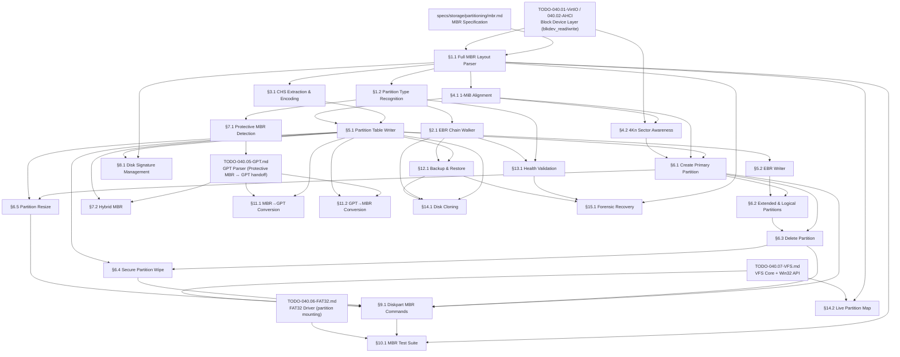

# 040.04-MBR — Master Boot Record Partitioning

> **Goal:** Implement a production-grade MBR partition table parser and writer
> for the Impossible OS storage stack. Support primary partitions (4 max),
> Extended Boot Record (EBR) linked list traversal for logical partitions,
> CHS↔LBA translation, 1-MiB alignment enforcement, GPT Protective MBR
> detection, Disk Signature management, and 4Kn native sector awareness.
> The existing `mbr.c` provides basic 4-entry parsing — this TODO enhances
> it to a complete, robust MBR subsystem with write support, EBR traversal,
> partition creation, secure wipe, partition resize, disk cloning, and the
> `diskpart` CLI tooling.

> [!CAUTION]
> **Memory Rule:** Use `pmm_alloc_contiguous()` for sector buffers (512 bytes+). `kmalloc` is ONLY for small kernel structs (≤ 4 KB). See `rules.md` Known Gotchas.
> **Note:** The current `partition.c` uses stack-allocated `uint8_t sect[512]` — this must be migrated to PMM.

> [!WARNING]
> **`blkdev->disk_id` does not exist yet.** The current `struct blkdev` in `include/kernel/drivers/blkdev.h`
> has no `disk_id` field. §1.1 and §8.1 require adding a `uint32_t disk_id` field to `struct blkdev`
> before the disk signature can be stored there. Alternatively, store it in a new `struct mbr_disk_info`.

> [!WARNING]
> **Little-Endian Awareness:** All multi-byte fields in MBR partition entries (Starting LBA, Total Sectors, Disk Signature) are stored in **Little-Endian** format. On x86-64 this is native byte order — no swapping needed. However, CHS fields use a **fractured bit-packed** layout where the 10-bit cylinder is split across two bytes. Always use bitwise extraction, never raw struct overlays for CHS.

> [!IMPORTANT]
> **Spec Reference:** All offsets, field layouts, CHS algorithms, and EBR rules reference the
> [MBR Partitioning Specification](file:///home/derickpayne/impossible-os/specs/storage/partitioning/mbr.md)
> in the repo at `specs/storage/partitioning/mbr.md`.

---

## TODO Completion Roadmap (Cross-File)

> [!IMPORTANT]
> **Five TODO files** contribute to the MBR subsystem. They have
> cross-dependencies that dictate implementation order. This roadmap shows
> the correct sequence — completing items out of order will cause rework.

### Dependency Graph

### Phase-by-Phase Implementation Order

| ⭐ | P    | TODO File           | Sections                         | What It Delivers                                               | Depends On                          | Status |
| -- | :--: | -------------------- | -------------------------------- | -------------------------------------------------------------- | ----------------------------------- | :----: |
| 💎 | P0   | `040.01` / `040.02` | Block device layer               | `blkdev_read()` / `blkdev_write()` via VirtIO or AHCI          | —                                   |   ✅   |
| 💎 | P1   | `040.04-MBR.md`     | §1.1 Full MBR Layout Parser      | Decode complete 512-byte MBR sector, disk signature, boot mag  | P0 (block + spec)                   |   ⬜   |
| 💎 | P1   | `040.04-MBR.md`     | §1.2 Partition Type Recognition  | Identify 30+ filesystem types, detect GPT redirect (`0xEE`)    | P1 (§1.1)                           |   ⬜   |
| 💎 | P2   | `040.04-MBR.md`     | §2.1 EBR Chain Walker            | Traverse extended partition linked list, logical parts ≥5      | P1 (§1.2)                           |   ⬜   |
| 💎 | P2   | `040.04-MBR.md`     | §3.1 CHS Extraction & Encoding   | Bidirectional CHS↔LBA translation, overflow (`FE FF FF`)       | P1 (§1.1)                           |   ⬜   |
| 💎 | P2   | `040.04-MBR.md`     | §4.1 1-MiB Alignment             | Enforce LBA 2048 alignment, warn on legacy 63                  | P1 (§1.1)                           |   ⬜   |
| ⭐ | P2   | `040.04-MBR.md`     | §4.2 4Kn Sector Awareness        | Detect 4096-byte native sector drives, adjust alignment        | P2 (§4.1) + block device            |   ⬜   |
| 💎 | P2   | `040.04-MBR.md`     | §7.1 Protective MBR Detection    | Detect `0xEE` → redirect to GPT, write Protective MBR          | P1 (§1.2)                           |   ⬜   |
| 💎 | P3   | `040.04-MBR.md`     | §5.1 Partition Table Writer      | Read-modify-write MBR sector with correct entry encoding       | P2 (§3.1, §4.1)                     |   ⬜   |
| 💎 | P3   | `040.04-MBR.md`     | §5.2 EBR Writer                  | Write EBR linked list for logical partitions                   | P3 (§5.1)                           |   ⬜   |
| 💎 | P3   | `040.04-MBR.md`     | §8.1 Disk Signature Management   | Generate, store, track 32-bit disk signatures for vol mapping  | P1 (§1.1) + P3 (§5.1)               |   ⬜   |
| 💎 | P4   | `040.04-MBR.md`     | §6.1 Create Primary Partition    | Find free space, align, validate overlap, write MBR            | P3 (§5.1) + P2 (§4.1)               |   ⬜   |
| 💎 | P4   | `040.04-MBR.md`     | §6.2 Extended & Logical          | Create extended container + logical parts via EBR chain        | P4 (§6.1) + P3 (§5.2)               |   ⬜   |
| 💎 | P4   | `040.04-MBR.md`     | §6.3 Delete Partition            | Zero MBR entries, unlink EBR nodes, unmount filesystems        | P4 (§6.1, §6.2)                     |   ⬜   |
| ⭐ | P4   | `040.04-MBR.md`     | §13.1 Health Validation          | Overlap, bounds, CHS/LBA mismatch, EBR chain + auto-repair     | P1 (§1.2) + P2 (§2.1)               |   ⬜   |
| 💎 | P5   | `040.04-MBR.md`     | §9.1 Diskpart MBR Commands       | `diskpart list/create/delete/active/info` CLI commands         | P4 (§6.1, §6.3) + VFS               |   ⬜   |
| 💎 | P5   | `040.04-MBR.md`     | §10.1 MBR Test Suite             | Test images: 4 primary, extended+logical, protective, corrupt  | P1–P5 + FAT32                       |   ⬜   |
| ⭐ | P6   | `040.04-MBR.md`     | §7.2 Hybrid MBR                  | GPT disk + real MBR entries for dual BIOS/UEFI boot USB        | P3 (§5.1) + GPT (040.05)            |   ⬜   |
| ⭐ | P6   | `040.04-MBR.md`     | §11.1 MBR→GPT Conversion         | Non-destructive partition table migration with GUID mapping    | P3 (§5.1) + GPT (040.05)            |   ⬜   |
| 💎 | P6   | `040.04-MBR.md`     | §11.2 GPT→MBR Conversion         | Downgrade GPT to MBR for legacy BIOS compatibility             | P3 (§5.1) + GPT (040.05)            |   ⬜   |
| ⭐ | P6   | `040.04-MBR.md`     | §12.1 Backup & Restore           | MBR + EBR chain snapshot, auto-backup on every partition chg   | P3 (§5.1) + P2 (§2.1)               |   ⬜   |
| ⭐ | P7   | `040.04-MBR.md`     | §6.4 Secure Partition Wipe       | Crypto-erase or zero-fill deleted partition space              | P4 (§6.3) + P3 (§5.1)               |   ⬜   |
| ⭐ | P7   | `040.04-MBR.md`     | §6.5 Partition Resize            | Non-destructive shrink/grow MBR partitions in-place            | P4 (§6.1) + P3 (§5.1)               |   ⬜   |
| ⭐ | P7   | `040.04-MBR.md`     | §14.1 Disk Cloning               | Clone entire MBR + partition data to another disk              | P3 (§5.1) + P2 (§2.1) + P6 (§12.1)  |   ⬜   |
| ⭐ | P7   | `040.04-MBR.md`     | §14.2 Live Partition Map         | Real-time graphical partition layout + I/O heatmap             | P1 (§1.1) + VFS                     |   ⬜   |
| ⭐ | P7   | `040.04-MBR.md`     | §15.1 Forensic Recovery          | Scan disk for lost/deleted partitions, recover non-destructive | P1 (§1.1) + P4 (§13.1) + P6 (§12.1) |   ⬜   |

> [!NOTE]
> **Phases 0–2** are the critical path. They deliver full read-only MBR parsing:
> sector decoding, type recognition, EBR traversal, CHS translation, alignment
> detection, 4Kn awareness, and GPT redirect. All downstream features depend on these.
> **Phases 3–4** add write support: the partition table writer, EBR writer,
> partition creation/deletion, and health validation. These unlock the `diskpart`
> CLI and test suite in Phase 5.
> **Phase 6** delivers conversion and backup features (⭐): Hybrid MBR creation,
> non-destructive MBR↔GPT conversion, and auto-backup/restore.
> **Phase 7** delivers the competitive-edge features (⭐): Secure wipe, partition
> resize, disk cloning, live partition map visualization, and forensic partition recovery.

> [!TIP]
> **Quick wins (any time after Phase 1):**
> - §4.1 alignment detection (read-only warning) can be tested immediately after §1.1.
> - §13.1 health validation (read-only checks) can start after §1.2 + §2.1.
>
> **Critical cross-file dependency:** §7.1 (Protective MBR) creates a two-way link
> with `TODO-040.05-GPT.md`. The MBR parser must detect type `0xEE` and redirect to
> `gpt_parse()` — and the GPT writer must call `mbr_write_protective()` to stamp
> LBA 0. Implement §7.1 in Phase 2 but defer §7.2 (Hybrid MBR) to Phase 6 after
> GPT write support is complete.
>
> **Memory rule reminder:** All sector buffers (512 bytes) must use
> `pmm_alloc_contiguous()`, not `kmalloc()`. Even though 512 bytes fits in the
> 2 MiB heap, MBR operations may allocate many buffers when walking long EBR chains
> or performing backup/restore of numerous logical partitions.

---

## 1. MBR Sector Parsing

### 1.1 Full 512-Byte MBR Layout Parser

**Prompt — VERIFY:** Confirm that `mbr_parse()` in `src/kernel/fs/mbr.c` correctly decodes the complete 512-byte MBR layout. Check that: (1) `struct mbr_table` has `disk_signature`, `reserved`, `boot_count` fields, (2) `struct mbr_entry` has `chs_start`, `chs_end`, `chs_overflow` fields, (3) `mbr_parse()` extracts disk signature at offset 440, reserved at 444, CHS tuples via bit-packed decoding, validates boot indicators (`0x00`/`0x80` only), warns on multiple `0x80` entries, and logs each entry, (4) `partition.c` logs disk signature in MBR path, (5) `bash scripts/build.sh clean` passes, (6) boot log shows `[mbr] Disk Signature: 0x________` and per-entry lines.

> [!NOTE]
> **Implementation notes:**
> - CHS decode uses `chs_decode()`: head=byte[0], sector=byte[1]&0x3F, cylinder=((byte[1]&0xC0)<<2)|byte[2]
> - CHS overflow detected for `FE FF FF` and `FF FF FF` tuples
> - `mbr_type_name()` expanded with `Extended (CHS)` (0x05) and `Extended (LBA)` (0x0F)
> - `valid=0` returned for missing signature (no separate error code — return-by-value API preserved)
> - klog uses `"mbr"` subsystem tag to distinguish from `"blk"` (partition.c) and `"gpt"` (gpt.c)

- [x] Validate Boot Record Signature: bytes 510–511 must be `0x55`, `0xAA`
- [x] Reject sector if signature missing — return with `tbl.valid = 0`
- [x] Extract 32-bit Disk Signature from offsets 440–443 (Little-Endian, native on x86)
- [x] Add `uint32_t disk_signature` field to `struct mbr_table` in `mbr.h`
- [x] Store in `tbl.disk_signature` — caller passes to `partition_info` or Registry
- [x] Log: `[MBR] Disk Signature: 0x%08X`
- [x] Extract reserved/copy-protection field at offsets 444–445 (log if non-zero)
- [x] Parse all 4 × 16-byte partition entries at offsets 446, 462, 478, 494
- [x] For each entry: extract Boot Indicator, CHS start, Type, CHS end, LBA start, Total Sectors
- [x] Skip empty entries: all 16 bytes zero → `type == 0x00`
- [x] Validate Boot Indicator: only `0x00` (inactive) or `0x80` (active) are legal
- [x] Flag if multiple entries have boot indicator `0x80` — log warning
- [x] Log: `[MBR] Entry %d: type=0x%02X, LBA=%u, sectors=%u, boot=%s`
- [x] Commit: `"mbr: full 512-byte layout parser"`

### 1.2 Partition Type Recognition

**Prompt — VERIFY:** Confirm that `mbr.h` defines 30+ partition type constants (`MBR_TYPE_*`) and `mbr.c` implements full type-to-name mapping in `mbr_type_name()`. Check that: (1) `struct mbr_entry` has `is_extended` and `is_hidden` flags, (2) `struct mbr_table` has `has_gpt` flag, (3) `mbr_type_is_extended()` matches 0x05/0x0F/0x85, (4) `mbr_type_is_hidden()` matches 0x11/0x14/0x1B/0x1C/0x27, (5) `partition.c` uses `mtbl.has_gpt` instead of manual loop, (6) Dynamic Disk 0x42 is warned+skipped, (7) build passes.

> [!NOTE]
> **Implementation notes:**
> - `mbr_type_name()` returns `"Unknown"` for unrecognized types — callers use hex code for detail
> - `has_gpt` flag set during parse loop when any entry has type 0xEE — replaced manual loop in partition.c
> - Dynamic Disk (0x42) logs `LOG_WARN` — LDM volumes are not supported
> - `mbr_type_is_extended()` and `mbr_type_is_hidden()` are public API for callers (e.g., EBR walker §2)
> - Log format: `"Entry %d: %s (0x%02X), LBA=%u, sectors=%u, boot=%s, extended|hidden"`

- [x] Define all partition type constants in `mbr.h`:
  - [x] `0x00` — Empty / Unallocated
  - [x] `0x01` — FAT12
  - [x] `0x04` — FAT16 (≤32 MB)
  - [x] `0x05` — Extended Partition (CHS) → trigger EBR traversal
  - [x] `0x06` — FAT16B (>32 MB)
  - [x] `0x07` — NTFS / HPFS / exFAT
  - [x] `0x0B` — FAT32 (CHS)
  - [x] `0x0C` — FAT32 (LBA)
  - [x] `0x0E` — FAT16 (LBA)
  - [x] `0x0F` — Extended Partition (LBA) → trigger EBR traversal
  - [x] `0x11` — Hidden FAT12 (vendor recovery)
  - [x] `0x14` — Hidden FAT16 (vendor recovery)
  - [x] `0x1B` — Hidden FAT32 (vendor recovery)
  - [x] `0x1C` — Hidden FAT32 LBA (vendor recovery)
  - [x] `0x27` — Windows Recovery Environment (do NOT auto-mount)
  - [x] `0x42` — Windows Dynamic Disk (LDM) — log warning, do not interpret as standard
  - [x] `0x82` — Linux Swap
  - [x] `0x83` — Linux Native (ext2/3/4)
  - [x] `0x85` — Linux Extended (same as `0x05` but for nested Linux extended)
  - [x] `0x8E` — Linux LVM
  - [x] `0xA5` — FreeBSD
  - [x] `0xA6` — OpenBSD
  - [x] `0xA9` — NetBSD
  - [x] `0xAF` — macOS HFS+
  - [x] `0xBF` — Solaris / illumos
  - [x] `0xDA` — IXFS (Impossible OS native)
  - [x] `0xEB` — BeOS / Haiku
  - [x] `0xEE` — GPT Protective MBR → abort, redirect to GPT parser
  - [x] `0xEF` — EFI System Partition (ESP) — used in Hybrid MBR (§7.2)
  - [x] `0xFB` — VMware VMFS
  - [x] `0xFD` — Linux RAID autodetect
- [x] Implement `mbr_type_name(type)` → human-readable name for logging (30+ cases)
- [x] For unknown types: return `"Unknown"` — callers use hex for detail
- [x] On type `0xEE` in any entry: set `tbl.has_gpt = 1` and log redirect
- [x] On type `0x05` or `0x0F` or `0x85`: set `is_extended = 1` via `mbr_type_is_extended()`
- [x] On types `0x11`–`0x1C` or `0x27`: set `is_hidden = 1` via `mbr_type_is_hidden()`
- [x] On type `0x42` (Dynamic Disk): log warning, skip — LDM volumes are not supported
- [x] Log: `[MBR] Entry %d: %s (0x%02X)`
- [x] Commit: `"mbr: expanded partition type recognition"`

---

## 2. Extended Boot Record (EBR) Linked List Traversal

### 2.1 EBR Chain Walker

**Prompt — VERIFY:** Confirm that `mbr_walk_ebr()` in `src/kernel/fs/mbr.c` correctly traverses EBR linked lists. Check that: (1) `mbr.h` declares `mbr_walk_ebr(dev, ext_start_lba, disk_sectors, out, max_out)` and `MBR_MAX_LOGICAL=128`, (2) Entry 1 uses Rule 1 (`volume_lba = current_ebr + entry1.start_lba`), (3) Entry 2 uses Rule 2 (`next_ebr = first_ebr + entry2.start_lba`), (4) all-zero entry 2 terminates chain, (5) entries 3/4 checked for zero, (6) circular link and bounds checks, (7) 128-cap safety, (8) `partition.c` skips extended containers and registers logical partitions at 5+, (9) build passes.

> [!NOTE]
> **Implementation notes:**
> - `entry_is_zero()` helper checks all 16 bytes for zero determination
> - Stack array in `partition.c` limited to 32 entries (~1KB) to stay under kernel stack limit
> - `mbr_walk_ebr()` internally caps at `min(max_out, MBR_MAX_LOGICAL)` for safety
> - Extended containers (0x05/0x0F/0x85) are NOT registered as partitions — only their logical volumes
> - Logical partition numbering starts at 5 per MBR convention (1–4 = primary)
> - klog uses `"mbr"` subsystem for all EBR messages

- [x] Detect Extended Partition entry in MBR (type `0x05` or `0x0F`)
- [x] Read first EBR sector at `extended_entry.start_lba`
- [x] Cache `first_ebr_lba = extended_entry.start_lba` — persist for entire traversal
- [x] Validate EBR boot signature `0xAA55` at offsets 510–511
- [x] Parse EBR Entry 1 (offset `0x1BE`): local logical volume
  - [x] **Rule 1:** `volume_lba = current_ebr_lba + entry1.start_lba`
  - [x] Store volume type, absolute LBA, total sectors
  - [x] Register as logical partition (numbering starts at 5 for MBR)
- [x] Parse EBR Entry 2 (offset `0x1CE`): next EBR pointer
  - [x] **Rule 2:** `next_ebr_lba = first_ebr_lba + entry2.start_lba`
  - [x] If entry 2 is all zeros → end of chain, stop traversal
- [x] Verify EBR entries 3 and 4 (offsets `0x1DE`, `0x1EE`) are zero — log warning if not
- [x] Loop: read next EBR, repeat Entry 1 + Entry 2 processing
- [x] Safety cap: maximum 128 logical partitions per extended container
- [x] Safety: if `next_ebr_lba` points outside disk bounds → abort with error
- [x] Safety: if `next_ebr_lba == current_ebr_lba` → circular link, abort
- [x] Log each logical: `[MBR] Logical %d: type=0x%02X, LBA=%u, sectors=%u`
- [x] Commit: `"mbr: EBR linked list traversal"`

---

## 3. CHS Addressing & Bit-Packing

### 3.1 CHS Extraction & Encoding

**Prompt:** Implement bidirectional CHS↔LBA translation. The 3-byte CHS tuple uses a fractured bit-packed format: Byte 1 = Head (8 bits), Byte 2 low 6 bits = Sector, Byte 2 high 2 bits = Cylinder bits 8–9, Byte 3 = Cylinder bits 0–7. Extraction requires bitwise AND, shift, and OR operations. The special tuple `FE FF FF` (Head=254, Sector=63, Cylinder=1023) indicates CHS overflow — the field is meaningless and LBA must be used exclusively. For partitions within the 8.4 GB CHS limit (1024×256×63×512 bytes), compute valid CHS from LBA using the standard formulas. After completing all items, mark every item as `[x]`, update this prompt to a verification prompt, run `bash scripts/build.sh clean`, and commit as `"mbr: CHS extraction and encoding"`. Add notes directly in this TODO section. After implementation, save any gotchas, solutions, and important information to MCP memory (`mcp_memory_create_entities` / `mcp_memory_add_observations`).

- [ ] Implement `chs_extract(bytes[3], *cylinder, *head, *sector)`:
  - [ ] `head = bytes[0]`
  - [ ] `sector = bytes[1] & 0x3F`
  - [ ] `cylinder = ((bytes[1] & 0xC0) << 2) | bytes[2]`
- [ ] Implement `chs_encode(cylinder, head, sector, bytes[3])`:
  - [ ] `bytes[0] = head`
  - [ ] `bytes[1] = (sector & 0x3F) | ((cylinder >> 2) & 0xC0)`
  - [ ] `bytes[2] = cylinder & 0xFF`
- [ ] Implement `chs_to_lba(cylinder, head, sector, heads_per_cyl, sectors_per_track)`:
  - [ ] `LBA = (cylinder × heads_per_cyl + head) × sectors_per_track + (sector - 1)`
- [ ] Implement `lba_to_chs(lba, *cylinder, *head, *sector, heads_per_cyl, sectors_per_track)`:
  - [ ] `cylinder = lba / (heads_per_cyl × sectors_per_track)`
  - [ ] `head = (lba / sectors_per_track) % heads_per_cyl`
  - [ ] `sector = (lba % sectors_per_track) + 1`
- [ ] Detect CHS overflow: if `cylinder > 1023` → write dummy tuple `FE FF FF`
- [ ] Detect CHS overflow on read: if CHS == `FE FF FF` or `FF FF FF` → ignore CHS, use LBA only
- [ ] Default geometry assumption: 255 heads, 63 sectors/track (standard for drives >504 MB)
- [ ] Log CHS overflow: `[MBR] CHS overflow at LBA %u — using LBA addressing only`
- [ ] Commit: `"mbr: CHS extraction and encoding"`

---

## 4. Partition Alignment

### 4.1 Modern 1-MiB Alignment Enforcement

**Prompt:** Legacy partitioning tools start the first partition at LBA 63 (one track offset). Modern partitioning must enforce 1-MiB alignment (LBA 2048) for optimal performance on Advanced Format 4K-sector drives and SSDs. When creating new partitions, always align the starting LBA to 2048 (or the nearest 2048-sector boundary for subsequent partitions). When reading existing partitions, detect legacy 63-sector alignment and log a performance warning without modifying the table. After completing all items, mark every item as `[x]`, update this prompt to a verification prompt, run `bash scripts/build.sh clean`, and commit as `"mbr: 1-MiB partition alignment"`. Add notes directly in this TODO section. After implementation, save any gotchas, solutions, and important information to MCP memory (`mcp_memory_create_entities` / `mcp_memory_add_observations`).

- [ ] Define `MBR_ALIGNMENT_SECTORS = 2048` (1 MiB / 512 bytes)
- [ ] On partition creation: round starting LBA up to next 2048-sector boundary
  - [ ] First partition: start at LBA 2048 (skip MBR + alignment gap)
  - [ ] Subsequent partitions: `align_up(previous_end, 2048)`
- [ ] Implement `align_lba_up(lba, alignment)`: `((lba + alignment - 1) / alignment) * alignment`
- [ ] On partition read: detect legacy alignment (LBA 63) → log warning:
  - [ ] `[MBR] WARNING: Partition %d at LBA 63 — legacy alignment, poor 4K/SSD performance`
- [ ] On partition read: verify alignment to 2048 boundary → log if misaligned
- [ ] Never auto-modify existing partition alignment (data destructive)
- [ ] Commit: `"mbr: 1-MiB partition alignment"`

### 4.2 4Kn Native Sector Size Awareness (🚀 Impossible OS Feature)

**Prompt:** Modern NVMe and enterprise SATA/SAS drives use 4096-byte native sectors (4Kn) instead of 512-byte sectors. When `blkdev->sector_size` is 4096, the standard 2048-sector alignment resolves to 8 MiB instead of 1 MiB. Detect the underlying physical sector size and adjust alignment calculations accordingly. Report mismatched logical/physical sector sizes (512e drives that emulate 512-byte sectors over 4096-byte physical) as a performance warning. After completing all items, mark every item as `[x]`, update this prompt to a verification prompt, run `bash scripts/build.sh clean`, and commit as `"mbr: 4Kn sector size awareness"`. Add notes directly in this TODO section. After implementation, save any gotchas, solutions, and important information to MCP memory (`mcp_memory_create_entities` / `mcp_memory_add_observations`).

> [!TIP]
> **Competitive Edge:** Windows `diskpart` does not warn about 4Kn sector
> alignment mismatches. Linux `fdisk` shows physical sector size but doesn't
> adjust alignment automatically. Impossible OS detecting 4Kn drives and
> auto-adjusting alignment is a proactive data-integrity advantage.

- [ ] Read `blkdev->sector_size` — detect 4096-byte native sectors
- [ ] If 4Kn: adjust `MBR_ALIGNMENT_SECTORS` to match 1 MiB boundary in 4K sectors (256 sectors)
- [ ] Detect 512e (512-byte logical over 4096-byte physical) via IDENTIFY DEVICE data
- [ ] Log: `[MBR] 4Kn drive detected — sector_size=%u, alignment adjusted`
- [ ] Log 512e warning: `[MBR] WARNING: 512e drive — physical 4K, logical 512, ensure alignment`
- [ ] Ensure partition creation aligns to both logical AND physical sector boundaries
- [ ] Validate existing partitions: warn if start LBA is not aligned to physical sector size
- [ ] Commit: `"mbr: 4Kn sector size awareness"`

---

## 5. MBR Write Support

### 5.1 Partition Table Writer

**Prompt:** Implement MBR write support for creating and managing partitions. Build a complete 512-byte MBR sector in memory: zero the bootstrap code area (440 bytes), write the disk signature, set reserved bytes to `0x0000`, encode the 4 partition entries with correct LBA fields, CHS fields (using §3.1 encoding, with overflow dummy for large offsets), and write `0x55`/`0xAA` to offsets 510/511. Write the sector to LBA 0 via `blkdev_write()`. Preserve the existing bootstrap code if updating an existing MBR (read-modify-write: read sector, update partition table only, write back). After completing all items, mark every item as `[x]`, update this prompt to a verification prompt, run `bash scripts/build.sh clean`, and commit as `"mbr: partition table writer"`. Add notes directly in this TODO section. After implementation, save any gotchas, solutions, and important information to MCP memory (`mcp_memory_create_entities` / `mcp_memory_add_observations`).

- [ ] Implement `mbr_write(blkdev, partitions[4], disk_signature)`:
  - [ ] Allocate 512-byte sector buffer via `pmm_alloc_contiguous()`
  - [ ] Read existing sector at LBA 0 (preserve bootstrap code)
  - [ ] Keep bytes 0–439 (bootstrap code) intact from existing sector
  - [ ] Write disk signature at offsets 440–443 (LE)
  - [ ] Write `0x0000` at offsets 444–445 (reserved)
  - [ ] For each of 4 entries: encode 16-byte partition entry at offsets 446, 462, 478, 494
  - [ ] Encode partition entry fields:
    - [ ] Boot Indicator: `0x80` or `0x00`
    - [ ] Starting CHS: use `chs_encode()`, write `FE FF FF` if LBA > 8.4 GB
    - [ ] Partition Type: raw byte
    - [ ] Ending CHS: compute from `start_lba + total_sectors - 1`, overflow if needed
    - [ ] Starting LBA: 4 bytes LE
    - [ ] Total Sectors: 4 bytes LE
  - [ ] Write `0x55` at offset 510, `0xAA` at offset 511
  - [ ] Write sector to LBA 0 via `blkdev_write()`
- [ ] Implement `mbr_create_fresh(blkdev, disk_signature)`:
  - [ ] Zero entire 512-byte sector
  - [ ] Write disk signature + reserved + signature bytes
  - [ ] All 4 partition entries zeroed (empty disk)
- [ ] Log: `[MBR] Written: sig=0x%08X, %d partitions`
- [ ] Commit: `"mbr: partition table writer"`

### 5.2 EBR Writer for Logical Partitions

**Prompt:** When creating logical partitions inside an extended container, write EBR sectors to define the linked list. Each EBR is placed immediately before its logical volume (at the alignment boundary). Entry 1 describes the logical volume (LBA relative to current EBR). Entry 2 points to the next EBR (LBA relative to first EBR). The last EBR in the chain has entry 2 all-zeros. Entries 3 and 4 must be zeroed. Always write `0xAA55` signature. After completing all items, mark every item as `[x]`, update this prompt to a verification prompt, run `bash scripts/build.sh clean`, and commit as `"mbr: EBR writer for logical partitions"`. Add notes directly in this TODO section. After implementation, save any gotchas, solutions, and important information to MCP memory (`mcp_memory_create_entities` / `mcp_memory_add_observations`).

- [ ] Implement `ebr_write(blkdev, ebr_lba, local_vol, next_ebr)`:
  - [ ] Allocate 512-byte sector, zero it
  - [ ] Entry 1 at offset 446: encode local volume (type, relative LBA, total sectors)
  - [ ] Entry 2 at offset 462: encode next EBR pointer (relative to first EBR) or zero
  - [ ] Entries 3, 4 at offsets 478, 494: all zeros
  - [ ] Write `0x55`/`0xAA` at offsets 510/511
  - [ ] Write sector to `ebr_lba` via `blkdev_write()`
- [ ] Implement `ebr_chain_write(blkdev, first_ebr_lba, logical_partitions[])`:
  - [ ] Iterate logical partitions: write EBR for each
  - [ ] Link each EBR to the next via Entry 2
  - [ ] Last EBR: Entry 2 all zeros (terminates chain)
- [ ] Place EBR at 1-MiB aligned boundary before each logical volume
- [ ] Log: `[MBR] EBR written at LBA %u → logical type=0x%02X at LBA %u`
- [ ] Commit: `"mbr: EBR writer for logical partitions"`

---

## 6. Partition Creation & Deletion

### 6.1 Create Primary Partition

**Prompt:** Implement creating a new primary partition: find an empty slot in the 4-entry table, compute aligned start LBA (§4.1), set type and size, write MBR. Enforce the 4-primary-partition limit. If the request would exceed 2 TiB (2^32 sectors), reject with an error. Validate that the new partition doesn't overlap any existing partition. After completing all items, mark every item as `[x]`, update this prompt to a verification prompt, run `bash scripts/build.sh clean`, and commit as `"mbr: create primary partition"`. Add notes directly in this TODO section. After implementation, save any gotchas, solutions, and important information to MCP memory (`mcp_memory_create_entities` / `mcp_memory_add_observations`).

- [ ] Implement `mbr_create_partition(blkdev, size_sectors, type, bootable)`:
  - [ ] Find first empty slot (type == `0x00`) in the 4-entry table
  - [ ] If no empty slot → return `MBR_ERR_TABLE_FULL`
  - [ ] Calculate start LBA: find largest contiguous gap, align to 2048
  - [ ] Validate: `start_lba + size_sectors` does not exceed 2^32 - 1
  - [ ] Validate: no overlap with any existing partition
  - [ ] Set boot indicator if `bootable == true` (ensure only one `0x80`)
  - [ ] Encode partition entry with `chs_encode()` and LBA fields
  - [ ] Call `mbr_write()` to flush updated table
- [ ] Implement `mbr_find_free_space(blkdev, partitions[4], *start, *max_sectors)`:
  - [ ] Sort partitions by LBA, find gaps between consecutive partitions
  - [ ] Account for MBR at LBA 0 + alignment gap at start (LBA 2048 minimum)
  - [ ] Return largest contiguous gap
- [ ] Overlap validation: for each existing partition, verify no range intersection
- [ ] Log: `[MBR] Created partition %d: type=0x%02X, LBA=%u, sectors=%u`
- [ ] Commit: `"mbr: create primary partition"`

### 6.2 Create Extended & Logical Partitions

**Prompt:** To exceed the 4-partition limit, create an Extended Partition container (type `0x0F` for LBA) consuming a primary slot, then create logical partitions inside it via EBR linked list. The extended container always uses type `0x0F` (LBA Extended) for modern addressing. Only one extended partition is allowed per disk. Logical partitions begin numbering at 5. Each logical partition gets its own EBR in the chain. After completing all items, mark every item as `[x]`, update this prompt to a verification prompt, run `bash scripts/build.sh clean`, and commit as `"mbr: extended and logical partitions"`. Add notes directly in this TODO section. After implementation, save any gotchas, solutions, and important information to MCP memory (`mcp_memory_create_entities` / `mcp_memory_add_observations`).

- [ ] Implement `mbr_create_extended(blkdev, start_lba, size_sectors)`:
  - [ ] Verify no extended partition already exists (only one allowed)
  - [ ] Create primary entry with type `0x0F` (Extended LBA)
  - [ ] Write initial empty EBR at start of extended region
- [ ] Implement `mbr_create_logical(blkdev, ext_entry, size_sectors, type)`:
  - [ ] Walk existing EBR chain to find the tail (Entry 2 == zeros)
  - [ ] Calculate new logical volume start: aligned, after previous logical + EBR gap
  - [ ] Write new EBR for the new logical volume
  - [ ] Update previous EBR's Entry 2 to point to the new EBR
  - [ ] Register as logical partition (number ≥ 5)
- [ ] Enforce: logical partition must fit within extended container bounds
- [ ] Log: `[MBR] Created logical partition %d inside extended container`
- [ ] Commit: `"mbr: extended and logical partitions"`

### 6.3 Delete Partition

**Prompt:** Delete a partition by zeroing its 16-byte entry in the MBR (for primary) or unlinking its EBR from the chain (for logical). Deleting an extended partition removes ALL logical partitions within it. Prompt with a safety confirmation (when called from CLI). Flush the updated MBR/EBR to disk. After completing all items, mark every item as `[x]`, update this prompt to a verification prompt, run `bash scripts/build.sh clean`, and commit as `"mbr: delete partition"`. Add notes directly in this TODO section. After implementation, save any gotchas, solutions, and important information to MCP memory (`mcp_memory_create_entities` / `mcp_memory_add_observations`).

- [ ] Implement `mbr_delete_partition(blkdev, partition_number)`:
  - [ ] If primary (1–4): zero the 16-byte entry, write MBR
  - [ ] If logical (≥5): unlink EBR from chain:
    - [ ] Walk EBR chain to find the target
    - [ ] Update previous EBR's Entry 2 to point to the next EBR (skip deleted)
    - [ ] If deleting first logical: update extended container's first EBR
    - [ ] If deleting last logical: set previous Entry 2 to zeros
  - [ ] If deleting the extended partition itself: warn that ALL logicals will be destroyed
- [ ] Unmount any filesystem on the deleted partition first
- [ ] Zero the deleted partition's first sector (optional, for cleanliness)
- [ ] Log: `[MBR] Deleted partition %d`
- [ ] Commit: `"mbr: delete partition"`

### 6.4 Secure Partition Wipe (🚀 Impossible OS Feature)

**Prompt:** After deleting a partition, its data remains on disk and can be recovered with forensic tools. Implement a secure wipe option that zero-fills or crypto-erases the deleted partition's sectors. Offer three wipe levels: quick (zero first/last MiB), standard (single-pass zero), and DoD (3-pass overwrite). For NVMe/SATA SSDs, issue ATA SECURITY ERASE or NVMe Format command instead of sector-by-sector overwrite. After completing all items, mark every item as `[x]`, update this prompt to a verification prompt, run `bash scripts/build.sh clean`, and commit as `"mbr: secure partition wipe"`. Add notes directly in this TODO section. After implementation, save any gotchas, solutions, and important information to MCP memory (`mcp_memory_create_entities` / `mcp_memory_add_observations`).

> [!TIP]
> **Competitive Edge:** Windows has NO built-in secure partition wipe — users need
> third-party tools (DBAN, Eraser). Linux has `shred` and `blkdiscard` but these
> are CLI-only. Impossible OS offering a "Secure Erase" button in Disk Manager
> with progress bar is a clear security advantage.

- [ ] Implement `mbr_wipe_partition(blkdev, start_lba, sector_count, wipe_level)`:
  - [ ] `WIPE_QUICK`: zero first 2048 sectors + last 2048 sectors (destroy headers/footers)
  - [ ] `WIPE_STANDARD`: single-pass zero-fill of entire partition
  - [ ] `WIPE_DOD`: 3-pass overwrite (0x00, 0xFF, random) per DoD 5220.22-M
- [ ] For SSDs: detect SSD via IDENTIFY DEVICE, use TRIM/UNMAP instead of overwrite
- [ ] Progress callback: `wipe_progress(current_sector, total_sectors)` for GUI progress bar
- [ ] Integrate with `mbr_delete_partition()`: optional `secure=true` flag
- [ ] Log: `[MBR] Secure wipe: partition %d, %u sectors, level=%s`
- [ ] Commit: `"mbr: secure partition wipe"`

### 6.5 Non-Destructive Partition Resize (🚀 Impossible OS Feature)

**Prompt:** Resize an existing MBR partition without data loss. Shrinking reduces the sector count and updates the MBR entry (the filesystem must be shrunk first). Growing extends the sector count into adjacent free space. Validate that no overlap occurs after resize. For extended partitions, grow/shrink the container and re-link EBR chain if needed. After completing all items, mark every item as `[x]`, update this prompt to a verification prompt, run `bash scripts/build.sh clean`, and commit as `"mbr: non-destructive partition resize"`. Add notes directly in this TODO section. After implementation, save any gotchas, solutions, and important information to MCP memory (`mcp_memory_create_entities` / `mcp_memory_add_observations`).

> [!TIP]
> **Competitive Edge:** Windows Disk Management can shrink/grow NTFS volumes but
> cannot resize FAT32 or move partitions. Linux `fdisk` cannot resize at all —
> users need `parted` or GParted. Impossible OS offering a "Resize Partition"
> button in Disk Manager with filesystem-aware resizing is a major usability win.

> [!CAUTION]
> **Filesystem must be resized BEFORE shrinking the partition.** Shrinking the
> partition table entry without first shrinking the filesystem will truncate data.
> Always call `fs_resize()` → then `mbr_resize_partition()`.

- [ ] Implement `mbr_resize_partition(blkdev, partition_number, new_size_sectors)`:
  - [ ] For shrink: verify `new_size >= filesystem_used_sectors` (query FS driver)
  - [ ] For grow: verify adjacent free space >= `new_size - current_size`
  - [ ] Update MBR entry: total_sectors, ending CHS (recalculate)
  - [ ] For extended container: adjust EBR chain bounds if needed
  - [ ] Validate: no overlap with adjacent partitions after resize
  - [ ] Write updated MBR via `mbr_write()`
- [ ] Auto-backup partition table before resize (§12.1)
- [ ] Log: `[MBR] Resized partition %d: %u → %u sectors`
- [ ] Commit: `"mbr: non-destructive partition resize"`

---

## 7. GPT Protective MBR & Hybrid MBR

### 7.1 Protective MBR Detection & Generation

**Prompt:** When the first partition entry has type `0xEE`, the disk uses GPT. The parser must detect this immediately and hand off to the GPT parser (`gpt.c`). For GPT disk creation, write a Protective MBR: a single partition entry spanning the entire disk (capped at 2^32 - 1 sectors for the LBA field), type `0xEE`, boot indicator `0x00`, CHS `00 02 00` for start and `FF FF FF` for end. After completing all items, mark every item as `[x]`, update this prompt to a verification prompt, run `bash scripts/build.sh clean`, and commit as `"mbr: GPT Protective MBR"`. Add notes directly in this TODO section. After implementation, save any gotchas, solutions, and important information to MCP memory (`mcp_memory_create_entities` / `mcp_memory_add_observations`).

- [ ] Implement `mbr_is_protective(partitions[4])`:
  - [ ] Return `true` if entry 0 has type `0xEE`
  - [ ] Redirect caller to `gpt_parse()` from `gpt.c`
- [ ] Implement `mbr_write_protective(blkdev, disk_size_sectors)`:
  - [ ] Entry 1: type=`0xEE`, start_lba=1, total_sectors=`min(disk_size - 1, 0xFFFFFFFF)`
  - [ ] CHS start: `00 02 00` (Head=0, Sector=2, Cylinder=0)
  - [ ] CHS end: `FF FF FF` (overflow for all GPT disks)
  - [ ] Entries 2–4: all zeros
  - [ ] Boot indicator: `0x00` (UEFI ignores this)
  - [ ] Write to LBA 0
- [ ] Existing Protective MBR detection: already in `partition.c` → verify integration
- [ ] Log: `[MBR] GPT Protective MBR detected — redirecting to GPT parser`
- [ ] Commit: `"mbr: GPT Protective MBR"`

### 7.2 Hybrid MBR (GPT + Legacy BIOS Boot)

**Prompt:** A Hybrid MBR is a GPT disk where the MBR contains real partition entries (up to 3) alongside the `0xEE` Protective entry. This allows legacy BIOS systems to see and boot from specific GPT partitions. The `0xEE` entry is shrunk to cover only the GPT metadata (LBAs 1..33), and up to 3 GPT partitions are mirrored as real MBR entries with appropriate type codes (`0xEF` for ESP, `0x07` for NTFS, etc.). This is critical for creating bootable USB drives and installation media that work on both UEFI and legacy BIOS machines. After completing all items, mark every item as `[x]`, update this prompt to a verification prompt, run `bash scripts/build.sh clean`, and commit as `"mbr: hybrid MBR for dual BIOS/UEFI boot"`. Add notes directly in this TODO section. After implementation, save any gotchas, solutions, and important information to MCP memory (`mcp_memory_create_entities` / `mcp_memory_add_observations`).

> [!WARNING]
> Hybrid MBRs are a hack that can cause data loss if both MBR and GPT tools modify the same partitions.
> Impossible OS should support **reading** Hybrid MBR and **creating** them only for installation media.

> [!TIP]
> **Competitive Edge:** Windows cannot create Hybrid MBRs — it strictly separates MBR (BIOS) and GPT (UEFI).
> Linux uses `gdisk` (third-party). Impossible OS creating bootable USB media that works on
> BOTH BIOS and UEFI machines from the GUI is a significant usability advantage.

- [ ] Detect Hybrid MBR: type `0xEE` present but does NOT span entire disk + other entries have real types
- [ ] Parse Hybrid MBR: read both real MBR entries AND redirect to GPT parser
  - [ ] Validate: MBR partition boundaries must match corresponding GPT entries
  - [ ] Log warning if MBR/GPT boundaries don't match: `[MBR] WARNING: Hybrid MBR out of sync with GPT`
- [ ] Implement `mbr_write_hybrid(blkdev, gpt_partitions_to_mirror[], count)`:
  - [ ] Entry 1: `0xEE` covering GPT metadata only (LBAs 1–33)
  - [ ] Entries 2–4: mirror selected GPT partitions with MBR type codes
  - [ ] ESP → type `0xEF`, NTFS → `0x07`, FAT32 → `0x0C`, IXFS → `0xDA`
  - [ ] Maximum 3 mirrored partitions (MBR has 4 slots, 1 used by `0xEE`)
- [ ] Wire to installation media builder: "Create BIOS+UEFI bootable USB"
- [ ] Commit: `"mbr: hybrid MBR for dual BIOS/UEFI boot"`

---

## 8. Disk Signature Management

### 8.1 Persistent Volume Identification

**Prompt:** The 32-bit Disk Signature at MBR offsets 440–443 uniquely identifies each physical disk, allowing the OS to maintain stable volume-to-drive-letter mappings across reboots even if disk ordering changes. Generate a new random signature when formatting a fresh disk (`mbr_create_fresh()`). Store signatures in the Registry (`HKLM\SYSTEM\Storage\Disks\{signature}\`) with volume mount points. Check for signature collisions on multi-disk systems. **Note:** `struct blkdev` currently has no `disk_id` field — either add `uint32_t disk_id` to `blkdev.h` or store the signature in `partition_info`. After completing all items, mark every item as `[x]`, update this prompt to a verification prompt, run `bash scripts/build.sh clean`, and commit as `"mbr: disk signature management"`. Add notes directly in this TODO section. After implementation, save any gotchas, solutions, and important information to MCP memory (`mcp_memory_create_entities` / `mcp_memory_add_observations`).

- [ ] On MBR parse: extract disk signature from `mbr_table.disk_signature` (added in §1.1)
- [ ] Add `uint32_t disk_id` to `struct blkdev` in `include/kernel/drivers/blkdev.h`
- [ ] Store: `blkdev->disk_id = mbr_table.disk_signature` in `partition.c scan_device()`
- [ ] On MBR create: generate random 32-bit signature (use RDRAND or PIT-seeded PRNG)
- [ ] Collision detection: check all registered blkdevs for duplicate signatures
  - [ ] If collision: log warning, do not auto-fix (user intervention required)
- [ ] Store in Registry: `HKLM\SYSTEM\Storage\Disks\{0x%08X}\DriveLetter`
- [ ] On boot: match disk signature → previously assigned drive letter
- [ ] Preserve signature on partition table updates (read-modify-write, never overwrite)
- [ ] Log: `[MBR] Disk Signature 0x%08X → drive letter mapping from Registry`
- [ ] Commit: `"mbr: disk signature management"`

---

## 9. CLI Integration

### 9.1 Diskpart MBR Commands

**Prompt:** Wire MBR operations into the `diskpart` shell command for interactive disk management. `diskpart list disks` shows each disk with its MBR/GPT status, signature, and partition count. `diskpart list parts <disk>` shows all partitions (primary + logical) with type, size, LBA, and boot flag. `diskpart create <disk> <size_mb> <type>` creates a primary partition. `diskpart delete <disk> <part>` removes a partition. `diskpart active <disk> <part>` sets the bootable flag. After completing all items, mark every item as `[x]`, update this prompt to a verification prompt, run `bash scripts/build.sh clean`, and commit as `"shell: diskpart MBR commands"`. Add notes directly in this TODO section. After implementation, save any gotchas, solutions, and important information to MCP memory (`mcp_memory_create_entities` / `mcp_memory_add_observations`).

- [ ] `diskpart list disks` — show all disks:
  - [ ] Table: Disk#, Size, Table Type (MBR/GPT), Signature, Partitions
  - [ ] Read MBR sector to determine table type and signature
- [ ] `diskpart list parts <disk>` — show partitions:
  - [ ] Primary partitions 1–4 from MBR
  - [ ] Logical partitions 5+ from EBR chain
  - [ ] Table: Part#, Type, Label, Size, LBA Start, Boot Flag
- [ ] `diskpart create <disk> <size_mb> <type>` — create primary partition:
  - [ ] Convert size_mb to sectors: `size_mb * 2048`
  - [ ] Call `mbr_create_partition()`
  - [ ] Confirm before writing
- [ ] `diskpart delete <disk> <part>` — delete partition:
  - [ ] Confirmation prompt: "This will destroy all data. Continue? (y/N)"
  - [ ] Call `mbr_delete_partition()`
- [ ] `diskpart active <disk> <part>` — set bootable flag:
  - [ ] Clear `0x80` from all entries, set on target
  - [ ] Write updated MBR
- [ ] `diskpart info <disk>` — detailed disk info:
  - [ ] Disk signature, total size, partition table type, alignment
  - [ ] Each partition: type name, LBA range, CHS (if valid), boot status
- [ ] Commit: `"shell: diskpart MBR commands"`

---

## 10. Testing & Validation

### 10.1 MBR Test Suite

**Prompt:** Create test disk images to validate MBR parsing and writing. Use the host build system to create test images: an MBR disk with 4 primary partitions, an MBR disk with 1 primary + 1 extended (3 logicals), a GPT disk with Protective MBR, a disk with legacy 63-sector alignment, and a corrupted disk (bad signature). Attach via QEMU and verify the parser handles each correctly. After completing all items, mark every item as `[x]`, update this prompt to a verification prompt, run `bash scripts/build.sh clean`, and commit as `"test: MBR partition test suite"`. Add notes directly in this TODO section. After implementation, save any gotchas, solutions, and important information to MCP memory (`mcp_memory_create_entities` / `mcp_memory_add_observations`).

- [ ] Test image: 4 primary partitions (FAT32, NTFS, Linux, IXFS)
  - [ ] Verify all 4 detected with correct types, LBAs, and sizes
- [ ] Test image: 1 primary + extended with 3 logical partitions
  - [ ] Verify EBR traversal finds partitions 5, 6, 7
  - [ ] Verify correct relative LBA computation for each logical
- [ ] Test image: GPT disk with Protective MBR (type `0xEE`)
  - [ ] Verify parser detects `0xEE` and redirects to GPT
- [ ] Test image: Hybrid MBR with `0xEE` + real entries
  - [ ] Verify both GPT redirect and MBR entry reading work
- [ ] Test image: legacy 63-sector alignment
  - [ ] Verify parser reads partitions, logs alignment warning
- [ ] Test image: missing `0xAA55` signature
  - [ ] Verify parser rejects with `MBR_ERR_NO_SIGNATURE`
- [ ] Test: create partition via `diskpart`, reboot, verify persistence
- [ ] Test: create extended + logical, reboot, verify EBR chain persists
- [ ] Test: delete logical partition, verify chain remains valid
- [ ] Test: MBR backup → corrupt disk → restore → verify partitions intact
- [ ] Test: MBR→GPT conversion → verify all partitions preserved
- [ ] QEMU flags: `-drive file=mbr_test.img,format=raw,if=none,id=t0 -device virtio-blk-pci,drive=t0`
- [ ] Commit: `"test: MBR partition test suite"`

---

## 11. MBR ↔ GPT Conversion (🚀 Impossible OS Feature)

### 11.1 Non-Destructive MBR → GPT Conversion

**Prompt:** Convert an MBR disk to GPT without data loss by translating the partition entries. Read existing MBR partition table (primary + EBR logical), create corresponding GPT entries preserving LBAs and sizes, assign appropriate Type GUIDs, generate new Partition GUIDs, write GPT headers (primary at LBA 1 + backup at last LBA), write partition entry arrays, then overwrite the MBR with a Protective MBR. This is equivalent to Windows `mbr2gpt.exe` but integrated into the Disk Manager GUI. Validate first: reject if Extended/Logical partitions exist (GPT has no EBR concept — they must be converted to primary GPT entries). After completing all items, mark every item as `[x]`, update this prompt to a verification prompt, run `bash scripts/build.sh clean`, and commit as `"mbr: non-destructive MBR to GPT conversion"`. Add notes directly in this TODO section. After implementation, save any gotchas, solutions, and important information to MCP memory (`mcp_memory_create_entities` / `mcp_memory_add_observations`).

> [!TIP]
> **Competitive Edge:** Windows `mbr2gpt.exe` is command-line only and restricted to ≤3 primary
> partitions with no extended. Linux `gdisk` requires CLI expertise. Impossible OS can offer
> this as a one-click GUI operation in Disk Manager with a progress dialog.

> [!CAUTION]
> **Destructive if interrupted.** Always write GPT partition entries BEFORE overwriting the MBR
> with the Protective MBR. If power fails mid-conversion, the MBR still points to valid data.

- [ ] Implement `mbr_to_gpt_validate(blkdev)` — pre-check:
  - [ ] Reject if disk has more than 4 partitions total (logicals complicate conversion)
  - [ ] Reject if any partition starts in the GPT header area (LBAs 1–33)
  - [ ] Reject if last 33 sectors are occupied (needed for backup GPT)
  - [ ] Warn if boot code is present (will be overwritten by Protective MBR)
- [ ] Implement `mbr_to_gpt_convert(blkdev)`:
  - [ ] Read MBR partition table
  - [ ] Map MBR type codes to GPT Type GUIDs:
    - [ ] `0x07` → `EBD0A0A2-B9E5-4433-87C0-68B6B72699C7` (Microsoft Basic Data)
    - [ ] `0x0C`/`0x0B` → same (FAT32 uses same GUID)
    - [ ] `0x83` → `0FC63DAF-8483-4772-8E79-3D69D8477DE4` (Linux Filesystem)
    - [ ] `0xDA` → `DA000000-0000-4978-4653-000000000001` (IXFS)
    - [ ] `0xEF` → `C12A7328-F81F-11D2-BA4B-00A0C93EC93B` (EFI System)
  - [ ] Generate unique Partition GUIDs (v4 UUID from RDRAND)
  - [ ] Write GPT partition entry array at LBAs 2–33
  - [ ] Write primary GPT header at LBA 1
  - [ ] Write backup GPT at disk end
  - [ ] Write Protective MBR to LBA 0 (LAST step — preserves recovery path)
- [ ] Log: `[MBR] Converted to GPT: %d partitions migrated`
- [ ] Commit: `"mbr: non-destructive MBR to GPT conversion"`

### 11.2 Non-Destructive GPT → MBR Conversion

**Prompt:** Convert a GPT disk back to MBR for legacy BIOS compatibility. Read GPT partition entries, map Type GUIDs back to MBR type codes, verify all partitions fit within the 2 TiB MBR limit, and write a new MBR. Maximum 4 primary GPT partitions can be converted (MBR limit). Reject if any partition exceeds LBA 2^32. After completing all items, mark every item as `[x]`, update this prompt to a verification prompt, run `bash scripts/build.sh clean`, and commit as `"mbr: GPT to MBR conversion"`. Add notes directly in this TODO section. After implementation, save any gotchas, solutions, and important information to MCP memory (`mcp_memory_create_entities` / `mcp_memory_add_observations`).

- [ ] Implement `gpt_to_mbr_validate(blkdev)` — pre-check:
  - [ ] Reject if more than 4 GPT partitions
  - [ ] Reject if any partition extends beyond LBA 2^32 - 1 (2 TiB limit)
  - [ ] Reject if any partition has no MBR type code equivalent
- [ ] Implement `gpt_to_mbr_convert(blkdev)`:
  - [ ] Read GPT partition entries
  - [ ] Map GPT Type GUIDs back to MBR type codes (reverse of §11.1 table)
  - [ ] Write MBR with converted partition entries
  - [ ] Zero GPT header areas (LBAs 1–33 and disk end) to prevent confusion
- [ ] Log: `[MBR] Converted from GPT: %d partitions, disk within 2 TiB limit`
- [ ] Commit: `"mbr: GPT to MBR conversion"`

---

## 12. Partition Table Backup & Restore (🚀 Impossible OS Feature)

### 12.1 MBR Backup & Restore

**Prompt:** The entire MBR partition table fits in a single 512-byte sector. Backup the MBR (and all EBR sectors for logical partitions) to a file for disaster recovery. Restore from backup to recover a corrupted partition table without affecting data. This is equivalent to `dd if=/dev/sda of=backup.mbr bs=512 count=1` on Linux but integrated into the GUI Disk Manager as a one-click operation. After completing all items, mark every item as `[x]`, update this prompt to a verification prompt, run `bash scripts/build.sh clean`, and commit as `"mbr: partition table backup and restore"`. Add notes directly in this TODO section. After implementation, save any gotchas, solutions, and important information to MCP memory (`mcp_memory_create_entities` / `mcp_memory_add_observations`).

> [!TIP]
> **Competitive Edge:** Windows has NO built-in partition table backup. Linux requires
> manual `dd` or `sfdisk -d`. Impossible OS having a "Backup Partition Table" button
> in Disk Manager, with auto-backup on every partition change, is a clear safety advantage.

- [ ] Implement `mbr_backup(blkdev, output_path)`:
  - [ ] Read MBR sector (LBA 0, 512 bytes)
  - [ ] Walk EBR chain and read all EBR sectors
  - [ ] Write to backup file: magic header + MBR sector + EBR count + EBR sectors
  - [ ] File format: `"IMBR" (4 bytes) + version (4 bytes) + disk_size (8 bytes) + MBR (512) + ebr_count (4) + EBR[n] (512 each)`
- [ ] Implement `mbr_restore(blkdev, input_path)`:
  - [ ] Validate backup magic and version
  - [ ] Verify backup disk size matches target disk (warn if different)
  - [ ] Write MBR sector to LBA 0
  - [ ] Write each EBR sector to its original LBA
  - [ ] Re-scan partition table after restore
- [ ] Auto-backup: save partition table to Registry before any write operation
  - [ ] `HKLM\SYSTEM\Storage\Disks\{sig}\PartitionBackup` (binary blob)
- [ ] Disk Manager GUI: "Backup Partition Table" / "Restore Partition Table" buttons
- [ ] Commit: `"mbr: partition table backup and restore"`

---

## 13. Partition Health Validation & Repair

### 13.1 Partition Table Integrity Checker

**Prompt:** Implement a partition table health checker that detects common corruption: overlapping partitions, gaps between partitions, partitions extending beyond disk size, invalid CHS values, duplicate disk signatures, broken EBR chains. Run automatically at boot and on-demand from Disk Manager. Report issues with severity levels (info/warning/error) and offer automatic repair for safe cases. After completing all items, mark every item as `[x]`, update this prompt to a verification prompt, run `bash scripts/build.sh clean`, and commit as `"mbr: partition health validation"`. Add notes directly in this TODO section. After implementation, save any gotchas, solutions, and important information to MCP memory (`mcp_memory_create_entities` / `mcp_memory_add_observations`).

> [!TIP]
> **Competitive Edge:** Windows `chkdsk` validates filesystems, not partition tables.
> Linux `fdisk --verify` is CLI-only and minimal. A GUI partition table health checker
> with automatic repair suggestions is unique to Impossible OS.

- [ ] Implement `mbr_validate(blkdev, *report)` — returns list of issues:
  - [ ] Check `0xAA55` signature present
  - [ ] Check for overlapping partition ranges (LBA overlap detection)
  - [ ] Check partition extends beyond physical disk size
  - [ ] Check CHS values match LBA values (for non-overflow entries)
  - [ ] Check EBR chain: no circular links, all within extended container bounds
  - [ ] Check only one boot indicator `0x80` is set
  - [ ] Check only one extended partition exists
  - [ ] Check for unusable space (gaps > 1 MiB that could be reclaimed)
- [ ] Issue severity:
  - [ ] `INFO`: unaligned partitions, large gaps
  - [ ] `WARNING`: CHS/LBA mismatch, multiple boot indicators
  - [ ] `ERROR`: overlapping partitions, beyond disk bounds, broken EBR chain
- [ ] Auto-repair (safe operations only, require user confirmation):
  - [ ] Fix CHS values to match LBA (cosmetic fix, no data impact)
  - [ ] Clear extra boot indicators (keep first `0x80`)
  - [ ] Fix EBR chain termination (zero dangling Entry 2 pointers)
- [ ] Run at boot: log warnings to serial, do not block boot
- [ ] Disk Manager: "Validate Partition Table" button with report dialog
- [ ] Commit: `"mbr: partition health validation"`

---

## 14. Disk Cloning & Live Visualization

### 14.1 Disk Cloning (🚀 Impossible OS Feature)

**Prompt:** Clone an entire MBR disk to another disk: copy the MBR sector, all partition data, and all EBR sectors. Support same-size and larger-target cloning (expand the last partition to fill the target). This is equivalent to `dd if=/dev/sda of=/dev/sdb` but with partition-awareness, progress reporting, and error recovery. Offer both sector-level (raw) and filesystem-aware (used blocks only) clone modes. After completing all items, mark every item as `[x]`, update this prompt to a verification prompt, run `bash scripts/build.sh clean`, and commit as `"mbr: disk cloning"`. Add notes directly in this TODO section. After implementation, save any gotchas, solutions, and important information to MCP memory (`mcp_memory_create_entities` / `mcp_memory_add_observations`).

> [!TIP]
> **Competitive Edge:** Windows has NO built-in disk clone — users need
> Clonezilla, Macrium Reflect, or Acronis. Linux requires `dd` CLI expertise.
> Impossible OS having a GUI "Clone Disk" wizard in Disk Manager with
> progress bar, verification, and partition expansion is a standout feature.

- [ ] Implement `mbr_clone_disk(src_dev, dst_dev, mode)`:
  - [ ] `CLONE_RAW`: sector-by-sector copy (slow, complete)
  - [ ] `CLONE_SMART`: copy only used blocks per filesystem (fast, requires FS driver)
  - [ ] Copy MBR sector to destination LBA 0
  - [ ] Copy each partition's data sectors
  - [ ] Copy all EBR sectors for extended partitions
- [ ] If destination is larger: option to expand last partition to fill remaining space
- [ ] If destination is smaller: reject unless all data fits (verify per-partition usage)
- [ ] Progress callback: `clone_progress(bytes_copied, bytes_total)` for GUI
- [ ] Verification pass: re-read cloned data and compare CRC32s
- [ ] Log: `[MBR] Disk clone: %s → %s, %u sectors, mode=%s`
- [ ] Commit: `"mbr: disk cloning"`

### 14.2 Live Partition Map Visualization (🚀 Impossible OS Feature)

**Prompt:** Render a real-time graphical partition map in the Disk Manager showing each partition as a colored bar proportional to its size. Color-code by filesystem type (FAT32=yellow, NTFS=blue, IXFS=purple, ext4=green, free=gray). Show partition labels, sizes, LBA ranges, and filesystem fill percentage. Overlay I/O activity as a heat bar (green=idle, yellow=moderate, red=heavy) using block device I/O counters. After completing all items, mark every item as `[x]`, update this prompt to a verification prompt, run `bash scripts/build.sh clean`, and commit as `"ui: live partition map visualization"`. Add notes directly in this TODO section. After implementation, save any gotchas, solutions, and important information to MCP memory (`mcp_memory_create_entities` / `mcp_memory_add_observations`).

> [!TIP]
> **Competitive Edge:** Windows Disk Management has a static partition bar.
> Linux `GParted` has a static bar with fill percentage. Neither shows live
> I/O activity. Impossible OS showing real-time I/O heatmap per partition
> in the Disk Manager GUI is a visually stunning, genuinely useful innovation.

- [ ] Implement `partition_map_render(canvas, disk_index)`:
  - [ ] Draw horizontal bar for each disk, subdivided by partitions
  - [ ] Width proportional to sector count (min 20px per partition)
  - [ ] Color by filesystem type: FAT32=`#FFD700`, NTFS=`#4169E1`, IXFS=`#9B59B6`, ext4=`#2ECC71`, free=`#555555`
  - [ ] Label: partition number, size (GiB/MiB), filesystem name
  - [ ] Show LBA start–end on hover/tooltip
- [ ] Implement `partition_map_io_overlay(canvas, disk_index)`:
  - [ ] Track per-partition I/O bytes/sec via block device counters
  - [ ] Draw heat bar: gradient from green (0 IOPS) to red (>1000 IOPS)
  - [ ] Update at 1 Hz (register timer callback)
- [ ] Show fill percentage per partition (query filesystem used/total)
- [ ] Disk Manager integration: embed map at top of Disk Manager window
- [ ] Commit: `"ui: live partition map visualization"`

---

## 15. Forensic Partition Recovery (🚀 Impossible OS Feature)

### 15.1 Lost Partition Scanner & Recovery

**Prompt:** Implement a forensic scan engine that detects deleted or corrupted partitions by scanning the disk for filesystem signatures (FAT32 BPB at sector start, NTFS `$Boot`, ext4 superblock at offset 1024, IXFS superblock). When the MBR table is empty, corrupted, or missing entries, scan the first sector of every 1-MiB-aligned region (and LBA 63 for legacy) looking for known filesystem magic. Present discovered partitions to the user with type, estimated size, and confidence level. Allow one-click recovery that writes the discovered entry back into the MBR table. This is the "partition recovery" feature that competitors require third-party paid tools for (TestDisk, EaseUS, Stellar). After completing all items, mark every item as `[x]`, update this prompt to a verification prompt, run `bash scripts/build.sh clean`, and commit as `"mbr: forensic partition recovery"`. Add notes directly in this TODO section. After implementation, save any gotchas, solutions, and important information to MCP memory (`mcp_memory_create_entities` / `mcp_memory_add_observations`).

> [!TIP]
> **Competitive Edge:** Windows has NO built-in partition recovery — users must purchase
> third-party tools (EaseUS, Stellar, Disk Drill). Linux has `testdisk` (open-source CLI)
> but it's not bundled with most distros and requires expertise. Impossible OS having a
> "Recover Lost Partitions" button in Disk Manager with automatic filesystem signature
> scanning and one-click recovery is a standout safety feature.

- [ ] Implement `mbr_forensic_scan(blkdev, *results, max_results)`:
  - [ ] Scan disk at 1-MiB-aligned boundaries (LBA 2048, 4096, 6144, ...)
  - [ ] Also scan LBA 63 (legacy alignment) and LBA 1 (GPT header)
  - [ ] At each candidate LBA, read one sector and check for filesystem magic:
    - [ ] FAT32: bytes 0–2 jump instruction + `0x55AA` at offset 510 + BPB fields
    - [ ] NTFS: `"NTFS    "` OEM ID at offset 3
    - [ ] ext2/3/4: superblock magic `0xEF53` at offset 1024 (read 2 sectors)
    - [ ] IXFS: IXFS superblock magic at offset 0
    - [ ] exFAT: `"EXFAT   "` OEM ID at offset 3
  - [ ] For each match: estimate partition size from filesystem metadata (BPB total sectors, ext4 block count)
  - [ ] Assign confidence: `HIGH` (magic + valid metadata), `MEDIUM` (magic only), `LOW` (partial match)
  - [ ] Cap scan at disk size or user-specified range
- [ ] Implement `mbr_forensic_recover(blkdev, scan_result, slot)`:
  - [ ] Validate recovered partition doesn't overlap existing MBR entries
  - [ ] Write partition entry to specified MBR slot (or first empty slot)
  - [ ] Auto-backup current MBR before recovery (§12.1)
  - [ ] Re-scan partition table after recovery
- [ ] Progress callback: `scan_progress(current_lba, total_lba)` for GUI progress bar
- [ ] Disk Manager GUI: "Recover Lost Partitions" button → scan dialog → results table → recover
- [ ] Log: `[MBR] Forensic scan: found %d candidates at LBAs [%u, %u, ...]`
- [ ] Commit: `"mbr: forensic partition recovery"`

---

## Priority Order

| ⭐ | Priority | Section                             | Description                                                        |
| -- | -------- | ----------------------------------- | ------------------------------------------------------------------ |
| 💎 | 🔴 P0    | 1.1 Full MBR Layout Parser          | Foundation — decode entire 512-byte sector correctly               |
| 💎 | 🔴 P0    | 1.2 Partition Type Recognition      | Foundation — identify all filesystem types and GPT redirect        |
| 💎 | 🟠 P1    | 2.1 EBR Chain Walker                | Correctness — read logical partitions beyond the 4-entry limit     |
| 💎 | 🟠 P1    | 3.1 CHS Extraction & Encoding      | Compatibility — legacy BIOS and diagnostic tool interop            |
| 💎 | 🟠 P1    | 4.1 1-MiB Alignment                 | Performance — optimal 4K/SSD sector alignment                      |
| ⭐ | 🟠 P1    | 4.2 4Kn Sector Awareness            | **4Kn native sector detection** — proactive alignment adjustment   |
| 💎 | 🟠 P1    | 7.1 Protective MBR                  | Integration — GPT detection and Protective MBR generation          |
| 💎 | 🟡 P2    | 5.1 Partition Table Writer           | Feature — create and modify MBR partition tables                   |
| 💎 | 🟡 P2    | 5.2 EBR Writer                       | Feature — write logical partition chains                           |
| 💎 | 🟡 P2    | 6.1 Create Primary Partition        | Feature — partition creation with alignment and validation         |
| 💎 | 🟡 P2    | 6.2 Extended & Logical              | Feature — exceed 4-partition limit                                 |
| 💎 | 🟡 P2    | 6.3 Delete Partition                | Feature — partition removal and chain repair                       |
| 💎 | 🟡 P2    | 8.1 Disk Signature Management       | Feature — persistent volume identification                         |
| ⭐ | 🟡 P2    | 13.1 Health Validation              | **Partition table health checker** — unique to Impossible OS       |
| 💎 | 🟢 P3    | 9.1 Diskpart MBR Commands          | Tooling — CLI partition management                                 |
| 💎 | 🟢 P3    | 10.1 MBR Test Suite                 | Quality — automated test coverage for all scenarios                |
| ⭐ | 🟢 P3    | 7.2 Hybrid MBR                      | **Dual BIOS+UEFI boot** — Windows cannot create these             |
| ⭐ | 🟢 P3    | 11.1 MBR→GPT Conversion            | **One-click GUI conversion** — Windows is CLI-only                 |
| 💎 | 🟢 P3    | 11.2 GPT→MBR Conversion            | Feature — downgrade for legacy BIOS compatibility                  |
| ⭐ | 🟢 P3    | 12.1 Backup & Restore              | **Auto-backup partition table** — Windows has nothing              |
| ⭐ | 🔵 P4    | 6.4 Secure Partition Wipe           | **Secure erase on delete** — Windows has no built-in wipe          |
| ⭐ | 🔵 P4    | 6.5 Partition Resize                | **Non-destructive resize** — Windows cannot resize FAT32           |
| ⭐ | 🔵 P4    | 14.1 Disk Cloning                   | **GUI disk clone wizard** — Windows has no built-in clone          |
| ⭐ | 🔵 P4    | 14.2 Live Partition Map             | **Real-time I/O heatmap** — unique to Impossible OS                |
| ⭐ | 🔵 P4    | 15.1 Forensic Partition Recovery    | **Scan & recover lost partitions** — competitors charge for this   |

> [!NOTE]
> ⭐ = Feature where Impossible OS can be **superior** to both Windows and Linux.

---

## OS Comparison

| ⭐ | Feature                              | 🪟 Windows 11 (diskpart)         | 🐧 Linux (fdisk / parted)        | 🚀 Impossible OS                               |
| -- | ------------------------------------ | -------------------------------- | --------------------------------- | ---------------------------------------------- |
| 💎 | Custom MBR sector parsing            | ✅ Full (disk.sys)                | ✅ Full (partitions/msdos.c)      | ⬜ §1.1 P0 (basic exists, needs enhancement)   |
| 💎 | Boot signature `0xAA55` check        | ✅                                | ✅                                 | ⬜ §1.1 P0                                     |
| 💎 | 32-bit Disk Signature                | ✅ Critical (volume tracking)     | ✅ Supported                       | ⬜ §1.1 P0 + §8.1 P2                           |
| 💎 | All partition type IDs               | ✅ Exhaustive                     | ✅ Exhaustive                      | ⬜ §1.2 P0 (expanded: 30+ types)               |
| 💎 | GPT Protective MBR (`0xEE`)          | ✅ Redirect to GPT                | ✅ Redirect to GPT                 | ⬜ §7.1 P1                                     |
| 💎 | Extended/Logical (EBR)               | ✅ Full chain traversal           | ✅ Full chain traversal            | ⬜ §2.1 P1                                     |
| 💎 | CHS bit-packing                      | ✅ Full encode/decode             | ✅ Full encode/decode              | ⬜ §3.1 P1                                     |
| 💎 | CHS overflow dummy (`FE FF FF`)      | ✅                                | ✅                                 | ⬜ §3.1 P1                                     |
| 💎 | 1-MiB alignment                      | ✅ Default since Vista            | ✅ Default since util-linux 2.17   | ⬜ §4.1 P1                                     |
| 💎 | Legacy 63-sector awareness           | ✅ Compatible                     | ✅ Compatible                      | ⬜ §4.1 P1 (warn but read)                     |
| 💎 | MBR write / create partition         | ✅ diskpart / Disk Management     | ✅ fdisk / parted                  | ⬜ §5.1–6.2 P2                                 |
| 💎 | Delete partition                     | ✅ diskpart                       | ✅ fdisk -d                        | ⬜ §6.3 P2                                     |
| 💎 | Set active/bootable                  | ✅ diskpart active                | ✅ fdisk -a                        | ⬜ §9.1 P3                                     |
| 💎 | Drive letter mapping via sig         | ✅ Registry-based                 | ✅ /dev/disk/by-id                 | ⬜ §8.1 P2                                     |
| 💎 | CLI partition tool                   | ✅ diskpart (interactive)         | ✅ fdisk (interactive + scripted)  | ⬜ §9.1 P3                                     |
| 💎 | Test images / validation             | ✅ Windows PE test suite          | ✅ blktests                        | ⬜ §10.1 P3                                    |
| 💎 | 2 TiB limit enforcement              | ✅ Warns in Disk Management       | ✅ parted warns                    | ⬜ §6.1 P2                                     |
| ⭐ | **Hybrid MBR**                       | ❌ Cannot create                  | ⚠️ `gdisk` CLI only               | ⬜ **§7.2 P3 — GUI bootable USB creation**     |
| ⭐ | **MBR→GPT conversion**               | ⚠️ `mbr2gpt.exe` CLI only        | ⚠️ `gdisk` CLI only               | ⬜ **§11.1 P3 — one-click GUI conversion**     |
| 💎 | **GPT→MBR conversion**               | ⚠️ diskpart CLI (destructive)    | ⚠️ `gdisk` CLI (non-destructive)  | ⬜ **§11.2 P3 — GUI with validation**          |
| ⭐ | **Partition table backup**            | ❌ No built-in backup             | ⚠️ Manual `dd` / `sfdisk -d`      | ⬜ **§12.1 P3 — auto-backup on every change**  |
| ⭐ | **Health validation**                 | ❌ No partition table validator   | ⚠️ `fdisk --verify` (minimal CLI) | ⬜ **§13.1 P2 — GUI health checker + repair**  |
| ⭐ | **4Kn sector awareness**              | ⚠️ No proactive warning          | ⚠️ Shows physical size, no adjust | ⬜ **§4.2 P1 — auto-detect and adjust**        |
| ⭐ | **Secure partition wipe**             | ❌ No built-in wipe               | ⚠️ `shred` / `blkdiscard` CLI     | ⬜ **§6.4 P4 — GUI secure erase**              |
| ⭐ | **Non-destructive partition resize**  | ⚠️ NTFS only, no FAT32           | ⚠️ `parted` / GParted (CLI/third) | ⬜ **§6.5 P4 — GUI resize for all FS types**   |
| ⭐ | **Disk cloning**                      | ❌ No built-in clone              | ⚠️ `dd` CLI only, no progress     | ⬜ **§14.1 P4 — GUI clone wizard**             |
| ⭐ | **Live partition map with I/O**       | ⚠️ Static bar in Disk Management | ⚠️ Static bar in GParted          | ⬜ **§14.2 P4 — real-time I/O heatmap**        |
| ⭐ | **Forensic partition recovery**       | ❌ Requires paid 3rd-party tools  | ⚠️ `testdisk` CLI (not bundled)   | ⬜ **§15.1 P4 — GUI scan & one-click recover** |
| 💎 | Full MBR subsystem                   | ✅                                | ✅                                 | ⬜ Requires §1–§7 at minimum                   |

> **After P0+P1 items:** Impossible OS matches Windows and Linux on core MBR parsing feature-for-feature.
> **After P2–P3 items:** Full write support, conversion, and health validation — exceeds both on UX.
> **After P4 items (⭐):** Secure wipe, resize, disk cloning, live I/O visualization, and forensic partition recovery — features neither Windows nor Linux offer natively.
