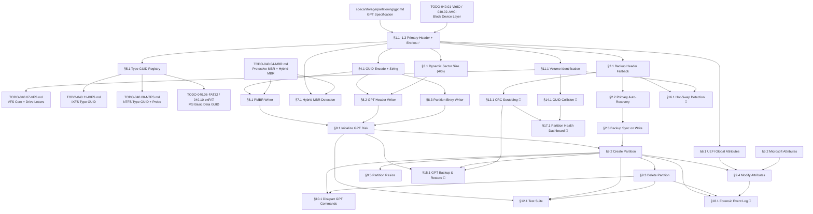

# 040.05-GPT — GUID Partition Table

> **Goal:** Enhance the existing GPT parser to a production-grade, fault-tolerant
> subsystem with backup header recovery, 4Kn sector support, full attribute
> decoding, comprehensive type GUID registry, GPT write support for partition
> creation/deletion, and Hybrid MBR detection. The current `gpt.c` provides
> validated primary-side read-only parsing — this TODO extends it to a complete
> GPT subsystem with write operations, structural redundancy, and CLI tooling.

> [!CAUTION]
> **Memory Rule:** Use `pmm_alloc_contiguous()` for all sector buffers and partition entry arrays (16 KB+). `kmalloc` is ONLY for small kernel structs (≤ 4 KB). See `rules.md` Known Gotchas.

> [!WARNING]
> **Mixed-Endian GUIDs:** GPT uses a mixed-endian GUID format where `TimeLow` (4B), `TimeMid` (2B), `TimeHiAndVersion` (2B) are little-endian, but the trailing 8-byte `ClockSeq+Node` array is stored as raw bytes (big-endian order). The existing `read_guid()` handles this correctly — any new GUID I/O must use the same mixed-endian logic.

> [!IMPORTANT]
> **Spec Reference:** All offsets, field layouts, CRC32 algorithms, and validation rules reference the
> [GPT Specification](file:///home/derickpayne/impossible-os/specs/storage/partitioning/gpt.md)
> in the repo at `specs/storage/partitioning/gpt.md`.

---

## TODO Completion Roadmap (Cross-File)

> [!IMPORTANT]
> **Seven TODO files** plus two spec documents feed into the GPT subsystem. They
> have cross-dependencies that dictate implementation order. This roadmap shows
> the correct sequence — completing items out of order will cause rework.

### Dependency Graph

### Phase-by-Phase Implementation Order

| ⭐ | P    | TODO File / Spec    | Sections                          | What It Delivers                                                            | Depends On                | Status |
| -- | :--: | -------------------- | --------------------------------- | --------------------------------------------------------------------------- | ------------------------- | :----: |
| 💎 | P0   | `gpt.md` spec       | Full spec                         | Wire formats, CRC32 algorithm, mixed-endian GUID — **read before coding**   | —                         |   ✅   |
| 💎 | P0   | `040.01` / `040.02` | Block device layer                | `blkdev_read()` / `blkdev_write()` via VirtIO or AHCI                       | —                         |   ✅   |
| 💎 | P0   | `040.05-GPT.md`     | §1.1–1.3 Primary Parse            | Signature, CRC32, entry array, PMBR detection — **foundation complete**     | P0 (block + spec)         |   ✅   |
| 💎 | P1   | `040.05-GPT.md`     | §2.1 Backup Header Fallback       | Don't fail on single-sector corruption — read backup at last LBA            | P0 (§1)                   |   ✅   |
| 💎 | P1   | `040.05-GPT.md`     | §5.1 Type GUID Registry           | Identify all partition types: BIOS Boot, MS Reserved, Linux, Apple, etc.    | P0 (§1)                   |   ✅   |
| 💎 | P2   | `040.05-GPT.md`     | §2.2 Primary Auto-Recovery        | Restore primary header from valid backup — full structural redundancy       | P1 (§2.1)                 |   ✅   |
| 💎 | P2   | `040.05-GPT.md`     | §3.1 Dynamic Sector Size          | 4Kn NVMe + AF drive support — `dev->sector_size` everywhere                 | P0 (§1)                   |   ✅   |
| 💎 | P2   | `040.05-GPT.md`     | §4.1 GUID Encode + String         | `write_guid()`, `guid_to_string()`, `guid_from_string()`, `guid_generate()` | P0 (§1 read path)         |   ✅   |
| 💎 | P2   | `040.05-GPT.md`     | §6.1 UEFI Global Attributes       | Required, BIOSBoot, hidden partition handling                               | P0 (§1)                   |   ⬜   |
| 💎 | P2   | `040.05-GPT.md`     | §7.1 Hybrid MBR Detection         | Warn and always prefer GPT over conflicting legacy MBR entries              | P0 (§1) + MBR (040.04 §7) |   ⬜   |
| 💎 | P3   | `040.05-GPT.md`     | §2.3 Backup Sync on Write         | Mirror every primary write to backup — prerequisite for all write ops       | P2 (§2.2)                 |   ⬜   |
| 💎 | P3   | `040.05-GPT.md`     | §6.2 Microsoft Attributes         | Read-only, hidden, no-automount on Basic Data partitions                    | P2 (§6.1)                 |   ⬜   |
| 💎 | P3   | `040.05-GPT.md`     | §8.1 PMBR Writer                  | Create Protective MBR at LBA 0 — entry point for GPT disk init              | P2 (§4.1) + MBR (040.04)  |   ⬜   |
| 💎 | P3   | `040.05-GPT.md`     | §8.2 GPT Header Writer            | Serialize and write primary/backup headers with CRC32                       | P2 (§4.1 + §3.1)          |   ⬜   |
| 💎 | P3   | `040.05-GPT.md`     | §8.3 Partition Entry Writer       | Serialize entries + compute array CRC32 — write path for entry array        | P2 (§4.1)                 |   ⬜   |
| 💎 | P4   | `040.05-GPT.md`     | §9.1 Initialize GPT Disk          | Fresh GPT layout: PMBR + headers + empty entry array                        | P3 (§8.1–8.3)             |   ⬜   |
| 💎 | P4   | `040.05-GPT.md`     | §9.2 Create Partition             | Add partition with 1-MiB alignment, overlap validation, GUID generation     | P3 (§2.3) + P4 (§9.1)     |   ⬜   |
| 💎 | P4   | `040.05-GPT.md`     | §9.3 Delete Partition             | Zero entry slot, respect Required flag, unmount first                       | P4 (§9.2)                 |   ⬜   |
| 💎 | P4   | `040.05-GPT.md`     | §9.4 Modify Attributes            | Set/clear bootable, read-only, hidden, no-automount bits                    | P4 (§9.2) + P2–3 (§6)     |   ⬜   |
| 💎 | P4   | `040.05-GPT.md`     | §11.1 Volume Identification       | GUID-based persistent drive letters via Registry                            | P0 (§1) + VFS (040.07)    |   ⬜   |
| 💎 | P4   | `040.05-GPT.md`     | §12.1 GPT Test Suite              | QEMU-based test images validating all parser + writer paths                 | P4 (§9.1–9.3)             |   ⬜   |
| ⭐ | P5   | `040.05-GPT.md`     | §13.1 CRC Scrubbing               | Proactive periodic GPT integrity validation + auto-repair                   | P1 (§2.1) + P2 (§2.2)     |   ⬜   |
| ⭐ | P5   | `040.05-GPT.md`     | §14.1 GUID Collision              | Clone-disk safety: detect duplicate GUIDs, offer regeneration               | P4 (§11.1)                |   ⬜   |
| ⭐ | P6   | `040.05-GPT.md`     | §9.5 Partition Resize             | GUI drag-to-resize — grow/shrink in-place, Windows severely limited         | P4 (§9.2)                 |   ⬜   |
| 💎 | P6   | `040.05-GPT.md`     | §10.1 Diskpart GPT Commands       | CLI: `diskpart list/create/delete/gptinit/info`                             | P4 (§9.2, §9.3)           |   ⬜   |
| ⭐ | P6   | `040.05-GPT.md`     | §15.1 GPT Backup & Restore        | Auto-backup partition table before every write + one-click restore          | P4 (§9.1, §9.2)           |   ⬜   |
| ⭐ | P6   | `040.05-GPT.md`     | §16.1 Hot-Swap Detection          | Runtime disk insertion/removal → auto re-scan GPT on hot-plug events        | P1 (§2.1) + VFS (040.07)  |   ⬜   |
| ⭐ | P6   | `040.05-GPT.md`     | §17.1 Health Dashboard            | GUI surface GPT integrity + SMART + fragmentation in Disk Manager           | P5 (§13.1, §14.1)         |   ⬜   |
| ⭐ | P6   | `040.05-GPT.md`     | §18.1 Forensic Event Log          | Tamper-evident audit trail for all GPT modifications                        | P4 (§9.2, §9.3, §9.4)     |   ⬜   |
| 💎 | —    | `040.04-MBR.md`     | §7.1–7.2 Protective + Hybrid MBR  | MBR `0xEE` redirect to GPT parser + Hybrid MBR sync                         | P0 (§1)                   |   ⬜   |
| 💎 | —    | `040.04-MBR.md`     | §11.1–11.2 MBR↔GPT Conversion     | Non-destructive MBR→GPT and GPT→MBR disk conversion                         | P4 (§9.1)                 |   ⬜   |
| 💎 | —    | `040.07-VFS.md`     | Drive letter assignment           | VFS volume mount + GUID→drive letter Registry lookup                        | P4 (§11.1)                |   ⬜   |

> [!NOTE]
> **Phase 0–1** are already complete — primary + backup GPT parsing and full Type GUID
> registry are working. The parser reads primary at LBA 1 and falls back to backup at
> last LBA on CRC32 failure.
> **Phase 2** is the critical path: 4Kn support, GUID write path, attribute decoding,
> and Hybrid MBR detection. These unblock all write operations.
> **Phases 3–4** build the full write path: header/entry writers → disk init → partition
> create/delete/modify → volume identification → test suite.
> **Phases 5–6** deliver competitive features (⭐): CRC scrubbing, GUID collision detection,
> drag-to-resize, auto-backup, hot-swap detection, and partition health dashboard — features
> no other OS provides.
> MBR (040.04) and VFS (040.07) are **cross-domain** dependencies that proceed in
> parallel but connect at specific integration points.

> [!TIP]
> **Quick wins after Phase 1 (both complete ✅):**
> - §6.1 UEFI Global Attributes is a trivial bitmask decode of the existing `attributes`
>   field — minimal code, immediate visibility in `diskpart list parts`.
> - §4.1 GUID Encode — `write_guid()` is just the reverse of the existing `read_guid()`,
>   and `guid_to_string()` is a simple hex-format helper. Quick to implement, unlocks §8–9.
>
> **Critical ordering rule:** §2.3 Backup Sync on Write **must** be implemented BEFORE
> any partition create/delete operations (§9). Without it, writes update only the primary
> header but leave the backup stale — a crash between the two leaves the disk with
> inconsistent primary/backup GPT structures.
>
> **Memory rule reminder:** The 16 KB partition entry array (128 entries × 128 bytes) and
> all sector buffers **must** use `pmm_alloc_contiguous()`, not `kmalloc()`. The kernel heap
> is only 2 MiB — allocating entry arrays on the heap causes silent exhaustion.
>
> **Cross-file integration points:**
> - When §5.1 adds new Type GUIDs, also update `partition.c` probes: `probe_ntfs()` for
>   `GPT_GUID_MS_BASIC_DATA`, `probe_ext4()` for `GPT_GUID_LINUX_FS`,
>   `probe_ixfs()` for `GPT_GUID_IXFS` — these are registered in TODO-040.08, 040.09,
>   and 040.11 respectively.
> - When §11.1 stores partition GUIDs in the Registry, coordinate with VFS (040.07)
>   drive letter assignment — VFS must prefer GUID-based mapping over discovery-order.
> - When §8.1 writes Protective MBRs, the MBR parser (040.04 §7.1) must handle the
>   `0xEE` redirect correctly — implement both sides together.
> - MBR↔GPT conversion (040.04 §11) depends on GPT disk init (§9.1) and entry writer
>   (§8.3) — these must be done first.

---

## 1. GPT Header Parsing (Primary)

### 1.1 Primary Header Validation ✅

**Prompt:** This section is marked complete. Verify the implementation is correct: confirm `gpt.c` reads LBA 1, checks `"EFI PART"` signature (`0x5452415020494645`), validates Header CRC32 by zeroing bytes 16–19 before computation, parses all 13 header fields, and validates partition entry array CRC32 over the full `NumberOfPartitionEntries × SizeOfPartitionEntry` range. Run `bash scripts/build.sh clean`. Fix any inconsistencies.

- [x] Read LBA 1 from block device
- [x] Verify 8-byte signature `"EFI PART"` (`GPT_SIGNATURE`)
- [x] Parse all header fields: revision, header_size, my_lba, alt_lba, first/last usable LBA, disk GUID, partition entry LBA, num entries, entry size, array CRC32
- [x] Validate Header CRC32: clone header, zero bytes 16–19, compute CCITT-32, compare
- [x] Use reflected polynomial `0xEDB88320` with init `0xFFFFFFFF` and final XOR `0xFFFFFFFF`
- [x] Validate header size range: ≥92 and ≤512 bytes
- [x] Validate partition entry size ≥128 and num_entries > 0
- [x] Commit: `"fs: GPT partition table parsing"`

### 1.2 Partition Entry Array Parsing ✅

**Prompt:** This section is marked complete. Verify the implementation is correct: confirm `gpt.c` reads the partition entry array starting at `part_entry_lba`, computes CRC32 incrementally sector-by-sector over the full array length, parses non-empty entries (type GUID ≠ all-zeros), extracts type GUID, unique GUID, start/end LBA, attributes, and UTF-16LE name. Confirm it correctly skips empty entries without stopping iteration.

- [x] Read partition entries sector-by-sector from `part_entry_lba`
- [x] Compute array CRC32 incrementally over full `num_entries × entry_size` bytes
- [x] Compare computed array CRC32 against header's `part_entry_crc32`
- [x] For each entry: parse type GUID, unique GUID, start LBA, end LBA, attributes, name
- [x] Skip empty entries (`type_guid == GPT_GUID_EMPTY`) without terminating scan
- [x] Decode UTF-16LE name to ASCII (best-effort, null-terminate)
- [x] Cap results at `GPT_MAX_RESULTS` (currently 32)
- [x] Commit: `"fs: GPT partition table parsing"`

### 1.3 PMBR Detection ✅

**Prompt:** This section is marked complete. Verify Protective MBR detection: confirm `gpt_parse()` checks all 4 MBR partition entries at LBA 0 for type `0xEE`, and returns invalid if none found.

- [x] Read MBR sector (LBA 0) passed as `sector0` parameter
- [x] Scan all 4 partition entries for type `0xEE` (`MBR_TYPE_GPT`)
- [x] If no `0xEE` found → return invalid table
- [x] Commit: `"fs: GPT partition table parsing"`

---
## 2. Backup Header & Structural Redundancy

### 2.1 Backup Header Fallback ✅

**Prompt:** This section is marked complete. Verify the implementation is correct: confirm `gpt.c` `gpt_parse()` attempts the primary header at LBA 1 first, and on CRC32 failure calculates `backup_lba = dev->sector_count - 1`, reads the backup sector, validates its signature and CRC32, verifies `my_lba` matches the last LBA and `alt_lba == 1`, and uses the backup to parse the partition entry array from the backup array location. Confirm a `LOG_WARN` is logged when falling back. Run `bash scripts/build.sh clean`. Fix any inconsistencies.

> [!NOTE]
> **Implementation note:** Backup fallback was implemented directly in `gpt_parse()` at `gpt.c:375-403`. When the primary header at LBA 1 fails `parse_header()`, the code reads `dev->sector_count - 1`, validates the backup header's `my_lba` and `alt_lba` fields, and logs via `klog(LOG_WARN, ...)`. The `using_backup` flag is set for future §2.2 auto-recovery use.

- [x] Calculate backup header LBA: `dev->sector_count - 1`
- [x] On primary header CRC32 failure: attempt reading backup header
- [x] Validate backup header: signature `"EFI PART"`, CRC32 (same zeroing procedure)
- [x] Verify backup header's `my_lba` matches the last LBA
- [x] Verify backup header's `alt_lba == 1` (points back to primary)
- [x] Parse partition entries from backup array (located before backup header)
- [x] Log: `[GPT] WARNING: Primary header corrupt — using backup at LBA %llu`
- [x] Commit: `"gpt: backup header fallback recovery"`

### 2.2 Primary Header Auto-Recovery ✅

**Prompt:** This section is marked complete. Verify the implementation is correct: confirm `gpt.c` `gpt_parse()` auto-recovers the primary header when `using_backup == 1`. The recovery copies the backup `gpt_header` struct, sets `my_lba = GPT_HEADER_LBA (1)`, `alt_lba = backup_lba (last LBA)`, and `part_entry_lba = 2` (primary entry location). It then calls `serialize_header()` to serialize all 13 fields and auto-compute Header CRC32 (zeroes bytes 16–19, computes, fills). Confirm it writes the reconstructed header to LBA 1 via `blkdev_write()`, copies the backup entry array sector-by-sector to LBA 2+, and verifies the copy with an incremental CRC32 re-read. Confirm `LOG_INFO` is logged on success and `LOG_WARN` on failure. Run `bash scripts/build.sh clean`. Fix any inconsistencies.

> [!NOTE]
> **Implementation note:** Recovery is at `gpt.c:514-589` inside `gpt_parse()`. Added `write_le16/32/64` helpers (lines 221–240) and `serialize_header()` (lines 345–381) which auto-computes CRC32. Three fields are adjusted from backup→primary: `my_lba`, `alt_lba`, `part_entry_lba`. The recovery is non-fatal — if writes fail, the function logs a warning but still returns a valid parsed table (backup data was already used for parsing). The `recovery_ok` flag gates each step to avoid cascading errors.

- [x] Copy backup header into reconstruction buffer
- [x] Swap `my_lba` ↔ `alt_lba` (backup's values are inverted)
- [x] Set `part_entry_lba` to LBA 2 (primary entry location)
- [x] Recalculate Header CRC32 via `serialize_header()` (zero CRC field, compute, fill)
- [x] Write reconstructed primary header to LBA 1
- [x] Copy backup partition entry array to primary location (LBA 2+)
- [x] Recompute and verify primary array CRC32 after copy
- [x] Log: `Auto-recovered primary GPT header from backup` (`LOG_INFO`)
- [x] Commit: `"gpt: auto-recover primary from backup"`

### 2.3 Backup Header Sync on Write

**Prompt:** Whenever the primary GPT header or partition entry array is modified (partition create/delete/resize), the backup copies at the end of the disk must be synchronously updated. Write the backup partition entry array first (before the backup header LBA), then recalculate and write the backup header with swapped `my_lba`/`alt_lba` and freshly computed CRC32 values. After completing all items, mark every item as `[x]`, update this prompt to a verification prompt, run `bash scripts/build.sh clean`, and commit as `"gpt: sync backup on write"`. Add notes directly in this TODO section. After implementation, save any gotchas, solutions, and important information to MCP memory (`mcp_memory_create_entities` / `mcp_memory_add_observations`).

- [ ] After any primary GPT modification: mirror partition entry array to backup location
- [ ] Recalculate backup header: swap `my_lba`/`alt_lba`, recompute Header CRC32
- [ ] Write backup partition array → then backup header (order matters for crash safety)
- [ ] Implement `gpt_sync_backup(dev, primary_header, entry_array)` helper
- [ ] Log: `[GPT] Synced backup GPT at LBA %llu`
- [ ] Commit: `"gpt: sync backup on write"`

---

## 3. 4Kn Sector Size Support

### 3.1 Dynamic Sector Size Calculation ✅

**Prompt:** This section is marked complete. Verify the implementation is correct: confirm `gpt.c` `gpt_parse()` reads `dev->sector_size` into `sec_sz` (with 512 minimum floor), allocates `hdr_sect` and `entry_buf` via `kmalloc(sec_sz)`, passes `sec_sz` to `parse_header()` and `serialize_header()`, uses `sec_sz` for `entries_per_sector`, `sectors_needed`, and all CRC chunk calculations. Confirm all early returns use `goto out_free` for proper `kfree()` cleanup. Run `bash scripts/build.sh clean`. Fix any inconsistencies.

> [!NOTE]
> **Implementation note:** Used `kmalloc`/`kfree` from `heap.h` instead of `pmm_alloc_contiguous()` — heap allocations are simpler and sufficient for sector-sized buffers (max 4 KiB, well within the 2 MiB heap). The `parse_header()` CRC buffer remains a 512-byte stack array since the GPT header is always ≤92 bytes per spec (revision 1.0). All 11 hardcoded `512` references were replaced with `sec_sz`. The `goto out_free` pattern ensures `kfree()` is called on every exit path.

- [x] Read `dev->sector_size` instead of assuming 512 (floor at 512)
- [x] Allocate sector buffers dynamically: `kmalloc(sec_sz)` with `kfree()` cleanup
- [x] Recalculate `entries_per_sector = sec_sz / part_entry_size`
- [x] Recalculate `sectors_needed = (total_entry_bytes + sec_sz - 1) / sec_sz`
- [x] Handle 4Kn: entry array spans LBA 2–5 (4 sectors × 4096 = 16,384 bytes)
- [x] Handle 512b: entry array spans LBA 2–33 (32 sectors × 512 = 16,384 bytes)
- [x] All early returns → `goto out_free` for proper buffer cleanup
- [x] `parse_header()` and `serialize_header()` parameterized with `sector_size`
- [x] Commit: `"gpt: dynamic sector size support"`

---

## 4. Mixed-Endian GUID Operations

### 4.1 GUID Encoding (Write Path) ✅

**Prompt:** This section is marked complete. Verify the implementation is correct: confirm `gpt.c` implements `write_guid()` serializing mixed-endian (data1 LE32, data2 LE16, data3 LE16, data4 direct copy), `guid_to_string()` producing canonical `xxxxxxxx-xxxx-xxxx-xxxx-xxxxxxxxxxxx` format (36 chars + NUL), `guid_from_string()` parsing hex with dashes back to `gpt_guid`, and `guid_generate()` producing RFC 4122 v4 UUIDs (version=4, variant=2) using RDRAND with XorShift64/TSC fallback. Confirm `gpt.h` declares all four functions. Run `bash scripts/build.sh clean`. Fix any inconsistencies.

> [!NOTE]
> **Implementation note:** All four functions at `gpt.c:294-467`. `write_guid()` reuses existing `write_le32/16` helpers. `guid_to_string()` serializes to raw bytes first then formats hex with dashes. `guid_from_string()` skips dashes during parsing and uses `read_guid()` for mixed-endian decode. `guid_generate()` uses `rdrand_fill()` with `cpu_has(CPU_FEATURE_RDRAND)` check, falls back to XorShift64 PRNG seeded from TSC. v4 version bits set at raw[6] (0x4x), variant bits at raw[8] (0x8x–0xBx).

- [x] `read_guid(bytes, guid)` — mixed-endian parse (existing, working)
- [x] `gpt_guid_equal(a, b)` — field-by-field comparison (existing, working)
- [x] `write_guid(guid, bytes[16])`: data1 LE32, data2 LE16, data3 LE16, data4 copy
- [x] `guid_to_string(guid, buf[37])` → canonical 36-char format + NUL
- [x] `guid_from_string(str, guid)` → parse hex with dashes, returns 0/-1
- [x] `guid_generate()` → v4 UUID via RDRAND + XorShift64/TSC fallback
- [x] All four declared in `gpt.h`
- [x] Commit: `"gpt: GUID encode + string conversion"`

---

## 5. Type GUID Registry Expansion

### 5.1 Comprehensive Type GUID Registry ✅

**Prompt:** This section is marked complete. Verify the implementation is correct: confirm `gpt.c` defines all 25+ partition type GUIDs as `const struct gpt_guid` constants and `gpt_type_name()` returns human-readable strings for all types including BIOS Boot, MS Reserved, MS LDM Meta/Data, MS Recovery, MS Storage Spaces, Linux Swap/Root/Home/Srv/LVM/RAID, Apple HFS+/APFS, FreeBSD ZFS, Solaris Root, VMware VMFS, ChromeOS Kernel, and Ceph OSD. Confirm `gpt.h` declares all `extern` constants. Confirm unknown types return `"Unknown"`. Run `bash scripts/build.sh clean`. Fix any inconsistencies.

> [!NOTE]
> **Implementation note:** All 25 GUIDs are defined in `gpt.c:24-164` with corresponding `extern` declarations in `gpt.h:70-93`. The `gpt_type_name()` function at `gpt.c:245-271` returns strings for all known types and `"Unknown"` for unrecognized GUIDs.

- [x] `GPT_GUID_EMPTY` — `00000000-0000-0000-0000-000000000000`
- [x] `GPT_GUID_EFI_SYSTEM` — `C12A7328-F81F-11D2-BA4B-00A0C93EC93B`
- [x] `GPT_GUID_MS_BASIC_DATA` — `EBD0A0A2-B9E5-4433-87C0-68B6B72699C7`
- [x] `GPT_GUID_LINUX_FS` — `0FC63DAF-8483-4772-8E79-3D69D8477DE4`
- [x] `GPT_GUID_IXFS` — `DA000000-0000-4978-4653-000000000001`
- [x] `GPT_GUID_BIOS_BOOT` — `21686148-6449-6E6F-744E-656564454649`
- [x] `GPT_GUID_MS_RESERVED` — `E3C9E316-0B5C-4DB8-817D-F92DF00215AE`
- [x] `GPT_GUID_MS_LDM_META` — `5808C8AA-7E8F-42E0-85D2-E1E90434CFB3`
- [x] `GPT_GUID_MS_LDM_DATA` — `AF9B60A0-1431-4F62-BC68-3311714A69AD`
- [x] `GPT_GUID_MS_RECOVERY` — `DE94BBA4-06D1-4D40-A16A-BFD50179D6AC`
- [x] `GPT_GUID_MS_STORAGE_SPACES` — `E75CAF8F-F680-4CEE-AFA3-B001E56EFC2D`
- [x] `GPT_GUID_LINUX_SWAP` — `0657FD6D-A4AB-43C4-84E5-0933C84B4F4F`
- [x] `GPT_GUID_LINUX_ROOT_X64` — `4F68BCE3-E8CD-4DB1-96E7-FBCAF984B709`
- [x] `GPT_GUID_LINUX_HOME` — `933AC7E1-2EB4-4F13-B844-0E14E2AEF915`
- [x] `GPT_GUID_LINUX_SRV` — `3B8F8425-20E0-4F3B-907F-1A25A76F98E8`
- [x] `GPT_GUID_LINUX_LVM` — `E6D6D379-F507-44C2-A23C-238F2A3DF928`
- [x] `GPT_GUID_LINUX_RAID` — `A19D880F-05FC-4D3B-A006-743F0F84911E`
- [x] `GPT_GUID_APPLE_HFS` — `48465300-0000-11AA-AA11-00306543ECAC`
- [x] `GPT_GUID_APPLE_APFS` — `7C3457EF-0000-11AA-AA11-00306543ECAC`
- [x] `GPT_GUID_FREEBSD_ZFS` — `516E7CB5-6ECF-11D6-8FF8-00022D09712B`
- [x] `GPT_GUID_SOLARIS_ROOT` — `6A85CF4D-1DD2-11B2-99A6-080020736631`
- [x] `GPT_GUID_VMWARE_VMFS` — `AA31E02A-400F-11DB-9590-000C2911D1B8`
- [x] `GPT_GUID_CHROMEOS_KERNEL` — `FE3A2A5D-4F32-41A7-B725-ACCC3285A309`
- [x] `GPT_GUID_CEPH_OSD` — `4FBD7E29-9D25-41B8-AFD0-062C0CEFF05D`
- [x] For unknown types: display as `"Unknown"` — never crash
- [x] Update `gpt_type_name()` to return human-readable strings for all types
- [x] Commit: `"gpt: expanded type GUID registry"`

---

## 6. Partition Attributes Decoding

### 6.1 UEFI Global Attributes

**Prompt:** Parse the 64-bit Attributes bitmask from each partition entry. Bits 0–2 are UEFI-defined: bit 0 = Required Partition (OS must not delete), bit 1 = No Block IO Protocol (hidden from UEFI), bit 2 = Legacy BIOS Bootable (GPT "Active" flag). When a partition has bit 0 set, prevent deletion in `diskpart` and partition manager. When bit 2 is set, log it as "BIOS Bootable". After completing all items, mark every item as `[x]`, update this prompt to a verification prompt, run `bash scripts/build.sh clean`, and commit as `"gpt: partition attribute decoding"`. Add notes directly in this TODO section. After implementation, save any gotchas, solutions, and important information to MCP memory (`mcp_memory_create_entities` / `mcp_memory_add_observations`).

- [ ] Define `GPT_ATTR_REQUIRED (1 << 0)` — system partition, prevent deletion
- [ ] Define `GPT_ATTR_NO_BLOCKIO (1 << 1)` — hide from firmware
- [ ] Define `GPT_ATTR_LEGACY_BIOS_BOOT (1 << 2)` — Legacy BIOS bootable
- [ ] Parse attributes from entry offset `0x30` (existing field, already read)
- [ ] Log attribute flags: `[GPT] Partition %d: Required=%d, BIOSBoot=%d`
- [ ] Expose `gpt_entry.attributes` to partition scanner and VFS
- [ ] Commit: `"gpt: partition attribute decoding"`

### 6.2 Microsoft Type-Specific Attributes

**Prompt:** For partitions with type GUID `EBD0A0A2-B9E5-4433-87C0-68B6B72699C7` (MS Basic Data), decode bits 60–63: bit 60 = Read-Only, bit 61 = Shadow Copy, bit 62 = Hidden, bit 63 = No Automount. When read-only is set, mount the filesystem as write-protected. When hidden or no-automount is set, skip auto-mount drive letter assignment. After completing all items, mark every item as `[x]`, update this prompt to a verification prompt, run `bash scripts/build.sh clean`, and commit as `"gpt: Microsoft-specific attributes"`. Add notes directly in this TODO section. After implementation, save any gotchas, solutions, and important information to MCP memory (`mcp_memory_create_entities` / `mcp_memory_add_observations`).

- [ ] Define `GPT_MS_ATTR_READONLY (1ULL << 60)`
- [ ] Define `GPT_MS_ATTR_SHADOW (1ULL << 61)`
- [ ] Define `GPT_MS_ATTR_HIDDEN (1ULL << 62)`
- [ ] Define `GPT_MS_ATTR_NO_AUTOMOUNT (1ULL << 63)`
- [ ] Only apply MS attribute logic when type GUID == `GPT_GUID_MS_BASIC_DATA`
- [ ] Read-only flag → set `blkdev->readonly = true`, filesystem mounts write-protected
- [ ] Hidden / No-Automount → skip auto-mount in partition scanner
- [ ] Log: `[GPT] MS Basic Data partition: readonly=%d, hidden=%d, no_automount=%d`
- [ ] Commit: `"gpt: Microsoft-specific attributes"`

---

## 7. Hybrid MBR Detection

### 7.1 Hybrid MBR Warning

**Prompt:** Detect the Hybrid MBR anomaly: when LBA 0 contains a `0xEE` partition entry whose size does NOT span the entire disk AND other non-zero partition entries exist in slots 2–4. This indicates a legacy dual-boot layout (typically Apple BootCamp). Log a critical warning and always prefer the GPT structures over the MBR mappings. After completing all items, mark every item as `[x]`, update this prompt to a verification prompt, run `bash scripts/build.sh clean`, and commit as `"gpt: Hybrid MBR detection"`. Add notes directly in this TODO section. After implementation, save any gotchas, solutions, and important information to MCP memory (`mcp_memory_create_entities` / `mcp_memory_add_observations`).

- [ ] After detecting `0xEE` at LBA 0: check if its `Size in LBA` covers the full disk
  - [ ] Full disk: `size_lba >= disk_sectors - 1` → standard PMBR ✅
  - [ ] Partial: `size_lba < disk_sectors - 1` AND other entries non-zero → Hybrid MBR ⚠️
- [ ] Check MBR entries 2–4 for non-zero type codes
- [ ] If Hybrid MBR: log `[GPT] WARNING: Hybrid MBR detected — ignoring legacy MBR entries`
- [ ] Always prefer GPT structures over Hybrid MBR entries
- [ ] Set `blkdev->hybrid_mbr = true` flag for informational purposes
- [ ] Commit: `"gpt: Hybrid MBR detection"`

---

## 8. GPT Write Support

### 8.1 Protective MBR Writer

**Prompt:** Implement writing a standard Protective MBR to LBA 0 for GPT disk initialization. Entry 1: boot=`0x00`, CHS start=`0x00 0x02 0x00`, type=`0xEE`, CHS end=`0xFF 0xFF 0xFF`, LBA start=1, size=`min(disk_sectors - 1, 0xFFFFFFFF)`. Entries 2–4 all zeros. Signature `0x55 0xAA` at bytes 510–511. After completing all items, mark every item as `[x]`, update this prompt to a verification prompt, run `bash scripts/build.sh clean`, and commit as `"gpt: Protective MBR writer"`. Add notes directly in this TODO section. After implementation, save any gotchas, solutions, and important information to MCP memory (`mcp_memory_create_entities` / `mcp_memory_add_observations`).

- [ ] Implement `gpt_write_pmbr(dev)`:
  - [ ] Allocate 512-byte buffer, zero it
  - [ ] Entry 1 at offset 446: boot=`0x00`, CHS start=`{0x00, 0x02, 0x00}`, type=`0xEE`
  - [ ] CHS end=`{0xFF, 0xFF, 0xFF}`, LBA start=`1`
  - [ ] Size = `min(dev->sector_count - 1, 0xFFFFFFFF)`
  - [ ] Entries 2–4: zeroed (offsets 462, 478, 494)
  - [ ] Write `0x55` at byte 510, `0xAA` at byte 511
  - [ ] Write to LBA 0 via `blkdev_write()`
- [ ] Log: `[GPT] Written Protective MBR`
- [ ] Commit: `"gpt: Protective MBR writer"`

### 8.2 GPT Header Writer

**Prompt:** Implement writing a GPT header to a specified LBA (1 for primary, last LBA for backup). Build the 92-byte structure: signature, revision `0x00010000`, header size 92, reserved=0, my_lba, alt_lba, first/last usable LBA, disk GUID, partition entry LBA, entry count (128), entry size (128), array CRC32. Compute Header CRC32 last (zero field, hash, fill). Pad remainder of sector with zeros. After completing all items, mark every item as `[x]`, update this prompt to a verification prompt, run `bash scripts/build.sh clean`, and commit as `"gpt: header writer"`. Add notes directly in this TODO section. After implementation, save any gotchas, solutions, and important information to MCP memory (`mcp_memory_create_entities` / `mcp_memory_add_observations`).

- [ ] Implement `gpt_write_header(dev, header, lba)`:
  - [ ] Allocate sector buffer, zero it
  - [ ] Write signature `"EFI PART"` at offset 0
  - [ ] Write revision `0x00010000` at offset 8
  - [ ] Write header size `92` at offset 12
  - [ ] Zero CRC32 field at offset 16 (compute last)
  - [ ] Write reserved `0` at offset 20
  - [ ] Write `my_lba`, `alt_lba`, `first_usable_lba`, `last_usable_lba`
  - [ ] Write disk GUID via `write_guid()` at offset 56
  - [ ] Write `part_entry_lba`, `num_entries`, `entry_size`, `array_crc32`
  - [ ] Compute Header CRC32 over 92 bytes (with CRC field zeroed), fill at offset 16
  - [ ] Write sector to `lba` via `blkdev_write()`
- [ ] Commit: `"gpt: header writer"`

### 8.3 Partition Entry Writer

**Prompt:** Implement writing partition entries to the entry array. Serialize each `gpt_entry` to its 128-byte on-disk format: type GUID (mixed-endian via `write_guid()`), unique GUID, start/end LBA (LE64), attributes (LE64), name (UTF-16LE). Compute the array CRC32 over the full `128 × 128 = 16,384` byte range (including empty entries). After completing all items, mark every item as `[x]`, update this prompt to a verification prompt, run `bash scripts/build.sh clean`, and commit as `"gpt: partition entry writer"`. Add notes directly in this TODO section. After implementation, save any gotchas, solutions, and important information to MCP memory (`mcp_memory_create_entities` / `mcp_memory_add_observations`).

- [ ] Implement `gpt_write_entries(dev, entries[], count, entry_lba)`:
  - [ ] Allocate 16,384-byte buffer for 128 entries via `pmm_alloc_contiguous()`
  - [ ] Zero entire buffer (empty entries = all-zero GUIDs)
  - [ ] For each active entry: serialize type GUID, unique GUID, LBA range, attributes, name
  - [ ] Encode name as UTF-16LE (ASCII → UTF-16LE: zero-extend each byte)
  - [ ] Compute array CRC32 over full 16,384 bytes
  - [ ] Write entry array to disk starting at `entry_lba` (32 sectors for 512b)
  - [ ] Return computed array CRC32 (needed by header writer)
- [ ] Always write 128 entries regardless of active count (Windows compatibility — spec §5.1)
- [ ] Commit: `"gpt: partition entry writer"`

---

## 9. Partition Management

### 9.1 Initialize GPT Disk

**Prompt:** Create a fresh GPT layout on a raw disk. Write Protective MBR (§8.1), generate a random Disk GUID, compute first/last usable LBA based on sector size, write an empty partition entry array (all-zeros, 128 entries), write primary header at LBA 1 and backup header at last LBA. This is the equivalent of `gdisk` creating a new partition table. After completing all items, mark every item as `[x]`, update this prompt to a verification prompt, run `bash scripts/build.sh clean`, and commit as `"gpt: initialize fresh GPT disk"`. Add notes directly in this TODO section. After implementation, save any gotchas, solutions, and important information to MCP memory (`mcp_memory_create_entities` / `mcp_memory_add_observations`).

- [ ] Implement `gpt_init_disk(dev)`:
  - [ ] Generate random Disk GUID via `guid_generate()`
  - [ ] Calculate `first_usable_lba`: depends on sector size
    - [ ] 512b sectors: LBA 34 (1 PMBR + 1 header + 32 array sectors)
    - [ ] 4096b sectors: LBA 6 (1 PMBR + 1 header + 4 array sectors)
  - [ ] Calculate `last_usable_lba`: `disk_sectors - 34` (512b) or `disk_sectors - 6` (4Kn)
  - [ ] Write Protective MBR to LBA 0
  - [ ] Write empty entry array to primary (LBA 2+) and backup locations
  - [ ] Compute array CRC32 over zeroed 16,384 bytes
  - [ ] Write primary header at LBA 1
  - [ ] Write backup header at last LBA
- [ ] Log: `[GPT] Initialized GPT: disk_guid=%s, usable=%llu–%llu`
- [ ] Commit: `"gpt: initialize fresh GPT disk"`

### 9.2 Create Partition

**Prompt:** Add a partition to the GPT: find the first empty entry slot (type GUID all-zeros), fill in the type GUID, generate a unique partition GUID, set start/end LBA (with 1-MiB alignment), set attributes and name. Recompute array CRC32, recompute header CRC32, write both primary and backup. Enforce: start/end must be within the usable LBA range, no overlap with existing partitions. After completing all items, mark every item as `[x]`, update this prompt to a verification prompt, run `bash scripts/build.sh clean`, and commit as `"gpt: create partition"`. Add notes directly in this TODO section. After implementation, save any gotchas, solutions, and important information to MCP memory (`mcp_memory_create_entities` / `mcp_memory_add_observations`).

- [ ] Implement `gpt_create_partition(dev, type_guid, size_sectors, name)`:
  - [ ] Read current partition entry array from disk
  - [ ] Find first empty slot (type GUID == `GPT_GUID_EMPTY`)
  - [ ] If no empty slot → return `GPT_ERR_TABLE_FULL`
  - [ ] Calculate start LBA: find largest contiguous gap in usable range, align to 2048
  - [ ] Validate: no overlap with any existing partition
  - [ ] Validate: `start_lba >= first_usable_lba` and `end_lba <= last_usable_lba`
  - [ ] Generate unique partition GUID via `guid_generate()`
  - [ ] Set attributes to 0 (default)
  - [ ] Encode partition name as UTF-16LE (max 36 chars)
  - [ ] Recompute array CRC32, update both headers, write primary + backup
- [ ] Log: `[GPT] Created partition: type=%s, LBA=%llu–%llu, name=%s`
- [ ] Commit: `"gpt: create partition"`

### 9.3 Delete Partition

**Prompt:** Delete a partition by zeroing its 128-byte entry in the array. Zero only the target slot — do not shift remaining entries. Recompute array CRC32, update both primary and backup headers. Unmount any filesystem on the partition first. After completing all items, mark every item as `[x]`, update this prompt to a verification prompt, run `bash scripts/build.sh clean`, and commit as `"gpt: delete partition"`. Add notes directly in this TODO section. After implementation, save any gotchas, solutions, and important information to MCP memory (`mcp_memory_create_entities` / `mcp_memory_add_observations`).

- [ ] Implement `gpt_delete_partition(dev, entry_index)`:
  - [ ] Validate entry_index is within `0..num_entries-1`
  - [ ] Validate entry is not empty (already deleted)
  - [ ] Check `GPT_ATTR_REQUIRED` → refuse deletion if set
  - [ ] Unmount filesystem on this partition if mounted
  - [ ] Zero the 128-byte entry slot (type GUID becomes all-zeros)
  - [ ] Recompute array CRC32
  - [ ] Update and write primary header + backup header
  - [ ] Write updated entry array to primary + backup locations
- [ ] Log: `[GPT] Deleted partition entry %d`
- [ ] Commit: `"gpt: delete partition"`

### 9.4 Modify Partition Attributes

**Prompt:** Allow setting/clearing individual attribute bits on a partition: set bootable (bit 2), set read-only (bit 60), set hidden (bit 62), set no-automount (bit 63). Recompute CRC32 values after modification. After completing all items, mark every item as `[x]`, update this prompt to a verification prompt, run `bash scripts/build.sh clean`, and commit as `"gpt: modify partition attributes"`. Add notes directly in this TODO section. After implementation, save any gotchas, solutions, and important information to MCP memory (`mcp_memory_create_entities` / `mcp_memory_add_observations`).

- [ ] Implement `gpt_set_attribute(dev, entry_index, bit, value)`:
  - [ ] Read entry, set or clear the specified bit
  - [ ] For MS-specific bits (60–63): only allow on `GPT_GUID_MS_BASIC_DATA` type
  - [ ] Recompute array CRC32, update headers, write primary + backup
- [ ] Implement `gpt_set_partition_name(dev, entry_index, name)`:
  - [ ] Encode new name as UTF-16LE, update entry
  - [ ] Recompute CRC32s, write primary + backup
- [ ] Log: `[GPT] Set attribute bit %d=%d on partition %d`
- [ ] Commit: `"gpt: modify partition attributes"`

### 9.5 Partition Resize (Non-Destructive)

**Prompt:** Implement growing and shrinking GPT partitions in-place by modifying the End LBA in the partition entry. Growing: extend End LBA into adjacent free space (verify no collision with next partition). Shrinking: reduce End LBA (the filesystem on top must be shrunk FIRST or data loss occurs). Never move Start LBA — that would destroy data. After entry modification, recompute array CRC32, update both headers. When growing, also relocate the backup GPT if the partition was the last one (backup GPT lives at disk end). After completing all items, mark every item as `[x]`, update this prompt to a verification prompt, run `bash scripts/build.sh clean`, and commit as `"gpt: non-destructive partition resize"`. Add notes directly in this TODO section. After implementation, save any gotchas, solutions, and important information to MCP memory (`mcp_memory_create_entities` / `mcp_memory_add_observations`).

> [!TIP]
> **Competitive Edge:** Windows Disk Management can only extend the LAST partition or
> one with adjacent right-side free space. It cannot shrink GPT partitions in many scenarios.
> Linux requires CLI tools (`parted resizepart`). Impossible OS doing this from the GUI
> Disk Manager with a drag handle is a significant usability advantage.

> [!WARNING]
> **Shrink is dangerous.** The filesystem MUST be shrunk first (e.g., `ntfs_resize`, `resize2fs`).
> The partition resize only changes the GPT entry — it does NOT touch filesystem structures.

- [ ] Implement `gpt_resize_partition(dev, entry_index, new_end_lba)`:
  - [ ] Validate `new_end_lba >= entry.start_lba` (can't make partition empty)
  - [ ] Validate `new_end_lba <= last_usable_lba`
  - [ ] If growing: verify no overlap with next partition's start LBA
  - [ ] If shrinking: warn — filesystem must be shrunk first
  - [ ] Update `entry.end_lba = new_end_lba`
  - [ ] Recompute array CRC32, update both headers, write primary + backup
- [ ] Implement `gpt_get_max_resize(dev, entry_index)` → returns max possible end LBA
  - [ ] Scan for next partition's start LBA or `last_usable_lba`, whichever is smaller
- [ ] Wire to Disk Manager: drag handle to resize partitions visually
- [ ] Log: `[GPT] Resized partition %d: LBA %llu–%llu → %llu–%llu`
- [ ] Commit: `"gpt: non-destructive partition resize"`

---

## 10. CLI Integration

### 10.1 Diskpart GPT Commands

**Prompt:** Wire GPT operations into the `diskpart` shell command. `diskpart list disks` shows GPT/MBR status and Disk GUID. `diskpart list parts <disk>` shows all GPT entries with type name, GUID, LBA range, size, name, and attributes. `diskpart create <disk> <size_mb> <type>` creates a partition. `diskpart delete <disk> <entry>` removes a partition. `diskpart info <disk>` shows the full GPT header details. After completing all items, mark every item as `[x]`, update this prompt to a verification prompt, run `bash scripts/build.sh clean`, and commit as `"shell: diskpart GPT commands"`. Add notes directly in this TODO section. After implementation, save any gotchas, solutions, and important information to MCP memory (`mcp_memory_create_entities` / `mcp_memory_add_observations`).

- [ ] `diskpart list disks` — show GPT/MBR status per disk:
  - [ ] For GPT disks: show Disk GUID, revision, usable LBA range
  - [ ] For MBR disks: show Disk Signature (from MBR TODO)
- [ ] `diskpart list parts <disk>` — show GPT partition entries:
  - [ ] Table: Entry#, Type Name, Unique GUID, Start LBA, End LBA, Size, Name, Flags
  - [ ] Show attribute flags: Required, BIOSBoot, ReadOnly, Hidden, NoMount
- [ ] `diskpart create <disk> <size_mb> <type_name>` — create GPT partition:
  - [ ] Map type name to GUID (e.g., "ixfs" → `GPT_GUID_IXFS`, "fat32" → `GPT_GUID_MS_BASIC_DATA`)
  - [ ] Convert size_mb to sectors, call `gpt_create_partition()`
  - [ ] Confirm before writing
- [ ] `diskpart delete <disk> <entry>` — delete GPT partition:
  - [ ] Confirmation prompt: "This will destroy all data. Continue? (y/N)"
  - [ ] Call `gpt_delete_partition()`
- [ ] `diskpart gptinit <disk>` — initialize fresh GPT layout:
  - [ ] Warning: "This will erase all partition data. Continue?"
  - [ ] Call `gpt_init_disk()`
- [ ] `diskpart info <disk>` — full GPT header dump:
  - [ ] Signature, revision, disk GUID, first/last usable LBA, entry count
  - [ ] Primary CRC32, array CRC32, backup status
- [ ] Commit: `"shell: diskpart GPT commands"`

---

## 11. Disk GUID & Volume Tracking

### 11.1 Persistent Volume Identification

**Prompt:** Use the Disk GUID (from GPT header) and Unique Partition GUIDs (from entries) for persistent volume identification across reboots. Store GUID-to-drive-letter mappings in the Registry so that drive letters are stable even if disk ordering changes. The Disk GUID replaces the MBR 32-bit Disk Signature for GPT disks. After completing all items, mark every item as `[x]`, update this prompt to a verification prompt, run `bash scripts/build.sh clean`, and commit as `"gpt: persistent volume identification"`. Add notes directly in this TODO section. After implementation, save any gotchas, solutions, and important information to MCP memory (`mcp_memory_create_entities` / `mcp_memory_add_observations`).

- [ ] Store Disk GUID in `blkdev->disk_guid` on GPT parse
- [ ] Store Unique Partition GUID in `sub_blkdev->partition_guid` on partition mount
- [ ] Registry: `HKLM\SYSTEM\Storage\Volumes\{unique_guid}\DriveLetter`
- [ ] On boot: match partition GUID → previously assigned drive letter
- [ ] Prefer GUID-based mapping over discovery-order for drive letters
- [ ] Log: `[GPT] Partition GUID %s → drive %c:`
- [ ] Commit: `"gpt: persistent volume identification"`

---

## 12. GPT Test Suite

### 12.1 QEMU-Based Test Images

**Prompt:** Create test disk images to validate GPT parsing and writing. Use the host build system to create test images: a standard GPT disk with 128 entries, a GPT disk with backup header only (corrupt primary), a GPT disk with 4Kn sectors, a Hybrid MBR GPT disk, a disk with maximum 128 partitions, and a disk with non-standard entry count (9 entries like OpenZFS). Attach each via QEMU and verify the parser handles all correctly. After completing all items, mark every item as `[x]`, update this prompt to a verification prompt, run `bash scripts/build.sh clean`, and commit as `"test: GPT partition test suite"`. Add notes directly in this TODO section. After implementation, save any gotchas, solutions, and important information to MCP memory (`mcp_memory_create_entities` / `mcp_memory_add_observations`).

- [ ] Test image: Standard GPT disk with 4 partitions (EFI, IXFS, Basic Data, Linux)
  - [ ] Verify all 4 entries parsed correctly with correct types and LBAs
- [ ] Test image: Corrupt primary header (zero bytes 0–7), valid backup at last LBA
  - [ ] Verify backup fallback path activates and all partitions still found
- [ ] Test image: 4Kn logical sector size (`-drive logical_block_size=4096`)
  - [ ] Verify parser reads sector size from device and calculates LBAs correctly
- [ ] Test image: Hybrid MBR (partial `0xEE` + real entries in slots 2–4)
  - [ ] Verify Hybrid MBR detection warning and GPT-preferred parsing
- [ ] Test image: Maximum 128 partitions (stress test)
  - [ ] Verify `GPT_MAX_RESULTS` cap works and no buffer overflow
- [ ] Test image: Non-standard entry count (9 entries, OpenZFS-style)
  - [ ] Verify CRC32 calculated over actual `NumberOfEntries × EntrySize`
- [ ] Test image: Empty GPT disk (valid headers, all entries zeroed)
  - [ ] Verify `tbl.valid == 1` and `tbl.count == 0`
- [ ] Test: Write path round-trip — create partition → re-read → verify match
- [ ] Test: Delete partition → verify entry zeroed, CRC updated
- [ ] Test: Resize partition → verify new LBA range, no overlap
- [ ] Commit: `"test: GPT partition test suite"`

---

## 13. GPT CRC Scrubbing & Self-Healing (🚀 Impossible OS Feature)

### 13.1 Periodic Integrity Validation

**Prompt:** GPT has built-in CRC32 redundancy but no OS proactively validates it after boot. Implement periodic CRC scrubbing: on a configurable interval (default: once per boot + every 24 hours), re-read the primary and backup GPT headers and entry arrays, recompute both CRC32 values, and verify they match. If either header has a CRC mismatch, automatically repair it from the other (same as §2.2 but triggered proactively, not on failure). Log all scrub results. This is equivalent to ZFS scrubbing for partition tables — no OS does this. After completing all items, mark every item as `[x]`, update this prompt to a verification prompt, run `bash scripts/build.sh clean`, and commit as `"gpt: periodic CRC scrubbing and self-healing"`. Add notes directly in this TODO section. After implementation, save any gotchas, solutions, and important information to MCP memory (`mcp_memory_create_entities` / `mcp_memory_add_observations`).

> [!TIP]
> **Competitive Edge:** No OS proactively validates GPT integrity after boot. Windows and Linux
> only check CRC32 on mount. Impossible OS can detect and repair silent corruption before it
> causes data loss — similar to ZFS scrubbing but for the partition table itself.

- [ ] Implement `gpt_scrub(dev)` — full integrity check:
  - [ ] Read primary header, recompute CRC32, compare
  - [ ] Read backup header, recompute CRC32, compare
  - [ ] Read primary entry array, recompute CRC32, compare to primary header's array CRC
  - [ ] Read backup entry array, recompute CRC32, compare to backup header's array CRC
  - [ ] Cross-validate: primary array CRC should match backup array CRC
- [ ] Auto-repair on mismatch:
  - [ ] Primary corrupt, backup valid → reconstruct primary from backup (§2.2)
  - [ ] Backup corrupt, primary valid → reconstruct backup from primary (§2.3)
  - [ ] Both corrupt → log critical error, do NOT attempt repair
- [ ] Schedule: run on boot + configurable interval
  - [ ] Registry: `HKLM\SYSTEM\Storage\GPT\ScrubIntervalHours` (default 24)
- [ ] Log: `[GPT] Scrub complete: primary=%s, backup=%s, repairs=%d`
- [ ] Expose via Disk Manager: "Validate Partition Table" with last-scrub timestamp
- [ ] Commit: `"gpt: periodic CRC scrubbing and self-healing"`

---

## 14. GUID Collision Detection (🚀 Impossible OS Feature)

### 14.1 Disk & Partition GUID Duplicate Detection

**Prompt:** When a disk is cloned (e.g., `dd`, Clonezilla), the clone has identical Disk GUID and Partition GUIDs. If both the original and clone are connected simultaneously, the duplicate GUIDs cause volume tracking confusion — the wrong partition can get the wrong drive letter or mount point. Windows silently regenerates GUIDs in some cases; Linux does nothing. Implement explicit detection: on disk enumeration, compare every Disk GUID and Partition GUID against all other known disks. On collision: log a warning, display in Disk Manager, and offer to regenerate GUIDs for the duplicate disk. After completing all items, mark every item as `[x]`, update this prompt to a verification prompt, run `bash scripts/build.sh clean`, and commit as `"gpt: GUID collision detection and resolution"`. Add notes directly in this TODO section. After implementation, save any gotchas, solutions, and important information to MCP memory (`mcp_memory_create_entities` / `mcp_memory_add_observations`).

> [!TIP]
> **Competitive Edge:** Windows handles collision silently (and sometimes incorrectly).
> Linux ignores it entirely. Impossible OS can alert the user and offer a one-click
> "Regenerate GUIDs" option in Disk Manager — far more transparent and safe.

- [ ] On disk enumeration: build global GUID registry (`disk_guid_table[]`)
- [ ] For each new disk: check `disk.disk_guid` against all registered disks
  - [ ] Collision found → log: `[GPT] WARNING: Disk GUID collision with disk %d`
  - [ ] Flag disk as `blkdev->guid_collision = true`
- [ ] For each partition: check `partition.unique_guid` against all registered partitions
  - [ ] Collision → log: `[GPT] WARNING: Partition GUID collision on %s`
- [ ] Implement `gpt_regenerate_guids(dev)`:
  - [ ] Generate new Disk GUID via `guid_generate()`
  - [ ] Generate new Unique GUID for each partition via `guid_generate()`
  - [ ] Update primary + backup headers and entry arrays
  - [ ] Update Registry volume mappings with new GUIDs
- [ ] Disk Manager: show warning icon on disks with GUID collision
  - [ ] Right-click → "Regenerate GUIDs" action
- [ ] Commit: `"gpt: GUID collision detection and resolution"`

---

## 15. GPT Backup & Restore (🚀 Impossible OS Feature)

### 15.1 Partition Table Backup & Restore

**Prompt:** Back up the entire GPT structure (PMBR + primary header + entry array + backup header + backup array) to a file for disaster recovery. Unlike MBR (512 bytes), GPT backup requires capturing ~33 KB of data (PMBR + header + 32 entry sectors). Restore from backup to recover a completely wiped partition table without affecting data. Auto-backup before every partition table modification. After completing all items, mark every item as `[x]`, update this prompt to a verification prompt, run `bash scripts/build.sh clean`, and commit as `"gpt: partition table backup and restore"`. Add notes directly in this TODO section. After implementation, save any gotchas, solutions, and important information to MCP memory (`mcp_memory_create_entities` / `mcp_memory_add_observations`).

> [!TIP]
> **Competitive Edge:** Windows has NO built-in GPT backup. Linux requires manual
> `sgdisk --backup`. Impossible OS auto-backing up before every partition change
> and offering one-click restore is a clear safety advantage.

- [ ] Implement `gpt_backup(dev, output_path)`:
  - [ ] Read PMBR (LBA 0, 512 bytes)
  - [ ] Read primary header (LBA 1)
  - [ ] Read primary entry array (LBAs 2–33 for 512b sectors)
  - [ ] Write to backup file: magic + version + disk_size + PMBR + header + entries
  - [ ] File format: `"IGPT" (4 bytes) + version (4 bytes) + disk_sectors (8 bytes) + sector_size (4 bytes) + PMBR (sector_size) + header (sector_size) + entries (16384 bytes)`
- [ ] Implement `gpt_restore(dev, input_path)`:
  - [ ] Validate backup magic and version
  - [ ] Verify disk size matches (warn if different)
  - [ ] Write PMBR to LBA 0
  - [ ] Write primary header to LBA 1
  - [ ] Write primary entry array to LBA 2+
  - [ ] Reconstruct and write backup header + array at disk end
  - [ ] Re-scan partition table after restore
- [ ] Auto-backup: save GPT to Registry before any write operation
  - [ ] `HKLM\SYSTEM\Storage\Disks\{guid}\GPTBackup` (binary blob)
- [ ] Disk Manager GUI: "Backup Partition Table" / "Restore Partition Table" buttons
- [ ] Commit: `"gpt: partition table backup and restore"`

---

## Priority Order

| ⭐ | Priority  | Section                               | Description                                                    |
| -- | --------- | ------------------------------------- | -------------------------------------------------------------- |
| 💎 | ✅ Done    | 1.1 Primary Header Validation        | Foundation — signature + CRC32 validation                      |
| 💎 | ✅ Done    | 1.2 Partition Entry Array Parsing    | Foundation — entry parsing with array CRC32                    |
| 💎 | ✅ Done    | 1.3 PMBR Detection                   | Foundation — Protective MBR `0xEE` check                       |
| 💎 | ✅ Done    | 2.1 Backup Header Fallback          | Reliability — backup at last LBA on primary CRC32 failure      |
| 💎 | ✅ Done    | 5.1 Type GUID Registry              | Correctness — 25+ partition types recognized                   |
| 💎 | 🟠 P1     | 2.2 Primary Header Auto-Recovery    | Redundancy — restore primary from valid backup                 |
| 💎 | 🟠 P1     | 3.1 Dynamic Sector Size (4Kn)       | Compatibility — modern NVMe + AF drives                        |
| 💎 | 🟠 P1     | 4.1 GUID Encode + String Conversion | Write path — needed by §8–§9 write operations                  |
| 💎 | 🟠 P1     | 6.1 UEFI Global Attributes          | Correctness — Required, BIOSBoot, hidden partition handling    |
| 💎 | 🟠 P1     | 7.1 Hybrid MBR Detection            | Safety — warn and prefer GPT over conflicting MBR              |
| 💎 | 🟡 P2     | 2.3 Backup Sync on Write            | Redundancy — keep backup in sync after modifications           |
| 💎 | 🟡 P2     | 6.2 Microsoft Attributes            | Interop — read-only, hidden, no-automount on Basic Data        |
| 💎 | 🟡 P2     | 8.1 PMBR Writer                     | Write support — create Protective MBR                          |
| 💎 | 🟡 P2     | 8.2 GPT Header Writer               | Write support — serialize and write headers                    |
| 💎 | 🟡 P2     | 8.3 Partition Entry Writer           | Write support — serialize entries + array CRC32                |
| 💎 | 🟡 P2     | 9.1 Initialize GPT Disk             | Feature — create fresh GPT layout                              |
| 💎 | 🟡 P2     | 9.2 Create Partition                 | Feature — add partitions with alignment + validation           |
| 💎 | 🟡 P2     | 9.3 Delete Partition                 | Feature — remove partitions safely                             |
| 💎 | 🟡 P2     | 9.4 Modify Attributes               | Feature — set bootable, read-only, hidden flags                |
| 💎 | 🟡 P2     | 11.1 Volume Identification          | Feature — GUID-based persistent drive letter mapping           |
| 💎 | 🟡 P2     | 12.1 GPT Test Suite                  | Quality — automated QEMU-based test coverage                   |
| ⭐ | 🟡 P2     | 13.1 CRC Scrubbing                  | **Proactive integrity validation** — no OS does this           |
| ⭐ | 🟡 P2     | 14.1 GUID Collision                  | **Clone disk safety** — transparent collision resolution       |
| ⭐ | 🟢 P3     | 9.5 Partition Resize                 | **GUI drag-to-resize** — Windows severely limited              |
| 💎 | 🟢 P3     | 10.1 Diskpart GPT Commands          | Tooling — CLI partition management                             |
| ⭐ | 🟢 P3     | 15.1 GPT Backup & Restore           | **Auto-backup partition table** — Windows has nothing          |
| ⭐ | 🟢 P3     | 16.1 Hot-Swap Detection             | **Runtime disk plug/unplug** — auto re-scan GPT on hot-plug   |
| ⭐ | 🟢 P3     | 17.1 Partition Health Dashboard      | **GUI GPT integrity + SMART** — unified disk health surface   |
| ⭐ | 🟢 P3     | 18.1 Forensic Event Log              | **Tamper-evident audit trail** — no OS logs GPT changes       |

> [!NOTE]
> ⭐ = Feature where Impossible OS can be **superior** to both Windows and Linux.

---

## OS Comparison

| ⭐ | Feature                          | 🪟 Windows 11                   | 🐧 Linux (gdisk / parted)        | 🚀 Impossible OS                                  |
| -- | -------------------------------- | ------------------------------- | -------------------------------- | ------------------------------------------------- |
| 💎 | GPT header parsing               | ✅ Full (partmgr.sys)            | ✅ Full (part/efi.c)              | ✅ §1.1 Done — primary + backup                    |
| 💎 | `"EFI PART"` signature check     | ✅                               | ✅                                | ✅ §1.1 Done                                       |
| 💎 | Header CRC32 validation          | ✅                               | ✅                                | ✅ §1.1 Done                                       |
| 💎 | Array CRC32 validation           | ✅ (assumes 128 entries)         | ✅ (uses actual NumberOfEntries)  | ✅ §1.2 Done                                       |
| 💎 | Protective MBR detection         | ✅                               | ✅                                | ✅ §1.3 Done                                       |
| 💎 | Backup header fallback           | ✅ Automatic                     | ✅ Automatic                      | ✅ §2.1 Done                                       |
| 💎 | Primary auto-recovery            | ✅ Silent repair                 | ✅ gdisk repair                   | ⬜ §2.2 P1                                         |
| 💎 | Backup sync on write             | ✅                               | ✅                                | ⬜ §2.3 P2                                         |
| 💎 | 4Kn sector support               | ✅ Native                        | ✅ Native                         | ⬜ §3.1 P1                                         |
| 💎 | Mixed-endian GUID (read)         | ✅                               | ✅                                | ✅ §4.1 Done                                       |
| 💎 | Mixed-endian GUID (write)        | ✅                               | ✅                                | ⬜ §4.1 P1                                         |
| 💎 | Full type GUID registry          | ✅ Exhaustive                    | ✅ Exhaustive                     | ✅ §5.1 Done — 25+ types                           |
| 💎 | UEFI global attributes           | ✅ Required, BIOSBoot            | ✅ Full                           | ⬜ §6.1 P1                                         |
| 💎 | MS type-specific attributes      | ✅ ReadOnly, Hidden, NoMount     | ✅ Recognized                     | ⬜ §6.2 P2                                         |
| 💎 | Hybrid MBR detection             | ⚠️ Partial                      | ✅ gdisk warns                    | ⬜ §7.1 P1                                         |
| 💎 | GPT write / create partition     | ✅ Disk Management               | ✅ gdisk / parted / sgdisk        | ⬜ §8–9 P2                                         |
| 💎 | Delete partition                 | ✅                               | ✅                                | ⬜ §9.3 P2                                         |
| ⭐ | **Partition resize**             | ⚠️ Extend-only, last partition  | ⚠️ CLI parted/gdisk only         | ⬜ §9.5 P3 — **GUI drag-to-resize**                |
| 💎 | GUID-based volume tracking       | ✅ mountvol                      | ✅ /dev/disk/by-partuuid          | ⬜ §11.1 P2                                        |
| 💎 | CLI partition tool               | ✅ diskpart                      | ✅ gdisk (interactive + scripted)  | ⬜ §10.1 P3                                        |
| 💎 | GPT test suite                   | ✅ Internal (WDK tests)          | ✅ gdisk test images              | ⬜ §12.1 P2                                        |
| ⭐ | **CRC scrubbing**                | ❌ Only checks on mount          | ❌ Only checks on mount           | ⬜ §13.1 P2 — **proactive periodic scrub**          |
| ⭐ | **GUID collision detection**     | ⚠️ Silent, sometimes wrong      | ❌ No detection                   | ⬜ §14.1 P2 — **GUI alert + one-click fix**         |
| ⭐ | **GPT backup & restore**         | ❌ No built-in backup            | ⚠️ `sgdisk --backup` CLI only    | ⬜ §15.1 P3 — **auto-backup on every change**       |
| 💎 | **Hot-swap disk detection**      | ✅ PnP manager                   | ✅ udev + kernel hotplug          | ⬜ §16.1 P3 — **auto re-scan GPT on plug**          |
| ⭐ | **Partition health dashboard**   | ❌ No unified view               | ❌ CLI-only (`smartctl`)          | ⬜ §17.1 P3 — **GUI GPT + SMART + fragmentation**   |
| 💎 | 128-entry interop                | ✅ (enforces 128)                | ✅ (flexible)                     | ✅ Uses `NumberOfEntries` from header               |
| 💎 | CRC32 polynomial correctness     | ✅ CCITT `0xEDB88320`            | ✅ CCITT `0xEDB88320`             | ✅ Correct polynomial implemented                   |
| ⭐ | **Anti-aliased TTF in diskpart** | ❌ Console bitmap font           | ❌ Terminal fonts only            | ⬜ **Planned — Selawik in shell**                   |
| ⭐ | **GPT forensic event log**       | ❌ No audit trail                | ❌ No audit trail                 | ⬜ §18.1 P3 — **tamper-evident log** 🚀             |

> **After P0+P1 items:** Impossible OS matches Windows and Linux GPT feature-for-feature on read path.
> **After P2 items:** Full write support + competitive features (CRC scrubbing, collision detection).
> **After P3 items:** Exceeds both — drag-resize, auto-backup, hot-swap, health dashboard, and forensic logging.

---

## 16. Hot-Swap Disk Detection (🚀 Impossible OS Feature)

### 16.1 Runtime Disk Plug/Unplug Detection

**Prompt:** When an AHCI or USB disk is hot-plugged at runtime, automatically re-scan GPT structures on the new device and register any partitions with VFS for drive letter assignment. On hot-unplug, gracefully unmount all partitions from the removed disk, flush caches, and notify the user via Disk Manager. Windows does this via the PnP Manager; Linux uses udev + kernel hotplug. Impossible OS must handle this at the kernel level with immediate GPT re-scan. After completing all items, mark every item as `[x]`, update this prompt to a verification prompt, run `bash scripts/build.sh clean`, and commit as `"gpt: hot-swap disk detection"`. Add notes directly in this TODO section. After implementation, save any gotchas, solutions, and important information to MCP memory (`mcp_memory_create_entities` / `mcp_memory_add_observations`).

> [!TIP]
> **Competitive Edge:** While Windows and Linux both support hot-swap, neither proactively
> validates GPT integrity on plug. Impossible OS can run `gpt_scrub()` (§13.1) on every
> newly detected disk — catching corruption before the user accesses any data.

- [ ] Register AHCI port change interrupt handler for device insertion/removal
- [ ] On hot-plug: run `blkdev_scan()` → `gpt_parse()` → register partitions with VFS
- [ ] On hot-plug: automatically run `gpt_scrub()` to validate GPT integrity (§13.1)
- [ ] On hot-unplug: flush filesystem caches → unmount partitions → remove `blkdev`
- [ ] Notify Disk Manager GUI: show toast "Disk connected: {Disk GUID}" or "Disk removed"
- [ ] Handle edge case: disk removed while file is open → return `STATUS_DEVICE_REMOVED`
- [ ] USB mass storage: wire into USB driver's device enumeration callback
- [ ] Log: `[GPT] Hot-plug: detected GPT disk at port %d, GUID %s`
- [ ] Log: `[GPT] Hot-unplug: unmounted %d partitions from disk %s`
- [ ] Commit: `"gpt: hot-swap disk detection"`

---

## 17. Partition Health Dashboard (🚀 Impossible OS Feature)

### 17.1 Unified Disk Health Surface

**Prompt:** Create a unified "Disk Health" tab in Disk Manager that combines GPT structural integrity (from §13.1 CRC scrubbing), GUID collision status (from §14.1), SMART data from the underlying block device, and per-partition fragmentation analysis. No OS provides a single unified view — Windows scatters this across Disk Management, Event Viewer, and `chkdsk`; Linux requires separate CLI tools (`smartctl`, `gdisk`, `filefrag`). After completing all items, mark every item as `[x]`, update this prompt to a verification prompt, run `bash scripts/build.sh clean`, and commit as `"gpt: partition health dashboard"`. Add notes directly in this TODO section. After implementation, save any gotchas, solutions, and important information to MCP memory (`mcp_memory_create_entities` / `mcp_memory_add_observations`).

> [!TIP]
> **Competitive Edge:** Windows Disk Management shows zero health data. Linux requires
> `smartctl` (CLI), `gdisk` (CLI), and `filefrag` (CLI) — three separate tools with no
> unified view. Impossible OS can surface all three in a single Disk Manager panel with
> color-coded indicators: 🟢 Healthy, 🟡 Warning, 🔴 Critical.

- [ ] Data sources:
  - [ ] GPT integrity: primary CRC OK, backup CRC OK, last scrub time (from §13.1)
  - [ ] GUID collision: any duplicate GUIDs detected (from §14.1)
  - [ ] SMART: temperature, reallocated sectors, pending sectors, power-on hours
  - [ ] Filesystem fragmentation: % fragmented files (from filesystem-specific queries)
- [ ] Implement `disk_health_report(dev)` → aggregate all metrics into a single struct
- [ ] Health indicator per disk: 🟢 / 🟡 / 🔴 based on worst-case metric
- [ ] Per-partition drill-down: filesystem type, used/free space, fragmentation %
- [ ] Registry: `HKLM\SYSTEM\Storage\Disks\{guid}\LastHealthCheck` (timestamp)
- [ ] Schedule: run health check on boot + when Disk Manager panel is opened
- [ ] Disk Manager GUI: "Health" tab with disk overview + per-partition cards
- [ ] Export: "Save Health Report" → text file with all metrics for support tickets
- [ ] Log: `[GPT] Health check: disk %s, overall=%s, GPT=%s, SMART=%s`
- [ ] Commit: `"gpt: partition health dashboard"`

---

## 18. GPT Forensic Event Log (🚀 Impossible OS Feature)

### 18.1 Tamper-Evident Modification Log

**Prompt:** Log every GPT modification (partition create, delete, resize, attribute change, GUID regeneration) to a persistent event log with timestamps, operation details, and before/after snapshots. No OS maintains an audit trail for partition table changes — when something goes wrong, there is zero forensic evidence. Store the log in the Registry at `HKLM\SYSTEM\Storage\GPT\EventLog\{disk_guid}`. Each entry: timestamp, operation type, entry index, before/after LBA range, before/after GUID. Expose via `diskpart log <disk>` and Disk Manager's "History" tab. After completing all items, mark every item as `[x]`, update this prompt to a verification prompt, run `bash scripts/build.sh clean`, and commit as `"gpt: forensic event log"`. Add notes directly in this TODO section. After implementation, save any gotchas, solutions, and important information to MCP memory (`mcp_memory_create_entities` / `mcp_memory_add_observations`).

> [!TIP]
> **Competitive Edge:** Neither Windows nor Linux logs partition table changes. When a
> user accidentally deletes a partition, there is no record of what was there before.
> Impossible OS can provide a full audit trail with one-click undo capability —
> "Restore partition 3 from event log entry #47".

- [ ] Define `gpt_event_t` struct:
  - [ ] `timestamp` — kernel tick count at time of operation
  - [ ] `operation` — enum: `GPT_OP_CREATE`, `GPT_OP_DELETE`, `GPT_OP_RESIZE`, `GPT_OP_ATTR`, `GPT_OP_GUID_REGEN`
  - [ ] `entry_index` — which partition entry was affected
  - [ ] `before_start_lba`, `before_end_lba` — previous LBA range (0 for create)
  - [ ] `after_start_lba`, `after_end_lba` — new LBA range (0 for delete)
  - [ ] `type_guid` — partition type at time of operation
  - [ ] `unique_guid_before`, `unique_guid_after` — for GUID regeneration tracking
- [ ] Implement `gpt_log_event(dev, event)` — append to persistent event log
  - [ ] Registry key: `HKLM\SYSTEM\Storage\GPT\EventLog\{disk_guid}`
  - [ ] Circular buffer: keep last 256 events per disk
- [ ] Hook into all GPT write operations:
  - [ ] `gpt_create_partition()` → log `GPT_OP_CREATE`
  - [ ] `gpt_delete_partition()` → log `GPT_OP_DELETE`
  - [ ] `gpt_resize_partition()` → log `GPT_OP_RESIZE`
  - [ ] `gpt_set_attribute()` → log `GPT_OP_ATTR`
  - [ ] `gpt_regenerate_guids()` → log `GPT_OP_GUID_REGEN`
- [ ] `diskpart log <disk>` — display event history with timestamps
- [ ] Disk Manager: "History" tab showing timeline of partition changes
- [ ] Export: "Save Event Log" for forensic analysis
- [ ] Commit: `"gpt: forensic event log"`

