# 040.06-FAT32 — FAT32 File System Driver

> **Goal:** Harden and enhance the existing FAT32 driver to full production-grade quality.
> The current driver (`src/kernel/fs/fat32/`, 6 files) implements BPB parsing, sector cache,
> FAT entry read/write with 28-bit masking, cluster chain traversal, cluster allocation/free,
> FSInfo caching, file read/write, directory operations (SFN/LFN read, create, delete, rename,
> truncate), timestamp encoding, VFS integration, and basic formatting.
> This TODO covers missing spec compliance, robustness, performance, and interoperability
> gaps identified against `docs/specs/filesystem/fat32.md`.
>
> **Codebase scan findings** (verified against source):
> - `fat32_set_fat_entry()` already writes to ALL FAT copies (`fi = 0..num_fats-1`) but ignores `BPB_ExtFlags` mirroring mode
> - `fat32_format.c` already writes backup boot sector at sector 6, but no mount fallback or repair function exists
> - FSInfo validation already checks all 3 signatures, but does NOT range-check `FSI_Free_Count` against total clusters
> - `seconds_to_fat_datetime()` hardcodes epoch year 2025 instead of using RTC — all timestamps are wrong
> - `fat32_vfs_stat()` returns zero for `ctime`/`mtime`/`atime` — FAT date/time fields are not decoded
> - Short name generation hardcodes `~1` suffix — no collision detection for `~2`, `~3`, etc.
> - `fat32_delete_file_vol()` only marks the SFN entry as `0xE5` — LFN entries are orphaned on delete
> - `fat32_bpb` struct is missing `BPB_ExtFlags` and `BPB_BkBootSec` fields
> - `fat32_volume` struct has no `total_clusters` field (needed for FSInfo range-check and fragmentation analysis)

> [!CAUTION]
> **Memory Rule:** Use `pmm_alloc_contiguous()` for large I/O buffers (multi-sector reads, FAT sector caches). `kmalloc` is ONLY for small kernel structs (≤ 4 KB). See `rules.md` Known Gotchas.

> [!IMPORTANT]
> **Spec Reference:** All section numbers, field offsets, and encoding rules reference the
> [FAT32 Specification](file:///home/derickpayne/impossible-os/docs/specs/filesystem/fat32.md)
> in the repo at `docs/specs/filesystem/fat32.md`.

---

## TODO Completion Roadmap (Cross-File)

> [!IMPORTANT]
> **Five TODO files** directly interact with the FAT32 driver. They have
> cross-dependencies that dictate implementation order. This roadmap shows
> the correct sequence — completing items out of order will cause rework.

### Dependency Graph

```mermaid
graph TD
    %% ── FAT32 Internal Sections ──
    A["040.06 §1.1<br/>Strict BPB Validation"]
    B["040.06 §1.2<br/>Sub-Type by Cluster Count"]
    C["040.06 §1.3<br/>Dirty Volume Detection (FAT[1])"]
    C2["040.06 §1.4<br/>Read-Only Mount Mode"]
    D["040.06 §2.1<br/>FSInfo Validation"]
    E["040.06 §2.2<br/>Full FAT Scan Fallback"]
    F["040.06 §3.1<br/>Dual-FAT Mirroring"]
    G["040.06 §3.2<br/>Backup Boot Sector"]
    H["040.06 §4.1<br/>LFN Write Support"]
    I["040.06 §4.2<br/>LFN Deletion & Orphan"]
    J["040.06 §4.3<br/>Full UCS-2 Unicode"]
    K["040.06 §5.1<br/>High-Res Timestamps"]
    L["040.06 §5.2<br/>Year 2107 Boundary"]
    M["040.06 §6.1<br/>Sector Cache Tuning"]
    N["040.06 §6.2<br/>Contiguous Cluster Coalescing"]
    O["040.06 §6.3<br/>FAT Sector Caching"]
    P["040.06 §6.4<br/>Cluster Pre-Allocation"]
    Q["040.06 §7.1<br/>Basic fsck"]
    R["040.06 §7.2<br/>Safe Unmount Sequence"]
    S["040.06 §8.1<br/>Robust Formatting"]
    T["040.06 §9.1<br/>4 GiB File Size Limit"]
    U["040.06 §9.2<br/>Volume Label Operations"]
    U2["040.06 §9.3<br/>Byte-Range File Locking"]
    V["040.06 §10.1<br/>Cross-Platform Compat"]
    W["040.06 §11.1<br/>Fragmentation Analyzer"]
    X["040.06 §11.2<br/>Online Defragmentation"]
    Y["040.06 §12.1<br/>Transaction-Safe WAL"]
    Z["040.06 §13.1<br/>Deleted File Recovery"]

    %% ── Cross-File Dependencies ──
    VFS["040.07 §3.6<br/>Win32 File API (CreateFile)"]
    VFS_CI["040.07 §1.1<br/>Case-Insensitive Lookup"]
    VFS_VOL["040.07 §2.3<br/>GetVolumeInformation"]
    VFS_LOCK["040.07 §3.7<br/>Win32 LockFile API"]
    PART["040.04 MBR / 040.05 GPT<br/>Partition Detection"]
    STOR["040.01 VirtIO / 040.02 AHCI<br/>Block Device I/O"]
    NTFS["040.08 §1.1–1.3<br/>NTFS Read-Only Driver"]
    EXFAT["040.10 §1.1<br/>exFAT Read-Only Driver"]

    %% ── Intra-file edges ──
    A --> B
    A --> C
    A --> D
    C --> R
    C --> Q
    C --> C2
    D --> E
    F --> O
    F --> R
    H --> I
    H --> J
    K --> L
    D --> S
    Q --> X
    Q --> Z
    W --> X
    N --> P

    %% ── Cross-file edges ──
    STOR --> A
    PART --> A
    VFS --> R
    VFS --> T
    VFS --> U
    VFS_CI --> V
    VFS_VOL --> V
    VFS_LOCK --> U2
    NTFS -.-> V
    EXFAT -.-> V

    %% ── Styling ──
    classDef cross fill:#2d3748,stroke:#63b3ed,color:#e2e8f0
    class VFS,VFS_CI,VFS_VOL,VFS_LOCK,PART,STOR,NTFS,EXFAT cross
```

### Phase-by-Phase Implementation Order

| ⭐ | Phase  | TODO File                 | Sections                        | What It Delivers                                                           | Depends On               | Status |
| -- | :----: | ------------------------- | ------------------------------- | -------------------------------------------------------------------------- | ------------------------ | :----: |
| 💎 | **1**  | `TODO-040.06-FAT32.md`   | §1.1 Strict BPB Validation     | Reject malformed volumes early — all BPB invariants checked                | Block Device I/O         |   ⬜   |
| 💎 | **1**  | `TODO-040.06-FAT32.md`   | §1.3 Dirty Volume Detection    | Detect improper unmount via FAT[1] flags — trigger fsck or warn            | —                        |   ⬜   |
| 💎 | **1**  | `TODO-040.06-FAT32.md`   | §1.4 Read-Only Mount Mode      | Mount damaged/dirty volumes safely without risk of further corruption      | Phase 1 (§1.3)           |   ⬜   |
| 💎 | **1**  | `TODO-040.06-FAT32.md`   | §7.2 Safe Unmount Sequence     | Flush caches, update FSInfo, set clean flag, issue blkdev flush            | Phase 1 (§1.3)           |   ⬜   |
| 💎 | **2**  | `TODO-040.06-FAT32.md`   | §1.2 Sub-Type by Cluster Count | Confirm FAT32 via data cluster count — never trust `BS_FilSysType`         | Phase 1 (§1.1)           |   ⬜   |
| 💎 | **2**  | `TODO-040.06-FAT32.md`   | §2.1 FSInfo Validation         | Range-check free count + next-free against total clusters, backup write    | Phase 1 (§1.1)           |   ⬜   |
| 💎 | **2**  | `TODO-040.06-FAT32.md`   | §3.1 Dual-FAT Mirroring       | Add `BPB_ExtFlags` awareness — current code writes all FATs unconditionally | Phase 1 (§1.1)           |   ⬜   |
| 💎 | **2**  | `TODO-040.06-FAT32.md`   | §9.1 Large File Handling       | Enforce 4 GiB – 1 byte file size limit on write and truncate              | VFS §3.6 (CreateFile)    |   ⬜   |
| 💎 | **3**  | `TODO-040.06-FAT32.md`   | §4.1 LFN Write Support         | Create files with names > 8.3: LFN entries, checksum, numeric tail        | Phase 2 (§3.1)           |   ⬜   |
| 💎 | **3**  | `TODO-040.06-FAT32.md`   | §2.2 Full FAT Scan Fallback    | Compute true free cluster count when FSInfo is unknown or invalid          | Phase 2 (§2.1)           |   ⬜   |
| 💎 | **4**  | `TODO-040.06-FAT32.md`   | §4.2 LFN Deletion & Orphan    | Mark all LFN entries `0xE5` on delete, detect/clean orphans               | Phase 3 (§4.1)           |   ⬜   |
| 💎 | **4**  | `TODO-040.06-FAT32.md`   | §4.3 Full UCS-2 Unicode        | UCS-2LE ↔ UTF-8 conversion for international filenames                    | Phase 3 (§4.1)           |   ⬜   |
| 💎 | **4**  | `TODO-040.06-FAT32.md`   | §5.1 High-Res Creation Time    | `DIR_CrtTimeTenth` (10ms) + `DIR_NTRes` casing + fix `vfs_stat` timestamps | —                        |   ⬜   |
| 💎 | **4**  | `TODO-040.06-FAT32.md`   | §3.2 Backup Boot Sector        | Add mount fallback + repair (format already writes backup at sector 6)     | Phase 2 (§3.1)           |   ⬜   |
| 💎 | **5**  | `TODO-040.06-FAT32.md`   | §6.2 Contiguous Coalescing     | Single multi-sector DMA for contiguous cluster runs                        | —                        |   ⬜   |
| 💎 | **5**  | `TODO-040.06-FAT32.md`   | §6.3 FAT Sector Caching        | Dedicated FAT region cache — >95% hit rate on sequential reads             | Phase 2 (§3.1)           |   ⬜   |
| 💎 | **5**  | `TODO-040.06-FAT32.md`   | §8.1 Robust Formatting         | Spec-compliant `mkfs`: MS FATSz32 algorithm, backup FSInfo, cluster check  | Phase 2 (§2.1)           |   ⬜   |
| ⭐ | **5**  | `TODO-040.06-FAT32.md`   | §6.4 Cluster Pre-Allocation    | Contiguous pre-alloc for new files — reduces fragmentation to near-zero    | Phase 5 (§6.2)           |   ⬜   |
| ⭐ | **6**  | `TODO-040.06-FAT32.md`   | §12.1 Transaction-Safe WAL     | Write-ahead log in reserved sectors — FAT32 crash protection (world-first) | Phase 1 (§7.2) + Ph 2    |   ⬜   |
| 💎 | **6**  | `TODO-040.06-FAT32.md`   | §6.1 Sector Cache Tuning       | Registry-configurable cache size, hit/miss telemetry, batch flush          | —                        |   ⬜   |
| 💎 | **6**  | `TODO-040.06-FAT32.md`   | §5.2 Year 2107 Boundary        | Clamp year to 127, validate all timestamp fields on read                   | Phase 4 (§5.1)           |   ⬜   |
| 💎 | **6**  | `TODO-040.06-FAT32.md`   | §9.2 Volume Label Operations   | Get/set volume label in root directory + boot sector sync                  | —                        |   ⬜   |
| 💎 | **6**  | `TODO-040.06-FAT32.md`   | §9.3 Byte-Range File Locking   | Win32 `LockFile`/`UnlockFile` backed by in-memory range tree               | VFS §3.7 (LockFile)      |   ⬜   |
| 💎 | **7**  | `TODO-040.06-FAT32.md`   | §7.1 Basic fsck                | Cluster bitmap cross-link detection, orphan recovery, chain validation     | Phase 1 (§1.3) + Ph 3    |   ⬜   |
| ⭐ | **7**  | `TODO-040.06-FAT32.md`   | §11.1 Fragmentation Analyzer   | Per-file extent count, volume fragmentation %, visual cluster heat map     | —                        |   ⬜   |
| ⭐ | **7**  | `TODO-040.06-FAT32.md`   | §11.2 Online Defragmentation   | Relocate file clusters to contiguous runs — GUI progress in Disk Manager   | Phase 7 (§7.1, §11.1)   |   ⬜   |
| ⭐ | **7**  | `TODO-040.06-FAT32.md`   | §13.1 Deleted File Recovery    | Scan `0xE5` entries, reconstruct cluster chains — built-in undelete        | Phase 7 (§7.1)           |   ⬜   |
| 💎 | **8**  | `TODO-040.06-FAT32.md`   | §10.1 Cross-Platform Compat    | Round-trip testing: format/read/write across Windows, Linux, Impossible OS | VFS §1.1 + NTFS §1.1     |   ⬜   |

> [!NOTE]
> **Phases 1–2** are the critical path — mount hardening, data integrity, and spec compliance.
> They unblock everything else by ensuring the volume is correctly validated, safely
> unmountable, and FAT writes are mirrored. **§1.4 Read-Only Mount** is also Phase 1:
> dirty or damaged volumes should be mountable read-only immediately.
>
> **Phase 3** adds LFN write support, which is a prerequisite for file creation with
> long names, and FAT scan fallback for free-space accuracy.
>
> **Phases 4–5** are correctness and performance — Unicode, timestamps, caching,
> formatting, and the competitive pre-allocation feature.
>
> **Phase 6** delivers the world-first transaction-safe WAL for FAT32 crash protection,
> tuning features, and byte-range file locking for Win32 `LockFile` support.
> **Phase 7** adds fsck, the competitive defrag/fragmentation features, and the
> built-in deleted file recovery (undelete) — a unique feature.
> **Phase 8** is interop testing.

> [!TIP]
> **Quick wins (any time):** §5.1 (timestamps) and §9.2 (volume labels) are self-contained
> with zero intra-file dependencies — they can be done in parallel with any phase. §6.1
> (sector cache tuning) only needs the existing `scache_*` functions.

> [!IMPORTANT]
> **Cross-file unblock order:**
> 1. **Block device I/O** (`TODO-040.01 VirtIO` or `TODO-040.02 AHCI`) ← drives are
>    detected and readable before FAT32 mount can happen (already working).
> 2. **Partition detection** (`TODO-040.04 MBR` / `TODO-040.05 GPT`) ← partitions
>    with FAT32 type are identified and handed to the FAT32 driver (already working).
> 3. **VFS Win32 API** (`TODO-040.07 §3.6`) ← `CreateFile`, `ReadFile`, `WriteFile`
>    wrappers expose FAT32 to user-space. §9.1 (4 GiB limit enforcement) and §10.1
>    (interop) depend on this.
> 4. **NTFS read-only** (`TODO-040.08 §1.1`) ← needed for cross-platform round-trip
>    testing in §10.1 (reading NTFS volumes formatted by Windows).
> 5. **VFS LockFile API** (`TODO-040.07 §3.7`) ← needed for §9.3 byte-range locking.
>    **exFAT read-only** (`TODO-040.10 §1.1`) ← needed for §10.1 interop testing
>    with exFAT-formatted removable media.

---

## 1. Volume Mounting & Validation

### 1.1 Strict BPB Validation

**Prompt:** The current `fat32_init()` reads BPB fields but may not validate all invariants mandated by the spec. Add strict validation: `BPB_BytsPerSec` must be one of {512, 1024, 2048, 4096}. `BPB_SecPerClus` must be a power of 2 (1–128) and the resulting cluster size must not exceed 32 KB. `BPB_RootEntCnt` must be 0 for FAT32. `BPB_TotSec16` must be 0. `BPB_FATSz16` must be 0. `BPB_FSVer` must be `0x0000` — any other version triggers mount rejection. Validate the boot sector signature `0xAA55` at offset `0x1FE`. After completing all items, mark every item as `[x]`, update this prompt to a verification prompt, run `bash scripts/build.sh clean`, and commit as `"fat32: strict BPB validation"`. Add notes directly in this TODO section. After implementation, save any gotchas, solutions, and important information to MCP memory (`mcp_memory_create_entities` / `mcp_memory_add_observations`).

- [ ] **Struct prerequisite:** Add `BPB_ExtFlags` (uint16, offset `0x28`) to `fat32_bpb` — needed by §3.1
- [ ] **Struct prerequisite:** Add `BPB_BkBootSec` (uint16, offset `0x32`) to `fat32_bpb` — needed by §3.2
- [ ] **Struct prerequisite:** Add `total_clusters` (uint32) to `fat32_volume` — needed by §2.1, §7.1, §11.1
- [ ] Validate `BPB_BytsPerSec` ∈ {512, 1024, 2048, 4096}
- [ ] Validate `BPB_SecPerClus` is power of 2 and `BytsPerSec × SecPerClus ≤ 32768`
- [ ] Validate `BPB_RootEntCnt == 0`, `BPB_TotSec16 == 0`, `BPB_FATSz16 == 0` (FAT32 requirements)
- [ ] Validate `BPB_FSVer == 0x0000` (offset `0x2A`) — reject mount if non-zero
- [ ] Validate boot sector signature `0xAA55` at byte offset `0x1FE` (already checked but add logging)
- [ ] Validate `BPB_NumFATs >= 1` (typically 2)
- [ ] Validate `BS_BootSig` (offset `0x42`) is `0x28` or `0x29`
- [ ] Validate `BPB_Media` (offset `0x15`) ∈ {`0xF0`, `0xF8`–`0xFF`}
- [ ] Compute and store `vol->total_clusters = (total_sectors - first_data_sector) / sectors_per_cluster`
- [ ] Log all validation failures with specific field names and values
- [ ] Commit: `"fat32: strict BPB validation"`

### 1.2 Sub-Type Determination by Cluster Count

**Prompt:** The spec mandates that FAT sub-type (FAT12/16/32) is determined **exclusively** by the data cluster count — never by the `BS_FilSysType` string. The driver must compute `CountOfClusters = ⌊DataSectors / SecPerClus⌋` and verify it is ≥ 65,525 to confirm FAT32. If the cluster count falls below this threshold, reject the volume with a diagnostic message explaining the violation. Never trust the `"FAT32   "` string at offset `0x52`. After completing all items, mark every item as `[x]`, update this prompt to a verification prompt, run `bash scripts/build.sh clean`, and commit as `"fat32: cluster-count sub-type validation"`. Add notes directly in this TODO section. After implementation, save any gotchas, solutions, and important information to MCP memory (`mcp_memory_create_entities` / `mcp_memory_add_observations`).

- [ ] Compute `DataSectors = TotSec32 - (RsvdSecCnt + NumFATs × FATSz32)`
- [ ] Compute `CountOfClusters = ⌊DataSectors / SecPerClus⌋`
- [ ] Reject mount if `CountOfClusters < 65,525` — not a valid FAT32 volume
- [ ] Never use `BS_FilSysType` string for sub-type determination
- [ ] Log: `[FAT32] Volume: %u clusters, %u sectors/cluster, %u bytes/sector`
- [ ] Commit: `"fat32: cluster-count sub-type validation"`

### 1.3 Dirty Volume Detection (FAT[1])

**Prompt:** FAT entry 1 stores volume state flags. Bit 31 of FAT[1] is the "dirty" flag — cleared on improper dismount (crash, power failure). Bit 30 is the hardware I/O error flag. On mount, check these bits. If bit 31 is clear (`(fat1 & 0x80000000) == 0`), the volume was not cleanly unmounted — log a warning and optionally trigger a filesystem consistency check. If bit 30 is clear (`(fat1 & 0x40000000) == 0`), there were I/O errors before the last mount — log a critical warning. Set bit 31 on unmount to mark clean. After completing all items, mark every item as `[x]`, update this prompt to a verification prompt, run `bash scripts/build.sh clean`, and commit as `"fat32: dirty volume detection via FAT[1]"`. Add notes directly in this TODO section. After implementation, save any gotchas, solutions, and important information to MCP memory (`mcp_memory_create_entities` / `mcp_memory_add_observations`).

- [ ] On mount: read FAT[1] entry (cluster index 1)
- [ ] Check bit 31: if clear, volume is dirty (improper dismount)
  - [ ] Log: `[FAT32] WARNING: volume dirty — unclean unmount detected`
  - [ ] Optionally trigger consistency check (§7.1)
- [ ] Check bit 30: if clear, hardware I/O error was recorded
  - [ ] Log: `[FAT32] CRITICAL: previous I/O error flag set in FAT[1]`
- [ ] On clean unmount: set bit 31 of FAT[1] to mark volume as clean
- [ ] Preserve upper 4 bits when writing to FAT[1]: `(fat1 & 0xF0000000) | value`
- [ ] Commit: `"fat32: dirty volume detection via FAT[1]"`

### 1.4 Read-Only Mount Mode

**Prompt:** When a volume is dirty (§1.3) or has I/O errors, or when the user explicitly requests read-only access, mount the volume in read-only mode. All write operations (`fat32_set_fat_entry()`, `fat32_write_sector()`, `fat32_create_file_vol()`, etc.) must check `vol->read_only` and return `-EROFS` if set. This prevents further corruption of damaged volumes and is critical for forensic use. Windows supports read-only FAT32 mounts; Linux supports `mount -o ro`. Impossible OS should also auto-remount read-only on I/O error during write. After completing all items, mark every item as `[x]`, update this prompt to a verification prompt, run `bash scripts/build.sh clean`, and commit as `"fat32: read-only mount mode"`. Add notes directly in this TODO section. After implementation, save any gotchas, solutions, and important information to MCP memory (`mcp_memory_create_entities` / `mcp_memory_add_observations`).

- [ ] Add `int read_only` flag to `struct fat32_volume`
- [ ] Set `read_only = 1` when:
  - [ ] Volume is dirty on mount (FAT[1] bit 31 clear) and auto-fsck is not enabled
  - [ ] Hardware I/O error flag set (FAT[1] bit 30 clear)
  - [ ] Explicit request via mount flags (`VFS_MOUNT_READONLY`)
- [ ] Guard all write paths: `fat32_write_sector()`, `fat32_set_fat_entry()`, `fat32_create_file_vol()`, `fat32_delete_file_vol()`, `fat32_rename_vol()`, `fat32_truncate()`
- [ ] Return `-EROFS` (read-only filesystem) on write attempt to read-only volume
- [ ] Auto-remount read-only on I/O error during write (with log warning)
- [ ] Log: `[FAT32] Mounted read-only (dirty volume / user request)`
- [ ] Expose via VFS: `vfs_is_readonly(mount_point)` query
- [ ] Commit: `"fat32: read-only mount mode"`

---

## 2. FSInfo Sector

### 2.1 FSInfo Validation & Synchronization

**Prompt:** The FSInfo sector (typically sector 1) provides cached free cluster count and next-free-cluster hints for fast allocation. The current driver reads/writes FSInfo and **already validates all three signatures** (`0x41615252` at offset 0, `0x61417272` at offset 484, trail at offset 508) and range-checks `next_free`. However, it does NOT range-check `FSI_Free_Count` against total clusters, and does NOT write the backup FSInfo sector. Add: range-check `FSI_Free_Count ≤ vol->total_clusters`. Write FSInfo to both primary (`BPB_FSInfo`) and backup (`BPB_BkBootSec + BPB_FSInfo`) locations. After completing all items, mark every item as `[x]`, update this prompt to a verification prompt, run `bash scripts/build.sh clean`, and commit as `"fat32: FSInfo validation and synchronization"`. Add notes directly in this TODO section. After implementation, save any gotchas, solutions, and important information to MCP memory (`mcp_memory_create_entities` / `mcp_memory_add_observations`).

- [ ] Validate all three FSInfo signatures on mount:
  - [ ] Lead Signature at `0x00`: must be `0x41615252`
  - [ ] Structural Signature at `0x1E4`: must be `0x61417272`
  - [ ] Trail Signature at `0x1FC`: must be `0xAA550000`
- [ ] If any signature invalid: set `free_count = 0xFFFFFFFF`, `next_free = 0xFFFFFFFF`
- [ ] Range-check `FSI_Free_Count`: must be ≤ `CountOfClusters`
- [ ] Range-check `FSI_Nxt_Free`: must be ≥ 2 and ≤ `max_cluster`
- [ ] On cluster alloc: decrement `FSI_Free_Count`, update `FSI_Nxt_Free`
- [ ] On cluster free: increment `FSI_Free_Count`
- [ ] Flush FSInfo to disk on every allocation/free (or batch with write cache)
- [ ] Also write backup FSInfo at `BPB_BkBootSec + BPB_FSInfo` if backup exists
- [ ] Commit: `"fat32: FSInfo validation and synchronization"`

### 2.2 Full FAT Scan Fallback

**Prompt:** When FSInfo free count is `0xFFFFFFFF` (unknown) or fails validation, the driver must compute the true free cluster count by scanning the entire FAT — an O(N) operation. Implement `fat32_scan_free_clusters()` that iterates every FAT entry from cluster 2 to `max_cluster`, counting entries with value `0x00000000`. Cache the result in `vol->free_count` and update FSInfo. This is needed on first mount after power failure and for the `df` / free-space query. After completing all items, mark every item as `[x]`, update this prompt to a verification prompt, run `bash scripts/build.sh clean`, and commit as `"fat32: full FAT scan for free space"`. Add notes directly in this TODO section. After implementation, save any gotchas, solutions, and important information to MCP memory (`mcp_memory_create_entities` / `mcp_memory_add_observations`).

- [ ] Implement `fat32_scan_free_clusters(struct fat32_volume *vol)`:
  - [ ] Iterate FAT entries from cluster 2 to `vol->total_clusters + 1`
  - [ ] Count entries where `(entry & 0x0FFFFFFF) == 0`
  - [ ] Update `vol->free_count` and `vol->next_free` (first free found)
- [ ] Call on mount when `FSI_Free_Count == 0xFFFFFFFF` or signature invalid
- [ ] Flush updated values to FSInfo sector
- [ ] Log: `[FAT32] FAT scan complete: %u free clusters (%u MB free)`
- [ ] Commit: `"fat32: full FAT scan for free space"`

---

## 3. FAT Mirroring & Redundancy

### 3.1 Dual-FAT Synchronization

**Prompt:** Standard FAT32 volumes maintain two identical FAT copies for redundancy. The `BPB_ExtFlags` field (offset `0x28`) controls mirroring behavior: if bit 7 is clear (0), ALL FAT copies must be updated simultaneously on every write. If bit 7 is set (1), only the active FAT (specified by bits 0–3) is updated. The current `fat32_set_fat_entry()` **already writes to all FAT copies** (loop `fi = 0..num_fats-1` in `fat32_core.c`), but does NOT check `BPB_ExtFlags` — it unconditionally mirrors regardless of the mirroring mode flag. Add `BPB_ExtFlags` parsing so that when bit 7 = 1, only the active FAT is written. Also update `fat32_get_fat_entry()` to read from the active FAT when mirroring is disabled. After completing all items, mark every item as `[x]`, update this prompt to a verification prompt, run `bash scripts/build.sh clean`, and commit as `\"fat32: BPB_ExtFlags-aware FAT mirroring\"`. Add notes directly in this TODO section. After implementation, save any gotchas, solutions, and important information to MCP memory (`mcp_memory_create_entities` / `mcp_memory_add_observations`).

- [ ] Read `BPB_ExtFlags` (offset `0x28`) during mount — store in `vol->bpb.ext_flags`
- [ ] Parse bit 7: mirroring mode (0 = mirror all, 1 = single active FAT)
- [ ] Parse bits 0–3: active FAT index (only when bit 7 = 1)
- [ ] When mirroring enabled (bit 7 = 0):
  - [ ] ✅ `fat32_set_fat_entry()` already writes to all FAT copies — verify correct
- [ ] When mirroring disabled (bit 7 = 1):
  - [ ] Modify `fat32_set_fat_entry()`: only write to the active FAT
  - [ ] Modify `fat32_get_fat_entry()`: read from the active FAT
- [ ] Read always from FAT #1 (or active FAT if mirroring disabled)
- [ ] Commit: `\"fat32: BPB_ExtFlags-aware FAT mirroring\"`

### 3.2 Backup Boot Sector

**Prompt:** The FAT32 spec stores a backup copy of the boot sector at `BPB_BkBootSec` (typically sector 6). This allows recovery if sector 0 is corrupted. The current `fat32_format()` **already writes the backup** at sector 6, but there is no mount fallback or repair function. Implement: (1) on mount, if sector 0 fails to read or has invalid signature, try reading from `BPB_BkBootSec`; (2) expose `fat32_repair_boot_sector()` that copies the backup to sector 0. After completing all items, mark every item as `[x]`, update this prompt to a verification prompt, run `bash scripts/build.sh clean`, and commit as `"fat32: backup boot sector support"`. Add notes directly in this TODO section. After implementation, save any gotchas, solutions, and important information to MCP memory (`mcp_memory_create_entities` / `mcp_memory_add_observations`).

- [ ] Read `BPB_BkBootSec` (offset `0x32`) during mount — typically 6
- [ ] ✅ Format already writes backup boot sector at sector 6 (`fat32_format.c:104`)
- [ ] On mount failure (bad signature at sector 0): attempt mount from backup sector
  - [ ] Log: `[FAT32] Sector 0 corrupt — mounting from backup at sector %u`
- [ ] Implement `fat32_repair_boot_sector(vol)`:
  - [ ] Read backup boot sector
  - [ ] Validate backup signatures
  - [ ] Write backup contents to sector 0
  - [ ] Log: `[FAT32] Boot sector restored from backup`
- [ ] Commit: `"fat32: backup boot sector support"`

---

## 4. Long File Name (LFN) Support

### 4.1 LFN Write Support

**Prompt:** The current driver reads LFN entries but may not write them when creating files with names longer than 8.3. Implement full LFN write support: generate LFN entries in reverse order, compute the SFN checksum via the spec's rotation algorithm, store 13 UCS-2 characters per LFN entry across the three character arrays (offsets `0x01`, `0x0E`, `0x1C`), set ordinal numbers with bit 6 (`0x40`) on the last entry, and pad remaining characters with `0xFFFF`. The LFN entries must appear contiguously **before** the SFN entry in the directory. Ensure the SFN basis name uses the `~N` numeric tail convention (e.g., `FILENA~1.TXT`) for collision avoidance. After completing all items, mark every item as `[x]`, update this prompt to a verification prompt, run `bash scripts/build.sh clean`, and commit as `"fat32: LFN write support"`. Add notes directly in this TODO section. After implementation, save any gotchas, solutions, and important information to MCP memory (`mcp_memory_create_entities` / `mcp_memory_add_observations`).

- [ ] Implement `lfn_checksum(const uint8_t *sfn_name)`:
  - [ ] Iterate 11 bytes of SFN name with right-rotation: `sum = ((sum & 1) ? 0x80 : 0) + (sum >> 1) + sfn_name[i]`
- [ ] Implement `fat32_create_lfn_entries()`:
  - [ ] Calculate required LFN entries: `ceil(name_len / 13)`
  - [ ] Generate LFN entries in reverse order (last fragment first on disk)
  - [ ] Per entry: ordinal (1-based, | 0x40 on last), attribute = `0x0F`, checksum, 13 UCS-2 chars
  - [ ] Pad unused characters with `0xFFFF`, null-terminate with `0x0000`
  - [ ] Scatter chars across three arrays: 5 at `0x01` (10 bytes), 6 at `0x0E` (12 bytes), 2 at `0x1C` (4 bytes)
- [ ] Implement SFN numeric tail collision avoidance: `FILENA~1.TXT`, `~2`, `~3`, etc.
  - [ ] **Bug fix:** Current `fat32_make_short_name()` hardcodes `~1` — never checks for collision or increments
- [ ] Find contiguous free directory slots: `ceil(name_len / 13) + 1` (LFN entries + SFN)
- [ ] Write LFN entries followed by SFN entry atomically
- [ ] Extend directory cluster chain if no contiguous slots available
- [ ] Commit: `"fat32: LFN write support"`

### 4.2 LFN Deletion & Orphan Cleanup

**Prompt:** When deleting a file with LFN entries, all associated LFN entries AND the SFN entry must be marked as deleted (first byte = `0xE5`). The current delete may only mark the SFN entry. Implement scanning backward from the SFN to find all preceding LFN entries with matching checksum, and mark each with `0xE5`. Also implement orphan LFN detection: during directory enumeration, detect LFN entries whose checksum does not match any subsequent SFN — these are orphaned and should be cleaned up. After completing all items, mark every item as `[x]`, update this prompt to a verification prompt, run `bash scripts/build.sh clean`, and commit as `"fat32: LFN deletion and orphan cleanup"`. Add notes directly in this TODO section. After implementation, save any gotchas, solutions, and important information to MCP memory (`mcp_memory_create_entities` / `mcp_memory_add_observations`).

- [ ] On delete: scan backward from SFN entry for contiguous LFN entries with matching checksum
- [ ] Mark all matching LFN entries with `0xE5` (deleted marker)
- [ ] Verify LFN entry count matches expected ordinal sequence (1, 2, ... N | 0x40)
- [ ] Implement orphan detection during `fat32_read_dir()`:
  - [ ] LFN entries with checksum mismatch against following SFN = orphaned
  - [ ] LFN entries not followed by an SFN entry = orphaned
- [ ] Optionally auto-clean orphans: mark with `0xE5`
- [ ] Commit: `"fat32: LFN deletion and orphan cleanup"`

### 4.3 Full UCS-2 Unicode Support

**Prompt:** The current LFN implementation converts names to/from ASCII, losing non-ASCII characters (accented letters, CJK, Cyrillic). LFN entries store characters as UCS-2LE (16-bit Unicode). Implement proper UCS-2LE read/write: on read, convert UCS-2LE to UTF-8 for the VFS layer; on write, convert UTF-8 from the VFS layer to UCS-2LE for the directory entry. Handle surrogate pairs (characters > U+FFFF are NOT representable in UCS-2 — reject them). This is critical for international filename interop with Windows. After completing all items, mark every item as `[x]`, update this prompt to a verification prompt, run `bash scripts/build.sh clean`, and commit as `"fat32: full UCS-2 Unicode LFN support"`. Add notes directly in this TODO section. After implementation, save any gotchas, solutions, and important information to MCP memory (`mcp_memory_create_entities` / `mcp_memory_add_observations`).

- [ ] Implement `ucs2le_to_utf8(const uint16_t *ucs2, size_t len, char *utf8, size_t buf_size)`:
  - [ ] U+0000–U+007F → 1-byte UTF-8
  - [ ] U+0080–U+07FF → 2-byte UTF-8
  - [ ] U+0800–U+FFFF → 3-byte UTF-8
  - [ ] Stop on UCS-2 null terminator or `0xFFFF` padding
- [ ] Implement `utf8_to_ucs2le(const char *utf8, uint16_t *ucs2, size_t max_chars)`:
  - [ ] Reverse of above, reject characters > U+FFFF (no surrogate pair support in FAT32)
  - [ ] Pad remaining characters with `0xFFFF`
- [ ] Update `lfn_extract_chars()` to use `ucs2le_to_utf8()` instead of ASCII truncation
- [ ] Update `fat32_create_lfn_entries()` to use `utf8_to_ucs2le()`
- [ ] SFN basis name: transliterate non-ASCII characters (e.g., "ü" → "U") or use `~` tail
- [ ] Test: create file with CJK/Cyrillic/accented name, read back correctly
- [ ] Commit: `"fat32: full UCS-2 Unicode LFN support"`

---

## 5. Timestamp Accuracy

### 5.1 High-Resolution Creation Time

**Prompt:** The spec defines `DIR_CrtTimeTenth` (offset `0x0D`) as a 10ms-resolution field (values 0–199) that adds sub-2-second granularity to the creation timestamp. The current driver may not populate this field. Implement: on file creation, set `DIR_CrtTimeTenth = (seconds_remainder_ms / 10) + (odd_second ? 100 : 0)`. Also implement `DIR_NTRes` (offset `0x0C`) casing flags: bit 3 = lowercase filename, bit 4 = lowercase extension (Windows NT extension). After completing all items, mark every item as `[x]`, update this prompt to a verification prompt, run `bash scripts/build.sh clean`, and commit as `"fat32: high-resolution timestamps and NTRes casing"`. Add notes directly in this TODO section. After implementation, save any gotchas, solutions, and important information to MCP memory (`mcp_memory_create_entities` / `mcp_memory_add_observations`).

- [ ] **Bug fix:** `seconds_to_fat_datetime()` hardcodes `year = 2025` as epoch — replace with actual RTC time source
- [ ] **Bug fix:** `fat32_vfs_stat()` returns `ctime=0, mtime=0, atime=0` — decode FAT date/time fields from dir entry
- [ ] Implement `fat_datetime_to_seconds(uint16_t date, uint16_t time)` — FAT date/time → UNIX epoch converter
- [ ] Wire `fat_datetime_to_seconds()` into `fat32_vfs_stat()` for `ctime`, `mtime`, `atime`
- [ ] On file/dir creation: compute `DIR_CrtTimeTenth`:
  - [ ] Range 0–199: `(ms_within_2s_interval / 10)`
  - [ ] If second is odd: add 100 to the value
- [ ] On file/dir creation: set `DIR_CrtTime` and `DIR_CrtDate` from current RTC time
- [ ] Implement `DIR_NTRes` (offset `0x0C`) casing flags:
  - [ ] Bit 3: entire filename portion is lowercase
  - [ ] Bit 4: entire extension portion is lowercase
  - [ ] These flags avoid needing LFN entries for simple lowercase names
- [ ] On file modification: update `DIR_WrtTime` and `DIR_WrtDate`
- [ ] On file access: update `DIR_LstAccDate` (date only, no time)
- [ ] Commit: `"fat32: high-resolution timestamps and NTRes casing"`

### 5.2 Year 2107 Boundary Handling

**Prompt:** FAT timestamps encode the year as a 7-bit offset from 1980 (range 0–127, covering 1980–2107). After 2107, the year field wraps. Implement boundary checks: clamp year values above 2107 to 127 (2107-12-31 23:59:58). Also validate timestamps on read: reject months > 12, days > 31, hours > 23, minutes > 59, seconds > 29 (2-second granularity max). Invalid timestamps should be replaced with epoch (1980-01-01 00:00:00). After completing all items, mark every item as `[x]`, update this prompt to a verification prompt, run `bash scripts/build.sh clean`, and commit as `"fat32: timestamp boundary and validation"`. Add notes directly in this TODO section. After implementation, save any gotchas, solutions, and important information to MCP memory (`mcp_memory_create_entities` / `mcp_memory_add_observations`).

- [ ] Clamp year to max 127 (2107) when encoding FAT date
- [ ] Validate timestamps on read:
  - [ ] Month: 1–12, Day: 1–31, Hour: 0–23, Minute: 0–59, Second/2: 0–29
  - [ ] Replace invalid timestamps with epoch (1980-01-01 00:00:00)
- [ ] Handle `DIR_CrtTime`/`DIR_CrtDate` = 0 as "not set" (some utilities omit creation time)
- [ ] Log warning on year overflow: `[FAT32] WARN: year clamped to 2107`
- [ ] Commit: `"fat32: timestamp boundary and validation"`

---

## 6. Performance Optimization

### 6.1 Sector Cache Tuning

**Prompt:** The current sector cache (`scache_*` functions) provides a basic write-back cache with LRU eviction. Tune for production: increase cache size from current allocation, implement batch flush (write all dirty cache lines on unmount or periodically), and add cache hit/miss counters for telemetry. Ensure `scache_flush()` is called before unmount and before `fat32_flush_disk()`. After completing all items, mark every item as `[x]`, update this prompt to a verification prompt, run `bash scripts/build.sh clean`, and commit as `"fat32: sector cache tuning"`. Add notes directly in this TODO section. After implementation, save any gotchas, solutions, and important information to MCP memory (`mcp_memory_create_entities` / `mcp_memory_add_observations`).

- [ ] Profile current cache hit rate during typical workloads
- [ ] Make cache size configurable via Registry: `HKLM\SYSTEM\Drivers\FAT32\CacheEntries` (default 64)
- [ ] Add `scache_stats()`: hit count, miss count, eviction count, dirty flush count
- [ ] Batch flush: write all dirty sectors in a single multi-sector DMA when possible
- [ ] Periodic flush: auto-flush dirty sectors after configurable idle timeout (e.g., 5s)
- [ ] Ensure `scache_flush()` is called in `fat32_unmount()` path
- [ ] Expose via Registry: `HKLM\HARDWARE\FAT32\Volume0\CacheHits`, `CacheMisses`
- [ ] Commit: `"fat32: sector cache tuning"`

### 6.2 Multi-Sector Contiguous Reads

**Prompt:** For files stored in contiguous clusters, the driver can issue a single multi-sector DMA read instead of reading one cluster at a time. Implement cluster coalescing in `fat32_file_read()`: scan the cluster chain forward to detect runs of sequential clusters, then issue a single `fat32_read_sectors_multi()` for the entire contiguous run. This drastically reduces the number of disk I/O operations for non-fragmented files. After completing all items, mark every item as `[x]`, update this prompt to a verification prompt, run `bash scripts/build.sh clean`, and commit as `"fat32: contiguous cluster coalescing"`. Add notes directly in this TODO section. After implementation, save any gotchas, solutions, and important information to MCP memory (`mcp_memory_create_entities` / `mcp_memory_add_observations`).

- [ ] In `fat32_file_read()`: scan cluster chain forward from current position
- [ ] Detect contiguous runs: `next_cluster == current_cluster + 1` → extend run
- [ ] Coalesce: issue single `fat32_read_sectors_multi(sector, count * spc, buf)` for entire run
- [ ] Same for `fat32_file_write_vfs()`: write contiguous cluster runs in single DMA
- [ ] Fallback to per-cluster I/O for fragmented regions
- [ ] Track fragmentation metric: `contiguous_runs / total_clusters_read`
- [ ] Commit: `"fat32: contiguous cluster coalescing"`

### 6.3 FAT Sector Caching

**Prompt:** The FAT itself is read on every cluster chain traversal. For long files spanning hundreds of clusters, this means hundreds of individual sector reads to the FAT region. Implement a dedicated FAT sector cache (separate from the data sector cache) that caches recently accessed FAT sectors. Since FAT entries are 4 bytes each, a single 512-byte sector holds 128 consecutive FAT entries — caching even a few FAT sectors dramatically reduces I/O during chain walks. After completing all items, mark every item as `[x]`, update this prompt to a verification prompt, run `bash scripts/build.sh clean`, and commit as `"fat32: dedicated FAT sector cache"`. Add notes directly in this TODO section. After implementation, save any gotchas, solutions, and important information to MCP memory (`mcp_memory_create_entities` / `mcp_memory_add_observations`).

- [ ] Allocate dedicated FAT cache: array of cached FAT sectors (default 16 sectors = 16 KB)
- [ ] On `fat32_get_fat_entry()`: check FAT cache first, read from disk only on miss
- [ ] On `fat32_set_fat_entry()`: update FAT cache, mark sector dirty
- [ ] Flush FAT cache before unmount and on `fat32_flush_disk()`
- [ ] Also write dirty FAT sectors to second FAT (dual-FAT mirroring, §3.1)
- [ ] Profile: FAT cache hit rate should be > 95% for sequential reads
- [ ] Commit: `"fat32: dedicated FAT sector cache"`

### 6.4 Contiguous Cluster Pre-Allocation

**Prompt:** When a new file is created with a known target size (e.g., file copy, download), pre-allocate a contiguous run of clusters instead of allocating one-at-a-time during writes. This reduces fragmentation and enables single-DMA writes for the entire file. Windows does this automatically for large copies (`SetEndOfFile()` pre-extends). Implement `fat32_preallocate(file, target_size)`: calculate required cluster count, find the longest contiguous free run in the FAT (scanning from `next_free` hint), allocate the entire run, chain them in the FAT. If no contiguous run is large enough, fall back to best-fit allocation. After completing all items, mark every item as `[x]`, update this prompt to a verification prompt, run `bash scripts/build.sh clean`, and commit as `"fat32: contiguous cluster pre-allocation"`. Add notes directly in this TODO section. After implementation, save any gotchas, solutions, and important information to MCP memory (`mcp_memory_create_entities` / `mcp_memory_add_observations`).

> [!TIP]
> **Competitive Edge:** Windows pre-allocates but the algorithm is opaque and not user-controllable.
> Linux vfat does NOT pre-allocate — it allocates on write. Impossible OS can offer guaranteed
> contiguous allocation when possible, reducing fragmentation to near-zero for sequential writes.

- [ ] Implement `fat32_preallocate(vol, file, target_size_bytes)`:
  - [ ] Calculate `needed_clusters = ceil(target_size / cluster_size)`
  - [ ] Scan FAT for longest contiguous free run starting from `next_free`
  - [ ] If contiguous run ≥ `needed_clusters`: allocate entire run
  - [ ] Chain clusters: FAT[n] = n+1, FAT[last] = `0x0FFFFFFF`
  - [ ] If no contiguous run: fall back to best-fit (largest available run)
  - [ ] Update `DIR_FileSize` to 0 (file is pre-allocated but empty until written)
  - [ ] Update FSInfo: `free_count -= needed_clusters`
- [ ] Wire to `CreateFile()` with `FILE_FLAG_SEQUENTIAL_SCAN` hint
- [ ] Wire to file copy: pre-allocate before copying data
- [ ] Log: `[FAT32] Pre-allocated %u contiguous clusters for %s`
- [ ] Commit: `"fat32: contiguous cluster pre-allocation"`

---

## 7. Filesystem Consistency

### 7.1 Basic Consistency Check (fsck)

**Prompt:** Implement a basic filesystem consistency checker that runs on mount when the dirty flag is set (§1.3) or on demand. Check: (1) FAT chain integrity — no loops, no cross-linked clusters (two files sharing the same cluster). (2) Directory entry consistency — `DIR_FileSize` matches actual cluster chain length. (3) Free cluster count accuracy — scan FAT and compare to FSInfo. (4) Orphan cluster detection — allocated clusters not referenced by any directory entry. Report errors; optional auto-fix for simple cases. After completing all items, mark every item as `[x]`, update this prompt to a verification prompt, run `bash scripts/build.sh clean`, and commit as `"fat32: basic filesystem consistency check"`. Add notes directly in this TODO section. After implementation, save any gotchas, solutions, and important information to MCP memory (`mcp_memory_create_entities` / `mcp_memory_add_observations`).

- [ ] Implement `fat32_fsck(struct fat32_volume *vol)`:
  - [ ] Allocate cluster bitmap: 1 bit per cluster (track which clusters are referenced)
  - [ ] Walk all directory trees recursively, marking each file/dir's cluster chain in bitmap
  - [ ] Check for cross-links: cluster already marked → two entries point to same cluster
  - [ ] Check for loops: detect if chain traversal exceeds total cluster count
  - [ ] Compare file size to chain length: `ceil(size / cluster_size)` should match chain length
  - [ ] Orphan detection: clusters marked allocated in FAT but not in bitmap
  - [ ] Free count validation: count of `0x00000000` entries should match `FSI_Free_Count`
- [ ] Optionally auto-fix: truncate cross-linked chains, free orphan clusters
- [ ] Report: `[FAT32] fsck: %u files, %u dirs, %u errors, %u orphan clusters`
- [ ] Trigger on mount when dirty flag detected (§1.3)
- [ ] Commit: `"fat32: basic filesystem consistency check"`

### 7.2 Safe Unmount Sequence

**Prompt:** Implement a clean unmount sequence that guarantees data integrity: (1) flush all dirty sector cache entries, (2) flush all dirty FAT cache entries, (3) update FSInfo with final free count and next-free hint, (4) set FAT[1] clean flag (bit 31), (5) flush block device write cache (issue flush/barrier to storage driver). This prevents the dirty-volume-on-remount issue. After completing all items, mark every item as `[x]`, update this prompt to a verification prompt, run `bash scripts/build.sh clean`, and commit as `"fat32: safe unmount sequence"`. Add notes directly in this TODO section. After implementation, save any gotchas, solutions, and important information to MCP memory (`mcp_memory_create_entities` / `mcp_memory_add_observations`).

- [ ] Implement `fat32_unmount(struct fat32_volume *vol)`:
  - [ ] Flush sector cache: `scache_flush(vol)`
  - [ ] Flush FAT cache (if separate, §6.3)
  - [ ] Update FSInfo: write `FSI_Free_Count` and `FSI_Nxt_Free`
  - [ ] Set FAT[1] bit 31 = 1 (clean unmount)
  - [ ] Issue `blkdev_flush()` / `virtio_blk_flush()` to storage driver
- [ ] Wire to VFS unmount path: `vfs_unmount()` → `fat32_unmount()`
- [ ] Log: `[FAT32] Volume unmounted cleanly`
- [ ] Commit: `"fat32: safe unmount sequence"`

---

## 8. Formatting & Volume Creation

### 8.1 Robust Formatting

**Prompt:** The existing `fat32_format()` creates a basic FAT32 volume. Enhance with full spec compliance: compute `BPB_FATSz32` using the Microsoft sizing algorithm (see spec §Algorithmic Computation), write backup boot sector at sector 6, write FSInfo at sector 1 with valid signatures, zero both FAT copies, initialize FAT[0] with media descriptor (`0x0FFFFFF8`) and FAT[1] with clean flags (`0x0FFFFFFF`), allocate root directory cluster and zero it. Validate that the resulting cluster count is ≥ 65,525. After completing all items, mark every item as `[x]`, update this prompt to a verification prompt, run `bash scripts/build.sh clean`, and commit as `"fat32: robust volume formatting"`. Add notes directly in this TODO section. After implementation, save any gotchas, solutions, and important information to MCP memory (`mcp_memory_create_entities` / `mcp_memory_add_observations`).

- [ ] Compute `FATSz32` using Microsoft's approximation algorithm:
  - [ ] `TmpVal1 = DskSize - RsvdSecCnt`
  - [ ] `TmpVal2 = (256 × SecPerClus + NumFATs) / 2`
  - [ ] `FATSz32 = ⌈TmpVal1 / TmpVal2⌉`
- [ ] Write boot sector to sector 0 with all BPB/EBPB fields populated
- [ ] Write backup boot sector to sector `BPB_BkBootSec` (default 6)
- [ ] Write FSInfo to sector `BPB_FSInfo` (default 1):
  - [ ] Lead signature `0x41615252`, structural signature `0x61417272`, trail `0xAA550000`
  - [ ] `FSI_Free_Count` = computed free clusters
  - [ ] `FSI_Nxt_Free` = first free cluster (typically 3, after root dir)
- [ ] Zero both FAT copies completely
- [ ] Initialize FAT[0] = `0x0FFFFFF8` (media descriptor)
- [ ] Initialize FAT[1] = `0x0FFFFFFF` (clean + no-error flags)
- [ ] Allocate cluster 2 for root directory, set FAT[2] = `0x0FFFFFFF` (EOF)
- [ ] Zero root directory cluster(s)
- [ ] Set `BPB_RootClus = 2`
- [ ] Validate: `CountOfClusters ≥ 65,525`
- [ ] Select optimal `SecPerClus` based on volume size:
  - [ ] ≤ 8 GB: 8 sectors (4 KB clusters)
  - [ ] ≤ 16 GB: 16 sectors (8 KB clusters)
  - [ ] ≤ 32 GB: 32 sectors (16 KB clusters)
  - [ ] > 32 GB: 64 sectors (32 KB clusters)
- [ ] Commit: `"fat32: robust volume formatting"`

---

## 9. Advanced File Operations

### 9.1 Large File Handling (4 GiB Limit)

**Prompt:** FAT32 caps file size at `0xFFFFFFFF` bytes (4 GiB – 1 byte). The driver must enforce this limit on writes and truncate operations. When a write would exceed the limit, return an error (`-EFBIG`). On file open, validate that `DIR_FileSize` does not exceed `0xFFFFFFFF` — corrupt entries exceeding this value should be clamped. After completing all items, mark every item as `[x]`, update this prompt to a verification prompt, run `bash scripts/build.sh clean`, and commit as `"fat32: 4 GiB file size enforcement"`. Add notes directly in this TODO section. After implementation, save any gotchas, solutions, and important information to MCP memory (`mcp_memory_create_entities` / `mcp_memory_add_observations`).

- [ ] In `fat32_file_write_vfs()`: check `offset + size > 0xFFFFFFFF` → return `-EFBIG`
- [ ] In `fat32_vfs_truncate()`: reject `new_size > 0xFFFFFFFF`
- [ ] On directory read: clamp `DIR_FileSize` exceeding `0xFFFFFFFF` to `0xFFFFFFFF`
- [ ] Log: `[FAT32] WARN: file size limit reached (4 GiB - 1 byte)`
- [ ] Commit: `"fat32: 4 GiB file size enforcement"`

### 9.2 Volume Label Operations

**Prompt:** The volume label is stored as a special directory entry in the root directory with attribute `0x08` (Volume Label). The `BS_VolLab` field in the boot sector is only cosmetic. Implement: (1) `fat32_get_volume_label()` that searches the root directory for a Volume Label entry, (2) `fat32_set_volume_label()` that creates or updates the Volume Label entry, (3) update `BS_VolLab` in the boot sector to match. Labels are 11 characters max, space-padded, uppercase ASCII. After completing all items, mark every item as `[x]`, update this prompt to a verification prompt, run `bash scripts/build.sh clean`, and commit as `"fat32: volume label operations"`. Add notes directly in this TODO section. After implementation, save any gotchas, solutions, and important information to MCP memory (`mcp_memory_create_entities` / `mcp_memory_add_observations`).

- [ ] Implement `fat32_get_volume_label(vol, label_buf)`:
  - [ ] Search root directory for entry with `DIR_Attr == 0x08`
  - [ ] Copy 11-byte `DIR_Name` to output buffer, trim trailing spaces
- [ ] Implement `fat32_set_volume_label(vol, label)`:
  - [ ] Find existing Volume Label entry or create new one in root directory
  - [ ] Write 11-byte label (uppercase, space-padded) with `DIR_Attr = 0x08`
  - [ ] Update `BS_VolLab` in boot sector to match
  - [ ] Update backup boot sector if applicable
- [ ] Expose via Registry: `HKLM\HARDWARE\FAT32\Volume0\Label`
- [ ] Commit: `"fat32: volume label operations"`

### 9.3 Byte-Range File Locking

**Prompt:** Win32 programs expect `LockFile()`/`UnlockFile()` to work on any filesystem, including FAT32. FAT32 has no on-disk lock structure, so locking must be purely in-memory (advisory locks valid only within the current OS session). Implement an interval tree (or sorted list) of locked byte ranges per open file handle on a FAT32 volume. Support `LOCKFILE_EXCLUSIVE_LOCK` (exclusive) and shared (read) locks. Check for overlapping ranges before granting. Locks are released on `CloseHandle()` or explicit `UnlockFile()`. This feature is missing from both Windows (FAT32 LockFile returns `ERROR_INVALID_FUNCTION` on some configurations) and Linux (`flock()` on vfat is advisory-only with no enforcement). After completing all items, mark every item as `[x]`, update this prompt to a verification prompt, run `bash scripts/build.sh clean`, and commit as `"fat32: byte-range file locking"`. Add notes directly in this TODO section. After implementation, save any gotchas, solutions, and important information to MCP memory (`mcp_memory_create_entities` / `mcp_memory_add_observations`).

- [ ] Define `struct fat32_lock_range { uint64_t offset; uint64_t length; uint32_t flags; pid_t owner; }`
- [ ] Add per-volume lock list or interval tree to `struct fat32_volume`
- [ ] Implement `fat32_lock_range(vol, file_cluster, offset, length, exclusive)`:
  - [ ] Check for overlapping exclusive locks → return `-EACCES` if conflict
  - [ ] Allow overlapping shared locks
  - [ ] Insert range into lock tree
- [ ] Implement `fat32_unlock_range(vol, file_cluster, offset, length)`:
  - [ ] Find and remove matching lock range
- [ ] Wire into VFS `lock` / `unlock` ops
- [ ] Release all locks for a file handle on `close()`
- [ ] Thread-safe: protect lock tree with `vol->lock` spinlock
- [ ] Commit: `"fat32: byte-range file locking"`

---

## 10. Interoperability

### 10.1 Windows Compatibility Testing

**Prompt:** FAT32 is the universal interchange format. Test that volumes written by Impossible OS can be read by Windows and Linux, and vice versa. Create a test matrix: (1) format on Impossible OS, mount on Windows — verify files, LFN, timestamps; (2) format on Windows, mount on Impossible OS — verify all fields parsed correctly; (3) same with Linux (`mount -t vfat`). Check edge cases: filenames with spaces, mixed case, Unicode LFN, files near 4 GiB limit, deeply nested directories. After completing all items, mark every item as `[x]`, update this prompt to a verification prompt, run `bash scripts/build.sh clean`, and commit as `"fat32: cross-platform compatibility tests"`. Add notes directly in this TODO section. After implementation, save any gotchas, solutions, and important information to MCP memory (`mcp_memory_create_entities` / `mcp_memory_add_observations`).

- [ ] Test: format FAT32 on Impossible OS, read/write on Windows 11
- [ ] Test: format FAT32 on Windows 11, mount and read/write on Impossible OS
- [ ] Test: format FAT32 on Linux (`mkfs.vfat`), mount on Impossible OS
- [ ] Verify LFN interop: filenames > 8.3 chars preserved across OSes
- [ ] Verify timestamps: creation, modification, access dates match cross-platform
- [ ] Verify case sensitivity: Windows is case-insensitive, ensure consistency
- [ ] Test edge cases: file exactly 4,294,967,295 bytes, empty directories, 255-char filenames
- [ ] Test: deeply nested paths (e.g., 20 levels deep)
- [ ] Document known compatibility limitations
- [ ] Commit: `"fat32: cross-platform compatibility tests"`

---

## 11. Defragmentation & Fragmentation Analysis (🚀 Impossible OS Feature)

### 11.1 Fragmentation Analyzer

**Prompt:** Implement a fragmentation analyzer that reports fragmentation level per file and per volume. Walk every file's cluster chain and count the number of extents (contiguous runs). A file with 1 extent is perfectly contiguous; more extents means more fragmentation. Report: total files, fragmented files, average fragments per file, most fragmented file. Generate a visual cluster map (bitmap of used/free/fragmented sectors) for the Disk Manager GUI. After completing all items, mark every item as `[x]`, update this prompt to a verification prompt, run `bash scripts/build.sh clean`, and commit as `"fat32: fragmentation analyzer"`. Add notes directly in this TODO section. After implementation, save any gotchas, solutions, and important information to MCP memory (`mcp_memory_create_entities` / `mcp_memory_add_observations`).

> [!TIP]
> **Competitive Edge:** Windows defrag shows a visual fragmentation map, but only AFTER running
> analysis. Linux has no built-in FAT32 defrag tool at all. Impossible OS can show a real-time
> fragmentation heat map in Disk Manager with per-file fragmentation scores.

- [ ] Implement `fat32_analyze_fragmentation(vol, *report)`:
  - [ ] Walk all files recursively, count extents per file
  - [ ] Extent = contiguous run of clusters where `FAT[n] == n+1`
  - [ ] Track: `total_files`, `fragmented_files`, `total_extents`, `max_extents_file`
  - [ ] Compute fragmentation percentage: `fragmented_files * 100 / total_files`
- [ ] Generate cluster bitmap for visual map:
  - [ ] Each cluster → one pixel: free (gray), used-contiguous (green), fragmented (red)
  - [ ] Export as raw bitmap for Disk Manager rendering
- [ ] Report: `[FAT32] Volume %s: %u%% fragmented (%u/%u files, avg %.1f extents)`
- [ ] Wire to Disk Manager: "Analyze" button with progress bar and visual map
- [ ] Commit: `"fat32: fragmentation analyzer"`

### 11.2 Online Defragmentation

**Prompt:** Implement a defragmenter that relocates file clusters to make each file contiguous. Read the file's cluster chain, find a contiguous free region large enough, read all data clusters, write to the new contiguous location, update the FAT chain, update the directory entry's start cluster. Process one file at a time to limit memory usage. Prioritize: most fragmented files first, skip files currently open. This is equivalent to Windows `defrag.exe` but for FAT32 on Impossible OS. After completing all items, mark every item as `[x]`, update this prompt to a verification prompt, run `bash scripts/build.sh clean`, and commit as `"fat32: online defragmentation"`. Add notes directly in this TODO section. After implementation, save any gotchas, solutions, and important information to MCP memory (`mcp_memory_create_entities` / `mcp_memory_add_observations`).

> [!WARNING]
> **Crash during defrag can cause data loss.** Always: (1) allocate new contiguous clusters,
> (2) copy data, (3) update FAT chain to new location, (4) free old clusters.
> If crash occurs between steps 3 and 4, old data is still intact.

- [ ] Implement `fat32_defrag_file(vol, dir_entry, start_cluster)`:
  - [ ] Count extents — skip if already contiguous (1 extent)
  - [ ] Calculate total cluster count for file
  - [ ] Find contiguous free region via `fat32_find_contiguous(vol, count)`
  - [ ] If no contiguous region: skip file, report as unfixable
  - [ ] Read all clusters from old chain into buffer
  - [ ] Write to new contiguous location
  - [ ] Update FAT: new chain = n, n+1, ..., n+count-1, EOF
  - [ ] Update directory entry: `DIR_FstClusHI:LO` = new start cluster
  - [ ] Free old clusters: set FAT entries to `0x00000000`
  - [ ] Flush FAT + directory entries + FSInfo
- [ ] Implement `fat32_defrag_volume(vol)` — defrag all fragmented files:
  - [ ] Build sorted list: most fragmented first
  - [ ] Skip open files (check VFS open file table)
  - [ ] Progress callback for GUI: `on_progress(files_done, files_total, pct)`
- [ ] Wire to Disk Manager: "Defragment" button with progress dialog
- [ ] Commit: `"fat32: online defragmentation"`

---

## 12. Transaction-Safe FAT Writes (🚀 Impossible OS Feature)

### 12.1 Write-Ahead Log for FAT Operations

**Prompt:** FAT32 has no journaling — a crash during multi-step operations (file create, cluster chain extension, directory update) can leave the filesystem inconsistent. Implement a lightweight write-ahead log (WAL) that records intended changes before applying them. On mount, if the WAL contains uncommitted entries, replay or roll back to restore consistency. Store the WAL in the reserved sectors between the boot sector and the first FAT (typically sectors 2–5 are unused). This is NOT a full journal like NTFS/ext4 — it's a minimal redo log for atomic multi-sector updates. After completing all items, mark every item as `[x]`, update this prompt to a verification prompt, run `bash scripts/build.sh clean`, and commit as `"fat32: transaction-safe FAT writes (WAL)"`. Add notes directly in this TODO section. After implementation, save any gotchas, solutions, and important information to MCP memory (`mcp_memory_create_entities` / `mcp_memory_add_observations`).

> [!TIP]
> **Competitive Edge:** NO operating system provides crash protection for FAT32.
> Windows `fastfat.sys` has zero journaling. Linux `vfat` has zero journaling.
> Both rely on `chkdsk`/`fsck` AFTER the crash. Impossible OS can prevent the
> corruption from happening in the first place — a world-first for FAT32.

> [!CAUTION]
> The WAL must NOT break interoperability. It is stored in reserved sectors that no other
> OS reads or writes, so Windows/Linux can still mount the volume normally. The WAL is only
> used by Impossible OS for crash recovery.

- [ ] Define WAL sector layout (use reserved sectors 2–5, typically unused):
  - [ ] Sector 2: WAL header — magic `"IWAL"`, sequence number, entry count
  - [ ] Sectors 3–5: WAL entries — each entry: `{target_lba, sector_data[512]}`
- [ ] On multi-sector FAT operation (create file, extend chain, delete):
  - [ ] Write intended changes to WAL FIRST (with sequence number)
  - [ ] Apply changes to actual FAT/directory sectors
  - [ ] Commit WAL: write completion marker
  - [ ] Erase WAL: zero header on successful completion
- [ ] On mount: check WAL header magic
  - [ ] If uncommitted WAL found: replay changes (redo) or discard (undo)
  - [ ] Log: `[FAT32] WAL recovery: replayed %d pending operations`
- [ ] Scope: protect FAT chain updates + directory entry updates only
  - [ ] File data writes are NOT journaled (too expensive — same as NTFS data default)
- [ ] Commit: `"fat32: transaction-safe FAT writes (WAL)"`

---

## 13. Deleted File Recovery ⭐

### 13.1 Undelete (Built-In File Recovery)

**Prompt:** FAT32 deletion only marks directory entries with `0xE5` and frees the cluster chain — the actual file data remains on disk until overwritten. Implement a built-in undelete feature: scan a directory for `0xE5` entries, reconstruct the original filename (first byte is lost; use LFN entries if intact), walk the cluster chain to verify data integrity (check for overwrites by verifying clusters are still `0x00000000` in the FAT), and restore the file. This is a **world-first** for an OS kernel — neither Windows nor Linux provides built-in FAT32 undelete (third-party tools like Recuva or PhotoRec are needed). Integrate with File Explorer right-click → "Recover Deleted Files". After completing all items, mark every item as `[x]`, update this prompt to a verification prompt, run `bash scripts/build.sh clean`, and commit as `"fat32: deleted file recovery (undelete)"`. Add notes directly in this TODO section. After implementation, save any gotchas, solutions, and important information to MCP memory (`mcp_memory_create_entities` / `mcp_memory_add_observations`).

- [ ] Implement `fat32_scan_deleted(vol, dir_cluster)`:
  - [ ] Iterate directory entries, collect those with `name[0] == 0xE5`
  - [ ] For each deleted entry: extract file size, first cluster, timestamps
  - [ ] If preceding LFN entries still intact (not reused): reconstruct full name
  - [ ] If no LFN: show short name with `?` replacing first byte (e.g., `?EADME.TXT`)
- [ ] Implement `fat32_undelete(vol, dir_cluster, entry_offset, replacement_first_byte)`:
  - [ ] Verify all clusters in the chain are still free (`FAT entry == 0x00000000`)
  - [ ] If clusters are free: re-link the cluster chain, restore directory entry
  - [ ] If some clusters overwritten: report partial recovery with byte count
  - [ ] Restore `name[0]` with user-provided first character
  - [ ] Update FSInfo free count
- [ ] Implement `fat32_recovery_report(vol, dir_cluster)`:
  - [ ] Return list of recoverable files with confidence level (100% = all clusters free, partial = some overwritten)
- [ ] Expose via Win32 API: `RecoverDeletedFile(path, original_name)` or via File Explorer integration
- [ ] Commit: `"fat32: deleted file recovery (undelete)"`

---

## Priority Order

| Priority  | Section                         | Description                                                      |
| --------- | ------------------------------- | ---------------------------------------------------------------- |
| 🔴 P0     | 1.1 Strict BPB Validation      | Correctness — reject malformed volumes early                     |
| 🔴 P0     | 1.3 Dirty Volume Detection     | Data integrity — detect improper unmount                         |
| 🔴 P0     | 1.4 Read-Only Mount Mode       | Safety — mount dirty/damaged volumes without risk                |
| 🔴 P0     | 7.2 Safe Unmount Sequence      | Data integrity — prevents dirty volume on next mount             |
| 🟠 P1     | 3.1 Dual-FAT Synchronization   | Spec compliance — add `BPB_ExtFlags` awareness to existing code  |
| 🟠 P1     | 2.1 FSInfo Validation          | Correctness — range-check free count, write backup FSInfo        |
| 🟠 P1     | 4.1 LFN Write Support          | Feature — required for long filenames on create                  |
| 🟠 P1     | 1.2 Sub-Type by Cluster Count  | Correctness — never trust `BS_FilSysType` string                 |
| 🟠 P1     | 9.1 Large File Handling        | Correctness — enforce 4 GiB limit                                |
| 🟡 P2     | 5.1 High-Res Creation Time     | Interop — fix timestamp bugs + `CrtTimeTenth` + `NTRes`         |
| 🟡 P2     | 4.2 LFN Deletion & Orphan     | Correctness — prevent orphaned LFN entries                       |
| 🟡 P2     | 4.3 Full UCS-2 Unicode         | Interop — international filenames with Windows                   |
| 🟡 P2     | 6.2 Contiguous Cluster Coal.   | Performance — reduce I/O for non-fragmented files                |
| 🟡 P2 ⭐  | 6.4 Cluster Pre-Allocation     | **Anti-fragmentation** — Linux vfat doesn't pre-allocate         |
| 🟡 P2     | 2.2 Full FAT Scan Fallback     | Correctness — needed when FSInfo is unknown                      |
| 🟡 P2     | 3.2 Backup Boot Sector         | Recovery — add mount fallback (format already writes backup)     |
| 🟡 P2     | 8.1 Robust Formatting          | Feature — complete spec-compliant mkfs                           |
| 🟡 P2 ⭐  | 12.1 Transaction-Safe Writes   | **FAT32 crash protection** — world-first                        |
| 🟡 P2     | 9.3 Byte-Range File Locking    | Win32 compat — `LockFile`/`UnlockFile` for FAT32                |
| 🟢 P3     | 6.1 Sector Cache Tuning        | Performance — tunable cache size and telemetry                   |
| 🟢 P3     | 6.3 FAT Sector Caching         | Performance — reduce FAT region I/O during chain walks           |
| 🟢 P3     | 7.1 Basic Consistency Check    | Recovery — detect and repair cross-links and orphans             |
| 🟢 P3     | 9.2 Volume Label Operations    | Feature — proper volume label in root directory                  |
| 🟢 P3     | 5.2 Year 2107 Boundary         | Future-proofing — clamp and validate year range                  |
| 🟢 P3 ⭐  | 11.1 Fragmentation Analyzer    | **Visual fragmentation map** — unique for FAT32                  |
| 🟢 P3 ⭐  | 11.2 Online Defragmentation    | **GUI defrag for FAT32** — Linux has no built-in defrag          |
| 🟢 P3 ⭐  | 13.1 Deleted File Recovery     | **Built-in undelete** — neither Windows nor Linux has this       |
| 🔵 P4     | 10.1 Cross-Platform Compat     | Interop — verify Windows/Linux round-trip                        |

> [!NOTE]
> ⭐ = Feature where Impossible OS can be **superior** to both Windows and Linux.

---

## OS Comparison

| Feature                            | 🪟 Windows 11 (fastfat.sys)         | 🐧 Linux (vfat / msdos)              | 🚀 Impossible OS                                     |
| ---------------------------------- | ------------------------------------ | ------------------------------------- | ----------------------------------------------------- |
| BPB parsing & mount                | ✅                                    | ✅                                     | ✅ Done (`fat32_init()`)                               |
| Strict BPB validation              | ✅ Rejects invalid volumes            | ✅ `fat_fill_super()` checks           | ⚠️ Partial — §1.1 P0                                  |
| Sub-type by cluster count          | ✅                                    | ✅ `fat_clusters` check                | ⬜ §1.2 P1 — may trust string                         |
| Dirty volume detection (FAT[1])    | ✅ chkdsk on dirty mount              | ✅ `fat_set_state()`                   | ⬜ §1.3 P0 — not checked                              |
| Read-only mount mode               | ✅                                    | ✅ `mount -o ro`                       | ⬜ §1.4 P0 — not implemented                          |
| FSInfo read/write                  | ✅ With validation                    | ✅ `fat_count_free_clusters()`         | ✅ Done (`fat32_fsinfo_flush()`)                       |
| FSInfo signature validation        | ✅ All 3 signatures                   | ✅                                     | ✅ All 3 checked — §2.1 adds range-check + backup      |
| Full FAT scan fallback             | ✅ chkdsk recalculates                | ✅ On mount when FSInfo invalid         | ⬜ §2.2 P2                                            |
| Dual-FAT mirroring                 | ✅ BPB_ExtFlags aware                 | ✅ `fat_mirror_bhs()`                  | ⚠️ Writes all FATs — §3.1 adds BPB_ExtFlags awareness |
| Backup boot sector                 | ✅ Sector 6 backup + restore          | ✅                                     | ⚠️ Format writes backup — §3.2 adds mount fallback    |
| LFN read                           | ✅                                    | ✅                                     | ✅ Done (`lfn_extract_chars()`)                        |
| LFN write (create with LFN)        | ✅ Full Unicode                       | ✅ `vfat_build_slots()`                | ⬜ §4.1 P1 — SFN only on create                       |
| LFN deletion                       | ✅ All LFN + SFN entries              | ✅ `vfat_remove_entries()`             | ⬜ §4.2 P2 — only deletes SFN entry                   |
| Full UCS-2 Unicode                  | ✅ Full Unicode support               | ✅ NLS-based Unicode                   | ⬜ §4.3 P2 — currently ASCII-only                      |
| Timestamps (CrtTimeTenth)          | ✅ 10ms resolution                    | ✅                                     | ⬜ §5.1 P2 — `vfs_stat` returns zeros                 |
| NTRes casing flags                  | ✅ Bits 3–4                           | ✅ `shortname_info` flags              | ⬜ §5.1 P2                                            |
| File read                           | ✅                                    | ✅                                     | ✅ Done (`fat32_file_read()`)                          |
| File write                          | ✅                                    | ✅                                     | ✅ Done (`fat32_file_write_vfs()`)                     |
| File delete                         | ✅                                    | ✅                                     | ✅ Done (`fat32_delete_file_vol()`)                    |
| File rename                         | ✅                                    | ✅                                     | ✅ Done (`fat32_rename_vol()`)                         |
| File truncate                       | ✅                                    | ✅                                     | ✅ Done (`fat32_truncate()`)                           |
| Directory create/delete             | ✅ dot/dotdot entries                 | ✅                                     | ✅ Done (`fat32_create_dir_vol()`, `fat32_rmdir()`)    |
| Sector cache (write-back)           | ✅ Windows cache manager              | ✅ Page cache                           | ✅ Done (`scache_*`)                                   |
| Contiguous cluster coalescing       | ✅ Automatic                          | ✅ `fat_get_cluster()`                 | ⬜ §6.2 P2                                            |
| 4 GiB file size limit               | ✅ Enforced                           | ✅ `-EFBIG`                            | ⬜ §9.1 P1                                            |
| Volume label operations             | ✅ Full support                       | ✅ `fat_read_root_dir()`               | ⬜ §9.2 P3                                            |
| Byte-range file locking             | ⚠️ `LockFile` may fail on FAT32      | ⚠️ Advisory only (`flock`)             | ⬜ §9.3 P2 — enforced range locks                     |
| Format (mkfs)                       | ✅ `format /FS:FAT32`                 | ✅ `mkfs.vfat`                         | ✅ Done (`fat32_format()`) — §8.1 enhance P2           |
| Consistency check (chkdsk)          | ✅ chkdsk /F                          | ✅ `dosfsck`                           | ⬜ §7.1 P3                                            |
| Safe unmount (clean flag)           | ✅                                    | ✅ `fat_put_super()`                   | ⬜ §7.2 P0                                            |
| VFS integration                     | ✅ IFS driver model                   | ✅ Linux VFS                            | ✅ Done (`fat32_ops.c`)                                |
| **Cluster pre-allocation**          | ✅ SetEndOfFile pre-extends           | ❌ vfat allocates on write only        | ⬜ **§6.4 P2 — beats Linux**                          |
| **Transaction-safe writes**         | ❌ No FAT32 journaling                | ❌ No FAT32 journaling                 | ⬜ **§12.1 P2 — world-first WAL for FAT32**           |
| **Fragmentation analyzer**          | ⚠️ Only via defrag GUI               | ❌ No built-in FAT32 defrag            | ⬜ **§11.1 P3 — visual heat map in Disk Manager**     |
| **Online defragmentation**          | ✅ `defrag.exe` (not FAT32-aware)     | ❌ No built-in FAT32 defrag            | ⬜ **§11.2 P3 — GUI defrag with progress**            |
| **Deleted file recovery**           | ❌ Third-party tools only             | ❌ Third-party tools only              | ⬜ **§13.1 P3 — built-in undelete (world-first)**     |
| Cross-platform round-trip           | ✅                                    | ✅                                     | ⬜ §10.1 P4 — untested                                |

> **After P0+P1 items:** Impossible OS matches Windows and Linux on FAT32 core functionality.
> **After P2 items:** Impossible OS becomes the **only OS with crash-protected FAT32 writes** (WAL).
> **After P3 items:** Impossible OS adds **visual defrag, fragmentation analysis, and built-in undelete** — unique features not found in any other OS.
