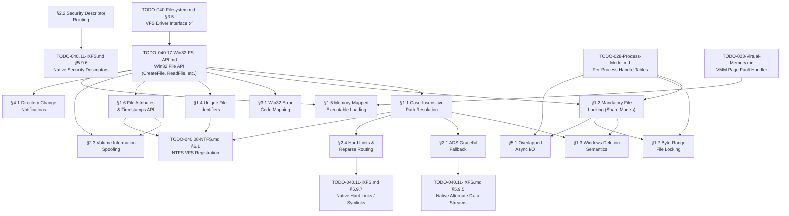

# 040.07-VFS — Virtual File System Win32 Compatibility Layer

> **Goal:** Make the VFS and handle layer enforce Win32 filesystem semantics so that
> Win32 applications work correctly regardless of the underlying filesystem (IXFS,
> FAT32, NTFS, etc.). This file covers the "compatibility shim" between the Win32
> file API (`TODO-040.17-Win32-FS-API.md`) and application expectations — including
> case-insensitive lookup, mandatory locking, deletion semantics, memory-mapped I/O,
> directory change notifications, I/O completion ports, and filesystem filter drivers.

---

## TODO Completion Roadmap (Cross-File)

> [!IMPORTANT]
> **Six TODO files and two future subsystems** feed into the VFS compatibility
> layer. They have cross-dependencies that dictate implementation order. This
> roadmap shows the correct sequence — completing items out of order will
> cause rework.
>
> → XREF: `TODO-040.17-Win32-FS-API.md` — Win32 File API (moved from §3.6)

### Dependency Graph



### Phase-by-Phase Implementation Order

| ⭐ | Phase  | TODO File / Section                          | Sections                           | What It Delivers                                     | Depends On                          | Status |
| -- | :----: | -------------------------------------------- | ---------------------------------- | ---------------------------------------------------- | ----------------------------------- | :----: |
| 💎 | **0**  | `TODO-040-Filesystem.md`                     | §3.5 VFS Driver Interface          | `vfs_ops` callbacks — foundation for all FS drivers   | —                                   |   ✅   |
| 💎 | **0**  | `TODO-040.17-Win32-FS-API.md`                | Win32 File API                     | `CreateFile`, `ReadFile`, `WriteFile`, `CloseHandle`  | Phase 0 (§3.5)                      |   ⬜   |
| 💎 | **1**  | `TODO-040.07-VFS.md`                         | §1.1 Case-Insensitive Lookup       | Win32 apps find files regardless of capitalization    | Phase 0 (Win32 API)                 |   ⬜   |
| 💎 | **1**  | `TODO-040.07-VFS.md`                         | §1.2 Mandatory File Locking        | Share mode enforcement — prevents DB corruption       | Phase 0 (Win32 API)                 |   ⬜   |
| 💎 | **1**  | `TODO-040.07-VFS.md`                         | §3.1 Error Code Mapping            | Correct `GetLastError()` codes for all file ops       | Phase 0 (Win32 API)                 |   ⬜   |
| 💎 | **2**  | `TODO-040.07-VFS.md`                         | §1.3 Deletion Semantics            | `DeleteFile` defers until last handle closes          | Phase 1 (§1.1 + §1.2)               |   ⬜   |
| 💎 | **2**  | `TODO-040.07-VFS.md`                         | §1.4 Unique File Identifiers       | `GetFileInformationByHandle` returns `nFileIndex`     | Phase 0 (Win32 API)                 |   ⬜   |
| 💎 | **2**  | `TODO-040.07-VFS.md`                         | §1.6 File Attributes & Timestamps  | `GetFileAttributes` (fast exist check), `GetFileTime` | Phase 0 (Win32 API)                 |   ⬜   |
| 💎 | **3**  | `TODO-040.07-VFS.md`                         | §2.3 Volume Information Spoofing   | `GetVolumeInformation` + `GetDiskFreeSpace`           | Phase 2 (§1.6)                      |   ⬜   |
| 💎 | **3**  | `TODO-040.07-VFS.md`                         | §2.1 ADS Graceful Fallback         | `:Zone.Identifier` handled without crash              | Phase 1 (§1.1)                      |   ⬜   |
| 💎 | **3**  | `TODO-040.07-VFS.md`                         | §2.2 ACL Routing (Stubs + Native)  | `Set/GetFileSecurity` stubs on FAT32, real on IXFS    | Phase 0 (Win32 API)                 |   ⬜   |
| 💎 | **4**  | `TODO-040.07-VFS.md`                         | §2.4 Hard Links & Reparse Routing  | `CreateHardLink`, reparse points — WinSxS compat      | Phase 1 (§1.1)                      |   ⬜   |
| ⭐ | **4**  | `TODO-040.07-VFS.md`                         | §1.7 Byte-Range Locking            | `LockFile`/`UnlockFile` with **deadlock detection**   | Phase 1 (§1.2) + Process Model      |   ⬜   |
| 💎 | **5**  | `TODO-040.07-VFS.md`                         | §1.5 Memory-Mapped Files           | `CreateFileMapping` + `MapViewOfFile` (demand paging) | Phase 0 (Win32 API) + VMM           |   ⬜   |
| ⭐ | **5**  | `TODO-040.07-VFS.md`                         | §4.1 Directory Change Notifications | `ReadDirectoryChangesW` — **recursive + cross-FS**   | Phase 0 (Win32 API)                 |   ⬜   |
| 💎 | **6**  | `TODO-040.07-VFS.md`                         | §5.1 Overlapped Async I/O          | `OVERLAPPED` struct for non-blocking file I/O         | Phase 1 (§1.2) + Process Model      |   ⬜   |
| 💎 | **6**  | `TODO-040.11-IXFS.md`                        | §5.9.5 Native ADS                  | Real stream storage on IXFS                           | Phase 3 (§2.1)                      |   ⬜   |
| 💎 | **6**  | `TODO-040.11-IXFS.md`                        | §5.9.6 Native ACLs                 | Real security descriptors on IXFS                     | Phase 3 (§2.2)                      |   ⬜   |
| 💎 | **6**  | `TODO-040.11-IXFS.md`                        | §5.9.7 Native Hard Links           | Real hard links on IXFS                               | Phase 4 (§2.4)                      |   ⬜   |
| 💎 | **7**  | `TODO-040.07-VFS.md`                         | §6.1 VFS Concurrency Control       | Reader-writer lock for thread-safe VFS                | Phase 0 (Win32 API)                 |   ⬜   |
| ⭐ | **7**  | `TODO-040.07-VFS.md`                         | §6.2 I/O Completion Ports          | Unified IOCP for all handle types                     | Phase 6 (§5.1)                      |   ⬜   |
| ⭐ | **7**  | `TODO-040.07-VFS.md`                         | §6.3 FS Filter Drivers             | Simple kernel-mode filter API                         | Phase 0 (Win32 API)                 |   ⬜   |
| 💎 | **8**  | `TODO-040.07-VFS.md`                         | §6.4 Disk Quotas                   | Per-user storage limits at VFS level                  | Phase 0 (Win32 API)                 |   ⬜   |
| ⭐ | **8**  | `TODO-040.07-VFS.md`                         | §6.5 Symlink Loop Detection        | Configurable depth + offending link identification    | Phase 0 (Win32 API)                 |   ⬜   |
| 💎 | **8**  | `TODO-040.07-VFS.md`                         | §6.6 Cross-Drive Operations        | Transparent cross-drive `MoveFile` + `CopyFile`       | Phase 0 (Win32 API)                 |   ⬜   |
| ⭐ | **9**  | `TODO-040.07-VFS.md`                         | §6.7 VFS Tracepoints               | ns-resolution I/O tracepoints for profiling           | Phase 7 (§6.1)                      |   ⬜   |
| ⭐ | **9**  | `TODO-040.07-VFS.md`                         | §6.8 Parallel Directory Operations  | Lock-free concurrent ops in same directory            | Phase 7 (§6.1)                      |   ⬜   |
| ⭐ | **9**  | `TODO-040.07-VFS.md`                         | §6.9 UID/GID Remapped Mounts       | Per-mount UID/GID remapping for containers            | Phase 0 (Win32 API)                 |   ⬜   |
| ⭐ | **10** | `TODO-040.07-VFS.md`                         | §6.10 Filesystem Transactions      | Atomic multi-file operations with rollback            | Phase 7 (§6.1)                      |   ⬜   |
| 💎 | —      | `TODO-040.08-NTFS.md`                        | §6.1 VFS Registration              | NTFS volumes mountable                                | Phase 2 (§1.4 + §1.6) + NTFS §1–5   |   ⬜   |
| 💎 | —      | `TODO-028-Process-Model.md`                  | Per-process handle tables           | Handle isolation between processes                   | Independent                         |   ⬜   |


> [!NOTE]
> **Phases 0–1** are the critical path. Phase 0 (the Win32 File API from
> `TODO-040.17-Win32-FS-API.md`) is the **single biggest prerequisite** —
> nothing in this file can be built without `CreateFile`/`ReadFile`/
> `WriteFile`/`CloseHandle`. Phase 1 delivers the three deal-breakers:
> case-insensitive lookup, share mode locking, and error codes.
>
> **Phases 2–3** add the compatibility shims that prevent app crashes: deletion semantics,
> file IDs, attributes, volume info queries, ADS handling, and ACL stubs.
>
> **Phases 4–5** deliver advanced features: hard links, byte-range locking (with deadlock
> detection ⭐), memory-mapped I/O, and recursive change notifications (⭐).
>
> **Phase 6** upgrades the spoofing stubs to native IXFS implementations and adds async I/O.
>
> `TODO-040.08-NTFS.md §6.1` and `TODO-028-Process-Model.md` are **cross-domain**
> dependencies — they can proceed in parallel but are not part of this VFS roadmap.

> [!TIP]
> **Quick wins (any time after Phase 0):**
> - §3.1 Error Code Mapping is a standalone header file + mapping function — can be
>   implemented in parallel with §1.1 and §1.2.
> - §2.3 Volume Information only depends on §1.6 for timestamps but can return
>   hardcoded filesystem names and flags immediately.
>
> **Critical sequencing:**
> - §1.2 (share modes) **must** come before §1.3 (deletion semantics) — deletion
>   semantics check `FILE_SHARE_DELETE` which is part of the share mode system.
> - §2.1 (ADS) and §2.2 (ACLs) are two-tier: implement the **stub/route layer** in
>   Phases 3, then IXFS native backends in Phase 6. Don't wait for IXFS native
>   support — the stubs alone unblock most Win32 apps.
> - §1.5 (mmap) depends on the VMM page fault handler (`TODO-023`) — this is a
>   **cross-subsystem dependency**. Don't block on it; other phases can proceed.
>
> **Memory rule reminder:** The file lock table (§1.2), range lock list (§1.7),
> and change notification queues (§4.1) should use `kmalloc()` — they're small
> kernel bookkeeping structs. The memory-mapped file buffers (§1.5) must use
> `pmm_alloc_contiguous()` for page-aligned physical memory.

---

## VFS Enhancement Roadmap

> **When & How to Enhance the VFS:** The VFS architecture is well-designed and
> mostly complete at the driver interface level. The `vfs_ops` struct already has
> all 16 callbacks (`open`, `close`, `read`, `write`, `readdir`, `finddir`,
> `create`, `unlink`, `rename`, `stat`, `truncate`, `mkdir`, `rmdir`, `set_attr`,
> `set_times`, `flush`). Both IXFS and FAT32 implement these. The real question
> isn't "when to enhance the VFS" — it's **when to build the Win32 API on top of it.**

### What's Already Done ✅

- `vfs_ops` driver interface — **complete** (16 callbacks)
- `vfs_node`, `vfs_mount()`, `vfs_finddir()`, `vfs_get_drive_root()` — **working**
- FAT32 + IXFS registered as VFS drivers
- Drive letter mounting works

### What's Missing — In Dependency Order

#### 1. Win32-Compatible File API (🔴 P0 — do this NEXT)

> [!IMPORTANT]
> → XREF: `TODO-040.17-Win32-FS-API.md` — Win32 File API (moved from §3.6)

This is the **single most important VFS enhancement**. It replaces the old
`vfs_open()`/`vfs_read()` public wrappers with a proper Win32 handle system:

| Step | Section  | What It Does                                               |
| ---- | -------- | ---------------------------------------------------------- |
| 1st  | Handle   | `HANDLE`, handle-to-vfs_node mapping, type definitions     |
| 2nd  | Open     | `CreateFile`/`CloseHandle` — the native file open            |
| 3rd  | I/O      | `ReadFile`/`WriteFile`/`SetFilePointer` — data I/O           |
| 4th  | Dir      | `FindFirstFile`/`CreateDirectory` — directory enum + create  |
| 5th  | Manage   | `DeleteFile`/`MoveFile`/`CopyFile` — file management         |
| 6th  | Migrate  | Shell & kernel migration — remove old `vfs_*()` wrappers    |

> [!IMPORTANT]
> **Why is this P0?** Everything downstream depends on it — native Win32 apps,
> the shell, the registry, font loading, image loading, cursor loading, log
> flushing, crash dumps. It’s the **foundation of the entire userspace API**.
> See `TODO-040.17-Win32-FS-API.md` for the full implementation breakdown.

#### 2. §6.1 Auto-Mount System (🟠 P1 — do after §3.6)

Real drive letter assignment from detected partitions. Currently you have manual
mounts; this makes it automatic.

#### 3. External FS Drivers (🟠 P1 – 🟢 P3)

These add filesystem support but don't change the VFS itself — they just
implement `vfs_ops`:

| Priority | Filesystem | When |
|----------|-----------|------|
| 🟠 P1 | NTFS Read (§4.1) | After §3.6 — to read Windows partitions |
| 🟡 P2 | ext2/3/4 Read (§4.4) | After NTFS — to read Linux partitions |
| 🟢 P3 | exFAT (§4.6) | USB drives >32 GB |
| 🟢 P3 | ISO 9660/UDF (§4.8-4.9) | CD/DVD media |

#### 4. IXFS Advanced Features (🟡 P2 – 🟢 P3)

These need VFS callback additions but are **additive**, not breaking:

- §5.9.5 Alternate Data Streams → adds `vfs_ops.open_stream` (parse `:stream` in path)
- §5.9.6 Security Descriptors → adds `vfs_ops.get_security`/`set_security`
- §5.9.7 Hard/Symlinks → adds `vfs_ops.link`/`vfs_ops.symlink`

### Do You Need a VFS Spec Document?

**No** — the VFS is an internal kernel API, not a hardware specification. The
`TODO-040-Filesystem.md` already documents it exhaustively. A spec would just
duplicate what §3.5 and §3.6 already describe. What you *might* want later is a
small `docs/vfs-driver-interface.md` showing how to write a new FS driver (what
callbacks to implement, how to register), but that's best written *after* §3.6
is done and the API is finalized.

### TL;DR — The Critical Path

```
Now:  Win32 File API (P0) ← this IS the VFS enhancement (TODO-040.17)
Next: §6.1 Auto-Mount (P1)
Then: §4.1 NTFS Read (P1)
Then: §5.9.5-9 IXFS advanced features (P2-P3)
```

The VFS layer itself is solid — what's missing is the **user-facing API** built
on top of it. `TODO-040.17-Win32-FS-API.md` is the single biggest piece of
remaining work in the entire filesystem TODO.

---

# Phase 06b — Win32 VFS Compatibility Layer

> **Goal:** Make the VFS and handle layer enforce Win32 filesystem semantics so that
> Win32 applications work correctly regardless of the underlying filesystem (IXFS,
> FAT32, NTFS, etc.). This is the "compatibility shim" between the Win32 file API
> (TODO-040 §3.6) and application expectations.
>
> **Two-phase strategy:**
> 1. **Phase A (this file):** Implement VFS-level compatibility — stub/spoof missing
>    features for FAT32 and other simple filesystems.
> 2. **Phase B (TODO-040 §5.9.5–5.9.9):** Implement features natively in IXFS so
>    the compat layer routes to real implementations on IXFS volumes.
>
> The end goal is that IXFS is a **superset of NTFS features** — ADS, ACLs, hard
> links, compression, xattrs — while the compat layer remains for FAT32/exFAT.

> [!CAUTION]
> **This is the #1 compatibility risk.** Win32 applications assume Windows-specific
> filesystem behaviors that differ from POSIX. Without this layer, apps will crash,
> corrupt data, or fail silently. Treat FAT32 as the minimum baseline — Windows
> itself runs Win32 apps from FAT32 volumes.

> [!IMPORTANT]
> **Dependencies:**
> - `TODO-040.17-Win32-FS-API.md` — Win32 File API (`CreateFile`, `ReadFile`, etc.)
> - `TODO-040-Filesystem.md §3.5` — VFS driver interface (`vfs_ops`)
> - `TODO-028-Process-Model.md` — Per-process handle tables
> - `TODO-040.17-Win32-FS-API.md §1` — Handle table and type definitions

---

## 1. Core Semantics (Deal-Breakers)

> These are **mandatory** for the vast majority of Win32 applications. Without
> these, apps will fail with `ERROR_FILE_NOT_FOUND`, corrupt databases, or crash
> during installation.

### 1.1 Case-Insensitive Path Resolution *(agent)*

**Prompt:** Win32 applications are notoriously sloppy with filename capitalization. An installer might write `SystemData.bin` but later call `CreateFileA("systemdata.BIN")`. Add a case-insensitive lookup mode to the VFS path resolution layer. The filesystem stores names as-written (case-preserving), but `vfs_finddir()` performs case-folded comparison. Implement `towupper_ascii()` for A–Z/a–z folding (no ICU needed — Win32 apps use ASCII names). Add a `VFS_LOOKUP_CASE_INSENSITIVE` flag that `CreateFile` always sets. After completing all items, mark every item as `[x]`, run `bash scripts/build.sh clean`, and commit as `"vfs: case-insensitive path resolution"`. Add notes directly in this TODO section. After implementation, save any gotchas, solutions, and important information to MCP memory (`mcp_memory_create_entities` / `mcp_memory_add_observations`).

- [ ] Implement `vfs_name_compare_ci(a, b)` — case-insensitive ASCII comparison
- [ ] Modify `vfs_finddir()` to accept a `flags` parameter
- [ ] Add `VFS_LOOKUP_CASE_INSENSITIVE` flag (default ON for Win32 API calls)
- [ ] When flag is set: iterate directory entries, compare via `vfs_name_compare_ci()`
- [ ] Return the first match (case-preserving — return the stored name, not the query)
- [ ] `CreateFile` passes `VFS_LOOKUP_CASE_INSENSITIVE` by default
- [ ] Test: create `TestFile.txt`, open via `TESTFILE.TXT` — must succeed
- [ ] Test: create `Hello.dll`, open via `hello.DLL` — must succeed
- [ ] Edge case: two files differing only by case (`readme.txt` vs `README.TXT`) — first-match wins (Windows behavior)
- [ ] Commit: `"vfs: case-insensitive path resolution"`

> [!WARNING]
> **Codebase discovery:** FAT32's `fat32_finddir()` in `fat32_ops.c` **already uses
> `fat32_strcasecmp()`** — it is case-insensitive at the driver level. IXFS's
> `ixfs_finddir()` in `ixfs_ops.c` uses **case-sensitive `ixfs_strcmp()`**. However,
> the VFS-level `walk_path()` in `vfs.c` calls `ops->finddir()` directly — it has
> **no case folding**. The fix must go in `walk_path()` so that all filesystems
> (including future NTFS and ext4) get uniform behavior at the VFS level.

### 1.2 Mandatory File Locking (Share Modes) *(agent)*

**Prompt:** Windows uses **mandatory** file locking via `CreateFile`'s `dwShareMode` parameter. When a process opens a file with `FILE_SHARE_READ` but NOT `FILE_SHARE_WRITE`, any other process attempting to open the same file for writing must receive `ERROR_SHARING_VIOLATION (32)`. This is NOT advisory — the kernel must enforce it. Many applications (SQLite, Office, installers) rely on sharing violations for concurrency control. Add a per-file lock table that tracks open handles and their share modes. On each `CreateFile` call, check compatibility with existing opens. After completing all items, mark every item as `[x]`, run `bash scripts/build.sh clean`, and commit as `"vfs: mandatory file locking (share modes)"`. Add notes directly in this TODO section. After implementation, save any gotchas, solutions, and important information to MCP memory (`mcp_memory_create_entities` / `mcp_memory_add_observations`).

> [!IMPORTANT]
> Without mandatory locking, SQLite databases running on Impossible OS will
> silently corrupt. This is critical for any app that uses file-based concurrency.

- [ ] Define share mode flags: `FILE_SHARE_READ (1)`, `FILE_SHARE_WRITE (2)`, `FILE_SHARE_DELETE (4)`
- [ ] Add `struct file_lock_entry` to track per-file open state:
  - [ ] `vfs_node*` — the file
  - [ ] `uint32_t access` — `GENERIC_READ`, `GENERIC_WRITE`
  - [ ] `uint32_t share_mode` — allowed concurrent access
  - [ ] `uint32_t handle_count` — number of open handles with this access/share combo
- [ ] Maintain a global or per-filesystem lock table (hash map by file ID)
- [ ] On `CreateFile`: check all existing opens for compatibility:
  - [ ] If any existing handle forbids this access → return `INVALID_HANDLE_VALUE`, `SetLastError(ERROR_SHARING_VIOLATION)`
  - [ ] If compatible → add entry, proceed
- [ ] On `CloseHandle`: remove entry, allow pending opens if now compatible
- [ ] Share mode compatibility matrix:
  ```
  Existing: SHARE_READ only   → New GENERIC_WRITE → DENIED
  Existing: SHARE_WRITE only  → New GENERIC_READ  → DENIED
  Existing: SHARE_READ|WRITE  → New GENERIC_READ  → OK
  Existing: 0 (exclusive)     → Any new open      → DENIED
  ```
- [ ] Test: open file exclusively, try to open again → `ERROR_SHARING_VIOLATION`
- [ ] Test: open file with `FILE_SHARE_READ`, open again for reading → OK
- [ ] Test: close first handle, re-open for writing → OK
- [ ] Commit: `"vfs: mandatory file locking (share modes)"`

### 1.3 Windows Deletion Semantics *(agent)*

**Prompt:** In traditional Windows, you **cannot delete a file that is currently open.** Even when opened with `FILE_SHARE_DELETE`, the file is only marked as "pending deletion" and is actually removed from the directory when the last handle closes. If your VFS behaves like Unix (immediate unlink of open files), installers that try to overwrite/delete files in use will break. Add a `pending_delete` flag to `vfs_node`, check open handle count before unlinking, and defer the actual directory entry removal to `CloseHandle`. After completing all items, mark every item as `[x]`, run `bash scripts/build.sh clean`, and commit as `"vfs: Windows deletion semantics"`. Add notes directly in this TODO section. After implementation, save any gotchas, solutions, and important information to MCP memory (`mcp_memory_create_entities` / `mcp_memory_add_observations`).

- [ ] Add `pending_delete` flag to `vfs_node` (or handle entry)
- [ ] `DeleteFile()` behavior:
  - [ ] If file has open handles without `FILE_SHARE_DELETE` → `ERROR_SHARING_VIOLATION`
  - [ ] If file has open handles WITH `FILE_SHARE_DELETE` → mark `pending_delete = true`
  - [ ] If file has NO open handles → immediate delete via `ops->unlink()`
- [ ] `CloseHandle()` behavior:
  - [ ] If `pending_delete` is set AND this is the last handle → now call `ops->unlink()`
  - [ ] Reset `pending_delete` flag
- [ ] `CreateFile()` behavior:
  - [ ] If file is pending deletion → `ERROR_ACCESS_DENIED`
- [ ] `FindFirstFile()` / `FindNextFile()`:
  - [ ] Files marked `pending_delete` should still appear in directory listings (Windows behavior)
- [ ] Test: open file, try `DeleteFile` without `FILE_SHARE_DELETE` → `ERROR_SHARING_VIOLATION`
- [ ] Test: open file with `FILE_SHARE_DELETE`, `DeleteFile` → success (pending), close → actually deleted
- [ ] Commit: `"vfs: Windows deletion semantics"`

### 1.4 Unique File Identifiers *(agent)*

**Prompt:** Win32 applications use `GetFileInformationByHandle()` to retrieve `nFileIndexHigh` and `nFileIndexLow` — a 64-bit unique file ID (analogous to a Unix inode number). Programs use this to check if two different file handles (possibly opened via different paths, symlinks, or hard links) point to the same physical file. Your VFS nodes must generate consistent, unique IDs. For IXFS this maps directly to the inode number. For FAT32, synthesize an ID from the directory cluster + entry index (since FAT32 has no inodes). After completing all items, mark every item as `[x]`, run `bash scripts/build.sh clean`, and commit as `"vfs: unique file identifiers"`. Add notes directly in this TODO section. After implementation, save any gotchas, solutions, and important information to MCP memory (`mcp_memory_create_entities` / `mcp_memory_add_observations`).

- [ ] Add `uint64_t file_id` field to `vfs_node`

> [!WARNING]
> **Codebase discovery:** `vfs_node.inode` is currently `uint32_t` (line 81 of
> `vfs.h`). This is insufficient for NTFS MFT record numbers (48-bit) and
> synthesized FAT32 IDs (`dir_cluster << 32 | offset`). Either widen `inode`
> to `uint64_t` or add a separate `file_id` field. Widening `inode` is simpler
> but changes the `vfs_dirent` struct too.
- [ ] IXFS: set `file_id = inode_number` (already unique)
- [ ] FAT32: synthesize `file_id = (dir_cluster << 32) | entry_offset_in_dir`
- [ ] NTFS: set `file_id = MFT_record_number`
- [ ] Implement `GetFileInformationByHandle(hFile, lpFileInformation)`:
  - [ ] Define `BY_HANDLE_FILE_INFORMATION` struct
  - [ ] Populate: `nFileIndexHigh`, `nFileIndexLow`, `dwFileAttributes`, `nFileSizeHigh`, `nFileSizeLow`, `ftCreationTime`, `ftLastWriteTime`, `nNumberOfLinks`
- [ ] Test: open same file via two different handles → same `nFileIndex`
- [ ] Test: open two different files → different `nFileIndex`
- [ ] Commit: `"vfs: unique file identifiers"`

### 1.5 Memory-Mapped Executable Loading *(agent)*

**Prompt:** The Windows PE Loader does NOT simply `ReadFile()` an `.exe` into memory. It memory-maps the executable and its DLLs using `CreateFileMapping()` and `MapViewOfFile()`. Page faults trigger demand-paging from disk — only the pages actually executed or accessed are read. Your VFS must integrate tightly with the VMM to handle file-backed page faults, streaming 4 KB pages from disk on demand. This is critical for large executables — without it, loading a 50 MB application requires 50 MB of upfront I/O. After completing all items, mark every item as `[x]`, run `bash scripts/build.sh clean`, and commit as `"vfs: memory-mapped file I/O"`. Add notes directly in this TODO section. After implementation, save any gotchas, solutions, and important information to MCP memory (`mcp_memory_create_entities` / `mcp_memory_add_observations`).

> [!IMPORTANT]
> → XREF: `TODO-023-Virtual-Memory.md` — VMM page fault handler
> → XREF: `TODO-028-Process-Model.md` — PE loader
> → XREF: `TODO-040.17-Win32-FS-API.md` — ReadFile (used as fallback)

- [ ] Implement `CreateFileMapping(hFile, ..., dwProtection, ...)` → create file mapping object
- [ ] Implement `MapViewOfFile(hMapping, dwDesiredAccess, offset, size)`:
  - [ ] Calculate: file offset → virtual address range
  - [ ] Mark pages as NOT PRESENT in page table (demand-paging)
  - [ ] Store mapping metadata: `{ vfs_node*, file_offset, length, prot }`
- [ ] Page fault handler integration:
  - [ ] On #PF for mapped range → call `ops->read(node, page_offset, 4096, page_buffer)`
  - [ ] Map physical page, mark PRESENT, return from fault
- [ ] Implement `UnmapViewOfFile(lpBaseAddress)` — unmap pages, flush dirty pages
- [ ] Implement `FlushViewOfFile(lpBaseAddress, dwSize)` — write dirty pages back to file
- [ ] Handle shared vs private mappings (`FILE_MAP_COPY` = copy-on-write)
- [ ] Test: map a file, read from mapped address → triggers page fault → reads from disk
- [ ] Test: map executable, execute code from mapped page → demand-loads
- [ ] Commit: `"vfs: memory-mapped file I/O"`

### 1.6 File Attributes & Timestamps API *(agent)*

**Prompt:** Win32 applications use `GetFileAttributes()` as the fastest file-existence check — it's faster than `CreateFile` because it doesn't open a handle. Many apps call it thousands of times during startup (checking DLL existence, config files, etc.). Implement the full attribute get/set API and the companion timestamp manipulation API. The attribute flags map directly to FAT32/NTFS directory entry attributes. After completing all items, mark every item as `[x]`, run `bash scripts/build.sh clean`, and commit as `"vfs: file attributes and timestamps API"`. Add notes directly in this TODO section. After implementation, save any gotchas, solutions, and important information to MCP memory (`mcp_memory_create_entities` / `mcp_memory_add_observations`).

- [ ] Implement `GetFileAttributes(lpFileName)` → `DWORD` attribute bitmask:
  - [ ] Resolve path via `vfs_finddir()` (no handle needed)
  - [ ] Map `vfs_node` flags to Win32 attributes:
    - [ ] `FILE_ATTRIBUTE_READONLY (0x01)` — from FS read-only flag
    - [ ] `FILE_ATTRIBUTE_HIDDEN (0x02)` — from FS hidden flag  
    - [ ] `FILE_ATTRIBUTE_SYSTEM (0x04)` — from FS system flag
    - [ ] `FILE_ATTRIBUTE_DIRECTORY (0x10)` — from `vfs_node->flags & VFS_DIRECTORY`
    - [ ] `FILE_ATTRIBUTE_ARCHIVE (0x20)` — from FS archive flag
    - [ ] `FILE_ATTRIBUTE_NORMAL (0x80)` — only if no other attributes set
  - [ ] On failure: return `INVALID_FILE_ATTRIBUTES`, set `ERROR_FILE_NOT_FOUND`
- [ ] Implement `SetFileAttributes(lpFileName, dwFileAttributes)`:
  - [ ] Route to `ops->set_attr(node, attributes)`
  - [ ] FAT32: map to `DIR_Attr` byte. IXFS: map to inode flags
- [ ] Implement `GetFileTime(hFile, lpCreationTime, lpLastAccessTime, lpLastWriteTime)`:
  - [ ] Read timestamps from `vfs_node` via open handle
  - [ ] Convert to `FILETIME` (100ns intervals since 1601-01-01)
- [ ] Implement `SetFileTime(hFile, lpCreationTime, lpLastAccessTime, lpLastWriteTime)`:
  - [ ] Route to `ops->set_times(node, create, access, modify)`
  - [ ] Pass `NULL` for any timestamp that shouldn't be changed
- [ ] Implement `GetFileAttributesEx(lpFileName, fInfoLevelId, lpFileInformation)`:
  - [ ] Returns `WIN32_FILE_ATTRIBUTE_DATA`: attributes, timestamps, and file size
  - [ ] Faster than `GetFileInformationByHandle` — no handle required
- [ ] Test: `GetFileAttributes("C:\\nonexistent")` → `INVALID_FILE_ATTRIBUTES`
- [ ] Test: `SetFileAttributes("test.txt", FILE_ATTRIBUTE_READONLY)` → write blocked
- [ ] Commit: `"vfs: file attributes and timestamps API"`

### 1.7 Byte-Range File Locking *(agent)*

**Prompt:** Beyond share-mode locking (§1.2), Windows supports byte-range locks via `LockFile()` / `UnlockFile()`. Databases (SQLite, Access, Jet) use these to lock specific byte ranges within a file for record-level concurrency. A process can lock bytes 1024–2048 of a file while another process locks bytes 4096–8192 — both succeed. Overlapping lock requests from different handles are denied. Implement a per-file range-lock list. After completing all items, mark every item as `[x]`, run `bash scripts/build.sh clean`, and commit as `"vfs: byte-range file locking"`. Add notes directly in this TODO section. After implementation, save any gotchas, solutions, and important information to MCP memory (`mcp_memory_create_entities` / `mcp_memory_add_observations`).

> [!TIP]
> **Competitive Edge:** Neither Windows nor Linux detects deadlocks in byte-range locks.
> Windows returns `ERROR_LOCK_VIOLATION` immediately (no block). Linux `fcntl` locks can
> deadlock. Impossible OS can optionally detect potential deadlocks by tracking which
> process holds which ranges and which processes are waiting.

- [ ] Define `struct file_range_lock`: `{ handle, offset, length, exclusive }`
- [ ] Maintain per-file range-lock list (sorted by offset for fast overlap checks)
- [ ] Implement `LockFile(hFile, dwFileOffsetLow, dwFileOffsetHigh, nNumberOfBytesLow, nNumberOfBytesHigh)`:
  - [ ] Check for overlap with existing locks from OTHER handles
  - [ ] If overlap found → return `FALSE`, `SetLastError(ERROR_LOCK_VIOLATION)`
  - [ ] If no overlap → add range lock, return `TRUE`
- [ ] Implement `LockFileEx(hFile, dwFlags, dwReserved, nNumberOfBytesLow, nNumberOfBytesHigh, lpOverlapped)`:
  - [ ] `LOCKFILE_EXCLUSIVE_LOCK` — exclusive (read+write blocked)
  - [ ] Without flag — shared lock (other shared locks OK, exclusive blocked)
  - [ ] `LOCKFILE_FAIL_IMMEDIATELY` — return immediately instead of blocking
- [ ] Implement `UnlockFile()` / `UnlockFileEx()` — remove matching range lock
- [ ] On `CloseHandle`: release ALL range locks held by this handle
- [ ] Optional deadlock detection: track (process, waiting_for_range) graph
  - [ ] If cycle detected → return `ERROR_POSSIBLE_DEADLOCK` (Win32 code 1131)
- [ ] Test: lock range 0–100, lock range 200–300 from another handle → both succeed
- [ ] Test: lock range 0–100, try to lock range 50–150 from another handle → `ERROR_LOCK_VIOLATION`
- [ ] Commit: `"vfs: byte-range file locking"`

---

## 2. Feature Spoofing (NTFS Compatibility)

> Modern Win32 applications often query NTFS-specific features. Since the underlying
> filesystem may be IXFS or FAT32, the API layer must convincingly return harmless
> fallback values rather than crashing.

### 2.1 Alternate Data Streams (ADS) Handling *(agent)*

**Prompt:** Web browsers use NTFS Alternate Data Streams to append the "Mark of the Web" (`:Zone.Identifier`) to downloaded files. If an app tries to create `file.exe:Zone.Identifier` and the filesystem violently rejects the `:` character, browser downloads will fail. Implement a two-tier strategy: (1) For filesystems without stream support (FAT32, exFAT), silently discard stream data and return success — matching Windows-on-FAT32 behavior. (2) For IXFS, route to native ADS support (TODO-040 §5.9.5) once implemented. After completing all items, mark every item as `[x]`, run `bash scripts/build.sh clean`, and commit as `"vfs: ADS graceful fallback"`. Add notes directly in this TODO section. After implementation, save any gotchas, solutions, and important information to MCP memory (`mcp_memory_create_entities` / `mcp_memory_add_observations`).

> [!NOTE]
> **Long-term:** IXFS will support native ADS (TODO-040 §5.9.5). This section
> implements the VFS-level router that detects `:stream` syntax and dispatches
> to the right handler. Once §5.9.5 is done, IXFS volumes get real streams;
> FAT32 volumes continue using the discard fallback.

- [ ] Detect ADS path syntax: filename contains `:` followed by stream name (e.g., `file.exe:Zone.Identifier`)
- [ ] In `CreateFile`: check if filesystem supports streams via `vfs_ops.stream_open` callback:
  - [ ] If supported (IXFS, NTFS) → route to `ops->stream_open(node, stream_name)`
  - [ ] If NOT supported (FAT32, exFAT) → return a "null" handle that discards writes
  - [ ] `SetLastError(ERROR_SUCCESS)` — do NOT report an error in either case
- [ ] In `ReadFile` on discard-ADS handle: return 0 bytes read (empty stream)
- [ ] In `WriteFile` on discard-ADS handle: accept data, discard, return bytes written = requested
- [ ] In `DeleteFile` with ADS path: route to `ops->stream_delete()` or silently succeed
- [ ] Implement `FindFirstStreamW` / `FindNextStreamW`:
  - [ ] If FS supports streams → route to `ops->stream_enumerate()`
  - [ ] If not → return only `::$DATA` (the default unnamed stream)
  - [ ] Second call returns `ERROR_HANDLE_EOF`
- [ ] Test: `CreateFile("test.exe:Zone.Identifier", GENERIC_WRITE, ...)` → handle returned (not `INVALID_HANDLE_VALUE`)
- [ ] Test: `WriteFile` to ADS handle → reports success, data discarded
- [ ] Commit: `"vfs: ADS graceful fallback"`

### 2.2 Security Descriptor Routing (ACL Stubs + Native) *(agent)*

**Prompt:** Installers (especially MSI packages) call `SetFileSecurity()` to lock down directories with Access Control Lists. Implement a two-tier strategy: (1) For IXFS, route to native security descriptors (TODO-040 §5.9.6) once implemented — IXFS will persist real ACLs. (2) For FAT32/exFAT (no ACL support), silently return `ERROR_SUCCESS` with a dummy permissive descriptor — matching how Windows handles FAT32 volumes. After completing all items, mark every item as `[x]`, run `bash scripts/build.sh clean`, and commit as `"vfs: ACL routing (native + stub fallback)"`. Add notes directly in this TODO section. After implementation, save any gotchas, solutions, and important information to MCP memory (`mcp_memory_create_entities` / `mcp_memory_add_observations`).

> [!NOTE]
> **Long-term:** IXFS will support native ACLs (TODO-040 §5.9.6). This section
> implements the VFS-level router. Once §5.9.6 is done, IXFS volumes persist
> real security descriptors; FAT32 volumes use the permissive stub.

- [ ] Implement `SetFileSecurity(lpFileName, SecurityInformation, pSecurityDescriptor)`:
  - [ ] If filesystem supports ACLs (IXFS, NTFS) → `ops->set_security(node, descriptor)`
  - [ ] If filesystem lacks ACLs (FAT32, exFAT) → silently return `TRUE` (discard)
- [ ] Implement `GetFileSecurity(lpFileName, SecurityInformation, pSecurityDescriptor, nLength, lpnLengthNeeded)`:
  - [ ] If filesystem supports ACLs → `ops->get_security(node)` → real descriptor
  - [ ] If filesystem lacks ACLs → return dummy descriptor:
    - [ ] Owner: `BUILTIN\Administrators` SID
    - [ ] DACL: single ACE granting `GENERIC_ALL` to `Everyone` SID
    - [ ] Set `lpnLengthNeeded` to descriptor size
- [ ] Implement `GetSecurityInfo()` / `SetSecurityInfo()` (same routing strategy)
- [ ] Test: `SetFileSecurity` on IXFS → persisted and retrievable
- [ ] Test: `SetFileSecurity` on FAT32 → returns `TRUE`, no error, descriptor discarded
- [ ] Commit: `"vfs: ACL routing (native + stub fallback)"`

### 2.3 Volume Information Spoofing *(agent)*

**Prompt:** Some DRM wrappers, anti-cheat engines, and enterprise apps call `GetVolumeInformation()` and check `lpFileSystemNameBuffer`. If they see an unknown filesystem name instead of "NTFS" or "FAT32", they may refuse to run. Report accurate filesystem names for known types (IXFS, FAT32, NTFS, exFAT), but set capability flags honestly — leave out `FILE_PERSISTENT_ACLS` if the filesystem doesn't support them, so well-behaved apps can adapt. Also implement `GetDiskFreeSpace()` and `GetDiskFreeSpaceEx()` for capacity queries. After completing all items, mark every item as `[x]`, run `bash scripts/build.sh clean`, and commit as `"vfs: GetVolumeInformation + disk space queries"`. Add notes directly in this TODO section. After implementation, save any gotchas, solutions, and important information to MCP memory (`mcp_memory_create_entities` / `mcp_memory_add_observations`).

- [ ] Implement `GetVolumeInformation(lpRootPathName, lpVolumeNameBuffer, nVolumeNameSize, lpVolumeSerialNumber, lpMaxComponentLength, lpFileSystemFlags, lpFileSystemNameBuffer, nFileSystemNameSize)`:
  - [ ] Set `lpFileSystemNameBuffer`:
    - [ ] IXFS volumes → `"IXFS"` (or optionally `"NTFS"` for maximum compat — configurable)
    - [ ] FAT32 volumes → `"FAT32"`
    - [ ] NTFS volumes → `"NTFS"`
    - [ ] exFAT volumes → `"exFAT"`
  - [ ] Set `lpMaxComponentLength` → `255` (all our filesystems support this)
  - [ ] Set `lpFileSystemFlags`:
    - [ ] `FILE_CASE_PRESERVED_NAMES` — always set
    - [ ] `FILE_UNICODE_ON_DISK` — set for IXFS and NTFS
    - [ ] `FILE_PERSISTENT_ACLS` — IXFS (once §5.9.6 done) and NTFS
    - [ ] `FILE_SUPPORTS_SPARSE_FILES` — IXFS only (if implemented)
  - [ ] Set `lpVolumeSerialNumber` from filesystem metadata
- [ ] Implement `GetDiskFreeSpace(lpRootPathName, lpSectorsPerCluster, lpBytesPerSector, lpNumberOfFreeClusters, lpTotalNumberOfClusters)`
- [ ] Implement `GetDiskFreeSpaceEx(lpDirectoryName, lpFreeBytesAvailableToCaller, lpTotalNumberOfBytes, lpTotalNumberOfFreeBytes)`
- [ ] Test: `GetVolumeInformation("C:\\", ...)` → returns `"IXFS"`, correct flags
- [ ] Test: `GetDiskFreeSpaceEx("C:\\", ...)` → returns realistic values
- [ ] Commit: `"vfs: GetVolumeInformation + disk space queries"`

### 2.4 Hard Links & Reparse Point Routing *(agent)*

**Prompt:** Windows heavily relies on hard links for the WinSxS (Side-by-Side) assembly cache, used to load correct MSVC C++ runtimes. Implement a two-tier strategy: (1) For IXFS, route to native hard link and symlink support (TODO-040 §5.9.7). (2) For FAT32 (no hard link support), return `ERROR_INVALID_FUNCTION` so well-written apps fall back to a file copy. Implement `DeviceIoControl(FSCTL_SET_REPARSE_POINT, ...)` routing — native on IXFS (reparse points as symlinks), stub on FAT32. After completing all items, mark every item as `[x]`, run `bash scripts/build.sh clean`, and commit as `"vfs: hard links + reparse point routing"`. Add notes directly in this TODO section. After implementation, save any gotchas, solutions, and important information to MCP memory (`mcp_memory_create_entities` / `mcp_memory_add_observations`).

> [!NOTE]
> **Long-term:** IXFS supports native hard links and symlinks (TODO-040 §5.9.7).
> This section routes `CreateHardLink` and reparse point operations to the right
> handler. FAT32 returns `ERROR_INVALID_FUNCTION`.

- [ ] Implement `CreateHardLink(lpFileName, lpExistingFileName, lpSecurityAttributes)`:
  - [ ] IXFS: route to `ops->link(dir, name, target_inode)` (native §5.9.7)
  - [ ] FAT32: return `FALSE`, `SetLastError(ERROR_INVALID_FUNCTION)`
  - [ ] NTFS: create new filename attribute in MFT entry, increment link count
- [ ] Implement `CreateSymbolicLink(lpSymlinkName, lpTargetName, dwFlags)`:
  - [ ] IXFS: route to `ops->symlink(dir, name, target_path)` (native §5.9.7)
  - [ ] FAT32: return `FALSE`, `SetLastError(ERROR_INVALID_FUNCTION)`
- [ ] Update `GetFileInformationByHandle` to return `nNumberOfLinks` from inode
- [ ] Implement `DeleteFile` for hard-linked files: decrement `nlink`, only free data when `nlink == 0`
- [ ] Implement `DeviceIoControl(FSCTL_SET_REPARSE_POINT)`:  
  - [ ] IXFS: route to symlink creation
  - [ ] FAT32: return `ERROR_INVALID_FUNCTION`
- [ ] Implement `DeviceIoControl(FSCTL_GET_REPARSE_POINT)`:  
  - [ ] IXFS: read symlink target
  - [ ] FAT32: return `ERROR_NOT_A_REPARSE_POINT`
- [ ] Test: create hard link on IXFS → both paths reference same data
- [ ] Test: delete one link → other still accessible, data intact
- [ ] Test: delete last link → data freed
- [ ] Commit: `"vfs: hard links + reparse point stubs"`

---

## 3. Win32 Error Code Precision

> Win32 applications heavily rely on `GetLastError()` return values. Returning the
> wrong error code causes apps to take incorrect code paths.

### 3.1 Error Code Mapping Table *(agent)*

**Prompt:** Create a comprehensive mapping from internal VFS/filesystem error codes to exact Win32 error codes. Applications check specific error values to decide behavior — returning `ERROR_ACCESS_DENIED (5)` when `ERROR_SHARING_VIOLATION (32)` is the correct error will cause apps to fail in unexpected ways. Define all mappings in a central `win32_errors.h` and ensure every `SetLastError()` call in the file API uses the correct code. After completing all items, mark every item as `[x]`, run `bash scripts/build.sh clean`, and commit as `"vfs: precise Win32 error code mapping"`. Add notes directly in this TODO section. After implementation, save any gotchas, solutions, and important information to MCP memory (`mcp_memory_create_entities` / `mcp_memory_add_observations`).

- [ ] Create `include/kernel/fs/win32_errors.h` with all error code constants:
  ```c
  #define ERROR_SUCCESS                 0
  #define ERROR_FILE_NOT_FOUND          2
  #define ERROR_PATH_NOT_FOUND          3
  #define ERROR_ACCESS_DENIED           5
  #define ERROR_INVALID_HANDLE          6
  #define ERROR_NOT_ENOUGH_MEMORY      14
  #define ERROR_WRITE_PROTECT          19
  #define ERROR_SHARING_VIOLATION      32
  #define ERROR_LOCK_VIOLATION         33
  #define ERROR_HANDLE_EOF             38
  #define ERROR_NOT_SUPPORTED          50
  #define ERROR_FILE_EXISTS            80
  #define ERROR_INVALID_PARAMETER      87
  #define ERROR_DISK_FULL             112
  #define ERROR_INVALID_NAME          123
  #define ERROR_DIR_NOT_EMPTY         145
  #define ERROR_ALREADY_EXISTS        183
  #define ERROR_NO_MORE_FILES         259  /* FindNextFile end */
  #define ERROR_INVALID_FUNCTION        1
  #define ERROR_NOT_A_REPARSE_POINT  4390
  ```
- [ ] Implement `vfs_error_to_win32(int vfs_err)` — central mapping function
- [ ] Audit all `CreateFile`, `ReadFile`, `WriteFile`, `DeleteFile`, `MoveFile` paths for correct error codes
- [ ] Ensure `ERROR_SHARING_VIOLATION` (not `ERROR_ACCESS_DENIED`) for lock conflicts
- [ ] Ensure `ERROR_FILE_EXISTS` (not `ERROR_ALREADY_EXISTS`) for `CREATE_NEW` on existing file
- [ ] Ensure `ERROR_DIR_NOT_EMPTY` for `RemoveDirectory` on non-empty directory
- [ ] Test: specific error code assertions for each failure mode
- [ ] Commit: `"vfs: precise Win32 error code mapping"`

---

## 4. File Change Notifications (🚀 Impossible OS Feature)

> [!TIP]
> **Competitive Edge:** Windows has `ReadDirectoryChangesW` but it's per-directory and
> misses events during buffer overflow. Linux has `inotify` but it doesn't work recursively
> without manually adding watches to every subdirectory. Impossible OS can implement a
> unified, recursive, cross-filesystem notification system with guaranteed delivery.

### 4.1 Directory Change Notifications *(agent)*

**Prompt:** File managers, IDEs, build systems, and desktop search all need to know when files change. Windows provides `FindFirstChangeNotification()` for simple signaling and `ReadDirectoryChangesW()` for detailed event streams. Implement both: a VFS-level notification system that fires events (create, delete, rename, modify, attribute change) when any file operation mutates a directory tree. The VFS layer itself generates events — individual filesystem drivers don't need to do anything special. After completing all items, mark every item as `[x]`, run `bash scripts/build.sh clean`, and commit as `"vfs: file change notifications"`. Add notes directly in this TODO section. After implementation, save any gotchas, solutions, and important information to MCP memory (`mcp_memory_create_entities` / `mcp_memory_add_observations`).

- [ ] Define notification event types:
  - [ ] `FILE_NOTIFY_CHANGE_FILE_NAME (0x01)` — file created/deleted/renamed
  - [ ] `FILE_NOTIFY_CHANGE_DIR_NAME (0x02)` — directory created/deleted/renamed
  - [ ] `FILE_NOTIFY_CHANGE_ATTRIBUTES (0x04)` — attribute changes
  - [ ] `FILE_NOTIFY_CHANGE_SIZE (0x08)` — file size changed
  - [ ] `FILE_NOTIFY_CHANGE_LAST_WRITE (0x10)` — timestamp changed
- [ ] Implement notification queue: per-watch ring buffer of `FILE_NOTIFY_INFORMATION` structs
- [ ] Implement `FindFirstChangeNotification(lpPathName, bWatchSubtree, dwNotifyFilter)` → `HANDLE`:
  - [ ] Register watch on directory node
  - [ ] If `bWatchSubtree` — watch recursively (all descendants)
  - [ ] Return wait handle that signals when matching event occurs
- [ ] Implement `FindNextChangeNotification(hChangeHandle)` — reset for next event
- [ ] Implement `FindCloseChangeNotification(hChangeHandle)` — release watch
- [ ] Implement `ReadDirectoryChangesW(hDirectory, lpBuffer, nBufferLength, bWatchSubtree, dwNotifyFilter, lpBytesReturned, lpOverlapped, lpCompletionRoutine)`:
  - [ ] Fill `FILE_NOTIFY_INFORMATION` structs with: action, filename, next offset
  - [ ] Actions: `FILE_ACTION_ADDED`, `REMOVED`, `MODIFIED`, `RENAMED_OLD_NAME`, `RENAMED_NEW_NAME`
  - [ ] Support both synchronous and overlapped (async) modes
- [ ] VFS event injection points:
  - [ ] `vfs_create()` / `ops->create()` → `FILE_ACTION_ADDED`
  - [ ] `vfs_unlink()` / `ops->unlink()` → `FILE_ACTION_REMOVED`
  - [ ] `vfs_rename()` / `ops->rename()` → `RENAMED_OLD_NAME` + `RENAMED_NEW_NAME`
  - [ ] `vfs_write()` / `ops->write()` → `FILE_ACTION_MODIFIED` (debounced)
- [ ] Test: create watch, create file in watched dir → notification fires
- [ ] Test: recursive watch, create file in subdirectory → notification fires
- [ ] Commit: `"vfs: file change notifications"`

---

## 5. Asynchronous File I/O

### 5.1 Overlapped I/O Support *(agent)*

**Prompt:** High-performance Windows applications use overlapped (asynchronous) I/O to avoid blocking threads during disk reads/writes. `ReadFile()` and `WriteFile()` accept an `OVERLAPPED` struct containing a file offset and an event handle. When called with `OVERLAPPED`, the call returns immediately and signals the event when the I/O completes. This is critical for database engines, web servers, and any app doing concurrent I/O. Implement an I/O request queue that dispatches reads/writes to the VFS on a kernel worker thread and signals completion. After completing all items, mark every item as `[x]`, run `bash scripts/build.sh clean`, and commit as `"vfs: overlapped async file I/O"`. Add notes directly in this TODO section. After implementation, save any gotchas, solutions, and important information to MCP memory (`mcp_memory_create_entities` / `mcp_memory_add_observations`).

- [ ] Define `OVERLAPPED` struct:
  ```c
  typedef struct {
      uint32_t Internal;       // status
      uint32_t InternalHigh;   // bytes transferred
      uint64_t Offset;         // file offset
      HANDLE   hEvent;         // completion event
  } OVERLAPPED;
  ```
- [ ] Modify `ReadFile` / `WriteFile`:
  - [ ] If `lpOverlapped != NULL` → queue I/O request, return immediately
  - [ ] If `lpOverlapped == NULL` → synchronous (existing behavior)
- [ ] Implement I/O request queue:
  - [ ] `struct io_request`: `{ handle, buffer, size, offset, overlapped, type(read/write) }`
  - [ ] Kernel worker thread dequeues and executes via `ops->read()` / `ops->write()`
  - [ ] On completion: set `Internal = STATUS_SUCCESS`, `InternalHigh = bytes`, signal `hEvent`
- [ ] Implement `GetOverlappedResult(hFile, lpOverlapped, lpNumberOfBytesTransferred, bWait)`:
  - [ ] If `bWait` → wait on `hEvent` until complete
  - [ ] Return bytes transferred from `InternalHigh`
- [ ] Implement `CancelIo(hFile)` — cancel all pending I/O for this handle
- [ ] Test: start async read, do other work, then `GetOverlappedResult` → data available
- [ ] Commit: `"vfs: overlapped async file I/O"`

---

## Priority Order

| ⭐ | Priority | Section                              | Description                                  | Rationale                                                          |
| -- | -------- | ------------------------------------ | -------------------------------------------- | ------------------------------------------------------------------ |
| 💎 | 🔴 P0    | 1.1 Case-insensitive lookup          | Mandatory for nearly all Win32 apps          | Without this, most apps fail with `FILE_NOT_FOUND`                 |
| 💎 | 🔴 P0    | 1.2 Mandatory file locking           | Database corruption prevention               | SQLite, Office, installers all depend on this                      |
| 💎 | 🔴 P0    | 3.1 Error code mapping               | Correct app behavior on errors               | Wrong error codes → wrong app code paths                           |
| 💎 | 🔴 P0    | 6.1 VFS concurrency control          | Thread-safe VFS operations                   | VFS has no locks — concurrent I/O causes data corruption           |
| 💎 | 🟠 P1    | 1.3 Deletion semantics               | Installer compatibility                      | Installers overwrite/delete files in use                           |
| 💎 | 🟠 P1    | 1.4 Unique file IDs                  | Application identity checks                  | Used by many apps to detect same-file                              |
| 💎 | 🟠 P1    | 1.6 File attributes & timestamps     | Fastest file-existence check                 | `GetFileAttributes` called thousands of times                      |
| 💎 | 🟠 P1    | 2.3 Volume information               | App compatibility queries                    | Some apps refuse to run on unknown FS                              |
| 💎 | 🟡 P2    | 1.5 Memory-mapped files              | PE loader demand paging                      | Performance-critical for large executables                         |
| ⭐ | 🟡 P2    | 1.7 Byte-range locking               | Record-level DB concurrency                  | SQLite, Access use byte-range locks + deadlock detect              |
| 💎 | 🟡 P2    | 2.1 ADS handling                     | Browser download compat                      | Zone.Identifier must not crash                                     |
| 💎 | 🟡 P2    | 2.2 ACL stubs                        | Installer compat                             | MSI installers set permissions                                     |
| ⭐ | 🟡 P2    | 4.1 Change notifications             | File manager / IDE compat                    | **Recursive + cross-FS** — Linux inotify can't do recursive       |
| 💎 | 🟢 P3    | 2.4 Hard links / reparse             | WinSxS / MSVC runtime compat                | Needed when running VC++ redistributable apps                      |
| 💎 | 🟢 P3    | 5.1 Overlapped I/O                   | High-perf app compat                         | Database engines, web servers need async I/O                       |
| ⭐ | 🟢 P3    | 6.2 I/O Completion Ports             | Scalable async I/O for servers               | **Beats Linux epoll** — unified file + socket + pipe completion    |
| ⭐ | 🟢 P3    | 6.3 FS filter drivers                | AV, encryption, auditing integration         | **Beats both** — minifilter API simpler than Linux FUSE/LSM        |
| 💎 | 🔵 P4    | 6.4 Disk quotas                      | Per-user storage limits                      | Enterprise deployments need storage governance                     |
| ⭐ | 🔵 P4    | 6.5 Symlink loop detection           | Safe recursive path resolution               | **Beats both** — configurable max depth + clear error reporting    |
| 💎 | 🔵 P4    | 6.6 Cross-drive operations           | Move/copy files across drive letters         | Current `vfs_rename()` is same-drive only                          |
| ⭐ | 🔵 P4    | 6.7 VFS tracepoints                  | ns-resolution I/O profiling                  | **Beats both** — user-facing latency histograms in GUI             |
| ⭐ | 🔵 P4    | 6.8 Parallel directory ops           | Concurrent creates/deletes in same dir       | **Beats Linux** — Linux serializes same-directory ops              |
| ⭐ | 🔵 P4    | 6.9 UID/GID remapped mounts          | Per-mount UID remapping for containers       | **Beats Windows** — Windows has no UID concept; simpler than Linux |
| ⭐ | 🔵 P4    | 6.10 Filesystem transactions         | Atomic multi-file operations with rollback   | **Beats both** — Windows deprecated TxF; Linux never had it        |

> [!NOTE]
> ⭐ = Feature where Impossible OS can be **superior** to both Windows and Linux.

---

## 6. Advanced VFS Features (🚀 Impossible OS Differentiators)

### 6.1 VFS Concurrency Control *(agent)*

**Prompt:** The VFS layer currently has **zero concurrency control** — `walk_path()`, `vfs_open()`, `vfs_close()`, and `vfs_create()` have no locking. While individual FS drivers (FAT32, IXFS) have per-volume spinlocks, the VFS mount table and path resolution are unprotected. When the process model enables preemptive multitasking, concurrent file operations will corrupt the mount table, race on `ref_count`, and produce double-free bugs. Add a reader-writer lock to the VFS: readers for path resolution and stat, writers for mount/unmount/create/unlink/rename. After completing all items, mark every item as `[x]`, run `bash scripts/build.sh clean`, and commit as `"vfs: reader-writer concurrency control"`. Add notes directly in this TODO section. After implementation, save any gotchas, solutions, and important information to MCP memory (`mcp_memory_create_entities` / `mcp_memory_add_observations`).

> [!CAUTION]
> **Codebase discovery:** `vfs.c` has no `#include` of any lock header. The `mounts[]`
> array and `ref_count` field in `vfs_node` are accessed without any synchronization.
> `boot_parallel_init.md` explicitly notes: *"VFS/FAT32 has no locking. Enabling
> [parallel init] requires adding a `vfs_lock()`/`vfs_unlock()` reader-writer mutex first."*
> This is the **highest-priority infrastructure gap** in the VFS.

- [ ] Add `rwlock_t vfs_lock` global — readers for `walk_path`/`vfs_stat`, writers for `vfs_mount`/`vfs_create`/`vfs_unlink`
- [ ] Wrap `vfs_open()`: read-lock during path walk, upgrade to write-lock for `ref_count++`
- [ ] Wrap `vfs_close()`: write-lock for `ref_count--`
- [ ] Wrap `vfs_mount()` / `vfs_unmount()`: write-lock on `mounts[]`
- [ ] Wrap `vfs_create()` / `vfs_unlink()` / `vfs_rename()`: write-lock
- [ ] Ensure FAT32 per-volume `spinlock_t` nests safely inside the VFS rwlock (lock ordering: VFS → FS)
- [ ] Test: concurrent `vfs_open()` from two kernel threads → no race on `ref_count`
- [ ] Commit: `"vfs: reader-writer concurrency control"`

### 6.2 I/O Completion Ports (🚀 Impossible OS Feature) *(agent)*

**Prompt:** Windows I/O Completion Ports (IOCP) are the most scalable async I/O mechanism on any OS — they enable a fixed pool of threads to service thousands of concurrent file and socket operations. Linux has `epoll` and `io_uring`, but neither unifies file I/O, socket I/O, and pipe I/O into a single completion queue. Implement `CreateIoCompletionPort()`, `GetQueuedCompletionStatus()`, and `PostQueuedCompletionStatus()`. This builds on §5.1 (OVERLAPPED) and is the foundation for high-performance Win32 servers. After completing all items, mark every item as `[x]`, run `bash scripts/build.sh clean`, and commit as `"vfs: I/O completion ports"`. Add notes directly in this TODO section. After implementation, save any gotchas, solutions, and important information to MCP memory (`mcp_memory_create_entities` / `mcp_memory_add_observations`).

> [!TIP]
> **Competitive Edge:** Linux `epoll` cannot watch regular files — only sockets and pipes.
> `io_uring` is powerful but has a completely different API. Impossible OS can provide IOCP
> that works for **all handle types** — a true superset of both Windows IOCP and Linux io_uring.

- [ ] Implement `CreateIoCompletionPort(FileHandle, ExistingCompletionPort, CompletionKey, NumberOfConcurrentThreads)`
- [ ] Implement completion port kernel object: lock-free MPMC queue of `OVERLAPPED_ENTRY`
- [ ] Implement `GetQueuedCompletionStatus(CompletionPort, lpNumberOfBytes, lpCompletionKey, lpOverlapped, dwMilliseconds)`
- [ ] Implement `PostQueuedCompletionStatus()` — manual completion injection for custom events
- [ ] Wire `ReadFile`/`WriteFile` OVERLAPPED completion to post to associated IOCP
- [ ] Thread pool: wake exactly `NumberOfConcurrentThreads` threads from completion queue
- [ ] Test: associate file handle with IOCP, async read → completion received by worker thread
- [ ] Commit: `"vfs: I/O completion ports"`

### 6.3 Filesystem Filter Drivers (🚀 Impossible OS Feature) *(agent)*

**Prompt:** Windows has a mature minifilter framework that allows kernel drivers to intercept and modify file I/O transparently — used by antivirus, encryption (BitLocker), backup, and auditing software. Linux has FUSE and LSM hooks but no unified filter stack. Implement a lightweight filter driver API that sits between the Win32 file API and the VFS `vfs_ops` dispatch. Filters register pre/post callbacks for each operation (create, read, write, close, delete). After completing all items, mark every item as `[x]`, run `bash scripts/build.sh clean`, and commit as `"vfs: filesystem filter driver framework"`. Add notes directly in this TODO section. After implementation, save any gotchas, solutions, and important information to MCP memory (`mcp_memory_create_entities` / `mcp_memory_add_observations`).

> [!TIP]
> **Competitive Edge:** Windows minifilters require WDK and complex altitude management.
> Linux FUSE runs in userspace (slow). Impossible OS can provide a **simple, fast,
> kernel-mode filter API** with < 100 lines of boilerplate per filter.

- [ ] Define `struct vfs_filter_ops`: pre/post callbacks for `open`, `read`, `write`, `close`, `create`, `unlink`
- [ ] Implement `vfs_filter_register(name, altitude, ops)` — insert filter into ordered chain
- [ ] Implement `vfs_filter_unregister(name)` — remove filter from chain
- [ ] Pre-callbacks: can modify arguments or return `VFS_FILTER_BLOCK` to deny the operation
- [ ] Post-callbacks: can inspect and modify results (e.g., encrypt data after read)
- [ ] Example filter: audit log (log all file creates/deletes to `B:\audit.log`)
- [ ] Test: register filter, create file → pre-callback fires, post-callback fires
- [ ] Commit: `"vfs: filesystem filter driver framework"`

### 6.4 Disk Quota Management *(agent)*

**Prompt:** Enterprise deployments need per-user storage quotas. Windows NTFS has native quota support via `IDiskQuotaControl`. Linux has `quota(1)` utilities for ext4/XFS. Implement disk quota tracking in the VFS layer with configurable soft/hard limits per user. Quotas are enforced at the VFS level (not per-FS) so they work uniformly across IXFS, FAT32, and NTFS. After completing all items, mark every item as `[x]`, run `bash scripts/build.sh clean`, and commit as `"vfs: disk quota management"`. Add notes directly in this TODO section. After implementation, save any gotchas, solutions, and important information to MCP memory (`mcp_memory_create_entities` / `mcp_memory_add_observations`).

- [ ] Define `struct vfs_quota`: `{ uid, bytes_used, bytes_soft_limit, bytes_hard_limit, grace_period }`
- [ ] Store quota table per drive letter in VFS mount table
- [ ] On `vfs_write()`: check quota before dispatching to FS — return `ERROR_DISK_FULL` if over hard limit
- [ ] On `vfs_unlink()`: credit freed bytes back to user's quota
- [ ] Implement `GetDiskQuotaInformation()` / `SetDiskQuotaInformation()` Win32 API
- [ ] Soft limit: warn user but allow write; hard limit: deny write
- [ ] Test: set 1 MiB quota, write 2 MiB → `ERROR_DISK_FULL` after 1 MiB
- [ ] Commit: `"vfs: disk quota management"`

### 6.5 Symbolic Link Loop Detection (🚀 Impossible OS Feature) *(agent)*

**Prompt:** Neither Windows nor Linux provides clear error reporting when symbolic links form cycles. Windows returns `ERROR_CANT_RESOLVE_FILENAME` after an undocumented internal limit. Linux returns `ELOOP` after 40 hops but gives no diagnostic about which link caused the loop. Implement configurable max symlink traversal depth in `walk_path()` with detailed error reporting that identifies the exact link that triggered the cycle. After completing all items, mark every item as `[x]`, run `bash scripts/build.sh clean`, and commit as `"vfs: symlink loop detection"`. Add notes directly in this TODO section. After implementation, save any gotchas, solutions, and important information to MCP memory (`mcp_memory_create_entities` / `mcp_memory_add_observations`).

> [!TIP]
> **Competitive Edge:** Impossible OS can be the first OS to report **which symlink
> caused the loop** in the error message — invaluable for debugging broken installations.

- [ ] Add `symlink_depth` counter to `walk_path()`, increment on each symlink resolution
- [ ] Define `VFS_MAX_SYMLINK_DEPTH` = 40 (configurable via registry)
- [ ] On limit exceeded: return `ERROR_CANT_RESOLVE_FILENAME` with diagnostic log
- [ ] Log: `"vfs: symlink loop at depth %u: %s -> %s"` — shows the offending link
- [ ] Store last N symlink targets in a small stack for cycle detection (O(n) check per hop)
- [ ] Test: create A → B → C → A, resolve A → `ERROR_CANT_RESOLVE_FILENAME`
- [ ] Commit: `"vfs: symlink loop detection"`

### 6.6 Cross-Drive File Operations *(agent)*

**Prompt:** The current `vfs_rename()` rejects cross-drive moves (`old_idx != new_idx → return -1`). Windows `MoveFileEx()` transparently handles cross-volume moves by falling back to copy + delete. Implement cross-drive support for `MoveFile` and `CopyFile` at the VFS level. After completing all items, mark every item as `[x]`, run `bash scripts/build.sh clean`, and commit as `"vfs: cross-drive move and copy"`. Add notes directly in this TODO section. After implementation, save any gotchas, solutions, and important information to MCP memory (`mcp_memory_create_entities` / `mcp_memory_add_observations`).

> [!WARNING]
> **Codebase discovery:** `vfs_rename()` in `vfs.c` lines 373–426 explicitly rejects
> cross-drive renames: `if (old_idx != new_idx) return -1;` and also rejects
> cross-directory renames: `if (old_parent != new_parent) return -1;`. Both must
> be addressed for full Win32 `MoveFile()` compatibility.

- [ ] Implement `MoveFileEx(lpExistingName, lpNewName, dwFlags)`:
  - [ ] Same drive + same parent → fast `ops->rename()` (current path)
  - [ ] Same drive + different parent → cross-directory rename via create-in-new + unlink-from-old
  - [ ] Different drive → copy + delete fallback (preserve attributes + timestamps)
  - [ ] `MOVEFILE_REPLACE_EXISTING` flag: delete target first if exists
- [ ] Implement `CopyFile(lpExistingName, lpNewName, bFailIfExists)`:
  - [ ] Open source, create dest, read/write loop, copy attributes + timestamps
  - [ ] Honour `bFailIfExists` — return `ERROR_FILE_EXISTS` if target exists
- [ ] Test: `MoveFile("C:\\file.txt", "D:\\file.txt")` → file appears on D:, disappears from C:
- [ ] Test: `CopyFile("C:\\file.txt", "D:\\copy.txt", TRUE)` → both files exist
- [ ] Commit: `"vfs: cross-drive move and copy"`

### 6.7 VFS Tracepoints & I/O Profiling (🚀 Impossible OS Feature) *(agent)*

**Prompt:** Linux recently added VFS tracepoints (LSFMMBPF 2025) for debugging and monitoring, but they're developer-only BPF hooks with no user-facing exposure. Windows has ETW traces for filter drivers but requires complex tooling. Impossible OS can provide **ns-resolution I/O tracepoints** with a simple ring buffer that any process can subscribe to — enabling real-time I/O profiling from the Task Manager or a `iotrace` CLI tool. Instrument `vfs_open`, `vfs_read`, `vfs_write`, `vfs_close`, `vfs_create`, `vfs_unlink`, `vfs_rename`, and `vfs_stat` with timestamped trace entries. After completing all items, mark every item as `[x]`, run `bash scripts/build.sh clean`, and commit as `"vfs: I/O tracepoints and profiling"`. Add notes directly in this TODO section. After implementation, save any gotchas, solutions, and important information to MCP memory (`mcp_memory_create_entities` / `mcp_memory_add_observations`).

> [!TIP]
> **Competitive Edge:** Neither Windows nor Linux exposes VFS-level I/O traces to
> non-developer users. Impossible OS can be the first to show per-file I/O latency
> histograms, IOPS counters, and hotspot identification directly in the GUI.

- [ ] Define `struct vfs_trace_entry`: `{ timestamp_ns, op_type, path_hash, file_id, latency_ns, bytes, result }`
- [ ] Implement lock-free ring buffer for trace entries (fixed 64 KiB, oldest evicted)
- [ ] Instrument `vfs_open()`, `vfs_read()`, `vfs_write()`, `vfs_close()` with trace macros
- [ ] Instrument `vfs_create()`, `vfs_unlink()`, `vfs_rename()`, `vfs_stat()` with trace macros
- [ ] Implement `VfsTraceEnable(filter_flags)` / `VfsTraceDisable()` Win32 API
- [ ] Implement `VfsTraceRead(buffer, count)` — read N trace entries from ring buffer
- [ ] Configurable via registry: `HKLM\SYSTEM\Config\VFS\TraceEnabled`, `TraceBufferSize`
- [ ] Test: enable tracing, create/read/delete file → trace entries appear with correct timestamps
- [ ] Commit: `"vfs: I/O tracepoints and profiling"`

### 6.8 Parallel Directory Operations (🚀 Impossible OS Feature) *(agent)*

**Prompt:** Linux is actively working on parallel directory operations (LSFMMBPF 2025) — allowing multiple file creates/deletes within the same directory to proceed concurrently. Current VFS implementations serialize all operations within a directory via `i_mutex`. Windows NTFS uses fine-grained B-tree locking but it's not exposed as an API. Impossible OS can implement per-directory concurrent operations from day one by using per-directory reader-writer locks instead of a global VFS lock. This enables significantly better performance for build systems, package managers, and any tool that creates/deletes many files in the same directory. After completing all items, mark every item as `[x]`, run `bash scripts/build.sh clean`, and commit as `"vfs: parallel directory operations"`. Add notes directly in this TODO section. After implementation, save any gotchas, solutions, and important information to MCP memory (`mcp_memory_create_entities` / `mcp_memory_add_observations`).

> [!TIP]
> **Competitive Edge:** Linux currently serializes all operations within a directory.
> Impossible OS can be the first consumer OS with truly parallel directory operations,
> delivering measurable speedups for `npm install`, `make -jN`, and large unzip operations.

- [ ] Replace the single global `vfs_lock` (§6.1) with per-directory `rwlock_t` in `vfs_node`
- [ ] Read operations (`finddir`, `readdir`, `stat`) take reader lock on parent directory
- [ ] Write operations (`create`, `unlink`, `rename`) take writer lock on parent directory
- [ ] Cross-directory operations (rename across dirs) take writer locks on both directories (ordered by path to prevent deadlock)
- [ ] Benchmark: parallel `vfs_create()` in same directory vs serial baseline
- [ ] Test: 4 kernel threads creating files simultaneously in same directory → no corruption
- [ ] Commit: `"vfs: parallel directory operations"`

### 6.9 UID/GID Remapped Mounts (🚀 Impossible OS Feature) *(agent)*

**Prompt:** Linux 5.12 introduced idmapped mounts and continues to expand support (FUSE in 6.12, `statmount` in 6.15). Windows has no equivalent — all file ownership is either per-volume ACLs or nothing. Impossible OS can implement per-mount UID/GID remapping that allows mounting a volume with a different user identity — critical for container isolation, portable home directories, and multi-user desktop sessions. When a user mounts a USB drive, files owned by UID 1000 on the drive appear as owned by the local user's UID. After completing all items, mark every item as `[x]`, run `bash scripts/build.sh clean`, and commit as `"vfs: UID/GID remapped mounts"`. Add notes directly in this TODO section. After implementation, save any gotchas, solutions, and important information to MCP memory (`mcp_memory_create_entities` / `mcp_memory_add_observations`).

> [!TIP]
> **Competitive Edge:** Windows has no UID/GID concept at all. Linux idmapped mounts
> require complex namespace setup. Impossible OS can make this a one-flag operation:
> `vfs_mount('E', driver, root, VFS_MOUNT_REMAP_UID, local_uid)`.

- [ ] Add `uid_map` and `gid_map` fields to `drive_mount` struct
- [ ] Define `VFS_MOUNT_REMAP_UID` flag for `vfs_mount()`
- [ ] On file `stat()`: remap `uid`/`gid` through mount's mapping table before returning
- [ ] On file `create()`: reverse-map local UID to on-disk UID before writing
- [ ] Support simple 1:1 mapping (single UID → UID) and range mapping (base + count)
- [ ] Configurable via registry: `HKLM\SYSTEM\Config\VFS\Mounts\E\UIDMap`
- [ ] Test: mount volume with UID remap, `stat()` returns remapped UID
- [ ] Commit: `"vfs: UID/GID remapped mounts"`

### 6.10 Filesystem Transactions (🚀 Impossible OS Feature) *(agent)*

**Prompt:** Windows deprecated TxF (Transactional NTFS) in Windows 8 because the implementation was too complex and buggy. Linux has no filesystem transaction API at all — applications must implement their own rename-based atomic update patterns. Impossible OS can implement a **lightweight filesystem transaction API** that groups multiple file operations into an atomic unit — either all succeed or all are rolled back. This is invaluable for package managers, installers, and config file updates. Keep it simple: transaction log in memory, flush on commit, replay on rollback. No journal recovery needed initially. After completing all items, mark every item as `[x]`, run `bash scripts/build.sh clean`, and commit as `"vfs: filesystem transactions"`. Add notes directly in this TODO section. After implementation, save any gotchas, solutions, and important information to MCP memory (`mcp_memory_create_entities` / `mcp_memory_add_observations`).

> [!TIP]
> **Competitive Edge:** Windows deprecated TxF. Linux never had it. Impossible OS
> can be the **only OS** shipping a simple, working filesystem transaction API.
> Package managers can use `BeginFsTransaction()` / `CommitFsTransaction()` to ensure
> atomic installs — no more half-installed packages after a crash.

- [ ] Define `HANDLE BeginFsTransaction()` — create transaction object
- [ ] Track all file operations within transaction: `{ op_type, path, backup_data }`
- [ ] `CreateFile` / `DeleteFile` / `MoveFile` accept optional `HANDLE hTransaction` parameter
- [ ] Implement `CommitFsTransaction(hTransaction)` — flush all pending operations
- [ ] Implement `RollbackFsTransaction(hTransaction)` — undo all operations in reverse order
- [ ] Backup strategy: copy-before-write for modified files, save old directory entries for creates/deletes
- [ ] Memory limit: transaction log capped at 16 MiB (configurable via registry)
- [ ] Test: begin transaction, create 3 files, rollback → no files exist
- [ ] Test: begin transaction, create 3 files, commit → all 3 files exist
- [ ] Commit: `"vfs: filesystem transactions"`

---

## Key Files

| File                                | Purpose                                                          |
| ----------------------------------- | ---------------------------------------------------------------- |
| `include/kernel/fs/vfs.h`          | VFS node, ops struct, mount API — **16 callbacks**               |
| `src/kernel/fs/vfs.c`              | Path resolution, mount table, case-insensitive lookup, rwlock    |
| `src/kernel/fs/fileapi.c`          | [NEW] CreateFile share mode enforcement, deletion semantics      |
| `include/kernel/fs/fileapi.h`      | [NEW] Handle definitions, OVERLAPPED, Win32 constants            |
| `include/kernel/fs/win32_errors.h` | [NEW] Win32 error code constants and mapping function            |
| `src/kernel/fs/vol_info.c`         | [NEW] GetVolumeInformation, GetDiskFreeSpace                     |
| `src/kernel/fs/security.c`         | [NEW] ACL routing (native on IXFS, stub on FAT32)                |
| `src/kernel/fs/flock.c`            | [NEW] Byte-range locking with deadlock detection                 |
| `src/kernel/fs/notify.c`           | [NEW] File change notification queue + recursive watches         |
| `src/kernel/fs/async_io.c`         | [NEW] Overlapped I/O request queue + worker thread               |
| `src/kernel/fs/iocp.c`             | [NEW] I/O Completion Ports — unified async completion            |
| `src/kernel/fs/filter.c`           | [NEW] Filesystem filter driver framework                         |
| `src/kernel/mm/mmap.c`             | [NEW] Memory-mapped file I/O + page fault integration            |
| `src/kernel/test/test_vfs.c`       | VFS unit tests — roundtrip, nonexistent open, mkdir/rmdir        |
| `src/kernel/fs/fat32/fat32_ops.c`  | FAT32 VFS ops (16 callbacks, case-insensitive `finddir`)         |
| `src/kernel/fs/ixfs/ixfs_ops.c`    | IXFS VFS ops (16 callbacks, case-sensitive `finddir`)            |

---

## OS Comparison

| Feature                            | 🪟 Windows 11                     | 🐧 Linux                          | 🚀 Impossible OS                                    |
| ---------------------------------- | --------------------------------- | ---------------------------------- | --------------------------------------------------- |
| Case-insensitive lookup            | ✅ Native (OBJ_CASE_INSENSITIVE)  | ❌ Case-sensitive                   | ⬜ §1.1 — VFS-level flag                             |
| Mandatory file locking             | ✅ dwShareMode enforced            | ❌ Advisory only (flock)            | ⬜ §1.2 — per-file lock table                        |
| Deferred deletion                  | ✅ pending_delete                  | ❌ Immediate unlink                 | ⬜ §1.3 — pending flag + CloseHandle unlink           |
| File IDs (inode-like)              | ✅ nFileIndex                      | ✅ ino_t                            | ⬜ §1.4 — uint64_t file_id                           |
| Memory-mapped I/O                  | ✅ CreateFileMapping               | ✅ mmap                             | ⬜ §1.5 — demand paging via VMM                      |
| File attributes API                | ✅ GetFileAttributes (fast)        | ✅ stat                             | ⬜ §1.6 — attribute get/set + FILETIME timestamps    |
| **Byte-range locking**             | ✅ LockFile (no deadlock detect)   | ✅ fcntl (can deadlock)             | ⬜ §1.7 — **with deadlock detection** ⭐              |
| ADS (streams)                      | ✅ Native NTFS                     | ❌ No equivalent                    | ⬜ §2.1 stub → TODO-040.11 §5.9.5 native             |
| ACL security descriptors           | ✅ Full DACL/SACL                  | ✅ POSIX ACLs (different model)     | ⬜ §2.2 stub → TODO-040.11 §5.9.6 native             |
| Volume info queries                | ✅ GetVolumeInformation            | ✅ statfs / statvfs                 | ⬜ §2.3 — accurate FS name + capability flags        |
| Hard links / symlinks              | ✅ CreateHardLink                  | ✅ link() / symlink()               | ⬜ §2.4 route → TODO-040.11 §5.9.7 native            |
| Extended attributes                | ✅ NtSetEaFile                     | ✅ setxattr                         | ⬜ TODO-040.11 §5.9.8 native                          |
| Transparent compression            | ✅ NTFS compression                | ✅ btrfs/zstd                       | ⬜ TODO-040.11 §5.9.9 native                          |
| Precise error codes                | ✅ 15,000+ distinct codes          | ✅ errno (limited set)              | ⬜ §3.1 — mapping table                               |
| **Change notifications**           | ✅ Per-dir (no recursive native)   | ⚠️ inotify (no recursive)          | ⬜ §4.1 — **recursive + cross-FS** ⭐                 |
| Async overlapped I/O               | ✅ OVERLAPPED struct               | ✅ io_uring / aio                   | ⬜ §5.1 — OVERLAPPED compat                           |
| **VFS concurrency**                | ✅ IRP dispatch + ERESOURCE        | ✅ VFS mutex + RCU                  | ⬜ §6.1 — **rwlock — beats Linux simplicity** ⭐      |
| **I/O Completion Ports**           | ✅ IOCP (files + sockets + pipes)  | ⚠️ epoll (no regular files)        | ⬜ §6.2 — **unified IOCP for all handle types** ⭐    |
| **FS filter drivers**              | ✅ Minifilter (complex WDK)        | ⚠️ FUSE (userspace, slow)          | ⬜ §6.3 — **simple kernel-mode filter API** ⭐        |
| Disk quotas                        | ✅ NTFS quotas                     | ✅ quota(1) on ext4/XFS             | ⬜ §6.4 — VFS-level (uniform across all FS)           |
| **Symlink loop detection**         | ⚠️ Silent limit, no diagnostic    | ⚠️ ELOOP (no link identification)  | ⬜ §6.5 — **reports offending link** ⭐               |
| Cross-drive move/copy              | ✅ MoveFileEx (transparent)        | ✅ mv (copy + unlink fallback)      | ⬜ §6.6 — transparent cross-drive MoveFile            |
| Anti-aliased TTF boot font         | ✅                                 | ⚠️ Bitmap fonts                    | ✅ **Done — Selawik Semibold, atlas pre-baked**       |

> **After P0+P1 items:** Impossible OS matches Windows feature-for-feature on VFS semantics.
> **After §6.1–6.3:** Exceeds both Windows and Linux — simpler filter API, unified IOCP, and safer symlink resolution.


---

## Appendix: VFS Capability Routing Strategy

> [!NOTE]
> **Moved from `TODO-040.99-Reference-Notes.md`.** This design note formalizes
> how the VFS layer routes Win32 API calls when the underlying filesystem
> doesn't support the requested feature.

When a Win32 API requests a feature the underlying filesystem doesn't support,
the VFS layer has **four possible responses**, depending on the feature:

| Strategy | When to Use | Example |
|----------|-------------|---------|
| **1. Return error code** | Feature is fundamental, can't fake | `SetFileSecurity()` on FAT32 → `ERROR_NOT_SUPPORTED` |
| **2. Silently succeed (no-op)** | Caller doesn't check, cosmetic | `SetFileAttributes(ARCHIVE)` on ext4 → return `TRUE`, discard |
| **3. Emulate in VFS** | Can be faked at a higher layer | `GetFileInformationByHandle.nFileIndexHigh` → VFS generates a synthetic ID |
| **4. Store in sidecar** | Data can be stored alongside | ADS on FAT32 → store in `._streams/` hidden directory |

### Concrete Examples per Feature

```
CreateFile("D:\photo.jpg:Zone.Identifier")  ← ADS on FAT32
├─ FAT32 doesn't support ADS
├─ Option A: Return ERROR_NOT_SUPPORTED (what Windows does)
├─ Option B: Store in D:\.streams\photo.jpg\Zone.Identifier (sidecar)
└─ We choose: Option A (match Windows behavior exactly)

SetFileSecurity(hFile, dacl)  ← ACLs on FAT32
├─ FAT32 has no security at all
├─ Windows returns ERROR_NOT_SUPPORTED
└─ We choose: Option A (return ERROR_NOT_SUPPORTED)

GetFileAttributes(hFile)  ← Win32 attrs on ext4
├─ ext4 has no Win32 attributes (hidden, system, archive)
├─ But ext4 HAS xattrs — can store them in user.win32_attrs
└─ We choose: Option 3/4 (emulate via xattr if writable, else return 0)

LockFile(hFile, ...)  ← Byte-range locking on any FS
├─ This is a VFS-level feature, not filesystem-dependent
└─ We choose: Option 3 (VFS handles it entirely — lock table in memory)

FindFirstChangeNotification()  ← File change notifications
├─ This is VFS-level (inotify-style event tracking)
└─ We choose: Option 3 (VFS tracks all changes regardless of FS)
```

### VFS Capability Flags

The VFS `vfs_ops` struct should include a **capability flags** field:

```c
#define VFS_CAP_ADS          (1 << 0)  /* Alternate Data Streams */
#define VFS_CAP_ACLS         (1 << 1)  /* Security descriptors */
#define VFS_CAP_COMPRESSION  (1 << 2)  /* Transparent compression */
#define VFS_CAP_ENCRYPTION   (1 << 3)  /* Per-file encryption */
#define VFS_CAP_HARDLINKS    (1 << 4)  /* Hard links */
#define VFS_CAP_SYMLINKS     (1 << 5)  /* Symbolic links */
#define VFS_CAP_SPARSE       (1 << 6)  /* Sparse files */
#define VFS_CAP_CASE_SENS    (1 << 7)  /* Case-sensitive names */

struct vfs_fs_driver {
    uint32_t     capabilities;  /* VFS_CAP_* flags */
    struct vfs_ops ops;
};
```

### Per-Filesystem Capability Matrix

| Filesystem | Capabilities |
|------------|-------------|
| **IXFS** | ALL flags (ADS + ACLs + compression + encryption + hardlinks + symlinks + sparse) |
| **NTFS** | ADS + ACLs + hardlinks + symlinks + compression + sparse |
| **ext4** | hardlinks + symlinks + sparse + case-sensitive |
| **FAT32** | *(none)* |
| **exFAT** | *(none)* |

When a Win32 API comes in, the VFS checks `capabilities` first:

```c
// In VFS CreateFile handler, when "file:stream" is requested:
if (!(driver->capabilities & VFS_CAP_ADS)) {
    return ERROR_NOT_SUPPORTED;  // FAT32, ext4
}
// Else: pass through to filesystem's native ADS handler (IXFS, NTFS)
```

> [!IMPORTANT]
> This capability routing is partially covered in §2 ("Feature Spoofing/Routing").
> The `VFS_CAP_*` flags formalize it into a compile-time-checkable, per-driver
> capability matrix that makes the routing deterministic and auditable.
