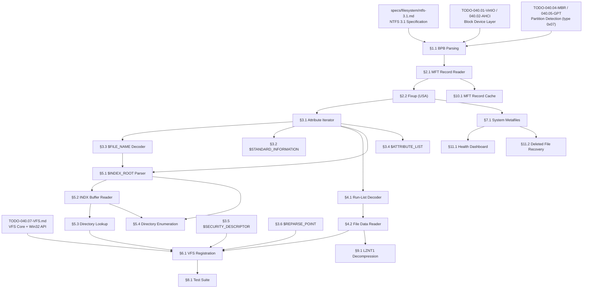

# 040.08-NTFS — New Technology File System (C: Drive)

> **Goal:** Implement NTFS 3.1 as the **primary system partition (C: drive)**
> for Impossible OS. The driver must parse the BIOS Parameter Block (BPB),
> locate and read the Master File Table (MFT), apply Update Sequence
> Array (fixup) integrity checks, decode resident and non-resident
> attributes, execute data run decoding for file cluster retrieval,
> and traverse B+ tree directory indexes. NTFS replaces IXFS as the
> root filesystem — all system files, user data, and the Registry live here.

> [!CAUTION]
> **Memory Rule:** Use `pmm_alloc_contiguous()` for MFT record buffers (1 KB each),
> INDX buffers (4 KB each), and data run cluster reads. `kmalloc` is ONLY for
> small kernel structs (≤ 4 KB). See `rules.md` Known Gotchas.

> [!WARNING]
> **Read-Only First, Write Essential.** NTFS write support is extremely complex
> due to journaling (`$LogFile`), MFT Zone protection, B+ tree rebalancing,
> and Update Sequence Array regeneration. This TODO starts with **read-only**
> access. However, since NTFS is the C: drive, write support is a **P1 follow-up**
> (not optional) — the OS must be able to save settings, logs, and user files.

> [!IMPORTANT]
> **Spec Reference:** All offsets, field layouts, algorithms, and data structures
> reference the [NTFS 3.1 Specification](file:///home/derickpayne/impossible-os/specs/filesystem/ntfs-3.1.md)
> in the repo at `specs/filesystem/ntfs-3.1.md`.

---

## TODO Completion Roadmap (Cross-File)

> [!IMPORTANT]
> **Four TODO files and one spec** feed into the NTFS driver. They have
> cross-dependencies that dictate implementation order. This roadmap shows
> the correct sequence — completing items out of order will cause rework.

### Dependency Graph



### Phase-by-Phase Implementation Order

| ⭐ | Phase  | TODO File / Spec      | Sections                       | What It Delivers                                                 | Depends On                             | Status |
| -- | :----: | ---------------------- | ------------------------------ | ---------------------------------------------------------------- | -------------------------------------- | :----: |
| 💎 | **0**  | `TODO-040.01/02`      | Block device layer             | `blkdev_read()` via VirtIO or AHCI                               | —                                      |   ✅   |
| 💎 | **0**  | `TODO-040.04/05`      | Partition detection            | MBR type `0x07` / GPT `EBD0A0A2-…` → NTFS partition found        | Phase 0 (block)                        |   ✅   |
| 💎 | **1**  | `TODO-040.08-NTFS.md` | §1.1 BPB Parsing               | Locate MFT on disk, extract cluster size, FRS size               | Phase 0 (partitions)                   |   ✅   |
| 💎 | **1**  | `TODO-040.08-NTFS.md` | §2.1 MFT Record Reader         | Read any file's raw MFT record by inode number                   | Phase 1 (§1.1)                         |   ✅   |
| 💎 | **1**  | `TODO-040.08-NTFS.md` | §2.2 Fixup (USA) Verification  | Sector-tear integrity check — **before ANY attribute parsing**   | Phase 1 (§2.1)                         |   ✅   |
| 💎 | **2**  | `TODO-040.08-NTFS.md` | §3.1 Attribute Iterator        | Walk attributes in MFT records — unlocks ALL attribute decoders  | Phase 1 (§2.2)                         |   ✅   |
| 💎 | **2**  | `TODO-040.08-NTFS.md` | §3.3 `$FILE_NAME` Decoder      | Extract filenames, parent references, namespaces                 | Phase 2 (§3.1)                         |   ✅   |
| 💎 | **2**  | `TODO-040.08-NTFS.md` | §4.1 Run-List Decoder          | VCN → LCN translation — enables reading ANY non-resident data    | Phase 2 (§3.1)                         |   ✅   |
| 💎 | **3**  | `TODO-040.08-NTFS.md` | §3.2 `$STANDARD_INFORMATION`   | Timestamps (FILETIME → Unix), DOS permissions                    | Phase 2 (§3.1)                         |   ⬜   |
| 💎 | **3**  | `TODO-040.08-NTFS.md` | §4.2 File Data Reader          | Actually read file contents (resident + non-resident)            | Phase 2 (§4.1)                         |   ⬜   |
| 💎 | **4**  | `TODO-040.08-NTFS.md` | §5.1 `$INDEX_ROOT` Parser      | Root node of directory B+ tree                                   | Phase 2 (§3.1, §3.3)                   |   ⬜   |
| 💎 | **4**  | `TODO-040.08-NTFS.md` | §5.2 INDX Buffer Reader        | Child nodes of B+ tree (4 KB INDX records)                       | Phase 4 (§5.1)                         |   ⬜   |
| 💎 | **4**  | `TODO-040.08-NTFS.md` | §5.3 Directory Lookup          | Full path resolution: `C:\path\to\file`                          | Phase 4 (§5.2)                         |   ⬜   |
| 💎 | **5**  | `TODO-040.08-NTFS.md` | §6.1 VFS Registration          | Mount NTFS as **C: drive**, wire `vfs_ops` (replaces IXFS)       | P3 (§4.2) + P4 (§5.3) + VFS (040.07)   |   ⬜   |
| 💎 | **5**  | `TODO-040.08-NTFS.md` | §5.4 Directory Enumeration     | `FindFirstFile` / `FindNextFile` support                         | Phase 4 (§5.1, §5.2)                   |   ⬜   |
| 💎 | **5**  | `TODO-040.08-NTFS.md` | §3.4 `$ATTRIBUTE_LIST`         | Handle MFT record overflow (extension records)                   | Phase 2 (§3.1)                         |   ⬜   |
| 💎 | **6**  | `TODO-040.08-NTFS.md` | §3.5 `$SECURITY_DESCRIPTOR`    | Read NTFS ACLs → route to `GetFileSecurity()`                    | Phase 2 (§3.1) + VFS §2.2              |   ⬜   |
| 💎 | **6**  | `TODO-040.08-NTFS.md` | §3.6 `$REPARSE_POINT`          | Follow symlinks and junctions during path resolution             | Phase 4 (§5.3)                         |   ⬜   |
| 💎 | **6**  | `TODO-040.08-NTFS.md` | §7.1 System Metafiles          | Volume label, dirty flag, `$UpCase`, free space, `$MFTMirr`      | Phase 1 (§2.2)                         |   ⬜   |
| 💎 | **6**  | `TODO-040.08-NTFS.md` | §9.1 LZNT1 Decompression       | Read compressed Windows system files                             | Phase 3 (§4.2)                         |   ⬜   |
| 💎 | **6**  | `TODO-040.08-NTFS.md` | §10.1 MFT Record Cache         | LRU cache — avoid redundant disk reads                           | Phase 1 (§2.1)                         |   ⬜   |
| 💎 | **7**  | `TODO-040.08-NTFS.md` | §8.1 Test Suite                | Automated validation with NTFS test images                       | Phase 5 (§6.1)                         |   ⬜   |
| ⭐ | **7**  | `TODO-040.08-NTFS.md` | §11.1 Health Dashboard         | At-a-glance NTFS volume health — **no OS does this**             | Phase 6 (§7.1)                         |   ⬜   |
| ⭐ | **7**  | `TODO-040.08-NTFS.md` | §11.2 Deleted File Recovery    | Built-in GUI forensic recovery — **Windows needs 3rd-party**     | Phase 6 (§7.1)                         |   ⬜   |

> [!IMPORTANT]
> **NTFS is the root filesystem (C: drive).** NTFS replaces IXFS as the primary
> system partition format. This elevates the entire NTFS driver from "compatibility
> layer" to **critical path** — write support, journaling, and robustness are
> essential, not optional. All phases should be prioritized accordingly.

> [!NOTE]
> **Phases 0–1** are prerequisites — block I/O, partition tables, BPB, and MFT reading.
> **Phase 2** is the cornerstone — the attribute iterator and data run decoder unlock
> everything else. Get these right and the rest flows naturally.
> **Phases 3–5** build up file reading, directory traversal, and VFS integration — this
> gives you a mountable, browsable NTFS volume.
> **Phase 6** adds robustness (extension records, security, reparse, compression, caching).
> **Phase 7** delivers the competitive features (⭐): Health Dashboard and Deleted File Recovery.

> [!TIP]
> **Quick wins after Phase 2:**
> - §3.2 `$STANDARD_INFORMATION` and §3.3 `$FILE_NAME` are both simple resident attribute
>   decoders — fast to implement once the attribute iterator works.
> - §10.1 MFT Record Cache can be added at any time after §2.1 for an immediate performance
>   boost during development (fewer disk reads while debugging B+ tree traversal).
>
> **Critical gotcha:** §2.2 Fixup (USA) is **non-negotiable**. Without it, every MFT record
> and every INDX buffer will contain corrupted last-2-bytes-per-sector. The attribute
> iterator will silently parse garbage data. **Always fixup before parsing.**
>
> **Memory rule reminder:** MFT records (1 KiB) and INDX buffers (4 KiB) should use
> `pmm_alloc_contiguous()`, not `kmalloc()`. The kernel heap is only 2 MiB — scanning
> large directories could allocate hundreds of INDX buffers.

---

## 1. Volume Boot Record & BPB Parsing

### 1.1 BIOS Parameter Block Extraction

**Verification:** NTFS BPB parsing is implemented in `ntfs_core.c` (`ntfs_init()`). Verify: `bash scripts/build.sh clean` passes. When an NTFS partition is present, serial log shows `[NTFS] Volume: N sectors, cluster=N bytes, MFT at LCN N (byte 0xN)` and `[NTFS] FRS size=N bytes, INDX size=N bytes`. The partition scanner (`partition.c`) now detects NTFS via `ntfs_probe()` and reports `PART_FS_NTFS`. The `ntfs_volume` struct stores all parsed BPB values.

- [x] Read partition first sector (512 bytes or `dev->sector_size`)
- [x] Validate OEM ID at `0x03`: must match `"NTFS    "` (8 bytes, space-padded)
- [x] Extract `bytes_per_sector` at `0x0B` (2 bytes LE) — typically 512 or 4096
- [x] Extract `sectors_per_cluster` at `0x0D` (1 byte) — typically 8
- [x] Calculate `cluster_size = bytes_per_sector × sectors_per_cluster`
- [x] Extract `total_sectors` at `0x28` (8 bytes LE, 64-bit)
- [x] Extract `mft_lcn` at `0x30` (8 bytes LE) — Logical Cluster Number of `$MFT`
- [x] Extract `mftmirr_lcn` at `0x38` (8 bytes LE) — LCN of `$MFTMirr`
- [x] Extract `clusters_per_frs` at `0x40` (4 bytes, **signed interpretation**):
  - [x] If positive: `frs_size = clusters_per_frs × cluster_size`
  - [x] If negative: `frs_size = 2^|clusters_per_frs|` (e.g., `0xF6` → −10 → 1024 bytes)
- [x] Extract `clusters_per_index` at `0x44` (same signed interpretation)
- [x] Extract `volume_serial` at `0x48` (8 bytes LE)
- [x] Validate boot signature `0x55 0xAA` at offset `0x1FE`
- [x] Calculate `mft_byte_offset = mft_lcn × cluster_size`
- [x] Log: `[NTFS] Volume: %llu sectors, cluster=%u bytes, MFT at LCN %llu (byte %llu)`
- [x] Log: `[NTFS] FRS size=%u bytes, INDX size=%u bytes`
- [x] Store all values in `struct ntfs_volume` context
- [x] Committed

> **Notes:**
> - Files: `include/kernel/fs/ntfs.h`, `src/kernel/fs/ntfs/ntfs_core.c`.
> - `ntfs_probe()` checks OEM ID + boot signature — used by `partition.c:probe_filesystem()`.
> - `PART_FS_NTFS` (4) added to `partition.h` alongside FAT32 (1), IXFS (2), ext2 (3).
> - `decode_record_size()` handles the signed Clusters-Per-FRS quirk correctly — negative values encode `2^|val|` bytes, not a cluster count.
> - BPB sanity checks: bytes_per_sector and sectors_per_cluster must be non-zero powers of 2.
> - Volume context uses `kmalloc()` — only ~72 bytes, well within the rules.md guideline for small kernel bookkeeping structs.

---

## 2. MFT Record Reading & Fixup

### 2.1 MFT Record Reader

**Verification:** MFT record reading is implemented in `ntfs_core.c` (`ntfs_read_mft_record()`). Verify: `bash scripts/build.sh clean` passes. The function reads any inode's raw MFT record from disk and parses all 11 header fields. Errors return distinct codes: `NTFS_ERR_BAD_RECORD` (BAAD magic), `NTFS_ERR_BAD_MAGIC` (unknown magic), `NTFS_ERR_FREE` (deleted). The `ntfs_mft_header` struct captures magic, USA offset/size, LSN, sequence number, hard link count, first attribute offset, flags, used/allocated size, and base record reference.

- [x] Implement `ntfs_read_mft_record(vol, inode, buffer)`:
  - [x] Calculate disk byte offset: `vol->mft_byte_offset + (inode × vol->frs_size)`
  - [x] Convert byte offset to LBA: `byte_offset / vol->bytes_per_sector`
  - [x] Read `frs_size / sector_size` sectors via `blkdev_read()`
  - [x] Caller provides record buffer (sized to `vol->frs_size`)
- [x] Parse record header at offsets:
  - [x] `0x00`: Magic number — must be `"FILE"` (0x454C4946 LE)
  - [x] `0x04`: USA offset (2 bytes)
  - [x] `0x06`: USA size in words (2 bytes)
  - [x] `0x08`: `$LogFile` Sequence Number (8 bytes, stored for journaling)
  - [x] `0x10`: Sequence number (2 bytes — for stale reference detection)
  - [x] `0x12`: Hard link count (2 bytes)
  - [x] `0x14`: Offset to first attribute (2 bytes, typically `0x38`)
  - [x] `0x16`: Flags — bit 0: in-use, bit 1: directory
  - [x] `0x18`: Used size of record (4 bytes)
  - [x] `0x1C`: Allocated size (4 bytes, should == `frs_size`)
  - [x] `0x20`: Base record reference (8 bytes — 0 if this IS the base record)
- [x] Reject: magic == `"BAAD"` → `NTFS_ERR_BAD_RECORD`
- [x] Reject: flags bit 0 clear → `NTFS_ERR_FREE`
- [x] Log: `[NTFS] MFT Record %u: flags=0x%04X, attrs_at=0x%X, links=%d`
- [x] Committed

> **Notes:**
> - API: `ntfs_read_mft_record(vol, inode, buf, hdr)` — caller provides buffer + header struct.
> - Buffer ownership is with the caller (allows reuse during directory scans without repeated allocation).
> - Error codes: `NTFS_OK` (0), `NTFS_ERR_IO` (-1), `NTFS_ERR_BAD_RECORD` (-2), `NTFS_ERR_BAD_MAGIC` (-3), `NTFS_ERR_FREE` (-4).
> - Constants added to `ntfs.h`: `NTFS_MAGIC_FILE`, `NTFS_MAGIC_BAAD`, `NTFS_MFT_FLAG_IN_USE`, `NTFS_MFT_FLAG_DIRECTORY`.
> - Note: USA fixup must be applied AFTER this read and BEFORE attribute parsing (§2.2).

### 2.2 Update Sequence Array (Fixup) Verification

**Verification:** USA fixup is implemented in `ntfs_core.c` (`ntfs_apply_fixup()`). Verify: `bash scripts/build.sh clean` passes. The function takes a raw record buffer, record size, and sector size. It reads the USA offset/size from the header, verifies each sector's last 2 bytes match the USN (detecting sector tears), and restores the original bytes. Works on both `"FILE"` and `"INDX"` records since the USA layout is identical. Returns `NTFS_ERR_FIXUP` on sector tear.

- [x] Implement `ntfs_apply_fixup(buffer, record_size, sector_size)`:
  - [x] Read USA offset from `buffer[0x04]` (2 bytes)
  - [x] Read USA size from `buffer[0x06]` (2 bytes, in 16-bit words)
  - [x] Extract USN: first 2 bytes at `buffer[usa_offset]`
  - [x] Calculate number of sectors: `record_size / sector_size`
  - [x] For each sector `i` (0-based):
    - [x] Check last 2 bytes: `buffer[sector_size * (i + 1) - 2]` must match USN
    - [x] If mismatch → return `NTFS_ERR_FIXUP` (sector tear detected)
    - [x] Replace: copy `usa_array[i + 1]` (original bytes) → `buffer[sector_size * (i + 1) - 2]`
  - [x] Record is now clean and ready for attribute parsing
- [x] Handle variable sector sizes (512 and 4096)
- [x] Apply fixup to both `"FILE"` and `"INDX"` records
- [x] Log on fixup failure: `[NTFS] FIXUP FAILED: sector N, expected USN 0xN, got 0xN`
- [x] Committed

> **Notes:**
> - API: `ntfs_apply_fixup(buf, record_size, sector_size)` — generic, no volume context needed.
> - Sanity checks: USA must fit within record, `usa_size_words` must equal `num_sectors + 1`.
> - `NTFS_ERR_FIXUP` (-5) added to `ntfs.h` error codes.
> - **Usage pattern:** After `ntfs_read_mft_record()` returns `NTFS_OK`, always call `ntfs_apply_fixup(buf, vol->frs_size, vol->bytes_per_sector)` before parsing any attributes.
> - For INDX buffers (§6.2): use `ntfs_apply_fixup(buf, vol->index_size, vol->bytes_per_sector)`.

---

## 3. Attribute Parsing Engine

### 3.1 Attribute Iterator

**Verification:** Attribute iterator is implemented in `ntfs_core.c`. Verify: `bash scripts/build.sh clean` passes. Five functions: `ntfs_attr_first()` returns first attr pointer, `ntfs_attr_next()` advances by total_length with bounds checks, `ntfs_attr_parse()` fills the 7-field common header + resident sub-header, `ntfs_attr_find()` scans for a type, `ntfs_attr_find_named()` matches type + UTF-16LE name (via ASCII comparison). All handle `$END` (0xFFFFFFFF) termination and used_size bounds. 14 attribute type constants defined in `ntfs.h`.

- [x] Implement `ntfs_attr_first(record, hdr)` → pointer to first attribute
- [x] Implement `ntfs_attr_next(attr, record, used_size)` → advance by `attr->total_length`
- [x] Implement `ntfs_attr_find(record, hdr, type_id, out)` → scan for specific attribute type
- [x] Implement `ntfs_attr_find_named(record, hdr, type_id, name, out)` → match type + name
- [x] Common header parsing (all attributes):
  - [x] `0x00`: Type ID (4 bytes) — e.g., `0x10`, `0x30`, `0x80`
  - [x] `0x04`: Total length of attribute including header (4 bytes)
  - [x] `0x08`: Non-resident flag (1 byte: `0x00` = resident, `0x01` = non-resident)
  - [x] `0x09`: Name length in chars (1 byte)
  - [x] `0x0A`: Name offset (2 bytes)
  - [x] `0x0C`: Flags — compressed (`0x0001`), encrypted (`0x4000`), sparse (`0x8000`)
  - [x] `0x0E`: Attribute ID (2 bytes)
- [x] Termination: stop at type ID `0xFFFFFFFF` (`$END`)
- [x] Safety: stop if attribute offset exceeds record's used size
- [x] For resident attributes: parse content length at `0x10`, content offset at `0x14`
- [x] For non-resident attributes: defer to data run decoder (§4)
- [x] Committed

> **Notes:**
> - `ntfs_attr_header` struct includes `raw` pointer — allows callers to directly access attribute data without re-scanning.
> - `ntfs_attr_parse()` returns `NTFS_ERR_BAD_MAGIC` at `$END` — callers can use this to detect end-of-list.
> - `ntfs_name_match()` compares kernel ASCII strings against UTF-16LE attribute names — works for all standard NTFS names (`$DATA`, `$I30`, etc.) since they're ASCII-range.
> - Bounds checking: `ntfs_attr_next()` checks both `length > 0` (prevent infinite loop on corrupt records) and `offset + 4 > used_size` (prevent overread).
> - All 14 well-known attribute type constants added to `ntfs.h` (0x10 through 0x100 + 0xFFFFFFFF).

### 3.2 `$STANDARD_INFORMATION` Decoder (0x10)

**Prompt:** Parse the always-resident `$STANDARD_INFORMATION` attribute to extract file timestamps and DOS permissions. NTFS timestamps are 64-bit values representing 100-nanosecond intervals since January 1, 1601 (Windows FILETIME). Extract: Creation Time (`0x00`), Modification Time (`0x08`), MFT Change Time (`0x10`), Last Access Time (`0x18`), and DOS Permissions flags (`0x20`). Map permissions: `0x0001` = Read-Only, `0x0002` = Hidden, `0x0004` = System, `0x0020` = Archive, `0x0800` = Compressed, `0x4000` = Encrypted. After completing all items, mark every item as `[x]`, update this prompt to a verification prompt, run `bash scripts/build.sh clean`, and commit as `"ntfs: $STANDARD_INFORMATION decoder"`. Add notes directly in this TODO section.

- [ ] Locate `$STANDARD_INFORMATION` (type `0x10`) via attribute iterator
- [ ] Verify it is resident (must always be resident per NTFS spec)
- [ ] Extract timestamps (all 64-bit LE, FILETIME format):
  - [ ] `0x00`: Creation time (C time)
  - [ ] `0x08`: Modification time (A time — content altered)
  - [ ] `0x10`: MFT change time (M time — metadata altered)
  - [ ] `0x18`: Last access time (R time — often disabled)
- [ ] Implement `ntfs_filetime_to_unix(filetime)`:
  - [ ] Subtract Windows epoch delta: `11644473600` seconds (1601-01-01 → 1970-01-01)
  - [ ] Divide by 10,000,000 to convert 100ns intervals to seconds
- [ ] Extract DOS permissions at `0x20` (4 bytes):
  - [ ] `FILE_ATTRIBUTE_READONLY (0x0001)`
  - [ ] `FILE_ATTRIBUTE_HIDDEN (0x0002)`
  - [ ] `FILE_ATTRIBUTE_SYSTEM (0x0004)`
  - [ ] `FILE_ATTRIBUTE_ARCHIVE (0x0020)`
  - [ ] `FILE_ATTRIBUTE_COMPRESSED (0x0800)`
  - [ ] `FILE_ATTRIBUTE_ENCRYPTED (0x4000)`
- [ ] Populate `vfs_node` with converted timestamps and attribute flags
- [ ] Commit: `"ntfs: $STANDARD_INFORMATION decoder"`

### 3.3 `$FILE_NAME` Decoder (0x30)

**Verification:** `$FILE_NAME` decoding is implemented in `ntfs_core.c` (`ntfs_decode_file_name()`). Verify: `bash scripts/build.sh clean` passes. The function iterates all `$FILE_NAME` (0x30) attributes in a record, parses parent reference (48-bit inode + 16-bit seq), timestamps, sizes, flags, namespace, and filename (UTF-16LE → ASCII). Prefers Win32/Win32DOS namespace over POSIX, with DOS 8.3 as last resort.

- [x] Locate all `$FILE_NAME` (type `0x30`) attributes (may be multiple)
- [x] Parse parent directory reference at `0x00`:
  - [x] Low 48 bits (6 bytes): parent MFT inode number
  - [x] High 16 bits (2 bytes): sequence number
- [x] Parse duplicated timestamps at `0x08`–`0x28` (creation, modification, MFT change, access)
- [x] Parse allocated size at `0x28` and real size at `0x30`
- [x] Parse flags at `0x38` (4 bytes — directory, compressed, hidden, etc.)
- [x] Parse filename length at `0x40` (1 byte, in UTF-16 characters)
- [x] Parse namespace at `0x41`:
  - [x] `0x00` = POSIX (case-sensitive, any chars)
  - [x] `0x01` = Win32 (case-insensitive, restricted chars)
  - [x] `0x02` = DOS (8.3 short name)
  - [x] `0x03` = Win32/DOS (compliant with both)
- [x] Decode filename at `0x42`: read `name_length × 2` bytes as UTF-16LE → convert to ASCII
- [x] Selection: prefer namespace `0x01` or `0x03` for display, fall back to `0x00`
- [x] Ignore namespace `0x02` (DOS 8.3 short name) unless only option
- [x] Committed

> **Notes:**
> - API: `ntfs_decode_file_name(record, hdr, out)` — scans all `$FILE_NAME` attrs, returns best name.
> - Namespace priority: Win32/Win32DOS (3) > POSIX (2) > DOS (1). Highest-priority name wins.
> - UTF-16LE → ASCII conversion is lossy: non-ASCII chars become `'?'`. Full Unicode support is a future enhancement.
> - `ntfs_file_name` struct has a 256-byte name buffer (NTFS_MAX_NAME + 1) — always null-terminated.
> - `parse_fn_content()` is a static helper — validates minimum content length (0x42 bytes) before parsing.
> - Constants added: `NTFS_NS_POSIX` (0), `NTFS_NS_WIN32` (1), `NTFS_NS_DOS` (2), `NTFS_NS_WIN32DOS` (3).

### 3.4 `$ATTRIBUTE_LIST` Handler (0x20)

**Prompt:** When a file's attributes overflow a single 1024-byte MFT record, NTFS creates extension records. The `$ATTRIBUTE_LIST` attribute in the base record maps which attributes live in which extension record. Parse the list entries: each has Type ID (`0x00`, 4B), Entry Length (`0x04`, 2B), name info, Starting VCN (`0x08`, 8B), and MFT Reference (`0x10`, 8B). When looking for an attribute in a record that has an `$ATTRIBUTE_LIST`, follow the references to extension records. After completing all items, mark every item as `[x]`, update this prompt to a verification prompt, run `bash scripts/build.sh clean`, and commit as `"ntfs: $ATTRIBUTE_LIST handler"`. Add notes directly in this TODO section.

- [ ] Detect `$ATTRIBUTE_LIST` (type `0x20`) presence in base record
- [ ] Parse list entries (variable-length, walk by entry length at `0x04`):
  - [ ] `0x00`: Attribute Type ID to find (4 bytes)
  - [ ] `0x04`: Record entry length (2 bytes)
  - [ ] `0x06`: Name length (1 byte)
  - [ ] `0x07`: Name offset (1 byte)
  - [ ] `0x08`: Starting VCN (8 bytes) — for split non-resident attributes
  - [ ] `0x10`: MFT Reference (8 bytes) — which record holds the attribute
- [ ] For each entry: if MFT Reference ≠ base record → read extension record
- [ ] Integrate with `ntfs_attr_find()`: if base record has `$ATTRIBUTE_LIST`, search extensions
- [ ] Handle `$ATTRIBUTE_LIST` being non-resident itself (rare but possible)
- [ ] Cache extension records to avoid redundant reads
- [ ] Commit: `"ntfs: $ATTRIBUTE_LIST handler"`

### 3.5 `$SECURITY_DESCRIPTOR` Reader (0x50)

**Prompt:** Read the `$SECURITY_DESCRIPTOR` attribute to extract NTFS file permissions and ownership. In NTFS 3.0+, security descriptors are typically stored centrally in `$Secure` (inode 9) rather than inline, but older volumes and some files still have inline `0x50` attributes. Parse the descriptor to extract: Owner SID, Group SID, DACL (Discretionary Access Control List), and SACL (System Access Control List). For the read-only driver, we only need to READ these — routing them to `GetFileSecurity()` via the VFS compat layer (TODO-040.07 §2.2). After completing all items, mark every item as `[x]`, update this prompt to a verification prompt, run `bash scripts/build.sh clean`, and commit as `"ntfs: security descriptor reader"`. Add notes directly in this TODO section.

- [ ] Locate `$SECURITY_DESCRIPTOR` (type `0x50`) in MFT record
- [ ] If not present: check `$STANDARD_INFORMATION` for Security ID → lookup in `$Secure`
- [ ] Parse self-relative security descriptor header:
  - [ ] `0x00`: Revision (1 byte, must be 1)
  - [ ] `0x02`: Control flags (2 bytes)
  - [ ] `0x04`: Owner SID offset (4 bytes)
  - [ ] `0x08`: Group SID offset (4 bytes)
  - [ ] `0x0C`: SACL offset (4 bytes, 0 if absent)
  - [ ] `0x10`: DACL offset (4 bytes, 0 if absent)
- [ ] Parse SID: `S-1-{authority}-{sub1}-{sub2}-...`
- [ ] Parse DACL: ACL header → walk ACEs (Access Control Entries)
  - [ ] Each ACE: type (allow/deny), flags, access mask, SID
- [ ] Expose via `vfs_ops.get_security()` for VFS compat layer
- [ ] Commit: `"ntfs: security descriptor reader"`

### 3.6 `$REPARSE_POINT` Reader (0xC0)

**Prompt:** NTFS reparse points implement symlinks, junctions (directory links), and mount points. The `$REPARSE_POINT` attribute (type `0xC0`) contains a reparse tag identifying the type and a data buffer with the target path. Parse: Reparse Tag (`0x00`, 4 bytes), Data Length (`0x04`, 2 bytes), and the type-specific payload. For symlinks (`IO_REPARSE_TAG_SYMLINK = 0xA000000C`): extract the substitute path (UTF-16LE). For junctions (`IO_REPARSE_TAG_MOUNT_POINT = 0xA0000003`): extract the target directory path. For the read-only driver, follow reparse points during path resolution. After completing all items, mark every item as `[x]`, update this prompt to a verification prompt, run `bash scripts/build.sh clean`, and commit as `"ntfs: reparse point reader"`. Add notes directly in this TODO section.

- [ ] Locate `$REPARSE_POINT` (type `0xC0`) in MFT record
- [ ] Parse reparse data header:
  - [ ] `0x00`: Reparse Tag (4 bytes)
  - [ ] `0x04`: Reparse Data Length (2 bytes)
- [ ] Handle `IO_REPARSE_TAG_MOUNT_POINT (0xA0000003)` — junction:
  - [ ] `0x08`: Substitute Name Offset (2 bytes)
  - [ ] `0x0A`: Substitute Name Length (2 bytes)
  - [ ] `0x0C`: Print Name Offset (2 bytes)
  - [ ] `0x0E`: Print Name Length (2 bytes)
  - [ ] `0x10+`: Path buffer (UTF-16LE) — extract substitute name
  - [ ] Strip `\??\` prefix from substitute name → resolve as local path
- [ ] Handle `IO_REPARSE_TAG_SYMLINK (0xA000000C)` — symbolic link:
  - [ ] Same layout as junction but with additional Flags field at `0x10`
  - [ ] Flags `0x01` = relative symlink (resolve relative to containing directory)
- [ ] During path resolution: if directory has reparse point → follow target
- [ ] Set `vfs_node->flags |= VFS_SYMLINK` for reparse nodes
- [ ] Expose target via `ops->readlink()` for VFS compatibility
- [ ] Commit: `"ntfs: reparse point reader"`

---

## 4. Data Run Decoding

### 4.1 Run-List Decoder

**Verification:** Data run decoder is implemented in `ntfs_core.c` (`ntfs_decode_data_runs()`). Verify: `bash scripts/build.sh clean` passes. The function parses the non-resident attribute header (6 fields), then walks the variable-length run-list encoding: header byte splits into length_size (low nibble) and offset_size (high nibble), followed by unsigned length and signed relative offset fields. Sign extension handles negative offsets correctly. Sparse runs (offset_size==0) get `NTFS_LCN_SPARSE` sentinel.

- [x] Implement `ntfs_decode_data_runs(attr, runs[], max_runs, nrhdr)`:
  - [x] Locate run-list start: offset at `attr[0x20]`
  - [x] Parse non-resident header fields:
    - [x] Starting VCN (8 bytes at attr_offset `0x10`)
    - [x] Last VCN (8 bytes at attr_offset `0x18`)
    - [x] Data runs offset (2 bytes at attr_offset `0x20`)
    - [x] Allocated size (8 bytes at `0x28`)
    - [x] Real (used) size (8 bytes at `0x30`)
    - [x] Initialized size (8 bytes at `0x38`)
  - [x] Walk the run-list:
    - [x] Read header byte. If `0x00` → end of list
    - [x] `length_size = header & 0x0F` (low nibble)
    - [x] `offset_size = (header >> 4) & 0x0F` (high nibble)
    - [x] Read next `length_size` bytes as **unsigned** integer → cluster count
    - [x] Read next `offset_size` bytes as **signed** integer → relative offset
    - [x] **Sign-extend** the offset: if high bit set, fill upper bytes with `0xFF`
    - [x] `absolute_lcn = previous_lcn + relative_offset`
    - [x] Store run: `{ lcn, length, vcn_start }`
    - [x] Update `previous_lcn = absolute_lcn`
  - [x] Handle sparse runs: `offset_size == 0` → LCN = `NTFS_LCN_SPARSE`
- [x] Corrupt run-list detection: `len_size == 0` or field sizes > 8 → stop
- [x] Committed

> **Notes:**
> - API: `ntfs_decode_data_runs(attr, runs, max_runs, nrhdr)` — returns count of decoded runs (0..max_runs), or -1 on error.
> - `read_unsigned()` / `read_signed()`: generic N-byte LE readers for variable-width fields (N ≤ 8).
> - Sign extension: `if (p[n-1] & 0x80) val |= ~((1ULL << (n*8)) - 1)` — fills upper bits with 1s.
> - `NTFS_LCN_SPARSE` = `(uint64_t)-1` — sentinel value, callers must check and return zeros instead of reading disk.
> - `ntfs_nonres_header` struct captures all 6 non-resident fields for callers that need alloc/real/init sizes.
> - The run-list VCN tracking starts from the attribute's `start_vcn` (0x10), not always 0 — extension records may start mid-file.

### 4.2 File Data Reader

**Prompt:** Using the decoded run-list, implement reading file data by VCN range. Given a file offset and length, calculate which runs cover the requested range, translate VCNs to LCNs, and issue `blkdev_read()` for each run's cluster range. Handle sparse runs by filling the output buffer with zeros. Handle reads that span multiple runs. Handle reads within a single cluster (sub-cluster reads). After completing all items, mark every item as `[x]`, update this prompt to a verification prompt, run `bash scripts/build.sh clean`, and commit as `"ntfs: file data reader"`. Add notes directly in this TODO section.

- [ ] Implement `ntfs_read_data(vol, runs, file_offset, length, buffer)`:
  - [ ] Convert `file_offset` to VCN: `vcn = file_offset / cluster_size`
  - [ ] Calculate offset within cluster: `cluster_offset = file_offset % cluster_size`
  - [ ] Find the run containing the target VCN
  - [ ] For each run covering the requested range:
    - [ ] If sparse (LCN == SPARSE) → `memset(buffer, 0, run_length × cluster_size)`
    - [ ] Else: `blkdev_read(dev, lcn × sectors_per_cluster, sectors, buffer)`
  - [ ] Handle partial cluster reads (start/end of request not cluster-aligned)
  - [ ] Handle reads spanning multiple runs (stitch runs together)
  - [ ] Cap read at file's `real_size` (actual data), not `allocated_size`
- [ ] Implement `ntfs_read_resident_data(attr, offset, length, buffer)`:
  - [ ] Direct memory copy from attribute's resident content
  - [ ] Content starts at `attr_base + content_offset` (from attr header at `0x14`)
- [ ] Auto-detect: if `$DATA` is resident → `ntfs_read_resident_data()`, else data runs
- [ ] Commit: `"ntfs: file data reader"`

---

## 5. Directory B+ Tree Traversal

### 5.1 `$INDEX_ROOT` Parser (0x90)

**Prompt:** Parse the always-resident `$INDEX_ROOT` attribute which forms the root node of the directory B+ tree. The root contains a small number of index entries sorted alphabetically. Each index entry has: MFT reference (8B at `0x00`), entry length (2B at `0x08`), stream length (2B at `0x0A`), flags (1B at `0x0C` — bit 0: has sub-node, bit 1: last entry), and a `$FILE_NAME` payload at `0x10`. If the entry has a sub-node (flag `0x01`), the last 8 bytes of the entry contain the VCN of the child INDX buffer. After completing all items, mark every item as `[x]`, update this prompt to a verification prompt, run `bash scripts/build.sh clean`, and commit as `"ntfs: $INDEX_ROOT parser"`. Add notes directly in this TODO section.

- [ ] Locate `$INDEX_ROOT` (type `0x90`, named `$I30`) in directory's MFT record
- [ ] Parse index root header:
  - [ ] Attribute type being indexed (should be `0x30` = `$FILE_NAME`)
  - [ ] Collation rule (should be `0x01` = filename collation)
  - [ ] Index record size (typically 4096)
  - [ ] Clusters per index record
- [ ] Parse node header:
  - [ ] Offset to first index entry (relative to node header start)
  - [ ] Total size of index entries
  - [ ] Allocated size of index entries
  - [ ] Flags: `0x01` = has children (not a leaf)
- [ ] Walk index entries within the root:
  - [ ] `0x00`: MFT Reference (8 bytes — low 6 = inode, high 2 = sequence)
  - [ ] `0x08`: Entry length (2 bytes) — advance by this
  - [ ] `0x0A`: Stream (filename payload) length (2 bytes)
  - [ ] `0x0C`: Flags — `0x01` = has sub-node, `0x02` = last entry
  - [ ] `0x10`: `$FILE_NAME` payload (decode with §3.3 logic)
  - [ ] If flag `0x01`: read child VCN from last 8 bytes of entry
  - [ ] If flag `0x02`: last entry (sentinel, no filename), stop iteration
- [ ] Commit: `"ntfs: $INDEX_ROOT parser"`

### 5.2 INDX Buffer Reader (0xA0)

**Prompt:** When the B+ tree extends beyond the root, child nodes are stored as 4 KB INDX records pointed to by the `$INDEX_ALLOCATION` attribute's data runs. Read the INDX buffer at the specified VCN, validate its magic (`"INDX"`), apply fixup (§2.2 — INDX buffers also use USAs), and parse index entries. The INDX header has its own node header at offset `0x18` with the same entry layout as `$INDEX_ROOT`. After completing all items, mark every item as `[x]`, update this prompt to a verification prompt, run `bash scripts/build.sh clean`, and commit as `"ntfs: INDX buffer reader"`. Add notes directly in this TODO section.

- [ ] Locate `$INDEX_ALLOCATION` (type `0xA0`, named `$I30`) in directory record
- [ ] Decode its data runs to map VCN → LCN (reuse §4.1 decoder)
- [ ] Implement `ntfs_read_indx(vol, index_runs, vcn, buffer)`:
  - [ ] Translate VCN to LCN via run-list
  - [ ] Read `index_record_size` bytes (typically 4096) from disk
  - [ ] Validate magic: must be `"INDX"` (0x58444E49 LE)
  - [ ] Apply fixup (§2.2) — INDX uses USA just like FILE records
- [ ] Parse INDX node header at offset `0x18`:
  - [ ] `0x18 + 0x00`: Offset to first entry (4 bytes)
  - [ ] `0x18 + 0x04`: Total size of entries (4 bytes)
  - [ ] `0x18 + 0x08`: Allocated size (4 bytes)
  - [ ] `0x18 + 0x0C`: Flags — `0x01` = has children (not leaf)
- [ ] Walk index entries (same format as §5.1)
- [ ] Commit: `"ntfs: INDX buffer reader"`

### 5.3 Directory Lookup Algorithm

**Prompt:** Implement the full path resolution algorithm for NTFS. Starting at the Root Directory (inode 5), for each path component: search `$INDEX_ROOT` entries alphabetically (case-insensitive using uppercase comparison). If the target precedes an entry with a sub-node, descend to the child INDX buffer. Repeat until a match is found or the entry is definitively absent. Use the `$UpCase` table (inode 10) for case-insensitive comparison if available, or fall back to ASCII `towupper`. After completing all items, mark every item as `[x]`, update this prompt to a verification prompt, run `bash scripts/build.sh clean`, and commit as `"ntfs: directory lookup algorithm"`. Add notes directly in this TODO section.

- [ ] Implement `ntfs_lookup(vol, parent_inode, name)`:
  - [ ] Read parent's MFT record
  - [ ] Parse `$INDEX_ROOT` (`$I30`) — get sorted index entries
  - [ ] For each entry in root:
    - [ ] Compare `name` against entry's `$FILE_NAME` (case-insensitive)
    - [ ] If match → return entry's MFT reference (inode)
    - [ ] If `name < entry` and entry has sub-node → descend
    - [ ] If `name < entry` and no sub-node → `FILE_NOT_FOUND`
  - [ ] If descending: read child VCN from entry's last 8 bytes
  - [ ] Read INDX buffer at that VCN via `ntfs_read_indx()`
  - [ ] Repeat entry search within INDX buffer
  - [ ] Recurse until leaf node (no more children) → `FILE_NOT_FOUND`
- [ ] Implement `ntfs_resolve_path(vol, path)`:
  - [ ] Split path by `\` (or `/`)
  - [ ] Start at inode 5 (root directory)
  - [ ] For each component: `ntfs_lookup(vol, current_inode, component)`
  - [ ] Return final inode
- [ ] Case-insensitive comparison: uppercase both strings before comparing
- [ ] Handle multiple `$FILE_NAME` attributes per entry (prefer Win32 namespace)
- [ ] Commit: `"ntfs: directory lookup algorithm"`

### 5.4 Directory Enumeration (readdir)

**Prompt:** Implement enumerating all entries in an NTFS directory for `FindFirstFile`/`FindNextFile`. Walk the `$INDEX_ROOT` entries first, then recursively walk all INDX buffers from `$INDEX_ALLOCATION`. Use the `$BITMAP` attribute (type `0xB0`, named `$I30`) to determine which INDX VCNs are in-use. Skip the last sentinel entry (flag `0x02`). After completing all items, mark every item as `[x]`, update this prompt to a verification prompt, run `bash scripts/build.sh clean`, and commit as `"ntfs: directory enumeration"`. Add notes directly in this TODO section.

- [ ] Implement `ntfs_readdir(vol, dir_inode, callback)`:
  - [ ] Read directory's MFT record
  - [ ] Walk `$INDEX_ROOT` entries → invoke callback for each (skip sentinel)
  - [ ] If root has children:
    - [ ] Read `$INDEX_ALLOCATION` data runs
    - [ ] Read `$BITMAP` (`$I30`) to find active INDX VCNs
    - [ ] For each active VCN: read INDX buffer, walk entries, invoke callback
    - [ ] Recurse into child nodes if entries have sub-node flag
  - [ ] Callback receives: filename, MFT inode, file size, timestamps, flags
- [ ] Handle directories with thousands of entries (many INDX buffers)
- [ ] Skip DOS 8.3 names (namespace `0x02`) — only enumerate Win32/POSIX names
- [ ] Commit: `"ntfs: directory enumeration"`

---

## 6. VFS Integration

### 6.1 NTFS VFS Driver Registration

**Prompt:** Register NTFS as a VFS filesystem driver. Implement the `vfs_ops` callbacks: `open`, `close`, `read`, `readdir`, `finddir`, `stat`. The `write`, `create`, `unlink`, `rename`, `mkdir`, `rmdir` callbacks return `NTFS_ERR_READ_ONLY` (read-only driver). Detect NTFS volumes during partition scanning by checking the OEM ID `"NTFS    "` in the boot sector. After completing all items, mark every item as `[x]`, update this prompt to a verification prompt, run `bash scripts/build.sh clean`, and commit as `"ntfs: VFS driver registration"`. Add notes directly in this TODO section.

- [ ] Create `src/kernel/fs/ntfs.c` and `include/kernel/fs/ntfs.h`
- [ ] Define `struct ntfs_volume` — holds BPB data, MFT location, cluster size, etc.
- [ ] Implement `ntfs_detect(blkdev)` — read first sector, check OEM ID `"NTFS    "`
- [ ] Register with partition scanner: on MBR type `0x07` or GPT GUID `EBD0A0A2-...`
- [ ] Implement `vfs_ops` callbacks:
  - [ ] `ntfs_open(node)` — read MFT record, allocate file context
  - [ ] `ntfs_close(node)` — free file context
  - [ ] `ntfs_read(node, offset, size, buf)` — data run read or resident read
  - [ ] `ntfs_readdir(node, index)` — B+ tree enumeration
  - [ ] `ntfs_finddir(node, name)` — B+ tree lookup
  - [ ] `ntfs_stat(node, stat)` — populate from `$STANDARD_INFORMATION`
  - [ ] Write ops → return `-EROFS` (read-only filesystem)
- [ ] Auto-mount: assign drive letter on detection (e.g., `D:`)
- [ ] Log: `[NTFS] Mounted volume '%s' on drive %c: (%llu bytes)`
- [ ] Commit: `"ntfs: VFS driver registration"`

---

## 7. System File Access

### 7.1 System Metafile Readers

**Prompt:** Implement reading key NTFS system files needed for full operation. `$MFTMirr` (inode 1): read the first 4 mirrored MFT records for backup recovery. `$Volume` (inode 3): extract volume name and dirty flag (check if volume was cleanly unmounted — if dirty, log warning). `$Bitmap` (inode 6): read the cluster allocation bitmap for free space queries. `$UpCase` (inode 10): load the Unicode uppercase mapping table for case-insensitive comparison. After completing all items, mark every item as `[x]`, update this prompt to a verification prompt, run `bash scripts/build.sh clean`, and commit as `"ntfs: system metafile readers"`. Add notes directly in this TODO section.

- [ ] Read `$Volume` (inode 3):
  - [ ] Extract `$VOLUME_NAME` attribute (0x60) → volume label
  - [ ] Extract `$VOLUME_INFORMATION` attribute (0x70) → NTFS version, flags
  - [ ] Check dirty flag: if set, log `[NTFS] WARNING: Volume was not cleanly unmounted`
  - [ ] Read-only driver: do NOT clear the dirty flag (Windows chkdsk will handle it)
- [ ] Read `$Bitmap` (inode 6):
  - [ ] Decode `$DATA` attribute (non-resident) → cluster bitmap
  - [ ] Count free/used clusters for `GetDiskFreeSpace()` support
  - [ ] Cache bitmap or compute stats lazily
- [ ] Read `$UpCase` (inode 10):
  - [ ] Load 128 KB uppercase mapping table into kernel memory
  - [ ] Use for case-insensitive filename comparison in B+ tree lookups
  - [ ] Fallback: ASCII-only `towupper` if `$UpCase` loading fails
- [ ] Read `$MFTMirr` (inode 1):
  - [ ] Compare first 4 records against `$MFT` for consistency
  - [ ] Log warning if mismatch detected
- [ ] Commit: `"ntfs: system metafile readers"`

---

## 8. Testing & Validation

### 8.1 NTFS Test Suite

**Prompt:** Create NTFS test disk images using host tools (`mkfs.ntfs` from ntfs-3g, or format from Windows). Test: basic file read, large file (multi-run data), deep directory (multi-level B+ tree), long filenames (≥ 200 chars), file with multiple `$FILE_NAME` attributes (Win32 + DOS), resident small files. Attach images via QEMU and verify the driver reads all files correctly. After completing all items, mark every item as `[x]`, update this prompt to a verification prompt, run `bash scripts/build.sh clean`, and commit as `"test: NTFS filesystem test suite"`. Add notes directly in this TODO section.

- [ ] Test image: small NTFS volume with files in root directory
  - [ ] Verify: BPB parsing, MFT location, root directory listing
- [ ] Test image: file with known content → read and compare
  - [ ] Create file with known 4 KB pattern, verify byte-exact read
- [ ] Test image: large fragmented file (>4 MB, multiple data runs)
  - [ ] Verify: run-list decoding, multi-run stitching
- [ ] Test image: deep directory tree (`A\B\C\D\E\file.txt`)
  - [ ] Verify: recursive path resolution through B+ tree
- [ ] Test image: directory with >100 files (forces INDX allocation)
  - [ ] Verify: INDX buffer reading, fixup, entry enumeration
- [ ] Test image: resident file (< 700 bytes, fits in MFT record)
  - [ ] Verify: resident data read (no data runs)
- [ ] Test image: long filename (200+ characters)
  - [ ] Verify: UTF-16LE decoding, correct length handling
- [ ] Test image: Windows system files (`C:\Windows\System32\kernel32.dll`)
  - [ ] Verify: real-world NTFS volume reading
- [ ] Test: dirty volume flag detection (unmount without clean shutdown)
  - [ ] Verify: warning logged, no write attempted
- [ ] QEMU flags: `-drive file=ntfs_test.img,format=raw,if=none,id=t0 -device virtio-blk-pci,drive=t0`
- [ ] Commit: `"test: NTFS filesystem test suite"`

---

## 9. Compressed File Reading (LZNT1)

### 9.1 LZNT1 Decompression Engine

**Prompt:** NTFS transparent compression uses LZNT1 (a variant of LZ77), applied to "compression units" of 16 clusters (typically 64 KB). When a file has `$DATA` attribute flag `0x0001` (compressed), the data runs contain a mix of stored (compressed) and sparse (all-zeros) runs. For each 16-cluster compression unit: if the run length on disk is < 16 clusters, the data is LZNT1-compressed — decompress it. If the run length == 16 clusters, the data is stored uncompressed. If the run is sparse (LCN == -1), the entire unit is zeros. Implement the LZNT1 decompression algorithm. After completing all items, mark every item as `[x]`, update this prompt to a verification prompt, run `bash scripts/build.sh clean`, and commit as `"ntfs: LZNT1 decompression for compressed files"`. Add notes directly in this TODO section.

> [!NOTE]
> Windows reads compressed NTFS files natively. Linux `ntfs3` supports it in-kernel.
> Linux `ntfs-3g` (FUSE) supports read-only decompression. This is needed for reading
> Windows system files — `C:\Windows\` often contains compressed files.

- [ ] Detect compressed flag in `$DATA` attribute flags (`0x0001`)
- [ ] Read compression unit size: `2^(compression_unit_shift)` clusters (typically 2^4 = 16)
- [ ] For each compression unit in the data runs:
  - [ ] If run length == unit size → uncompressed, read directly
  - [ ] If run length < unit size → LZNT1-compressed, decompress
  - [ ] If run is sparse → fill with zeros
- [ ] Implement `ntfs_lznt1_decompress(src, src_len, dst, dst_len)`:
  - [ ] LZNT1 processes 4096-byte sub-blocks
  - [ ] Each sub-block: 2-byte header (bit 15 = compressed flag, bits 0–11 = size)
  - [ ] If compressed: walk tokens — literal bytes and (offset, length) back-references
  - [ ] Token format: high bit = 1 means back-reference, 0 means literal
  - [ ] Back-reference: variable-length offset and length fields (displacement bits depend on position)
- [ ] Integrate with `ntfs_read_data()`: transparently decompress on read
- [ ] Test: read a compressed file from a Windows NTFS volume, verify contents match
- [ ] Commit: `"ntfs: LZNT1 decompression for compressed files"`

---

## 10. Performance Optimization

### 10.1 MFT Record Cache

**Prompt:** Every path lookup and directory enumeration reads MFT records from disk. Implement an LRU cache for recently-accessed MFT records. Key: MFT inode number. Value: the parsed 1024-byte record buffer (already fixup-verified). This is especially important for directory traversal — looking up `C:\Users\Derickpayne\Documents\file.txt` reads MFT records for inodes 5 (root), `Users`, `Derickpayne`, `Documents`, and `file.txt`. Without caching, reading 100 files in the same directory re-reads the directory's MFT record 100 times. After completing all items, mark every item as `[x]`, update this prompt to a verification prompt, run `bash scripts/build.sh clean`, and commit as `"ntfs: MFT record cache"`. Add notes directly in this TODO section.

- [ ] Define MFT cache: array of `{ inode, record_buffer, lru_timestamp }` (default 64 entries)
- [ ] On `ntfs_read_mft_record(vol, inode, buffer)`:
  - [ ] Check cache first — if hit, copy from cache, skip disk read
  - [ ] On miss: read from disk, apply fixup, store in cache (evict LRU if full)
- [ ] Invalidate cache entry if sequence number changes (stale reference)
- [ ] Pin critical records: inode 0 ($MFT), 5 (root) — never evict
- [ ] Telemetry: track hit/miss rate, log on mount: `[NTFS] MFT cache: %u entries, hit rate %.1f%%`
- [ ] Cache size configurable via Registry: `HKLM\SYSTEM\Storage\NTFS\MFTCacheSize`
- [ ] Commit: `"ntfs: MFT record cache"`

---

## 11. NTFS Volume Health Dashboard (🚀 Impossible OS Feature)

### 11.1 Volume Health Aggregation

**Prompt:** Aggregate NTFS volume health metrics into a single dashboard view in Disk Manager. Read: dirty flag from `$Volume`, bad cluster count from `$BadClus`, MFT Mirror consistency (`$MFTMirr` vs `$MFT` first 4 records), MFT fragmentation (number of data runs in `$MFT`'s own `$DATA` attribute — ideally 1 run = contiguous MFT), and free space from `$Bitmap`. Display a health score and per-metric status (✅/⚠️/❌). No OS provides this at-a-glance view. After completing all items, mark every item as `[x]`, update this prompt to a verification prompt, run `bash scripts/build.sh clean`, and commit as `"ntfs: volume health dashboard"`. Add notes directly in this TODO section.

> [!TIP]
> **Competitive Edge:** Windows shows NTFS volume info spread across Properties → Tools → chkdsk.
> Linux has `ntfsinfo` but it's CLI-only and doesn't aggregate health. Impossible OS shows
> everything in one GUI panel: dirty flag, bad clusters, MFT fragmentation, mirror consistency,
> all with a computed health score. One-click "Check Disk" runs chkdsk-equivalent.

- [ ] Read dirty flag from `$Volume` (inode 3) → `$VOLUME_INFORMATION` flags
- [ ] Read `$BadClus` (inode 8) → count bad cluster entries in `$Bad` data attribute
- [ ] Compare `$MFTMirr` (inode 1) first 4 records against `$MFT` (inode 0)
  - [ ] Byte-exact comparison of records 0–3
  - [ ] Mismatch → `mirror_status = WARNING`
- [ ] Count `$MFT` data runs → run count > 1 means MFT is fragmented
  - [ ] 1 run = perfect ✅, 2–5 = normal ⚠️, 6+ = fragmented ❌
- [ ] Compute free space percentage from `$Bitmap` cluster bitmap
- [ ] Aggregate health score: all green = "Healthy", any warning = "Needs Attention", any red = "Unhealthy"
- [ ] Wire to Disk Manager: NTFS volume properties panel
- [ ] Commit: `"ntfs: volume health dashboard"`

### 11.2 Deleted File Recovery (Forensics Mode)

**Prompt:** NTFS marks deleted files by clearing the in-use bit (bit 0 of flags at `0x16`) but does NOT overwrite the MFT record. The filename, timestamps, and data runs remain intact until the record is reused. Implement a recovery scanner that walks the MFT for records with the in-use bit cleared that still have valid `$FILE_NAME` and `$DATA` attributes. Display recoverable files in a dedicated panel. Allow recovery by copying the data to a different volume. After completing all items, mark every item as `[x]`, update this prompt to a verification prompt, run `bash scripts/build.sh clean`, and commit as `"ntfs: deleted file recovery"`. Add notes directly in this TODO section.

> [!TIP]
> **Competitive Edge:** Windows requires third-party tools (Recuva, R-Studio) for NTFS file
> recovery. Linux has `ntfsundelete` but it's CLI-only and not well-maintained.
> Impossible OS having built-in, GUI-based deleted file recovery is a major differentiator.

> [!WARNING]
> **Read-only operation.** Recovery copies data to a DIFFERENT volume — never write to the
> NTFS volume being scanned. This preserves forensic integrity.

- [ ] Implement `ntfs_scan_deleted(vol, callback)`:
  - [ ] Walk all MFT records (inode 0 to max based on `$MFT` data size / frs_size)
  - [ ] For each record: check magic == `"FILE"`, in-use bit CLEAR (flags & 0x01 == 0)
  - [ ] Parse `$FILE_NAME` → extract filename, parent, timestamps
  - [ ] Parse `$DATA` → check if data runs are still valid (clusters not reallocated)
  - [ ] Cluster validation: cross-reference against `$Bitmap` — if clusters now in-use, file may be partially overwritten
  - [ ] Callback: `{ filename, size, delete_time, recovery_confidence }`
- [ ] Recovery confidence levels:
  - [ ] **High** — all clusters still free in `$Bitmap`
  - [ ] **Medium** — some clusters reallocated (partial recovery possible)
  - [ ] **Low** — most/all clusters reallocated (likely corrupted)
- [ ] Implement `ntfs_recover_file(vol, deleted_inode, output_path)`:
  - [ ] Read data clusters via data runs (same as §4.2)
  - [ ] Write to output file on a different volume (IXFS, FAT32)
- [ ] Wire to Disk Manager: "Recover Deleted Files" button on NTFS volumes
  - [ ] Show list: filename, size, date deleted, confidence icon (🟢/🟡/🔴)
- [ ] Commit: `"ntfs: deleted file recovery"`

---

## 12. NTFS Write Support (Full R/W — Required for C:\ Primary)

> [!CAUTION]
> **This entire section is required if NTFS replaces IXFS as the `C:\` root filesystem.**
> Read-only NTFS (§1–§11) is sufficient for dual-boot browsing. Full R/W NTFS is
> required for boot volume (`C:\`), Registry storage, user profiles, and application data.
> This is the most complex undertaking in the entire NTFS driver — NTFS write support
> is widely considered harder than ext4 write support due to journaling, Update Sequence
> Array regeneration, and MFT zone management.

### 12.1 Cluster Allocator

**Prompt:** Implement the cluster allocation engine using the `$Bitmap` (inode 6) metadata file. The bitmap has one bit per cluster — `0` = free, `1` = allocated. Implement `ntfs_alloc_clusters(vol, count, hint_lcn)` which searches the bitmap for `count` contiguous free clusters near `hint_lcn` (locality-aware allocation). Implement `ntfs_free_clusters(vol, lcn, count)` to clear bits. The bitmap itself is a non-resident `$DATA` attribute — read/modify it using the data run infrastructure from §4. When the MFT Zone (reserved MFT growth area) is reached, skip over it unless no other space is available. After completing all items, mark every item as `[x]`, update this prompt to a verification prompt, run `bash scripts/build.sh clean`, and commit as `"ntfs: cluster allocator"`. Add notes directly in this TODO section.

- [ ] Load `$Bitmap` (inode 6) data runs at mount time
- [ ] Implement `ntfs_alloc_clusters(vol, count, hint_lcn)`:
  - [ ] Search bitmap for `count` contiguous free bits starting near `hint_lcn`
  - [ ] If not found near hint, wrap around and search from LCN 0
  - [ ] Skip MFT Zone (first 12.5% of volume, reserved for MFT growth)
  - [ ] Set allocated bits in bitmap → mark clusters as in-use
  - [ ] Write modified bitmap sectors back to disk
  - [ ] Return starting LCN of allocated run
- [ ] Implement `ntfs_free_clusters(vol, lcn, count)`:
  - [ ] Clear `count` bits starting at `lcn` in bitmap
  - [ ] Write modified bitmap sectors back to disk
  - [ ] Update free cluster count in `vol->free_clusters`
- [ ] Implement `ntfs_get_free_space(vol)` → count free bits in bitmap
- [ ] MFT Zone management:
  - [ ] Track MFT Zone start/end (from `$MFT` data runs + 12.5% reserve)
  - [ ] Only allocate from MFT Zone as last resort (all other space exhausted)
  - [ ] Log warning: `[NTFS] MFT Zone breached — volume nearly full`
- [ ] Cache bitmap in memory (or cache hot regions) for performance
- [ ] Thread-safety: spinlock on bitmap modifications
- [ ] Commit: `"ntfs: cluster allocator"`

### 12.2 Update Sequence Array Regeneration

**Prompt:** When writing MFT records and INDX buffers back to disk, the Update Sequence Array must be regenerated. This is the reverse of §2.2: before writing, save the last 2 bytes of each sector into the USA array, then stamp every sector's last 2 bytes with the USN (Update Sequence Number). Increment the USN on every write. If the USN wraps to 0, skip to 1 (USN 0 is invalid). After completing all items, mark every item as `[x]`, update this prompt to a verification prompt, run `bash scripts/build.sh clean`, and commit as `"ntfs: USA write regeneration"`. Add notes directly in this TODO section.

- [ ] Implement `ntfs_regenerate_fixup(buffer, record_size, sector_size)`:
  - [ ] Increment USN at `buffer[usa_offset]` (wrap 0 → 1)
  - [ ] For each sector `i` (0-based):
    - [ ] Save original last 2 bytes: `usa_array[i + 1] = buffer[sector_size * (i + 1) - 2]`
    - [ ] Stamp last 2 bytes with new USN: `buffer[sector_size * (i + 1) - 2] = usn`
  - [ ] Record is now safe to write to disk
- [ ] Apply to both `"FILE"` and `"INDX"` record writes
- [ ] Commit: `"ntfs: USA write regeneration"`

### 12.3 MFT Record Allocator

**Prompt:** To create new files and directories, the driver must allocate new MFT records. Search the `$MFT` bitmap (`$MFT`'s own `$BITMAP` attribute — NOT `$Bitmap` inode 6) for the first free inode slot. If the MFT is full, extend it by allocating clusters from the MFT Zone and updating `$MFT`'s data runs. Initialize the new record: set magic to `"FILE"`, clear all flags, set first-attribute offset, generate USA. After completing all items, mark every item as `[x]`, update this prompt to a verification prompt, run `bash scripts/build.sh clean`, and commit as `"ntfs: MFT record allocator"`. Add notes directly in this TODO section.

- [ ] Read `$MFT`'s own `$BITMAP` attribute (NOT inode 6 — this is the MFT-internal bitmap)
- [ ] Implement `ntfs_alloc_mft_record(vol)`:
  - [ ] Scan MFT bitmap for first clear bit → that's the new inode number
  - [ ] Set bit in MFT bitmap
  - [ ] If no free bits → extend `$MFT`:
    - [ ] Allocate clusters from MFT Zone via `ntfs_alloc_clusters()`
    - [ ] Append new data run to `$MFT`'s run-list
    - [ ] Extend MFT bitmap by one page
    - [ ] Update `$MFTMirr` with new first-4 records if affected
  - [ ] Initialize new record at calculated byte offset:
    - [ ] Magic: `"FILE"` (0x454C4946)
    - [ ] USA offset: `0x30` (standard for 1024-byte records)
    - [ ] USA size: 3 words (for 2 sectors × 512 bytes)
    - [ ] Sequence number: increment previous occupant's sequence (stale ref detection)
    - [ ] Flags: `0x01` (in-use) or `0x03` (in-use + directory)
    - [ ] First attribute offset: `0x38`
    - [ ] Used size: header + `$END` marker
    - [ ] Write `$END` terminator (`0xFFFFFFFF`) at first attribute offset
  - [ ] Apply USA regeneration (§12.2) before writing to disk
  - [ ] Return new inode number
- [ ] Implement `ntfs_free_mft_record(vol, inode)`:
  - [ ] Clear in-use flag (bit 0) — do NOT zero the record (preserves deleted file recovery)
  - [ ] Clear bit in MFT bitmap
  - [ ] Increment sequence number (stale reference detection)
- [ ] Commit: `"ntfs: MFT record allocator"`

### 12.4 Attribute Writer

**Prompt:** Implement creating, modifying, and removing attributes within MFT records. For resident attributes: insert/update attribute data directly in the record. For non-resident attributes: allocate clusters via §12.1, encode data runs (reverse of §4.1), and write the run-list into the attribute header. Handle attribute growth: if a resident attribute grows beyond the record's free space, convert it to non-resident. Handle attribute creation order (NTFS requires attributes sorted by type ID). After completing all items, mark every item as `[x]`, update this prompt to a verification prompt, run `bash scripts/build.sh clean`, and commit as `"ntfs: attribute writer"`. Add notes directly in this TODO section.

- [ ] Implement `ntfs_attr_add(record, type, name, data, len)`:
  - [ ] Find insertion point: attributes must be sorted by type ID
  - [ ] Shift subsequent attributes to make room
  - [ ] Write attribute header (type, length, resident flag, name)
  - [ ] If data fits in record → create as resident
  - [ ] If data too large → create as non-resident (allocate clusters, encode runs)
  - [ ] Check record doesn't exceed `frs_size` — if so, create `$ATTRIBUTE_LIST`
- [ ] Implement `ntfs_attr_update(record, type, name, data, len)`:
  - [ ] Locate existing attribute
  - [ ] If resident: update content in-place, adjust lengths
  - [ ] If non-resident: write data to existing clusters, extend/truncate runs as needed
  - [ ] Handle resident → non-resident conversion if data grows
- [ ] Implement `ntfs_attr_remove(record, type, name)`:
  - [ ] Free allocated clusters if non-resident
  - [ ] Shift subsequent attributes to close gap
  - [ ] Update record used size
- [ ] Implement `ntfs_encode_data_runs(runs, count, buffer)`:
  - [ ] Reverse of §4.1: encode run array into on-disk byte format
  - [ ] For each run: compute relative offset, determine size fields, encode header byte
  - [ ] Write `0x00` terminator
- [ ] Apply USA regeneration (§12.2) after any MFT record modification
- [ ] Commit: `"ntfs: attribute writer"`

### 12.5 File Create / Delete / Rename

**Prompt:** Implement the core file lifecycle operations on NTFS. `CreateFile`: allocate MFT record (§12.3), add `$STANDARD_INFORMATION` (timestamps), add `$FILE_NAME` (Win32 namespace), add `$DATA` (empty or with initial content), insert directory entry into parent's B+ tree (§12.6). `DeleteFile`: remove directory entry from parent's B+ tree, clear MFT record in-use flag, free data clusters. `RenameFile`: remove old directory entry, add new one, update `$FILE_NAME` attribute in MFT record. All operations MUST be journaled via `$LogFile` (§13). After completing all items, mark every item as `[x]`, update this prompt to a verification prompt, run `bash scripts/build.sh clean`, and commit as `"ntfs: file create/delete/rename"`. Add notes directly in this TODO section.

- [ ] Implement `ntfs_create_file(vol, parent_inode, name, attrs)`:
  - [ ] Allocate new MFT record via `ntfs_alloc_mft_record()`
  - [ ] Add `$STANDARD_INFORMATION` (type `0x10`): current time for all 4 timestamps
  - [ ] Add `$FILE_NAME` (type `0x30`): parent ref, name (UTF-16LE), namespace `0x03`
  - [ ] Generate 8.3 DOS short name if needed → add second `$FILE_NAME` (namespace `0x02`)
  - [ ] Add empty `$DATA` (type `0x80`): resident, zero length
  - [ ] Insert entry into parent directory B+ tree (§12.6)
  - [ ] Update parent's `$STANDARD_INFORMATION` modification timestamp
- [ ] Implement `ntfs_create_directory(vol, parent_inode, name)`:
  - [ ] Same as `ntfs_create_file` but set directory flag (bit 1)
  - [ ] Add `$INDEX_ROOT` (type `0x90`, named `$I30`): empty root node
  - [ ] Add `$INDEX_ALLOCATION` (type `0xA0`) placeholder if needed
- [ ] Implement `ntfs_delete_file(vol, parent_inode, name)`:
  - [ ] Look up file in parent's B+ tree → get inode
  - [ ] Read MFT record, check hard link count
  - [ ] Remove directory entry from parent's B+ tree (§12.6)
  - [ ] Decrement hard link count
  - [ ] If link count == 0:
    - [ ] Free all `$DATA` clusters via `ntfs_free_clusters()`
    - [ ] Free MFT record via `ntfs_free_mft_record()`
  - [ ] Update parent's modification timestamp
- [ ] Implement `ntfs_rename_file(vol, old_parent, old_name, new_parent, new_name)`:
  - [ ] Verify target doesn't already exist (unless replacing)
  - [ ] Remove entry from old parent's B+ tree
  - [ ] Update `$FILE_NAME` attributes in MFT record (parent ref, name)
  - [ ] Insert entry into new parent's B+ tree
  - [ ] Update both parents' modification timestamps
- [ ] Commit: `"ntfs: file create/delete/rename"`

---

## 13. `$LogFile` Journal Integration (Write Transactions)

> [!CAUTION]
> **Every write operation must be journaled.** Without `$LogFile` transaction logging,
> a power failure during a write operation will leave the volume in an inconsistent state
> that Windows' `chkdsk` cannot repair. This is non-negotiable for a boot volume.

### 13.1 Journal Transaction Engine

**Prompt:** Implement NTFS transaction logging via `$LogFile` (inode 2). Every metadata modification (MFT record change, bitmap update, index update) must be wrapped in a transaction: begin → record redo/undo pairs → commit. The `$LogFile` is a circular buffer of log records. Each record has: LSN (Log Sequence Number, monotonically increasing), redo operation (what to apply on commit), and undo operation (what to revert on rollback). On mount, replay committed but unapplied transactions; undo incomplete ones. After completing all items, mark every item as `[x]`, update this prompt to a verification prompt, run `bash scripts/build.sh clean`, and commit as `"ntfs: $LogFile journal engine"`. Add notes directly in this TODO section.

- [ ] Read `$LogFile` (inode 2) data runs at mount time
- [ ] Parse `$LogFile` restart area:
  - [ ] Current LSN (last committed transaction)
  - [ ] Log client records (NTFS always has one client)
  - [ ] Checkpoint LSN (safe replay point)
- [ ] Implement `ntfs_txn_begin(vol)` → allocate transaction context, record start LSN
- [ ] Implement `ntfs_txn_log(txn, redo_op, redo_data, undo_op, undo_data)`:
  - [ ] Write log record to `$LogFile` at current write position
  - [ ] Each record: this LSN, previous LSN, redo op code, redo data, undo op code, undo data
  - [ ] Redo ops: `UpdateResidentAttribute`, `UpdateNonResidentAttribute`, `SetBitsInBitmap`, `ClearBitsInBitmap`, `AddIndexEntry`, `DeleteIndexEntry`
  - [ ] Advance write position (circular — wrap at end of log)
- [ ] Implement `ntfs_txn_commit(txn)`:
  - [ ] Write commit record to `$LogFile`
  - [ ] Flush `$LogFile` to disk (write barrier)
  - [ ] Update restart area with new LSN
  - [ ] Now safe to write actual metadata to disk (write-ahead logging)
- [ ] Implement `ntfs_txn_abort(txn)`:
  - [ ] Walk undo records backward
  - [ ] Apply each undo operation
  - [ ] Write abort record to `$LogFile`
- [ ] Commit: `"ntfs: $LogFile journal engine"`

### 13.2 Recovery Replay (Dirty Mount)

**Prompt:** When an NTFS volume is mounted with the dirty flag set (§7.1), replay the `$LogFile` to restore consistency. Walk the log forward from the checkpoint LSN: for each committed transaction, apply redo operations (in case they weren't flushed to disk). For incomplete transactions (no commit record), apply undo operations to roll back. Clear the dirty flag after successful recovery. This makes NTFS boot-safe — a power failure never corrupts the volume beyond repair. After completing all items, mark every item as `[x]`, update this prompt to a verification prompt, run `bash scripts/build.sh clean`, and commit as `"ntfs: journal recovery replay"`. Add notes directly in this TODO section.

- [ ] On mount: check dirty flag in `$Volume` → if set, enter recovery mode
- [ ] Read `$LogFile` restart area → get checkpoint LSN
- [ ] Scan forward from checkpoint:
  - [ ] Build transaction table: txn ID → { start LSN, state (active/committed) }
  - [ ] Build dirty page table: (target file, offset) → LSN of last modification
- [ ] Redo pass: replay all committed operations whose target pages may be stale
- [ ] Undo pass: roll back all active (uncommitted) transactions in reverse LSN order
- [ ] Clear dirty flag in `$Volume`
- [ ] Clear `$LogFile` (reset restart area for fresh writes)
- [ ] Log: `[NTFS] Recovery complete: %u transactions replayed, %u rolled back`
- [ ] Commit: `"ntfs: journal recovery replay"`

---

## 14. Directory B+ Tree Mutation

### 14.1 B+ Tree Insert / Delete

**Prompt:** Implement inserting and removing entries in NTFS directory B+ trees. This is the write-side counterpart of §5.1–§5.3. Insertion: find the correct leaf position via case-insensitive comparison, insert the index entry, split the node if it overflows (promote median entry to parent, allocate new INDX buffer). Deletion: find and remove the entry, merge underflowing nodes, update parent pointers. All INDX buffer modifications must apply USA regeneration (§12.2) and be journaled (§13). After completing all items, mark every item as `[x]`, update this prompt to a verification prompt, run `bash scripts/build.sh clean`, and commit as `"ntfs: B+ tree insert/delete"`. Add notes directly in this TODO section.

- [ ] Implement `ntfs_index_insert(vol, dir_inode, entry)`:
  - [ ] Read `$INDEX_ROOT` and navigate B+ tree to find insertion point
  - [ ] Insert entry in sorted position (case-insensitive comparison via `$UpCase`)
  - [ ] If root node overflows (exceeds `$INDEX_ROOT` capacity):
    - [ ] Allocate INDX buffer via `ntfs_alloc_clusters()`
    - [ ] Move entries to INDX buffer, keep median in root as separator
    - [ ] Create/extend `$INDEX_ALLOCATION` data runs
    - [ ] Set root's `has_children` flag
    - [ ] Update `$BITMAP` (`$I30`) to mark new VCN as active
  - [ ] If INDX buffer overflows:
    - [ ] Split: allocate new INDX buffer
    - [ ] Promote median entry to parent node
    - [ ] Update parent's child VCN pointers
    - [ ] Recursive split if parent also overflows
  - [ ] Apply USA regeneration to modified INDX buffers before writing
- [ ] Implement `ntfs_index_delete(vol, dir_inode, name)`:
  - [ ] Find entry in B+ tree
  - [ ] If leaf entry → remove directly, compact remaining entries
  - [ ] If internal entry → replace with predecessor/successor from child, then delete from child
  - [ ] If node underflows (< 50% full):
    - [ ] Try redistributing entries with sibling
    - [ ] If redistribution fails → merge with sibling, remove separator from parent
    - [ ] Free empty INDX buffer (clear `$BITMAP` bit, free clusters)
  - [ ] Apply USA regeneration to modified INDX buffers before writing
- [ ] Commit: `"ntfs: B+ tree insert/delete"`

---

## 15. NTFS as Primary Boot Volume (`C:\`)

> [!IMPORTANT]
> **This section enables booting Impossible OS from an NTFS partition instead of IXFS.**
> This requires: full R/W NTFS support (§12–§14), boot-time driver initialization, and
> changes to `partition.c` to recognize NTFS as a bootable root filesystem.

### 15.1 Boot-Time NTFS Driver Initialization

**Prompt:** Modify the boot initialization sequence so that the NTFS driver is compiled into the kernel and initialized early enough to mount `C:\` from an NTFS partition. Currently, `partition_mount_filesystems()` in `partition.c` hardcodes `C: = first IXFS`. Add NTFS as a mountable root filesystem with higher or equal priority. The NTFS driver must be fully operational (BPB → MFT → attribute engine → VFS callbacks) before `C:\` is accessed. After completing all items, mark every item as `[x]`, update this prompt to a verification prompt, run `bash scripts/build.sh clean`, and commit as `"ntfs: boot-time driver initialization"`. Add notes directly in this TODO section.

> [!WARNING]
> **`partition.c` line 366 currently skips all non-FAT32/non-IXFS partitions:**
> `if (pi->fs_type != PART_FS_FAT32 && pi->fs_type != PART_FS_IXFS) continue;`
> This line MUST be updated to include `PART_FS_NTFS` or the NTFS partition
> will be silently skipped during boot.

- [ ] Add `PART_FS_NTFS = 4` to `include/kernel/fs/partition.h`
- [ ] Add `probe_ntfs()` to `partition.c`: check OEM ID `"NTFS    "` at offset `0x03`
- [ ] Add `case PART_FS_NTFS: return "NTFS";` to `partition_fs_name()`
- [ ] Update `probe_filesystem()` to call `probe_ntfs(sect)` after `probe_fat32()`
- [ ] Update `partition_mount_filesystems()` to handle NTFS:
  - [ ] Line 366: add `|| pi->fs_type == PART_FS_NTFS` to the continue guard
  - [ ] Add NTFS mount block: `ntfs_init(sub_dev)` → `vfs_mount('C', ...)`
  - [ ] Priority logic: check for NTFS root partition by GPT name or flag
  - [ ] Fallback: IXFS first, NTFS second (or configurable via boot config)
- [ ] Implement `ntfs_init(blkdev)`:
  - [ ] Parse BPB (§1.1)
  - [ ] Read MFT (§2.1), apply fixup (§2.2)
  - [ ] Initialize attribute engine (§3.1)
  - [ ] Load `$UpCase` table (§7.1)
  - [ ] Check dirty flag → replay journal if needed (§13.2)
  - [ ] Register VFS callbacks (§6.1)
  - [ ] Return 0 on success
- [ ] Implement `ntfs_get_driver()` → return `struct vfs_fs_driver *`
- [ ] Implement `ntfs_get_root()` → return VFS node for inode 5 (root directory)
- [ ] Log: `[NTFS] Mounted as C: — volume '%s', %llu bytes, R/W`
- [ ] Commit: `"ntfs: boot-time driver initialization"`

### 15.2 System File Layout on NTFS

**Prompt:** Define where Impossible OS stores its system files when booting from NTFS. On IXFS, the layout is controlled by the custom format tool. On NTFS, we must create the standard Windows-style directory hierarchy and ensure the kernel, drivers, and Registry can be read from NTFS before the full filesystem stack is running. After completing all items, mark every item as `[x]`, update this prompt to a verification prompt, run `bash scripts/build.sh clean`, and commit as `"ntfs: system file layout"`. Add notes directly in this TODO section.

- [ ] Define system directory structure on NTFS `C:\`:
  - [ ] `C:\Impossible\System32\` — kernel, drivers, system DLLs
  - [ ] `C:\Impossible\System32\config\` — Registry hives
  - [ ] `C:\Impossible\System32\drivers\` — driver binaries
  - [ ] `C:\Program Files\` — application installations
  - [ ] `C:\Users\` — user profiles
  - [ ] `C:\Impossible\Logs\` — system logs (replaces `X:` Logs partition)
- [ ] Create directory hierarchy on first boot (or format):
  - [ ] `ntfs_create_directory()` for each path component (§12.5)
  - [ ] Set appropriate `$SECURITY_DESCRIPTOR` on system dirs (admin-only write)
- [ ] Registry on NTFS:
  - [ ] Verify Registry file read/write works via NTFS `$DATA` attribute I/O
  - [ ] Registry hive files: `SYSTEM`, `SOFTWARE`, `DEFAULT`, `SAM`, `SECURITY`
  - [ ] Ensure journal protects Registry writes (§13 — atomicity on power failure)
- [ ] Boot configuration:
  - [ ] Store boot config in `C:\Impossible\System32\config\BOOT`
  - [ ] Define root filesystem type: `NTFS` or `IXFS` (switchable)
- [ ] Commit: `"ntfs: system file layout"`

### 15.3 NTFS Volume Formatter

**Prompt:** Implement formatting a partition as NTFS from within Impossible OS. This is required for creating NTFS boot volumes without depending on Windows or external tools. Write: the boot sector with BPB, the `$MFT` with initial system inodes (0–26), `$MFTMirr`, `$LogFile`, `$Volume`, `$Bitmap`, `$UpCase`, and the root directory (inode 5) with an empty `$INDEX_ROOT`. After completing all items, mark every item as `[x]`, update this prompt to a verification prompt, run `bash scripts/build.sh clean`, and commit as `"ntfs: volume formatter"`. Add notes directly in this TODO section.

- [ ] Implement `ntfs_format(blkdev, label, cluster_size)`:
  - [ ] Calculate total clusters: `total_sectors × sector_size / cluster_size`
  - [ ] Write boot sector (LBA 0):
    - [ ] OEM ID: `"NTFS    "`
    - [ ] BPB fields: bytes_per_sector, sectors_per_cluster, total_sectors
    - [ ] MFT LCN (typically at cluster ~786432 for alignment)
    - [ ] MFTMirr LCN (typically at volume midpoint)
    - [ ] Clusters per FRS: `0xF6` (→ 1024 bytes)
    - [ ] Volume serial: generate from timestamp
    - [ ] Boot signature: `0x55AA`
  - [ ] Create `$MFT` (inode 0): self-referencing MFT record with `$DATA` runs
  - [ ] Create `$MFTMirr` (inode 1): mirror of first 4 MFT records
  - [ ] Create `$LogFile` (inode 2): pre-allocated journal (typically 64 MB)
  - [ ] Create `$Volume` (inode 3): volume name, NTFS version 3.1, clean flag
  - [ ] Create `$AttrDef` (inode 4): attribute type definitions table
  - [ ] Create root directory (inode 5): empty `$INDEX_ROOT` (`$I30`)
  - [ ] Create `$Bitmap` (inode 6): cluster allocation bitmap (all free except system)
  - [ ] Create `$Boot` (inode 7): backup boot sector reference
  - [ ] Create `$BadClus` (inode 8): empty bad cluster list
  - [ ] Create `$Secure` (inode 9): security descriptor stream (with default ACLs)
  - [ ] Create `$UpCase` (inode 10): 128 KB uppercase mapping table
  - [ ] Create `$Extend` (inode 11): extension directory for `$Quota`, `$ObjId`, `$Reparse`
  - [ ] Reserve inodes 12–23 for future system use (standard NTFS convention)
  - [ ] Mark system clusters as allocated in `$Bitmap`
- [ ] Write backup boot sector at last sector of volume
- [ ] Log: `[NTFS] Formatted: %llu clusters, %u bytes/cluster, label '%s'`
- [ ] Commit: `"ntfs: volume formatter"`

---

## 16. Write Data Path

### 16.1 File Write Engine

**Prompt:** Implement writing data to NTFS files. For small files (< ~700 bytes), write the data directly into the MFT record as a resident `$DATA` attribute. For larger files, allocate clusters, encode data runs, and write data to the allocated clusters. Handle file growth (extend existing runs or add new runs), file truncation (free freed clusters), and partial writes (overwrite data within existing runs without reallocating). All writes must be journaled (§13). After completing all items, mark every item as `[x]`, update this prompt to a verification prompt, run `bash scripts/build.sh clean`, and commit as `"ntfs: file write engine"`. Add notes directly in this TODO section.

- [ ] Implement `ntfs_write_data(vol, inode, offset, length, buffer)`:
  - [ ] Read MFT record, locate `$DATA` attribute
  - [ ] If resident + data still fits → update resident content in-place
  - [ ] If resident + data now too large → convert to non-resident:
    - [ ] Allocate clusters for existing + new data
    - [ ] Copy resident data to clusters
    - [ ] Remove resident content, write data runs into attribute header
  - [ ] If non-resident:
    - [ ] Map offset → VCN → existing run
    - [ ] If writing within existing runs → overwrite cluster data on disk
    - [ ] If writing beyond current allocation → extend:
      - [ ] Allocate additional clusters via `ntfs_alloc_clusters()`
      - [ ] Try extending last run (adjacent clusters) for contiguity
      - [ ] Else add new run to run-list
      - [ ] Re-encode data runs in attribute (§12.4)
    - [ ] Write data to clusters via `blkdev_write()`
  - [ ] Update `$DATA` attribute sizes: real_size, allocated_size, initialized_size
  - [ ] Update `$STANDARD_INFORMATION` modification timestamp
  - [ ] Journal: log old run-list + new run-list for crash recovery
  - [ ] Apply USA regeneration to modified MFT record
  - [ ] Write MFT record back to disk
- [ ] Implement `ntfs_truncate(vol, inode, new_size)`:
  - [ ] If new_size == 0 and file is non-resident → free all clusters, convert to resident
  - [ ] If shrinking → free clusters beyond new_size, shorten last run, re-encode runs
  - [ ] If growing → allocate clusters, extend runs
  - [ ] Update all size fields
- [ ] Implement `ntfs_set_file_attributes(vol, inode, attrs)`:
  - [ ] Update `$STANDARD_INFORMATION` DOS permission flags
- [ ] Implement `ntfs_set_file_time(vol, inode, create, modify, access)`:
  - [ ] Convert Unix timestamps → FILETIME (reverse of §3.2)
  - [ ] Update `$STANDARD_INFORMATION` timestamp fields
- [ ] Commit: `"ntfs: file write engine"`

---

## 17. Alternate Data Streams Explorer (🚀 Impossible OS Feature)

### 17.1 ADS Enumeration & Viewer

**Prompt:** NTFS Alternate Data Streams (ADS) are hidden named `$DATA` attributes that can store arbitrary data alongside the primary file content. Malware commonly abuses ADS to hide payloads — Windows provides no built-in GUI to view them (only `dir /r` or PowerShell). Implement a File Manager extension that lists all named `$DATA` streams for any file and allows viewing/exporting their contents. This is a security and transparency feature — no desktop OS provides this natively in a GUI. After completing all items, mark every item as `[x]`, update this prompt to a verification prompt, run `bash scripts/build.sh clean`, and commit as `"ntfs: ADS explorer"`. Add notes directly in this TODO section.

> [!TIP]
> **Competitive Edge:** Windows hides ADS behind `dir /r` and PowerShell. Linux `ntfs-3g`
> exposes them via `getfattr` but requires CLI expertise. Impossible OS shows ADS in the
> File Manager properties panel — one-click transparency for security-conscious users.

- [ ] Implement `ntfs_enum_streams(vol, inode, callback)`:
  - [ ] Walk all `$DATA` (type `0x80`) attributes in MFT record
  - [ ] For unnamed `$DATA` → primary stream (skip)
  - [ ] For named `$DATA` → ADS: extract stream name (UTF-16LE), size
  - [ ] Handle `$ATTRIBUTE_LIST` extension records for files with many streams
  - [ ] Callback: `{ stream_name, size, resident_flag }`
- [ ] Implement `ntfs_read_stream(vol, inode, stream_name, offset, len, buf)`:
  - [ ] Locate named `$DATA` attribute matching `stream_name`
  - [ ] Read data (resident or non-resident) using §4.2 reader
- [ ] Wire to File Manager: "Streams" tab in file properties panel
  - [ ] List all named streams with size and type
  - [ ] Preview text streams; export any stream to a separate file
  - [ ] Security indicator: ⚠️ icon if file has hidden ADS (malware signal)
- [ ] Commit: `"ntfs: ADS explorer"`

---

## 18. NTFS-to-IXFS Live Migration (🚀 Impossible OS Feature)

### 18.1 Volume Migration Engine

**Prompt:** Implement a one-click migration tool that copies the entire contents of an NTFS volume to an IXFS volume, preserving all metadata (timestamps, permissions, directory structure). This enables users to convert their Windows partitions to IXFS for better Impossible OS integration without booting Windows. The migration runs from within Impossible OS and requires both the NTFS read-only driver and IXFS write support. After completing all items, mark every item as `[x]`, update this prompt to a verification prompt, run `bash scripts/build.sh clean`, and commit as `"ntfs: NTFS-to-IXFS migration engine"`. Add notes directly in this TODO section.

> [!TIP]
> **Competitive Edge:** Neither Windows nor Linux provides a built-in GUI tool for
> migrating between NTFS and their native filesystem. Users must use third-party
> cloning tools (Clonezilla, Macrium) or manual copy. Impossible OS does it natively.

- [ ] Implement `ntfs_migrate_to_ixfs(vol, target_drive)`:
  - [ ] Walk entire NTFS directory tree (recursive MFT + B+ tree traversal)
  - [ ] For each directory: `vfs_create()` on target IXFS volume
  - [ ] For each file: read via NTFS `$DATA` → write to IXFS file
  - [ ] Preserve timestamps: map FILETIME → IXFS timestamps
  - [ ] Preserve file attributes: map DOS flags → IXFS attributes
  - [ ] Skip system metafiles ($MFT, $Volume, etc.) — IXFS has its own
  - [ ] Handle symlinks/junctions: create equivalent IXFS links if supported
- [ ] Progress UI: file count, bytes copied, ETA, current file path
- [ ] Resume on failure: checkpoint last-copied inode, skip completed files
- [ ] Verification pass: compare file sizes and checksums after migration
- [ ] Wire to Disk Manager: "Migrate to IXFS" button on NTFS volumes
- [ ] Commit: `"ntfs: NTFS-to-IXFS migration engine"`

## Priority Order

| ⭐ | Priority | Section                        | Description                                                      |
| -- | -------- | ------------------------------ | ---------------------------------------------------------------- |
| 💎 | 🔴 P0    | 1.1 BPB Parsing                | Foundation — locate MFT on disk                                  |
| 💎 | 🔴 P0    | 2.1 MFT Record Reader          | Foundation — read any file's metadata                            |
| 💎 | 🔴 P0    | 2.2 Fixup Verification         | Integrity — must be done before ANY attribute parsing            |
| 💎 | 🔴 P0    | 3.1 Attribute Iterator         | Foundation — walk attributes in MFT records                      |
| 💎 | 🔴 P0    | 3.3 `$FILE_NAME` Decoder       | Foundation — extract filenames                                   |
| 💎 | 🔴 P0    | 4.1 Run-List Decoder           | Foundation — translate VCN → LCN for file reads                  |
| 💎 | 🟠 P1    | 3.2 `$STANDARD_INFORMATION`    | Metadata — timestamps and permissions                            |
| 💎 | 🟠 P1    | 4.2 File Data Reader           | Core feature — actually read file contents                       |
| 💎 | 🟠 P1    | 5.1 `$INDEX_ROOT` Parser       | Directory — root of B+ tree                                      |
| 💎 | 🟠 P1    | 5.2 INDX Buffer Reader         | Directory — child nodes of B+ tree                               |
| 💎 | 🟠 P1    | 5.3 Directory Lookup           | Directory — path resolution (`C:\path\to\file`)                  |
| 💎 | 🟠 P1    | 6.1 VFS Registration           | Integration — make NTFS mountable                                |
| 💎 | 🟡 P2    | 3.4 `$ATTRIBUTE_LIST`          | Robustness — handle fragmented/overflowing MFT records           |
| 💎 | 🟡 P2    | 3.5 `$SECURITY_DESCRIPTOR`     | Interop — read NTFS ACLs for `GetFileSecurity()`                 |
| 💎 | 🟡 P2    | 3.6 `$REPARSE_POINT`           | Feature — follow symlinks and junctions                          |
| 💎 | 🟡 P2    | 5.4 Directory Enumeration      | Feature — `FindFirstFile`/`FindNextFile` support                 |
| 💎 | 🟡 P2    | 7.1 System Metafiles           | Feature — volume name, dirty flag, free space, `$UpCase`         |
| 💎 | 🟡 P2    | 9.1 LZNT1 Decompression        | Interop — read compressed Windows system files                   |
| 💎 | 🟡 P2    | 10.1 MFT Record Cache          | Performance — avoid redundant disk reads                         |
| 💎 | 🟢 P3    | 8.1 Test Suite                 | Quality — automated validation with test images                  |
| ⭐ | 🟢 P3    | 11.1 Health Dashboard          | **At-a-glance NTFS health** — no OS does this                    |
| ⭐ | 🟢 P3    | 11.2 Deleted File Recovery     | **Built-in forensic recovery** — Windows needs 3rd-party         |
| ⭐ | 🟢 P3    | 17.1 ADS Explorer              | **GUI ADS viewer** — hidden data transparency                    |
| 💎 | 🟣 P4    | 12.1 Cluster Allocator         | Write — `$Bitmap` alloc/free with MFT Zone awareness             |
| 💎 | 🟣 P4    | 12.2 USA Regeneration          | Write — fixup generation for MFT/INDX writes                     |
| 💎 | 🟣 P4    | 12.3 MFT Record Allocator      | Write — allocate/free MFT inodes, extend `$MFT`                  |
| 💎 | 🟣 P4    | 12.4 Attribute Writer          | Write — add/update/remove attributes, encode data runs           |
| 💎 | 🟣 P4    | 12.5 File Create/Delete/Rename | Write — full file lifecycle on NTFS                              |
| 💎 | 🟣 P4    | 13.1 Journal Engine            | Crash safety — `$LogFile` redo/undo transaction logging          |
| 💎 | 🟣 P4    | 13.2 Recovery Replay           | Crash safety — dirty mount redo/undo replay                      |
| 💎 | 🟣 P4    | 14.1 B+ Tree Insert/Delete     | Write — directory mutation with node split/merge                 |
| 💎 | 🟣 P4    | 16.1 File Write Engine         | Write — resident/non-resident data writes + truncation           |
| ⭐ | 🟣 P4    | 15.1 Boot-Time Init            | **NTFS as `C:\`** — boot from NTFS instead of IXFS              |
| ⭐ | 🟣 P4    | 15.2 System File Layout        | **NTFS as `C:\`** — directory hierarchy + Registry on NTFS       |
| ⭐ | 🟣 P4    | 15.3 NTFS Volume Formatter     | **NTFS as `C:\`** — format tool for boot volume creation         |
| ⭐ | 🔵 Future | 18.1 NTFS-to-IXFS Migration   | **One-click volume migration** — no OS does this natively        |

> [!NOTE]
> ⭐ = Feature where Impossible OS can be **superior** to both Windows and Linux.
> 🟣 P4 = Required for NTFS as primary `C:\` boot volume (replaces IXFS).

---

## OS Comparison

| Feature                              | 🪟 Windows 11 (ntfs.sys)           | 🐧 Linux (ntfs3 / ntfs-3g)         | 🚀 Impossible OS                                  |
| ------------------------------------ | ---------------------------------- | ----------------------------------- | ------------------------------------------------- |
| BPB parsing                          | ✅ Native                           | ✅ Full                              | ⬜ §1.1 P0                                         |
| MFT record reading                   | ✅ Native                           | ✅ Full                              | ⬜ §2.1 P0                                         |
| Update Sequence Array (fixup)        | ✅ Full                             | ✅ Full                              | ⬜ §2.2 P0                                         |
| Attribute parsing (all types)        | ✅ All 14 types                     | ✅ All types                         | ⬜ §3.1–3.6 (core + security + reparse)            |
| `$STANDARD_INFORMATION`              | ✅ Full                             | ✅ Full                              | ⬜ §3.2 P1                                         |
| `$FILE_NAME` (multi-namespace)       | ✅ Win32 + DOS + POSIX              | ✅ Full                              | ⬜ §3.3 P0                                         |
| `$ATTRIBUTE_LIST` (extensions)       | ✅ Full                             | ✅ Full                              | ⬜ §3.4 P2                                         |
| `$SECURITY_DESCRIPTOR` / ACLs        | ✅ Full DACL/SACL                   | ✅ ntfs3 full / ntfs-3g limited      | ⬜ §3.5 P2                                         |
| `$REPARSE_POINT` (symlinks)          | ✅ Full (symlinks, junctions)       | ✅ ntfs3 full                        | ⬜ §3.6 P2                                         |
| Data run decoding                    | ✅ Full                             | ✅ Full                              | ⬜ §4.1 P0                                         |
| Sparse file support                  | ✅ Native                           | ✅ Full                              | ⬜ §4.1 (sparse runs)                              |
| File reading (resident + non-res)    | ✅ Full                             | ✅ Full                              | ⬜ §4.2 P1                                         |
| B+ tree directory indexing           | ✅ Full                             | ✅ Full                              | ⬜ §5.1–5.3 P1                                     |
| Directory enumeration (readdir)      | ✅ Full                             | ✅ Full                              | ⬜ §5.4 P2                                         |
| Path resolution                      | ✅ Full                             | ✅ Full                              | ⬜ §5.3 P1                                         |
| VFS / kernel integration             | ✅ Native (ntfs.sys)                | ✅ FUSE (ntfs-3g) / Native (ntfs3)   | ⬜ §6.1 P1                                         |
| Volume label / dirty flag            | ✅ Full                             | ✅ Full                              | ⬜ §7.1 P2                                         |
| Free space queries                   | ✅ Full                             | ✅ Full                              | ⬜ §7.1 P2                                         |
| `$UpCase` case folding               | ✅ Full Unicode                     | ✅ Full Unicode                      | ⬜ §7.1 P2 (ASCII fallback)                        |
| LZNT1 compressed file reading        | ✅ Native                           | ✅ ntfs-3g read-only / ntfs3 full    | ⬜ §9.1 P2                                         |
| MFT record caching                   | ✅ Windows cache manager            | ✅ Page cache                        | ⬜ §10.1 P2                                        |
| Write support                        | ✅ Full R/W                         | ✅ Full R/W (ntfs3 / ntfs-3g FUSE)   | ⬜ §12 P4 — full R/W                               |
| Journaling recovery (`$LogFile`)     | ✅ Full                             | ✅ ntfs-3g replays log               | ⬜ §13 P4 — txn engine + dirty replay              |
| Alternate Data Streams               | ✅ Native                           | ✅ ntfs-3g / ntfs3                   | ⬜ Future (routed via VFS §2.1)                    |
| Full read-only driver                | ✅                                  | ✅                                   | ⬜ Requires §1–§6 at minimum                       |
| Full read-write driver               | ✅                                  | ✅ ntfs-3g (FUSE) / ntfs3 (native)   | ⬜ Requires §1–§14 + §16                           |
| **Volume health dashboard**          | ❌ Spread across multiple tools     | ❌ CLI `ntfsinfo` only               | ⬜ **§11.1 P3 — one-panel health** ⭐               |
| **Deleted file recovery**            | ❌ Requires third-party (Recuva)    | ⚠️ CLI `ntfsundelete` only           | ⬜ **§11.2 P3 — built-in GUI recovery** ⭐          |
| **MFT fragmentation heatmap**        | ❌ Hidden in `defrag /a` output     | ❌ Not available                     | ⬜ **§11.1 — visual MFT density map** ⭐            |
| **Smart file search (MFT scan)**     | ⚠️ Windows Search (requires index)  | ❌ `find` / `locate` (CLI only)      | ⬜ **Direct MFT walk + metadata filter** ⭐         |
| **ADS explorer (GUI)**               | ❌ CLI only (`dir /r`)              | ❌ `getfattr` (CLI only)             | ⬜ **§17.1 P3 — hidden data transparency** ⭐       |
| **NTFS-to-IXFS migration**           | ❌ Not available                    | ❌ Not available                     | ⬜ **§18.1 Future — one-click migration** ⭐        |
| **NTFS as `C:\` boot volume**        | ✅ Native (default)                 | ❌ Not supported                     | ⬜ **§15 P4 — boot-time init + layout** ⭐          |
| **Anti-aliased TTF in Disk Manager** | ⚠️ Basic system font                | ❌ CLI only                          | ✅ **Done — Selawik Semibold, atlas pre-baked** ⭐   |

> **After P0+P1 items:** Impossible OS has a mountable, browsable, read-only NTFS driver.
> **After P2+P3 items:** Full interoperability with Windows volumes + unique health/recovery features.
> **After P4 items:** Full R/W NTFS with journaling — enables NTFS as the boot volume.

---

## Key Files

| File                            | Purpose                                                            |
| ------------------------------- | ------------------------------------------------------------------ |
| `src/kernel/fs/ntfs.c`          | [NEW] NTFS driver — BPB, MFT, attributes, data runs, VFS          |
| `include/kernel/fs/ntfs.h`      | [NEW] Public API, on-disk structures, error codes                  |
| `src/kernel/fs/ntfs_lznt1.c`    | [NEW] LZNT1 decompression engine                                   |
| `src/kernel/fs/partition.c`     | **Needs `probe_ntfs()` and `PART_FS_NTFS`** — currently missing    |
| `include/kernel/fs/partition.h` | **Needs `PART_FS_NTFS` constant** (add after `PART_FS_EXT2 = 3`)   |
| `src/kernel/fs/vfs.c`           | Drive letter assignment for auto-mounted NTFS volumes              |
| `src/kernel/fs/gpt.c`           | GPT GUID `EBD0A0A2-B9E5-…` detection for Microsoft Basic Data     |
| `specs/filesystem/ntfs-3.1.md`  | NTFS 3.1 on-disk format specification (offsets, algorithms)        |

> [!WARNING]
> **Codebase gap:** `partition.c` currently probes for FAT32, IXFS, and ext2 — but
> **NOT** NTFS. Before the NTFS driver can auto-mount, you must add:
> 1. `#define PART_FS_NTFS 4` to `partition.h`
> 2. `probe_ntfs()` to `partition.c` (check OEM ID `"NTFS    "` at offset `0x03`)
> 3. `case PART_FS_NTFS: return "NTFS";` to `partition_fs_name()`
> 4. Call `probe_ntfs(sect)` in `probe_filesystem()` after `probe_fat32()`

> [!NOTE]
> **VFS gap:** `vfs.h` does not currently define `VFS_SYMLINK` or a `readlink()` callback.
> §3.6 (`$REPARSE_POINT` reader) needs both. Add `#define VFS_SYMLINK 0x08` to `vfs.h`
> and add `int (*readlink)(struct vfs_node *node, char *buf, uint32_t bufsz);` to
> `struct vfs_ops` before implementing reparse point support.

---

## Dual-Boot & Mounting Gotchas

> [!CAUTION]
> **The NTFS driver MUST be fully initialized before partition scanning attempts to
> mount Windows volumes.** A custom OS has no built-in knowledge of NTFS — the driver
> must be explicitly compiled into the kernel and initialized in the correct order.

### Common Failure Modes When Mounting NTFS from Impossible OS

| #   | Failure Mode                    | Symptom                                        | Root Cause                                                              | Fix                                                                    |
| --- | ------------------------------- | ---------------------------------------------- | ----------------------------------------------------------------------- | ---------------------------------------------------------------------- |
| 1   | **No NTFS driver loaded**       | Windows partition seen as RAW/unknown          | `ntfs_detect()` not registered before `partition_scan()`                | Register NTFS filesystem type BEFORE partition scan in `boot_storage.c` |
| 2   | **Partition type not recognized** | NTFS partition skipped entirely              | `partition.c` has no `probe_ntfs()` — see Key Files warning             | Add `PART_FS_NTFS` and `probe_ntfs()` to `partition.c`                 |
| 3   | **Storage controller not ready** | Block device unavailable for NTFS disk reads  | On Hyper-V Gen 2: VMBus/StorVSC not ready before NTFS mount             | Ensure VMBus → StorVSC → re-scan sequence (commit `cd6f749`)           |
| 4   | **Dirty volume rejection**      | NTFS mounts but operations fail unpredictably  | Windows didn't cleanly unmount (dirty flag set in `$Volume`)            | §7.1: check dirty flag on mount, log warning, mount read-only          |
| 5   | **Cluster size mismatch**       | BPB values parsed but data reads return garbage | NTFS formatted with 4096-byte clusters but driver assumes 512          | Use `bytes_per_sector` from BPB, not hardcoded 512                     |
| 6   | **4K-native sector disks**      | Fixup fails — USA expects 512-byte sectors     | Advanced Format disks (AF 4Kn) have 4096-byte physical sectors         | Use BPB `bytes_per_sector` field for USA stride, not hardcoded 512     |
| 7   | **Hibernated Windows volumes**  | NTFS metadata silently stale                   | Windows Fast Startup leaves NTFS in hibernated state (`$Volume` flag)  | Detect `VOLUME_IS_HIBERNATED` flag → mount read-only with warning      |

### Hyper-V Gen 2 Dependency Chain for NTFS Access

```
VMBus init → StorVSC init → GPADL handshake → SCSI INQUIRY
    ↓
Block device "hyperv0" registered
    ↓
Partition scan: GPT → find type GUID EBD0A0A2-B9E5-… → detect NTFS OEM "NTFS    "
    ↓
ntfs_init(blkdev) → read BPB → locate MFT → mount as D: (or next free letter)
```

> [!TIP]
> **Dual-boot scenario:** The bootloader and kernel live on the FAT32 EFI System Partition.
> IXFS is `C:\` (the Impossible OS system partition). Windows NTFS partitions are detected
> during partition scanning and auto-assigned the next available drive letter (`D:`, `E:`, etc.).
> The NTFS read-only driver enables browsing Windows files without rebooting.


