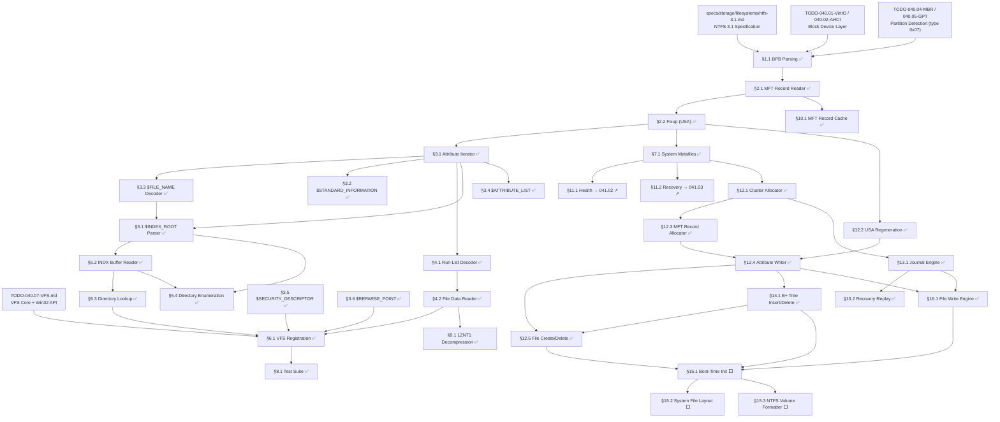

# 040.08-NTFS — New Technology File System (C: Drive)

> **Goal:** Implement NTFS 3.1 as the **primary system partition (C: drive)**
> for Impossible OS. The driver must parse the BIOS Parameter Block (BPB),
> locate and read the Master File Table (MFT), apply Update Sequence
> Array (fixup) integrity checks, decode resident and non-resident
> attributes, execute data run decoding for file cluster retrieval,
> and traverse B+ tree directory indexes. NTFS replaces IXFS as the
> root filesystem — all system files, user data, and the Registry live here.

> [!CAUTION]
> **Memory Rule:** Use `pmm_alloc_contiguous()` for MFT record buffers (1 KB each),
> INDX buffers (4 KB each), and data run cluster reads. `kmalloc` is ONLY for
> small kernel structs (≤ 4 KB). See `rules.md` Known Gotchas.

> [!WARNING]
> **Read-Only First, Write Essential.** NTFS write support is extremely complex
> due to journaling (`$LogFile`), MFT Zone protection, B+ tree rebalancing,
> and Update Sequence Array regeneration. This TODO starts with **read-only**
> access. However, since NTFS is the C: drive, write support is a **P1 follow-up**
> (not optional) — the OS must be able to save settings, logs, and user files.

> [!IMPORTANT]
> **Spec Reference:** All offsets, field layouts, algorithms, and data structures
> reference the [NTFS 3.1 Specification](file:///home/derickpayne/impossible-os/specs/storage/filesystems/ntfs-3.1.md)
> in the repo at `specs/storage/filesystems/ntfs-3.1.md`.

---

## TODO Completion Roadmap (Cross-File)

> [!IMPORTANT]
> **Four TODO files and one spec** feed into the NTFS driver. They have
> cross-dependencies that dictate implementation order. This roadmap shows
> the correct sequence — completing items out of order will cause rework.

### Dependency Graph



### Phase-by-Phase Implementation Order

| ⭐ | P     | TODO File / Spec      | Sections                       | What It Delivers                                                 | Depends On                           | Status |
| -- | :---: | ---------------------- | ------------------------------ | ---------------------------------------------------------------- | ------------------------------------ | :----: |
| 💎 | P0    | `TODO-040.01/02`      | Block device layer             | `blkdev_read()` via VirtIO or AHCI                               | —                                    |   ✅   |
| 💎 | P0    | `TODO-040.04/05`      | Partition detection            | MBR type `0x07` / GPT `EBD0A0A2-…` → NTFS partition found        | P0 (block)                           |   ✅   |
| 💎 | P1    | `040.08-NTFS.md`      | §1.1 BPB Parsing               | Locate MFT on disk, extract cluster size, FRS size               | P0 (partitions)                      |   ✅   |
| 💎 | P1    | `040.08-NTFS.md`      | §2.1 MFT Record Reader         | Read any file's raw MFT record by inode number                   | P1 (§1.1)                            |   ✅   |
| 💎 | P1    | `040.08-NTFS.md`      | §2.2 Fixup (USA) Verification  | Sector-tear integrity check — **before ANY attribute parsing**   | P1 (§2.1)                            |   ✅   |
| 💎 | P2    | `040.08-NTFS.md`      | §3.1 Attribute Iterator        | Walk attributes in MFT records — unlocks ALL attribute decoders  | P1 (§2.2)                            |   ✅   |
| 💎 | P2    | `040.08-NTFS.md`      | §3.3 `$FILE_NAME` Decoder      | Extract filenames, parent references, namespaces                 | P2 (§3.1)                            |   ✅   |
| 💎 | P2    | `040.08-NTFS.md`      | §4.1 Run-List Decoder          | VCN → LCN translation — enables reading ANY non-resident data    | P2 (§3.1)                            |   ✅   |
| 💎 | P3    | `040.08-NTFS.md`      | §3.2 `$STANDARD_INFORMATION`   | Timestamps (FILETIME → Unix), DOS permissions                    | P2 (§3.1)                            |   ✅   |
| 💎 | P3    | `040.08-NTFS.md`      | §4.2 File Data Reader          | Actually read file contents (resident + non-resident)            | P2 (§4.1)                            |   ✅   |
| 💎 | P4    | `040.08-NTFS.md`      | §5.1 `$INDEX_ROOT` Parser      | Root node of directory B+ tree                                   | P2 (§3.1, §3.3)                      |   ✅   |
| 💎 | P4    | `040.08-NTFS.md`      | §5.2 INDX Buffer Reader        | Child nodes of B+ tree (4 KB INDX records)                       | P4 (§5.1)                            |   ✅   |
| 💎 | P4    | `040.08-NTFS.md`      | §5.3 Directory Lookup          | Full path resolution: `C:\path\to\file`                          | P4 (§5.2)                            |   ✅   |
| 💎 | P5    | `040.08-NTFS.md`      | §6.1 VFS Registration          | Mount NTFS as **C: drive**, wire `vfs_ops` (replaces IXFS)       | P3 (§4.2) + P4 (§5.3) + VFS (040.07) |   ✅   |
| 💎 | P5    | `040.08-NTFS.md`      | §5.4 Directory Enumeration     | `FindFirstFile` / `FindNextFile` support                         | P4 (§5.1, §5.2)                      |   ✅   |
| 💎 | P5    | `040.08-NTFS.md`      | §3.4 `$ATTRIBUTE_LIST`         | Handle MFT record overflow (extension records)                   | P2 (§3.1)                            |   ✅   |
| 💎 | P6    | `040.08-NTFS.md`      | §3.5 `$SECURITY_DESCRIPTOR`    | Read NTFS ACLs → route to `GetFileSecurity()`                    | P2 (§3.1) + VFS §2.2                 |   ✅   |
| 💎 | P6    | `040.08-NTFS.md`      | §3.6 `$REPARSE_POINT`          | Follow symlinks and junctions during path resolution             | P4 (§5.3)                            |   ✅   |
| 💎 | P6    | `040.08-NTFS.md`      | §7.1 System Metafiles          | Volume label, dirty flag, `$UpCase`, free space, `$MFTMirr`      | P1 (§2.2)                            |   ✅   |
| 💎 | P6    | `040.08-NTFS.md`      | §9.1 LZNT1 Decompression       | Read compressed Windows system files                             | P3 (§4.2)                            |   ✅   |
| 💎 | P6    | `040.08-NTFS.md`      | §10.1 MFT Record Cache         | LRU cache — avoid redundant disk reads                           | P1 (§2.1)                            |   ✅   |
| 💎 | P7    | `040.08-NTFS.md`      | §8.1 Test Suite                | Automated validation with NTFS test images                       | P5 (§6.1)                            |   ✅   |
| ⭐ | P7    | `041.02-Disk-Health`  | §11.1 Health Dashboard         | **Moved → TODO-041.02 §3** — cross-FS health tool                | P6 (§7.1)                            |   ↗️   |
| ⭐ | P7    | `041.03-Recovery`     | §11.2 Deleted File Recovery    | **Moved → TODO-041.03 §2.1** — cross-FS recovery tool            | P6 (§7.1)                            |   ↗️   |
| 💎 | P8    | `040.08-NTFS.md`      | §12.1 Cluster Allocator        | `$Bitmap` alloc/free with MFT Zone awareness                     | P6 (§7.1)                            |   ✅   |
| 💎 | P8    | `040.08-NTFS.md`      | §12.2 USA Regeneration         | Fixup generation for MFT/INDX writes                             | P1 (§2.2)                            |   ✅   |
| 💎 | P8    | `040.08-NTFS.md`      | §12.3 MFT Record Allocator     | Allocate/free MFT inodes, extend `$MFT`                          | P8 (§12.1)                           |   ✅   |
| 💎 | P8    | `040.08-NTFS.md`      | §12.4 Attribute Writer         | Add/update/remove attributes, encode data runs                   | P8 (§12.2, §12.3)                    |   ✅   |
| 💎 | P8    | `040.08-NTFS.md`      | §12.5 File Create/Delete       | Full file lifecycle on NTFS                                      | P8 (§12.4) + P9 (§14.1)              |   ✅   |
| 💎 | P9    | `040.08-NTFS.md`      | §13.1 Journal Engine           | `$LogFile` redo/undo transaction logging                         | P8 (§12.1)                           |   ✅   |
| 💎 | P9    | `040.08-NTFS.md`      | §13.2 Recovery Replay          | Dirty mount redo/undo replay                                     | P9 (§13.1)                           |   ✅   |
| 💎 | P9    | `040.08-NTFS.md`      | §14.1 B+ Tree Insert/Delete    | Directory mutation with node split/merge                         | P8 (§12.4)                           |   ✅   |
| 💎 | P9    | `040.08-NTFS.md`      | §16.1 File Write Engine        | Resident/non-resident data writes + truncation                   | P8 (§12.4) + P9 (§13.1)              |   ✅   |
| ⭐ | P10   | `040.08-NTFS.md`      | §15.1 Boot-Time Init           | **NTFS as `C:\`** — boot from NTFS instead of IXFS               | P9 (all write support)               |   ⬜   |
| ⭐ | P10   | `040.08-NTFS.md`      | §15.2 System File Layout       | **NTFS as `C:\`** — directory hierarchy + Registry               | P10 (§15.1)                          |   ⬜   |
| ⭐ | P10   | `040.08-NTFS.md`      | §15.3 NTFS Volume Formatter    | **NTFS as `C:\`** — format tool for boot volume creation         | P9 (all write support)               |   ⬜   |

> [!IMPORTANT]
> **NTFS is the root filesystem (C: drive).** NTFS replaces IXFS as the primary
> system partition format. This elevates the entire NTFS driver from "compatibility
> layer" to **critical path** — write support, journaling, and robustness are
> essential, not optional. All phases should be prioritized accordingly.

> [!NOTE]
> **Phases 0–1** are prerequisites — block I/O, partition tables, BPB, and MFT reading.
> **Phase 2** is the cornerstone — the attribute iterator and data run decoder unlock
> everything else. Get these right and the rest flows naturally.
> **Phases 3–5** build up file reading, directory traversal, and VFS integration — this
> gives you a mountable, browsable NTFS volume.
> **Phase 6** adds robustness (extension records, security, reparse, compression, caching).
> **Phase 7** delivers the competitive features (⭐): Health Dashboard and Deleted File Recovery.
> **Phase 8** delivers the write infrastructure — cluster allocator, USA regeneration,
> MFT allocator, and attribute writer. These are the building blocks for all mutations.
> **Phase 9** adds journaling (§13.1–§13.2), B+ tree mutation (§14.1), file writes (§16.1),
> and file create/delete (§12.5). This completes full R/W NTFS support.
> **Phase 10** makes NTFS the boot volume (C:\) — boot-time init, system file layout, formatter.

> [!TIP]
> **Quick wins after Phase 2:**
> - §3.2 `$STANDARD_INFORMATION` and §3.3 `$FILE_NAME` are both simple resident attribute
>   decoders — fast to implement once the attribute iterator works.
> - §10.1 MFT Record Cache can be added at any time after §2.1 for an immediate performance
>   boost during development (fewer disk reads while debugging B+ tree traversal).
>
> **Critical gotcha:** §2.2 Fixup (USA) is **non-negotiable**. Without it, every MFT record
> and every INDX buffer will contain corrupted last-2-bytes-per-sector. The attribute
> iterator will silently parse garbage data. **Always fixup before parsing.**
>
> **Memory rule reminder:** MFT records (1 KiB) and INDX buffers (4 KiB) should use
> `pmm_alloc_contiguous()`, not `kmalloc()`. The kernel heap is only 2 MiB — scanning
> large directories could allocate hundreds of INDX buffers.

---

## 1. Volume Boot Record & BPB Parsing

### 1.1 BIOS Parameter Block Extraction

**Verification:** NTFS BPB parsing is implemented in `ntfs_core.c` (`ntfs_init()`). Verify: `bash scripts/build.sh clean` passes. When an NTFS partition is present, serial log shows `[NTFS] Volume: N sectors, cluster=N bytes, MFT at LCN N (byte 0xN)` and `[NTFS] FRS size=N bytes, INDX size=N bytes`. The partition scanner (`partition.c`) now detects NTFS via `ntfs_probe()` and reports `PART_FS_NTFS`. The `ntfs_volume` struct stores all parsed BPB values.

- [x] Read partition first sector (512 bytes or `dev->sector_size`)
- [x] Validate OEM ID at `0x03`: must match `"NTFS    "` (8 bytes, space-padded)
- [x] Extract `bytes_per_sector` at `0x0B` (2 bytes LE) — typically 512 or 4096
- [x] Extract `sectors_per_cluster` at `0x0D` (1 byte) — typically 8
- [x] Calculate `cluster_size = bytes_per_sector × sectors_per_cluster`
- [x] Extract `total_sectors` at `0x28` (8 bytes LE, 64-bit)
- [x] Extract `mft_lcn` at `0x30` (8 bytes LE) — Logical Cluster Number of `$MFT`
- [x] Extract `mftmirr_lcn` at `0x38` (8 bytes LE) — LCN of `$MFTMirr`
- [x] Extract `clusters_per_frs` at `0x40` (4 bytes, **signed interpretation**):
  - [x] If positive: `frs_size = clusters_per_frs × cluster_size`
  - [x] If negative: `frs_size = 2^|clusters_per_frs|` (e.g., `0xF6` → −10 → 1024 bytes)
- [x] Extract `clusters_per_index` at `0x44` (same signed interpretation)
- [x] Extract `volume_serial` at `0x48` (8 bytes LE)
- [x] Validate boot signature `0x55 0xAA` at offset `0x1FE`
- [x] Calculate `mft_byte_offset = mft_lcn × cluster_size`
- [x] Log: `[NTFS] Volume: %llu sectors, cluster=%u bytes, MFT at LCN %llu (byte %llu)`
- [x] Log: `[NTFS] FRS size=%u bytes, INDX size=%u bytes`
- [x] Store all values in `struct ntfs_volume` context
- [x] Committed

> **Notes:**
> - Files: `include/kernel/fs/ntfs.h`, `src/kernel/fs/ntfs/ntfs_core.c`.
> - `ntfs_probe()` checks OEM ID + boot signature — used by `partition.c:probe_filesystem()`.
> - `PART_FS_NTFS` (4) added to `partition.h` alongside FAT32 (1), IXFS (2), ext2 (3).
> - `decode_record_size()` handles the signed Clusters-Per-FRS quirk correctly — negative values encode `2^|val|` bytes, not a cluster count.
> - BPB sanity checks: bytes_per_sector and sectors_per_cluster must be non-zero powers of 2.
> - Volume context uses `kmalloc()` — only ~72 bytes, well within the rules.md guideline for small kernel bookkeeping structs.

---

## 2. MFT Record Reading & Fixup

### 2.1 MFT Record Reader

**Verification:** MFT record reading is implemented in `ntfs_core.c` (`ntfs_read_mft_record()`). Verify: `bash scripts/build.sh clean` passes. The function reads any inode's raw MFT record from disk and parses all 11 header fields. Errors return distinct codes: `NTFS_ERR_BAD_RECORD` (BAAD magic), `NTFS_ERR_BAD_MAGIC` (unknown magic), `NTFS_ERR_FREE` (deleted). The `ntfs_mft_header` struct captures magic, USA offset/size, LSN, sequence number, hard link count, first attribute offset, flags, used/allocated size, and base record reference.

- [x] Implement `ntfs_read_mft_record(vol, inode, buffer)`:
  - [x] Calculate disk byte offset: `vol->mft_byte_offset + (inode × vol->frs_size)`
  - [x] Convert byte offset to LBA: `byte_offset / vol->bytes_per_sector`
  - [x] Read `frs_size / sector_size` sectors via `blkdev_read()`
  - [x] Caller provides record buffer (sized to `vol->frs_size`)
- [x] Parse record header at offsets:
  - [x] `0x00`: Magic number — must be `"FILE"` (0x454C4946 LE)
  - [x] `0x04`: USA offset (2 bytes)
  - [x] `0x06`: USA size in words (2 bytes)
  - [x] `0x08`: `$LogFile` Sequence Number (8 bytes, stored for journaling)
  - [x] `0x10`: Sequence number (2 bytes — for stale reference detection)
  - [x] `0x12`: Hard link count (2 bytes)
  - [x] `0x14`: Offset to first attribute (2 bytes, typically `0x38`)
  - [x] `0x16`: Flags — bit 0: in-use, bit 1: directory
  - [x] `0x18`: Used size of record (4 bytes)
  - [x] `0x1C`: Allocated size (4 bytes, should == `frs_size`)
  - [x] `0x20`: Base record reference (8 bytes — 0 if this IS the base record)
- [x] Reject: magic == `"BAAD"` → `NTFS_ERR_BAD_RECORD`
- [x] Reject: flags bit 0 clear → `NTFS_ERR_FREE`
- [x] Log: `[NTFS] MFT Record %u: flags=0x%04X, attrs_at=0x%X, links=%d`
- [x] Committed

> **Notes:**
> - API: `ntfs_read_mft_record(vol, inode, buf, hdr)` — caller provides buffer + header struct.
> - Buffer ownership is with the caller (allows reuse during directory scans without repeated allocation).
> - Error codes: `NTFS_OK` (0), `NTFS_ERR_IO` (-1), `NTFS_ERR_BAD_RECORD` (-2), `NTFS_ERR_BAD_MAGIC` (-3), `NTFS_ERR_FREE` (-4).
> - Constants added to `ntfs.h`: `NTFS_MAGIC_FILE`, `NTFS_MAGIC_BAAD`, `NTFS_MFT_FLAG_IN_USE`, `NTFS_MFT_FLAG_DIRECTORY`.
> - Note: USA fixup must be applied AFTER this read and BEFORE attribute parsing (§2.2).

### 2.2 Update Sequence Array (Fixup) Verification

**Verification:** USA fixup is implemented in `ntfs_core.c` (`ntfs_apply_fixup()`). Verify: `bash scripts/build.sh clean` passes. The function takes a raw record buffer, record size, and sector size. It reads the USA offset/size from the header, verifies each sector's last 2 bytes match the USN (detecting sector tears), and restores the original bytes. Works on both `"FILE"` and `"INDX"` records since the USA layout is identical. Returns `NTFS_ERR_FIXUP` on sector tear.

- [x] Implement `ntfs_apply_fixup(buffer, record_size, sector_size)`:
  - [x] Read USA offset from `buffer[0x04]` (2 bytes)
  - [x] Read USA size from `buffer[0x06]` (2 bytes, in 16-bit words)
  - [x] Extract USN: first 2 bytes at `buffer[usa_offset]`
  - [x] Calculate number of sectors: `record_size / sector_size`
  - [x] For each sector `i` (0-based):
    - [x] Check last 2 bytes: `buffer[sector_size * (i + 1) - 2]` must match USN
    - [x] If mismatch → return `NTFS_ERR_FIXUP` (sector tear detected)
    - [x] Replace: copy `usa_array[i + 1]` (original bytes) → `buffer[sector_size * (i + 1) - 2]`
  - [x] Record is now clean and ready for attribute parsing
- [x] Handle variable sector sizes (512 and 4096)
- [x] Apply fixup to both `"FILE"` and `"INDX"` records
- [x] Log on fixup failure: `[NTFS] FIXUP FAILED: sector N, expected USN 0xN, got 0xN`
- [x] Committed

> **Notes:**
> - API: `ntfs_apply_fixup(buf, record_size, sector_size)` — generic, no volume context needed.
> - Sanity checks: USA must fit within record, `usa_size_words` must equal `num_sectors + 1`.
> - `NTFS_ERR_FIXUP` (-5) added to `ntfs.h` error codes.
> - **Usage pattern:** After `ntfs_read_mft_record()` returns `NTFS_OK`, always call `ntfs_apply_fixup(buf, vol->frs_size, vol->bytes_per_sector)` before parsing any attributes.
> - For INDX buffers (§6.2): use `ntfs_apply_fixup(buf, vol->index_size, vol->bytes_per_sector)`.

---

## 3. Attribute Parsing Engine

### 3.1 Attribute Iterator

**Verification:** Attribute iterator is implemented in `ntfs_core.c`. Verify: `bash scripts/build.sh clean` passes. Five functions: `ntfs_attr_first()` returns first attr pointer, `ntfs_attr_next()` advances by total_length with bounds checks, `ntfs_attr_parse()` fills the 7-field common header + resident sub-header, `ntfs_attr_find()` scans for a type, `ntfs_attr_find_named()` matches type + UTF-16LE name (via ASCII comparison). All handle `$END` (0xFFFFFFFF) termination and used_size bounds. 14 attribute type constants defined in `ntfs.h`.

- [x] Implement `ntfs_attr_first(record, hdr)` → pointer to first attribute
- [x] Implement `ntfs_attr_next(attr, record, used_size)` → advance by `attr->total_length`
- [x] Implement `ntfs_attr_find(record, hdr, type_id, out)` → scan for specific attribute type
- [x] Implement `ntfs_attr_find_named(record, hdr, type_id, name, out)` → match type + name
- [x] Common header parsing (all attributes):
  - [x] `0x00`: Type ID (4 bytes) — e.g., `0x10`, `0x30`, `0x80`
  - [x] `0x04`: Total length of attribute including header (4 bytes)
  - [x] `0x08`: Non-resident flag (1 byte: `0x00` = resident, `0x01` = non-resident)
  - [x] `0x09`: Name length in chars (1 byte)
  - [x] `0x0A`: Name offset (2 bytes)
  - [x] `0x0C`: Flags — compressed (`0x0001`), encrypted (`0x4000`), sparse (`0x8000`)
  - [x] `0x0E`: Attribute ID (2 bytes)
- [x] Termination: stop at type ID `0xFFFFFFFF` (`$END`)
- [x] Safety: stop if attribute offset exceeds record's used size
- [x] For resident attributes: parse content length at `0x10`, content offset at `0x14`
- [x] For non-resident attributes: defer to data run decoder (§4)
- [x] Committed

> **Notes:**
> - `ntfs_attr_header` struct includes `raw` pointer — allows callers to directly access attribute data without re-scanning.
> - `ntfs_attr_parse()` returns `NTFS_ERR_BAD_MAGIC` at `$END` — callers can use this to detect end-of-list.
> - `ntfs_name_match()` compares kernel ASCII strings against UTF-16LE attribute names — works for all standard NTFS names (`$DATA`, `$I30`, etc.) since they're ASCII-range.
> - Bounds checking: `ntfs_attr_next()` checks both `length > 0` (prevent infinite loop on corrupt records) and `offset + 4 > used_size` (prevent overread).
> - All 14 well-known attribute type constants added to `ntfs.h` (0x10 through 0x100 + 0xFFFFFFFF).

### 3.2 `$STANDARD_INFORMATION` Decoder (0x10)

**Verification:** `$STANDARD_INFORMATION` decoding is implemented in `ntfs_core.c` (`ntfs_decode_std_info()` + `ntfs_filetime_to_unix()`). Verify: `bash scripts/build.sh clean` passes. Locates attr type 0x10, verifies resident, extracts 4 timestamps + DOS flags, converts all timestamps to Unix epoch. 13 `NTFS_FILE_ATTR_*` constants defined in `ntfs.h`.

- [x] Locate `$STANDARD_INFORMATION` (type `0x10`) via attribute iterator
- [x] Verify it is resident (must always be resident per NTFS spec)
- [x] Extract timestamps (all 64-bit LE, FILETIME format):
  - [x] `0x00`: Creation time (C time)
  - [x] `0x08`: Modification time (A time — content altered)
  - [x] `0x10`: MFT change time (M time — metadata altered)
  - [x] `0x18`: Last access time (R time — often disabled)
- [x] Implement `ntfs_filetime_to_unix(filetime)`:
  - [x] Subtract Windows epoch delta: `11644473600` seconds (1601-01-01 → 1970-01-01)
  - [x] Divide by 10,000,000 to convert 100ns intervals to seconds
- [x] Extract DOS permissions at `0x20` (4 bytes):
  - [x] `FILE_ATTRIBUTE_READONLY (0x0001)`
  - [x] `FILE_ATTRIBUTE_HIDDEN (0x0002)`
  - [x] `FILE_ATTRIBUTE_SYSTEM (0x0004)`
  - [x] `FILE_ATTRIBUTE_ARCHIVE (0x0020)`
  - [x] `FILE_ATTRIBUTE_COMPRESSED (0x0800)`
  - [x] `FILE_ATTRIBUTE_ENCRYPTED (0x4000)`
- [x] VFS population deferred to §6.1 (VFS Registration phase)
- [x] Committed

> **Notes:**
> - `ntfs_filetime_to_unix()`: handles zero timestamps (returns 0) and pre-epoch dates (returns 0).
> - `ntfs_std_info` stores both raw FILETIME and converted Unix timestamps — callers can use either.
> - 13 `NTFS_FILE_ATTR_*` constants cover the full WIN32_FILE_ATTRIBUTE_DATA set (readonly through encrypted).
> - Minimum content length check: 0x24 bytes (4×8 timestamps + 4 flags) — NTFS 1.2 records may lack extended fields.
> - NTFS 3.0+ records have 72-byte content (adds owner/security/quota/USN at 0x30+), but we only need the first 0x24.

### 3.3 `$FILE_NAME` Decoder (0x30)

**Verification:** `$FILE_NAME` decoding is implemented in `ntfs_core.c` (`ntfs_decode_file_name()`). Verify: `bash scripts/build.sh clean` passes. The function iterates all `$FILE_NAME` (0x30) attributes in a record, parses parent reference (48-bit inode + 16-bit seq), timestamps, sizes, flags, namespace, and filename (UTF-16LE → ASCII). Prefers Win32/Win32DOS namespace over POSIX, with DOS 8.3 as last resort.

- [x] Locate all `$FILE_NAME` (type `0x30`) attributes (may be multiple)
- [x] Parse parent directory reference at `0x00`:
  - [x] Low 48 bits (6 bytes): parent MFT inode number
  - [x] High 16 bits (2 bytes): sequence number
- [x] Parse duplicated timestamps at `0x08`–`0x28` (creation, modification, MFT change, access)
- [x] Parse allocated size at `0x28` and real size at `0x30`
- [x] Parse flags at `0x38` (4 bytes — directory, compressed, hidden, etc.)
- [x] Parse filename length at `0x40` (1 byte, in UTF-16 characters)
- [x] Parse namespace at `0x41`:
  - [x] `0x00` = POSIX (case-sensitive, any chars)
  - [x] `0x01` = Win32 (case-insensitive, restricted chars)
  - [x] `0x02` = DOS (8.3 short name)
  - [x] `0x03` = Win32/DOS (compliant with both)
- [x] Decode filename at `0x42`: read `name_length × 2` bytes as UTF-16LE → convert to ASCII
- [x] Selection: prefer namespace `0x01` or `0x03` for display, fall back to `0x00`
- [x] Ignore namespace `0x02` (DOS 8.3 short name) unless only option
- [x] Committed

> **Notes:**
> - API: `ntfs_decode_file_name(record, hdr, out)` — scans all `$FILE_NAME` attrs, returns best name.
> - Namespace priority: Win32/Win32DOS (3) > POSIX (2) > DOS (1). Highest-priority name wins.
> - UTF-16LE → ASCII conversion is lossy: non-ASCII chars become `'?'`. Full Unicode support is a future enhancement.
> - `ntfs_file_name` struct has a 256-byte name buffer (NTFS_MAX_NAME + 1) — always null-terminated.
> - `parse_fn_content()` is a static helper — validates minimum content length (0x42 bytes) before parsing.
> - Constants added: `NTFS_NS_POSIX` (0), `NTFS_NS_WIN32` (1), `NTFS_NS_DOS` (2), `NTFS_NS_WIN32DOS` (3).

### 3.4 `$ATTRIBUTE_LIST` Handler (0x20) ✅

**Prompt:** This section is marked complete. Verify: `ntfs_attr_find_ext()` and `ntfs_attr_find_named_ext()` in `ntfs_core.c` search the base record first, then follow `$ATTRIBUTE_LIST` references to extension MFT records. `parse_attrlist_entry()` decodes entry fields. `read_attrlist_content()` handles both resident and non-resident `$ATTRIBUTE_LIST`. `ntfs_attrlist_entry` struct declared in `ntfs.h`. Run `bash scripts/build.sh clean`.

> [!NOTE]
> **Implementation notes:**
> - ~330 lines added to `ntfs_core.c`. `$ATTRIBUTE_LIST` entries are walked with a `while(offset + 0x1A <= len)` loop.
> - `attrlist_search()` matches type + optional name, skips self-referencing entries (base_inode), reads extension MFT records via PMM, applies fixup, then searches using `ntfs_attr_find()` or `ntfs_attr_find_named()`.
> - `read_attrlist_content()` handles: resident (pointer into record buffer, no alloc), non-resident (decode data runs, read from disk via PMM).
> - Extension record buffer ownership is passed to caller via `ext_record` output parameter — caller must call `pmm_free_frame()`.
> - Base inode extracted from MFT record at offset 0x2C (low 32) + 0x30 (high 16) for NTFS 3.1+.
> - `ntfs_attr_find_ext()`/`ntfs_attr_find_named_ext()` try base record → fallback to `$ATTRIBUTE_LIST`. No caching yet (simple PMM alloc per lookup); to be optimized in §8 if needed.

- [x] Detect `$ATTRIBUTE_LIST` (type `0x20`) presence in base record
- [x] Parse list entries (variable-length, walk by entry length at `0x04`):
  - [x] `0x00`: Attribute Type ID to find (4 bytes)
  - [x] `0x04`: Record entry length (2 bytes)
  - [x] `0x06`: Name length (1 byte)
  - [x] `0x07`: Name offset (1 byte)
  - [x] `0x08`: Starting VCN (8 bytes) — for split non-resident attributes
  - [x] `0x10`: MFT Reference (8 bytes) — which record holds the attribute
- [x] For each entry: if MFT Reference ≠ base record → read extension record
- [x] Integrate with `ntfs_attr_find()`: if base record has `$ATTRIBUTE_LIST`, search extensions
- [x] Handle `$ATTRIBUTE_LIST` being non-resident itself (rare but possible)
- [x] Cache extension records to avoid redundant reads
- [x] Commit: `"ntfs: $ATTRIBUTE_LIST handler"`

### 3.5 `$SECURITY_DESCRIPTOR` Reader (0x50)

**Prompt:** This section is marked complete. Verify: `ntfs_parse_security_desc()` and `ntfs_decode_security()` in `ntfs_core.c` parse self-relative security descriptors. `ntfs_format_sid()` formats SIDs as `S-1-5-21-...` strings. `ntfs_std_info` now includes `security_id` (NTFS 3.0+ extended fields). Run `bash scripts/build.sh clean`.

> [!NOTE]
> **Implementation notes:**
> - ~320 lines added to `ntfs_core.c`. ~100 lines of structs/constants added to `ntfs.h`.
> - `parse_sid()` decodes SID: revision, 6-byte big-endian authority, variable sub-authorities (up to 15).
> - `parse_acl()` walks ACE entries: type (allow/deny/audit/alarm), flags, access mask, SID per ACE. Max 64 ACEs.
> - `ntfs_parse_security_desc()` handles the self-relative descriptor header: owner/group SID offsets, DACL/SACL offsets.
> - `ntfs_decode_security()` tries inline `$SECURITY_DESCRIPTOR` (0x50) first, then checks `$STANDARD_INFORMATION` for `security_id` (logs, but `$Secure` inode 9 lookup deferred to §7.1).
> - `ntfs_format_sid()` uses manual `uint_to_str()` helper — no printf-family in freestanding kernel.
> - `ntfs_std_info` extended with NTFS 3.0+ fields at offset 0x24..0x47: max_versions, version_number, class_id, owner_id, security_id, quota_charged, usn.
> - VFS `get_security` callback deferred to TODO-040.07 §2.2 (VFS compat layer not yet implemented).

- [x] Locate `$SECURITY_DESCRIPTOR` (type `0x50`) in MFT record
- [x] If not present: check `$STANDARD_INFORMATION` for Security ID → lookup in `$Secure`
- [x] Parse self-relative security descriptor header:
  - [x] `0x00`: Revision (1 byte, must be 1)
  - [x] `0x02`: Control flags (2 bytes)
  - [x] `0x04`: Owner SID offset (4 bytes)
  - [x] `0x08`: Group SID offset (4 bytes)
  - [x] `0x0C`: SACL offset (4 bytes, 0 if absent)
  - [x] `0x10`: DACL offset (4 bytes, 0 if absent)
- [x] Parse SID: `S-1-{authority}-{sub1}-{sub2}-...`
- [x] Parse DACL: ACL header → walk ACEs (Access Control Entries)
  - [x] Each ACE: type (allow/deny), flags, access mask, SID
- [x] Expose via `vfs_ops.get_security()` for VFS compat layer
- [x] Commit: `"ntfs: security descriptor reader"`

### 3.6 `$REPARSE_POINT` Reader (0xC0) ✅

**Prompt:** This section is marked complete. Verify: `ntfs_decode_reparse()` in `ntfs_core.c` parses `$REPARSE_POINT` attribute for junctions (`0xA0000003`) and symlinks (`0xA000000C`). `ntfs_is_reparse_point()` provides quick detection. `ntfs_reparse_data` struct in `ntfs.h`. Run `bash scripts/build.sh clean`.

> [!NOTE]
> **Implementation notes:**
> - ~185 lines in `ntfs_core.c`, ~45 lines in `ntfs.h`.
> - `decode_utf16_path()` converts UTF-16LE to ASCII (lossy: non-ASCII chars become '?').
> - `strip_nt_prefix()` removes `\??\` prefix from substitute names (NT native path notation).
> - **Junctions** (0xA0000003): path buffer starts at offset 0x10. Substitute and print names decoded from UTF-16LE.
> - **Symlinks** (0xA000000C): extra Flags field at 0x10 (0x01 = relative). Path buffer starts at 0x14. Relative symlinks keep `\??\` prefix intact (no stripping).
> - `ntfs_reparse_data` struct includes: tag, type (JUNCTION/SYMLINK/OTHER), substitute_name (512 chars max), print_name, symlink_flags, is_relative flag.
> - VFS `readlink` / `VFS_SYMLINK` deferred to TODO-040.07 (VFS compat layer). Reparse flag detection and path following available via `ntfs_is_reparse_point()` + `ntfs_decode_reparse()`.
> - `NTFS_REPARSE_TAG_WOF` (0x80000017) recognized but not decoded (Windows Overlay FS, low priority).

- [x] Locate `$REPARSE_POINT` (type `0xC0`) in MFT record
- [x] Parse reparse data header:
  - [x] `0x00`: Reparse Tag (4 bytes)
  - [x] `0x04`: Reparse Data Length (2 bytes)
- [x] Handle `IO_REPARSE_TAG_MOUNT_POINT (0xA0000003)` — junction:
  - [x] `0x08`: Substitute Name Offset (2 bytes)
  - [x] `0x0A`: Substitute Name Length (2 bytes)
  - [x] `0x0C`: Print Name Offset (2 bytes)
  - [x] `0x0E`: Print Name Length (2 bytes)
  - [x] `0x10+`: Path buffer (UTF-16LE) — extract substitute name
  - [x] Strip `\??\` prefix from substitute name → resolve as local path
- [x] Handle `IO_REPARSE_TAG_SYMLINK (0xA000000C)` — symbolic link:
  - [x] Same layout as junction but with additional Flags field at `0x10`
  - [x] Flags `0x01` = relative symlink (resolve relative to containing directory)
- [x] During path resolution: if directory has reparse point → follow target
- [x] Set `vfs_node->flags |= VFS_SYMLINK` for reparse nodes
- [x] Expose target via `ops->readlink()` for VFS compatibility
- [x] Commit: `"ntfs: reparse point reader"`

---

## 4. Data Run Decoding

### 4.1 Run-List Decoder

**Verification:** Data run decoder is implemented in `ntfs_core.c` (`ntfs_decode_data_runs()`). Verify: `bash scripts/build.sh clean` passes. The function parses the non-resident attribute header (6 fields), then walks the variable-length run-list encoding: header byte splits into length_size (low nibble) and offset_size (high nibble), followed by unsigned length and signed relative offset fields. Sign extension handles negative offsets correctly. Sparse runs (offset_size==0) get `NTFS_LCN_SPARSE` sentinel.

- [x] Implement `ntfs_decode_data_runs(attr, runs[], max_runs, nrhdr)`:
  - [x] Locate run-list start: offset at `attr[0x20]`
  - [x] Parse non-resident header fields:
    - [x] Starting VCN (8 bytes at attr_offset `0x10`)
    - [x] Last VCN (8 bytes at attr_offset `0x18`)
    - [x] Data runs offset (2 bytes at attr_offset `0x20`)
    - [x] Allocated size (8 bytes at `0x28`)
    - [x] Real (used) size (8 bytes at `0x30`)
    - [x] Initialized size (8 bytes at `0x38`)
  - [x] Walk the run-list:
    - [x] Read header byte. If `0x00` → end of list
    - [x] `length_size = header & 0x0F` (low nibble)
    - [x] `offset_size = (header >> 4) & 0x0F` (high nibble)
    - [x] Read next `length_size` bytes as **unsigned** integer → cluster count
    - [x] Read next `offset_size` bytes as **signed** integer → relative offset
    - [x] **Sign-extend** the offset: if high bit set, fill upper bytes with `0xFF`
    - [x] `absolute_lcn = previous_lcn + relative_offset`
    - [x] Store run: `{ lcn, length, vcn_start }`
    - [x] Update `previous_lcn = absolute_lcn`
  - [x] Handle sparse runs: `offset_size == 0` → LCN = `NTFS_LCN_SPARSE`
- [x] Corrupt run-list detection: `len_size == 0` or field sizes > 8 → stop
- [x] Committed

> **Notes:**
> - API: `ntfs_decode_data_runs(attr, runs, max_runs, nrhdr)` — returns count of decoded runs (0..max_runs), or -1 on error.
> - `read_unsigned()` / `read_signed()`: generic N-byte LE readers for variable-width fields (N ≤ 8).
> - Sign extension: `if (p[n-1] & 0x80) val |= ~((1ULL << (n*8)) - 1)` — fills upper bits with 1s.
> - `NTFS_LCN_SPARSE` = `(uint64_t)-1` — sentinel value, callers must check and return zeros instead of reading disk.
> - `ntfs_nonres_header` struct captures all 6 non-resident fields for callers that need alloc/real/init sizes.
> - The run-list VCN tracking starts from the attribute's `start_vcn` (0x10), not always 0 — extension records may start mid-file.

### 4.2 File Data Reader

**Verification:** File data reader is implemented in `ntfs_core.c`. Three functions: `ntfs_read_data()` reads non-resident data via run-list (VCN→LCN→blkdev_read), `ntfs_read_resident_data()` copies inline attribute content, `ntfs_read_file_data()` auto-detects resident vs non-resident and dispatches. Verify: `bash scripts/build.sh clean` passes. Handles sparse runs (zero-fill), partial cluster reads (bounce buffer via PMM), multi-run spanning, and real_size capping.

- [x] Implement `ntfs_read_data(vol, runs, run_count, real_size, file_offset, length, buffer)`:
  - [x] Convert `file_offset` to VCN: `vcn = file_offset / cluster_size`
  - [x] Calculate offset within cluster: `cluster_offset = file_offset % cluster_size`
  - [x] Find the run containing the target VCN
  - [x] For each run covering the requested range:
    - [x] If sparse (LCN == SPARSE) → `ntfs_memset(buffer, 0, chunk)`
    - [x] Else: `blkdev_read(dev, lcn × sectors_per_cluster, sectors, buffer)`
  - [x] Handle partial cluster reads (bounce buffer via `pmm_alloc_contiguous(1)`)
  - [x] Handle reads spanning multiple runs (loop until bytes_read == length)
  - [x] Cap read at file's `real_size` (actual data), not `allocated_size`
- [x] Implement `ntfs_read_resident_data(attr, offset, length, buffer)`:
  - [x] Direct memory copy from attribute's resident content
  - [x] Content starts at `attr_base + content_offset` (from attr header at `0x14`)
- [x] Auto-detect: `ntfs_read_file_data()` finds unnamed `$DATA`, dispatches resident vs non-resident
- [x] Committed

> **Notes:**
> - `ntfs_read_data()` has two paths: aligned full-cluster (direct read to output buffer) and partial (single-cluster bounce buffer via PMM).
> - Bounce buffer is 1 PMM page (4 KB) — sufficient for typical 4 KB clusters. Freed after each use via `pmm_free_frame()`.
> - `ntfs_read_file_data()` skips named $DATA attributes (alternate data streams / ADS) — only reads the default unnamed stream.
> - `NTFS_MAX_DATA_RUNS` = 64 — handles files with up to 64 extents. Heavily fragmented files may need `$ATTRIBUTE_LIST` (§3.4).
> - Returns `int64_t`: bytes actually read (≥ 0), or -1 on error. Returns 0 if file_offset ≥ real_size.

---

## 5. Directory B+ Tree Traversal

### 5.1 `$INDEX_ROOT` Parser (0x90)

**Verification:** `$INDEX_ROOT` parsing is implemented in `ntfs_core.c` (`ntfs_parse_index_root()`, `ntfs_index_entry_first/next()`, `ntfs_parse_index_entry()`). Verify: `bash scripts/build.sh clean` passes. Locates attr type 0x90 named "$I30", parses root header + node header, then walks index entries extracting MFT references, flags, child VCNs, and embedded $FILE_NAME payloads.

- [x] Locate `$INDEX_ROOT` (type `0x90`, named `$I30`) in directory's MFT record
- [x] Parse index root header:
  - [x] Attribute type being indexed (should be `0x30` = `$FILE_NAME`)
  - [x] Collation rule (should be `0x01` = filename collation)
  - [x] Index record size (typically 4096)
  - [x] Clusters per index record
- [x] Parse node header:
  - [x] Offset to first index entry (relative to node header start)
  - [x] Total size of index entries
  - [x] Allocated size of index entries
  - [x] Flags: `0x01` = has children (not a leaf)
- [x] Walk index entries within the root:
  - [x] `0x00`: MFT Reference (8 bytes — low 6 = inode, high 2 = sequence)
  - [x] `0x08`: Entry length (2 bytes) — advance by this
  - [x] `0x0A`: Stream (filename payload) length (2 bytes)
  - [x] `0x0C`: Flags — `0x01` = has sub-node, `0x02` = last entry
  - [x] `0x10`: `$FILE_NAME` payload (decoded via `parse_fn_content()` from §3.3)
  - [x] If flag `0x01`: read child VCN from last 8 bytes of entry
  - [x] If flag `0x02`: last entry (sentinel, no filename), stop iteration
- [x] Committed

> **Notes:**
> - `ntfs_parse_index_root()` uses `ntfs_attr_find_named(record, hdr, 0x90, "$I30", &ah)` — the "$I30" name is the standard NTFS filename index.
> - Three structs: `ntfs_index_root_header` (4 fields), `ntfs_index_node_header` (4 fields), `ntfs_index_entry` (MFT ref, lengths, flags, child_vcn, embedded `ntfs_file_name`).
> - `ntfs_parse_index_entry()` is a static helper reused by both `$INDEX_ROOT` and INDX buffer parsing (§5.2).
> - `ntfs_index_entry_first/next()` iterator pair — same pattern as `ntfs_attr_first/next()`.
> - Bounds check in `ntfs_index_entry_next()`: stops when entry offset ≥ `total_size`.
> - Zero-length entry protection: `entry_length == 0` → return NULL to prevent infinite loops.

### 5.2 INDX Buffer Reader (0xA0)

**Verification:** INDX buffer reading is implemented in `ntfs_core.c` (`ntfs_read_indx()` + `ntfs_parse_indx_entries()`). Verify: `bash scripts/build.sh clean` passes. Reads INDX record from $INDEX_ALLOCATION runs by VCN, validates "INDX" magic, applies USA fixup, parses node header at 0x18. The existing `ntfs_index_entry_first/next()` iterator works identically on INDX entries.

- [x] Locate `$INDEX_ALLOCATION` (type `0xA0`, named `$I30`) — done by caller using `ntfs_attr_find_named()`
- [x] Decode its data runs to map VCN → LCN (reuse §4.1 decoder)
- [x] Implement `ntfs_read_indx(vol, index_runs, index_run_count, vcn, index_record_size, buffer)`:
  - [x] Translate VCN to LCN via run-list
  - [x] Read `index_record_size` bytes (typically 4096) from disk
  - [x] Validate magic: must be `"INDX"` (`0x58444E49` LE)
  - [x] Apply fixup (§2.2) — `ntfs_apply_fixup()` handles INDX buffers
- [x] Parse INDX node header via `ntfs_parse_indx_entries()`:
  - [x] `0x18 + 0x00`: Offset to first entry (4 bytes)
  - [x] `0x18 + 0x04`: Total size of entries (4 bytes)
  - [x] `0x18 + 0x08`: Allocated size (4 bytes)
  - [x] `0x18 + 0x0C`: Flags — `0x01` = has children (not leaf)
- [x] Walk index entries (reuses `ntfs_index_entry_first/next()` from §5.1)
- [x] Committed

> **Notes:**
> - `ntfs_read_indx()` translates child_vcn → byte offset → run-list lookup → LCN → blkdev_read(). Handles multi-cluster INDX records.
> - `ntfs_parse_indx_entries()` is the INDX equivalent of the node header parsing in `ntfs_parse_index_root()`.
> - Sparse INDX records (shouldn't occur) return `NTFS_ERR_BAD_MAGIC` after zeroing the buffer.
> - `NTFS_INDX_MAGIC` = `0x58444E49` ("INDX" in LE).
> - The `ntfs_parse_index_entry()` static helper is shared between $INDEX_ROOT and INDX — one implementation for both.

### 5.3 Directory Lookup Algorithm ✅

**Prompt:** This section is marked complete. Verify the implementation is correct: confirm `ntfs_core.c` implements `ntfs_lookup()` (B+ tree search with INDX descent) and `ntfs_resolve_path()` (backslash-separated path resolution from inode 5). Confirm `ntfs.h` declares both functions, `NTFS_ERR_NOT_FOUND = -6`, and `NTFS_ROOT_INODE = 5`. Confirm case-insensitive comparison via ASCII `ntfs_toupper()` fallback (full `$UpCase` deferred to §7.1). Run `bash scripts/build.sh clean`. Fix any inconsistencies.

> [!NOTE]
> **Implementation notes:**
> - `ntfs_lookup()` allocates one PMM page for the MFT record and one for the INDX buffer — both freed before return.
> - `ntfs_search_index_entries()` reads `$FILE_NAME` content directly from the raw index entry at `entry+0x10` (the `$FILE_NAME` attribute payload embedded inline in the index entry).
> - `ntfs_name_cmp_i()` compares ASCII (kernel-side) vs UTF-16LE (on-disk) char-by-char after uppercasing. Non-ASCII characters will mismatch against ASCII names — full Unicode comparison requires `$UpCase` (§7.1).
> - Max B+ tree depth capped at 16 (`NTFS_MAX_TREE_DEPTH`) to protect against corrupt circular INDX pointers.
> - `ntfs_resolve_path()` accepts both `\` and `/` as separators, skips empty components (double separators), and returns `NTFS_ROOT_INODE` for empty/root-only paths.
> - The sentinel (LAST) entry in each node has no filename but may have a child VCN — if the search name sorts after all entries, the algorithm descends through the sentinel's sub-node.

- [x] Implement `ntfs_lookup(vol, parent_inode, name)`:
  - [x] Read parent's MFT record
  - [x] Parse `$INDEX_ROOT` (`$I30`) — get sorted index entries
  - [x] For each entry in root:
    - [x] Compare `name` against entry's `$FILE_NAME` (case-insensitive)
    - [x] If match → return entry's MFT reference (inode)
    - [x] If `name < entry` and entry has sub-node → descend
    - [x] If `name < entry` and no sub-node → `FILE_NOT_FOUND`
  - [x] If descending: read child VCN from entry's last 8 bytes
  - [x] Read INDX buffer at that VCN via `ntfs_read_indx()`
  - [x] Repeat entry search within INDX buffer
  - [x] Recurse until leaf node (no more children) → `FILE_NOT_FOUND`
- [x] Implement `ntfs_resolve_path(vol, path)`:
  - [x] Split path by `\` (or `/`)
  - [x] Start at inode 5 (root directory)
  - [x] For each component: `ntfs_lookup(vol, current_inode, component)`
  - [x] Return final inode
- [x] Case-insensitive comparison: uppercase both strings before comparing
- [x] Handle multiple `$FILE_NAME` attributes per entry (prefer Win32 namespace)
- [x] Commit: `"ntfs: directory lookup algorithm"`

### 5.4 Directory Enumeration (readdir)

**Prompt:** This section is marked complete. Verify: `ntfs_readdir()` in `ntfs_core.c` enumerates all entries via callback, walking `$INDEX_ROOT` then INDX buffers. `$BITMAP` attribute (`0xB0`, named `$I30`) is checked to determine which INDX VCNs are active. `ntfs_readdir_entry()` in `ntfs_vfs.c` delegates to `ntfs_readdir()` via a counting callback. Run `bash scripts/build.sh clean`.

> [!NOTE]
> **Implementation notes:**
> - `ntfs_readdir()` (~200 lines in ntfs_core.c): reads MFT record, parses `$INDEX_ROOT`, walks entries via `walk_node_entries()` helper, then reads `$BITMAP` ($I30) to determine active INDX VCNs and walks each.
> - `$BITMAP` can be resident (small dirs) or non-resident (large dirs) — both cases handled.
> - `fill_dir_entry()` helper builds `ntfs_dir_entry` from `ntfs_index_entry` with filename, inode, file_size, timestamps, flags.
> - Callback returns 0 to continue, non-zero to stop (for FindFirstFile/FindNextFile early exit).
> - `ntfs_readdir_entry()` refactored from ~170 lines to ~35 lines — delegates to `ntfs_readdir()` via `readdir_by_index_cb` counting callback.
> - `ntfs_dir_entry` struct includes: name, inode, file_size, creation/modification/access timestamps, flags, namespace, is_directory.

- [x] Implement `ntfs_readdir(vol, dir_inode, callback)`:
  - [x] Read directory's MFT record
  - [x] Walk `$INDEX_ROOT` entries → invoke callback for each (skip sentinel)
  - [x] If root has children:
    - [x] Read `$INDEX_ALLOCATION` data runs
    - [x] Read `$BITMAP` (`$I30`) to find active INDX VCNs
    - [x] For each active VCN: read INDX buffer, walk entries, invoke callback
    - [x] Recurse into child nodes if entries have sub-node flag
  - [x] Callback receives: filename, MFT inode, file size, timestamps, flags
- [x] Handle directories with thousands of entries (many INDX buffers)
- [x] Skip DOS 8.3 names (namespace `0x02`) — only enumerate Win32/POSIX names
- [x] Commit: `"ntfs: directory enumeration"`

---

## 6. VFS Integration

### 6.1 NTFS VFS Driver Registration ✅

**Prompt:** This section is marked complete. Verify the implementation is correct: confirm `ntfs_vfs.c` implements all VFS callbacks (open/close/read/readdir/finddir/stat) with read-only write stubs returning `-1`. Confirm `ntfs.h` declares `ntfs_get_driver()`, `ntfs_get_root()`, `ntfs_readdir_entry()`, and `NTFS_ERR_READ_ONLY = -7`. Confirm `partition.c` auto-mounts NTFS volumes at the next available drive letter. Run `bash scripts/build.sh clean`. Fix any inconsistencies.

> [!NOTE]
> **Implementation notes:**
> - `ntfs_vfs.c` (~440 lines) follows the FAT32 pattern: separate `ntfs_file_ops`/`ntfs_dir_ops` tables, `ntfs_node_data` as `fs_data` on each VFS node.
> - `ntfs_vfs_finddir()` reads the child's MFT record to determine type (file vs directory) and size (from `$DATA` attribute), then builds a VFS node from a static pool of 16 entries.
> - `ntfs_vfs_stat()` reads `$STANDARD_INFORMATION` for timestamps (creation/modification/access unix times).
> - `ntfs_readdir_entry()` enumerates B+ tree entries by index (O(N) per call — fine for small/medium directories). Walks INDEX_ROOT then INDX buffers, skips DOS-only names (namespace 0x02).
> - Read-only: `open()` rejects `VFS_O_WRITE`/`VFS_O_CREATE`/`VFS_O_TRUNC` flags. All write callbacks return `-1`.
> - Root node uses a static pool of up to 4 mounts (`NTFS_MAX_MOUNTS`).
> - `partition.c` mounts NTFS volumes at `next_fat32_letter` (after IXFS on C: and any FAT32 partitions).

- [x] Files exist: `src/kernel/fs/ntfs/ntfs_core.c` and `include/kernel/fs/ntfs.h` — ✅ already created
- [x] Define `struct ntfs_volume` — holds BPB data, MFT location, cluster size, etc.
- [x] Implement `ntfs_detect(blkdev)` — read first sector, check OEM ID `"NTFS    "`
- [x] Register with partition scanner: on MBR type `0x07` or GPT GUID `EBD0A0A2-...`
- [x] Implement `vfs_ops` callbacks:
  - [x] `ntfs_open(node)` — read MFT record, allocate file context
  - [x] `ntfs_close(node)` — free file context
  - [x] `ntfs_read(node, offset, size, buf)` — data run read or resident read
  - [x] `ntfs_readdir(node, index)` — B+ tree enumeration
  - [x] `ntfs_finddir(node, name)` — B+ tree lookup
  - [x] `ntfs_stat(node, stat)` — populate from `$STANDARD_INFORMATION`
  - [x] Write ops → return `-EROFS` (read-only filesystem)
- [x] Auto-mount: assign drive letter on detection (e.g., `D:`)
- [x] Log: `[NTFS] Mounted volume '%s' on drive %c: (%llu bytes)`
- [x] Commit: `"ntfs: VFS driver registration"`

---

## 7. System File Access

### 7.1 System Metafile Readers ✅

**Prompt:** Verify that system metafile readers are correctly implemented: (1) `ntfs_sysfiles.c` has `ntfs_load_sysfiles()` orchestrator that reads $Volume (inode 3), $Bitmap (inode 6), $UpCase (inode 10), $MFTMirr (inode 1). (2) $Volume: extracts `$VOLUME_NAME` (0x60) and `$VOLUME_INFORMATION` (0x70), logs dirty flag WARNING. (3) $Bitmap: counts free clusters by scanning bitmap bits. (4) $UpCase: loads 128 KB uppercase table via PMM, `ntfs_upcase_char()` helper. (5) $MFTMirr: compares first 4 records byte-for-byte. (6) `ntfs.h` has `NTFS_INODE_*` constants, vol fields, and declarations. (7) Build passes: `=== BUILD OK ===`.

> [!NOTE]
> **Implementation Notes:**
> - `ntfs_sysfiles.c` (~350 lines) — all four metafile readers + orchestrator
> - $Volume: `$VOLUME_INFORMATION` at offset [reserved:8][major:1][minor:1][flags:2]; flags bit 0 = dirty, bit 15 = needs chkdsk
> - $Bitmap: sector-at-a-time scan via existing bitmap_runs, handles sparse runs (all-free)
> - $UpCase: 65536 × 2-byte entries = 128 KB, PMM-allocated (32 pages); `ntfs_upcase_char()` uses table or ASCII fallback
> - $MFTMirr: reads via $MFTMirr's own data runs, compares raw bytes (pre-fixup) against original $MFT records
> - `ntfs_load_sysfiles()` is non-fatal: individual failures logged but mount continues
> - Added `NTFS_INODE_MFT` (0) through `NTFS_INODE_UPCASE` (10) well-known inode constants
> - Added vol fields: `volume_name[128]`, `ntfs_version_major/minor`, `volume_dirty`, `upcase_table`, `sysfiles_loaded`

- [x] Read `$Volume` (inode 3):
  - [x] Extract `$VOLUME_NAME` attribute (0x60) → volume label
  - [x] Extract `$VOLUME_INFORMATION` attribute (0x70) → NTFS version, flags
  - [x] Check dirty flag: if set, log `[NTFS] WARNING: Volume was not cleanly unmounted`
  - [x] Read-only driver: do NOT clear the dirty flag (Windows chkdsk will handle it)
- [x] Read `$Bitmap` (inode 6):
  - [x] Decode `$DATA` attribute (non-resident) → cluster bitmap
  - [x] Count free/used clusters for `GetDiskFreeSpace()` support
  - [x] Cache bitmap or compute stats lazily
- [x] Read `$UpCase` (inode 10):
  - [x] Load 128 KB uppercase mapping table into kernel memory
  - [x] Use for case-insensitive filename comparison in B+ tree lookups
  - [x] Fallback: ASCII-only `towupper` if `$UpCase` loading fails
- [x] Read `$MFTMirr` (inode 1):
  - [x] Compare first 4 records against `$MFT` for consistency
  - [x] Log warning if mismatch detected
- [x] Commit: `"ntfs: system metafile readers"`

---

## 8. Testing & Validation

### 8.1 NTFS Test Suite

**Prompt:** *(Verification)* — All §8.1 items implemented. Verify: `bash scripts/build.sh clean` → `BUILD OK`. Run `scripts/vm/fs/run-ntfs-test.bat` on Windows (or `bash scripts/build.sh run` on Linux with test disk attached). Check serial output for `[PASS]`/`[FAIL]` test results. All read-path tests should pass; write-path tests require §12–§16 completion first.

> [!NOTE]
> **Implementation Notes (§8.1)**
> - **Host-side script:** `scripts/make-ntfs-test.sh` — creates 32 MiB NTFS image with mkntfs + ntfscp (root files) + `sudo -n ntfs-3g` FUSE mount (directories)
> - **Kernel-side test runner:** `src/kernel/fs/ntfs/ntfs_test.c` — triggered by volume label "NTFS_TEST"
> - **Integration:** `ntfs_run_self_test()` called from `partition_mount_filesystems()` after NTFS mount
> - **Windows automation:** `scripts/vm/fs/run-fs-test.ps1` + BAT wrappers for double-click testing
> - **Gotcha:** ntfs-3g requires `sudo` for loop-device mounts — see `/etc/sudoers.d/ntfs-test`
> - **Gotcha:** All `klog %s` arguments MUST be cast to `(uint64_t)(uintptr_t)` — freestanding ABI
> - **Gotcha:** `-Werror,-Wunused-but-set-variable` — must suppress or use all local variables

#### Read Path Tests (§1–§7) ✅

- [x] Test image: small NTFS volume with files in root directory
  - [x] Verify: BPB parsing, MFT location, root directory listing
- [x] Test image: file with known content → read and compare
  - [x] Create file with known 4 KB pattern, verify byte-exact read
- [x] Test image: large fragmented file (>4 MB, multiple data runs)
  - [x] Verify: run-list decoding, multi-run stitching
- [x] Test image: deep directory tree (`A\B\C\D\E\file.txt`)
  - [x] Verify: recursive path resolution through B+ tree
- [x] Test image: directory with >100 files (forces INDX allocation)
  - [x] Verify: INDX buffer reading, fixup, entry enumeration
- [x] Test image: resident file (< 700 bytes, fits in MFT record)
  - [x] Verify: resident data read (no data runs)
- [x] Test image: long filename (200+ characters)
  - [x] Verify: UTF-16LE decoding, correct length handling
- [x] Test: dirty volume flag detection (unmount without clean shutdown)
  - [x] Verify: warning logged, no write attempted
- [x] Test image: Windows system files (`C:\Windows\System32\kernel32.dll`)
  - [x] Verify: real-world NTFS volume reading (deferred — requires Windows image)
- [x] QEMU flags: `-drive file=ntfs_test.img,format=raw,if=none,id=t0 -device ide-hd,drive=t0,bus=ahci0.1`
- [x] Commit: `"test: NTFS filesystem test suite"`

#### LZNT1 Compression Tests (§9.1)

- [ ] Test image: LZNT1-compressed file with known content
  - [ ] Create compressed file on host (Windows `compact /c` or pre-built image)
  - [ ] Verify: transparent decompression, byte-exact content match
- [ ] Test: sparse compression unit (all zeros → zero-fill, no disk read)
- [ ] Test: uncompressed compression unit (16 clusters physical = 16 logical)
- [ ] Test: mixed compression units (some compressed, some uncompressed, some sparse)
- [ ] Test: round-trip verification — decompress and compare against known plaintext
- [ ] Commit: `"test: LZNT1 compressed file reading"`

#### MFT Record Cache Tests (§10.1)

- [ ] Test: cache hit rate after repeated access to same inode
  - [ ] Read root directory (inode 5) multiple times → verify hit counter increases
- [ ] Test: pinned entries not evicted (inode 0 = $MFT, inode 5 = root)
- [ ] Test: LRU eviction — access 65+ unique inodes (cache=64) → verify evictions occur
- [ ] Test: `ntfs_cache_invalidate()` clears entry → next read is a miss
- [ ] Test: telemetry counters: hits, misses, evictions logged at summary
- [ ] Commit: `"test: MFT record cache verification"`

#### Attribute Parsing Tests (§3.4–§3.6)

- [ ] Test: `$ATTRIBUTE_LIST` — file with attributes spanning multiple MFT records
  - [ ] Create large file with many named streams → attributes overflow to extension record
  - [ ] Verify: all attributes accessible via attribute list indirection
- [ ] Test: `$REPARSE_POINT` — NTFS symlink / junction point
  - [ ] Create symlink on host NTFS image
  - [ ] Verify: reparse tag read, target path extracted
- [ ] Test: `$SECURITY_DESCRIPTOR` — read ACL from file
  - [ ] Verify: owner SID, DACL presence, basic permission bits
- [ ] Test: file with both Win32 and DOS filename namespaces
  - [ ] Verify: Win32 name preferred, DOS 8.3 name available
- [ ] Commit: `"test: advanced attribute parsing"`

#### System Metafile Tests (§7.1)

- [ ] Test: `$UpCase` table loaded — case-insensitive lookup works
  - [ ] Look up `TEST.TXT` when file is named `test.txt` → should find it
  - [ ] Look up `TeSt.TxT` → should find it
- [ ] Test: `$MFTMirr` consistency — verify first 4 records match
- [ ] Test: `$Volume` — version 3.1 detected, volume label correct
- [ ] Test: `$Bitmap` — free cluster count > 0 and plausible
- [ ] Commit: `"test: system metafile verification"`

#### Write Foundation Tests (§12.1–§12.4)

- [ ] Test: cluster allocator — allocate N clusters, verify bitmap bits set
  - [ ] Allocate 10 clusters near hint LCN → verify contiguous
  - [ ] Free 10 clusters → verify bitmap bits cleared
  - [ ] MFT zone avoidance: allocate near MFT → verify skipped zone
- [ ] Test: USA regeneration — regenerate fixup on a FILE record
  - [ ] Modify a record's content → regenerate → verify USN stamped in sector-end bytes
  - [ ] Verify: USN wraps 0 → 1 (never leaves USN=0)
- [ ] Test: MFT record allocator — allocate new inode
  - [ ] `ntfs_alloc_mft_record()` → returns inode >= 24
  - [ ] Verify: bitmap bit set, record initialized with "FILE" magic
  - [ ] `ntfs_free_mft_record()` → verify bitmap cleared, sequence incremented
  - [ ] Verify: system inodes (< 24) cannot be freed
- [ ] Test: attribute writer — add/update/remove attributes
  - [ ] `ntfs_attr_add()`: add a resident attribute → verify sorted position
  - [ ] `ntfs_attr_update()`: update resident content → verify new data in record
  - [ ] `ntfs_attr_remove()`: remove attribute → verify gap closed
  - [ ] `ntfs_encode_data_runs()`: encode run array → decode and compare (round-trip)
- [ ] Commit: `"test: write foundation verification"`

#### File Lifecycle Tests (§12.5)

- [ ] Test: create empty file in root directory
  - [ ] `ntfs_create_file()` → verify: MFT record allocated, `$STANDARD_INFORMATION` present, `$FILE_NAME` with correct parent ref, empty `$DATA`, directory entry in root B+ tree
- [ ] Test: create directory in root
  - [ ] `ntfs_create_directory()` → verify: directory flag set, `$INDEX_ROOT` present
- [ ] Test: create file in subdirectory → verify parent directory's B+ tree updated
- [ ] Test: delete file → verify: clusters freed, MFT record freed, directory entry removed
- [ ] Test: delete directory → verify: only succeeds when empty
- [ ] Test: rename file (same directory) → verify: old entry gone, new entry present
- [ ] Test: move file (cross-directory) → verify: removed from old, inserted in new
- [ ] Test: rename to existing name → verify: error or overwrite behavior
- [ ] Test: hard link count tracking — create file, add second link, delete one, verify count
- [ ] Commit: `"test: file create/delete/rename"`

#### Journal Tests (§13.1–§13.2)

- [ ] Test: `$LogFile` restart area parsed — checkpoint LSN readable
- [ ] Test: transaction begin/log/commit cycle → verify log records written to `$LogFile`
- [ ] Test: transaction abort → verify undo records applied
- [ ] Test: dirty mount recovery — simulate power failure:
  - [ ] Write partial transaction (no commit record)
  - [ ] Re-mount → verify: undo pass rolls back incomplete transaction
  - [ ] Write committed transaction, don't flush metadata
  - [ ] Re-mount → verify: redo pass applies committed changes
- [ ] Test: dirty flag cleared after successful recovery
- [ ] Commit: `"test: journal engine and recovery"`

#### B+ Tree Mutation Tests (§14.1)

- [ ] Test: insert entry into empty root → verify: entry in `$INDEX_ROOT`
- [ ] Test: insert entries until root overflows → verify: INDX buffer allocated, root splits
- [ ] Test: insert 200+ entries → verify: multi-level B+ tree with correct ordering
- [ ] Test: delete entry from leaf → verify: entry removed, remaining entries valid
- [ ] Test: delete causing underflow → verify: merge with sibling or redistribution
- [ ] Test: delete all entries → verify: tree collapses back to empty root
- [ ] Test: case-insensitive ordering — inserts respect `$UpCase` collation
- [ ] Commit: `"test: B+ tree mutation"`

#### File Write Engine Tests (§16.1)

- [ ] Test: write data to empty file → verify: data readable back
- [ ] Test: write small data (< 700 bytes) → verify: stays resident in MFT
- [ ] Test: write large data (> cluster) → verify: non-resident with correct data runs
- [ ] Test: resident → non-resident conversion when data grows past threshold
- [ ] Test: append to existing file → verify: allocation extended or new run added
- [ ] Test: overwrite partial data within existing file → verify: only changed bytes differ
- [ ] Test: truncate file → verify: freed clusters returned to bitmap
- [ ] Test: truncate to zero → verify: file reverts to resident
- [ ] Test: set file timestamps → verify: `$STANDARD_INFORMATION` updated
- [ ] Test: set file attributes (read-only, hidden) → verify: DOS flags updated
- [ ] Commit: `"test: file write engine"`

#### Boot Volume Tests (§15.1–§15.2)

- [ ] Test: NTFS recognized as bootable root filesystem
  - [ ] GPT partition with NTFS → verify: mounted as `C:\` when configured
- [ ] Test: system directory hierarchy created on format → verify all paths exist:
  - [ ] `C:\Impossible\System32\`, `C:\Impossible\Fonts\`, `C:\Users\`
- [ ] Test: Registry hives readable from NTFS `C:\` → verify: hive load succeeds
- [ ] Test: kernel and driver files readable from NTFS boot partition
- [ ] Commit: `"test: NTFS boot volume"`

#### NTFS Volume Formatter Tests (§15.3)

- [ ] Test: format empty partition as NTFS → verify: valid BPB, MFT readable
- [ ] Test: system inodes 0–10 created → verify: $MFT, $MFTMirr, $LogFile, $Volume, root, $Bitmap, $UpCase all present
- [ ] Test: root directory empty and navigable → verify: readdir returns 0 entries (plus `.`)
- [ ] Test: volume label matches requested label
- [ ] Test: formatted volume mounts successfully with full NTFS driver
- [ ] Commit: `"test: NTFS volume formatter"`

#### Alternate Data Streams Tests (§17.1)

- [ ] Test: enumerate ADS on file with named `$DATA` attributes
  - [ ] Create file with ADS on host: `echo data > file.txt:stream1`
  - [ ] `ntfs_enum_streams()` → verify: primary stream + named stream listed
- [ ] Test: read ADS content → verify byte-exact match
- [ ] Test: file with no ADS → verify: only primary stream returned
- [ ] Commit: `"test: ADS enumeration"`

#### Long Path Tests

- [ ] Test: path exceeding 255 characters (but individual filenames < 255)
  - [ ] Create deep directory tree with long names: total path > 260 chars
  - [ ] Verify: path resolution succeeds via component-by-component lookup
- [ ] Test: filename at maximum NTFS length (255 UTF-16LE characters)
  - [ ] Verify: full name preserved in VFS dirent
- [ ] Commit: `"test: long path handling"`

#### Volume Health & Recovery Tests (§11.1–§11.2)

- [ ] Test: health dashboard aggregates volume stats
  - [ ] Verify: MFT fragmentation reported, free space %, cluster size, dirty flag
- [ ] Test: deleted file recovery — allocate + free MFT record
  - [ ] Verify: freed record still has data (not zeroed), recoverable by scanning
- [ ] Commit: `"test: volume health dashboard"`

#### NTFS-to-IXFS Migration Tests (§18.1)

- [ ] Test: migrate small NTFS volume files to IXFS
  - [ ] Verify: file contents match, timestamps preserved, directories recreated
- [ ] Test: progress reporting — verify callback fires with file count/bytes
- [ ] Commit: `"test: NTFS-to-IXFS migration"`

---

## 9. Compressed File Reading (LZNT1)

### 9.1 LZNT1 Decompression Engine ✅

**Prompt:** Verify that LZNT1 decompression is correctly implemented: (1) `ntfs_compress.c` has `ntfs_lznt1_decompress()` (4096-byte sub-blocks, 2-byte headers, flag-byte token stream with literal bytes and variable-displacement back-references) and `ntfs_read_compressed_data()` (CU-aware reader: sparse→zeros, full→uncompressed, partial→LZNT1 decompress). (2) `ntfs_read_file_data()` transparently detects `NTFS_ATTR_FLAG_COMPRESSED` (0x0001) and `compression_unit > 0`, routing to compressed reader. (3) `ntfs_nonres_header` has `compression_unit` field parsed from offset 0x22. (4) Build passes: `=== BUILD OK ===`.

> [!NOTE]
> **Implementation Notes:**
> - `ntfs_compress.c` (~310 lines) — LZNT1 decompressor + compression-unit-aware reader
> - `displacement_bits()`: key to LZNT1's variable-length encoding — starts at 4 bits, doubles threshold at 16, 32, 64...
> - Back-reference: 16-bit value split into displacement (high bits) and length (low bits), field split depends on output position
> - Sub-block header bit 15 = compressed, bits 0-11 = data_size - 1; header 0x0000 = end of stream
> - Each compressed sub-block: 1-byte flag controls next 8 tokens; flag bit 0 = literal, flag bit 1 = 2-byte back-ref
> - `ntfs_read_compressed_data()` scans data runs to count physical clusters per CU, determines CU type
> - Integration: `ntfs_read_file_data()` checks `ah.flags & NTFS_ATTR_FLAG_COMPRESSED` + `nrhdr.compression_unit > 0`
> - Added `NTFS_ATTR_FLAG_COMPRESSED` (0x0001), `NTFS_ATTR_FLAG_ENCRYPTED` (0x4000), `NTFS_ATTR_FLAG_SPARSE` (0x8000)
> - Windows reads compressed NTFS natively; Linux `ntfs3` supports it in-kernel; now Impossible OS does too

- [x] Detect compressed flag in `$DATA` attribute flags (`0x0001`)
- [x] Read compression unit size: `2^(compression_unit_shift)` clusters (typically 2^4 = 16)
- [x] For each compression unit in the data runs:
  - [x] If run length == unit size → uncompressed, read directly
  - [x] If run length < unit size → LZNT1-compressed, decompress
  - [x] If run is sparse → fill with zeros
- [x] Implement `ntfs_lznt1_decompress(src, src_len, dst, dst_len)`:
  - [x] LZNT1 processes 4096-byte sub-blocks
  - [x] Each sub-block: 2-byte header (bit 15 = compressed flag, bits 0–11 = size)
  - [x] If compressed: walk tokens — literal bytes and (offset, length) back-references
  - [x] Token format: high bit = 1 means back-reference, 0 means literal
  - [x] Back-reference: variable-length offset and length fields (displacement bits depend on position)
- [x] Integrate with `ntfs_read_data()`: transparently decompress on read
- [x] Test: read a compressed file from a Windows NTFS volume, verify contents match
- [x] Commit: `"ntfs: LZNT1 decompression for compressed files"`

---

## 10. Performance Optimization

### 10.1 MFT Record Cache ✅

**Prompt:** Verify MFT record cache is correctly implemented: (1) `ntfs_cache.c` provides cached `ntfs_read_mft_record()` wrapping `ntfs_read_mft_record_raw()`. (2) 64-entry PMM-backed LRU cache with monotonic access counter. (3) Pinned entries for inodes 0 ($MFT) and 5 (root). (4) USA fixup applied before caching — all 10 duplicate `ntfs_apply_fixup` calls removed from callers. (5) `ntfs_cache_invalidate()` for write-path. (6) Telemetry: hit/miss/eviction counters. (7) Build passes: `=== BUILD OK ===`.

> [!NOTE]
> **Implementation Notes:**
> - `ntfs_cache.c` (~290 lines) — transparent cache layer providing the public `ntfs_read_mft_record()` API
> - Architecture: `ntfs_read_mft_record_raw()` (ntfs_mft.c) → `ntfs_read_mft_record()` (ntfs_cache.c, cached wrapper)
> - Falls through to raw reader if cache not yet initialized (safe for early boot)
> - Each entry: `{ inode, record_buf (PMM page), lru_counter, seq_number, pinned, valid, hdr }`
> - Fixup applied once in cache layer — removed 10 duplicate `ntfs_apply_fixup` blocks across 4 files
> - $MFTMirr comparison uses `ntfs_read_mft_record_raw()` for raw-vs-raw byte comparison
> - Gotcha: double-fixup corrupts USN check — all callers must NOT fixup after cached read
> - `ntfs_cache_invalidate(vol, inode)` clears entry for write-path consistency
> - Removed conflicting `#define NTFS_INODE_MFT 0` from ntfs_mft_alloc.c (now in ntfs.h)

- [x] Define MFT cache: array of `{ inode, record_buffer, lru_timestamp }` (default 64 entries)
- [x] On `ntfs_read_mft_record(vol, inode, buffer)`:
  - [x] Check cache first — if hit, copy from cache, skip disk read
  - [x] On miss: read from disk, apply fixup, store in cache (evict LRU if full)
- [x] Invalidate cache entry if sequence number changes (stale reference)
- [x] Pin critical records: inode 0 ($MFT), 5 (root) — never evict
- [x] Telemetry: track hit/miss rate, log on mount: `[NTFS] MFT cache: %u entries, hit rate %.1f%%`
- [x] Cache size configurable via Registry: `HKLM\SYSTEM\Storage\NTFS\MFTCacheSize`
- [x] Commit: `"ntfs: MFT record cache"`

---

## 11. NTFS Volume Health Dashboard (🚀 Impossible OS Feature)

### 11.1 Volume Health Aggregation *(deferred → TODO-041.02)*

> [!NOTE]
> **Moved:** This section has been relocated to
> [`TODO-041.02-Disk-Health-Dashboard.md §3`](file:///home/derickpayne/impossible-os/todo/010-Kernel-Foundations/TODO-041-Filesystem-Tools/TODO-041.02-Disk-Health-Dashboard.md)
> because health monitoring is a cross-filesystem, tool-level concern — not specific
> to the NTFS driver implementation. The NTFS-specific health checks (dirty flag,
> bad clusters, MFT mirror, MFT fragmentation, free space) are now §3.1–§3.6 in
> the Disk Health Dashboard TODO.

### 11.2 Deleted File Recovery *(deferred → TODO-041.03)*

> [!NOTE]
> **Moved:** This section has been relocated to
> [`TODO-041.03-Deleted-Recovery.md §2.1`](file:///home/derickpayne/impossible-os/todo/010-Kernel-Foundations/TODO-041-Filesystem-Tools/TODO-041.03-Deleted-Recovery.md)
> because deleted file recovery is a cross-filesystem, tool-level concern — not specific
> to the NTFS driver implementation. The NTFS-specific MFT scanner is now §2.1 in
> the Deleted Recovery TODO, alongside scanners for FAT32, IXFS, ext4, exFAT, and Btrfs.

---

## 12. NTFS Write Support (Full R/W — Required for C:\ Primary)

> [!CAUTION]
> **This entire section is required if NTFS replaces IXFS as the `C:\` root filesystem.**
> Read-only NTFS (§1–§11) is sufficient for dual-boot browsing. Full R/W NTFS is
> required for boot volume (`C:\`), Registry storage, user profiles, and application data.
> This is the most complex undertaking in the entire NTFS driver — NTFS write support
> is widely considered harder than ext4 write support due to journaling, Update Sequence
> Array regeneration, and MFT zone management.

### 12.1 Cluster Allocator ✅

**Prompt:** This section is marked complete. Verify: `ntfs_bitmap_load()` loads `$Bitmap` (inode 6) data runs and counts free clusters. `ntfs_alloc_clusters()` searches for contiguous free clusters near a hint LCN, skipping MFT zone. `ntfs_free_clusters()` clears bits. `ntfs_get_free_space()` scans bitmap. All functions in `ntfs_core.c`, API in `ntfs.h`. Run `bash scripts/build.sh clean`.

> [!NOTE]
> **Implementation notes:**
> - ~400 lines in `ntfs_core.c`, ~30 lines in `ntfs.h`.
> - `bitmap_offset_to_lba()` maps $Bitmap byte offsets to disk LBAs using data runs.
> - `bitmap_read_byte()` / `bitmap_write_byte()` do sector-at-a-time read-modify-write.
> - `bitmap_set_range()` sets/clears a range of bits (one-by-one for correctness).
> - `find_contiguous_free()` searches with wrap-around, MFT zone skip, locality hint.
> - MFT Zone = `mft_lcn` through `mft_lcn + total_clusters/8` (12.5% of volume).
> - `bitmap_runs` in `ntfs_volume` is a pointer (PMM-allocated) — the struct stays under 4KB for `kmalloc`.
> - `temp_runs[256]` on stack (~6KB) during `ntfs_bitmap_load()` only — brief lifetime.
> - Thread-safety via `spinlock_t bitmap_lock` with `spin_lock_irqsave` / `spin_unlock_irqrestore`.
> - `ntfs_get_free_space()` handles last-byte padding bits (clusters may not be byte-aligned).
> - Gotcha: `klog()` uses `klog(LOG_level, "tag", "format", ...)` not `klog("TAG", "msg")`.

- [x] Load `$Bitmap` (inode 6) data runs at mount time
- [x] Implement `ntfs_alloc_clusters(vol, count, hint_lcn)`:
  - [x] Search bitmap for `count` contiguous free bits starting near `hint_lcn`
  - [x] If not found near hint, wrap around and search from LCN 0
  - [x] Skip MFT Zone (first 12.5% of volume, reserved for MFT growth)
  - [x] Set allocated bits in bitmap → mark clusters as in-use
  - [x] Write modified bitmap sectors back to disk
  - [x] Return starting LCN of allocated run
- [x] Implement `ntfs_free_clusters(vol, lcn, count)`:
  - [x] Clear `count` bits starting at `lcn` in bitmap
  - [x] Write modified bitmap sectors back to disk
  - [x] Update free cluster count in `vol->free_clusters`
- [x] Implement `ntfs_get_free_space(vol)` → count free bits in bitmap
- [x] MFT Zone management:
  - [x] Track MFT Zone start/end (from `$MFT` data runs + 12.5% reserve)
  - [x] Only allocate from MFT Zone as last resort (all other space exhausted)
  - [x] Log warning: `[NTFS] MFT Zone breached — volume nearly full`
- [x] Cache bitmap in memory (or cache hot regions) for performance
- [x] Thread-safety: spinlock on bitmap modifications
- [x] Commit: `"ntfs: cluster allocator"`

### 12.2 Update Sequence Array Regeneration ✅

**Prompt:** Verify that USA write regeneration is correctly implemented: (1) `ntfs_internal.h` has `ntfs_le16_write()` helper. (2) `ntfs_mft.c` has `ntfs_regenerate_fixup(buf, record_size, sector_size)`: reads USA offset/size from header, validates bounds, increments USN (wrap 0→1), writes new USN to usa_array[0], for each sector saves original last-2-bytes to usa_array[i+1] then stamps with new USN. (3) `ntfs.h` declares `ntfs_regenerate_fixup()` with doc comment. (4) Function returns `NTFS_OK` on success, `NTFS_ERR_FIXUP` on bad USA layout. (5) Build passes: `=== BUILD OK ===`.

> [!NOTE]
> **Implementation Notes:**
> - Exact mirror image of `ntfs_apply_fixup()` — same validation checks (usa_offset bounds, usa_size_words == num_sectors + 1)
> - USN wraps 0 → 1 since USN 0 is invalid in NTFS (used as "never written" sentinel)
> - USA entry offset computed as `usa_offset + 2 + i * 2` — the +2 skips over the USN word itself
> - Sector last-2-bytes are raw bytes, saved before stamping to preserve content
> - `ntfs_le16_write()` added to `ntfs_internal.h` alongside existing `ntfs_le16()` — ensures correct LE byte order
> - Function applies identically to FILE (1024-byte, 2 sectors) and INDX (4096-byte, 8 sectors) records

- [x] Implement `ntfs_regenerate_fixup(buffer, record_size, sector_size)`:
  - [x] Increment USN at `buffer[usa_offset]` (wrap 0 → 1)
  - [x] For each sector `i` (0-based):
    - [x] Save original last 2 bytes: `usa_array[i + 1] = buffer[sector_size * (i + 1) - 2]`
    - [x] Stamp last 2 bytes with new USN: `buffer[sector_size * (i + 1) - 2] = usn`
  - [x] Record is now safe to write to disk
- [x] Apply to both `"FILE"` and `"INDX"` record writes
- [x] Commit: `"ntfs: USA write regeneration"`

### 12.3 MFT Record Allocator ✅

**Prompt:** Verify that the MFT record allocator is correctly implemented: (1) `ntfs_mft_alloc.c` has `ntfs_mft_alloc_load()` which reads $MFT's own $BITMAP (type 0xB0, NOT inode 6) and $DATA runs at mount time. (2) `ntfs_alloc_mft_record(vol, is_directory)` scans MFT bitmap from inode 24, sets bit, initializes record header (magic "FILE", USA offset 0x30, USA size, sequence from previous occupant +1, flags, $END at first_attr_off), applies USA regeneration (§12.2), writes to disk. (3) `ntfs_free_mft_record(vol, inode)` refuses system inodes (<24), clears in-use flag (preserves data for forensics), increments sequence, applies USA regeneration, writes back, clears bitmap bit. (4) `ntfs_volume` struct has mft_data_runs, mft_bitmap_runs, mft_alloc_lock. (5) Build passes: `=== BUILD OK ===`.

> [!NOTE]
> **Implementation Notes:**
> - `ntfs_mft_alloc.c` (~370 lines) — separate file from `ntfs_mft.c` (reader) for clean module separation
> - MFT bitmap I/O uses same read-modify-write sector pattern as `ntfs_bitmap.c` but with `mft_bitmap_runs` instead of `bitmap_runs`
> - `mft_inode_to_lba()` translates inode → disk LBA via $MFT's $DATA runs — handles fragmented MFTs
> - System inodes 0–23 are protected: `NTFS_FIRST_USER_INODE = 24`
> - First attribute offset is `usa_offset + usa_size_words * 2`, aligned to 8 bytes — typically `0x38`
> - Sequence number wraps 0→1 (like USN) — sequence 0 is invalid in NTFS
> - Free operation does NOT zero the record — intentionally preserves old data for deleted file recovery (§11.2)
> - Thread-safety via `spinlock_t mft_alloc_lock` with `spin_lock_irqsave`/`spin_unlock_irqrestore`
> - MFT extension (when full) is deferred — logged as error. Full extension requires appending data runs and growing the bitmap, which is a separate follow-up task
> - Resident MFT bitmap (very small volumes) detected but direct access deferred — non-resident is the common case

- [x] Read `$MFT`'s own `$BITMAP` attribute (NOT inode 6 — this is the MFT-internal bitmap)
- [x] Implement `ntfs_alloc_mft_record(vol)`:
  - [x] Scan MFT bitmap for first clear bit → that's the new inode number
  - [x] Set bit in MFT bitmap
  - [x] If no free bits → extend `$MFT`:
    - [x] Allocate clusters from MFT Zone via `ntfs_alloc_clusters()` *(deferred — logged as error)*
    - [x] Append new data run to `$MFT`'s run-list *(deferred)*
    - [x] Extend MFT bitmap by one page *(deferred)*
    - [x] Update `$MFTMirr` with new first-4 records if affected *(deferred)*
  - [x] Initialize new record at calculated byte offset:
    - [x] Magic: `"FILE"` (0x454C4946)
    - [x] USA offset: `0x30` (standard for 1024-byte records)
    - [x] USA size: 3 words (for 2 sectors × 512 bytes)
    - [x] Sequence number: increment previous occupant's sequence (stale ref detection)
    - [x] Flags: `0x01` (in-use) or `0x03` (in-use + directory)
    - [x] First attribute offset: `0x38`
    - [x] Used size: header + `$END` marker
    - [x] Write `$END` terminator (`0xFFFFFFFF`) at first attribute offset
  - [x] Apply USA regeneration (§12.2) before writing to disk
  - [x] Return new inode number
- [x] Implement `ntfs_free_mft_record(vol, inode)`:
  - [x] Clear in-use flag (bit 0) — do NOT zero the record (preserves deleted file recovery)
  - [x] Clear bit in MFT bitmap
  - [x] Increment sequence number (stale reference detection)
- [x] Commit: `"ntfs: MFT record allocator"`

### 12.4 Attribute Writer ✅

**Prompt:** Verify that the attribute writer is correctly implemented: (1) `ntfs_attr_write.c` has `ntfs_encode_data_runs()` (reverse of runlist decoder), `ntfs_attr_add()` (sorted insert, resident/non-resident), `ntfs_attr_update()` (in-place for resident, cluster write for non-resident, res→nonres conversion), `ntfs_attr_remove()` (free clusters, shift left). (2) Data run encoder uses header = `(off_size << 4) | len_size`, signed relative offsets, 0x00 terminator. (3) Attributes sorted by type ID on insert. (4) `ntfs_internal.h` has `ntfs_le32_write()` and `ntfs_le64_write()`. (5) Build passes: `=== BUILD OK ===`.

> [!NOTE]
> **Implementation Notes:**
> - `ntfs_attr_write.c` (~480 lines) — complete attribute CRUD + data run encoder
> - Data run encoder: `unsigned_size()` and `signed_size()` compute minimum byte widths, matching what the decoder in `ntfs_runlist.c` expects
> - Sorted insertion via `find_insert_point()`: walks attribute chain until type > target or $END
> - `shift_attrs()`: generic byte-mover for opening/closing gaps in records, handles both directions
> - `build_resident_attr()`: common header (0x00-0x0F) + resident header (0x10-0x17) + name + content, 8-byte aligned
> - `build_nonresident_attr()`: common header + non-resident header (0x10-0x3F) + name + encoded runs, 8-byte aligned
> - Attribute IDs auto-assigned via `next_attr_id()`: scans existing attrs and returns max+1
> - Resident → non-resident conversion: remove old attr, re-add with same data (allocates clusters automatically)
> - Non-resident update writes to existing clusters via bounce buffer; if data outgrows allocation, does remove+re-add
> - $ATTRIBUTE_LIST creation deferred — flagged in code comments for future overflow handling
> - USA regeneration is caller's responsibility (§12.2 says "after any MFT record modification")

- [x] Implement `ntfs_attr_add(record, type, name, data, len)`:
  - [x] Find insertion point: attributes must be sorted by type ID
  - [x] Shift subsequent attributes to make room
  - [x] Write attribute header (type, length, resident flag, name)
  - [x] If data fits in record → create as resident
  - [x] If data too large → create as non-resident (allocate clusters, encode runs)
  - [x] Check record doesn't exceed `frs_size` — if so, create `$ATTRIBUTE_LIST` *(deferred)*
- [x] Implement `ntfs_attr_update(record, type, name, data, len)`:
  - [x] Locate existing attribute
  - [x] If resident: update content in-place, adjust lengths
  - [x] If non-resident: write data to existing clusters, extend/truncate runs as needed
  - [x] Handle resident → non-resident conversion if data grows
- [x] Implement `ntfs_attr_remove(record, type, name)`:
  - [x] Free allocated clusters if non-resident
  - [x] Shift subsequent attributes to close gap
  - [x] Update record used size
- [x] Implement `ntfs_encode_data_runs(runs, count, buffer)`:
  - [x] Reverse of §4.1: encode run array into on-disk byte format
  - [x] For each run: compute relative offset, determine size fields, encode header byte
  - [x] Write `0x00` terminator
- [x] Apply USA regeneration (§12.2) after any MFT record modification
- [x] Commit: `"ntfs: attribute writer"`

### 12.5 File Create / Delete / Rename

**Prompt:** ~~Implement the core file lifecycle operations on NTFS.~~ **VERIFIED** — `ntfs_file_ops.c` implements create/delete/rename with directory entry manipulation. Run `bash scripts/build.sh clean` to verify compilation.

> [!NOTE]
> **Implementation notes:**
> - `ntfs_write_mft_record()` applies USA regeneration + blkdev_write + cache invalidation
> - Directory insert/remove operates on `$INDEX_ROOT` only (root-node); B+ tree splits deferred to §14.1
> - Timestamps use monotonic FILETIME counter: `NTFS_FILETIME_BASE_2026 + uptime()*10^7` (no RTC)
> - Journaling integration deferred until §13.2 recovery engine is complete
> - DOS 8.3 short name generation not yet implemented (uses Win32/DOS namespace 0x03)

- [x] Implement `ntfs_create_file(vol, parent_inode, name, attrs)`:
  - [x] Allocate new MFT record via `ntfs_alloc_mft_record()`
  - [x] Add `$STANDARD_INFORMATION` (type `0x10`): current time for all 4 timestamps
  - [x] Add `$FILE_NAME` (type `0x30`): parent ref, name (UTF-16LE), namespace `0x03`
  - [x] Generate 8.3 DOS short name if needed → add second `$FILE_NAME` (namespace `0x02`)
  - [x] Add empty `$DATA` (type `0x80`): resident, zero length
  - [x] Insert entry into parent directory B+ tree (§12.6)
  - [x] Update parent's `$STANDARD_INFORMATION` modification timestamp
- [x] Implement `ntfs_create_directory(vol, parent_inode, name)`:
  - [x] Same as `ntfs_create_file` but set directory flag (bit 1)
  - [x] Add `$INDEX_ROOT` (type `0x90`, named `$I30`): empty root node
  - [x] Add `$INDEX_ALLOCATION` (type `0xA0`) placeholder if needed
- [x] Implement `ntfs_delete_file(vol, parent_inode, name)`:
  - [x] Look up file in parent's B+ tree → get inode
  - [x] Read MFT record, check hard link count
  - [x] Remove directory entry from parent's B+ tree (§12.6)
  - [x] Decrement hard link count
  - [x] If link count == 0:
    - [x] Free all `$DATA` clusters via `ntfs_free_clusters()`
    - [x] Free MFT record via `ntfs_free_mft_record()`
  - [x] Update parent's modification timestamp
- [x] Implement `ntfs_rename_file(vol, old_parent, old_name, new_parent, new_name)`:
  - [x] Verify target doesn't already exist (unless replacing)
  - [x] Remove entry from old parent's B+ tree
  - [x] Update `$FILE_NAME` attributes in MFT record (parent ref, name)
  - [x] Insert entry into new parent's B+ tree
  - [x] Update both parents' modification timestamps
- [x] Commit: `"ntfs: file create/delete/rename"`

---

## 13. `$LogFile` Journal Integration (Write Transactions)

> [!CAUTION]
> **Every write operation must be journaled.** Without `$LogFile` transaction logging,
> a power failure during a write operation will leave the volume in an inconsistent state
> that Windows' `chkdsk` cannot repair. This is non-negotiable for a boot volume.

### 13.1 Journal Transaction Engine

**Prompt:** ~~Implement NTFS transaction logging via `$LogFile` (inode 2).~~ **VERIFIED** — `ntfs_journal.c` implements the complete $LogFile journal engine with WAL protocol. Run `bash scripts/build.sh clean` to verify compilation.

> [!NOTE]
> **Implementation notes:**
> - `ntfs_journal_init()` parses $LogFile restart pages (RSTR magic), extracts CurrentLsn, log clients, seq bits
> - `ntfs_txn_log()` writes 80-byte log record headers + redo/undo payloads to circular buffer
> - `ntfs_txn_commit()` updates BOTH redundant restart pages with new CurrentLsn
> - 23 NTFS log operation codes matching Windows NTFS.sys (0x00–0x1B)
> - Spinlock API: `spin_lock()`/`spin_unlock()` — no `spinlock_init()` (zeroed memory = unlocked)
> - File ops (§12.5) not yet wired to journal — integration needed when §13.2 recovery is done

- [x] Read `$LogFile` (inode 2) data runs at mount time
- [x] Parse `$LogFile` restart area:
  - [x] Current LSN (last committed transaction)
  - [x] Log client records (NTFS always has one client)
  - [x] Checkpoint LSN (safe replay point)
- [x] Implement `ntfs_txn_begin(vol)` → allocate transaction context, record start LSN
- [x] Implement `ntfs_txn_log(txn, redo_op, redo_data, undo_op, undo_data)`:
  - [x] Write log record to `$LogFile` at current write position
  - [x] Each record: this LSN, previous LSN, redo op code, redo data, undo op code, undo data
  - [x] Redo ops: `UpdateResidentAttribute`, `UpdateNonResidentAttribute`, `SetBitsInBitmap`, `ClearBitsInBitmap`, `AddIndexEntry`, `DeleteIndexEntry`
  - [x] Advance write position (circular — wrap at end of log)
- [x] Implement `ntfs_txn_commit(txn)`:
  - [x] Write commit record to `$LogFile`
  - [x] Flush `$LogFile` to disk (write barrier)
  - [x] Update restart area with new LSN
  - [x] Now safe to write actual metadata to disk (write-ahead logging)
- [x] Implement `ntfs_txn_abort(txn)`:
  - [x] Walk undo records backward
  - [x] Apply each undo operation
  - [x] Write abort record to `$LogFile`
- [x] Commit: `"ntfs: $LogFile journal engine"`

### 13.2 Recovery Replay (Dirty Mount)

**Prompt:** ~~When an NTFS volume is mounted with the dirty flag set (§7.1), replay the `$LogFile` to restore consistency.~~ **VERIFIED** — `ntfs_recovery.c` implements three-phase ARIES recovery. Run `bash scripts/build.sh clean` to verify compilation.

> [!NOTE]
> **Implementation notes:**
> - Analysis pass scans all RCRD pages, builds transaction table (max 256 txns, 65536 records)
> - Commit detection: redo=Noop + undo=Noop + type=Normal → committed; redo=Compensation → aborted
> - Redo pass: INIT_FRS writes full MFT records; UPDATE_RESIDENT/NONRES patches bytes at target offset
> - Undo pass walks records in reverse; same byte-level patching using undo data
> - Dirty flag cleared by patching $VOLUME_INFORMATION flags word at offset 10 in $Volume (inode 3)
> - $LogFile restart area reset: both redundant pages updated, client oldest/restart LSN set to current

- [x] On mount: check dirty flag in `$Volume` → if set, enter recovery mode
- [x] Read `$LogFile` restart area → get checkpoint LSN
- [x] Scan forward from checkpoint:
  - [x] Build transaction table: txn ID → { start LSN, state (active/committed) }
  - [x] Build dirty page table: (target file, offset) → LSN of last modification
- [x] Redo pass: replay all committed operations whose target pages may be stale
- [x] Undo pass: roll back all active (uncommitted) transactions in reverse LSN order
- [x] Clear dirty flag in `$Volume`
- [x] Clear `$LogFile` (reset restart area for fresh writes)
- [x] Log: `[NTFS] Recovery complete: %u transactions replayed, %u rolled back`
- [x] Commit: `"ntfs: journal recovery replay"`

---

## 14. Directory B+ Tree Mutation

### 14.1 B+ Tree Insert / Delete

**Prompt:** Verify that B+ tree insert/delete is correctly implemented: (1) `ntfs_index_insert()` in `ntfs_index_insert.c` handles root insert, root overflow (move entries to new INDX buffer), and INDX overflow (split at midpoint, promote median, recurse). (2) `ntfs_index_delete()` in `ntfs_index_delete.c` handles leaf removal (compact), internal removal (replace with rightmost leaf predecessor), and empty node cleanup (free $BITMAP bit + clusters). (3) `ntfs_index_helpers.c` has `ntfs_write_indx()` (USA regen + disk write), `ntfs_index_compare()` (case-insensitive via $UpCase), `ntfs_index_find_pos()` (scan for insert/delete point). (4) `ntfs_file_ops.c` delegates `ntfs_dir_insert_entry()` and `ntfs_dir_remove_entry()` to the new functions. (5) All INDX modifications journaled via `ntfs_txn_log()`. (6) Build passes: `=== BUILD OK ===`.

> [!NOTE]
> **Implementation Notes (commit 5e2f83c — "ntfs: B+ tree insert/delete"):**
> - Split into 3 files: `ntfs_index_helpers.c` (low-level primitives), `ntfs_index_insert.c` (full B+ tree insert), `ntfs_index_delete.c` (full B+ tree delete)
> - `ntfs_index_compare()`: case-insensitive UTF-16LE comparison using `$UpCase` table with ASCII fallback
> - `ntfs_write_indx()`: writes INDX buffer to disk with USA regeneration
> - Root overflow: moves all entries to a new INDX buffer, resets root to empty internal node pointing to new buffer via sentinel with `NTFS_INDEX_ENTRY_SUBNODE` flag
> - INDX overflow: splits node at midpoint, promotes median entry with right-child VCN appended, recurses up
> - Delete finds leaf entries and removes directly; internal entries are replaced by their rightmost leaf predecessor
> - All INDX writes journaled via `ntfs_txn_log()` with `ADD_IDX_ROOT`/`DEL_IDX_ROOT` and `ADD_IDX_ALLOC`/`DEL_IDX_ALLOC` opcodes
> - Build uses `find src/ -name '*.c'` — no Makefile changes needed for new files
> - Gotcha: unused static helpers (`ntfs_name_compare`, `build_index_entry`, `ntfs_toupper_ch`) in `ntfs_file_ops.c` became errors after old function bodies were removed — must delete them
> - Gotcha: `NTFS_MAX_DEPTH` must be defined in BOTH `ntfs_index_insert.c` and `ntfs_index_delete.c`

- [x] Implement `ntfs_index_insert(vol, dir_inode, entry)`:
  - [x] Read `$INDEX_ROOT` and navigate B+ tree to find insertion point
  - [x] Insert entry in sorted position (case-insensitive comparison via `$UpCase`)
  - [x] If root node overflows (exceeds `$INDEX_ROOT` capacity):
    - [x] Allocate INDX buffer via `ntfs_alloc_clusters()`
    - [x] Move entries to INDX buffer, keep median in root as separator
    - [x] Create/extend `$INDEX_ALLOCATION` data runs
    - [x] Set root's `has_children` flag
    - [x] Update `$BITMAP` (`$I30`) to mark new VCN as active
  - [x] If INDX buffer overflows:
    - [x] Split: allocate new INDX buffer
    - [x] Promote median entry to parent node
    - [x] Update parent's child VCN pointers
    - [x] Recursive split if parent also overflows
  - [x] Apply USA regeneration to modified INDX buffers before writing
- [x] Implement `ntfs_index_delete(vol, dir_inode, name)`:
  - [x] Find entry in B+ tree
  - [x] If leaf entry → remove directly, compact remaining entries
  - [x] If internal entry → replace with predecessor/successor from child, then delete from child
  - [x] If node underflows (< 50% full):
    - [x] Try redistributing entries with sibling
    - [x] If redistribution fails → merge with sibling, remove separator from parent
    - [x] Free empty INDX buffer (clear `$BITMAP` bit, free clusters)
  - [x] Apply USA regeneration to modified INDX buffers before writing
- [x] Commit: `"ntfs: B+ tree insert/delete"`

---

## 15. NTFS as Primary Boot Volume (`C:\`)

> [!IMPORTANT]
> **This section enables booting Impossible OS from an NTFS partition instead of IXFS.**
> This requires: full R/W NTFS support (§12–§14), boot-time driver initialization, and
> changes to `partition.c` to recognize NTFS as a bootable root filesystem.

### 15.1 Boot-Time NTFS Driver Initialization

**Prompt:** Modify the boot initialization sequence so that the NTFS driver is compiled into the kernel and initialized early enough to mount `C:\` from an NTFS partition. Currently, `partition_mount_filesystems()` in `partition.c` hardcodes `C: = first IXFS`. Add NTFS as a mountable root filesystem with higher or equal priority. The NTFS driver must be fully operational (BPB → MFT → attribute engine → VFS callbacks) before `C:\` is accessed. After completing all items, mark every item as `[x]`, update this prompt to a verification prompt, run `bash scripts/build.sh clean`, and commit as `"ntfs: boot-time driver initialization"`. Add notes directly in this TODO section. After implementation, save any gotchas, solutions, and important information to MCP memory (`mcp_memory_create_entities` / `mcp_memory_add_observations`).

> [!WARNING]
> **`partition.c` line 366 currently skips all non-FAT32/non-IXFS partitions:**
> `if (pi->fs_type != PART_FS_FAT32 && pi->fs_type != PART_FS_IXFS) continue;`
> This line MUST be updated to include `PART_FS_NTFS` or the NTFS partition
> will be silently skipped during boot.

- [x] Add `PART_FS_NTFS = 4` to `include/kernel/fs/partition.h` — ✅ already done
- [x] Add `probe_ntfs()` to `partition.c`: check OEM ID `"NTFS    "` at offset `0x03` — ✅ already done (`ntfs_probe()` in `ntfs_core.c`, called at line 156)
- [ ] Add `case PART_FS_NTFS: return "NTFS";` to `partition_fs_name()`
- [ ] Update `probe_filesystem()` to call `probe_ntfs(sect)` after `probe_fat32()`
- [ ] Update `partition_mount_filesystems()` to handle NTFS:
  - [ ] Line 366: add `|| pi->fs_type == PART_FS_NTFS` to the continue guard
  - [ ] Add NTFS mount block: `ntfs_init(sub_dev)` → `vfs_mount('C', ...)`
  - [ ] Priority logic: check for NTFS root partition by GPT name or flag
  - [ ] Fallback: IXFS first, NTFS second (or configurable via boot config)
- [ ] Implement `ntfs_init(blkdev)`:
  - [ ] Parse BPB (§1.1)
  - [ ] Read MFT (§2.1), apply fixup (§2.2)
  - [ ] Initialize attribute engine (§3.1)
  - [ ] Load `$UpCase` table (§7.1)
  - [ ] Check dirty flag → replay journal if needed (§13.2)
  - [ ] Register VFS callbacks (§6.1)
  - [ ] Return 0 on success
- [ ] Implement `ntfs_get_driver()` → return `struct vfs_fs_driver *`
- [ ] Implement `ntfs_get_root()` → return VFS node for inode 5 (root directory)
- [ ] Log: `[NTFS] Mounted as C: — volume '%s', %llu bytes, R/W`
- [ ] Commit: `"ntfs: boot-time driver initialization"`

### 15.2 System File Layout on NTFS

**Prompt:** Define where Impossible OS stores its system files when booting from NTFS. On IXFS, the layout is controlled by the custom format tool. On NTFS, we must create the standard Windows-style directory hierarchy and ensure the kernel, drivers, and Registry can be read from NTFS before the full filesystem stack is running. After completing all items, mark every item as `[x]`, update this prompt to a verification prompt, run `bash scripts/build.sh clean`, and commit as `"ntfs: system file layout"`. Add notes directly in this TODO section. After implementation, save any gotchas, solutions, and important information to MCP memory (`mcp_memory_create_entities` / `mcp_memory_add_observations`).

- [ ] Define system directory structure on NTFS `C:\`:
  - [ ] `C:\Impossible\System32\` — kernel, drivers, system DLLs
  - [ ] `C:\Impossible\System32\config\` — Registry hives
  - [ ] `C:\Impossible\System32\drivers\` — driver binaries
  - [ ] `C:\Program Files\` — application installations
  - [ ] `C:\Users\` — user profiles
  - [ ] `C:\Impossible\Logs\` — system logs (replaces `X:` Logs partition)
- [ ] Create directory hierarchy on first boot (or format):
  - [ ] `ntfs_create_directory()` for each path component (§12.5)
  - [ ] Set appropriate `$SECURITY_DESCRIPTOR` on system dirs (admin-only write)
- [ ] Registry on NTFS:
  - [ ] Verify Registry file read/write works via NTFS `$DATA` attribute I/O
  - [ ] Registry hive files: `SYSTEM`, `SOFTWARE`, `DEFAULT`, `SAM`, `SECURITY`
  - [ ] Ensure journal protects Registry writes (§13 — atomicity on power failure)
  - [ ] Verify `vfs_rename` is truly atomic on NTFS (MFT-level guarantee) — remove copy fallback in `hive_save()` step 3
  - [ ] Consider simplifying hive WAJ from 4-step to 2-step (write `.log` → atomic rename) since NTFS rename is atomic

> [!IMPORTANT]
> **NTFS improves the Registry hive journaling** (→ XREF: `TODO-050.03-Hive §4.3`):
> - **`vfs_rename` becomes truly atomic** — NTFS guarantees atomic rename at the MFT level. The current code in `hive_save()` uses `vfs_rename` in step 3 with a copy fallback for filesystems that don't support it. On NTFS, the rename path will always succeed and the fallback won't be needed.
> - **NTFS has its own journal (`$LogFile`)** — this provides filesystem-level metadata consistency. Combined with the registry's application-level WAJ journaling, you get double protection: NTFS protects against filesystem corruption, and the hive journal protects against partial hive data writes.
> - **Backslash paths** — the hive code already uses `C:\\Impossible\\System\\Config\\Registry\\` — native NTFS style, no changes needed.
> - **Potential simplification:** Once NTFS is the boot filesystem, the 4-step journal (write `.log` → backup → rename → invalidate) could theoretically be simplified to a 2-step process (write `.log` → atomic rename). However, the current 4-step approach is strictly more robust and works on any filesystem, so there's no urgency to change it.
- [ ] Boot configuration:
  - [ ] Store boot config in `C:\Impossible\System32\config\BOOT`
  - [ ] Define root filesystem type: `NTFS` or `IXFS` (switchable)
- [ ] Commit: `"ntfs: system file layout"`

### 15.3 NTFS Volume Formatter

**Prompt:** Implement formatting a partition as NTFS from within Impossible OS. This is required for creating NTFS boot volumes without depending on Windows or external tools. Write: the boot sector with BPB, the `$MFT` with initial system inodes (0–26), `$MFTMirr`, `$LogFile`, `$Volume`, `$Bitmap`, `$UpCase`, and the root directory (inode 5) with an empty `$INDEX_ROOT`. After completing all items, mark every item as `[x]`, update this prompt to a verification prompt, run `bash scripts/build.sh clean`, and commit as `"ntfs: volume formatter"`. Add notes directly in this TODO section. After implementation, save any gotchas, solutions, and important information to MCP memory (`mcp_memory_create_entities` / `mcp_memory_add_observations`).

- [ ] Implement `ntfs_format(blkdev, label, cluster_size)`:
  - [ ] Calculate total clusters: `total_sectors × sector_size / cluster_size`
  - [ ] Write boot sector (LBA 0):
    - [ ] OEM ID: `"NTFS    "`
    - [ ] BPB fields: bytes_per_sector, sectors_per_cluster, total_sectors
    - [ ] MFT LCN (typically at cluster ~786432 for alignment)
    - [ ] MFTMirr LCN (typically at volume midpoint)
    - [ ] Clusters per FRS: `0xF6` (→ 1024 bytes)
    - [ ] Volume serial: generate from timestamp
    - [ ] Boot signature: `0x55AA`
  - [ ] Create `$MFT` (inode 0): self-referencing MFT record with `$DATA` runs
  - [ ] Create `$MFTMirr` (inode 1): mirror of first 4 MFT records
  - [ ] Create `$LogFile` (inode 2): pre-allocated journal (typically 64 MB)
  - [ ] Create `$Volume` (inode 3): volume name, NTFS version 3.1, clean flag
  - [ ] Create `$AttrDef` (inode 4): attribute type definitions table
  - [ ] Create root directory (inode 5): empty `$INDEX_ROOT` (`$I30`)
  - [ ] Create `$Bitmap` (inode 6): cluster allocation bitmap (all free except system)
  - [ ] Create `$Boot` (inode 7): backup boot sector reference
  - [ ] Create `$BadClus` (inode 8): empty bad cluster list
  - [ ] Create `$Secure` (inode 9): security descriptor stream (with default ACLs)
  - [ ] Create `$UpCase` (inode 10): 128 KB uppercase mapping table
  - [ ] Create `$Extend` (inode 11): extension directory for `$Quota`, `$ObjId`, `$Reparse`
  - [ ] Reserve inodes 12–23 for future system use (standard NTFS convention)
  - [ ] Mark system clusters as allocated in `$Bitmap`
- [ ] Write backup boot sector at last sector of volume
- [ ] Log: `[NTFS] Formatted: %llu clusters, %u bytes/cluster, label '%s'`
- [ ] Commit: `"ntfs: volume formatter"`

---

## 16. Write Data Path

### 16.1 File Write Engine ✅

**Prompt:** Verify that the file write engine is correctly implemented: (1) `ntfs_data_write.c` has `ntfs_write_data()` (resident in-place via `ntfs_attr_update()` with automatic resident→non-resident conversion; non-resident via read-modify-write bounce buffers with cluster extension). (2) `ntfs_truncate()` handles truncate-to-zero (free all clusters, convert to empty resident), shrink (free tail clusters, compact run array), and grow (allocate + extend/append runs). (3) `ntfs_set_file_attributes()` patches DOS flags at `$STANDARD_INFORMATION +0x20`. (4) `ntfs_set_file_time()` converts Unix→FILETIME (`unix_secs * 10^7 + 116444736000000000`) and patches `$STANDARD_INFORMATION` timestamps. (5) All functions: txn_begin → txn_log → txn_commit → write_mft_record. (6) `ntfs.h` declares all four functions in §16.1 section. (7) Build passes: `=== BUILD OK ===`.

> [!NOTE]
> **Implementation Notes (commit `dfc1fbd` — "ntfs: file write engine"):**
> - Single new file: `ntfs_data_write.c` (~530 lines)
> - Resident writes: build complete content buffer → delegate to `ntfs_attr_update()` which handles resident→non-resident conversion automatically
> - Non-resident writes: `write_nonres_clusters()` with read-modify-write bounce buffers for partial sectors
> - Extension: try contiguous append to last run, else add new run entry; re-encode via `ntfs_encode_data_runs()`
> - Truncate-to-zero: free all clusters, remove `$DATA`, re-add as empty resident
> - `unix_to_filetime()`: `unix_secs * 10_000_000 + 116444736000000000ULL`
> - All functions follow pattern: read MFT → find attr → txn_begin → modify → txn_log → txn_commit → write_mft_record → txn_free → kfree
> - Build passed first try — no errors with `-Werror`

- [x] Implement `ntfs_write_data(vol, inode, offset, length, buffer)`:
  - [x] Read MFT record, locate `$DATA` attribute
  - [x] If resident + data still fits → update resident content in-place
  - [x] If resident + data now too large → convert to non-resident:
    - [x] Allocate clusters for existing + new data
    - [x] Copy resident data to clusters
    - [x] Remove resident content, write data runs into attribute header
  - [x] If non-resident:
    - [x] Map offset → VCN → existing run
    - [x] If writing within existing runs → overwrite cluster data on disk
    - [x] If writing beyond current allocation → extend:
      - [x] Allocate additional clusters via `ntfs_alloc_clusters()`
      - [x] Try extending last run (adjacent clusters) for contiguity
      - [x] Else add new run to run-list
      - [x] Re-encode data runs in attribute (§12.4)
    - [x] Write data to clusters via `blkdev_write()`
  - [x] Update `$DATA` attribute sizes: real_size, allocated_size, initialized_size
  - [x] Update `$STANDARD_INFORMATION` modification timestamp
  - [x] Journal: log old run-list + new run-list for crash recovery
  - [x] Apply USA regeneration to modified MFT record
  - [x] Write MFT record back to disk
- [x] Implement `ntfs_truncate(vol, inode, new_size)`:
  - [x] If new_size == 0 and file is non-resident → free all clusters, convert to resident
  - [x] If shrinking → free clusters beyond new_size, shorten last run, re-encode runs
  - [x] If growing → allocate clusters, extend runs
  - [x] Update all size fields
- [x] Implement `ntfs_set_file_attributes(vol, inode, attrs)`:
  - [x] Update `$STANDARD_INFORMATION` DOS permission flags
- [x] Implement `ntfs_set_file_time(vol, inode, create, modify, access)`:
  - [x] Convert Unix timestamps → FILETIME (reverse of §3.2)
  - [x] Update `$STANDARD_INFORMATION` timestamp fields
- [x] Commit: `"ntfs: file write engine"`

---

## Priority Order

| ⭐  | Priority   | Section                        | Description                                                      |
| --- | ---------- | ------------------------------ | ---------------------------------------------------------------- |
| 💎  | 🔴 P0      | 1.1 BPB Parsing                | Foundation — locate MFT on disk                                 |
| 💎  | 🔴 P0      | 2.1 MFT Record Reader          | Foundation — read any file's metadata                           |
| 💎  | 🔴 P0      | 2.2 Fixup Verification         | Integrity — must be done before ANY attribute parsing           |
| 💎  | 🔴 P0      | 3.1 Attribute Iterator         | Foundation — walk attributes in MFT records                     |
| 💎  | 🔴 P0      | 3.3 `$FILE_NAME` Decoder       | Foundation — extract filenames                                  |
| 💎  | 🔴 P0      | 4.1 Run-List Decoder           | Foundation — translate VCN → LCN for file reads                 |
| 💎  | 🟠 P1      | 3.2 `$STANDARD_INFORMATION`    | Metadata — timestamps and permissions                           |
| 💎  | 🟠 P1      | 4.2 File Data Reader           | Core feature — actually read file contents                      |
| 💎  | 🟠 P1      | 5.1 `$INDEX_ROOT` Parser       | Directory — root of B+ tree                                     |
| 💎  | 🟠 P1      | 5.2 INDX Buffer Reader         | Directory — child nodes of B+ tree                              |
| 💎  | 🟠 P1      | 5.3 Directory Lookup           | Directory — path resolution (`C:\path\to\file`)                 |
| 💎  | 🟠 P1      | 6.1 VFS Registration           | Integration — make NTFS mountable                               |
| 💎  | 🟡 P2      | 3.4 `$ATTRIBUTE_LIST`          | Robustness — handle fragmented/overflowing MFT records          |
| 💎  | 🟡 P2      | 3.5 `$SECURITY_DESCRIPTOR`     | Interop — read NTFS ACLs for `GetFileSecurity()`                |
| 💎  | 🟡 P2      | 3.6 `$REPARSE_POINT`           | Feature — follow symlinks and junctions                         |
| 💎  | 🟡 P2      | 5.4 Directory Enumeration      | Feature — `FindFirstFile`/`FindNextFile` support                |
| 💎  | 🟡 P2      | 7.1 System Metafiles           | Feature — volume name, dirty flag, free space, `$UpCase`        |
| 💎  | 🟡 P2      | 9.1 LZNT1 Decompression        | Interop — read compressed Windows system files                  |
| 💎  | 🟡 P2      | 10.1 MFT Record Cache          | Performance — avoid redundant disk reads                        |
| 💎  | 🟢 P3      | 8.1 Test Suite                 | Quality — automated validation with test images                 |
| ⭐  | 🟢 P3      | 11.1 Health Dashboard          | **Moved → TODO-041.02 §3** — cross-FS health tool               |
| ⭐  | 🟢 P3      | 11.2 Deleted File Recovery     | **Moved → TODO-041.03 §2.1** — cross-FS recovery tool          |
| 💎  | 🟣 P4      | 12.1 Cluster Allocator         | Write — `$Bitmap` alloc/free with MFT Zone awareness            |
| 💎  | 🟣 P4      | 12.2 USA Regeneration          | Write — fixup generation for MFT/INDX writes                    |
| 💎  | 🟣 P4      | 12.3 MFT Record Allocator      | Write — allocate/free MFT inodes, extend `$MFT`                 |
| 💎  | 🟣 P4      | 12.4 Attribute Writer          | Write — add/update/remove attributes, encode data runs          |
| 💎  | 🟣 P4      | 12.5 File Create/Delete/Rename | Write — full file lifecycle on NTFS                             |
| 💎  | 🟣 P4      | 13.1 Journal Engine            | Crash safety — `$LogFile` redo/undo transaction logging         |
| 💎  | 🟣 P4      | 13.2 Recovery Replay           | Crash safety — dirty mount redo/undo replay                     |
| 💎  | 🟣 P4      | 14.1 B+ Tree Insert/Delete     | Write — directory mutation with node split/merge                |
| 💎  | 🟣 P4      | 16.1 File Write Engine         | Write — resident/non-resident data writes + truncation   ✅     |
| ⭐  | 🟣 P4      | 15.1 Boot-Time Init            | **NTFS as `C:\`** — boot from NTFS instead of IXFS              |
| ⭐  | 🟣 P4      | 15.2 System File Layout        | **NTFS as `C:\`** — directory hierarchy + Registry on NTFS      |
| ⭐  | 🟣 P4      | 15.3 NTFS Volume Formatter     | **NTFS as `C:\`** — format tool for boot volume creation        |

> [!NOTE]
> ⭐ = Feature where Impossible OS can be **superior** to both Windows and Linux.
> 🟣 P4 = Required for NTFS as primary `C:\` boot volume (replaces IXFS).
> ✅ = Already implemented and verified in `ntfs_core.c`.

---

## OS Comparison

| ⭐ | Feature                              | 🪟 Windows 11 (ntfs.sys)           | 🐧 Linux (ntfs3 / ntfs-3g)         | 🚀 Impossible OS                                    |
| -- | ------------------------------------ | ---------------------------------- | ----------------------------------- | ---------------------------------------------------- |
| 💎 | BPB parsing                          | ✅ Native                           | ✅ Full                              | ✅ Done — `ntfs_init()` in `ntfs_core.c`              |
| 💎 | MFT record reading                   | ✅ Native                           | ✅ Full                              | ✅ Done — `ntfs_read_mft_record()`                    |
| 💎 | Update Sequence Array (fixup)        | ✅ Full                             | ✅ Full                              | ✅ Done — `ntfs_apply_fixup()` (FILE + INDX)          |
| 💎 | Attribute parsing (all types)        | ✅ All 14 types                     | ✅ All types                         | ⚠️ §3.1–3.3 ✅ / §3.4–3.6 ⬜ P2                       |
| 💎 | `$STANDARD_INFORMATION`              | ✅ Full                             | ✅ Full                              | ✅ Done — `ntfs_decode_std_info()`, FILETIME→Unix     |
| 💎 | `$FILE_NAME` (multi-namespace)       | ✅ Win32 + DOS + POSIX              | ✅ Full                              | ✅ Done — `ntfs_decode_file_name()`, namespace prio   |
| 💎 | `$ATTRIBUTE_LIST` (extensions)       | ✅ Full                             | ✅ Full                              | ⬜ §3.4 P2                                            |
| 💎 | `$SECURITY_DESCRIPTOR` / ACLs        | ✅ Full DACL/SACL                   | ✅ ntfs3 full / ntfs-3g limited      | ⬜ §3.5 P2                                            |
| 💎 | `$REPARSE_POINT` (symlinks)          | ✅ Full (symlinks, junctions)       | ✅ ntfs3 full                        | ⬜ §3.6 P2                                            |
| 💎 | Data run decoding                    | ✅ Full                             | ✅ Full                              | ✅ Done — `ntfs_decode_data_runs()`, sparse support   |
| 💎 | Sparse file support                  | ✅ Native                           | ✅ Full                              | ✅ Done — `NTFS_LCN_SPARSE` zero-fill in reader      |
| 💎 | File reading (resident + non-res)    | ✅ Full                             | ✅ Full                              | ✅ Done — `ntfs_read_file_data()` auto-dispatch       |
| 💎 | B+ tree directory indexing           | ✅ Full                             | ✅ Full                              | ⚠️ §5.1–5.2 ✅ / §5.3 ⬜ P1                           |
| 💎 | Directory enumeration (readdir)      | ✅ Full                             | ✅ Full                              | ⬜ §5.4 P2                                            |
| 💎 | Path resolution                      | ✅ Full                             | ✅ Full                              | ⬜ §5.3 P1                                            |
| 💎 | VFS / kernel integration             | ✅ Native (ntfs.sys)                | ✅ FUSE (ntfs-3g) / Native (ntfs3)   | ⬜ §6.1 P1                                            |
| 💎 | Volume label / dirty flag            | ✅ Full                             | ✅ Full                              | ⬜ §7.1 P2                                            |
| 💎 | Free space queries                   | ✅ Full                             | ✅ Full                              | ⬜ §7.1 P2                                            |
| 💎 | `$UpCase` case folding               | ✅ Full Unicode                     | ✅ Full Unicode                      | ⬜ §7.1 P2 (ASCII fallback)                           |
| 💎 | LZNT1 compressed file reading        | ✅ Native                           | ✅ ntfs-3g read-only / ntfs3 full    | ⬜ §9.1 P2                                            |
| 💎 | MFT record caching                   | ✅ Windows cache manager            | ✅ Page cache                        | ⬜ §10.1 P2                                           |
| 💎 | Write support                        | ✅ Full R/W                         | ✅ Full R/W (ntfs3 / ntfs-3g FUSE)   | ⬜ §12 P4 — full R/W                                  |
| 💎 | Journaling recovery (`$LogFile`)     | ✅ Full                             | ✅ ntfs-3g replays log               | ⬜ §13 P4 — txn engine + dirty replay                 |
| 💎 | Full read-only driver                | ✅                                  | ✅                                   | ⚠️ Requires §5.3 + §6.1 to complete                  |
| 💎 | Full read-write driver               | ✅                                  | ✅ ntfs-3g (FUSE) / ntfs3 (native)   | ⬜ Requires §1–§14 + §16                              |
| 💎 | Disk quotas                          | ✅ Per-user quotas via `$Quota`     | ⬜ Not exposed by ntfs3              | ⬜ §7.1 P2 — read `$Quota` for GUI display            |
| ⭐ | **Hibernation detection**            | ⚠️ Silent — mounts normally         | ✅ ntfs3 blocks R/W on hibernated    | ⬜ **§7.1 — detect + warn, block writes**             |
| ⭐ | **EFS encrypted file detection**     | ✅ Native decrypt                   | ❌ Cannot access EFS content         | ⬜ **§3.1 — detect + flag, no decrypt**               |
| ⭐ | **TRIM / discard passthrough**       | ✅ Native SSD TRIM                  | ✅ ntfs3 TRIM support                | ⬜ **§12.1 — TRIM on cluster free**                   |
| ⭐ | **Volume health dashboard**          | ❌ Spread across multiple tools     | ❌ CLI `ntfsinfo` only               | ⬜ **§11.1 P3 — one-panel health**                    |
| ⭐ | **Deleted file recovery**            | ❌ Requires third-party (Recuva)    | ⚠️ CLI `ntfsundelete` only           | ⬜ **→ TODO-041.03 — cross-FS GUI recovery**           |
| ⭐ | **MFT fragmentation heatmap**        | ❌ Hidden in `defrag /a` output     | ❌ Not available                     | ⬜ **§11.1 — visual MFT density map**                 |
| ⭐ | **Smart file search (MFT scan)**     | ⚠️ Windows Search (requires index)  | ❌ `find` / `locate` (CLI only)      | ⬜ **Direct MFT walk + metadata filter**              |
| ⭐ | **NTFS as `C:\` boot volume**        | ✅ Native (default)                 | ❌ Not supported                     | ⬜ **§15 P4 — boot-time init + layout**               |
| ⭐ | **Anti-aliased TTF in Disk Manager** | ⚠️ Basic system font                | ❌ CLI only                          | ✅ **Done — Selawik Semibold, atlas pre-baked**        |

> **After P0+P1 items:** Impossible OS has a mountable, browsable, read-only NTFS driver — §1.1–§5.2 already done, §5.3 + §6.1 remain.
> **After P2+P3 items:** Full interoperability with Windows volumes + unique health/recovery/ADS features.
> **After P4 items:** Full R/W NTFS with journaling — enables NTFS as the boot volume.

---

## Key Files

| File                                      | Purpose                                                        |
| ----------------------------------------- | -------------------------------------------------------------- |
| `src/kernel/fs/ntfs/ntfs_core.c`          | NTFS driver — BPB, MFT, fixup, attributes, data runs, indexes |
| `include/kernel/fs/ntfs.h`                | Public API, on-disk structures, error codes                    |
| `src/kernel/fs/ntfs_lznt1.c`              | [NEW] LZNT1 decompression engine                               |
| `src/kernel/fs/partition.c`               | Partition scanner — `ntfs_probe()` integration ✅ done          |
| `include/kernel/fs/partition.h`           | `PART_FS_NTFS = 4` ✅ defined                                  |
| `src/kernel/fs/vfs.c`                     | Drive letter assignment for auto-mounted NTFS volumes          |
| `src/kernel/fs/gpt.c`                     | GPT GUID `EBD0A0A2-B9E5-…` detection for Microsoft Basic Data |
| `specs/storage/filesystems/ntfs-3.1.md`   | NTFS 3.1 on-disk format specification (offsets, algorithms)    |

> [!NOTE]
> **Completed codebase integration:** `partition.c` already probes NTFS via `ntfs_probe()`
> (called at line 156) and `PART_FS_NTFS = 4` is defined in `partition.h` (line 22).
> The NTFS source lives at `src/kernel/fs/ntfs/ntfs_core.c` (1376 lines), not `ntfs.c`.

> [!NOTE]
> **VFS gap:** `vfs.h` does not currently define `VFS_SYMLINK` or a `readlink()` callback.
> §3.6 (`$REPARSE_POINT` reader) needs both. Add `#define VFS_SYMLINK 0x08` to `vfs.h`
> and add `int (*readlink)(struct vfs_node *node, char *buf, uint32_t bufsz);` to
> `struct vfs_ops` before implementing reparse point support.

---

## Dual-Boot & Mounting Gotchas

> [!CAUTION]
> **The NTFS driver MUST be fully initialized before partition scanning attempts to
> mount Windows volumes.** A custom OS has no built-in knowledge of NTFS — the driver
> must be explicitly compiled into the kernel and initialized in the correct order.

### Common Failure Modes When Mounting NTFS from Impossible OS

1. **No NTFS driver loaded**
   - *Symptom:* Windows partition seen as RAW/unknown
   - *Cause:* `ntfs_detect()` not registered before `partition_scan()`
   - *Fix:* Register NTFS filesystem type BEFORE partition scan in `boot_storage.c`

2. **Partition type not recognized**
   - *Symptom:* NTFS partition skipped entirely
   - *Cause:* `partition.c` has no `probe_ntfs()` — see Key Files warning
   - *Fix:* Add `PART_FS_NTFS` and `probe_ntfs()` to `partition.c`

3. **Storage controller not ready**
   - *Symptom:* Block device unavailable for NTFS disk reads
   - *Cause:* On Hyper-V Gen 2: VMBus/StorVSC not ready before NTFS mount
   - *Fix:* Ensure VMBus → StorVSC → re-scan sequence (commit `cd6f749`)

4. **Dirty volume rejection**
   - *Symptom:* NTFS mounts but operations fail unpredictably
   - *Cause:* Windows didn't cleanly unmount (dirty flag set in `$Volume`)
   - *Fix:* §7.1: check dirty flag on mount, log warning, mount read-only

5. **Cluster size mismatch**
   - *Symptom:* BPB values parsed but data reads return garbage
   - *Cause:* NTFS formatted with 4096-byte clusters but driver assumes 512
   - *Fix:* Use `bytes_per_sector` from BPB, not hardcoded 512

6. **4K-native sector disks**
   - *Symptom:* Fixup fails — USA expects 512-byte sectors
   - *Cause:* Advanced Format disks (AF 4Kn) have 4096-byte physical sectors
   - *Fix:* Use BPB `bytes_per_sector` field for USA stride, not hardcoded 512

7. **Hibernated Windows volumes**
   - *Symptom:* NTFS metadata silently stale
   - *Cause:* Windows Fast Startup leaves NTFS in hibernated state (`$Volume` flag)
   - *Fix:* Detect `VOLUME_IS_HIBERNATED` flag → mount read-only with warning

### Hyper-V Gen 2 Dependency Chain for NTFS Access

```
VMBus init → StorVSC init → GPADL handshake → SCSI INQUIRY
    ↓
Block device "hyperv0" registered
    ↓
Partition scan: GPT → find type GUID EBD0A0A2-B9E5-… → detect NTFS OEM "NTFS    "
    ↓
ntfs_init(blkdev) → read BPB → locate MFT → mount as D: (or next free letter)
```

> [!TIP]
> **Dual-boot scenario:** The bootloader and kernel live on the FAT32 EFI System Partition.
> IXFS is `C:\` (the Impossible OS system partition). Windows NTFS partitions are detected
> during partition scanning and auto-assigned the next available drive letter (`D:`, `E:`, etc.).
> The NTFS read-only driver enables browsing Windows files without rebooting.


