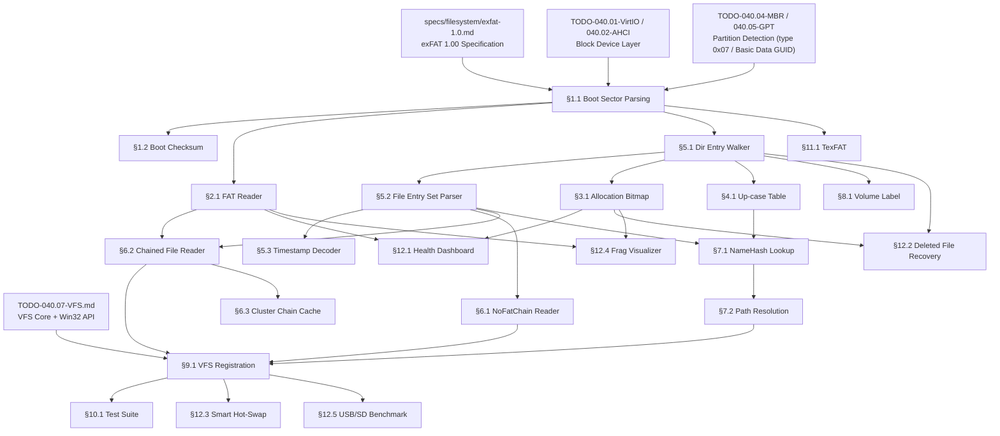

# 040.10-exFAT — Extensible File Allocation Table Driver

> **Goal:** Implement a production-grade exFAT 1.00 driver for Impossible OS.
> The driver must parse the Boot Sector (shift-based geometry), validate the
> boot checksum, read the Allocation Bitmap for free-space tracking, decompress
> the Up-case Table for case-insensitive lookups, traverse directory entry sets
> (File `0x85` + Stream Extension `0xC0` + File Name `0xC1`), support the
> NoFatChain contiguous-file optimization, and integrate with the VFS layer.
> exFAT is the standard filesystem for SDXC cards, USB flash drives, and
> cross-platform data exchange — essential for removable media support.

> [!CAUTION]
> **Memory Rule:** Use `pmm_alloc_contiguous()` for Allocation Bitmap (can be
> several MB on large volumes), Up-case Table (~128 KB uncompressed), and file
> data buffers. `kmalloc` is ONLY for small kernel structs (≤ 4 KB). See
> `rules.md` Known Gotchas.

> [!WARNING]
> **Read-Only First.** exFAT write support requires careful write-ordering
> for crash safety: bitmap → FAT → data → secondary entries → primary entry →
> clear dirty flag. This TODO starts with **read-only** access. Write support
> is a P3 extension.

> [!IMPORTANT]
> **Byte Order:** All exFAT on-disk structures are **little-endian**.
>
> **Spec Reference:** All offsets, field layouts, and algorithms reference the
> [exFAT 1.00 Specification](file:///home/derickpayne/impossible-os/specs/filesystem/exfat-1.0.md)
> in the repo at `specs/filesystem/exfat-1.0.md`.

---

## TODO Completion Roadmap (Cross-File)

> [!IMPORTANT]
> **Four TODO files and one spec** feed into the exFAT driver. They have
> cross-dependencies that dictate implementation order. This roadmap shows
> the correct sequence — completing items out of order will cause rework.

### Dependency Graph

### Phase-by-Phase Implementation Order

| ⭐ | Phase  | TODO File / Spec                      | Sections                         | What It Delivers                                                          | Depends On                   | Status |
| -- | :----: | ------------------------------------- | -------------------------------- | ------------------------------------------------------------------------- | ---------------------------- | :----: |
| 💎 | **0**  | `specs/filesystem/exfat-1.0.md`       | Full spec                        | Wire formats, offset tables, algorithms — **read before coding**          | —                            |   ⬜   |
| 💎 | **0**  | `TODO-040.01` / `TODO-040.02`         | Block device layer               | `blkdev_read()` via VirtIO or AHCI                                       | —                            |   ✅   |
| 💎 | **0**  | `TODO-040.04` / `TODO-040.05`         | Partition detection              | MBR type `0x07` / GPT `EBD0A0A2-...` → exFAT partition found             | Phase 0 (block)              |   ✅   |
| 💎 | **1**  | `TODO-040.10-exFAT.md`               | §1.1 Boot Sector Parsing         | Locate FAT, Data Region, root directory — all geometry fields             | Phase 0 (partitions)         |   ⬜   |
| 💎 | **1**  | `TODO-040.10-exFAT.md`               | §2.1 FAT Reader                  | Read FAT from disk, chain walking for fragmented files                    | Phase 1 (§1.1)               |   ⬜   |
| 💎 | **2**  | `TODO-040.10-exFAT.md`               | §5.1 Directory Entry Walker      | Walk 32-byte entries, classify all entry types (0x81–0xE0)                | Phase 1 (§1.1)               |   ⬜   |
| 💎 | **2**  | `TODO-040.10-exFAT.md`               | §5.2 File Entry Set Parser       | File metadata: attributes, timestamps, FirstCluster, DataLength           | Phase 2 (§5.1)               |   ⬜   |
| 💎 | **2**  | `TODO-040.10-exFAT.md`               | §3.1 Allocation Bitmap Reader    | Free-space queries, cluster allocation validation                         | Phase 2 (§5.1)               |   ⬜   |
| 💎 | **2**  | `TODO-040.10-exFAT.md`               | §4.1 Up-case Table Loader        | Case-insensitive filename comparisons via decompressed 128 KB table       | Phase 2 (§5.1)               |   ⬜   |
| 💎 | **3**  | `TODO-040.10-exFAT.md`               | §5.3 Timestamp Decoder           | Convert exFAT compact timestamps + timezone offsets to POSIX time         | Phase 2 (§5.2)               |   ⬜   |
| 💎 | **3**  | `TODO-040.10-exFAT.md`               | §6.1 NoFatChain Contiguous Reader| Fast O(1) reads for contiguous files — no FAT lookup needed               | Phase 2 (§5.2)               |   ⬜   |
| 💎 | **3**  | `TODO-040.10-exFAT.md`               | §6.2 FAT-Chained File Reader     | Read fragmented file data by following FAT cluster chains                 | Phase 1 (§2.1) + Phase 2 (§5.2) |   ⬜   |
| 💎 | **4**  | `TODO-040.10-exFAT.md`               | §7.1 NameHash Lookup             | Fast directory search — hash-first eliminates ~99% of string compares     | Phase 2 (§5.2, §4.1)        |   ⬜   |
| 💎 | **4**  | `TODO-040.10-exFAT.md`               | §7.2 Path Resolution             | Full hierarchical `\path\to\file` resolution from root directory          | Phase 4 (§7.1)               |   ⬜   |
| 💎 | **4**  | `TODO-040.10-exFAT.md`               | §8.1 Volume Label Reader         | Extract and display volume name from `0x83` entry                         | Phase 2 (§5.1)               |   ⬜   |
| 💎 | **5**  | `TODO-040.10-exFAT.md`               | §9.1 VFS Registration            | Mount exFAT volumes, wire `vfs_ops` callbacks, drive letter assignment    | Phase 3 (§6.1, §6.2) + Phase 4 (§7.2) + VFS (040.07) |   ⬜   |
| 💎 | **5**  | `TODO-040.10-exFAT.md`               | §6.3 Cluster Chain Cache         | Per-file O(1) indexed cluster access — critical for large media files     | Phase 3 (§6.2)               |   ⬜   |
| 💎 | **5**  | `TODO-040.10-exFAT.md`               | §1.2 Boot Checksum Validation    | Boot region integrity + backup boot region failover                       | Phase 1 (§1.1)               |   ⬜   |
| 💎 | **6**  | `TODO-040.10-exFAT.md`               | §11.1 TexFAT Dual FAT/Bitmap    | Transaction-safe exFAT support for embedded/automotive SD cards           | Phase 1 (§1.1) + Phase 2 (§3.1) |   ⬜   |
| 💎 | **6**  | `TODO-040.10-exFAT.md`               | §10.1 Test Suite                 | Automated validation with exFAT test images (contiguous, fragmented, LFN) | Phase 5 (§9.1)               |   ⬜   |
| ⭐ | **7**  | `TODO-040.10-exFAT.md`               | §12.1 Health Dashboard           | At-a-glance removable media health — **no OS does this**                  | Phase 2 (§3.1) + Phase 1 (§2.1) |   ⬜   |
| ⭐ | **7**  | `TODO-040.10-exFAT.md`               | §12.2 Deleted File Recovery      | Built-in GUI recovery for exFAT USB/SD — **Windows/Linux have nothing**   | Phase 2 (§3.1, §5.1)        |   ⬜   |
| ⭐ | **7**  | `TODO-040.10-exFAT.md`               | §12.3 Smart Hot-Swap Detection   | Auto-mount on insert, safe-eject on remove — **beats Windows/Linux UX**   | Phase 5 (§9.1)               |   ⬜   |
| ⭐ | **8**  | `TODO-040.10-exFAT.md`               | §12.4 Fragmentation Visualizer   | Cluster-level map in Disk Manager — **no OS does this for exFAT**         | Phase 2 (§3.1) + Phase 1 (§2.1) |   ⬜   |
| ⭐ | **8**  | `TODO-040.10-exFAT.md`               | §12.5 USB/SD Speed Benchmark     | One-click removable media speed test — **no OS has this built-in**        | Phase 5 (§9.1)               |   ⬜   |

> [!NOTE]
> **Phase 0** is a prerequisite — block I/O and partition detection must be working.
> **Phase 1** parses the boot sector and FAT — these are the foundation for everything.
> **Phase 2** is the cornerstone — the directory entry walker, allocation bitmap, and
> up-case table are needed before you can do anything useful with files. The walker
> finds system files (`0x81` bitmap, `0x82` upcase, `0x83` label) AND user files (`0x85`).
> **Phases 3–4** build file reading and directory search — after these you can read any file.
> **Phase 5** integrates with the VFS and adds the chain cache and boot checksum for
> production readiness.
> **Phase 6** adds TexFAT (embedded/automotive compat) and the test suite.
> **Phase 7** delivers the competitive features (⭐): removable media health dashboard,
> deleted file recovery, and smart hot-swap detection.
> **Phase 8** adds the polish features (⭐): cluster fragmentation visualizer and
> built-in USB/SD speed benchmark — unprecedented for any desktop OS.

> [!TIP]
> **Quick wins after Phase 2:**
> - §8.1 Volume Label Reader is trivial — just find the `0x83` entry and read 22 bytes.
>   Implement it alongside the bitmap/upcase table loading in the mount sequence.
> - §5.3 Timestamp Decoder is a pure arithmetic function with no disk I/O. Write and
>   test it standalone as soon as §5.2 gives you raw timestamp fields.
> - §6.1 NoFatChain Reader is simpler than the chained reader — contiguous files require
>   a single `ClusterHeapOffset + (FirstCluster − 2) × SectorsPerCluster` calculation.
>   Implement it first to get basic file reads working before tackling chain walking.
>
> **Critical gotcha:** The Allocation Bitmap and Up-case Table are **not** at fixed disk
> locations. They are system files found via directory entries (`0x81` and `0x82`) in the
> root directory. You **must** implement §5.1 Directory Entry Walker before you can locate
> them. The mount sequence is: Boot Sector → FAT → Root Directory Walker → find Bitmap →
> find Upcase → load both. Don't try to hardcode their positions.
>
> **Partition detection note:** exFAT shares MBR type `0x07` and GPT GUID
> `EBD0A0A2-B9E5-4433-87C0-68B6B72699C7` (Microsoft Basic Data) with NTFS. The
> `probe_exfat()` function must check the `"EXFAT   "` signature at offset `0x03` AND the
> 53-byte MustBeZero region at `0x0B` to differentiate from NTFS (which has `"NTFS    "`
> at the same offset). Probe order: try NTFS first, then exFAT.
>
> **Memory rule reminder:** The Allocation Bitmap can be **several megabytes** on large
> volumes (1 bit per cluster × millions of clusters). The Up-case Table decompresses to
> 128 KB. Both **must** use `pmm_alloc_contiguous()`. The kernel heap is only 2 MiB —
> the bitmap alone could exhaust it.

---

## 1. Boot Sector Parsing & Validation

### 1.1 Boot Sector Reader

**Prompt:** Read Sector 0 of the exFAT partition. Validate the FileSystemName at offset `0x03` as `"EXFAT   "` (8 bytes, space-padded). Verify the MustBeZero region at `0x0B` (53 bytes, all `0x00`) — this prevents legacy FAT drivers from misidentifying the volume. Extract the shift-based geometry: `BytesPerSectorShift` and `SectorsPerClusterShift`. Calculate `BytesPerSector = 1 << BytesPerSectorShift` and `BytesPerCluster = 1 << (BytesPerSectorShift + SectorsPerClusterShift)`. Extract all strategic volume fields: `FatOffset`, `FatLength`, `ClusterHeapOffset`, `ClusterCount`, `FirstClusterOfRootDir`, `VolumeSerialNumber`, and `FileSystemRevision`. Validate revision is `0x0100` (version 1.00). Parse `VolumeFlags` for dirty/failure status. After completing all items, mark every item as `[x]`, update this prompt to a verification prompt, run `bash scripts/build.sh clean`, and commit as `"exfat: boot sector parsing"`. Add notes directly in this TODO section. After implementation, save any gotchas, solutions, and important information to MCP memory (`mcp_memory_create_entities` / `mcp_memory_add_observations`).

- [ ] Read first sector of partition
- [ ] Validate JumpBoot at `0x00`: must be `0xEB, 0x76, 0x90`
- [ ] Validate FileSystemName at `0x03` (8B): must be `"EXFAT   "` (space-padded)
- [ ] Validate MustBeZero at `0x0B` (53B): all bytes must be `0x00`
- [ ] Extract geometry fields:
  - [ ] `PartitionOffset` at offset 64 (8B) — sector offset on physical disk
  - [ ] `VolumeLength` at offset 72 (8B) — total sectors in volume
  - [ ] `FatOffset` at offset 80 (4B) — starting sector of FAT
  - [ ] `FatLength` at offset 84 (4B) — sector length of one FAT
  - [ ] `ClusterHeapOffset` at offset 88 (4B) — starting sector of Data Region
  - [ ] `ClusterCount` at offset 92 (4B) — usable clusters (max `0xFFFFFFF5`)
  - [ ] `FirstClusterOfRootDir` at offset 96 (4B) — root directory start cluster
  - [ ] `VolumeSerialNumber` at offset 100 (4B)
  - [ ] `FileSystemRevision` at offset 104 (2B) — must be `0x0100`
  - [ ] `VolumeFlags` at offset 106 (2B)
  - [ ] `BytesPerSectorShift` at offset 108 (1B) — valid: 9–12
  - [ ] `SectorsPerClusterShift` at offset 109 (1B) — valid: 0–(25 − BytesPerSectorShift)
  - [ ] `NumberOfFats` at offset 110 (1B) — 1 (standard) or 2 (TexFAT)
  - [ ] `DriveSelect` at offset 111 (1B) — BIOS drive number (0x80 for HDD)
  - [ ] `PercentInUse` at offset 112 (1B) — 0–100, or `0xFF` if unknown
- [ ] Calculate derived values:
  - [ ] `bytes_per_sector = 1 << BytesPerSectorShift`
  - [ ] `bytes_per_cluster = 1 << (BytesPerSectorShift + SectorsPerClusterShift)`
  - [ ] `sectors_per_cluster = 1 << SectorsPerClusterShift`
- [ ] Parse VolumeFlags:
  - [ ] Bit 0: ActiveFat — which FAT/bitmap is active (0=first, 1=second)
  - [ ] Bit 1: VolumeDirty — 1=not cleanly unmounted, log warning
  - [ ] Bit 2: MediaFailure — 1=I/O errors detected, log warning
- [ ] Reject mount if `FileSystemRevision` != `0x0100`
- [ ] Log: `[exFAT] Volume: %llu sectors, cluster=%u bytes, FAT at sector %u`
- [ ] Log: `[exFAT] Root dir at cluster %u, %u clusters total, serial=0x%08X`
- [ ] If VolumeDirty: `[exFAT] WARNING: Volume not cleanly unmounted`
- [ ] Store all values in `struct exfat_volume`
- [ ] Commit: `"exfat: boot sector parsing"`

### 1.2 Boot Checksum Validation

**Prompt:** Validate the boot region integrity by computing the 32-bit checksum over Sectors 0–10 (11 sectors). The checksum uses a circular right rotation + addition algorithm. Critical: skip bytes 106, 107 (VolumeFlags) and 112 (PercentInUse) during calculation — these fields change during normal operation. Compare against the repeating checksum pattern in Sector 11. If mismatch, fall back to the Backup Boot Region at Sectors 12–23. After completing all items, mark every item as `[x]`, update this prompt to a verification prompt, run `bash scripts/build.sh clean`, and commit as `"exfat: boot checksum validation"`. Add notes directly in this TODO section. After implementation, save any gotchas, solutions, and important information to MCP memory (`mcp_memory_create_entities` / `mcp_memory_add_observations`).

- [ ] Implement `exfat_boot_checksum(sectors, total_bytes)`:
  - [ ] Initialize `checksum = 0` (32-bit)
  - [ ] For each byte index 0 to `total_bytes - 1`:
    - [ ] Skip index 106 (VolumeFlags byte 0)
    - [ ] Skip index 107 (VolumeFlags byte 1)
    - [ ] Skip index 112 (PercentInUse)
    - [ ] `checksum = ((checksum & 1) ? 0x80000000 : 0) + (checksum >> 1) + byte`
  - [ ] Return `checksum`
- [ ] Read Sectors 0–10 (Main Boot Region, excluding checksum sector)
- [ ] Compute checksum, compare against Sector 11 (repeating 32-bit pattern)
- [ ] If mismatch → try Backup Boot Region (Sectors 12–23):
  - [ ] Compute backup checksum over Sectors 12–22
  - [ ] Compare against Sector 23
  - [ ] If backup valid → log warning, use backup, optionally restore main
  - [ ] If both invalid → reject mount
- [ ] Log: `[exFAT] Boot checksum: computed=0x%08X, stored=0x%08X — %s`
- [ ] Commit: `"exfat: boot checksum validation"`

---

## 2. File Allocation Table

### 2.1 FAT Reader

**Prompt:** Read the FAT from the FAT Region at sector `FatOffset`. The FAT is a flat array of 32-bit entries. Index 0 = Media Descriptor (`0xF8FFFFFF`), index 1 = reserved (`0xFFFFFFFF`). User clusters start at index 2. Values: `0x00000000` = free, `0xFFFFFFF7` = bad cluster, `0xFFFFFFFF` = end-of-chain, `0x00000002`–`ClusterCount+1` = next cluster pointer. Implement cluster chain walking for fragmented files. After completing all items, mark every item as `[x]`, update this prompt to a verification prompt, run `bash scripts/build.sh clean`, and commit as `"exfat: FAT reader"`. Add notes directly in this TODO section. After implementation, save any gotchas, solutions, and important information to MCP memory (`mcp_memory_create_entities` / `mcp_memory_add_observations`).

- [ ] Read FAT from disk: `FatLength` sectors starting at sector `FatOffset`
- [ ] Allocate FAT buffer via `pmm_alloc_contiguous()` (can be several MB)
- [ ] Validate FAT[0] = `0xF8FFFFFF` (Media Descriptor)
- [ ] Validate FAT[1] = `0xFFFFFFFF` (Reserved)
- [ ] Implement `exfat_fat_read(vol, cluster_index)` → next cluster or EOC
- [ ] Implement `exfat_walk_chain(vol, start_cluster, callback)`:
  - [ ] Follow chain: `current = start_cluster`, read `FAT[current]`
  - [ ] If `0xFFFFFFFF` → end of chain
  - [ ] If `0xFFFFFFF7` → bad cluster, skip/error
  - [ ] If `0x00000000` → corrupt chain, error
  - [ ] Else → next cluster, continue
  - [ ] Invoke callback for each cluster
  - [ ] Safety: limit chain length to `ClusterCount` to detect loops
- [ ] Implement cluster-to-sector translation:
  - [ ] `sector = ClusterHeapOffset + (cluster - 2) × SectorsPerCluster`
- [ ] Cache FAT in memory for fast lookups (or read on demand for large volumes)
- [ ] Log: `[exFAT] FAT loaded: %u entries, %u sectors`
- [ ] Commit: `"exfat: FAT reader"`

---

## 3. Allocation Bitmap

### 3.1 Allocation Bitmap Reader

**Prompt:** The Allocation Bitmap is a system file in the Cluster Heap, located via a directory entry of type `0x81` in the root directory. Each bit represents one cluster: 1=allocated, 0=free. Bit 0 of byte 0 = Cluster 2 (first usable cluster). Read the bitmap, cache it in memory, and implement free-space queries. After completing all items, mark every item as `[x]`, update this prompt to a verification prompt, run `bash scripts/build.sh clean`, and commit as `"exfat: allocation bitmap reader"`. Add notes directly in this TODO section. After implementation, save any gotchas, solutions, and important information to MCP memory (`mcp_memory_create_entities` / `mcp_memory_add_observations`).

- [ ] Find Allocation Bitmap entry (type `0x81`) in root directory
- [ ] Parse bitmap entry fields:
  - [ ] `BitmapFlags` at offset 1 (1B) — bit 0: 0=first bitmap, 1=second (TexFAT)
  - [ ] `FirstCluster` at offset 20 (4B) — start cluster of bitmap data
  - [ ] `DataLength` at offset 24 (8B) — bitmap size in bytes
- [ ] Read bitmap data from cluster chain (or contiguous if NoFatChain)
- [ ] Allocate bitmap buffer via `pmm_alloc_contiguous(DataLength)`
- [ ] Implement `exfat_bitmap_is_allocated(vol, cluster)`:
  - [ ] `byte_index = (cluster - 2) / 8`
  - [ ] `bit_index = (cluster - 2) % 8`
  - [ ] Return `bitmap[byte_index] & (1 << bit_index)`
- [ ] Count free clusters for `GetDiskFreeSpace()` support
- [ ] Log: `[exFAT] Allocation bitmap: %llu bytes, %u free clusters`
- [ ] Commit: `"exfat: allocation bitmap reader"`

---

## 4. Up-case Table

### 4.1 Up-case Table Loader

**Prompt:** The Up-case Table is a system file in the Cluster Heap, located via a directory entry of type `0x82` in the root directory. It maps every UTF-16 code point (`0x0000`–`0xFFFF`) to its uppercase equivalent for deterministic case-insensitive comparisons. The table may be compressed using `0xFFFF` run-length encoding: `0xFFFF` followed by a 16-bit count means that many consecutive characters are identity-mapped (map to themselves). Decompress into a 128 KB (65536 × 2 bytes) lookup table. Validate via the `TableChecksum` field. After completing all items, mark every item as `[x]`, update this prompt to a verification prompt, run `bash scripts/build.sh clean`, and commit as `"exfat: Up-case table loader"`. Add notes directly in this TODO section. After implementation, save any gotchas, solutions, and important information to MCP memory (`mcp_memory_create_entities` / `mcp_memory_add_observations`).

- [ ] Find Up-case Table entry (type `0x82`) in root directory
- [ ] Parse entry fields:
  - [ ] `TableChecksum` at offset 4 (4B) — integrity check
  - [ ] `FirstCluster` at offset 20 (4B) — start cluster of table data
  - [ ] `DataLength` at offset 24 (8B) — compressed table size
- [ ] Read compressed table data from cluster chain
- [ ] Allocate decompressed table: `pmm_alloc_contiguous(65536 × 2)` = 128 KB
- [ ] Decompress:
  - [ ] Read 16-bit values sequentially
  - [ ] If value == `0xFFFF` → read next 16-bit value as count
    - [ ] Fill next `count` entries with identity mappings (entry[n] = n)
  - [ ] Else → store as explicit uppercase mapping
  - [ ] Continue until 65536 entries filled
- [ ] Compute checksum of decompressed table, compare with `TableChecksum`
- [ ] Implement `exfat_upcase(vol, unicode_char)` → uppercase equivalent
- [ ] Commit: `"exfat: Up-case table loader"`

---

## 5. Directory Entry Set Parsing

### 5.1 Directory Entry Walker

**Prompt:** exFAT directories are arrays of 32-byte entries in cluster chains. Each entry has a 1-byte EntryType at offset 0: bit 7=InUse, bit 6=Category (0=primary, 1=secondary), bit 5=Importance (0=critical, 1=benign), bits 0–4=TypeCode. Walk entries by reading cluster data, advancing 32 bytes per entry. Stop when EntryType == `0x00` (end of directory). Skip deleted entries (bit 7 clear). After completing all items, mark every item as `[x]`, update this prompt to a verification prompt, run `bash scripts/build.sh clean`, and commit as `"exfat: directory entry walker"`. Add notes directly in this TODO section. After implementation, save any gotchas, solutions, and important information to MCP memory (`mcp_memory_create_entities` / `mcp_memory_add_observations`).

- [ ] Implement `exfat_readdir(vol, dir_cluster, callback)`:
  - [ ] Read directory's cluster chain (via FAT or contiguous if NoFatChain)
  - [ ] Walk 32-byte entries sequentially
  - [ ] Parse EntryType byte:
    - [ ] `0x00` → end of directory, stop
    - [ ] Bit 7 clear → deleted entry, skip
    - [ ] Bit 7 set → active entry, classify by TypeCode
  - [ ] Known entry types:
    - [ ] `0x81` — Allocation Bitmap (system)
    - [ ] `0x82` — Up-case Table (system)
    - [ ] `0x83` — Volume Label
    - [ ] `0x85` — File Directory Entry (start of file entry set)
    - [ ] `0xC0` — Stream Extension (secondary)
    - [ ] `0xC1` — File Name (secondary)
    - [ ] `0xE0` — Vendor Extension (benign, skip)
  - [ ] Unknown critical entries (bit 5 = 0, unknown TypeCode) → error
  - [ ] Unknown benign entries (bit 5 = 1) → safely ignore
- [ ] Commit: `"exfat: directory entry walker"`

### 5.2 File Entry Set Parser

**Prompt:** A valid file is described by a Directory Entry Set: one `0x85` (File), one `0xC0` (Stream Extension), and one or more `0xC1` (File Name) entries — in strict order, no interleaving. Parse the File entry (`0x85`) for attributes and timestamps. Parse Stream Extension (`0xC0`) for FirstCluster, DataLength, ValidDataLength, NoFatChain flag, NameLength, and NameHash. Parse File Name entries (`0xC1`) — each carries 15 UTF-16LE characters. Concatenate name across entries using NameLength from `0xC0`. Validate SetChecksum. After completing all items, mark every item as `[x]`, update this prompt to a verification prompt, run `bash scripts/build.sh clean`, and commit as `"exfat: file entry set parser"`. Add notes directly in this TODO section. After implementation, save any gotchas, solutions, and important information to MCP memory (`mcp_memory_create_entities` / `mcp_memory_add_observations`).

- [ ] Parse File Directory Entry (`0x85`):
  - [ ] `SecondaryCount` at offset 1 (1B) — number of following secondary entries (2–18)
  - [ ] `SetChecksum` at offset 2 (2B) — integrity of entire entry set
  - [ ] `FileAttributes` at offset 4 (2B):
    - [ ] Bit 0: Read-Only, Bit 1: Hidden, Bit 2: System, Bit 4: Directory, Bit 5: Archive
  - [ ] Timestamps at offset 8–31 (24B):
    - [ ] `CreateTimestamp` (4B), `LastModifiedTimestamp` (4B), `LastAccessedTimestamp` (4B)
    - [ ] `Create10msIncrement` (1B), `LastModified10msIncrement` (1B)
    - [ ] `CreateUtcOffset` (1B), `LastModifiedUtcOffset` (1B), `LastAccessedUtcOffset` (1B)
- [ ] Parse Stream Extension Entry (`0xC0`):
  - [ ] `GeneralSecondaryFlags` at offset 1 (1B):
    - [ ] Bit 0: AllocationPossible
    - [ ] **Bit 1: NoFatChain** — if set, file is contiguous, ignore FAT
  - [ ] `NameLength` at offset 3 (1B) — filename length in UTF-16 chars (1–255)
  - [ ] `NameHash` at offset 4 (2B) — pre-computed hash of up-cased name
  - [ ] `ValidDataLength` at offset 8 (8B) — amount of valid written data
  - [ ] `FirstCluster` at offset 20 (4B) — start of file data
  - [ ] `DataLength` at offset 24 (8B) — total allocated size
- [ ] Parse File Name Entries (`0xC1`):
  - [ ] Each entry carries 15 UTF-16LE characters at offset 2 (30B)
  - [ ] Concatenate across entries using `NameLength` from `0xC0`
  - [ ] Convert UTF-16LE → ASCII for display (or store as UTF-16)
- [ ] Validate SetChecksum:
  - [ ] Compute over entire entry set (all 32-byte entries concatenated)
  - [ ] Use 16-bit circular right rotation algorithm
  - [ ] Skip bytes 2 and 3 of the first (`0x85`) entry (where checksum is stored)
  - [ ] If mismatch → reject entry set, log error
- [ ] Commit: `"exfat: file entry set parser"`

### 5.3 Timestamp Decoder

**Prompt:** exFAT timestamps use a compact 32-bit format: 7 bits year (offset from 1980), 4 bits month, 5 bits day, 5 bits hour, 6 bits minute, 5 bits DoubleSeconds (0–29 = 0–58 seconds). The 10ms increment byte adds 0–199 (0–1990 ms) granularity. The UTC offset byte provides timezone info (signed, 15-minute intervals). Convert to POSIX timestamps for VFS compatibility. After completing all items, mark every item as `[x]`, update this prompt to a verification prompt, run `bash scripts/build.sh clean`, and commit as `"exfat: timestamp decoder"`. Add notes directly in this TODO section. After implementation, save any gotchas, solutions, and important information to MCP memory (`mcp_memory_create_entities` / `mcp_memory_add_observations`).

- [ ] Implement `exfat_decode_timestamp(raw, increment_10ms, utc_offset)`:
  - [ ] Extract year: `((raw >> 25) & 0x7F) + 1980`
  - [ ] Extract month: `(raw >> 21) & 0x0F`
  - [ ] Extract day: `(raw >> 16) & 0x1F`
  - [ ] Extract hour: `(raw >> 11) & 0x1F`
  - [ ] Extract minute: `(raw >> 5) & 0x3F`
  - [ ] Extract seconds: `(raw & 0x1F) × 2`
  - [ ] Add 10ms increment: `increment_10ms × 10` milliseconds
  - [ ] Apply UTC offset: `(int8_t)(utc_offset & 0x7F) × 15` minutes
  - [ ] Convert to POSIX timestamp (seconds since 1970-01-01)
- [ ] Handle: year 1980–2107, timezone -12h to +14h
- [ ] Commit: `"exfat: timestamp decoder"`

---

## 6. File Data Reading

### 6.1 NoFatChain Contiguous Reader

**Prompt:** The NoFatChain flag (bit 1 of `GeneralSecondaryFlags` in `0xC0`) indicates the file is stored as contiguous clusters — the FAT is NOT consulted. Calculate the physical data location directly: `sector = ClusterHeapOffset + (FirstCluster - 2) × SectorsPerCluster`, length = `DataLength`. Read data sequentially without any FAT lookups. Cap reads at `ValidDataLength`. After completing all items, mark every item as `[x]`, update this prompt to a verification prompt, run `bash scripts/build.sh clean`, and commit as `"exfat: NoFatChain contiguous reader"`. Add notes directly in this TODO section. After implementation, save any gotchas, solutions, and important information to MCP memory (`mcp_memory_create_entities` / `mcp_memory_add_observations`).

- [ ] Detect NoFatChain: check bit 1 of `GeneralSecondaryFlags`
- [ ] If NoFatChain:
  - [ ] Calculate starting sector: `ClusterHeapOffset + (FirstCluster - 2) × SectorsPerCluster`
  - [ ] Calculate total sectors: `ceil(DataLength / BytesPerSector)`
  - [ ] Read directly: `blkdev_read(dev, start_sector, count, buf)`
  - [ ] Cap at `ValidDataLength` (don't read uninitialized data beyond it)
- [ ] If NOT NoFatChain → use FAT chain walker (§2.1) to follow cluster chain
- [ ] Implement `exfat_read_data(vol, stream_ext, offset, length, buffer)`:
  - [ ] Auto-detect NoFatChain vs FAT chain
  - [ ] Handle partial cluster reads (start/end alignment)
  - [ ] Handle reads spanning multiple clusters
- [ ] Commit: `"exfat: NoFatChain contiguous reader"`

### 6.2 FAT-Chained File Reader

**Prompt:** For fragmented files (NoFatChain = 0), walk the FAT cluster chain to read data. Start at `FirstCluster`, follow FAT pointers, read each cluster's data in sequence. Handle partial reads at start and end of the request. After completing all items, mark every item as `[x]`, update this prompt to a verification prompt, run `bash scripts/build.sh clean`, and commit as `"exfat: FAT-chained file reader"`. Add notes directly in this TODO section. After implementation, save any gotchas, solutions, and important information to MCP memory (`mcp_memory_create_entities` / `mcp_memory_add_observations`).

- [ ] Implement `exfat_read_chained(vol, first_cluster, offset, length, buffer)`:
  - [ ] Calculate which cluster in the chain contains `offset`:
    - [ ] `cluster_index = offset / bytes_per_cluster`
    - [ ] Walk chain `cluster_index` times from `first_cluster`
  - [ ] Calculate offset within cluster: `offset % bytes_per_cluster`
  - [ ] Read data from each cluster until `length` bytes consumed
  - [ ] Follow FAT chain: `next = FAT[current]`, stop at `0xFFFFFFFF`
  - [ ] Handle reads spanning cluster boundaries
- [ ] Optimize: cache cluster chains for open files
- [ ] Commit: `"exfat: FAT-chained file reader"`

### 6.3 Cluster Chain Cache

**Prompt:** For FAT-chained files, every read that starts mid-file must walk the FAT chain from `FirstCluster`. A file at offset 100 MB on a 32 KB cluster volume requires traversing ~3,200 FAT entries. Implement a per-file cluster chain cache: on `open()`, walk the entire chain once and store it as a flat array of cluster numbers. Subsequent reads use O(1) indexed access: `clusters[offset / bytes_per_cluster]`. This is especially critical for media files on SD cards where seek performance matters. After completing all items, mark every item as `[x]`, update this prompt to a verification prompt, run `bash scripts/build.sh clean`, and commit as `"exfat: cluster chain cache"`. Add notes directly in this TODO section. After implementation, save any gotchas, solutions, and important information to MCP memory (`mcp_memory_create_entities` / `mcp_memory_add_observations`).

- [ ] On `exfat_open()` for FAT-chained files (NoFatChain = 0):
  - [ ] Walk entire chain: `FirstCluster` → FAT[n] → FAT[n+1] → ... → `0xFFFFFFFF`
  - [ ] Store as flat array: `uint32_t *chain` (length = `DataLength / bytes_per_cluster`)
  - [ ] Allocate via `pmm_alloc_contiguous()` if > 4 KB
- [ ] On `exfat_read()`: `physical_cluster = chain[offset / bytes_per_cluster]`
- [ ] On `exfat_close()`: free cached chain
- [ ] Skip caching for NoFatChain files (already O(1) via direct calculation)
- [ ] Telemetry: log if chain length > 1000: `[exFAT] Large chain: %u clusters for '%s'`
- [ ] Commit: `"exfat: cluster chain cache"`

---

## 7. Directory Lookup & Path Resolution

### 7.1 NameHash-Accelerated Lookup

**Prompt:** Implement fast file lookup using the NameHash optimization. When searching for a filename, first up-case it via the Up-case Table, then compute the 16-bit NameHash. Scan `0xC0` entries comparing only the 2-byte hash. Only if the hash matches, extract and compare the full filename from `0xC1` entries. This eliminates ~99% of string comparisons. After completing all items, mark every item as `[x]`, update this prompt to a verification prompt, run `bash scripts/build.sh clean`, and commit as `"exfat: NameHash directory lookup"`. Add notes directly in this TODO section. After implementation, save any gotchas, solutions, and important information to MCP memory (`mcp_memory_create_entities` / `mcp_memory_add_observations`).

- [ ] Implement `exfat_name_hash(upcased_name, name_length)`:
  - [ ] Initialize `hash = 0` (16-bit)
  - [ ] For each UTF-16 character:
    - [ ] `hash = ((hash & 1) ? 0x8000 : 0) | (hash >> 1)`
    - [ ] `hash += char & 0xFF` (low byte)
    - [ ] `hash = ((hash & 1) ? 0x8000 : 0) | (hash >> 1)`
    - [ ] `hash += char >> 8` (high byte)
  - [ ] Return `hash`
- [ ] Implement `exfat_finddir(vol, dir_cluster, target_name)`:
  - [ ] Up-case `target_name` using the Up-case Table
  - [ ] Compute target's NameHash
  - [ ] Walk directory entries
  - [ ] For each `0x85` + `0xC0` + `0xC1` entry set:
    - [ ] Compare NameHash from `0xC0` against target hash
    - [ ] If hash mismatch → skip (no string comparison needed)
    - [ ] If hash match → extract full name from `0xC1` entries, compare
    - [ ] If full match → return file info (cluster, size, attributes)
  - [ ] If not found → `FILE_NOT_FOUND`
- [ ] Commit: `"exfat: NameHash directory lookup"`

### 7.2 Path Resolution

**Prompt:** Implement full hierarchical path resolution. Start at `FirstClusterOfRootDir`, split the path by `\` or `/`, and resolve each component using `exfat_finddir`. For each component, verify it's a directory (FileAttributes bit 4) before continuing. After completing all items, mark every item as `[x]`, update this prompt to a verification prompt, run `bash scripts/build.sh clean`, and commit as `"exfat: path resolution"`. Add notes directly in this TODO section. After implementation, save any gotchas, solutions, and important information to MCP memory (`mcp_memory_create_entities` / `mcp_memory_add_observations`).

- [ ] Implement `exfat_resolve_path(vol, path)`:
  - [ ] Start at root directory: cluster = `vol->root_dir_cluster`
  - [ ] Split path by `\` or `/`
  - [ ] For each component:
    - [ ] `exfat_finddir(vol, current_cluster, component)`
    - [ ] If not found → return error
    - [ ] If not last component → verify it's a directory (bit 4 of FileAttributes)
    - [ ] Update current_cluster to found entry's FirstCluster
  - [ ] Return final entry's metadata
- [ ] Case-insensitive: all comparisons use Up-case Table normalization
- [ ] Commit: `"exfat: path resolution"`

---

## 8. Volume Label & System Entries

### 8.1 Volume Label Reader

**Prompt:** The Volume Label is a standalone entry of type `0x83` in the root directory. Field at offset 1 is CharacterCount (max 11), and offset 2 holds the 22-byte UTF-16LE label. A label with EntryType `0x03` (InUse bit clear) means no label set. After completing all items, mark every item as `[x]`, update this prompt to a verification prompt, run `bash scripts/build.sh clean`, and commit as `"exfat: volume label reader"`. Add notes directly in this TODO section. After implementation, save any gotchas, solutions, and important information to MCP memory (`mcp_memory_create_entities` / `mcp_memory_add_observations`).

- [ ] Find Volume Label entry (type `0x83`) in root directory
- [ ] Parse:
  - [ ] `CharacterCount` at offset 1 (1B) — 0–11
  - [ ] `VolumeLabel` at offset 2 (22B) — UTF-16LE
- [ ] If entry type is `0x03` (deleted) → no label set
- [ ] Convert UTF-16LE label to ASCII for display
- [ ] Log: `[exFAT] Volume label: '%s'`
- [ ] Commit: `"exfat: volume label reader"`

---

## 9. VFS Integration

### 9.1 exFAT VFS Driver Registration

**Prompt:** Register exFAT as a VFS filesystem driver. Implement `vfs_ops` callbacks: `open`, `close`, `read`, `readdir`, `finddir`, `stat`. Write ops return `-EROFS`. Detect exFAT volumes during partition scanning by checking `"EXFAT   "` signature at offset `0x03` and the MustBeZero region. After completing all items, mark every item as `[x]`, update this prompt to a verification prompt, run `bash scripts/build.sh clean`, and commit as `"exfat: VFS driver registration"`. Add notes directly in this TODO section. After implementation, save any gotchas, solutions, and important information to MCP memory (`mcp_memory_create_entities` / `mcp_memory_add_observations`).

- [ ] Create `src/kernel/fs/exfat.c` and `include/kernel/fs/exfat.h`
- [ ] Define `struct exfat_volume` — boot sector data, FAT, bitmap, upcase table
- [ ] Implement `exfat_detect(blkdev)`:
  - [ ] Read first sector
  - [ ] Check `"EXFAT   "` at offset `0x03`
  - [ ] Check MustBeZero at `0x0B` (53 bytes all zero)
- [ ] Register with partition scanner:
  - [ ] MBR type `0x07` (shared with NTFS — differentiate by signature)
  - [ ] GPT GUID `EBD0A0A2-B9E5-4433-87C0-68B6B72699C7` (Microsoft Basic Data — differentiate by signature)
- [ ] Implement all 16 `vfs_ops` callbacks (see `include/kernel/fs/vfs.h`):
  - [ ] `exfat_open(node, flags)` — locate entry set, cache stream extension info
  - [ ] `exfat_close(node)` — free cached cluster chain and stream data
  - [ ] `exfat_read(node, offset, size, buf)` — NoFatChain or FAT-chained read
  - [ ] `exfat_readdir(node, index)` — directory entry set enumeration
  - [ ] `exfat_finddir(node, name)` — NameHash-accelerated lookup
  - [ ] `exfat_stat(node, stat)` — populate from entry set metadata
  - [ ] `exfat_write` → return `-EROFS` (read-only)
  - [ ] `exfat_create` → return `-EROFS`
  - [ ] `exfat_unlink` → return `-EROFS`
  - [ ] `exfat_rename` → return `-EROFS`
  - [ ] `exfat_truncate` → return `-EROFS`
  - [ ] `exfat_mkdir` → return `-EROFS`
  - [ ] `exfat_rmdir` → return `-EROFS`
  - [ ] `exfat_set_attr` → return `-EROFS`
  - [ ] `exfat_set_times` → return `-EROFS`
  - [ ] `exfat_flush` → no-op (read-only, nothing to flush)
- [ ] Mount sequence:
  1. [ ] Parse boot sector (§1.1)
  2. [ ] Validate boot checksum (§1.2)
  3. [ ] Read FAT (§2.1)
  4. [ ] Read root directory to find Allocation Bitmap (§3.1) and Up-case Table (§4.1)
  5. [ ] Load bitmap and upcase table into memory
  6. [ ] Read Volume Label (§8.1)
  7. [ ] Register VFS mount
- [ ] Log: `[exFAT] Mounted volume '%s' on drive %c: (%llu bytes)`
- [ ] Commit: `"exfat: VFS driver registration"`

---

## 10. Testing & Validation

### 10.1 exFAT Test Suite

**Prompt:** Create exFAT test disk images using host tools (`mkfs.exfat` from exfatprogs). Test: basic file read, large contiguous file (NoFatChain), fragmented file (FAT chain), directory with many files, long filenames (200+ chars), case-insensitive lookup, volume label, and dirty volume flag. After completing all items, mark every item as `[x]`, update this prompt to a verification prompt, run `bash scripts/build.sh clean`, and commit as `"test: exFAT filesystem test suite"`. Add notes directly in this TODO section. After implementation, save any gotchas, solutions, and important information to MCP memory (`mcp_memory_create_entities` / `mcp_memory_add_observations`).

- [ ] Test image: small exFAT volume with files in root directory
  - [ ] Verify: boot sector parsing, root directory listing
- [ ] Test image: contiguous file (NoFatChain) with known content → byte-exact read
  - [ ] Verify: NoFatChain optimization, direct cluster calculation
- [ ] Test image: fragmented file (force fragmentation) → verify FAT chain walking
  - [ ] Verify: FAT chain traversal, multi-cluster stitching
- [ ] Test image: large file (>4 GB) — exFAT's key advantage over FAT32
  - [ ] Verify: 64-bit DataLength handling
- [ ] Test image: directory with 500+ files
  - [ ] Verify: NameHash acceleration, full directory enumeration
- [ ] Test image: long filename (200+ characters, multiple `0xC1` entries)
  - [ ] Verify: multi-entry name concatenation, correct NameLength
- [ ] Test image: case-insensitive lookup (`"README.txt"` found as `"readme.TXT"`)
  - [ ] Verify: Up-case Table normalization
- [ ] Test image: volume with label set
  - [ ] Verify: Volume Label parsing
- [ ] Test: dirty volume flag detection
  - [ ] Verify: warning logged, no write attempted
- [ ] QEMU: `-drive file=exfat_test.img,format=raw,if=none,id=t0 -device virtio-blk-pci,drive=t0`
- [ ] Commit: `"test: exFAT filesystem test suite"`

---

## 11. TexFAT Dual-FAT/Bitmap Support

### 11.1 TexFAT Reader

**Prompt:** TexFAT (Transaction-safe exFAT) uses dual FATs and dual Allocation Bitmaps for crash resilience. `NumberOfFats` in the boot sector is 2 (instead of 1), and the `ActiveFat` bit in `VolumeFlags` indicates which FAT/bitmap pair is current. The secondary FAT starts at `FatOffset + FatLength`, and the secondary bitmap is found via a second `0x81` entry with `BitmapFlags` bit 0 set. On mount, use the active pair. If the volume is dirty, compare both pairs to detect corruption. After completing all items, mark every item as `[x]`, update this prompt to a verification prompt, run `bash scripts/build.sh clean`, and commit as `"exfat: TexFAT dual FAT/bitmap support"`. Add notes directly in this TODO section. After implementation, save any gotchas, solutions, and important information to MCP memory (`mcp_memory_create_entities` / `mcp_memory_add_observations`).

> [!NOTE]
> TexFAT is primarily used in Windows CE/Embedded devices and automotive systems.
> Linux's exfat driver does NOT support TexFAT. Supporting it gives Impossible OS
> better compatibility with embedded and automotive SD cards.

- [ ] Detect TexFAT: check `NumberOfFats == 2` in boot sector
- [ ] Read `ActiveFat` flag from `VolumeFlags` bit 0
- [ ] If `ActiveFat == 0`: use FAT at `FatOffset`, bitmap with `BitmapFlags == 0`
- [ ] If `ActiveFat == 1`: use FAT at `FatOffset + FatLength`, bitmap with `BitmapFlags == 1`
- [ ] On dirty volume: compare active vs inactive FAT/bitmap
  - [ ] Mismatches indicate incomplete transaction — log warning
  - [ ] Use the active pair (it's the committed state)
- [ ] Log: `[exFAT] TexFAT detected: using FAT %d (active)`
- [ ] Commit: `"exfat: TexFAT dual FAT/bitmap support"`

---

## 12. Removable Media Health & Recovery (🚀 Impossible OS Feature)

### 12.1 Removable Media Health Dashboard

**Prompt:** exFAT is the primary filesystem for SDXC cards and large USB drives — media that users frequently unplug without safely ejecting. Aggregate exFAT volume health into a Disk Manager panel: dirty flag status, bad cluster count from the Allocation Bitmap, FAT consistency (any chains pointing to free clusters?), and free space percentage. For flash media, estimate wear by tracking the ratio of allocated-to-total clusters over time. Display a health score with clear status icons. No OS provides at-a-glance health for removable exFAT media. After completing all items, mark every item as `[x]`, update this prompt to a verification prompt, run `bash scripts/build.sh clean`, and commit as `"exfat: removable media health dashboard"`. Add notes directly in this TODO section. After implementation, save any gotchas, solutions, and important information to MCP memory (`mcp_memory_create_entities` / `mcp_memory_add_observations`).

> [!TIP]
> **Competitive Edge:** Windows shows a "Scan and fix" dialog when a dirty exFAT drive is
> inserted — but provides zero health details. Linux has `fsck.exfat` (CLI only).
> Impossible OS shows dirty flag, bad clusters, FAT consistency, and free space in one
> GUI panel. Safe-eject guarantees the dirty flag is cleared before physical removal.

- [ ] Read `VolumeFlags` dirty bit (bit 1) and media failure bit (bit 2)
- [ ] Count bad clusters: scan Allocation Bitmap for clusters marked allocated but with FAT entry `0xFFFFFFF7`
- [ ] FAT consistency check: scan FAT for chains pointing to free clusters in bitmap
  - [ ] Cross-references bitmap against FAT — mismatch = corruption indicator
- [ ] Compute free space: count zero bits in Allocation Bitmap
- [ ] Aggregate health:
  - [ ] Clean + no bad clusters + consistent = "Healthy" 🟢
  - [ ] Dirty flag set = "Needs Repair" 🟡
  - [ ] Bad clusters or FAT inconsistency = "Media Failing" 🔴
- [ ] Safe eject integration:
  - [ ] On "Safely Remove": flush all writes, clear dirty flag, sync FAT, unmount
  - [ ] Display "Safe to remove" confirmation only after unmount completes
  - [ ] If dirty flag clear fails → warn user: "Do not remove drive yet"
- [ ] Wire to Disk Manager: exFAT volume properties panel + taskbar eject icon
- [ ] Commit: `"exfat: removable media health dashboard"`

### 12.2 Deleted File Recovery (Forensics Mode)

**Prompt:** exFAT marks deleted files by clearing the InUse bit (bit 7) of the File Directory Entry (`0x85` → `0x05`). The Stream Extension and File Name entries also have InUse cleared (`0xC0` → `0x40`, `0xC1` → `0x41`). However, the entry set data — filename, timestamps, FirstCluster, DataLength — remains intact until the directory entries are reused. Implement a recovery scanner that walks directory clusters looking for deleted entry sets (`0x05` + `0x40` + `0x41`), cross-references data clusters against the Allocation Bitmap, and allows recovery. After completing all items, mark every item as `[x]`, update this prompt to a verification prompt, run `bash scripts/build.sh clean`, and commit as `"exfat: deleted file recovery"`. Add notes directly in this TODO section. After implementation, save any gotchas, solutions, and important information to MCP memory (`mcp_memory_create_entities` / `mcp_memory_add_observations`).

> [!TIP]
> **Competitive Edge:** Windows has no built-in recovery for exFAT. Linux has no exFAT
> recovery tool at all (even third-party options are extremely limited).
> Impossible OS having built-in GUI recovery for exFAT (the filesystem used on every
> SD card and USB drive) is a major differentiator for everyday data rescue.

> [!WARNING]
> **Read-only operation.** Recovery copies data to a DIFFERENT volume — never write to the
> exFAT volume being scanned. This preserves forensic integrity.

- [ ] Implement `exfat_scan_deleted(vol, dir_cluster, callback)`:
  - [ ] Walk directory clusters (same as §5.1 but include deleted entries)
  - [ ] Look for deleted entry sets: `0x05` (was `0x85`), `0x40` (was `0xC0`), `0x41` (was `0xC1`)
  - [ ] Parse deleted `0x40` entry: extract `FirstCluster`, `DataLength`, `NameLength`
  - [ ] Parse deleted `0x41` entries: extract filename
  - [ ] Cross-reference `FirstCluster` against Allocation Bitmap:
    - [ ] All clusters free → **High** confidence 🟢
    - [ ] Some clusters reallocated → **Medium** confidence 🟡
    - [ ] Most clusters reallocated → **Low** confidence 🔴
    - [ ] If NoFatChain was set: can use contiguous cluster range check
  - [ ] Callback: `{ filename, size, delete_time (if available), confidence }`
- [ ] Recursively scan subdirectories for deleted files
- [ ] Implement `exfat_recover_file(vol, entry_set, output_path)`:
  - [ ] Read data clusters via FAT chain or contiguous range
  - [ ] Write to output file on a different volume
- [ ] Wire to Disk Manager: "Recover Deleted Files" button on exFAT volumes
  - [ ] Show: filename, size, confidence icon (🟢/🟡/🔴)
- [ ] Commit: `"exfat: deleted file recovery"`

### 12.3 Smart Hot-Swap Detection (🚀 Impossible OS Feature)

**Prompt:** exFAT media (USB sticks, SD cards) are frequently inserted and removed without software eject. Implement device-change notifications that detect insertion and removal events, display a taskbar notification with the volume label and capacity, auto-mount on insert, and prompt for safe eject on removal. Track pending writes and warn if the user removes media with dirty buffers. No OS provides insertion-aware status for exFAT media — Windows shows a generic "safely remove" notification with no volume context, and Linux requires manual `umount`. After completing all items, mark every item as `[x]`, update this prompt to a verification prompt, run `bash scripts/build.sh clean`, and commit as `"exfat: smart hot-swap detection"`. Add notes directly in this TODO section. After implementation, save any gotchas, solutions, and important information to MCP memory (`mcp_memory_create_entities` / `mcp_memory_add_observations`).

> [!TIP]
> **Competitive Edge:** Windows shows a generic system-tray "Safely Remove Hardware" icon with
> no volume-specific context. Linux requires `umount` from a terminal. Impossible OS shows
> the volume label, capacity, health status, and pending write count in a rich taskbar popup.

- [ ] Hook block device insertion/removal notifications from USB/AHCI drivers
- [ ] On insertion: auto-probe for exFAT signature, mount, assign drive letter
  - [ ] Show taskbar notification: `"📀 SANDISK_USB (exFAT) — 64 GB — mounted as E:"`
- [ ] On removal request: check for open file handles and pending writes
  - [ ] If clean: unmount, clear dirty flag, show "Safe to remove" ✅
  - [ ] If dirty: warn user: `"⚠️ Files are still open on E: — do not remove yet"`
- [ ] On surprise removal (no eject): log warning, mark volume as dirty
- [ ] Display volume health icon in taskbar: 🟢 healthy, 🟡 dirty, 🔴 failing
- [ ] Commit: `"exfat: smart hot-swap detection"`

### 12.4 Cluster Fragmentation Visualizer (🚀 Impossible OS Feature)

**Prompt:** Visualize exFAT volume fragmentation by scanning the Allocation Bitmap and FAT. Display a block map in Disk Manager showing allocated (blue), free (white), bad (red), and system (yellow) clusters. Overlay file extents for a selected file to show its fragmentation pattern. No OS provides a visual fragmentation map for exFAT volumes — Windows only shows defrag for NTFS, and Linux has no exFAT fragmentation tooling at all. After completing all items, mark every item as `[x]`, update this prompt to a verification prompt, run `bash scripts/build.sh clean`, and commit as `"exfat: cluster fragmentation visualizer"`. Add notes directly in this TODO section. After implementation, save any gotchas, solutions, and important information to MCP memory (`mcp_memory_create_entities` / `mcp_memory_add_observations`).

> [!TIP]
> **Competitive Edge:** Windows 11's "Optimize Drives" tool explicitly excludes exFAT and
> shows no fragmentation data. Linux has zero exFAT defrag/analysis tools.
> Impossible OS shows a real-time cluster map with per-file extent overlays — unique in the industry.

- [ ] Scan Allocation Bitmap: classify each cluster as allocated/free/bad
- [ ] Scan FAT: count extents per file (# of non-contiguous chain segments)
- [ ] Build cluster map: 1 pixel per cluster, color-coded by state
  - [ ] Blue = allocated (user data), White = free, Red = bad (`0xFFFFFFF7`)
  - [ ] Yellow = system (bitmap, upcase table), Green = contiguous (NoFatChain)
- [ ] Overlay mode: select a file → highlight its clusters in the map
- [ ] Summary stats: total fragmentation %, most-fragmented files, free space gaps
- [ ] Wire to Disk Manager: "Fragmentation Map" tab on exFAT volume properties
- [ ] Commit: `"exfat: cluster fragmentation visualizer"`

### 12.5 USB/SD Speed Benchmark (🚀 Impossible OS Feature)

**Prompt:** Built-in one-click speed test for exFAT removable media. Measure sequential read, sequential write (when write support is available), and random 4K read throughput. Display results in MB/s with a speed class rating (UHS-I, UHS-II, etc. equivalents). Store results per device serial number for historical comparison. No OS has a built-in removable media benchmark — Windows users must download CrystalDiskMark, Linux users must install `fio`. After completing all items, mark every item as `[x]`, update this prompt to a verification prompt, run `bash scripts/build.sh clean`, and commit as `"exfat: USB/SD speed benchmark"`. Add notes directly in this TODO section. After implementation, save any gotchas, solutions, and important information to MCP memory (`mcp_memory_create_entities` / `mcp_memory_add_observations`).

> [!TIP]
> **Competitive Edge:** Neither Windows nor Linux has a built-in disk benchmark.
> Third-party tools (CrystalDiskMark, fio) are technical and confusing for average users.
> Impossible OS offers a one-click "Test Speed" button in Disk Manager with easy-to-read results.

- [ ] Sequential read benchmark: read 64 MB contiguous, compute MB/s
- [ ] Sequential write benchmark: write 64 MB contiguous (requires write support), compute MB/s
- [ ] Random 4K read benchmark: 1000 random 4K reads, compute IOPS and MB/s
- [ ] Speed class rating:
  - [ ] < 10 MB/s → "Class 10" equivalent
  - [ ] < 30 MB/s → "UHS-I U1"
  - [ ] < 100 MB/s → "UHS-I U3"
  - [ ] ≥ 100 MB/s → "UHS-II"
- [ ] Store results keyed by `VolumeSerialNumber` for historical comparison
- [ ] Display in Disk Manager: "Speed Test" button → results with bar chart
- [ ] Read-only benchmark mode available immediately (write test deferred to write support)
- [ ] Commit: `"exfat: USB/SD speed benchmark"`

---

## Priority Order

| ⭐ | Priority | Section                 | Description                                                       |
| -- | -------- | ----------------------- | ----------------------------------------------------------------- |
| 💎 | 🔴 P0    | 1.1 Boot Sector         | Foundation — locate FAT, Data Region, root directory              |
| 💎 | 🔴 P0    | 2.1 FAT Reader          | Foundation — traverse fragmented file cluster chains              |
| 💎 | 🔴 P0    | 5.1 Dir Entry Walker    | Foundation — parse all entry types                                |
| 💎 | �� P0    | 5.2 File Entry Set      | Foundation — extract file metadata and data pointers              |
| 💎 | 🟠 P1    | 3.1 Allocation Bitmap   | Metadata — free space queries                                     |
| 💎 | 🟠 P1    | 4.1 Up-case Table       | Correctness — case-insensitive lookups                            |
| 💎 | 🟠 P1    | 5.3 Timestamp Decoder   | Metadata — file times for VFS                                     |
| 💎 | 🟠 P1    | 6.1 NoFatChain Reader   | Performance — fast contiguous file reads                          |
| 💎 | 🟠 P1    | 6.2 Chained File Reader | Core feature — read fragmented file data                          |
| 💎 | 🟠 P1    | 7.1 NameHash Lookup     | Performance — fast directory searches                             |
| 💎 | 🟠 P1    | 7.2 Path Resolution     | Core feature — resolve full file paths                            |
| 💎 | 🟠 P1    | 9.1 VFS Registration    | Integration — make exFAT mountable                                |
| 💎 | 🟡 P2    | 1.2 Boot Checksum       | Integrity — validate boot region                                  |
| 💎 | 🟡 P2    | 6.3 Cluster Chain Cache | Performance — O(1) mid-file reads                                 |
| 💎 | 🟡 P2    | 8.1 Volume Label        | Feature — volume name display                                     |
| 💎 | 🟡 P2    | 11.1 TexFAT             | Compat — embedded/automotive SD cards                             |
| 💎 | 🟢 P3    | 10.1 Test Suite         | Quality — automated validation                                    |
| ⭐ | 🟢 P3    | 12.1 Health Dashboard   | **Removable media health** — no OS does this                      |
| ⭐ | 🟢 P3    | 12.2 Deleted Recovery   | **Built-in recovery** — Windows/Linux have nothing                |
| ⭐ | 🟢 P3    | 12.3 Hot-Swap Detection | **Smart insertion/removal events** — beats Windows eject UX       |
| ⭐ | �� P4    | 12.4 Frag Visualizer    | **Cluster-level fragmentation map** — no OS exposes this          |
| ⭐ | 🔵 P4    | 12.5 USB/SD Benchmark   | **Built-in removable media speed test** — no OS has this built-in |

> [!NOTE]
> ⭐ = Feature where Impossible OS can be **superior** to both Windows and Linux.

---

## OS Comparison

| ⭐ | Feature                          | 🪟 Windows 11 (`exfat.sys`)       | 🐧 Linux (`fs/exfat`)             | 🚀 Impossible OS                                    |
| -- | -------------------------------- | --------------------------------- | ---------------------------------- | ---------------------------------------------------- |
| 💎 | Boot sector parsing              | ✅ Native                          | ✅ Full                             | ⬜ §1.1 P0                                           |
| 💎 | Boot checksum validation         | ✅ Full                            | ✅ Full                             | ⬜ §1.2 P2                                           |
| 💎 | Backup Boot Region failover      | ✅ Full                            | ✅ Full                             | ⬜ §1.2 (backup path)                                |
| 💎 | FAT traversal                    | ✅ Full                            | ✅ Full                             | ⬜ §2.1 P0                                           |
| 💎 | NoFatChain contiguous files      | ✅ Native                          | ✅ Full                             | ⬜ §6.1 P1                                           |
| 💎 | Allocation Bitmap                | ✅ Full R/W                        | ✅ Full R/W                         | ⬜ §3.1 P1 (read-only)                               |
| 💎 | Up-case Table (compressed)       | ✅ Native                          | ✅ Full                             | ⬜ §4.1 P1                                           |
| 💎 | Directory Entry Set parsing      | ✅ Full                            | ✅ Full                             | ⬜ §5.1–5.3 P0                                       |
| 💎 | NameHash fast lookup             | ✅ Native                          | ✅ Full                             | ⬜ §7.1 P1                                           |
| 💎 | Path resolution                  | ✅ Full                            | ✅ Full                             | ⬜ §7.2 P1                                           |
| 💎 | SetChecksum validation           | ✅ Full                            | ✅ Full                             | ⬜ §5.2 (checksum field)                             |
| 💎 | Timestamps (timezone-aware)      | ✅ Full (UTC offsets)              | ✅ Full                             | ⬜ §5.3 P1                                           |
| 💎 | Volume Label                     | ✅ Full                            | ✅ Full                             | ⬜ §8.1 P2                                           |
| 💎 | Long filenames (255 chars)       | ✅ Native                          | ✅ Full                             | ⬜ §5.2 (multi-`0xC1`)                               |
| 💎 | Files > 4 GB                     | ✅ Native                          | ✅ Full                             | ⬜ §6.1/6.2 (64-bit `DataLength`)                    |
| 💎 | Cluster chain caching            | ✅ Windows cache manager           | ✅ Page cache                       | ⬜ §6.3 P2                                           |
| 💎 | VFS integration                  | ✅ Native (`exfat.sys`)            | ✅ Native (`fs/exfat`)              | ⬜ §9.1 P1                                           |
| 💎 | Vendor Extensions (`0xE0`)       | ✅ Supported                       | ✅ Ignored (benign)                 | ⬜ Ignored (benign)                                  |
| 💎 | TexFAT (dual FAT/bitmap)         | ✅ Full (Windows CE)               | ❌ Not supported                    | ⬜ §11.1 P2 — **beats Linux**                        |
| 💎 | OEM Flash Parameters             | ✅ Full                            | ❌ Ignored                          | ⬜ Future (flash-aligned I/O)                        |
| 💎 | Write support                    | ✅ Full R/W                        | ✅ Full R/W                         | ⬜ Future P3                                         |
| 💎 | Read-only driver (minimum)       | ✅                                 | ✅                                  | ⬜ Requires §1–§7, §9                                |
| ⭐ | **Removable media health**       | ❌ "Scan and fix" only             | ❌ CLI `fsck.exfat` only            | ⬜ §12.1 P3 — **GUI health + safe eject**            |
| ⭐ | **Deleted file recovery**        | ❌ No built-in recovery            | ❌ No recovery tool exists          | ⬜ §12.2 P3 — **built-in GUI recovery**              |
| ⭐ | **Smart hot-swap detection**     | ⚠️ Generic "safely remove" toast  | ❌ Manual `umount` required         | ⬜ §12.3 P3 — **auto-detect insert/remove + status** |
| ⭐ | **Fragmentation visualizer**     | ❌ No exFAT defrag/visualizer      | ❌ No tooling                       | ⬜ §12.4 P4 — **cluster-level map in Disk Manager**  |
| ⭐ | **USB/SD speed benchmark**       | ❌ No built-in benchmark           | ❌ CLI `fio` (separate install)     | ⬜ §12.5 P4 — **one-click speed test in GUI**        |
| ⭐ | **Anti-aliased TTF in dir list** | ✅ Explorer uses system font       | ⚠️ Terminal only                   | ⬜ File Manager uses TTF — **beats Linux**            |

> **After P0+P1 items:** Impossible OS has a fully functional read-only exFAT driver for USB/SD media.
> **After P2+P3 items:** TexFAT support (beats Linux), removable media health dashboard, and deleted file recovery — **no desktop OS offers all three**.
> **After P4 items:** Fragmentation visualizer plus built-in USB/SD benchmark — unprecedented for removable media.

---

## Key Files

| File                             | Purpose                                                                  |
| -------------------------------- | ------------------------------------------------------------------------ |
| `src/kernel/fs/exfat.c`         | [NEW] exFAT driver implementation                                        |
| `include/kernel/fs/exfat.h`     | [NEW] exFAT structures, constants, entry types                           |
| `src/kernel/fs/partition.c`     | Add `probe_exfat()` + `PART_FS_EXFAT` + exFAT mount in mount sequence   |
| `include/kernel/fs/partition.h` | Add `PART_FS_EXFAT` constant (currently missing — only FAT32/IXFS/ext2)  |
| `include/kernel/fs/vfs.h`       | VFS ops interface — exFAT stubs all 16 callbacks (write ops → `-EROFS`)  |
| `specs/filesystem/exfat-1.0.md` | Full on-disk specification reference                                     |

---

## Codebase Integration Notes

> [!IMPORTANT]
> **Current codebase gaps** that must be addressed before the exFAT driver can work:

| Gap                                                | Current State                                                  | Required Change                                                         |
| -------------------------------------------------- | -------------------------------------------------------------- | ----------------------------------------------------------------------- |
| No `PART_FS_EXFAT` constant                        | `partition.h` only defines FAT32 (1), IXFS (2), ext2 (3)      | Add `#define PART_FS_EXFAT 4`                                           |
| No `probe_exfat()` in partition scanner             | `partition.c` probes FAT32, IXFS, ext2 — not exFAT            | Add probe: check `"EXFAT   "` at offset `0x03` + 53-byte MustBeZero    |
| `partition_mount_filesystems()` skips exFAT         | Only mounts FAT32 and IXFS volumes (line 366)                  | Add `else if (pi->fs_type == PART_FS_EXFAT)` branch                    |
| `partition_fs_name()` missing exFAT                 | Returns "Unknown" for exFAT type                               | Add `case PART_FS_EXFAT: return "exFAT";`                              |
| VFS `read()` uses `uint32_t offset`                 | Max 4 GB offset — exFAT supports files > 4 GB                 | Note: VFS offset width is a known limitation (see `TODO-040.07-VFS.md`) |
| Probe order matters (NTFS vs exFAT)                 | Both share MBR type `0x07` and GPT Basic Data GUID             | Probe NTFS first (check `"NTFS    "`), then exFAT                       |
| `partition.c` header comment lists only FAT32/IXFS  | Line 9–12: "FAT32, IXFS, ext2" — no mention of exFAT          | Update comment to include exFAT                                          |
