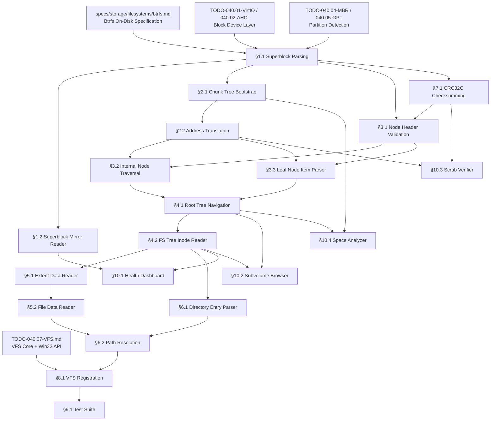

# 040.12-BTRS — Btrfs Read-Only Driver

> **Goal:** Implement a read-only Btrfs (B-tree File System) driver for Impossible OS.
> The driver must parse the Superblock (with mirrors), navigate the multi-tree B-tree
> hierarchy (Root Tree, Chunk Tree, FS Tree, Extent Tree, Checksum Tree), translate
> logical-to-physical addresses via the Chunk Tree, read files through extent data items,
> and enumerate directories via `DIR_ITEM`/`DIR_INDEX` keys. This enables reading files
> from modern Linux partitions — essential for dual-boot interoperability and data recovery.
> Btrfs is the default filesystem on Fedora, openSUSE, and several other distributions.

> [!CAUTION]
> **Memory Rule:** Use `pmm_alloc_contiguous()` for node buffers (16 KiB each),
> chunk map cache, extent buffers, and any allocation > 4 KB. `kmalloc` is ONLY
> for small kernel structs (≤ 4 KB). See `rules.md` Known Gotchas.

> [!WARNING]
> **Read-Only First.** Btrfs write support requires a full Copy-on-Write transaction
> manager with reference counting, delayed allocation, and ENOSPC prediction.
> This TODO covers **read-only** access only. Write support is a future P4 extension.

> [!IMPORTANT]
> **Byte Order:** All Btrfs on-disk structures are **little-endian**. The driver must
> use byte-swap macros on big-endian architectures.
>
> **Spec Reference:** All offsets, field layouts, and algorithms reference the
> [Btrfs Specification](file:///home/derickpayne/impossible-os/specs/storage/filesystems/btrfs.md).

---

## TODO Completion Roadmap (Cross-File)

> [!IMPORTANT]
> **Four TODO files and one spec** feed into the Btrfs driver. Btrfs is significantly
> more complex than ext4 due to its multi-tree architecture and logical-to-physical
> address translation layer. The Chunk Tree must be bootstrapped before ANY other
> tree can be read — this is the critical unlocking step.

### Dependency Graph



### Phase-by-Phase Implementation Order

| ⭐ | Phase  | Sections                             | What It Delivers                                             | Depends On                     | Status |
| -- | :----: | ------------------------------------ | ------------------------------------------------------------ | ------------------------------ | :----: |
| 💎 | **0**  | Block device + partitions + spec     | `blkdev_read()`, partition detection, spec knowledge         | —                              |   ✅   |
| 💎 | **1**  | §1.1 Superblock Parsing              | Magic validation, tree roots, feature flags                  | Phase 0                        |   ⬜   |
| 💎 | **1**  | §2.1 Chunk Tree Bootstrap            | Inline chunk map → logical-to-physical translation           | Phase 1 (§1.1)                 |   ⬜   |
| 💎 | **1**  | §3.1 Node Header Validation          | Checksum + generation + bytenr verification                  | Phase 1 (§1.1)                 |   ⬜   |
| 💎 | **2**  | §2.2 Address Translation             | Full chunk map from Chunk Tree                               | Phase 1 (§2.1)                 |   ⬜   |
| 💎 | **2**  | §3.2 Internal Node Traversal         | Binary search key-pointer pairs, tree descent                | Phase 1 (§3.1) + §2.2         |   ⬜   |
| 💎 | **2**  | §3.3 Leaf Node Item Parser           | Dual-growth item/payload extraction                          | Phase 1 (§3.1) + §2.2         |   ⬜   |
| 💎 | **2**  | §7.1 CRC32C Checksumming             | Validate node + data checksums from Checksum Tree            | Phase 1 (§1.1)                 |   ⬜   |
| 💎 | **3**  | §4.1 Root Tree Navigation            | Locate any tree root by Object ID                            | Phase 2 (§3.2, §3.3)          |   ⬜   |
| 💎 | **3**  | §4.2 FS Tree Inode Reader            | Parse `btrfs_inode_item` (160 bytes)                         | Phase 3 (§4.1)                 |   ⬜   |
| 💎 | **4**  | §5.1 Extent Data Reader              | Parse `EXTENT_DATA` keys, inline + regular extents           | Phase 3 (§4.2)                 |   ⬜   |
| 💎 | **4**  | §6.1 Directory Entry Parser          | Parse `DIR_ITEM`/`DIR_INDEX` keys                            | Phase 3 (§4.2)                 |   ⬜   |
| 💎 | **5**  | §5.2 File Data Reader                | Read file contents via extent → chunk → physical             | Phase 4 (§5.1)                 |   ⬜   |
| 💎 | **5**  | §6.2 Path Resolution                 | Full path traversal from root subvolume                      | Phase 4 (§5.1, §6.1)          |   ⬜   |
| 💎 | **6**  | §8.1 VFS Registration                | Mount Btrfs volumes, `vfs_ops` callbacks                     | Phase 5 + VFS (040.07)         |   ⬜   |
| 💎 | **6**  | §1.2 Superblock Mirror Reader        | Fallback to mirrors at 64 MiB / 256 GiB                     | Phase 1 (§1.1)                 |   ⬜   |
| 💎 | **7**  | §9.1 Test Suite                      | Automated validation with Btrfs test images                  | Phase 6 (§8.1)                 |   ⬜   |
| ⭐ | **7**  | §10.1 Health Dashboard               | Volume health, generation, device info in GUI                | Phase 3 (§4.2) + §1.2         |   ⬜   |
| ⭐ | **7**  | §10.2 Subvolume Browser              | List/browse all subvolumes and snapshots                     | Phase 3 (§4.1, §4.2)          |   ⬜   |
| ⭐ | **7**  | §10.3 Scrub Verifier                 | Verify data checksums for entire volume                      | Phase 5 (§7.1) + §2.2         |   ⬜   |
| ⭐ | **7**  | §10.4 Space Analyzer                 | Block group usage, data/metadata/system breakdown            | Phase 1 (§2.1) + §4.1         |   ⬜   |
| ⭐ | **8**  | §10.5 Device Stats Dashboard         | Per-device error counters, I/O stats in GUI                  | Phase 3 (§4.1) + §1.1         |   ⬜   |
| ⭐ | **8**  | §10.6 Quota Group Reader             | Display qgroup limits and usage per subvolume                | Phase 3 (§4.1, §4.2)          |   ⬜   |
| ⭐ | **8**  | §10.7 Send/Receive Stream Parser     | Parse and inspect Btrfs send streams for migration           | Phase 5 (§5.2, §6.2)          |   ⬜   |
| ⭐ | **8**  | §10.8 Generation Timeline            | Visual timeline of filesystem transactions + snapshots       | Phase 3 (§4.1) + §1.1         |   ⬜   |

> [!NOTE]
> **Phase 0** is already done — block devices, partitions, and VFS core are in place.
> **Phase 1** is the critical bootstrap — superblock parsing and chunk tree bootstrap
> unlock the logical-to-physical translation layer without which nothing else works.
> **Phase 2** builds the B-tree traversal engine and CRC32C verification.
> **Phase 3** navigates tree hierarchies and reads inodes.
> **Phases 4–5** implement file/directory reading and path resolution.
> **Phase 6** wires everything to the VFS for mountable volumes.
> **Phase 7** adds the test suite and core exclusive features (⭐).
> **Phase 8** adds advanced exclusive features (send/receive, quotas, device stats).

> [!TIP]
> **Critical unlocking step:** The Chunk Tree bootstrap (§2.1) is unique to Btrfs.
> Unlike ext4 where block numbers map directly to disk offsets, Btrfs uses logical
> addresses everywhere. The superblock embeds an inline chunk map (`sys_chunk_array`)
> that provides just enough translation to read the full Chunk Tree. Without this
> bootstrap, you cannot read ANY tree node.
>
> **Node size:** Btrfs nodes are typically **16 KiB** (configurable via `nodesize`
> in the superblock). Each node buffer must be allocated via `pmm_alloc_contiguous()`
> — never `kmalloc()`. A single B-tree traversal from root to leaf may read 3–5 nodes.
>
> **CRC32C reuse:** The IXFS driver has `ixfs_crc32c()` using polynomial `0x82F63B78`.
> Factor it to a shared `kernel/crc32c.c` — Btrfs uses the same CRC32C algorithm with
> seed `0xFFFFFFFF` and stores checksums as the first 32 bytes of every node.
>
> **QEMU testing:** Create a Btrfs disk image on the host:
> ```
> truncate -s 256M btrfs_test.img && mkfs.btrfs btrfs_test.img
> mount btrfs_test.img /mnt && echo "hello" > /mnt/test.txt && umount /mnt
> qemu ... -drive file=btrfs_test.img,format=raw,if=none,id=b0 -device virtio-blk-pci,drive=b0
> ```

---

## 1. Superblock Parsing & Validation

### 1.1 Superblock Reader

**Prompt:** Read the primary Superblock from physical byte offset `0x10000` (64 KiB) per Btrfs spec §3. Validate the magic number `_BHRfS_M` (`0x4D5F53665248425F` LE64) at offset `0x40`. Extract all critical fields: fsid, generation, tree root addresses (Root Tree, Chunk Tree, Log Tree), total/used bytes, sectorsize, nodesize, num_devices, feature flags (`incompat_flags`, `compat_ro_flags`), and the inline system chunk array. Parse `csum_type` to determine the checksum algorithm. After completing all items, mark every item as `[x]`, update this prompt to a verification prompt, run `bash scripts/build.sh clean`, and commit as `"btrfs: superblock parsing and validation"`. After implementation, save any gotchas to MCP memory.

- [ ] Read 4096 bytes from partition byte offset `0x10000` (64 KiB)
- [ ] Validate magic at `0x40`: `_BHRfS_M` (LE64 `0x4D5F53665248425F`)
- [ ] Validate checksum at `0x00` (32 bytes) — covers bytes `0x20` to `0x1000`
- [ ] Extract core fields:
  - [ ] `fsid` at `0x20` (16B UUID)
  - [ ] `bytenr` at `0x30` (8B) — physical address of this block (must be `0x10000`)
  - [ ] `generation` at `0x48` (8B) — current transaction ID
  - [ ] `root` at `0x50` (8B) — logical address of Root Tree root
  - [ ] `chunk_root` at `0x58` (8B) — logical address of Chunk Tree root
  - [ ] `total_bytes` at `0x70` (8B) — filesystem size
  - [ ] `bytes_used` at `0x78` (8B) — allocated bytes
  - [ ] `num_devices` at `0x88` (8B) — device count
  - [ ] `sectorsize` at `0x90` (4B) — minimum I/O size
  - [ ] `nodesize` at `0x94` (4B) — B-tree node size (typically 16 KiB)
  - [ ] `sys_chunk_array_size` at `0xA0` (4B) — inline chunk map size
  - [ ] `incompat_flags` at `0xBC` (8B) — must reject unknown flags
  - [ ] `compat_ro_flags` at `0xB4` (8B) — allow read-only if unknown
  - [ ] `csum_type` at `0xC4` (2B) — 0=CRC32C, 1=xxHash64, 2=SHA-256, 3=BLAKE2b
  - [ ] `root_level` at `0xC6` (1B), `chunk_root_level` at `0xC7` (1B)
- [ ] Feature flag gating:
  - [ ] If unknown `incompat_flags` bits → reject mount entirely
  - [ ] If unknown `compat_ro_flags` bits → mount read-only (our default)
  - [ ] Log all detected flags
- [ ] Log: `[btrfs] Volume: %llu bytes, nodesize=%u, sectorsize=%u, gen=%llu`
- [ ] Log: `[btrfs] UUID=%s, devices=%llu, csum=%s`
- [ ] Commit: `"btrfs: superblock parsing and validation"`

### 1.2 Superblock Mirror Reader

**Prompt:** Btrfs stores 3 superblock copies at fixed offsets: primary at 64 KiB, mirror 1 at 64 MiB, mirror 2 at 256 GiB (if device is large enough). Implement reading mirror superblocks for fallback on primary corruption and for health comparison. Select the superblock with the highest valid `generation` as the authoritative copy. After completing all items, mark every item as `[x]`, run `bash scripts/build.sh clean`, and commit as `"btrfs: superblock mirror reader"`. After implementation, save any gotchas to MCP memory.

> [!TIP]
> **Competitive Edge:** Linux reads mirrors via `btrfs rescue super-recover` CLI.
> Windows has no Btrfs support. Impossible OS can automatically fall back to mirrors
> and show mirror consistency status in the Health Dashboard.

- [ ] Define mirror offsets: `0x10000` (64 KiB), `0x4000000` (64 MiB), `0x4000000000` (256 GiB)
- [ ] Check device size before reading each mirror
- [ ] For each mirror: read, validate magic + checksum, extract `generation`
- [ ] Select highest-generation valid superblock as authoritative
- [ ] If primary corrupt → log: `[btrfs] Primary superblock corrupt — using mirror %u (gen %llu)`
- [ ] Health: compare all mirror generations — mismatch → `⚠️ Superblock mirrors inconsistent`
- [ ] Commit: `"btrfs: superblock mirror reader"`

---

## 2. Chunk Tree & Address Translation

### 2.1 Chunk Tree Bootstrap

**Prompt:** Btrfs uses logical addresses throughout — every tree node address is logical, not physical. The Chunk Tree maps logical → physical. But to READ the Chunk Tree you need address translation. This chicken-and-egg is resolved by the superblock's inline `sys_chunk_array` — a packed array of chunk items embedded directly in the superblock (offset `0x32B`, size from `sys_chunk_array_size`). Parse this inline array to build an initial chunk map sufficient to read the full Chunk Tree from disk. Per spec §7. After completing all items, mark every item as `[x]`, run `bash scripts/build.sh clean`, and commit as `"btrfs: chunk tree bootstrap"`. After implementation, save any gotchas to MCP memory.

> [!CAUTION]
> **This is the critical unlocking step.** Without the chunk map, you cannot translate
> ANY logical address to a physical disk offset. Every other tree read depends on this.

- [ ] Parse `sys_chunk_array` from superblock (starts at byte `0x32B`):
  - [ ] Walk packed entries: each is a `btrfs_disk_key` (17B) + `btrfs_chunk` (variable)
  - [ ] Extract from each `btrfs_chunk`: `length`, `type`, `num_stripes`, `stripe_len`
  - [ ] Extract stripe array: `num_stripes × btrfs_stripe` (each 32B: devid + offset + dev_uuid)
  - [ ] Key's `offset` = logical address base of the chunk
- [ ] Build in-memory chunk map: sorted array of `{ logical_start, length, physical_offset, devid }`
- [ ] Allocate chunk map via `pmm_alloc_contiguous()` (may grow when full Chunk Tree is read)
- [ ] Log: `[btrfs] Bootstrap: %u chunks from sys_chunk_array`
- [ ] Commit: `"btrfs: chunk tree bootstrap"`

### 2.2 Full Chunk Tree & Address Translation

**Prompt:** Using the bootstrap chunk map, read the full Chunk Tree from disk (root address from superblock `chunk_root`). Parse all `CHUNK_ITEM_KEY` items to build the complete logical-to-physical chunk map. Implement address translation for Single profile (direct mapping). Log RAID profiles (RAID0/1/10) but reject them in Phase 1 (single-device only). Per spec §7. After completing all items, mark every item as `[x]`, run `bash scripts/build.sh clean`, and commit as `"btrfs: chunk tree and address translation"`. After implementation, save any gotchas to MCP memory.

- [ ] Read Chunk Tree root node using bootstrap chunk map for translation
- [ ] Traverse Chunk Tree (B-tree search for all `CHUNK_ITEM_KEY` type = 228):
  - [ ] Parse each `btrfs_chunk` structure (same format as sys_chunk_array entries)
  - [ ] Add to chunk map (replace bootstrap entries with full entries)
- [ ] Implement `btrfs_logical_to_physical(vol, logical_addr)`:
  - [ ] Binary search chunk map for chunk containing `logical_addr`
  - [ ] `relative_offset = logical_addr - chunk_logical_base`
  - [ ] Single profile: `physical = stripe.offset + relative_offset`
  - [ ] RAID0/1/10/5/6: log warning, return error (single-device only for now)
- [ ] Parse chunk `type` bitmask for allocation type (Data/Metadata/System) + RAID profile
- [ ] Log: `[btrfs] Chunk map: %u chunks, %llu bytes data, %llu bytes metadata`
- [ ] Commit: `"btrfs: chunk tree and address translation"`

---

## 3. B-Tree Node Engine

### 3.1 Node Header Validation

**Prompt:** Every Btrfs B-tree node (internal or leaf) begins with a 101-byte `btrfs_header`. Implement reading and validating node headers: verify the checksum (CRC32C of bytes `0x20` onward), confirm `fsid` matches the volume, verify `bytenr` matches the address from which the node was read, and check `generation` against the expected generation from the parent pointer. Per spec §4.1. After completing all items, mark every item as `[x]`, run `bash scripts/build.sh clean`, and commit as `"btrfs: node header validation"`. After implementation, save any gotchas to MCP memory.

- [ ] Read `nodesize` bytes from disk (translate logical → physical first)
- [ ] Parse `btrfs_header` (101 bytes):
  - [ ] `csum` at `0x00` (32B) — checksum, computed from `0x20` to end of node
  - [ ] `fsid` at `0x20` (16B) — must match superblock UUID
  - [ ] `bytenr` at `0x30` (8B) — must match the logical address we read from
  - [ ] `flags` at `0x38` (7B) — node flags
  - [ ] `chunk_tree_uuid` at `0x40` (16B)
  - [ ] `generation` at `0x50` (8B) — must match parent's expected generation
  - [ ] `owner` at `0x58` (8B) — tree that owns this node
  - [ ] `nritems` at `0x60` (4B) — number of items/pointers
  - [ ] `level` at `0x64` (1B) — 0 = leaf, >0 = internal
- [ ] Compute CRC32C of bytes `[0x20..nodesize)`, compare against `csum[0..3]`
- [ ] Reject node if: checksum mismatch, fsid mismatch, bytenr mismatch, or generation too old
- [ ] Log on error: `[btrfs] NODE CORRUPT: expected gen=%llu got=%llu at logical=%llu`
- [ ] Commit: `"btrfs: node header validation"`

### 3.2 Internal Node Traversal

**Prompt:** Internal nodes (level > 0) contain an array of 33-byte key-pointer pairs starting at offset `0x65` (after the 101-byte header). Each pair has: `btrfs_disk_key` (17B: objectid + type + offset), `blockptr` (8B: logical address of child), `generation` (8B: expected generation of child). Implement binary search across these sorted key-pointer pairs to navigate down the tree. The key comparison is: objectid first, then type, then offset. Per spec §4.2. After completing all items, mark every item as `[x]`, run `bash scripts/build.sh clean`, and commit as `"btrfs: internal node traversal"`. After implementation, save any gotchas to MCP memory.

- [ ] Parse key-pointer array at offset `0x65`, `nritems` entries, each 33 bytes:
  - [ ] `key` (17B): `objectid` (8B LE) + `type` (1B) + `offset` (8B LE)
  - [ ] `blockptr` (8B LE) — logical address of child node
  - [ ] `generation` (8B LE) — expected generation of child
- [ ] Implement `btrfs_key_compare(a, b)`:
  - [ ] Compare `objectid` first (unsigned 64-bit)
  - [ ] If equal, compare `type` (unsigned 8-bit)
  - [ ] If equal, compare `offset` (unsigned 64-bit)
  - [ ] Returns: -1, 0, or 1
- [ ] Implement binary search: find the last key-pointer where `key <= search_key`
- [ ] Read child node at `blockptr`, validate header with expected `generation`
- [ ] Recurse until `level == 0` (leaf node reached)
- [ ] Commit: `"btrfs: internal node traversal"`

### 3.3 Leaf Node Item Parser

**Prompt:** Leaf nodes (level == 0) use a dual-growth layout: 25-byte `btrfs_item` headers grow forward from offset `0x65`, while payload data grows backward from the end of the node. Each item has: `key` (17B), `offset` (4B, relative to byte `0x65`), `size` (4B). The payload at `0x65 + item.offset` contains the actual data structure (inode, extent, dir entry, etc.). Implement parsing items and extracting payloads. Per spec §4.3. After completing all items, mark every item as `[x]`, run `bash scripts/build.sh clean`, and commit as `"btrfs: leaf node item parser"`. After implementation, save any gotchas to MCP memory.

- [ ] Parse item array at offset `0x65`, `nritems` entries, each 25 bytes:
  - [ ] `key` (17B): `objectid` + `type` + `offset`
  - [ ] `data_offset` (4B LE) — payload offset relative to end of header (`0x65`)
  - [ ] `data_size` (4B LE) — payload size in bytes
- [ ] Extract payload: `node_buffer + 0x65 + item.data_offset`, length `item.data_size`
- [ ] Implement search: binary search items for matching key (or closest lower bound)
- [ ] Implement iteration: walk items sequentially for range queries (e.g., all dir entries)
- [ ] Safety: validate `data_offset + data_size <= nodesize - 0x65` (bounds check)
- [ ] Commit: `"btrfs: leaf node item parser"`

---

## 4. Tree Navigation & Inode Reading

### 4.1 Root Tree Navigation

**Prompt:** The Root Tree (objectid 1, address from superblock `root`) is the directory of all other trees. Each subvolume/snapshot has a `ROOT_ITEM_KEY` (type 132) entry in the Root Tree. The default filesystem tree has objectid 5 (`BTRFS_FS_TREE_OBJECTID`). Read the Root Tree, locate the `btrfs_root_item` for the default subvolume, and extract its `bytenr` field to find the FS Tree root node. Per spec §5.1. After completing all items, mark every item as `[x]`, run `bash scripts/build.sh clean`, and commit as `"btrfs: root tree navigation"`. After implementation, save any gotchas to MCP memory.

- [ ] Read Root Tree root node (logical address from superblock `root`)
- [ ] Search for key: `{ objectid=5, type=ROOT_ITEM_KEY(132), offset=0 }`
- [ ] Parse `btrfs_root_item` payload:
  - [ ] `inode` (160B) — embedded inode for root directory
  - [ ] `generation` (8B) — creation transaction ID
  - [ ] `root_dirid` (8B) — root directory objectid (256 for user trees)
  - [ ] `bytenr` (8B) — **logical address of the FS Tree root node**
  - [ ] `flags` (8B) — e.g., `BTRFS_ROOT_SUBVOL_RDONLY` for read-only snapshots
- [ ] Also enumerate all `ROOT_ITEM_KEY` entries → list all subvolumes and snapshots
- [ ] Store tree roots in `struct btrfs_volume` for later access
- [ ] Log: `[btrfs] Default subvolume: tree_id=5, root=%llu, gen=%llu`
- [ ] Commit: `"btrfs: root tree navigation"`

### 4.2 FS Tree Inode Reader

**Prompt:** Inodes in Btrfs are stored as `INODE_ITEM_KEY` (type 1) items in the FS Tree. The inode number is the key's `objectid`. Parse the 160-byte `btrfs_inode_item` to extract: generation, size, nbytes, nlink, uid, gid, mode, flags, and all four timestamps (atime, ctime, mtime, otime — each 12 bytes with nanosecond precision). Map POSIX uid/gid to Impossible OS identity model. Per spec §5.2. After completing all items, mark every item as `[x]`, run `bash scripts/build.sh clean`, and commit as `"btrfs: inode reader"`. After implementation, save any gotchas to MCP memory.

- [ ] Search FS Tree for key: `{ objectid=inode_number, type=INODE_ITEM_KEY(1), offset=0 }`
- [ ] Parse `btrfs_inode_item` (160 bytes):
  - [ ] `generation` (8B), `transid` (8B) — NFS compat + last modification txn
  - [ ] `size` (8B) — logical file size
  - [ ] `nbytes` (8B) — actual disk usage (bytes, not blocks)
  - [ ] `nlink` (4B) — hard link count
  - [ ] `uid` (4B), `gid` (4B) — POSIX owner/group
  - [ ] `mode` (4B) — file type (upper 4 bits) + permissions (lower 12)
  - [ ] `flags` (8B) — `NODATACOW`, `NODATASUM`, `COMPRESS`, etc.
  - [ ] `atime` (12B), `ctime` (12B), `mtime` (12B), `otime` (12B) — `btrfs_timespec`
- [ ] Parse `btrfs_timespec`: `seconds` (8B signed) + `nanoseconds` (4B unsigned)
- [ ] File type from `mode`: `0x4000` = dir, `0x8000` = file, `0xA000` = symlink
- [ ] Map uid/gid to Impossible OS SIDs (default: map uid 0 → SYSTEM, others → Users)
- [ ] Log: `[btrfs] Inode %llu: mode=0x%04X, size=%llu, links=%u`
- [ ] Commit: `"btrfs: inode reader"`

---

## 5. File Data Reading

### 5.1 Extent Data Reader

**Prompt:** File data in Btrfs is referenced by `EXTENT_DATA_KEY` (type 108) items in the FS Tree. The key's offset is the logical byte offset within the file. Each item's payload describes the extent: it may be inline (data embedded in the item payload), a regular extent (logical disk address + size), or a prealloc extent (allocated but unwritten). Parse the extent data header to determine the type, then extract the data accordingly. Per spec §5 and §6. After completing all items, mark every item as `[x]`, run `bash scripts/build.sh clean`, and commit as `"btrfs: extent data reader"`. After implementation, save any gotchas to MCP memory.

- [ ] Search FS Tree for key: `{ objectid=inode, type=EXTENT_DATA_KEY(108), offset=file_offset }`
- [ ] Parse extent data header (first 21 bytes of payload):
  - [ ] `generation` (8B) — transaction that wrote this extent
  - [ ] `ram_bytes` (8B) — uncompressed size
  - [ ] `compression` (1B) — 0=none, 1=zlib, 2=LZO, 3=ZSTD
  - [ ] `encryption` (1B) — reserved (always 0 currently)
  - [ ] `other_encoding` (2B) — reserved
  - [ ] `type` (1B) — 0=inline, 1=regular, 2=prealloc
- [ ] Inline extent (type 0): data follows immediately after header in the item payload
  - [ ] Data length = `item.data_size - 21`
  - [ ] Copy directly to output buffer
- [ ] Regular extent (type 1): additional fields after header:
  - [ ] `disk_bytenr` (8B) — logical address of extent on disk
  - [ ] `disk_num_bytes` (8B) — size of extent on disk
  - [ ] `offset` (8B) — offset within the extent (for partial references)
  - [ ] `num_bytes` (8B) — number of bytes referenced from this extent
  - [ ] If `disk_bytenr == 0` → hole (sparse), return zeros
- [ ] Prealloc extent (type 2): same as regular but data is uninitialized → return zeros
- [ ] Handle compression flag: if `compression != 0`, log warning and skip (Phase 1)
- [ ] Commit: `"btrfs: extent data reader"`

### 5.2 File Data Reader

**Prompt:** Implement full file read: given a file inode, offset, and length, find all covering `EXTENT_DATA_KEY` items, translate extent logical addresses to physical via chunk map, read data from disk, and assemble into the output buffer. Handle reads spanning multiple extents, holes, and inline data. Cap reads at `inode.size`. After completing all items, mark every item as `[x]`, run `bash scripts/build.sh clean`, and commit as `"btrfs: file data reader"`. After implementation, save any gotchas to MCP memory.

- [ ] Implement `btrfs_read_data(vol, inode_num, offset, length, buffer)`:
  - [ ] Read inode to get `size` — cap `offset + length` at `size`
  - [ ] Search FS Tree for `EXTENT_DATA_KEY` items covering `[offset, offset+length)`
  - [ ] For each covering extent:
    - [ ] Inline: copy from item payload
    - [ ] Regular: translate `disk_bytenr` via `btrfs_logical_to_physical()`, read from disk
    - [ ] Hole (`disk_bytenr == 0`): fill output with zeros
    - [ ] Prealloc: fill output with zeros
  - [ ] Handle partial first/last extent reads
  - [ ] Handle gaps between extents (implicit holes → zeros)
- [ ] Verify data checksum from Checksum Tree (§7.1) after read
- [ ] Commit: `"btrfs: file data reader"`

---

## 6. Directory Reading

### 6.1 Directory Entry Parser

**Prompt:** Btrfs stores directory entries as two item types: `DIR_ITEM_KEY` (type 84, keyed by CRC32C hash of filename) for O(1) lookups, and `DIR_INDEX_KEY` (type 96, keyed by sequence number) for ordered enumeration. Each entry contains: child key (objectid + type), transaction ID, data length, name length, entry type, and the filename. Parse both types. Per spec §2. After completing all items, mark every item as `[x]`, run `bash scripts/build.sh clean`, and commit as `"btrfs: directory entry parser"`. After implementation, save any gotchas to MCP memory.

- [ ] Search FS Tree for `DIR_INDEX_KEY` items (type 96) with matching `objectid` (parent dir inode)
  - [ ] Iterate all items in key range for directory listing (readdir)
- [ ] Search FS Tree for `DIR_ITEM_KEY` items (type 84) for filename lookup (finddir)
  - [ ] Key offset = CRC32C hash of filename (for fast lookup)
- [ ] Parse directory entry payload:
  - [ ] `location` (17B) — `btrfs_disk_key` pointing to child (objectid = child inode)
  - [ ] `transid` (8B) — transaction that created this entry
  - [ ] `data_len` (2B) — extended data length (usually 0)
  - [ ] `name_len` (2B) — filename length
  - [ ] `type` (1B) — 1=file, 2=dir, 7=symlink
  - [ ] `name` (variable) — filename (NOT null-terminated, use `name_len`)
- [ ] Handle hash collisions: multiple entries with same `DIR_ITEM_KEY` offset
  - [ ] Walk packed entries within the same item until `name` matches
- [ ] Implement CRC32C hash of filename for `DIR_ITEM` lookup:
  - [ ] `~crc32c(~0, name, name_len)` — note the final inversion
- [ ] Also read `INODE_REF_KEY` (type 12) for back-references (parent dir → filename)
- [ ] Commit: `"btrfs: directory entry parser"`

### 6.2 Path Resolution

**Prompt:** Implement full path resolution from the root directory of the default subvolume. Split the path on `/`, starting at `root_dirid` (256), look up each component via `DIR_ITEM_KEY`. Handle symlinks by reading inline data from the symlink inode. Support mounting specific subvolumes by ID. After completing all items, mark every item as `[x]`, run `bash scripts/build.sh clean`, and commit as `"btrfs: path resolution"`. After implementation, save any gotchas to MCP memory.

- [ ] Implement `btrfs_resolve_path(vol, path)`:
  - [ ] Start at default subvolume's `root_dirid` (usually 256 = `BTRFS_FIRST_FREE_OBJECTID`)
  - [ ] Split path by `/`
  - [ ] For each component: look up via `DIR_ITEM_KEY` (CRC32C hash of name)
  - [ ] Follow `location.objectid` to next inode
  - [ ] If inode is directory → continue to next component
  - [ ] If inode is symlink → read target, resolve recursively (max 8 follows)
  - [ ] If not found → return `BTRFS_ERR_NOT_FOUND`
- [ ] Handle subvolume crossings: if `location.type == ROOT_ITEM_KEY` → switch to different FS Tree
- [ ] Case sensitivity: Btrfs is case-sensitive by default (no case-fold support in Phase 1)
- [ ] Commit: `"btrfs: path resolution"`

---

## 7. Data Integrity

### 7.1 CRC32C Data Checksumming

**Prompt:** Btrfs checksums ALL data blocks (not just metadata) in the Checksum Tree (objectid 7). Each `EXTENT_CSUM_KEY` (type 128) item contains an array of checksums for contiguous data blocks. The key offset is the logical byte offset of the first block. After reading file data, look up the corresponding checksum and verify. CRC32C is the default (csum_type 0) with seed `0xFFFFFFFF`. Per spec §8. After completing all items, mark every item as `[x]`, run `bash scripts/build.sh clean`, and commit as `"btrfs: CRC32C data checksumming"`. After implementation, save any gotchas to MCP memory.

- [ ] Access Checksum Tree (objectid 7) — find root via Root Tree
- [ ] For a given data block at logical address `L`:
  - [ ] Search for key: `{ objectid=EXTENT_CSUM(7), type=EXTENT_CSUM_KEY(128), offset=L }`
  - [ ] Find the item whose offset is ≤ L (closest lower bound)
  - [ ] Calculate index: `(L - item.key.offset) / sectorsize`
  - [ ] Extract checksum from payload at `index × csum_size` bytes
- [ ] Compute CRC32C of the data block (seed `0xFFFFFFFF`, little-endian result)
- [ ] Compare computed vs stored — mismatch → log error, flag as corrupt
- [ ] Reuse shared `kernel/crc32c.c` (factor from IXFS `ixfs_crc32c()`)
- [ ] Configurable: skip verification for performance (`HKLM\SYSTEM\Storage\Btrfs\VerifyChecksums`)
- [ ] Commit: `"btrfs: CRC32C data checksumming"`

---

## 8. VFS Integration

### 8.1 Btrfs VFS Driver Registration

**Prompt:** Register Btrfs as a VFS filesystem driver. Implement `vfs_ops` callbacks: `open`, `close`, `read`, `readdir`, `finddir`, `stat`. Write callbacks return `-EROFS`. Detect Btrfs volumes during partition scanning by reading the magic `_BHRfS_M` at byte offset `0x10040` from partition start (superblock at 64 KiB + magic at offset `0x40`). Support single-device Btrfs only. After completing all items, mark every item as `[x]`, run `bash scripts/build.sh clean`, and commit as `"btrfs: VFS driver registration"`. After implementation, save any gotchas to MCP memory.

- [ ] Create `src/kernel/fs/btrfs.c` and `include/kernel/fs/btrfs.h`
- [ ] Define `struct btrfs_volume` — superblock, chunk map, tree roots, node cache
- [ ] Implement `btrfs_detect(blkdev)`:
  - [ ] Read 4096 bytes from partition offset `0x10000` (64 KiB)
  - [ ] Check magic `_BHRfS_M` at byte `0x40`
- [ ] Register with partition scanner:
  - [ ] GPT GUID `FCDE3580-3B50-4EB5-961E-B781F1B7DE6A` (Btrfs)
  - [ ] Fallback: probe magic regardless of partition type
- [ ] Implement `vfs_ops` callbacks:
  - [ ] `btrfs_open` — read inode, cache extent data keys
  - [ ] `btrfs_close` — free cached data
  - [ ] `btrfs_read` — extent → chunk → physical → disk read
  - [ ] `btrfs_readdir` — enumerate `DIR_INDEX_KEY` items
  - [ ] `btrfs_finddir` — lookup via `DIR_ITEM_KEY` (CRC32C hash)
  - [ ] `btrfs_stat` — populate `vfs_stat` from `btrfs_inode_item`
  - [ ] Write ops → return `-EROFS`
- [ ] Node cache: LRU cache of recently-read tree nodes (default 32 entries, 16 KiB each = 512 KiB)
  - [ ] Allocate via `pmm_alloc_contiguous()`
  - [ ] Key: logical address, evict LRU on miss
- [ ] Log: `[btrfs] Mounted volume on drive %c: (%llu bytes, %s, gen=%llu)`
- [ ] Commit: `"btrfs: VFS driver registration"`


---

## 9. Testing & Validation

### 9.1 Btrfs Test Suite

**Prompt:** Create Btrfs test disk images using host tools (`mkfs.btrfs`). Test: superblock parsing, chunk tree bootstrap, B-tree traversal, inode reading, file data reading (inline + regular extents), directory enumeration, path resolution, symlinks, and checksum verification. After completing all items, mark every item as `[x]`, run `bash scripts/build.sh clean`, and commit as `"test: btrfs filesystem test suite"`. After implementation, save any gotchas to MCP memory.

- [ ] Test image: basic Btrfs volume with files in root directory
  - [ ] Verify: superblock parsing, magic, generation, tree roots
- [ ] Test image: file with known content (read and compare byte-exact)
- [ ] Test image: large file (> 4 MB, multiple extents)
  - [ ] Verify: extent data reading, multi-extent stitching
- [ ] Test image: deep directory path (`a/b/c/d/e/file.txt`)
  - [ ] Verify: recursive path resolution via DIR_ITEM lookups
- [ ] Test image: inline data file (< 64 bytes stored inline in extent item)
  - [ ] Verify: inline extent type detection and data extraction
- [ ] Test image: symbolic link (short + long targets)
  - [ ] Verify: symlink resolution, loop detection (8 max)
- [ ] Test image: multiple subvolumes
  - [ ] Verify: Root Tree enumeration, subvolume mounting
- [ ] Test image: snapshot (read-only subvolume)
  - [ ] Verify: snapshot flag detection, shared block reading
- [ ] Test: checksum verification (corrupt a data block, verify CRC32C mismatch)
- [ ] Test: superblock mirror fallback (corrupt primary, verify mirror 1 load)
- [ ] QEMU: `-drive file=btrfs_test.img,format=raw,if=none,id=b0 -device virtio-blk-pci,drive=b0`
- [ ] Commit: `"test: btrfs filesystem test suite"`

---

## 10. Btrfs Volume Intelligence (Impossible OS Exclusive)

### 10.1 Volume Health Dashboard

**Prompt:** Aggregate Btrfs volume health into a Disk Manager panel. Show: superblock consistency (primary vs 3 mirrors), generation counter, device count, filesystem size/used, nodesize, sectorsize, checksum algorithm, feature flags, and free space breakdown by block group type (Data/Metadata/System). Btrfs stores remarkably detailed metadata but Linux only exposes it via `btrfs filesystem show` CLI. After completing all items, mark every item as `[x]`, run `bash scripts/build.sh clean`, and commit as `"btrfs: volume health dashboard"`. After implementation, save any gotchas to MCP memory.

> [!TIP]
> **Competitive Edge:** Linux exposes Btrfs health via CLI tools only (`btrfs fi show`,
> `btrfs fi df`, `btrfs device stats`). Windows has zero Btrfs support. Impossible OS
> can be the first to surface Btrfs volume health in a GUI panel.

- [ ] Health metrics:
  - [ ] Superblock mirrors: all 3 valid + matching generation
  - [ ] Generation counter: current transaction ID
  - [ ] Device info: count, UUIDs, sizes
  - [ ] Space: total/used/free, breakdown by Data/Metadata/System
  - [ ] Checksum algorithm: CRC32C / xxHash64 / SHA-256 / BLAKE2b
  - [ ] Feature flags: incompat + compat_ro decoded to human-readable names
  - [ ] RAID profile: Single / RAID0 / RAID1 / RAID10 / RAID5 / RAID6
- [ ] Health score: "Healthy" / "Needs Attention" / "Read-Only"
- [ ] Wire to Disk Manager: Btrfs volume properties panel
- [ ] Commit: `"btrfs: volume health dashboard"`

### 10.2 Subvolume & Snapshot Browser

**Prompt:** Btrfs subvolumes and snapshots are stored as `ROOT_ITEM_KEY` entries in the Root Tree. Implement a browser that lists all subvolumes with: ID, name, parent ID, generation, creation time, read-only flag, and UUID. Show snapshot relationships (which subvolume a snapshot was taken from via `last_snapshot` field). Wire to Disk Manager as a tree view. After completing all items, mark every item as `[x]`, run `bash scripts/build.sh clean`, and commit as `"btrfs: subvolume browser"`. After implementation, save any gotchas to MCP memory.

> [!TIP]
> **Competitive Edge:** Linux requires `btrfs subvolume list` CLI. Windows has zero
> Btrfs support. A GUI subvolume/snapshot tree view is unique to Impossible OS.

- [ ] Enumerate all `ROOT_ITEM_KEY` (type 132) entries in Root Tree
- [ ] Parse `btrfs_root_item` for each: generation, flags, UUID, root_dirid
- [ ] Detect read-only snapshots: `flags & BTRFS_ROOT_SUBVOL_RDONLY`
- [ ] Build parent-child tree from `ROOT_BACKREF` items (type 131)
- [ ] Display in Disk Manager: tree view with name, ID, R/W or R/O, generation
- [ ] Double-click subvolume: browse its files via path resolution from its root_dirid
- [ ] Commit: `"btrfs: subvolume browser"`

### 10.3 Read-Only Scrub Verifier

**Prompt:** Implement a read-only scrub that verifies checksums for all data blocks on the volume. Walk the Extent Tree (objectid 2) to find all allocated data extents, read each one, compute CRC32C, and compare against the Checksum Tree. Report: total blocks, verified blocks, corrupt blocks. Do NOT write or repair (read-only driver). After completing all items, mark every item as `[x]`, run `bash scripts/build.sh clean`, and commit as `"btrfs: read-only scrub verifier"`. After implementation, save any gotchas to MCP memory.

> [!TIP]
> **Competitive Edge:** Linux `btrfs scrub` requires write access (auto-repairs on
> RAID). Impossible OS provides a non-destructive verification-only scrub that is
> safe on any volume, even single-device — useful for integrity auditing.

- [ ] Walk Extent Tree for all `EXTENT_ITEM_KEY` (type 168) items
- [ ] For each data extent:
  - [ ] Read data blocks via chunk map translation
  - [ ] Compute CRC32C for each sectorsize block
  - [ ] Look up stored checksum in Checksum Tree
  - [ ] Compare: match = verified, mismatch = corrupt
- [ ] Progress reporting: `[btrfs] Scrub: %u/%u blocks verified, %u corrupt`
- [ ] Wire to Disk Manager: "Verify Integrity" button on Btrfs volumes
- [ ] Commit: `"btrfs: read-only scrub verifier"`

### 10.4 Block Group Space Analyzer

**Prompt:** Btrfs divides space into block groups (chunks) of types Data, Metadata, and System. A common Btrfs failure is metadata space exhaustion while data space remains abundant. Implement a space analyzer that reads the Extent Tree for `BLOCK_GROUP_ITEM_KEY` (type 192) items and displays: type, RAID profile, total size, used bytes, and percentage for each block group. Highlight the data/metadata imbalance if present. After completing all items, mark every item as `[x]`, run `bash scripts/build.sh clean`, and commit as `"btrfs: block group space analyzer"`. After implementation, save any gotchas to MCP memory.

> [!TIP]
> **Competitive Edge:** Linux `btrfs fi df` shows aggregate usage per type. No OS shows
> per-block-group usage with imbalance detection and visual breakdown. This is critical
> for diagnosing the notorious Btrfs ENOSPC issue.

- [ ] Walk Extent Tree for `BLOCK_GROUP_ITEM_KEY` (type 192) items
- [ ] Parse each block group: `used` (8B), `chunk_objectid` (8B), `flags` (8B)
- [ ] Decode flags: Data / Metadata / System + RAID profile
- [ ] Aggregate by type: total Data space, total Metadata space, total System space
- [ ] Detect imbalance: if Metadata > 90% used AND Data < 50% used -> warn
- [ ] Display in Disk Manager: stacked bar chart per type, per-group table
- [ ] Log: `[btrfs] Space: Data %llu/%llu (%u%%), Metadata %llu/%llu (%u%%)`
- [ ] Commit: `"btrfs: block group space analyzer"`

---

## Priority Order

| Star | Priority | Section                       | Description                                                          |
| ---- | -------- | ----------------------------- | -------------------------------------------------------------------- |
| 💎    | 🔴 P0   | 1.1 Superblock Parsing        | Foundation: locate tree roots and feature flags                      |
| 💎    | 🔴 P0   | 2.1 Chunk Tree Bootstrap      | **Critical unlock:** logical-to-physical address translation         |
| 💎    | 🔴 P0   | 3.1 Node Header Validation    | Safety: checksum + generation + bytenr verification                  |
| 💎    | 🔴 P0   | 2.2 Address Translation       | Full chunk map from Chunk Tree                                       |
| 💎    | 🔴 P0   | 3.2 Internal Node Traversal   | B-tree descent via binary search                                     |
| 💎    | 🔴 P0   | 3.3 Leaf Node Item Parser     | Dual-growth item/payload extraction                                  |
| 💎    | 🟠 P1   | 4.1 Root Tree Navigation      | Locate subvolume tree roots                                          |
| 💎    | 🟠 P1   | 4.2 FS Tree Inode Reader      | Read file/directory metadata                                         |
| 💎    | 🟠 P1   | 5.1 Extent Data Reader        | Parse extent references for file data                                |
| 💎    | 🟠 P1   | 5.2 File Data Reader          | Actually read file contents end-to-end                               |
| 💎    | 🟠 P1   | 6.1 Directory Entry Parser    | Enumerate directory contents                                         |
| 💎    | 🟠 P1   | 6.2 Path Resolution           | Full path traversal from root                                        |
| 💎    | 🟠 P1   | 8.1 VFS Registration          | Make Btrfs volumes mountable                                         |
| 💎    | 🟡 P2   | 7.1 CRC32C Checksumming       | Data integrity verification                                          |
| 💎    | 🟡 P2   | 1.2 Superblock Mirror Reader  | Resilience: fallback to mirror copies                                |
| 💎    | 🟢 P3   | 9.1 Test Suite                | Quality: automated validation with test images                       |
| ⭐    | 🟢 P3   | 10.1 Health Dashboard         | **GUI volume health**: first to show Btrfs health in a panel         |
| ⭐    | 🟢 P3   | 10.2 Subvolume Browser        | **GUI subvolume tree**: first to browse subvolumes/snapshots in GUI   |
| ⭐    | 🟢 P3   | 10.3 Scrub Verifier           | **Non-destructive scrub**: safe integrity verification               |
| ⭐    | 🟢 P3   | 10.4 Space Analyzer           | **ENOSPC diagnosis**: data/metadata imbalance detection              |

> [!NOTE]
> Star = Feature where Impossible OS can be **superior** to both Windows and Linux.

---

## Key Files

| File                               | Purpose                                              |
| ---------------------------------- | ---------------------------------------------------- |
| `include/kernel/fs/btrfs.h`        | [NEW] Public API, on-disk structures, constants      |
| `src/kernel/fs/btrfs.c`           | [NEW] Btrfs driver: superblock, trees, VFS callbacks |
| `src/kernel/fs/btrfs_chunk.c`     | [NEW] Chunk Tree, address translation                |
| `src/kernel/fs/btrfs_tree.c`      | [NEW] B-tree engine: node read, traversal, search    |
| `src/kernel/fs/partition.c`        | Btrfs detection (magic at 64 KiB)                    |

---

## OS Comparison

| Feature                             | Windows 11                         | Linux (native Btrfs)                | Impossible OS                             |
| ----------------------------------- | ---------------------------------- | ----------------------------------- | ----------------------------------------- |
| Superblock parsing                  | No Btrfs support                   | Full                                | ⬜ §1.1 P0                                |
| Superblock mirror fallback          | No                                 | Full (3 mirrors + auto-recovery)    | ⬜ §1.2 P2                                |
| Chunk Tree bootstrap                | No                                 | Full                                | ⬜ §2.1 P0                                |
| Logical-to-physical translation     | No                                 | Full (all RAID profiles)            | ⬜ §2.2 P0 (Single only)                  |
| B-tree node traversal               | No                                 | Full (lock-coupling, COW)           | ⬜ §3.1-3.3 P0 (read-only)               |
| Root Tree / subvolume enumeration   | No                                 | Full (read + create + delete)       | ⬜ §4.1 P1 (read-only)                    |
| Inode reading                       | No                                 | Full (160B + extended)              | ⬜ §4.2 P1                                |
| File data reading                   | No                                 | Full (inline + regular + prealloc)  | ⬜ §5.1-5.2 P1                            |
| Directory enumeration               | No                                 | Full (DIR_ITEM + DIR_INDEX)         | ⬜ §6.1 P1                                |
| Path resolution                     | No                                 | Full (subvol crossing, symlinks)    | ⬜ §6.2 P1                                |
| CRC32C data checksumming            | No                                 | Full (4 algorithms)                 | ⬜ §7.1 P2 (CRC32C only)                  |
| VFS / mountable volumes             | No (WinBtrfs unstable 3rd-party)   | Full (native)                       | ⬜ §8.1 P1                                |
| Write / COW / transactions          | No                                 | Full                                | Future P4 (read-only only)               |
| Subvolume creation / deletion       | No                                 | Full                                | Future P4 (read-only only)               |
| Snapshots (create / restore)        | No                                 | Full                                | Future P4 (read-only only)               |
| RAID0/1/10 support                  | No                                 | Full                                | Future P4 (single-device only)            |
| Transparent compression             | No                                 | Full (zlib/LZO/ZSTD)               | Future P4 (uncompressed only)            |
| **Volume health dashboard**         | No Btrfs support                   | CLI only (`btrfs fi show`)          | ⬜ §10.1 P3: **GUI health panel**         |
| **Subvolume/snapshot browser**      | No                                 | CLI only (`btrfs subvol list`)      | ⬜ §10.2 P3: **GUI tree view**            |
| **Non-destructive scrub**           | No                                 | `btrfs scrub` (requires write)      | ⬜ §10.3 P3: **read-only verification**   |
| **Space/ENOSPC analyzer**           | No                                 | CLI only (`btrfs fi df`)            | ⬜ §10.4 P3: **GUI + imbalance alert**   |

> **After P0+P1 items:** Impossible OS can mount and read any single-device Btrfs volume.
> **After P2 items:** Data integrity verification and superblock resilience.
> **After P3 exclusive features:** Exceeds both Windows (zero support) and Linux
> (CLI-only tools) with GUI-based volume health, subvolume browsing, non-destructive
> scrub, and ENOSPC diagnosis — features no OS currently provides in a GUI.
