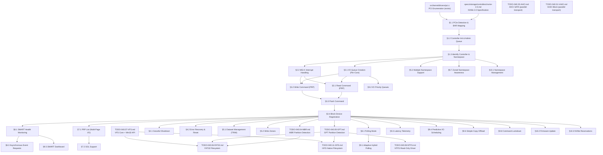

# 040.15-NVMe-2.0 — NVMe SSD Controller Driver

> **Goal:** Implement a complete NVMe 2.0 PCIe SSD driver for Impossible OS. Currently no NVMe
> code exists in the codebase. This TODO builds the driver from scratch: PCIe device detection,
> BAR mapping, controller initialization (CAP/CC/CSTS), Admin Queue setup, Identify commands,
> I/O Queue creation (per-core), Read/Write/Flush/TRIM via PRP, MSI-X interrupts, SMART health
> monitoring, graceful shutdown, error recovery, namespace management, and Impossible OS
> exclusive features (adaptive hybrid polling, I/O priority queues, latency telemetry,
> predictive I/O scheduling, SMART dashboard). The driver registers as a `blkdev` and
> integrates with GPT/MBR partition scanning and FAT32/IXFS/NTFS filesystem mounting.
> All register offsets, bit definitions, and protocol sequences reference the
> [NVMe 2.0 Specification](file:///home/derickpayne/impossible-os/specs/storage/controllers/nvme-2.0.md).

> [!CAUTION]
> **Memory Rule:** Use `pmm_alloc_contiguous()` for ALL DMA buffers (SQ/CQ ring memory,
> PRP Lists, Identify data pages). `kmalloc` is ONLY for small kernel structs (≤ 4 KB).
> See `rules.md` Known Gotchas.

> [!WARNING]
> **MMIO Mapping:** NVMe controller registers are memory-mapped via BAR0/BAR1. The MMIO region
> **must** be mapped as uncacheable (PCD/PWT bits or PAT) in the page tables. Caching MMIO
> addresses causes stale register values and catastrophic desynchronization.

> [!IMPORTANT]
> **Spec Reference:** All section numbers, register offsets, and bit definitions reference the
> [NVMe 2.0 Specification](file:///home/derickpayne/impossible-os/specs/storage/controllers/nvme-2.0.md)
> (NVM Express, June 2021).

---

## TODO Completion Roadmap

### Dependency Graph

### Phase-by-Phase Implementation Order

| ⭐ | Phase | Sections                              | Depends On              | Status |
| -- | :---: | ------------------------------------- | ----------------------- | :----: |
| 💎 | **0** | NVMe 2.0 spec (`nvme-2.0.md`)         | —                       |   ✅   |
| 💎 | **0** | PCI driver (`pci.c`)                  | —                       |   ✅   |
| 💎 | **1** | §1.1 PCIe Detection & BAR Mapping     | Phase 0                 |   ⬜   |
| 💎 | **1** | §1.2 Controller Init & Admin Queue    | Phase 1 (§1.1)          |   ⬜   |
| 💎 | **1** | §1.3 Identify Controller & Namespace  | Phase 1 (§1.2)          |   ⬜   |
| 💎 | **2** | §2.1 I/O Queue Creation (Per-Core)    | Phase 1 (§1.3)          |   ⬜   |
| 💎 | **2** | §2.2 MSI-X Interrupt Handling         | Phase 1 (§1.3)          |   ⬜   |
| 💎 | **3** | §3.1 Read Command (PRP)               | Phase 2 (§2.1, §2.2)   |   ⬜   |
| 💎 | **3** | §3.2 Write Command (PRP)              | Phase 2 (§2.1, §2.2)   |   ⬜   |
| 💎 | **3** | §3.3 Flush Command                    | Phase 3 (§3.1)          |   ⬜   |
| 💎 | **3** | §3.4 Block Device Registration        | Phase 3 (§3.3)          |   ⬜   |
| 💎 | **4** | §4.1 Graceful Shutdown                | Phase 3 (§3.4)          |   ⬜   |
| 💎 | **4** | §4.2 Error Recovery & Reset           | Phase 3 (§3.4)          |   ⬜   |
| 💎 | **5** | §5.1 Dataset Management (TRIM)        | Phase 3 (§3.4)          |   ⬜   |
| 💎 | **5** | §5.2 Write Zeroes                     | Phase 3 (§3.4)          |   ⬜   |
| 💎 | **5** | §5.3 Multiple Namespace Support       | Phase 1 (§1.3)          |   ⬜   |
| 💎 | **6** | §6.1 SMART Health Monitoring          | Phase 3 (§3.4)          |   ⬜   |
| 💎 | **6** | §6.2 Asynchronous Event Requests      | Phase 6 (§6.1)          |   ⬜   |
| 💎 | **7** | §7.1 PRP List (Multi-Page I/O)        | Phase 3 (§3.4)          |   ⬜   |
| 💎 | **7** | §7.2 SGL Support                      | Phase 7 (§7.1)          |   ⬜   |
| 💎 | **7** | §8.1 Polling Mode                     | Phase 3 (§3.4)          |   ⬜   |
| ⭐ | **8** | §9.1 Adaptive Hybrid Polling          | Phase 7 (§8.1)          |   ⬜   |
| ⭐ | **8** | §9.2 I/O Priority Queues              | Phase 2 (§2.1)          |   ⬜   |
| ⭐ | **8** | §9.3 Latency Telemetry                | Phase 3 (§3.4)          |   ⬜   |
| ⭐ | **8** | §9.4 Predictive I/O Scheduling        | Phase 3 (§3.4)          |   ⬜   |
| ⭐ | **8** | §9.5 SMART Dashboard                  | Phase 6 (§6.1)          |   ⬜   |
| ⭐ | **8** | §9.6 Simple Copy Offload              | Phase 3 (§3.4)          |   ⬜   |
| ⭐ | **8** | §9.7 Zoned Namespace Awareness        | Phase 1 (§1.3)          |   ⬜   |
| ⭐ | **8** | §9.8 Command Lockdown                 | Phase 3 (§3.4)          |   ⬜   |
| 🔵 | **9** | §10.1 Namespace Management            | Phase 1 (§1.3)          |   ⬜   |
| 🔵 | **9** | §10.2 Firmware Update                 | Phase 3 (§3.4)          |   ⬜   |
| 🔵 | **9** | §10.3 NVMe Reservations               | Phase 3 (§3.4)          |   ⬜   |

> [!NOTE]
> **Phase 0** is already complete — the PCI driver can enumerate devices and the NVMe 2.0 spec
> is documented.
>
> **Phase 1** is the critical path: PCIe detection (class `01:08:02`), BAR0/BAR1 MMIO mapping,
> CAP register parsing, CC configuration, Admin Queue setup, controller enable, and Identify
> commands. **Everything else depends on Phase 1.**
>
> **Phase 2** creates per-core I/O queue pairs and configures MSI-X vectors. This is required
> before any data I/O.
>
> **Phase 3** delivers core block I/O: Read, Write, Flush, and `blkdev` registration. After
> Phase 3, NVMe drives are mountable with FAT32/IXFS/NTFS.
>
> **Phase 4** adds graceful shutdown (`CC.SHN`) for data integrity and controller reset
> recovery for error handling.
>
> **Phase 5** adds SSD optimization (TRIM, Write Zeroes) and multi-namespace support.
>
> **Phase 6** delivers SMART health monitoring and asynchronous event notifications.
>
> **Phase 7** enables multi-page I/O via PRP Lists, optional SGL support, and dedicated
> polling mode for high-IOPS workloads.
>
> **Phase 8** delivers exclusive features (⭐): adaptive hybrid polling, I/O priority queues,
> latency telemetry, predictive I/O scheduling, SMART dashboard GUI integration, simple copy
> offload, zoned namespace awareness, and command lockdown.
>
> **Phase 9** is stretch: dynamic namespace management, firmware update, reservations.

> [!TIP]
> **QEMU testing flags:**
> Basic: `-drive file=nvme.img,format=raw,if=none,id=nvme0 -device nvme,serial=deadbeef,drive=nvme0`
> Multi-queue: `-device nvme,serial=deadbeef,drive=nvme0,max_ioqpairs=4,msix_qsize=5`
> Multi-NS: `-device nvme,serial=nvme0,id=nvme0 -device nvme-ns,drive=ns1,bus=nvme0,nsid=1`
>
> **Memory rule reminder:**
> ALL queue ring buffers (SQ entries × 64B, CQ entries × 16B), PRP Lists, and Identify data
> pages (4 KiB each) MUST use `pmm_alloc_contiguous()`. With per-core queues (e.g., 4 cores ×
> 256 entries), total ring memory is ~70 KiB — too large for the 2 MiB kernel heap.
>
> **Critical gotcha — doorbell writes:**
> Doorbell registers are WRITE-ONLY. Insert `mfence` between writing SQE data and the doorbell.
> The host must track all queue head/tail positions in software.
>
> **Critical gotcha — phase tag:**
> Initialize all CQ memory to zero. The phase tag bit is the sole mechanism for detecting new
> completions without MMIO reads. Flip expected phase on CQ wraparound.

---

## 1. Controller Foundation

### 1.1 PCIe Detection & BAR Mapping

**Prompt:** Detect NVMe controllers during PCI enumeration by matching class code `01:08:02`
(Mass Storage → NVM Controller → NVMe). Read BAR0/BAR1 as a 64-bit memory BAR per NVMe 2.0
§"BAR Layout". Mask lower 4 bits of BAR0, combine with BAR1 for the full physical address.
Map the MMIO region (minimum 16 KiB) into kernel virtual address space with uncacheable
flags (`VMM_FLAG_NOCACHE | VMM_FLAG_WRITETHROUGH`). Enable Bus Master (bit 2) and Memory
Space (bit 1) in PCI Command Register. Disable legacy INTx (bit 10). After completing all
items, mark every item as `[x]`, update this prompt to a verification prompt, run
`bash scripts/build.sh clean`, and commit as `"nvme: PCIe detection and BAR mapping"`.
After implementation, save gotchas to MCP memory.

- [ ] Detect NVMe device: class=`0x01`, subclass=`0x08`, prog_if=`0x02`
- [ ] Read BAR0 (offset `0x10`) and BAR1 (offset `0x14`) as 64-bit memory BAR
- [ ] Reconstruct MMIO base: `(bar0 & 0xFFFFFFF0) | ((uint64_t)bar1 << 32)`
- [ ] Map MMIO region into kernel address space (uncacheable, minimum 16 KiB)
- [ ] Enable PCI Command Register: Bus Master (bit 2), Memory Space (bit 1)
- [ ] Disable legacy INTx: set PCI Command Register bit 10
- [ ] Verify BAR type is memory (bit 0 = 0) and 64-bit (bits 2:1 = `10b`)
- [ ] Log: `[NVMe] Found controller at PCI %02x:%02x.%x, MMIO @ 0x%lx`
- [ ] Commit: `"nvme: PCIe detection and BAR mapping"`

### 1.2 Controller Initialization & Admin Queue Setup

**Prompt:** Follow the NVMe 2.0 initialization sequence (spec §"Initialization Sequence",
steps 1–13). Read CAP register (offset `0x00`, 64-bit) to get MQES, TO, DSTRD, MPSMIN,
MPSMAX, CSS. Read VS register (offset `0x08`) for version. Disable controller (CC.EN=0),
wait for CSTS.RDY=0 with timeout `CAP.TO × 500ms`. Configure CC: MPS=0 (4 KiB pages),
CSS=0 (NVM), AMS=0 (Round Robin), IOSQES=6 (64 bytes), IOCQES=4 (16 bytes). Allocate
Admin SQ (64B × entries) and Admin CQ (16B × entries) via `pmm_alloc_contiguous()`.
Write ASQ, ACQ, AQA registers. Enable CC.EN=1, wait for CSTS.RDY=1. Check CSTS.CFS for
fatal errors. After completing all items, mark every item as `[x]`, update this prompt to
a verification prompt, run `bash scripts/build.sh clean`, and commit as
`"nvme: controller initialization and admin queue"`. After implementation, save gotchas
to MCP memory.

- [ ] Read CAP register (offset `0x00`, 64-bit):
  - [ ] Parse MQES (bits 15:0) — max queue entries (0-based)
  - [ ] Parse TO (bits 31:24) — timeout in 500ms units
  - [ ] Parse DSTRD (bits 35:32) — doorbell stride = `2^(2+DSTRD)` bytes
  - [ ] Parse CSS (bits 44:37) — verify NVM command set supported (bit 37)
  - [ ] Parse MPSMIN (bits 51:48) — verify ≤ 0 (4 KiB pages)
  - [ ] Parse MPSMAX (bits 55:52)
  - [ ] Parse CQR (bit 16) — contiguous queues required
- [ ] Read VS register (offset `0x08`) — log NVMe version
- [ ] Disable controller: write CC.EN=0 (offset `0x14`)
- [ ] Wait for CSTS.RDY=0 (offset `0x1C`, bit 0), timeout = `CAP.TO × 500ms`
- [ ] Configure CC register (offset `0x14`):
  - [ ] MPS=0 (bits 10:7) — 4 KiB pages
  - [ ] CSS=0 (bits 6:4) — NVM Command Set
  - [ ] AMS=0 (bits 13:11) — Round Robin arbitration
  - [ ] IOSQES=6 (bits 19:16) — 64-byte SQ entries
  - [ ] IOCQES=4 (bits 23:20) — 16-byte CQ entries
- [ ] Allocate Admin SQ: `pmm_alloc_contiguous()`, 64B × 32 entries, page-aligned
- [ ] Allocate Admin CQ: `pmm_alloc_contiguous()`, 16B × 32 entries, page-aligned, zero-fill
- [ ] Write ASQ register (offset `0x28`) — Admin SQ physical address
- [ ] Write ACQ register (offset `0x30`) — Admin CQ physical address
- [ ] Write AQA register (offset `0x24`) — ASQS=31, ACQS=31 (0-based, 32 entries)
- [ ] Enable controller: set CC.EN=1
- [ ] Wait for CSTS.RDY=1, timeout = `CAP.TO × 500ms`
- [ ] Check CSTS.CFS (bit 1) — if set, controller is faulty, abort
- [ ] Initialize phase tag tracking: `admin_cq.phase = 1`, `admin_cq.head = 0`
- [ ] Calculate doorbell offsets: stride = `4 << CAP.DSTRD`
- [ ] Log: `[NVMe] Controller v%d.%d ready, MQES=%u, timeout=%ums`
- [ ] Commit: `"nvme: controller initialization and admin queue"`

### 1.3 Identify Controller & Namespace

**Prompt:** Issue Identify Controller (admin opcode `0x06`, CDW10 CNS=`0x01`) to retrieve
the 4 KiB controller data structure. Parse VID, SN, MN, FR, MDTS, NN, SQES, CQES, OACS.
Calculate max transfer size: `max_xfer = (1 << MDTS) × MPS` (if MDTS=0, no limit). Issue
Identify Namespace List (CNS=`0x02`) to enumerate active NSIDs. For each NSID, issue
Identify Namespace (CNS=`0x00`) to get NSZE, NCAP, NLBAF, FLBAS, LBAF[]. Extract active
LBA format from `FLBAS & 0x0F`, read LBADS for sector size (2^LBADS). Per NVMe 2.0
§"Identify Command". After completing all items, mark every item as `[x]`, update this
prompt to a verification prompt, run `bash scripts/build.sh clean`, and commit as
`"nvme: identify controller and namespace"`. After implementation, save gotchas to MCP memory.

- [ ] Allocate 4 KiB page via `pmm_alloc_contiguous()` for Identify data
- [ ] Build Admin SQE: opcode=`0x06`, CDW10 CNS=`0x01`, PRP1=data page phys addr
- [ ] Submit to Admin SQ, ring SQ Tail Doorbell (offset `0x1000`)
- [ ] Poll Admin CQ for completion (phase tag mechanism)
- [ ] Parse Identify Controller response:
  - [ ] VID (offset 0, 2B) — PCI Vendor ID
  - [ ] SN (offset 4, 20B) — Serial Number (ASCII, trim trailing spaces)
  - [ ] MN (offset 24, 40B) — Model Number (ASCII)
  - [ ] FR (offset 64, 8B) — Firmware Revision
  - [ ] MDTS (offset 77, 1B) — max data transfer size exponent
  - [ ] NN (offset 516, 4B) — number of namespaces
  - [ ] OACS (offset 256, 2B) — optional admin command support bitmask
  - [ ] SQES (offset 512, 1B), CQES (offset 513, 1B) — entry sizes
- [ ] Calculate `max_transfer_bytes = MDTS ? ((1 << MDTS) * 4096) : 0` (0 = unlimited)
- [ ] Issue Identify Namespace List: opcode=`0x06`, CDW10 CNS=`0x02`, NSID=0
- [ ] Parse NSID array (up to NN entries, terminated by NSID=0)
- [ ] For each active NSID, issue Identify Namespace (CNS=`0x00`):
  - [ ] Parse NSZE (offset 0, 8B) — total logical blocks
  - [ ] Parse NCAP (offset 8, 8B) — allocatable blocks
  - [ ] Parse NLBAF (offset 25, 1B) — number of LBA formats (0-based)
  - [ ] Parse FLBAS (offset 26, 1B) — active LBA format index (bits 3:0)
  - [ ] Parse LBAF[active].LBADS — sector size as power of 2
  - [ ] Calculate sector_size = `1 << LBADS` (typically 512 or 4096)
- [ ] Ring CQ Head Doorbell after processing completions
- [ ] Log: `[NVMe] %s %s (FW %s), %llu MiB, %u-byte sectors, MDTS=%u`
- [ ] Commit: `"nvme: identify controller and namespace"`

---

## 2. I/O Queue Setup

### 2.1 I/O Queue Creation (Per-Core)

**Prompt:** Create one I/O Completion Queue + one I/O Submission Queue per CPU core for
lockless per-core I/O. Use Admin command "Create I/O CQ" (opcode `0x05`): set QID, QSIZE
(min of CAP.MQES and 256), PC=1 (contiguous), IEN=1, IV=MSI-X vector. CQ must be created
before its SQ. Use Admin command "Create I/O SQ" (opcode `0x01`): set QID, QSIZE, PC=1,
CQID matching the CQ, QPRIO=`10b` (Medium). Allocate ring memory via
`pmm_alloc_contiguous()`. Per NVMe 2.0 §"Create I/O Completion/Submission Queue".
After completing all items, mark every item as `[x]`, update this prompt to a verification
prompt, run `bash scripts/build.sh clean`, and commit as `"nvme: per-core I/O queue creation"`.
After implementation, save gotchas to MCP memory.

- [ ] For each CPU core (up to `CAP.MQES` queues):
  - [ ] Allocate CQ ring: `pmm_alloc_contiguous()`, 16B × QSIZE entries, zero-fill
  - [ ] Build Create I/O CQ command (opcode `0x05`):
    - [ ] CDW10: QID (1-based) | (QSIZE-1) << 16
    - [ ] CDW11: PC=1 | IEN=1 | (IV << 16) — MSI-X vector for this CQ
    - [ ] PRP1: CQ ring physical address
  - [ ] Submit to Admin SQ, wait for completion
  - [ ] Allocate SQ ring: `pmm_alloc_contiguous()`, 64B × QSIZE entries
  - [ ] Build Create I/O SQ command (opcode `0x01`):
    - [ ] CDW10: QID (same as CQ) | (QSIZE-1) << 16
    - [ ] CDW11: PC=1 | QPRIO=`10b` | (CQID << 16)
    - [ ] PRP1: SQ ring physical address
  - [ ] Submit to Admin SQ, wait for completion
  - [ ] Initialize per-queue state: `sq_tail=0`, `cq_head=0`, `cq_phase=1`
- [ ] Calculate per-queue doorbell offsets:
  - [ ] SQ Tail: `0x1000 + (2 * QID * stride)`
  - [ ] CQ Head: `0x1000 + ((2 * QID + 1) * stride)`
- [ ] Route I/O by CPU: `queue = queues[smp_cpu_id() % num_queues]`
- [ ] Fallback: if only 1 core, create single I/O queue pair
- [ ] Log: `[NVMe] Created %u I/O queues (%u entries each)`
- [ ] Commit: `"nvme: per-core I/O queue creation"`

### 2.2 MSI-X Interrupt Handling

**Prompt:** Walk PCIe capabilities for MSI-X (cap ID `0x11`). Map MSI-X Table BAR. Allocate
one IDT vector per I/O CQ plus one for Admin CQ. Program MSI-X table entries with LAPIC
destination `0xFEE00000` and allocated vector numbers. Enable MSI-X in Message Control.
Register ISR handlers: Admin CQ handler processes Identify/queue create completions; I/O CQ
handlers signal `event_t` per queue for async I/O wakeup. Per NVMe 2.0 §"MSI-X (Recommended)".
After completing all items, mark every item as `[x]`, update this prompt to a verification
prompt, run `bash scripts/build.sh clean`, and commit as `"nvme: MSI-X interrupt handling"`.
After implementation, save gotchas to MCP memory.

- [ ] Walk PCI capability list for MSI-X capability (cap ID `0x11`)
- [ ] Read MSI-X Message Control: table size, Table BAR + offset, PBA BAR + offset
- [ ] Map MSI-X Table BAR into kernel memory (uncacheable)
- [ ] Allocate IDT vectors: 1 per I/O CQ + 1 for Admin CQ via `irq_alloc_vector()`
- [ ] Program MSI-X table entries: `msg_addr=0xFEE00000`, `msg_data=vector`
- [ ] Set Function Mask = 0, enable MSI-X (bit 15 in Message Control)
- [ ] Register Admin CQ ISR: process admin command completions
- [ ] Register per-queue I/O CQ ISR: `event_set(&io_queue[qi].completion)`
- [ ] Bind each I/O CQ to its MSI-X vector during Create I/O CQ (CDW11 IV field)
- [ ] Fallback: if MSI-X not available, use single MSI or legacy INTx with polling
- [ ] Log: `[NVMe] MSI-X enabled: %u vectors (admin + %u I/O queues)`
- [ ] Commit: `"nvme: MSI-X interrupt handling"`

---

## 3. Core Block I/O

### 3.1 Read Command (PRP)

**Prompt:** Implement NVMe Read (I/O opcode `0x02`). Build a 64-byte SQE: opcode=`0x02`,
NSID=target namespace, CDW10/11=starting LBA (64-bit split), CDW12 NLB=block_count-1
(0-based). Set PRP1=destination buffer physical address. For single-page reads, PRP2=0.
For 2-page reads, PRP2=second page address. For >2 pages, PRP2=PRP List pointer (§7.1).
Submit to I/O SQ, ring doorbell, wait for completion via phase tag polling or MSI-X event.
Check CQE status for errors (SCT/SC fields). Per NVMe 2.0 §"Read Command".
After completing all items, mark every item as `[x]`, update this prompt to a verification
prompt, run `bash scripts/build.sh clean`, and commit as `"nvme: read command"`.
After implementation, save gotchas to MCP memory.

- [ ] Build NVMe Read SQE (64 bytes):
  - [ ] CDW0: opcode=`0x02`, CID=unique command ID
  - [ ] NSID: target namespace ID
  - [ ] CDW10: Starting LBA lower 32 bits
  - [ ] CDW11: Starting LBA upper 32 bits
  - [ ] CDW12: NLB (bits 15:0) = block_count - 1 (0-based)
  - [ ] PRP1: destination buffer physical address
  - [ ] PRP2: 0 for single-page, second page addr, or PRP List pointer
- [ ] Submit SQE to I/O SQ: write to `sq[sq_tail]`, advance tail, ring doorbell
- [ ] Wait for completion: poll CQ phase tag or `event_wait_timeout()`
- [ ] Parse CQE status: check P (phase), SC (status code), SCT (type), DNR (do not retry)
- [ ] Advance CQ head, ring CQ Head Doorbell
- [ ] Enforce MDTS: split reads exceeding `max_transfer_bytes` into multiple commands
- [ ] Return 0 on success, -1 on error
- [ ] Log errors: `[NVMe] Read failed: LBA=%llu, SC=0x%02x, SCT=%u`
- [ ] Commit: `"nvme: read command"`

### 3.2 Write Command (PRP)

**Prompt:** Implement NVMe Write (I/O opcode `0x01`). Same CDW layout as Read — data flows
from host memory to NVM. CDW12 bit 26 = FUA (Force Unit Access, bypass cache). Build SQE,
submit, wait, check status. Enforce MDTS for large writes. Per NVMe 2.0 §"Write Command".
After completing all items, mark every item as `[x]`, update this prompt to a verification
prompt, run `bash scripts/build.sh clean`, and commit as `"nvme: write command"`.
After implementation, save gotchas to MCP memory.

- [ ] Build NVMe Write SQE (64 bytes):
  - [ ] CDW0: opcode=`0x01`, CID=unique command ID
  - [ ] NSID, CDW10/11 (LBA), CDW12 (NLB) — same layout as Read
  - [ ] CDW12 bit 26: FUA flag (force write-through to NVM, bypass cache)
  - [ ] PRP1/PRP2: source buffer physical address
- [ ] Submit to I/O SQ, ring doorbell, wait for completion
- [ ] Parse CQE status, handle errors
- [ ] Enforce MDTS: split large writes into multiple commands
- [ ] Guard read-only namespaces (if namespace is RO, reject with -1)
- [ ] Return 0 on success, -1 on error
- [ ] Commit: `"nvme: write command"`

### 3.3 Flush Command

**Prompt:** Implement NVMe Flush (I/O opcode `0x00`). No data transfer — just SQE with
opcode and NSID. NSID=`0xFFFFFFFF` flushes all namespaces. Critical for filesystem metadata
integrity. Per NVMe 2.0 §"Flush Command". After completing all items, mark every item as
`[x]`, update this prompt to a verification prompt, run `bash scripts/build.sh clean`, and
commit as `"nvme: flush command"`. After implementation, save gotchas to MCP memory.

- [ ] Build NVMe Flush SQE: opcode=`0x00`, NSID=`0xFFFFFFFF` (all namespaces)
- [ ] Submit to I/O SQ, ring doorbell, wait for completion
- [ ] Use extended timeout (10 seconds — flush involves actual media writes)
- [ ] Parse CQE status, return 0/success or -1/error
- [ ] Commit: `"nvme: flush command"`

### 3.4 Block Device Registration

**Prompt:** Register the NVMe driver as a `blkdev` in the block device layer so
partition scanning and filesystem mounting work automatically. Set `sector_size` from
the Identify Namespace LBADS field, `sector_count` from NSZE. Wire read/write/flush
callbacks. The device name should be `nvme0` (or `nvme0n1` for namespace 1). After
registration, the existing `partition_scan()` function will detect GPT/MBR and mount
filesystems. After completing all items, mark every item as `[x]`, update this prompt to
a verification prompt, run `bash scripts/build.sh clean`, and commit as
`"nvme: block device registration"`. After implementation, save gotchas to MCP memory.

- [ ] Create `blkdev` struct for each NVMe namespace:
  - [ ] `name`: `"nvme0"` or `"nvme0nN"` for namespace N
  - [ ] `sector_size`: from LBAF[active].LBADS (typically 512 or 4096)
  - [ ] `sector_count`: from NSZE (Identify Namespace)
  - [ ] `read_fn`: `nvme_blkdev_read()` adapter
  - [ ] `write_fn`: `nvme_blkdev_write()` adapter
  - [ ] `flush_fn`: `nvme_blkdev_flush()` adapter
- [ ] Call `blkdev_register()` for each namespace
- [ ] Trigger `partition_scan_all()` to detect GPT/MBR and auto-mount filesystems
- [ ] Log: `[NVMe] Registered blkdev "%s": %llu MiB, %u-byte sectors`
- [ ] Commit: `"nvme: block device registration"`

---

## 4. Reliability

### 4.1 Graceful Shutdown

**Prompt:** Implement the NVMe shutdown procedure per NVMe 2.0 §"Graceful Shutdown
Procedure". Drain all I/O queues, delete all I/O SQs (admin opcode `0x00`) and CQs
(admin opcode `0x04`), set CC.SHN=`01b` (Normal Shutdown), poll CSTS.SHST until `10b`
(complete). Without shutdown notification, the controller's volatile DRAM write cache
is lost — data corruption. After completing all items, mark every item as `[x]`, update
this prompt to a verification prompt, run `bash scripts/build.sh clean`, and commit as
`"nvme: graceful shutdown"`. After implementation, save gotchas to MCP memory.

- [ ] Flush all namespaces: issue Flush (opcode `0x00`, NSID=`0xFFFFFFFF`)
- [ ] Delete all I/O Submission Queues (admin opcode `0x00`, CDW10=QID)
- [ ] Delete all I/O Completion Queues (admin opcode `0x04`, CDW10=QID)
- [ ] Set CC.SHN = `01b` (Normal Shutdown Notification)
- [ ] Poll CSTS.SHST (bits 3:2) until value = `10b` (Shutdown Processing Complete)
- [ ] Timeout: if SHST never reaches `10b`, log warning — controller is hung
- [ ] Free all queue ring memory via `pmm_free_frame()`
- [ ] Release MSI-X vectors via `irq_free_vector()`
- [ ] Unregister `blkdev` entries
- [ ] Wire to kernel shutdown path
- [ ] Log: `[NVMe] Shutdown complete`
- [ ] Commit: `"nvme: graceful shutdown"`

### 4.2 Error Recovery & Controller Reset

**Prompt:** Monitor CSTS.CFS (Controller Fatal Status, bit 1). If set, the controller is
inoperable — perform Controller Level Reset: CC.EN=0, wait CSTS.RDY=0, re-init. Parse CQE
status codes: SCT (bits 11:9) and SC (bits 8:1). Implement retry logic for transient errors
(retry up to 3×), abort on DNR=1 or fatal status. Track error counters. Also handle PCIe
Function Level Reset as fallback if CC.EN reset times out. Per NVMe 2.0 §"Error Handling
and Recovery". After completing all items, mark every item as `[x]`, update this prompt to
a verification prompt, run `bash scripts/build.sh clean`, and commit as
`"nvme: error recovery and controller reset"`. After implementation, save gotchas to MCP memory.

- [ ] Monitor CSTS.CFS (bit 1) — controller fatal status
- [ ] Parse CQE status codes:
  - [ ] SCT=0 Generic: `0x00` success, `0x01` invalid opcode, `0x02` invalid field
  - [ ] SCT=0: `0x80` LBA out of range, `0x81` capacity exceeded
  - [ ] SCT=1 Command Specific: queue creation/deletion failures
  - [ ] SCT=2 Media: unrecoverable read, write fault, CRC error
  - [ ] Check DNR bit (14): if set, do not retry
  - [ ] Check M bit (13): if set, more info in Error Information log
- [ ] Retry logic: up to 3 retries for transient errors (DNR=0)
- [ ] Controller Level Reset: CC.EN=0 → wait CSTS.RDY=0 → full re-init
- [ ] PCIe FLR fallback if CC.EN reset times out
- [ ] Error counters: `error_stats.{io_errors, fatal_resets, timeouts}`
- [ ] Log: `[NVMe] Error: SCT=%u, SC=0x%02x, DNR=%u — %s`
- [ ] Commit: `"nvme: error recovery and controller reset"`

---

## 5. SSD Optimization

### 5.1 Dataset Management (TRIM)

**Prompt:** Implement NVMe Dataset Management / TRIM (I/O opcode `0x09`). CDW10 bits 7:0 =
Number of Ranges (NR, 0-based). CDW11 bit 2 = Attribute Deallocate (AD=1). The data buffer
contains an array of 16-byte range descriptors: `{ cattr(4B), nlb(4B), slba(8B) }`. Each
descriptor specifies a range of LBAs to deallocate. Critical for SSD health — informs the
controller that blocks are no longer in use, enabling garbage collection. Wire to
`blkdev_discard()`. Per NVMe 2.0 §"Dataset Management / TRIM". After completing all items,
mark every item as `[x]`, update this prompt to a verification prompt, run
`bash scripts/build.sh clean`, and commit as `"nvme: dataset management TRIM"`.
After implementation, save gotchas to MCP memory.

- [ ] Build Dataset Management SQE: opcode=`0x09`, NSID
- [ ] CDW10: NR = number_of_ranges - 1 (0-based)
- [ ] CDW11: AD=1 (bit 2) — Attribute Deallocate
- [ ] Allocate range descriptor buffer via `pmm_alloc_contiguous()`:
  - [ ] Each entry: `{ uint32_t cattr, uint32_t nlb, uint64_t slba }` (16 bytes)
- [ ] PRP1 = range descriptor buffer physical address
- [ ] Submit to I/O SQ, wait for completion
- [ ] Add `discard_fn` callback to `blkdev` struct (does not exist yet — extend the API)
- [ ] Wire to `blkdev_discard()` callback
- [ ] Commit: `"nvme: dataset management TRIM"`

### 5.2 Write Zeroes

**Prompt:** Implement NVMe Write Zeroes (I/O opcode `0x08`). CDW10/11 = starting LBA,
CDW12 NLB = block count - 1. No data transfer — controller fills the range with zeroes.
Useful for thin provisioning and secure pre-deletion. Per NVMe 2.0 §"NVM I/O Command
Opcodes". After completing all items, mark every item as `[x]`, update this prompt to a
verification prompt, run `bash scripts/build.sh clean`, and commit as
`"nvme: write zeroes command"`. After implementation, save gotchas to MCP memory.

- [ ] Build Write Zeroes SQE: opcode=`0x08`, NSID, CDW10/11=LBA, CDW12=NLB-1
- [ ] No data buffer needed (PRP1=0, PRP2=0)
- [ ] Submit to I/O SQ, wait for completion
- [ ] Wire to filesystem formatting and secure-delete paths
- [ ] Commit: `"nvme: write zeroes command"`

### 5.3 Multiple Namespace Support

**Prompt:** Support controllers with multiple namespaces. During init, enumerate all active
NSIDs via Identify Namespace List (CNS=`0x02`). For each NSID, issue Identify Namespace
(CNS=`0x00`), register a separate `blkdev` (`nvme0n1`, `nvme0n2`, etc.). Different namespaces
can have different LBA sizes. Per NVMe 2.0 §"Namespace Management". After completing all
items, mark every item as `[x]`, update this prompt to a verification prompt, run
`bash scripts/build.sh clean`, and commit as `"nvme: multiple namespace support"`.
After implementation, save gotchas to MCP memory.

- [ ] Iterate Identify Namespace List array (terminated by NSID=0)
- [ ] For each NSID: issue Identify Namespace, parse NSZE/NCAP/LBADS
- [ ] Register separate `blkdev` per namespace: `nvme0n1`, `nvme0n2`, etc.
- [ ] Handle different sector sizes per namespace
- [ ] Support at least 16 namespaces per controller
- [ ] Log: `[NVMe] Namespace %u: %llu MiB, %u-byte sectors`
- [ ] Commit: `"nvme: multiple namespace support"`

---

## 6. Diagnostics

### 6.1 SMART Health Monitoring

**Prompt:** Implement Get Log Page (admin opcode `0x02`) for SMART/Health (Log Page ID
`0x02`). Parse the 512-byte SMART structure: Critical Warning (offset 0), Composite
Temperature (offset 1, Kelvin), Available Spare (offset 3, %), Percentage Used (offset 5,
%), Data Units Read/Written (offsets 32/48, 128-bit — read lower 64 bits), Power Cycles
(offset 128), Power On Hours (offset 144), Unsafe Shutdowns (offset 160). Expose via
Registry and wire to Disk Manager GUI. Per NVMe 2.0 §"SMART / Health Information".
After completing all items, mark every item as `[x]`, update this prompt to a verification
prompt, run `bash scripts/build.sh clean`, and commit as `"nvme: SMART health monitoring"`.
After implementation, save gotchas to MCP memory.

- [ ] Build Get Log Page SQE: admin opcode=`0x02`, CDW10 LID=`0x02`
- [ ] Allocate 512-byte data buffer via `pmm_alloc_contiguous()`
- [ ] Parse SMART fields:
  - [ ] Critical Warning (offset 0, 1B) — bitmask of active warnings
  - [ ] Composite Temperature (offset 1, 2B) — Kelvin, convert to °C
  - [ ] Available Spare (offset 3, 1B) — percentage remaining
  - [ ] Available Spare Threshold (offset 4, 1B)
  - [ ] Percentage Used (offset 5, 1B) — lifespan consumed
  - [ ] Data Units Read (offset 32, 16B) — lower 64 bits, in thousands of 512B units
  - [ ] Data Units Written (offset 48, 16B) — lower 64 bits
  - [ ] Power Cycles (offset 128, 16B) — lower 64 bits
  - [ ] Power On Hours (offset 144, 16B) — lower 64 bits
  - [ ] Unsafe Shutdowns (offset 160, 16B) — lower 64 bits
- [ ] Store in `nvme_smart_t` struct, poll periodically (every 60 seconds)
- [ ] Expose via Registry: `HKLM\HARDWARE\NVMe\nvme0\SMART\*`
- [ ] Wire to Disk Manager: temperature, spare %, lifespan %, power-on hours
- [ ] Log: `[NVMe] SMART: temp=%u°C, spare=%u%%, used=%u%%, power_on=%llu hrs`
- [ ] Commit: `"nvme: SMART health monitoring"`

### 6.2 Asynchronous Event Requests (AER)

**Prompt:** Submit AER commands (admin opcode `0x0C`) during init. The controller holds them
pending and completes one when a critical event occurs (error, SMART threshold, namespace
change). Process by reading CQE CDW0 event type (bits 2:0) and issuing Get Log Page for
details. Resubmit a fresh AER after processing. Per NVMe 2.0 §"Asynchronous Event Requests".
After completing all items, mark every item as `[x]`, update this prompt to a verification
prompt, run `bash scripts/build.sh clean`, and commit as `"nvme: asynchronous event requests"`.
After implementation, save gotchas to MCP memory.

- [ ] Submit 2 AER commands during init (admin opcode `0x0C`, no data)
- [ ] AERs remain pending until controller fires one
- [ ] Admin CQ ISR: detect AER completion by matching CID
- [ ] Parse CQE CDW0 event type (bits 2:0):
  - [ ] Type 0: Error Status — read Error Information log (LID `0x01`)
  - [ ] Type 1: SMART/Health — read SMART log, check thresholds
  - [ ] Type 2: Notice — namespace attribute change, firmware activation
- [ ] Issue Get Log Page to retrieve full event details
- [ ] Resubmit fresh AER to replenish pending pool
- [ ] Configure event mask via Set Features (FID `0x0B`)
- [ ] Log: `[NVMe] AER: event type=%u — %s`
- [ ] Commit: `"nvme: asynchronous event requests"`

---

## 7. Performance

### 7.1 PRP List (Multi-Page I/O)

**Prompt:** For transfers spanning more than 2 pages, PRP2 must point to a PRP List — a
page-aligned, physically contiguous array of 64-bit PRP entries. Each entry points to one
data page. The PRP List itself can span multiple pages (chain via last entry). Enforce that
all PRP List entries are page-aligned (except PRP1 which may have an offset). Per NVMe 2.0
§"Physical Region Pages (PRP)". After completing all items, mark every item as `[x]`,
update this prompt to a verification prompt, run `bash scripts/build.sh clean`, and commit
as `"nvme: PRP list multi-page I/O"`. After implementation, save gotchas to MCP memory.

- [ ] Detect multi-page transfers: if transfer > 2 pages, build PRP List
- [ ] Allocate PRP List page via `pmm_alloc_contiguous()` (page-aligned)
- [ ] Populate PRP List: one 64-bit entry per data page (page-aligned addresses)
- [ ] Set PRP2 = PRP List physical address
- [ ] Handle PRP List chaining for transfers > 512 pages (last entry → next PRP List page)
- [ ] PRP1 may have sub-page offset; all subsequent entries must be page-aligned
- [ ] Free PRP List after command completion
- [ ] Commit: `"nvme: PRP list multi-page I/O"`

### 7.2 SGL Support (Optional)

**Prompt:** Scatter Gather Lists (SGLs) are optional — check `SGLS` field in Identify
Controller. Each SGL descriptor is 16 bytes: `{ address(8B), length(4B), rsvd(3B),
sgl_id(1B) }`. SGLs allow byte-aligned, arbitrary-length transfers vs PRP's page-aligned
constraint. Useful for fragmented memory. Per NVMe 2.0 §"Scatter Gather Lists". After
completing all items, mark every item as `[x]`, update this prompt to a verification prompt,
run `bash scripts/build.sh clean`, and commit as `"nvme: SGL support"`.
After implementation, save gotchas to MCP memory.

- [ ] Check Identify Controller `SGLS` field for SGL support
- [ ] If supported, set PSDT field in SQE CDW0 (bits 15:14) to indicate SGL
- [ ] Build SGL descriptor: `{ address, length, rsvd, sgl_id }` (16 bytes)
- [ ] Support SGL Data Block and SGL Segment descriptor types
- [ ] Fallback: always use PRPs if SGL not supported
- [ ] Commit: `"nvme: SGL support"`

### 8.1 Polling Mode (High-Performance)

**Prompt:** For high-IOPS workloads, disable interrupts for specific queues and use dedicated
polling threads. Set interrupt mask via INTMS register (offset `0x0C`). Dedicated kernel
thread spins on CQ phase tag. Advantage: eliminates ~2-5µs interrupt overhead per completion.
Disadvantage: 100% CPU on polling core. Per NVMe 2.0 §"Polling Mode (High-Performance)".
After completing all items, mark every item as `[x]`, update this prompt to a verification
prompt, run `bash scripts/build.sh clean`, and commit as `"nvme: polling mode"`.
After implementation, save gotchas to MCP memory.

- [ ] Create polling-mode queue flag per I/O queue
- [ ] When enabled: skip MSI-X for that queue, disable interrupt via INTMS
- [ ] Spawn dedicated kernel thread per polling queue
- [ ] Thread loops: check `cq[head].status & 0x01 == expected_phase`
- [ ] Process completions inline, advance CQ head, ring doorbell
- [ ] Add short `pause` instruction in spin loop to reduce power/bus traffic
- [ ] Configurable via Registry: `HKLM\SYSTEM\Drivers\NVMe\PollQueues` (default 0)
- [ ] Commit: `"nvme: polling mode"`

---

## 9. Impossible OS Exclusive Features

### 9.1 Adaptive Hybrid Polling (🚀 Exclusive)

**Prompt:** Neither Windows StorNVMe nor Linux nvme implement adaptive hybrid polling that
dynamically switches between interrupt, hybrid, and pure polling modes based on real-time
IOPS. Implement three modes: (1) Pure interrupt at <1K IOPS, (2) Hybrid spin (4µs via
`rdtsc` then fallback to interrupt) at 1K–50K IOPS, (3) Pure polling at >50K IOPS. Track
rolling 100ms IOPS average with hysteresis for mode transitions. This is the same concept
as VirtIO §12.1 but optimized for NVMe's lower base latency. After completing all items,
mark every item as `[x]`, update this prompt to a verification prompt, run
`bash scripts/build.sh clean`, and commit as `"nvme: adaptive hybrid polling"`.
After implementation, save gotchas to MCP memory.

- [ ] Implement three I/O completion modes:
  - [ ] `NVME_IO_MODE_INTERRUPT` — pure ISR-driven
  - [ ] `NVME_IO_MODE_HYBRID` — brief `rdtsc`-based spin (4µs default), fallback to ISR
  - [ ] `NVME_IO_MODE_POLL` — pure polling, interrupts disabled
- [ ] Track rolling IOPS over 100ms window
- [ ] Mode transitions with hysteresis (3 consecutive windows to escalate, 5 to de-escalate)
- [ ] Configurable thresholds via Registry: `HKLM\SYSTEM\Drivers\NVMe\AdaptivePolling\*`
- [ ] Log mode transitions: `[NVMe] I/O mode → HYBRID (IOPS=%u)`
- [ ] Commit: `"nvme: adaptive hybrid polling"`

### 9.2 I/O Priority Queues (🚀 Exclusive)

**Prompt:** NVMe supports Queue Priority (QPRIO) in Create I/O SQ — Urgent (00b), High
(01b), Medium (10b), Low (11b). Neither Windows nor Linux map application-level I/O
priority to NVMe queue priorities. Impossible OS maps Win32 I/O priority classes
(`IoPriorityCritical` → Urgent, `IoPriorityHigh` → High, `IoPriorityNormal` → Medium,
`IoPriorityLow/VeryLow` → Low) to dedicated NVMe SQs with matching QPRIO values. This
provides true hardware-level I/O QoS. After completing all items, mark every item as
`[x]`, update this prompt to a verification prompt, run `bash scripts/build.sh clean`, and
commit as `"nvme: I/O priority queue mapping"`. After implementation, save gotchas to MCP memory.

- [ ] Create 4 I/O SQ/CQ pairs per core with different QPRIO values:
  - [ ] Queue set 0: QPRIO=`00b` (Urgent) — `IoPriorityCritical`
  - [ ] Queue set 1: QPRIO=`01b` (High) — `IoPriorityHigh`
  - [ ] Queue set 2: QPRIO=`10b` (Medium) — `IoPriorityNormal`
  - [ ] Queue set 3: QPRIO=`11b` (Low) — `IoPriorityLow`/`VeryLow`
- [ ] Route I/O based on `current_thread->io_priority`
- [ ] Expose per-priority IOPS counters via Registry
- [ ] Fallback: single queue at Medium priority if insufficient queue slots
- [ ] Commit: `"nvme: I/O priority queue mapping"`

### 9.3 I/O Latency Telemetry (🚀 Exclusive)

**Prompt:** Track per-request ns-resolution latency using `rdtsc` at submission and
completion. Build a histogram (buckets: <1µs, 1-4µs, 4-16µs, 16-64µs, 64-256µs, >256µs).
Expose via Registry and wire to Disk Manager for real-time latency visualization. Neither
Windows nor Linux expose per-request NVMe latency to userland GUIs. After completing all
items, mark every item as `[x]`, update this prompt to a verification prompt, run
`bash scripts/build.sh clean`, and commit as `"nvme: I/O latency telemetry"`.
After implementation, save gotchas to MCP memory.

- [ ] Record `rdtsc` at I/O submission time per CID
- [ ] On completion: compute delta, convert to nanoseconds
- [ ] Histogram buckets: <1µs, 1-4µs, 4-16µs, 16-64µs, 64-256µs, >256µs
- [ ] Track min/max/avg latency per queue
- [ ] Expose via Registry: `HKLM\HARDWARE\NVMe\nvme0\Latency\*`
- [ ] Wire to Disk Manager: real-time latency histogram chart
- [ ] Commit: `"nvme: I/O latency telemetry"`

### 9.4 Predictive I/O Scheduling (🚀 Exclusive)

**Prompt:** Monitor I/O patterns and predict upcoming reads. Track recent LBA sequences —
if sequential access detected (e.g., file read), prefetch the next N blocks into a small
kernel buffer. Neither Windows StorNVMe nor Linux nvme do driver-level predictive prefetch.
After completing all items, mark every item as `[x]`, update this prompt to a verification
prompt, run `bash scripts/build.sh clean`, and commit as `"nvme: predictive I/O scheduling"`.
After implementation, save gotchas to MCP memory.

- [ ] Track last N read LBAs per namespace
- [ ] Detect sequential access pattern (consecutive LBA ranges)
- [ ] On pattern match: issue prefetch read for next M blocks (default 64 KiB)
- [ ] Store prefetched data in small LRU cache (configurable size, default 1 MiB)
- [ ] On read hit: return data from cache instead of issuing NVMe command
- [ ] Invalidate cache on write to overlapping LBA range
- [ ] Configurable via Registry: `HKLM\SYSTEM\Drivers\NVMe\Prefetch\*`
- [ ] Commit: `"nvme: predictive I/O scheduling"`

### 9.5 SMART Dashboard (🚀 Exclusive)

**Prompt:** Expose SMART health data as a rich GUI panel in Disk Manager. Show temperature
gauge, spare capacity bar, lifespan progress, total data read/written, power-on hours,
unsafe shutdown count. Neither Windows nor Linux provide built-in SMART visualization for
NVMe — users need third-party tools (CrystalDiskInfo, smartctl). After completing all items,
mark every item as `[x]`, update this prompt to a verification prompt, run
`bash scripts/build.sh clean`, and commit as `"nvme: SMART dashboard"`.
After implementation, save gotchas to MCP memory.

- [ ] Design Disk Manager SMART panel:
  - [ ] Temperature gauge (color-coded: green <50°C, yellow 50-70°C, red >70°C)
  - [ ] Available Spare progress bar (green >20%, yellow 10-20%, red <10%)
  - [ ] Percentage Used bar (lifespan consumed)
  - [ ] Data Read/Written totals (human-readable TB/GB)
  - [ ] Power Cycles and Power On Hours
  - [ ] Unsafe Shutdowns count (highlight if >0)
- [ ] Poll SMART data every 60 seconds, update GUI
- [ ] Warning notifications: low spare, high temperature, high percentage used
- [ ] Commit: `"nvme: SMART dashboard"`

### 9.6 Simple Copy Offload (🚀 Exclusive)

**Prompt:** NVMe 2.0 introduces the Simple Copy Command (I/O opcode `0x19`) which copies data
from multiple source ranges to a single destination LBA entirely within the drive — no host
memory transfer needed. This saves PCIe bandwidth and CPU cycles for file copy, defrag, and
GC workloads. Neither Windows StorNVMe nor Linux nvme exposes copy offload to userland or
filesystem layers. Implement copy offload with a `blkdev_copy()` callback and wire to the
VFS copy path. Check `ONCS` bit 8 (Identify Controller offset 256) for Copy support. Per
NVMe 2.0 §"Simple Copy Command". After completing all items, mark every item as `[x]`,
update this prompt to a verification prompt, run `bash scripts/build.sh clean`, and commit
as `"nvme: simple copy offload"`. After implementation, save gotchas to MCP memory.

- [ ] Check Identify Controller ONCS (offset 256) bit 8 for Copy support
- [ ] Read MSSRL (offset 292, 2B) — max single source range length
- [ ] Read MCL (offset 294, 4B) — max copy length (in LBAs)
- [ ] Read MSRC (offset 298, 1B) — max source range count (0-based)
- [ ] Build Simple Copy SQE: I/O opcode `0x19`, NSID, CDW10/11 = destination LBA
- [ ] Build Source Range Entries descriptor list (16B each):
  - [ ] Each entry: `{ rsvd(8B), slba(8B), nlb(2B), rsvd(6B) }`
- [ ] CDW12: NR = number_of_ranges - 1 (0-based)
- [ ] PRP1 = source range descriptor buffer physical address
- [ ] Submit to I/O SQ, wait for completion
- [ ] Add `copy_fn` callback to `blkdev` struct (extend the API)
- [ ] Wire to `vfs_copy_range()` for filesystem-level copy acceleration
- [ ] Fallback: read + write if controller does not support Copy
- [ ] Commit: `"nvme: simple copy offload"`

### 9.7 Zoned Namespace Awareness (🚀 Exclusive)

**Prompt:** NVMe 2.0 introduces Zoned Namespaces (ZNS) as a distinct command set (CSS=`0x02`).
ZNS devices expose storage as sequential write zones — the host controls data placement,
reducing write amplification and extending SSD lifespan. Linux has ZNS support in the block
layer but Windows has no native ZNS driver. Implement zone awareness: detect ZNS during
Identify (CSS bit 2), issue Zone Management Receive (opcode `0x7A`) to enumerate zones,
support Zone Append (opcode `0x7D`) for optimal sequential writes, and expose zone state
via Registry and Device Manager. Per NVMe 2.0 §"Zoned Namespace Command Set". After
completing all items, mark every item as `[x]`, update this prompt to a verification
prompt, run `bash scripts/build.sh clean`, and commit as `"nvme: zoned namespace awareness"`.
After implementation, save gotchas to MCP memory.

- [ ] Detect ZNS support: check Identify Controller CAP.CSS bit 2 or CNS `0x06`
- [ ] Issue Identify Namespace with ZNS Command Set specific data (CNS `0x05`)
- [ ] Parse zone size, zone capacity, max open/active zones
- [ ] Implement Zone Management Receive (opcode `0x7A`): report zone states
- [ ] Parse zone descriptors: ZCAP, ZSLBA, WP (write pointer), ZS (zone state)
- [ ] Implement Zone Management Send (opcode `0x79`):
  - [ ] Open Zone, Close Zone, Finish Zone, Reset Zone
- [ ] Implement Zone Append (opcode `0x7D`): append-only write at zone WP
- [ ] Register ZNS namespaces as special `blkdev` with zone metadata
- [ ] Expose zone map via Registry: `HKLM\HARDWARE\NVMe\nvme0\Zones\*`
- [ ] Wire to Device Manager: zone state visualization (Empty/Open/Full/Offline)
- [ ] Commit: `"nvme: zoned namespace awareness"`

### 9.8 Command Lockdown (🚀 Exclusive)

**Prompt:** NVMe 2.0 introduces the Lockdown command (admin opcode `0x24`) which prevents
specific admin or I/O commands from being executed after provisioning. This is a security
feature — it can prevent firmware updates, format NVM, namespace deletion, or other
destructive operations on a running system. Neither Windows nor Linux expose command
lockdown via their NVMe drivers. Implement lockdown with a configurable policy via the
Registry. Per NVMe 2.0 §"Lockdown Command". After completing all items, mark every item
as `[x]`, update this prompt to a verification prompt, run `bash scripts/build.sh clean`,
and commit as `"nvme: command lockdown"`. After implementation, save gotchas to MCP memory.

- [ ] Check Identify Controller OACS (offset 256) bit 10 for Lockdown support
- [ ] Build Lockdown SQE: admin opcode `0x24`
  - [ ] CDW10: Interface (bits 2:0), Lockdown Scope (bits 5:3)
  - [ ] CDW10: Feature Identifier or Command Opcode (bits 15:8)
- [ ] Implement lockdown profiles:
  - [ ] `NVME_LOCKDOWN_PRODUCTION` — lock firmware update, format, sanitize
  - [ ] `NVME_LOCKDOWN_SECURE` — lock all non-essential admin commands
  - [ ] `NVME_LOCKDOWN_CUSTOM` — user-defined via Registry
- [ ] Configurable via Registry: `HKLM\SYSTEM\Drivers\NVMe\Lockdown\*`
- [ ] Apply lockdown during boot after driver init (before user-mode)
- [ ] Log: `[NVMe] Command lockdown applied: profile=%s`
- [ ] Commit: `"nvme: command lockdown"`

---

## 10. Enterprise & Stretch Features

### 10.1 Namespace Management (Create/Delete)

**Prompt:** Implement admin commands for dynamic namespace provisioning: Namespace Management
(opcode `0x0D`) for create/delete/attach/detach. Requires OACS bit 3 (Namespace Management
support) from Identify Controller. Stretch goal for enterprise storage. After completing all
items, mark every item as `[x]`, update this prompt to a verification prompt, run
`bash scripts/build.sh clean`, and commit as `"nvme: namespace management"`.
After implementation, save gotchas to MCP memory.

- [ ] Check OACS bit 3 for Namespace Management support
- [ ] Implement Namespace Management command (admin opcode `0x0D`):
  - [ ] Create Namespace: allocate LBA range, set capacity
  - [ ] Delete Namespace: remove by NSID
  - [ ] Attach/Detach: bind namespace to controller
- [ ] Update `blkdev` registrations after namespace changes
- [ ] Commit: `"nvme: namespace management"`

### 10.2 Firmware Update

**Prompt:** Implement Firmware Image Download (admin opcode `0x11`) and Firmware Commit
(admin opcode `0x10`). Download firmware in chunks, commit to a slot, optionally activate.
Requires OACS bit 2 (Firmware Support). Per NVMe 2.0 §"Admin Command Set". After completing
all items, mark every item as `[x]`, update this prompt to a verification prompt, run
`bash scripts/build.sh clean`, and commit as `"nvme: firmware update"`.
After implementation, save gotchas to MCP memory.

- [ ] Check OACS bit 2 for Firmware Update support
- [ ] Read FRMW field (offset 263): number of slots, activation behavior
- [ ] Implement Firmware Image Download (opcode `0x11`): chunked transfer
- [ ] Implement Firmware Commit (opcode `0x10`): commit to slot, activate
- [ ] Read Firmware Slot Information log (LID `0x03`) for current/available versions
- [ ] Wire to Device Manager: firmware update UI
- [ ] Commit: `"nvme: firmware update"`

### 10.3 NVMe Reservations

**Prompt:** Implement Reservation Register (`0x0D`), Reservation Acquire (`0x11`), and
Reservation Release (`0x15`) for shared namespace access control. Stretch goal for
multi-host environments. Per NVMe 2.0 §"NVMe Reservations". After completing all items,
mark every item as `[x]`, update this prompt to a verification prompt, run
`bash scripts/build.sh clean`, and commit as `"nvme: reservations"`.
After implementation, save gotchas to MCP memory.

- [ ] Implement Reservation Register (I/O opcode `0x0D`)
- [ ] Implement Reservation Acquire (I/O opcode `0x11`)
- [ ] Implement Reservation Release (I/O opcode `0x15`)
- [ ] Track reservation keys per namespace
- [ ] Commit: `"nvme: reservations"`

---

## Priority Order

| Priority | Section                             | Description                                                          |
| -------- | ----------------------------------- | -------------------------------------------------------------------- |
| 🔴 P0   | §1.1 PCIe Detection & BAR Mapping   | Foundation — all NVMe operations depend on MMIO access               |
| 🔴 P0   | §1.2 Controller Init & Admin Queue  | CAP parsing, CC config, Admin Queue — first commands require this    |
| 🔴 P0   | §1.3 Identify Controller & NS       | Device capabilities, namespace geometry — needed for I/O             |
| 🔴 P0   | §2.1 I/O Queue Creation             | Per-core queues — required for any data I/O                          |
| 🔴 P0   | §3.1 Read Command                   | Core read path — OS cannot boot from NVMe without this               |
| 🔴 P0   | §3.2 Write Command                  | Core write path — filesystem persistence                             |
| 🔴 P0   | §3.3 Flush Command                  | Data integrity — prevents loss on power failure                      |
| 🔴 P0   | §3.4 Block Device Registration      | `blkdev` integration — enables partition/FS mounting                 |
| 🟠 P1   | §2.2 MSI-X Interrupt Handling       | APIC-only compliance, async I/O — replaces polling                   |
| 🟠 P1   | §4.1 Graceful Shutdown              | Prevents data loss — DRAM cache flush on OS shutdown                 |
| 🟠 P1   | §4.2 Error Recovery & Reset         | Reliability — handles CFS, transient errors, controller reset        |
| 🟠 P1   | §7.1 PRP List (Multi-Page I/O)      | Multi-page transfers — needed for practical file I/O                 |
| 🟡 P2   | §5.1 Dataset Management (TRIM)      | SSD health — informs garbage collection                              |
| 🟡 P2   | §5.2 Write Zeroes                   | Thin provisioning, secure pre-deletion                               |
| 🟡 P2   | §5.3 Multiple Namespace Support     | Multi-volume — enumerate and expose N namespaces                     |
| 🟡 P2   | §6.1 SMART Health Monitoring        | Drive health — temperature, spare, lifespan metrics                  |
| 🟡 P2   | §6.2 Asynchronous Event Requests    | Proactive alerts — critical events without polling                   |
| 🟡 P2   | §8.1 Polling Mode                   | High-IOPS — dedicated polling threads for peak throughput            |
| 🟢 P3   | §7.2 SGL Support                    | Alternative to PRP — fragmented memory transfers                     |
| 🟢 P3   | §9.1 Adaptive Hybrid Polling        | 🚀 **Exclusive** — dynamic interrupt/poll switching by IOPS         |
| 🟢 P3   | §9.2 I/O Priority Queues            | 🚀 **Exclusive** — Win32 I/O priority → NVMe QPRIO mapping          |
| 🟢 P3   | §9.3 Latency Telemetry              | 🚀 **Exclusive** — ns-resolution per-request latency histograms     |
| 🟢 P3   | §9.4 Predictive I/O Scheduling      | 🚀 **Exclusive** — driver-level sequential prefetch                  |
| 🟢 P3   | §9.5 SMART Dashboard                | 🚀 **Exclusive** — built-in GUI health visualization                |
| 🟢 P3   | §9.6 Simple Copy Offload            | 🚀 **Exclusive** — on-drive data copy, zero PCIe bandwidth          |
| 🟢 P3   | §9.7 Zoned Namespace Awareness      | 🚀 **Exclusive** — host-managed zone data placement                 |
| 🟢 P3   | §9.8 Command Lockdown               | 🚀 **Exclusive** — post-provisioning command restriction             |
| 🔵 P4   | §10.1 Namespace Management          | Enterprise — dynamic namespace create/delete                         |
| 🔵 P4   | §10.2 Firmware Update               | Field updates — download + commit firmware                           |
| 🔵 P4   | §10.3 NVMe Reservations             | Multi-host — shared namespace locking                                |

---

## OS Comparison

| Feature                          | 🪟 Windows 11                     | 🐧 Linux                          | 🚀 Impossible OS                                 |
| -------------------------------- | --------------------------------- | ---------------------------------- | ------------------------------------------------ |
| NVMe detection                   | ✅ StorNVMe / solidnvm.sys         | ✅ Native nvme driver               | ⬜ §1.1 P0                                       |
| Controller init                  | ✅ Full spec compliance            | ✅ Full spec compliance             | ⬜ §1.2 P0                                       |
| Identify Controller/NS           | ✅ Full parsing                    | ✅ Full parsing                     | ⬜ §1.3 P0                                       |
| Per-core I/O queues              | ✅ Per-CPU queue pairs             | ✅ Per-CPU queue pairs              | ⬜ §2.1 P0                                       |
| MSI-X interrupts                 | ✅ Per-queue vectors               | ✅ Per-queue vectors                | ⬜ §2.2 P1                                       |
| Read/Write/Flush                 | ✅ Full NVM command set            | ✅ Full NVM command set             | ⬜ §3.1-3.3 P0                                   |
| Block device integration         | ✅ StorPort miniport               | ✅ blk-mq integration              | ⬜ §3.4 P0                                       |
| Graceful shutdown                | ✅ CC.SHN on OS shutdown           | ✅ CC.SHN on shutdown/suspend       | ⬜ §4.1 P1                                       |
| Error recovery                   | ✅ Controller reset + retry        | ✅ Controller reset + retry         | ⬜ §4.2 P1                                       |
| TRIM / Dataset Management        | ✅ Automatic TRIM                  | ✅ fstrim + discard mount option    | ⬜ §5.1 P2                                       |
| Write Zeroes                     | ✅ Supported                       | ✅ REQ_OP_WRITE_ZEROES             | ⬜ §5.2 P2                                       |
| Multiple namespaces              | ✅ Per-namespace volume            | ✅ /dev/nvmeXnY                     | ⬜ §5.3 P2                                       |
| SMART monitoring                 | ⬜ Requires third-party tools      | ✅ nvme-cli / smartctl             | ⬜ §6.1 P2 — built-in GUI 🚀                     |
| Asynchronous events              | ✅ AER support                     | ✅ AER support                      | ⬜ §6.2 P2                                       |
| PRP List multi-page              | ✅ Full PRP support                | ✅ Full PRP support                 | ⬜ §7.1 P1                                       |
| SGL support                      | ✅ Optional                        | ✅ Optional                         | ⬜ §7.2 P3                                       |
| Polling mode                     | ⬜ No dedicated poll mode          | ✅ io_poll / blk-mq poll           | ⬜ §8.1 P2                                       |
| **Adaptive hybrid polling**      | ⬜ No adaptive switching           | ⬜ No adaptive switching            | ⬜ §9.1 P3 — **first to implement** 🚀           |
| **I/O priority → NVMe QPRIO**   | ⬜ No QPRIO mapping                | ⬜ No QPRIO mapping                 | ⬜ §9.2 P3 — **first to implement** 🚀           |
| **Latency telemetry**            | ⬜ No per-request histograms       | ⬜ No built-in histograms           | ⬜ §9.3 P3 — **first to implement** 🚀           |
| **Predictive I/O scheduling**    | ⬜ No driver-level prefetch        | ⬜ No driver-level prefetch         | ⬜ §9.4 P3 — **first to implement** 🚀           |
| **SMART dashboard**              | ⬜ No built-in GUI                 | ⬜ CLI only (smartctl)              | ⬜ §9.5 P3 — **built-in GUI** 🚀                 |
| **Simple Copy offload**          | ⬜ Not exposed to FS layer         | ⬜ No driver-level copy offload     | ⬜ §9.6 P3 — **on-drive copy** 🚀                |
| **Zoned Namespace (ZNS)**        | ⬜ No native ZNS driver            | ✅ Kernel ZNS + zonefs             | ⬜ §9.7 P3 — **zone-aware GUI** 🚀               |
| **Command Lockdown**             | ⬜ No lockdown support             | ⬜ No lockdown support              | ⬜ §9.8 P3 — **first to implement** 🚀           |
| Namespace management             | ✅ Enterprise support              | ✅ nvme-cli create-ns              | ⬜ §10.1 P4                                      |
| Firmware update                  | ✅ Windows Update / vendor tools   | ✅ nvme-cli fw-download            | ⬜ §10.2 P4                                      |
| Reservations                     | ✅ Enterprise support              | ✅ nvme-cli resv-*                 | ⬜ §10.3 P4                                      |

> **After P0+P1 items:** Impossible OS has a fully functional NVMe driver with per-core queues,
> MSI-X interrupts, Read/Write/Flush, shutdown, error recovery, and multi-page PRP transfers.
> NVMe SSDs are bootable and mountable with FAT32/IXFS/NTFS.
>
> **After P2 items:** Matches Windows and Linux feature-for-feature — TRIM, Write Zeroes,
> multi-namespace, SMART health, AER, and polling mode.
>
> **After P3 exclusive features:** Exceeds both — adaptive hybrid polling, hardware I/O QoS
> via QPRIO mapping, per-request latency telemetry, predictive prefetch, built-in SMART
> dashboard, on-drive copy offload, zone-aware storage management, and command lockdown
> security. No other OS offers all of these at the NVMe driver level.
>
> **After P4 items:** Full enterprise parity — namespace management, firmware update,
> reservations.
