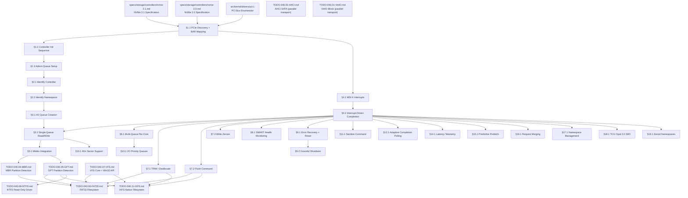

# 040.16-NVMe-2.1 — NVMe 2.1 PCIe Storage Driver

> **Goal:** Implement a complete NVMe driver for Impossible OS targeting the NVMe 2.1 specification
> (NVM Express, August 2024). The driver will support PCIe device discovery, BAR0 MMIO register
> mapping, controller initialization, admin and I/O queue management, PRP-based data transfer,
> MSI-X interrupts, per-core multi-queue I/O, SMART health monitoring, TRIM/deallocate, graceful
> shutdown, error recovery, and Impossible OS-exclusive features (adaptive completion polling,
> I/O priority-to-queue mapping, ns-resolution latency telemetry, predictive prefetch, request
> merging). The driver integrates with the existing `blkdev` abstraction layer alongside the
> AHCI and VirtIO block drivers. No NVMe code currently exists in the codebase.

> [!CAUTION]
> **Memory Rule:** Use `pmm_alloc_contiguous()` for ALL DMA buffers (queue memory, PRP lists,
> Identify data pages). `kmalloc` is ONLY for small kernel structs (≤ 4 KB). NVMe queues can
> be 256 KiB+ each — these MUST NOT come from the 2 MiB kernel heap.

> [!WARNING]
> **MMIO Caching:** The BAR0 region MUST be mapped as uncacheable (UC) via VMM page table flags
> (`VMM_FLAG_NOCACHE | VMM_FLAG_WRITETHROUGH`). Caching MMIO registers causes stale reads of
> `CSTS`, doorbell values, and completion queue entries — leading to silent data corruption.

> [!IMPORTANT]
> **Spec Reference:** All section numbers, register offsets, and bit definitions reference the
> [NVMe 2.1 Specification](file:///home/derickpayne/impossible-os/specs/storage/controllers/nvme-2.1.md)
> (NVM Express Inc., August 2024). The companion NVMe 2.0 spec is at
> [nvme-2.0.md](file:///home/derickpayne/impossible-os/specs/storage/controllers/nvme-2.0.md).

---

## TODO Completion Roadmap

### Dependency Graph



### Phase-by-Phase Implementation Order

| ⭐ | Phase  | Sections                                  | Depends On                     | Status |
| -- | :----: | ----------------------------------------- | ------------------------------ | :----: |
| 💎 | **0**  | Prerequisites (specs, PCI driver)         | —                              |   ✅   |
| 💎 | **1**  | §1.1 PCIe Discovery + BAR Mapping         | Phase 0                        |   ⬜   |
| 💎 | **1**  | §1.2 Controller Init Sequence             | Phase 1 (§1.1)                 |   ⬜   |
| 💎 | **1**  | §1.3 Admin Queue Setup                    | Phase 1 (§1.2)                 |   ⬜   |
| 💎 | **2**  | §2.1 Identify Controller                  | Phase 1 (§1.3)                 |   ⬜   |
| 💎 | **2**  | §2.2 Identify Namespace                   | Phase 2 (§2.1)                 |   ⬜   |
| 💎 | **3**  | §4.1 MSI-X Interrupts                     | Phase 1 (§1.1)                 |   ⬜   |
| 💎 | **3**  | §4.2 Interrupt-Driven Completion          | Phase 3 (§4.1)                 |   ⬜   |
| 💎 | **3**  | §3.1 I/O Queue Creation                   | Phase 2 (§2.2)                 |   ⬜   |
| 💎 | **3**  | §3.2 Single-Queue Read/Write              | Phase 3 (§3.1, §4.2)          |   ⬜   |
| 💎 | **4**  | §5.1 blkdev Integration                   | Phase 3 (§3.2)                 |   ⬜   |
| 💎 | **4**  | §7.2 Flush Command                        | Phase 3 (§3.2)                 |   ⬜   |
| 💎 | **4**  | §10.1 4Kn Sector Support                  | Phase 3 (§3.2)                 |   ⬜   |
| 💎 | **5**  | §6.1 Multi-Queue Per-Core                 | Phase 3 (§4.2)                 |   ⬜   |
| 💎 | **5**  | §7.1 TRIM / Deallocate                    | Phase 3 (§4.2)                 |   ⬜   |
| 💎 | **5**  | §7.3 Write Zeroes                         | Phase 3 (§4.2)                 |   ⬜   |
| 💎 | **5**  | §8.1 SMART Health Monitoring              | Phase 3 (§4.2)                 |   ⬜   |
| 💎 | **5**  | §9.1 Error Recovery + Reset               | Phase 3 (§4.2)                 |   ⬜   |
| 💎 | **5**  | §9.2 Graceful Shutdown                    | Phase 5 (§9.1)                 |   ⬜   |
| 💎 | **6**  | §11.1 Sanitize Command                    | Phase 3 (§4.2)                 |   ⬜   |
| ⭐ | **6**  | §12.1 Adaptive Completion Polling         | Phase 3 (§4.2)                 |   ⬜   |
| ⭐ | **6**  | §13.1 I/O Priority Queues                 | Phase 5 (§6.1)                 |   ⬜   |
| ⭐ | **6**  | §14.1 Latency Telemetry                   | Phase 3 (§4.2)                 |   ⬜   |
| ⭐ | **6**  | §15.1 Predictive Prefetch                 | Phase 3 (§4.2)                 |   ⬜   |
| ⭐ | **6**  | §16.1 Request Merging                     | Phase 3 (§4.2)                 |   ⬜   |
| 💎 | **7**  | §17.1 Namespace Management                | Phase 3 (§4.2)                 |   ⬜   |
| 💎 | **7**  | §18.1 TCG Opal 2.0 SED                    | Phase 3 (§4.2)                 |   ⬜   |
| 💎 | **7**  | §19.1 Zoned Namespaces                    | Phase 3 (§4.2)                 |   ⬜   |
| 💎 | —      | Downstream: FAT32 flush + TRIM            | Phase 4 + Phase 5              |   ⬜   |
| 💎 | —      | Downstream: IXFS flush + TRIM             | Phase 4 + Phase 5              |   ⬜   |
| 💎 | —      | Parallel: AHCI SATA transport             | Independent                    |   ⬜   |
| 💎 | —      | Parallel: VirtIO Block transport          | Independent                    |   ⬜   |

> [!NOTE]
> **Phase 0** is complete — the NVMe 2.1 and 2.0 spec documents exist, and the PCI enumerator
> (`src/kernel/drivers/pci.c`) can discover PCIe devices.
>
> **Phase 1** is the critical path: PCIe class code detection (`0x010802`), BAR0 mapping,
> controller disable → configure → enable sequence, and admin queue allocation. Without this,
> no NVMe commands can be issued.
>
> **Phase 2** retrieves device identity: MDTS, sector size, capacity, namespace topology.
> These values constrain every subsequent I/O operation.
>
> **Phase 3** delivers functional I/O: MSI-X interrupt setup, I/O queue pair creation, and
> PRP-based read/write commands. After this phase the driver can boot from NVMe.
>
> **Phase 4** integrates with the OS: `blkdev` registration, flush for data integrity, and
> 4Kn sector size handling.
>
> **Phase 5** adds production features: multi-queue, TRIM, write-zeroes, SMART, error recovery,
> and graceful shutdown.
>
> **Phase 6** delivers competitive advantage (⭐): adaptive polling, I/O priority, latency
> telemetry, predictive prefetch, request merging, and sanitize.
>
> **Phase 7** is stretch: namespace management, TCG Opal encryption, ZNS.

> [!TIP]
> **QEMU testing flags:**
> ```bash
> # Basic NVMe device
> -drive file=nvme-test.img,format=raw,if=none,id=nvme-drive \
> -device nvme,serial=IMPOSSIBLE01,drive=nvme-drive
>
> # Multi-namespace (QEMU 6.0+)
> -device nvme,id=nvme0,serial=IMPOSSIBLE01 \
> -drive file=ns1.img,format=raw,if=none,id=ns1 \
> -device nvme-ns,drive=ns1,bus=nvme0,nsid=1
>
> # Multi-queue testing
> -smp 4 -device nvme,serial=IMPOSSIBLE01,drive=nvme-drive,max_ioqpairs=4
>
> # Full test with AHCI system disk + NVMe data disk
> -machine q35 -device nvme,serial=IMPOSSIBLE01,drive=nvmedisk
> ```
> The `q35` machine type is **required** — `i440fx` does not support PCIe.
>
> **Memory rule reminder:**
> ALL queue memory (SQ arrays, CQ arrays, PRP lists, Identify data buffers) MUST use
> `pmm_alloc_contiguous()`. NVMe queue entries are 64 B (SQ) or 16 B (CQ), so a 256-entry
> queue pair is ~20 KiB. With per-core queues this adds up fast.
>
> **Critical gotcha — doorbell stride:**
> `CAP.DSTRD` determines the spacing between doorbell registers. With DSTRD=0 (common), the
> stride is 4 bytes. The driver must compute doorbell offsets dynamically — do NOT hardcode
> `0x1000 + 8*qid`.

---

## 1. PCIe Discovery and Controller Setup

### 1.1 PCIe Device Discovery + BAR0 Mapping

**Prompt:** Scan the PCI bus for NVMe controllers by matching the class code `0x010802`
(Class `0x01` Mass Storage, Subclass `0x08` NVM, ProgIF `0x02` NVMe). Per NVMe 2.1 §PCIe
Device Identification. Read BAR0/BAR1 to construct the 64-bit MMIO base address. Map the
BAR0 region into kernel virtual address space with uncacheable page table flags. Enable Bus
Master (bit 2) and Memory Space (bit 1) in the PCI Command Register. Disable legacy INTx
(bit 10). After completing all items, mark every item as `[x]`, update this prompt to a
verification prompt, run `bash scripts/build.sh clean`, and commit as
`"nvme: PCIe device discovery and BAR0 mapping"`. After implementation, save gotchas to
MCP memory.

- [ ] Detect NVMe controller during PCI enumeration: Class=`0x01`, Subclass=`0x08`, ProgIF=`0x02`
- [ ] Read BAR0 (offset `0x10`) — check type bits `[2:1]` for 64-bit indication
- [ ] If 64-bit BAR: read BAR1 (offset `0x14`) for upper 32 bits
- [ ] Reconstruct physical base: `bar0_low = pci_read32(0x10) & ~0xF; base = bar0_low | (bar1 << 32)`
- [ ] Map MMIO region via VMM: `vmm_map_mmio(base, size, VMM_FLAG_NOCACHE | VMM_FLAG_WRITETHROUGH)`
- [ ] Enable PCI Command Register: Bus Master (bit 2) + Memory Space (bit 1)
- [ ] Disable legacy INTx: set Command Register bit 10
- [ ] Store mapped base address in `nvme_dev_t` driver state struct
- [ ] Log: `[NVMe] Controller found at PCI %02x:%02x.%x, BAR0=0x%llx`
- [ ] Commit: `"nvme: PCIe device discovery and BAR0 mapping"`

### 1.2 Controller Initialization Sequence

**Prompt:** Implement the NVMe controller init sequence per NVMe 2.1 §Controller
Initialization Sequence. The sequence is strictly ordered: disable → read capabilities →
configure CC → allocate admin queues → program AQA/ASQ/ACQ → enable → poll RDY. Use
`CAP.TO × 500 ms` as the timeout for RDY transitions. Abort on `CSTS.CFS`. After completing
all items, mark every item as `[x]`, update this prompt to a verification prompt, run
`bash scripts/build.sh clean`, and commit as `"nvme: controller initialization sequence"`.
After implementation, save gotchas to MCP memory.

- [ ] Step 1: Disable controller — clear `CC.EN` to 0 (offset `0x14`)
- [ ] Step 2: Poll `CSTS.RDY` (offset `0x1C` bit 0) until 0, timeout = `CAP.TO × 500 ms`
- [ ] Step 3: Read `CAP` register (offset `0x00`, 64-bit):
  - [ ] Extract `MQES` (bits 15:0) — max queue entries (0-based)
  - [ ] Extract `DSTRD` (bits 35:32) — doorbell stride
  - [ ] Extract `TO` (bits 31:24) — timeout in 500 ms units
  - [ ] Extract `MPSMIN` (bits 51:48), `MPSMAX` (bits 55:52) — page size range
  - [ ] Extract `CSS` (bits 44:37) — command sets supported (bit 0 = NVM)
  - [ ] Extract `CQR` (bit 16) — contiguous queues required
- [ ] Step 4: Read `VS` register (offset `0x08`) — parse major.minor version
- [ ] Step 5: Configure `CC` (offset `0x14`, still with EN=0):
  - [ ] `CC.CSS` = 0 (NVM command set)
  - [ ] `CC.MPS` = host page size (verify within `[MPSMIN, MPSMAX]`)
  - [ ] `CC.AMS` = 0 (round robin arbitration)
  - [ ] `CC.IOSQES` = 6 (64-byte SQ entries)
  - [ ] `CC.IOCQES` = 4 (16-byte CQ entries)
- [ ] Step 6: Enable controller — set `CC.EN` to 1
- [ ] Step 7: Poll `CSTS.RDY` until 1, check `CSTS.CFS` — abort if fatal
- [ ] Log: `[NVMe] Controller v%u.%u initialized (MQES=%u, DSTRD=%u, TO=%ums)`
- [ ] Commit: `"nvme: controller initialization sequence"`

### 1.3 Admin Queue Setup

**Prompt:** Allocate physically contiguous, page-aligned memory for the Admin Submission Queue
(SQ0) and Admin Completion Queue (CQ0). Zero the memory. Program `AQA` (offset `0x24`) with
queue sizes, `ASQ` (offset `0x28`) with the 64-bit physical address of the admin SQ, and
`ACQ` (offset `0x30`) with the admin CQ address. These registers MUST be written while
`CC.EN = 0`. Implement the admin command submit/complete cycle with phase tag detection.
After completing all items, mark every item as `[x]`, update this prompt to a verification
prompt, run `bash scripts/build.sh clean`, and commit as `"nvme: admin queue setup"`.
After implementation, save gotchas to MCP memory.

- [ ] Allocate Admin SQ: `pmm_alloc_contiguous(admin_sq_pages)` — 64 B × queue_size
- [ ] Allocate Admin CQ: `pmm_alloc_contiguous(admin_cq_pages)` — 16 B × queue_size
- [ ] Zero both buffers (all phase bits = 0 initially)
- [ ] Write `AQA` (offset `0x24`): ASQS in bits 11:0, ACQS in bits 27:16 (0-based sizes)
- [ ] Write `ASQ` (offset `0x28`): 64-bit physical address of Admin SQ
- [ ] Write `ACQ` (offset `0x30`): 64-bit physical address of Admin CQ
- [ ] Implement `nvme_admin_submit(nvme_sqe_t *cmd)`:
  - [ ] Copy SQE to `admin_sq[sq_tail]`
  - [ ] Increment `sq_tail` (wrap at queue_size)
  - [ ] Write new tail to SQ0 Tail Doorbell (offset `0x1000`)
- [ ] Implement `nvme_admin_poll_completion()`:
  - [ ] Poll `admin_cq[cq_head].status & 0x01` vs expected phase
  - [ ] On match: read status, check SCT/SC for errors
  - [ ] Advance `cq_head` (flip phase on wrap)
  - [ ] Write new head to CQ0 Head Doorbell (offset `0x1004`)
- [ ] Assign unique CID (Command ID) per admin command for tracking
- [ ] Log: `[NVMe] Admin queue: SQ=%u entries, CQ=%u entries`
- [ ] Commit: `"nvme: admin queue setup"`

---

## 2. Device Identification

### 2.1 Identify Controller (CNS=1)

**Prompt:** Issue the Identify Controller admin command (opcode `0x06`, CDW10.CNS=1) to
retrieve the 4,096-byte controller data structure. Allocate a page-aligned DMA buffer via
`pmm_alloc_contiguous()` and pass its physical address in PRP1. Parse critical fields: VID,
SN, MN, FR, MDTS, OACS, SQES, CQES, NN. Calculate `max_transfer_bytes` from MDTS. Store
parsed values in the driver state struct. After completing all items, mark every item as
`[x]`, update this prompt to a verification prompt, run `bash scripts/build.sh clean`, and
commit as `"nvme: identify controller"`. After implementation, save gotchas to MCP memory.

- [ ] Allocate 4 KiB DMA buffer: `pmm_alloc_contiguous(1)` — page-aligned
- [ ] Build Identify SQE: opcode=`0x06`, NSID=0, CDW10=1 (CNS=1), PRP1=buffer phys addr
- [ ] Submit via `nvme_admin_submit()`, wait for completion
- [ ] Parse fields from the 4 KiB buffer:
  - [ ] `VID` (offset 0, 2B) — PCI Vendor ID
  - [ ] `SN` (offset 4, 20B) — Serial Number (ASCII, trim spaces)
  - [ ] `MN` (offset 24, 40B) — Model Number (ASCII, trim spaces)
  - [ ] `FR` (offset 64, 8B) — Firmware Revision
  - [ ] `MDTS` (offset 77, 1B) — Max Data Transfer Size exponent
  - [ ] `OACS` (offset 256, 2B) — Optional Admin Command Support
  - [ ] `SQES` (offset 512, 1B) — SQ Entry Size (required + max)
  - [ ] `CQES` (offset 513, 1B) — CQ Entry Size (required + max)
  - [ ] `NN` (offset 516, 4B) — Number of Namespaces
- [ ] Calculate: `max_xfer = (MDTS == 0) ? UINT32_MAX : (1 << MDTS) * (1 << (12 + MPSMIN))`
- [ ] Store all values in `nvme_ctrl_t` struct
- [ ] Free DMA buffer after parsing
- [ ] Log: `[NVMe] %s %s (FW: %s), MDTS=%u (%u KiB max xfer), %u namespaces`
- [ ] Commit: `"nvme: identify controller"`

### 2.2 Identify Namespace (CNS=0)

**Prompt:** For each active namespace (1..NN), issue Identify Namespace (opcode `0x06`,
CDW10.CNS=0, NSID=target). Parse NSZE (total blocks), NCAP, NLBAF, FLBAS, and the LBAF
array to determine the sector size (`2^LBADS`). Always read the active LBA format from
`FLBAS[3:0]` — never assume 512-byte sectors. Store namespace metadata in a per-namespace
struct. After completing all items, mark every item as `[x]`, update this prompt to a
verification prompt, run `bash scripts/build.sh clean`, and commit as
`"nvme: identify namespace"`. After implementation, save gotchas to MCP memory.

- [ ] Allocate 4 KiB DMA buffer for Identify Namespace data
- [ ] For each NSID (1..NN):
  - [ ] Build Identify SQE: opcode=`0x06`, NSID=target, CDW10=0 (CNS=0), PRP1=buffer
  - [ ] Submit and wait for completion
  - [ ] Parse:
    - [ ] `NSZE` (offset 0, 8B) — namespace size in logical blocks
    - [ ] `NCAP` (offset 8, 8B) — namespace capacity
    - [ ] `NUSE` (offset 16, 8B) — utilization
    - [ ] `NLBAF` (offset 25, 1B) — number of LBA formats (0-based)
    - [ ] `FLBAS` (offset 26, 1B) — active format index in bits 3:0
    - [ ] `LBAF[FLBAS & 0xF]` (offset 128+, 4B) — read `LBADS` (bits 23:16)
  - [ ] Calculate sector size: `sector_bytes = 1 << LBADS`
  - [ ] Store in `nvme_ns_t` struct: `{ nsid, nsze, sector_size, ... }`
- [ ] Log: `[NVMe] NS%u: %llu sectors × %u bytes = %llu MiB`
- [ ] Commit: `"nvme: identify namespace"`

---

## 3. I/O Queue Management

### 3.1 I/O Queue Creation

**Prompt:** Create at least one I/O Completion Queue and one I/O Submission Queue using admin
commands. First query the maximum supported I/O queues via Set Features / Get Features with
Feature ID `0x07` (Number of Queues). Then create the CQ (opcode `0x05`) before the SQ
(opcode `0x01`) — the SQ references the CQ by ID. Pass physically contiguous queue memory
via PRP1. Per NVMe 2.1 §I/O Queue Creation. After completing all items, mark every item as
`[x]`, update this prompt to a verification prompt, run `bash scripts/build.sh clean`, and
commit as `"nvme: I/O queue creation"`. After implementation, save gotchas to MCP memory.

- [ ] Query max I/O queues: Set Features (opcode `0x09`, FID=`0x07`):
  - [ ] CDW11 = desired NSQA (bits 31:16) | desired NCQA (bits 15:0)
  - [ ] Read response CDW0: granted NSQA and NCQA
- [ ] Allocate I/O CQ memory: `pmm_alloc_contiguous()` — 16 B × queue_size entries
- [ ] Create I/O CQ (admin opcode `0x05`):
  - [ ] CDW10: QID (bits 15:0), QSIZE (bits 31:16, 0-based)
  - [ ] CDW11: PC=1 (contiguous), IEN=1 (interrupts), IV (bits 31:16, MSI-X vector)
  - [ ] PRP1 = CQ physical address
- [ ] Allocate I/O SQ memory: `pmm_alloc_contiguous()` — 64 B × queue_size entries
- [ ] Create I/O SQ (admin opcode `0x01`):
  - [ ] CDW10: QID (bits 15:0), QSIZE (bits 31:16, 0-based)
  - [ ] CDW11: PC=1, QPRIO=`10b` (medium), CQID (bits 31:16) = CQ QID
  - [ ] PRP1 = SQ physical address
- [ ] Compute doorbell offsets from `CAP.DSTRD`:
  - [ ] SQy Tail: `0x1000 + (2*y * (4 << DSTRD))`
  - [ ] CQy Head: `0x1000 + ((2*y+1) * (4 << DSTRD))`
- [ ] Log: `[NVMe] I/O queue pair created: SQ%u (%u entries) → CQ%u`
- [ ] Commit: `"nvme: I/O queue creation"`

### 3.2 Single-Queue PRP-Based Read/Write

**Prompt:** Implement NVMe Read (opcode `0x02`) and Write (opcode `0x01`) using PRP data
transfer. Build SQE with NSID, starting LBA in CDW10/CDW11, NLB (0-based) in CDW12[15:0].
Handle three PRP cases: single page (PRP1 only), two pages (PRP1+PRP2), and multi-page
(PRP1 + PRP2→PRP List). Respect MDTS limit — split oversized requests. Insert memory
barrier before doorbell write. After completing all items, mark every item as `[x]`, update
this prompt to a verification prompt, run `bash scripts/build.sh clean`, and commit as
`"nvme: PRP-based read/write"`. After implementation, save gotchas to MCP memory.

- [ ] Implement `nvme_read(uint32_t nsid, uint64_t lba, uint32_t count, void *buf)`:
  - [ ] Build SQE: opcode=`0x02`, NSID, CDW10=LBA[31:0], CDW11=LBA[63:32], CDW12=NLB-1
  - [ ] Set PRP1 = physical address of `buf`
- [ ] Implement `nvme_write(uint32_t nsid, uint64_t lba, uint32_t count, void *buf)`:
  - [ ] Same as read with opcode=`0x01`
- [ ] PRP handling for transfers spanning multiple pages:
  - [ ] ≤ 1 page: PRP1 = buffer, PRP2 = 0
  - [ ] ≤ 2 pages: PRP1 = first page, PRP2 = second page
  - [ ] > 2 pages: PRP1 = first page, PRP2 = PRP List pointer
  - [ ] PRP List: page-aligned array of 64-bit physical addresses
  - [ ] PRP List chaining: last entry of each page → next PRP List page
- [ ] Allocate PRP Lists via `pmm_alloc_contiguous()`
- [ ] Enforce MDTS: split requests exceeding `max_transfer_bytes`
- [ ] Memory barrier (`mfence`) between SQE write and doorbell write
- [ ] Submit: write SQ tail doorbell
- [ ] Wait for completion: poll/interrupt on CQ phase tag
- [ ] Check CQE status: SCT (bits 11:9), SC (bits 8:1) — return error on non-zero
- [ ] Log errors: `[NVMe] I/O error: SCT=%u SC=0x%02x (LBA=%llu, count=%u)`
- [ ] Commit: `"nvme: PRP-based read/write"`

---

## 4. Interrupt Support

### 4.1 MSI-X Configuration

**Prompt:** Walk the PCI Capabilities List for MSI-X capability (cap ID `0x11`). Read the
MSI-X Table BAR + offset, PBA BAR + offset. Map the MSI-X Table into kernel memory. Allocate
IDT vectors and program MSI-X table entries with LAPIC destination addresses. Enable MSI-X
via the Message Control register. Per NVMe 2.1 §Interrupt Handling: MSI-X. After completing
all items, mark every item as `[x]`, update this prompt to a verification prompt, run
`bash scripts/build.sh clean`, and commit as `"nvme: MSI-X interrupt configuration"`.
After implementation, save gotchas to MCP memory.

- [ ] Walk PCI capabilities for MSI-X capability (cap ID `0x11`)
- [ ] Read MSI-X Message Control: table size (bits 10:0, 0-based)
- [ ] Read Table Offset/BIR: table BAR index (bits 2:0), offset (bits 31:3 << 3)
- [ ] Read PBA Offset/BIR: PBA BAR index, offset
- [ ] Map MSI-X Table BAR into kernel memory (uncacheable)
- [ ] Allocate IDT vectors via `irq_alloc_vector()`:
  - [ ] 1 vector for Admin CQ
  - [ ] 1 vector per I/O CQ (initially 1, scale with §6.1)
- [ ] Program MSI-X table entries (16 B each):
  - [ ] `msg_addr` = `0xFEE00000` (LAPIC base for BSP)
  - [ ] `msg_upper_addr` = 0
  - [ ] `msg_data` = allocated IDT vector number
  - [ ] `vector_control` bit 0 = 0 (unmask)
- [ ] Enable MSI-X: set bit 15 in MSI-X Message Control register
- [ ] Register ISR handlers via `irq_register()` for each vector
- [ ] Log: `[NVMe] MSI-X enabled: %u vectors allocated`
- [ ] Commit: `"nvme: MSI-X interrupt configuration"`

### 4.2 Interrupt-Driven Completion

**Prompt:** Replace polling with interrupt-driven I/O completion. The ISR fires on CQ
completion, sets an event to wake the waiting thread. Use `event_t` with AUTO_RESET for
single-waiter semantics. Retain polling fallback for early boot (before MSI-X setup).
Insert `rmb()` after reading completion before accessing CQE fields. After completing all
items, mark every item as `[x]`, update this prompt to a verification prompt, run
`bash scripts/build.sh clean`, and commit as `"nvme: interrupt-driven completion"`.
After implementation, save gotchas to MCP memory.

- [ ] Add `event_t io_completion` per queue (AUTO_RESET)
- [ ] Add `use_events` flag — set after MSI-X setup completes
- [ ] ISR handler (`nvme_queue_isr`):
  - [ ] Set `irq_fired` flag
  - [ ] Call `event_set(&io_completion)` to wake waiter
  - [ ] Send EOI via `lapic_eoi()`
- [ ] Submission path: `event_wait_timeout(&io_completion, 5000)` for I/O
- [ ] Memory barriers:
  - [ ] `wmb()` before SQ tail doorbell write
  - [ ] `rmb()` after reading CQE status before accessing CQE fields
- [ ] Polling fallback for early boot I/O
- [ ] Commit: `"nvme: interrupt-driven completion"`

---

## 5. Block Device Integration

### 5.1 blkdev Registration

**Prompt:** Register the NVMe driver with the `blkdev` abstraction layer so that VFS,
partition detection (MBR/GPT), and filesystems (FAT32/IXFS/NTFS) can use NVMe devices
transparently. Implement the `block_device_t` interface: read, write, sync (flush), and
discard callbacks. Register each namespace as a separate block device (e.g., `nvme0n1`,
`nvme0n2`). After completing all items, mark every item as `[x]`, update this prompt to a
verification prompt, run `bash scripts/build.sh clean`, and commit as
`"nvme: blkdev integration"`. After implementation, save gotchas to MCP memory.

- [ ] Create `nvme_blkdev_read()` adapter: calls `nvme_read()`
- [ ] Create `nvme_blkdev_write()` adapter: calls `nvme_write()`
- [ ] Create `nvme_blkdev_sync()` adapter: calls `nvme_flush()` (§7.2)
- [ ] Create `nvme_blkdev_discard()` adapter: calls `nvme_trim()` (§7.1)
- [ ] Register each namespace via `blkdev_register()`:
  - [ ] Name: `"nvme0n1"`, `"nvme0n2"`, etc.
  - [ ] Sector size: from Identify Namespace LBADS
  - [ ] Sector count: from Identify Namespace NSZE
  - [ ] Callbacks: read, write, sync, discard
- [ ] Add NVMe init call to `blkdev_adapters.c` alongside AHCI and VirtIO
- [ ] Log: `[NVMe] Registered block device: nvme0n1 (%llu MiB)`
- [ ] Commit: `"nvme: blkdev integration"`
