# 040.16-NVMe-2.1 — NVMe 2.1 PCIe Storage Driver

> **Goal:** Implement a complete NVMe driver for Impossible OS targeting the NVMe 2.1 specification
> (NVM Express, August 2024). The driver will support PCIe device discovery, BAR0 MMIO register
> mapping, controller initialization, admin and I/O queue management, PRP-based data transfer,
> MSI-X interrupts, per-core multi-queue I/O, SMART health monitoring, TRIM/deallocate, graceful
> shutdown, error recovery, and Impossible OS-exclusive features (adaptive completion polling,
> I/O priority-to-queue mapping, ns-resolution latency telemetry, predictive prefetch, request
> merging). The driver integrates with the existing `blkdev` abstraction layer alongside the
> AHCI and VirtIO block drivers. No NVMe code currently exists in the codebase.

> [!CAUTION]
> **Memory Rule:** Use `pmm_alloc_contiguous()` for ALL DMA buffers (queue memory, PRP lists,
> Identify data pages). `kmalloc` is ONLY for small kernel structs (≤ 4 KB). NVMe queues can
> be 256 KiB+ each — these MUST NOT come from the 2 MiB kernel heap.

> [!WARNING]
> **MMIO Caching:** The BAR0 region MUST be mapped as uncacheable (UC) via VMM page table flags
> (`VMM_FLAG_NOCACHE | VMM_FLAG_WRITETHROUGH`). Caching MMIO registers causes stale reads of
> `CSTS`, doorbell values, and completion queue entries — leading to silent data corruption.

> [!IMPORTANT]
> **Spec Reference:** All section numbers, register offsets, and bit definitions reference the
> [NVMe 2.1 Specification](file:///home/derickpayne/impossible-os/specs/storage/controllers/nvme-2.1.md)
> (NVM Express Inc., August 2024). The companion NVMe 2.0 spec is at
> [nvme-2.0.md](file:///home/derickpayne/impossible-os/specs/storage/controllers/nvme-2.0.md).

---

## TODO Completion Roadmap

### Dependency Graph

```mermaid
graph TD
    SPEC21["specs/storage/controllers/nvme-2.1.md<br/>NVMe 2.1 Specification"]
    SPEC20["specs/storage/controllers/nvme-2.0.md<br/>NVMe 2.0 Specification"]
    PCI["src/kernel/drivers/pci.c<br/>PCI Bus Enumerator"]
    AHCI["TODO-040.02-AHCI.md<br/>AHCI SATA (parallel transport)"]
    VIRTIO["TODO-040.01-VirtIO.md<br/>VirtIO Block (parallel transport)"]
    MBR["TODO-040.04-MBR.md<br/>MBR Partition Detection"]
    GPT["TODO-040.05-GPT.md<br/>GPT Partition Detection"]
    VFS["TODO-040.07-VFS.md<br/>VFS Core + Win32 API"]
    FAT32["TODO-040.06-FAT32.md<br/>FAT32 Filesystem"]
    IXFS["TODO-040.11-IXFS.md<br/>IXFS Native Filesystem"]
    NTFS["TODO-040.08-NTFS.md<br/>NTFS Read-Only Driver"]

    A["§1.1 PCIe Discovery + BAR Mapping"]
    B["§1.2 Controller Init Sequence"]
    C["§1.3 Admin Queue Setup"]
    D["§2.1 Identify Controller"]
    E["§2.2 Identify Namespace"]
    F["§3.1 I/O Queue Creation"]
    G["§3.2 Single-Queue Read/Write"]
    H["§4.1 MSI-X Interrupts"]
    I["§4.2 Interrupt-Driven Completion"]
    J["§5.1 blkdev Integration"]
    K["§6.1 Multi-Queue Per-Core"]
    L["§7.1 TRIM / Deallocate"]
    M["§7.2 Flush Command"]
    N["§7.3 Write Zeroes"]
    O["§8.1 SMART Health Monitoring"]
    P["§9.1 Error Recovery + Reset"]
    Q["§9.2 Graceful Shutdown"]
    R["§10.1 4Kn Sector Support"]
    S["§11.1 Sanitize Command"]
    T["§12.1 Adaptive Completion Polling"]
    U["§13.1 I/O Priority Queues"]
    V["§14.1 Latency Telemetry"]
    W["§15.1 Predictive Prefetch"]
    X["§16.1 Request Merging"]
    Y["§17.1 Namespace Management"]
    Z["§18.1 TCG Opal 2.0 SED"]
    AA["§19.1 Zoned Namespaces"]
    BB["§20.1 Asynchronous Event Requests"]
    CC["§20.2 SGL Support"]
    DD["§21.1 APST Power Management"]
    EE["§22.1 SMART Dashboard"]
    FF["§23.1 Firmware Update"]
    GG["§24.1 FDP Write Hints"]

    SPEC21 --> A
    SPEC20 --> A
    PCI --> A

    A --> B
    B --> C
    C --> D
    D --> E
    E --> F
    F --> G
    G --> J

    A --> H
    H --> I
    I --> G

    J --> MBR
    J --> GPT
    MBR --> FAT32
    GPT --> FAT32
    GPT --> IXFS
    GPT --> NTFS
    VFS --> FAT32
    VFS --> IXFS

    I --> K
    I --> L
    I --> M
    I --> N
    I --> O
    I --> P
    P --> Q

    G --> R
    I --> S
    K --> U
    I --> T
    I --> V
    I --> W
    I --> X
    I --> Y
    I --> Z
    I --> AA
    I --> BB
    G --> CC
    I --> DD
    O --> EE
    I --> FF
    I --> GG

    M --> FAT32
    M --> IXFS
    L --> FAT32
    L --> IXFS
```



### Phase-by-Phase Implementation Order

| ⭐ | Phase  | Sections                                  | Depends On                     | Status |
| -- | :----: | ----------------------------------------- | ------------------------------ | :----: |
| 💎 | **0**  | Prerequisites (specs, PCI driver)         | —                              |   ✅   |
| 💎 | **1**  | §1.1 PCIe Discovery + BAR Mapping         | Phase 0                        |   ⬜   |
| 💎 | **1**  | §1.2 Controller Init Sequence             | Phase 1 (§1.1)                 |   ⬜   |
| 💎 | **1**  | §1.3 Admin Queue Setup                    | Phase 1 (§1.2)                 |   ⬜   |
| 💎 | **2**  | §2.1 Identify Controller                  | Phase 1 (§1.3)                 |   ⬜   |
| 💎 | **2**  | §2.2 Identify Namespace                   | Phase 2 (§2.1)                 |   ⬜   |
| 💎 | **3**  | §4.1 MSI-X Interrupts                     | Phase 1 (§1.1)                 |   ⬜   |
| 💎 | **3**  | §4.2 Interrupt-Driven Completion          | Phase 3 (§4.1)                 |   ⬜   |
| 💎 | **3**  | §3.1 I/O Queue Creation                   | Phase 2 (§2.2)                 |   ⬜   |
| 💎 | **3**  | §3.2 Single-Queue Read/Write              | Phase 3 (§3.1, §4.2)          |   ⬜   |
| 💎 | **4**  | §5.1 blkdev Integration                   | Phase 3 (§3.2)                 |   ⬜   |
| 💎 | **4**  | §7.2 Flush Command                        | Phase 3 (§3.2)                 |   ⬜   |
| 💎 | **4**  | §10.1 4Kn Sector Support                  | Phase 3 (§3.2)                 |   ⬜   |
| 💎 | **5**  | §6.1 Multi-Queue Per-Core                 | Phase 3 (§4.2)                 |   ⬜   |
| 💎 | **5**  | §7.1 TRIM / Deallocate                    | Phase 3 (§4.2)                 |   ⬜   |
| 💎 | **5**  | §7.3 Write Zeroes                         | Phase 3 (§4.2)                 |   ⬜   |
| 💎 | **5**  | §8.1 SMART Health Monitoring              | Phase 3 (§4.2)                 |   ⬜   |
| 💎 | **5**  | §9.1 Error Recovery + Reset               | Phase 3 (§4.2)                 |   ⬜   |
| 💎 | **5**  | §9.2 Graceful Shutdown                    | Phase 5 (§9.1)                 |   ⬜   |
| 💎 | **6**  | §11.1 Sanitize Command                    | Phase 3 (§4.2)                 |   ⬜   |
| ⭐ | **6**  | §12.1 Adaptive Completion Polling         | Phase 3 (§4.2)                 |   ⬜   |
| ⭐ | **6**  | §13.1 I/O Priority Queues                 | Phase 5 (§6.1)                 |   ⬜   |
| ⭐ | **6**  | §14.1 Latency Telemetry                   | Phase 3 (§4.2)                 |   ⬜   |
| ⭐ | **6**  | §15.1 Predictive Prefetch                 | Phase 3 (§4.2)                 |   ⬜   |
| ⭐ | **6**  | §16.1 Request Merging                     | Phase 3 (§4.2)                 |   ⬜   |
| 💎 | **7**  | §17.1 Namespace Management                | Phase 3 (§4.2)                 |   ⬜   |
| 💎 | **7**  | §18.1 TCG Opal 2.0 SED                    | Phase 3 (§4.2)                 |   ⬜   |
| 💎 | **7**  | §19.1 Zoned Namespaces                    | Phase 3 (§4.2)                 |   ⬜   |
| 💎 | —      | Downstream: FAT32 flush + TRIM            | Phase 4 + Phase 5              |   ⬜   |
| 💎 | —      | Downstream: IXFS flush + TRIM             | Phase 4 + Phase 5              |   ⬜   |
| 💎 | —      | Parallel: AHCI SATA transport             | Independent                    |   ⬜   |
| 💎 | —      | Parallel: VirtIO Block transport          | Independent                    |   ⬜   |

> [!NOTE]
> **Phase 0** is complete — the NVMe 2.1 and 2.0 spec documents exist, and the PCI enumerator
> (`src/kernel/drivers/pci.c`) can discover PCIe devices.
>
> **Phase 1** is the critical path: PCIe class code detection (`0x010802`), BAR0 mapping,
> controller disable → configure → enable sequence, and admin queue allocation. Without this,
> no NVMe commands can be issued.
>
> **Phase 2** retrieves device identity: MDTS, sector size, capacity, namespace topology.
> These values constrain every subsequent I/O operation.
>
> **Phase 3** delivers functional I/O: MSI-X interrupt setup, I/O queue pair creation, and
> PRP-based read/write commands. After this phase the driver can boot from NVMe.
>
> **Phase 4** integrates with the OS: `blkdev` registration, flush for data integrity, and
> 4Kn sector size handling.
>
> **Phase 5** adds production features: multi-queue, TRIM, write-zeroes, SMART, error recovery,
> and graceful shutdown.
>
> **Phase 6** delivers competitive advantage (⭐): adaptive polling, I/O priority, latency
> telemetry, predictive prefetch, request merging, and sanitize.
>
> **Phase 7** is stretch: namespace management, TCG Opal encryption, ZNS.

> [!TIP]
> **QEMU testing flags:**
> ```bash
> # Basic NVMe device
> -drive file=nvme-test.img,format=raw,if=none,id=nvme-drive \
> -device nvme,serial=IMPOSSIBLE01,drive=nvme-drive
>
> # Multi-namespace (QEMU 6.0+)
> -device nvme,id=nvme0,serial=IMPOSSIBLE01 \
> -drive file=ns1.img,format=raw,if=none,id=ns1 \
> -device nvme-ns,drive=ns1,bus=nvme0,nsid=1
>
> # Multi-queue testing
> -smp 4 -device nvme,serial=IMPOSSIBLE01,drive=nvme-drive,max_ioqpairs=4
>
> # Full test with AHCI system disk + NVMe data disk
> -machine q35 -device nvme,serial=IMPOSSIBLE01,drive=nvmedisk
> ```
> The `q35` machine type is **required** — `i440fx` does not support PCIe.
>
> **Memory rule reminder:**
> ALL queue memory (SQ arrays, CQ arrays, PRP lists, Identify data buffers) MUST use
> `pmm_alloc_contiguous()`. NVMe queue entries are 64 B (SQ) or 16 B (CQ), so a 256-entry
> queue pair is ~20 KiB. With per-core queues this adds up fast.
>
> **Critical gotcha — doorbell stride:**
> `CAP.DSTRD` determines the spacing between doorbell registers. With DSTRD=0 (common), the
> stride is 4 bytes. The driver must compute doorbell offsets dynamically — do NOT hardcode
> `0x1000 + 8*qid`.

---

## 1. PCIe Discovery and Controller Setup

### 1.1 PCIe Device Discovery + BAR0 Mapping

**Prompt:** Scan the PCI bus for NVMe controllers by matching the class code `0x010802`
(Class `0x01` Mass Storage, Subclass `0x08` NVM, ProgIF `0x02` NVMe). Per NVMe 2.1 §PCIe
Device Identification. Read BAR0/BAR1 to construct the 64-bit MMIO base address. Map the
BAR0 region into kernel virtual address space with uncacheable page table flags. Enable Bus
Master (bit 2) and Memory Space (bit 1) in the PCI Command Register. Disable legacy INTx
(bit 10). After completing all items, mark every item as `[x]`, update this prompt to a
verification prompt, run `bash scripts/build.sh clean`, and commit as
`"nvme: PCIe device discovery and BAR0 mapping"`. After implementation, save gotchas to
MCP memory.

- [ ] Detect NVMe controller during PCI enumeration: Class=`0x01`, Subclass=`0x08`, ProgIF=`0x02`
- [ ] Read BAR0 (offset `0x10`) — check type bits `[2:1]` for 64-bit indication
- [ ] If 64-bit BAR: read BAR1 (offset `0x14`) for upper 32 bits
- [ ] Reconstruct physical base: `bar0_low = pci_read32(0x10) & ~0xF; base = bar0_low | (bar1 << 32)`
- [ ] Map MMIO region via VMM: `vmm_map_mmio(base, size, VMM_FLAG_NOCACHE | VMM_FLAG_WRITETHROUGH)`
- [ ] Enable PCI Command Register: Bus Master (bit 2) + Memory Space (bit 1)
- [ ] Disable legacy INTx: set Command Register bit 10
- [ ] Store mapped base address in `nvme_dev_t` driver state struct
- [ ] Log: `[NVMe] Controller found at PCI %02x:%02x.%x, BAR0=0x%llx`
- [ ] Commit: `"nvme: PCIe device discovery and BAR0 mapping"`

### 1.2 Controller Initialization Sequence

**Prompt:** Implement the NVMe controller init sequence per NVMe 2.1 §Controller
Initialization Sequence. The sequence is strictly ordered: disable → read capabilities →
configure CC → allocate admin queues → program AQA/ASQ/ACQ → enable → poll RDY. Use
`CAP.TO × 500 ms` as the timeout for RDY transitions. Abort on `CSTS.CFS`. After completing
all items, mark every item as `[x]`, update this prompt to a verification prompt, run
`bash scripts/build.sh clean`, and commit as `"nvme: controller initialization sequence"`.
After implementation, save gotchas to MCP memory.

- [ ] Step 1: Disable controller — clear `CC.EN` to 0 (offset `0x14`)
- [ ] Step 2: Poll `CSTS.RDY` (offset `0x1C` bit 0) until 0, timeout = `CAP.TO × 500 ms`
- [ ] Step 3: Read `CAP` register (offset `0x00`, 64-bit):
  - [ ] Extract `MQES` (bits 15:0) — max queue entries (0-based)
  - [ ] Extract `DSTRD` (bits 35:32) — doorbell stride
  - [ ] Extract `TO` (bits 31:24) — timeout in 500 ms units
  - [ ] Extract `MPSMIN` (bits 51:48), `MPSMAX` (bits 55:52) — page size range
  - [ ] Extract `CSS` (bits 44:37) — command sets supported (bit 0 = NVM)
  - [ ] Extract `CQR` (bit 16) — contiguous queues required
- [ ] Step 4: Read `VS` register (offset `0x08`) — parse major.minor version
- [ ] Step 5: Configure `CC` (offset `0x14`, still with EN=0):
  - [ ] `CC.CSS` = 0 (NVM command set)
  - [ ] `CC.MPS` = host page size (verify within `[MPSMIN, MPSMAX]`)
  - [ ] `CC.AMS` = 0 (round robin arbitration)
  - [ ] `CC.IOSQES` = 6 (64-byte SQ entries)
  - [ ] `CC.IOCQES` = 4 (16-byte CQ entries)
- [ ] Step 6: Enable controller — set `CC.EN` to 1
- [ ] Step 7: Poll `CSTS.RDY` until 1, check `CSTS.CFS` — abort if fatal
- [ ] Log: `[NVMe] Controller v%u.%u initialized (MQES=%u, DSTRD=%u, TO=%ums)`
- [ ] Commit: `"nvme: controller initialization sequence"`

### 1.3 Admin Queue Setup

**Prompt:** Allocate physically contiguous, page-aligned memory for the Admin Submission Queue
(SQ0) and Admin Completion Queue (CQ0). Zero the memory. Program `AQA` (offset `0x24`) with
queue sizes, `ASQ` (offset `0x28`) with the 64-bit physical address of the admin SQ, and
`ACQ` (offset `0x30`) with the admin CQ address. These registers MUST be written while
`CC.EN = 0`. Implement the admin command submit/complete cycle with phase tag detection.
After completing all items, mark every item as `[x]`, update this prompt to a verification
prompt, run `bash scripts/build.sh clean`, and commit as `"nvme: admin queue setup"`.
After implementation, save gotchas to MCP memory.

- [ ] Allocate Admin SQ: `pmm_alloc_contiguous(admin_sq_pages)` — 64 B × queue_size
- [ ] Allocate Admin CQ: `pmm_alloc_contiguous(admin_cq_pages)` — 16 B × queue_size
- [ ] Zero both buffers (all phase bits = 0 initially)
- [ ] Write `AQA` (offset `0x24`): ASQS in bits 11:0, ACQS in bits 27:16 (0-based sizes)
- [ ] Write `ASQ` (offset `0x28`): 64-bit physical address of Admin SQ
- [ ] Write `ACQ` (offset `0x30`): 64-bit physical address of Admin CQ
- [ ] Implement `nvme_admin_submit(nvme_sqe_t *cmd)`:
  - [ ] Copy SQE to `admin_sq[sq_tail]`
  - [ ] Increment `sq_tail` (wrap at queue_size)
  - [ ] Write new tail to SQ0 Tail Doorbell (offset `0x1000`)
- [ ] Implement `nvme_admin_poll_completion()`:
  - [ ] Poll `admin_cq[cq_head].status & 0x01` vs expected phase
  - [ ] On match: read status, check SCT/SC for errors
  - [ ] Advance `cq_head` (flip phase on wrap)
  - [ ] Write new head to CQ0 Head Doorbell (offset `0x1004`)
- [ ] Assign unique CID (Command ID) per admin command for tracking
- [ ] Log: `[NVMe] Admin queue: SQ=%u entries, CQ=%u entries`
- [ ] Commit: `"nvme: admin queue setup"`

---

## 2. Device Identification

### 2.1 Identify Controller (CNS=1)

**Prompt:** Issue the Identify Controller admin command (opcode `0x06`, CDW10.CNS=1) to
retrieve the 4,096-byte controller data structure. Allocate a page-aligned DMA buffer via
`pmm_alloc_contiguous()` and pass its physical address in PRP1. Parse critical fields: VID,
SN, MN, FR, MDTS, OACS, SQES, CQES, NN. Calculate `max_transfer_bytes` from MDTS. Store
parsed values in the driver state struct. After completing all items, mark every item as
`[x]`, update this prompt to a verification prompt, run `bash scripts/build.sh clean`, and
commit as `"nvme: identify controller"`. After implementation, save gotchas to MCP memory.

- [ ] Allocate 4 KiB DMA buffer: `pmm_alloc_contiguous(1)` — page-aligned
- [ ] Build Identify SQE: opcode=`0x06`, NSID=0, CDW10=1 (CNS=1), PRP1=buffer phys addr
- [ ] Submit via `nvme_admin_submit()`, wait for completion
- [ ] Parse fields from the 4 KiB buffer:
  - [ ] `VID` (offset 0, 2B) — PCI Vendor ID
  - [ ] `SN` (offset 4, 20B) — Serial Number (ASCII, trim spaces)
  - [ ] `MN` (offset 24, 40B) — Model Number (ASCII, trim spaces)
  - [ ] `FR` (offset 64, 8B) — Firmware Revision
  - [ ] `MDTS` (offset 77, 1B) — Max Data Transfer Size exponent
  - [ ] `OACS` (offset 256, 2B) — Optional Admin Command Support
  - [ ] `SQES` (offset 512, 1B) — SQ Entry Size (required + max)
  - [ ] `CQES` (offset 513, 1B) — CQ Entry Size (required + max)
  - [ ] `NN` (offset 516, 4B) — Number of Namespaces
- [ ] Calculate: `max_xfer = (MDTS == 0) ? UINT32_MAX : (1 << MDTS) * (1 << (12 + MPSMIN))`
- [ ] Store all values in `nvme_ctrl_t` struct
- [ ] Free DMA buffer after parsing
- [ ] Log: `[NVMe] %s %s (FW: %s), MDTS=%u (%u KiB max xfer), %u namespaces`
- [ ] Commit: `"nvme: identify controller"`

### 2.2 Identify Namespace (CNS=0)

**Prompt:** For each active namespace (1..NN), issue Identify Namespace (opcode `0x06`,
CDW10.CNS=0, NSID=target). Parse NSZE (total blocks), NCAP, NLBAF, FLBAS, and the LBAF
array to determine the sector size (`2^LBADS`). Always read the active LBA format from
`FLBAS[3:0]` — never assume 512-byte sectors. Store namespace metadata in a per-namespace
struct. After completing all items, mark every item as `[x]`, update this prompt to a
verification prompt, run `bash scripts/build.sh clean`, and commit as
`"nvme: identify namespace"`. After implementation, save gotchas to MCP memory.

- [ ] Allocate 4 KiB DMA buffer for Identify Namespace data
- [ ] For each NSID (1..NN):
  - [ ] Build Identify SQE: opcode=`0x06`, NSID=target, CDW10=0 (CNS=0), PRP1=buffer
  - [ ] Submit and wait for completion
  - [ ] Parse:
    - [ ] `NSZE` (offset 0, 8B) — namespace size in logical blocks
    - [ ] `NCAP` (offset 8, 8B) — namespace capacity
    - [ ] `NUSE` (offset 16, 8B) — utilization
    - [ ] `NLBAF` (offset 25, 1B) — number of LBA formats (0-based)
    - [ ] `FLBAS` (offset 26, 1B) — active format index in bits 3:0
    - [ ] `LBAF[FLBAS & 0xF]` (offset 128+, 4B) — read `LBADS` (bits 23:16)
  - [ ] Calculate sector size: `sector_bytes = 1 << LBADS`
  - [ ] Store in `nvme_ns_t` struct: `{ nsid, nsze, sector_size, ... }`
- [ ] Log: `[NVMe] NS%u: %llu sectors × %u bytes = %llu MiB`
- [ ] Commit: `"nvme: identify namespace"`

---

## 3. I/O Queue Management

### 3.1 I/O Queue Creation

**Prompt:** Create at least one I/O Completion Queue and one I/O Submission Queue using admin
commands. First query the maximum supported I/O queues via Set Features / Get Features with
Feature ID `0x07` (Number of Queues). Then create the CQ (opcode `0x05`) before the SQ
(opcode `0x01`) — the SQ references the CQ by ID. Pass physically contiguous queue memory
via PRP1. Per NVMe 2.1 §I/O Queue Creation. After completing all items, mark every item as
`[x]`, update this prompt to a verification prompt, run `bash scripts/build.sh clean`, and
commit as `"nvme: I/O queue creation"`. After implementation, save gotchas to MCP memory.

- [ ] Query max I/O queues: Set Features (opcode `0x09`, FID=`0x07`):
  - [ ] CDW11 = desired NSQA (bits 31:16) | desired NCQA (bits 15:0)
  - [ ] Read response CDW0: granted NSQA and NCQA
- [ ] Allocate I/O CQ memory: `pmm_alloc_contiguous()` — 16 B × queue_size entries
- [ ] Create I/O CQ (admin opcode `0x05`):
  - [ ] CDW10: QID (bits 15:0), QSIZE (bits 31:16, 0-based)
  - [ ] CDW11: PC=1 (contiguous), IEN=1 (interrupts), IV (bits 31:16, MSI-X vector)
  - [ ] PRP1 = CQ physical address
- [ ] Allocate I/O SQ memory: `pmm_alloc_contiguous()` — 64 B × queue_size entries
- [ ] Create I/O SQ (admin opcode `0x01`):
  - [ ] CDW10: QID (bits 15:0), QSIZE (bits 31:16, 0-based)
  - [ ] CDW11: PC=1, QPRIO=`10b` (medium), CQID (bits 31:16) = CQ QID
  - [ ] PRP1 = SQ physical address
- [ ] Compute doorbell offsets from `CAP.DSTRD`:
  - [ ] SQy Tail: `0x1000 + (2*y * (4 << DSTRD))`
  - [ ] CQy Head: `0x1000 + ((2*y+1) * (4 << DSTRD))`
- [ ] Log: `[NVMe] I/O queue pair created: SQ%u (%u entries) → CQ%u`
- [ ] Commit: `"nvme: I/O queue creation"`

### 3.2 Single-Queue PRP-Based Read/Write

**Prompt:** Implement NVMe Read (opcode `0x02`) and Write (opcode `0x01`) using PRP data
transfer. Build SQE with NSID, starting LBA in CDW10/CDW11, NLB (0-based) in CDW12[15:0].
Handle three PRP cases: single page (PRP1 only), two pages (PRP1+PRP2), and multi-page
(PRP1 + PRP2→PRP List). Respect MDTS limit — split oversized requests. Insert memory
barrier before doorbell write. After completing all items, mark every item as `[x]`, update
this prompt to a verification prompt, run `bash scripts/build.sh clean`, and commit as
`"nvme: PRP-based read/write"`. After implementation, save gotchas to MCP memory.

- [ ] Implement `nvme_read(uint32_t nsid, uint64_t lba, uint32_t count, void *buf)`:
  - [ ] Build SQE: opcode=`0x02`, NSID, CDW10=LBA[31:0], CDW11=LBA[63:32], CDW12=NLB-1
  - [ ] Set PRP1 = physical address of `buf`
- [ ] Implement `nvme_write(uint32_t nsid, uint64_t lba, uint32_t count, void *buf)`:
  - [ ] Same as read with opcode=`0x01`
- [ ] PRP handling for transfers spanning multiple pages:
  - [ ] ≤ 1 page: PRP1 = buffer, PRP2 = 0
  - [ ] ≤ 2 pages: PRP1 = first page, PRP2 = second page
  - [ ] > 2 pages: PRP1 = first page, PRP2 = PRP List pointer
  - [ ] PRP List: page-aligned array of 64-bit physical addresses
  - [ ] PRP List chaining: last entry of each page → next PRP List page
- [ ] Allocate PRP Lists via `pmm_alloc_contiguous()`
- [ ] Enforce MDTS: split requests exceeding `max_transfer_bytes`
- [ ] Memory barrier (`mfence`) between SQE write and doorbell write
- [ ] Submit: write SQ tail doorbell
- [ ] Wait for completion: poll/interrupt on CQ phase tag
- [ ] Check CQE status: SCT (bits 11:9), SC (bits 8:1) — return error on non-zero
- [ ] Log errors: `[NVMe] I/O error: SCT=%u SC=0x%02x (LBA=%llu, count=%u)`
- [ ] Commit: `"nvme: PRP-based read/write"`

---

## 4. Interrupt Support

### 4.1 MSI-X Configuration

**Prompt:** Walk the PCI Capabilities List for MSI-X capability (cap ID `0x11`). Read the
MSI-X Table BAR + offset, PBA BAR + offset. Map the MSI-X Table into kernel memory. Allocate
IDT vectors and program MSI-X table entries with LAPIC destination addresses. Enable MSI-X
via the Message Control register. Per NVMe 2.1 §Interrupt Handling: MSI-X. After completing
all items, mark every item as `[x]`, update this prompt to a verification prompt, run
`bash scripts/build.sh clean`, and commit as `"nvme: MSI-X interrupt configuration"`.
After implementation, save gotchas to MCP memory.

- [ ] Walk PCI capabilities for MSI-X capability (cap ID `0x11`)
- [ ] Read MSI-X Message Control: table size (bits 10:0, 0-based)
- [ ] Read Table Offset/BIR: table BAR index (bits 2:0), offset (bits 31:3 << 3)
- [ ] Read PBA Offset/BIR: PBA BAR index, offset
- [ ] Map MSI-X Table BAR into kernel memory (uncacheable)
- [ ] Allocate IDT vectors via `irq_alloc_vector()`:
  - [ ] 1 vector for Admin CQ
  - [ ] 1 vector per I/O CQ (initially 1, scale with §6.1)
- [ ] Program MSI-X table entries (16 B each):
  - [ ] `msg_addr` = `0xFEE00000` (LAPIC base for BSP)
  - [ ] `msg_upper_addr` = 0
  - [ ] `msg_data` = allocated IDT vector number
  - [ ] `vector_control` bit 0 = 0 (unmask)
- [ ] Enable MSI-X: set bit 15 in MSI-X Message Control register
- [ ] Register ISR handlers via `irq_register()` for each vector
- [ ] Log: `[NVMe] MSI-X enabled: %u vectors allocated`
- [ ] Commit: `"nvme: MSI-X interrupt configuration"`

### 4.2 Interrupt-Driven Completion

**Prompt:** Replace polling with interrupt-driven I/O completion. The ISR fires on CQ
completion, sets an event to wake the waiting thread. Use `event_t` with AUTO_RESET for
single-waiter semantics. Retain polling fallback for early boot (before MSI-X setup).
Insert `rmb()` after reading completion before accessing CQE fields. After completing all
items, mark every item as `[x]`, update this prompt to a verification prompt, run
`bash scripts/build.sh clean`, and commit as `"nvme: interrupt-driven completion"`.
After implementation, save gotchas to MCP memory.

- [ ] Add `event_t io_completion` per queue (AUTO_RESET)
- [ ] Add `use_events` flag — set after MSI-X setup completes
- [ ] ISR handler (`nvme_queue_isr`):
  - [ ] Set `irq_fired` flag
  - [ ] Call `event_set(&io_completion)` to wake waiter
  - [ ] Send EOI via `lapic_eoi()`
- [ ] Submission path: `event_wait_timeout(&io_completion, 5000)` for I/O
- [ ] Memory barriers:
  - [ ] `wmb()` before SQ tail doorbell write
  - [ ] `rmb()` after reading CQE status before accessing CQE fields
- [ ] Polling fallback for early boot I/O
- [ ] Commit: `"nvme: interrupt-driven completion"`

---

## 5. Block Device Integration

### 5.1 blkdev Registration

**Prompt:** Register the NVMe driver with the `blkdev` abstraction layer so that VFS,
partition detection (MBR/GPT), and filesystems (FAT32/IXFS/NTFS) can use NVMe devices
transparently. Implement the `block_device_t` interface: read, write, sync (flush), and
discard callbacks. Register each namespace as a separate block device (e.g., `nvme0n1`,
`nvme0n2`). After completing all items, mark every item as `[x]`, update this prompt to a
verification prompt, run `bash scripts/build.sh clean`, and commit as
`"nvme: blkdev integration"`. After implementation, save gotchas to MCP memory.

- [ ] Create `nvme_blkdev_read()` adapter: calls `nvme_read()`
- [ ] Create `nvme_blkdev_write()` adapter: calls `nvme_write()`
- [ ] Create `nvme_blkdev_sync()` adapter: calls `nvme_flush()` (§7.2)
- [ ] Create `nvme_blkdev_discard()` adapter: calls `nvme_trim()` (§7.1)
- [ ] Register each namespace via `blkdev_register()`:
  - [ ] Name: `"nvme0n1"`, `"nvme0n2"`, etc.
  - [ ] Sector size: from Identify Namespace LBADS
  - [ ] Sector count: from Identify Namespace NSZE
  - [ ] Callbacks: read, write, sync, discard
- [ ] Add NVMe init call to `blkdev_adapters.c` alongside AHCI and VirtIO
- [ ] Log: `[NVMe] Registered block device: nvme0n1 (%llu MiB)`
- [ ] Commit: `"nvme: blkdev integration"`

---

## 6. Multi-Queue Support

### 6.1 Per-Core I/O Queue Pairs

**Prompt:** Create one I/O SQ/CQ pair per CPU core to eliminate lock contention. Query the
controller's maximum I/O queue count via Get Features (FID=`0x07`). Clamp to `min(num_cores,
controller_max)`. Assign unique MSI-X vectors per CQ, routed to each core's LAPIC. Route
I/O by CPU: `queue = queues[smp_cpu_id() % num_queues]`. Per NVMe 2.1 §Multi-Core Queue
Allocation Strategy. After completing all items, mark every item as `[x]`, update this
prompt to a verification prompt, run `bash scripts/build.sh clean`, and commit as
`"nvme: per-core multi-queue"`. After implementation, save gotchas to MCP memory.

- [ ] Query controller max I/O queues: Get Features (FID=`0x07`)
- [ ] Determine queue count: `min(num_cores, controller_max, NVME_MAX_QUEUES)`
- [ ] Create N I/O CQs: each with unique MSI-X vector routed to core's LAPIC
- [ ] Create N I/O SQs: each bound to its corresponding CQ
- [ ] MSI-X vector routing:
  - [ ] CQ1 → MSI-X vec 1 → Core 0 LAPIC (`0xFEE00000 | (apic_id << 12)`)
  - [ ] CQ2 → MSI-X vec 2 → Core 1 LAPIC
  - [ ] CQN → MSI-X vec N → Core N-1 LAPIC
- [ ] Route I/O submissions: `queue_idx = smp_cpu_id() % num_queues`
- [ ] Per-queue state: `sq_tail`, `cq_head`, `phase`, `io_completion` event
- [ ] Per-queue ISR handlers
- [ ] Fallback: single queue pair if `num_queues == 1`
- [ ] QEMU test: `-smp 4 -device nvme,...,max_ioqpairs=4`
- [ ] Log: `[NVMe] %u I/O queue pairs created (per-core)`
- [ ] Commit: `"nvme: per-core multi-queue"`

---

## 7. I/O Commands

### 7.1 TRIM / Deallocate (Dataset Management)

**Prompt:** Implement the Dataset Management command (opcode `0x09`) with the Deallocate
attribute (CDW11 bit 2) to inform the controller that LBA ranges are no longer in use. Build
an array of 16-byte `nvme_dsm_range_t` descriptors: `{cattr, nlb, slba}`. CDW10[7:0] = NR
(0-based number of ranges). Pass the descriptor array via PRP1. Per NVMe 2.1 §Block
Deallocation (TRIM). After completing all items, mark every item as `[x]`, update this
prompt to a verification prompt, run `bash scripts/build.sh clean`, and commit as
`"nvme: TRIM deallocate support"`. After implementation, save gotchas to MCP memory.

- [ ] Implement `nvme_trim(uint32_t nsid, uint64_t *lbas, uint32_t *counts, int nranges)`:
  - [ ] Allocate DMA buffer for `nranges × 16` bytes (page-aligned)
  - [ ] Fill `nvme_dsm_range_t` array: `{ .cattr=0, .nlb=count, .slba=lba }` per range
  - [ ] Build SQE: opcode=`0x09`, NSID, CDW10=NR-1, CDW11=`0x04` (AD bit)
  - [ ] PRP1 = descriptor array physical address
  - [ ] Submit and wait for completion
- [ ] Wire to `blkdev_discard()` callback
- [ ] Batch freed LBA ranges for periodic submission (reduce command overhead)
- [ ] Log: `[NVMe] TRIM: %u ranges deallocated`
- [ ] Commit: `"nvme: TRIM deallocate support"`

### 7.2 Flush Command

**Prompt:** Implement the Flush command (opcode `0x00`) to commit all volatile write cache
data to non-volatile media. NSID can be `0xFFFFFFFF` to flush all namespaces. No data
transfer required — just submit the SQE and wait for completion. Per NVMe 2.1 §NVM I/O
Command Set. After completing all items, mark every item as `[x]`, update this prompt to a
verification prompt, run `bash scripts/build.sh clean`, and commit as
`"nvme: flush command"`. After implementation, save gotchas to MCP memory.

- [ ] Implement `nvme_flush(uint32_t nsid)`:
  - [ ] Build SQE: opcode=`0x00`, NSID=nsid (or `0xFFFFFFFF`)
  - [ ] No PRP needed — no data transfer
  - [ ] Submit and wait for completion (extended timeout: 10s)
- [ ] Wire to `blkdev_sync()` callback
- [ ] Call flush after critical filesystem metadata writes
- [ ] Log: `[NVMe] Flush completed for NS%u`
- [ ] Commit: `"nvme: flush command"`

### 7.3 Write Zeroes

**Prompt:** Implement the Write Zeroes command (opcode `0x08`) to zero LBA ranges without
data transfer. CDW10/CDW11 contain the starting LBA, CDW12[15:0] contains NLB (0-based).
This is faster than writing a buffer of zeroes because no DMA transfer occurs. Per NVMe 2.1
§NVM I/O Command Set. After completing all items, mark every item as `[x]`, update this
prompt to a verification prompt, run `bash scripts/build.sh clean`, and commit as
`"nvme: write zeroes command"`. After implementation, save gotchas to MCP memory.

- [ ] Check Identify Controller `ONCS` (offset 256) bit 3 for Write Zeroes support
- [ ] Implement `nvme_write_zeroes(uint32_t nsid, uint64_t lba, uint32_t count)`:
  - [ ] Build SQE: opcode=`0x08`, NSID, CDW10=LBA[31:0], CDW11=LBA[63:32], CDW12=NLB-1
  - [ ] No PRP needed — no data transfer
  - [ ] Submit and wait for completion
- [ ] Wire to filesystem formatting and secure-delete paths
- [ ] Commit: `"nvme: write zeroes command"`

---

## 8. Health Monitoring

### 8.1 SMART / Health Information

**Prompt:** Retrieve the SMART/Health Information log page (Log ID `0x02`) via Get Log Page
admin command (opcode `0x02`). Parse the 512-byte structure: critical_warning, temperature,
available_spare, percent_used, data_units_read/written, power_on_hours, unsafe_shutdowns,
media_errors. Expose via Registry and wire to Disk Manager GUI. Per NVMe 2.1 §SMART / Health
Information. After completing all items, mark every item as `[x]`, update this prompt to a
verification prompt, run `bash scripts/build.sh clean`, and commit as
`"nvme: SMART health monitoring"`. After implementation, save gotchas to MCP memory.

- [ ] Implement `nvme_get_smart(uint32_t nsid, nvme_smart_t *smart)`:
  - [ ] Allocate 512 B DMA buffer (page-aligned)
  - [ ] Build Get Log Page SQE: opcode=`0x02`, CDW10[7:0]=`0x02` (SMART), NUMDL in CDW10
  - [ ] Submit via admin queue, wait for completion
- [ ] Parse SMART fields:
  - [ ] `critical_warning` (offset 0, 1B) — bitmask for spare/temp/reliability/RO/backup
  - [ ] `composite_temp` (offset 1, 2B) — temperature in Kelvin (subtract 273 for °C)
  - [ ] `avail_spare` (offset 3, 1B) — available spare percentage
  - [ ] `percent_used` (offset 5, 1B) — lifespan consumed percentage
  - [ ] `data_units_read` (offset 32, 16B) — 128-bit, lower 64 bits sufficient
  - [ ] `data_units_written` (offset 48, 16B) — 128-bit, lower 64 bits sufficient
  - [ ] `power_on_hours` (offset 128, 16B) — lower 64 bits
  - [ ] `unsafe_shutdowns` (offset 144, 16B) — lower 64 bits
  - [ ] `media_errors` (offset 160, 16B) — lower 64 bits
- [ ] Periodic background polling (every 60s)
- [ ] Critical warning check: log immediately if `critical_warning != 0`
- [ ] Expose via Registry: `HKLM\HARDWARE\NVMe\nvme0\SMART\*`
- [ ] Wire to Disk Manager: temperature gauge, health percentage, lifespan bar
- [ ] Log: `[NVMe] SMART: temp=%u°C, spare=%u%%, used=%u%%, errors=%llu`
- [ ] Commit: `"nvme: SMART health monitoring"`

---

## 9. Error Recovery and Shutdown

### 9.1 Error Recovery + Controller Reset

**Prompt:** Implement comprehensive error handling for NVMe command failures. Parse CQE status
field: SCT (bits 11:9) and SC (bits 8:1). Differentiate Generic (SCT=0), Command-Specific
(SCT=1), and Media (SCT=2) errors. Check DNR (Do Not Retry, bit 14) before retrying. On
`CSTS.CFS` (Controller Fatal Status), perform full controller reset: CC.EN=0, wait RDY=0,
re-initialize. Per NVMe 2.1 §Error Handling and Recovery. After completing all items, mark
every item as `[x]`, update this prompt to a verification prompt, run
`bash scripts/build.sh clean`, and commit as `"nvme: error recovery and controller reset"`.
After implementation, save gotchas to MCP memory.

- [ ] Parse CQE status on every completion:
  - [ ] SCT=0 (Generic): Invalid Opcode, Invalid Field, etc.
  - [ ] SCT=1 (Command-Specific): Invalid Queue, Max Queues Exceeded
  - [ ] SCT=2 (Media): Unrecovered Read Error, Write Fault
- [ ] Check DNR bit (bit 14): if set, do not retry
- [ ] Retry logic: up to 3 retries for retryable errors
- [ ] Monitor `CSTS.CFS` — if set, controller is unrecoverable
- [ ] Implement `nvme_reset()`:
  - [ ] Set `CC.EN = 0`
  - [ ] Wait for `CSTS.RDY = 0` (timeout = `CAP.TO × 500 ms`)
  - [ ] If RDY doesn't clear: PCI Function Level Reset (FLR) as last resort
  - [ ] Re-initialize from scratch: reconfigure CC, reallocate queues
- [ ] Error counters: `io_errors`, `media_errors`, `timeouts`, `resets`
- [ ] Log: `[NVMe] Error: SCT=%u SC=0x%02x DNR=%u (LBA=%llu)`
- [ ] Commit: `"nvme: error recovery and controller reset"`

### 9.2 Graceful Shutdown

**Prompt:** Implement proper NVMe shutdown to prevent data loss. Drain all pending I/O, delete
I/O queues, then set `CC.SHN = 01b` (Normal Shutdown). Poll `CSTS.SHST` until `10b`
(Shutdown Processing Complete). Per NVMe 2.1 §Graceful Shutdown Procedure. After completing
all items, mark every item as `[x]`, update this prompt to a verification prompt, run
`bash scripts/build.sh clean`, and commit as `"nvme: graceful shutdown"`. After
implementation, save gotchas to MCP memory.

- [ ] Stop accepting new I/O (`initialized = 0`)
- [ ] Drain pending I/O: wait for all in-flight commands to complete
- [ ] Delete I/O SQs: admin opcode `0x00` for each SQ
- [ ] Delete I/O CQs: admin opcode `0x04` for each CQ
- [ ] Set `CC.SHN = 01b` (Normal Shutdown)
- [ ] Poll `CSTS.SHST` until `10b` (complete), timeout = `CAP.TO × 500 ms`
- [ ] If timeout: log `[NVMe] Shutdown timeout — controller hung`
- [ ] Free all queue memory: `pmm_free_frame()` per allocation
- [ ] Release MSI-X vectors: `irq_free_vector()` per vector
- [ ] Unregister from blkdev: `blkdev_unregister("nvme0n1")`
- [ ] Log: `[NVMe] Shutdown complete`
- [ ] Commit: `"nvme: graceful shutdown"`

---

## 10. Sector Size Support

### 10.1 4Kn Sector Support

**Prompt:** Modern NVMe SSDs commonly support 4096-byte native sectors (4Kn) alongside
512-byte emulation. The driver must use the sector size from Identify Namespace `LBAF[FLBAS].LBADS`
— never hardcode 512. Align all I/O requests to the native sector boundary. Report the
correct sector size to `blkdev` so that filesystems and partition tables compute offsets
correctly. After completing all items, mark every item as `[x]`, update this prompt to a
verification prompt, run `bash scripts/build.sh clean`, and commit as
`"nvme: 4Kn sector support"`. After implementation, save gotchas to MCP memory.

- [ ] Read `LBADS` from Identify Namespace → `sector_size = 1 << LBADS`
- [ ] Register correct `sector_size` with `blkdev` (not hardcoded 512)
- [ ] Align I/O buffer addresses and lengths to `sector_size`
- [ ] Adjust MDTS calculation: `max_sectors = max_transfer_bytes / sector_size`
- [ ] Verify PRP alignment: PRP1 offset must be within first sector boundary
- [ ] Log: `[NVMe] NS%u: %u-byte sectors (LBADS=%u)`
- [ ] Commit: `"nvme: 4Kn sector support"`

---

## 11. Storage Security

### 11.1 Sanitize Command (NVMe 1.3+)

**Prompt:** Implement the Sanitize admin command (opcode `0x84`) for secure data destruction.
Three actions: Block Erase (`0x01`), Overwrite (`0x02`), Crypto Erase (`0x04`). Check
`Identify Controller.SANICAP` (offset 328) for supported actions before issuing. Crypto Erase
is preferred (instant, destroys AES-256 DEK). Per NVMe 2.1 §Storage Security. After
completing all items, mark every item as `[x]`, update this prompt to a verification prompt,
run `bash scripts/build.sh clean`, and commit as `"nvme: sanitize command"`. After
implementation, save gotchas to MCP memory.

- [ ] Check `SANICAP` (Identify Controller, offset 328–331):
  - [ ] Bit 0: Crypto Erase supported
  - [ ] Bit 1: Block Erase supported
  - [ ] Bit 2: Overwrite supported
- [ ] Implement `nvme_sanitize(uint32_t action)`:
  - [ ] Build admin SQE: opcode=`0x84`, CDW10 = action code
  - [ ] Submit and wait for completion
  - [ ] Monitor progress via Sanitize Status log page (Log ID `0x81`)
- [ ] Prefer Crypto Erase (`0x04`) — instant, most secure
- [ ] Wire to drive-wipe utility and secure format tool
- [ ] Expose via Registry: `HKLM\HARDWARE\NVMe\nvme0\SanitizeCapabilities`
- [ ] Log: `[NVMe] Sanitize: action=%s, result=%s`
- [ ] Commit: `"nvme: sanitize command"`

---

## 12. Adaptive Completion Polling (🚀 Impossible OS Exclusive)

### 12.1 Adaptive Interrupt/Polling Mode Switching

**Prompt:** Neither Windows `stornvme` nor Linux `nvme` implement adaptive completion polling
for NVMe block devices. Implement a workload-aware completion strategy that dynamically
switches between three modes based on measured IOPS:
- **Low load (< 1K IOPS):** Pure interrupt-driven — minimize CPU usage.
- **Medium load (1K–100K IOPS):** Hybrid — spin briefly after submission (configurable,
  default 2 µs), then fall back to interrupt. Catches fast NVMe completions (~10 µs) without
  ISR overhead.
- **High load (> 100K IOPS):** Pure polling — disable interrupts, spin on CQ phase tag.
Track a rolling 100ms IOPS average. Expose mode and thresholds via Registry. After
completing all items, mark every item as `[x]`, update this prompt to a verification prompt,
run `bash scripts/build.sh clean`, and commit as `"nvme: adaptive completion polling"`.
After implementation, save gotchas to MCP memory.

- [ ] Implement three completion modes:
  - [ ] `NVME_IO_MODE_INTERRUPT` — pure ISR-driven (§4.2 baseline)
  - [ ] `NVME_IO_MODE_HYBRID` — brief spin (2 µs default), fallback to ISR
  - [ ] `NVME_IO_MODE_POLL` — pure polling, CQ interrupts disabled
- [ ] Track rolling IOPS: counter per completed I/O, average over 100ms window
- [ ] Mode transition logic (with hysteresis):
  - [ ] INTERRUPT → HYBRID: IOPS > `low_threshold` (1000) for 3 windows
  - [ ] HYBRID → POLL: IOPS > `high_threshold` (100000) for 3 windows
  - [ ] POLL → HYBRID: IOPS < `high_threshold * 0.8` for 5 windows
  - [ ] HYBRID → INTERRUPT: IOPS < `low_threshold * 0.8` for 5 windows
- [ ] Hybrid spin: `rdtsc`-based busy-wait checking CQ phase tag
- [ ] Registry tuning:
  - [ ] `HKLM\SYSTEM\Drivers\NVMe\AdaptivePolling\Enabled` (default true)
  - [ ] `HKLM\SYSTEM\Drivers\NVMe\AdaptivePolling\LowThreshold` (default 1000)
  - [ ] `HKLM\SYSTEM\Drivers\NVMe\AdaptivePolling\HighThreshold` (default 100000)
- [ ] Log mode transitions: `[NVMe] I/O mode → HYBRID (IOPS=%u)`
- [ ] Commit: `"nvme: adaptive completion polling"`

---

## 13. I/O Priority Queues (🚀 Impossible OS Exclusive)

### 13.1 Win32 I/O Priority to NVMe Queue Mapping

**Prompt:** Windows `stornvme` treats all NVMe requests equally — no priority differentiation
at the queue level. Linux `nvme` ignores blk-mq priority hints for queue selection.
Impossible OS can be the first to map Win32 I/O priority classes to distinct NVMe I/O queues
with different QPRIO values. Queue 0 = Critical/High (QPRIO=Urgent `00b`), Queue 1 = Normal
(QPRIO=Medium `10b`), Queue 2+ = Low/VeryLow (QPRIO=Low `11b`). Requires multi-queue (§6.1)
with ≥ 3 queues. After completing all items, mark every item as `[x]`, update this prompt
to a verification prompt, run `bash scripts/build.sh clean`, and commit as
`"nvme: I/O priority queue mapping"`. After implementation, save gotchas to MCP memory.

- [ ] Requires §6.1 with ≥ 3 queues + WRR arbitration (CAP.AMS bit 0)
- [ ] Define priority-to-queue mapping:
  - [ ] Queue 0: `IoPriorityCritical` + `IoPriorityHigh` (QPRIO=Urgent `00b`)
  - [ ] Queue 1: `IoPriorityNormal` (QPRIO=Medium `10b`)
  - [ ] Queue 2+: `IoPriorityLow` + `IoPriorityVeryLow` (QPRIO=Low `11b`)
- [ ] Set CC.AMS to WRR+Urgent (`001b`) during init when CAP.AMS supports it
- [ ] In submission path: read `current_thread->io_priority`, select queue
- [ ] High-priority queue: process completions first in ISR
- [ ] Expose per-priority IOPS: `HKLM\HARDWARE\NVMe\nvme0\QueueStats\*`
- [ ] Fallback: round-robin when WRR not supported
- [ ] Commit: `"nvme: I/O priority queue mapping"`

---

## 14. Latency Telemetry (🚀 Impossible OS Exclusive)

### 14.1 ns-Resolution I/O Latency Histograms

**Prompt:** Neither Windows nor Linux expose per-I/O latency histograms at the driver level.
Implement `rdtsc`-based nanosecond-precision latency measurement for every NVMe I/O command.
Track latency distributions in logarithmic buckets: <1µs, 1–10µs, 10–100µs, 100µs–1ms,
1–10ms, >10ms. Compute rolling p50, p99, p999 percentiles. Expose via Registry and wire to
Device Manager for real-time latency dashboard. After completing all items, mark every item
as `[x]`, update this prompt to a verification prompt, run `bash scripts/build.sh clean`,
and commit as `"nvme: latency telemetry"`. After implementation, save gotchas to MCP memory.

- [ ] `rdtsc` timestamp at submission and completion for every I/O
- [ ] Compute latency in nanoseconds: `(tsc_end - tsc_start) * ns_per_tick`
- [ ] Logarithmic histogram buckets: <1µs, 1–10µs, 10–100µs, 100µs–1ms, 1–10ms, >10ms
- [ ] Rolling percentiles: p50, p99, p999 over last 10000 I/O ops
- [ ] Separate histograms for read vs write vs admin
- [ ] Expose via Registry: `HKLM\HARDWARE\NVMe\nvme0\Latency\{Read,Write}\p99`
- [ ] Wire to Device Manager: real-time latency chart
- [ ] Log: `[NVMe] Latency: read p50=%uns p99=%uns p999=%uns`
- [ ] Commit: `"nvme: latency telemetry"`

---

## 15. Predictive Prefetch (🚀 Impossible OS Exclusive)

### 15.1 Sequential Read-Ahead

**Prompt:** Implement driver-level sequential read-ahead. Track recent read LBA patterns per
namespace. When a sequential pattern is detected (3+ consecutive reads to adjacent LBAs),
speculatively issue a read-ahead command for the next N blocks. This reduces effective read
latency for sequential workloads (file copies, media playback). After completing all items,
mark every item as `[x]`, update this prompt to a verification prompt, run
`bash scripts/build.sh clean`, and commit as `"nvme: predictive prefetch"`. After
implementation, save gotchas to MCP memory.

- [ ] Track per-namespace LBA access pattern: `last_lba`, `stride`, `sequential_count`
- [ ] Detect sequential: 3+ consecutive reads with same stride (usually stride=1)
- [ ] On detection: issue background read-ahead for next `prefetch_blocks` (default 64)
- [ ] Store prefetched data in a small ring buffer cache (per namespace)
- [ ] On cache hit: return prefetched data immediately (zero-latency)
- [ ] Evict on write (cache invalidation for written LBA ranges)
- [ ] Registry: `HKLM\SYSTEM\Drivers\NVMe\Prefetch\Enabled` (default true)
- [ ] Registry: `HKLM\SYSTEM\Drivers\NVMe\Prefetch\Blocks` (default 64)
- [ ] Commit: `"nvme: predictive prefetch"`

---

## 16. Request Merging (🚀 Impossible OS Exclusive)

### 16.1 Adjacent I/O Request Coalescing

**Prompt:** Implement I/O request merging at the driver level. When multiple I/O requests
target adjacent or overlapping LBA ranges, coalesce them into a single NVMe command
(up to MDTS). This reduces the number of SQEs and doorbell writes, improving throughput
under heavy load. After completing all items, mark every item as `[x]`, update this prompt
to a verification prompt, run `bash scripts/build.sh clean`, and commit as
`"nvme: request merging"`. After implementation, save gotchas to MCP memory.

- [ ] Maintain a per-queue pending request list (small, bounded)
- [ ] On submit: check if new request is adjacent to any pending request
  - [ ] Front merge: new LBA + count == pending LBA
  - [ ] Back merge: pending LBA + count == new LBA
- [ ] Merge if combined size ≤ MDTS and buffers are contiguous (or PRP List)
- [ ] Coalescing window: hold requests for up to 4 µs before flushing
- [ ] Flush immediately if queue depth exceeds threshold
- [ ] Track merge statistics: `merges_front`, `merges_back`, `merge_ratio`
- [ ] Registry: `HKLM\SYSTEM\Drivers\NVMe\MergeWindow\Microseconds` (default 4)
- [ ] Commit: `"nvme: request merging"`

---

## 17. Namespace Management (Stretch)

### 17.1 Dynamic Namespace Create/Delete

**Prompt:** Implement NVMe Namespace Management (admin opcode `0x0D`) and Namespace
Attachment (admin opcode `0x15`). This allows creating, deleting, and attaching namespaces
at runtime — useful for partitioning an NVMe drive into independent logical volumes. Check
`Identify Controller.OACS` bit 3 for support. This is a stretch goal. After completing all
items, mark every item as `[x]`, update this prompt to a verification prompt, run
`bash scripts/build.sh clean`, and commit as `"nvme: namespace management"`. After
implementation, save gotchas to MCP memory.

- [ ] Check `OACS` (offset 256) bit 3: Namespace Management supported
- [ ] Implement `nvme_ns_create(size, lba_format)`: admin opcode `0x0D`
- [ ] Implement `nvme_ns_delete(nsid)`: admin opcode `0x0D`
- [ ] Implement `nvme_ns_attach(nsid, ctrl_list)`: admin opcode `0x15`
- [ ] Re-enumerate namespaces after create/delete: Identify NS List (CNS=2)
- [ ] Register/unregister blkdev entries dynamically
- [ ] Commit: `"nvme: namespace management"`

---

## 18. Self-Encrypting Drive Support (Stretch)

### 18.1 TCG Opal 2.0

**Prompt:** Implement TCG Opal 2.0 support for NVMe Self-Encrypting Drives (SEDs). Use
Security Send (admin opcode `0x81`) and Security Receive (admin opcode `0x82`) to communicate
with the drive's security subsystem. Support LBA Locking Ranges, Shadow MBR for pre-boot auth,
and PSID Revert for factory reset. This is a stretch goal. After completing all items, mark
every item as `[x]`, update this prompt to a verification prompt, run
`bash scripts/build.sh clean`, and commit as `"nvme: TCG Opal 2.0 SED support"`. After
implementation, save gotchas to MCP memory.

- [ ] Implement `nvme_security_send()`: admin opcode `0x81`
- [ ] Implement `nvme_security_receive()`: admin opcode `0x82`
- [ ] TCG Opal discovery: Level 0/1/2 feature descriptor parsing
- [ ] LBA Locking Ranges: configure independently encrypted regions
- [ ] Shadow MBR: present authentication partition during cold boot
- [ ] PSID Revert: factory reset via Physical Security ID
- [ ] Commit: `"nvme: TCG Opal 2.0 SED support"`

---

## 19. Zoned Namespaces (Stretch)

### 19.1 ZNS Command Set (NVMe 1.4+)

**Prompt:** Implement Zoned Namespaces (ZNS) support for NVMe drives that expose zone-based
storage. This matches SMR HDD and ZNS SSD architectures. Implement zone management commands:
Report Zones, Open, Close, Finish, Reset, and Zone Append. This is a stretch goal for
enterprise and archival storage. After completing all items, mark every item as `[x]`, update
this prompt to a verification prompt, run `bash scripts/build.sh clean`, and commit as
`"nvme: zoned namespaces"`. After implementation, save gotchas to MCP memory.

- [ ] Detect ZNS support: Identify Controller CSS bit 2 (Zoned command set)
- [ ] Report Zones: read zone descriptors (start LBA, size, condition, type)
- [ ] Zone management commands:
  - [ ] Zone Open, Zone Close, Zone Finish, Zone Reset
  - [ ] Zone Append (write at write pointer, device returns actual LBA)
- [ ] Track per-zone write pointers and conditions
- [ ] Enforce sequential write constraint for sequential zones
- [ ] Commit: `"nvme: zoned namespaces"`

---

## 20. Advanced Features

### 20.1 Asynchronous Event Requests (AER)

**Prompt:** Submit AER commands (admin opcode `0x0C`) during init. The controller holds them
pending and completes one when a critical event occurs (error, SMART threshold breach,
namespace change). Process by reading CQE CDW0 event type (bits 2:0) and issuing Get Log
Page for details. Resubmit a fresh AER after processing. Per NVMe 2.1 §Asynchronous Event
Requests. After completing all items, mark every item as `[x]`, update this prompt to a
verification prompt, run `bash scripts/build.sh clean`, and commit as
`"nvme: asynchronous event requests"`. After implementation, save gotchas to MCP memory.

> [!IMPORTANT]
> → XREF: `TODO-040.15 §6.2` — NVMe 2.0 TODO has matching AER section

- [ ] Submit 2 AER commands during init (admin opcode `0x0C`, no data transfer)
- [ ] AERs remain pending until controller fires one
- [ ] Admin CQ ISR: detect AER completion by matching CID
- [ ] Parse CQE CDW0 event type (bits 2:0):
  - [ ] Type 0: Error Status — read Error Information log (LID `0x01`)
  - [ ] Type 1: SMART/Health — read SMART log, check thresholds
  - [ ] Type 2: Notice — namespace attribute change, firmware activation
  - [ ] Type 6: I/O Command Set Specific — ZNS zone changes
- [ ] Issue Get Log Page to retrieve full event details
- [ ] Resubmit fresh AER to replenish pending pool
- [ ] Configure event mask via Set Features (FID `0x0B`)
- [ ] Log: `[NVMe] AER: event type=%u info=%u — %s`
- [ ] Commit: `"nvme: asynchronous event requests"`

### 20.2 SGL Support (Optional)

**Prompt:** Scatter Gather Lists (SGLs) are optional — check Identify Controller `SGLS`
field (offset 536, 4B) for support. SGLs allow byte-aligned, arbitrary-length transfers vs
PRP's page-aligned constraint. Each SGL descriptor is 16 bytes: `{ address(8B), length(4B),
rsvd(3B), sgl_id(1B) }`. Set PSDT field in SQE CDW0 (bits 15:14) to indicate SGL usage.
Per NVMe 2.1 §Scatter Gather Lists. After completing all items, mark every item as `[x]`,
update this prompt to a verification prompt, run `bash scripts/build.sh clean`, and commit
as `"nvme: SGL support"`. After implementation, save gotchas to MCP memory.

> [!IMPORTANT]
> → XREF: `TODO-040.15 §7.2` — NVMe 2.0 TODO has matching SGL section

- [ ] Check Identify Controller `SGLS` field (offset 536) for SGL support
- [ ] If supported, set PSDT field in SQE CDW0 (bits 15:14) to indicate SGL
- [ ] Build SGL descriptor: `{ address, length, rsvd, sgl_id }` (16 bytes)
- [ ] Support SGL Data Block descriptor type (type `0x00`)
- [ ] Support SGL Segment descriptor type (type `0x02`) for chaining
- [ ] Support SGL Last Segment descriptor type (type `0x03`)
- [ ] Fallback: always use PRPs if SGL not supported
- [ ] Commit: `"nvme: SGL support"`

---

## 21. Power Management

### 21.1 Autonomous Power State Transition (APST)

**Prompt:** Implement NVMe power management via Set Features (FID `0x0C`, Power Management)
and APST (FID `0x0C`, Autonomous Power State Transition). Read Identify Controller for
number of power states (NPSS, offset 263) and power state descriptors (starting offset 2048,
32B each). Configure APST table with idle timeout → power state mappings. Balance latency
vs power savings — disable APST for latency-sensitive workloads. Per NVMe 2.1 §Power
Management. After completing all items, mark every item as `[x]`, update this prompt to a
verification prompt, run `bash scripts/build.sh clean`, and commit as
`"nvme: power management APST"`. After implementation, save gotchas to MCP memory.

- [ ] Read NPSS (offset 263, 1B) from Identify Controller — number of power states (0-based)
- [ ] Parse power state descriptors (offset 2048, 32B × NPSS+1):
  - [ ] Max Power (offset 0, 2B) — in 0.01W units
  - [ ] Entry Latency (offset 4, 4B) — µs to enter state
  - [ ] Exit Latency (offset 8, 4B) — µs to exit state
  - [ ] Relative Read/Write Throughput/Latency (offsets 12–15)
  - [ ] NOPS (bit 25 of flags) — non-operational state
- [ ] Set Features (FID `0x02`): set current power state
- [ ] Enable APST: Set Features (FID `0x0C`) with APST table:
  - [ ] Map idle timeouts to progressively deeper power states
  - [ ] Skip states with exit latency > 100ms for interactive workloads
- [ ] Expose via Registry: `HKLM\\SYSTEM\\Drivers\\NVMe\\PowerManagement\\APST` (default: enabled)
- [ ] Disable APST for latency-sensitive mode: Registry tunable
- [ ] Log: `[NVMe] APST enabled: %u power states, deepest=%s (exit=%ums)`
- [ ] Commit: `"nvme: power management APST"`

---

## 22. SMART Dashboard (🚀 Impossible OS Exclusive)

### 22.1 Built-in SMART Visualization

**Prompt:** Expose SMART health data as a rich GUI panel in Disk Manager. Show temperature
gauge, spare capacity bar, lifespan progress, total data read/written, power-on hours,
unsafe shutdown count. Neither Windows nor Linux provide built-in SMART visualization for
NVMe — users need third-party tools (CrystalDiskInfo, smartctl, nvme-cli). Requires §8.1
SMART Health Monitoring. After completing all items, mark every item as `[x]`, update
this prompt to a verification prompt, run `bash scripts/build.sh clean`, and commit as
`"nvme: SMART dashboard"`. After implementation, save gotchas to MCP memory.

> [!IMPORTANT]
> → XREF: `TODO-040.15 §9.5` — NVMe 2.0 TODO has matching SMART Dashboard section

- [ ] Temperature gauge: real-time °C with color zones (green/yellow/red)
- [ ] Spare capacity bar: available spare % with threshold warning
- [ ] Lifespan progress: percentage used with estimated remaining life
- [ ] Cumulative stats: total data read/written in human-readable units (GiB/TiB)
- [ ] Power-on hours display with uptime calculation
- [ ] Unsafe shutdown counter with history trend
- [ ] Critical warning alert: flashing notification on `critical_warning != 0`
- [ ] Wire to Disk Manager panel via shared memory or IPC
- [ ] Commit: `"nvme: SMART dashboard"`

---

## 23. Firmware Management (Stretch)

### 23.1 Firmware Update

**Prompt:** Implement NVMe firmware download (admin opcode `0x11`) and commit (admin opcode
`0x10`). Check Identify Controller `OACS` bit 2 for firmware update support. Firmware images
are downloaded in chunks (NUMD in CDW10), then committed to a slot (CDW10 FS bits). Supports
immediate activation or next-reset activation. This is a stretch goal. Per NVMe 2.1 §Firmware
Update Process. After completing all items, mark every item as `[x]`, update this prompt to a
verification prompt, run `bash scripts/build.sh clean`, and commit as
`"nvme: firmware update"`. After implementation, save gotchas to MCP memory.

> [!IMPORTANT]
> → XREF: `TODO-040.15 §10.2` — NVMe 2.0 TODO has matching Firmware Update section

- [ ] Check `OACS` (offset 256) bit 2: Firmware Download/Commit supported
- [ ] Read firmware slot info log page (LID `0x03`): active slot, slot count
- [ ] Implement `nvme_fw_download(data, offset, size)`: admin opcode `0x11`
  - [ ] CDW10: NUMD (number of dwords - 1)
  - [ ] CDW11: OFST (offset in dwords)
  - [ ] PRP1 = firmware data buffer
- [ ] Implement `nvme_fw_commit(slot, action)`: admin opcode `0x10`
  - [ ] CDW10: FS (firmware slot), CA (commit action)
- [ ] Progress tracking: show download progress in Disk Manager
- [ ] Commit: `"nvme: firmware update"`

---

## 24. Flexible Data Placement (🚀 Impossible OS Exclusive)

### 24.1 FDP Write Hints

**Prompt:** NVMe 2.1 introduces Flexible Data Placement (FDP) — the host provides placement
hints so the controller can co-locate related data, reducing write amplification. Linux 6.16
adds block write streams for FDP. Windows does not support FDP. Impossible OS can be an early
adopter. Check Identify Controller for FDP support via Endurance Group Identify. Map
filesystem metadata vs user data to different Reclaim Units. After completing all items,
mark every item as `[x]`, update this prompt to a verification prompt, run
`bash scripts/build.sh clean`, and commit as `"nvme: flexible data placement"`.
After implementation, save gotchas to MCP memory.

- [ ] Check FDP support via I/O Command Set Identify (CNS `0x1D`)
- [ ] Parse FDP configuration: Reclaim Unit Handle count, Placement Handle count
- [ ] Map filesystem write types to Placement Handles:
  - [ ] Handle 0: Filesystem metadata (superblock, FAT, MFT)
  - [ ] Handle 1: Hot user data (frequently written)
  - [ ] Handle 2: Cold user data (archive, media)
  - [ ] Handle 3: Journal / log data
- [ ] Set Placement Handle in NVMe Write command CDW13 (Directive Specific field)
- [ ] Expose via Registry: `HKLM\\SYSTEM\\Drivers\\NVMe\\FDP\\Enabled` (default: auto-detect)
- [ ] Track FDP statistics: writes per handle, WAF improvement estimate
- [ ] Log: `[NVMe] FDP enabled: %u reclaim units, %u placement handles`
- [ ] Commit: `"nvme: flexible data placement"`

---

## Priority Order

| Priority | Section                              | Description                                                         |
| -------- | ------------------------------------ | ------------------------------------------------------------------- |
| 🔴 P0    | §1.1 PCIe Discovery + BAR Mapping    | Foundation — without this, no NVMe access                           |
| 🔴 P0    | §1.2 Controller Init Sequence        | Foundation — disable/configure/enable cycle                         |
| 🔴 P0    | §1.3 Admin Queue Setup               | Foundation — required for all admin commands                        |
| 🔴 P0    | §2.1 Identify Controller             | Foundation — MDTS, capabilities, namespace count                    |
| 🔴 P0    | §2.2 Identify Namespace              | Foundation — sector size, capacity                                  |
| 🔴 P0    | §3.1 I/O Queue Creation              | Foundation — required for any I/O                                   |
| 🔴 P0    | §3.2 Single-Queue Read/Write         | Foundation — PRP-based data transfer                                |
| 🔴 P0    | §5.1 blkdev Integration              | Foundation — VFS/filesystem access to NVMe                          |
| 🟠 P1    | §4.1 MSI-X Interrupts                | Correctness — APIC-only mandate (rules.md)                          |
| 🟠 P1    | §4.2 Interrupt-Driven Completion     | Correctness — replace polling with interrupt-driven I/O             |
| 🟠 P1    | §7.2 Flush Command                   | Data integrity — volatile cache commit                              |
| 🟠 P1    | §9.1 Error Recovery + Reset          | Reliability — handle CFS, timeout, re-init                          |
| 🟠 P1    | §9.2 Graceful Shutdown               | Data integrity — prevent unsafe shutdowns                           |
| 🟠 P1    | §10.1 4Kn Sector Support             | Correctness — modern SSDs use 4K native                             |
| 🟡 P2    | §6.1 Multi-Queue Per-Core            | Performance — eliminate lock contention                              |
| 🟡 P2    | §7.1 TRIM / Deallocate               | SSD health — reduce write amplification                              |
| 🟡 P2    | §7.3 Write Zeroes                    | Performance — zero without DMA transfer                              |
| 🟡 P2    | §8.1 SMART Health Monitoring         | Production — drive health dashboards                                 |
| 🟢 P3    | §11.1 Sanitize Command               | Security — cryptographic data destruction                            |
| 🟢 P3    | §12.1 Adaptive Completion Polling    | 🚀 **Exclusive** — workload-aware completion strategy               |
| 🟢 P3    | §13.1 I/O Priority Queues            | 🚀 **Exclusive** — Win32 priority to NVMe queue mapping             |
| 🟢 P3    | §14.1 Latency Telemetry              | 🚀 **Exclusive** — ns-resolution I/O latency histograms             |
| 🟢 P3    | §15.1 Predictive Prefetch            | 🚀 **Exclusive** — driver-level sequential read-ahead               |
| 🟢 P3    | §16.1 Request Merging                | 🚀 **Exclusive** — adjacent I/O coalescing at driver level          |
| 🔵 P4    | §17.1 Namespace Management           | Enterprise — dynamic namespace create/delete                         |
| 🔵 P4    | §18.1 TCG Opal 2.0 SED              | Enterprise — full-disk encryption management                         |
| 🔵 P4    | §19.1 Zoned Namespaces               | Enterprise — ZNS/SMR zone-based storage                              |

---

## OS Comparison

| Feature                             | 🪟 Windows 11                             | 🐧 Linux                                 | 🚀 Impossible OS                                        |
| ----------------------------------- | ----------------------------------------- | ----------------------------------------- | ------------------------------------------------------- |
| PCIe NVMe detection                 | ✅ `stornvme` driver                       | ✅ `nvme` driver                           | ⬜ §1.1 P0                                               |
| Controller init + admin queue       | ✅ Full spec compliance                    | ✅ Full spec compliance                    | ⬜ §1.2–1.3 P0                                           |
| Identify Controller/Namespace       | ✅ Full parsing                            | ✅ Full parsing                            | ⬜ §2.1–2.2 P0                                           |
| PRP-based read/write                | ✅ PRP + SGL                               | ✅ PRP + SGL                               | ⬜ §3.2 P0 — PRP only initially                          |
| MSI-X interrupts                    | ✅ Multi-vector                            | ✅ Multi-vector                            | ⬜ §4.1 P1                                               |
| Per-core multi-queue                | ✅ StorPort managed                        | ✅ blk-mq per-cpu tags                     | ⬜ §6.1 P2                                               |
| TRIM / Deallocate                   | ✅ Automatic via filesystem                | ✅ Automatic via fstrim                    | ⬜ §7.1 P2                                               |
| Flush                               | ✅ Via SCSI translation                    | ✅ Native flush                            | ⬜ §7.2 P1                                               |
| Write Zeroes                        | ✅ Storage API                             | ✅ blk-zeroout                             | ⬜ §7.3 P2                                               |
| SMART monitoring                    | ✅ Via WMI/CIM                             | ✅ Via nvme-cli / sysfs                    | ⬜ §8.1 P2                                               |
| Error recovery + reset              | ✅ StorPort error handler                  | ✅ nvme_reset_ctrl()                       | ⬜ §9.1 P1                                               |
| Graceful shutdown                   | ✅ CC.SHN on power-off                     | ✅ CC.SHN on power-off                     | ⬜ §9.2 P1                                               |
| 4Kn sector support                  | ✅ Native                                  | ✅ Native                                  | ⬜ §10.1 P1                                              |
| Sanitize                            | ✅ Via security API                        | ✅ Via nvme-cli                            | ⬜ §11.1 P3                                              |
| **Adaptive completion polling**     | ⬜ Fixed interrupt-only                    | ⬜ Fixed interrupt-only for NVMe           | ⬜ §12.1 P3 — **first to implement** 🚀                  |
| **I/O priority queue mapping**      | ⬜ All queues equal priority               | ⬜ blk-mq hints ignored                   | ⬜ §13.1 P3 — **Win32 priority → NVMe QoS** 🚀          |
| **ns-resolution latency telemetry** | ⬜ No per-I/O histograms                   | ⬜ blktrace only (offline)                 | ⬜ §14.1 P3 — **real-time latency dashboard** 🚀        |
| **Predictive prefetch**             | ⬜ No driver-level prefetch                | ⬜ Block-layer readahead only              | ⬜ §15.1 P3 — **driver-level read-ahead** 🚀            |
| **Request merging**                 | ⬜ StorPort merging (not NVMe-aware)       | ⬜ blk-mq merging (above driver)           | ⬜ §16.1 P3 — **NVMe-aware coalescing** 🚀              |
| Namespace management                | ✅ Via StorPort                            | ✅ Via nvme-cli                            | ⬜ §17.1 P4                                              |
| TCG Opal 2.0 SED                    | ✅ BitLocker integration                   | ✅ sedutil                                 | ⬜ §18.1 P4                                              |
| Zoned Namespaces                    | ⬜ Not supported                           | ✅ Full ZNS support                        | ⬜ §19.1 P4                                              |

> **After P0+P1 items:** Impossible OS has a functional, interrupt-driven NVMe driver with
> error recovery, flush, shutdown, and 4Kn support — matching core Windows and Linux capability.
>
> **After P2 items:** Adds multi-queue, TRIM, write-zeroes, and SMART — full feature parity
> with Windows `stornvme` and Linux `nvme` for standard NVMe operations.
>
> **After P3 exclusive features:** Exceeds both — adaptive polling, I/O priority queues,
> ns-resolution latency telemetry, predictive prefetch, and request merging provide competitive
> advantages no other OS offers for NVMe storage.
>
> **After P4 items:** Enterprise features (namespace management, TCG Opal, ZNS) for full
> spec parity with specialized hardware.
