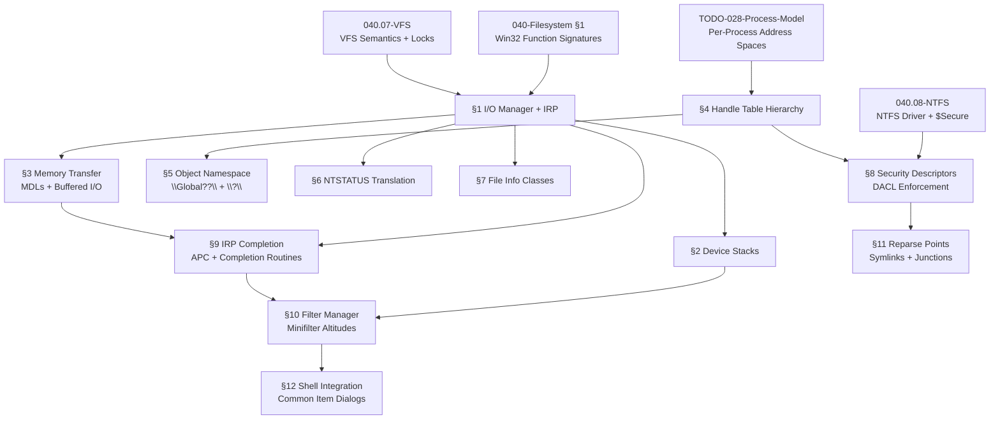

# 040.17-Win32-FS-API — Win32 Filesystem API Subsystem Architecture

> **Goal:** Implement the full Windows NT I/O subsystem architecture that sits between
> user-mode Win32 DLLs and the VFS/filesystem drivers. This goes far beyond the basic
> function signatures in `TODO-040-Filesystem.md §1` — it adds the I/O Manager, IRP
> dispatch, device stacks, Memory Descriptor Lists (MDLs), multi-level handle tables,
> the Object Manager namespace, NTSTATUS→Win32 error translation, the Filter Manager
> (minifilter architecture), security descriptor enforcement, and file information
> classes. No existing code implements any of these layers.
>
> **Current state:** Basic Win32 function signatures (`CreateFile`, `ReadFile`, etc.) are
> planned in the master TODO §1 with direct `vfs_ops` dispatch. VFS semantics (locks,
> case-insensitive paths, OVERLAPPED, IOCP) are planned in `TODO-040.07-VFS.md`. This
> TODO builds the NT kernel I/O plumbing that connects those two layers.

> [!IMPORTANT]
> **Spec Reference:** All structures, dispatch mechanisms, and status codes reference the
> *Win32 Filesystem API Integration and Subsystem Architecture Specification for
> Bare-Metal Operating Systems* (user-provided research document, 17 sections).
>
> **Cross-references:**
> - Basic Win32 function signatures: [`TODO-040-Filesystem.md §1`](file:///home/derickpayne/impossible-os/todo/010-Kernel-Foundations/TODO-040-Filesystem.md)
> - VFS layer semantics + OVERLAPPED + IOCP: [`TODO-040.07-VFS.md`](file:///home/derickpayne/impossible-os/todo/010-Kernel-Foundations/TODO-040-Filesystem/TODO-040.07-VFS.md)
> - NTFS on-disk structures + $Secure: [`TODO-040.08-NTFS.md`](file:///home/derickpayne/impossible-os/todo/010-Kernel-Foundations/TODO-040-Filesystem/TODO-040.08-NTFS.md)
> - Storage drivers (AHCI/VirtIO/NVMe): `TODO-040.01/02/15/16`
> - Native Win32 exports + DLL loading: `TODO-510-Native-Win32.md`

> [!CAUTION]
> **Memory Rule:** Use `pmm_alloc_contiguous()` for ALL DMA buffers and MDLs larger
> than 4 KB. `kmalloc` is ONLY for small kernel structs (≤ 4 KB). IRP headers and
> stack locations are small enough for `kmalloc`; MDL page arrays are not.

> [!WARNING]
> **This TODO does NOT duplicate existing work:**
> - `CreateFile`/`ReadFile`/`WriteFile` function bodies → master TODO §1
> - VFS case-insensitive lookup, share modes, byte-range locks → VFS TODO §1
> - OVERLAPPED struct + basic async → VFS TODO §5.1
> - IOCP kernel object → VFS TODO §6.2
> - NTFS $Secure database → NTFS TODO §7.1
>
> This TODO covers the **I/O Manager architecture** that dispatches those calls.

---

## TODO Completion Roadmap

### Dependency Graph

### Phase-by-Phase Implementation Order

| ⭐ | Phase  | Sections                           | Depends On                     | Status |
| -- | :----: | ---------------------------------- | ------------------------------ | :----: |
| 💎 | **0**  | Prerequisites (§1 sigs, VFS, NTFS) | master §1 + VFS + NTFS        |   ⬜   |
| 💎 | **1**  | §1 I/O Manager + IRP Architecture  | Phase 0                        |   ⬜   |
| 💎 | **1**  | §6 NTSTATUS → Win32 Translation    | Phase 0                        |   ⬜   |
| 💎 | **2**  | §2 Device Stack Model              | Phase 1 (§1)                   |   ⬜   |
| 💎 | **2**  | §3 Memory Transfer Modalities      | Phase 1 (§1)                   |   ⬜   |
| 💎 | **2**  | §7 File Information Classes        | Phase 1 (§1)                   |   ⬜   |
| 💎 | **3**  | §4 Multi-Level Handle Tables       | Process Model TODO             |   ⬜   |
| 💎 | **3**  | §9 IRP Completion + APC            | Phase 2 (§3)                   |   ⬜   |
| 💎 | **4**  | §5 Object Manager Namespace        | Phase 3 (§4)                   |   ⬜   |
| 💎 | **4**  | §8 Security Descriptor Enforcement | Phase 3 (§4) + NTFS $Secure    |   ⬜   |
| 💎 | **5**  | §10 Filter Manager (Minifilters)   | Phase 2 (§2) + Phase 3 (§9)   |   ⬜   |
| 💎 | **5**  | §11 Reparse Points                 | Phase 4 (§8)                   |   ⬜   |
| ⭐ | **6**  | §12 Shell Integration              | Phase 5 (§10)                  |   ⬜   |

> [!NOTE]
> **Phase 0** requires completing the basic Win32 function signatures (master §1),
> VFS semantics (040.07), and NTFS driver (040.08). These are separate TODOs.
>
> **Phase 1** builds the I/O Manager core: IRP allocation, major function dispatch,
> and the NTSTATUS translation table. This is the foundation for everything else.
>
> **Phase 2** adds the device stack model (Filter DO → FDO → PDO), memory transfer
> modes (MDL for Direct I/O, intermediate buffers for Buffered I/O), and file
> information class structs that IRPs carry as payloads.
>
> **Phase 3** upgrades the flat handle table to a multi-level paging hierarchy
> (matching ReactOS/NT) and adds IRP completion routines with APC delivery.
>
> **Phase 4** builds the Object Manager namespace (`\Global??\`, `\\?\` prefix,
> symbolic device links) and the security descriptor enforcement engine.
>
> **Phase 5** implements the Filter Manager with minifilter altitude ordering
> and reparse point processing (symlinks, junctions, mount points).
>
> **Phase 6** (⭐ exclusive) adds COM-based Common Item Dialogs and CLI metadata
> tools that leverage the full subsystem.

> [!TIP]
> **Incremental strategy:** Each phase can be built and tested independently.
> Phase 1 alone makes IRPs flow through the existing VFS dispatch. Phase 2 adds
> proper memory management. The system remains functional at each phase boundary.
>
> **Memory rule reminder:** IRP headers (~64 bytes) and stack locations (~36 bytes
> each) use `kmalloc`. MDL page arrays can grow to thousands of PFNs — use
> `pmm_alloc_contiguous()` for any MDL backing buffer > 4 KB.

---

## 1. I/O Manager & IRP Architecture

> The I/O Manager is the central kernel component that routes all filesystem
> requests via I/O Request Packets (IRPs). An IRP is a self-contained kernel
> structure encapsulating all parameters for one I/O operation.

### 1.1 IRP Structure Definition

**Prompt:** Define the IRP (I/O Request Packet) kernel structure per the Win32 subsystem spec §3. The IRP has two parts: (1) a fixed Header storing the device object pointer, completion status (`IoStatus`), MDL pointer, caller info, and the `SystemBuffer` pointer for Buffered I/O; (2) a dynamically-sized array of I/O Stack Locations, one per driver in the device stack. Each stack location stores the major function code (`IRP_MJ_CREATE`, `IRP_MJ_READ`, `IRP_MJ_WRITE`, `IRP_MJ_CLOSE`, `IRP_MJ_QUERY_INFORMATION`, `IRP_MJ_SET_INFORMATION`, `IRP_MJ_CLEANUP`), minor function code, parameters union (Create, Read, Write, QueryFile, SetFile), completion routine pointer, and context. Define `IO_STATUS_BLOCK` (Status + Information). After completing all items, mark every item as `[x]`, run `bash scripts/build.sh clean`, and commit as `"io: IRP structure definition"`. After implementation, save gotchas to MCP memory.

- [ ] Create `include/kernel/io/irp.h`
- [ ] Define `IO_STATUS_BLOCK` struct: `{ NTSTATUS Status; ULONG_PTR Information; }`
- [ ] Define `IRP` struct:
  - [ ] Header: `IoStatus`, `MdlAddress`, `AssociatedIrp.SystemBuffer`, `UserBuffer`
  - [ ] `Tail.Overlay.Thread` — requesting thread pointer
  - [ ] `StackCount` — number of stack locations
  - [ ] `CurrentLocation` — index of current stack location
- [ ] Define `IO_STACK_LOCATION` struct:
  - [ ] `MajorFunction` (uint8_t) — IRP_MJ_* codes
  - [ ] `MinorFunction` (uint8_t)
  - [ ] `Parameters` union: Create, Read, Write, QueryFile, SetFile
  - [ ] `CompletionRoutine` function pointer
  - [ ] `Context` — opaque driver context
  - [ ] `DeviceObject` — target device
- [ ] Define major function codes:
  - [ ] `IRP_MJ_CREATE = 0x00` (CreateFile)
  - [ ] `IRP_MJ_CLOSE = 0x02`
  - [ ] `IRP_MJ_READ = 0x03`
  - [ ] `IRP_MJ_WRITE = 0x04`
  - [ ] `IRP_MJ_QUERY_INFORMATION = 0x05`
  - [ ] `IRP_MJ_SET_INFORMATION = 0x06`
  - [ ] `IRP_MJ_CLEANUP = 0x12`
  - [ ] `IRP_MJ_DIRECTORY_CONTROL = 0x0C`
  - [ ] `IRP_MJ_FILE_SYSTEM_CONTROL = 0x0D`
  - [ ] `IRP_MJ_DEVICE_CONTROL = 0x0E`
  - [ ] `IRP_MJ_LOCK_CONTROL = 0x11`
- [ ] Commit: `"io: IRP structure definition"`

### 1.2 I/O Manager Core

**Prompt:** Implement the I/O Manager subsystem that allocates IRPs, dispatches them to device stacks, and handles completion per spec §3. `IoAllocateIrp(StackSize)` allocates an IRP with the specified number of stack locations from `kmalloc` (IRP + stack fits in < 1 KB). `IoGetCurrentIrpStackLocation(Irp)` returns the current stack location. `IoGetNextIrpStackLocation(Irp)` returns the next-lower. `IoCallDriver(DeviceObject, Irp)` sets the current stack location's device object and calls the target driver's dispatch routine. The I/O Manager must intercept `CreateFile` calls from master §1, build an IRP, and dispatch it through the device stack. After completing all items, mark every item as `[x]`, run `bash scripts/build.sh clean`, and commit as `"io: I/O Manager core dispatch"`. After implementation, save gotchas to MCP memory.

- [ ] Create `src/kernel/io/iomgr.c` and `include/kernel/io/iomgr.h`
- [ ] `IoAllocateIrp(StackSize)` — allocate IRP + N stack locations via `kmalloc`
- [ ] `IoFreeIrp(Irp)` — free IRP back to heap
- [ ] `IoGetCurrentIrpStackLocation(Irp)` — return `&Irp->Stack[Irp->CurrentLocation]`
- [ ] `IoGetNextIrpStackLocation(Irp)` — return next-lower stack entry
- [ ] `IoCallDriver(DeviceObject, Irp)` — advance stack, call `DeviceObject->DriverObject->MajorFunction[MJ]`
- [ ] `IoCompleteRequest(Irp, PriorityBoost)` — complete IRP, invoke completion routines bottom-up
- [ ] Hook into `CreateFile` path: build IRP_MJ_CREATE → dispatch → return handle
- [ ] Hook into `ReadFile` path: build IRP_MJ_READ → dispatch → copy data → complete
- [ ] Hook into `WriteFile` path: build IRP_MJ_WRITE → dispatch
- [ ] Hook into `CloseHandle` path: build IRP_MJ_CLOSE + IRP_MJ_CLEANUP → dispatch
- [ ] Commit: `"io: I/O Manager core dispatch"`

---

## 2. Device Stack Model

### 2.1 Device Objects & Driver Objects

**Prompt:** Define the device stack hierarchy per spec §3. A `DRIVER_OBJECT` represents a loaded kernel driver with an array of `MajorFunction[IRP_MJ_MAXIMUM]` dispatch routine pointers. A `DEVICE_OBJECT` represents one instance of a device and contains a pointer to its `DriverObject`, a pointer to the `NextDevice` (lower device in the stack), and device-specific extension memory. For a filesystem request, the stack is typically: Filter DO (antivirus/encryption) → FDO (filesystem driver, e.g. NTFS) → PDO (raw volume/blkdev). `IoAttachDeviceToDeviceStack(SourceDevice, TargetDevice)` links a device on top of a stack. After completing all items, mark every item as `[x]`, run `bash scripts/build.sh clean`, and commit as `"io: device stack model"`. After implementation, save gotchas to MCP memory.

- [ ] Create `include/kernel/io/device.h`
- [ ] Define `DRIVER_OBJECT`: driver name, `MajorFunction[]` dispatch table, device list
- [ ] Define `DEVICE_OBJECT`: `DriverObject*`, `NextDevice*`, `AttachedDevice*`, `DeviceExtension*`, `Flags`, `DeviceType`
- [ ] Define device types: `FILE_DEVICE_DISK`, `FILE_DEVICE_DISK_FILE_SYSTEM`, `FILE_DEVICE_UNKNOWN`
- [ ] Define device flags: `DO_BUFFERED_IO`, `DO_DIRECT_IO`
- [ ] `IoCreateDevice(DriverObject, ExtensionSize, DeviceName, DeviceType, Flags)` — allocate
- [ ] `IoDeleteDevice(DeviceObject)` — teardown
- [ ] `IoAttachDeviceToDeviceStack(SourceDevice, TargetDevice)` — link filter on top
- [ ] `IoDetachDevice(TargetDevice)` — unlink filter
- [ ] Register NTFS as FDO, blkdev as PDO for each mounted volume
- [ ] Commit: `"io: device stack model"`

---

## 3. Memory Transfer Modalities

### 3.1 Memory Descriptor Lists (MDLs) — Direct I/O

**Prompt:** Implement MDLs for zero-copy Direct I/O per spec §4.1. An MDL describes a user-space buffer's physical page layout: header (virtual address, byte count, byte offset, flags) followed by a PFN array. `IoAllocateMdl(VirtualAddress, Length)` allocates the MDL. The kernel must probe the buffer (verify valid virtual-to-physical mapping + access rights) and lock the physical pages to prevent page-out during DMA. `MmGetMdlVirtualAddress(Mdl)`, `MmGetMdlByteCount(Mdl)`, `MmGetMdlByteOffset(Mdl)` extract fields. For filesystem reads > 4 KB, Direct I/O avoids the CPU copy overhead of Buffered I/O. After completing all items, mark every item as `[x]`, run `bash scripts/build.sh clean`, and commit as `"io: MDL Direct I/O"`. After implementation, save gotchas to MCP memory.

> [!CAUTION]
> MDL PFN arrays can be large (one PFN per page). A 1 MB buffer = 256 PFNs × 8 bytes
> = 2 KB array. For buffers > 4 KB, use `pmm_alloc_contiguous()` for the MDL itself.

- [ ] Create `include/kernel/io/mdl.h` and `src/kernel/io/mdl.c`
- [ ] Define `MDL` struct: `Next`, `MdlFlags`, `MappedSystemVa`, `StartVa`, `ByteCount`, `ByteOffset`, PFN array
- [ ] `IoAllocateMdl(VirtualAddress, Length, SecondaryBuffer, ChargeQuota, Irp)` — allocate MDL
- [ ] `IoFreeMdl(Mdl)` — free MDL
- [ ] `MmProbeAndLockPages(Mdl, AccessMode, Operation)` — validate + pin pages
- [ ] `MmUnlockPages(Mdl)` — unpin pages
- [ ] `MmMapLockedPagesSpecifyCache(Mdl, AccessMode, CacheType)` — map into kernel VA
- [ ] `MmUnmapLockedPages(BaseAddress, Mdl)` — unmap
- [ ] `MmGetMdlVirtualAddress(Mdl)` — macro: `StartVa + ByteOffset`
- [ ] `MmGetMdlByteCount(Mdl)` — macro
- [ ] `MmGetMdlByteOffset(Mdl)` — macro
- [ ] Set `DO_DIRECT_IO` on filesystem device objects to use MDL path
- [ ] Commit: `"io: MDL Direct I/O"`

### 3.2 Buffered I/O

**Prompt:** Implement Buffered I/O for small requests per spec §4.2. When a device has `DO_BUFFERED_IO` set, the I/O Manager allocates a non-paged kernel buffer (`Irp->AssociatedIrp.SystemBuffer`) matching the user buffer size, copies data from user space into it (for writes) before dispatch, and copies data back (for reads) after completion. This avoids MDL overhead for small transfers. Use `kmalloc` for buffers ≤ 4 KB; fall back to `pmm_alloc_contiguous` for larger. The threshold for switching from Buffered to Direct I/O should be configurable (default: 4 KB). After completing all items, mark every item as `[x]`, run `bash scripts/build.sh clean`, and commit as `"io: Buffered I/O path"`. After implementation, save gotchas to MCP memory.

- [ ] In `IoCallDriver`, check `DeviceObject->Flags & DO_BUFFERED_IO`
- [ ] For writes: allocate `SystemBuffer`, copy from `Irp->UserBuffer` before dispatch
- [ ] For reads: allocate `SystemBuffer`, let driver fill it, copy to `UserBuffer` on complete
- [ ] Free `SystemBuffer` in `IoCompleteRequest`
- [ ] Use `kmalloc` for buffers ≤ 4 KB, `pmm_alloc_contiguous` for larger
- [ ] Add `IO_TRANSFER_THRESHOLD` constant (default 4096) — above this, prefer Direct I/O
- [ ] Commit: `"io: Buffered I/O path"`

---

## 4. Multi-Level Handle Table Hierarchy

### 4.1 Handle Table Structure

**Prompt:** Upgrade the flat handle table from master §1.1 to a dynamic, multi-level paging structure per spec §5. Each process gets an isolated handle table in kernel memory. A handle value is a multiple of 4 (0x04, 0x08, 0x0C...). Each entry is 8 bytes: object header pointer (with access mask in low bits) + granted access DWORD. The `TableCode` pointer's lowest 2 bits encode the current level (0=flat, 1=one-level, 2=two-level). Level 0: direct array of entries. Level 1: array of pointers to sub-tables. Level 2: array of pointers to level-1 tables. This ensures memory is allocated only as handles are consumed. Free entries form a doubly-linked list for O(1) allocation. After completing all items, mark every item as `[x]`, run `bash scripts/build.sh clean`, and commit as `"io: multi-level handle table"`. After implementation, save gotchas to MCP memory.

- [ ] Create `include/kernel/io/handle.h` and `src/kernel/io/handle.c`
- [ ] Define `HANDLE_TABLE_ENTRY`: object pointer + access mask (8 bytes)
- [ ] Define `HANDLE_TABLE`: `TableCode`, `NextHandleNeedingPool`, `HandleCount`, free list head
- [ ] `ObCreateHandleTable(Process)` — allocate initial level-0 table (256 entries)
- [ ] `ObInsertHandle(HandleTable, Object, AccessMask)` — allocate entry, return HANDLE
- [ ] `ObReferenceObjectByHandle(Handle, DesiredAccess, HandleTable)` — validate + resolve
- [ ] `ObCloseHandle(Handle, HandleTable)` — decrement refcount, free entry to free list
- [ ] Handle value encoding: `index * 4` (skip 0 — reserved for NULL handle)
- [ ] Level promotion: when level-0 fills, allocate level-1 table, move pointer
- [ ] Free list: doubly-linked via FLINK/BLINK in unused entries
- [ ] Validate access mask on every `ObReferenceObjectByHandle` call
- [ ] Audit logging: track handle open/close for security events
- [ ] Commit: `"io: multi-level handle table"`

### 4.2 Object Reference Counting

**Prompt:** Every kernel object (file, process, thread, event, mutex) must have a reference count per spec §5.1. The object header precedes the object body and contains: `ReferenceCount`, `HandleCount`, `TypeIndex`, and `SecurityDescriptor` pointer. `ObReferenceObject(Object)` increments the ref count atomically. `ObDereferenceObject(Object)` decrements it; when it reaches zero, the object's type-specific cleanup routine runs and the memory is freed. Handles add to `HandleCount` — an object stays alive as long as either count is nonzero. After completing all items, mark every item as `[x]`, run `bash scripts/build.sh clean`, and commit as `"io: object reference counting"`. After implementation, save gotchas to MCP memory.

- [ ] Define `OBJECT_HEADER`: `ReferenceCount`, `HandleCount`, `TypeIndex`, `SecurityDescriptor*`, `ObjectName*`
- [ ] Define `OBJECT_TYPE` registry: cleanup callback, delete callback, parse callback per type
- [ ] `ObReferenceObject(Object)` — atomic increment
- [ ] `ObDereferenceObject(Object)` — atomic decrement, free on zero
- [ ] Register object types: File, Process, Thread, Event, Mutex, IoCompletionPort
- [ ] Wire `CloseHandle` → `ObCloseHandle` → `ObDereferenceObject`
- [ ] Commit: `"io: object reference counting"`

---

## 5. Object Manager Namespace

### 5.1 Namespace Structure

**Prompt:** Implement the kernel Object Manager namespace per spec §14. The namespace is a tree of named objects rooted at `\`. Drive letters like `C:` are symbolic links in `\Global??\` pointing to device objects like `\Device\HarddiskVolume1`. When user-mode calls `CreateFile("C:\path")`, Kernel32.dll converts `C:` to `\\.\C:`, which maps to `\Global??\C:` internally. The Object Manager resolves the symbolic link to find the device object, then appends the remainder path and dispatches an IRP. Support the `\\?\` prefix for extended-length paths (up to 32,767 Unicode chars, bypasses MAX_PATH and normalization). After completing all items, mark every item as `[x]`, run `bash scripts/build.sh clean`, and commit as `"io: Object Manager namespace"`. After implementation, save gotchas to MCP memory.

- [ ] Create `src/kernel/io/obdir.c` and `include/kernel/io/obdir.h`
- [ ] Define `OBJECT_DIRECTORY`: hash table of named objects
- [ ] Define `OBJECT_SYMBOLIC_LINK`: target path string
- [ ] Create root directories: `\`, `\Device`, `\Global??`, `\FileSystem`
- [ ] `ObCreateSymbolicLink("\Global??\C:", "\Device\HarddiskVolume1")`
- [ ] On `vfs_mount()`, auto-create symbolic link for drive letter
- [ ] `ObLookupObject(Path)` — walk namespace, resolve symbolic links
- [ ] Parse `\\?\` prefix: skip normalization, allow 32,767 char paths
- [ ] Parse `\\.\` prefix: map to `\Global??\` directly
- [ ] Standard path normalization: resolve `.`, `..`, strip trailing spaces
- [ ] MAX_PATH = 260 default; `\\?\` prefix lifts to 32,767
- [ ] Commit: `"io: Object Manager namespace"`

---

## 6. NTSTATUS → Win32 Error Translation

### 6.1 Translation Engine

**Prompt:** Implement the NTSTATUS-to-Win32-error translation table per spec §15. Inside the kernel, all I/O operations use NTSTATUS codes (32-bit). At the user-kernel boundary, the system service dispatcher translates to Win32 error codes (queried via `GetLastError`). Key mappings: `STATUS_SUCCESS (0x00000000) → ERROR_SUCCESS (0)`, `STATUS_PENDING (0x00000103) → ERROR_IO_PENDING (997)`, `STATUS_ACCESS_DENIED (0xC0000022) → ERROR_ACCESS_DENIED (5)`, `STATUS_OBJECT_NAME_NOT_FOUND (0xC0000034) → ERROR_FILE_NOT_FOUND (2)`. Many NTSTATUS values map to the same Win32 error (e.g., `STATUS_DEVICE_BUSY`, `STATUS_DEVICE_HUNG` → `ERROR_BUSY`). After completing all items, mark every item as `[x]`, run `bash scripts/build.sh clean`, and commit as `"io: NTSTATUS translation table"`. After implementation, save gotchas to MCP memory.

- [ ] Create `include/kernel/io/ntstatus.h` — define all NTSTATUS codes
- [ ] Create `src/kernel/io/status.c` — translation table
- [ ] Define core NTSTATUS codes:
  - [ ] `STATUS_SUCCESS = 0x00000000`
  - [ ] `STATUS_PENDING = 0x00000103`
  - [ ] `STATUS_REPARSE = 0x00000104`
  - [ ] `STATUS_MORE_ENTRIES = 0x00000105`
  - [ ] `STATUS_ACCESS_DENIED = 0xC0000022`
  - [ ] `STATUS_OBJECT_NAME_NOT_FOUND = 0xC0000034`
  - [ ] `STATUS_OBJECT_NAME_COLLISION = 0xC0000035`
  - [ ] `STATUS_OBJECT_PATH_NOT_FOUND = 0xC000003A`
  - [ ] `STATUS_SHARING_VIOLATION = 0xC0000043`
  - [ ] `STATUS_DELETE_PENDING = 0xC0000056`
  - [ ] `STATUS_DISK_FULL = 0xC000007F`
  - [ ] `STATUS_END_OF_FILE = 0xC0000011`
  - [ ] `STATUS_NO_SUCH_FILE = 0xC000000F`
  - [ ] `STATUS_BUFFER_OVERFLOW = 0x80000005`
- [ ] `RtlNtStatusToDosError(NtStatus)` — lookup in sorted table, return Win32 code
- [ ] Wire into syscall return path: translate before writing to user `SetLastError`
- [ ] Handle many-to-one mappings (multiple NTSTATUS → single ERROR_BUSY)
- [ ] Commit: `"io: NTSTATUS translation table"`

---

## 7. File Information Classes

### 7.1 Information Structures

**Prompt:** Define the Win32 file information structures per spec §6.4. These are the payloads for `IRP_MJ_QUERY_INFORMATION` and `IRP_MJ_SET_INFORMATION` requests. `FILE_BASIC_INFO`: timestamps (Creation, LastAccess, LastWrite, Change) + file attributes as DWORD. `FILE_STANDARD_INFO`: AllocationSize, EndOfFile (both 64-bit), NumberOfLinks, DeletePending flag, Directory flag. `FILE_COMPRESSION_INFO`: CompressedFileSize, CompressionFormat, ChunkSize. `FILE_ALLOCATION_INFO`: allocation size to reserve on disk. `FILE_DISPOSITION_INFO`: DeleteFile flag (marks for delete-on-close). `FILE_STREAM_INFO`: enumerates Alternate Data Streams. `FILE_ZERO_DATA_INFORMATION`: byte range to zero-fill. After completing all items, mark every item as `[x]`, run `bash scripts/build.sh clean`, and commit as `"io: file information classes"`. After implementation, save gotchas to MCP memory.

- [ ] Create `include/kernel/io/fileinfo.h`
- [ ] Define `FILE_INFORMATION_CLASS` enum: `FileBasicInformation`, `FileStandardInformation`, etc.
- [ ] Define `FILE_BASIC_INFO`: `CreationTime`, `LastAccessTime`, `LastWriteTime`, `ChangeTime`, `FileAttributes`
- [ ] Define `FILE_STANDARD_INFO`: `AllocationSize`, `EndOfFile`, `NumberOfLinks`, `DeletePending`, `Directory`
- [ ] Define `FILE_COMPRESSION_INFO`: `CompressedFileSize`, `CompressionFormat`, `CompressionUnitShift`, `ChunkShift`
- [ ] Define `FILE_ALLOCATION_INFO`: `AllocationSize` (int64_t)
- [ ] Define `FILE_DISPOSITION_INFO`: `DeleteFile` (bool)
- [ ] Define `FILE_STREAM_INFO`: `NextEntryOffset`, `StreamNameLength`, `StreamSize`, `StreamAllocationSize`, `StreamName[]`
- [ ] Define `FILE_ZERO_DATA_INFORMATION`: `FileOffset`, `BeyondFinalZero`
- [ ] Define `FILE_END_OF_FILE_INFO`: `EndOfFile` (int64_t)
- [ ] Implement `NtQueryInformationFile(Handle, IoStatus, Buffer, Length, Class)` dispatch
- [ ] Implement `NtSetInformationFile(Handle, IoStatus, Buffer, Length, Class)` dispatch
- [ ] Both generate IRP_MJ_QUERY/SET_INFORMATION with the correct parameters
- [ ] Commit: `"io: file information classes"`

---

## 8. Security Descriptor Enforcement

### 8.1 Security Descriptor Engine

**Prompt:** Implement security descriptor evaluation per spec §13. Every securable object (file, directory, registry key) has a `SECURITY_DESCRIPTOR` containing: Owner SID, Group SID, DACL (Discretionary ACL), and SACL (System Audit ACL). A DACL contains an ordered list of Access Control Entries (ACEs). Each ACE is either Allow or Deny, and specifies a SID + access mask. On `CreateFile`, the kernel captures the caller's access token (SIDs + privileges), then evaluates the target's DACL: (1) check Deny ACEs first — if any SID matches with overlapping rights, return `STATUS_ACCESS_DENIED`; (2) check Allow ACEs — accumulate granted rights; (3) compare accumulated rights against requested access. Security descriptors are inherited from parent directories at file creation time. After completing all items, mark every item as `[x]`, run `bash scripts/build.sh clean`, and commit as `"io: security descriptor enforcement"`. After implementation, save gotchas to MCP memory.

- [ ] Create `include/kernel/io/security.h` and `src/kernel/io/security.c`
- [ ] Define `SECURITY_DESCRIPTOR`: `OwnerSid`, `GroupSid`, `Dacl*`, `Sacl*`, `Control` flags
- [ ] Define `ACL`: `AclSize`, `AceCount` + array of ACEs
- [ ] Define `ACE`: `AceType` (Allow/Deny/Audit), `AceFlags` (inheritance), `AccessMask`, `Sid`
- [ ] Define `SID`: `Revision`, `SubAuthorityCount`, `IdentifierAuthority`, `SubAuthority[]`
- [ ] Define `ACCESS_TOKEN`: array of SIDs + privilege flags per process
- [ ] `SeAccessCheck(SecurityDescriptor, AccessToken, DesiredAccess)` → return granted/denied
- [ ] DACL evaluation order: explicit Deny → explicit Allow → inherited Deny → inherited Allow
- [ ] Inheritance: child inherits parent DACL with `OBJECT_INHERIT_ACE` / `CONTAINER_INHERIT_ACE`
- [ ] Wire into IRP_MJ_CREATE path: call `SeAccessCheck` before completing the create
- [ ] Built-in SIDs: `S-1-1-0` (Everyone), `S-1-5-18` (SYSTEM), `S-1-5-32-544` (Administrators)
- [ ] SACL audit: log access attempts when SACL specifies auditing
- [ ] Commit: `"io: security descriptor enforcement"`

### 8.2 $Secure Integration

**Prompt:** Integrate with the NTFS `$Secure` metafile for centralized security descriptor storage per spec §13.2. Instead of storing a full descriptor per-file, NTFS stores a 32-bit Security ID in `$STANDARD_INFORMATION`. The descriptor lives in the global `$Secure` file, indexed by this ID. `SeQuerySecurityDescriptor(SecurityId)` looks up the full descriptor from $Secure. `SeAssignSecurityId(Descriptor)` hashes the descriptor, checks for a match in $Secure, and returns the existing ID or inserts a new entry. This saves massive space — millions of files with inherited permissions share one descriptor. After completing all items, mark every item as `[x]`, run `bash scripts/build.sh clean`, and commit as `"io: $Secure integration"`. After implementation, save gotchas to MCP memory.

> [!IMPORTANT]
> → XREF: `TODO-040.08-NTFS.md §7.1` — $Secure metafile reader

- [ ] `SeQuerySecurityDescriptor(SecurityId)` — lookup in $Secure by 32-bit ID
- [ ] `SeAssignSecurityId(Descriptor)` — hash descriptor, find or insert in $Secure
- [ ] Hash function: CRC32 or FNV-1a of raw descriptor bytes
- [ ] $Secure SDS stream: append-only, keyed by Security ID hash
- [ ] Cache: LRU cache of recently-resolved SecurityId → descriptor mappings
- [ ] Wire into IRP_MJ_CREATE for NTFS: read $STANDARD_INFORMATION → SecurityId → $Secure → DACL check
- [ ] Commit: `"io: $Secure integration"`

---

## 9. IRP Completion & Asynchronous Delivery

### 9.1 Completion Routines

**Prompt:** Implement IRP completion routine chaining per spec §3. When `IoCompleteRequest` is called by the lowest driver, the I/O Manager walks the IRP stack locations from bottom to top, invoking each level's `CompletionRoutine` if set. Each routine receives the DeviceObject, IRP, and its Context pointer. A completion routine can return `STATUS_MORE_PROCESSING_REQUIRED` to temporarily pause completion (useful for filter drivers that need to post-process data). The final completion step either unblocks the waiting thread (synchronous) or queues a kernel APC to the calling thread (asynchronous). After completing all items, mark every item as `[x]`, run `bash scripts/build.sh clean`, and commit as `"io: IRP completion routines"`. After implementation, save gotchas to MCP memory.

- [ ] `IoSetCompletionRoutine(Irp, Routine, Context, InvokeOnSuccess, InvokeOnError, InvokeOnCancel)`
- [ ] In `IoCompleteRequest`: walk stack bottom-to-top, call each completion routine
- [ ] Handle `STATUS_MORE_PROCESSING_REQUIRED` — pause completion, return to caller
- [ ] Synchronous path: signal event/unblock thread via `KeSetEvent`
- [ ] Asynchronous path: queue kernel APC to requesting thread
- [ ] Copy `IoStatus.Information` (bytes transferred) to user-visible location
- [ ] For OVERLAPPED I/O: write final status to `Overlapped->Internal`, bytes to `Overlapped->InternalHigh`
- [ ] Signal `Overlapped->hEvent` if set
- [ ] Commit: `"io: IRP completion routines"`

### 9.2 Cancel I/O

**Prompt:** Implement IRP cancellation per spec §3. `CancelIo(Handle)` cancels all pending IRPs for that file handle on the calling thread. `CancelIoEx(Handle, Overlapped)` cancels a specific overlapped operation. The I/O Manager sets the IRP's `Cancel` flag and calls the driver's `CancelRoutine` if one was registered via `IoSetCancelRoutine`. The cancel routine must complete the IRP with `STATUS_CANCELLED`. This is critical for timeout handling and graceful shutdown. After completing all items, mark every item as `[x]`, run `bash scripts/build.sh clean`, and commit as `"io: IRP cancellation"`. After implementation, save gotchas to MCP memory.

- [ ] `IoCancelIrp(Irp)` — set Cancel flag, call CancelRoutine if set
- [ ] `IoSetCancelRoutine(Irp, CancelRoutine)` — register cancel callback
- [ ] `CancelIo(Handle)` — cancel all pending IRPs for handle on current thread
- [ ] `CancelIoEx(Handle, Overlapped)` — cancel specific IRP
- [ ] Complete cancelled IRPs with `STATUS_CANCELLED → ERROR_OPERATION_ABORTED (995)`
- [ ] Cancel-safe queue: `IoCsqInitialize` pattern for drivers
- [ ] Commit: `"io: IRP cancellation"`

---

## 10. Filter Manager (Minifilters)

### 10.1 Filter Manager Core

**Prompt:** Implement the Filter Manager (FltMgr) per spec §12.1. The FltMgr is a system-supplied kernel driver that attaches to each mounted filesystem volume. Third-party minifilter drivers register with FltMgr instead of directly attaching to the device stack. Each minifilter has an "altitude" — a numerical load-order value that determines its position in the filter chain. When the I/O Manager sends an IRP to the filesystem, FltMgr intercepts it and passes it through registered minifilter pre-operation callbacks in altitude order (highest first). After the filesystem completes the IRP, FltMgr passes it through post-operation callbacks in reverse altitude order. This replaces the fragile legacy WDM filter stacking model. After completing all items, mark every item as `[x]`, run `bash scripts/build.sh clean`, and commit as `"io: Filter Manager core"`. After implementation, save gotchas to MCP memory.

- [ ] Create `src/kernel/io/fltmgr.c` and `include/kernel/io/fltmgr.h`
- [ ] Define `FLT_REGISTRATION`: minifilter name, altitude, operation callbacks array
- [ ] Define `FLT_OPERATION_REGISTRATION`: `MajorFunction`, `PreOperation`, `PostOperation`
- [ ] Define altitude ranges:
  - [ ] 400000–409999: FSFilter Anti-Virus
  - [ ] 320000–329999: FSFilter Encryption
  - [ ] 180000–189999: FSFilter Compression
  - [ ] 100000–109999: FSFilter HSM (Hierarchical Storage)
- [ ] `FltRegisterFilter(DriverObject, Registration, Filter*)` — register minifilter
- [ ] `FltStartFiltering(Filter)` — activate pre/post callbacks
- [ ] `FltUnregisterFilter(Filter)` — deactivate and remove
- [ ] IRP interception: FltMgr attaches as top device on each volume
- [ ] Pre-operation dispatch: walk minifilters highest-altitude-first
- [ ] Pre-operation returns: `FLT_PREOP_SUCCESS_WITH_CALLBACK`, `FLT_PREOP_COMPLETE` (block), `FLT_PREOP_SUCCESS_NO_CALLBACK`
- [ ] Post-operation dispatch: walk minifilters lowest-altitude-first (reverse)
- [ ] Commit: `"io: Filter Manager core"`

---

## 11. Reparse Points

### 11.1 Reparse Point Processing

**Prompt:** Implement reparse point handling per spec §12. A reparse point is up to 16 KB of custom metadata stored in a file/directory's `$REPARSE_POINT` NTFS attribute. When the VFS/Object Manager encounters a file with a reparse point during path traversal, it reads the 32-bit Reparse Tag, halts normal parsing, and redirects to a handler for that tag type. Implement built-in reparse tags: `IO_REPARSE_TAG_SYMLINK (0xA000000C)` — symbolic links to files/dirs, `IO_REPARSE_TAG_MOUNT_POINT (0xA0000003)` — directory junctions and volume mount points. After completing all items, mark every item as `[x]`, run `bash scripts/build.sh clean`, and commit as `"io: reparse point processing"`. After implementation, save gotchas to MCP memory.

> [!IMPORTANT]
> → XREF: `TODO-040.07-VFS.md §2.4` — hard links + reparse routing stubs

- [ ] Define `REPARSE_DATA_BUFFER`: `ReparseTag`, `ReparseDataLength`, target path string
- [ ] Define reparse tags:
  - [ ] `IO_REPARSE_TAG_MOUNT_POINT = 0xA0000003`
  - [ ] `IO_REPARSE_TAG_SYMLINK = 0xA000000C`
  - [ ] `IO_REPARSE_TAG_APPEXECLINK = 0x8000001B`
- [ ] In Object Manager path resolution: detect `$REPARSE_POINT` attribute
- [ ] Read reparse data → extract substitute path
- [ ] Restart path resolution from substitute path
- [ ] Symlink loop detection: max 63 reparse restarts (match NT limit)
- [ ] `DeviceIoControl(FSCTL_SET_REPARSE_POINT, ...)` — set reparse data on file
- [ ] `DeviceIoControl(FSCTL_GET_REPARSE_POINT, ...)` — read reparse data
- [ ] `DeviceIoControl(FSCTL_DELETE_REPARSE_POINT, ...)` — remove reparse data
- [ ] Volume mount points: empty directory with reparse → mount another volume
- [ ] Commit: `"io: reparse point processing"`

---

## 12. Shell Integration & CLI Tools

### 12.1 Common Item Dialogs (🚀 Exclusive)

**Prompt:** Implement the COM-based Common Item Dialog system per spec §16.1. Modern Win32 apps use `IFileOpenDialog` and `IFileSaveDialog` COM interfaces (not the legacy `GetOpenFileName`). These provide a standardized file picker UI using the `IShellItem` namespace, supporting both physical paths and virtual namespaces. The system provides the dialog; the app merely invokes it and receives the chosen path. This ensures visual consistency across all applications and supports features like favorites, recent files, and custom filter patterns. After completing all items, mark every item as `[x]`, run `bash scripts/build.sh clean`, and commit as `"shell: Common Item Dialogs"`. After implementation, save gotchas to MCP memory.

> [!NOTE]
> This is an **Impossible OS exclusive** — neither Linux nor other hobby OSes
> provide a system-level COM file dialog that apps can invoke. Linux relies on
> toolkit-specific dialogs (GTK, Qt) with no system standard.

- [ ] Define `IFileDialog` COM interface: `Show`, `SetTitle`, `SetFileTypes`, `GetResult`
- [ ] Define `IFileOpenDialog` (extends IFileDialog): `SetMultiSelect`, `GetResults`
- [ ] Define `IFileSaveDialog` (extends IFileDialog): `SetDefaultExtension`, `SetFileName`
- [ ] Define `IShellItem`: `GetDisplayName`, `GetAttributes`, `GetParent`
- [ ] Implement dialog window: file list, path breadcrumb, filter dropdown, OK/Cancel
- [ ] Populate from `FindFirstFile`/`FindNextFile` via the Win32 API
- [ ] File type filter: parse `"Text Files (*.txt)|*.txt|All Files (*.*)|*.*"` format
- [ ] Return `IShellItem` on OK, or `ERROR_CANCELLED` on Cancel
- [ ] Commit: `"shell: Common Item Dialogs"`

### 12.2 CLI Metadata Tools

**Prompt:** Implement command-line tools for querying advanced filesystem metadata per spec §16.2. A `fileinfo` shell command displays: file attributes bitmask (parsed: ReadOnly, Hidden, System, Archive, Compressed, Encrypted, Sparse, ReparsePoint), all timestamps (created, modified, accessed, changed), file size + allocation size, number of hard links, Alternate Data Streams list, and security descriptor (owner SID, DACL entries). A `streams` command lists all ADS on a file. These map directly to `NtQueryInformationFile` with various file information classes. After completing all items, mark every item as `[x]`, run `bash scripts/build.sh clean`, and commit as `"shell: fileinfo + streams CLI tools"`. After implementation, save gotchas to MCP memory.

- [ ] Shell command: `fileinfo C:\path\file.txt` — display full metadata
  - [ ] Parse attribute bitmask → human-readable flags
  - [ ] Show timestamps: Created, Modified, Accessed, Changed
  - [ ] Show AllocationSize vs EndOfFile
  - [ ] Show NumberOfLinks
  - [ ] Show ADS list (if any)
  - [ ] Show Owner SID and DACL entries
- [ ] Shell command: `streams C:\path\file.txt` — list Alternate Data Streams
  - [ ] Show stream name, size, allocation for each named $DATA attribute
- [ ] Both use `NtQueryInformationFile` internally (§7.1)
- [ ] Commit: `"shell: fileinfo + streams CLI tools"`

---

## Priority Order

| Priority  | Section                                  | Description                                                    |
|-----------|------------------------------------------|----------------------------------------------------------------|
| 🔴 P0     | §1.1 IRP Structure Definition            | Foundation — all I/O flows through IRPs                        |
| 🔴 P0     | §1.2 I/O Manager Core                    | Central dispatch — CreateFile/Read/Write route through this    |
| 🟠 P1     | §6.1 NTSTATUS Translation                | Apps rely on correct error codes for fallback logic             |
| 🟠 P1     | §2.1 Device Stack Model                  | Filter + FDO + PDO layering — enables minifilters              |
| 🟠 P1     | §3.1 MDL Direct I/O                      | Zero-copy for large reads/writes — major perf gain             |
| 🟠 P1     | §3.2 Buffered I/O                        | Safe path for small requests                                   |
| 🟠 P1     | §7.1 File Information Classes            | Win32 apps query file metadata via these structs               |
| 🟡 P2     | §4.1 Handle Table Hierarchy              | Scales to thousands of handles per process                     |
| 🟡 P2     | §4.2 Object Reference Counting           | Prevents use-after-free of kernel objects                      |
| �� P2     | §9.1 Completion Routines                 | Enables filter driver post-processing                          |
| 🟡 P2     | §8.1 Security Descriptor Engine          | DACL enforcement — file-level access control                   |
| 🟢 P3     | §5.1 Object Manager Namespace            | `\\?\` paths, symbolic links, device mapping                   |
| 🟢 P3     | §8.2 $Secure Integration                 | Centralized NTFS security — space savings                      |
| 🟢 P3     | §9.2 Cancel I/O                          | Graceful timeout + shutdown                                    |
| 🟢 P3     | §10.1 Filter Manager (Minifilters)       | Extensible FS filtering — AV, encryption, compression          |
| 🟢 P3     | §11.1 Reparse Points                     | Symlinks, junctions, mount points                              |
| 🟢 P3     | §12.2 CLI Metadata Tools                 | 🚀 **Exclusive** — built-in `fileinfo` + `streams` commands   |
| 🔵 P4     | §12.1 Common Item Dialogs                | 🚀 **Exclusive** — system-level COM file picker                |

---

## OS Comparison

| Feature                            | 🪟 Windows 11                       | 🐧 Linux                             | 🚀 Impossible OS                                    |
| ---------------------------------- | ----------------------------------- | ------------------------------------- | --------------------------------------------------- |
| I/O Request Packets                | ✅ Full IRP model (NT kernel)        | ❌ No equivalent (VFS ops direct)      | ⬜ §1 P0 — IRP dispatch engine                      |
| Device stack layering              | ✅ Filter DO → FDO → PDO            | ❌ No device stack                     | ⬜ §2 P1 — three-tier device model                  |
| Direct I/O (MDL / zero-copy)       | ✅ MDL + DMA                         | ✅ Direct I/O (O_DIRECT)              | ⬜ §3.1 P1 — MDL-based zero-copy                    |
| Buffered I/O                       | ✅ SystemBuffer                      | ✅ Buffered by default                 | ⬜ §3.2 P1 — intermediate kernel buffer             |
| Multi-level handle tables          | ✅ 3-level paging                    | ❌ fd table (flat array)               | ⬜ §4.1 P2 — dynamic level promotion                |
| Object reference counting          | ✅ ObReferenceObject                 | ✅ refcount (different model)          | ⬜ §4.2 P2 — type-aware ref counting                |
| Object Manager namespace           | ✅ \Global??\ + \\?\                 | ❌ No equivalent (paths are strings)   | ⬜ §5.1 P3 — full namespace + 32K paths             |
| NTSTATUS → error translation       | ✅ RtlNtStatusToDosError             | ❌ errno is direct                     | ⬜ §6.1 P1 — 200+ status mappings                   |
| File information classes           | ✅ 70+ info classes                  | ✅ stat/statx (limited)                | ⬜ §7.1 P1 — core classes                            |
| Security descriptor enforcement    | ✅ Full DACL/SACL + $Secure          | ✅ POSIX ACLs (simpler model)          | ⬜ §8 P2 — Win32-compatible DACL                    |
| IRP completion routines            | ✅ IoSetCompletionRoutine             | ❌ No equivalent                       | ⬜ §9.1 P2 — bottom-up chain                         |
| Cancel I/O                         | ✅ CancelIoEx                        | ❌ No standard cancel                  | ⬜ §9.2 P3                                           |
| Filter Manager (minifilters)       | ✅ FltMgr + altitude model           | ❌ No equivalent (eBPF is different)   | ⬜ §10.1 P3 — altitude-based pre/post callbacks     |
| Reparse points                     | ✅ Symlinks, junctions, mount pts    | ✅ symlinks (simpler model)            | ⬜ §11.1 P3 — full reparse tag dispatch             |
| **System file picker (COM)**       | ✅ IFileOpenDialog                   | ❌ No system standard                  | ⬜ §12.1 P4 — **system COM dialog** 🚀             |
| **Built-in metadata CLI**          | ⚠️ `fsutil` (limited, not intuitive) | ⚠️ `stat`/`getfattr` (separate tools) | ⬜ §12.2 P3 — **`fileinfo` + `streams`** 🚀        |

> **After P0+P1 items:** Impossible OS has a full I/O Manager with IRP dispatch, MDLs,
> device stacks, and proper error translation — matching the NT kernel's I/O model.
> **After P2–P3 items:** Multi-level handles, security enforcement, minifilters, and
> reparse points bring full Win32 semantic parity.
> **After P4 (§12.1):** System-level COM file picker — a feature no other hobby OS ships.

---

## New Files Summary

| File                                   | Purpose                                                          |
|----------------------------------------|------------------------------------------------------------------|
| `include/kernel/io/irp.h`             | IRP structure, major function codes, IO_STATUS_BLOCK             |
| `include/kernel/io/iomgr.h`           | I/O Manager API: IoAllocateIrp, IoCallDriver, IoCompleteRequest  |
| `src/kernel/io/iomgr.c`               | I/O Manager implementation                                      |
| `include/kernel/io/device.h`          | DEVICE_OBJECT, DRIVER_OBJECT, device stack                       |
| `include/kernel/io/mdl.h`             | MDL structure, MmProbeAndLockPages, MmMapLockedPages             |
| `src/kernel/io/mdl.c`                 | MDL allocation, probing, locking, mapping                        |
| `include/kernel/io/handle.h`          | Multi-level handle table, HANDLE_TABLE_ENTRY                     |
| `src/kernel/io/handle.c`              | Handle table hierarchy, ref counting                             |
| `include/kernel/io/obdir.h`           | Object Manager namespace, symbolic links                         |
| `src/kernel/io/obdir.c`               | Namespace resolution, `\\?\` and `\Global??\` support             |
| `include/kernel/io/ntstatus.h`        | NTSTATUS code definitions                                        |
| `src/kernel/io/status.c`              | NTSTATUS → Win32 error translation table                         |
| `include/kernel/io/fileinfo.h`        | FILE_BASIC_INFO, FILE_STANDARD_INFO, etc.                        |
| `include/kernel/io/security.h`        | SECURITY_DESCRIPTOR, ACL, ACE, SID, SeAccessCheck                |
| `src/kernel/io/security.c`            | DACL evaluation, $Secure integration                             |
| `include/kernel/io/fltmgr.h`         | Filter Manager, FLT_REGISTRATION, altitude model                 |
| `src/kernel/io/fltmgr.c`             | Minifilter dispatch, pre/post-operation callbacks                |
