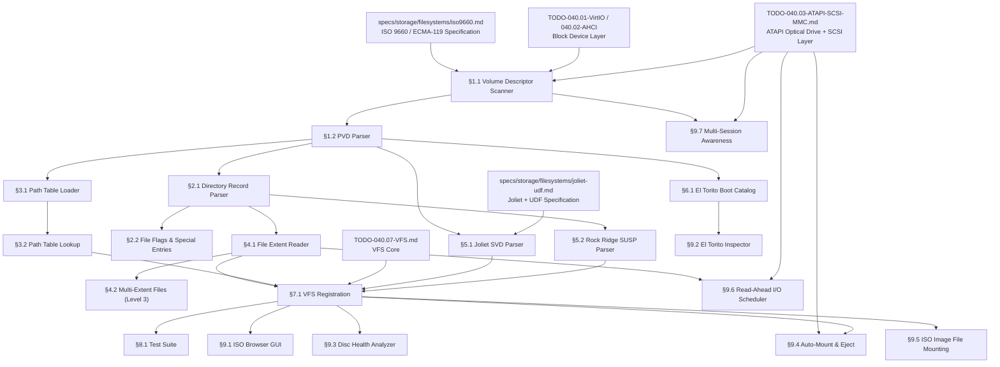

# 040.18-ISO9660 — ISO 9660 / ECMA-119 Read-Only Filesystem Driver

> **Goal:** Implement a read-only ISO 9660 (ECMA-119) filesystem driver for Impossible OS.
> The driver must parse the Volume Descriptor Set (PVD, SVD, Boot Record), navigate
> directory records with variable-length entries and sector-boundary padding, resolve
> file paths via both directory traversal and the Path Table, read contiguous file
> extents, and handle Level 3 multi-extent files exceeding 4 GiB. Extensions include
> Joliet (Unicode filenames via SVD), Rock Ridge (POSIX metadata via SUSP), and
> El Torito (boot catalog parsing). ISO 9660 is essential for mounting installation
> media, reading driver packages from optical discs, and supporting `.iso` images
> attached via QEMU `-cdrom`. No existing ISO 9660 code exists in the codebase.

> [!CAUTION]
> **Memory Rule:** Use `pmm_alloc_contiguous()` for path table buffers (typically
> 1–32 KiB), directory extent caches, and any allocation > 4 KB. `kmalloc` is ONLY
> for small kernel structs (≤ 4 KB). See `rules.md` Known Gotchas.

> [!WARNING]
> **Read-Only Only.** ISO 9660 is an inherently read-only filesystem — there are no
> free-space management structures, no journaling, and no write paths. All VFS write
> callbacks must return `-EROFS`.

> [!IMPORTANT]
> **Spec Reference:** All byte offsets, field layouts, and algorithms reference the
> [ISO 9660 / ECMA-119 Specification](file:///home/derickpayne/impossible-os/specs/storage/filesystems/iso9660.md).
>
> **Endianness:** ISO 9660 uses both-endian (733/723) encoding for multi-byte integers.
> On x86-64, read only the little-endian half. See spec §Encoding Methods.

---

## TODO Completion Roadmap

> [!IMPORTANT]
> **Four TODO files and two specs** feed into the ISO 9660 driver. The ATAPI/SCSI
> driver provides the transport layer for physical optical drives, while the block
> device layer handles virtual `.iso` images. Joliet and UDF extensions build on
> the base ISO 9660 infrastructure.

### Dependency Graph



### Phase-by-Phase Implementation Order

| ⭐ | Phase  | Sections                                          | What It Delivers                                              | Depends On                      | Status |
| -- | :----: | ------------------------------------------------- | ------------------------------------------------------------- | ------------------------------- | :----: |
| 💎 | **0**  | Block device + ATAPI + spec                       | `blkdev_read()`, ATAPI SCSI, spec knowledge                   | —                               |   ✅   |
| 💎 | **1**  | §1.1 Volume Descriptor Scanner                    | `CD001` detection, PVD/SVD/Boot Record location                | Phase 0                         |   ⬜   |
| 💎 | **1**  | §1.2 PVD Parser                                   | Root directory record, path table, volume size                 | Phase 1 (§1.1)                  |   ⬜   |
| 💎 | **2**  | §2.1 Directory Record Parser                      | Variable-length record parsing, sector-boundary handling       | Phase 1 (§1.2)                  |   ⬜   |
| 💎 | **2**  | §2.2 File Flags & Special Entries                  | Hidden files, `.`/`..` entries, directory vs file detection    | Phase 2 (§2.1)                  |   ⬜   |
| 💎 | **2**  | §3.1 Path Table Loader                             | Cached path table in kernel memory                             | Phase 1 (§1.2)                  |   ⬜   |
| 💎 | **3**  | §3.2 Path Table Lookup                             | O(n) fast directory lookup without disk I/O                    | Phase 2 (§3.1)                  |   ⬜   |
| 💎 | **3**  | §4.1 File Extent Reader                            | Read contiguous file data by LBA + length                      | Phase 2 (§2.1)                  |   ⬜   |
| 💎 | **3**  | §4.2 Multi-Extent Files (Level 3)                  | Files > 4 GiB via concatenated extents                         | Phase 3 (§4.1)                  |   ⬜   |
| 💎 | **4**  | §5.1 Joliet SVD Parser                             | Unicode filenames up to 64 chars via UCS-2 decoding            | Phase 1 (§1.2)                  |   ⬜   |
| 💎 | **4**  | §5.2 Rock Ridge SUSP Parser                        | Long filenames, POSIX permissions, symlinks                    | Phase 2 (§2.1)                  |   ⬜   |
| 💎 | **4**  | §6.1 El Torito Boot Catalog                        | Boot image enumeration for installation media                  | Phase 1 (§1.2)                  |   ⬜   |
| 💎 | **5**  | §7.1 VFS Registration                              | Mount ISO volumes, `vfs_ops` callbacks, drive letter           | Phase 3 + Phase 4 + VFS        |   ⬜   |
| 💎 | **6**  | §8.1 Test Suite                                    | Automated validation with ISO test images                      | Phase 5 (§7.1)                  |   ⬜   |
| ⭐ | **6**  | §9.1 ISO Browser GUI                               | Visual ISO contents explorer in File Manager                   | Phase 5 (§7.1)                  |   ⬜   |
| ⭐ | **6**  | §9.2 El Torito Inspector                           | Boot catalog viewer with platform/emulation details            | Phase 4 (§6.1)                  |   ⬜   |
| ⭐ | **6**  | §9.3 Disc Health Analyzer                          | Media integrity verification with read-error mapping           | Phase 5 (§7.1)                  |   ⬜   |
| ⭐ | **6**  | §9.4 Auto-Mount & Eject                            | Hot-insert notification, auto-mount, safe eject                | Phase 5 (§7.1) + ATAPI         |   ⬜   |
| ⭐ | **7**  | §9.5 ISO Image File Mounting                       | Double-click `.iso` → virtual optical drive                    | Phase 5 (§7.1)                  |   ⬜   |
| ⭐ | **7**  | §9.6 Read-Ahead I/O Scheduler                     | Adaptive prefetch with ns-latency histograms                   | Phase 3 (§4.1) + ATAPI         |   ⬜   |
| ⭐ | **7**  | §9.7 Multi-Session Awareness                       | Detect and navigate multi-session discs (CD-R/RW)              | Phase 1 (§1.1) + ATAPI         |   ⬜   |

> [!NOTE]
> **Phase 0** is already done — block devices, ATAPI/SCSI, and VFS core are in place.
>
> **Phase 1** parses the Volume Descriptor Set — the entry point to all ISO 9660 data.
> The PVD contains the root directory record and path table locations.
>
> **Phases 2–3** implement the two navigation strategies: directory record traversal
> (recursive) and path table lookup (flat index). Both are needed for robustness.
>
> **Phase 4** adds extensions: Joliet (Unicode), Rock Ridge (POSIX), El Torito (boot).
>
> **Phase 5** wires everything to VFS for mountable volumes.
>
> **Phase 6** adds competitive features (⭐) and the test suite.
>
> **Phase 7** adds stretch exclusive features: `.iso` loopback mounting, adaptive
> read-ahead with telemetry, and multi-session disc browsing.

> [!TIP]
> **ISO 9660 is simple compared to other filesystems.** No free-space bitmap, no
> journaling, no cluster chains — files are contiguous extents addressed by LBA.
> A basic read-only driver can be implemented in ~800 lines of C.
>
> **QEMU testing flags:**
> ```
> qemu ... -cdrom test.iso
> qemu ... -drive file=test.iso,media=cdrom,if=none,id=cd0 -device ide-cd,drive=cd0
> ```
>
> **Create test ISOs on the host:**
> ```
> mkdir -p iso_root/BOOT && echo "hello" > iso_root/TEST.TXT
> mkisofs -o test.iso -R -J -b BOOT/bootimg -no-emul-boot iso_root
> ```
>
> **Memory rule reminder:** Path table buffers (1–32 KiB) and directory extent
> caches (2–64 KiB) must use `pmm_alloc_contiguous()`. Volume descriptor parsing
> uses a 2048-byte stack buffer.

---

## 1. Volume Descriptor Parsing

### 1.1 Volume Descriptor Scanner

**Prompt:** ISO 9660 volumes begin with a System Area (LBA 0–15, 32 KiB) followed by the Volume Descriptor Set starting at LBA 16. Each descriptor is exactly 2048 bytes. Scan sequentially: validate the magic string `"CD001"` at bytes 1–5, read the type code at byte 0, and dispatch to the appropriate parser. Continue until type code 255 (Terminator) is encountered. Per spec §Volume Descriptors and §Scanning Algorithm. After completing all items, mark every item as `[x]`, update this prompt to a verification prompt, run `bash scripts/build.sh clean`, and commit as `"fs: ISO 9660 volume descriptor scanner"`. After implementation, save any gotchas to MCP memory.

- [ ] Create `src/kernel/fs/iso9660.c` and `include/kernel/fs/iso9660.h`
- [ ] Define `struct iso9660_volume` — PVD data, root dir record, path table, block device
- [ ] Implement `iso9660_detect(blkdev)`:
  - [ ] Read 2048 bytes from LBA 16
  - [ ] Validate bytes 1–5 == `"CD001"` (ASCII)
  - [ ] Return `true` if magic matches
- [ ] Implement `iso9660_scan_descriptors(blkdev)`:
  - [ ] Start at LBA 16, read one sector (2048 bytes) per iteration
  - [ ] Check byte 0 (type code):
    - [ ] Type 0 → store Boot Record (El Torito catalog LBA at bytes 71–74 LE)
    - [ ] Type 1 → parse as PVD (§1.2)
    - [ ] Type 2 → check Joliet escape sequences at bytes 88–120 (§5.1)
    - [ ] Type 255 → stop scanning
    - [ ] Other → skip (log unknown type)
  - [ ] Validate byte 6 (version) == `0x01`
  - [ ] Advance LBA and repeat
- [ ] Safety: limit scan to 32 descriptors max (prevent infinite loop on corrupt media)
- [ ] Log: `[iso9660] Found %s at LBA %u` for each descriptor type
- [ ] Commit: `"fs: ISO 9660 volume descriptor scanner"`

### 1.2 Primary Volume Descriptor Parser

**Prompt:** The PVD (type 1) is the central metadata record, occupying a full 2048-byte logical sector. Extract all critical fields per spec §PVD Field Layout: Volume Space Size (offset 80, uint32_bb), Logical Block Size (offset 128, uint16_bb — must be 2048), Root Directory Record (offset 156, 34 bytes inline), Path Table Size and Location (offsets 132–143), Volume Identifier (offset 40, 32 bytes strD), and date/time fields. The root directory record contains the LBA and data length of the root directory extent. After completing all items, mark every item as `[x]`, update this prompt to a verification prompt, run `bash scripts/build.sh clean`, and commit as `"fs: ISO 9660 PVD parser"`. After implementation, save any gotchas to MCP memory.

- [ ] Implement both-endian accessor macros per spec §Implementation Strategy:
  - [ ] `iso_read_733(p)` — read LE half of both-endian uint32 (8 bytes total, read first 4)
  - [ ] `iso_read_723(p)` — read LE half of both-endian uint16 (4 bytes total, read first 2)
- [ ] Parse PVD fields from 2048-byte buffer:
  - [ ] Volume Identifier at offset 40 (32 bytes, strD) — strip trailing spaces
  - [ ] Volume Space Size at offset 80 (uint32_bb) — total logical blocks
  - [ ] Logical Block Size at offset 128 (uint16_bb) — validate == 2048, reject otherwise
  - [ ] Path Table Size at offset 132 (uint32_bb) — bytes
  - [ ] Type L Path Table LBA at offset 140 (uint32_le) — mandatory LE path table
  - [ ] Root Directory Record at offset 156 (34 bytes) — inline directory record
- [ ] Parse inline root directory record (34 bytes):
  - [ ] Location of Extent at offset 2 (uint32_bb) — LBA of root directory
  - [ ] Data Length at offset 10 (uint32_bb) — size of root directory extent in bytes
  - [ ] File Flags at offset 25 — must have bit 1 set (directory)
- [ ] Parse date/time fields (dec-datetime, 17 bytes each):
  - [ ] Volume Creation Date at offset 813
  - [ ] Volume Modification Date at offset 830
  - [ ] Volume Expiration Date at offset 847 (all ASCII '0' = never expires)
  - [ ] Volume Effective Date at offset 864
- [ ] Store parsed PVD in `struct iso9660_volume`
- [ ] Log: `[iso9660] Volume: "%s", %llu blocks, block_size=%u`
- [ ] Log: `[iso9660] Root dir: LBA=%u, size=%u bytes`
- [ ] Commit: `"fs: ISO 9660 PVD parser"`

---

## 2. Directory Record Navigation

### 2.1 Directory Record Parser

**Prompt:** Directory records are variable-length (33–255 bytes) packed sequentially within directory extents. Each record starts with a length byte at offset 0. If the length byte is 0, it signals sector-boundary padding — skip to the next 2048-byte sector boundary. Records must NOT span sector boundaries. Parse each record to extract: extent LBA (offset 2, uint32_bb), data length (offset 10, uint32_bb), recording date/time (offset 18, 7-byte dir-datetime), file flags (offset 25), and file identifier (offset 33, variable length with LEN_FI at offset 32). Per spec §Directory Records and §Parsing Algorithm. After completing all items, mark every item as `[x]`, update this prompt to a verification prompt, run `bash scripts/build.sh clean`, and commit as `"fs: ISO 9660 directory record parser"`. After implementation, save any gotchas to MCP memory.

- [ ] Define `struct iso9660_dir_record`:
  - [ ] `uint8_t length` — total record length
  - [ ] `uint8_t ext_attr_len` — extended attribute record length
  - [ ] `uint32_t extent_lba` — LBA of file/dir data
  - [ ] `uint32_t data_length` — file/dir size in bytes
  - [ ] `uint8_t datetime[7]` — compact 7-byte date/time
  - [ ] `uint8_t flags` — file flags bitfield
  - [ ] `uint8_t name_len` — length of file identifier
  - [ ] `char name[222]` — file identifier (max 255 - 33 = 222)
- [ ] Implement `iso9660_parse_dir_record(raw_bytes, out_record)`:
  - [ ] Read length byte at offset 0 — if 0, return `ISO_PADDING`
  - [ ] Validate length >= 33 (minimum fixed fields)
  - [ ] Extract extent LBA via `iso_read_733(raw + 2)`
  - [ ] Extract data length via `iso_read_733(raw + 10)`
  - [ ] Copy 7-byte datetime from offset 18
  - [ ] Read flags from offset 25
  - [ ] Read LEN_FI from offset 32, copy name from offset 33
  - [ ] Strip version suffix (`;1`) from filename for user display
- [ ] Implement `iso9660_read_directory(vol, extent_lba, extent_size)`:
  - [ ] Allocate buffer for entire directory extent via `pmm_alloc_contiguous()`
  - [ ] Read all sectors from `extent_lba` to `extent_lba + ceil(extent_size / 2048)`
  - [ ] Walk records per spec §Parsing Algorithm:
    - [ ] `offset = 0; while offset < extent_size`
    - [ ] If `data[offset] == 0` → `offset = ALIGN_UP(offset + 1, 2048); continue`
    - [ ] If `offset + rec_len > extent_size` → break (truncated)
    - [ ] Parse record, advance `offset += rec_len`
- [ ] Safety: validate `extent_lba + data_length / 2048 <= volume_space_size`
- [ ] Commit: `"fs: ISO 9660 directory record parser"`

### 2.2 File Flags & Special Entries

**Prompt:** Each directory record has a File Flags byte at offset 25 with 8 bit flags per spec §File Flags Bitfield. Every directory extent starts with exactly two mandatory entries: `.` (identifier byte `0x00`) pointing to self, and `..` (identifier byte `0x01`) pointing to parent. Handle the hidden file flag (bit 0), directory flag (bit 1), associated file flag (bit 2), and multi-extent flag (bit 7). Parse the 7-byte binary date/time (dir-datetime) with GMT offset. After completing all items, mark every item as `[x]`, update this prompt to a verification prompt, run `bash scripts/build.sh clean`, and commit as `"fs: ISO 9660 file flags and special entries"`. After implementation, save any gotchas to MCP memory.

- [ ] Implement file flags decoder:
  - [ ] Bit 0 — Hidden: exclude from default directory listings
  - [ ] Bit 1 — Directory: record describes a subdirectory
  - [ ] Bit 2 — Associated File: resource fork / metadata (report but skip)
  - [ ] Bit 7 — Multi-Extent: not the final record for this file (Level 3)
- [ ] Detect `.` and `..` entries:
  - [ ] LEN_FI == 1 && identifier[0] == `0x00` → current directory
  - [ ] LEN_FI == 1 && identifier[0] == `0x01` → parent directory
  - [ ] Skip these in `readdir` output (or map to `.`/`..` names)
- [ ] Implement `iso9660_parse_dir_datetime(raw_7bytes)`:
  - [ ] Year = `raw[0] + 1900` (unsigned 8-bit, range 1900–2155)
  - [ ] Month = `raw[1]` (1–12)
  - [ ] Day = `raw[2]` (1–31)
  - [ ] Hour = `raw[3]`, Minute = `raw[4]`, Second = `raw[5]`
  - [ ] GMT offset = `(int8_t)raw[6] * 15` minutes
  - [ ] Convert to kernel timestamp format
- [ ] Filename normalization for user display:
  - [ ] Strip trailing `;1` version suffix
  - [ ] Strip trailing `.` if no extension
  - [ ] Convert to lowercase for display (ISO 9660 stores uppercase only)
  - [ ] Accept non-compliant lowercase/extended char filenames (robustness)
- [ ] Commit: `"fs: ISO 9660 file flags and special entries"`

---

## 3. Path Table

### 3.1 Path Table Loader

**Prompt:** The Path Table is a flat, sequential index of every directory on the volume. It enables efficient directory lookup without recursive traversal — critical on optical media with high seek latency. Load the entire Type L (little-endian) path table into kernel memory at mount time. Each record is variable-length: 1-byte LEN_DI, 1-byte ext attr length, 4-byte LBA (uint32_le), 2-byte parent directory number (uint16_le), then the directory name (LEN_DI bytes + optional padding byte if LEN_DI is odd). Per spec §Path Table. After completing all items, mark every item as `[x]`, update this prompt to a verification prompt, run `bash scripts/build.sh clean`, and commit as `"fs: ISO 9660 path table loader"`. After implementation, save any gotchas to MCP memory.

- [ ] Read path table location and size from PVD:
  - [ ] Type L Path Table LBA at PVD offset 140 (uint32_le)
  - [ ] Path Table Size at PVD offset 132 (uint32_bb) — in bytes
- [ ] Allocate buffer: `pmm_alloc_contiguous()` if size > 4 KiB, stack otherwise
- [ ] Read path table sectors from disk (may span multiple 2048-byte sectors)
- [ ] Define `struct iso9660_path_entry`:
  - [ ] `uint8_t name_len` — directory name length
  - [ ] `uint32_t extent_lba` — LBA of the directory extent
  - [ ] `uint16_t parent_num` — 1-based parent record number
  - [ ] `char name[32]` — directory name
- [ ] Parse path table records sequentially:
  - [ ] Records may span sector boundaries (unlike directory records)
  - [ ] Padding byte after name if `name_len` is odd
  - [ ] Record 1 is always root (parent = 1, self-referential)
  - [ ] Records sorted by hierarchy level, then alphabetically within level
- [ ] Store parsed entries in `struct iso9660_volume` as array
- [ ] Safety: cap at 65,535 entries (16-bit parent directory number limit)
- [ ] Log: `[iso9660] Path table: %u directories, %u bytes`
- [ ] Commit: `"fs: ISO 9660 path table loader"`

### 3.2 Path Table Lookup

**Prompt:** Implement fast directory lookup via the path table. Given a path like `D:\BOOT\MYLOADER`, split on `\`, start at record 1 (root), search children (records whose parent number matches current), compare directory names. This avoids reading intermediate directory extents from disk. Fall back to directory traversal if path table is absent or exceeds 65,535 entries. Per spec §Path Table Lookup Algorithm. After completing all items, mark every item as `[x]`, update this prompt to a verification prompt, run `bash scripts/build.sh clean`, and commit as `"fs: ISO 9660 path table lookup"`. After implementation, save any gotchas to MCP memory.

- [ ] Implement `iso9660_path_table_lookup(vol, path)`:
  - [ ] Split path by `\` (Windows-style) or `/`
  - [ ] Start at record 1 (root directory)
  - [ ] For each path component:
    - [ ] Search all records where `parent_num == current_record_number`
    - [ ] Compare directory identifier (case-insensitive) against component
    - [ ] If found → update current record number, continue
    - [ ] If not found → path does not exist, return error
  - [ ] Final component may be a file → use returned LBA to read directory extent
    and search directory records for the filename
- [ ] Case-insensitive comparison (ISO 9660 stores uppercase, user may type mixed case)
- [ ] Fall back to recursive directory traversal if path table is unavailable
- [ ] Log: `[iso9660] Path table lookup: "%s" → LBA %u`
- [ ] Commit: `"fs: ISO 9660 path table lookup"`

---

## 4. File Data Reading

### 4.1 File Extent Reader

**Prompt:** ISO 9660 files (Level 1 and 2) are stored as single contiguous extents on the media. The directory record provides the extent LBA and data length. Reading a file is a direct LBA-based block read — no cluster chains, no fragmentation. Calculate the starting LBA from the file offset, issue READ(10) or `blkdev_read()` commands, and copy data to the caller's buffer. Support partial reads (offset + length within file bounds). Per spec §VFS Integration / File Operations. After completing all items, mark every item as `[x]`, update this prompt to a verification prompt, run `bash scripts/build.sh clean`, and commit as `"fs: ISO 9660 file extent reader"`. After implementation, save any gotchas to MCP memory.

- [ ] Implement `iso9660_read_file(vol, extent_lba, file_size, offset, length, buffer)`:
  - [ ] Validate: `offset + length <= file_size`, clamp if needed
  - [ ] Calculate starting LBA: `extent_lba + offset / 2048`
  - [ ] Calculate byte offset within first sector: `offset % 2048`
  - [ ] Calculate number of sectors to read: `ceil((offset % 2048 + length) / 2048)`
  - [ ] Read sectors via `blkdev_read()`
  - [ ] Copy from sector-aligned buffer to output buffer (handling partial first/last sectors)
- [ ] Read-ahead: for sequential reads, request 32–64 sectors (64–128 KiB) to amortize
  ATAPI/AHCI command overhead
- [ ] Safety: validate LBA bounds — `extent_lba + sectors_needed <= volume_space_size`
- [ ] Use 64-bit arithmetic for all LBA/offset calculations to prevent overflow
- [ ] Commit: `"fs: ISO 9660 file extent reader"`

### 4.2 Multi-Extent Files (Level 3)

**Prompt:** Level 3 permits files larger than 4 GiB by splitting them across multiple consecutive directory records with the same file identifier. Bit 7 (Multi-Extent) of File Flags is set on all non-final records. The reader must detect multi-extent sequences, collect all extent descriptors (LBA + length), and concatenate them for the full file. Per spec §Multi-Extent Files (Level 3). After completing all items, mark every item as `[x]`, update this prompt to a verification prompt, run `bash scripts/build.sh clean`, and commit as `"fs: ISO 9660 multi-extent files"`. After implementation, save any gotchas to MCP memory.

- [ ] Detect multi-extent flag: `flags & 0x80` (bit 7 set)
- [ ] When opening a file with multi-extent flag:
  - [ ] Collect consecutive directory records with the same file identifier
  - [ ] Each record provides one extent (LBA + data_length)
  - [ ] Final record has bit 7 clear
  - [ ] Store extent list in file handle: array of `{ lba, length }`
- [ ] Update `iso9660_read_file()` for multi-extent:
  - [ ] Map `(offset, length)` to one or more extents
  - [ ] Handle reads spanning extent boundaries
  - [ ] Total file size = sum of all extent data_length fields
- [ ] Safety: limit extent count (e.g., 4096 extents max)
- [ ] Log: `[iso9660] Multi-extent file: %u extents, total %llu bytes`
- [ ] Commit: `"fs: ISO 9660 multi-extent files"`

---

## 5. Extensions

### 5.1 Joliet SVD Parser

**Prompt:** Joliet, defined by Microsoft, provides Unicode filenames via a Supplementary Volume Descriptor (SVD, type 2). A Joliet SVD is identified by escape sequences `%/@`, `%/C`, or `%/E` at bytes 88–120. Joliet provides a completely independent directory tree with UCS-2 encoded filenames up to 64 characters (128 bytes). If a Joliet SVD is present, preferentially use its directory tree for richer filenames, falling back to the PVD's tree for maximum compatibility. Per spec §Joliet Extension. After completing all items, mark every item as `[x]`, update this prompt to a verification prompt, run `bash scripts/build.sh clean`, and commit as `"fs: Joliet SVD parser"`. After implementation, save any gotchas to MCP memory.

- [ ] Detect Joliet SVD during volume descriptor scan (type 2):
  - [ ] Check bytes 88–120 for escape sequences:
    - [ ] `%/@` (0x25 0x2F 0x40) — UCS-2 Level 1
    - [ ] `%/C` (0x25 0x2F 0x43) — UCS-2 Level 2
    - [ ] `%/E` (0x25 0x2F 0x45) — UCS-2 Level 3 (full BMP)
- [ ] Parse Joliet SVD (same layout as PVD, but with UCS-2 strings):
  - [ ] Volume Identifier at offset 40 (32 bytes, UCS-2 BE)
  - [ ] Root Directory Record at offset 156 (34 bytes) — independent root
  - [ ] Path Table and Volume Space Size — independent from PVD
- [ ] Implement `iso9660_ucs2_to_utf8(ucs2_be, len, utf8_out)`:
  - [ ] Byte-swap UCS-2 BE to native LE
  - [ ] Convert to UTF-8 (BMP only — no surrogate pair handling needed)
  - [ ] Strip trailing spaces and version suffix
- [ ] If Joliet SVD present: use its directory tree for filenames, PVD for fallback
- [ ] Directory records in Joliet tree: filenames are UCS-2 BE encoded
- [ ] Log: `[iso9660] Joliet SVD: UCS-2 Level %u, volume="%s"`
- [ ] Commit: `"fs: Joliet SVD parser"`

### 5.2 Rock Ridge SUSP Parser

**Prompt:** Rock Ridge uses the System Use area at the end of each directory record (bytes after the file identifier + padding) to store POSIX-compatible metadata via the System Use Sharing Protocol (SUSP). Each SUSP entry has a 2-byte signature, 1-byte length, 1-byte version, then payload. Key entries: `NM` (alternate/long filename), `PX` (POSIX attributes: mode, nlink, uid, gid), `SL` (symbolic link target), `TF` (timestamps), `CL`/`PL` (deep directory nesting beyond 8 levels). A reader that doesn't support Rock Ridge simply ignores System Use data — ISO 9660 base structures remain fully functional. Per spec §Rock Ridge. After completing all items, mark every item as `[x]`, update this prompt to a verification prompt, run `bash scripts/build.sh clean`, and commit as `"fs: Rock Ridge SUSP parser"`. After implementation, save any gotchas to MCP memory.

- [ ] Detect SUSP: look for `SP` (Sharing Protocol) entry in root directory's `.` record
  - [ ] `SP` entry at System Use offset: signature `0x53 0x50`, check byte = `0xBE`
- [ ] Implement `iso9660_parse_susp(system_use_area, su_length)`:
  - [ ] Walk entries: each has signature (2B), length (1B), version (1B)
  - [ ] `NM` (0x4E 0x4D) — Alternate Name: long filename (may span multiple entries)
  - [ ] `PX` (0x50 0x58) — POSIX File Attributes:
    - [ ] `st_mode` (uint32_bb) — file type + permissions
    - [ ] `st_nlink` (uint32_bb) — hard link count
    - [ ] `st_uid` (uint32_bb), `st_gid` (uint32_bb)
  - [ ] `SL` (0x53 0x4C) — Symbolic Link: component records for link target
  - [ ] `TF` (0x54 0x46) — Time Stamps: creation, modify, access, attributes
  - [ ] `CL` (0x43 0x4C) — Child Link: redirect to real directory (deep nesting)
  - [ ] `PL` (0x50 0x4C) — Parent Link: true parent for relocated directories
  - [ ] `CE` (0x43 0x45) — Continuation Entry: SUSP data overflows to another sector
- [ ] `NM` entries may be continued (flag bit 0): concatenate fragments
- [ ] If Rock Ridge detected, prefer `NM` names over ISO 9660 8.3 names
- [ ] Map `PX` mode to Impossible OS file attributes (uid/gid → SID mapping)
- [ ] Commit: `"fs: Rock Ridge SUSP parser"`

---

## 6. El Torito Boot Support

### 6.1 El Torito Boot Catalog Parser

**Prompt:** The El Torito specification enables bootable optical media. The Boot Record Volume Descriptor (type 0) contains the Boot Catalog LBA at bytes 71–74 (uint32_le). The Boot Catalog is an array of 32-byte entries: a Validation Entry (platform ID, checksum, signature `0xAA55`), followed by an Initial/Default Entry (boot image emulation mode, load segment, sector count, boot image LBA), and optional Section Header + Section Entries for multi-platform boot. Parse the catalog to enumerate boot images. Per spec §El Torito Boot Specification. After completing all items, mark every item as `[x]`, update this prompt to a verification prompt, run `bash scripts/build.sh clean`, and commit as `"fs: El Torito boot catalog parser"`. After implementation, save any gotchas to MCP memory.

- [ ] Read Boot Catalog at LBA from Boot Record (bytes 71–74, uint32_le)
- [ ] Parse Validation Entry (first 32 bytes):
  - [ ] Header ID = `0x01` at byte 0
  - [ ] Platform ID at byte 1: `0x00` = x86, `0x01` = PowerPC, `0x02` = Mac, `0xEF` = EFI
  - [ ] Checksum at bytes 28–29 (all 16-bit words in entry must sum to 0)
  - [ ] Key bytes 30–31 = `0x55 0xAA`
- [ ] Parse Initial/Default Entry (next 32 bytes):
  - [ ] Boot Indicator at byte 0: `0x88` = bootable, `0x00` = not bootable
  - [ ] Boot Media Type at byte 1:
    - [ ] `0x00` = No Emulation (raw code/data, UEFI typical)
    - [ ] `0x01` = 1.2 MB floppy, `0x02` = 1.44 MB floppy, `0x03` = 2.88 MB floppy
    - [ ] `0x04` = Hard Disk emulation (first sector = MBR)
  - [ ] Load Segment at bytes 2–3 (default `0x07C0` if 0)
  - [ ] Sector Count at bytes 6–7 — number of 512-byte virtual sectors to load
  - [ ] Load LBA at bytes 8–11 — absolute LBA of boot image on media
- [ ] Parse Section Headers and Section Entries (optional, for multi-platform):
  - [ ] Header ID `0x90` (more sections follow) or `0x91` (final section)
  - [ ] Platform ID, section count
  - [ ] Section entries: same format as Initial/Default Entry
- [ ] Store boot catalog entries in `struct iso9660_volume` for inspection
- [ ] Log: `[iso9660] El Torito: %u boot images, default=%s platform=%s`
- [ ] Commit: `"fs: El Torito boot catalog parser"`

---

## 7. VFS Integration

### 7.1 VFS Driver Registration

**Prompt:** Register ISO 9660 as a VFS filesystem driver. Implement `vfs_ops` callbacks: `open` (locate directory record, return file handle with extent LBA + size), `close` (free cached data), `read` (extent-based block read), `readdir` (iterate directory records, skip `.`/`..`), `finddir` (search directory for filename match), `stat` (extract size, flags, timestamps from directory record). All write callbacks return `-EROFS`. Detect ISO 9660 during partition scanning or device probing by reading LBA 16 and checking for `"CD001"`. Support both ATAPI optical drives and `.iso` block devices. After completing all items, mark every item as `[x]`, update this prompt to a verification prompt, run `bash scripts/build.sh clean`, and commit as `"fs: ISO 9660 VFS driver registration"`. After implementation, save any gotchas to MCP memory.

- [ ] Implement `iso9660_mount(blkdev)`:
  - [ ] Scan volume descriptors (§1.1)
  - [ ] Parse PVD (§1.2)
  - [ ] Optionally parse Joliet SVD (§5.1)
  - [ ] Load path table into memory (§3.1)
  - [ ] Cache root directory extent (§2.1)
  - [ ] Return `struct iso9660_volume`
- [ ] Register with partition scanner / auto-detect:
  - [ ] For ATAPI devices: probe `CD001` at LBA 16 after INQUIRY confirms CD-ROM
  - [ ] For block devices: probe `CD001` at LBA 16 (e.g., QEMU `-cdrom`)
  - [ ] No GPT/MBR partition type — ISO 9660 is whole-device
- [ ] Implement `vfs_ops` callbacks:
  - [ ] `iso9660_open(path)`:
    - [ ] Use path table lookup (§3.2) or directory traversal
    - [ ] If Joliet present, search Joliet tree first, fall back to PVD
    - [ ] If Rock Ridge present, use `NM` names for matching
    - [ ] Return file handle with extent LBA, data length, flags
  - [ ] `iso9660_close(handle)` — free cached directory data
  - [ ] `iso9660_read(handle, offset, length, buffer)`:
    - [ ] Single-extent: direct LBA read (§4.1)
    - [ ] Multi-extent: map offset to extent list (§4.2)
  - [ ] `iso9660_readdir(handle)` — enumerate directory records, skip `.`/`..`
  - [ ] `iso9660_finddir(handle, name)` — search directory for name match
  - [ ] `iso9660_stat(handle)` — populate `vfs_stat` from directory record
  - [ ] Write ops (`write`, `create`, `delete`, `rename`, `truncate`) → `-EROFS`
- [ ] Directory extent cache: LRU cache of recently-read directory extents (default 8 entries)
  - [ ] Allocate via `pmm_alloc_contiguous()`
  - [ ] Key: extent LBA, evict LRU on miss
- [ ] Assign drive letter on mount (typically `D:\` or next available)
- [ ] Log: `[iso9660] Mounted "%s" on drive %c: (%u blocks, %s)`
  - [ ] Include Joliet/Rock Ridge status in log
- [ ] Commit: `"fs: ISO 9660 VFS driver registration"`

---

## 8. Testing & Validation

### 8.1 ISO 9660 Test Suite

**Prompt:** Create ISO 9660 test disk images using host tools (`mkisofs`/`genisoimage`). Test: PVD parsing, directory record walking, path table lookup, file reading (small + large), multi-extent files, Joliet filenames, Rock Ridge long names and permissions, El Torito boot catalog parsing, sector-boundary padding, and edge cases (empty directories, deeply nested paths, hidden files). After completing all items, mark every item as `[x]`, update this prompt to a verification prompt, run `bash scripts/build.sh clean`, and commit as `"test: ISO 9660 filesystem test suite"`. After implementation, save any gotchas to MCP memory.

- [ ] Test image: basic ISO with files in root directory
  - [ ] Verify: PVD parsing, volume identifier, root directory
  - [ ] `mkisofs -o basic.iso -V "TEST_VOL" iso_root/`
- [ ] Test image: nested directories (3 levels deep)
  - [ ] Verify: recursive directory traversal and path table lookup
- [ ] Test image: file with known content (read and compare byte-exact)
- [ ] Test image: large file (> 100 MB, contiguous extent)
  - [ ] Verify: partial reads, seek, read-ahead
- [ ] Test image: Joliet filenames (long mixed-case Unicode names)
  - [ ] `mkisofs -o joliet.iso -J -joliet-long iso_root/`
  - [ ] Verify: UCS-2 to UTF-8 conversion, filename matching
- [ ] Test image: Rock Ridge extensions (long names, permissions, symlinks)
  - [ ] `mkisofs -o rockridge.iso -R iso_root/`
  - [ ] Verify: `NM` name override, `PX` permissions, `SL` symlink targets
- [ ] Test image: El Torito bootable ISO
  - [ ] `mkisofs -o boot.iso -b boot.img -no-emul-boot iso_root/`
  - [ ] Verify: Boot Record detection, catalog parsing, boot image LBA
- [ ] Test image: hidden files (verify flag parsing)
- [ ] Test image: empty directories
- [ ] Test: directory record at sector boundary (padding handling)
- [ ] Test: case-insensitive filename matching
- [ ] QEMU: `-cdrom test.iso` or `-drive file=test.iso,media=cdrom`
- [ ] Commit: `"test: ISO 9660 filesystem test suite"`

---

## 9. ISO 9660 Disc Intelligence (Impossible OS Exclusive)

### 9.1 ISO Browser GUI

**Prompt:** Integrate ISO 9660 volume contents into the File Manager with enhanced metadata display. When browsing an ISO-mounted drive, show: volume identifier, creation date, publisher, application ID, data preparer, and total volume size in the status bar or properties panel. Extended info columns: extent LBA, contiguous size, Rock Ridge permissions (if present), Joliet original name (if different from ISO name). This is GUI enrichment that neither Windows Explorer nor Linux file managers provide for ISO mounts. After completing all items, mark every item as `[x]`, run `bash scripts/build.sh clean`, and commit as `"desktop: ISO browser GUI enhancements"`. After implementation, save any gotchas to MCP memory.

> [!TIP]
> **Competitive Edge:** Windows Explorer and Nautilus/Dolphin mount ISOs as generic
> read-only drives with no ISO-specific metadata. Impossible OS can show PVD metadata,
> extent LBAs, and Rock Ridge attributes in the File Manager's detail view.

- [ ] Volume properties panel showing PVD metadata:
  - [ ] Volume Identifier, Publisher, Data Preparer, Application
  - [ ] Creation/Modification/Expiration dates
  - [ ] Volume size, block count, interchange level
  - [ ] Extensions detected: Joliet (Level 1/2/3), Rock Ridge, El Torito
- [ ] Extended columns in File Manager detail view:
  - [ ] Extent LBA — physical location on media
  - [ ] Contiguous size — single extent length
  - [ ] Rock Ridge permissions (rwxrwxrwx) if detected
  - [ ] Multi-extent indicator for Level 3 files
- [ ] Right-click → Properties shows full directory record details
- [ ] Commit: `"desktop: ISO browser GUI enhancements"`

### 9.2 El Torito Boot Inspector

**Prompt:** Provide a GUI panel in Disk Manager or File Manager that displays the complete El Torito boot catalog for any mounted ISO: Validation Entry (platform, checksum status), all boot images with emulation mode, load segment, sector count, and LBA. Show whether the ISO is BIOS-bootable, EFI-bootable, or both (multi-platform). This information is opaque to users on both Windows and Linux. After completing all items, mark every item as `[x]`, run `bash scripts/build.sh clean`, and commit as `"desktop: El Torito boot inspector"`. After implementation, save any gotchas to MCP memory.

> [!TIP]
> **Competitive Edge:** Neither Windows nor Linux shows El Torito boot catalog contents
> in any GUI. Users must use specialized CLI tools (`isoinfo -d`, `xorriso`). A visual
> boot catalog inspector is unique to Impossible OS.

- [ ] Boot Inspector panel (Disk Manager or File Manager properties):
  - [ ] Validation Entry: platform name, checksum valid/invalid
  - [ ] Default boot image: emulation type, LBA, sector count, load segment
  - [ ] Additional boot images (Section Entries): platform, emulation, LBA
  - [ ] Summary: "BIOS-bootable", "EFI-bootable", "Multi-platform (BIOS + EFI)"
- [ ] Color-coded: green = valid boot entry, red = invalid checksum, gray = not bootable
- [ ] Commit: `"desktop: El Torito boot inspector"`

### 9.3 Disc Health Analyzer

**Prompt:** Implement a read-only disc health check that verifies ISO 9660 structural integrity. Validate: PVD fields (block size, volume space size), path table consistency (all directories reachable), directory record integrity (no truncated records, valid LBAs, valid data lengths, no extents beyond volume boundary), and optionally a surface scan (read every sector and report read errors). Report results as a summary: sectors checked, errors found, problematic files. After completing all items, mark every item as `[x]`, run `bash scripts/build.sh clean`, and commit as `"tools: ISO disc health analyzer"`. After implementation, save any gotchas to MCP memory.

> [!TIP]
> **Competitive Edge:** Windows has no built-in ISO integrity checker. Linux has
> `isoinfo` and `checkisomd5` CLI tools. Impossible OS provides a GUI-based health
> check with visual sector map and structural validation.

- [ ] Structural checks:
  - [ ] PVD field validation (block size, space size, file structure version)
  - [ ] Path table consistency: every path table entry has a valid directory extent
  - [ ] Directory record sanity: all LBAs within volume bounds, no overlapping extents
  - [ ] Root directory reachable from PVD root record
- [ ] Optional surface scan:
  - [ ] Read every sector sequentially, log read errors with LBA
  - [ ] Build error map: sectors that returned I/O errors
  - [ ] Report files affected by bad sectors (cross-reference with extent LBAs)
- [ ] Progress bar with sector count
- [ ] Results panel: total sectors, verified, errors, affected files
- [ ] Commit: `"tools: ISO disc health analyzer"`

### 9.4 Auto-Mount & Eject

**Prompt:** When an optical drive with ISO 9660 media is detected (ATAPI device with media present), automatically mount it to the next available drive letter and show a desktop notification toast: "Disc inserted: [Volume Name] (ISO 9660)". Provide a safe eject function: unmount the VFS mount point, send ATAPI START STOP UNIT command with eject bit, and show "Safe to remove" notification. Support re-insert detection. This mirrors Windows auto-play but with ISO-specific metadata. After completing all items, mark every item as `[x]`, run `bash scripts/build.sh clean`, and commit as `"desktop: optical disc auto-mount and eject"`. After implementation, save any gotchas to MCP memory.

> [!TIP]
> **Competitive Edge:** Linux requires manual `mount` for non-desktop distros. Windows
> auto-plays but shows generic disc info. Impossible OS shows rich ISO metadata
> (volume name, publisher, extensions detected) in the notification toast.

- [ ] ATAPI media change detection:
  - [ ] Poll ATAPI TEST UNIT READY or use interrupt notification
  - [ ] On media present → probe for `CD001` at LBA 16
  - [ ] On media absent → unmount if mounted
- [ ] Auto-mount workflow:
  - [ ] Detect → scan PVD → mount to next drive letter
  - [ ] Show toast: "Disc inserted: [Volume ID] ([Extensions]) on D:\"
- [ ] Safe eject:
  - [ ] Flush any cached data
  - [ ] Unmount VFS mount point
  - [ ] Send ATAPI START STOP UNIT (opcode `0x1B`, LoEj=1, Start=0)
  - [ ] Show toast: "Safe to remove disc"
- [ ] Taskbar tray icon for optical drives (eject button)
- [ ] Commit: `"desktop: optical disc auto-mount and eject"`

### 9.5 ISO Image File Mounting ⭐

**Prompt:** Enable double-click `.iso` file mounting from the File Manager or command line. When the user opens an `.iso` file, create a virtual block device backed by the file (loopback mount), probe for `CD001` at LBA 16, mount the decoded ISO 9660 filesystem to the next available drive letter, and open the mounted contents in the File Manager. Support unmounting via right-click → "Eject" or tray icon. Windows provides this natively; Linux requires `mount -o loop`. Impossible OS should match Windows UX while exposing richer metadata. After completing all items, mark every item as `[x]`, run `bash scripts/build.sh clean`, and commit as `"fs: ISO image file loopback mounting"`. After implementation, save any gotchas to MCP memory.

> [!TIP]
> **Competitive Edge:** Windows 10+ can mount `.iso` files natively. Linux requires root
> (`mount -o loop`) or `udisksctl`. Impossible OS adds rich metadata (PVD info, extensions
> detected) in the mount notification — neither OS does this.

- [ ] Implement `iso_loopback_create(file_path)` — wrap a VFS file as a `blkdev_t`
  - [ ] Open file via `vfs_open()`, get file size
  - [ ] Create `blkdev_t` with `read` callback mapping LBA → file offset
  - [ ] Register as virtual block device with auto-generated name
- [ ] ISO detection on virtual blkdev: probe LBA 16 for `CD001`
- [ ] Mount to next available drive letter (prefer `D:\` for first optical mount)
- [ ] File Manager integration:
  - [ ] Double-click `.iso` → mount + open in File Manager
  - [ ] Right-click `.iso` → "Mount ISO Image" context menu
  - [ ] Tray icon for mounted ISO images (eject button)
- [ ] Rich mount notification toast:
  - [ ] Volume name, publisher, extensions detected (Joliet/Rock Ridge/El Torito)
  - [ ] Total size, file count
- [ ] Unmount: release loopback, free virtual blkdev, close underlying file
- [ ] Commit: `"fs: ISO image file loopback mounting"`

### 9.6 Read-Ahead I/O Scheduler ⭐

**Prompt:** Implement an adaptive read-ahead scheduler for ISO 9660 that prefetches contiguous sectors beyond the current read request. Optical media has high rotational latency (150–400 ms seek), making prefetch critical. Track sequential read patterns and ramp up prefetch window from 16 to 256 sectors (32 KiB–512 KiB). Log ns-resolution latency histograms per read request for performance tuning. Expose tunable parameters via the registry at `HKLM\SYSTEM\Drivers\ISO9660\ReadAhead`. After completing all items, mark every item as `[x]`, run `bash scripts/build.sh clean`, and commit as `"fs: ISO 9660 adaptive read-ahead scheduler"`. After implementation, save any gotchas to MCP memory.

> [!TIP]
> **Competitive Edge:** Windows CDFS and Linux isofs use fixed-size read-ahead. Impossible OS
> uses adaptive prefetch with workload-aware ramp-up and exposes ns-latency histograms — neither
> Windows nor Linux provides this level of I/O telemetry for optical media.

- [ ] Sequential detection: track last read position per file handle
  - [ ] If `current_lba == last_lba + last_sectors` → sequential pattern detected
  - [ ] Ramp prefetch: 16 → 32 → 64 → 128 → 256 sectors (exponential backoff)
  - [ ] Random access → reset prefetch window to 16 sectors
- [ ] Prefetch buffer management:
  - [ ] Per-volume prefetch cache: `pmm_alloc_contiguous()` (512 KiB default)
  - [ ] If next read hits prefetch buffer → zero-copy return (no disk I/O)
  - [ ] Invalidate prefetch on file close or unmount
- [ ] Latency histogram:
  - [ ] Record `tsc_read()` before/after every `blkdev_read()` call
  - [ ] Bucket into 1 µs / 10 µs / 100 µs / 1 ms / 10 ms / 100 ms+ bins
  - [ ] Expose via `HKLM\SYSTEM\Drivers\ISO9660\ReadAhead\LatencyHistogram`
- [ ] Registry tunables at `HKLM\SYSTEM\Drivers\ISO9660\ReadAhead`:
  - [ ] `MinPrefetchSectors` (default: 16)
  - [ ] `MaxPrefetchSectors` (default: 256)
  - [ ] `PrefetchEnabled` (default: 1)
- [ ] Commit: `"fs: ISO 9660 adaptive read-ahead scheduler"`

### 9.7 Multi-Session Awareness ⭐

**Prompt:** Support multi-session optical discs (CD-R, CD-RW) where additional sessions are appended after the initial session. Each session has its own Lead-In with a Volume Descriptor Set starting at the session's LBA 16 offset. The ATAPI READ TOC/PMA/ATIP command (opcode `0x43`) returns the TOC with session start LBAs. Parse all sessions, present the last session's filesystem as the default mount (matching Windows/Linux behavior), and provide a GUI session selector to browse any session. This goes beyond Windows and Linux which only expose the last session. After completing all items, mark every item as `[x]`, run `bash scripts/build.sh clean`, and commit as `"fs: ISO 9660 multi-session awareness"`. After implementation, save any gotchas to MCP memory.

> [!TIP]
> **Competitive Edge:** Both Windows and Linux auto-mount only the last session of a
> multi-session disc. Impossible OS adds a GUI session selector, allowing users to browse
> any session — useful for data recovery and forensic analysis of incremental backups.

- [ ] ATAPI READ TOC/PMA/ATIP (opcode `0x43`) to enumerate sessions:
  - [ ] Format 0x01: Multi-session info → last session start LBA
  - [ ] Format 0x00: Full TOC → all session start LBAs
- [ ] For each session:
  - [ ] Calculate session's LBA 16: `session_start_lba + 16`
  - [ ] Probe for `CD001` at session's LBA 16
  - [ ] Parse PVD/SVD for that session's directory tree
- [ ] Default mount: last session (matches Windows/Linux behavior)
- [ ] Session selector (File Manager or Disk Manager):
  - [ ] List all sessions: number, start LBA, volume name, date/time
  - [ ] Click session → switch mounted filesystem to that session's tree
- [ ] Log: `[iso9660] Multi-session disc: %u sessions, mounting session %u`
- [ ] Commit: `"fs: ISO 9660 multi-session awareness"`

---

## Priority Order

| Star | Priority | Section                              | Description                                                                  |
| ---- | -------- | ------------------------------------ | ---------------------------------------------------------------------------- |
| 💎   | 🔴 P0    | 1.1 Volume Descriptor Scanner        | Foundation: detect ISO 9660 media, locate PVD/SVD/Boot Record                |
| 💎   | 🔴 P0    | 1.2 PVD Parser                       | Foundation: root directory, path table, volume size                          |
| 💎   | 🔴 P0    | 2.1 Directory Record Parser          | Core: navigate the directory hierarchy                                       |
| 💎   | 🔴 P0    | 2.2 File Flags & Special Entries     | Core: `.`/`..`, hidden files, directory detection                            |
| 💎   | 🟠 P1    | 3.1 Path Table Loader                | Performance: fast directory lookup via flat index                             |
| 💎   | 🟠 P1    | 3.2 Path Table Lookup                | Performance: O(n) path resolution without disk I/O                           |
| 💎   | 🟠 P1    | 4.1 File Extent Reader               | Core: read file data by LBA + length                                         |
| 💎   | 🟠 P1    | 7.1 VFS Registration                 | Integration: mount ISO volumes, drive letter assignment                       |
| 💎   | 🟡 P2    | 4.2 Multi-Extent Files (Level 3)     | Completeness: files > 4 GiB                                                  |
| 💎   | 🟡 P2    | 5.1 Joliet SVD Parser                | Usability: Unicode filenames on Windows-authored ISOs                        |
| 💎   | 🟡 P2    | 5.2 Rock Ridge SUSP Parser           | Interop: POSIX metadata on Linux-authored ISOs                               |
| 💎   | 🟡 P2    | 6.1 El Torito Boot Catalog           | Boot: parse bootable ISO image catalog                                       |
| 💎   | 🟢 P3    | 8.1 Test Suite                       | Quality: automated validation with test images                               |
| ⭐   | 🟢 P3    | 9.1 ISO Browser GUI                  | 🚀 **GUI ISO metadata**: PVD info, extent LBAs in File Manager              |
| ⭐   | 🟢 P3    | 9.2 El Torito Inspector              | 🚀 **GUI boot catalog viewer**: first to show boot images in a panel         |
| ⭐   | 🟢 P3    | 9.3 Disc Health Analyzer             | 🚀 **GUI integrity check**: structural + surface scan with error map         |
| ⭐   | 🟢 P3    | 9.4 Auto-Mount & Eject               | 🚀 **Rich auto-mount**: ISO metadata in notification toasts                  |
| ⭐   | 🔵 P4    | 9.5 ISO Image File Mounting          | 🚀 **Loopback mount**: double-click `.iso` → virtual drive with metadata     |
| ⭐   | 🔵 P4    | 9.6 Read-Ahead I/O Scheduler         | 🚀 **Adaptive prefetch**: ns-latency histograms, registry tunables           |
| ⭐   | 🔵 P4    | 9.7 Multi-Session Awareness          | 🚀 **Session browser**: GUI selector for multi-session discs                 |

---

## Key Files

| File                                | Purpose                                                     |
| ----------------------------------- | ----------------------------------------------------------- |
| `include/kernel/fs/iso9660.h`       | [NEW] Public API, on-disk structures, constants             |
| `src/kernel/fs/iso9660.c`           | [NEW] ISO 9660 driver: PVD, directory records, VFS          |
| `src/kernel/fs/iso9660_ext.c`       | [NEW] Extensions: Joliet, Rock Ridge, El Torito             |
| `src/kernel/fs/iso9660_readahead.c` | [NEW] Adaptive read-ahead I/O scheduler                     |
| `src/kernel/fs/partition.c`         | ISO 9660 detection (CD001 at LBA 16)                        |

---

## OS Comparison

| Feature                              | 🪟 Windows 11                           | 🐧 Linux                                  | 🚀 Impossible OS                                        |
| ------------------------------------ | ---------------------------------------- | ------------------------------------------ | ------------------------------------------------------- |
| PVD parsing                          | ✅ Native CDFS driver                     | ✅ Native isofs driver                      | ⬜ §1.1-1.2 P0                                          |
| Directory record navigation          | ✅ Full                                   | ✅ Full                                     | ⬜ §2.1-2.2 P0                                          |
| Path table lookup                    | ✅ Internal optimization                  | ✅ Internal optimization                    | ⬜ §3.1-3.2 P1                                          |
| File reading (Level 1/2)             | ✅ Full                                   | ✅ Full                                     | ⬜ §4.1 P1                                              |
| Multi-extent (Level 3)               | ✅ Full                                   | ✅ Full                                     | ⬜ §4.2 P2                                              |
| Joliet (Unicode filenames)           | ✅ Full (Microsoft spec)                  | ✅ Full                                     | ⬜ §5.1 P2                                              |
| Rock Ridge (POSIX metadata)          | ⬜ Not supported                          | ✅ Full native support                      | ⬜ §5.2 P2                                              |
| El Torito (boot catalog)             | ✅ BIOS/UEFI boot from ISO                | ✅ Full                                     | ⬜ §6.1 P2                                              |
| VFS / mountable volumes              | ✅ Native mount + virtual drive            | ✅ Native mount                             | ⬜ §7.1 P1                                              |
| ISO image mounting                   | ✅ Double-click `.iso` → virtual drive     | ✅ `mount -o loop` (requires root)          | ⬜ §9.5 P4                                              |
| Write / packet writing               | ✅ UDF live filesystem                     | ✅ UDF + packet writing                     | N/A (read-only, by design)                              |
| Multi-session disc support           | ✅ Last session only                       | ✅ Last session only                        | ⬜ §9.7 P4                                              |
| **ISO metadata in File Manager**     | ⬜ No PVD info shown                      | ⬜ No PVD info shown                        | ⬜ §9.1 P3: **GUI PVD metadata display** 🚀             |
| **El Torito boot inspector**         | ⬜ No GUI                                 | ⬜ CLI only (`isoinfo -d`)                  | ⬜ §9.2 P3: **GUI boot catalog viewer** 🚀              |
| **Disc integrity checker**           | ⬜ No built-in checker                     | ⬜ CLI only (`checkisomd5`)                 | ⬜ §9.3 P3: **GUI health + sector map** 🚀              |
| **Rich auto-mount notifications**    | ⬜ Generic "Disc inserted"                 | ⬜ Generic or manual mount                  | ⬜ §9.4 P3: **ISO metadata in toasts** 🚀               |
| **ISO image loopback mount**         | ⬜ Basic mount (no metadata toast)         | ⬜ Requires root (`mount -o loop`)          | ⬜ §9.5 P4: **Rich loopback with metadata toast** 🚀    |
| **Adaptive read-ahead**              | ⬜ Fixed-size CDFS read-ahead              | ⬜ Fixed-size isofs read-ahead              | ⬜ §9.6 P4: **Adaptive prefetch + latency stats** 🚀    |
| **Multi-session browser**            | ⬜ Last session only                       | ⬜ Last session only                        | ⬜ §9.7 P4: **GUI session selector** 🚀                 |

> **After P0+P1 items:** Impossible OS can mount and read any ISO 9660 volume (including `.iso` files via QEMU).
> **After P2 items:** Full extension support — Joliet Unicode names, Rock Ridge POSIX metadata,
> El Torito boot catalog, and Level 3 multi-extent files exceeding 4 GiB.
> **After P3 exclusive features:** Exceeds both Windows (no Rock Ridge, no ISO metadata display)
> and Linux (CLI-only tools for boot catalog and integrity checking) with GUI-based ISO browsing,
> boot inspector, health analyzer, and rich auto-mount notifications.
> **After P4 exclusive features:** Full ISO 9660 mastery — loopback `.iso` mounting with rich
> metadata, adaptive read-ahead with telemetry, and multi-session disc browsing with GUI session
> selector. No other OS provides this level of optical media intelligence.
