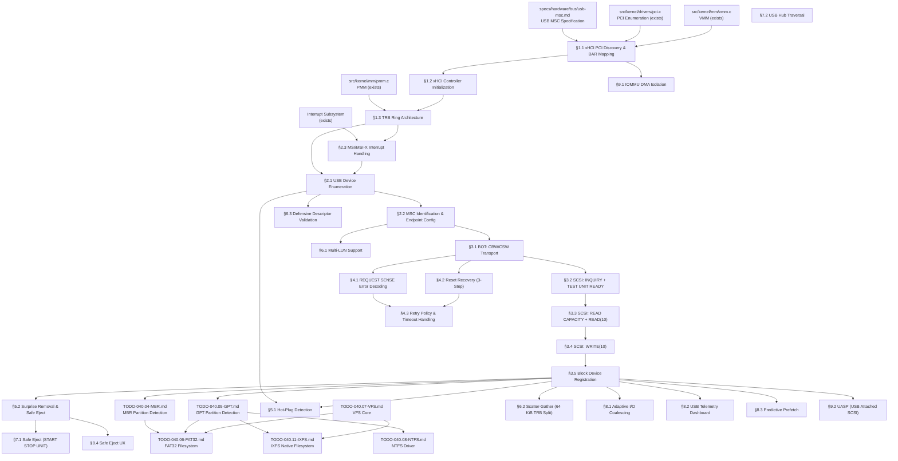

# 040.18-USB-MSC — USB Mass Storage Class Driver

> **Goal:** Implement a complete USB Mass Storage Class (MSC) driver for Impossible OS,
> enabling hot-pluggable USB flash drives and external hard disks. Currently no USB or xHCI
> code exists in the codebase. This TODO builds the entire USB storage stack from scratch:
> xHCI host controller discovery and initialization, TRB ring architecture, USB device
> enumeration, descriptor parsing, Bulk-Only Transport (BOT) protocol, SCSI transparent
> command set (INQUIRY, READ CAPACITY, READ/WRITE(10)), error recovery, hot-plug/surprise
> removal, multi-LUN support, and Impossible OS exclusive features (adaptive I/O coalescing,
> USB telemetry dashboard, predictive prefetch, safe eject UX). The driver registers USB
> storage devices as `blkdev` entries and integrates with GPT/MBR partition scanning and
> FAT32/IXFS/NTFS filesystem mounting for automatic drive letter assignment.
> All register offsets, descriptor formats, and protocol sequences reference the
> [USB MSC Specification](file:///home/derickpayne/impossible-os/specs/hardware/bus/usb-msc.md).

> [!CAUTION]
> **Memory Rule:** Use `pmm_alloc_contiguous()` for ALL DMA buffers (TRB rings, DCBAA,
> device contexts, scratchpad buffers, data I/O buffers). `kmalloc` is ONLY for small
> kernel structs (≤ 4 KB). See `rules.md` Known Gotchas.

> [!WARNING]
> **MMIO Mapping:** xHCI controller registers are memory-mapped via BAR0/BAR1. The MMIO
> region **must** be mapped as uncacheable (`PCD=1`, `PWT=1` or PAT UC type). Caching
> MMIO addresses causes stale register values and catastrophic desynchronization.

> [!IMPORTANT]
> **Spec Reference:** All section numbers, register offsets, descriptor formats, and
> protocol sequences reference the
> [USB MSC Specification](file:///home/derickpayne/impossible-os/specs/hardware/bus/usb-msc.md)
> (USB-IF BOT 1.0, xHCI 1.2, SPC-4, SBC-3).

> [!CAUTION]
> **Critical endianness trap:** USB structures (CBW, CSW, descriptors) use **little-endian**
> byte order. SCSI CDBs and their response data use **big-endian** (network byte order).
> The driver must byte-swap all multi-byte fields when crossing USB ↔ SCSI boundaries.

---

## TODO Completion Roadmap

### Dependency Graph

### Phase-by-Phase Implementation Order

| ⭐ | Phase  | Sections                                 | Depends On                    | Status |
| -- | :----: | ---------------------------------------- | ----------------------------- | :----: |
| 💎 | **0**  | USB MSC spec (`usb-msc.md`)             | —                             |   ✅   |
| 💎 | **0**  | PCI driver (`pci.c`)                     | —                             |   ✅   |
| 💎 | **1**  | §1.1 xHCI PCI Discovery & BAR Mapping  | Phase 0                       |   ⬜   |
| 💎 | **1**  | §1.2 xHCI Controller Initialization    | Phase 1 (§1.1)                |   ⬜   |
| 💎 | **1**  | §1.3 TRB Ring Architecture             | Phase 1 (§1.2)                |   ⬜   |
| 💎 | **2**  | §2.1 USB Device Enumeration            | Phase 1 (§1.3)                |   ⬜   |
| 💎 | **2**  | §2.2 MSC Identification & Endpoint Cfg | Phase 2 (§2.1)                |   ⬜   |
| 💎 | **2**  | §2.3 MSI/MSI-X Interrupt Handling      | Phase 1 (§1.3)                |   ⬜   |
| 💎 | **3**  | §3.1 BOT: CBW/CSW Transport            | Phase 2 (§2.2)                |   ⬜   |
| 💎 | **3**  | §3.2 SCSI: INQUIRY + TEST UNIT READY   | Phase 3 (§3.1)                |   ⬜   |
| 💎 | **3**  | §3.3 SCSI: READ CAPACITY + READ(10)    | Phase 3 (§3.2)                |   ⬜   |
| 🟠 | **3**  | §3.4 SCSI: WRITE(10)                   | Phase 3 (§3.3)                |   ⬜   |
| 💎 | **3**  | §3.5 Block Device Registration         | Phase 3 (§3.4)                |   ⬜   |
| 💎 | **4**  | §4.1 REQUEST SENSE Error Decoding      | Phase 3 (§3.1)                |   ⬜   |
| 💎 | **4**  | §4.2 Reset Recovery (3-Step)           | Phase 3 (§3.1)                |   ⬜   |
| 💎 | **4**  | §4.3 Retry Policy & Timeout Handling   | Phase 4 (§4.1, §4.2)         |   ⬜   |
| 🟡 | **5**  | §5.1 Hot-Plug Detection               | Phase 2 (§2.1), Phase 3      |   ⬜   |
| 🟡 | **5**  | §5.2 Surprise Removal & Safe Eject     | Phase 3 (§3.5)                |   ⬜   |
| 🟡 | **6**  | §6.1 Multi-LUN Support                | Phase 2 (§2.2)                |   ⬜   |
| 🟡 | **6**  | §6.2 Scatter-Gather (64 KiB TRB Split)| Phase 3 (§3.5)                |   ⬜   |
| 🟢 | **6**  | §6.3 Defensive Descriptor Validation  | Phase 2 (§2.1)                |   ⬜   |
| 🟢 | **7**  | §7.1 Safe Eject (START STOP UNIT)      | Phase 5 (§5.2)                |   ⬜   |
| 🟢 | **7**  | §7.2 USB Hub Traversal                | Phase 2 (§2.1)                |   ⬜   |
| ⭐ | **8**  | §8.1 Adaptive I/O Coalescing          | Phase 3 (§3.5)                |   ⬜   |
| ⭐ | **8**  | §8.2 USB Telemetry Dashboard           | Phase 3 (§3.5)                |   ⬜   |
| ⭐ | **8**  | §8.3 Predictive Prefetch              | Phase 3 (§3.5)                |   ⬜   |
| ⭐ | **8**  | §8.4 Safe Eject UX                    | Phase 5 (§5.2)                |   ⬜   |
| 🔵 | **9**  | §9.1 IOMMU DMA Isolation              | Phase 1 (§1.1)                |   ⬜   |
| 🔵 | **9**  | §9.2 UASP (USB Attached SCSI)         | Phase 3 (§3.5)                |   ⬜   |

> [!NOTE]
> **Phase 0** is already complete — PCI driver can enumerate devices and the USB MSC spec
> is documented.
>
> **Phase 1** is the critical path: xHCI controller discovery (class `0C:03:30`), BAR0/BAR1
> MMIO mapping, controller halt/reset/start, DCBAA, Command Ring, Event Ring, and scratchpad
> buffer allocation. **Everything else depends on Phase 1.**
>
> **Phase 2** handles USB device enumeration (port detect, slot enable, address device,
> descriptor parsing) and MSC interface identification (`08:06:50`), plus MSI/MSI-X setup.
>
> **Phase 3** delivers core storage I/O: BOT protocol (CBW/CSW), SCSI commands (INQUIRY,
> READ CAPACITY, READ/WRITE(10)), and `blkdev` registration. After Phase 3, USB drives
> are mountable with FAT32/IXFS/NTFS.
>
> **Phase 4** adds error handling: REQUEST SENSE decoding, the 3-step Reset Recovery
> sequence, and retry/timeout policies.
>
> **Phase 5** delivers hot-plug and surprise removal — the key UX differentiator for USB.
>
> **Phase 6** adds multi-LUN, scatter-gather for large I/O, and security hardening.
>
> **Phase 7** adds safe eject via SCSI START STOP UNIT and USB hub topology traversal.
>
> **Phase 8** delivers exclusive features (⭐): adaptive I/O coalescing, USB telemetry
> dashboard, predictive prefetch, and polished safe eject UX.
>
> **Phase 9** is stretch: IOMMU DMA isolation and UASP for USB 3.0+ throughput.

> [!TIP]
> **QEMU testing flags:**
> Basic: `-device qemu-xhci,id=xhci -drive file=test-usb.img,format=raw,if=none,id=usbdisk -device usb-storage,bus=xhci.0,drive=usbdisk`
> Multi-device: add additional `-drive` + `-device usb-storage` pairs
> Hot-plug: add `-monitor telnet:127.0.0.1:4444,server,nowait` then `device_add usb-storage,...`
> Alternative controller: `-device nec-usb-xhci,id=xhci`
>
> **Create test USB image:**
> `dd if=/dev/zero of=test-usb.img bs=1M count=64 && mkfs.vfat -F 32 test-usb.img`
>
> **Memory rule reminder:**
> ALL TRB ring buffers (Command Ring, Event Ring, Transfer Rings), DCBAA, Device Contexts,
> Scratchpad Buffers, ERST, and I/O data buffers MUST use `pmm_alloc_contiguous()`. A single
> TRB's data buffer must not cross a 64 KiB physical address boundary.
>
> **Critical gotcha — cycle bit:**
> The cycle bit (bit 0 of TRB control field) is the sole ownership mechanism. Software
> toggles its producer cycle state on ring wraparound via the Link TRB.
>
> **Critical gotcha — endianness:**
> USB = little-endian. SCSI CDB/response = big-endian. Must byte-swap at layer boundary.

---
