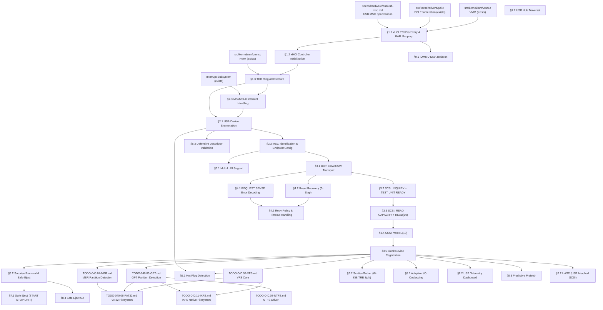

# 040.18-USB-MSC — USB Mass Storage Class Driver

> **Goal:** Implement a complete USB Mass Storage Class (MSC) driver for Impossible OS,
> enabling hot-pluggable USB flash drives and external hard disks. Currently no USB or xHCI
> code exists in the codebase. This TODO builds the entire USB storage stack from scratch:
> xHCI host controller discovery and initialization, TRB ring architecture, USB device
> enumeration, descriptor parsing, Bulk-Only Transport (BOT) protocol, SCSI transparent
> command set (INQUIRY, READ CAPACITY, READ/WRITE(10)), error recovery, hot-plug/surprise
> removal, multi-LUN support, and Impossible OS exclusive features (adaptive I/O coalescing,
> USB telemetry dashboard, predictive prefetch, safe eject UX). The driver registers USB
> storage devices as `blkdev` entries and integrates with GPT/MBR partition scanning and
> FAT32/IXFS/NTFS filesystem mounting for automatic drive letter assignment.
> All register offsets, descriptor formats, and protocol sequences reference the
> [USB MSC Specification](file:///home/derickpayne/impossible-os/specs/hardware/bus/usb-msc.md).

> [!CAUTION]
> **Memory Rule:** Use `pmm_alloc_contiguous()` for ALL DMA buffers (TRB rings, DCBAA,
> device contexts, scratchpad buffers, data I/O buffers). `kmalloc` is ONLY for small
> kernel structs (≤ 4 KB). See `rules.md` Known Gotchas.

> [!WARNING]
> **MMIO Mapping:** xHCI controller registers are memory-mapped via BAR0/BAR1. The MMIO
> region **must** be mapped as uncacheable (`PCD=1`, `PWT=1` or PAT UC type). Caching
> MMIO addresses causes stale register values and catastrophic desynchronization.

> [!IMPORTANT]
> **Spec Reference:** All section numbers, register offsets, descriptor formats, and
> protocol sequences reference the
> [USB MSC Specification](file:///home/derickpayne/impossible-os/specs/hardware/bus/usb-msc.md)
> (USB-IF BOT 1.0, xHCI 1.2, SPC-4, SBC-3).

> [!CAUTION]
> **Critical endianness trap:** USB structures (CBW, CSW, descriptors) use **little-endian**
> byte order. SCSI CDBs and their response data use **big-endian** (network byte order).
> The driver must byte-swap all multi-byte fields when crossing USB ↔ SCSI boundaries.

---

## TODO Completion Roadmap

### Dependency Graph

### Phase-by-Phase Implementation Order

| ⭐ | Phase  | Sections                                 | Depends On                    | Status |
| -- | :----: | ---------------------------------------- | ----------------------------- | :----: |
| 💎 | **0**  | USB MSC spec (`usb-msc.md`)             | —                             |   ✅   |
| 💎 | **0**  | PCI driver (`pci.c`)                     | —                             |   ✅   |
| 💎 | **1**  | §1.1 xHCI PCI Discovery & BAR Mapping  | Phase 0                       |   ⬜   |
| 💎 | **1**  | §1.2 xHCI Controller Initialization    | Phase 1 (§1.1)                |   ⬜   |
| 💎 | **1**  | §1.3 TRB Ring Architecture             | Phase 1 (§1.2)                |   ⬜   |
| 💎 | **2**  | §2.1 USB Device Enumeration            | Phase 1 (§1.3)                |   ⬜   |
| 💎 | **2**  | §2.2 MSC Identification & Endpoint Cfg | Phase 2 (§2.1)                |   ⬜   |
| 💎 | **2**  | §2.3 MSI/MSI-X Interrupt Handling      | Phase 1 (§1.3)                |   ⬜   |
| 💎 | **3**  | §3.1 BOT: CBW/CSW Transport            | Phase 2 (§2.2)                |   ⬜   |
| 💎 | **3**  | §3.2 SCSI: INQUIRY + TEST UNIT READY   | Phase 3 (§3.1)                |   ⬜   |
| 💎 | **3**  | §3.3 SCSI: READ CAPACITY + READ(10)    | Phase 3 (§3.2)                |   ⬜   |
| 🟠 | **3**  | §3.4 SCSI: WRITE(10)                   | Phase 3 (§3.3)                |   ⬜   |
| 💎 | **3**  | §3.5 Block Device Registration         | Phase 3 (§3.4)                |   ⬜   |
| 💎 | **4**  | §4.1 REQUEST SENSE Error Decoding      | Phase 3 (§3.1)                |   ⬜   |
| 💎 | **4**  | §4.2 Reset Recovery (3-Step)           | Phase 3 (§3.1)                |   ⬜   |
| 💎 | **4**  | §4.3 Retry Policy & Timeout Handling   | Phase 4 (§4.1, §4.2)         |   ⬜   |
| 🟡 | **5**  | §5.1 Hot-Plug Detection               | Phase 2 (§2.1), Phase 3      |   ⬜   |
| 🟡 | **5**  | §5.2 Surprise Removal & Safe Eject     | Phase 3 (§3.5)                |   ⬜   |
| 🟡 | **6**  | §6.1 Multi-LUN Support                | Phase 2 (§2.2)                |   ⬜   |
| 🟡 | **6**  | §6.2 Scatter-Gather (64 KiB TRB Split)| Phase 3 (§3.5)                |   ⬜   |
| 🟢 | **6**  | §6.3 Defensive Descriptor Validation  | Phase 2 (§2.1)                |   ⬜   |
| 🟢 | **7**  | §7.1 Safe Eject (START STOP UNIT)      | Phase 5 (§5.2)                |   ⬜   |
| 🟢 | **7**  | §7.2 USB Hub Traversal                | Phase 2 (§2.1)                |   ⬜   |
| ⭐ | **8**  | §8.1 Adaptive I/O Coalescing          | Phase 3 (§3.5)                |   ⬜   |
| ⭐ | **8**  | §8.2 USB Telemetry Dashboard           | Phase 3 (§3.5)                |   ⬜   |
| ⭐ | **8**  | §8.3 Predictive Prefetch              | Phase 3 (§3.5)                |   ⬜   |
| ⭐ | **8**  | §8.4 Safe Eject UX                    | Phase 5 (§5.2)                |   ⬜   |
| 🔵 | **9**  | §9.1 IOMMU DMA Isolation              | Phase 1 (§1.1)                |   ⬜   |
| 🔵 | **9**  | §9.2 UASP (USB Attached SCSI)         | Phase 3 (§3.5)                |   ⬜   |

> [!NOTE]
> **Phase 0** is already complete — PCI driver can enumerate devices and the USB MSC spec
> is documented.
>
> **Phase 1** is the critical path: xHCI controller discovery (class `0C:03:30`), BAR0/BAR1
> MMIO mapping, controller halt/reset/start, DCBAA, Command Ring, Event Ring, and scratchpad
> buffer allocation. **Everything else depends on Phase 1.**
>
> **Phase 2** handles USB device enumeration (port detect, slot enable, address device,
> descriptor parsing) and MSC interface identification (`08:06:50`), plus MSI/MSI-X setup.
>
> **Phase 3** delivers core storage I/O: BOT protocol (CBW/CSW), SCSI commands (INQUIRY,
> READ CAPACITY, READ/WRITE(10)), and `blkdev` registration. After Phase 3, USB drives
> are mountable with FAT32/IXFS/NTFS.
>
> **Phase 4** adds error handling: REQUEST SENSE decoding, the 3-step Reset Recovery
> sequence, and retry/timeout policies.
>
> **Phase 5** delivers hot-plug and surprise removal — the key UX differentiator for USB.
>
> **Phase 6** adds multi-LUN, scatter-gather for large I/O, and security hardening.
>
> **Phase 7** adds safe eject via SCSI START STOP UNIT and USB hub topology traversal.
>
> **Phase 8** delivers exclusive features (⭐): adaptive I/O coalescing, USB telemetry
> dashboard, predictive prefetch, and polished safe eject UX.
>
> **Phase 9** is stretch: IOMMU DMA isolation and UASP for USB 3.0+ throughput.

> [!TIP]
> **QEMU testing flags:**
> Basic: `-device qemu-xhci,id=xhci -drive file=test-usb.img,format=raw,if=none,id=usbdisk -device usb-storage,bus=xhci.0,drive=usbdisk`
> Multi-device: add additional `-drive` + `-device usb-storage` pairs
> Hot-plug: add `-monitor telnet:127.0.0.1:4444,server,nowait` then `device_add usb-storage,...`
> Alternative controller: `-device nec-usb-xhci,id=xhci`
>
> **Create test USB image:**
> `dd if=/dev/zero of=test-usb.img bs=1M count=64 && mkfs.vfat -F 32 test-usb.img`
>
> **Memory rule reminder:**
> ALL TRB ring buffers (Command Ring, Event Ring, Transfer Rings), DCBAA, Device Contexts,
> Scratchpad Buffers, ERST, and I/O data buffers MUST use `pmm_alloc_contiguous()`. A single
> TRB's data buffer must not cross a 64 KiB physical address boundary.
>
> **Critical gotcha — cycle bit:**
> The cycle bit (bit 0 of TRB control field) is the sole ownership mechanism. Software
> toggles its producer cycle state on ring wraparound via the Link TRB.
>
> **Critical gotcha — endianness:**
> USB = little-endian. SCSI CDB/response = big-endian. Must byte-swap at layer boundary.

---

## 1. xHCI Host Controller Foundation

### 1.1 xHCI PCI Discovery & BAR Mapping

**Prompt:** Detect xHCI controllers during PCI enumeration by matching class code `0x0C`
(Serial Bus), subclass `0x03` (USB), programming interface `0x30` (xHCI). Read BAR0/BAR1
as a 64-bit memory BAR per USB MSC spec §"PCI Configuration Space Fingerprint". Mask lower
4 bits of BAR0, combine with BAR1 for the full 64-bit physical address. Map the MMIO region
(minimum 64 KiB) into kernel virtual address space with uncacheable flags. Enable Bus Master
(bit 2) and Memory Space (bit 1) in PCI Command Register. Disable legacy INTx (bit 10).
Create `src/kernel/drivers/xhci.c` and `include/kernel/drivers/xhci.h`. After completing
all items, mark every item as `[x]`, update this prompt to a verification prompt, run
`bash scripts/build.sh clean`, and commit as `"usb: xHCI PCI discovery and BAR mapping"`.
After implementation, save gotchas to MCP memory.

- [ ] Create `src/kernel/drivers/xhci.c` and `include/kernel/drivers/xhci.h`
- [ ] Detect xHCI device: class=`0x0C`, subclass=`0x03`, prog_if=`0x30`
- [ ] Read BAR0 (offset `0x10`) and BAR1 (offset `0x14`) as 64-bit memory BAR
- [ ] Reconstruct MMIO base: `(bar0 & 0xFFFFFFF0) | ((uint64_t)bar1 << 32)`
- [ ] Verify BAR type is memory (bit 0 = 0) and 64-bit (bits 2:1 = `10b`)
- [ ] Map MMIO region into kernel address space (uncacheable, minimum 64 KiB)
- [ ] Enable PCI Command Register: Bus Master (bit 2), Memory Space (bit 1)
- [ ] Disable legacy INTx: set PCI Command Register bit 10
- [ ] Log: `[xHCI] Found controller at PCI %02x:%02x.%x, MMIO @ 0x%lx`
- [ ] Commit: `"usb: xHCI PCI discovery and BAR mapping"`

### 1.2 xHCI Controller Initialization

**Prompt:** Follow the xHCI initialization sequence per USB MSC spec §"xHCI Controller
Initialization Sequence" (steps 1–12). Read Capability Registers: CAPLENGTH (offset `0x00`),
HCIVERSION (`0x02`), HCSPARAMS1 (`0x04` — max slots, interrupters, ports), HCSPARAMS2
(`0x08` — scratchpad count), HCCPARAMS1 (`0x10` — 64-bit support, context size). Calculate
Operational Register base = BAR + CAPLENGTH. Halt controller (USBCMD.RS=0, wait USBSTS.HCH=1).
Reset controller (USBCMD.HCRST=1, wait HCRST=0 AND USBSTS.CNR=0). Configure MaxSlotsEn.
Allocate DCBAA (64-byte aligned, (MaxSlots+1) entries). Allocate scratchpad buffers if needed.
Write DCBAAP. After completing all items, mark every item as `[x]`, update this prompt to a
verification prompt, run `bash scripts/build.sh clean`, and commit as
`"usb: xHCI controller initialization"`. After implementation, save gotchas to MCP memory.

- [ ] Read Capability Registers (offset `0x00` from BAR base):
  - [ ] CAPLENGTH (offset `0x00`, 1B) — length of capability space
  - [ ] HCIVERSION (offset `0x02`, 2B) — xHCI version (e.g., `0x0110` = 1.1)
  - [ ] HCSPARAMS1 (offset `0x04`, 4B) — max slots (7:0), max interrupters (18:8), max ports (31:24)
  - [ ] HCSPARAMS2 (offset `0x08`, 4B) — scratchpad bufs high (31:27) + low (25:21)
  - [ ] HCCPARAMS1 (offset `0x10`, 4B) — 64-bit (bit 0), context size 64B (bit 2)
  - [ ] DBOFF (offset `0x14`, 4B) — doorbell array offset
  - [ ] RTSOFF (offset `0x18`, 4B) — runtime register space offset
- [ ] Calculate base addresses: Operational = BAR + CAPLENGTH, Runtime = BAR + RTSOFF, Doorbell = BAR + DBOFF
- [ ] Halt controller: set USBCMD.RS = 0 (Operational + `0x00`), wait USBSTS.HCH = 1
- [ ] Reset controller: set USBCMD.HCRST = 1, wait HCRST = 0 AND USBSTS.CNR = 0
- [ ] Write CONFIG.MaxSlotsEn (Operational + `0x38`) with desired device count
- [ ] Allocate DCBAA: `pmm_alloc_contiguous()`, 64-byte aligned, (MaxSlots+1) × 8 bytes, zero-fill
- [ ] Allocate scratchpad buffers if HCSPARAMS2 count > 0: page-aligned, store at DCBAA[0]
- [ ] Write DCBAAP (Operational + `0x30`) — 64-bit physical address of DCBAA
- [ ] Start controller: set USBCMD.RS = 1, wait USBSTS.HCH = 0
- [ ] Log: `[xHCI] v%x.%x ready, %u slots, %u ports, %u interrupters`
- [ ] Commit: `"usb: xHCI controller initialization"`

### 1.3 TRB Ring Architecture

**Prompt:** Allocate and initialize the three TRB ring types per USB MSC spec §"Transfer
Request Block (TRB) Architecture". Command Ring: 64-byte aligned, 256 TRBs, ends with Link
TRB pointing back to start. Event Ring: 64-byte aligned, 256 TRBs, set up via ERST (Event
Ring Segment Table). Transfer Rings: 16-byte aligned per endpoint, 256 TRBs each. Each TRB
is 16 bytes: `{parameter(8B), status(4B), control(4B)}`. The cycle bit (control bit 0) is
the ownership toggle. Write CRCR (Command Ring), configure ERSTSZ/ERSTBA/ERDP for Event Ring.
After completing all items, mark every item as `[x]`, update this prompt to a verification
prompt, run `bash scripts/build.sh clean`, and commit as `"usb: TRB ring architecture"`.
After implementation, save gotchas to MCP memory.

- [ ] Define `struct xhci_trb { uint64_t parameter; uint32_t status; uint32_t control; }`
- [ ] Allocate Command Ring: `pmm_alloc_contiguous()`, 64B aligned, 256 × 16B, zero-fill
  - [ ] Set Link TRB at end: type=6, pointer to ring start, toggle cycle bit
  - [ ] Write CRCR (Operational + `0x18`) — physical address | cycle bit
  - [ ] Initialize producer state: `cmd_ring.enqueue = 0`, `cmd_ring.cycle = 1`
- [ ] Allocate Event Ring Segment: `pmm_alloc_contiguous()`, 64B aligned, 256 × 16B, zero-fill
  - [ ] Allocate ERST entry: `{ ring_segment_base, ring_segment_size=256, reserved=0 }`
  - [ ] Write ERSTSZ (Runtime + `0x28`) = 1 (one segment)
  - [ ] Write ERSTBA (Runtime + `0x30`) — 64-bit physical address of ERST, 64B aligned
  - [ ] Write ERDP (Runtime + `0x38`) — initial dequeue pointer = segment base
  - [ ] Initialize consumer state: `evt_ring.dequeue = 0`, `evt_ring.cycle = 1`
- [ ] Enable interrupts: USBCMD.INTE = 1, IMAN.IE = 1 (Runtime + `0x20`)
- [ ] Implement `xhci_cmd_submit(trb)` — enqueue TRB, advance tail, ring doorbell 0
- [ ] Implement `xhci_event_poll()` — check phase bit, process event, advance ERDP
- [ ] All rings must not cross 64 KiB physical boundaries
- [ ] Commit: `"usb: TRB ring architecture"`

---

## 2. USB Device Enumeration

### 2.1 USB Device Enumeration

**Prompt:** Implement the USB enumeration sequence per USB MSC spec §"Enumeration Sequence".
On Port Status Change Event: read PORTSC to confirm connection, determine port speed. Reset
port (PORTSC.PR=1, wait for Reset Change). Submit Enable Slot Command TRB (type 9) on
Command Ring, wait for Command Completion Event to get assigned slot ID. Build Input Context
with Slot Context (speed, route string, root hub port) and Endpoint 0 Context (max packet
size from port speed: 8 for LS, 64 for FS/HS, 512 for SS). Submit Address Device Command
TRB (type 11). Issue GET_DESCRIPTOR (Device, 18 bytes) via control transfer on EP0. Issue
GET_DESCRIPTOR (Configuration) in two stages: 9-byte header then full wTotalLength. Issue
SET_CONFIGURATION. Submit Configure Endpoint Command TRB (type 12) with all discovered
endpoints. After completing all items, mark every item as `[x]`, update this prompt to a
verification prompt, run `bash scripts/build.sh clean`, and commit as
`"usb: device enumeration"`. After implementation, save gotchas to MCP memory.

- [ ] Detect Port Status Change Event TRB (type 34) from Event Ring
- [ ] Read PORTSC (Operational + `0x400` + port × `0x10`): confirm CCS (bit 0), read speed (13:10)
- [ ] Reset port: set PORTSC.PR = 1, wait for Port Reset Change (PRC bit)
- [ ] Submit Enable Slot Command (TRB type 9), wait for completion — get slot_id
- [ ] Allocate Device Context: `pmm_alloc_contiguous()`, 64B aligned, zero-fill
  - [ ] Store physical address in DCBAA[slot_id]
- [ ] Build Input Context: Slot Context (speed, port number) + EP0 Context (max packet size)
- [ ] Submit Address Device Command (TRB type 11), wait for completion
- [ ] Control transfer: GET_DESCRIPTOR (Device, type=0x01, 18 bytes)
  - [ ] Build Setup Stage TRB (type 2) + Data Stage TRB (type 3) + Status Stage TRB (type 4)
  - [ ] Ring EP0 doorbell: `Doorbell[slot_id] = 1` (DCI for EP0 IN)
  - [ ] Parse `usb_device_descriptor` — bcdUSB, idVendor, idProduct, bNumConfigurations
- [ ] Control transfer: GET_DESCRIPTOR (Configuration, type=0x02)
  - [ ] First: request 9 bytes to read wTotalLength
  - [ ] Validate wTotalLength ≤ 4096 (cap against malicious devices)
  - [ ] Then: allocate buffer, request full wTotalLength bytes
- [ ] Control transfer: SET_CONFIGURATION (bConfigurationValue from config descriptor)
- [ ] Submit Configure Endpoint Command (TRB type 12) with discovered endpoints
- [ ] Log: `[USB] Device %04x:%04x enumerated on port %u (slot %u)`
- [ ] Commit: `"usb: device enumeration"`

### 2.2 MSC Identification & Endpoint Configuration

**Prompt:** Walk the configuration descriptor tree to find an Interface Descriptor matching
the MSC BOT triple: `bInterfaceClass=0x08`, `bInterfaceSubClass=0x06`,
`bInterfaceProtocol=0x50` per USB MSC spec §"Mass Storage Class Identification". Extract
Bulk-IN and Bulk-OUT endpoint addresses from the Endpoint Descriptors following the interface.
Ignore any interrupt endpoints (BOT uses bulk only). Allocate Transfer Rings for Bulk-IN and
Bulk-OUT endpoints. After completing all items, mark every item as `[x]`, update this prompt
to a verification prompt, run `bash scripts/build.sh clean`, and commit as
`"usb: MSC identification and endpoint config"`. After implementation, save gotchas to MCP memory.

- [ ] Walk config descriptor buffer (linear parse by bLength/bDescriptorType)
- [ ] Match Interface Descriptor (type `0x04`):
  - [ ] `bInterfaceClass == 0x08` (Mass Storage)
  - [ ] `bInterfaceSubClass == 0x06` (SCSI Transparent)
  - [ ] `bInterfaceProtocol == 0x50` (Bulk-Only Transport)
- [ ] Extract Endpoint Descriptors (type `0x05`) following the matched interface:
  - [ ] Bulk-IN: `bmAttributes == 0x02` and `bEndpointAddress` bit 7 = 1
  - [ ] Bulk-OUT: `bmAttributes == 0x02` and `bEndpointAddress` bit 7 = 0
  - [ ] Record wMaxPacketSize for each endpoint
- [ ] Ignore interrupt endpoints on BOT interfaces
- [ ] Allocate Transfer Ring for Bulk-IN: `pmm_alloc_contiguous()`, 16B aligned, 256 TRBs
- [ ] Allocate Transfer Ring for Bulk-OUT: `pmm_alloc_contiguous()`, 16B aligned, 256 TRBs
- [ ] Update Input Context with Bulk-IN and Bulk-OUT Endpoint Contexts
- [ ] Store MSC device info: slot_id, bulk_in_ep, bulk_out_ep, max_packet_size, interface_num
- [ ] Log: `[USB-MSC] BOT device: Bulk-IN EP%u, Bulk-OUT EP%u, MaxPkt=%u`
- [ ] Commit: `"usb: MSC identification and endpoint config"`

### 2.3 MSI/MSI-X Interrupt Handling

**Prompt:** Scan PCI Capability List for MSI-X (cap ID `0x11`) or MSI (cap ID `0x05`) per
USB MSC spec §"MSI/MSI-X Configuration". If MSI-X: map MSI-X Table BAR, allocate IDT
vector, program table entry (msg_addr=`0xFEE00000`, msg_data=vector), enable in Message
Control. Set USBCMD.INTE=1 and IMAN.IE=1. Implement top-half ISR: read Event Ring, advance
ERDP, clear IMAN.IP, queue bottom-half for BOT state machine processing. If no MSI-X,
fall back to single MSI or legacy INTx polling. After completing all items, mark every item
as `[x]`, update this prompt to a verification prompt, run `bash scripts/build.sh clean`,
and commit as `"usb: MSI/MSI-X interrupt handling"`. After implementation, save gotchas to
MCP memory.

- [ ] Walk PCI capability list for MSI-X (cap ID `0x11`) or MSI (cap ID `0x05`)
- [ ] If MSI-X:
  - [ ] Read Message Control: table size, Table BAR + offset
  - [ ] Map MSI-X Table BAR into kernel memory (uncacheable)
  - [ ] Allocate IDT vector via `irq_alloc_vector()`
  - [ ] Program MSI-X table entry: `msg_addr=0xFEE00000`, `msg_data=vector`
  - [ ] Enable MSI-X: set bit 15 in Message Control, clear Function Mask
- [ ] Set USBCMD.INTE = 1 (Operational + `0x00`, bit 2)
- [ ] Set IMAN.IE = 1 (Runtime + `0x20`, bit 1)
- [ ] Register ISR (top-half):
  - [ ] Read Event Ring TRBs (check phase bit match)
  - [ ] Advance ERDP (Runtime + `0x38`)
  - [ ] Write `1` to IMAN.IP (bit 0) to clear interrupt pending
  - [ ] Queue bottom-half handler for BOT/SCSI processing
- [ ] Fallback: if no MSI-X, use single MSI or legacy INTx with polling loop
- [ ] Log: `[xHCI] IRQ: MSI-X vector %u enabled`
- [ ] Commit: `"usb: MSI/MSI-X interrupt handling"`

---

## 3. BOT Protocol & SCSI Command Set

### 3.1 BOT: CBW/CSW Transport

**Prompt:** Implement the Bulk-Only Transport protocol per USB MSC spec §"Bulk-Only
Transport (BOT) Protocol". Each transaction: (1) send 31-byte CBW on Bulk-OUT, (2) optional
data phase on Bulk-IN or Bulk-OUT, (3) receive 13-byte CSW on Bulk-IN. Define CBW struct
(`dCBWSignature=0x43425355`, dCBWTag, dCBWDataTransferLength, bmCBWFlags, bCBWLUN,
bCBWCBLength, CBWCB[16]`). Define CSW struct (`dCSWSignature=0x53425355`, dCSWTag,
dCSWDataResidue, bCSWStatus`). Validate CSW: signature match, tag match, exactly 13 bytes.
Implement the 13-case host/device expectation matrix for handling short transfers and phase
errors. After completing all items, mark every item as `[x]`, update this prompt to a
verification prompt, run `bash scripts/build.sh clean`, and commit as
`"usb: BOT CBW/CSW transport"`. After implementation, save gotchas to MCP memory.

- [ ] Define `struct usb_msc_cbw` (31 bytes):
  - [ ] `dCBWSignature` = `0x43425355` ("USBC")
  - [ ] `dCBWTag` — monotonic counter for correlation
  - [ ] `dCBWDataTransferLength`, `bmCBWFlags` (bit 7: direction)
  - [ ] `bCBWLUN`, `bCBWCBLength`, `CBWCB[16]`
- [ ] Define `struct usb_msc_csw` (13 bytes):
  - [ ] `dCSWSignature` = `0x53425355` ("USBS")
  - [ ] `dCSWTag`, `dCSWDataResidue`, `bCSWStatus`
- [ ] Implement `bot_send_cbw(dev, cbw)`:
  - [ ] Build Normal TRB (type 1), set parameter = CBW buffer phys addr, length = 31
  - [ ] Enqueue on Bulk-OUT Transfer Ring, ring doorbell
- [ ] Implement `bot_recv_data(dev, buf, len)`:
  - [ ] Build Normal TRB(s), set IOC on last TRB
  - [ ] Enqueue on Bulk-IN Transfer Ring, ring doorbell
- [ ] Implement `bot_send_data(dev, buf, len)`:
  - [ ] Build Normal TRB(s) on Bulk-OUT Transfer Ring
- [ ] Implement `bot_recv_csw(dev)`:
  - [ ] Build Normal TRB, length = 13, on Bulk-IN Transfer Ring
  - [ ] Validate: `dCSWSignature == 0x53425355`, `dCSWTag == active_tag`, exactly 13B
  - [ ] Return `bCSWStatus`: 0x00=Passed, 0x01=Failed, 0x02=Phase Error
- [ ] Handle 13 cases (short transfer / phase error matrix):
  - [ ] Cases 1, 6, 12: optimal — proceed normally
  - [ ] Cases 4, 5, 9, 11: STALL → ClearFeature(ENDPOINT_HALT) → read CSW
  - [ ] Cases 2, 3, 7, 8, 10, 13: Phase Error → Reset Recovery
- [ ] Implement `bot_transaction(dev, cdb, cdb_len, data, data_len, direction, lun)`
- [ ] Commit: `"usb: BOT CBW/CSW transport"`

### 3.2 SCSI: INQUIRY + TEST UNIT READY

**Prompt:** Implement SCSI INQUIRY (`0x12`) and TEST UNIT READY (`0x00`) commands per USB
MSC spec §"Mandatory SCSI Commands". INQUIRY: 6-byte CDB, Data-In 36 bytes, parse device
type (byte 0, bits 4:0 = `0x00` for block device), RMB (byte 1, bit 7 = removable), vendor
(bytes 8–15), product (bytes 16–31). Note: SCSI CDBs are big-endian. TEST UNIT READY: 6-byte
CDB, no data phase, check CSW status. If failed, issue REQUEST SENSE to determine reason
(medium not present, device spinning up). After completing all items, mark every item as
`[x]`, update this prompt to a verification prompt, run `bash scripts/build.sh clean`, and
commit as `"usb: SCSI INQUIRY and TEST UNIT READY"`. After implementation, save gotchas to
MCP memory.

- [ ] Build INQUIRY CDB (6 bytes): opcode=`0x12`, allocation_len=36 (big-endian)
- [ ] Send via `bot_transaction()`: direction=IN, data_len=36, lun=target
- [ ] Parse INQUIRY response (36 bytes):
  - [ ] Peripheral Device Type (byte 0, bits 4:0) — `0x00` = direct-access block
  - [ ] RMB (byte 1, bit 7) — 1 = removable media
  - [ ] Vendor Identification (bytes 8–15, ASCII, space-padded, trim)
  - [ ] Product Identification (bytes 16–31, ASCII, space-padded, trim)
  - [ ] Product Revision Level (bytes 32–35, ASCII)
- [ ] Reject non-block devices (device type ≠ `0x00`)
- [ ] Build TEST UNIT READY CDB (6 bytes): opcode=`0x00`, all zeros
- [ ] Send via `bot_transaction()`: direction=none, data_len=0
- [ ] If CSW status == 0x01: issue REQUEST SENSE (§4.1) for reason
- [ ] Retry TEST UNIT READY up to 10 times with 500ms delay (device spin-up)
- [ ] Log: `[USB-MSC] %s %s (Rev %s), removable=%s`
- [ ] Commit: `"usb: SCSI INQUIRY and TEST UNIT READY"`

### 3.3 SCSI: READ CAPACITY + READ(10)

**Prompt:** Implement READ CAPACITY(10) (`0x25`) and READ(10) (`0x28`) per USB MSC spec
§"Mandatory SCSI Commands". READ CAPACITY: 10-byte CDB, Data-In 8 bytes (big-endian last
LBA + block length). Total capacity = (last_LBA + 1) × block_length. Never hardcode 512.
READ(10): 10-byte CDB, LBA at bytes 2–5 (big-endian), transfer length at bytes 7–8
(big-endian). Data-In = transfer_length × block_size. After completing all items, mark every
item as `[x]`, update this prompt to a verification prompt, run `bash scripts/build.sh clean`,
and commit as `"usb: SCSI READ CAPACITY and READ(10)"`. After implementation, save gotchas
to MCP memory.

- [ ] Build READ CAPACITY(10) CDB (10 bytes): opcode=`0x25`, LBA=0, PMI=0
- [ ] Send via `bot_transaction()`: direction=IN, data_len=8
- [ ] Parse response (8 bytes, **big-endian**):
  - [ ] Last Logical Block Address (bytes 0–3, uint32 big-endian)
  - [ ] Block Length (bytes 4–7, uint32 big-endian, typically 512)
  - [ ] Total capacity = `(last_lba + 1) * block_length`
- [ ] Store in device struct: `sector_count = last_lba + 1`, `sector_size = block_length`
- [ ] Build READ(10) CDB (10 bytes):
  - [ ] Opcode=`0x28`, LBA at bytes 2–5 (big-endian), transfer_length at bytes 7–8 (big-endian)
- [ ] Send via `bot_transaction()`: direction=IN, data_len=transfer_length × sector_size
- [ ] Implement `usb_msc_read(dev, lba, count, buf)` wrapper
- [ ] Handle sector sizes: 512, 1024, 2048, 4096 bytes (read from device, never hardcode)
- [ ] Log: `[USB-MSC] Capacity: %llu MiB (%u-byte sectors)`
- [ ] Commit: `"usb: SCSI READ CAPACITY and READ(10)"`

### 3.4 SCSI: WRITE(10)

**Prompt:** Implement WRITE(10) (`0x2A`) per USB MSC spec §"Mandatory SCSI Commands".
10-byte CDB: opcode=`0x2A`, LBA at bytes 2–5 (big-endian), transfer length at bytes 7–8
(big-endian). Data-Out = transfer_length × block_size. Check for write-protect via REQUEST
SENSE (sense key `0x07`, ASC `0x27`, ASCQ `0x00`). After completing all items, mark every
item as `[x]`, update this prompt to a verification prompt, run `bash scripts/build.sh clean`,
and commit as `"usb: SCSI WRITE(10)"`. After implementation, save gotchas to MCP memory.

- [ ] Build WRITE(10) CDB (10 bytes):
  - [ ] Opcode=`0x2A`, LBA at bytes 2–5 (big-endian), transfer_length at bytes 7–8 (big-endian)
- [ ] Send via `bot_transaction()`: direction=OUT, data_len=transfer_length × sector_size
- [ ] Implement `usb_msc_write(dev, lba, count, buf)` wrapper
- [ ] Handle write-protect: if sense key=`0x07`, ASC=`0x27`, mark device read-only
- [ ] Return -1 on write-protected or failed writes
- [ ] Commit: `"usb: SCSI WRITE(10)"`

### 3.5 Block Device Registration

**Prompt:** Register USB MSC devices as `blkdev` entries so partition scanning and filesystem
mounting work automatically. Set sector_size from READ CAPACITY, sector_count from last_lba+1.
Wire read/write callbacks to `usb_msc_read`/`usb_msc_write`. Device name: `usb0` (or `usb0lN`
for LUN N on multi-LUN devices). After registration, `partition_scan()` will detect GPT/MBR
and mount filesystems. After completing all items, mark every item as `[x]`, update this prompt
to a verification prompt, run `bash scripts/build.sh clean`, and commit as
`"usb: block device registration"`. After implementation, save gotchas to MCP memory.

- [ ] Create `blkdev` struct for each USB MSC LUN:
  - [ ] `name`: `"usb0"` or `"usb0lN"` for LUN N
  - [ ] `sector_size`: from READ CAPACITY block_length
  - [ ] `sector_count`: from READ CAPACITY (last_lba + 1)
  - [ ] `read_fn`: `usb_msc_blkdev_read()` adapter
  - [ ] `write_fn`: `usb_msc_blkdev_write()` adapter
  - [ ] `removable`: true (USB devices are hot-pluggable)
- [ ] Call `blkdev_register()` for each LUN
- [ ] Trigger `partition_scan()` to detect GPT/MBR and auto-mount filesystems
- [ ] Log: `[USB-MSC] Registered blkdev "%s": %llu MiB, %u-byte sectors`
- [ ] Commit: `"usb: block device registration"`

---
