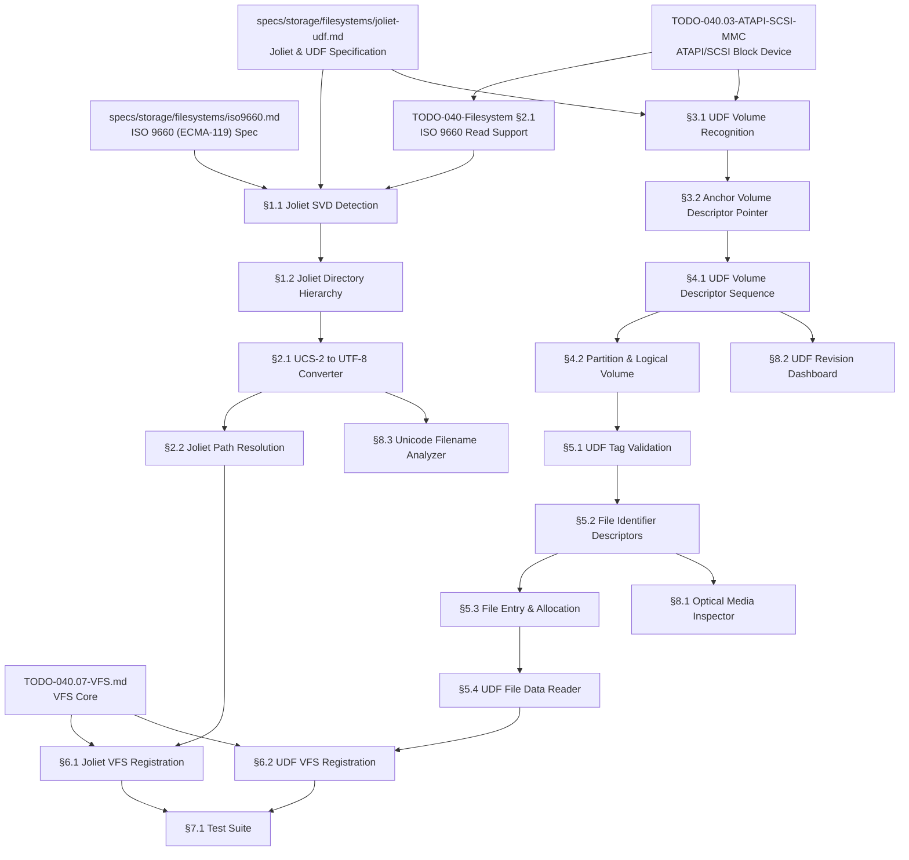

# 040.19-Joliet-UDF — Joliet & UDF Read-Only Filesystem Drivers

> **Goal:** Implement read-only drivers for Joliet (ISO 9660 extension) and UDF
> (Universal Disk Format) filesystems. Joliet adds Unicode filename support to
> ISO 9660 via a Supplementary Volume Descriptor with UCS-2 encoding. UDF is a
> complete ECMA-167/ISO 13346 filesystem used on DVD-Video (1.02), DVD-RW (1.50),
> DVD+RW (2.00/2.01), and Blu-Ray (2.50/2.60) media. Both build on the existing
> ATAPI/SCSI block device layer and ISO 9660 infrastructure from §2.1. This
> enables reading files from commercial DVDs, Blu-Ray data discs, and any
> UCS-2-named CD-ROMs — essential for media compatibility and data interchange.

> [!CAUTION]
> **Memory Rule:** Use `pmm_alloc_contiguous()` for ALL sector buffers, descriptor
> reads, FID arrays, and extent data blocks. `kmalloc` is ONLY for small kernel
> structs (≤ 4 KB). See `rules.md` Known Gotchas.

> [!WARNING]
> **Read-Only First.** UDF write support requires implementing the full VAT/Sparing
> Table update cycle and metadata partition commits. This TODO covers **read-only**
> access only. Write support is a future P4 extension.

> [!IMPORTANT]
> **Byte Order:** Joliet text fields are **Big Endian** UCS-2 (byte-swap on x86-64).
> UDF on-disk integers are **Little Endian** — do NOT confuse with SCSI transport
> (Big Endian). See spec §Hardware Transport.
>
> **Spec Reference:** All offsets, field layouts, and escape sequences reference the
> [Joliet & UDF Specification](file:///home/derickpayne/impossible-os/specs/storage/filesystems/joliet-udf.md).
>
> **ISO 9660 Prerequisite:** Joliet extends ISO 9660 — the base PVD parser and
> directory record reader from `TODO-040-Filesystem.md §2.1` must be complete first.

---

## TODO Completion Roadmap

> [!IMPORTANT]
> **Five TODO files and two specs** feed into the Joliet/UDF drivers.

### Dependency Graph



### Phase-by-Phase Implementation Order

| ⭐ | Phase  | Sections                                    | Depends On               | Status |
| -- | :----: | ------------------------------------------- | ------------------------ | :----: |
| 💎 | **0**  | Prerequisites (spec, ATAPI, ISO 9660)       | —                        |   ⬜   |
| 💎 | **1**  | §1.1 Joliet SVD Detection                   | Phase 0 (ISO 9660)       |   ⬜   |
| 💎 | **1**  | §1.2 Joliet Directory Hierarchy             | Phase 1 (§1.1)           |   ⬜   |
| 💎 | **1**  | §2.1 UCS-2 to UTF-8 Converter              | Phase 1 (§1.2)           |   ⬜   |
| 💎 | **1**  | §2.2 Joliet Path Resolution                 | Phase 1 (§2.1)           |   ⬜   |
| 💎 | **2**  | §3.1 UDF Volume Recognition Sequence        | Phase 0 (ATAPI)          |   ⬜   |
| 💎 | **2**  | §3.2 Anchor Volume Descriptor Pointer       | Phase 2 (§3.1)           |   ⬜   |
| 💎 | **3**  | §4.1 UDF Volume Descriptor Sequence         | Phase 2 (§3.2)           |   ⬜   |
| 💎 | **3**  | §4.2 Partition & Logical Volume Mapping     | Phase 3 (§4.1)           |   ⬜   |
| 💎 | **4**  | §5.1 UDF Descriptor Tag Validation          | Phase 3 (§4.2)           |   ⬜   |
| 💎 | **4**  | §5.2 File Identifier Descriptors            | Phase 4 (§5.1)           |   ⬜   |
| 💎 | **4**  | §5.3 File Entry & Allocation Descriptors    | Phase 4 (§5.1)           |   ⬜   |
| 💎 | **5**  | §5.4 UDF File Data Reader                   | Phase 4 (§5.3)           |   ⬜   |
| 💎 | **5**  | §6.1 Joliet VFS Registration               | Phase 1 + VFS            |   ⬜   |
| 💎 | **5**  | §6.2 UDF VFS Registration                  | Phase 5 (§5.4) + VFS     |   ⬜   |
| 💎 | **6**  | §7.1 Test Suite                             | Phase 5                  |   ⬜   |
| ⭐ | **7**  | §8.1 Optical Media Inspector                | Phase 4 (§5.2)           |   ⬜   |
| ⭐ | **7**  | §8.2 UDF Revision Dashboard                 | Phase 3 (§4.1)           |   ⬜   |
| ⭐ | **7**  | §8.3 Unicode Filename Analyzer              | Phase 1 (§2.1)           |   ⬜   |

> [!NOTE]
> **Phase 0** requires ISO 9660 base (§2.1) and ATAPI driver (040.03).
>
> **Phase 1** adds Joliet: detect the SVD, parse UCS-2 directories, convert to
> UTF-8 for VFS, and resolve paths through the Joliet hierarchy.
>
> **Phases 2–3** bootstrap UDF: volume recognition sequence (BEA01/NSR02/NSR03/TEA01),
> AVDP at sector 256, then the full Volume Descriptor Sequence.
>
> **Phases 4–5** implement UDF file I/O: tag validation, FID parsing for directories,
> File Entries with allocation descriptors, and file data reading.
>
> **Phase 5** also wires both Joliet and UDF into VFS for drive-letter access.
>
> **Phase 6** validates everything with test disc images.
>
> **Phase 7** delivers exclusive features (⭐): optical media inspector, UDF
> revision dashboard, and Unicode filename analyzer.

> [!TIP]
> **Joliet is a quick win** — it reuses the ISO 9660 directory record format.
> The main work is SVD detection (3 escape sequences) and UCS-2→UTF-8 conversion.
>
> **UDF is the heavy lift** — it's a completely separate filesystem with its own
> volume structures, tag-based descriptors, and allocation mechanisms.
>
> **QEMU testing:**
> ```
> qemu-system-x86_64 -m 512M -bios /usr/share/ovmf/OVMF.fd \
>     -drive file=system-disk.img,format=raw,if=none,id=boot \
>     -device virtio-blk-pci,drive=boot \
>     -cdrom test-joliet.iso
> ```
> Create test images: `genisoimage -J -o test-joliet.iso ./testdir` (Joliet)
> `mkudffs --media-type=dvd test-udf.img 2048000` (UDF)
>
> **Memory rule reminder:** Each 2048-byte sector read needs `pmm_alloc_contiguous()`
> if reading multiple sectors. Single-sector descriptor reads fit in `kmalloc`.

---

## 1. Joliet Extension (ISO 9660 SVD)

### 1.1 Joliet SVD Detection

**Prompt:** Extend the ISO 9660 volume descriptor scanner to detect the Joliet
Supplementary Volume Descriptor (SVD). Iterate descriptors from sector 16 until
type 255 terminator. For each type 2 (SVD), check the Escape Sequences field at
offset `0x58` for UCS-2 level indicators: `%/@` (`25 2F 40`), `%/C` (`25 2F 43`),
or `%/E` (`25 2F 45`). Also verify Volume Flags bit 0 at offset `0x07` is zero.
Extract the Joliet root directory record (offset `0x9E`, 34 bytes), path table
locations, and volume identifiers — all in UCS-2 Big Endian. Per Joliet/UDF spec
§Joliet Volume Recognition. After completing all items, mark every item as `[x]`,
update this prompt to a verification prompt, run `bash scripts/build.sh clean`,
and commit as `"fs: joliet SVD detection"`. After implementation, save any gotchas
to MCP memory.

- [ ] Extend `iso9660_scan_descriptors()` to handle type 2 (SVD)
- [ ] For each SVD, check Escape Sequences at offset `0x58` (32 bytes):
  - [ ] Scan for `(25)(2F)(40)` → UCS-2 Level 1
  - [ ] Scan for `(25)(2F)(43)` → UCS-2 Level 2
  - [ ] Scan for `(25)(2F)(45)` → UCS-2 Level 3
- [ ] Verify Volume Flags (offset `0x07`) bit 0 == 0
- [ ] Extract Joliet SVD fields:
  - [ ] Volume Descriptor Type (`0x00`, 1B) — must be `0x02`
  - [ ] Standard Identifier (`0x01`, 5B) — must be `"CD001"`
  - [ ] Volume Flags (`0x07`, 1B) — bit 0 must be 0
  - [ ] Root Directory Record (`0x9E`, 34B) — Joliet root extent LBA + size
  - [ ] Path Table Size (`0x8C`, 4B LE) — Joliet path table size
  - [ ] L Path Table Location (`0x94`, 4B LE) — Type L path table LBA
- [ ] Store Joliet SVD alongside PVD in mount context
- [ ] Prefer Joliet hierarchy over PVD when Joliet SVD is detected
- [ ] Log: `[joliet] SVD detected: UCS-2 Level %u, root at LBA %u`
- [ ] Commit: `"fs: joliet SVD detection"`

### 1.2 Joliet Directory Hierarchy

**Prompt:** Parse directory records from the Joliet root directory extent. Records
use the same ISO 9660 directory record format but filenames are UCS-2 Big Endian
(2 bytes per character). The current directory (`0x00`) and parent directory
(`0x01`) identifiers remain 8-bit single bytes. SEPARATOR 1 (`.`) becomes
`(00)(2E)`, SEPARATOR 2 (`;`) becomes `(00)(3B)`. Maximum identifier length is
128 bytes (64 UCS-2 characters). Sort pad byte is `(00)` instead of `(20)`.
Per Joliet/UDF spec §Joliet Naming Rules. After completing all items, mark every
item as `[x]`, update this prompt to a verification prompt, run
`bash scripts/build.sh clean`, and commit as `"fs: joliet directory parser"`.
After implementation, save any gotchas to MCP memory.

- [ ] Read Joliet root directory extent (LBA + size from SVD Root Directory Record)
- [ ] Parse directory records with UCS-2 filenames:
  - [ ] Record length byte at offset 0 — skip if 0 (padding to sector boundary)
  - [ ] Extent LBA (offset 2, 4B LE) — file/directory data location
  - [ ] Data length (offset 10, 4B LE) — file/directory size
  - [ ] Flags (offset 25, 1B) — bit 1 = directory
  - [ ] File identifier length (offset 32, 1B) — in bytes (UCS-2: always even)
  - [ ] File identifier (offset 33, variable) — UCS-2 Big Endian
- [ ] Handle special identifiers:
  - [ ] `0x00` (1 byte) → current directory `.`
  - [ ] `0x01` (1 byte) → parent directory `..`
- [ ] Handle UCS-2 separators:
  - [ ] `(00)(2E)` → `.` (file extension separator)
  - [ ] `(00)(3B)` → `;` (version separator — strip version number)
- [ ] Validate: identifier length ≤ 128 bytes (64 UCS-2 chars)
- [ ] Validate: no forbidden UCS-2 code points (`*`, `/`, `:`, `;`, `?`, `\`)
- [ ] Implement `joliet_read_dir(extent_lba, size, callback)` — enumerate entries
- [ ] Commit: `"fs: joliet directory parser"`

---

## 2. UCS-2 Text Processing

### 2.1 UCS-2 to UTF-8 Converter

**Prompt:** Implement UCS-2 Big Endian to UTF-8 conversion for Joliet filenames.
On x86-64 (Little Endian), each UCS-2 word must be byte-swapped before conversion.
UCS-2 code points map to UTF-8 as: `0x0000–0x007F` → 1 byte, `0x0080–0x07FF` →
2 bytes, `0x0800–0xFFFF` → 3 bytes. The VFS uses UTF-8 internally, so all Joliet
filenames must be converted before creating VFS nodes. Per Joliet/UDF spec §UCS-2
Character Encoding. After completing all items, mark every item as `[x]`, update
this prompt to a verification prompt, run `bash scripts/build.sh clean`, and
commit as `"fs: ucs2 to utf8 converter"`. After implementation, save any gotchas
to MCP memory.

- [ ] Implement `ucs2be_to_utf8(src, src_bytes, dst, dst_size)`:
  - [ ] Byte-swap each 16-bit word: `ch = (src[i] << 8) | src[i+1]`
  - [ ] UTF-8 encode: 1-byte for ASCII, 2-byte for `0x80–0x7FF`, 3-byte for `0x800–0xFFFF`
  - [ ] NUL-terminate output
  - [ ] Return number of UTF-8 bytes written
- [ ] Implement `utf8_to_ucs2be(src, dst, dst_words)` — reverse for future write support
- [ ] Handle edge cases:
  - [ ] Zero-length input → empty string
  - [ ] Odd byte count → ignore trailing byte
  - [ ] Output buffer too small → truncate cleanly at character boundary
- [ ] Strip trailing UCS-2 `;1` version suffix from filenames
- [ ] Unit test: `"T\0E\0S\0T\0"` (UCS-2 BE) → `"TEST"` (UTF-8)
- [ ] Unit test: `"\x00\xE9"` (UCS-2 BE for é) → `"\xC3\xA9"` (UTF-8)
- [ ] Commit: `"fs: ucs2 to utf8 converter"`

### 2.2 Joliet Path Resolution

**Prompt:** Resolve full paths through the Joliet directory hierarchy. Split the
path by `\` (Windows-style), convert each component from VFS UTF-8 to UCS-2 BE
for comparison, then search the Joliet directory for a match. Joliet abolishes
the 8-level depth limit but enforces a 240-byte total path length. Per Joliet/UDF
spec §Path Length Constraint. After completing all items, mark every item as `[x]`,
update this prompt to a verification prompt, run `bash scripts/build.sh clean`,
and commit as `"fs: joliet path resolution"`. After implementation, save any
gotchas to MCP memory.

- [ ] Implement `joliet_resolve_path(mount, path)`:
  - [ ] Start at Joliet root directory (from SVD Root Directory Record)
  - [ ] Split path by `\` separator
  - [ ] For each component:
    - [ ] Convert UTF-8 component to UCS-2 BE for comparison
    - [ ] Search directory entries for matching identifier
    - [ ] If directory flag set → recurse into subdirectory extent
    - [ ] If not found → return `STATUS_OBJECT_NAME_NOT_FOUND`
- [ ] Case-insensitive comparison (simple ASCII fold for Latin chars)
- [ ] Validate total path length ≤ 240 bytes
- [ ] Implement `joliet_find(mount, dir_lba, dir_size, name)`:
  - [ ] Linear scan of directory records
  - [ ] Compare UCS-2 identifiers (byte-by-byte after normalization)
  - [ ] Return extent LBA + size + flags on match
- [ ] Commit: `"fs: joliet path resolution"`

---

## 3. UDF Volume Bootstrap

### 3.1 UDF Volume Recognition Sequence

**Prompt:** Scan the Volume Recognition Sequence (VRS) starting at sector 16.
Each VRS descriptor is 2048 bytes with a 1-byte Structure Type, 5-byte Identifier,
and 1-byte Version. Scan for `"BEA01"` (beginning), `"NSR02"` (ECMA-167 2nd ed,
UDF ≤2.00) or `"NSR03"` (ECMA-167 3rd ed, UDF ≥2.01), and `"TEA01"` (terminator).
The presence of NSR02 or NSR03 confirms a valid UDF filesystem. Note: Joliet SVDs
may coexist in the same VRS region — a disc can be both ISO 9660+Joliet AND UDF
(bridge format). Per Joliet/UDF spec §UDF Volume Recognition. After completing all
items, mark every item as `[x]`, update this prompt to a verification prompt, run
`bash scripts/build.sh clean`, and commit as `"fs: udf volume recognition"`. After
implementation, save any gotchas to MCP memory.

- [ ] Scan sectors starting at sector 16 (byte offset `0x8000`):
  - [ ] Read each 2048-byte descriptor
  - [ ] Parse Structure Type (offset `0x00`, 1B) — expect `0x00`
  - [ ] Parse Identifier (offset `0x01`, 5B) — check for magic strings
  - [ ] Parse Version (offset `0x06`, 1B) — expect `0x01`
- [ ] Track VRS state machine:
  - [ ] `"BEA01"` → mark BEA found (start of extended area)
  - [ ] `"NSR02"` → UDF detected, ECMA-167 2nd edition (revisions ≤ 2.00)
  - [ ] `"NSR03"` → UDF detected, ECMA-167 3rd edition (revisions ≥ 2.01)
  - [ ] `"TEA01"` → end of VRS scan
  - [ ] `"CD001"` → ISO 9660 descriptor (skip, handled by ISO driver)
- [ ] Stop scanning at type 255 terminator or after 16 sectors with no match
- [ ] Store detected ECMA edition (2 or 3) for revision compatibility checks
- [ ] Log: `[udf] VRS: NSR0%u detected (ECMA-167 %s edition)`
- [ ] Commit: `"fs: udf volume recognition"`

### 3.2 Anchor Volume Descriptor Pointer (AVDP)

**Prompt:** Read the AVDP from logical sector 256 (`0x100`). The AVDP is 32 bytes:
16-byte Descriptor Tag + two 8-byte Extent structures (Main VDS extent + Reserve
VDS extent). Each extent has a 4-byte Length and 4-byte Location (both LE). If
sector 256 is unreadable, try backup locations: last recorded sector and 256
sectors from end. Use READ CAPACITY to determine the last sector. Per Joliet/UDF
spec §AVDP Structure. After completing all items, mark every item as `[x]`, update
this prompt to a verification prompt, run `bash scripts/build.sh clean`, and
commit as `"fs: udf AVDP parser"`. After implementation, save any gotchas to MCP
memory.

- [ ] Read sector 256 (2048 bytes)
- [ ] Parse Descriptor Tag (16 bytes) at offset `0x00`:
  - [ ] Tag Identifier (2B LE) — must be `0x0002` (AVDP)
  - [ ] Descriptor Version (2B LE)
  - [ ] Tag Checksum (1B) — sum of bytes 0–3 and 5–15 mod 256
  - [ ] Tag Serial Number (2B LE)
  - [ ] Descriptor CRC (2B LE) + CRC Length (2B LE)
  - [ ] Tag Location (4B LE) — must match sector number (256)
- [ ] Parse Main VDS Extent (offset `0x10`, 8B):
  - [ ] Length (4B LE) — total VDS size in bytes
  - [ ] Location (4B LE) — starting sector of Main VDS
- [ ] Parse Reserve VDS Extent (offset `0x18`, 8B):
  - [ ] Length (4B LE) + Location (4B LE) — backup VDS
- [ ] Fallback if sector 256 fails:
  - [ ] Issue READ CAPACITY → get last LBA
  - [ ] Try last sector
  - [ ] Try sector (last_lba - 256)
- [ ] Log: `[udf] AVDP: Main VDS at sector %u (%u bytes), Reserve at sector %u`
- [ ] Commit: `"fs: udf AVDP parser"`

---

## 4. UDF Volume Descriptor Sequence

### 4.1 Volume Descriptor Sequence Parser

**Prompt:** Read the Main Volume Descriptor Sequence (VDS) extent pointed to by the
AVDP. The VDS contains multiple descriptors identified by Tag Identifier: Primary
Volume Descriptor (0x0001), Implementation Use VD (0x0004), Partition Descriptor
(0x0005), Logical Volume Descriptor (0x0006), Unallocated Space Descriptor (0x0007),
and Terminating Descriptor (0x0008). Read sectors sequentially until the Terminating
Descriptor. Extract volume name, partition start/length, and logical volume map.
After completing all items, mark every item as `[x]`, update this prompt to a
verification prompt, run `bash scripts/build.sh clean`, and commit as
`"fs: udf VDS parser"`. After implementation, save any gotchas to MCP memory.

- [ ] Read sectors from Main VDS Location through Location + Length:
  - [ ] Parse Descriptor Tag at offset 0 of each sector
  - [ ] Dispatch by Tag Identifier:
    - [ ] `0x0001` → Primary Volume Descriptor
    - [ ] `0x0004` → Implementation Use Volume Descriptor
    - [ ] `0x0005` → Partition Descriptor
    - [ ] `0x0006` → Logical Volume Descriptor
    - [ ] `0x0007` → Unallocated Space Descriptor
    - [ ] `0x0008` → Terminating Descriptor (stop)
- [ ] Parse Primary Volume Descriptor:
  - [ ] Volume Identifier (32B, d-string / CS0) — volume name
  - [ ] Volume Set Identifier (128B)
  - [ ] Recording Date and Time (12B, UDF timestamp)
- [ ] Parse Partition Descriptor:
  - [ ] Partition Number (2B LE)
  - [ ] Partition Contents — `"+NSR02"` or `"+NSR03"`
  - [ ] Access Type (4B LE) — 1=read-only, 2=write-once, 3=rewritable
  - [ ] Partition Starting Location (4B LE) — sector offset
  - [ ] Partition Length (4B LE) — in sectors
- [ ] Parse Logical Volume Descriptor:
  - [ ] Logical Block Size (4B LE) — must be 2048
  - [ ] Logical Volume Contents Use (16B) — FSD extent (LBA + length)
  - [ ] Partition Map(s) — Type 1: partition number mapping
- [ ] If Main VDS is corrupt, fall back to Reserve VDS from AVDP
- [ ] Log: `[udf] Volume: '%s', partition at sector %u, %u sectors`
- [ ] Commit: `"fs: udf VDS parser"`

### 4.2 Partition & Logical Volume Mapping

**Prompt:** Build the partition-to-physical translation layer. UDF uses logical
block addresses within a partition. The physical sector = Partition Starting
Location + logical block address. Parse the Partition Map from the Logical Volume
Descriptor to map partition numbers to physical partitions. Then locate the File
Set Descriptor (FSD) using the Logical Volume Contents Use extent. The FSD points
to the Root Directory ICB (Information Control Block). After completing all items,
mark every item as `[x]`, update this prompt to a verification prompt, run
`bash scripts/build.sh clean`, and commit as `"fs: udf partition mapping"`. After
implementation, save any gotchas to MCP memory.

- [ ] Implement `udf_logical_to_physical(partition_num, logical_block)`:
  - [ ] Look up partition by number → get Partition Starting Location
  - [ ] Return `partition_start + logical_block`
- [ ] Parse Type 1 Partition Map (6 bytes):
  - [ ] Map Type (1B) — `0x01` for Type 1
  - [ ] Map Length (1B) — `0x06`
  - [ ] Volume Sequence Number (2B LE)
  - [ ] Partition Number (2B LE)
- [ ] Locate File Set Descriptor:
  - [ ] Read FSD extent from Logical Volume Contents Use (LBA + partition)
  - [ ] Translate via `udf_logical_to_physical()`
  - [ ] Verify Tag Identifier == `0x0100` (FSD)
- [ ] Parse File Set Descriptor:
  - [ ] Root Directory ICB (16B long_ad): LBA + partition + length
  - [ ] Domain Identifier — `"*OSTA UDF Compliant"`
  - [ ] File Set Descriptor character set
- [ ] Store Root Directory ICB location for directory traversal
- [ ] Log: `[udf] FSD: root ICB at partition %u, block %u`
- [ ] Commit: `"fs: udf partition mapping"`
