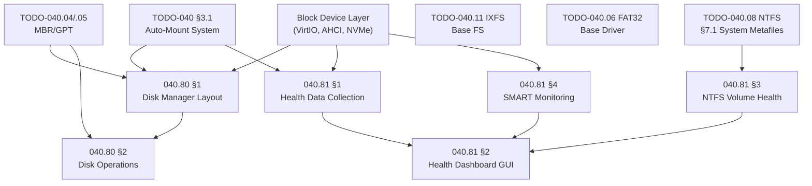

# Phase 06b — Filesystem Tools & Disk Management

> **Goal:** Provide a complete suite of graphical and CLI disk management, health
> monitoring, and diagnostic tools. Impossible OS ships with an integrated disk
> tool suite that surpasses both Windows Disk Management and the fragmented Linux
> CLI landscape. Every tool has both a CLI command and a polished GUI app.

> [!IMPORTANT]
> **Dependencies:** Most tools depend on the VFS auto-mount system (TODO-040 §3.1)
> and at least one writable filesystem driver (NTFS §12 or IXFS). Read-only tools
> (e.g., health dashboard, benchmark) can work with any mounted volume.
>
> | File                             | Scope                                                 |
> | -------------------------------- | ----------------------------------------------------- |
> | `TODO-041-Filesystem-Tools.md`   | Master file — sections, priorities, OS comparison     |
> | `TODO-040.80-Disk-Manager.md`    | Disk Manager GUI app — partition layout, operations   |
> | `TODO-040.81-Disk-Health-Dashboard.md` | Volume health dashboard — per-FS health metrics |

---

## TODO Completion Roadmap (Cross-File)

### Dependency Graph

### Phase-by-Phase Implementation Order

| P    | TODO File                    | Sections                   | What It Delivers                                  | Depends On                  | Status |
| :--: | ---------------------------- | -------------------------- | ------------------------------------------------- | --------------------------- | :----: |
| P0   | Prerequisites                | Block device, VFS, FS      | Mounted volumes + partition info                  | —                           |   ✅   |
| P1   | `040.80-Disk-Manager.md`     | §1 Layout                  | Graphical partition viewer                        | P0 (blkdev, VFS)            |   ⬜   |
| P1   | `040.81-Disk-Health.md`      | §1 Health Data Collection  | Per-FS health metric queries                      | P0 (VFS, blkdev)            |   ⬜   |
| P2   | `040.80-Disk-Manager.md`     | §2 Disk Operations         | Create/delete/format partitions via GUI           | P1 (§1) + MBR/GPT write     |   ⬜   |
| P2   | `040.81-Disk-Health.md`      | §2 Dashboard GUI           | Visual health panel in Disk Manager               | P1 (§1)                     |   ⬜   |
| P2   | `040.81-Disk-Health.md`      | §3 NTFS Volume Health      | NTFS-specific health (dirty, MFT, mirror, bitmap) | P1 (§1) + NTFS §7.1         |   ⬜   |
| P3   | `040.81-Disk-Health.md`      | §4 SMART Monitoring        | AHCI/NVMe SMART data + GUI                        | P1 (§1) + AHCI driver       |   ⬜   |
| P3   | `040.81-Disk-Health.md`      | §5 Historical Trends       | Track health metrics over time in Registry        | P2 (§2)                     |   ⬜   |

> [!NOTE]
> **Phase 0** is complete — block device drivers, partition parsers, and VFS are all working.
>
> **Phase 1** delivers the core Disk Manager window and the health data API.
>
> **Phase 2** enables disk operations and the visual health dashboard.
>
> **Phase 3** adds SMART monitoring and historical trend tracking — exclusive features.

---

## Priority Order

> **Scope:** This table tracks master-level priorities for filesystem tools.
> Each sub-file has its own internal priority table.

| Priority | Section / Sub-File                    | Reason                                                          |
| -------- | ------------------------------------- | --------------------------------------------------------------- |
| 🟡 P2     | `040.80` §1 Disk Manager Layout      | Visual partition management                                     |
| 🟡 P2     | `040.80` §2 Disk Operations          | Create/delete/format partitions                                 |
| 🟡 P2     | `040.81` §1 Health Data Collection   | Foundation for health dashboard                                 |
| 🟡 P2     | `040.81` §2 Dashboard GUI            | Visual health panel                                             |
| 🟢 P3     | `040.81` §3 NTFS Volume Health       | NTFS-specific health metrics 🚀                                 |
| 🟢 P3     | `040.81` §4 SMART Monitoring         | 🚀 **Exclusive** — integrated SMART in Disk Manager             |
| 🟢 P3     | `040.81` §5 Historical Trends        | 🚀 **Exclusive** — health trend tracking over time              |

---

## OS Comparison

| ⭐ | Feature                            | 🪟 Windows 11                      | 🐧 Linux                           | 🚀 Impossible OS                                 |
| -- | ---------------------------------- | ---------------------------------- | ----------------------------------- | ------------------------------------------------ |
| 💎 | Graphical partition viewer         | ✅ Disk Management (diskmgmt.msc)  | ⚠️ GParted (separate install)       | ⬜ §1 P2 — integrated Disk Manager               |
| 💎 | Create/delete/format partitions    | ✅ Disk Management + diskpart      | ✅ GParted / parted / fdisk          | ⬜ §2 P2 — GUI + CLI                             |
| 💎 | Drive letter assignment            | ✅ Disk Management                 | ❌ Mount points (no drive letters)   | ⬜ §2 P2 — Windows-style drive letters           |
| ⭐ | **Volume health dashboard**        | ❌ Spread across multiple tools    | ❌ CLI `smartctl` / `ntfsinfo` only  | ⬜ **§2 P2 — one-panel FS+disk health** 🚀       |
| ⭐ | **NTFS health aggregation**        | ❌ Properties → Tools → chkdsk     | ❌ `ntfsinfo` CLI only              | ⬜ **§3 P3 — dirty/MFT/mirror/bitmap** 🚀        |
| ⭐ | **SMART integration in Disk Mgr**  | ❌ Requires CrystalDiskInfo        | ❌ `smartmontools` CLI only          | ⬜ **§4 P3 — built-in SMART panel** 🚀           |
| ⭐ | **Health trend history**           | ❌ Not available                   | ❌ Not available natively            | ⬜ **§5 P3 — Registry-backed trend log** 🚀      |
| 💎 | Disk properties                    | ✅ Device Manager                  | ✅ lsblk / blkid                    | ⬜ §1 P2 — integrated in Disk Manager            |

> **After P2 items:** Impossible OS has a Disk Manager that matches Windows Disk Management and surpasses it with integrated health monitoring.
> **After P3 exclusive features:** Exceeds both — SMARTSMART panel, NTFS health aggregation, and trend tracking built into one app.
