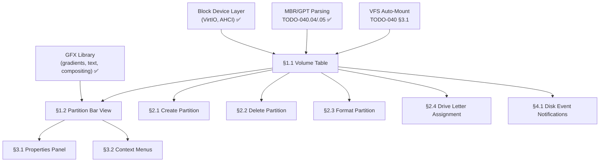

# 040.80-Disk-Manager — Graphical Disk Management Application

> **Goal:** Build a Disk Manager application (`diskmgr.exe`) that provides a Windows-style
> graphical interface for viewing and managing disk partitions. The upper panel shows a
> table of mounted volumes (drive letter, size, free, filesystem). The lower panel shows
> per-disk graphical partition bars (color-coded by filesystem type). Operations include
> create, delete, format, assign drive letter, and view properties. This replaces the
> scattered CLI-only approach of Linux and matches the functionality of Windows
> `diskmgmt.msc` while adding Impossible OS exclusive features.

> [!CAUTION]
> **Memory Rule:** Use `pmm_alloc_contiguous()` for ALL buffers > 4 KB (framebuffer regions,
> bitmap caches). `kmalloc` is ONLY for small kernel structs (≤ 4 KB).

> [!IMPORTANT]
> **Dependencies:**
> - Block device layer (TODO-040.01/.02 — ✅ complete)
> - Partition tables (TODO-040.04/.05 — ✅ complete)
> - VFS auto-mount (TODO-040 §3.1 — pending)
> - At least one writable FS (NTFS §12 or IXFS — ✅ IXFS complete)
>
> → XREF: `TODO-041-Filesystem-Tools.md` (master)
> → XREF: `TODO-040.81-Disk-Health-Dashboard.md` (health panel integration)

---

## TODO Completion Roadmap

### Dependency Graph

### Phase-by-Phase Implementation Order

| P    | Sections                    | What It Delivers                           | Depends On             | Status |
| :--: | --------------------------- | ------------------------------------------ | ---------------------- | :----: |
| P0   | Prerequisites               | Block device, partitions, VFS, GFX         | —                      |   ✅   |
| P1   | §1.1 Volume Table           | Upper panel — mounted volume list          | P0                     |   ⬜   |
| P1   | §1.2 Partition Bar View     | Lower panel — graphical partition layout   | P0 + §1.1              |   ⬜   |
| P2   | §2.1 Create Partition       | Create partition in unallocated space      | P1 + GPT/MBR write     |   ⬜   |
| P2   | §2.2 Delete Partition       | Delete partition with confirmation         | P1                     |   ⬜   |
| P2   | §2.3 Format Partition       | Format as NTFS/FAT32/IXFS                  | P1 + FS formatters     |   ⬜   |
| P2   | §2.4 Drive Letter Assignment| Change drive letter via GUI                | P1                     |   ⬜   |
| P3   | §3.1 Properties Panel       | Detailed volume/disk info side-panel       | P1                     |   ⬜   |
| P3   | §3.2 Context Menus          | Right-click context menus on partitions    | P1                     |   ⬜   |
| P3   | §4.1 Disk Event Notifications | Toast notifications for hot-plug events  | P1                     |   ⬜   |

> [!NOTE]
> **Phase 1** creates the visual foundation: a two-panel window showing volumes and partition bars.
>
> **Phase 2** adds destructive operations (create/delete/format) with confirmation dialogs.
>
> **Phase 3** adds polish: properties panel, context menus, and hot-plug notifications.

> [!TIP]
> The health dashboard (TODO-040.81) integrates as a tab or panel within this Disk Manager.
> § 3.1 Properties Panel should include a "Health" tab that pulls data from the health dashboard API.

---

## 1. Disk Manager Layout

### 1.1 Volume Table (Upper Panel)

**Prompt:** Create `src/apps/diskmgr/diskmgr.c` with a two-panel window. The upper panel is a table listing all mounted volumes: Drive Letter, Volume Label, Filesystem Type, Total Size, Used Space, Free Space, % Used. Data comes from `vfs_stat()` for each mounted drive and `blkdev_list()` for physical disk info. Columns are sortable by clicking headers. The table updates when volumes are mounted/unmounted. After completing all items, mark every item as `[x]`, update this prompt to a verification prompt, run `bash scripts/build.sh clean`, and commit as `"apps: Disk Manager volume table"`. Add notes directly in this TODO section. After implementation, save any gotchas, solutions, and important information to MCP memory (`mcp_memory_create_entities` / `mcp_memory_add_observations`).

- [ ] Create `src/apps/diskmgr/diskmgr.c` — Disk Manager app skeleton
- [ ] Create app window with title "Disk Manager" (800×600 default size)
- [ ] Upper panel: table with columns — Drive, Label, Filesystem, Size, Used, Free, % Used
- [ ] Populate table from VFS mount list + `vfs_stat()` per drive
- [ ] Format sizes as human-readable (KB, MB, GB, TB)
- [ ] Sortable columns (click header to sort by that column)
- [ ] Highlight system drive (C:) in bold
- [ ] Commit: `"apps: Disk Manager volume table"`

### 1.2 Partition Bar View (Lower Panel)

**Prompt:** The lower panel shows each physical disk as a horizontal bar divided into colored segments proportional to partition sizes. Colors: NTFS = blue, FAT32 = green, IXFS = cyan, exFAT = orange, ext4 = purple, unallocated = gray. Each segment shows drive letter, filesystem type, and size as overlay text. The bar is rendered using the GFX library gradient and rectangle primitives. Disks are stacked vertically with a header showing disk model, serial, and total capacity. After completing all items, mark every item as `[x]`, update this prompt to a verification prompt, run `bash scripts/build.sh clean`, and commit as `"apps: Disk Manager partition bars"`. Add notes directly in this TODO section. After implementation, save any gotchas, solutions, and important information to MCP memory (`mcp_memory_create_entities` / `mcp_memory_add_observations`).

- [ ] Query `blkdev_list()` for all physical disks
- [ ] For each disk: read partition table (GPT preferred, MBR fallback)
- [ ] Render horizontal bar per disk — segments proportional to partition size
- [ ] Color-code by filesystem type:
  - [ ] NTFS = blue (#3498DB), FAT32 = green (#2ECC71), IXFS = cyan (#00BCD4)
  - [ ] exFAT = orange (#E67E22), ext4 = purple (#9B59B6), unallocated = gray (#7F8C8D)
- [ ] Overlay text per segment: drive letter, FS type, size
- [ ] Disk header: model name, serial number, total capacity
- [ ] Unallocated space rendered as hatched gray segment
- [ ] Commit: `"apps: Disk Manager partition bars"`

---

## 2. Disk Operations

### 2.1 Create Partition

**Prompt:** Right-clicking unallocated space in the partition bar shows a "New Partition" option. The dialog lets the user pick: partition size (slider showing MB, with max = unallocated size), filesystem type (NTFS, FAT32, IXFS), and volume label. Clicking "Create" writes a new GPT/MBR entry via the partition writer APIs (TODO-040.04 §5 / 040.05 §8), then formats the partition. Show a progress bar during format. After completing all items, mark every item as `[x]`, update this prompt to a verification prompt, run `bash scripts/build.sh clean`, and commit as `"apps: Disk Manager create partition"`. Add notes directly in this TODO section. After implementation, save any gotchas, solutions, and important information to MCP memory (`mcp_memory_create_entities` / `mcp_memory_add_observations`).

- [ ] "New Partition" context menu on unallocated segments
- [ ] Create Partition dialog:
  - [ ] Size slider (1 MB – max unallocated)
  - [ ] Filesystem picker: NTFS, FAT32, IXFS
  - [ ] Volume label text field
- [ ] Write GPT/MBR entry via partition writer API
- [ ] Format new partition with selected filesystem
- [ ] Progress bar during format
- [ ] Refresh partition bar view after creation
- [ ] Commit: `"apps: Disk Manager create partition"`

### 2.2 Delete Partition

**Prompt:** Right-clicking a partition shows "Delete Partition". A warning dialog shows the partition details (drive letter, size, filesystem, label) and requires the user to confirm by clicking "Delete" (not just "OK"). If the partition is currently mounted, unmount it first (flush dirty buffers). Delete the GPT/MBR entry. After completing all items, mark every item as `[x]`, update this prompt to a verification prompt, run `bash scripts/build.sh clean`, and commit as `"apps: Disk Manager delete partition"`. Add notes directly in this TODO section. After implementation, save any gotchas, solutions, and important information to MCP memory (`mcp_memory_create_entities` / `mcp_memory_add_observations`).

- [ ] "Delete Partition" context menu on partition segments
- [ ] Warning dialog with partition details + "Delete" confirmation button
- [ ] Prevent deletion of system drive (C:) while running
- [ ] Unmount before delete: flush dirty buffers → unmount → remove GPT/MBR entry
- [ ] Refresh partition bar view after deletion
- [ ] Commit: `"apps: Disk Manager delete partition"`

### 2.3 Format Partition

**Prompt:** Right-clicking a partition shows "Format". The format dialog lets the user choose filesystem type (NTFS, FAT32, IXFS), volume label, and quick vs. full format. Quick format writes filesystem structures only. Full format writes zeros to all sectors first, then filesystem structures. Show a progress bar with ETA. After completing all items, mark every item as `[x]`, update this prompt to a verification prompt, run `bash scripts/build.sh clean`, and commit as `"apps: Disk Manager format partition"`. Add notes directly in this TODO section. After implementation, save any gotchas, solutions, and important information to MCP memory (`mcp_memory_create_entities` / `mcp_memory_add_observations`).

- [ ] "Format" context menu on partition segments
- [ ] Format dialog: filesystem picker, label, quick/full toggle
- [ ] Quick format: write FS structures only
- [ ] Full format: zero all sectors → write FS structures
- [ ] Progress bar with ETA
- [ ] Prevent formatting system drive (C:) while running
- [ ] Refresh after format
- [ ] Commit: `"apps: Disk Manager format partition"`

### 2.4 Drive Letter Assignment

**Prompt:** Right-clicking a partition shows "Change Drive Letter". A dropdown lists available letters (A–Z, excluding currently assigned ones). Selecting a new letter updates the VFS mount point and stores the mapping in Registry `HKLM\SYSTEM\Storage\Drive\{letter}`. After completing all items, mark every item as `[x]`, update this prompt to a verification prompt, run `bash scripts/build.sh clean`, and commit as `"apps: Disk Manager drive letter"`. Add notes directly in this TODO section. After implementation, save any gotchas, solutions, and important information to MCP memory (`mcp_memory_create_entities` / `mcp_memory_add_observations`).

- [ ] "Change Drive Letter" context menu
- [ ] Dropdown with available letters (A–Z, excluding assigned)
- [ ] Update VFS mount point for the partition
- [ ] Store mapping in Registry: `HKLM\SYSTEM\Storage\Drive\{letter}\Device`
- [ ] Prevent changing C: (system drive)
- [ ] Commit: `"apps: Disk Manager drive letter"`

---

## 3. Enhanced View & Navigation

### 3.1 Properties Panel

**Prompt:** Clicking a partition opens a side panel showing detailed properties: volume label, filesystem type, cluster size, total/used/free space, device path, partition index, partition type GUID (GPT) or type byte (MBR), creation date, and serial number. Include a "Health" tab that shows data from the health dashboard API (TODO-040.81). After completing all items, mark every item as `[x]`, update this prompt to a verification prompt, run `bash scripts/build.sh clean`, and commit as `"apps: Disk Manager properties panel"`. Add notes directly in this TODO section. After implementation, save any gotchas, solutions, and important information to MCP memory (`mcp_memory_create_entities` / `mcp_memory_add_observations`).

- [ ] Side panel with volume properties
- [ ] Fields: label, FS type, cluster size, sizes, device path, partition index
- [ ] GPT type GUID or MBR type byte
- [ ] "Health" tab: pull from health dashboard API (TODO-040.81)
- [ ] Pie chart or bar showing used vs. free space
- [ ] Commit: `"apps: Disk Manager properties panel"`

### 3.2 Context Menus

**Prompt:** Right-clicking any element in the Disk Manager shows a context-appropriate menu. On a partition: Open, Properties, Format, Delete, Change Drive Letter. On unallocated space: New Partition. On a disk header: Disk Properties, Initialize Disk (for new disks). Menu items are grayed out if the operation is unavailable (e.g., "Delete" on system drive). After completing all items, mark every item as `[x]`, update this prompt to a verification prompt, run `bash scripts/build.sh clean`, and commit as `"apps: Disk Manager context menus"`. Add notes directly in this TODO section. After implementation, save any gotchas, solutions, and important information to MCP memory (`mcp_memory_create_entities` / `mcp_memory_add_observations`).

- [ ] Context menu on partition segments: Open, Properties, Format, Delete, Change Letter
- [ ] Context menu on unallocated: New Partition
- [ ] Context menu on disk header: Disk Properties, Initialize
- [ ] Gray out unavailable operations
- [ ] Commit: `"apps: Disk Manager context menus"`

---

## 4. Disk Events (🚀 Exclusive)

### 4.1 Disk Event Notifications

**Prompt:** When a disk is hot-plugged (USB, NVMe), show a desktop toast notification: "New disk detected: [model] ([size])". When a volume auto-mounts, update the Disk Manager view in real-time without requiring a manual refresh. When a disk is removed without safe eject, show a warning toast: "Disk removed unsafely — data may be lost". Neither Windows nor Linux does real-time Disk Manager updates on hot-plug events. After completing all items, mark every item as `[x]`, update this prompt to a verification prompt, run `bash scripts/build.sh clean`, and commit as `"apps: Disk Manager hot-plug events"`. Add notes directly in this TODO section. After implementation, save any gotchas, solutions, and important information to MCP memory (`mcp_memory_create_entities` / `mcp_memory_add_observations`).

> [!TIP]
> **Competitive Edge:** Windows Disk Management requires manual refresh (`Action → Rescan Disks`).
> Linux GParted requires restart. Impossible OS updates in real-time.

- [ ] Register for block device hot-plug events
- [ ] On new disk: desktop toast "New disk detected: [model] ([size])"
- [ ] On volume auto-mount: refresh volume table + partition bars
- [ ] On unsafe removal: warning toast "Disk removed unsafely"
- [ ] Commit: `"apps: Disk Manager hot-plug events"`

---

## Priority Order

| ⭐ | Priority  | Section                        | Description                                              |
| -- | --------- | ------------------------------ | -------------------------------------------------------- |
| 💎 | 🟡 P2     | §1.1 Volume Table              | Upper panel — list of mounted volumes                    |
| 💎 | 🟡 P2     | §1.2 Partition Bar View        | Lower panel — graphical partition layout                 |
| 💎 | 🟡 P2     | §2.1 Create Partition          | Create new partition in unallocated space                |
| 💎 | 🟡 P2     | §2.2 Delete Partition          | Delete partition with safety confirmation                |
| 💎 | 🟡 P2     | §2.3 Format Partition          | Format as NTFS/FAT32/IXFS                                |
| 💎 | 🟡 P2     | §2.4 Drive Letter Assignment   | Change drive letter                                      |
| 💎 | 🟢 P3     | §3.1 Properties Panel          | Detailed volume/disk info side-panel                     |
| 💎 | 🟢 P3     | §3.2 Context Menus             | Right-click context menus                                |
| ⭐ | 🟢 P3     | §4.1 Disk Event Notifications  | 🚀 **Exclusive** — real-time hot-plug updates            |

---

## OS Comparison

| ⭐ | Feature                          | 🪟 Windows 11                      | 🐧 Linux                           | 🚀 Impossible OS                                 |
| -- | -------------------------------- | ---------------------------------- | ----------------------------------- | ------------------------------------------------ |
| 💎 | Graphical partition viewer       | ✅ Disk Management (diskmgmt.msc)  | ⚠️ GParted (separate install)       | ⬜ §1.1–1.2 P2 — integrated                     |
| 💎 | Volume list table                | ✅ Disk Management                 | ⚠️ GParted partitions list          | ⬜ §1.1 P2 — sortable columns                   |
| 💎 | Create partition                 | ✅ Disk Management + diskpart      | ✅ GParted / fdisk / parted          | ⬜ §2.1 P2 — GUI dialog                         |
| 💎 | Delete / format partition        | ✅ Disk Management                 | ✅ GParted / mkfs                    | ⬜ §2.2–2.3 P2                                  |
| 💎 | Drive letter assignment          | ✅ Disk Management                 | ❌ Mount points (no drive letters)   | ⬜ §2.4 P2 — Windows-style letters              |
| 💎 | Properties panel                 | ✅ Properties dialog               | ⚠️ GParted info panel               | ⬜ §3.1 P3 — side-panel + Health tab            |
| 💎 | Context menus                    | ✅ Right-click actions             | ✅ GParted context menus             | ⬜ §3.2 P3                                      |
| ⭐ | **Real-time hot-plug updates**   | ❌ Manual rescan required          | ❌ GParted requires restart          | ⬜ **§4.1 P3 — live update** 🚀                 |

> **After P2 items:** Impossible OS has a Disk Manager matching Windows Disk Management.
> **After P3 items:** Exceeds both — real-time hot-plug, properties + health tab.
