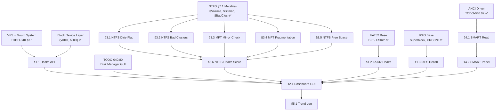

# 040.81-Disk-Health-Dashboard — Volume Health Monitoring & SMART Integration

> **Goal:** Build a centralized disk and volume health monitoring system. Aggregate
> filesystem-specific health metrics (dirty flag, bad clusters, MFT fragmentation,
> free space) and disk-level SMART data into a unified health dashboard panel within
> the Disk Manager. No operating system provides this at-a-glance view — Windows
> scatters volume info across Properties → Tools → chkdsk, and Linux relies on
> separate CLI tools (`smartctl`, `ntfsinfo`, `e2fsck`). Impossible OS shows
> everything in one GUI panel with computed health scores.

> [!IMPORTANT]
> **Origins:** The NTFS Volume Health section (§3) was originally §11.1 in
> [`TODO-040.08-NTFS.md`](file:///home/derickpayne/impossible-os/todo/010-Kernel-Foundations/TODO-040-Filesystem/TODO-040.08-NTFS.md).
> It was moved here because health monitoring is a cross-filesystem, tool-level
> concern — not specific to the NTFS driver implementation.
>
> → XREF: `TODO-041-Filesystem-Tools.md` (master)
> → XREF: `TODO-040.80-Disk-Manager.md` (GUI host)
> → XREF: `TODO-040.08-NTFS.md §7.1` (system metafiles — dirty flag, `$Bitmap`, `$BadClus`)

---

## TODO Completion Roadmap

### Dependency Graph

### Phase-by-Phase Implementation Order

| P    | Sections                    | What It Delivers                           | Depends On             | Status |
| :--: | --------------------------- | ------------------------------------------ | ---------------------- | :----: |
| P0   | Prerequisites               | Block device, VFS, FS drivers, AHCI        | —                      |   ✅   |
| P1   | §1.1 Health API             | Generic `vol_health_query()` interface     | P0 (VFS)               |   ⬜   |
| P1   | §1.2 FAT32 Health           | FAT32 BPB + FSInfo + dirty flag checks    | P0 (FAT32)             |   ⬜   |
| P1   | §1.3 IXFS Health            | IXFS superblock + CRC + journal checks    | P0 (IXFS)              |   ⬜   |
| P2   | §2.1 Dashboard GUI          | Health panel in Disk Manager               | P1 (§1.1)              |   ⬜   |
| P2   | §3.1–3.5 NTFS Health Checks | All 5 NTFS health metrics                 | P1 (§1.1) + NTFS §7.1  |   ⬜   |
| P2   | §3.6 NTFS Health Score      | Aggregated health score                    | P2 (§3.1–3.5)          |   ⬜   |
| P3   | §4.1 SMART Read             | AHCI/NVMe SMART data via ATA IDENTIFY     | P0 (AHCI)              |   ⬜   |
| P3   | §4.2 SMART Panel            | SMART attributes in health dashboard       | P3 (§4.1) + P2 (§2.1)  |   ⬜   |
| P3   | §5.1 Trend Log              | Historical health metrics in Registry      | P2 (§2.1)              |   ⬜   |

> [!NOTE]
> **Phase 1** creates the health query API and per-filesystem health checks (FAT32, IXFS).
>
> **Phase 2** delivers the visual dashboard and NTFS-specific health checks — the core exclusive feature.
>
> **Phase 3** adds SMART monitoring and historical trend tracking — neither Windows nor Linux integrates these.

> [!TIP]
> **Competitive Edge:** Windows shows NTFS volume info spread across Properties → Tools → chkdsk.
> Linux has `ntfsinfo` but it's CLI-only and doesn't aggregate health. Impossible OS shows
> everything in one GUI panel: dirty flag, bad clusters, MFT fragmentation, mirror consistency,
> all with a computed health score. One-click "Check Disk" runs chkdsk-equivalent.
>
> **SMART Edge:** Windows requires CrystalDiskInfo (third-party). Linux requires `smartmontools`
> (`smartctl`). Impossible OS integrates SMART data directly in the Disk Manager health panel.

---

## 1. Health Data Collection Framework

### 1.1 Health Query API

**Prompt:** Define a generic volume health query interface that all filesystem drivers can implement. The API returns a `vol_health_t` struct containing: overall status (healthy/warning/critical), individual metric scores, and human-readable descriptions. Register per-filesystem health callbacks via `vfs_register_health_provider()`. The Disk Manager calls `vol_health_query(drive_letter)` to get all metrics for a volume. After completing all items, mark every item as `[x]`, update this prompt to a verification prompt, run `bash scripts/build.sh clean`, and commit as `"fs: volume health query API"`. Add notes directly in this TODO section. After implementation, save any gotchas, solutions, and important information to MCP memory (`mcp_memory_create_entities` / `mcp_memory_add_observations`).

- [ ] Define `vol_health_t` struct in `include/kernel/fs/vfs.h`:
  - [ ] `overall_status`: `HEALTH_OK`, `HEALTH_WARNING`, `HEALTH_CRITICAL`
  - [ ] Array of `vol_health_metric_t`: { name, status, value, description }
  - [ ] `metric_count`: number of metrics
- [ ] Define `vol_health_metric_t`: metric name, status emoji (✅/⚠️/❌), numeric value, text
- [ ] Add `int (*health_query)(struct vfs_node *root, vol_health_t *out)` to `struct vfs_ops`
- [ ] Implement `vol_health_query(char drive_letter, vol_health_t *out)` in VFS layer
- [ ] Commit: `"fs: volume health query API"`

### 1.2 FAT32 Health Provider

**Prompt:** Implement `fat32_health_query()` that checks: BPB magic number validity, BPB cluster size within range, FSInfo free cluster count matches FAT scan, FAT copy consistency (FAT1 vs FAT2), and dirty shutdown flag (reserved byte in BPB). Return per-metric status. After completing all items, mark every item as `[x]`, update this prompt to a verification prompt, run `bash scripts/build.sh clean`, and commit as `"fat32: health query provider"`. Add notes directly in this TODO section. After implementation, save any gotchas, solutions, and important information to MCP memory (`mcp_memory_create_entities` / `mcp_memory_add_observations`).

- [ ] Implement `fat32_health_query()` in `src/kernel/fs/fat32.c`
- [ ] Check BPB magic and cluster size validity
- [ ] Compare FSInfo free count vs FAT scan
- [ ] Compare FAT1 vs FAT2 consistency
- [ ] Check dirty shutdown flag
- [ ] Register via `vfs_register_health_provider()`
- [ ] Commit: `"fat32: health query provider"`

### 1.3 IXFS Health Provider

**Prompt:** Implement `ixfs_health_query()` that checks: superblock magic + version + CRC32C, free block bitmap consistency, inode reference count validity, journal state (clean/dirty), and checksum table integrity. Return per-metric status. After completing all items, mark every item as `[x]`, update this prompt to a verification prompt, run `bash scripts/build.sh clean`, and commit as `"ixfs: health query provider"`. Add notes directly in this TODO section. After implementation, save any gotchas, solutions, and important information to MCP memory (`mcp_memory_create_entities` / `mcp_memory_add_observations`).

- [ ] Implement `ixfs_health_query()` in `src/kernel/fs/ixfs.c`
- [ ] Check superblock magic, version, CRC32C
- [ ] Verify free block bitmap consistency
- [ ] Check journal state (clean shutdown vs dirty)
- [ ] Validate checksum table integrity
- [ ] Register via `vfs_register_health_provider()`
- [ ] Commit: `"ixfs: health query provider"`

---

## 2. Health Dashboard GUI

### 2.1 Dashboard Panel

**Prompt:** Create a health dashboard panel that integrates into the Disk Manager (TODO-040.80) as a "Health" tab on the properties side-panel. For each selected volume, show: a health score bar (green/yellow/red gradient), per-metric rows with status icon (✅/⚠️/❌), metric name, and description. Include a "Check Disk" button that launches `chkdsk` (TODO-040 §5.2). The panel auto-refreshes when a different volume is selected. After completing all items, mark every item as `[x]`, update this prompt to a verification prompt, run `bash scripts/build.sh clean`, and commit as `"apps: health dashboard panel"`. Add notes directly in this TODO section. After implementation, save any gotchas, solutions, and important information to MCP memory (`mcp_memory_create_entities` / `mcp_memory_add_observations`).

- [ ] Create "Health" tab in Disk Manager properties panel
- [ ] Health score bar: gradient green → yellow → red based on overall status
- [ ] Per-metric rows: icon (✅/⚠️/❌), metric name, value, description
- [ ] "Check Disk" button → launch `chkdsk` on selected volume
- [ ] Auto-refresh when selecting different volume
- [ ] Handle volumes with no health provider gracefully ("No health data")
- [ ] Commit: `"apps: health dashboard panel"`

---

## 3. NTFS Volume Health (🚀 Exclusive — moved from TODO-040.08 §11.1)

> [!TIP]
> **Competitive Edge:** Windows shows NTFS volume info spread across Properties → Tools → chkdsk.
> Linux has `ntfsinfo` but it's CLI-only and doesn't aggregate health. Impossible OS shows
> everything in one GUI panel: dirty flag, bad clusters, MFT fragmentation, mirror consistency,
> all with a computed health score. One-click "Check Disk" runs chkdsk-equivalent.

### 3.1 Dirty Flag Check

**Prompt:** Read the dirty flag from `$Volume` (inode 3) → `$VOLUME_INFORMATION` attribute → flags word at offset 10. Bit 0 set = volume was not cleanly unmounted. Report as ⚠️ if dirty (suggests chkdsk needed), ✅ if clean. After completing all items, mark every item as `[x]`, update this prompt to a verification prompt, run `bash scripts/build.sh clean`, and commit as `"ntfs: health dirty flag check"`. Add notes directly in this TODO section. After implementation, save any gotchas, solutions, and important information to MCP memory (`mcp_memory_create_entities` / `mcp_memory_add_observations`).

- [ ] Read `$Volume` (inode 3) MFT record
- [ ] Find `$VOLUME_INFORMATION` attribute (type 0x70)
- [ ] Read flags word at offset 10 → check bit 0 (dirty)
- [ ] Return `HEALTH_OK` if clean, `HEALTH_WARNING` if dirty
- [ ] Commit: `"ntfs: health dirty flag check"`

### 3.2 Bad Cluster Count

**Prompt:** Read `$BadClus` (inode 8) → count bad cluster entries in the `$Bad` named data stream. Each data run in `$Bad` that maps to real clusters (not sparse) represents bad clusters. Report count: 0 = ✅, 1–10 = ⚠️, >10 = ❌. After completing all items, mark every item as `[x]`, update this prompt to a verification prompt, run `bash scripts/build.sh clean`, and commit as `"ntfs: health bad cluster check"`. Add notes directly in this TODO section. After implementation, save any gotchas, solutions, and important information to MCP memory (`mcp_memory_create_entities` / `mcp_memory_add_observations`).

- [ ] Read `$BadClus` (inode 8) MFT record
- [ ] Find `$Bad` named `$DATA` attribute
- [ ] Decode data runs → count non-sparse entries (real bad clusters)
- [ ] 0 = ✅ healthy, 1–10 = ⚠️ warning, >10 = ❌ critical
- [ ] Commit: `"ntfs: health bad cluster check"`

### 3.3 MFT Mirror Consistency

**Prompt:** Compare `$MFTMirr` (inode 1) first 4 records against `$MFT` (inode 0). Read records 0–3 from both, byte-exact comparison. Mismatch = ⚠️ (mirror is stale, needs repair). Match = ✅. This catches MFT corruption that could prevent boot. After completing all items, mark every item as `[x]`, update this prompt to a verification prompt, run `bash scripts/build.sh clean`, and commit as `"ntfs: health MFT mirror check"`. Add notes directly in this TODO section. After implementation, save any gotchas, solutions, and important information to MCP memory (`mcp_memory_create_entities` / `mcp_memory_add_observations`).

- [ ] Read `$MFTMirr` (inode 1) — first 4 records
- [ ] Read `$MFT` (inode 0) — first 4 records
- [ ] Byte-exact comparison of records 0–3
- [ ] Mismatch → `HEALTH_WARNING` ("MFT mirror out of sync")
- [ ] Match → `HEALTH_OK`
- [ ] Commit: `"ntfs: health MFT mirror check"`

### 3.4 MFT Fragmentation

**Prompt:** Count the number of data runs in `$MFT`'s own `$DATA` attribute. Ideally `$MFT` is one contiguous run. Multiple runs mean the MFT is fragmented, which degrades metadata lookup performance. 1 run = ✅ perfect, 2–5 = ⚠️ normal, 6+ = ❌ fragmented (recommend defrag). After completing all items, mark every item as `[x]`, update this prompt to a verification prompt, run `bash scripts/build.sh clean`, and commit as `"ntfs: health MFT fragmentation check"`. Add notes directly in this TODO section. After implementation, save any gotchas, solutions, and important information to MCP memory (`mcp_memory_create_entities` / `mcp_memory_add_observations`).

- [ ] Read `$MFT` (inode 0) MFT record → find `$DATA` attribute
- [ ] Count data runs in the run list
- [ ] 1 run = ✅ perfect, 2–5 = ⚠️ normal, 6+ = ❌ fragmented
- [ ] Report run count and recommendation if fragmented
- [ ] Commit: `"ntfs: health MFT fragmentation check"`

### 3.5 Free Space from $Bitmap

**Prompt:** Compute free space percentage from the `$Bitmap` (inode 6) cluster bitmap. Count zero bits = free clusters. Report percentage: >20% = ✅, 10–20% = ⚠️ "Low space", <10% = ❌ "Critical — free space dangerously low". After completing all items, mark every item as `[x]`, update this prompt to a verification prompt, run `bash scripts/build.sh clean`, and commit as `"ntfs: health free space check"`. Add notes directly in this TODO section. After implementation, save any gotchas, solutions, and important information to MCP memory (`mcp_memory_create_entities` / `mcp_memory_add_observations`).

- [ ] Read `$Bitmap` (inode 6) data
- [ ] Count zero bits (free clusters) vs total clusters
- [ ] Calculate free space percentage
- [ ] >20% = ✅, 10–20% = ⚠️, <10% = ❌
- [ ] Commit: `"ntfs: health free space check"`

### 3.6 NTFS Health Score Aggregation

**Prompt:** Aggregate all NTFS health metrics (§3.1–3.5) into a single health score. All ✅ = "Healthy" (green), any ⚠️ = "Needs Attention" (yellow), any ❌ = "Unhealthy" (red). Register as the NTFS health query provider via `ntfs_health_query()`. Wire to the Disk Manager health panel. After completing all items, mark every item as `[x]`, update this prompt to a verification prompt, run `bash scripts/build.sh clean`, and commit as `"ntfs: volume health dashboard"`. Add notes directly in this TODO section. After implementation, save any gotchas, solutions, and important information to MCP memory (`mcp_memory_create_entities` / `mcp_memory_add_observations`).

- [ ] Implement `ntfs_health_query()` aggregating §3.1–3.5 metrics
- [ ] All green = "Healthy", any warning = "Needs Attention", any red = "Unhealthy"
- [ ] Register as NTFS health provider via `vfs_register_health_provider()`
- [ ] Wire to Disk Manager: NTFS volume properties → Health tab
- [ ] Commit: `"ntfs: volume health dashboard"`

---

## 4. SMART Monitoring (🚀 Exclusive)

### 4.1 SMART Data Read

**Prompt:** Read SMART (Self-Monitoring, Analysis and Reporting Technology) data from AHCI drives via ATA `IDENTIFY DEVICE` (0xEC) and `SMART READ DATA` (0xB0/D0) commands. Parse SMART attributes: temperature, power-on hours, reallocated sectors, pending sectors, and overall health status. For NVMe drives, use the SMART / Health Information Log (Log Page 02h). After completing all items, mark every item as `[x]`, update this prompt to a verification prompt, run `bash scripts/build.sh clean`, and commit as `"drivers: SMART data read"`. Add notes directly in this TODO section. After implementation, save any gotchas, solutions, and important information to MCP memory (`mcp_memory_create_entities` / `mcp_memory_add_observations`).

> [!TIP]
> **Competitive Edge:** Windows requires CrystalDiskInfo (third-party download).
> Linux requires `smartmontools` package (`smartctl -a /dev/sda`).
> Impossible OS reads SMART data natively and shows it in the Disk Manager.

- [ ] Send ATA `IDENTIFY DEVICE` (0xEC) via AHCI command port
- [ ] Check if SMART is supported (word 82, bit 0)
- [ ] Send `SMART READ DATA` (0xB0, feature=0xD0)
- [ ] Parse SMART attributes table (512-byte data buffer):
  - [ ] Attribute 5: Reallocated Sector Count
  - [ ] Attribute 9: Power-On Hours
  - [ ] Attribute 194: Temperature (°C)
  - [ ] Attribute 197: Current Pending Sector Count
  - [ ] Attribute 198: Offline Uncorrectable Sector Count
- [ ] Parse overall SMART health: PASS / FAIL
- [ ] For NVMe: read SMART Log Page 02h (temperature, spare, errors)
- [ ] Expose via `blkdev_smart_query(dev, smart_data_t *out)`
- [ ] Commit: `"drivers: SMART data read"`

### 4.2 SMART Panel in Dashboard

**Prompt:** Add a "Disk Health" section to the health dashboard that shows SMART attributes for the physical disk underlying the selected volume. Show: overall status (PASS/FAIL), temperature with color coding (<40°C green, 40–55°C yellow, >55°C red), power-on hours, reallocated sectors (0 = green, >0 = warning), and pending sectors. For SSDs, show remaining life percentage if available. After completing all items, mark every item as `[x]`, update this prompt to a verification prompt, run `bash scripts/build.sh clean`, and commit as `"apps: SMART panel in health dashboard"`. Add notes directly in this TODO section. After implementation, save any gotchas, solutions, and important information to MCP memory (`mcp_memory_create_entities` / `mcp_memory_add_observations`).

- [ ] "Disk Health" section in health dashboard panel
- [ ] Overall SMART status: PASS (green badge) / FAIL (red badge)
- [ ] Temperature: value + color bar (<40°C green, 40–55°C yellow, >55°C red)
- [ ] Power-on hours: formatted as days/hours
- [ ] Reallocated sectors: count + status (0=✅, >0=⚠️)
- [ ] Pending sectors: count + status
- [ ] SSD: remaining life % if available (NVMe spare capacity)
- [ ] Commit: `"apps: SMART panel in health dashboard"`

---

## 5. Historical Health Trends (🚀 Exclusive)

### 5.1 Trend Log

**Prompt:** Track health metrics over time by logging daily snapshots to the Registry under `HKLM\SYSTEM\Storage\Health\{drive}\History`. Each entry stores: timestamp, overall health score, per-metric values, and SMART temperature/reallocated sectors. The dashboard shows a trend graph (sparkline or small chart) for key metrics over the last 30 days. This enables proactive disk failure prediction — a feature neither Windows nor Linux provides natively. After completing all items, mark every item as `[x]`, update this prompt to a verification prompt, run `bash scripts/build.sh clean`, and commit as `"apps: health trend log"`. Add notes directly in this TODO section. After implementation, save any gotchas, solutions, and important information to MCP memory (`mcp_memory_create_entities` / `mcp_memory_add_observations`).

> [!TIP]
> **Competitive Edge:** Neither Windows nor Linux tracks filesystem health trends over time.
> CrystalDiskInfo shows current SMART values but no history. Impossible OS logs daily
> health snapshots and shows trends — enabling proactive disk replacement warnings.

- [ ] Define health snapshot struct: timestamp, overall score, per-metric values
- [ ] Store in Registry: `HKLM\SYSTEM\Storage\Health\{drive}\History\{date}`
- [ ] Log daily health snapshot (on boot or at midnight)
- [ ] Retain last 30 days of snapshots (auto-prune older)
- [ ] Dashboard: sparkline graph for temperature, free space, reallocated sectors
- [ ] Alert when trend shows degradation (e.g., increasing reallocated sectors)
- [ ] Commit: `"apps: health trend log"`

---

## Priority Order

| ⭐ | Priority  | Section                          | Description                                              |
| -- | --------- | -------------------------------- | -------------------------------------------------------- |
| 💎 | 🟡 P2     | §1.1 Health Query API            | Foundation — generic health interface                    |
| 💎 | 🟡 P2     | §1.2 FAT32 Health Provider       | FAT32 BPB/FSInfo/dirty checks                            |
| 💎 | 🟡 P2     | §1.3 IXFS Health Provider        | IXFS superblock/CRC/journal checks                       |
| 💎 | 🟡 P2     | §2.1 Dashboard GUI Panel         | Visual health panel in Disk Manager                      |
| ⭐ | 🟢 P3     | §3.1 NTFS Dirty Flag             | 🚀 NTFS dirty flag check                                |
| ⭐ | 🟢 P3     | §3.2 NTFS Bad Clusters           | 🚀 `$BadClus` scan                                      |
| ⭐ | 🟢 P3     | §3.3 MFT Mirror Consistency      | 🚀 `$MFTMirr` vs `$MFT` comparison                     |
| ⭐ | 🟢 P3     | §3.4 MFT Fragmentation           | 🚀 MFT data run count                                   |
| ⭐ | 🟢 P3     | §3.5 NTFS Free Space             | 🚀 `$Bitmap` free cluster count                         |
| ⭐ | 🟢 P3     | §3.6 NTFS Health Score           | 🚀 **Aggregated health** — no OS does this               |
| ⭐ | 🟢 P3     | §4.1 SMART Data Read             | 🚀 **Exclusive** — built-in SMART via AHCI/NVMe         |
| ⭐ | 🟢 P3     | §4.2 SMART Panel                 | 🚀 **Exclusive** — SMART in Disk Manager GUI             |
| ⭐ | 🟢 P3     | §5.1 Health Trend Log            | 🚀 **Exclusive** — historical health tracking            |

---

## OS Comparison

| ⭐ | Feature                          | 🪟 Windows 11                      | 🐧 Linux                           | 🚀 Impossible OS                                  |
| -- | -------------------------------- | ---------------------------------- | ----------------------------------- | -------------------------------------------------- |
| 💎 | Filesystem health checks         | ⚠️ `chkdsk` (CLI, not visual)      | ⚠️ `fsck` (CLI, per-FS)             | ⬜ §1 P2 — unified API + GUI                      |
| 💎 | FAT32 health                     | ⚠️ `chkdsk` text output            | ⚠️ `dosfsck` CLI only               | ⬜ §1.2 P2 — visual metrics                       |
| 💎 | Volume free space warnings       | ✅ Low disk space notification     | ❌ No built-in notification          | ⬜ §3.5 P3 — color-coded in health panel          |
| ⭐ | **NTFS health aggregation**      | ❌ Props → Tools → chkdsk          | ❌ `ntfsinfo` CLI only               | ⬜ **§3 P3 — one-panel health** 🚀                |
| ⭐ | **MFT mirror validation**        | ❌ Hidden in chkdsk output         | ❌ Not available                     | ⬜ **§3.3 P3 — visual mirror status** 🚀          |
| ⭐ | **MFT fragmentation display**    | ❌ Hidden in `defrag /a` output    | ❌ Not available                     | ⬜ **§3.4 P3 — run count + status** 🚀            |
| ⭐ | **Bad cluster monitoring**       | ⚠️ Only via `chkdsk /r`            | ❌ `badblocks` CLI only              | ⬜ **§3.2 P3 — live count in GUI** 🚀             |
| ⭐ | **Integrated SMART panel**       | ❌ CrystalDiskInfo (3rd party)     | ❌ `smartmontools` CLI only          | ⬜ **§4 P3 — built-in SMART panel** 🚀            |
| ⭐ | **Health trend history**         | ❌ Not available                   | ❌ Not available natively            | ⬜ **§5.1 P3 — 30-day trend + alerts** 🚀         |
| ⭐ | **Computed health score**        | ❌ No per-volume health score      | ❌ No per-volume health score        | ⬜ **§3.6 P3 — green/yellow/red** 🚀              |
| ⭐ | **Proactive failure warnings**   | ❌ Shows only after failure        | ❌ No built-in prediction            | ⬜ **§5.1 P3 — trend-based warnings** 🚀          |

> **After P2 items:** Impossible OS has a unified health dashboard — basic checks for all filesystems.
> **After P3 exclusive features:** Exceeds both — NTFS health aggregation, SMART integration, and trend tracking are features no other OS provides in one panel.
