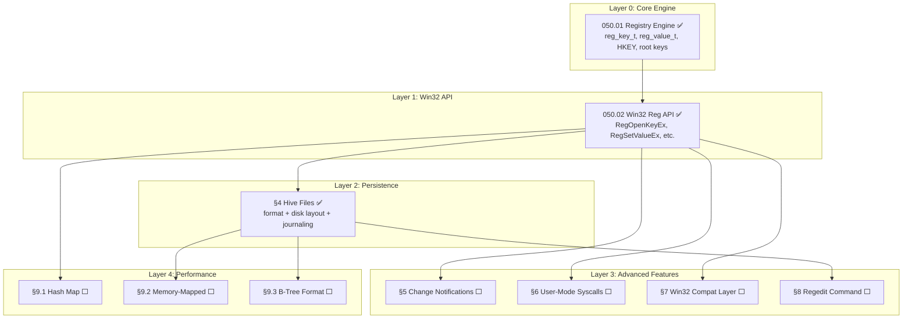

# P0102 — Registry System (Windows-Compatible)

> **Goal:** Replace the Codex registry with a full Windows-compatible **Registry** system
> using the same API surface as Win32 (`RegOpenKeyEx`, `RegSetValueEx`, etc.), the same
> root keys (`HKEY_LOCAL_MACHINE`, `HKEY_CURRENT_USER`, etc.), and the same value types
> (`REG_SZ`, `REG_DWORD`, `REG_BINARY`, etc.). Store registry data in binary hive files
> with crash-safe journaling. Provide a `regedit` shell command for inspection.

> [!CAUTION]
> **Memory Rule:** Use `pmm_alloc_contiguous()` for ALL buffers > 4 KB (hive file buffers, large binary values). `kmalloc` is ONLY for small kernel structs (≤ 4 KB). Violating this crashes the 2 MiB heap silently. See `rules.md` Known Gotchas.

> [!IMPORTANT]
> **Migration complete:** The old Codex system (`codex.c`, `codex.h`) has been deleted.
> All call sites now use the Registry API. The disk format uses `.hive` binary files
> with crash-safe journaling (WAJ).

---

## TODO Completion Roadmap (Cross-File)

> | File                               | Scope                                                                     |
> | ---------------------------------- | ------------------------------------------------------------------------- |
> | `TODO-050-Registry.md`             | Master file — sections, priorities, OS comparison                         |
> | `TODO-050.01-Registry-Engine.md`   | Core engine: `reg_key_t`, `reg_value_t`, `HKEY`, pools, value types, root keys |
> | `TODO-050.02-Win32-Reg-API.md`     | Win32 API: key/value operations, enumeration, convenience helpers         |

### Dependency Graph

### Phase-by-Phase Implementation Order

| ⭐  | Phase  | TODO File / Section              | What It Delivers                                                        | Depends On                      | Status |
| --- | :----: | -------------------------------- | ----------------------------------------------------------------------- | ------------------------------- | :----: |
| 💎  | **0**  | `050.01-Registry-Engine.md`      | `reg_key_t`, `reg_value_t`, static pools, FNV-1a, root keys, all types  | —                               |   ✅   |
| 💎  | **1**  | `050.02-Win32-Reg-API.md`        | `RegOpenKeyEx`, `RegSetValueEx`, enumeration, convenience helpers       | Phase 0 (engine)                |   ✅   |
| 💎  | **2**  | `050-Registry.md` §4             | Hive file format, disk layout, crash-safe journaling                    | Phase 1 (API)                   |   ✅   |
| 💎  | **3**  | `050-Registry.md` §5.1           | Change notifications (`RegNotifyChangeKeyValue`)                        | Phase 1 (API)                   |   ⬜   |
| 💎  | **3**  | `050-Registry.md` §6.1           | User-mode registry syscalls                                             | Phase 1 (API)                   |   ⬜   |
| 💎  | **3**  | `050-Registry.md` §8.1           | `regedit` shell command                                                 | Phase 2 (persistence)           |   ⬜   |
| 💎  | **4**  | `050-Registry.md` §7.1           | advapi32.dll registry stubs (Win32 compat)                              | Phase 3 (§6.1 syscalls)         |   ⬜   |
| 🔵  | **5**  | `050-Registry.md` §9.1           | Hash map child lookup (O(1))                                            | Phase 1 (API)                   |   ⬜   |
| 🔵  | **5**  | `050-Registry.md` §9.2           | Memory-mapped hive files                                                | Phase 2 (hive)                  |   ⬜   |
| 🔵  | **5**  | `050-Registry.md` §9.3           | B-tree cell format (NT hive compat)                                     | Phase 2 (hive)                  |   ⬜   |

> [!NOTE]
> **Phases 0–2 are complete.** The core engine, Win32 API, and disk persistence
> (including crash-safe journaling) are all implemented and verified.
>
> **Phase 3** delivers advanced features: change notifications, user-mode syscalls, and
> the `regedit` shell command. These are independent and can be done in any order.
>
> **Phase 4** adds Win32 compatibility layer stubs — depends on syscalls from Phase 3.
>
> **Phase 5** contains stretch performance goals: hash map optimization, mmap, B-tree.

---

## 1. Core Registry Engine

> **→ See [TODO-050.01-Registry-Engine.md](TODO-050-Registry/TODO-050.01-Registry-Engine.md)** ✅
>
> Covers: §1.1 Data Structures, §1.2 Value Types, §1.3 Predefined Root Keys.
> All sections complete.

---

## 2. Win32-Compatible API

> **→ See [TODO-050.02-Win32-Reg-API.md](TODO-050-Registry/TODO-050.02-Win32-Reg-API.md)** ✅
>
> Covers: §2.1 Key Operations, §2.2 Value Operations, §2.3 Enumeration, §2.4 Convenience Helpers.
> All sections complete.

---
## 4. Disk Persistence (Hive Files)

### 4.1 Hive File Format *(done)* ✅

**Prompt:** Verify the hive file format implementation. In `registry.h`, confirm `hive_header_t` is defined as a packed struct with `magic` (HIVE_MAGIC = 0x48474552), `version` (1), `checksum` (CRC32), `timestamp`, `root_name[64]`, `total_keys`, `total_values`, `data_offset`, `data_size`, and `padding` to 4096 bytes. Confirm `hive_save` and `hive_load` are declared. In `registry.c`, confirm `hive_crc32` implements table-less CRC32 with polynomial 0xEDB88320. Confirm `hive_serialize_key` writes depth-first key records as `[name_len:u16][name:N][value_count:u16][child_count:u16]` and value records as `[name_len:u16][name:N][type:u32][data_size:u32][data:N]`. Confirm `hive_save` uses PMM for the buffer, fills the header, computes CRC32, and writes via VFS. Confirm `hive_load` validates magic, version, and CRC32, and returns -1 with a klog warning on corrupt files. Run `bash scripts/build.sh clean` and confirm zero warnings.

- [x] Define hive file header struct (4096 bytes):
  - [x] Magic: `"REGH"` (4 bytes)
  - [x] Version: `1` (uint32)
  - [x] Checksum: CRC32 of header (uint32)
  - [x] Timestamp: PIT ticks at save time (uint64)
  - [x] Root key name (64 bytes)
  - [x] Total key count (uint32)
  - [x] Total value count (uint32)
  - [x] Reserved padding to 4096 bytes
- [x] Implement `hive_save(root_key, filepath)` — serialize tree to file
- [x] Implement `hive_load(filepath, &root_key)` — deserialize file into tree
- [x] Add CRC32 checksum validation on load
- [x] Handle corrupt hive: log warning, skip file, use defaults
- [x] Commit: `"registry: hive file format"`

### 4.2 Hive File Layout on Disk *(done)* ✅

**Prompt:** Verify the hive file disk layout. In `registry.h`, confirm `REG_HIVE_DIR` is `"C:\Impossible\System\Config\Registry"` and `REG_HIVE_COUNT` is 4. Confirm `registry_flush()`, `registry_save_all()`, and `registry_load_hives()` are declared. In `registry.c`, confirm `hive_table` maps 4 descriptors: SYSTEM.hive→HKLM\SYSTEM, SOFTWARE.hive→HKLM\SOFTWARE, HARDWARE.hive→HKLM\HARDWARE, DEFAULT.hive→HKU\Default. Confirm `registry_mark_dirty()` walks up the parent chain to mark the correct hive dirty. Confirm it's called from `RegSetValueEx` and `RegDeleteValue`. Confirm `registry_flush()` only writes dirty hives. Confirm `hive_ensure_dir()` creates the directory chain. In `main.c`, confirm `registry_flush()` is enabled (not commented out). Run `bash scripts/build.sh clean` and confirm zero warnings.

- [x] Define hive file paths:
  - [x] `C:\Impossible\System\Config\Registry\SYSTEM.hive` → HKLM\SYSTEM
  - [x] `C:\Impossible\System\Config\Registry\SOFTWARE.hive` → HKLM\SOFTWARE
  - [x] `C:\Impossible\System\Config\Registry\HARDWARE.hive` → HKLM\HARDWARE
  - [x] `C:\Impossible\System\Config\Registry\DEFAULT.hive` → HKU\Default
- [x] Create Registry directory at first boot if missing
- [x] Implement dirty-flag tracking per hive
- [x] Implement `registry_flush()` — write only dirty hives
- [x] Implement `registry_save_all()` — for clean shutdown
- [x] Hook dirty tracking into `RegSetValueEx` and `RegDeleteValue`
- [x] Enable `registry_flush()` in `main.c` compositor loop
- [x] Commit: `"registry: hive file disk layout"`

### 4.3 Crash-Safe Journaling *(done)* ✅

**Prompt:** Verify crash-safe journaling. In `registry.c`, confirm `hive_save` follows the 4-step sequence: (1) write `.hive.log`, (2) copy `.hive` → `.hive.bak`, (3) overwrite `.hive`, (4) invalidate `.hive.log` by zeroing magic. Confirm `hive_validate_file` checks magic, version, and CRC32. Confirm `hive_best_source` checks `.hive.log` → `.hive` → `.hive.bak` in priority order and copies the best source to `.hive`. Confirm `registry_load_hives` calls `hive_best_source` for each hive before loading. Confirm `hive_copy_file` does a byte-by-byte copy via VFS. Run `bash scripts/build.sh clean` and confirm zero warnings.

- [x] Before saving: write new data to `.hive.log` first (journal)
- [x] After log + main hive written: invalidate `.hive.log` by zeroing magic
- [x] On boot: if `.hive.log` has valid header, replay it (crash recovery via `hive_best_source`)
- [x] On boot: if `.hive` is corrupt (bad CRC), fall back to `.hive.bak`
- [x] Keep one backup: copy old `.hive` → `.hive.bak` before overwriting
- [x] Commit: `"registry: crash-safe journaling"`

---
## 5. Change Notifications

### 5.1 Registry Watchers

**Prompt:** Implement `RegNotifyChangeKeyValue` so applications can watch for registry changes without polling. This is how Windows apps detect settings changes in real time — for example, the desktop compositor watches `HKCU\Software\Impossible\Theme\DarkMode` and switches themes instantly. Internally, maintain a linked list of "watcher" structs, each containing the watched key path, filter flags (`REG_NOTIFY_CHANGE_NAME` for key add/delete, `REG_NOTIFY_CHANGE_LAST_SET` for value changes), and a callback function pointer. When `RegSetValueEx`, `RegCreateKeyEx`, or `RegDeleteKey` modifies a watched key, fire all matching watchers. After completing all items, mark every item as `[x]`, update this prompt to a verification prompt that can be used for future correctness checks, run `bash scripts/build.sh clean`, and commit as `"registry: change notifications"`. Add notes, gotchas, and design decisions directly in this TODO section covering the watcher API, filter flags, and callback dispatch.

- [ ] Define watcher struct (key path, filter, callback, user context)
- [ ] Implement `RegNotifyChangeKeyValue(hKey, watchSubtree, filter, callback, ctx)`:
  - [ ] `REG_NOTIFY_CHANGE_NAME` — fires on sub-key create/delete
  - [ ] `REG_NOTIFY_CHANGE_LAST_SET` — fires on value change
  - [ ] `watchSubtree` — also watch all descendant keys
- [ ] Fire watchers from `RegSetValueEx`, `RegCreateKeyEx`, `RegDeleteKey`
- [ ] `RegUnregisterNotify(watcherId)` — remove a watcher
- [ ] Test: desktop theme change detected via watcher
- [ ] Commit: `"registry: change notifications"`

---

## 6. Syscalls & User-Mode Access

### 6.1 Registry Syscalls

**Prompt:** Expose the registry to user-mode applications via syscalls. User apps need to store settings (window positions, preferences, recent files). Add syscalls that wrap the kernel Registry API: `SYS_REG_OPEN`, `SYS_REG_CREATE`, `SYS_REG_CLOSE`, `SYS_REG_QUERY`, `SYS_REG_SET`, `SYS_REG_DELETE_KEY`, `SYS_REG_DELETE_VALUE`, `SYS_REG_ENUM_KEY`, `SYS_REG_ENUM_VALUE`. Each syscall validates user pointers before accessing them. User-mode apps can only write to `HKCU` and `HKLM\SOFTWARE` — writes to `HKLM\SYSTEM` and `HKLM\HARDWARE` require kernel privilege. After completing all items, mark every item as `[x]`, update this prompt to a verification prompt that can be used for future correctness checks, run `bash scripts/build.sh clean`, and commit as `"registry: user-mode syscalls"`. Add notes, gotchas, and design decisions directly in this TODO section covering the registry syscall numbers, pointer validation, and access control policy.

- [ ] Add syscalls:
  - [ ] `SYS_REG_OPEN(root, path, access, &handle)`
  - [ ] `SYS_REG_CREATE(root, path, access, &handle, &disposition)`
  - [ ] `SYS_REG_CLOSE(handle)`
  - [ ] `SYS_REG_QUERY(handle, valueName, &type, data, &size)`
  - [ ] `SYS_REG_SET(handle, valueName, type, data, size)`
  - [ ] `SYS_REG_DELETE_KEY(handle, subKey)`
  - [ ] `SYS_REG_DELETE_VALUE(handle, valueName)`
  - [ ] `SYS_REG_ENUM_KEY(handle, index, name, &nameSize)`
  - [ ] `SYS_REG_ENUM_VALUE(handle, index, name, &nameSize, &type, data, &dataSize)`
- [ ] Validate user pointers in all syscalls
- [ ] Access control: user apps can write HKCU + HKLM\SOFTWARE only
- [ ] Add user-mode wrapper functions in `user/lib/registry.c`
- [ ] Commit: `"registry: user-mode syscalls"`

---

## 7. Win32 Compatibility Layer
> *Merged from Phase 03 §1.5 (Win32 Registry Mapping)*

### 7.1 advapi32.dll Registry Stubs

**Prompt:** Windows apps access the registry via `RegOpenKeyExA/W` / `RegQueryValueExA/W` / `RegSetValueExA/W` — these must be wrapped as A/W (ANSI/Wide) variants and registered in the `advapi32.dll` builtin stub table in the Win32 compatibility layer (Phase 10). The hive paths (`HKEY_LOCAL_MACHINE`, `HKEY_CURRENT_USER`, etc.) map directly to the native Registry root keys. Each Win32 registry type maps 1:1 to our `REG_*` types. After completing all items, mark every item as `[x]`, run `bash scripts/build.sh clean`, and commit as `"win32: registry API stubs"`. Add notes, gotchas, and design decisions directly in this TODO section covering the Win32-to-native registry mapping.

- [ ] Map Windows hives to Registry paths:
  - [ ] `HKEY_LOCAL_MACHINE\SOFTWARE` → `HKLM\SOFTWARE`
  - [ ] `HKEY_LOCAL_MACHINE\HARDWARE` → `HKLM\HARDWARE`
  - [ ] `HKEY_CURRENT_USER` → `HKCU` (redirects to `HKU\{user}`)
  - [ ] `HKEY_CURRENT_USER\Software\{App}` → `HKCU\Software\{App}`
  - [ ] `HKEY_CLASSES_ROOT` → `HKCR` (merged view)
- [ ] Implement `RegOpenKeyExA/W` → `RegOpenKeyEx(mapped_root, mapped_path, ...)`
- [ ] Implement `RegCreateKeyExA/W` → `RegCreateKeyEx(mapped_root, mapped_path, ...)`
- [ ] Implement `RegQueryValueExA/W` → `RegQueryValueEx()` with type mapping
- [ ] Implement `RegSetValueExA/W` → `RegSetValueEx()`
- [ ] Implement `RegDeleteKeyA/W`, `RegDeleteValueA/W`
- [ ] Implement `RegEnumKeyExA/W`, `RegEnumValueA/W`
- [ ] `RegCloseKey` → `RegCloseKey()`
- [ ] Add to `advapi32.dll` builtin stub table
- [ ] Commit: `"win32: registry API stubs"`

### 7.2 File Associations (HKCR)

> **See [TODO-240-Resources.md](../230-Core-Services/TODO-240-Resources.md) §1** — File type icon mapping, extension-to-app mapping, default associations.

---

## 8. Tools & Debugging

### 8.1 Regedit Shell Command

**Prompt:** Add a `regedit` shell command for inspecting and modifying the registry from the command line. Subcommands: `regedit list HKLM\SYSTEM` (list sub-keys), `regedit query HKLM\SYSTEM\Display Width` (read a value), `regedit set HKLM\SYSTEM\Display Width REG_DWORD 1920` (write a value), `regedit delete HKLM\SYSTEM\OldKey` (delete a key), `regedit export HKLM\SYSTEM output.reg` (export as text), `regedit tree HKLM` (show full tree). After completing all items, mark every item as `[x]`, update this prompt to a verification prompt that can be used for future correctness checks, run `bash scripts/build.sh clean`, and commit as `"shell: regedit command"`. Add notes, gotchas, and design decisions directly in this TODO section covering the regedit command syntax, subcommands, and .reg export format.

- [ ] `regedit list <path>` — list sub-keys and values
- [ ] `regedit query <path> <valueName>` — read and display a value
- [ ] `regedit set <path> <valueName> <type> <data>` — write a value
- [ ] `regedit delete <path>` — delete a key or value
- [ ] `regedit tree <path>` — recursive tree display
- [ ] `regedit export <path> <file>` — export sub-tree as `.reg` text file
- [ ] Commit: `"shell: regedit command"`

---

## 9. Performance Optimizations (Future)

### 9.1 Hash Map Child Lookup

- [ ] Replace linked-list children with FNV-1a hash map
- [ ] Target: O(1) key lookup instead of O(n) linear scan
- [ ] Resize hash table when load factor exceeds 0.75

### 9.2 Memory-Mapped Hive Files

- [ ] `mmap` hive files directly (requires Phase 01 §3.2 mmap)
- [ ] Zero-copy reads — keys/values point directly into mapped pages
- [ ] Dirty page tracking — only write changed pages on flush

### 9.3 B-Tree Cell Format

- [ ] Replace flat sequential format with B-tree bins and cells
- [ ] Random-access reads without loading entire hive into RAM
- [ ] Matches Windows NT hive internals for maximum compatibility

---

## Priority Order

| Priority | Section                                     | Description                                        |
| -------- | ------------------------------------------- | -------------------------------------------------- |
| ✅ Done  | `050.01` §1.1 Data Structures               | Registry engine foundation                         |
| ✅ Done  | `050.01` §1.2 Value Types                   | All REG_* types                                    |
| ✅ Done  | `050.01` §1.3 Root Keys                     | HKLM, HKCU, HKU, HKCR                             |
| ✅ Done  | `050.02` §2.1 Key Operations                | Core API: open, create, close, delete              |
| ✅ Done  | `050.02` §2.2 Value Operations              | Core API: get, set, delete values                  |
| ✅ Done  | `050.02` §2.3 Enumeration                   | Needed for regedit + iteration                     |
| ✅ Done  | `050.02` §2.4 Convenience Helpers           | Simplify common access patterns                    |

| ✅ Done  | §4.1 Hive File Format                       | Binary disk persistence                            |
| ✅ Done  | §4.2 Disk Layout                            | File paths + auto-flush                            |
| ✅ Done  | §4.3 Crash-Safe Journaling                  | Power-loss protection                              |
| 🟡 P2   | §5.1 Change Notifications                   | Real-time settings updates                         |
| 🟡 P2   | §6.1 Syscalls                               | User-mode app access                               |
| 🟡 P2   | §7.1 Win32 Stubs                            | advapi32.dll registry wrappers                     |
| 🟡 P2   | §8.1 Regedit Command                        | Debugging + inspection                             |
| 🔵 P4   | §9.1 Hash Map Lookup                        | O(1) performance                                   |
| 🔵 P4   | §9.2 Memory-Mapped Hives                    | Zero-copy reads                                    |
| 🔵 P4   | §9.3 B-Tree Format                          | Windows NT hive compat                             |

---

## OS Comparison

| Feature                             | 🪟 Windows 11 Registry       | 🐧 Linux (dconf / sysctl / ini files) | 🚀 Impossible OS                         |
| ----------------------------------- | ---------------------------- | -------------------------------------- | ---------------------------------------- |
| Hierarchical key/value store        | ✅ Full tree                  | ✅ dconf (GNOME), ini files             | ✅ §1.1 HKLM/HKCU/HKCR tree              |
| Typed values (DWORD, SZ, BINARY...) | ✅ Full Win32 types           | ⚠️ Only strings (dconf has GVariant)   | ✅ §1.2 All REG_* types                   |
| Predefined root keys                | ✅ HKLM, HKCU, HKCR, HKU     | ❌ No concept                           | ✅ §1.3 Same root keys                    |
| Win32 API (`RegOpenKeyEx`...)       | ✅ Native                     | ❌                                      | ✅ §2 Complete native API                 |
| Symbolic link keys (`REG_LINK`)     | ✅                            | ❌                                      | ✅ §1.2                                   |
| Change notifications                | ✅ `RegNotifyChangeKeyValue`  | ⚠️ inotify on ini files                | ⬜ §5.1 P2                                |
| Persistent binary hive files        | ✅ `.hive` format             | ✅ dconf binary db                      | ✅ §4.1–4.2                               |
| Crash-safe journaling               | ✅ Transaction log            | ⚠️ No fsync guarantee on dconf         | ✅ §4.3 `.hive.log` WAJ                   |
| User-mode access syscalls           | ✅ advapi32.dll               | ✅ libdconf/gsettings                   | ⬜ §6.1 P2                                |
| `regedit` shell inspection          | ✅ GUI regedit.exe            | ✅ `dconf-editor` (GNOME)               | ⬜ §8.1 P2 — CLI + subcommands            |
| advapi32.dll stubs (Win32 compat)   | ✅ Native                     | ❌                                      | ⬜ §7.1 P2 — Win32 compatibility layer    |
| Per-user hive redirection (HKCU)    | ✅                            | ✅ per-user home dir                    | ✅ §1.3 HKU\{user} redirection            |
| **Crash-safe WAJ in kernel space**  | ✅ (kernel-level)             | ❌ (user-space dconf)                   | ✅ **§4.3 — kernel WAJ, not user-space**  |
| **In-kernel typed value store**     | ✅                            | ❌                                      | ✅ **§1-2 — native, no daemon needed**    |
| **Static pool allocation**          | ❌ Dynamic allocation          | ❌ Dynamic allocation                    | ✅ **§1.1 — zero heap pressure** 🚀       |

> **After P0–P2 items (✅):** Impossible OS matches Windows feature-for-feature on core registry,
> API, persistence, and crash safety. Exceeds Linux by having a native in-kernel typed store.
> **After P3 items:** Full parity with Windows (change notifications, user-mode access, regedit).
> **After P5 items:** Performance-optimized with mmap and B-tree (Windows NT hive compat).
