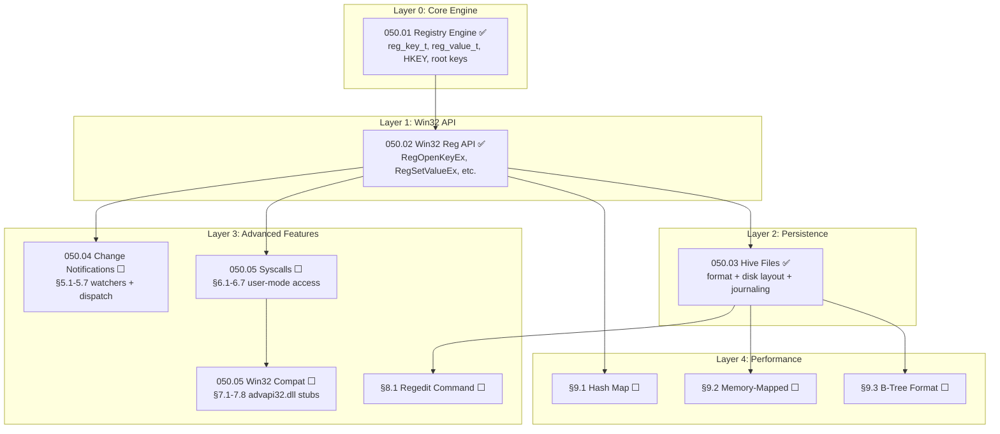

# P0102 — Registry System (Windows-Compatible)

> **Goal:** Replace the Codex registry with a full Windows-compatible **Registry** system
> using the same API surface as Win32 (`RegOpenKeyEx`, `RegSetValueEx`, etc.), the same
> root keys (`HKEY_LOCAL_MACHINE`, `HKEY_CURRENT_USER`, etc.), and the same value types
> (`REG_SZ`, `REG_DWORD`, `REG_BINARY`, etc.). Store registry data in binary hive files
> with crash-safe journaling. Provide a `regedit` shell command for inspection.

> [!CAUTION]
> **Memory Rule:** Use `pmm_alloc_contiguous()` for ALL buffers > 4 KB (hive file buffers, large binary values). `kmalloc` is ONLY for small kernel structs (≤ 4 KB). Violating this crashes the 2 MiB heap silently. See `rules.md` Known Gotchas.

> [!IMPORTANT]
> **Migration complete:** The old Codex system (`codex.c`, `codex.h`) has been deleted.
> All call sites now use the Registry API. The disk format uses `.hive` binary files
> with crash-safe journaling (WAJ).

---

## TODO Completion Roadmap (Cross-File)

> | File                               | Scope                                                                          |
> | ---------------------------------- | ------------------------------------------------------------------------------ |
> | `TODO-050-Registry.md`             | Master file — roadmap, priorities, OS comparison, regedit, performance          |
> | `TODO-050.01-Registry-Engine.md`   | Core engine: `reg_key_t`, `reg_value_t`, `HKEY`, pools, value types, root keys |
> | `TODO-050.02-Win32-Reg-API.md`     | Win32 API: key/value operations, enumeration, convenience helpers              |
> | `TODO-050.03-Hive.md`              | Hive persistence: format, disk layout, crash-safe journaling                   |
> | `TODO-050.04-Notification.md`      | Change notifications: watchers, dispatch, coalescing, telemetry                |
> | `TODO-050.05-Syscalls.md`          | Syscalls, user-mode library, advapi32.dll, HKCR, virtualization, .reg          |

### Dependency Graph

### Phase-by-Phase Implementation Order

| ⭐ | Phase | TODO File                   | Section(s)        | What It Delivers                                      | Depends On          | Status |
| -- | :---: | --------------------------- | ----------------- | ----------------------------------------------------- | ------------------- | :----: |
| 💎 | **0** | `050.01-Registry-Engine.md` | §1.1–1.3          | `reg_key_t`, `reg_value_t`, pools, FNV-1a, root keys  | —                   |   ✅   |
| 💎 | **1** | `050.02-Win32-Reg-API.md`   | §2.1–2.9          | `RegOpenKeyEx`, `RegSetValueEx`, enum, helpers         | Phase 0 (050.01)    |   ✅   |
| 💎 | **2** | `050.03-Hive.md`            | §4.1–4.3          | Hive format, disk layout, crash-safe journaling        | Phase 1 (050.02)    |   ✅   |
| 💎 | **3** | `050.04-Notification.md`    | §5.1–5.5          | Watchers, dispatch, subtree, lifecycle                 | Phase 1 (050.02)    |   ⬜   |
| 💎 | **3** | `050.05-Syscalls.md`        | §6.1–6.3          | Syscalls, pointer validation, access control           | Phase 1 (050.02)    |   ⬜   |
| 💎 | **3** | `050-Registry.md`           | §8.1              | `regedit` shell command                                | Phase 2 (050.03)    |   ⬜   |
| 💎 | **4** | `050.05-Syscalls.md`        | §6.4, §7.1, §7.6  | User-mode lib, advapi32.dll stubs, error map           | Phase 3 (§6.1–6.3)  |   ⬜   |
| 💎 | **5** | `050.05-Syscalls.md`        | §7.2–7.3          | UTF-16 A/W handling, HKCR merged view                  | Phase 4 (§7.1)      |   ⬜   |
| 💎 | **5** | `050.05-Syscalls.md`        | §7.4–7.5          | Registry virtualization, .reg import/export            | Phase 4 (§7.1)      |   ⬜   |
| ⭐ | **6** | `050.04-Notification.md`    | §5.6–5.7          | Batch coalescing 🚀, telemetry 🚀                     | Phase 3 (§5.3)      |   ⬜   |
| ⭐ | **6** | `050.05-Syscalls.md`        | §6.5–6.7          | Sandbox 🚀, rate limit 🚀, audit 🚀                   | Phase 3 (§6.3)      |   ⬜   |
| ⭐ | **6** | `050.05-Syscalls.md`        | §7.7–7.8          | API tracing 🚀, app shims 🚀                          | Phase 4 (§7.1)      |   ⬜   |
| 🔵 | **7** | `050-Registry.md`           | §9.1              | O(1) hash map child lookup                             | Phase 1 (050.02)    |   ⬜   |
| 🔵 | **7** | `050-Registry.md`           | §9.2              | Memory-mapped hives (zero-copy)                        | Phase 2 (050.03)    |   ⬜   |
| 🔵 | **7** | `050-Registry.md`           | §9.3              | B-tree cell format (NT compat)                         | Phase 2 (050.03)    |   ⬜   |

> [!NOTE]
> **Phases 0–2 are complete.** The core engine (050.01), Win32 API (050.02), and disk
> persistence with crash-safe journaling (050.03) are all implemented and verified.
>
> **Phase 3** delivers three independent features: change notifications (050.04),
> user-mode syscalls (050.05 §6), and the regedit shell command (§8.1). These can
> be implemented in any order.
>
> **Phase 4** builds the Win32 compatibility layer on top of the syscalls: user-mode
> library, advapi32.dll A-variant stubs, and error code mapping.
>
> **Phase 5** adds full Unicode (W variants), the HKCR merged view for file
> associations, registry virtualization (Vista+), and .reg file import/export.
>
> **Phase 6** adds exclusive features across both sub-files: notification coalescing,
> watcher telemetry, per-process sandbox, rate limiting, audit log, API tracing,
> and app compat shims.
>
> **Phase 7** contains stretch performance goals: hash map, mmap, B-tree.

---

## 3. Disk Persistence (Hive Files)

> **→ See [TODO-050.03-Hive.md](TODO-050-Registry/TODO-050.03-Hive.md)** ✅
>
> Covers: §4.1 Hive File Format, §4.2 Disk Layout, §4.3 Crash-Safe Journaling.
> All sections complete.

---

## 4. Change Notifications

> **→ See [TODO-050.04-Notification.md](TODO-050-Registry/TODO-050.04-Notification.md)** ⬜
>
> Covers: §5.1 Watcher Data Structures, §5.2 RegNotifyChangeKeyValue, §5.3 Dispatch,
> §5.4 Subtree Watching, §5.5 Lifecycle, §5.6 Batch Coalescing 🚀, §5.7 Telemetry 🚀.
> Not yet started.

---

## 5. Syscalls & Win32 Compatibility

> **→ See [TODO-050.05-Syscalls.md](TODO-050-Registry/TODO-050.05-Syscalls.md)** ⬜
>
> Covers: §6.1 Syscall Numbers, §6.2 Pointer Validation, §6.3 Access Control,
> §6.4 User-Mode Library, §7.1 advapi32.dll Stubs, §7.2 UTF-16 Handling,
> §7.3 HKCR Merged View, §7.4 Registry Virtualization, §7.5 .reg Import/Export,
> §7.6 Error Mapping, §6.5 Per-Process Sandbox 🚀, §6.6 Rate Limiting 🚀,
> §6.7 Audit Log 🚀, §7.7 API Call Tracing 🚀, §7.8 App Compat Shims 🚀.
> Not yet started.

---

## 8. Tools & Debugging

### 8.1 Regedit Shell Command

**Prompt:** Add a `regedit` shell command for inspecting and modifying the registry from the command line. Subcommands: `regedit list HKLM\SYSTEM` (list sub-keys), `regedit query HKLM\SYSTEM\Display Width` (read a value), `regedit set HKLM\SYSTEM\Display Width REG_DWORD 1920` (write a value), `regedit delete HKLM\SYSTEM\OldKey` (delete a key), `regedit export HKLM\SYSTEM output.reg` (export as text), `regedit tree HKLM` (show full tree). After completing all items, mark every item as `[x]`, update this prompt to a verification prompt that can be used for future correctness checks, run `bash scripts/build.sh clean`, and commit as `"shell: regedit command"`. Add notes, gotchas, and design decisions directly in this TODO section covering the regedit command syntax, subcommands, and .reg export format.

- [ ] `regedit list <path>` — list sub-keys and values
- [ ] `regedit query <path> <valueName>` — read and display a value
- [ ] `regedit set <path> <valueName> <type> <data>` — write a value
- [ ] `regedit delete <path>` — delete a key or value
- [ ] `regedit tree <path>` — recursive tree display
- [ ] `regedit export <path> <file>` — export sub-tree as `.reg` text file
- [ ] Commit: `"shell: regedit command"`

---

## 9. Performance Optimizations (Future)

### 9.1 Hash Map Child Lookup

- [ ] Replace linked-list children with FNV-1a hash map
- [ ] Target: O(1) key lookup instead of O(n) linear scan
- [ ] Resize hash table when load factor exceeds 0.75

### 9.2 Memory-Mapped Hive Files

- [ ] `mmap` hive files directly (requires Phase 01 §3.2 mmap)
- [ ] Zero-copy reads — keys/values point directly into mapped pages
- [ ] Dirty page tracking — only write changed pages on flush

### 9.3 B-Tree Cell Format

- [ ] Replace flat sequential format with B-tree bins and cells
- [ ] Random-access reads without loading entire hive into RAM
- [ ] Matches Windows NT hive internals for maximum compatibility

---

## Priority Order

| Priority | TODO File / Section                              | Description                                                      |
| -------- | ------------------------------------------------ | ---------------------------------------------------------------- |
| ✅ Done  | `050.01` §1.1 Data Structures                    | Registry engine foundation                                       |
| ✅ Done  | `050.01` §1.2 Value Types                        | All REG_* types                                                  |
| ✅ Done  | `050.01` §1.3 Root Keys                          | HKLM, HKCU, HKU, HKCR                                           |
| ✅ Done  | `050.02` §2.1 Key Operations                     | Core API: open, create, close, delete                            |
| ✅ Done  | `050.02` §2.2 Value Operations                   | Core API: get, set, delete values                                |
| ✅ Done  | `050.02` §2.3 Enumeration                        | Needed for regedit + iteration                                   |
| ✅ Done  | `050.02` §2.4 Convenience Helpers                | Simplify common access patterns                                  |
| ✅ Done  | `050.03` §4.1 Hive File Format                   | Binary disk persistence                                         |
| ✅ Done  | `050.03` §4.2 Disk Layout                        | File paths + auto-flush                                          |
| ✅ Done  | `050.03` §4.3 Crash-Safe Journaling              | Power-loss protection                                            |
| 🟡 P2   | `050.04` §5.1–5.5 Change Notifications           | Real-time settings updates                                       |
| 🟡 P2   | `050.05` §6.1–6.3 Syscalls + Access Control      | User-mode app access                                             |
| 🟡 P2   | `050-Registry` §8.1 Regedit Command              | Debugging + inspection                                           |
| 🟡 P2   | `050.05` §6.4, §7.1, §7.6 User Lib + Stubs      | advapi32.dll A-variant + error mapping                           |
| 🟡 P2   | `050.05` §7.2–7.3 UTF-16 + HKCR                  | Full Unicode, HKCR merged view                                   |
| 🟢 P3   | `050.05` §7.4–7.5 Virtualization + .reg           | Vista-style HKLM→HKCU redirect, .reg import/export              |
| 🟢 P3   | `050.04` §5.6–5.7 Coalescing + Telemetry         | 🚀 **Exclusive** — batch dedup + watcher stats                   |
| 🟢 P3   | `050.05` §6.5–6.7 Sandbox + Rate + Audit         | 🚀 **Exclusive** — per-PID HKCU, throttle, ring-buffer audit     |
| 🟢 P3   | `050.05` §7.7–7.8 Tracing + Shims                | 🚀 **Exclusive** — API call tracing, app compat shimming         |
| 🔵 P4   | `050-Registry` §9.1 Hash Map Lookup              | O(1) performance                                                 |
| 🔵 P4   | `050-Registry` §9.2 Memory-Mapped Hives          | Zero-copy reads                                                  |
| 🔵 P4   | `050-Registry` §9.3 B-Tree Format                | Windows NT hive compat                                           |

---

## OS Comparison

| Feature                                    | 🪟 Windows 11                                | 🐧 Linux                                     | 🚀 Impossible OS                                          |
| ------------------------------------------ | -------------------------------------------- | --------------------------------------------- | --------------------------------------------------------- |
| Hierarchical key/value store               | ✅ Full tree                                  | ✅ dconf (GNOME), ini files                    | ✅ `050.01` — HKLM/HKCU/HKCR tree                         |
| Typed values (DWORD, SZ, BINARY...)        | ✅ Full Win32 types                           | ⚠️ Only strings (dconf has GVariant)           | ✅ `050.01` — All REG_* types                              |
| Win32 API (`RegOpenKeyEx`...)              | ✅ Native                                     | ❌                                             | ✅ `050.02` — Complete native API                          |
| Persistent binary hive files               | ✅ `.hive` format                             | ✅ dconf binary db                             | ✅ `050.03` — 4 KiB header, CRC32                          |
| Crash-safe journaling                      | ✅ Transaction log                            | ⚠️ No fsync guarantee on dconf                | ✅ `050.03` — `.hive.log` WAJ                              |
| Change notifications                       | ✅ `RegNotifyChangeKeyValue`                  | ⚠️ inotify on ini files                       | ⬜ `050.04` P2 — callback-based (no event objects) 🚀      |
| User-mode registry syscalls                | ✅ NtOpenKey, NtSetValueKey                   | ❌ No registry (dconf via D-Bus)               | ⬜ `050.05` §6.1 P2 — `SYS_REG_*` syscalls                |
| advapi32.dll compatibility                 | ✅ Native DLL                                 | ⚠️ Wine reimplements                          | ⬜ `050.05` §7.1 P2 — A/W stubs in builtin table          |
| HKCR merged view                           | ✅ HKCU + HKLM\Classes merged                 | ❌ No concept                                  | ⬜ `050.05` §7.3 P2 — two-level lookup                    |
| `regedit` shell inspection                 | ✅ GUI regedit.exe                            | ✅ `dconf-editor` (GNOME)                      | ⬜ §8.1 P2 — CLI + subcommands                            |
| Registry virtualization (Vista+)           | ✅ VirtualStore under HKCU                    | ❌ No concept                                  | ⬜ `050.05` §7.4 P3 — HKLM → HKCU redirect               |
| .reg file import/export                    | ✅ Registry Editor built-in                   | ⚠️ Wine `regedit` tool                        | ⬜ `050.05` §7.5 P3 — full v5.00 format                   |
| **Batch notification coalescing**          | ❌ Fires once per change                      | ❌ No coalescing                               | ⬜ `050.04` §5.6 P3 — **timer-based dedup** 🚀            |
| **Per-process registry sandbox**           | ❌ HKCU shared among all processes            | ❌ No concept                                  | ⬜ `050.05` §6.5 P3 — **per-PID HKCU** 🚀                |
| **Syscall rate limiting**                  | ❌ No rate limit                              | ❌ No rate limit                               | ⬜ `050.05` §6.6 P3 — **configurable throttle** 🚀       |
| **Built-in API call tracing**              | ❌ Requires Process Monitor / ETW             | ❌ No registry concept                         | ⬜ `050.05` §7.7 P3 — **on/off toggle** 🚀               |
| **Registry-based app compat shims**        | ⚠️ ACT + SDB files (binary)                   | ❌ No concept                                  | ⬜ `050.05` §7.8 P4 — **editable via Registry** 🚀       |
| **Static pool allocation (no malloc)**     | ❌ Dynamic allocation                         | ❌ Dynamic allocation                          | ✅ `050.01` — **zero heap pressure** 🚀                    |
| **In-kernel WAJ (not user-space)**         | ✅ Kernel-level                               | ❌ dconf runs in user-space                    | ✅ `050.03` — **kernel WAJ, zero daemon** 🚀              |

> **After Phases 0–2 (✅):** Impossible OS matches Windows feature-for-feature on core
> registry, API, persistence, and crash safety. Exceeds Linux with native in-kernel typed store.
> **After Phase 3–5:** Full parity with Windows — change notifications, user-mode access,
> advapi32.dll A/W stubs, HKCR, virtualization, regedit, .reg import/export.
> **After Phase 6 exclusive features:** Exceeds both — notification coalescing, per-process
> sandbox, rate limiting, audit log, API tracing, app compat shims.
> **After Phase 7:** Performance-optimized with mmap and B-tree (Windows NT hive compat).
