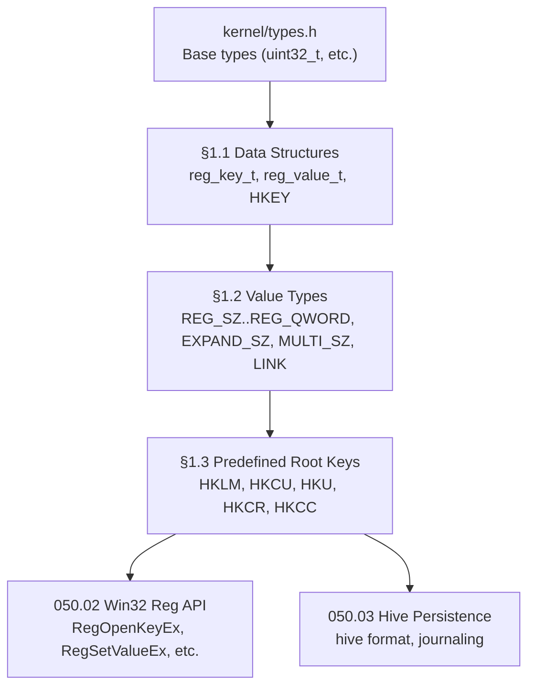

# 050.01-Registry-Engine — Core Registry Engine

> **Goal:** Implement the foundational in-memory registry engine with Win32-compatible data
> structures (`reg_key_t`, `reg_value_t`, `HKEY`), all standard value types (`REG_SZ` through
> `REG_QWORD`), and the predefined root key hierarchy (`HKLM`, `HKCU`, `HKU`, `HKCR`, `HKCC`).
> This provides the core tree structure, FNV-1a hash-based child lookup, static pool allocation,
> and type-aware value storage that all higher-level registry operations depend on.
> All 3 sections are complete — this file serves as a verified reference.

> [!CAUTION]
> **Memory Rule:** Registry pools use static arrays (`reg_key_pool[512]`, `reg_value_pool[1024]`).
> No dynamic allocation via `kmalloc` — all keys and values come from the pool.

> [!IMPORTANT]
> **Spec Reference:** Data structures and value types follow the Win32 Registry API specification.
> Predefined handles use sentinel addresses `0x80000000`–`0x80000004`.

---

### Dependency Graph

### Phase-by-Phase Implementation Order

| ⭐ | Phase | Section                       | Description                                                             | Depends On     | Status |
| -- | :---: | ----------------------------- | ----------------------------------------------------------------------- | -------------- | :----: |
| 💎 | **1** | §1.1 Registry Data Structures | `reg_key_t`, `reg_value_t`, `HKEY`, static pools, FNV-1a hash           | —              |   ✅   |
| 💎 | **2** | §1.2 Value Types              | `REG_SZ`..`REG_QWORD`, `EXPAND_SZ`, `MULTI_SZ`, `REG_LINK` redirection | Phase 1 (§1.1) |   ✅   |
| 💎 | **3** | §1.3 Predefined Root Keys     | HKLM, HKCU, HKU, HKCR, HKCC + default sub-keys + redirection          | Phase 2 (§1.2) |   ✅   |

> [!NOTE]
> **All phases complete.** The core registry engine is fully implemented and verified.
> §1.1–1.3 were committed as 3 separate commits building on each other.
>
> **Phase 1** established the memory model: static pools (`512` keys, `1024` values),
> FNV-1a hash-based child lookup (16 buckets per key), and the `HKEY` handle type.
>
> **Phase 2** added all Win32 value types with type-aware helpers (`reg_expand_sz`,
> `reg_multi_sz_count/get/pack`, `reg_key_is_link/get_link_target`).
>
> **Phase 3** created the predefined root hierarchy and redirect logic (HKCU → `HKU\{user}`,
> HKCR → `HKLM\SOFTWARE\Classes`).

> [!TIP]
> **Downstream consumers:** The Win32 API layer (050.02), hive persistence (050.03),
> change notifications (050.04), and syscalls (050.05) all depend on this engine.
>
> **Pool sizing:** 512 keys / 1024 values is sufficient for current use. If pool exhaustion
> occurs, increase `REG_KEY_POOL_SIZE` / `REG_VALUE_POOL_SIZE` in `registry.h`.
>
> **Case insensitivity:** All key lookups use `reg_fnv1a()` with case-folding (ORing 0x20
> on ASCII alpha bytes). Same behavior as Windows NTFS / Registry.

---

## 1. Core Data Structures

### 1.1 Registry Data Structures *(done)* ✅

**Prompt:** Verify the correctness and consistency of the Registry core data structures (commit `d44a791`). Confirm that `include/registry.h` defines `reg_key_t` with a 256-char name, parent pointer, 16-bucket FNV-1a child hash map (`children[REG_CHILD_BUCKETS]`), `hash_next` collision chain, `child_count`, `values` linked list, `value_count`, `last_write_time`, and `flags`. Confirm `reg_value_t` has a 256-char name, `type` (uint32_t), `data[REG_MAX_VALUE_SIZE]` buffer, `data_size`, and `next` pointer. Confirm `HKEY` is defined as `reg_handle_t*` wrapping `reg_key_t*` + access mode, and that `HKEY_LOCAL_MACHINE` through `HKEY_CURRENT_CONFIG` use sentinel addresses `0x80000000`–`0x80000004`. Confirm `src/kernel/registry.c` defines static pools `reg_key_pool[512]` and `reg_value_pool[1024]`, FNV-1a hash function (`reg_fnv1a`) with case-insensitive folding, pool allocators `reg_alloc_key`/`reg_alloc_value`, `reg_resolve_predefined()` mapping, and `registry_init()` creating all 5 root keys. Run `bash scripts/build.sh clean` and confirm zero warnings.

> [!NOTE]
> **Implementation Notes:**
> - `reg_key_t` uses 16-bucket FNV-1a hash map for O(1) child lookup (collision chaining via `hash_next`)
> - Static pools avoid dynamic allocation — no `kmalloc` dependency
> - Sentinel `HKEY` addresses (`0x80000000`–`0x80000004`) match Windows predefined handle values
> - `reg_fnv1a()` folds case by ORing 0x20 on ASCII upper (A–Z) — same as Windows NTFS

- [x] Define `reg_key_t` struct:
  - [x] `name[256]` — key name
  - [x] `parent` pointer — parent key
  - [x] `children` — hash map of child keys (FNV-1a hash → `reg_key_t*`)
  - [x] `child_count` — number of child keys
  - [x] `values` — linked list of `reg_value_t`
  - [x] `value_count` — number of values
  - [x] `last_write_time` — timestamp of last modification
  - [x] `flags` — access control flags
- [x] Define `reg_value_t` struct:
  - [x] `name[256]` — value name (empty string = default value)
  - [x] `type` — `REG_*` type code
  - [x] `data[REGISTRY_MAX_VALUE_SIZE]` — value data buffer
  - [x] `data_size` — actual bytes used
  - [x] `next` — linked list pointer
- [x] Define `HKEY` as opaque handle type (internally: pointer + access mode)
- [x] Define static pools: `key_pool[512]`, `value_pool[1024]`
- [x] Commit: `"registry: core data structures"` (`d44a791`)

---

## 2. Value Types

### 1.2 Value Types *(done)* ✅

**Prompt:** Verify the Registry value type implementation (commit `4315658`). Confirm `registry.h` defines all Win32 type constants (`REG_NONE=0`, `REG_SZ=1`, `REG_EXPAND_SZ=2`, `REG_BINARY=3`, `REG_DWORD=4`, `REG_DWORD_BIG_ENDIAN=5`, `REG_LINK=6`, `REG_MULTI_SZ=7`, `REG_QWORD=11`) plus alias `REG_DWORD_LITTLE_ENDIAN`. Confirm `REG_FLAG_LINK=0x04` flag defined for symbolic link keys. Confirm declarations for: `reg_type_name()`, `reg_expand_sz()`, `reg_multi_sz_count/get/pack()`, `reg_key_is_link()`, `reg_key_get_link_target()`. In `registry.c`, verify `reg_expand_sz()` parses `%VAR%` tokens and looks up values under `HKLM\System\Environment` via case-insensitive tree walk. Verify `reg_multi_sz_count()` counts strings by scanning for nulls with double-null termination. Verify `reg_multi_sz_get()` returns the Nth string by index. Verify `reg_multi_sz_pack()` packs an array of C strings into double-null format. Verify `reg_key_is_link()` checks `REG_FLAG_LINK` and `reg_key_get_link_target()` finds the unnamed `REG_LINK` value. Run `bash scripts/build.sh clean` and confirm zero warnings.

> [!NOTE]
> **Implementation Notes:**
> - `reg_expand_sz()` resolves `%VAR%` from `HKLM\System\Environment` — not from process env
> - `REG_MULTI_SZ` uses double-null termination: `"str1\0str2\0\0"`
> - `REG_LINK` enables transparent key redirection — used by HKCU → HKU mapping
> - `REG_DWORD_LITTLE_ENDIAN` is an alias for `REG_DWORD` (Windows compat)

- [x] Define type constants matching Windows:
  - [x] `REG_NONE        = 0`
  - [x] `REG_SZ          = 1` — null-terminated string
  - [x] `REG_EXPAND_SZ   = 2` — string with `%VAR%` expansion
  - [x] `REG_BINARY      = 3` — raw binary data
  - [x] `REG_DWORD       = 4` — 32-bit integer (little-endian)
  - [x] `REG_MULTI_SZ    = 7` — double-null-terminated string array
  - [x] `REG_QWORD       = 11` — 64-bit integer
  - [x] `REG_LINK        = 6` — symbolic link to another key
- [x] Implement `REG_EXPAND_SZ` expansion (resolve `%PATH%` etc. on read)
- [x] Implement `REG_MULTI_SZ` pack/unpack helpers
- [x] Implement `REG_LINK` transparent redirection on `RegOpenKeyEx`
- [x] Commit: `"registry: value types"` (`4315658`)

---

## 3. Predefined Root Keys

### 1.3 Predefined Root Keys *(done)* ✅

**Prompt:** Verify the predefined root key implementation (commit `d75dbf9`). Confirm `registry_init()` creates 5 root keys (HKLM, HKCU, HKCR, HKU, HKCC) and sets `REG_FLAG_HKCU_REDIRECT` on HKCU and `REG_FLAG_HKCR_MERGED` on HKCR. Confirm default sub-keys: `HKLM\SYSTEM`, `HKLM\SOFTWARE`, `HKLM\HARDWARE`, `HKLM\SOFTWARE\Classes`, `HKU\Default`. Verify `reg_add_child()` inserts via FNV-1a bucket, `reg_find_child()` does case-insensitive lookup, `reg_create_child()` returns existing or allocates new. Verify `reg_set_current_user()` stores username, `reg_resolve_hkcu()` returns `HKU\{user}` (auto-creates if missing), `reg_resolve_hkcr()` returns `HKLM\SOFTWARE\Classes`. Verify boot log shows `Registry initialized (pool: X/512 keys, 0/1024 values)`. Run `bash scripts/build.sh clean` and confirm zero warnings.

> [!NOTE]
> **Implementation Notes:**
> - HKCU redirects to `HKU\{username}` — auto-created on first access if missing
> - HKCR is a merged view of `HKLM\SOFTWARE\Classes` (writes go to HKLM)
> - Default sub-keys created at boot: SYSTEM, SOFTWARE, HARDWARE under HKLM; Default under HKU
> - Boot log confirms pool usage: `Registry initialized (pool: X/512 keys, 0/1024 values)`

- [x] Create predefined root key handles:
  - [x] `HKEY_LOCAL_MACHINE` (HKLM) — system-wide config
  - [x] `HKEY_CURRENT_USER` (HKCU) — current user (redirects to HKU\{user})
  - [x] `HKEY_USERS` (HKU) — all user profiles
  - [x] `HKEY_CLASSES_ROOT` (HKCR) — merged file associations view
  - [x] `HKEY_CURRENT_CONFIG` (HKCC) — current hardware profile
- [x] Create default sub-keys under HKLM:
  - [x] `HKLM\SYSTEM` — boot config, drivers, services
  - [x] `HKLM\SOFTWARE` — installed software settings
  - [x] `HKLM\HARDWARE` — detected hardware info
- [x] Create default user profile: `HKU\Default`
- [x] Implement HKCU → HKU\{username} redirection
- [x] Implement HKCR merged view (HKLM\SOFTWARE\Classes + HKCU\SOFTWARE\Classes)
- [x] Commit: `"registry: root keys (HKLM, HKCU, HKU, HKCR)"` (`d75dbf9`)

---

## Priority Order

| Priority | Section                   | Description                                             |
| -------- | ------------------------- | ------------------------------------------------------- |
| ✅ Done  | §1.1 Data Structures      | Foundation: `reg_key_t`, `reg_value_t`, pools, hash     |
| ✅ Done  | §1.2 Value Types          | All `REG_*` types + helpers (EXPAND_SZ, MULTI_SZ, LINK) |
| ✅ Done  | §1.3 Predefined Root Keys | HKLM, HKCU, HKU, HKCR, HKCC hierarchy + redirection    |

> All items are ✅ complete.

---

## OS Comparison

| Feature                            | 🪟 Windows 11                   | 🐧 Linux                          | 🚀 Impossible OS                                  |
| ---------------------------------- | ------------------------------- | ---------------------------------- | ------------------------------------------------- |
| Hierarchical key/value store       | ✅ Full tree (NT hive format)    | ✅ dconf (GNOME), sysctl flat files | ✅ §1.1 — FNV-1a hash tree, static pools           |
| Typed values (DWORD, SZ, BINARY)   | ✅ Full Win32 types              | ⚠️ Strings only (dconf: GVariant)  | ✅ §1.2 — All `REG_*` types                        |
| Predefined root keys (HKLM, HKCU) | ✅ Sentinel handles              | ❌ No concept                       | ✅ §1.3 — Same sentinel addresses                  |
| Per-user hive redirection (HKCU)   | ✅ HKCU → NTUser.dat             | ✅ Per-user home dir (XDG)          | ✅ §1.3 — HKCU → `HKU\{user}` auto-create         |
| Merged class root (HKCR)           | ✅ Machine + user classes merged | ❌ No concept                       | ✅ §1.3 — `HKLM\SOFTWARE\Classes` merge            |
| `REG_EXPAND_SZ` resolution         | ✅ `ExpandEnvironmentStrings()`  | ❌ Shell $VAR only                  | ✅ §1.2 — `%VAR%` from `HKLM\System\Environment`  |
| `REG_MULTI_SZ` pack/unpack         | ✅ Double-null terminated        | ❌ No equivalent                    | ✅ §1.2 — count/get/pack helpers                   |
| `REG_LINK` symbolic keys           | ✅ Transparent redirection       | ❌ No concept                       | ✅ §1.2 — flag-based + unnamed value lookup        |
| Case-insensitive key lookup        | ✅ NTFS-style folding            | ❌ Case-sensitive paths             | ✅ §1.1 — FNV-1a with 0x20 case fold              |
| **Static pool allocation**         | ❌ Dynamic allocation            | ❌ Dynamic allocation               | ✅ **§1.1 — Zero heap pressure** 🚀                |

> **Current state:** Impossible OS matches Windows feature-for-feature on core registry engine
> capabilities. The static pool allocation model provides a competitive advantage over both
> Windows and Linux by eliminating heap pressure and allocation failures during boot.
