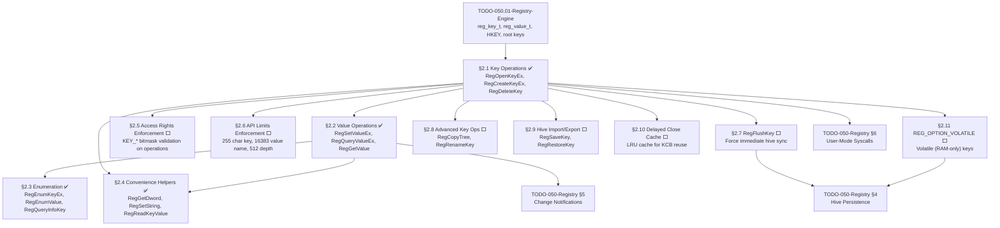

# 050.02-Win32-Reg-API — Win32-Compatible Registry API

> **Goal:** Implement the full Win32-compatible Registry API surface: key operations
> (`RegOpenKeyEx`, `RegCreateKeyEx`, `RegCloseKey`, `RegDeleteKey`, `RegDeleteTree`),
> value operations (`RegSetValueEx`, `RegQueryValueEx`, `RegGetValue`, `RegDeleteValue`),
> enumeration (`RegEnumKeyEx`, `RegEnumValue`, `RegQueryInfoKey`), typed convenience
> helpers (`RegGetDword`, `RegSetString`, `RegReadKeyValue`), and advanced APIs
> (`RegFlushKey`, `RegCopyTree`, `RegRenameKey`, `RegSaveKey`, `RegRestoreKey`).
> Uses handle pool allocation, backslash path walking with `REG_LINK` following,
> Win32 error codes, and access rights enforcement.

> [!IMPORTANT]
> **Prerequisite:** Depends on [TODO-050.01-Registry-Engine.md](TODO-050.01-Registry-Engine.md)
> (§1 Core Registry Engine) which provides `reg_key_t`, `reg_value_t`, `HKEY`, static pools,
> FNV-1a hash, and predefined root keys.

> [!IMPORTANT]
> **Spec Reference:** API signatures, error codes, access rights bitmasks, and behavioral
> semantics follow the Win32 Registry API specification (advapi32.dll, Windows 11).
> All `KEY_*` access rights, `ERROR_*` codes, and `RRF_*` flags use identical numeric values.

---

### Dependency Graph

### Phase-by-Phase Implementation Order

| ⭐  | Phase  | Section                           | Description                                                              | Depends On      | Status |
| --- | :----: | --------------------------------- | ------------------------------------------------------------------------ | --------------- | :----: |
| 💎  | **0**  | TODO-050.01 Registry Engine       | `reg_key_t`, `reg_value_t`, `HKEY`, pools, root keys                     | —               |   ✅   |
| 💎  | **1**  | §2.1 Key Operations               | `RegOpenKeyEx`, `RegCreateKeyEx`, `RegCloseKey`, `RegDeleteKey/Tree`     | Phase 0         |   ✅   |
| 💎  | **2**  | §2.2 Value Operations             | `RegSetValueEx`, `RegQueryValueEx`, `RegGetValue`, `RegDeleteValue`      | Phase 1 (§2.1)  |   ✅   |
| 💎  | **3**  | §2.3 Enumeration                  | `RegEnumKeyEx`, `RegEnumValue`, `RegQueryInfoKey`                        | Phase 2 (§2.2)  |   ✅   |
| 💎  | **3**  | §2.4 Convenience Helpers          | `RegGetDword`, `RegSetString`, `RegReadKeyValue` (one-shot wrappers)     | Phase 2 (§2.2)  |   ✅   |
| 💎  | **4**  | §2.5 Access Rights Enforcement    | `KEY_*` bitmask validation per Win32 spec §6.1                           | Phase 1 (§2.1)  |   ⬜   |
| 💎  | **4**  | §2.6 API Limits Enforcement       | 255-char key name, 16383-char value name, 512-level depth                | Phase 1 (§2.1)  |   ⬜   |
| 💎  | **4**  | §2.7 RegFlushKey                  | Force immediate hive flush (bypass lazy writer)                          | Phase 1 (§2.1)  |   ⬜   |
| 💎  | **5**  | §2.8 Advanced Key Operations      | `RegCopyTree`, `RegRenameKey` — tree-level manipulations                 | Phase 1 (§2.1)  |   ⬜   |
| 💎  | **5**  | §2.9 Hive Import/Export           | `RegSaveKey`, `RegRestoreKey` — import/export sub-trees                  | Phase 1 (§2.1)  |   ⬜   |
| 💎  | **5**  | §2.11 REG_OPTION_VOLATILE         | RAM-only keys that don't persist across reboot                           | Phase 1 (§2.1)  |   ⬜   |
| ⭐  | **6**  | §2.10 Delayed Close Cache         | LRU cache for KCB reuse on rapid open/close cycles 🚀                   | Phase 1 (§2.1)  |   ⬜   |

> [!NOTE]
> **Phases 0–3 are complete.** The core engine, Win32 API (CRUD + enumeration + helpers),
> are all implemented and verified.
>
> **Phase 4** adds spec-mandated enforcement: access rights validation, API limits, and
> `RegFlushKey`. These harden the API against misuse and match Windows error behavior.
>
> **Phase 5** adds advanced Win32 APIs: `RegCopyTree`/`RegRenameKey` for tree manipulation,
> `RegSaveKey`/`RegRestoreKey` for hive import/export, and `REG_OPTION_VOLATILE` for
> RAM-only keys. These are needed for full Win32 compatibility.
>
> **Phase 6** adds the exclusive Delayed Close Cache — an LRU cache that avoids reallocating
> Key Control Blocks for keys that are rapidly opened and closed. Windows has this in the
> Configuration Manager; Linux has no equivalent.

> [!TIP]
> **Handle pool sizing:** `REG_HANDLE_POOL_SIZE=128` is sufficient for current use.
> Predefined handles (`HKEY_LOCAL_MACHINE`, etc.) bypass the pool entirely.
>
> **Error code compatibility:** All error codes match Win32 values exactly —
> `ERROR_SUCCESS=0`, `ERROR_FILE_NOT_FOUND=2`, `ERROR_MORE_DATA=234`, etc.
> Additional codes already defined: `ERROR_OUTOFMEMORY`, `ERROR_INVALID_PARAMETER`,
> `ERROR_KEY_DELETED`.
>
> **Access rights already in header:** `KEY_QUERY_VALUE(0x0001)`, `KEY_SET_VALUE(0x0002)`,
> `KEY_CREATE_SUB_KEY(0x0004)`, `KEY_ENUMERATE_SUB_KEYS(0x0008)`, `KEY_READ(0x20019)`,
> `KEY_ALL_ACCESS(0xF003F)` are defined but not yet enforced in API operations.

---

## 1. Key Operations

### 2.1 Key Operations *(done)* ✅

**Prompt:** Verify the Win32-compatible key operations implementation. Confirm `registry.h` declares `RegOpenKeyEx`, `RegCreateKeyEx`, `RegCloseKey`, `RegDeleteKey`, `RegDeleteTree` with correct Win32 signatures. Confirm `REG_HANDLE_POOL_SIZE=128`, `REG_CREATED_NEW_KEY=1`, `REG_OPENED_EXISTING_KEY=2`. In `registry.c`, verify: handle pool (`reg_handle_pool[128]`, `reg_handle_used[128]`), `reg_alloc_handle`/`reg_free_handle` for handle lifecycle, `reg_is_predefined` checks sentinel range `0x80000000–0x80000005`, `reg_resolve_key` handles HKCU→`reg_resolve_hkcu()` and HKCR→`reg_resolve_hkcr()` redirection. Verify `reg_walk_path` walks backslash-separated paths with `REG_LINK` following. Verify `RegOpenKeyEx` returns `ERROR_FILE_NOT_FOUND` for missing keys. Verify `RegCreateKeyEx` sets disposition and updates `parent->last_write_time`. Verify `RegCloseKey` is no-op for predefined handles. Verify `RegDeleteKey` returns `ERROR_ACCESS_DENIED` if child_count>0. Verify `RegDeleteTree` recursively deletes via `reg_delete_subtree`. Run `bash scripts/build.sh clean` and confirm zero warnings.

> [!NOTE]
> **Implementation Notes:**
> - Handle pool: `reg_handle_pool[128]` + `reg_handle_used[128]` bitmap — no dynamic alloc
> - `reg_is_predefined()` checks sentinel range `0x80000000–0x80000005`
> - `reg_walk_path()` splits on backslash, follows `REG_LINK` at each level
> - `RegDeleteKey` refuses deletion if `child_count > 0` (matches Windows behavior)
> - `RegDeleteTree` uses `reg_delete_subtree()` for recursive depth-first deletion
> - `RegCloseKey` on predefined handles is a no-op (they're sentinels, not pool handles)

- [x] Implement `RegOpenKeyEx(hKey, subKey, options, access, &result)`:
  - [x] Walk backslash-separated path from hKey
  - [x] Handle `REG_LINK` transparent redirection
  - [x] Store access mode in returned handle
  - [x] Return `ERROR_FILE_NOT_FOUND` if key doesn't exist
- [x] Implement `RegCreateKeyEx(hKey, subKey, reserved, class, options, access, security, &result, &disposition)`:
  - [x] Create intermediate keys as needed
  - [x] Set disposition: `REG_CREATED_NEW_KEY` or `REG_OPENED_EXISTING_KEY`
  - [x] Update parent's last-write time
- [x] Implement `RegCloseKey(hKey)` — release handle resources
- [x] Implement `RegDeleteKey(hKey, subKey)` — delete key + values (not children)
- [x] Implement `RegDeleteTree(hKey, subKey)` — recursive delete
- [x] Define error codes:
  - [x] `ERROR_SUCCESS          = 0`
  - [x] `ERROR_FILE_NOT_FOUND   = 2`
  - [x] `ERROR_ACCESS_DENIED    = 5`
  - [x] `ERROR_INVALID_HANDLE   = 6`
  - [x] `ERROR_OUTOFMEMORY      = 14`
  - [x] `ERROR_INVALID_PARAMETER = 87`
  - [x] `ERROR_MORE_DATA        = 234`
  - [x] `ERROR_NO_MORE_ITEMS    = 259`
  - [x] `ERROR_KEY_DELETED      = 1018`
- [x] Commit: `"registry: key operations (open, create, close, delete)"`

---

## 2. Value Operations

### 2.2 Value Operations *(done)* ✅

**Prompt:** Verify the Win32 value operations implementation. Confirm `registry.h` declares `RegSetValueEx`, `RegQueryValueEx`, `RegGetValue`, `RegDeleteValue` with correct Win32 signatures, and `RRF_*` flags (`RRF_RT_REG_SZ`, `RRF_RT_REG_EXPAND_SZ`, `RRF_RT_REG_BINARY`, `RRF_RT_REG_DWORD`, `RRF_RT_REG_QWORD`, `RRF_RT_ANY`, `RRF_NOEXPAND`). In `registry.c`, verify: `reg_find_value_in_key` matches empty name for default values. `RegSetValueEx` creates or updates values, stores data via `reg_memcpy`, updates `last_write_time`. `RegQueryValueEx` returns `ERROR_MORE_DATA` when `*lpcbData < v->data_size`, returns size when `lpData=NULL`. `RegGetValue` walks subkey, filters by `RRF_RT_*` type flags, auto-expands `REG_EXPAND_SZ` via `reg_expand_sz` unless `RRF_NOEXPAND`, sets `*pdwType=REG_SZ` after expansion. `RegDeleteValue` unlinks value from chain and decrements `value_count`. Run `bash scripts/build.sh clean` and confirm zero warnings.

> [!NOTE]
> **Implementation Notes:**
> - `reg_find_value_in_key()` matches empty/NULL name as "(Default)" value
> - `RegSetValueEx` creates value if absent, overwrites if exists, marks hive dirty
> - `RegQueryValueEx` with `lpData=NULL` returns required size only (size query pattern)
> - `RegGetValue` auto-expands `REG_EXPAND_SZ` unless `RRF_NOEXPAND` is set
> - After expansion, `RegGetValue` sets `*pdwType = REG_SZ` (expanded type)
> - `RRF_RT_*` flags filter which types are accepted — mismatch returns `ERROR_UNSUPPORTED_TYPE`

- [x] Implement `RegSetValueEx(hKey, valueName, reserved, type, data, dataSize)`:
  - [x] Create value if it doesn't exist, update if it does
  - [x] Support all `REG_*` types
  - [x] Handle NULL/empty valueName as "(Default)" value
  - [x] Mark hive as dirty
  - [x] Update key's `last_write_time`
- [x] Implement `RegQueryValueEx(hKey, valueName, reserved, &type, data, &dataSize)`:
  - [x] Return `ERROR_MORE_DATA` if buffer too small (set required size)
  - [x] Return `ERROR_FILE_NOT_FOUND` if value doesn't exist
  - [x] If `data` is NULL, just return the required size
- [x] Implement `RegGetValue(hKey, subKey, valueName, flags, &type, data, &dataSize)`:
  - [x] Combines open + query in one call
  - [x] `RRF_RT_REG_SZ` flag: auto-expand `REG_EXPAND_SZ`
  - [x] `RRF_NOEXPAND` flag: return unexpanded string
- [x] Implement `RegDeleteValue(hKey, valueName)` — remove named value
- [x] Commit: `"registry: value operations (get, set, delete)"`

---

## 3. Enumeration

### 2.3 Enumeration *(done)* ✅

**Prompt:** Verify the enumeration implementation. Confirm `registry.h` declares `RegEnumKeyEx`, `RegEnumValue`, `RegQueryInfoKey` with correct Win32 signatures. In `registry.c`, verify `reg_get_child_by_index` scans all 16 hash buckets linearly to map 0-based index to child key. Verify `reg_get_value_by_index` walks the value linked list. Verify `RegEnumKeyEx` returns child name and `last_write_time`, `ERROR_NO_MORE_ITEMS` when index out of range, `ERROR_MORE_DATA` if name buffer too small. Verify `RegEnumValue` returns value name, type, and data with same error handling. Verify `RegQueryInfoKey` returns `child_count`, `value_count`, `last_write_time`, and computes max sub-key name length and max value name/data sizes by iterating. Run `bash scripts/build.sh clean` and confirm zero warnings.

> [!NOTE]
> **Implementation Notes:**
> - `reg_get_child_by_index()` scans all 16 FNV-1a hash buckets linearly — O(n) but simple
> - `reg_get_value_by_index()` walks the linked list to the Nth element
> - Enumeration order is not alphabetical — it follows hash bucket order (matches Windows)
> - `RegQueryInfoKey` computes max lengths by iterating all children/values — no caching

- [x] Implement `RegEnumKeyEx(hKey, index, name, &nameSize, ...)`:
  - [x] Return child key name at given index
  - [x] Return `ERROR_NO_MORE_ITEMS` when index out of range
  - [x] Fill `lastWriteTime` from key metadata
- [x] Implement `RegEnumValue(hKey, index, name, &nameSize, reserved, &type, data, &dataSize)`:
  - [x] Return value name, type, and data at given index
  - [x] Return `ERROR_NO_MORE_ITEMS` when index out of range
  - [x] Return `ERROR_MORE_DATA` if data buffer too small
- [x] Implement `RegQueryInfoKey(hKey, ...)`:
  - [x] Return: sub-key count, max sub-key name length
  - [x] Return: value count, max value name length, max value data size
  - [x] Return: last write time
- [x] Commit: `"registry: enumeration (keys, values, info)"`

---

## 4. Convenience Helpers

### 2.4 Convenience Helpers *(done)* ✅

**Prompt:** Verify the typed convenience helpers. Confirm `registry.h` declares `RegGetDword/RegSetDword`, `RegGetString/RegSetString`, `RegGetQword/RegSetQword`, and `RegReadKeyValue`. In `registry.c`, verify `RegGetDword` calls `RegQueryValueEx` with `sizeof(uint32_t)` and validates `type==REG_DWORD`. Verify `RegGetString` accepts both `REG_SZ` and `REG_EXPAND_SZ`. Verify `RegSetString` includes the null terminator in size (`reg_strlen+1`). Verify `RegReadKeyValue` performs `RegOpenKeyEx` + `RegQueryValueEx` + `RegCloseKey` in sequence, properly closing the handle even on query failure. Run `bash scripts/build.sh clean` and confirm zero warnings.

> [!NOTE]
> **Implementation Notes:**
> - `RegGetDword` validates `type == REG_DWORD` after query — rejects other types
> - `RegGetString` accepts both `REG_SZ` and `REG_EXPAND_SZ` (both are strings)
> - `RegSetString` includes null terminator: `data_size = reg_strlen(str) + 1`
> - `RegReadKeyValue` is a one-shot pattern: open → query → close (always closes, even on error)

- [x] `RegGetDword(hKey, valueName, &value)` — read `REG_DWORD`
- [x] `RegSetDword(hKey, valueName, value)` — write `REG_DWORD`
- [x] `RegGetString(hKey, valueName, buf, bufSize)` — read `REG_SZ`
- [x] `RegSetString(hKey, valueName, str)` — write `REG_SZ`
- [x] `RegGetQword(hKey, valueName, &value)` — read `REG_QWORD`
- [x] `RegSetQword(hKey, valueName, value)` — write `REG_QWORD`
- [x] `RegReadKeyValue(root, path, valueName, type, buf, size)` — one-shot open+read+close
- [x] Commit: `"registry: convenience helpers"`

---

## 5. Access Rights Enforcement

### 2.5 Access Rights Enforcement

**Prompt:** The `KEY_*` access right constants (`KEY_QUERY_VALUE=0x0001`, `KEY_SET_VALUE=0x0002`, `KEY_CREATE_SUB_KEY=0x0004`, `KEY_ENUMERATE_SUB_KEYS=0x0008`, `KEY_READ=0x20019`, `KEY_WRITE=0x20006`, `KEY_ALL_ACCESS=0xF003F`) are already defined in `registry.h` and stored in `reg_handle_t.access`. However, the API functions don't currently enforce them — any handle can perform any operation regardless of the access mask requested at open time. Per Win32 spec §6.1, `RegSetValueEx` must check for `KEY_SET_VALUE`, `RegQueryValueEx` for `KEY_QUERY_VALUE`, `RegCreateKeyEx` for `KEY_CREATE_SUB_KEY`, and `RegEnumKeyEx` for `KEY_ENUMERATE_SUB_KEYS`. Return `ERROR_ACCESS_DENIED` if the handle's stored access mask doesn't include the required bits. After completing all items, mark every item as `[x]`, update this prompt to a verification prompt, run `bash scripts/build.sh clean`, and commit as `"registry: access rights enforcement"`. Add notes directly in this TODO section. After implementation, save any gotchas, solutions, and important information to MCP memory.

> [!IMPORTANT]
> → XREF: Win32 spec §6.1 — Access rights bitmask table defines all `KEY_*` constants.
> The constants are defined in `registry.h` but enforcement is not yet active.

- [ ] Add `reg_check_access(HKEY hKey, uint32_t required)` helper:
  - [ ] Extract `access` field from `reg_handle_t`
  - [ ] Check `(handle->access & required) == required`
  - [ ] Bypass for predefined handles (always allow)
  - [ ] Return `ERROR_ACCESS_DENIED` on mismatch
- [ ] Enforce in `RegQueryValueEx` — require `KEY_QUERY_VALUE`
- [ ] Enforce in `RegSetValueEx` — require `KEY_SET_VALUE`
- [ ] Enforce in `RegCreateKeyEx` — require `KEY_CREATE_SUB_KEY`
- [ ] Enforce in `RegDeleteKey` — require `KEY_SET_VALUE` (matches Windows)
- [ ] Enforce in `RegEnumKeyEx` — require `KEY_ENUMERATE_SUB_KEYS`
- [ ] Enforce in `RegEnumValue` — require `KEY_QUERY_VALUE`
- [ ] Verify: open with `KEY_READ`, attempt `RegSetValueEx` → `ERROR_ACCESS_DENIED`
- [ ] Commit: `"registry: access rights enforcement"`

---

## 6. API Limits Enforcement

### 2.6 API Limits Enforcement

**Prompt:** The Win32 registry specification mandates strict limits on key names (255 characters), value names (16,383 characters), and tree depth (512 levels, max 32 new levels per API call). The constants `REG_MAX_KEY_NAME` and `REG_MAX_VALUE_NAME` are already defined in `registry.h`, but `RegCreateKeyEx` does not currently validate path segment lengths or enforce depth limits. Add validation to `RegCreateKeyEx`, `RegOpenKeyEx`, `RegSetValueEx`, and `RegEnumKeyEx` to return `ERROR_INVALID_PARAMETER` or `ERROR_BUFFER_OVERFLOW` when limits are exceeded. After completing all items, mark every item as `[x]`, update this prompt to a verification prompt, run `bash scripts/build.sh clean`, and commit as `"registry: API limits enforcement"`. Add notes directly in this TODO section.

> [!IMPORTANT]
> → XREF: Win32 spec §8.1 — Hardcoded bounds: 255-char key name, 16383-char value name,
> 512-level tree depth, max 32 new levels per single `RegCreateKeyEx` call.

- [ ] Validate key name length in `reg_walk_path()`:
  - [ ] Each backslash-separated segment ≤ `REG_MAX_KEY_NAME` (255)
  - [ ] Return `ERROR_INVALID_PARAMETER` if exceeded
- [ ] Validate value name length in `RegSetValueEx`:
  - [ ] `valueName` length ≤ `REG_MAX_VALUE_NAME` (16,383)
- [ ] Enforce max tree depth in `RegCreateKeyEx`:
  - [ ] Walk parent chain to count current depth
  - [ ] Reject if total depth would exceed 512
  - [ ] Reject if creating > 32 new levels in single call
- [ ] Add `REG_MAX_DEPTH` constant (512) and `REG_MAX_CREATE_DEPTH` (32)
- [ ] Return `ERROR_BUFFER_OVERFLOW` for depth violations
- [ ] Commit: `"registry: API limits enforcement"`

---

## 7. RegFlushKey

### 2.7 RegFlushKey (Forced Flush)

**Prompt:** Implement `RegFlushKey(HKEY hKey)` per Win32 spec §7.1. This forces the lazy writer to immediately synchronize all dirty hive data associated with the given key to disk, bypassing the standard timed flush interval. Internally, identify which hive the key belongs to (by walking the parent chain to a root), then call `hive_save()` for that specific hive. This is critical for applications that need guaranteed persistence (e.g., before power-off, or after writing crash-recovery settings). The existing `registry_flush()` flushes ALL dirty hives — `RegFlushKey` should only flush the ONE hive containing the target key. After completing all items, mark every item as `[x]`, update this prompt to a verification prompt, run `bash scripts/build.sh clean`, and commit as `"registry: RegFlushKey"`. Add notes directly in this TODO section.

- [ ] Declare `RegFlushKey(HKEY hKey)` in `registry.h`
- [ ] Implement in `registry.c`:
  - [ ] Resolve handle → `reg_key_t*`
  - [ ] Walk parent chain to find root key (`parent == NULL`)
  - [ ] Match root key to hive table entry
  - [ ] Call `hive_save()` for that hive only
  - [ ] Return `ERROR_SUCCESS` on success, `ERROR_INVALID_HANDLE` on bad handle
- [ ] Verify: `RegSetDword` + `RegFlushKey` → value persists after simulated crash
- [ ] Commit: `"registry: RegFlushKey"`

---

## 8. Advanced Key Operations

### 2.8 Advanced Key Operations

**Prompt:** Implement `RegCopyTree(HKEY srcKey, const char *srcSubKey, HKEY destKey)` and `RegRenameKey(HKEY hKey, const char *oldSubKey, const char *newSubKey)`. `RegCopyTree` recursively copies all sub-keys and values from a source key to a destination key — needed for profile duplication and settings backup. `RegRenameKey` changes a key's name in-place (updating the parent's hash bucket) — needed for atomic config namespace changes. Windows exposes `RegCopyTree` (Vista+) and `RegRenameKey` (undocumented NtRenameKey via ntdll). After completing all items, mark every item as `[x]`, update this prompt to a verification prompt, run `bash scripts/build.sh clean`, and commit as `"registry: advanced key operations"`. Add notes directly in this TODO section.

- [ ] Implement `RegCopyTree(srcKey, srcSubKey, destKey)`:
  - [ ] Recursively enumerate source sub-keys and values
  - [ ] Create corresponding keys/values under destination
  - [ ] Preserve value types and data
  - [ ] Handle `REG_LINK` keys (copy as regular keys, don't follow)
- [ ] Implement `RegRenameKey(hKey, oldSubKey, newSubKey)`:
  - [ ] Validate new name doesn't conflict with existing sibling
  - [ ] Remove from parent's hash bucket under old name
  - [ ] Update `key->name` to new name
  - [ ] Re-insert into parent's hash bucket under new name
  - [ ] Update `last_write_time` on parent
- [ ] Commit: `"registry: advanced key operations"`

---

## 9. Hive Import/Export

### 2.9 Hive Import/Export

**Prompt:** Implement `RegSaveKey(HKEY hKey, const char *filePath, void *securityAttrs)` and `RegRestoreKey(HKEY hKey, const char *filePath, uint32_t flags)` per Win32 spec §7.1. `RegSaveKey` serializes a sub-tree to a standalone hive file — used by backup tools, `regedit export`, and system recovery. `RegRestoreKey` deserializes a hive file and merges it into an existing key — used by `regedit import` and system restore. These wrap the existing `hive_save`/`hive_load` with per-key scoping. After completing all items, mark every item as `[x]`, update this prompt to a verification prompt, run `bash scripts/build.sh clean`, and commit as `"registry: hive import/export"`. Add notes directly in this TODO section.

- [ ] Implement `RegSaveKey(hKey, filePath, securityAttrs)`:
  - [ ] Resolve handle → `reg_key_t*`
  - [ ] Call `hive_save(key, filePath)` to serialize sub-tree
  - [ ] Return `ERROR_ALREADY_EXISTS` if file already exists (matches Windows)
- [ ] Implement `RegRestoreKey(hKey, filePath, flags)`:
  - [ ] Call `hive_load(filePath, key)` to restore sub-tree
  - [ ] If `REG_WHOLE_HIVE_VOLATILE` flag set, mark loaded keys volatile
  - [ ] If `REG_FORCE_RESTORE` flag set, overwrite existing keys
- [ ] Define `REG_WHOLE_HIVE_VOLATILE (0x01)` and `REG_FORCE_RESTORE (0x08)`
- [ ] Commit: `"registry: hive import/export"`

---

## 10. Delayed Close Cache

### 2.10 Delayed Close Cache 🚀

**Prompt:** Implement a Delayed Close Table per Win32 spec §1.2. When `RegCloseKey` decrements a handle's reference count to zero, instead of immediately deallocating the Key Control Block, transition it to an LRU cache. If the same key path is reopened shortly after (common in config-reading loops), reclaim the cached block without re-walking the path or re-performing hash lookups. Windows implements this in the Configuration Manager to dramatically reduce re-open latency. Neither Linux (dconf) nor most bare-metal OSes implement this optimization. Set the cache size to 64 entries (configurable via `HKLM\SYSTEM\Registry\DelayedCloseSize`). After completing all items, mark every item as `[x]`, update this prompt to a verification prompt, run `bash scripts/build.sh clean`, and commit as `"registry: delayed close cache"`. Add notes directly in this TODO section. After implementation, save any gotchas, solutions, and important information to MCP memory.

> [!NOTE]
> 🚀 **Impossible OS Exclusive:** Registry-configurable delayed close cache size.
> Windows hardcodes the delayed close table size; Impossible OS exposes it as a
> tunable registry parameter under `HKLM\SYSTEM\Registry\DelayedCloseSize`.

- [ ] Define `REG_DELAYED_CLOSE_SIZE` constant (default 64)
- [ ] Add `delayed_close_table[]` — array of `{reg_key_t*, uint64_t timestamp}` entries
- [ ] On `RegCloseKey` (ref count → 0): insert into delayed close table:
  - [ ] If table full, evict oldest (LRU) entry and deallocate it
  - [ ] Store key pointer + close timestamp
- [ ] On `RegOpenKeyEx`: check delayed close table first:
  - [ ] If cache hit: remove from table, allocate handle, return immediately
  - [ ] Skip path walk, hash lookups, and pool allocation
- [ ] Read cache size from `HKLM\SYSTEM\Registry\DelayedCloseSize` at boot
- [ ] Regedit shows cache hit/miss stats: `regedit info --cache`
- [ ] Commit: `"registry: delayed close cache"`

---

## 11. Volatile Keys (REG_OPTION_VOLATILE)

### 2.11 REG_OPTION_VOLATILE

**Prompt:** Implement `REG_OPTION_VOLATILE` support in `RegCreateKeyEx` per Win32 spec §7.1. When a caller passes `dwOptions = REG_OPTION_VOLATILE (0x01)`, the created key is marked with `REG_FLAG_VOLATILE` and stored only in RAM — it is never written to a hive file and is automatically destroyed on reboot. This is used for volatile runtime state (e.g., PnP device presence, session data, transient performance counters). The `REG_FLAG_VOLATILE` flag is already defined in `registry.h`. Add a check in `registry_mark_dirty()` to skip dirty-flagging for volatile keys, and exclude volatile keys from `hive_serialize_key()`. After completing all items, mark every item as `[x]`, update this prompt to a verification prompt, run `bash scripts/build.sh clean`, and commit as `"registry: volatile keys"`. Add notes directly in this TODO section.

> [!IMPORTANT]
> The `REG_FLAG_VOLATILE` flag (value `0x01`) is already defined in `registry.h`.
> This section adds behavioral enforcement of that flag.

- [ ] Define `REG_OPTION_VOLATILE (0x01)` constant in `registry.h`
- [ ] In `RegCreateKeyEx`: if `dwOptions & REG_OPTION_VOLATILE`, set `REG_FLAG_VOLATILE` on key
- [ ] In `registry_mark_dirty()`: skip if key has `REG_FLAG_VOLATILE` (volatile keys never persist)
- [ ] In `hive_serialize_key()`: skip keys with `REG_FLAG_VOLATILE`
- [ ] Windows rule: non-volatile parent cannot have volatile child → enforce or document
- [ ] Verify: volatile key exists after create, disappears after reboot simulation
- [ ] Commit: `"registry: volatile keys"`

---

## Priority Order

| Priority  | Section                                | Description                                                        |
| --------- | -------------------------------------- | ------------------------------------------------------------------ |
| ✅ Done   | §2.1 Key Operations                    | Core API: open, create, close, delete — all callers need this      |
| ✅ Done   | §2.2 Value Operations                  | Core API: get, set, delete values — all callers need this          |
| ✅ Done   | §2.3 Enumeration                       | For `regedit`, iterating keys/values, `RegQueryInfoKey`            |
| ✅ Done   | §2.4 Convenience Helpers               | Simplify common access patterns, reduce boilerplate                |
| 🟠 P1     | §2.5 Access Rights Enforcement         | Correctness: must validate `KEY_*` bits per Win32 spec             |
| 🟠 P1     | §2.6 API Limits Enforcement            | Correctness: prevent 256+ char key names, 513+ depth              |
| 🟡 P2     | §2.7 RegFlushKey                       | Persistence guarantee for critical writes                          |
| 🟡 P2     | §2.11 REG_OPTION_VOLATILE              | Runtime-only keys for transient state                              |
| 🟢 P3     | §2.8 Advanced Key Operations           | `RegCopyTree`, `RegRenameKey` — tree manipulation                  |
| 🟢 P3     | §2.9 Hive Import/Export                | `RegSaveKey`/`RegRestoreKey` — backup/restore                      |
| 🟢 P3     | §2.10 Delayed Close Cache              | 🚀 **Exclusive** — LRU cache for KCB reuse                        |

---

## OS Comparison

| Feature                                   | 🪟 Windows 11                               | 🐧 Linux                                  | 🚀 Impossible OS                                      |
| ----------------------------------------- | ------------------------------------------- | ------------------------------------------ | ----------------------------------------------------- |
| `RegOpenKeyEx` / `RegCreateKeyEx`         | ✅ Native advapi32.dll                       | ❌ No concept                               | ✅ §2.1 — handle pool + path walk + REG_LINK           |
| `RegSetValueEx` / `RegQueryValueEx`       | ✅ Native advapi32.dll                       | ❌ dconf API (different)                     | ✅ §2.2 — full Win32 semantics + RRF flags             |
| `RegGetValue` (combined open+query)       | ✅ Added in Vista                            | ❌ No equivalent                             | ✅ §2.2 — auto-expand EXPAND_SZ, type filter           |
| `RegDeleteKey` / `RegDeleteTree`          | ✅ Native                                    | ❌ `rm -rf` on config files                  | ✅ §2.1 — recursive + access-denied for non-empty      |
| `RegEnumKeyEx` / `RegEnumValue`           | ✅ Native                                    | ❌ `readdir` on config dirs                  | ✅ §2.3 — index-based, correct error codes             |
| `RegQueryInfoKey`                         | ✅ Native                                    | ❌ No equivalent                             | ✅ §2.3 — child/value counts, max lengths              |
| Access rights enforcement (`KEY_*`)       | ✅ Full DACL + ACL evaluation                | ⚠️ Unix permissions only                    | ⬜ §2.5 P1 — `KEY_*` bitmask validation               |
| API limits (255 key, 512 depth)           | ✅ Enforced in CM                            | ❌ No concept                               | ⬜ §2.6 P1 — constants defined, enforcement pending    |
| `RegFlushKey` (forced sync)               | ✅ Bypasses lazy writer                      | ❌ No equivalent                             | ⬜ §2.7 P2 — per-hive flush                           |
| `REG_OPTION_VOLATILE` (RAM-only keys)     | ✅ Volatile storage class                    | ❌ No concept                               | ⬜ §2.11 P2 — flag defined, enforcement pending        |
| `RegCopyTree` / `RegRenameKey`            | ✅ Vista+ / NtRenameKey                      | ❌ No equivalent                             | ⬜ §2.8 P3 — recursive copy + in-place rename          |
| `RegSaveKey` / `RegRestoreKey`            | ✅ Hive export/import                        | ❌ No equivalent                             | ⬜ §2.9 P3 — wraps `hive_save`/`hive_load`             |
| Delayed Close Table (LRU cache)           | ✅ Hardcoded in CM                           | ❌ No implementation                         | ⬜ §2.10 P3 — **configurable cache size** 🚀           |
| Typed helpers (GetDword, SetString)       | ⚠️ Only via raw RegQueryValueEx              | ❌ No concept                               | ✅ §2.4 — `RegGetDword`, `RegSetString` wrappers 🚀    |
| One-shot read (`RegReadKeyValue`)         | ❌ Must open+query+close manually            | ❌ Different API                             | ✅ §2.4 — **single-call pattern** 🚀                   |
| Error codes matching Win32                | ✅ Native                                    | ❌ errno-based                               | ✅ §2.1 — identical values (0, 2, 5, 6, 87, 234, 259) |
| Handle pool (no dynamic alloc)            | ❌ Dynamic kernel object allocation           | ❌ Dynamic allocation                        | ✅ §2.1 — **static pool, zero heap pressure** 🚀       |
| Case-insensitive path walking             | ✅ NTFS-style                                | ❌ Case-sensitive                            | ✅ §2.1 — FNV-1a with 0x20 fold (via Engine §1.1)     |

> **After P0+P1 items:** Impossible OS matches Windows on core API surface + access rights +
> limits enforcement. Exceeds Linux by having a native in-kernel typed registry store.
> **After P2 items:** Adds `RegFlushKey` + volatile keys — parity with Windows advanced features.
> **After P3 exclusive features:** Exceeds Windows with configurable Delayed Close Cache size,
> typed convenience helpers, and one-shot `RegReadKeyValue` pattern.
