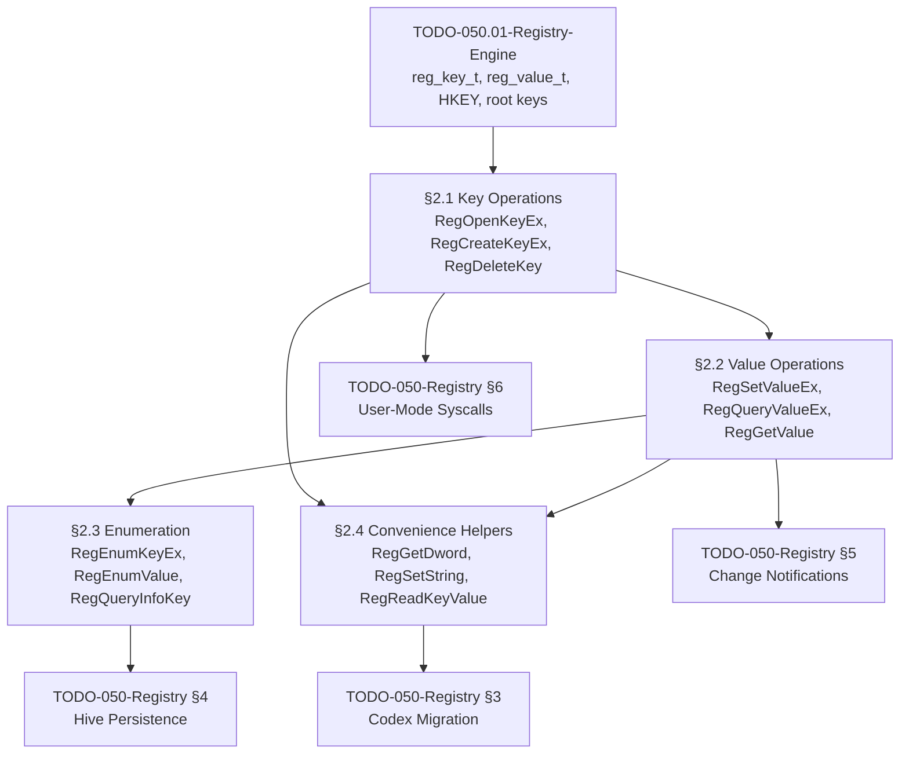

# 050.02-Win32-Reg-API — Win32-Compatible Registry API

> **Goal:** Implement the full Win32-compatible Registry API surface: key operations
> (`RegOpenKeyEx`, `RegCreateKeyEx`, `RegCloseKey`, `RegDeleteKey`, `RegDeleteTree`),
> value operations (`RegSetValueEx`, `RegQueryValueEx`, `RegGetValue`, `RegDeleteValue`),
> enumeration (`RegEnumKeyEx`, `RegEnumValue`, `RegQueryInfoKey`), and typed convenience
> helpers (`RegGetDword`, `RegSetString`, `RegReadKeyValue`, etc.). Uses handle pool
> allocation, backslash path walking with `REG_LINK` following, and Win32 error codes.
> All 4 sections are complete — this file serves as a verified reference.

> [!IMPORTANT]
> **Prerequisite:** Depends on [TODO-050.01-Registry-Engine.md](TODO-050.01-Registry-Engine.md)
> (§1 Core Registry Engine) which provides `reg_key_t`, `reg_value_t`, `HKEY`, static pools,
> FNV-1a hash, and predefined root keys.

---

### Dependency Graph

### Phase-by-Phase Implementation Order

| ⭐  | Phase  | Section                     | Description                                                              | Depends On     | Status |
| --- | :----: | --------------------------- | ------------------------------------------------------------------------ | -------------- | :----: |
| 💎  | **0**  | TODO-050.01 Registry Engine | `reg_key_t`, `reg_value_t`, `HKEY`, pools, root keys                     | —              |   ✅   |
| 💎  | **1**  | §2.1 Key Operations         | `RegOpenKeyEx`, `RegCreateKeyEx`, `RegCloseKey`, `RegDeleteKey/Tree`     | Phase 0        |   ✅   |
| 💎  | **2**  | §2.2 Value Operations       | `RegSetValueEx`, `RegQueryValueEx`, `RegGetValue`, `RegDeleteValue`      | Phase 1 (§2.1) |   ✅   |
| 💎  | **3**  | §2.3 Enumeration            | `RegEnumKeyEx`, `RegEnumValue`, `RegQueryInfoKey`                        | Phase 2 (§2.2) |   ✅   |
| 💎  | **4**  | §2.4 Convenience Helpers    | `RegGetDword`, `RegSetString`, `RegReadKeyValue` (one-shot wrappers)     | Phase 2 (§2.2) |   ✅   |

> [!NOTE]
> **All phases complete.** The full Win32 Registry API is implemented and verified.
>
> **Phase 1** established the handle pool (`reg_handle_pool[128]`), path walking
> (`reg_walk_path` with REG_LINK following), and predefined handle resolution.
>
> **Phase 2** added value CRUD with correct Win32 error semantics (`ERROR_MORE_DATA`,
> `ERROR_FILE_NOT_FOUND`), `RRF_*` type filtering, and `REG_EXPAND_SZ` auto-expansion.
>
> **Phase 3** added index-based enumeration by scanning hash buckets linearly and
> walking value linked lists.
>
> **Phase 4** added typed wrappers that reduce 5-line patterns to single calls.

> [!TIP]
> **Handle pool sizing:** `REG_HANDLE_POOL_SIZE=128` is sufficient for current use.
> Predefined handles (`HKEY_LOCAL_MACHINE`, etc.) bypass the pool entirely.
>
> **Error code compatibility:** All error codes match Win32 values exactly —
> `ERROR_SUCCESS=0`, `ERROR_FILE_NOT_FOUND=2`, `ERROR_MORE_DATA=234`, etc.
>
> **`RegCloseKey` on predefined handles:** No-op by design (matches Windows behavior).

---

## 1. Key Operations

### 2.1 Key Operations *(done)* ✅

**Prompt:** Verify the Win32-compatible key operations implementation. Confirm `registry.h` declares `RegOpenKeyEx`, `RegCreateKeyEx`, `RegCloseKey`, `RegDeleteKey`, `RegDeleteTree` with correct Win32 signatures. Confirm `REG_HANDLE_POOL_SIZE=128`, `REG_CREATED_NEW_KEY=1`, `REG_OPENED_EXISTING_KEY=2`. In `registry.c`, verify: handle pool (`reg_handle_pool[128]`, `reg_handle_used[128]`), `reg_alloc_handle`/`reg_free_handle` for handle lifecycle, `reg_is_predefined` checks sentinel range `0x80000000–0x80000005`, `reg_resolve_key` handles HKCU→`reg_resolve_hkcu()` and HKCR→`reg_resolve_hkcr()` redirection. Verify `reg_walk_path` walks backslash-separated paths with `REG_LINK` following. Verify `RegOpenKeyEx` returns `ERROR_FILE_NOT_FOUND` for missing keys. Verify `RegCreateKeyEx` sets disposition and updates `parent->last_write_time`. Verify `RegCloseKey` is no-op for predefined handles. Verify `RegDeleteKey` returns `ERROR_ACCESS_DENIED` if child_count>0. Verify `RegDeleteTree` recursively deletes via `reg_delete_subtree`. Run `bash scripts/build.sh clean` and confirm zero warnings.

> [!NOTE]
> **Implementation Notes:**
> - Handle pool: `reg_handle_pool[128]` + `reg_handle_used[128]` bitmap — no dynamic alloc
> - `reg_is_predefined()` checks sentinel range `0x80000000–0x80000005`
> - `reg_walk_path()` splits on backslash, follows `REG_LINK` at each level
> - `RegDeleteKey` refuses deletion if `child_count > 0` (matches Windows behavior)
> - `RegDeleteTree` uses `reg_delete_subtree()` for recursive depth-first deletion
> - `RegCloseKey` on predefined handles is a no-op (they're sentinels, not pool handles)

- [x] Implement `RegOpenKeyEx(hKey, subKey, options, access, &result)`:
  - [x] Walk backslash-separated path from hKey
  - [x] Handle `REG_LINK` transparent redirection
  - [x] Store access mode in returned handle
  - [x] Return `ERROR_FILE_NOT_FOUND` if key doesn't exist
- [x] Implement `RegCreateKeyEx(hKey, subKey, reserved, class, options, access, security, &result, &disposition)`:
  - [x] Create intermediate keys as needed
  - [x] Set disposition: `REG_CREATED_NEW_KEY` or `REG_OPENED_EXISTING_KEY`
  - [x] Update parent's last-write time
- [x] Implement `RegCloseKey(hKey)` — release handle resources
- [x] Implement `RegDeleteKey(hKey, subKey)` — delete key + values (not children)
- [x] Implement `RegDeleteTree(hKey, subKey)` — recursive delete
- [x] Define error codes:
  - [x] `ERROR_SUCCESS          = 0`
  - [x] `ERROR_FILE_NOT_FOUND   = 2`
  - [x] `ERROR_ACCESS_DENIED    = 5`
  - [x] `ERROR_INVALID_HANDLE   = 6`
  - [x] `ERROR_MORE_DATA        = 234`
  - [x] `ERROR_NO_MORE_ITEMS    = 259`
- [x] Commit: `"registry: key operations (open, create, close, delete)"`

---

## 2. Value Operations

### 2.2 Value Operations *(done)* ✅

**Prompt:** Verify the Win32 value operations implementation. Confirm `registry.h` declares `RegSetValueEx`, `RegQueryValueEx`, `RegGetValue`, `RegDeleteValue` with correct Win32 signatures, and `RRF_*` flags (`RRF_RT_REG_SZ`, `RRF_RT_REG_EXPAND_SZ`, `RRF_RT_REG_BINARY`, `RRF_RT_REG_DWORD`, `RRF_RT_REG_QWORD`, `RRF_RT_ANY`, `RRF_NOEXPAND`). In `registry.c`, verify: `reg_find_value_in_key` matches empty name for default values. `RegSetValueEx` creates or updates values, stores data via `reg_memcpy`, updates `last_write_time`. `RegQueryValueEx` returns `ERROR_MORE_DATA` when `*lpcbData < v->data_size`, returns size when `lpData=NULL`. `RegGetValue` walks subkey, filters by `RRF_RT_*` type flags, auto-expands `REG_EXPAND_SZ` via `reg_expand_sz` unless `RRF_NOEXPAND`, sets `*pdwType=REG_SZ` after expansion. `RegDeleteValue` unlinks value from chain and decrements `value_count`. Run `bash scripts/build.sh clean` and confirm zero warnings.

> [!NOTE]
> **Implementation Notes:**
> - `reg_find_value_in_key()` matches empty/NULL name as "(Default)" value
> - `RegSetValueEx` creates value if absent, overwrites if exists, marks hive dirty
> - `RegQueryValueEx` with `lpData=NULL` returns required size only (size query pattern)
> - `RegGetValue` auto-expands `REG_EXPAND_SZ` unless `RRF_NOEXPAND` is set
> - After expansion, `RegGetValue` sets `*pdwType = REG_SZ` (expanded type)
> - `RRF_RT_*` flags filter which types are accepted — mismatch returns `ERROR_UNSUPPORTED_TYPE`

- [x] Implement `RegSetValueEx(hKey, valueName, reserved, type, data, dataSize)`:
  - [x] Create value if it doesn't exist, update if it does
  - [x] Support all `REG_*` types
  - [x] Handle NULL/empty valueName as "(Default)" value
  - [x] Mark hive as dirty
  - [x] Update key's `last_write_time`
- [x] Implement `RegQueryValueEx(hKey, valueName, reserved, &type, data, &dataSize)`:
  - [x] Return `ERROR_MORE_DATA` if buffer too small (set required size)
  - [x] Return `ERROR_FILE_NOT_FOUND` if value doesn't exist
  - [x] If `data` is NULL, just return the required size
- [x] Implement `RegGetValue(hKey, subKey, valueName, flags, &type, data, &dataSize)`:
  - [x] Combines open + query in one call
  - [x] `RRF_RT_REG_SZ` flag: auto-expand `REG_EXPAND_SZ`
  - [x] `RRF_NOEXPAND` flag: return unexpanded string
- [x] Implement `RegDeleteValue(hKey, valueName)` — remove named value
- [x] Commit: `"registry: value operations (get, set, delete)"`

---

## 3. Enumeration

### 2.3 Enumeration *(done)* ✅

**Prompt:** Verify the enumeration implementation. Confirm `registry.h` declares `RegEnumKeyEx`, `RegEnumValue`, `RegQueryInfoKey` with correct Win32 signatures. In `registry.c`, verify `reg_get_child_by_index` scans all 16 hash buckets linearly to map 0-based index to child key. Verify `reg_get_value_by_index` walks the value linked list. Verify `RegEnumKeyEx` returns child name and `last_write_time`, `ERROR_NO_MORE_ITEMS` when index out of range, `ERROR_MORE_DATA` if name buffer too small. Verify `RegEnumValue` returns value name, type, and data with same error handling. Verify `RegQueryInfoKey` returns `child_count`, `value_count`, `last_write_time`, and computes max sub-key name length and max value name/data sizes by iterating. Run `bash scripts/build.sh clean` and confirm zero warnings.

> [!NOTE]
> **Implementation Notes:**
> - `reg_get_child_by_index()` scans all 16 FNV-1a hash buckets linearly — O(n) but simple
> - `reg_get_value_by_index()` walks the linked list to the Nth element
> - Enumeration order is not alphabetical — it follows hash bucket order (matches Windows)
> - `RegQueryInfoKey` computes max lengths by iterating all children/values — no caching

- [x] Implement `RegEnumKeyEx(hKey, index, name, &nameSize, ...)`:
  - [x] Return child key name at given index
  - [x] Return `ERROR_NO_MORE_ITEMS` when index out of range
  - [x] Fill `lastWriteTime` from key metadata
- [x] Implement `RegEnumValue(hKey, index, name, &nameSize, reserved, &type, data, &dataSize)`:
  - [x] Return value name, type, and data at given index
  - [x] Return `ERROR_NO_MORE_ITEMS` when index out of range
  - [x] Return `ERROR_MORE_DATA` if data buffer too small
- [x] Implement `RegQueryInfoKey(hKey, ...)`:
  - [x] Return: sub-key count, max sub-key name length
  - [x] Return: value count, max value name length, max value data size
  - [x] Return: last write time
- [x] Commit: `"registry: enumeration (keys, values, info)"`

---

## 4. Convenience Helpers

### 2.4 Convenience Helpers *(done)* ✅

**Prompt:** Verify the typed convenience helpers. Confirm `registry.h` declares `RegGetDword/RegSetDword`, `RegGetString/RegSetString`, `RegGetQword/RegSetQword`, and `RegReadKeyValue`. In `registry.c`, verify `RegGetDword` calls `RegQueryValueEx` with `sizeof(uint32_t)` and validates `type==REG_DWORD`. Verify `RegGetString` accepts both `REG_SZ` and `REG_EXPAND_SZ`. Verify `RegSetString` includes the null terminator in size (`reg_strlen+1`). Verify `RegReadKeyValue` performs `RegOpenKeyEx` + `RegQueryValueEx` + `RegCloseKey` in sequence, properly closing the handle even on query failure. Run `bash scripts/build.sh clean` and confirm zero warnings.

> [!NOTE]
> **Implementation Notes:**
> - `RegGetDword` validates `type == REG_DWORD` after query — rejects other types
> - `RegGetString` accepts both `REG_SZ` and `REG_EXPAND_SZ` (both are strings)
> - `RegSetString` includes null terminator: `data_size = reg_strlen(str) + 1`
> - `RegReadKeyValue` is a one-shot pattern: open → query → close (always closes, even on error)

- [x] `RegGetDword(hKey, valueName, &value)` — read `REG_DWORD`
- [x] `RegSetDword(hKey, valueName, value)` — write `REG_DWORD`
- [x] `RegGetString(hKey, valueName, buf, bufSize)` — read `REG_SZ`
- [x] `RegSetString(hKey, valueName, str)` — write `REG_SZ`
- [x] `RegGetQword(hKey, valueName, &value)` — read `REG_QWORD`
- [x] `RegSetQword(hKey, valueName, value)` — write `REG_QWORD`
- [x] `RegReadKeyValue(root, path, valueName, type, buf, size)` — one-shot open+read+close
- [x] Commit: `"registry: convenience helpers"`

---

## Priority Order

| Priority | Section                     | Description                                                    |
| -------- | --------------------------- | -------------------------------------------------------------- |
| 🔴 P0   | §2.1 Key Operations         | Core API: open, create, close, delete — all callers need this  |
| 🔴 P0   | §2.2 Value Operations       | Core API: get, set, delete values — all callers need this      |
| 🟠 P1   | §2.3 Enumeration            | Needed for `regedit`, iterating keys/values, `RegQueryInfoKey` |
| 🟠 P1   | §2.4 Convenience Helpers    | Simplify common access patterns, reduce boilerplate            |

> All items are ✅ complete.

---

## OS Comparison

| Feature                                | 🪟 Windows 11                             | 🐧 Linux                                | 🚀 Impossible OS                                    |
| -------------------------------------- | ----------------------------------------- | ---------------------------------------- | --------------------------------------------------- |
| `RegOpenKeyEx` / `RegCreateKeyEx`      | ✅ Native advapi32.dll                     | ❌ No concept                             | ✅ §2.1 — handle pool + path walk + REG_LINK         |
| `RegSetValueEx` / `RegQueryValueEx`    | ✅ Native advapi32.dll                     | ❌ dconf API (different)                   | ✅ §2.2 — full Win32 semantics + RRF flags           |
| `RegGetValue` (combined open+query)    | ✅ Added in Vista                          | ❌ No equivalent                           | ✅ §2.2 — auto-expand EXPAND_SZ, type filter         |
| `RegDeleteKey` / `RegDeleteTree`       | ✅ Native                                  | ❌ `rm -rf` on config files                | ✅ §2.1 — recursive + access-denied for non-empty    |
| `RegEnumKeyEx` / `RegEnumValue`        | ✅ Native                                  | ❌ `readdir` on config dirs                | ✅ §2.3 — index-based, correct error codes           |
| `RegQueryInfoKey`                      | ✅ Native                                  | ❌ No equivalent                           | ✅ §2.3 — child/value counts, max lengths            |
| Typed helpers (GetDword, SetString)    | ⚠️ Only via raw RegQueryValueEx            | ❌ No concept                             | ✅ §2.4 — `RegGetDword`, `RegSetString` wrappers 🚀  |
| One-shot read (`RegReadKeyValue`)      | ❌ Must open+query+close manually           | ❌ Different API                           | ✅ §2.4 — **single-call pattern** 🚀                 |
| Error codes matching Win32             | ✅ Native                                  | ❌ errno-based                             | ✅ §2.1 — identical values (0, 2, 5, 6, 234, 259)   |
| Handle pool (no dynamic alloc)         | ❌ Dynamic kernel object allocation         | ❌ Dynamic allocation                      | ✅ §2.1 — **static pool, zero heap pressure** 🚀     |
| Case-insensitive path walking          | ✅ NTFS-style                              | ❌ Case-sensitive                          | ✅ §2.1 — FNV-1a with 0x20 fold (via Engine §1.1)   |

> **Current state:** Impossible OS provides full Win32 Registry API compatibility.
> The typed convenience helpers (`RegGetDword`, `RegSetString`, `RegReadKeyValue`) and
> static handle pool are exclusive advantages over both Windows and Linux.
