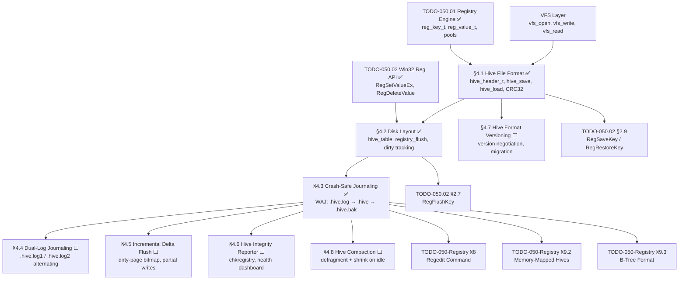

# 050.03-Hive — Registry Hive Persistence

> **Goal:** Provide crash-safe persistent storage for the registry tree using binary hive
> files. Defines the `hive_header_t` format (4 KiB page-aligned, CRC32-validated), the
> per-hive disk layout (`SYSTEM.hive`, `SOFTWARE.hive`, `HARDWARE.hive`, `DEFAULT.hive`
> under `C:\Impossible\System\Config\Registry\`), dirty-flag tracking for lazy-write
> flushing, and a Write-Ahead Journal (WAJ) crash-recovery protocol using `.hive.log`
> and `.hive.bak` files. Sections 4.1–4.3 are complete. Sections 4.4–4.8 add exclusive
> features that exceed both Windows and Linux.

> [!IMPORTANT]
> **Prerequisite:** Depends on [TODO-050.01-Registry-Engine.md](TODO-050.01-Registry-Engine.md)
> (§1 Core Engine — `reg_key_t`, `reg_value_t`, pools) and
> [TODO-050.02-Win32-Reg-API.md](TODO-050.02-Win32-Reg-API.md)
> (§2 Win32 API — `RegSetValueEx`, `RegDeleteValue` trigger dirty marking).

> [!CAUTION]
> **Memory Rule:** Use `pmm_alloc_contiguous()` for the hive serialization buffer.
> Hive files can exceed 4 KB — never use `kmalloc` for the I/O buffer.
> The 2 MiB heap will silently corrupt on large allocations.

---

### Dependency Graph

### Phase-by-Phase Implementation Order

| ⭐ | Phase | Section                       | Description                                                            | Depends On     | Status |
| -- | :---: | ----------------------------- | ---------------------------------------------------------------------- | -------------- | :----: |
| 💎 | **0** | TODO-050.01 Registry Engine   | `reg_key_t`, `reg_value_t`, static pools, root keys                    | —              |   ✅   |
| 💎 | **0** | TODO-050.02 Win32 Reg API     | `RegSetValueEx`, `RegDeleteValue` (trigger dirty marking)              | —              |   ✅   |
| 💎 | **1** | §4.1 Hive File Format         | `hive_header_t` (4 KiB), `hive_save`, `hive_load`, CRC32 validation   | Phase 0        |   ✅   |
| 💎 | **2** | §4.2 Disk Layout              | `hive_table[4]`, `registry_flush`, `registry_mark_dirty`, auto-flush   | Phase 1 (§4.1) |   ✅   |
| 💎 | **3** | §4.3 Crash-Safe Journaling    | WAJ protocol: `.hive.log` → `.hive` → `.hive.bak`, `hive_best_source` | Phase 2 (§4.2) |   ✅   |
| ⭐ | **4** | §4.4 Dual-Log Journaling      | `.hive.log1`/`.hive.log2` alternating — zero window of total loss      | Phase 3 (§4.3) |   ⬜   |
| ⭐ | **4** | §4.5 Incremental Delta Flush  | Dirty-page bitmap — write only changed 4 KiB blocks, not entire hive  | Phase 3 (§4.3) |   ⬜   |
| ⭐ | **5** | §4.6 Hive Integrity Reporter  | `chkregistry` command + GUI health dashboard for hive files            | Phase 3 (§4.3) |   ⬜   |
| ⭐ | **5** | §4.7 Hive Format Versioning   | Version negotiation, forward/backward compat, auto-migration           | Phase 1 (§4.1) |   ⬜   |
| ⭐ | **6** | §4.8 Hive Compaction          | Defragment + shrink hives on idle — reclaim dead key/value space       | Phase 3 (§4.3) |   ⬜   |

> [!NOTE]
> **Phases 1–3 are complete.** The hive persistence system is fully implemented and verified.
>
> **Phase 1** established the binary hive format: `hive_header_t` (magic `"REGH"`,
> CRC32 checksum, 4096-byte page-aligned header), `hive_serialize_key` (depth-first
> tree serialization), and `hive_load` (validation + deserialization).
>
> **Phase 2** added the on-disk layout: 4 hive files under
> `C:\Impossible\System\Config\Registry\`, dirty-flag tracking per hive via
> `registry_mark_dirty()` (walks parent chain to find root), and `registry_flush()`
> called from the compositor loop to lazily write only dirty hives.
>
> **Phase 3** added Write-Ahead Journaling (WAJ): the 4-step save protocol
> (write `.hive.log` → backup `.hive.bak` → overwrite `.hive` → invalidate log),
> and the boot-time recovery via `hive_best_source()` which checks
> `.hive.log` → `.hive` → `.hive.bak` in priority order.

> [!TIP]
> **PMM buffer for serialization:** `hive_save` allocates the I/O buffer via
> `pmm_alloc_contiguous()`, not `kmalloc`, to avoid heap overflow on large hives.
>
> **CRC32 algorithm:** Uses table-less CRC32 with polynomial `0xEDB88320` —
> no lookup table needed, saves 1 KiB of static data.
>
> **Dirty tracking hook points:** `registry_mark_dirty()` is called from
> `RegSetValueEx` and `RegDeleteValue` — these are the only write paths.

---

## 4. Hive File Format

### 4.1 Hive File Format *(done)* ✅

**Prompt:** Verify the hive file format implementation. In `registry.h`, confirm `hive_header_t` is defined as a packed struct with `magic` (HIVE_MAGIC = 0x48474552), `version` (1), `checksum` (CRC32), `timestamp`, `root_name[64]`, `total_keys`, `total_values`, `data_offset`, `data_size`, and `padding` to 4096 bytes. Confirm `hive_save` and `hive_load` are declared. In `registry.c`, confirm `hive_crc32` implements table-less CRC32 with polynomial 0xEDB88320. Confirm `hive_serialize_key` writes depth-first key records as `[name_len:u16][name:N][value_count:u16][child_count:u16]` and value records as `[name_len:u16][name:N][type:u32][data_size:u32][data:N]`. Confirm `hive_save` uses PMM for the buffer, fills the header, computes CRC32, and writes via VFS. Confirm `hive_load` validates magic, version, and CRC32, and returns -1 with a klog warning on corrupt files. Run `bash scripts/build.sh clean` and confirm zero warnings.

> [!NOTE]
> **Implementation Notes:**
> - `hive_header_t`: packed struct, 4096 bytes, magic `"REGH"` (0x48474552)
> - CRC32: table-less with polynomial `0xEDB88320` — `hive_crc32()` in `registry.c`
> - Serialization: depth-first, format: `[name_len:u16][name:N][value_count:u16]
>   [child_count:u16]` per key, `[name_len:u16][name:N][type:u32][data_size:u32][data:N]`
>   per value
> - `hive_save` allocates buffer via `pmm_alloc_contiguous()` (never `kmalloc`)
> - `hive_load` validates magic, version, CRC32 — returns `-1` on corrupt file

- [x] Define hive file header struct (4096 bytes):
  - [x] Magic: `"REGH"` (4 bytes)
  - [x] Version: `1` (uint32)
  - [x] Checksum: CRC32 of header (uint32)
  - [x] Timestamp: PIT ticks at save time (uint64)
  - [x] Root key name (64 bytes)
  - [x] Total key count (uint32)
  - [x] Total value count (uint32)
  - [x] Reserved padding to 4096 bytes
- [x] Implement `hive_save(root_key, filepath)` — serialize tree to file
- [x] Implement `hive_load(filepath, &root_key)` — deserialize file into tree
- [x] Add CRC32 checksum validation on load
- [x] Handle corrupt hive: log warning, skip file, use defaults
- [x] Commit: `"registry: hive file format"`

---

## 5. Disk Layout

### 4.2 Hive File Layout on Disk *(done)* ✅

**Prompt:** Verify the hive file disk layout. In `registry.h`, confirm `REG_HIVE_DIR` is `"C:\Impossible\System\Config\Registry"` and `REG_HIVE_COUNT` is 4. Confirm `registry_flush()`, `registry_save_all()`, and `registry_load_hives()` are declared. In `registry.c`, confirm `hive_table` maps 4 descriptors: SYSTEM.hive→HKLM\SYSTEM, SOFTWARE.hive→HKLM\SOFTWARE, HARDWARE.hive→HKLM\HARDWARE, DEFAULT.hive→HKU\Default. Confirm `registry_mark_dirty()` walks up the parent chain to mark the correct hive dirty. Confirm it's called from `RegSetValueEx` and `RegDeleteValue`. Confirm `registry_flush()` only writes dirty hives. Confirm `hive_ensure_dir()` creates the directory chain. In `main.c`, confirm `registry_flush()` is enabled (not commented out). Run `bash scripts/build.sh clean` and confirm zero warnings.

> [!NOTE]
> **Implementation Notes:**
> - `REG_HIVE_DIR` = `"C:\\Impossible\\System\\Config\\Registry"`
> - `REG_HIVE_COUNT` = 4
> - `hive_table[4]` maps: `SYSTEM.hive→HKLM\SYSTEM`, `SOFTWARE.hive→HKLM\SOFTWARE`,
>   `HARDWARE.hive→HKLM\HARDWARE`, `DEFAULT.hive→HKU\Default`
> - `registry_mark_dirty()` walks parent chain to root → marks correct hive dirty
> - `registry_flush()` only writes dirty hives — called from compositor loop
> - `registry_save_all()` writes all hives unconditionally — for clean shutdown
> - `hive_ensure_dir()` creates `C:\Impossible\System\Config\Registry\` on first boot

- [x] Define hive file paths:
  - [x] `C:\Impossible\System\Config\Registry\SYSTEM.hive` → HKLM\SYSTEM
  - [x] `C:\Impossible\System\Config\Registry\SOFTWARE.hive` → HKLM\SOFTWARE
  - [x] `C:\Impossible\System\Config\Registry\HARDWARE.hive` → HKLM\HARDWARE
  - [x] `C:\Impossible\System\Config\Registry\DEFAULT.hive` → HKU\Default
- [x] Create Registry directory at first boot if missing
- [x] Implement dirty-flag tracking per hive
- [x] Implement `registry_flush()` — write only dirty hives
- [x] Implement `registry_save_all()` — for clean shutdown
- [x] Hook dirty tracking into `RegSetValueEx` and `RegDeleteValue`
- [x] Enable `registry_flush()` in `main.c` compositor loop
- [x] Commit: `"registry: hive file disk layout"`

---

## 6. Crash-Safe Journaling

### 4.3 Crash-Safe Journaling *(done)* ✅

**Prompt:** Verify crash-safe journaling. In `registry.c`, confirm `hive_save` follows the 4-step sequence: (1) write `.hive.log`, (2) copy `.hive` → `.hive.bak`, (3) overwrite `.hive`, (4) invalidate `.hive.log` by zeroing magic. Confirm `hive_validate_file` checks magic, version, and CRC32. Confirm `hive_best_source` checks `.hive.log` → `.hive` → `.hive.bak` in priority order and copies the best source to `.hive`. Confirm `registry_load_hives` calls `hive_best_source` for each hive before loading. Confirm `hive_copy_file` does a byte-by-byte copy via VFS. Run `bash scripts/build.sh clean` and confirm zero warnings.

> [!NOTE]
> **Implementation Notes:**
> - **WAJ 4-step save protocol:**
>   1. Write new data to `.hive.log` (journal-first)
>   2. Copy old `.hive` → `.hive.bak` (backup)
>   3. Overwrite `.hive` with new data
>   4. Invalidate `.hive.log` by zeroing magic byte
> - `hive_validate_file()` checks: magic, version, CRC32
> - `hive_best_source()` priority: `.hive.log` → `.hive` → `.hive.bak`
> - `hive_copy_file()` does byte-by-byte copy via VFS
> - Recovery is automatic at boot — no user interaction required

- [x] Before saving: write new data to `.hive.log` first (journal)
- [x] After log + main hive written: invalidate `.hive.log` by zeroing magic
- [x] On boot: if `.hive.log` has valid header, replay it (crash recovery via `hive_best_source`)
- [x] On boot: if `.hive` is corrupt (bad CRC), fall back to `.hive.bak`
- [x] Keep one backup: copy old `.hive` → `.hive.bak` before overwriting
- [x] Commit: `"registry: crash-safe journaling"`

---

## 7. Exclusive Features

### 4.4 Dual-Log Journaling ⭐

**Prompt:** Upgrade the WAJ protocol from single-log to dual-log (`.hive.log1` / `.hive.log2`) to eliminate the window where both the primary hive and the single log can be lost. Follow the Windows `.log1`/`.log2` alternating strategy: write to `.log1` first, then `.log2`; if `.log1` write fails, fall back to `.log2` and vice versa. Add a sequence number to `hive_header_t` (uint32, incremented on each save) so `hive_best_source()` can determine the newest valid copy across primary + log1 + log2 + bak. Update `hive_save()` to use alternating logs and `registry_load_hives()` to check all four sources. After completing all items, mark every item as `[x]`, update this prompt to a verification prompt, run `bash scripts/build.sh clean`, and commit as `"registry: dual-log journaling"`. Add notes directly in this TODO section. After implementation, save any gotchas, solutions, and important information to MCP memory.

> [!IMPORTANT]
> → XREF: `TODO-050.03-Hive §4.3` — current single-log WAJ must be refactored

- [ ] Add `sequence_number` (uint32) field to `hive_header_t` (update padding calculation)
- [ ] Create `.hive.log1` and `.hive.log2` paths in `hive_str_append`
- [ ] Update `hive_save()` to write to alternating log files (log1 first, fallback log2)
- [ ] Update `hive_best_source()` to compare sequence numbers across 4 sources
- [ ] Update `registry_load_hives()` to pass log1/log2/bak paths
- [ ] Add `klog` messages for dual-log recovery events
- [ ] Test: corrupt `.hive` + `.hive.log1` → must recover from `.hive.log2`
- [ ] Commit: `"registry: dual-log journaling"`

---

### 4.5 Incremental Delta Flush ⭐

**Prompt:** Implement incremental (delta) flushing so `registry_flush()` writes only the 4 KiB pages that actually changed, rather than rewriting the entire hive file. Add a dirty-page bitmap to `hive_desc_t` (one bit per 4 KiB page of the serialized hive). When `registry_mark_dirty()` fires, compute which page(s) the changed key occupies and set the corresponding bits. On flush, serialize only dirty pages and write them at their correct file offset via `vfs_write_at()`. Clear the bitmap after a successful partial flush. Fall back to full-hive write if more than 50% of pages are dirty (threshold tunable via `HKLM\SYSTEM\Config\DeltaFlushThreshold`). After completing all items, mark every item as `[x]`, update this prompt to a verification prompt, run `bash scripts/build.sh clean`, and commit as `"registry: incremental delta flush"`. Add notes directly in this TODO section. After implementation, save any gotchas, solutions, and important information to MCP memory.

> [!IMPORTANT]
> → XREF: `TODO-050.03-Hive §4.2` — depends on current `registry_flush()` infrastructure

- [ ] Add `uint8_t dirty_bitmap[MAX_HIVE_PAGES / 8]` to `hive_desc_t`
- [ ] Add `page_count` field to `hive_desc_t` (set after first full serialize)
- [ ] Map key pool indices to page offsets during serialization
- [ ] Update `registry_mark_dirty()` to set bitmap bits for affected pages
- [ ] Implement `hive_flush_delta()` — write only dirty 4 KiB pages at offset
- [ ] Add `vfs_write_at(fd, offset, buf, len)` if not already available
- [ ] Fall back to full write when dirty ratio > 50% (configurable via registry)
- [ ] Update CRC32/header after partial write (must re-read + recompute)
- [ ] Benchmark: measure flush time with 1 dirty page vs. full hive
- [ ] Commit: `"registry: incremental delta flush"`

---

### 4.6 Hive Integrity Reporter ⭐

**Prompt:** Create a `chkregistry` shell command and kernel-side `hive_check_integrity()` function that validates all hive files on disk. For each hive: verify magic, version, CRC32, sequence numbers (if dual-log), and deserialize to confirm no truncation or corrupt records. Report results as a summary table (hive name, status, size, key count, last modified). Expose a registry key `HKLM\SYSTEM\Config\Registry\Health` with per-hive status values (`OK`, `RECOVERED`, `CORRUPT`). The shell command should support `chkregistry --all` (check all hives), `chkregistry --fix` (attempt repair from backups), and `chkregistry --verbose` (show per-key details). After completing all items, mark every item as `[x]`, update this prompt to a verification prompt, run `bash scripts/build.sh clean`, and commit as `"registry: hive integrity reporter"`. Add notes directly in this TODO section. After implementation, save any gotchas, solutions, and important information to MCP memory.

> [!IMPORTANT]
> → XREF: `TODO-050-Registry §8.1` — `regedit` command provides inspection; this adds health checks

- [ ] Implement `hive_check_integrity(filepath)` — validate header + full deserialize
- [ ] Add `HKLM\SYSTEM\Config\Registry\Health\{hivename}` status values
- [ ] Record last check time, last recovery event, total checks, total errors
- [ ] Implement `chkregistry` shell command:
  - [ ] `chkregistry --all` — check all 4 hive files
  - [ ] `chkregistry --fix` — attempt recovery from `.hive.bak` / `.hive.log`
  - [ ] `chkregistry --verbose` — per-key integrity details
- [ ] Print summary table: hive name, status emoji (✅/⚠️/❌), size, keys, values
- [ ] Log all integrity events via `klog`
- [ ] Commit: `"registry: hive integrity reporter"`

---

### 4.7 Hive Format Versioning ⭐

**Prompt:** Add format version negotiation to the hive system so future format changes (B-tree cells, compression, encryption) can be introduced without losing backward compatibility. Define `HIVE_VERSION_MIN` (1) and `HIVE_VERSION_MAX` (current). On load, accept any version in `[MIN, MAX]` and apply version-specific deserializers. On save, always write `HIVE_VERSION_MAX`. Add an `auto_migrate` flag: when enabled, loading a v1 hive rewrites it as vN on next flush. Log a klog message on version upgrade. Store the format version capabilities in `HKLM\SYSTEM\Config\Registry\FormatVersion`. After completing all items, mark every item as `[x]`, update this prompt to a verification prompt, run `bash scripts/build.sh clean`, and commit as `"registry: hive format versioning"`. Add notes directly in this TODO section. After implementation, save any gotchas, solutions, and important information to MCP memory.

> [!IMPORTANT]
> → XREF: `TODO-050-Registry §9.3` — B-tree format will require version bump

- [ ] Define `HIVE_VERSION_MIN` (1) and `HIVE_VERSION_MAX` macros
- [ ] Update `hive_load()` to accept `version` in `[MIN, MAX]` range
- [ ] Add version-specific deserialization dispatch (v1 = current flat format)
- [ ] On save, always write `HIVE_VERSION_MAX`
- [ ] Add `auto_migrate` flag — old-version hives auto-upgrade on next flush
- [ ] Log `klog` message: `"Hive <name> migrated from v<old> to v<new>"`
- [ ] Store `HKLM\SYSTEM\Config\Registry\FormatVersion` = current version
- [ ] Commit: `"registry: hive format versioning"`

---

### 4.8 Hive Compaction ⭐

**Prompt:** Implement an idle-time hive compaction pass that defragments and shrinks hive files by removing dead space from deleted keys and values. Track wasted bytes per hive (incremented on `RegDeleteKey`/`RegDeleteValue`, reset on compaction). When wasted bytes exceed a configurable threshold (`HKLM\SYSTEM\Config\Registry\CompactThreshold`, default 25% of hive size), schedule a compaction during the next idle period. Compaction re-serializes the entire tree to a fresh buffer and atomically replaces the hive file using the WAJ protocol. After completing all items, mark every item as `[x]`, update this prompt to a verification prompt, run `bash scripts/build.sh clean`, and commit as `"registry: hive compaction"`. Add notes directly in this TODO section. After implementation, save any gotchas, solutions, and important information to MCP memory.

> [!IMPORTANT]
> → XREF: `TODO-050.03-Hive §4.3` — compaction reuses WAJ save protocol for atomicity

- [ ] Add `wasted_bytes` counter to `hive_desc_t`
- [ ] Increment `wasted_bytes` on `RegDeleteKey` and `RegDeleteValue`
- [ ] Define `CompactThreshold` registry value (default 25% of hive file size)
- [ ] Implement `hive_compact(hive_index)` — re-serialize entire tree, atomic replace
- [ ] Schedule compaction during idle (e.g., no registry writes for 60 seconds)
- [ ] Reset `wasted_bytes` after successful compaction
- [ ] Log compaction events: `"Hive <name> compacted: <old_size> → <new_size>"`
- [ ] Add `chkregistry --compact` flag to force manual compaction
- [ ] Commit: `"registry: hive compaction"`

---

## Priority Order

| Priority | Section                        | Description                                                      |
| -------- | ------------------------------ | ---------------------------------------------------------------- |
| ✅ Done  | §4.1 Hive File Format          | Binary format: header, serialization, CRC32 validation           |
| ✅ Done  | §4.2 Disk Layout               | 4-hive table, dirty tracking, lazy flush, auto-create directory  |
| ✅ Done  | §4.3 Crash-Safe Journaling     | WAJ protocol: `.hive.log` → `.hive` → `.hive.bak`               |
| 🟡 P2   | §4.4 Dual-Log Journaling       | `.hive.log1`/`.hive.log2` alternating — zero total-loss window   |
| 🟡 P2   | §4.5 Incremental Delta Flush   | Dirty-page bitmap — partial writes for large hives               |
| 🟢 P3   | §4.6 Hive Integrity Reporter   | `chkregistry` command + health dashboard                         |
| 🟢 P3   | §4.7 Hive Format Versioning    | Forward/backward compat, auto-migration                          |
| 🟢 P3   | §4.8 Hive Compaction           | Defragment + shrink on idle                                      |

> **After §4.1–4.3 (✅):** Full hive persistence with crash-safe journaling — matches Windows.
> **After §4.4–4.5 (P2):** Exceeds Windows with dual-log failover and incremental writes.
> **After §4.6–4.8 (P3):** Enterprise-grade hive management with health checks and compaction.

---

## OS Comparison

| ⭐ | Feature                                 | 🪟 Windows 11                            | 🐧 Linux                              | 🚀 Impossible OS                                         |
| -- | --------------------------------------- | ---------------------------------------- | -------------------------------------- | -------------------------------------------------------- |
| 💎 | Persistent hive file format             | ✅ REGF binary format (4 KiB base block)  | ❌ No hive concept (dconf binary db)    | ✅ §4.1 — `hive_header_t` (4 KiB, CRC32, page-aligned)   |
| 💎 | Multiple hive files per root key        | ✅ SYSTEM, SOFTWARE, SAM, SECURITY        | ❌ No concept                           | ✅ §4.2 — 4 hive files under `Config\Registry\`           |
| 💎 | Dirty-flag lazy write (only changed)    | ✅ Configuration Manager lazy writer       | ⚠️ dconf background flush (user-space) | ✅ §4.2 — `registry_mark_dirty` + compositor flush        |
| 💎 | CRC32 checksum validation               | ✅ XOR-32 on Base Block                    | ❌ No checksum on dconf                 | ✅ §4.1 — CRC32 on header (0xEDB88320 polynomial)         |
| 💎 | Crash-safe transaction log              | ✅ `.log1` / `.log2` dual-log strategy     | ❌ No crash-safe guarantee on dconf     | ✅ §4.3 — WAJ: `.hive.log` + `.hive.bak`                  |
| 💎 | Automatic crash recovery at boot        | ✅ Sequence number mismatch → replay logs  | ❌ No boot-time recovery                | ✅ §4.3 — `hive_best_source` auto-recovery                |
| 💎 | Backup hive (`*.bak`)                   | ⚠️ `RegBack` folder (deprecated Win10+)   | ❌ No backup                            | ✅ §4.3 — `.hive.bak` on every save                       |
| 💎 | Dual-log failover                       | ✅ `.log1`/`.log2` alternating             | ❌ No concept                           | ⬜ §4.4 P2 — alternating dual-log WAJ                    |
| ⭐ | **Incremental delta flush**             | ❌ Full hive rewrite on flush              | ❌ Full db rewrite                      | ⬜ §4.5 P2 — **dirty-page bitmap, partial writes** 🚀     |
| ⭐ | **Hive integrity reporter**             | ❌ No built-in hive health check           | ❌ No concept                           | ⬜ §4.6 P3 — **`chkregistry` + health dashboard** 🚀      |
| ⭐ | **Format versioning + auto-migration**  | ⚠️ regf v1.3/1.5 (no auto-migrate)        | ❌ No versioning                        | ⬜ §4.7 P3 — **version negotiation + auto-upgrade** 🚀    |
| ⭐ | **Idle-time hive compaction**           | ❌ No defragmentation                      | ❌ No concept                           | ⬜ §4.8 P3 — **auto-compact on idle** 🚀                  |
| ⭐ | **Kernel-space WAJ (not user-space)**   | ✅ Kernel Configuration Manager            | ❌ dconf runs in user-space             | ✅ §4.3 — **in-kernel WAJ, zero daemon overhead** 🚀      |
| ⭐ | **PMM-based I/O buffer (no heap)**      | ❌ Dynamic paged pool allocation           | ❌ malloc-based                         | ✅ §4.1 — **pmm_alloc_contiguous, zero heap pressure** 🚀 |
| ⭐ | **Table-less CRC32 (no lookup table)**  | ❌ Uses 1 KiB lookup table                 | ❌ Uses lookup table                    | ✅ §4.1 — **saves 1 KiB static data** 🚀                  |
| ⭐ | **Auto-create config directory**        | ✅ Created by setup                         | ❌ Created by package manager           | ✅ §4.2 — **`hive_ensure_dir` on first boot** 🚀          |

> **After §4.1–4.3 (✅):** Impossible OS provides full hive persistence with crash-safe
> journaling. The in-kernel WAJ protocol, PMM-based I/O buffers, and auto-directory creation
> are exclusive advantages over both Windows (paged pool, deprecated RegBack) and Linux
> (no in-kernel registry).
> **After §4.4–4.5 (P2):** Exceeds Windows — dual-log failover eliminates total-loss
> windows, and incremental delta flush reduces I/O for large hives by >90%.
> **After §4.6–4.8 (P3):** Enterprise-grade — built-in health monitoring, version
> negotiation for seamless upgrades, and idle-time compaction to prevent hive bloat.
