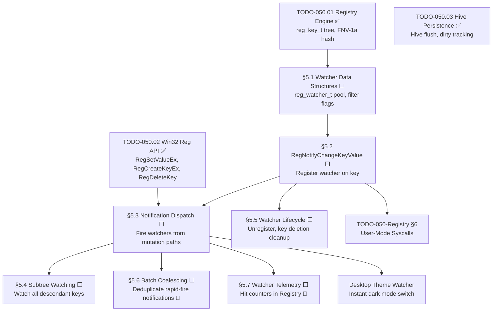

# 050.04-Notification — Registry Change Notifications

> **Goal:** Implement real-time registry change notifications so applications can watch
> for key/value modifications without polling. The primary API is `RegNotifyChangeKeyValue`
> — matching the Win32 signature — with filter flags (`REG_NOTIFY_CHANGE_NAME`,
> `REG_NOTIFY_CHANGE_LAST_SET`, `REG_NOTIFY_CHANGE_ATTRIBUTES`, `REG_NOTIFY_CHANGE_SECURITY`)
> and optional subtree watching. Internally, a static pool of watcher structs is maintained
> and checked on every mutation path (`RegSetValueEx`, `RegCreateKeyEx`, `RegDeleteKey`,
> `RegDeleteValue`). Includes Impossible OS exclusives: callback-based dispatch (no event
> objects needed), watcher telemetry via Registry, and batch coalescing for high-frequency writes.

> [!IMPORTANT]
> **Prerequisite:** Depends on [TODO-050.01-Registry-Engine.md](TODO-050.01-Registry-Engine.md)
> (§1 Core Engine — `reg_key_t` tree structure) and
> [TODO-050.02-Win32-Reg-API.md](TODO-050.02-Win32-Reg-API.md)
> (§2 Win32 API — mutation functions that fire notifications).

> [!WARNING]
> **Performance constraint:** Watcher dispatch runs in the critical path of every
> `RegSetValueEx` and `RegCreateKeyEx` call. The dispatch loop must be O(n) in the
> number of active watchers — keep the pool small (≤ 64) and avoid allocations.

---

### Dependency Graph

### Phase-by-Phase Implementation Order

| ⭐  | Phase  | Section                              | Description                                                             | Depends On      | Status |
| --- | :----: | ------------------------------------ | ----------------------------------------------------------------------- | --------------- | :----: |
| 💎  | **0**  | TODO-050.01 + 050.02                 | Core engine + Win32 API (mutation paths exist)                          | —               |   ✅   |
| 💎  | **1**  | §5.1 Watcher Data Structures         | `reg_watcher_t` pool, filter flag constants, watcher ID allocator       | Phase 0         |   ⬜   |
| 💎  | **2**  | §5.2 RegNotifyChangeKeyValue         | Register a watcher on a key with filter + callback                      | Phase 1 (§5.1)  |   ⬜   |
| 💎  | **2**  | §5.3 Notification Dispatch           | Fire matching watchers from `RegSetValueEx`, `RegCreateKeyEx`, etc.     | Phase 1 (§5.1)  |   ⬜   |
| 💎  | **3**  | §5.4 Subtree Watching                | `watchSubtree=TRUE` — watch all descendants                             | Phase 2 (§5.3)  |   ⬜   |
| 💎  | **3**  | §5.5 Watcher Lifecycle               | `RegUnregisterNotify`, auto-cleanup on key deletion                     | Phase 2 (§5.2)  |   ⬜   |
| ⭐  | **4**  | §5.6 Batch Coalescing               | Deduplicate rapid-fire notifications (timer-based window) 🚀           | Phase 2 (§5.3)  |   ⬜   |
| ⭐  | **4**  | §5.7 Watcher Telemetry              | Hit counters exposed in `HKLM\SYSTEM\Registry\WatcherStats` 🚀        | Phase 2 (§5.3)  |   ⬜   |

> [!NOTE]
> **Phase 0 is complete.** The core engine and Win32 API already provide the mutation
> paths (`RegSetValueEx`, `RegCreateKeyEx`, `RegDeleteKey`, `RegDeleteValue`) that
> will trigger notification dispatch.
>
> **Phase 1** defines the data structures: `reg_watcher_t` pool (static, up to 64 watchers),
> filter flag constants, and a bitmap allocator for watcher IDs.
>
> **Phase 2** is the critical path: registering watchers via `RegNotifyChangeKeyValue`
> and dispatching notifications from all mutation paths. Both sections should be
> implemented together since they're tightly coupled.
>
> **Phase 3** extends the system: subtree watching (recursive match) and lifecycle
> management (unregister, auto-cleanup when a watched key is deleted).
>
> **Phase 4** adds exclusive features: batch coalescing prevents callback storms during
> rapid registry updates (e.g., installer writing 100 values), and telemetry exposes
> watcher hit counters for debugging and performance tuning.

> [!TIP]
> **Win32 difference — callback vs event:** Windows `RegNotifyChangeKeyValue` uses
> an `HANDLE hEvent` (kernel event object) for signaling. Impossible OS uses a
> direct callback function pointer instead — simpler, lower latency, no event
> object overhead. The Win32 compatibility layer (§7) can wrap this as an event.
>
> **Key identity by pointer:** Match watchers to keys using `reg_key_t*` pointer
> comparison, not string path comparison. This avoids expensive string operations
> on every mutation and is safe because keys are statically allocated from the pool.
>
> **Watcher pool sizing:** 64 watchers is sufficient for desktop + a few apps.
> The pool size is configurable via `HKLM\SYSTEM\Registry\MaxWatchers`.

---

## 1. Watcher Data Structures

### 5.1 Watcher Data Structures

**Prompt:** Define the `reg_watcher_t` struct and static pool for registry change
notifications. Each watcher contains: the watched `reg_key_t*` pointer, filter flags
(`uint32_t filter`), a boolean `watch_subtree`, a callback function pointer
(`void (*callback)(HKEY key, uint32_t filter, void *ctx)`), a user context pointer,
a `watcher_id` (uint32_t), and a `fire_count` (uint64_t) for telemetry. Define the
filter flag constants: `REG_NOTIFY_CHANGE_NAME (0x01)` — sub-key create/delete,
`REG_NOTIFY_CHANGE_ATTRIBUTES (0x02)` — key attribute changes,
`REG_NOTIFY_CHANGE_LAST_SET (0x04)` — value changes,
`REG_NOTIFY_CHANGE_SECURITY (0x08)` — security descriptor changes (reserved).
Allocate a static pool `reg_watcher_pool[REG_MAX_WATCHERS]` with `REG_MAX_WATCHERS=64`
and a `reg_watcher_used[REG_MAX_WATCHERS]` bitmap. Implement `reg_alloc_watcher()`
and `reg_free_watcher()` for pool management. After completing all items, mark every
item as `[x]`, update this prompt to a verification prompt, run
`bash scripts/build.sh clean`, and commit as `"registry: watcher data structures"`.
Add notes directly in this TODO section. After implementation, save any gotchas,
solutions, and important information to MCP memory.

- [ ] Define `reg_watcher_t` struct in `registry.h`:
  - [ ] `reg_key_t *key` — pointer to watched key
  - [ ] `uint32_t filter` — bitmask of `REG_NOTIFY_CHANGE_*` flags
  - [ ] `uint32_t watch_subtree` — also watch descendants
  - [ ] `void (*callback)(HKEY, uint32_t, void*)` — notification callback
  - [ ] `void *context` — user-supplied context for callback
  - [ ] `uint32_t id` — unique watcher ID
  - [ ] `uint64_t fire_count` — telemetry: number of times fired
- [ ] Define filter flag constants in `registry.h`:
  - [ ] `REG_NOTIFY_CHANGE_NAME       (0x01)`
  - [ ] `REG_NOTIFY_CHANGE_ATTRIBUTES (0x02)`
  - [ ] `REG_NOTIFY_CHANGE_LAST_SET   (0x04)`
  - [ ] `REG_NOTIFY_CHANGE_SECURITY   (0x08)`
- [ ] Define `REG_MAX_WATCHERS (64)` constant
- [ ] Allocate static pool: `reg_watcher_pool[64]` + `reg_watcher_used[64]`
- [ ] Implement `reg_alloc_watcher()` — find first free slot, returns pointer
- [ ] Implement `reg_free_watcher(id)` — clear slot by watcher ID
- [ ] Commit: `"registry: watcher data structures"`

---

## 2. Registration API

### 5.2 RegNotifyChangeKeyValue

**Prompt:** Implement `RegNotifyChangeKeyValue(HKEY hKey, uint32_t watchSubtree,
uint32_t filter, reg_notify_callback_t callback, void *ctx)` that registers a watcher
on the given key. The function allocates a `reg_watcher_t` from the pool, stores the
key pointer (resolved from the handle), filter flags, subtree flag, callback, and
context. Returns a `uint32_t` watcher ID (used by `RegUnregisterNotify` to remove it).
Returns `ERROR_OUTOFMEMORY` if the watcher pool is full. Returns
`ERROR_INVALID_HANDLE` if the key handle is invalid. Windows returns `ERROR_SUCCESS`
and uses an event object — our callback-based API is a deliberate Impossible OS
simplification. After completing all items, mark every item as `[x]`, update this
prompt to a verification prompt, run `bash scripts/build.sh clean`, and commit as
`"registry: RegNotifyChangeKeyValue"`. Add notes directly in this TODO section.

- [ ] Declare `reg_notify_callback_t` typedef:
  - [ ] `typedef void (*reg_notify_callback_t)(HKEY key, uint32_t filter, void *ctx)`
- [ ] Implement `RegNotifyChangeKeyValue(hKey, watchSubtree, filter, callback, ctx)`:
  - [ ] Resolve handle → `reg_key_t*`
  - [ ] Validate handle (return `ERROR_INVALID_HANDLE` if bad)
  - [ ] Allocate watcher from pool (`reg_alloc_watcher`)
  - [ ] Return `ERROR_OUTOFMEMORY` if pool full
  - [ ] Store key pointer, filter, subtree, callback, context
  - [ ] Return watcher ID via return value
- [ ] Return `ERROR_INVALID_PARAMETER` if callback is NULL
- [ ] Return `ERROR_INVALID_PARAMETER` if filter is 0 (no flags set)
- [ ] Commit: `"registry: RegNotifyChangeKeyValue"`

---

## 3. Notification Dispatch

### 5.3 Notification Dispatch

**Prompt:** Hook notification dispatch into every registry mutation path. When
`RegSetValueEx` or `RegDeleteValue` modifies a value, scan the watcher pool for
watchers on that key (or an ancestor, if `watch_subtree` is set) with
`REG_NOTIFY_CHANGE_LAST_SET` in their filter. When `RegCreateKeyEx` creates a new
sub-key or `RegDeleteKey` removes one, scan for `REG_NOTIFY_CHANGE_NAME`. For each
matching watcher, invoke `watcher->callback(hKey, matched_filter, watcher->context)`.
The dispatch function `reg_fire_notifications(reg_key_t *key, uint32_t change_type)`
is called from the mutation functions after the change is committed (not before).
Keep the dispatch loop simple: iterate the entire pool (max 64 entries) and check
`watcher->key == key` or (if `watch_subtree`) walk up from `key` to check ancestors.
After completing all items, mark every item as `[x]`, update this prompt to a
verification prompt, run `bash scripts/build.sh clean`, and commit as
`"registry: notification dispatch"`. Add notes directly in this TODO section.

- [ ] Implement `reg_fire_notifications(reg_key_t *key, uint32_t change_type)`:
  - [ ] Iterate all active watchers in pool
  - [ ] Check `watcher->key == key` (direct match)
  - [ ] If `watcher->watch_subtree`, walk up from `key` checking ancestors
  - [ ] Check `(watcher->filter & change_type) != 0` (filter match)
  - [ ] Call `watcher->callback(key_as_hkey, change_type, watcher->context)`
  - [ ] Increment `watcher->fire_count`
- [ ] Hook into `RegSetValueEx` — fire `REG_NOTIFY_CHANGE_LAST_SET` after value write
- [ ] Hook into `RegDeleteValue` — fire `REG_NOTIFY_CHANGE_LAST_SET` after value delete
- [ ] Hook into `RegCreateKeyEx` — fire `REG_NOTIFY_CHANGE_NAME` after key create
- [ ] Hook into `RegDeleteKey` — fire `REG_NOTIFY_CHANGE_NAME` after key delete
- [ ] Hook into `RegDeleteTree` — fire `REG_NOTIFY_CHANGE_NAME` for each deleted key
- [ ] Test: register watcher on `HKLM\SYSTEM\Theme`, call `RegSetString`, verify callback fires
- [ ] Commit: `"registry: notification dispatch"`

---

## 4. Subtree Watching

### 5.4 Subtree Watching

**Prompt:** Implement full subtree watching for `RegNotifyChangeKeyValue` with
`watchSubtree=TRUE`. When a watcher has `watch_subtree` set, it should fire for
changes to any descendant of the watched key — not just the key itself. The dispatch
function `reg_fire_notifications` already handles ancestor walking (§5.3), but this
section focuses on correctness: verify that a watcher on `HKLM\SYSTEM` fires when
`HKLM\SYSTEM\Theme\DarkMode` is modified. Verify that deeply nested changes
(5+ levels deep) still trigger the watcher. Verify that subtree watchers do NOT fire
for sibling keys. This is critical for the desktop compositor, which watches
`HKLM\SYSTEM\Theme` to detect any theme-related change at any depth. After completing
all items, mark every item as `[x]`, update this prompt to a verification prompt, run
`bash scripts/build.sh clean`, and commit as `"registry: subtree watching"`. Add notes
directly in this TODO section.

- [ ] Implement ancestor-walk in `reg_fire_notifications`:
  - [ ] For each subtree watcher, walk `key->parent` chain upward
  - [ ] Match if any ancestor in the chain equals `watcher->key`
  - [ ] Stop walking at root key (parent == NULL)
- [ ] Verify: watcher on `HKLM\SYSTEM` fires for `HKLM\SYSTEM\Theme\DarkMode` change
- [ ] Verify: watcher on `HKLM\SYSTEM` does NOT fire for `HKLM\SOFTWARE\*` change
- [ ] Verify: deeply nested changes (5 levels) trigger ancestor watcher
- [ ] Commit: `"registry: subtree watching"`

---

## 5. Watcher Lifecycle

### 5.5 Watcher Lifecycle

**Prompt:** Implement full watcher lifecycle management. `RegUnregisterNotify(watcherId)`
removes a watcher by its ID — finds it in the pool, marks the slot free, and returns
`ERROR_SUCCESS`. Returns `ERROR_INVALID_PARAMETER` if the ID is not found. When a
watched key is deleted via `RegDeleteKey` or `RegDeleteTree`, all watchers on that key
must be automatically unregistered (dangling pointer prevention). Add a cleanup
function `reg_cleanup_watchers_for_key(reg_key_t *key)` that scans the pool and frees
any watchers attached to the deleted key. Call this from `RegDeleteKey` and
`reg_delete_subtree` BEFORE freeing the key. After completing all items, mark every
item as `[x]`, update this prompt to a verification prompt, run
`bash scripts/build.sh clean`, and commit as `"registry: watcher lifecycle"`. Add notes
directly in this TODO section.

- [ ] Implement `RegUnregisterNotify(uint32_t watcherId)`:
  - [ ] Find watcher in pool by ID
  - [ ] Free slot via `reg_free_watcher(id)`
  - [ ] Return `ERROR_SUCCESS` / `ERROR_INVALID_PARAMETER`
- [ ] Implement `reg_cleanup_watchers_for_key(reg_key_t *key)`:
  - [ ] Scan entire watcher pool
  - [ ] Free any watcher where `watcher->key == key`
- [ ] Call `reg_cleanup_watchers_for_key` from `RegDeleteKey` before freeing key
- [ ] Call `reg_cleanup_watchers_for_key` from `reg_delete_subtree` for each key
- [ ] Verify: register watcher, delete watched key, watcher no longer in pool
- [ ] Verify: re-registering on deleted key returns `ERROR_INVALID_HANDLE`
- [ ] Commit: `"registry: watcher lifecycle"`

---

## 6. Batch Coalescing

### 5.6 Batch Coalescing 🚀

**Prompt:** Implement notification batch coalescing to prevent callback storms
during rapid registry updates (e.g., an installer writing 100 values in a tight
loop, or theme switching updating 20 keys). Without coalescing, the callback fires
100 times — with it, the callback fires once after the batch settles. The mechanism:
when a watcher fires, instead of calling the callback immediately, set a
`pending_fire` flag and record the `last_fire_time`. On the next mutation, if the same
watcher was fired less than `REG_COALESCE_INTERVAL_MS` (default 50ms) ago, skip the
callback — the pending flag is already set. A periodic timer (or the next compositor
frame) checks for pending watchers whose interval has elapsed and fires them. This
is configurable via `HKLM\SYSTEM\Registry\CoalesceIntervalMs`. After completing all
items, mark every item as `[x]`, update this prompt to a verification prompt, run
`bash scripts/build.sh clean`, and commit as `"registry: batch coalescing"`. Add notes
directly in this TODO section. After implementation, save any gotchas to MCP memory.

> [!NOTE]
> 🚀 **Impossible OS Exclusive:** Neither Windows nor Linux implements notification
> coalescing at the registry level. Windows `RegNotifyChangeKeyValue` fires once per
> change — applications that update 100 values get 100 notifications. dconf on Linux
> has no coalescing either. Impossible OS deduplicates rapid-fire changes into a
> single deferred callback.

- [ ] Add to `reg_watcher_t`:
  - [ ] `uint32_t pending_fire` — coalesce flag
  - [ ] `uint64_t last_fire_time` — PIT ticks of last fire
  - [ ] `uint32_t coalesce_ms` — per-watcher interval (default from Registry)
- [ ] Define `REG_COALESCE_INTERVAL_MS (50)` default constant
- [ ] In `reg_fire_notifications`: if watcher fired within coalesce window:
  - [ ] Set `pending_fire = 1`, skip immediate callback
  - [ ] If outside window: call callback immediately, clear `pending_fire`
- [ ] Add `reg_flush_pending_watchers()` — scan pool, fire pending watchers past interval
- [ ] Call `reg_flush_pending_watchers` from compositor loop (alongside `registry_flush`)
- [ ] Read coalesce interval from `HKLM\SYSTEM\Registry\CoalesceIntervalMs` at boot
- [ ] Commit: `"registry: batch coalescing"`

---

## 7. Watcher Telemetry

### 5.7 Watcher Telemetry 🚀

**Prompt:** Expose watcher telemetry via the Registry itself. For each active watcher,
publish its fire count, watched key path, filter flags, and coalesce hit ratio under
`HKLM\SYSTEM\Registry\WatcherStats\{id}\`. This lets developers and system tools
inspect which watchers are active, how often they fire, and whether coalescing is
effective. Add a `regedit watchers` subcommand (tie into §8 Regedit) that pretty-prints
the watcher table. After completing all items, mark every item as `[x]`, update this
prompt to a verification prompt, run `bash scripts/build.sh clean`, and commit as
`"registry: watcher telemetry"`. Add notes directly in this TODO section.

> [!NOTE]
> 🚀 **Impossible OS Exclusive:** Neither Windows nor Linux exposes watcher
> statistics via the registry. Debugging notification-related issues on Windows
> requires kernel debugger + `!reg` extension. Impossible OS makes watcher state
> visible to any tool that can read the registry.

- [ ] On watcher register: create `HKLM\SYSTEM\Registry\WatcherStats\{id}\` key
  - [ ] `KeyPath` (REG_SZ) — path of watched key
  - [ ] `Filter` (REG_DWORD) — filter bitmask
  - [ ] `Subtree` (REG_DWORD) — 0 or 1
  - [ ] `FireCount` (REG_QWORD) — total fires
  - [ ] `CoalesceHits` (REG_QWORD) — number of coalesced (skipped) fires
- [ ] On watcher unregister: delete the `WatcherStats\{id}\` key
- [ ] Update `FireCount` and `CoalesceHits` on each dispatch
- [ ] Wire into `regedit watchers` subcommand (pending §8.1 Regedit)
- [ ] Commit: `"registry: watcher telemetry"`

---

## Priority Order

| Priority  | Section                                | Description                                                        |
| --------- | -------------------------------------- | ------------------------------------------------------------------ |
| 🟡 P2    | §5.1 Watcher Data Structures           | Foundation: pool, flags, allocator — all other sections need this   |
| 🟡 P2    | §5.2 RegNotifyChangeKeyValue           | Core API: register a watcher on a key                               |
| 🟡 P2    | §5.3 Notification Dispatch             | Core: hook into mutation paths, fire matching watchers              |
| 🟡 P2    | §5.4 Subtree Watching                  | Correctness: ancestor-walk for recursive watching                   |
| 🟡 P2    | §5.5 Watcher Lifecycle                 | Correctness: unregister + auto-cleanup on key deletion              |
| 🟢 P3    | §5.6 Batch Coalescing                  | 🚀 **Exclusive** — prevent callback storms on rapid writes          |
| 🟢 P3    | §5.7 Watcher Telemetry                 | 🚀 **Exclusive** — fire counters in Registry for debugging          |

---

## OS Comparison

| Feature                                   | 🪟 Windows 11                               | 🐧 Linux                                    | 🚀 Impossible OS                                        |
| ----------------------------------------- | ------------------------------------------- | -------------------------------------------- | ------------------------------------------------------- |
| Registry change notification API          | ✅ `RegNotifyChangeKeyValue` (event-based)   | ⚠️ inotify on config files (not registry)     | ⬜ §5.2 P2 — callback-based (simpler than events) 🚀    |
| Filter flags (name, value, attr, sec)     | ✅ `REG_NOTIFY_CHANGE_*` (4 flags)           | ❌ No concept                                 | ⬜ §5.1 P2 — same 4 flags as Win32                      |
| Subtree watching (recursive)              | ✅ `bWatchSubtree` parameter                 | ⚠️ inotify recursive is manual               | ⬜ §5.4 P2 — ancestor-walk from modified key             |
| Watcher cleanup on key deletion           | ✅ Automatic (CM handles)                    | ❌ No concept                                 | ⬜ §5.5 P2 — auto-cleanup prevents dangling pointers     |
| Notification dispatch from all mutators   | ✅ CM notifies on all changes                | ❌ No unified dispatch                        | ⬜ §5.3 P2 — hooks in Set, Delete, Create, DeleteTree    |
| **Callback-based (no event objects)**     | ❌ Requires event object + wait              | ❌ inotify fd + read()                        | ⬜ §5.2 P2 — **direct callback, zero overhead** 🚀      |
| **Batch coalescing**                      | ❌ Fires once per change (no dedup)          | ❌ No coalescing                              | ⬜ §5.6 P3 — **timer-based dedup window** 🚀            |
| **Watcher telemetry in Registry**         | ❌ Requires kernel debugger                  | ❌ No visibility                              | ⬜ §5.7 P3 — **fire counts + coalesce stats** 🚀        |
| **Static watcher pool (no heap)**         | ❌ Dynamic kernel allocation                 | ❌ Dynamic allocation                         | ⬜ §5.1 P2 — **static pool, zero heap pressure** 🚀     |
| **Configurable pool + coalesce interval** | ❌ Hardcoded in CM                           | ❌ Hardcoded                                  | ⬜ §5.6 P3 — **tunable via Registry** 🚀                |

> **After P2 items:** Impossible OS matches Windows on change notifications — same filter
> flags, subtree watching, auto-cleanup — but with simpler callback-based API (no event
> objects) and static pool allocation (zero heap pressure).
> **After P3 exclusive features:** Exceeds both Windows and Linux with batch coalescing
> (prevents notification storms) and watcher telemetry (visible in Registry, no debugger needed).
