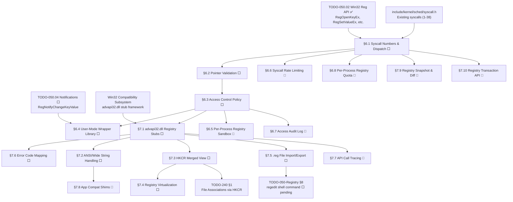

# 050.05-Syscalls — Registry Syscalls & Win32 Compatibility

> **Goal:** Expose the kernel Registry API to user-mode applications via syscalls, then
> provide a Win32-compatible `advapi32.dll` stub layer on top. User apps need registry
> access for storing settings (window positions, preferences, recent files). The syscall
> layer (`SYS_REG_OPEN` through `SYS_REG_ENUM_VALUE`) validates user pointers and enforces
> access control: user apps can write `HKCU` and `HKLM\SOFTWARE` but not `HKLM\SYSTEM` or
> `HKLM\HARDWARE`. The Win32 compatibility layer maps `RegOpenKeyExA/W` and friends to the
> native API, providing A/W (ANSI/Wide) variants, HKCR merged view, registry virtualization,
> `.reg` file import/export, and Win32↔native error code mapping. Includes Impossible OS
> exclusives: per-process registry sandbox, syscall rate limiting, unified access audit log,
> transparent API call tracing, and automatic app compat shimming.

> [!IMPORTANT]
> **Prerequisite:** Depends on [TODO-050.02-Win32-Reg-API.md](TODO-050.02-Win32-Reg-API.md)
> (§2 Win32 API — all kernel-side registry functions) and the existing syscall infrastructure
> in `include/kernel/sched/syscall.h` (currently SYS_WRITE=1 through SYS_MUNMAP=38,
> with gaps at 18–32 and 39). The syscall ABI passes arguments in `rdi`, `rsi`, `rdx`
> (3-argument max per the current INT 0x80 handler).

> [!CAUTION]
> **User pointer validation is mandatory.** Every syscall that reads or writes user-mode
> buffers MUST validate the pointer before dereferencing. Failure to validate allows
> user-mode code to read/write arbitrary kernel memory. Use `user_ptr_valid(ptr, size)`
> before any access.

> [!WARNING]
> **Access control is security-critical.** `HKLM\SYSTEM` and `HKLM\HARDWARE` contain
> kernel configuration and hardware detection data. Allowing user-mode writes to these
> keys would enable privilege escalation. The syscall layer MUST enforce the policy.
>
> **String encoding:** Windows uses UTF-16LE for `W` (Wide) variants and the Active Code
> Page (usually Windows-1252) for `A` (ANSI) variants. Impossible OS uses UTF-8 internally.
> The `A` variants can pass through directly for ASCII-compatible strings, but the `W`
> variants require UTF-16LE → UTF-8 conversion.

---

### Dependency Graph

### Phase-by-Phase Implementation Order

| ⭐  | Phase  | Section                              | Description                                                                    | Depends On       | Status |
| --- | :----: | ------------------------------------ | ------------------------------------------------------------------------------ | ---------------- | :----: |
| 💎  | **0**  | TODO-050.02 + syscall.h              | Win32 API + existing syscall infrastructure                                    | —                |   ✅   |
| 💎  | **1**  | §6.1 Syscall Numbers & Dispatch      | Add 9 `SYS_REG_*` entries, dispatch in `syscall_handler`                       | Phase 0          |   ⬜   |
| 💎  | **1**  | §6.2 Pointer Validation              | `user_ptr_valid` checks on all buffer arguments                                | Phase 0          |   ⬜   |
| 💎  | **2**  | §6.3 Access Control Policy           | Enforce read-only for `HKLM\SYSTEM`, `HKLM\HARDWARE`                          | Phase 1          |   ⬜   |
| 💎  | **3**  | §6.4 User-Mode Wrapper Library       | `user/lib/registry.c` — clean C API for user apps                              | Phase 2 (§6.3)   |   ⬜   |
| 💎  | **3**  | §7.1 advapi32.dll Registry Stubs     | A-variant passthrough in `advapi32.dll` export table                           | Phase 2 (§6.3)   |   ⬜   |
| 💎  | **3**  | §7.6 Error Code Mapping              | Win32 `ERROR_*` ↔ native error translation                                    | Phase 3 (§7.1)   |   ⬜   |
| 💎  | **4**  | §7.2 ANSI/Wide String Handling       | UTF-16LE ↔ UTF-8 for `W` variants                                             | Phase 3 (§7.1)   |   ⬜   |
| 💎  | **4**  | §7.3 HKCR Merged View               | Overlay `HKCU\Software\Classes` over `HKLM\SOFTWARE\Classes`                  | Phase 3 (§7.1)   |   ⬜   |
| 💎  | **5**  | §7.4 Registry Virtualization         | Vista-style: redirect HKLM writes to per-user HKCU copy                       | Phase 4 (§7.3)   |   ⬜   |
| 💎  | **5**  | §7.5 .reg File Import/Export         | Parse and generate Windows `.reg` v5.00 format                                 | Phase 3 (§7.1)   |   ⬜   |
| ⭐  | **6**  | §6.5 Per-Process Registry Sandbox    | Process-specific `HKCU` mapping (`HKU\{pid}`) 🚀                              | Phase 2 (§6.3)   |   ⬜   |
| ⭐  | **6**  | §6.6 Syscall Rate Limiting           | Throttle excessive registry calls per process 🚀                               | Phase 1 (§6.1)   |   ⬜   |
| ⭐  | **6**  | §6.7 Access Audit Log                | Log all registry access with PID, key, operation 🚀                            | Phase 2 (§6.3)   |   ⬜   |
| ⭐  | **6**  | §7.7 API Call Tracing                | Debug logging for Win32 registry calls 🚀                                     | Phase 3 (§7.1)   |   ⬜   |
| ⭐  | **7**  | §7.8 App Compat Shims               | Automatic fixes for known Win32 app quirks 🚀                                 | Phase 4 (§7.2)   |   ⬜   |
| ⭐  | **7**  | §6.8 Per-Process Registry Quota      | Per-PID storage quota — prevent pool exhaustion 🚀                            | Phase 1 (§6.1)   |   ⬜   |
| ⭐  | **7**  | §7.9 Registry Snapshot & Diff        | Point-in-time snapshot + diff for debugging 🚀                                | Phase 1 (§6.1)   |   ⬜   |
| ⭐  | **7**  | §7.10 Registry Transaction API       | Atomic multi-write batches — no partial updates 🚀                            | Phase 1 (§6.1)   |   ⬜   |

> [!NOTE]
> **Phase 0 is complete.** The kernel registry API and syscall dispatch infrastructure
> already exist. Syscall numbers 1–38 are assigned in `syscall.h`.
>
> **Phase 1** adds the 9 registry syscall handlers and pointer validation. These must
> be implemented together — a syscall without pointer validation is a security hole.
>
> **Phase 2** adds access control — the policy layer that prevents user-mode code from
> modifying kernel-owned keys (`HKLM\SYSTEM`, `HKLM\HARDWARE`).
>
> **Phase 3** delivers user-facing APIs: the wrapper library for native apps, the
> Win32 compatibility stubs (`advapi32.dll`) for ported Windows applications, and
> the error code mapping layer.
>
> **Phase 4** enables full Unicode support (W variants) and the HKCR merged view,
> which is required for file associations and COM class registration.
>
> **Phase 5** adds registry virtualization (a Windows Vista+ feature where non-admin
> writes to HKLM are redirected to HKCU) and `.reg` file import/export.
>
> **Phase 6** adds exclusive features: per-process sandboxing, rate limiting, audit
> logging, and Win32 API call tracing.
>
> **Phase 7** adds app compat shimming — automatic fixes for known Win32 quirks.
> Also adds per-process registry quotas (preventing pool exhaustion), point-in-time
> snapshot & diff (no third-party tools), and atomic registry transactions (no partial
> updates on multi-write operations).

> [!TIP]
> **Syscall number assignment:** Use `SYS_REG_OPEN=40` through `SYS_REG_ENUM_VALUE=48`
> to leave a gap after the existing `SYS_MUNMAP=38` for future non-registry syscalls.
>
> **Pointer validation pattern:** Check `user_ptr_valid(buf, size)` returns true before
> reading or writing. For output parameters (`&handle`, `&size`), validate for
> `sizeof(uint32_t)` or `sizeof(uint64_t)` as appropriate.
>
> **Win32 A/W pattern:** The `A` (ANSI) variants pass through directly since Impossible OS
> uses UTF-8 internally. The `W` (Wide/UTF-16) variants convert UTF-16 → UTF-8 before
> calling the native API.
>
> **HKCR merge algorithm:** Read from `HKCU\Software\Classes` first; if not
> found, fall back to `HKLM\SOFTWARE\Classes`. Writes always go to
> `HKCU\Software\Classes` (per-user override, not system-wide).

---

## 1. Syscall Layer

### 6.1 Syscall Numbers & Dispatch

**Prompt:** Add 9 registry syscall numbers to `include/kernel/sched/syscall.h` starting
at `SYS_REG_OPEN=40`. Add dispatch cases in `syscall_handler()` in `src/kernel/sched/syscall.c`
that extract arguments from registers (per the existing syscall ABI: `rdi`, `rsi`, `rdx`;
note: the current INT 0x80 handler passes 3 args — extend to 6 via `r10`, `r8`, `r9`
if needed) and call the corresponding kernel registry functions (`RegOpenKeyEx`,
`RegCreateKeyEx`, `RegCloseKey`, `RegQueryValueEx`, `RegSetValueEx`, `RegDeleteKey`,
`RegDeleteValue`, `RegEnumKeyEx`, `RegEnumValue`). Each handler should validate arguments,
call the kernel function, and return the status code. After completing all items, mark
every item as `[x]`, update this prompt to a verification prompt, run
`bash scripts/build.sh clean`, and commit as `"registry: syscall numbers and dispatch"`.
Add notes directly in this TODO section. After implementation, save any gotchas to MCP memory.

- [ ] Define syscall numbers in `syscall.h`:
  - [ ] `SYS_REG_OPEN          40` — `(root, path, access, &handle)`
  - [ ] `SYS_REG_CREATE        41` — `(root, path, access, &handle, &disposition)`
  - [ ] `SYS_REG_CLOSE         42` — `(handle)`
  - [ ] `SYS_REG_QUERY         43` — `(handle, valueName, &type, data, &size)`
  - [ ] `SYS_REG_SET           44` — `(handle, valueName, type, data, size)`
  - [ ] `SYS_REG_DELETE_KEY    45` — `(handle, subKey)`
  - [ ] `SYS_REG_DELETE_VALUE  46` — `(handle, valueName)`
  - [ ] `SYS_REG_ENUM_KEY      47` — `(handle, index, name, &nameSize)`
  - [ ] `SYS_REG_ENUM_VALUE    48` — `(handle, index, name, &nameSize, &type, data, &dataSize)`
- [ ] Add dispatch cases in `syscall_handler()`:
  - [ ] Extract arguments from registers per ABI
  - [ ] Call corresponding `Reg*` kernel function
  - [ ] Return `ERROR_SUCCESS` / error code
- [ ] Commit: `"registry: syscall numbers and dispatch"`

### 6.2 Pointer Validation

**Prompt:** Add user-mode pointer validation to all registry syscalls. Every buffer
argument passed from user-mode must be validated before the kernel dereferences it.
Implement or reuse `user_ptr_valid(void *ptr, size_t size)` that checks: (1) pointer
is not NULL (unless allowed), (2) pointer falls within the user-mode address range
(below kernel base), (3) `ptr + size` does not overflow, (4) the page is mapped and
accessible. Call this for every buffer passed to registry syscalls: path strings,
value name strings, data buffers, and output parameters (`&handle`, `&type`, `&size`).
Return `ERROR_INVALID_PARAMETER` if validation fails. After completing all items,
mark every item as `[x]`, update this prompt to a verification prompt, run
`bash scripts/build.sh clean`, and commit as `"registry: syscall pointer validation"`.
Add notes directly in this TODO section.

- [ ] Implement or reuse `user_ptr_valid(ptr, size)`:
  - [ ] Check `ptr != NULL`
  - [ ] Check `ptr < KERNEL_BASE` (user-mode range)
  - [ ] Check `ptr + size` does not overflow
  - [ ] Check page is mapped (walk page tables or use VMM query)
- [ ] Validate in `SYS_REG_OPEN`: path string, `&handle` output
- [ ] Validate in `SYS_REG_CREATE`: path string, `&handle` output, `&disposition` output
- [ ] Validate in `SYS_REG_QUERY`: valueName string, `&type` output, data buffer, `&size` output
- [ ] Validate in `SYS_REG_SET`: valueName string, data buffer (size from arg)
- [ ] Validate in `SYS_REG_DELETE_KEY`: subKey string
- [ ] Validate in `SYS_REG_DELETE_VALUE`: valueName string
- [ ] Validate in `SYS_REG_ENUM_KEY`: name buffer, `&nameSize` output
- [ ] Validate in `SYS_REG_ENUM_VALUE`: name buffer, `&nameSize`, `&type`, data buffer, `&dataSize`
- [ ] Return `ERROR_INVALID_PARAMETER` on any validation failure
- [ ] Commit: `"registry: syscall pointer validation"`

---

## 2. Access Control

### 6.3 Access Control Policy

**Prompt:** Implement access control for registry syscalls. User-mode processes can
read any key but can only write to `HKCU` (redirects to `HKU\{user}`) and
`HKLM\SOFTWARE`. Writes to `HKLM\SYSTEM`, `HKLM\HARDWARE`, and `HKCR` are blocked
with `ERROR_ACCESS_DENIED`. The policy is checked in the syscall layer, not in the
kernel API — kernel code retains full access. Implement `reg_check_write_access(HKEY root,
const char *path)` that returns `ERROR_SUCCESS` or `ERROR_ACCESS_DENIED`. Call this
from `SYS_REG_CREATE`, `SYS_REG_SET`, `SYS_REG_DELETE_KEY`, and `SYS_REG_DELETE_VALUE`.
Read-only syscalls (`SYS_REG_OPEN`, `SYS_REG_QUERY`, `SYS_REG_ENUM_*`) skip this
check.  After completing all items, mark every item as `[x]`, update this prompt to a
verification prompt, run `bash scripts/build.sh clean`, and commit as
`"registry: access control policy"`. Add notes directly in this TODO section.

- [ ] Implement `reg_check_write_access(HKEY root, const char *path)`:
  - [ ] Allow: `HKCU\*` (any path under current user)
  - [ ] Allow: `HKLM\SOFTWARE\*` (application settings)
  - [ ] Deny: `HKLM\SYSTEM\*` (kernel configuration)
  - [ ] Deny: `HKLM\HARDWARE\*` (hardware detection data)
  - [ ] Deny: `HKCR\*` (merged class root — read-only from user-mode)
  - [ ] Allow: `HKU\Default\*` (only for the owning user, future)
- [ ] Hook into write syscalls:
  - [ ] `SYS_REG_CREATE` — check before calling `RegCreateKeyEx`
  - [ ] `SYS_REG_SET` — check before calling `RegSetValueEx`
  - [ ] `SYS_REG_DELETE_KEY` — check before calling `RegDeleteKey`
  - [ ] `SYS_REG_DELETE_VALUE` — check before calling `RegDeleteValue`
- [ ] Skip check for read-only syscalls (`SYS_REG_OPEN`, `SYS_REG_QUERY`, `SYS_REG_ENUM_*`)
- [ ] Return `ERROR_ACCESS_DENIED` with klog warning on denied writes
- [ ] Commit: `"registry: access control policy"`

---

## 3. User-Mode Libraries

### 6.4 User-Mode Wrapper Library

**Prompt:** Create `user/lib/registry.c` and `sdk/include/registry.h` providing a
clean C API for user-mode applications to access the registry via syscalls. Each wrapper
function issues the corresponding `syscall()` call using inline assembly (matching the
existing pattern in `user/lib/`). Provide: `RegOpen(root, path, &handle)`,
`RegCreate(root, path, &handle)`, `RegClose(handle)`, `RegGetDword(handle, name, &value)`,
`RegSetDword(handle, name, value)`, `RegGetString(handle, name, buf, bufsize)`,
`RegSetString(handle, name, str)`, `RegDeleteKey(handle, subKey)`,
`RegDeleteValue(handle, name)`. These are simplified wrappers — the full
`RegQueryValueEx`/`RegSetValueEx` signatures are available via raw syscall. After
completing all items, mark every item as `[x]`, update this prompt to a verification
prompt, run `bash scripts/build.sh clean`, and commit as
`"registry: user-mode wrapper library"`. Add notes directly in this TODO section.

- [ ] Create `sdk/include/registry.h` — user-mode registry API header
- [ ] Create `user/lib/registry.c` — syscall wrappers:
  - [ ] `RegOpen(root, path, &handle)` → `SYS_REG_OPEN`
  - [ ] `RegCreate(root, path, &handle)` → `SYS_REG_CREATE`
  - [ ] `RegClose(handle)` → `SYS_REG_CLOSE`
  - [ ] `RegGetDword(handle, name, &value)` → `SYS_REG_QUERY`
  - [ ] `RegSetDword(handle, name, value)` → `SYS_REG_SET`
  - [ ] `RegGetString(handle, name, buf, size)` → `SYS_REG_QUERY`
  - [ ] `RegSetString(handle, name, str)` → `SYS_REG_SET`
  - [ ] `RegDeleteKey(handle, subKey)` → `SYS_REG_DELETE_KEY`
  - [ ] `RegDeleteValue(handle, name)` → `SYS_REG_DELETE_VALUE`
- [ ] Define user-mode `HKEY` constants matching kernel values
- [ ] Add to user-mode build (link with user programs)
- [ ] Test: `hello.exe` reads `HKCU\Test\Greeting`, prints it
- [ ] Commit: `"registry: user-mode wrapper library"`

---

## 4. Win32 Compatibility Layer

### 7.1 advapi32.dll Registry Stubs

**Prompt:** Register Win32-compatible registry API stubs in the `advapi32.dll` builtin
stub table. Start with A (ANSI) variants only — these map directly to the native API
since both use byte strings. Each stub extracts arguments from the Win32 calling
convention, maps the hive handle (`HKEY_LOCAL_MACHINE` → `HKLM`, `HKEY_CURRENT_USER`
→ `HKCU`, etc.), calls the native function, and returns the Win32 error code.
`RegCloseKey` has no A/W distinction. Verify that the Win32 `REG_*` type constants
match our native constants (they do: `REG_SZ=1`, `REG_BINARY=3`, `REG_DWORD=4`,
`REG_QWORD=11`). After completing all items, mark every item as `[x]`, update this
prompt to a verification prompt, run `bash scripts/build.sh clean`, and commit as
`"win32: advapi32 registry stubs"`. Add notes directly in this TODO section.

- [ ] Map Windows hive sentinel handles to native roots:
  - [ ] `HKEY_LOCAL_MACHINE  (0x80000002)` → `HKLM`
  - [ ] `HKEY_CURRENT_USER   (0x80000001)` → `HKCU`
  - [ ] `HKEY_CLASSES_ROOT   (0x80000000)` → `HKCR`
  - [ ] `HKEY_USERS           (0x80000003)` → `HKU`
  - [ ] `HKEY_CURRENT_CONFIG  (0x80000005)` → `HKCC`
- [ ] Implement A-variant stubs:
  - [ ] `RegOpenKeyExA(hKey, subKey, 0, samDesired, &result)` → `RegOpenKeyEx`
  - [ ] `RegCreateKeyExA(hKey, subKey, 0, NULL, opts, sam, NULL, &result, &disp)` → `RegCreateKeyEx`
  - [ ] `RegQueryValueExA(hKey, valueName, NULL, &type, data, &cbData)` → `RegQueryValueEx`
  - [ ] `RegSetValueExA(hKey, valueName, 0, type, data, cbData)` → `RegSetValueEx`
  - [ ] `RegDeleteKeyA(hKey, subKey)` → `RegDeleteKey`
  - [ ] `RegDeleteValueA(hKey, valueName)` → `RegDeleteValue`
  - [ ] `RegEnumKeyExA(hKey, index, name, &cchName, NULL, NULL, NULL, &ft)` → `RegEnumKeyEx`
  - [ ] `RegEnumValueA(hKey, index, name, &cchName, NULL, &type, data, &cbData)` → `RegEnumValue`
  - [ ] `RegCloseKey(hKey)` → `RegCloseKey` (no A/W)
- [ ] Register all stubs in `advapi32.dll` builtin export table
- [ ] Verify type constant parity: `REG_SZ=1`, `REG_BINARY=3`, `REG_DWORD=4`, `REG_QWORD=11`
- [ ] Test: Win32 app calls `RegOpenKeyExA`, reads `HKLM\SOFTWARE\Test`
- [ ] Commit: `"win32: advapi32 registry stubs"`

### 7.2 ANSI/Wide String Handling

**Prompt:** Implement UTF-16LE ↔ UTF-8 conversion for the `W` (Wide) variants of the
registry API. Windows uses UTF-16LE internally; Impossible OS uses UTF-8. Each `W`
stub must: (1) convert input strings from UTF-16LE to UTF-8, (2) call the native API,
(3) convert output strings from UTF-8 back to UTF-16LE. Implement `utf16_to_utf8(src,
src_len, dst, dst_size)` and `utf8_to_utf16(src, dst, dst_size)` helper functions.
Handle BMP characters (U+0000–U+FFFF) and supplementary characters (surrogate pairs
U+D800–U+DFFF). For the initial version, `W` variants that encounter conversion
errors should return `ERROR_INVALID_PARAMETER`. After completing all items, mark every
item as `[x]`, update this prompt to a verification prompt, run
`bash scripts/build.sh clean`, and commit as `"win32: UTF-16 registry support"`.
Add notes directly in this TODO section. After implementation, save any gotchas,
solutions, and important information to MCP memory.

- [ ] Implement `utf16_to_utf8(wchar *src, int src_len, char *dst, int dst_size)`:
  - [ ] Handle BMP characters (1–3 byte UTF-8 sequences)
  - [ ] Handle surrogate pairs → 4-byte UTF-8
  - [ ] Return byte count written, -1 on error
- [ ] Implement `utf8_to_utf16(char *src, wchar *dst, int dst_size)`:
  - [ ] Decode 1–4 byte UTF-8 sequences
  - [ ] Encode as 1 or 2 UTF-16LE code units
  - [ ] Return character count written, -1 on error
- [ ] Implement W-variant stubs:
  - [ ] `RegOpenKeyExW` — convert `subKey`, call `RegOpenKeyEx`
  - [ ] `RegCreateKeyExW` — convert `subKey`
  - [ ] `RegQueryValueExW` — convert `valueName`, convert output string values
  - [ ] `RegSetValueExW` — convert `valueName`, convert `REG_SZ` data
  - [ ] `RegDeleteKeyW`, `RegDeleteValueW` — convert name string
  - [ ] `RegEnumKeyExW`, `RegEnumValueW` — convert output names
- [ ] Handle `REG_SZ` and `REG_EXPAND_SZ` data conversion (string values)
- [ ] Non-string types (`REG_DWORD`, `REG_BINARY`, `REG_QWORD`) pass through unchanged
- [ ] Commit: `"win32: UTF-16 registry support"`

### 7.3 HKCR Merged View

**Prompt:** Implement the `HKEY_CLASSES_ROOT` merged view. On Windows, HKCR is a
virtual overlay: reads check `HKCU\Software\Classes` first, then fall back to
`HKLM\SOFTWARE\Classes`. Writes go to `HKCU\Software\Classes` (per-user override).
This is how per-user file associations work — a user can override `.txt` → Notepad
without affecting other users. Implement `reg_resolve_hkcr()` (already stubbed in
`registry.c`) to perform the two-level lookup. For enumeration (`RegEnumKeyEx` on
HKCR), merge both sources — HKCU entries shadow HKLM entries with the same name.
After completing all items, mark every item as `[x]`, update this prompt to a
verification prompt, run `bash scripts/build.sh clean`, and commit as
`"win32: HKCR merged view"`. Add notes directly in this TODO section. After
implementation, save any gotchas, solutions, and important information to MCP memory.

> [!NOTE]
> **Cross-reference:** File associations and icon mapping via HKCR are tracked in
> [TODO-240-Resources.md](../../230-Core-Services/TODO-240-Resources.md) §1.

- [ ] Implement `reg_resolve_hkcr(path)` in `registry.c`:
  - [ ] Check `HKCU\Software\Classes\{path}` first
  - [ ] Fall back to `HKLM\SOFTWARE\Classes\{path}` if not found
  - [ ] Return the found key (HKCU wins on conflict)
- [ ] HKCR writes → `HKCU\Software\Classes\{path}` (per-user)
- [ ] HKCR enumeration — merge both sources:
  - [ ] Enumerate `HKCU\Software\Classes` children
  - [ ] Enumerate `HKLM\SOFTWARE\Classes` children
  - [ ] Deduplicate: HKCU entries shadow HKLM entries with same name
- [ ] Create `HKCU\Software\Classes` key on first HKCR write
- [ ] Verify: `RegOpenKeyEx(HKCR, ".txt")` reads from HKCU (if set) or HKLM
- [ ] Commit: `"win32: HKCR merged view"`

### 7.4 Registry Virtualization

**Prompt:** Implement Windows Vista–style registry virtualization. When a non-elevated
Win32 app writes to `HKLM\SOFTWARE\{AppKey}`, the write is silently redirected to
`HKCU\Software\Classes\VirtualStore\MACHINE\SOFTWARE\{AppKey}`. Reads check the
virtual store first, then fall back to the real HKLM key. This allows legacy Win32
apps (that assume admin access to HKLM) to work without actual HKLM write permission.
The virtualization is only active for Win32 compatibility layer calls — native
Impossible OS apps use the access control policy in §6.3 directly. Virtualization
can be disabled per-app via `HKCU\Software\{App}\VirtualizationEnabled=0`. After
completing all items, mark every item as `[x]`, update this prompt to a verification
prompt, run `bash scripts/build.sh clean`, and commit as
`"win32: registry virtualization"`. Add notes directly in this TODO section. After
implementation, save any gotchas, solutions, and important information to MCP memory.

- [ ] Define virtual store path: `HKCU\Software\Classes\VirtualStore\MACHINE\SOFTWARE\`
- [ ] On HKLM write via advapi32.dll:
  - [ ] Check if caller is non-elevated Win32 process
  - [ ] Redirect write to virtual store path
  - [ ] Create virtual store key hierarchy on first write
- [ ] On HKLM read via advapi32.dll:
  - [ ] Check virtual store first → return if found
  - [ ] Fall back to real `HKLM\SOFTWARE\{path}`
- [ ] Registry value: `HKCU\Software\{App}\VirtualizationEnabled` (REG_DWORD, default 1)
- [ ] Skip virtualization for native Impossible OS apps (only Win32 compat layer)
- [ ] Commit: `"win32: registry virtualization"`

### 7.5 .reg File Import/Export

**Prompt:** Implement Windows `.reg` file format parsing and generation. This enables
migrating settings from Windows installations and sharing registry keys between
systems. The `.reg` format is a text file with UTF-16LE encoding (or UTF-8 for v5.00):
header `Windows Registry Editor Version 5.00`, key paths in brackets
`[HKEY_LOCAL_MACHINE\SOFTWARE\Test]`, string values as `"Name"="Value"`, DWORD values
as `"Name"=dword:0000001e`, binary as `"Name"=hex:01,02,03`, and key deletion as
`[-HKEY_LOCAL_MACHINE\SOFTWARE\OldKey]`. Wire import into the `regedit import`
subcommand and export into `regedit export`. After completing all items, mark every
item as `[x]`, update this prompt to a verification prompt, run
`bash scripts/build.sh clean`, and commit as `"win32: reg file import/export"`.
Add notes directly in this TODO section. After implementation, save any gotchas,
solutions, and important information to MCP memory.

- [ ] Implement `.reg` file parser:
  - [ ] Parse header: `Windows Registry Editor Version 5.00`
  - [ ] Parse key paths: `[HKEY_*\Path\To\Key]`
  - [ ] Parse key deletion: `[-HKEY_*\Path\To\Key]`
  - [ ] Parse string values: `"Name"="Value"`
  - [ ] Parse DWORD values: `"Name"=dword:XXXXXXXX`
  - [ ] Parse QWORD values: `"Name"=hex(b):XX,XX,XX,XX,XX,XX,XX,XX`
  - [ ] Parse binary values: `"Name"=hex:XX,XX,XX,...`
  - [ ] Parse multi-line values (line continuation with `\`)
  - [ ] Parse default value: `@="Value"`
  - [ ] Handle value deletion: `"Name"=-`
- [ ] Implement `.reg` file generator:
  - [ ] Write header, key paths, values in correct format
  - [ ] Escape special characters in strings (`\\`, `\"`)
  - [ ] Line-wrap long hex strings at 80 chars with continuation `\`
- [ ] Wire into `regedit import <file>` and `regedit export <path> <file>`
- [ ] Commit: `"win32: reg file import/export"`

### 7.6 Error Code Mapping

**Prompt:** Implement Win32 ↔ native error code translation for the registry
compatibility layer. The native Registry API returns error codes like
`ERROR_SUCCESS (0)`, `ERROR_FILE_NOT_FOUND (2)`, `ERROR_ACCESS_DENIED (5)`,
`ERROR_OUTOFMEMORY (14)`, `ERROR_INVALID_PARAMETER (87)`, `ERROR_MORE_DATA (234)`,
`ERROR_NO_MORE_ITEMS (259)`. These match the Win32 values exactly (by design).
However, future native error codes may diverge — implement a mapping table as a
safety layer. Also map native-only codes (like `ERROR_KEY_DELETED`) to the closest
Win32 equivalent. After completing all items, mark every item as `[x]`, update this
prompt to a verification prompt, run `bash scripts/build.sh clean`, and commit as
`"win32: registry error mapping"`. Add notes directly in this TODO section. After
implementation, save any gotchas, solutions, and important information to MCP memory.

- [ ] Create error mapping table in `registry_win32.c`:
  - [ ] `ERROR_SUCCESS (0)` ↔ `ERROR_SUCCESS (0)`
  - [ ] `ERROR_FILE_NOT_FOUND (2)` ↔ `ERROR_FILE_NOT_FOUND (2)`
  - [ ] `ERROR_ACCESS_DENIED (5)` ↔ `ERROR_ACCESS_DENIED (5)`
  - [ ] `ERROR_OUTOFMEMORY (14)` ↔ `ERROR_OUTOFMEMORY (14)`
  - [ ] `ERROR_INVALID_PARAMETER (87)` ↔ `ERROR_INVALID_PARAMETER (87)`
  - [ ] `ERROR_MORE_DATA (234)` ↔ `ERROR_MORE_DATA (234)`
  - [ ] `ERROR_NO_MORE_ITEMS (259)` ↔ `ERROR_NO_MORE_ITEMS (259)`
  - [ ] `ERROR_KEY_DELETED (native)` → `ERROR_KEY_HAS_BEEN_DELETED (0x03FA)`
- [ ] Implement `reg_native_to_win32(uint32_t native_err)` → Win32 code
- [ ] Wrap all advapi32.dll stub return values through the mapper
- [ ] Commit: `"win32: registry error mapping"`

---

## 5. Exclusive Features

### 6.5 Per-Process Registry Sandbox 🚀

**Prompt:** Implement per-process registry sandboxing. Each process gets its own
`HKCU` namespace by mapping `HKCU` to `HKU\{pid}` instead of a shared user key.
This prevents one user-mode process from reading or modifying another process's
settings. On process creation, copy `HKU\Default` to `HKU\{pid}` (copy-on-write
semantics — only create the key when first written). On process exit, optionally
persist or discard the per-process hive based on a policy flag in
`HKLM\SYSTEM\Registry\SandboxPolicy` (values: `persist`, `discard`, `merge`).
After completing all items, mark every item as `[x]`, update this prompt to a
verification prompt, run `bash scripts/build.sh clean`, and commit as
`"registry: per-process sandbox"`. Add notes directly in this TODO section.

> [!NOTE]
> 🚀 **Impossible OS Exclusive:** Neither Windows nor Linux provides per-process
> registry isolation. Windows shares `HKCU` among all processes of a user. Linux
> has no registry. Impossible OS sandboxes each process's `HKCU`, preventing
> cross-process settings leakage.

- [ ] Map `HKCU` to `HKU\{pid}` in syscall layer (not kernel API)
- [ ] On first `HKCU` write: copy `HKU\Default` subtree to `HKU\{pid}`
- [ ] On `HKCU` read without write: fall through to `HKU\Default`
- [ ] On process exit: check `HKLM\SYSTEM\Registry\SandboxPolicy`:
  - [ ] `persist` — keep `HKU\{pid}` across sessions (default for desktop apps)
  - [ ] `discard` — delete `HKU\{pid}` on exit (default for CLI tools)
  - [ ] `merge` — merge changes back to `HKU\Default`
- [ ] Registry value: `HKLM\SYSTEM\Registry\SandboxPolicy` (REG_SZ, default `"persist"`)
- [ ] Commit: `"registry: per-process sandbox"`

### 6.6 Syscall Rate Limiting 🚀

**Prompt:** Implement per-process rate limiting for registry syscalls. Track the number
of registry syscalls per process per second. If a process exceeds
`REG_RATE_LIMIT_PER_SEC` (default 1000, configurable via
`HKLM\SYSTEM\Registry\RateLimitPerSec`), return `ERROR_BUSY` for subsequent calls
until the next second window. This prevents runaway applications from monopolizing
the registry (e.g., a bug causing an infinite loop of `RegSetValueEx`). Log throttled
processes via klog. After completing all items, mark every item as `[x]`, update this
prompt to a verification prompt, run `bash scripts/build.sh clean`, and commit as
`"registry: syscall rate limiting"`. Add notes directly in this TODO section.

> [!NOTE]
> 🚀 **Impossible OS Exclusive:** Neither Windows nor Linux rate-limits registry
> access. A misbehaving Windows app can flood the registry with millions of writes
> per second, degrading system performance. Impossible OS throttles at the syscall
> boundary with a configurable limit.

- [ ] Track per-process registry call count (in task struct or side table)
- [ ] Reset counter every second (PIT tick-based)
- [ ] Check count in syscall dispatch — return `ERROR_BUSY` if exceeded
- [ ] Log throttled PID via `klog`: `[Registry] PID %d throttled (%d calls/sec)`
- [ ] Registry value: `HKLM\SYSTEM\Registry\RateLimitPerSec` (REG_DWORD, default 1000)
- [ ] Exempt kernel-mode callers from rate limiting
- [ ] Commit: `"registry: syscall rate limiting"`

### 6.7 Access Audit Log 🚀

**Prompt:** Implement a registry access audit log that records every user-mode registry
operation with PID, timestamp, operation type, key path, and result. Log entries are
written to a ring buffer in kernel memory and periodically flushed to
`C:\Impossible\System\Logs\registry-audit.log`. The audit can be enabled/disabled
via `HKLM\SYSTEM\Registry\AuditEnabled` (REG_DWORD, default 0 = disabled). When
enabled, each log entry consumes ~128 bytes; the ring buffer holds 4096 entries (512 KB
total). After completing all items, mark every item as `[x]`, update this prompt to a
verification prompt, run `bash scripts/build.sh clean`, and commit as
`"registry: access audit log"`. Add notes directly in this TODO section.

> [!NOTE]
> 🚀 **Impossible OS Exclusive:** Windows provides registry auditing only via
> Event Tracing for Windows (ETW) — complex to configure, heavy overhead. Linux has
> no registry auditing. Impossible OS provides a simple on/off toggle in the Registry
> with lightweight ring-buffer logging.

- [ ] Define `reg_audit_entry_t` struct (~128 bytes):
  - [ ] `uint32_t pid`, `uint64_t timestamp`, `uint32_t operation`
  - [ ] `char key_path[64]`, `char value_name[32]`, `uint32_t result`
- [ ] Allocate ring buffer: `pmm_alloc_contiguous()` for 512 KB (4096 entries)
- [ ] Insert entry from each registry syscall handler (after execution)
- [ ] Periodically flush to `C:\Impossible\System\Logs\registry-audit.log`
- [ ] Registry value: `HKLM\SYSTEM\Registry\AuditEnabled` (REG_DWORD, default 0)
- [ ] Check audit flag in syscall dispatch — skip logging if disabled
- [ ] Commit: `"registry: access audit log"`

### 7.7 API Call Tracing 🚀

**Prompt:** Implement transparent API call tracing for Win32 registry calls. When
enabled via `HKLM\SYSTEM\Registry\Win32TraceEnabled=1`, every advapi32.dll registry
call is logged with: function name, arguments (hive, path, value name, type),
return code, and duration in microseconds. The trace is written to a ring buffer and
periodically flushed to `C:\Impossible\System\Logs\registry-win32-trace.log`. This
is invaluable for debugging Win32 app compatibility issues — developers can see
exactly what registry keys an app is looking for and where it fails. After completing
all items, mark every item as `[x]`, update this prompt to a verification prompt, run
`bash scripts/build.sh clean`, and commit as `"win32: registry API tracing"`.
Add notes directly in this TODO section.

> [!NOTE]
> 🚀 **Impossible OS Exclusive:** Windows provides registry tracing only via Process
> Monitor (Sysinternals) or ETW — both require separate tools. Linux has `strace`
> for syscalls but no registry concept. Impossible OS provides built-in, zero-config
> registry tracing with a simple on/off toggle.

- [ ] Define `reg_trace_entry_t` struct (~192 bytes):
  - [ ] Function name (32 bytes), hive + path (96 bytes)
  - [ ] Value name (32 bytes), type (4 bytes), result (4 bytes)
  - [ ] Duration in µs (8 bytes), PID (4 bytes), timestamp (8 bytes)
- [ ] Ring buffer: 2048 entries via `pmm_alloc_contiguous()`
- [ ] Insert trace entry at start+end of every advapi32.dll registry stub
- [ ] Registry value: `HKLM\SYSTEM\Registry\Win32TraceEnabled` (REG_DWORD, default 0)
- [ ] Flush to `C:\Impossible\System\Logs\registry-win32-trace.log` periodically
- [ ] Commit: `"win32: registry API tracing"`

### 7.8 App Compat Shims 🚀

**Prompt:** Implement automatic registry shimming for known Win32 application quirks.
Some Windows apps hardcode specific registry paths, expect specific key hierarchies,
or break when keys are missing. Maintain a shim database (in-memory table of
`{app_name, original_path, redirected_path, action}` entries) that automatically
redirects or synthesizes registry responses for known problematic apps. The shim
database is populated from `HKLM\SOFTWARE\Impossible\AppCompat\RegistryShims`.
Actions include: `redirect` (path → different path), `synthesize` (return fake value),
`block` (return ERROR_ACCESS_DENIED), `allow` (override access control). After
completing all items, mark every item as `[x]`, update this prompt to a verification
prompt, run `bash scripts/build.sh clean`, and commit as `"win32: registry app shims"`.
Add notes directly in this TODO section.

> [!NOTE]
> 🚀 **Impossible OS Exclusive:** Windows uses the Application Compatibility Toolkit
> (ACT) with SDB files — binary, undocumented, requires admin tools. Linux has no
> concept. Impossible OS stores shims in the Registry itself — transparent, editable,
> no special tools needed.

- [ ] Define shim entry struct:
  - [ ] `app_name` (process name to match)
  - [ ] `original_path` (registry path the app requests)
  - [ ] `redirected_path` (registry path to use instead, or NULL)
  - [ ] `action` (redirect / synthesize / block / allow)
  - [ ] `synth_type` + `synth_data` (for synthesize action)
- [ ] Load shim database from `HKLM\SOFTWARE\Impossible\AppCompat\RegistryShims`
- [ ] Check shim database in every advapi32.dll registry stub (before native call)
- [ ] Match by process name + registry path prefix
- [ ] Apply action: redirect path, return synthetic value, block, or allow
- [ ] Log shimmed calls via klog: `[Win32] Shimmed: %s → %s for %s`
- [ ] Commit: `"win32: registry app shims"`

### 6.8 Per-Process Registry Quota 🚀

**Prompt:** Implement per-process registry storage quotas. Track the total bytes
each process has written to its `HKCU` sandbox (or `HKU\{pid}` if sandboxed). When a
process exceeds its quota (`REG_PROCESS_QUOTA_BYTES`, default 1 MiB), return
`ERROR_DISK_FULL` on subsequent writes. The quota is configurable per-process via
`HKLM\SYSTEM\Registry\Quota\{process_name}` (REG_DWORD, in KiB) and globally via
`HKLM\SYSTEM\Registry\DefaultQuotaKiB` (default 1024). This prevents a runaway app
from filling the registry pool with garbage data — a problem on Windows where a single
app can consume hundreds of MiB of registry space. After completing all items, mark
every item as `[x]`, update this prompt to a verification prompt, run
`bash scripts/build.sh clean`, and commit as `"registry: per-process quota"`.
Add notes directly in this TODO section. After implementation, save any gotchas,
solutions, and important information to MCP memory.

> [!NOTE]
> 🚀 **Impossible OS Exclusive:** Windows has a global registry size limit but no
> per-process quota — a single app can consume all available registry space. Linux
> (dconf) has no size limits. Impossible OS enforces per-process quotas, preventing
> any single app from monopolizing the registry pool.

- [ ] Track per-process bytes written in the task struct or side table
- [ ] On `SYS_REG_SET` and `SYS_REG_CREATE`: add data size to process's running total
- [ ] On `SYS_REG_DELETE_VALUE` and `SYS_REG_DELETE_KEY`: subtract freed bytes
- [ ] Check quota before allowing write — return `ERROR_DISK_FULL` if exceeded
- [ ] Registry value: `HKLM\SYSTEM\Registry\DefaultQuotaKiB` (REG_DWORD, default 1024)
- [ ] Per-process override: `HKLM\SYSTEM\Registry\Quota\{process_name}` (REG_DWORD)
- [ ] Exempt kernel-mode callers from quota enforcement
- [ ] Log quota violations via klog: `[Registry] PID %d quota exceeded (%u/%u KiB)`
- [ ] Commit: `"registry: per-process quota"`

### 7.9 Registry Snapshot & Diff 🚀

**Prompt:** Implement a registry snapshot and diff mechanism for debugging and
troubleshooting. `RegSnapshot(HKEY root, const char *tag)` captures a point-in-time
snapshot of all keys and values under `root` into a ring buffer of snapshots (max 8
per process). `RegDiff(const char *tag_before, const char *tag_after)` compares two
snapshots and outputs added/removed/changed keys and values as a structured diff.
This is invaluable for debugging install/uninstall operations — users can snapshot
before, install an app, snapshot after, and see exactly what changed. Wire into
`regedit snapshot` and `regedit diff` subcommands. After completing all items, mark
every item as `[x]`, update this prompt to a verification prompt, run
`bash scripts/build.sh clean`, and commit as `"registry: snapshot and diff"`.
Add notes directly in this TODO section. After implementation, save any gotchas,
solutions, and important information to MCP memory.

> [!NOTE]
> 🚀 **Impossible OS Exclusive:** Windows requires third-party tools (RegShot,
> Process Monitor) to diff registry changes. Linux has no concept. Impossible OS
> provides built-in snapshot+diff via a single syscall — zero external tools needed.

- [ ] Define `reg_snapshot_entry_t` — key path + value hash
- [ ] Implement `RegSnapshot(root, tag)` — walk subtree, hash each value, store
- [ ] Ring buffer: 8 snapshots per process (reuse oldest on overflow)
- [ ] Implement `RegDiff(tag_before, tag_after)` — compare two snapshots:
  - [ ] List added keys/values (in `after` but not `before`)
  - [ ] List removed keys/values (in `before` but not `after`)
  - [ ] List changed values (same key, different hash)
- [ ] Wire into `regedit snapshot <tag>` and `regedit diff <tag1> <tag2>` subcommands
- [ ] Output diff as structured text (parseable by scripts)
- [ ] Commit: `"registry: snapshot and diff"`

### 7.10 Registry Transaction API 🚀

**Prompt:** Implement a batch/transaction API for registry modifications. A transaction
groups multiple registry writes into an atomic unit — either all succeed or all are
rolled back. Implement `RegBeginTransaction()` → returns a transaction handle,
`RegCommitTransaction(txn)` → applies all buffered writes atomically,
`RegAbortTransaction(txn)` → discards all buffered writes. During a transaction,
`SYS_REG_SET`, `SYS_REG_CREATE`, and `SYS_REG_DELETE_*` buffer their operations
instead of applying immediately. On commit, the operations are applied in order with
the registry lock held. On abort, the buffer is discarded. Maximum 32 pending
operations per transaction. This eliminates partial-update bugs when an app needs
to write multiple related settings. After completing all items, mark every item as
`[x]`, update this prompt to a verification prompt, run `bash scripts/build.sh clean`,
and commit as `"registry: transaction API"`. Add notes directly in this TODO section.
After implementation, save any gotchas, solutions, and important information to
MCP memory.

> [!NOTE]
> 🚀 **Impossible OS Exclusive:** Windows has `RegCreateTransaction` (KTM-based)
> but it was deprecated in Windows 8 and removed in Windows 10 — no modern registry
> transaction support. Linux dconf supports change sets but not true transactions.
> Impossible OS provides simple, lightweight atomic registry transactions.

- [ ] Define `reg_txn_t` struct: operation buffer (max 32 entries), state flag
- [ ] Define `reg_txn_op_t`: operation type, key path, value name, data, size
- [ ] Implement `RegBeginTransaction()` → allocate txn, return handle
- [ ] Buffer `SYS_REG_SET` / `SYS_REG_CREATE` / `SYS_REG_DELETE_*` when txn active
- [ ] Implement `RegCommitTransaction(txn)` — apply all ops atomically
- [ ] Implement `RegAbortTransaction(txn)` — discard all ops
- [ ] Return `ERROR_OUTOFMEMORY` if > 32 pending operations
- [ ] Auto-abort on process exit (prevent leaked transactions)
- [ ] Commit: `"registry: transaction API"`

---

## Priority Order

| Priority | Section                                 | Description                                                            |
| -------- | --------------------------------------- | ---------------------------------------------------------------------- |
| 🟡 P2   | §6.1 Syscall Numbers & Dispatch         | Foundation: add 9 `SYS_REG_*` syscalls to handler                      |
| 🟡 P2   | §6.2 Pointer Validation                 | Security: validate all user buffers before access                       |
| 🟡 P2   | §6.3 Access Control Policy              | Security: enforce HKCU+SOFTWARE writable, SYSTEM read-only              |
| 🟡 P2   | §6.4 User-Mode Wrapper Library          | Usability: clean C API for user-mode apps                               |
| 🟡 P2   | §7.1 advapi32.dll Registry Stubs        | Foundation: A-variant stubs in advapi32.dll export table                 |
| 🟡 P2   | §7.6 Error Code Mapping                 | Safety: Win32 ↔ native error translation layer                          |
| 🟡 P2   | §7.2 ANSI/Wide String Handling          | Full Unicode: UTF-16LE ↔ UTF-8 for W variants                           |
| 🟡 P2   | §7.3 HKCR Merged View                   | Compat: merged HKLM+HKCU class view for file associations               |
| 🟢 P3   | §7.4 Registry Virtualization            | Compat: Vista-style HKLM → HKCU redirect for non-admin apps             |
| 🟢 P3   | §7.5 .reg File Import/Export            | Migration: parse/generate Windows .reg format                            |
| 🟢 P3   | §6.5 Per-Process Registry Sandbox       | 🚀 **Exclusive** — process-specific HKCU isolation                      |
| 🟢 P3   | §6.6 Syscall Rate Limiting              | 🚀 **Exclusive** — anti-abuse throttling per process                     |
| 🟢 P3   | §7.7 API Call Tracing                   | 🚀 **Exclusive** — built-in Win32 registry call tracing                  |
| 🔵 P4   | §6.7 Access Audit Log                   | 🚀 **Exclusive** — ring-buffer audit with on/off toggle                 |
| 🔵 P4   | §7.8 App Compat Shims                   | 🚀 **Exclusive** — auto-fix known Win32 app quirks via Registry          |
| 🔵 P4   | §6.8 Per-Process Registry Quota         | 🚀 **Exclusive** — prevent single app from filling registry pool         |
| 🔵 P4   | §7.9 Registry Snapshot & Diff           | 🚀 **Exclusive** — built-in before/after diff, no third-party tools      |
| 🔵 P4   | §7.10 Registry Transaction API          | 🚀 **Exclusive** — atomic multi-write batches, no partial updates        |

---

## OS Comparison

| ⭐ | Feature                             | 🪟 Windows 11                       | 🐧 Linux                            | 🚀 Impossible OS                                      |
| -- | ----------------------------------- | ----------------------------------- | ------------------------------------ | ----------------------------------------------------- |
| 💎 | User-mode registry syscalls         | ✅ NtOpenKey, NtSetValueKey (ntdll)  | ❌ No registry (dconf via D-Bus IPC)  | ⬜ §6.1 P2 — `SYS_REG_*` syscalls                     |
| 💎 | User pointer validation             | ✅ ProbeForRead/ProbeForWrite        | ✅ copy_from_user/copy_to_user        | ⬜ §6.2 P2 — `user_ptr_valid` checks                  |
| 💎 | Access control (user vs kernel)     | ✅ ACL-based per key (SAM, SECURITY) | ❌ No concept                         | ⬜ §6.3 P2 — policy-based (HKCU+SOFTWARE writable)     |
| 💎 | User-mode wrapper library           | ✅ advapi32.dll (RegOpenKeyEx, etc.) | ⚠️ GLib dconf API (user-space only)  | ⬜ §6.4 P2 — `user/lib/registry.c`                    |
| 💎 | advapi32.dll registry API           | ✅ Native (built-in DLL)             | ⚠️ Wine reimplements                 | ⬜ §7.1 P2 — A-variant stubs in builtin table          |
| 💎 | A/W (ANSI/Wide) string variants     | ✅ Full A/W with codepage support    | ⚠️ Wine implements (partial)         | ⬜ §7.2 P2 — UTF-16LE ↔ UTF-8 conversion              |
| 💎 | HKCR merged view                    | ✅ HKCU\Classes overlays HKLM        | ❌ No concept                         | ⬜ §7.3 P2 — two-level lookup with HKCU priority       |
| 💎 | Win32 error code mapping            | ✅ Native (no mapping needed)        | ⚠️ Wine maps internally              | ⬜ §7.6 P2 — explicit translation table                |
| 💎 | Registry virtualization (Vista+)    | ✅ VirtualStore under HKCU           | ❌ No concept                         | ⬜ §7.4 P3 — redirect non-admin HKLM writes            |
| 💎 | .reg file import/export             | ✅ Registry Editor built-in          | ⚠️ Wine `regedit` tool               | ⬜ §7.5 P3 — full v5.00 format parser/generator        |
| ⭐ | **Per-process registry sandbox**    | ❌ HKCU shared among all processes   | ❌ No concept                         | ⬜ §6.5 P3 — **per-PID HKCU isolation** 🚀            |
| ⭐ | **Syscall rate limiting**           | ❌ No rate limit (unlimited writes)  | ❌ No rate limit                      | ⬜ §6.6 P3 — **configurable throttle** 🚀             |
| ⭐ | **Built-in API call tracing**       | ❌ Requires Process Monitor / ETW    | ❌ Requires strace (no registry)      | ⬜ §7.7 P3 — **on/off toggle, ring buffer** 🚀        |
| ⭐ | **Access audit log**                | ⚠️ ETW-based (complex, heavy)        | ❌ No registry audit                  | ⬜ §6.7 P4 — **simple on/off toggle** 🚀              |
| ⭐ | **Registry app compat shims**       | ⚠️ ACT + SDB files (binary, undoc)   | ❌ No concept                         | ⬜ §7.8 P4 — **transparent, editable via Registry** 🚀|
| ⭐ | **Per-process registry quota**      | ❌ Global limit only (no per-process)| ❌ No size limits (dconf)             | ⬜ §6.8 P4 — **per-PID quota, configurable** 🚀       |
| ⭐ | **Registry snapshot & diff**        | ❌ Requires RegShot (third-party)    | ❌ No concept                         | ⬜ §7.9 P4 — **built-in snapshot + diff** 🚀          |
| ⭐ | **Atomic registry transactions**    | ❌ KTM deprecated (Win 8+), removed  | ⚠️ dconf change sets (not atomic)     | ⬜ §7.10 P4 — **lightweight atomic batches** 🚀       |
| ⭐ | **Native UTF-8 internally**         | ❌ UTF-16LE internally               | ✅ UTF-8                              | ✅ §7.2 — **zero conversion for A variants** 🚀        |
| ⭐ | **Static-pool syscall dispatch**    | ❌ Dynamic kernel pool               | ❌ Dynamic allocation                 | ⬜ §6.1 P2 — **zero heap pressure in dispatch** 🚀    |

> **After P2 items:** Impossible OS provides secure user-mode registry access with pointer
> validation and access control, plus full Win32 A/W compatibility via advapi32.dll stubs,
> HKCR merged view, and error mapping — matching Windows feature-for-feature.
> **After P3 exclusive features:** Exceeds both Windows and Linux with per-process HKCU
> sandboxing, syscall rate limiting, registry virtualization, .reg import/export,
> and built-in Win32 API tracing.
> **After P4 items:** Full audit logging, app compat shimming, per-process quotas,
> snapshot/diff, and atomic transactions — simpler than Windows ETW/ACT/KTM, more
> capable than Linux (which has no registry at all).
