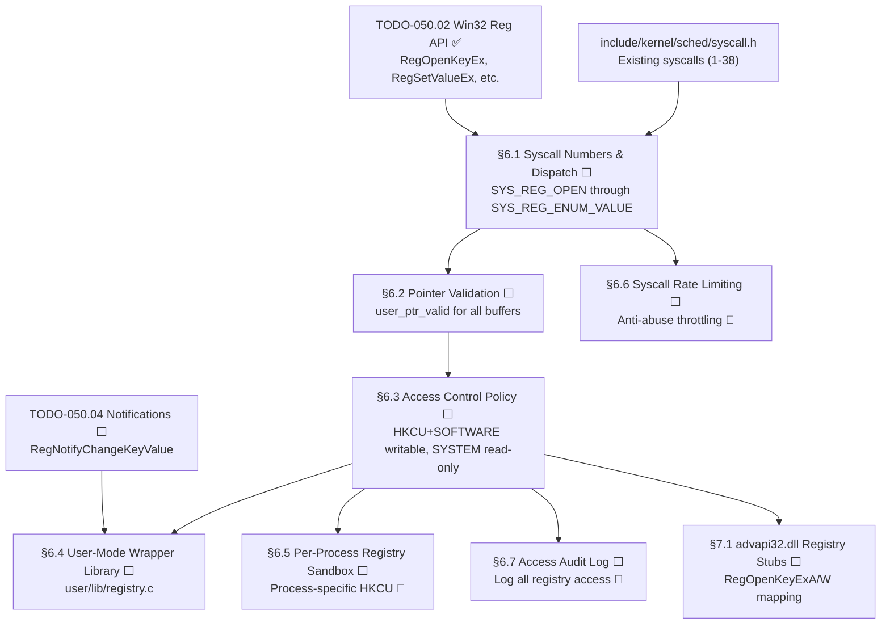

# 050.05-Syscalls — Registry Syscalls & Win32 Compatibility

> **Goal:** Expose the kernel Registry API to user-mode applications via syscalls, then
> provide a Win32-compatible `advapi32.dll` stub layer on top. User apps need registry
> access for storing settings (window positions, preferences, recent files). The syscall
> layer (`SYS_REG_OPEN` through `SYS_REG_ENUM_VALUE`) validates user pointers and enforces
> access control: user apps can write `HKCU` and `HKLM\SOFTWARE` but not `HKLM\SYSTEM` or
> `HKLM\HARDWARE`. The Win32 compatibility layer maps `RegOpenKeyExA/W` and friends to the
> native API, providing A/W (ANSI/Wide) variants for ported Windows applications. Includes
> Impossible OS exclusives: per-process registry sandbox, syscall rate limiting, and
> unified access audit log.

> [!IMPORTANT]
> **Prerequisite:** Depends on [TODO-050.02-Win32-Reg-API.md](TODO-050.02-Win32-Reg-API.md)
> (§2 Win32 API — all kernel-side registry functions) and the existing syscall infrastructure
> in `include/kernel/sched/syscall.h` (currently SYS_WRITE=1 through SYS_MUNMAP=38).

> [!CAUTION]
> **User pointer validation is mandatory.** Every syscall that reads or writes user-mode
> buffers MUST validate the pointer before dereferencing. Failure to validate allows
> user-mode code to read/write arbitrary kernel memory. Use `user_ptr_valid(ptr, size)`
> before any access.

> [!WARNING]
> **Access control is security-critical.** `HKLM\SYSTEM` and `HKLM\HARDWARE` contain
> kernel configuration and hardware detection data. Allowing user-mode writes to these
> keys would enable privilege escalation. The syscall layer MUST enforce the policy.

---

### Dependency Graph

### Phase-by-Phase Implementation Order

| ⭐  | Phase  | Section                              | Description                                                                    | Depends On      | Status |
| --- | :----: | ------------------------------------ | ------------------------------------------------------------------------------ | --------------- | :----: |
| 💎  | **0**  | TODO-050.02 + syscall.h              | Win32 API + existing syscall infrastructure                                    | —               |   ✅   |
| 💎  | **1**  | §6.1 Syscall Numbers & Dispatch      | Add 9 `SYS_REG_*` entries, dispatch in `syscall_handler`                       | Phase 0         |   ⬜   |
| 💎  | **1**  | §6.2 Pointer Validation              | `user_ptr_valid` checks on all buffer arguments                                | Phase 0         |   ⬜   |
| 💎  | **2**  | §6.3 Access Control Policy           | Enforce read-only for `HKLM\SYSTEM`, `HKLM\HARDWARE`                          | Phase 1         |   ⬜   |
| 💎  | **3**  | §6.4 User-Mode Wrapper Library       | `user/lib/registry.c` — clean C API for user apps                              | Phase 2 (§6.3)  |   ⬜   |
| 💎  | **3**  | §7.1 advapi32.dll Registry Stubs     | A/W variants mapped to native API for Win32 compat                             | Phase 2 (§6.3)  |   ⬜   |
| ⭐  | **4**  | §6.5 Per-Process Registry Sandbox    | Process-specific `HKCU` mapping (`HKU\{pid}`) 🚀                              | Phase 2 (§6.3)  |   ⬜   |
| ⭐  | **4**  | §6.6 Syscall Rate Limiting           | Throttle excessive registry calls per process 🚀                               | Phase 1 (§6.1)  |   ⬜   |
| ⭐  | **4**  | §6.7 Access Audit Log                | Log all registry access with PID, key, operation 🚀                            | Phase 2 (§6.3)  |   ⬜   |

> [!NOTE]
> **Phase 0 is complete.** The kernel registry API and syscall dispatch infrastructure
> already exist. Syscall numbers 1–38 are assigned in `syscall.h`.
>
> **Phase 1** adds the 9 registry syscall handlers and pointer validation. These must
> be implemented together — a syscall without pointer validation is a security hole.
>
> **Phase 2** adds access control — the policy layer that prevents user-mode code from
> modifying kernel-owned keys (`HKLM\SYSTEM`, `HKLM\HARDWARE`).
>
> **Phase 3** delivers user-facing APIs: the wrapper library for native apps and the
> Win32 compatibility stubs (`advapi32.dll`) for ported Windows applications.
>
> **Phase 4** adds exclusive features: per-process sandboxing (each process gets its
> own `HKCU` via PID-based mapping), rate limiting (prevents registry abuse from
> runaway apps), and audit logging (visible in system logs and Registry).

> [!TIP]
> **Syscall number assignment:** Use `SYS_REG_OPEN=40` through `SYS_REG_ENUM_VALUE=48`
> to leave a gap after the existing `SYS_MUNMAP=38` for future non-registry syscalls.
>
> **Pointer validation pattern:** Check `user_ptr_valid(buf, size)` returns true before
> reading or writing. For output parameters (`&handle`, `&size`), validate for
> `sizeof(uint32_t)` or `sizeof(uint64_t)` as appropriate.
>
> **Win32 A/W pattern:** The `A` (ANSI) variants pass through directly since Impossible OS
> uses UTF-8 internally. The `W` (Wide/UTF-16) variants convert UTF-16 → UTF-8 before
> calling the native API. For now, `W` variants can reject with `ERROR_CALL_NOT_IMPLEMENTED`
> and be added later when full Unicode support lands.

---

## 1. Syscall Layer

### 6.1 Syscall Numbers & Dispatch

**Prompt:** Add 9 registry syscall numbers to `include/kernel/sched/syscall.h` starting
at `SYS_REG_OPEN=40`. Add dispatch cases in `syscall_handler()` in `src/kernel/sched/syscall.c`
that extract arguments from registers (per the existing syscall ABI: `rdi`, `rsi`, `rdx`,
`r10`, `r8`, `r9`) and call the corresponding kernel registry functions (`RegOpenKeyEx`,
`RegCreateKeyEx`, `RegCloseKey`, `RegQueryValueEx`, `RegSetValueEx`, `RegDeleteKey`,
`RegDeleteValue`, `RegEnumKeyEx`, `RegEnumValue`). Each handler should validate arguments,
call the kernel function, and return the status code. After completing all items, mark
every item as `[x]`, update this prompt to a verification prompt, run
`bash scripts/build.sh clean`, and commit as `"registry: syscall numbers and dispatch"`.
Add notes directly in this TODO section. After implementation, save any gotchas to MCP memory.

- [ ] Define syscall numbers in `syscall.h`:
  - [ ] `SYS_REG_OPEN          40` — `(root, path, access, &handle)`
  - [ ] `SYS_REG_CREATE        41` — `(root, path, access, &handle, &disposition)`
  - [ ] `SYS_REG_CLOSE         42` — `(handle)`
  - [ ] `SYS_REG_QUERY         43` — `(handle, valueName, &type, data, &size)`
  - [ ] `SYS_REG_SET           44` — `(handle, valueName, type, data, size)`
  - [ ] `SYS_REG_DELETE_KEY    45` — `(handle, subKey)`
  - [ ] `SYS_REG_DELETE_VALUE  46` — `(handle, valueName)`
  - [ ] `SYS_REG_ENUM_KEY      47` — `(handle, index, name, &nameSize)`
  - [ ] `SYS_REG_ENUM_VALUE    48` — `(handle, index, name, &nameSize, &type, data, &dataSize)`
- [ ] Add dispatch cases in `syscall_handler()`:
  - [ ] Extract arguments from registers per ABI
  - [ ] Call corresponding `Reg*` kernel function
  - [ ] Return `ERROR_SUCCESS` / error code
- [ ] Commit: `"registry: syscall numbers and dispatch"`

### 6.2 Pointer Validation

**Prompt:** Add user-mode pointer validation to all registry syscalls. Every buffer
argument passed from user-mode must be validated before the kernel dereferences it.
Implement or reuse `user_ptr_valid(void *ptr, size_t size)` that checks: (1) pointer
is not NULL (unless allowed), (2) pointer falls within the user-mode address range
(below kernel base), (3) `ptr + size` does not overflow, (4) the page is mapped and
accessible. Call this for every buffer passed to registry syscalls: path strings,
value name strings, data buffers, and output parameters (`&handle`, `&type`, `&size`).
Return `ERROR_INVALID_PARAMETER` if validation fails. After completing all items,
mark every item as `[x]`, update this prompt to a verification prompt, run
`bash scripts/build.sh clean`, and commit as `"registry: syscall pointer validation"`.
Add notes directly in this TODO section.

- [ ] Implement or reuse `user_ptr_valid(ptr, size)`:
  - [ ] Check `ptr != NULL`
  - [ ] Check `ptr < KERNEL_BASE` (user-mode range)
  - [ ] Check `ptr + size` does not overflow
  - [ ] Check page is mapped (walk page tables or use VMM query)
- [ ] Validate in `SYS_REG_OPEN`: path string, `&handle` output
- [ ] Validate in `SYS_REG_CREATE`: path string, `&handle` output, `&disposition` output
- [ ] Validate in `SYS_REG_QUERY`: valueName string, `&type` output, data buffer, `&size` output
- [ ] Validate in `SYS_REG_SET`: valueName string, data buffer (size from arg)
- [ ] Validate in `SYS_REG_DELETE_KEY`: subKey string
- [ ] Validate in `SYS_REG_DELETE_VALUE`: valueName string
- [ ] Validate in `SYS_REG_ENUM_KEY`: name buffer, `&nameSize` output
- [ ] Validate in `SYS_REG_ENUM_VALUE`: name buffer, `&nameSize`, `&type`, data buffer, `&dataSize`
- [ ] Return `ERROR_INVALID_PARAMETER` on any validation failure
- [ ] Commit: `"registry: syscall pointer validation"`

---

## 2. Access Control

### 6.3 Access Control Policy

**Prompt:** Implement access control for registry syscalls. User-mode processes can
read any key but can only write to `HKCU` (redirects to `HKU\{user}`) and
`HKLM\SOFTWARE`. Writes to `HKLM\SYSTEM`, `HKLM\HARDWARE`, and `HKCR` are blocked
with `ERROR_ACCESS_DENIED`. The policy is checked in the syscall layer, not in the
kernel API — kernel code retains full access. Implement `reg_check_write_access(HKEY root,
const char *path)` that returns `ERROR_SUCCESS` or `ERROR_ACCESS_DENIED`. Call this
from `SYS_REG_CREATE`, `SYS_REG_SET`, `SYS_REG_DELETE_KEY`, and `SYS_REG_DELETE_VALUE`.
Read-only syscalls (`SYS_REG_OPEN`, `SYS_REG_QUERY`, `SYS_REG_ENUM_*`) skip this
check.  After completing all items, mark every item as `[x]`, update this prompt to a
verification prompt, run `bash scripts/build.sh clean`, and commit as
`"registry: access control policy"`. Add notes directly in this TODO section.

- [ ] Implement `reg_check_write_access(HKEY root, const char *path)`:
  - [ ] Allow: `HKCU\*` (any path under current user)
  - [ ] Allow: `HKLM\SOFTWARE\*` (application settings)
  - [ ] Deny: `HKLM\SYSTEM\*` (kernel configuration)
  - [ ] Deny: `HKLM\HARDWARE\*` (hardware detection data)
  - [ ] Deny: `HKCR\*` (merged class root — read-only from user-mode)
  - [ ] Allow: `HKU\Default\*` (only for the owning user, future)
- [ ] Hook into write syscalls:
  - [ ] `SYS_REG_CREATE` — check before calling `RegCreateKeyEx`
  - [ ] `SYS_REG_SET` — check before calling `RegSetValueEx`
  - [ ] `SYS_REG_DELETE_KEY` — check before calling `RegDeleteKey`
  - [ ] `SYS_REG_DELETE_VALUE` — check before calling `RegDeleteValue`
- [ ] Skip check for read-only syscalls (`SYS_REG_OPEN`, `SYS_REG_QUERY`, `SYS_REG_ENUM_*`)
- [ ] Return `ERROR_ACCESS_DENIED` with klog warning on denied writes
- [ ] Commit: `"registry: access control policy"`

---

## 3. User-Mode Libraries

### 6.4 User-Mode Wrapper Library

**Prompt:** Create `user/lib/registry.c` and `sdk/include/registry.h` providing a
clean C API for user-mode applications to access the registry via syscalls. Each wrapper
function issues the corresponding `syscall()` call using inline assembly (matching the
existing pattern in `user/lib/`). Provide: `RegOpen(root, path, &handle)`,
`RegCreate(root, path, &handle)`, `RegClose(handle)`, `RegGetDword(handle, name, &value)`,
`RegSetDword(handle, name, value)`, `RegGetString(handle, name, buf, bufsize)`,
`RegSetString(handle, name, str)`, `RegDeleteKey(handle, subKey)`,
`RegDeleteValue(handle, name)`. These are simplified wrappers — the full
`RegQueryValueEx`/`RegSetValueEx` signatures are available via raw syscall. After
completing all items, mark every item as `[x]`, update this prompt to a verification
prompt, run `bash scripts/build.sh clean`, and commit as
`"registry: user-mode wrapper library"`. Add notes directly in this TODO section.

- [ ] Create `sdk/include/registry.h` — user-mode registry API header
- [ ] Create `user/lib/registry.c` — syscall wrappers:
  - [ ] `RegOpen(root, path, &handle)` → `SYS_REG_OPEN`
  - [ ] `RegCreate(root, path, &handle)` → `SYS_REG_CREATE`
  - [ ] `RegClose(handle)` → `SYS_REG_CLOSE`
  - [ ] `RegGetDword(handle, name, &value)` → `SYS_REG_QUERY`
  - [ ] `RegSetDword(handle, name, value)` → `SYS_REG_SET`
  - [ ] `RegGetString(handle, name, buf, size)` → `SYS_REG_QUERY`
  - [ ] `RegSetString(handle, name, str)` → `SYS_REG_SET`
  - [ ] `RegDeleteKey(handle, subKey)` → `SYS_REG_DELETE_KEY`
  - [ ] `RegDeleteValue(handle, name)` → `SYS_REG_DELETE_VALUE`
- [ ] Define user-mode `HKEY` constants matching kernel values
- [ ] Add to user-mode build (link with user programs)
- [ ] Test: `hello.exe` reads `HKCU\Test\Greeting`, prints it
- [ ] Commit: `"registry: user-mode wrapper library"`

---

## 4. Win32 Compatibility

### 7.1 advapi32.dll Registry Stubs

**Prompt:** Implement Win32-compatible `advapi32.dll` registry stubs for the Win32
compatibility layer. Windows apps access the registry via `RegOpenKeyExA/W`,
`RegQueryValueExA/W`, `RegSetValueExA/W` — these are A (ANSI) and W (Wide/UTF-16)
variants. Since Impossible OS uses UTF-8 internally, the A variants map directly:
`RegOpenKeyExA` → `RegOpenKeyEx`. The W variants need UTF-16 → UTF-8 conversion.
The hive paths (`HKEY_LOCAL_MACHINE`, `HKEY_CURRENT_USER`, etc.) map 1:1 to native
root keys. Each `REG_*` type constant matches our native types. Register all functions
in the `advapi32.dll` builtin stub table. After completing all items, mark every item
as `[x]`, update this prompt to a verification prompt, run `bash scripts/build.sh clean`,
and commit as `"win32: registry API stubs"`. Add notes directly in this TODO section.

- [ ] Map Windows hive handles to native roots:
  - [ ] `HKEY_LOCAL_MACHINE\SOFTWARE` → `HKLM\SOFTWARE`
  - [ ] `HKEY_LOCAL_MACHINE\HARDWARE` → `HKLM\HARDWARE`
  - [ ] `HKEY_LOCAL_MACHINE\SYSTEM` → `HKLM\SYSTEM`
  - [ ] `HKEY_CURRENT_USER` → `HKCU` (→ `HKU\{user}`)
  - [ ] `HKEY_CURRENT_USER\Software\{App}` → `HKCU\Software\{App}`
  - [ ] `HKEY_CLASSES_ROOT` → `HKCR` (merged view)
  - [ ] `HKEY_USERS` → `HKU`
  - [ ] `HKEY_CURRENT_CONFIG` → `HKCC`
- [ ] Implement A-variant stubs (direct passthrough to native API):
  - [ ] `RegOpenKeyExA` → `RegOpenKeyEx`
  - [ ] `RegCreateKeyExA` → `RegCreateKeyEx`
  - [ ] `RegQueryValueExA` → `RegQueryValueEx`
  - [ ] `RegSetValueExA` → `RegSetValueEx`
  - [ ] `RegDeleteKeyA` → `RegDeleteKey`
  - [ ] `RegDeleteValueA` → `RegDeleteValue`
  - [ ] `RegEnumKeyExA` → `RegEnumKeyEx`
  - [ ] `RegEnumValueA` → `RegEnumValue`
  - [ ] `RegCloseKey` → `RegCloseKey` (no A/W distinction)
- [ ] Implement W-variant stubs (UTF-16 → UTF-8 conversion):
  - [ ] `RegOpenKeyExW` — convert path, call `RegOpenKeyEx`
  - [ ] `RegCreateKeyExW`, `RegQueryValueExW`, `RegSetValueExW`
  - [ ] `RegDeleteKeyW`, `RegDeleteValueW`
  - [ ] `RegEnumKeyExW`, `RegEnumValueW`
  - [ ] (OR) return `ERROR_CALL_NOT_IMPLEMENTED` until full Unicode lands
- [ ] Register in `advapi32.dll` builtin stub table
- [ ] Verify type constants match: `REG_SZ=1`, `REG_DWORD=4`, `REG_BINARY=3`, `REG_QWORD=11`
- [ ] Commit: `"win32: registry API stubs"`

---

## 5. Exclusive Features

### 6.5 Per-Process Registry Sandbox 🚀

**Prompt:** Implement per-process registry sandboxing. Each process gets its own
`HKCU` namespace by mapping `HKCU` to `HKU\{pid}` instead of a shared user key.
This prevents one user-mode process from reading or modifying another process's
settings. On process creation, copy `HKU\Default` to `HKU\{pid}` (copy-on-write
semantics — only create the key when first written). On process exit, optionally
persist or discard the per-process hive based on a policy flag in
`HKLM\SYSTEM\Registry\SandboxPolicy` (values: `persist`, `discard`, `merge`).
After completing all items, mark every item as `[x]`, update this prompt to a
verification prompt, run `bash scripts/build.sh clean`, and commit as
`"registry: per-process sandbox"`. Add notes directly in this TODO section.

> [!NOTE]
> 🚀 **Impossible OS Exclusive:** Neither Windows nor Linux provides per-process
> registry isolation. Windows shares `HKCU` among all processes of a user. Linux
> has no registry. Impossible OS sandboxes each process's `HKCU`, preventing
> cross-process settings leakage.

- [ ] Map `HKCU` to `HKU\{pid}` in syscall layer (not kernel API)
- [ ] On first `HKCU` write: copy `HKU\Default` subtree to `HKU\{pid}`
- [ ] On `HKCU` read without write: fall through to `HKU\Default`
- [ ] On process exit: check `HKLM\SYSTEM\Registry\SandboxPolicy`:
  - [ ] `persist` — keep `HKU\{pid}` across sessions (default for desktop apps)
  - [ ] `discard` — delete `HKU\{pid}` on exit (default for CLI tools)
  - [ ] `merge` — merge changes back to `HKU\Default`
- [ ] Registry value: `HKLM\SYSTEM\Registry\SandboxPolicy` (REG_SZ, default `"persist"`)
- [ ] Commit: `"registry: per-process sandbox"`

### 6.6 Syscall Rate Limiting 🚀

**Prompt:** Implement per-process rate limiting for registry syscalls. Track the number
of registry syscalls per process per second. If a process exceeds
`REG_RATE_LIMIT_PER_SEC` (default 1000, configurable via
`HKLM\SYSTEM\Registry\RateLimitPerSec`), return `ERROR_BUSY` for subsequent calls
until the next second window. This prevents runaway applications from monopolizing
the registry (e.g., a bug causing an infinite loop of `RegSetValueEx`). Log throttled
processes via klog. After completing all items, mark every item as `[x]`, update this
prompt to a verification prompt, run `bash scripts/build.sh clean`, and commit as
`"registry: syscall rate limiting"`. Add notes directly in this TODO section.

> [!NOTE]
> 🚀 **Impossible OS Exclusive:** Neither Windows nor Linux rate-limits registry
> access. A misbehaving Windows app can flood the registry with millions of writes
> per second, degrading system performance. Impossible OS throttles at the syscall
> boundary with a configurable limit.

- [ ] Track per-process registry call count (in task struct or side table)
- [ ] Reset counter every second (PIT tick-based)
- [ ] Check count in syscall dispatch — return `ERROR_BUSY` if exceeded
- [ ] Log throttled PID via `klog`: `[Registry] PID %d throttled (%d calls/sec)`
- [ ] Registry value: `HKLM\SYSTEM\Registry\RateLimitPerSec` (REG_DWORD, default 1000)
- [ ] Exempt kernel-mode callers from rate limiting
- [ ] Commit: `"registry: syscall rate limiting"`

### 6.7 Access Audit Log 🚀

**Prompt:** Implement a registry access audit log that records every user-mode registry
operation with PID, timestamp, operation type, key path, and result. Log entries are
written to a ring buffer in kernel memory and periodically flushed to
`C:\Impossible\System\Logs\registry-audit.log`. The audit can be enabled/disabled
via `HKLM\SYSTEM\Registry\AuditEnabled` (REG_DWORD, default 0 = disabled). When
enabled, each log entry consumes ~128 bytes; the ring buffer holds 4096 entries (512 KB
total). After completing all items, mark every item as `[x]`, update this prompt to a
verification prompt, run `bash scripts/build.sh clean`, and commit as
`"registry: access audit log"`. Add notes directly in this TODO section.

> [!NOTE]
> 🚀 **Impossible OS Exclusive:** Windows provides registry auditing only via
> Event Tracing for Windows (ETW) — complex to configure, heavy overhead. Linux has
> no registry auditing. Impossible OS provides a simple on/off toggle in the Registry
> with lightweight ring-buffer logging.

- [ ] Define `reg_audit_entry_t` struct (~128 bytes):
  - [ ] `uint32_t pid`, `uint64_t timestamp`, `uint32_t operation`
  - [ ] `char key_path[64]`, `char value_name[32]`, `uint32_t result`
- [ ] Allocate ring buffer: `pmm_alloc_contiguous()` for 512 KB (4096 entries)
- [ ] Insert entry from each registry syscall handler (after execution)
- [ ] Periodically flush to `C:\Impossible\System\Logs\registry-audit.log`
- [ ] Registry value: `HKLM\SYSTEM\Registry\AuditEnabled` (REG_DWORD, default 0)
- [ ] Check audit flag in syscall dispatch — skip logging if disabled
- [ ] Commit: `"registry: access audit log"`

---

## Priority Order

| Priority | Section                                 | Description                                                         |
| -------- | --------------------------------------- | ------------------------------------------------------------------- |
| 🟡 P2   | §6.1 Syscall Numbers & Dispatch         | Foundation: add 9 `SYS_REG_*` syscalls to handler                   |
| 🟡 P2   | §6.2 Pointer Validation                 | Security: validate all user buffers before access                    |
| 🟡 P2   | §6.3 Access Control Policy              | Security: enforce HKCU+SOFTWARE writable, SYSTEM read-only           |
| 🟡 P2   | §6.4 User-Mode Wrapper Library          | Usability: clean C API for user-mode apps                            |
| 🟢 P3   | §7.1 advapi32.dll Registry Stubs        | Compat: A/W variants for Win32 apps                                  |
| 🟢 P3   | §6.5 Per-Process Registry Sandbox       | 🚀 **Exclusive** — process-specific HKCU isolation                   |
| 🟢 P3   | §6.6 Syscall Rate Limiting              | 🚀 **Exclusive** — anti-abuse throttling per process                 |
| 🔵 P4   | §6.7 Access Audit Log                   | 🚀 **Exclusive** — ring-buffer audit with on/off toggle              |

---

## OS Comparison

| Feature                                    | 🪟 Windows 11                               | 🐧 Linux                                    | 🚀 Impossible OS                                         |
| ------------------------------------------ | ------------------------------------------- | -------------------------------------------- | -------------------------------------------------------- |
| User-mode registry access via syscalls     | ✅ NtOpenKey, NtSetValueKey (ntdll)          | ❌ No registry (dconf via D-Bus IPC)          | ⬜ §6.1 P2 — `SYS_REG_*` syscalls                        |
| User pointer validation                    | ✅ ProbeForRead/ProbeForWrite                | ✅ copy_from_user/copy_to_user               | ⬜ §6.2 P2 — `user_ptr_valid` checks                     |
| Access control (user vs kernel keys)       | ✅ ACL-based per key (SAM, SECURITY)         | ❌ No concept                                 | ⬜ §6.3 P2 — policy-based (HKCU+SOFTWARE writable)        |
| User-mode wrapper library                  | ✅ advapi32.dll (RegOpenKeyEx, etc.)         | ⚠️ GLib dconf API (user-space only)          | ⬜ §6.4 P2 — `user/lib/registry.c`                       |
| Win32 A/W API variants                     | ✅ Full A/W support (ANSI + Wide)            | ❌ No concept                                 | ⬜ §7.1 P3 — A passthrough, W with UTF-16 conversion      |
| advapi32.dll compatibility                 | ✅ Native (built-in DLL)                     | ⚠️ Wine reimplements                         | ⬜ §7.1 P3 — builtin stub table                           |
| **Per-process registry sandbox**           | ❌ HKCU shared among all user processes      | ❌ No concept                                 | ⬜ §6.5 P3 — **per-PID HKCU isolation** 🚀               |
| **Syscall rate limiting**                  | ❌ No rate limit (unlimited writes)          | ❌ No rate limit                              | ⬜ §6.6 P3 — **configurable throttle per process** 🚀    |
| **Access audit log**                       | ⚠️ ETW-based (complex, heavy overhead)       | ❌ No registry audit                          | ⬜ §6.7 P4 — **simple on/off toggle, ring buffer** 🚀    |
| **Static-pool syscall dispatch**           | ❌ Dynamic kernel pool                       | ❌ Dynamic allocation                         | ⬜ §6.1 P2 — **zero heap pressure in dispatch** 🚀       |

> **After P2 items:** Impossible OS provides secure user-mode registry access with pointer
> validation and access control — matching Windows feature-for-feature on core functionality.
> **After P3 exclusive features:** Exceeds both Windows and Linux with per-process HKCU
> sandboxing, syscall rate limiting, and Win32 A/W compatibility via advapi32.dll stubs.
> **After P4 items:** Full audit logging with ring-buffer and configurable toggle —
> simpler than Windows ETW, more capable than Linux (which has no registry at all).
