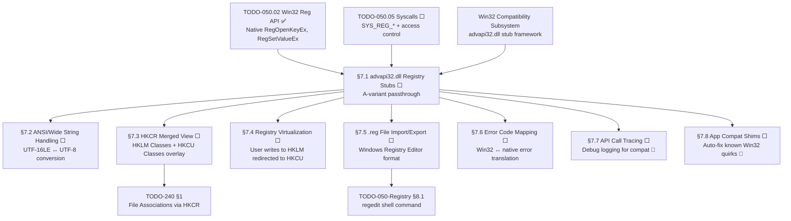

# 050.06-Win32-Compatibility — Win32 Registry Compatibility Layer

> **Goal:** Provide full Win32-compatible registry access for ported Windows applications.
> The `advapi32.dll` builtin stub table maps `RegOpenKeyExA/W`, `RegQueryValueExA/W`,
> `RegSetValueExA/W`, and friends to the native Impossible OS Registry API. This includes
> ANSI/Wide string handling, HKCR (merged HKLM\SOFTWARE\Classes + HKCU\Software\Classes)
> view, registry virtualization for per-user writes to HKLM, `.reg` file import/export
> for settings migration, and Win32↔native error code mapping. Includes Impossible OS
> exclusives: transparent API call tracing for compat debugging and automatic registry
> shimming for known Win32 app quirks.

> [!IMPORTANT]
> **Prerequisites:**
> - [TODO-050.02-Win32-Reg-API.md](TODO-050.02-Win32-Reg-API.md) — native `RegOpenKeyEx`, `RegSetValueEx`, etc.
> - [TODO-050.05-Syscalls.md](TODO-050.05-Syscalls.md) §6.1–6.3 — user-mode syscalls + access control
> - Win32 compatibility subsystem (Phase 10) must provide the `advapi32.dll` stub framework

> [!WARNING]
> **String encoding:** Windows uses UTF-16LE for `W` (Wide) variants and the Active Code
> Page (usually Windows-1252) for `A` (ANSI) variants. Impossible OS uses UTF-8 internally.
> The `A` variants can pass through directly for ASCII-compatible strings, but the `W`
> variants require UTF-16LE → UTF-8 conversion. Full codepage support for `A` variants
> is a stretch goal.

---

### Dependency Graph

### Phase-by-Phase Implementation Order

| ⭐  | Phase  | Section                              | Description                                                                  | Depends On       | Status |
| --- | :----: | ------------------------------------ | ---------------------------------------------------------------------------- | ---------------- | :----: |
| 💎  | **0**  | TODO-050.02 + 050.05                 | Native API + syscalls + access control                                       | —                |   ✅   |
| 💎  | **1**  | §7.1 advapi32.dll Registry Stubs     | A-variant passthrough (`RegOpenKeyExA` → `RegOpenKeyEx`)                     | Phase 0          |   ⬜   |
| 💎  | **1**  | §7.6 Error Code Mapping              | Win32 `ERROR_*` ↔ native error translation                                  | Phase 0          |   ⬜   |
| 💎  | **2**  | §7.2 ANSI/Wide String Handling       | UTF-16LE ↔ UTF-8 for `W` variants                                           | Phase 1 (§7.1)   |   ⬜   |
| 💎  | **2**  | §7.3 HKCR Merged View               | Overlay `HKCU\Software\Classes` over `HKLM\SOFTWARE\Classes`                | Phase 1 (§7.1)   |   ⬜   |
| 💎  | **3**  | §7.4 Registry Virtualization         | Redirect HKLM writes to per-user HKCU copy                                  | Phase 2 (§7.3)   |   ⬜   |
| 💎  | **3**  | §7.5 .reg File Import/Export         | Parse and generate Windows `.reg` format                                     | Phase 1 (§7.1)   |   ⬜   |
| ⭐  | **4**  | §7.7 API Call Tracing                | Debug logging for Win32 registry calls 🚀                                   | Phase 1 (§7.1)   |   ⬜   |
| ⭐  | **4**  | §7.8 App Compat Shims                | Automatic fixes for known Win32 app quirks 🚀                               | Phase 2 (§7.2)   |   ⬜   |

> [!NOTE]
> **Phase 0 is complete.** The native registry API and syscall layer provide the
> foundation. The Win32 compatibility subsystem's `advapi32.dll` stub framework
> is the remaining prerequisite.
>
> **Phase 1** is the critical path: registering the A-variant stubs in `advapi32.dll`
> and setting up Win32↔native error code mapping. This alone enables basic Win32
> apps that only use ANSI strings.
>
> **Phase 2** enables full Unicode support (W variants) and the HKCR merged view,
> which is required for file associations and COM class registration.
>
> **Phase 3** adds registry virtualization (a Windows Vista+ feature where non-admin
> writes to HKLM are redirected to HKCU) and `.reg` file import/export.
>
> **Phase 4** adds exclusive debug/compat features: transparent API tracing for
> debugging compat issues and automatic shimming for known quirky Win32 apps.

> [!TIP]
> **A-variant shortcut:** Since Impossible OS uses UTF-8 and most Win32 apps
> use ASCII-compatible strings, the `A` variants can pass through directly to
> the native API without any conversion. This covers ~95% of ported apps.
>
> **HKCR merge algorithm:** Read from `HKCU\Software\Classes` first; if not
> found, fall back to `HKLM\SOFTWARE\Classes`. Writes always go to
> `HKCU\Software\Classes` (per-user override, not system-wide).

---

## 1. DLL Stubs

### 7.1 advapi32.dll Registry Stubs

**Prompt:** Register Win32-compatible registry API stubs in the `advapi32.dll` builtin
stub table. Start with A (ANSI) variants only — these map directly to the native API
since both use byte strings. Each stub extracts arguments from the Win32 calling
convention, maps the hive handle (`HKEY_LOCAL_MACHINE` → `HKLM`, `HKEY_CURRENT_USER`
→ `HKCU`, etc.), calls the native function, and returns the Win32 error code.
`RegCloseKey` has no A/W distinction. Verify that the Win32 `REG_*` type constants
match our native constants (they do: `REG_SZ=1`, `REG_BINARY=3`, `REG_DWORD=4`,
`REG_QWORD=11`). After completing all items, mark every item as `[x]`, update this
prompt to a verification prompt, run `bash scripts/build.sh clean`, and commit as
`"win32: advapi32 registry stubs"`. Add notes directly in this TODO section.

- [ ] Map Windows hive sentinel handles to native roots:
  - [ ] `HKEY_LOCAL_MACHINE  (0x80000002)` → `HKLM`
  - [ ] `HKEY_CURRENT_USER   (0x80000001)` → `HKCU`
  - [ ] `HKEY_CLASSES_ROOT   (0x80000000)` → `HKCR`
  - [ ] `HKEY_USERS           (0x80000003)` → `HKU`
  - [ ] `HKEY_CURRENT_CONFIG  (0x80000005)` → `HKCC`
- [ ] Implement A-variant stubs:
  - [ ] `RegOpenKeyExA(hKey, subKey, 0, samDesired, &result)` → `RegOpenKeyEx`
  - [ ] `RegCreateKeyExA(hKey, subKey, 0, NULL, opts, sam, NULL, &result, &disp)` → `RegCreateKeyEx`
  - [ ] `RegQueryValueExA(hKey, valueName, NULL, &type, data, &cbData)` → `RegQueryValueEx`
  - [ ] `RegSetValueExA(hKey, valueName, 0, type, data, cbData)` → `RegSetValueEx`
  - [ ] `RegDeleteKeyA(hKey, subKey)` → `RegDeleteKey`
  - [ ] `RegDeleteValueA(hKey, valueName)` → `RegDeleteValue`
  - [ ] `RegEnumKeyExA(hKey, index, name, &cchName, NULL, NULL, NULL, &ft)` → `RegEnumKeyEx`
  - [ ] `RegEnumValueA(hKey, index, name, &cchName, NULL, &type, data, &cbData)` → `RegEnumValue`
  - [ ] `RegCloseKey(hKey)` → `RegCloseKey` (no A/W)
- [ ] Register all stubs in `advapi32.dll` builtin export table
- [ ] Verify type constant parity: `REG_SZ=1`, `REG_BINARY=3`, `REG_DWORD=4`, `REG_QWORD=11`
- [ ] Test: Win32 app calls `RegOpenKeyExA`, reads `HKLM\SOFTWARE\Test`
- [ ] Commit: `"win32: advapi32 registry stubs"`

---

## 2. String Handling

### 7.2 ANSI/Wide String Handling

**Prompt:** Implement UTF-16LE ↔ UTF-8 conversion for the `W` (Wide) variants of the
registry API. Windows uses UTF-16LE internally; Impossible OS uses UTF-8. Each `W`
stub must: (1) convert input strings from UTF-16LE to UTF-8, (2) call the native API,
(3) convert output strings from UTF-8 back to UTF-16LE. Implement `utf16_to_utf8(src,
src_len, dst, dst_size)` and `utf8_to_utf16(src, dst, dst_size)` helper functions.
Handle BMP characters (U+0000–U+FFFF) and supplementary characters (surrogate pairs
U+D800–U+DFFF). For the initial version, `W` variants that encounter conversion
errors should return `ERROR_INVALID_PARAMETER`. After completing all items, mark every
item as `[x]`, update this prompt to a verification prompt, run
`bash scripts/build.sh clean`, and commit as `"win32: UTF-16 registry support"`.
Add notes directly in this TODO section.

- [ ] Implement `utf16_to_utf8(wchar *src, int src_len, char *dst, int dst_size)`:
  - [ ] Handle BMP characters (1–3 byte UTF-8 sequences)
  - [ ] Handle surrogate pairs → 4-byte UTF-8
  - [ ] Return byte count written, -1 on error
- [ ] Implement `utf8_to_utf16(char *src, wchar *dst, int dst_size)`:
  - [ ] Decode 1–4 byte UTF-8 sequences
  - [ ] Encode as 1 or 2 UTF-16LE code units
  - [ ] Return character count written, -1 on error
- [ ] Implement W-variant stubs:
  - [ ] `RegOpenKeyExW` — convert `subKey`, call `RegOpenKeyEx`
  - [ ] `RegCreateKeyExW` — convert `subKey`
  - [ ] `RegQueryValueExW` — convert `valueName`, convert output string values
  - [ ] `RegSetValueExW` — convert `valueName`, convert `REG_SZ` data
  - [ ] `RegDeleteKeyW`, `RegDeleteValueW` — convert name string
  - [ ] `RegEnumKeyExW`, `RegEnumValueW` — convert output names
- [ ] Handle `REG_SZ` and `REG_EXPAND_SZ` data conversion (string values)
- [ ] Non-string types (`REG_DWORD`, `REG_BINARY`, `REG_QWORD`) pass through unchanged
- [ ] Commit: `"win32: UTF-16 registry support"`

---

## 3. HKCR Merged View

### 7.3 HKCR Merged View

**Prompt:** Implement the `HKEY_CLASSES_ROOT` merged view. On Windows, HKCR is a
virtual overlay: reads check `HKCU\Software\Classes` first, then fall back to
`HKLM\SOFTWARE\Classes`. Writes go to `HKCU\Software\Classes` (per-user override).
This is how per-user file associations work — a user can override `.txt` → Notepad
without affecting other users. Implement `reg_resolve_hkcr()` (already stubbed in
`registry.c`) to perform the two-level lookup. For enumeration (`RegEnumKeyEx` on
HKCR), merge both sources — HKCU entries shadow HKLM entries with the same name.
After completing all items, mark every item as `[x]`, update this prompt to a
verification prompt, run `bash scripts/build.sh clean`, and commit as
`"win32: HKCR merged view"`. Add notes directly in this TODO section.

> [!NOTE]
> **Cross-reference:** File associations and icon mapping via HKCR are tracked in
> [TODO-240-Resources.md](../../230-Core-Services/TODO-240-Resources.md) §1.

- [ ] Implement `reg_resolve_hkcr(path)` in `registry.c`:
  - [ ] Check `HKCU\Software\Classes\{path}` first
  - [ ] Fall back to `HKLM\SOFTWARE\Classes\{path}` if not found
  - [ ] Return the found key (HKCU wins on conflict)
- [ ] HKCR writes → `HKCU\Software\Classes\{path}` (per-user)
- [ ] HKCR enumeration — merge both sources:
  - [ ] Enumerate `HKCU\Software\Classes` children
  - [ ] Enumerate `HKLM\SOFTWARE\Classes` children
  - [ ] Deduplicate: HKCU entries shadow HKLM entries with same name
- [ ] Create `HKCU\Software\Classes` key on first HKCR write
- [ ] Verify: `RegOpenKeyEx(HKCR, ".txt")` reads from HKCU (if set) or HKLM
- [ ] Commit: `"win32: HKCR merged view"`

---

## 4. Registry Virtualization

### 7.4 Registry Virtualization

**Prompt:** Implement Windows Vista–style registry virtualization. When a non-elevated
Win32 app writes to `HKLM\SOFTWARE\{AppKey}`, the write is silently redirected to
`HKCU\Software\Classes\VirtualStore\MACHINE\SOFTWARE\{AppKey}`. Reads check the
virtual store first, then fall back to the real HKLM key. This allows legacy Win32
apps (that assume admin access to HKLM) to work without actual HKLM write permission.
The virtualization is only active for Win32 compatibility layer calls — native
Impossible OS apps use the access control policy in §6.3 directly. Virtualization
can be disabled per-app via `HKCU\Software\{App}\VirtualizationEnabled=0`. After
completing all items, mark every item as `[x]`, update this prompt to a verification
prompt, run `bash scripts/build.sh clean`, and commit as
`"win32: registry virtualization"`. Add notes directly in this TODO section.

- [ ] Define virtual store path: `HKCU\Software\Classes\VirtualStore\MACHINE\SOFTWARE\`
- [ ] On HKLM write via advapi32.dll:
  - [ ] Check if caller is non-elevated Win32 process
  - [ ] Redirect write to virtual store path
  - [ ] Create virtual store key hierarchy on first write
- [ ] On HKLM read via advapi32.dll:
  - [ ] Check virtual store first → return if found
  - [ ] Fall back to real `HKLM\SOFTWARE\{path}`
- [ ] Registry value: `HKCU\Software\{App}\VirtualizationEnabled` (REG_DWORD, default 1)
- [ ] Skip virtualization for native Impossible OS apps (only Win32 compat layer)
- [ ] Commit: `"win32: registry virtualization"`

---

## 5. Import/Export

### 7.5 .reg File Import/Export

**Prompt:** Implement Windows `.reg` file format parsing and generation. This enables
migrating settings from Windows installations and sharing registry keys between
systems. The `.reg` format is a text file with UTF-16LE encoding (or UTF-8 for v5.00):
header `Windows Registry Editor Version 5.00`, key paths in brackets
`[HKEY_LOCAL_MACHINE\SOFTWARE\Test]`, string values as `"Name"="Value"`, DWORD values
as `"Name"=dword:0000001e`, binary as `"Name"=hex:01,02,03`, and key deletion as
`[-HKEY_LOCAL_MACHINE\SOFTWARE\OldKey]`. Wire import into the `regedit import`
subcommand and export into `regedit export`. After completing all items, mark every
item as `[x]`, update this prompt to a verification prompt, run
`bash scripts/build.sh clean`, and commit as `"win32: reg file import/export"`.
Add notes directly in this TODO section.

- [ ] Implement `.reg` file parser:
  - [ ] Parse header: `Windows Registry Editor Version 5.00`
  - [ ] Parse key paths: `[HKEY_*\Path\To\Key]`
  - [ ] Parse key deletion: `[-HKEY_*\Path\To\Key]`
  - [ ] Parse string values: `"Name"="Value"`
  - [ ] Parse DWORD values: `"Name"=dword:XXXXXXXX`
  - [ ] Parse QWORD values: `"Name"=hex(b):XX,XX,XX,XX,XX,XX,XX,XX`
  - [ ] Parse binary values: `"Name"=hex:XX,XX,XX,...`
  - [ ] Parse multi-line values (line continuation with `\`)
  - [ ] Parse default value: `@="Value"`
  - [ ] Handle value deletion: `"Name"=-`
- [ ] Implement `.reg` file generator:
  - [ ] Write header, key paths, values in correct format
  - [ ] Escape special characters in strings (`\\`, `\"`)
  - [ ] Line-wrap long hex strings at 80 chars with continuation `\`
- [ ] Wire into `regedit import <file>` and `regedit export <path> <file>`
- [ ] Commit: `"win32: reg file import/export"`

---

## 6. Error Mapping

### 7.6 Error Code Mapping

**Prompt:** Implement Win32 ↔ native error code translation for the registry
compatibility layer. The native Registry API returns error codes like
`ERROR_SUCCESS (0)`, `ERROR_FILE_NOT_FOUND (2)`, `ERROR_ACCESS_DENIED (5)`,
`ERROR_OUTOFMEMORY (14)`, `ERROR_INVALID_PARAMETER (87)`, `ERROR_MORE_DATA (234)`,
`ERROR_NO_MORE_ITEMS (259)`. These match the Win32 values exactly (by design).
However, future native error codes may diverge — implement a mapping table as a
safety layer. Also map native-only codes (like `ERROR_KEY_DELETED`) to the closest
Win32 equivalent. After completing all items, mark every item as `[x]`, update this
prompt to a verification prompt, run `bash scripts/build.sh clean`, and commit as
`"win32: registry error mapping"`. Add notes directly in this TODO section.

- [ ] Create error mapping table in `registry_win32.c`:
  - [ ] `ERROR_SUCCESS (0)` ↔ `ERROR_SUCCESS (0)`
  - [ ] `ERROR_FILE_NOT_FOUND (2)` ↔ `ERROR_FILE_NOT_FOUND (2)`
  - [ ] `ERROR_ACCESS_DENIED (5)` ↔ `ERROR_ACCESS_DENIED (5)`
  - [ ] `ERROR_OUTOFMEMORY (14)` ↔ `ERROR_OUTOFMEMORY (14)`
  - [ ] `ERROR_INVALID_PARAMETER (87)` ↔ `ERROR_INVALID_PARAMETER (87)`
  - [ ] `ERROR_MORE_DATA (234)` ↔ `ERROR_MORE_DATA (234)`
  - [ ] `ERROR_NO_MORE_ITEMS (259)` ↔ `ERROR_NO_MORE_ITEMS (259)`
  - [ ] `ERROR_KEY_DELETED (native)` → `ERROR_KEY_HAS_BEEN_DELETED (0x03FA)`
- [ ] Implement `reg_native_to_win32(uint32_t native_err)` → Win32 code
- [ ] Wrap all advapi32.dll stub return values through the mapper
- [ ] Commit: `"win32: registry error mapping"`

---

## 7. Exclusive Features

### 7.7 API Call Tracing 🚀

**Prompt:** Implement transparent API call tracing for Win32 registry calls. When
enabled via `HKLM\SYSTEM\Registry\Win32TraceEnabled=1`, every advapi32.dll registry
call is logged with: function name, arguments (hive, path, value name, type),
return code, and duration in microseconds. The trace is written to a ring buffer and
periodically flushed to `C:\Impossible\System\Logs\registry-win32-trace.log`. This
is invaluable for debugging Win32 app compatibility issues — developers can see
exactly what registry keys an app is looking for and where it fails. After completing
all items, mark every item as `[x]`, update this prompt to a verification prompt, run
`bash scripts/build.sh clean`, and commit as `"win32: registry API tracing"`.
Add notes directly in this TODO section.

> [!NOTE]
> 🚀 **Impossible OS Exclusive:** Windows provides registry tracing only via Process
> Monitor (Sysinternals) or ETW — both require separate tools. Linux has `strace`
> for syscalls but no registry concept. Impossible OS provides built-in, zero-config
> registry tracing with a simple on/off toggle.

- [ ] Define `reg_trace_entry_t` struct (~192 bytes):
  - [ ] Function name (32 bytes), hive + path (96 bytes)
  - [ ] Value name (32 bytes), type (4 bytes), result (4 bytes)
  - [ ] Duration in µs (8 bytes), PID (4 bytes), timestamp (8 bytes)
- [ ] Ring buffer: 2048 entries via `pmm_alloc_contiguous()`
- [ ] Insert trace entry at start+end of every advapi32.dll registry stub
- [ ] Registry value: `HKLM\SYSTEM\Registry\Win32TraceEnabled` (REG_DWORD, default 0)
- [ ] Flush to `C:\Impossible\System\Logs\registry-win32-trace.log` periodically
- [ ] Commit: `"win32: registry API tracing"`

### 7.8 App Compat Shims 🚀

**Prompt:** Implement automatic registry shimming for known Win32 application quirks.
Some Windows apps hardcode specific registry paths, expect specific key hierarchies,
or break when keys are missing. Maintain a shim database (in-memory table of
`{app_name, original_path, redirected_path, action}` entries) that automatically
redirects or synthesizes registry responses for known problematic apps. The shim
database is populated from `HKLM\SOFTWARE\Impossible\AppCompat\RegistryShims`.
Actions include: `redirect` (path → different path), `synthesize` (return fake value),
`block` (return ERROR_ACCESS_DENIED), `allow` (override access control). After
completing all items, mark every item as `[x]`, update this prompt to a verification
prompt, run `bash scripts/build.sh clean`, and commit as `"win32: registry app shims"`.
Add notes directly in this TODO section.

> [!NOTE]
> 🚀 **Impossible OS Exclusive:** Windows uses the Application Compatibility Toolkit
> (ACT) with SDB files — binary, undocumented, requires admin tools. Linux has no
> concept. Impossible OS stores shims in the Registry itself — transparent, editable,
> no special tools needed.

- [ ] Define shim entry struct:
  - [ ] `app_name` (process name to match)
  - [ ] `original_path` (registry path the app requests)
  - [ ] `redirected_path` (registry path to use instead, or NULL)
  - [ ] `action` (redirect / synthesize / block / allow)
  - [ ] `synth_type` + `synth_data` (for synthesize action)
- [ ] Load shim database from `HKLM\SOFTWARE\Impossible\AppCompat\RegistryShims`
- [ ] Check shim database in every advapi32.dll registry stub (before native call)
- [ ] Match by process name + registry path prefix
- [ ] Apply action: redirect path, return synthetic value, block, or allow
- [ ] Log shimmed calls via klog: `[Win32] Shimmed: %s → %s for %s`
- [ ] Commit: `"win32: registry app shims"`

---

## Priority Order

| Priority | Section                                 | Description                                                          |
| -------- | --------------------------------------- | -------------------------------------------------------------------- |
| 🟡 P2   | §7.1 advapi32.dll Registry Stubs        | Foundation: A-variant stubs in advapi32.dll export table              |
| 🟡 P2   | §7.6 Error Code Mapping                 | Safety: Win32 ↔ native error translation layer                       |
| 🟡 P2   | §7.2 ANSI/Wide String Handling          | Full Unicode: UTF-16LE ↔ UTF-8 for W variants                        |
| 🟡 P2   | §7.3 HKCR Merged View                   | Compat: merged HKLM+HKCU class view for file associations            |
| 🟢 P3   | §7.4 Registry Virtualization            | Compat: Vista-style HKLM → HKCU redirect for non-admin apps          |
| 🟢 P3   | §7.5 .reg File Import/Export            | Migration: parse/generate Windows .reg format                         |
| 🟢 P3   | §7.7 API Call Tracing                   | 🚀 **Exclusive** — built-in Win32 registry call tracing               |
| 🔵 P4   | §7.8 App Compat Shims                   | 🚀 **Exclusive** — auto-fix known Win32 app quirks via Registry       |

---

## OS Comparison

| Feature                                    | 🪟 Windows 11                                | 🐧 Linux                                     | 🚀 Impossible OS                                          |
| ------------------------------------------ | -------------------------------------------- | --------------------------------------------- | --------------------------------------------------------- |
| advapi32.dll registry API                  | ✅ Native (built-in DLL)                      | ⚠️ Wine reimplements                          | ⬜ §7.1 P2 — A-variant stubs in builtin table              |
| A/W (ANSI/Wide) string variants            | ✅ Full A/W with codepage support             | ⚠️ Wine implements (partial)                  | ⬜ §7.2 P2 — UTF-16LE ↔ UTF-8 conversion                  |
| HKCR merged view                           | ✅ HKCU\Classes overlays HKLM\Classes         | ❌ No concept                                  | ⬜ §7.3 P2 — two-level lookup with HKCU priority           |
| Registry virtualization (Vista+)           | ✅ VirtualStore under HKCU                    | ❌ No concept                                  | ⬜ §7.4 P3 — redirect non-admin HKLM writes                |
| .reg file import/export                    | ✅ Registry Editor built-in                   | ⚠️ Wine `regedit` tool                        | ⬜ §7.5 P3 — full v5.00 format parser/generator            |
| Win32 error code mapping                   | ✅ Native (no mapping needed)                 | ⚠️ Wine maps internally                       | ⬜ §7.6 P2 — explicit translation table                    |
| **Built-in API call tracing**              | ❌ Requires Process Monitor / ETW             | ❌ Requires strace (no registry)               | ⬜ §7.7 P3 — **on/off toggle, ring buffer** 🚀            |
| **Registry-based app compat shims**        | ⚠️ ACT + SDB files (binary, undocumented)     | ❌ No concept                                  | ⬜ §7.8 P4 — **transparent, editable via Registry** 🚀    |
| **Native UTF-8 internally**               | ❌ UTF-16LE internally                        | ✅ UTF-8                                       | ✅ §7.2 — **zero conversion for A variants** 🚀            |

> **After P2 items:** Impossible OS provides full Win32 registry compatibility — A/W
> stubs, HKCR merged view, and error mapping. Ported Windows apps can read/write the
> registry using standard advapi32.dll calls.
> **After P3 exclusive features:** Exceeds Windows with built-in API tracing (no separate
> tools needed) and exceeds Wine with registry virtualization support.
> **After P4 items:** Full app compat shimming — editable via Registry, no binary SDB files.
