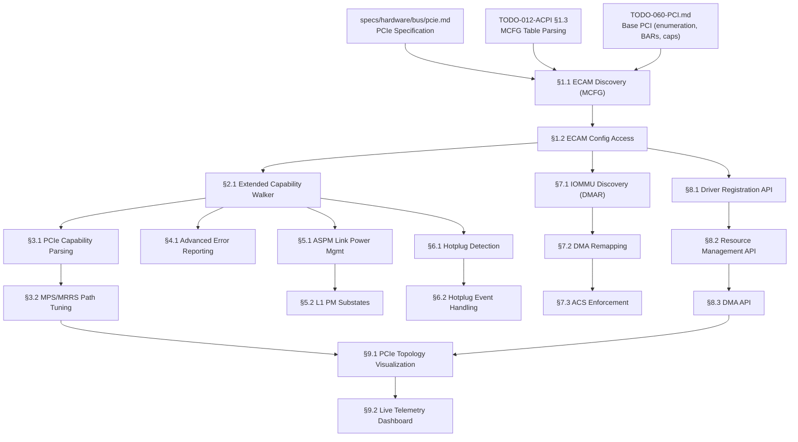

# 060.02-PCIe — PCI Express Extended Bus Infrastructure

> **Goal:** Extend the existing PCI bus driver (`src/kernel/drivers/pci.c`) with full PCIe
> support: ECAM-based memory-mapped configuration access (4 KiB per function), extended
> capability parsing (AER, L1 PM Substates, SR-IOV, ACS), MPS/MRRS path tuning, ASPM
> power management, hotplug support, IOMMU (Intel VT-d) integration, and a standardized
> driver registration/resource management API. The existing legacy I/O port mechanism
> (0xCF8/0xCFC) becomes the fallback path; ECAM becomes the primary access method.
> This TODO covers PCIe-specific features that go beyond the base PCI 3.0 functionality
> tracked in [TODO-060-PCI.md](../TODO-060-PCI.md).

> [!CAUTION]
> **Memory Rule:** Use `pmm_alloc_contiguous()` for ALL buffers > 4 KB (ECAM mappings,
> MSI-X tables, IOMMU page tables, DMA buffers). `kmalloc` is ONLY for small kernel
> structs (≤ 4 KB). See `coding.md` Known Gotchas.

> [!IMPORTANT]
> **Spec Reference:** All register offsets, capability IDs, encoding values, and protocol
> sequences reference the [PCIe Specification](file:///home/derickpayne/impossible-os/specs/hardware/bus/pcie.md).
> Base PCI configuration space layout references the [PCI 3.0 Specification](file:///home/derickpayne/impossible-os/specs/hardware/bus/pci-3.0.md).

> [!WARNING]
> **ECAM Memory Mapping:** The ECAM region **must** be mapped as strongly-ordered, uncacheable
> memory (`PCD=1, PWT=1` in x86 page tables). Caching config register reads causes stale data
> and catastrophic driver desynchronization. A full 256-bus segment consumes **256 MiB** of
> physical address space.

> [!NOTE]
> **Cross-references:**
> - [TODO-060-PCI.md](../TODO-060-PCI.md) — Base PCI: enumeration, BARs, capabilities, MSI/MSI-X, command/status
> - [TODO-012-ACPI.md §1.3](../../010-Kernel-Foundations/TODO-012-ACPI.md) — MCFG table for ECAM base address
> - [TODO-012-ACPI.md §8.1](../../010-Kernel-Foundations/TODO-012-ACPI.md) — ACPI `_PRT` for legacy INTx routing
> - [TODO-065-Power-Management.md](../TODO-065-Power-Management.md) — System suspend/resume integration

---

## TODO Completion Roadmap

### Dependency Graph

### Phase-by-Phase Implementation Order

| Phase  | Sections                                     | Depends On             | Status |
| :----: | -------------------------------------------- | ---------------------- | :----: |
| **0**  | Prerequisites (PCI base, ACPI MCFG)         | TODO-060-PCI, ACPI     |   ⬜   |
| **1**  | §1.1 ECAM Discovery, §1.2 ECAM Access       | Phase 0                |   ⬜   |
| **2**  | §2.1 Extended Caps, §3.1 PCIe Cap           | Phase 1                |   ⬜   |
| **3**  | §3.2 MPS/MRRS, §4.1 AER                     | Phase 2                |   ⬜   |
| **4**  | §5.1 ASPM, §5.2 L1 PM Substates             | Phase 2                |   ⬜   |
| **5**  | §6.1–§6.2 Hotplug                            | Phase 2                |   ⬜   |
| **6**  | §7.1–§7.3 IOMMU + ACS                       | Phase 1                |   ⬜   |
| **7**  | §8.1–§8.3 Kernel API                         | Phase 1                |   ⬜   |
| **8**  | §9.1–§9.2 Exclusive Features                | Phase 3, 7             |   ⬜   |

> [!NOTE]
> **Phase 0** requires base PCI enumeration and ACPI MCFG parsing to be complete.
>
> **Phase 1** is the critical path: ECAM enables access to the full 4 KiB config space
> required by all subsequent phases.
>
> **Phase 2** provides the extended capability walker and PCIe capability parsing needed
> by AER, ASPM, hotplug, and IOMMU features.
>
> **Phase 3** delivers MPS/MRRS tuning (10%+ throughput gains) and AER error resilience.
>
> **Phase 8** delivers exclusive features (⭐): topology visualization and live telemetry.

> [!TIP]
> **QEMU testing:** Always use `-machine q35` for PCIe. The default `i440fx` provides only
> conventional PCI. Test with root ports: `-device pcie-root-port,id=rp1,slot=1,chassis=1`.
>
> **IOMMU testing:** Use `-machine q35,kernel-irqchip=split -device intel-iommu,intremap=on`.
>
> **Memory rule reminder:** ECAM mapping requires `pmm_alloc_contiguous()` for the 256 MiB
> region. Never use `kmalloc` for ECAM, MSI-X tables, or IOMMU page tables.

---

## 1. ECAM Configuration Access

### 1.1 ECAM Discovery (MCFG Table Parsing)

**Prompt:** Parse the ACPI MCFG table to discover ECAM base addresses per PCIe spec §MCFG.
The MCFG table (signature `"MCFG"`) contains one or more `mcfg_allocation` entries after the
36-byte ACPI header + 8 bytes reserved padding. Each entry provides: `base_address` (u64),
`segment_group` (u16), `start_bus` (u8), `end_bus` (u8). Calculate entry count as
`(header.length - 44) / 16`. Store all segments for multi-segment support. After completing
all items, mark every item as `[x]`, update this prompt to a verification prompt, run
`bash scripts/build.sh clean`, and commit as `"pcie: ECAM discovery via MCFG"`. After
implementation, save gotchas to MCP memory.

- [ ] Locate MCFG table via ACPI RSDT/XSDT (signature `"MCFG"`)
- [ ] Skip 36-byte ACPI header + 8-byte reserved padding (44 bytes total)
- [ ] Parse each `mcfg_allocation` entry (16 bytes each):
  - [ ] `base_address` (offset +0, u64) — physical base of ECAM region
  - [ ] `segment_group` (offset +8, u16) — PCI segment group number
  - [ ] `start_bus` (offset +10, u8) — first bus number covered
  - [ ] `end_bus` (offset +11, u8) — last bus number covered
  - [ ] 4 bytes reserved (offset +12)
- [ ] Calculate entry count: `(table_length - 44) / 16`
- [ ] Store all MCFG entries in global array (`mcfg_segments[]`)
- [ ] Validate: `start_bus <= end_bus`, `base_address` is page-aligned
- [ ] Log: `[PCIe] MCFG: segment 0, buses 0–255, ECAM base 0xE0000000`
- [ ] Commit: `"pcie: ECAM discovery via MCFG"`

### 1.2 ECAM Memory-Mapped Config Access

**Prompt:** Implement ECAM-based configuration access per PCIe spec §ECAM. Map the ECAM
physical region into kernel virtual address space as uncacheable (`PCD=1, PWT=1`). Calculate
per-function addresses as: `ecam_base + ((bus - start_bus) << 20) | (dev << 15) | (func << 12)
+ offset`. Support full 4096-byte config space (offsets 0x000–0xFFF). Provide 8/16/32-bit
read/write functions. Fall back to legacy I/O ports if MCFG is not present. After completing
all items, mark every item as `[x]`, update this prompt to a verification prompt, run
`bash scripts/build.sh clean`, and commit as `"pcie: ECAM config access"`. After
implementation, save gotchas to MCP memory.

- [ ] Map ECAM region using `pmm_alloc_contiguous()` + page table mapping
  - [ ] Map as uncacheable: set PCD=1, PWT=1 in page table entries
  - [ ] Size: `(end_bus - start_bus + 1) * 32 * 8 * 4096` bytes per segment
- [ ] Implement `pcie_cfg_read8(bus, dev, func, offset)` — MMIO u8 read
- [ ] Implement `pcie_cfg_read16(bus, dev, func, offset)` — MMIO u16 read
- [ ] Implement `pcie_cfg_read32(bus, dev, func, offset)` — MMIO u32 read
- [ ] Implement `pcie_cfg_write8/16/32()` — corresponding MMIO writes
- [ ] Address calculation: `ecam_virt + ((bus - start_bus) << 20) | (dev << 15) | (func << 12) + offset`
- [ ] Validate offset range: reject offsets ≥ 4096
- [ ] Fallback: if ECAM unavailable, delegate to legacy `pci_config_read()` for offsets < 256
- [ ] Integrate with bus enumeration: use ECAM for all config reads when available
- [ ] Log: `[PCIe] ECAM mapped: 0xE0000000 → 0xFFFF_E000_0000 (256 MiB, uncacheable)`
- [ ] Commit: `"pcie: ECAM config access"`

---

## 2. Extended Capabilities

### 2.1 Extended Capability Walker (0x100–0xFFF)

**Prompt:** PCIe extended capabilities begin at offset `0x100` and use a 4-byte header: bits
15:0 = Extended Capability ID, bits 19:16 = Version, bits 31:20 = Next Capability Offset.
Walk this linked list starting at 0x100, terminating when the next offset is 0. Cache all
discovered extended capabilities in the device struct. Requires ECAM access (§1.2) since
legacy I/O ports cannot reach offsets ≥ 0x100. After completing all items, mark every item
as `[x]`, update this prompt to a verification prompt, run `bash scripts/build.sh clean`,
and commit as `"pcie: extended capability walker"`. After implementation, save gotchas to
MCP memory.

- [ ] Check that ECAM is available (extended caps require offsets ≥ 0x100)
- [ ] Start walking at offset `0x100`
- [ ] Read 4-byte extended capability header at current offset:
  - [ ] Bits 15:0 — Extended Capability ID
  - [ ] Bits 19:16 — Capability Version
  - [ ] Bits 31:20 — Next Capability Offset (0 = end of list)
- [ ] Store extended capabilities in device struct: array of `{ id, version, offset }`
- [ ] Implement `pci_find_ext_capability(dev, ext_cap_id)` — return offset or 0
- [ ] Recognize key extended capability IDs:
  - [ ] `0x0001` — AER (Advanced Error Reporting)
  - [ ] `0x0002` — Virtual Channel (VC)
  - [ ] `0x0003` — Device Serial Number (DSN)
  - [ ] `0x0004` — Power Budgeting
  - [ ] `0x000D` — Access Control Services (ACS)
  - [ ] `0x0010` — SR-IOV (Single Root I/O Virtualization)
  - [ ] `0x0019` — Secondary PCI Express (Gen 3+ equalization)
  - [ ] `0x001E` — L1 PM Substates
- [ ] Guard: if header reads `0xFFFFFFFF` or `0x00000000` at `0x100`, device has no extended caps
- [ ] Log: `[PCIe] 00:03.0 extended caps: AER DSN ACS`
- [ ] Commit: `"pcie: extended capability walker"`

---

## 3. PCIe Capability and Performance Tuning

### 3.1 PCIe Capability Structure Parsing (ID 0x10)

**Prompt:** Parse the mandatory PCIe Capability (standard ID `0x10`) per PCIe spec §PCIe
Capability. Extract device/port type (bits 7:4 of PCIe Capabilities register), link speed
and width (Link Capabilities and Link Status), and MPS supported (Device Capabilities bits
2:0). Store parsed values in an extended PCIe device info struct. After completing all items,
mark every item as `[x]`, update this prompt to a verification prompt, run
`bash scripts/build.sh clean`, and commit as `"pcie: capability structure parsing"`. After
implementation, save gotchas to MCP memory.

- [ ] Find PCIe capability via `pci_find_capability(dev, 0x10)`
- [ ] Parse PCIe Capabilities Register (+0x02):
  - [ ] Bits 7:4 — Device/Port Type (0x0=Endpoint, 0x4=Root Port, 0x5=Upstream Switch, etc.)
  - [ ] Bits 3:0 — Interrupt Message Number
- [ ] Parse Device Capabilities (+0x04):
  - [ ] Bits 2:0 — Max Payload Size Supported (encoded as `2^(val+7)` bytes)
  - [ ] Phantom Functions, Extended Tag Field supported
- [ ] Parse Link Capabilities (+0x0C):
  - [ ] Bits 3:0 — Max Link Speed (1=2.5GT/s, 2=5GT/s, 3=8GT/s, 4=16GT/s, 5=32GT/s)
  - [ ] Bits 9:4 — Max Link Width (1/2/4/8/12/16)
  - [ ] ASPM Support (bits 11:10): L0s, L1
- [ ] Parse Link Status (+0x12):
  - [ ] Bits 3:0 — Current Link Speed
  - [ ] Bits 9:4 — Negotiated Link Width
  - [ ] Link Training (bit 11)
- [ ] Store in `struct pcie_info` within `struct pci_device`
- [ ] Log: `[PCIe] 00:03.0 Gen3 x4 (max Gen3 x4), Endpoint, MPS=256`
- [ ] Commit: `"pcie: capability structure parsing"`

### 3.2 MPS/MRRS Path Tuning

**Prompt:** Set Maximum Payload Size (MPS) and Maximum Read Request Size (MRRS) consistently
across the entire path from Root Complex to each Endpoint per PCIe spec §MPS/MRRS. MPS must
be the **minimum** of all devices on each path (or globally for simplicity). MRRS may be set
independently and can exceed MPS. Both are encoded as `2^(val+7)` bytes in Device Control
register bits 7:5 (MPS) and 14:12 (MRRS). After completing all items, mark every item as
`[x]`, update this prompt to a verification prompt, run `bash scripts/build.sh clean`, and
commit as `"pcie: MPS/MRRS path tuning"`. After implementation, save gotchas to MCP memory.

- [ ] After enumeration, traverse the entire PCIe tree
- [ ] Collect Max MPS Supported from Device Capabilities (bits 2:0) for every device
- [ ] Calculate global minimum MPS across all devices (safe default strategy)
- [ ] Set MPS in Device Control register (bits 7:5) for every PCIe device
- [ ] Set MRRS in Device Control register (bits 14:12) — default to 4096 or MPS, whichever is larger
- [ ] MPS encoding: 0=128, 1=256, 2=512, 3=1024, 4=2048, 5=4096
- [ ] Verify consistency: no device on any path has MPS lower than the payload of TLPs it will see
- [ ] Log: `[PCIe] Global MPS set to 256 bytes, MRRS set to 4096 bytes`
- [ ] Commit: `"pcie: MPS/MRRS path tuning"`

---

## 4. Advanced Error Reporting (AER)

### 4.1 AER Subsystem

**Prompt:** Implement Advanced Error Reporting (Extended Capability ID `0x0001`) per PCIe
spec §AER. AER provides granular error detection: Correctable (auto-recovered, log only),
Non-Fatal Uncorrectable (transaction failed, driver retries), Fatal Uncorrectable (link
compromised, requires Secondary Bus Reset). Set up error reporting on root ports, parse the
AER register block, and implement an error handler that logs TLP headers from the Header
Log register. After completing all items, mark every item as `[x]`, update this prompt to a
verification prompt, run `bash scripts/build.sh clean`, and commit as
`"pcie: advanced error reporting"`. After implementation, save gotchas to MCP memory.

- [ ] Find AER extended capability via `pci_find_ext_capability(dev, 0x0001)`
- [ ] Parse AER register block at extended capability offset:
  - [ ] Uncorrectable Error Status (+0x04) — bit flags for each error type
  - [ ] Uncorrectable Error Mask (+0x08) — mask bits (1 = masked)
  - [ ] Uncorrectable Error Severity (+0x0C) — 0=non-fatal, 1=fatal per bit
  - [ ] Correctable Error Status (+0x10) — bit flags for correctable errors
  - [ ] Correctable Error Mask (+0x14) — mask bits
  - [ ] Advanced Error Capabilities (+0x18) — ECRC gen/check, first error pointer
  - [ ] Header Log (+0x1C, 16 bytes) — first 16 bytes of offending TLP
- [ ] For root ports: parse Root Error Command (+0x2C) and Root Error Status (+0x30)
  - [ ] Error Source Identification (+0x34) — requester BDF of error source
  - [ ] Correctable Source ID (+0x38)
- [ ] Enable error reporting: unmask correctable and uncorrectable errors
- [ ] Enable ECRC generation and checking if supported
- [ ] Implement error handler:
  - [ ] Correctable: log event, increment counter, monitor for escalation
  - [ ] Non-Fatal: notify device driver via `err_handler` callback
  - [ ] Fatal: assert Secondary Bus Reset (Bridge Control bit 6), re-enumerate
- [ ] Log: `[PCIe] AER: 00:03.0 Non-Fatal Uncorrectable Error (Completion Timeout)`
- [ ] Log: `[PCIe] AER: TLP Header: 40000001 0000040F 00000000 00000000`
- [ ] Commit: `"pcie: advanced error reporting"`

---

## 5. Power Management (ASPM)

### 5.1 Active State Power Management (ASPM)

**Prompt:** Implement ASPM using the PCIe Capability Link Control register per PCIe spec
§PCIe Capability. ASPM allows the link to transition to low-power states (L0s, L1) when
idle. Both ends (upstream and downstream components) must agree on supported ASPM levels.
Read ASPM Support from Link Capabilities (bits 11:10), then program ASPM Control in Link
Control (bits 1:0). After completing all items, mark every item as `[x]`, update this prompt
to a verification prompt, run `bash scripts/build.sh clean`, and commit as
`"pcie: ASPM link power management"`. After implementation, save gotchas to MCP memory.

- [ ] Read ASPM Support from Link Capabilities (bits 11:10):
  - [ ] Bit 0 (10) — L0s supported
  - [ ] Bit 1 (11) — L1 supported
- [ ] For each link (upstream port ↔ downstream port pair):
  - [ ] Determine common ASPM support (intersection of both ends)
  - [ ] Program ASPM Control in Link Control (bits 1:0): 00=disabled, 01=L0s, 10=L1, 11=L0s+L1
- [ ] Read L0s/L1 exit latencies from Link Capabilities for timing validation
- [ ] Implement `pcie_set_aspm(dev, policy)` — enable/disable ASPM per device
- [ ] Implement `pcie_get_aspm(dev)` — query current ASPM state
- [ ] Policy: default to L0s+L1 for power savings; provide `performance` mode (ASPM off)
- [ ] Log: `[PCIe] 00:03.0 ASPM: L0s+L1 enabled (exit latency: L0s=1µs, L1=32µs)`
- [ ] Commit: `"pcie: ASPM link power management"`

### 5.2 L1 PM Substates

**Prompt:** Implement L1 PM Substates (Extended Capability ID `0x001E`) per PCIe spec
§Extended Capabilities. L1 Substates (L1.1 and L1.2) provide dramatically lower idle power
by powering down high-speed circuits while maintaining link presence. Both upstream and
downstream ports must support and enable L1 Substates. After completing all items, mark
every item as `[x]`, update this prompt to a verification prompt, run
`bash scripts/build.sh clean`, and commit as `"pcie: L1 PM substates"`. After
implementation, save gotchas to MCP memory.

- [ ] Find L1 PM Substates extended capability via `pci_find_ext_capability(dev, 0x001E)`
- [ ] Parse L1 PM Substates Capabilities register:
  - [ ] PCI-PM L1.2 Supported, PCI-PM L1.1 Supported
  - [ ] ASPM L1.2 Supported, ASPM L1.1 Supported
  - [ ] L1 PM Substates Supported (overall)
- [ ] Parse L1 PM Substates Control 1 and Control 2 registers
- [ ] For each link, enable L1 Substates if both ends support them
- [ ] Program Common Mode Restore Time and LTR L1.2 Threshold
- [ ] Implement `pcie_set_l1ss(dev, enable)` — enable/disable L1 Substates
- [ ] Log: `[PCIe] 00:03.0 L1 Substates: L1.1+L1.2 enabled`
- [ ] Commit: `"pcie: L1 PM substates"`

---

## 6. Hotplug Support

### 6.1 Hotplug Detection (Bus Padding)

**Prompt:** Implement hotplug-capable bridge detection and bus/MMIO reservation per PCIe
spec §Hotplug. During enumeration, identify hotplug-capable bridge ports (Slot Capabilities
register bit 6 = Hot-Plug Capable). Reserve 4–10 spare bus numbers and 128–256 MiB of MMIO
window behind each hotplug bridge. Set Subordinate Bus Number to include the reserved range.
After completing all items, mark every item as `[x]`, update this prompt to a verification
prompt, run `bash scripts/build.sh clean`, and commit as `"pcie: hotplug bus padding"`.
After implementation, save gotchas to MCP memory.

- [ ] During enumeration, check Slot Capabilities register (PCIe Cap +0x14):
  - [ ] Bit 6 — Hot-Plug Capable
  - [ ] Bit 5 — Hot-Plug Surprise (device can be removed without notification)
- [ ] For hotplug-capable bridges:
  - [ ] Reserve 4–10 extra bus numbers beyond current population
  - [ ] Reserve 128–256 MiB of unused MMIO window space
  - [ ] Set Subordinate Bus Number to include reserved range
- [ ] Track reserved resources in bridge struct for future allocation
- [ ] Log: `[PCIe] Bridge 00:1C.0 hotplug-capable: reserved buses 5–14, MMIO 256 MiB`
- [ ] Commit: `"pcie: hotplug bus padding"`

### 6.2 Hotplug Event Handling

**Prompt:** Implement runtime hotplug event handling using Slot Control/Status registers
in the PCIe Capability. Enable hotplug interrupts (Attention Button, Presence Detect Changed,
Command Completed) via MSI/MSI-X. On device insertion, enumerate the new device into reserved
bus/MMIO space. On removal, tear down the device and release resources. After completing all
items, mark every item as `[x]`, update this prompt to a verification prompt, run
`bash scripts/build.sh clean`, and commit as `"pcie: hotplug event handling"`. After
implementation, save gotchas to MCP memory.

- [ ] Parse Slot Control register (PCIe Cap +0x18):
  - [ ] Attention Button Pressed Enable
  - [ ] Presence Detect Changed Enable
  - [ ] Command Completed Interrupt Enable
  - [ ] Hot-Plug Interrupt Enable
- [ ] Parse Slot Status register (PCIe Cap +0x1A):
  - [ ] Attention Button Pressed (W1C)
  - [ ] Presence Detect Changed (W1C)
  - [ ] Presence Detect State (read-only)
  - [ ] Command Completed (W1C)
- [ ] Enable hotplug interrupts via MSI/MSI-X on hotplug-capable root ports
- [ ] Implement hotplug ISR:
  - [ ] On Presence Detect Changed + State=Present → enumerate new device
  - [ ] On Presence Detect Changed + State=Absent → remove device, free resources
  - [ ] On Attention Button → initiate safe removal sequence (power indicator blink)
- [ ] Device insertion: assign BDF from reserved range, size BARs, probe driver
- [ ] Device removal: call driver `remove()`, release BARs, free bus number
- [ ] Log: `[PCIe] Hotplug: device inserted at 05:00.0 (NVMe SSD)`
- [ ] Log: `[PCIe] Hotplug: device removed from 05:00.0`
- [ ] Commit: `"pcie: hotplug event handling"`

---

## 7. IOMMU and DMA Security

### 7.1 IOMMU Discovery (ACPI DMAR Table)

**Prompt:** Parse the ACPI DMAR (DMA Remapping) table to discover Intel VT-d IOMMU hardware
units per PCIe spec §IOMMU. The DMAR table contains DRHD (hardware unit definitions), RMRR
(reserved memory regions), and ATSR (ATS capability reporting) structures. Map IOMMU register
sets into kernel virtual memory. After completing all items, mark every item as `[x]`, update
this prompt to a verification prompt, run `bash scripts/build.sh clean`, and commit as
`"pcie: IOMMU discovery via DMAR"`. After implementation, save gotchas to MCP memory.

- [ ] Locate DMAR table via ACPI RSDT/XSDT (signature `"DMAR"`)
- [ ] Parse DRHD (DMA Remapping Hardware Unit Definition) structures:
  - [ ] Register Base Address — physical address of IOMMU registers
  - [ ] Segment Number — PCI segment this IOMMU covers
  - [ ] Device Scope entries — specific devices covered
  - [ ] Flags: INCLUDE_PCI_ALL (covers all devices in segment)
- [ ] Parse RMRR (Reserved Memory Region Reporting) structures:
  - [ ] Base Address, Limit Address — physical memory region
  - [ ] Device Scope — which devices use this reserved region
- [ ] Map each IOMMU register set into kernel virtual memory (uncacheable)
- [ ] Store IOMMU info in global array (`iommu_units[]`)
- [ ] Log: `[PCIe] DMAR: 1 IOMMU at 0xFED90000, 2 RMRR regions`
- [ ] Commit: `"pcie: IOMMU discovery via DMAR"`

### 7.2 DMA Remapping (Page Table Management)

**Prompt:** Implement Intel VT-d DMA remapping using a two-level table hierarchy per PCIe
spec §IOMMU: Root Table (256 entries, indexed by bus) → Context Table (256 entries, indexed
by devfn) → Second-Level Page Tables (4-level, like CPU page tables). Map IOVAs for device
DMA instead of raw physical addresses. Identity-map RMRR regions before enabling translation.
After completing all items, mark every item as `[x]`, update this prompt to a verification
prompt, run `bash scripts/build.sh clean`, and commit as `"pcie: DMA remapping"`. After
implementation, save gotchas to MCP memory.

- [ ] Allocate Root Table: 256 entries × 16 bytes = 4096 bytes (page-aligned)
- [ ] Allocate Context Tables on demand: 256 entries × 16 bytes per bus
- [ ] Allocate Second-Level Page Tables: 4-level (PML4→PDPT→PD→PT), like CPU paging
- [ ] Identity-map all RMRR regions before enabling translation
- [ ] Implement `iommu_map(dev, iova, phys, size, prot)` — create IOVA→phys mapping
- [ ] Implement `iommu_unmap(dev, iova, size)` — remove mapping
- [ ] Implement `iommu_alloc_iova(dev, size)` — allocate IOVA range from per-device pool
- [ ] Write Root Table base address to IOMMU RTADDR register
- [ ] Enable DMA remapping via Global Command register (TE bit)
- [ ] Invalidate IOTLB after mapping changes
- [ ] Log: `[PCIe] IOMMU enabled: DMA remapping active for all devices`
- [ ] Commit: `"pcie: DMA remapping"`

### 7.3 Access Control Services (ACS)

**Prompt:** Enable ACS (Extended Capability ID `0x000D`) on all switch ports and root ports
to prevent peer-to-peer DMA that would bypass the IOMMU per PCIe spec §ACS. Enable Source
Validation, Translation Blocking, P2P Request/Completion Redirect, and Upstream Forwarding.
After completing all items, mark every item as `[x]`, update this prompt to a verification
prompt, run `bash scripts/build.sh clean`, and commit as `"pcie: ACS enforcement"`. After
implementation, save gotchas to MCP memory.

- [ ] Find ACS extended capability via `pci_find_ext_capability(dev, 0x000D)`
- [ ] Parse ACS Capability register — check which ACS features are supported
- [ ] Enable all supported ACS Control bits:
  - [ ] Bit 0 — Source Validation
  - [ ] Bit 1 — Translation Blocking
  - [ ] Bit 2 — P2P Request Redirect
  - [ ] Bit 3 — P2P Completion Redirect
  - [ ] Bit 4 — Upstream Forwarding
  - [ ] Bit 5 — P2P Egress Control
  - [ ] Bit 6 — Direct Translated P2P
- [ ] Apply ACS to all root ports and switch downstream ports
- [ ] Log: `[PCIe] ACS enabled on 00:1C.0: SrcVal+TBlock+P2PReq+P2PCpl+UFwd`
- [ ] Commit: `"pcie: ACS enforcement"`

---

## 8. Standardized Kernel API

### 8.1 Driver Registration Model

**Prompt:** Implement a PCIe driver registration model per PCIe spec §Kernel API. Drivers
register with an ID table (vendor/device/class matching) and probe/remove callbacks. The
bus driver calls `probe()` for each matching device during enumeration and `remove()` during
shutdown or hotplug removal. Support `PCI_ANY_ID` (0xFFFF) wildcards for flexible matching.
After completing all items, mark every item as `[x]`, update this prompt to a verification
prompt, run `bash scripts/build.sh clean`, and commit as `"pcie: driver registration model"`.
After implementation, save gotchas to MCP memory.

- [ ] Define `struct pci_device_id`:
  - [ ] `vendor_id`, `device_id` (u16, `PCI_ANY_ID` = 0xFFFF for wildcard)
  - [ ] `subvendor_id`, `subdevice_id` (u16)
  - [ ] `class_code` (u32, 24-bit), `class_mask` (u32)
- [ ] Define `struct pci_driver`:
  - [ ] `name` — driver name string
  - [ ] `id_table` — pointer to array of `pci_device_id` (NULL-terminated)
  - [ ] `probe(dev)` — called on match, returns 0 on success
  - [ ] `remove(dev)` — called on removal/shutdown
  - [ ] `err_handler(dev, error)` — called by AER on device error
- [ ] Implement `pci_register_driver(drv)` — register driver, probe existing matches
- [ ] Implement `pci_unregister_driver(drv)` — unregister, call `remove()` on all attached
- [ ] Match algorithm: iterate all devices, try each ID table entry
- [ ] Store driver pointer in `struct pci_device` on successful probe
- [ ] Log: `[PCIe] Driver "nvme" bound to 00:04.0 (NVMe Controller)`
- [ ] Commit: `"pcie: driver registration model"`

### 8.2 Resource Management API

**Prompt:** Implement resource management functions that abstract BAR access, config space
reads, and device enable/disable per PCIe spec §Kernel API. These functions simplify driver
development by handling command register bits, BAR mapping, and region reservation
automatically. After completing all items, mark every item as `[x]`, update this prompt to
a verification prompt, run `bash scripts/build.sh clean`, and commit as
`"pcie: resource management API"`. After implementation, save gotchas to MCP memory.

- [ ] `pci_enable_device(dev)` — set Memory Space + Bus Master Enable in Command register
- [ ] `pci_disable_device(dev)` — clear enable bits
- [ ] `pci_request_regions(dev)` — reserve BAR ranges (prevent conflicts)
- [ ] `pci_release_regions(dev)` — release reserved BAR regions
- [ ] `pci_iomap(dev, bar, len)` — map BAR into kernel virtual memory, return `void*`
- [ ] `pci_iounmap(dev, addr)` — unmap BAR virtual address
- [ ] `pci_read_config_byte(dev, offset)` — 8-bit config read (auto-selects ECAM or legacy)
- [ ] `pci_read_config_word(dev, offset)` — 16-bit config read
- [ ] `pci_read_config_dword(dev, offset)` — 32-bit config read
- [ ] `pci_write_config_byte/word/dword()` — corresponding writes
- [ ] Commit: `"pcie: resource management API"`

### 8.3 DMA API

**Prompt:** Implement a DMA allocation/mapping API that abstracts IOMMU presence per PCIe
spec §Kernel API. When IOMMU is active, return IOVAs; when not, return physical addresses
directly. Support both coherent (persistent) and streaming (single-use) DMA mappings. After
completing all items, mark every item as `[x]`, update this prompt to a verification prompt,
run `bash scripts/build.sh clean`, and commit as `"pcie: DMA API"`. After implementation,
save gotchas to MCP memory.

- [ ] `pci_alloc_consistent(dev, size, &dma_handle)` — allocate coherent DMA buffer
  - [ ] Returns kernel VA; writes DMA address (IOVA or phys) to `dma_handle`
  - [ ] Allocate via `pmm_alloc_contiguous()`, map uncacheable
  - [ ] If IOMMU active: create IOVA mapping; else: return physical address
- [ ] `pci_free_consistent(dev, size, va, dma_handle)` — free coherent DMA buffer
- [ ] `pci_map_single(dev, va, size, direction)` — map streaming DMA buffer
  - [ ] Direction: `DMA_TO_DEVICE`, `DMA_FROM_DEVICE`, `DMA_BIDIRECTIONAL`
- [ ] `pci_unmap_single(dev, dma, size, direction)` — unmap streaming DMA buffer
- [ ] `pci_set_dma_mask(dev, mask)` — set 32-bit or 64-bit DMA capability
- [ ] Commit: `"pcie: DMA API"`

---

## 9. Impossible OS Exclusive Features

### 9.1 PCIe Topology Visualization 🚀

**Prompt:** Implement a real-time PCIe topology tree viewable via the desktop Device Manager.
Display the full device hierarchy (Root Complex → Root Ports → Switches → Endpoints) with
link speed/width, MPS, ASPM state, and error counts per device. Neither Windows Device
Manager nor Linux `lspci` provides a live, graphical topology view with real-time link
status. After completing all items, mark every item as `[x]`, update this prompt to a
verification prompt, run `bash scripts/build.sh clean`, and commit as
`"pcie: topology visualization"`. After implementation, save gotchas to MCP memory.

- [ ] Build topology tree from enumeration data (parent bridges → child devices)
- [ ] Expose topology via kernel API: `pcie_get_topology()` returns tree structure
- [ ] Include per-device info: BDF, vendor:device, driver name, link speed/width
- [ ] Include per-link info: current vs max speed, negotiated width, ASPM state
- [ ] Include error statistics: AER correctable/uncorrectable counters
- [ ] Serial console output: `pcie_dump_topology()` for debug
- [ ] Desktop integration: feed topology to Device Manager GUI (future)
- [ ] Log tree: Root Complex→RP0(Gen3x4)→NVMe, RP1(Gen3x1)→NIC
- [ ] Commit: `"pcie: topology visualization"`

### 9.2 Live PCIe Telemetry Dashboard 🚀

**Prompt:** Expose real-time PCIe performance and health telemetry via registry keys under
`HKLM\SYSTEM\Drivers\PCIe\`. Track per-device: link utilization estimates, AER error
counters (correctable, non-fatal, fatal), MPS/MRRS settings, ASPM transitions, and D-state
history. Neither Windows nor Linux exposes this data in a unified, real-time dashboard. After
completing all items, mark every item as `[x]`, update this prompt to a verification prompt,
run `bash scripts/build.sh clean`, and commit as `"pcie: live telemetry"`. After
implementation, save gotchas to MCP memory.

- [ ] Define telemetry struct per device:
  - [ ] AER counters: correctable_count, nonfatal_count, fatal_count
  - [ ] Last AER error type and timestamp
  - [ ] Current link speed, width, ASPM state, D-state
  - [ ] MPS and MRRS settings
  - [ ] Total interrupts delivered (MSI/MSI-X)
- [ ] Expose via registry: `HKLM\SYSTEM\Drivers\PCIe\{BDF}\ErrorCount`, etc.
- [ ] Periodic telemetry update: sample link status every 10 seconds
- [ ] Alert on error escalation: N correctable errors in M seconds → warn
- [ ] Serial log telemetry on demand: `pcie_dump_telemetry(dev)`
- [ ] Commit: `"pcie: live telemetry"`

---

## Priority Order

| Priority | Section                              | Description                                               |
| -------- | ------------------------------------ | --------------------------------------------------------- |
| 🔴 P0    | 1.1 ECAM Discovery (MCFG)           | Required for all PCIe extended features                   |
| 🔴 P0    | 1.2 ECAM Config Access              | Required for offsets ≥ 0x100 (all extended caps)          |
| 🔴 P0    | 2.1 Extended Capability Walker       | Required for AER, ACS, L1SS, SR-IOV discovery             |
| 🔴 P0    | 3.1 PCIe Capability Parsing          | Required for link speed/width, MPS, port type detection   |
| 🟠 P1    | 3.2 MPS/MRRS Path Tuning            | 10%+ throughput improvement for NVMe/NIC workloads        |
| 🟠 P1    | 8.1 Driver Registration Model        | Standardized driver binding for all PCIe devices          |
| 🟠 P1    | 8.2 Resource Management API          | Simplifies all downstream driver development              |
| 🟡 P2    | 4.1 AER Subsystem                    | Hardware error resilience and diagnostics                 |
| 🟡 P2    | 5.1 ASPM Link Power Management       | Power savings for idle links                              |
| 🟡 P2    | 8.3 DMA API                          | Abstracted DMA with IOMMU transparency                   |
| 🟢 P3    | 5.2 L1 PM Substates                  | Dramatic idle power reduction for battery/embedded        |
| 🟢 P3    | 6.1 Hotplug Detection                | Dynamic device addition support                           |
| 🟢 P3    | 7.1 IOMMU Discovery (DMAR)           | Security: DMA isolation foundation                        |
| 🟢 P3    | 7.2 DMA Remapping                    | Security: prevent rogue DMA                               |
| 🟢 P3    | 7.3 ACS Enforcement                  | Security: P2P isolation                                   |
| 🟢 P3    | 9.1 Topology Visualization           | 🚀 **Exclusive** — graphical PCIe tree view               |
| 🟢 P3    | 9.2 Live Telemetry Dashboard         | 🚀 **Exclusive** — unified real-time health monitoring    |
| 🔵 P4    | 6.2 Hotplug Event Handling           | Enterprise: runtime device add/remove                     |

---

## OS Comparison

| Feature                          | 🪟 Windows 11                         | 🐧 Linux                               | 🚀 Impossible OS                                    |
| -------------------------------- | ------------------------------------- | --------------------------------------- | --------------------------------------------------- |
| ECAM (MCFG) config access        | ✅ PCI.sys via MCFG                    | ✅ `pci_mmcfg_init()`                    | ⬜ §1.1–1.2 P0                                      |
| Extended capability walking       | ✅ Full                                | ✅ `pci_find_ext_capability()`           | ⬜ §2.1 P0                                          |
| PCIe capability parsing           | ✅ Full                                | ✅ `pcie_capability_read_*`              | ⬜ §3.1 P0                                          |
| MPS/MRRS tuning                   | ✅ PnP Manager                         | ✅ `pcie_bus_configure_settings()`       | ⬜ §3.2 P1                                          |
| AER error reporting               | ✅ WER + whea                          | ✅ `aerdriver`                            | ⬜ §4.1 P2                                          |
| ASPM (L0s/L1)                     | ✅ Auto-managed                        | ✅ `aspm.c`                               | ⬜ §5.1 P2                                          |
| L1 PM Substates                   | ✅ Since Win10                         | ✅ Since kernel 4.11                      | ⬜ §5.2 P3                                          |
| Hotplug detection (bus padding)   | ✅ PnP Manager                         | ✅ `pciehp`                               | ⬜ §6.1 P3                                          |
| Hotplug event handling            | ✅ Full PnP                            | ✅ `pciehp` driver                        | ⬜ §6.2 P4                                          |
| IOMMU (Intel VT-d)               | ✅ Full                                | ✅ `intel-iommu.c`                        | ⬜ §7.1–7.2 P3                                      |
| ACS enforcement                   | ✅ Hyper-V isolation                   | ✅ `pci_enable_acs()`                     | ⬜ §7.3 P3                                          |
| Driver registration model         | ✅ WDM/WDF                             | ✅ `pci_register_driver()`               | ⬜ §8.1 P1                                          |
| Resource management API           | ✅ PnP resource arbiter                | ✅ `pci_enable_device()` family           | ⬜ §8.2 P1                                          |
| DMA API (IOMMU-transparent)       | ✅ HAL DMA abstraction                 | ✅ `dma_map_single()` family              | ⬜ §8.3 P2                                          |
| **Topology visualization** 🚀    | ⬜ Device Manager flat list            | ⬜ `lspci -t` text only                  | ⬜ §9.1 P3 — **graphical live tree view**           |
| **Live telemetry dashboard** 🚀  | ⬜ Scattered across WMI/ETW            | ⬜ Scattered across sysfs                | ⬜ §9.2 P3 — **unified real-time dashboard**        |

> **After P0+P1 items:** Impossible OS has full ECAM access, extended caps, MPS tuning, and a
> standardized driver API — matching Windows and Linux for core PCIe functionality.
>
> **After P2–P3 exclusive features:** Exceeds both with graphical topology visualization and
> a unified live telemetry dashboard that neither Windows Device Manager nor Linux sysfs provides
> in an integrated form.
>
> **After P4 items:** Full PCIe feature parity including enterprise hotplug event handling.
