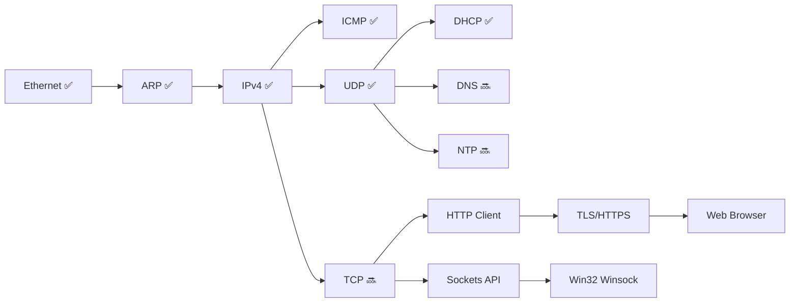

# Internet & Wireless Support — Research

## Overview

Bring Impossible OS from basic networking (Ethernet/UDP/DHCP) to **full internet access** — TCP, DNS, HTTP/HTTPS, and eventually WiFi.

---

## Current Network Stack

| Layer | Status | Implementation |
|-------|--------|---------------|
| **NIC Driver** | ✅ RTL8139 | `rtl8139.c` — PCI, send/receive, IRQ |
| **Ethernet** | ✅ | `ethernet.c` — frame send/receive, MAC |
| **ARP** | ✅ | `arp.c` — IP → MAC resolution |
| **IPv4** | ✅ | `ip.c` — packet send/receive, routing |
| **ICMP** | ✅ | `icmp.c` — ping (echo request/reply) |
| **UDP** | ✅ | `udp.c` — send/receive datagrams |
| **DHCP** | ✅ | `dhcp.c` — auto-configure IP, gateway, **DNS** |
| **TCP** | ❌ None | — |
| **DNS** | ❌ None | (DNS server IP stored from DHCP) |
| **HTTP** | ❌ None | — |
| **TLS/HTTPS** | ❌ None | — |
| **Sockets API** | ❌ None | — |
| **WiFi** | ❌ None | — |

---

## Part 1: TCP — Required for Everything

TCP is the foundation for HTTP, HTTPS, SSH, FTP, and virtually all internet protocols.

### TCP State Machine

```
                    ┌──────────┐
           ┌───────│  CLOSED  │◄──────────┐
           │        └────┬─────┘           │
     (passive open)      │ (active open)   │ (timeout)
           │             │ send SYN        │
           ▼             ▼                 │
      ┌─────────┐   ┌───────────┐         │
      │ LISTEN  │   │ SYN_SENT  │         │
      └────┬────┘   └─────┬─────┘         │
    recv SYN│        recv SYN+ACK│         │
    send SYN+ACK     send ACK    │         │
           │              │               │
           ▼              ▼               │
      ┌─────────────────────┐             │
      │    ESTABLISHED      │             │
      └──────────┬──────────┘             │
           close │                        │
           send FIN                       │
           ▼                              │
      ┌──────────┐    ┌──────────┐        │
      │ FIN_WAIT │───►│TIME_WAIT │────────┘
      └──────────┘    └──────────┘
```

### TCP Header

```c
struct tcp_header {
    uint16_t src_port;
    uint16_t dst_port;
    uint32_t seq_num;
    uint32_t ack_num;
    uint8_t  data_offset;  /* (header length / 4) << 4 */
    uint8_t  flags;        /* SYN, ACK, FIN, RST, PSH */
    uint16_t window;
    uint16_t checksum;
    uint16_t urgent_ptr;
} __attribute__((packed));

#define TCP_FIN  0x01
#define TCP_SYN  0x02
#define TCP_RST  0x04
#define TCP_PSH  0x08
#define TCP_ACK  0x10
```

### TCP Connection Struct

```c
struct tcp_connection {
    uint32_t local_ip;
    uint32_t remote_ip;
    uint16_t local_port;
    uint16_t remote_port;
    uint32_t seq;           /* our sequence number */
    uint32_t ack;           /* their sequence number */
    uint8_t  state;         /* TCP_CLOSED, TCP_ESTABLISHED, etc. */
    uint8_t *recv_buf;      /* receive ring buffer */
    uint32_t recv_len;
    uint32_t recv_head;
    uint32_t recv_tail;
};

#define MAX_TCP_CONNECTIONS 32
```

### Estimated size: ~400-600 lines

For a minimal TCP: connect, send, receive, close. Without: congestion control, retransmit timers, out-of-order reassembly, window scaling. Those can come later.

---

## Part 2: DNS — Name Resolution

DNS resolves hostnames to IP addresses. Without it, we can only connect by IP.

### How DNS works

```
1. Build DNS query packet (hostname → "www.google.com")
2. Send via UDP to DNS server (port 53)
3. Receive response with IP address(es)
```

### DNS Packet (simplified)

```c
struct dns_header {
    uint16_t id;            /* transaction ID */
    uint16_t flags;         /* 0x0100 for standard query */
    uint16_t qdcount;       /* number of questions (1) */
    uint16_t ancount;       /* number of answers */
    uint16_t nscount;
    uint16_t arcount;
} __attribute__((packed));
```

### DNS Query Encoding

```
"www.google.com" encodes as:
  03 'w' 'w' 'w' 06 'g' 'o' 'o' 'g' 'l' 'e' 03 'c' 'o' 'm' 00
  (length-prefixed labels, null-terminated)
```

### API

```c
/* dns.h */

/* Resolve hostname to IPv4 address */
int dns_resolve(const char *hostname, uint32_t *ip_out);

/* Example: */
uint32_t ip;
dns_resolve("time.google.com", &ip);
/* ip = 0xD8EF2300 (216.239.35.0) */
```

### Estimated size: ~150 lines

DNS is simple over UDP — we already have everything needed.

---

## Part 3: Sockets API

Programs need a standard API to use networking. BSD sockets is the universal standard:

```c
/* socket.h */

/* Simplified sockets API */
int socket(int domain, int type, int protocol);
int connect(int sockfd, uint32_t ip, uint16_t port);
int bind(int sockfd, uint16_t port);
int listen(int sockfd, int backlog);
int accept(int sockfd, uint32_t *remote_ip, uint16_t *remote_port);
int send(int sockfd, const void *buf, uint32_t len);
int recv(int sockfd, void *buf, uint32_t len);
int close(int sockfd);

/* DNS helper */
int getaddrinfo(const char *hostname, uint32_t *ip_out);

/* Socket types */
#define SOCK_STREAM  1  /* TCP */
#define SOCK_DGRAM   2  /* UDP */
```

### Syscalls for user-mode programs

```c
#define SYS_SOCKET   18  /* socket(domain, type, protocol) → fd */
#define SYS_CONNECT  19  /* connect(fd, ip, port) → 0 / -1 */
#define SYS_SEND     20  /* send(fd, buf, len) → bytes sent */
#define SYS_RECV     21  /* recv(fd, buf, len) → bytes received */
#define SYS_BIND     22  /* bind(fd, port) → 0 / -1 */
#define SYS_LISTEN   23  /* listen(fd, backlog) → 0 / -1 */
#define SYS_ACCEPT   24  /* accept(fd) → new fd */
#define SYS_DNS      25  /* dns_resolve(hostname, &ip) → 0 / -1 */
```

---

## Part 4: HTTP Client

With TCP + DNS, we can implement HTTP:

```c
/* Minimal HTTP GET */
int http_get(const char *url, char *response, uint32_t max_len) {
    /* 1. Parse URL → hostname + path */
    /* 2. dns_resolve(hostname) → IP */
    /* 3. TCP connect to IP:80 */
    /* 4. Send: "GET /path HTTP/1.1\r\nHost: hostname\r\n\r\n" */
    /* 5. Receive response into buffer */
    /* 6. TCP close */
}
```

### HTTPS (future)

Requires TLS. Options:
- **BearSSL** (MIT, 30K lines) — minimal, perfect for embedded
- **Mbed TLS** (Apache 2.0, 60K lines) — more features

---

## Part 5: WiFi — Wireless Networking

WiFi is significantly more complex than wired Ethernet.

### WiFi Stack Layers

```
┌──────────────────────┐
│  Applications        │  ← HTTP, NTP, etc. (same as wired)
├──────────────────────┤
│  TCP/UDP/IP          │  ← Same stack (protocol-agnostic)
├──────────────────────┤
│  WiFi Management     │  ← Scanning, authentication, association
│  (802.11 MAC)        │     WPA2/WPA3 key exchange
├──────────────────────┤
│  WiFi Driver         │  ← Hardware-specific (Intel, Realtek, etc.)
├──────────────────────┤
│  WiFi Hardware       │  ← PCI/PCIe/USB wireless NIC
└──────────────────────┘
```

### WiFi Challenges

| Challenge | Why it's hard |
|-----------|--------------|
| **Driver complexity** | Each WiFi chip needs a specific driver. Intel WiFi alone is ~100K lines in Linux |
| **802.11 protocol** | Management frames, beacon parsing, channel hopping, rate adaptation |
| **WPA2/WPA3** | Requires 4-way handshake, AES encryption, key derivation |
| **Firmware blobs** | Most WiFi chips need proprietary firmware uploaded at init |
| **Scanning** | Must scan channels, parse beacons, build network list |

### QEMU WiFi Options

| Approach | QEMU Config | Difficulty |
|----------|-------------|-----------|
| **virtio-net** (current) | `-device virtio-net-pci` | ✅ Already works (wired) |
| **RTL8139** (current) | `-device rtl8139` | ✅ Already works (wired) |
| **USB WiFi passthrough** | `-device usb-host` | 🔴 Requires host USB + full USB stack |
| **No native QEMU WiFi** | — | QEMU doesn't emulate WiFi hardware |

> [!WARNING]
> **QEMU does not emulate WiFi hardware.** All QEMU networking is wired Ethernet (RTL8139, virtio-net, e1000). To test WiFi, we'd need real hardware or a USB WiFi adapter via USB passthrough.

### Realistic WiFi Plan

| Phase | What | When |
|-------|------|------|
| **Phase 1** | Get TCP/DNS/HTTP working over wired Ethernet | Now |
| **Phase 2** | Add virtio-net driver (modern, fast, paravirtual) | Medium-term |
| **Phase 3** | Basic WiFi framework + one driver (e.g., RTL8188) | Long-term |
| **Phase 4** | WPA2 support (requires crypto: AES, HMAC, PBKDF2) | After crypto libs |

### Alternative: Wired is fine for now

Most real-world OS development uses wired Ethernet for years before adding WiFi. Even Haiku OS (30+ year project) only recently got stable WiFi. Our wired stack already works — TCP/DNS/HTTP are the priorities.

---

## Network Stack Roadmap



---

## Win32 Winsock Mapping

Windows programs use **Winsock** (ws2_32.dll) for networking:

| Win32 (ws2_32.dll) | Impossible OS |
|--------------------|---------------|
| `WSAStartup()` | No-op (always initialized) |
| `socket()` | `sys_socket()` |
| `connect()` | `sys_connect()` |
| `send()` | `sys_send()` |
| `recv()` | `sys_recv()` |
| `closesocket()` | `sys_close()` |
| `gethostbyname()` | `dns_resolve()` |
| `WSACleanup()` | No-op |

---

## Files

| Action | File | Lines (est.) | Purpose |
|--------|------|-------------|---------|
| **[NEW]** | `src/kernel/net/tcp.c` | ~500 | TCP state machine, connect/send/recv |
| **[NEW]** | `include/tcp.h` | ~50 | TCP structs, connection API |
| **[NEW]** | `src/kernel/net/dns.c` | ~150 | DNS resolver (UDP port 53) |
| **[NEW]** | `include/dns.h` | ~20 | `dns_resolve()` API |
| **[NEW]** | `src/kernel/net/socket.c` | ~300 | BSD sockets API |
| **[NEW]** | `include/socket.h` | ~40 | Socket types, API |
| **[NEW]** | `src/kernel/net/http.c` | ~200 | HTTP GET/POST client |
| **[NEW]** | `src/kernel/win32/ws2_32.c` | ~150 | Winsock stubs |
| **[MODIFY]** | `src/kernel/net/ip.c` | +10 | Route TCP packets (protocol 6) |
| **[MODIFY]** | `include/syscall.h` | +8 | Socket syscalls |

---

## Implementation Order

### Phase 1: TCP (1-2 weeks)
- [ ] TCP header parsing and checksum
- [ ] Connection state machine (SYN → ESTABLISHED → FIN)
- [ ] `tcp_connect()`, `tcp_send()`, `tcp_recv()`, `tcp_close()`
- [ ] Receive buffer (ring buffer per connection)
- [ ] Route TCP in `ip.c` (protocol 6)
- [ ] Test: TCP connect to a known server

### Phase 2: DNS (2-3 days)
- [ ] DNS query builder (encode hostname)
- [ ] Send query via UDP port 53 to DHCP-provided DNS server
- [ ] Parse DNS response (extract A record IP)
- [ ] `dns_resolve(hostname, &ip)` API
- [ ] Test: resolve `google.com`, `time.google.com`

### Phase 3: Sockets API (3-5 days)
- [ ] Socket file descriptor table
- [ ] `socket()`, `connect()`, `send()`, `recv()`, `close()` kernel calls
- [ ] Add `SYS_SOCKET` through `SYS_DNS` syscalls
- [ ] User-mode socket library in `user/lib/`

### Phase 4: HTTP Client (3-5 days)
- [ ] URL parser (scheme, host, port, path)
- [ ] HTTP GET request builder
- [ ] Response parser (status line, headers, body)
- [ ] `http_get(url, buffer, size)` API
- [ ] Shell command: `wget http://example.com/`

### Phase 5: TLS/HTTPS (2-4 weeks)
- [ ] Port BearSSL or Mbed TLS
- [ ] TLS handshake over TCP
- [ ] `https_get()` API
- [ ] Certificate validation (root CA bundle)

### Phase 6: WiFi (future — months)
- [ ] 802.11 frame parsing
- [ ] WiFi management (scan, associate)
- [ ] WPA2 4-way handshake
- [ ] One hardware driver (e.g., USB RTL8188)
