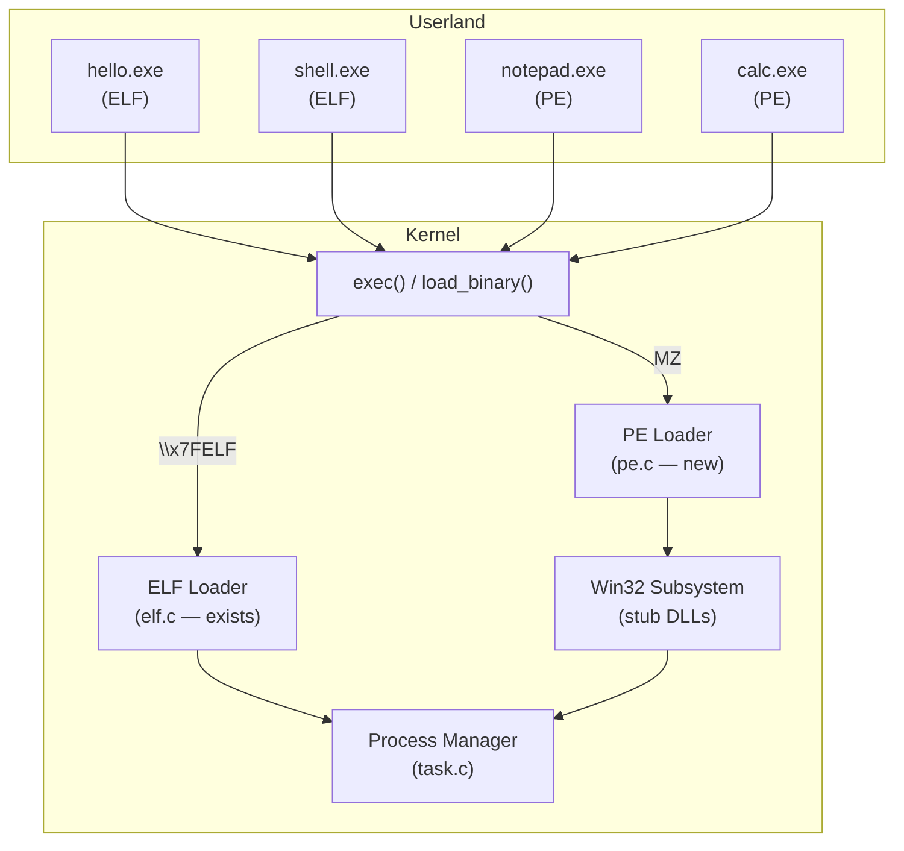

# Dual-Format Subsystem Architecture — Research

## Decision

**ELF stays as the native foundation. PE is added as a kernel-level subsystem.** Both formats are first-class citizens — the kernel auto-detects and loads either format transparently.

---

## Architecture Overview



This mirrors **Windows NT's subsystem model**:

| NT Architecture | Impossible OS Equivalent |
|----------------|------------------------|
| NT Kernel (`ntoskrnl.exe`) | Impossible OS kernel (ELF, loaded by GRUB) |
| Win32 Subsystem (`csrss.exe`) | Win32 stub DLLs (kernel-resident) |
| PE Loader (`ntdll!LdrLoadDll`) | `pe.c` (kernel-resident) |
| POSIX Subsystem (deprecated) | ELF loader (`elf.c` — our native format) |

**Key difference from Wine**: Wine is a userspace translator. Our PE loader lives **in the kernel**, so PE programs get the same privilege level and performance as native ELF programs — no translation overhead for the binary loading itself.

---

## Format Detection

The kernel's `exec()` path detects the binary format by its magic bytes:

```c
/* load_binary() — auto-detect and load either ELF or PE */

struct load_result load_binary(const uint8_t *data, uint64_t size)
{
    /* PE: starts with DOS "MZ" header */
    if (size >= 2 && data[0] == 'M' && data[1] == 'Z')
        return pe_load(data, size);

    /* ELF: starts with "\x7FELF" magic */
    if (size >= 4 && *(uint32_t *)data == 0x464C457F)
        return elf_load(data, size);

    printk("[EXEC] Unknown binary format\n");
    return (struct load_result){ .success = 0 };
}
```

Both loaders return **the same struct** — an entry point and loaded memory region. The process manager doesn't care which format was used.

---

## What Each Format Gets

| Capability | ELF Programs | PE Programs |
|-----------|-------------|-------------|
| **Loading** | `elf.c` (exists, 142 lines) | `pe.c` (new, ~250 lines) |
| **Syscalls** | `INT 0x80` (native ABI) | `INT 0x80` (same native ABI) |
| **C runtime** | `crt0.asm` + custom libc | Same — or Win32-compatible CRT |
| **Dynamic linking** | Future: `.so` loader | Future: DLL import resolution |
| **Win32 API** | N/A | Stub DLLs (kernel32, msvcrt, etc.) |
| **Calling convention** | System V x64 | Windows x64 (translated at syscall boundary) |

---

## PE Loader Design (`pe.c`)

### PE file structure (what we parse)

```
┌──────────────────────┐  offset 0
│  DOS Header (64 B)   │  e_magic = "MZ", e_lfanew → PE offset
├──────────────────────┤  offset e_lfanew
│  PE Signature (4 B)  │  "PE\0\0"
├──────────────────────┤
│  COFF Header (20 B)  │  Machine, NumberOfSections, SizeOfOptionalHeader
├──────────────────────┤
│  Optional Header     │  PE32+: Magic=0x20B, ImageBase, EntryPointRVA,
│  (112 B for PE32+)   │  SectionAlignment, SizeOfImage, DataDirectories[]
├──────────────────────┤
│  Section Table       │  .text, .rdata, .data, .bss, .idata, .reloc
│  (40 B per section)  │  VirtualAddress, VirtualSize, RawDataOffset, RawDataSize
├──────────────────────┤
│  Section Data        │  Actual code and data
└──────────────────────┘
```

### Header structures

```c
/* pe.h */

#define PE_DOS_MAGIC    0x5A4D      /* "MZ" */
#define PE_SIGNATURE    0x00004550  /* "PE\0\0" */
#define PE_MACHINE_AMD64 0x8664
#define PE32PLUS_MAGIC  0x020B

struct pe_dos_header {
    uint16_t e_magic;       /* "MZ" */
    uint8_t  _pad[58];      /* DOS stub (ignored) */
    uint32_t e_lfanew;      /* offset to PE signature */
} __attribute__((packed));

struct pe_coff_header {
    uint16_t machine;
    uint16_t num_sections;
    uint32_t timestamp;
    uint32_t symbol_table;
    uint32_t num_symbols;
    uint16_t optional_hdr_size;
    uint16_t characteristics;
} __attribute__((packed));

struct pe_optional_header_64 {
    uint16_t magic;             /* 0x020B for PE32+ */
    uint8_t  major_linker_ver;
    uint8_t  minor_linker_ver;
    uint32_t size_of_code;
    uint32_t size_of_init_data;
    uint32_t size_of_uninit_data;
    uint32_t entry_point_rva;   /* RVA of entry point */
    uint32_t base_of_code;
    uint64_t image_base;        /* preferred load address */
    uint32_t section_alignment;
    uint32_t file_alignment;
    /* ... remaining fields (version, sizes, etc.) ... */
    uint32_t num_data_dirs;
} __attribute__((packed));

struct pe_section_header {
    char     name[8];
    uint32_t virtual_size;
    uint32_t virtual_address;   /* RVA */
    uint32_t raw_data_size;
    uint32_t raw_data_offset;
    uint32_t _pad[3];
    uint32_t characteristics;   /* flags: code, data, read, write, exec */
} __attribute__((packed));
```

### Loading algorithm

```c
struct load_result pe_load(const uint8_t *data, uint64_t size)
{
    /* 1. Validate DOS header */
    /* 2. Read e_lfanew → PE signature offset */
    /* 3. Validate PE signature "PE\0\0" */
    /* 4. Parse COFF header (must be AMD64) */
    /* 5. Parse PE32+ Optional Header (ImageBase, EntryPointRVA) */
    /* 6. For each section: */
    /*    - memcpy(ImageBase + section.VirtualAddress,          */
    /*             data + section.RawDataOffset,                */
    /*             section.RawDataSize)                         */
    /*    - memzero remaining (VirtualSize - RawDataSize = BSS) */
    /* 7. Return entry = ImageBase + EntryPointRVA */
}
```

---

## Win32 Subsystem (Stub DLLs)

When a PE binary has an **import table**, it references functions from DLLs like `kernel32.dll`. Instead of loading actual Windows DLLs, we provide **builtin stubs** that translate Win32 API calls to Impossible OS syscalls:

### Phase 1 — Minimal console support (~20 functions)

```c
/* Builtin kernel32.dll stub functions */

HANDLE GetStdHandle(DWORD nStdHandle) {
    if (nStdHandle == STD_OUTPUT_HANDLE) return (HANDLE)1;  /* fd 1 */
    if (nStdHandle == STD_INPUT_HANDLE)  return (HANDLE)0;  /* fd 0 */
    return INVALID_HANDLE_VALUE;
}

BOOL WriteConsoleA(HANDLE h, const void *buf, DWORD len, ...) {
    return sys_write((int)(uintptr_t)h, buf, len);  /* → SYS_WRITE */
}

void ExitProcess(UINT code) {
    sys_exit(code);  /* → SYS_EXIT */
}

LPVOID VirtualAlloc(LPVOID addr, SIZE_T size, ...) {
    return sys_mmap(addr, size, ...);  /* → future SYS_MMAP */
}
```

### How import resolution works

```
PE binary imports:                    We provide:
─────────────────                    ──────────────
kernel32.dll!WriteConsoleA    →    builtin_kernel32_WriteConsoleA()
kernel32.dll!ExitProcess      →    builtin_kernel32_ExitProcess()
kernel32.dll!GetStdHandle     →    builtin_kernel32_GetStdHandle()
msvcrt.dll!printf             →    builtin_msvcrt_printf()
```

The PE loader walks the import table and writes our stub function pointers directly into the binary's **Import Address Table (IAT)**.

### Phase 2 — File I/O + memory (~40 functions)

`CreateFileA/W`, `ReadFile`, `WriteFile`, `CloseHandle`, `VirtualAlloc`, `VirtualFree`, `HeapCreate`, `HeapAlloc`, `HeapFree`, `GetLastError`, `SetLastError`, `GetCommandLineA`, etc.

### Phase 3 — GUI integration (future)

`CreateWindowExW`, `ShowWindow`, `GetMessage`, `DispatchMessage` — these would integrate with our window manager (`wm.c`).

---

## Calling Convention Bridge

ELF (System V) and PE (Windows x64) use different register conventions:

| Arg | System V (ELF) | Windows x64 (PE) |
|-----|---------------|-------------------|
| 1st | RDI | RCX |
| 2nd | RSI | RDX |
| 3rd | RDX | R8 |
| 4th | RCX | R9 |

### How this is handled

**For our own syscalls**: No issue. Both ELF and PE programs use `INT 0x80` with explicit inline assembly that sets registers directly — the C calling convention is irrelevant.

**For Win32 stub functions**: The stubs are compiled with the same convention as the caller (Windows x64), so no translation is needed. The stubs internally call our syscalls using inline asm.

**For mixed ELF/PE interaction** (future): If an ELF program calls a function in a PE DLL (or vice versa), a small thunk would shuffle registers:

```nasm
; Windows-to-SysV thunk
win_to_sysv_thunk:
    mov rdi, rcx    ; arg1: RCX → RDI
    mov rsi, rdx    ; arg2: RDX → RSI
    mov rdx, r8     ; arg3: R8  → RDX
    mov rcx, r9     ; arg4: R9  → RCX
    jmp target_function
```

---

## Implementation Phases

### Phase 1: PE Loader (2-3 days)
- [ ] Create `include/pe.h` — PE/COFF structures and constants
- [ ] Create `src/kernel/pe.c` — PE loader (~250 lines)
- [ ] Add `load_binary()` dual-format detection
- [ ] Update `task.c` exec path to use `load_binary()`
- [ ] Test with a hand-crafted minimal PE binary
- [ ] Compile a "Hello World" PE with MinGW (optional, proves it works)

### Phase 2: Win32 Console Stubs (1-2 weeks)
- [ ] Implement IAT resolution in PE loader
- [ ] Create builtin `kernel32.dll` stub (~20 functions)
- [ ] Create builtin `msvcrt.dll` stub (printf, malloc, etc.)
- [ ] Run a simple MinGW-compiled Windows console program
- [ ] Add `SYS_MMAP` and `SYS_BRK` syscalls (needed by VirtualAlloc)

### Phase 3: DLL Loading (2-4 weeks)
- [ ] Load external DLLs from filesystem (PE export table parsing)
- [ ] Handle DLL dependencies (recursive loading)
- [ ] `DllMain()` calling for `DLL_PROCESS_ATTACH`
- [ ] `LoadLibraryA` / `GetProcAddress` runtime loading

### Phase 4: Enhanced ELF Support (parallel track)
- [ ] ELF dynamic linker (`PT_DYNAMIC`, `.so` loading)
- [ ] Linux syscall number compatibility layer
- [ ] `SYSCALL/SYSRET` instruction support
- [ ] Run static musl-linked Linux binaries

---

## File Summary

| Action | File | Lines | Purpose |
|--------|------|-------|---------|
| **[NEW]** | `include/pe.h` | ~80 | PE/COFF header structures |
| **[NEW]** | `src/kernel/pe.c` | ~250 | PE loader |
| **[NEW]** | `src/kernel/win32/kernel32.c` | ~200 | Win32 kernel32 stubs |
| **[NEW]** | `src/kernel/win32/msvcrt.c` | ~150 | Win32 C runtime stubs |
| **[MODIFY]** | `src/kernel/task.c` | +10 | Call `load_binary()` instead of `elf_load()` |
| **[KEEP]** | `src/kernel/elf.c` | 142 | ELF loader (unchanged) |
| **[KEEP]** | `include/elf.h` | 77 | ELF structures (unchanged) |
| **[KEEP]** | `user/*` | — | All existing ELF userland (unchanged) |

---

## Why This Is the Right Architecture

1. **Zero disruption** — Everything that works today keeps working untouched
2. **Incremental** — Each phase delivers visible results independently
3. **NT-inspired** — Proven architecture (Windows NT has run both PE and POSIX since 1993)
4. **Performance** — PE loading is kernel-level, same speed as ELF, no userspace translation
5. **Unique differentiator** — Very few hobby OSes support both formats natively
6. **Future-proof** — Adding more formats (Mach-O, WASM, etc.) is just another `load_binary()` branch
